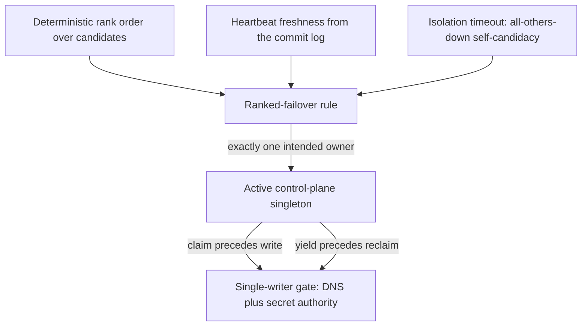
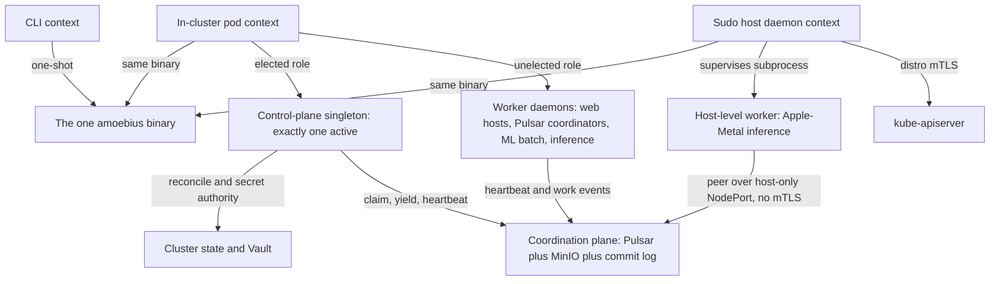

# Daemon Topology

**Status**: Authoritative source
**Supersedes**: N/A
**Referenced by**: documents/engineering/README.md, documents/engineering/chaos_failover_doctrine.md, documents/engineering/cluster_lifecycle_doctrine.md, documents/engineering/host_cluster_comms_doctrine.md, documents/engineering/manifest_generation_doctrine.md, documents/engineering/network_fabric_doctrine.md, documents/engineering/pulsar_client_doctrine.md, documents/engineering/pulumi_iac_doctrine.md, documents/engineering/substrate_doctrine.md, documents/engineering/testing_doctrine.md
**Generated sections**: none

> **Purpose**: Single Source of Truth for the one amoebius binary's three runtime contexts (CLI / sudo host-daemon / in-cluster pod) and its daemon role taxonomy — exactly one elected control-plane singleton with total authority over the cluster and its secrets, plus N unelected worker daemons — and the shape (not the proof) of the leadership election that picks the singleton.

---

## 1. One binary, three contexts

**Everything amoebius does is the same executable.** There is no "CLI package" and a separate "daemon
package"; there is one Haskell binary that *runs* in three different ways:

| Context | How it runs | What it is for |
|---------|-------------|----------------|
| **CLI tool** | A one-shot invocation on a host, exits when done | Operator commands, `bootstrap`, reconcile triggers, status queries |
| **Sudo host daemon** | A long-running host process with `sudo` powers | Bring up the distro (kind / rke2), install host tooling, talk to `kube-apiserver` over distro mTLS, **supervise host-level worker subprocesses** |
| **In-cluster pod** | Deployed as a generated typed manifest (the typed reconciler, no Helm) inside the cluster | Hosts the **control-plane singleton role** (§3) *or* a **worker role** (§4) |

The **same-binary policy** is generalized directly from the prodbox sibling
(`/home/matthewnowak/prodbox/documents/engineering/distributed_gateway_architecture.md` → "Same-binary
policy"). The payoff is not stylistic — it is structural:

- **One distribution artifact, one dependency closure**, built once from the substrate `bootstrap.sh`
  against the pinned toolchain (GHC **9.12.4**, Cabal 3.16.1.0 — the
  [DEVELOPMENT_PLAN](../../DEVELOPMENT_PLAN/README.md) pin).
- **One config loader, one logger, one error type, one set of types.** A daemon and a CLI command share
  the `Command` ADT, the structured-error type, and the Dhall decoder — there is nothing to keep in sync
  between two codebases.
- **The CLI introspects its own daemons.** Daemon-launching commands are ordinary `Command` constructors
  that appear in `--help` and the generated docs like any other; a daemon does not own a second argv
  parser. This is the prodbox **daemon-as-Command** pattern.

The *constituent behaviours* of the binary map onto the role taxonomy below: **prodbox** is the root
single-node control-plane behaviour (§3), **infernix** + **jitML** are the ML worker roles (§4),
**hostbootstrap** is the bootstrap + DSL-`chain` core that the host daemon drives, and **mattandjames** is
the application logic a web-service worker hosts ([README](../../README.md);
[DEVELOPMENT_PLAN](../../DEVELOPMENT_PLAN/README.md)). They are libraries inside one binary, not separate
products.

This document owns *which contexts exist and what each is for*. **How** the host daemon communicates — the
distro-mTLS path to `kube-apiserver`, and the host-only NodePort peering with no mTLS — is owned by
[host_cluster_comms_doctrine.md](./host_cluster_comms_doctrine.md). The **substrate** mechanics behind the
sudo host daemon — substrate detection, `bootstrap.sh`, host (non-containerized) worker *nodes*, and the
no-environment-variables / no-`PATH` lazy-tool-ensure contract — are owned by
[substrate_doctrine.md](./substrate_doctrine.md).

---

## 2. Context × role: an orthogonal grid

The single most useful mental model in this doctrine: **"where the binary runs" (context) and "what job it
is doing" (role) are independent axes.** Confusing them is the bug this section prevents — "the in-cluster
pod" is not a role, and "the control-plane singleton" is not a context.

|                         | **Control-plane singleton role** | **Worker role** |
|-------------------------|----------------------------------|-----------------|
| **CLI context**         | — (a CLI run is not a daemon)     | — |
| **Sudo host daemon**    | Pre-cluster bootstrap *acts on behalf of* the future singleton, then hands off | Supervises host-level workers (e.g. Apple-Metal inference, §4) |
| **In-cluster pod**      | **Exactly one active**, elected (§3) | **N**, unelected (§4) |

Two facts fall out of the grid:

- **The control-plane singleton is always an in-cluster role.** A cluster's brain lives *in* the cluster it
  governs. Before that cluster exists, the **sudo host daemon** does the bootstrap work that brings the
  first singleton into being (this is the prodbox root single-node story), then defers to it — the host
  daemon is the *midwife*, not the brain.
- **Worker daemons run in both daemon contexts.** Most workers are in-cluster pods; a few must be
  host-level subprocesses because their hardware cannot be containerized (Apple-Metal GPU work). A host-level worker is the **same binary in the worker role under the
  host-daemon context**, supervised as a subprocess.

Which roles run, how many replicas each gets, and which workers are host-level versus in-cluster are all
**deployment-rules** decisions, never application logic — that orthogonal DSL split is owned by
[app_vs_deployment_doctrine.md](./app_vs_deployment_doctrine.md).

---

## 3. The control-plane singleton — exactly one, elected

**Every cluster has exactly one brain.** Exactly one daemon at a time holds **total authority over the
cluster and its secrets**: it runs the reconcile loop that drives the live cluster toward the global
`.dhall`, and it is the cluster's secret authority. This role **is the prodbox elected-gateway / root
single-node control-plane behaviour, generalized** from "owns the public DNS record" to "owns the whole
cluster" ([README](../../README.md): *prodbox = the root single-node control-plane behaviour*).

### 3.1 "Exactly one pod" reconciled with HA-always

The in-cluster daemon is a singleton service daemon (**exactly one pod**), yet
the platform invariant is **HA always — including `replicas=1`**
([platform_services_doctrine.md §2](./platform_services_doctrine.md)). These are not in tension once you
read "exactly one pod" as **exactly one *active* (elected) singleton**, not "the chart only ever schedules
one replica":

- The control-plane daemon is deployed by an **HA chart at a configurable replica count** — N candidate
  pods, each a ranked election candidate. This mirrors the prodbox gateway chart, which renders **one
  Deployment per ranked node** and elects one owner among them.
- **Election guarantees exactly one *active* singleton** at a time; the other candidates are warm standbys
  that take over on failure (§5).
- At the **root single-node case** (`replicas=1`, the laptop kind / single-node rke2), the population is
  one: the sole candidate self-elects. This is the **degenerate single-rank** instance of the same protocol
  — exactly the prodbox home single-host shared-fate case — not a second, hand-special-cased "dev"
  topology.

### 3.2 What "total authority over the cluster and its secrets" cashes out to

- **Cluster authority.** The active singleton runs the idempotent `discover → diff → enact → re-observe`
  reconciler that owns bring-up, spawn, dynamic node provisioning, and teardown — owned by
  [cluster_lifecycle_doctrine.md §9](./cluster_lifecycle_doctrine.md), which names this doc as the owner of
  *who runs* that loop. It is also the single writer of the cluster's one canonical mutable external
  surface — the public DNS record for the cluster gateway (route53), gated by the claim/yield discipline of
  §5.
- **Secret authority.** The singleton is the in-cluster principal that **operates Vault** — it is the only
  role that holds cluster-wide secret authority. The Vault *model* it operates — fail-closed unseal, the
  root password-encrypted unseal, the parent-injects-secrets-into-the-child's-Vault contract, the root PKI
  trust anchor, and the secrets-are-names-only `SecretRef` contract — is owned in full by
  [vault_pki_doctrine.md](./vault_pki_doctrine.md). This doc owns only the fact that **secret authority is
  fused to the elected singleton**: there is no second writer of cluster secrets, and a standby candidate
  has no secret authority until it wins the election.

Fusing cluster control and secret authority into a *single elected role* is what makes "one brain per
cluster" enforceable: there is never a moment when two daemons both believe they may reconcile the cluster
or mint its secrets. *That* this fusion is safe — that the election never produces two simultaneous active
singletons — is a correctness obligation, not something this section asserts; see §5 and the honesty note
there.

---

## 4. Worker daemons — N, unelected

**If the singleton is the brain, the workers are the muscle.** A worker daemon does bounded, horizontally
scalable work; it is **not** elected, holds **no** cluster-wide authority, and there can be **many** of
each kind. The canonical worker kinds:

| Worker kind | What it does | Constituent library |
|-------------|--------------|---------------------|
| **Web-service host** | Hosts an amoebius app's services behind the cluster edge | **mattandjames** (application logic) |
| **Pulsar topic-lifecycle coordinator** | Drives an app's declared topic lifecycles (create / retention / teardown) | the DSL + [pulsar_client_doctrine.md](./pulsar_client_doctrine.md) |
| **ML batch coordinator** | Schedules and tracks batch ML workflows | **infernix** / **jitML** |
| **Inference engine** | Serves model inference — **in-cluster on CUDA, host-level on Apple Metal** | **infernix** / **jitML** |

Properties shared by all workers:

- **Unelected and horizontally scaled.** Workers do not run a leadership election among themselves. They
  coordinate through the shared **coordination plane** — Pulsar + MinIO + the commit log (§5) — whose
  intra-system consensus is *delegated* to those systems, not re-proved by amoebius
  ([platform_services_doctrine.md §6, §8](./platform_services_doctrine.md)). A Pulsar topic-lifecycle
  coordinator that needs single-consumer semantics gets it from Pulsar's subscription model and the
  at-least-once + dedup discipline ([pulsar_client_doctrine.md](./pulsar_client_doctrine.md)), not from a
  bespoke amoebius election.
- **HA like everything else.** A worker Deployment runs the HA chart at a configurable replica count, even
  at `replicas=1` ([platform_services_doctrine.md §2](./platform_services_doctrine.md)). Every worker
  container declares explicit CPU and RAM ([platform_services_doctrine.md §10](./platform_services_doctrine.md)).
- **Host-level workers are subprocesses, not pods.** When hardware forbids containerization (Apple-Metal
  unified-memory inference, CUDA stacks that do not run performantly under WSL2), the worker runs as a
  **host subprocess supervised by the sudo host daemon** (§1). It reaches in-cluster MinIO and Pulsar as a
  **peer over a host-only NodePort with no mTLS** — localhost only, no WAN or LAN — owned by
  [host_cluster_comms_doctrine.md](./host_cluster_comms_doctrine.md). It discovers its host tooling lazily
  through the substrate's package manager and invokes it by full path, never through `PATH`
  ([substrate_doctrine.md](./substrate_doctrine.md)).

> **Honesty.** The Pulsar / ML / inference worker roles are **new relative to prodbox** — prodbox had no
> Pulsar and no ML workers. Everything in this section is forward design intent for the relevant phase, not
> an inherited-proven behaviour; status and gates live only in
> [../../DEVELOPMENT_PLAN/README.md](../../DEVELOPMENT_PLAN/README.md)
> ([documentation_standards.md §6](../documentation_standards.md)).

---

## 5. Leadership election — the mechanism (the proof lives elsewhere)

**This section says *how the one brain is chosen*. It does not — and may not — claim that the choice is
*safe*.** The correctness of the election (that there is never more than one active singleton, that an
isolated survivor eventually takes over, that the single writer to DNS and secrets is unique) is a formal
proof obligation owned by [chaos_failover_doctrine.md](./chaos_failover_doctrine.md). This doctrine owns the
*shape*; that doctrine owns the *proof*.

### 5.1 The coordination plane: Pulsar + MinIO + the commit log

All coordination among amoebius daemons — heartbeats, ownership transitions, and work — flows through one
plane: **Pulsar + MinIO + an append-only, hash-chained, signed commit log.** The commit-log discipline is
lifted directly from the prodbox gateway daemon
(`/home/matthewnowak/prodbox/src/Prodbox/Gateway/{Types,Daemon}.hs`): events are **hash-chained and signed
by their emitter**, merged **idempotently by event hash** (`appendIfNew`), and ownership is derived from the
unique event set. The event classes carry over: `heartbeat`, `claim`, `yield`, and domain events.

The one deliberate change from prodbox: **transport.** Prodbox kept its commit log as an in-memory
anti-entropy gossip log pushed over signed HTTP between gateway peers. amoebius lifts the *same event and
ownership discipline* onto the standard platform backbone — **Pulsar** for the live event stream (native
TCP binary protocol, **no WebSockets** — [pulsar_client_doctrine.md](./pulsar_client_doctrine.md)) and
**MinIO** for durable log segments. This keeps the idempotent-by-hash, signed, hash-chained contract while
reusing systems that already do their own consensus.

> **Honesty.** Carrying the commit log over Pulsar + MinIO is **forward design, new vs prodbox** — prodbox
> deliberately did *not* use a durable queue for its gateway log. The signed/hash-chained/idempotent
> discipline is proven *in prodbox over its HTTP gossip transport*; that is evidence from a sibling system,
> not a tested amoebius result.

### 5.2 The ranked-failover rule

Election uses a **safe-by-construction ranked-failover rule** — the only rule family prodbox admits, chosen
because it has a machine-checkable invariant. Its inputs and output:

- **Inputs:** a deterministic total order over the candidate daemons (from the cluster membership /
  topology), **heartbeat freshness** read from the commit log, and the rule's timeouts.
- **Output:** **exactly one** intended active singleton for a given observed state snapshot.
- **Tie-break is fixed:** `(rank, node_id)` lexicographic — never ambiguous.
- **Isolation failsafe:** if a candidate sees no fresh heartbeat from any peer for the isolation timeout, it
  becomes a self-candidate. This is the "all others down → the survivor takes over" guarantee, and it is
  exactly the prodbox `SingletonTakeover` requirement.

### 5.3 Ownership transitions and the single-writer gate

Ownership moves are recorded as signed events, and the **write gate** mirrors prodbox's `canWriteDns`
predicate generalized to the singleton's whole authority:

- On the non-owner → owner transition the winner emits a signed **`claim`**; on owner → non-owner it emits a
  signed **`yield`**. A `yield` from the old owner is ordered before a `claim` from the new owner in the
  same recomputation cycle.
- A daemon may exercise singleton authority (write DNS, act as secret authority) **only** when the election
  picks it **and** its most recent claim/yield in the commit log is a `claim` — so a stale, yielded
  candidate cannot reclaim authority without first observing a fresh `claim` from itself superseding its own
  `yield`. This is **claim-precedes-write** and **yield-precedes-reclaim**.
- **Topology promotion is restart-based.** Cluster membership / rank is boot configuration, not a live knob;
  adopting a newer topology is a drain-and-restart, never an in-process version bump — the prodbox
  refuse-to-reclaim-while-behind gate.

### 5.4 The safety boundary, stated honestly

In a fully asynchronous system with partitions and no consensus primitive, you **cannot** have both
absolute no-two-leaders safety *and* always-available autonomous failover — a fundamental distributed-systems
limit. amoebius inherits prodbox's explicit choice: under severe partition uncertainty the design is
**availability-first** — an isolated candidate self-elects and keeps serving, accepting a *bounded,
self-healing* split rather than failing closed. The rule schema can forbid ambiguous rule forms, but it
cannot bypass the impossibility result.

> **Honesty.** The single-writer / no-two-active-singletons safety property is the same Byzantine-class
> obligation prodbox model-checks in TLA+ (`UniqueOwner`, `NoTugOfWar`, `SingletonTakeover`). That is a
> **proof in prodbox over the prodbox model**, and **evidence**, not proof, for amoebius. The amoebius
> formal model, its correspondence, and its proven/tested/assumed ledger — for **both** the intra-cluster
> control-plane election and the asynchronous cross-cluster gateway-failover "Second Axis" — are owned by
> [chaos_failover_doctrine.md](./chaos_failover_doctrine.md). This section must never report that election
> correctness as proven in amoebius.

---

## 6. The shared daemon spine

Every long-running role above — singleton or worker — runs the **same daemon lifecycle**, so there is one
spine to learn, observe, and test. The deep, prose-level discipline is owned by the prodbox sibling
(`/home/matthewnowak/prodbox/documents/engineering/distributed_gateway_architecture.md` → "Daemon
Lifecycle"); this doc records only the contract amoebius daemons share:

- **Lifecycle:** `load → prereq → acquire → ready → serve → drain → exit`, expressed as nested `bracket` /
  `withAsync`. Fail-fast on bad config; bounded, signal-driven drain on SIGTERM/SIGINT; clean release on
  every exit path. `forkIO` is forbidden in daemon code.
- **Readiness and observability:** every daemon exposes `/healthz`, `/readyz`, and `/metrics`. Filesystem
  readiness markers, `sd_notify`, and `threadDelay` "wait long enough" probes are forbidden. Logging is
  structured JSON to stderr.
- **Boot vs live config:** configuration is a single Dhall file; live fields hot-reload via atomic STM swap
  on a file-watch, boot fields trigger a drain-and-restart so the supervisor relaunches against the new
  file. No `PATH`, no `PRODBOX_*`-style environment-variable precedence on supported paths
  ([substrate_doctrine.md](./substrate_doctrine.md) for the no-env/no-`PATH` contract).

> **Honesty.** This spine is **proven in prodbox**; for amoebius it is design intent inherited from a
> sibling, not a tested amoebius result.

---

## 7. Wiring: who talks to whom

The topology, in one picture. Note the carve-out: the singleton and the host daemon do **not** enter
through the wild-ingress edge — that path (LoadBalancer → Envoy/Gateway-API → Keycloak, which owns all wild
ingress) is owned by [platform_services_doctrine.md §9](./platform_services_doctrine.md). Daemon-to-daemon
control traffic rides the coordination plane and the host-only carve-out instead.

---

## 8. Planning ownership

This document is normative daemon-topology doctrine only. Delivery sequencing, completion status,
validation gates, and remaining work are owned by
[../../DEVELOPMENT_PLAN/README.md](../../DEVELOPMENT_PLAN/README.md) and never restated here. For orientation
only (the plan is authoritative): the contexts and the same-binary spine ride **Phase 1**; the in-cluster
**control-plane singleton** lands in **Phase 3** (per
[cluster_lifecycle_doctrine.md §10](./cluster_lifecycle_doctrine.md)); and the **election correctness** plus
cross-cluster gateway failover are owned, modeled, and gated by
[chaos_failover_doctrine.md](./chaos_failover_doctrine.md) in the failover phase. This doc states the target
shape and links back for status.

---

## Cross-references

- [Engineering Doctrine Index](./README.md)
- [Host ↔ Cluster Comms Doctrine](./host_cluster_comms_doctrine.md)
- [Chaos / Failover Doctrine](./chaos_failover_doctrine.md)
- [Substrate Doctrine](./substrate_doctrine.md)
- [Vault / PKI Doctrine](./vault_pki_doctrine.md)
- [Platform Services Doctrine](./platform_services_doctrine.md)
- [Cluster Lifecycle Doctrine](./cluster_lifecycle_doctrine.md)
- [App vs Deployment Doctrine](./app_vs_deployment_doctrine.md)
- [Pulsar Client Doctrine](./pulsar_client_doctrine.md)
- [Resource Capacity Doctrine](./resource_capacity_doctrine.md) — the control-plane singleton runs the capacity fold at decode
- [Development Plan](../../DEVELOPMENT_PLAN/README.md)
- [Documentation Standards](../documentation_standards.md)
