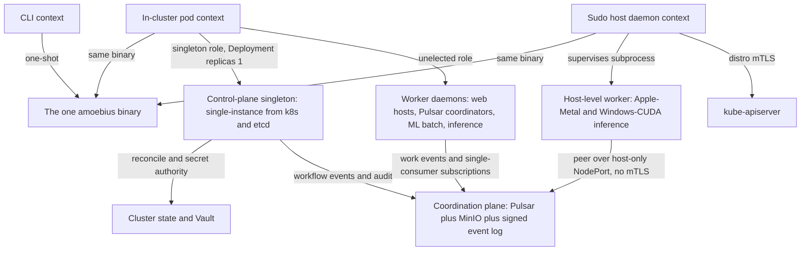

# Daemon Topology

**Status**: Authoritative source
**Supersedes**: N/A
**Referenced by**: DEVELOPMENT_PLAN/README.md, DEVELOPMENT_PLAN/legacy_tracking_for_deletion.md, DEVELOPMENT_PLAN/overview.md, DEVELOPMENT_PLAN/phase_00_documentation_suite.md, DEVELOPMENT_PLAN/phase_03_gateway_migration_model.md, DEVELOPMENT_PLAN/phase_16_renderer_reconciler.md, DEVELOPMENT_PLAN/phase_22_live_dsl_singleton.md, DEVELOPMENT_PLAN/phase_23_app_tenancy.md, DEVELOPMENT_PLAN/phase_24_pulsar_client.md, DEVELOPMENT_PLAN/phase_25_content_store_workflow.md, DEVELOPMENT_PLAN/phase_30_provider_clusters.md, DEVELOPMENT_PLAN/phase_34_jitml_lift_cuda.md, DEVELOPMENT_PLAN/phase_36_test_topology_dsl.md, DEVELOPMENT_PLAN/phase_37_spa_live_deploy.md, DEVELOPMENT_PLAN/substrates.md, DEVELOPMENT_PLAN/system_components.md, documents/engineering/README.md, documents/engineering/bootstrap_sequence_doctrine.md, documents/engineering/capability_extension_doctrine.md, documents/engineering/chaos_failover_doctrine.md, documents/engineering/cluster_lifecycle_doctrine.md, documents/engineering/content_addressing_doctrine.md, documents/engineering/deterministic_simulation_doctrine.md, documents/engineering/gateway_migration_model_doctrine.md, documents/engineering/host_cluster_comms_doctrine.md, documents/engineering/manifest_generation_doctrine.md, documents/engineering/monitoring_doctrine.md, documents/engineering/namespace_layout_doctrine.md, documents/engineering/network_fabric_doctrine.md, documents/engineering/platform_services_doctrine.md, documents/engineering/pulsar_client_doctrine.md, documents/engineering/pulumi_iac_doctrine.md, documents/engineering/readiness_ordering_doctrine.md, documents/engineering/release_lifecycle_doctrine.md, documents/engineering/resource_capacity_doctrine.md, documents/engineering/service_capability_doctrine.md, documents/engineering/storage_lifecycle_doctrine.md, documents/engineering/substrate_doctrine.md, documents/engineering/testing_doctrine.md, documents/engineering/tla_modelling_assumptions.md, documents/engineering/vault_pki_doctrine.md, documents/illegal_state/illegal_state_capacity.md, documents/illegal_state/illegal_state_lifecycle.md, documents/illegal_state/illegal_state_security.md, documents/illegal_state/illegal_state_techniques.md
**Generated sections**: none

> **Purpose**: Single Source of Truth for the one amoebius binary's three runtime contexts (CLI / sudo host-daemon / in-cluster pod) and its daemon role taxonomy — exactly one control-plane singleton with total authority over the cluster and its secrets, deployed as a Kubernetes **Deployment with `replicas=1`** whose single-instance guarantee is **delegated to k8s/etcd** (never a bespoke election), plus N unelected worker daemons.

---

## 1. One binary, three contexts

**Everything amoebius does is the same executable.** There is no "CLI package" and a separate "daemon
package"; there is one Haskell binary that *runs* in three different ways:

| Context | How it runs | What it is for |
|---------|-------------|----------------|
| **CLI tool** | A one-shot invocation on a host, exits when done | Operator commands, `bootstrap`, reconcile triggers, status queries |
| **Sudo host daemon** | A long-running host process with `sudo` powers | Bring up the distro (kind / rke2) — including installing the **root rke2 server** ([§2.1](#21-a-third-orthogonal-axis-rke2-serveragent-declared)) — install host tooling, talk to `kube-apiserver` over distro mTLS, **supervise host-level worker subprocesses** |
| **In-cluster pod** | Deployed as a generated typed manifest (the typed reconciler, no Helm) inside the cluster | Hosts the **control-plane singleton role** ([§3](#3-the-control-plane-singleton)) *or* a **worker role** ([§4](#4-worker-daemons--n-unelected)) |

The **same-binary policy** is generalized directly from the prodbox sibling
(`/home/matthewnowak/prodbox/documents/engineering/distributed_gateway_architecture.md` → "Same-binary
policy"). This is structural, not stylistic:

- **One distribution artifact, one dependency closure**, built once from the substrate midwife against the
  pinned toolchain (GHC **9.12.4**, Cabal 3.16.1.0 — the [DEVELOPMENT_PLAN](../../DEVELOPMENT_PLAN/README.md) pin).
- **One config loader, one logger, one error type, one set of types.** A daemon and a CLI command share
  the `Command` ADT, the structured-error type, and the Dhall decoder — there is nothing to keep in sync
  between two codebases.
- **The CLI introspects its own daemons.** Daemon-launching commands are ordinary `Command` constructors
  that appear in `--help` and the generated docs like any other; a daemon does not own a second argv
  parser. This is the prodbox **daemon-as-Command** pattern.

The *constituent behaviours* of the binary map onto the role taxonomy below: **prodbox** is the root
single-node control-plane behaviour ([§3](#3-the-control-plane-singleton)), **infernix** + **jitML** are the ML worker roles ([§4](#4-worker-daemons--n-unelected)),
and **hostbootstrap** is the bootstrap + DSL-`chain` core that the host daemon drives. The application
logic a web-service worker hosts is a **demo web app** — the single-page apps shipped with `infernix` and
`jitML` — an app-spec that USES those extensions rather than a library linked into the binary
([README](../../README.md); [DEVELOPMENT_PLAN](../../DEVELOPMENT_PLAN/README.md)). The named behaviours are
libraries inside one binary, not separate products.

This document owns *which contexts exist and what each is for*. **How** the host daemon communicates — the
distro-mTLS path to `kube-apiserver`, and the host-only NodePort peering with no mTLS — is owned by
[host_cluster_comms_doctrine.md](./host_cluster_comms_doctrine.md). The **substrate** mechanics behind the
sudo host daemon — substrate detection, the midwife, host (non-containerized) worker *nodes*, and the
no-environment-variables / no-`PATH` lazy-tool-ensure contract — are owned by
[substrate_doctrine.md](./substrate_doctrine.md).

---

## 2. Context × role: an orthogonal grid

**"where the binary runs" (context) and "what job it
is doing" (role) are independent axes.** Confusing them is the bug this section prevents — "the in-cluster
pod" is not a role, and "the control-plane singleton" is not a context.

|                         | **Control-plane singleton role** | **Worker role** |
|-------------------------|----------------------------------|-----------------|
| **CLI context**         | — (a CLI run is not a daemon)     | — |
| **Sudo host daemon**    | Pre-cluster bootstrap *acts on behalf of* the future singleton, then hands off | Supervises host-level workers (e.g. Apple-Metal and Windows-CUDA inference, [§4](#4-worker-daemons--n-unelected)) |
| **In-cluster pod**      | **Exactly one** — a Deployment `replicas=1`, single-instance from k8s/etcd ([§3](#3-the-control-plane-singleton)) | **N**, unelected ([§4](#4-worker-daemons--n-unelected)) |

Two facts fall out of the grid:

- **The control-plane singleton is always an in-cluster role.** A cluster's brain lives *in* the cluster it
  governs. Before that cluster exists, the **sudo host daemon** does the bootstrap work that brings the
  first singleton into being (this is the prodbox root single-node story), then defers to it — the host
  daemon is the *midwife*, not the brain.
- **Worker daemons run in both daemon contexts.** Most workers are in-cluster pods; a few must be
  host-level subprocesses because their hardware cannot be containerized (Apple-Metal GPU work, and
  native Windows-CUDA inference — CUDA does not run performantly under WSL2). A host-level worker is the **same binary in the worker role under the
  host-daemon context**, supervised as a subprocess.

Which roles run, how many replicas each gets, and which workers are host-level versus in-cluster are all
**deployment-rules** decisions, never application logic — that orthogonal DSL split is owned by
[app_vs_deployment_doctrine.md](./app_vs_deployment_doctrine.md).

### 2.1 A third orthogonal axis: rke2 server/agent (declared)

The grid above crosses two axes — **context** (where the binary runs) and **role** (what job it is doing).
The rke2 distro adds a **third, fully independent typed axis** that this doctrine must keep from fusing with
the other two:

- **(i) Substrate — DETECTED.** kind / rke2 / EKS, discovered at bring-up
  ([cluster_topology_doctrine.md §1](./cluster_topology_doctrine.md#1-two-axes-the-substrate-is-detected-the-engine-is-declared),
  [substrate_doctrine.md](./substrate_doctrine.md)).
- **(ii) amoebius daemon-role.** the control-plane singleton ([§3](#3-the-control-plane-singleton)) versus an unelected worker ([§4](#4-worker-daemons--n-unelected)). The singleton's
  single-instance is a k8s/etcd property ([§3.1](#31-exactly-one-pod-is-a-k8setcd-property-not-an-amoebius-election)), not an amoebius election, so this axis carries no
  election of its own.
- **(iii) rke2 server/agent — DECLARED.** which *nodes* carry the Kubernetes control plane
  (kube-apiserver + the etcd quorum) versus which are pure workload nodes. This is the `Rke2Servers` closed
  union — `Single` / `Ha3` / `Ha5`, the only legal odd etcd quorums {1,3,5} — plus an `agents` list, owned by
  [cluster_topology_doctrine.md §2, §4](./cluster_topology_doctrine.md#2-computeengine-a-closed-union-eks-a-first-class-arm). An even- or zero-server (no-quorum /
  split-brain) control plane has no constructor: **type-foreclosed unrepresentable**.

(Two further declared axes exist system-wide — environment dev/staging/prod, and the engine/model/kernel asset
tier — but they are owned by the release-lifecycle and content-addressing doctrines, not here; this document
is normative only about axis (iii)'s orthogonality to (i) and (ii).)

**The three axes never fuse.** An rke2 *server* node is **not** the amoebius control-plane singleton, and an
rke2 *agent* is **not** an amoebius worker. Axis (iii) is a property of *Kubernetes nodes* (which host runs
etcd / kube-apiserver); axis (ii) is a property of *amoebius daemon pods* (which pod holds cluster + secret
authority, [§3](#3-the-control-plane-singleton)). They are independent: a worker pod may be scheduled onto an rke2 server node, and the
singleton pod may be scheduled onto an rke2 agent — the Kubernetes scheduler places pods without regard to the
etcd quorum, and the singleton's node is chosen by the scheduler without regard to its rke2 kind. Axis (iii) is
equally independent of axis (i): rke2 server/agent is meaningful *only* on the rke2 substrate — it does not
exist on kind or on EKS (which owns its own managed control plane) — so a detected substrate never *implies* a
server/agent split.

**Enactment splits across exactly the two daemon contexts ([§1](#1-one-binary-three-contexts)).** This is the one place the rke2 axis touches
daemon topology:

- **The sudo host daemon installs the ROOT rke2 server** — the zero-secret single node
  `{ servers = Rke2Servers.Single host, agents = [] }`. This makes the [§2](#2-context--role-an-orthogonal-grid) *midwife* concrete: before any
  cluster exists there is no singleton yet, so the host daemon (acting on behalf of the future singleton)
  brings up the first `rke2-server`, then defers. This is the prodbox single-node `rke2-server` base —
  **sibling evidence, not an amoebius result** (prodbox's `Rke2.hs` proves the single-node install only).
- **The in-cluster singleton enacts child server/agent rollout over SSH.** Once kube-apiserver is up
  and the singleton pod is running, growing the cluster (further `Ha3` / `Ha5` servers, and all agents) is part
  of the singleton's cluster authority — the *dynamic node provisioning* of [§3.2](#32-what-total-authority-over-the-cluster-and-its-secrets-cashes-out-to), owned by
  [cluster_lifecycle_doctrine.md](./cluster_lifecycle_doctrine.md). It runs the **checkpoint-free
  tag-discovery host reconciler** — `create → tag → join-fabric → drain-by-tag`, home
  [pulumi_iac_doctrine.md §0](./pulumi_iac_doctrine.md#0-decision-record-why-pulumi-stays--and-why-that-is-not-the-helm-decision) — reaching each new host over SSH. The first server
  mints the `Rke2NodeToken` (a Vault-KV `SecretRef`, parent-minted, referenced by name); further servers and
  agents join via a `server:` URL + that token; rejoin is idempotent. This is a **reconcile, not a state
  machine**.

A **quorum change** (e.g. `Single → Ha3`) is a deliberate re-provision of the declared server set, **never** an
autoscale; a `ScalingPolicy` grows the `agents` list only. Because axis (iii) is *declared* — not detected — the
singleton never promotes a node from agent to server at runtime; it re-provisions against the new declaration.

> **Honesty.** Multi-node rke2 server/agent, etcd-HA, and the join-token flow are **Phase-N design intent** —
> net-new across the whole sibling family (hostbootstrap has zero rke2 code). Only the single-node
> `rke2-server` base is proven in the prodbox sibling; that is **sibling evidence, not a tested amoebius
> result**.

---

## 3. The control-plane singleton

**Every cluster has exactly one brain.** Exactly one daemon holds **total authority over the cluster and its
secrets**: it runs the reconcile loop that drives the live cluster toward the global `.dhall`, and it is the
cluster's secret authority. This role **is the prodbox root single-node control-plane behaviour, generalized**
from "owns the public DNS record" to "owns the whole cluster" ([README](../../README.md): *prodbox = the root
single-node control-plane behaviour*).

### 3.1 "Exactly one pod" is a k8s/etcd property, not an amoebius election

The control-plane daemon is a Kubernetes **Deployment with `replicas=1`.** It is **stateless at the pod level**
— it holds no PVC; its durable state is exclusively the Vault-enveloped MinIO bucket
([storage_lifecycle_doctrine.md §7.2](./storage_lifecycle_doctrine.md#72-amoebius-own-control-plane-state-is-the-minio-bucket-not-a-pvc)),
so a lost pod loses nothing and is simply rescheduled by k8s.

**Single-instance is delegated to k8s/etcd — amoebius runs no election of its own.** The Deployment controller
and etcd already guarantee the cluster converges to one running pod, restarting it elsewhere on node loss. A
bespoke ranked-failover election over a signed commit log would **re-implement the consensus etcd already
provides**, add a second coordination plane to prove correct, and deadlock at exactly the moment leadership is
most needed (cold-start, and the disaster-recovery of the very services such an election would run on). Amoebius
therefore does not build one:

- The steady state is **one pod**, kept so by the Deployment controller (etcd-backed). The singleton Deployment
  declares **`strategy: Recreate`**, never the default `RollingUpdate`: a rolling update briefly runs the old and
  new pods concurrently (`maxSurge` rounds to 1 at `replicas=1`), which would place two control-plane brains on
  the cluster during every spec change. `Recreate` terminates the old pod before starting the new one, so a
  *rollout* never doubles the singleton.
- A rollout is not the only doubling risk. Under a **node partition** the ReplicaSet starts a replacement pod
  after the unreachable node's pod-eviction timeout while the original may still be running on the partitioned
  node — a hazard `Recreate` does not close (only confirmed-deletion semantics do). Because the singleton takes
  non-idempotent **external** actions (route53, Vault), it therefore **always** holds a **Kubernetes `Lease`** —
  the standard etcd-backed leader-election object (the client-go pattern), **not** an amoebius protocol — as its
  at-most-one-writer mutual exclusion. The criterion is explicit: **any role that takes non-idempotent external
  effects runs under a `Lease`**; for the singleton the Lease is mandatory, not an "if ever needed" option. This
  uses etcd's consensus through the k8s API; it does not duplicate it. (A `StatefulSet`, which never creates a
  replacement until the old pod is confirmed deleted, is the alternative shape that closes the partition case at
  the workload level; amoebius uses the Deployment-`Recreate`-plus-`Lease` composition.)
- There are **no warm-standby singleton pods and no candidate population.** "HA always — including
  `replicas=1`" ([platform_services_doctrine.md §2](./platform_services_doctrine.md#2-ha-always--including-replicas1))
  is satisfied by k8s rescheduling the single pod, not by a second pod waiting to be elected.

This is the resolution of the standing question (`notes.txt`) of whether the singleton should run custom
election logic: **it should not — single-instance is a k8s/etcd concern, and amoebius does not duplicate etcd.**

**One honest residue, named: a `Lease` is mutual exclusion, not output fencing.** The Deployment + `Lease`
guarantee at-most-one *lease-holder*; they do **not**, by themselves, fence a stale *external* side effect. A
pod that holds the lease, is stop-the-world-GC-paused or partitioned past the lease's expiry, and then resumes
can still issue a route53 or Vault write while a freshly-elected pod is also writing — the classic fencing-token
gap (Kleppmann, *How to do distributed locking*), and exactly what `notes.txt` flags when it observes the
singleton's authority is *external side effects that validate no broker epoch*. This window is **not** a second
election obligation — amoebius runs no election — but it is a named **assumed** premise, sibling to the R8
synchrony premise ([chaos_failover_doctrine.md §13](./chaos_failover_doctrine.md#13-the-supporting-rules--the-conditions-the-moves-need)):
its safety rests on the writes being idempotent / last-writer-safe (route53 is a short-TTL record the migration
protocol already tolerates being briefly contended — [§3.2](#32-what-total-authority-over-the-cluster-and-its-secrets-cashes-out-to);
Vault operations are idempotent or Vault-token-fenced) and on the reconciler re-converging within the TTL. It
is recorded assumed, monitored, never reported as proven — the honest counterpart to "single-instance is
delegated."

### 3.2 What "total authority over the cluster and its secrets" cashes out to

- **Cluster authority.** The singleton runs the idempotent `discover → diff → enact → re-observe`
  reconciler that owns bring-up, spawn, dynamic node provisioning, and teardown — owned by
  [cluster_lifecycle_doctrine.md §9](./cluster_lifecycle_doctrine.md#9-how-bring-up-and-teardown-are-implemented-the-reconciler-not-a-state-machine), which names this doc as the owner of
  *who runs* that loop.
- **Admin-surface authority.** After the host-daemon→singleton handoff, the singleton is the **sole control
  surface**: the operator CLI drives the cluster only through the singleton's **admin REST API**
  (`vault init/unseal`, `dhall update`) over the amoebius NodePort — the singleton's **node-local/private admin
  channel**, never the wild edge — and the host binary's channel-1 kube-apiserver access is retired to
  **bootstrap-only**. The sequence, the handoff, and the admin plane are owned by
  [bootstrap_sequence_doctrine.md](./bootstrap_sequence_doctrine.md#5-the-admin-control-plane-the-cli--the-singleton-rest-api).
- **Secret authority.** The singleton is the in-cluster principal that **operates Vault** — the only role that
  holds cluster-wide secret authority. The Vault *model* it operates (fail-closed unseal, root
  password-encrypted unseal, parent-injects-secrets-into-the-child's-Vault, the root PKI trust anchor, the
  secrets-are-names-only `SecretRef` contract) is owned in full by [vault_pki_doctrine.md](./vault_pki_doctrine.md).

Fusing cluster control and secret authority into a *single role* is what makes "one brain per cluster"
enforceable, and single-instance of that role is k8s/etcd's job ([§3.1](#31-exactly-one-pod-is-a-k8setcd-property-not-an-amoebius-election)).

**Where the single-writer question is amoebius's own: the cross-cluster gateway.** The singleton's authority is
exercised as **external side effects** — a route53 DNS write for the cluster gateway, and Vault operations. The
"intra-system consensus is delegated, not re-proved" posture ([§4](#4-worker-daemons--n-unelected)) covers the *internal* plane (Pulsar /
MinIO / Postgres); **intra-cluster** single-writer of these effects is delegated to k8s/etcd
([§3.1](#31-exactly-one-pod-is-a-k8setcd-property-not-an-amoebius-election)). The one single-writer question that is *irreducibly amoebius* is **cross-cluster**: which cluster in
a forest owns the wild-ingress gateway DNS record, and how that ownership moves. That is the **gateway
migration** — both the `Planned` handover and the `Failover` takeover — and it is amoebius's sole
simulation/proof obligation, owned by [gateway_migration_model_doctrine.md](./gateway_migration_model_doctrine.md)
and [gateway_migration_doctrine.md](./gateway_migration_doctrine.md). route53 has no compare-and-swap, so the
cross-cluster record is a short-TTL A-record with availability-first bounded rebind — modeled there, not here.

---

## 4. Worker daemons — N, unelected

**If the singleton is the brain, the workers are the muscle.** A worker daemon does bounded, horizontally
scalable work; it is **not** elected, holds **no** cluster-wide authority, and there can be **many** of
each kind. The canonical worker kinds:

| Worker kind | What it does | Constituent library |
|-------------|--------------|---------------------|
| **Web-service host** | Hosts an amoebius app's services behind the cluster edge | a demo web app (application logic) |
| **Pulsar topic-lifecycle coordinator** | Drives an app's declared topic lifecycles (create / retention / teardown) | the DSL + [pulsar_client_doctrine.md](./pulsar_client_doctrine.md) |
| **ML batch coordinator** | Schedules and tracks batch ML workflows | **infernix** / **jitML** |
| **Inference engine** | Serves model inference — **in-cluster on linux-CUDA; host-level on Apple-Metal and Windows-CUDA** | **infernix** / **jitML** |

Properties shared by all workers:

- **Unelected and horizontally scaled.** Workers do not run a leadership election among themselves. They
  coordinate through the shared **coordination plane** — Pulsar + MinIO + the commit log ([§5](#5-single-instance-and-coordination--delegated-not-elected)) — whose
  intra-system consensus is *delegated* to those systems, not re-proved by amoebius
  ([platform_services_doctrine.md §6, §8](./platform_services_doctrine.md#6-pulsar--the-event-and-workflow-backbone-new-vs-prodbox)). A Pulsar topic-lifecycle
  coordinator that needs single-consumer semantics gets it from Pulsar's subscription model and the
  at-least-once + dedup discipline ([pulsar_client_doctrine.md](./pulsar_client_doctrine.md)), not from a
  bespoke amoebius election.
- **HA like everything else.** A worker Deployment runs the HA chart at a configurable replica count, even
  at `replicas=1` ([platform_services_doctrine.md §2](./platform_services_doctrine.md#2-ha-always--including-replicas1)). Every worker
  container declares explicit CPU and RAM ([platform_services_doctrine.md §10](./platform_services_doctrine.md#10-every-container-declares-cpu-and-ram)).
- **Host-level workers are subprocesses, not pods.** When hardware forbids containerization — **Apple-Metal
  unified-memory inference and native Windows-CUDA inference** (CUDA does not run performantly under WSL2,
  [substrate_doctrine.md](./substrate_doctrine.md)) — the worker runs as a
  **host subprocess supervised by the sudo host daemon** ([§1](#1-one-binary-three-contexts)). It reaches in-cluster MinIO and Pulsar as a
  **peer over a host-only NodePort with no mTLS** — localhost only, no WAN or LAN — owned by
  [host_cluster_comms_doctrine.md](./host_cluster_comms_doctrine.md). It discovers its host tooling lazily
  through the substrate's package manager and invokes it by full path, never through `PATH`
  ([substrate_doctrine.md](./substrate_doctrine.md)). Apple-Metal and Windows-CUDA are the **same host-worker
  shape** — a native subprocess reaching the cluster only over the host-only NodePort — differing only in
  engine offering and bootstrap ([§4.1](#41-the-engine-offering-vs-the-node-hardware-in-cluster-pod-or-host-subprocess)); their parity is **role parity, not evidence parity**. The on-host
  Windows-CUDA build/run path is **forward design intent with no sibling evidence and no build-shape doc**
  (unlike Apple-Metal's `apple_metal_headless_builds.md`), inheriting the honesty framing below.

> **Honesty.** The Pulsar / ML / inference worker roles are **new relative to prodbox** — prodbox had no
> Pulsar and no ML workers. Everything in this section is forward design intent for the relevant phase, not
> an inherited-proven behaviour; status and gates live only in
> [../../DEVELOPMENT_PLAN/README.md](../../DEVELOPMENT_PLAN/README.md)
> ([documentation_standards.md §6](../documentation_standards.md#6-honesty-the-proventestedassumed-discipline)).

### 4.1 The engine offering vs the node hardware: in-cluster pod or host subprocess

A worker's **engine offering** — the cluster-facing `EngineRuntime` it presents (`AppleMetal | Cuda |
LinuxCpu`) — is a **quotient of the detected substrate**, not a free choice: which offering a node makes is
**projected from** its substrate, and that quotient and its bootstrap/wire mapping are owned in full by
[service_capability_doctrine.md §4.1](./service_capability_doctrine.md#41-the-inferenceengine-capability--the-engine-is-substrate-selected-and-jit-resolved-never-authored).
This doctrine does **not** restate that mapping; it records the one **daemon-context consequence** the
quotient forces on the worker taxonomy.

The consequence: one engine offering is realized in **different daemon contexts** ([§1](#1-one-binary-three-contexts)) according to the
**node hardware / bootstrap** — *how* the offering is stood up and wired:

- A **`Cuda`** offering is an **in-cluster pod** when the node hardware is `linux-cuda` (NVIDIA container
  runtime, reached over in-cluster mTLS), and a **host subprocess** when the node hardware is `windows`
  (native — CUDA does not run under WSL2 — reached only over the host-only NodePort). One offering, two
  bootstraps.
- An **`AppleMetal`** offering is always a **host subprocess** (`apple` node hardware; unified-memory GPU
  work cannot be containerized).
- A **`LinuxCpu`** offering is always an **in-cluster pod**.

So the same engine offering can span both daemon contexts, decided by node hardware, and is **never authored
free of the substrate**. These two facts — **engine offering** and **node hardware** — are a finer split of
*which worker realization the substrate projects*; they are **not** the context / role / rke2 axes of
[§2.1](#21-a-third-orthogonal-axis-rke2-serveragent-declared) ("the three axes never fuse") and must not be
conflated with `role` or `substrate`.

### 4.2 The accelerator-owner worker: wholesale per-node ownership, a typed per-node singleton

The inference and training worker kinds above run on nodes carrying accelerators (CUDA GPUs / Apple-Metal).
This round introduces the rule for how those accelerators are **owned**: a node's accelerators are owned
**wholesale** by a single **accelerator-owner worker** on that node — substrate-independent, whether the
owner is an in-cluster pod (`linux-cuda`) or a host subprocess (`windows` / `apple`, [§4.1](#41-the-engine-offering-vs-the-node-hardware-in-cluster-pod-or-host-subprocess)). Other pods may
use the node's leftover CPU and RAM but **never** its accelerators. This revises the earlier narrative in
which a GPU was a per-pod, indivisible bin-packable `Count`: accelerators are reached **only** through the
wholesale owner (the per-pod GPU request axis is removed — [resource_capacity_doctrine.md §3](./resource_capacity_doctrine.md#3-the-types-quantity-capacity-demand-budget)).

To make wholesale ownership a **typed** fact rather than a convention, this round introduces a **typed
per-node-singleton accelerator-owner worker kind** — a **DaemonSet-like node-affinity** worker, exactly one
per accelerator node — distinct from the N-replica *unelected* Deployment shape the other worker kinds use
([§4](#4-worker-daemons--n-unelected)). It is still **many across the cluster** (one per accelerator node), so "many of each kind"
holds; the type merely forbids **two on one node**. Because it admits **at most one owner per node**, "two
accelerator owners contending for one node's devices" and "a fractional / straddled accelerator claim" have
**no constructor: type-foreclosed unrepresentable**. The one owner **multiplexes training, serving, and Tier-3 JIT
compilation** on its node — which is what lets a node continuously train a model while serving it (the
continuous-training mode owned by content_addressing / dsl, [§4.3](#43-the-feed-sourced-continuous-trainer-single-writer-delegated)). The per-node-singleton is a k8s node-affinity
property (a DaemonSet places at most one pod per node), not an amoebius election.

Wholesale per-node accelerator ownership and the per-node-singleton invariant are the **SSoT of this
doctrine**; [resource_capacity_doctrine.md §4.1](./resource_capacity_doctrine.md#41-place-branches-static-proves-a-placement-dynamic-proves-a-growth-envelope) / [§3](./resource_capacity_doctrine.md#3-the-types-quantity-capacity-demand-budget) and the illegal-state catalog **consume** it.

> **Layer / honesty.** The at-most-one-owner-per-node foreclosure is **type-foreclosed** — a per-node-singleton type
> has no two-owner inhabitant; that the daemon **actually holds the node's devices at runtime** is
> **runtime-checked** runtime residue. The typed accelerator-owner worker kind is **forward design intent** — no
> sibling system stands up a DaemonSet-like accelerator owner today; status and gates live only in
> [../../DEVELOPMENT_PLAN/README.md](../../DEVELOPMENT_PLAN/README.md)
> ([documentation_standards.md §6](../documentation_standards.md#6-honesty-the-proventestedassumed-discipline)).

### 4.3 The Feed-sourced continuous trainer: single-writer delegated

Continuous / online training — training forever from a live Pulsar feed (the training-run topology owned by
content_addressing / dsl) — needs a **single authoritative writer** per feed so the model's committed pointer
never regresses. This round places that role with **no new machinery**: the continuous trainer is the
**existing ML batch coordinator worker** ([§4](#4-worker-daemons--n-unelected) — infernix / jitML), parameterized with a `Feed` data
source. It is **not** a new elected worker kind and is **not** folded into the control-plane singleton
([§3](#3-the-control-plane-singleton)) — routing every feed through the one cluster authority would bottleneck it, and single-writer
here is a per-feed concern, not cluster authority.

Single-writer is **delegated, not elected** — the same discipline the other workers use for single-consumer
semantics ("from Pulsar's subscription model … not a bespoke amoebius election", [§4](#4-worker-daemons--n-unelected)):

- **Liveness — at most one active trainer per feed** is a **Pulsar Exclusive / Failover subscription** on the
  feed topic ([pulsar_client_doctrine.md](./pulsar_client_doctrine.md)): automatic ranked failover on death,
  resume-from-`latest`.
- **Safety — a race-free `latest` pointer** is the content store's **ETag-CAS single atomic commit point**
  plus the typed **`AdvancePredicate`** ([content_addressing_doctrine.md §2](./content_addressing_doctrine.md#2-the-three-tier-store-blobs--manifests--pointers), [§5](./content_addressing_doctrine.md#5-confluence-content-addressed-data-crosses-cluster-boundaries-safely)) — a
  monotone, idempotent join, so even a bounded failover overlap of two trainers cannot corrupt or regress
  HEAD (the loser's CAS is resolved by `AdvancePredicate`).

So the Feed-sourced trainer is a **reuse**, not an election: an existing coordinator role + a per-feed Pulsar
Exclusive / Failover subscription + the CAS / `AdvancePredicate` commit point. A Continuous run is
single-cluster; other clusters **serve by replication** of the immutable checkpoints, never train a second
authority on the feed. The trainer's commit point is CAS-fenceable at MinIO and confluent (a monotone
`AdvancePredicate` absorbs a bounded two-writer overlap); the cross-cluster gateway authority
([§3.2](#32-what-total-authority-over-the-cluster-and-its-secrets-cashes-out-to)) is non-confluent and not
CAS-fenceable, which is exactly why *it* is the one modeled obligation and *this* is a delegation.

---

## 5. Single-instance and coordination — delegated, not elected

**This section says how single-instance and coordination are achieved without amoebius owning an election.**
The one cross-cluster single-writer question that *is* amoebius's own — gateway migration — is owned by
[gateway_migration_model_doctrine.md](./gateway_migration_model_doctrine.md), not here.

### 5.1 Single-instance is a k8s/etcd concern

The control-plane singleton's "exactly one pod" and the accelerator owner's "one per node" are **Kubernetes
placement properties**, backed by etcd, not amoebius protocols ([§3.1](#31-exactly-one-pod-is-a-k8setcd-property-not-an-amoebius-election), [§4.2](#42-the-accelerator-owner-worker-wholesale-per-node-ownership-a-typed-per-node-singleton)):
a `Deployment replicas=1` for the singleton, a DaemonSet-like node-affinity for the accelerator owner, and a
k8s `Lease` (the etcd-backed client-go leader-election object) wherever strict at-most-one-writer must survive a
rolling update or partition. **Amoebius builds no ranked-failover rule, no signed-commit-log election, and no
warm-standby candidate population.** Re-deriving consensus that etcd already provides would add a second
coordination plane to prove correct and would deadlock at cold-start and disaster-recovery; the design declines
to duplicate etcd.

### 5.2 The coordination plane is for worker events and audit, not leadership

Worker coordination and durable history still flow through one plane — **Pulsar + MinIO + an append-only,
hash-chained, signed event log** — but leadership is *not* derived from it. The commit-log discipline is lifted
from the prodbox gateway daemon (`/home/matthewnowak/prodbox/src/Prodbox/Gateway/{Types,Daemon}.hs`): events are
hash-chained and signed by their emitter, merged idempotently by event hash (`appendIfNew`). amoebius carries
the *same event and audit discipline* onto the standard backbone — **Pulsar** for the live event stream (native
TCP binary protocol, no WebSockets — [pulsar_client_doctrine.md](./pulsar_client_doctrine.md)) with Pulsar's own
bounded/tiered/retained topic lifecycle offloading to **MinIO/S3** as the cold tier — as the **workflow event
stream and audit trail**, not as an election substrate.

- **Worker single-consumer semantics come from Pulsar subscriptions** (`Exclusive` / `Failover`), never a
  bespoke election ([§4](#4-worker-daemons--n-unelected), [§4.3](#43-the-feed-sourced-continuous-trainer-single-writer-delegated)).
- **Operator read-models are projections.** A log-compacted topic read through a Pulsar TableView materializes
  operator-facing projections (e.g. the `workflow-health` read-model, `WorkflowName → SLOStatus`, produced
  inside the singleton's reconcile loop and read via `pb workflow health`). A TableView yields only `key →
  latest value`; it decides nothing about who leads, because nothing leads by election. The SLO obligation that
  feeds it is owned by [monitoring_doctrine.md](./monitoring_doctrine.md).

> **Honesty.** Carrying the event log over Pulsar + MinIO is **forward design, new vs prodbox** — prodbox
> deliberately did *not* use a durable queue for its gateway log. The signed/hash-chained/idempotent discipline
> is proven *in prodbox over its HTTP gossip transport*; that is evidence from a sibling system, not a tested
> amoebius result ([documentation_standards.md §6](../documentation_standards.md#6-honesty-the-proventestedassumed-discipline)).

---

## 6. The shared daemon spine

Every long-running role above — singleton or worker — runs the **same daemon lifecycle**, so there is one
spine to learn, observe, and test. The deep, prose-level discipline is owned by the prodbox sibling
(`/home/matthewnowak/prodbox/documents/engineering/distributed_gateway_architecture.md` → "Daemon
Lifecycle"); this doc records only the contract amoebius daemons share:

- **Lifecycle:** `load → prereq → acquire → ready → serve → drain → exit`, expressed as nested `bracket` /
  `withAsync`. Fail-fast on bad config; bounded, signal-driven drain on SIGTERM/SIGINT; clean release on
  every exit path. `forkIO` is forbidden in daemon code.
- **Readiness and observability:** every daemon exposes `/healthz`, `/readyz`, and `/metrics`. Filesystem
  readiness markers, `sd_notify`, and `threadDelay` "wait long enough" probes are forbidden. Logging is
  structured JSON to stderr.
- **Boot vs live frame config:** each daemon frame has one local `amoebius.dhall` `FrameConfig`. Live
  frame-local fields hot-reload via atomic STM swap on a file-watch; boot fields trigger a
  drain-and-restart so the supervisor relaunches against the new file. No `PATH`, no
  environment-variable precedence on supported paths ([substrate_doctrine.md](./substrate_doctrine.md) for the
  no-env/no-`PATH` contract). **That frame config arrives differently per context ([§1](#1-one-binary-three-contexts)):** a **CLI / host**
  binary reads the sibling `amoebius.dhall` written by the midwife; a binary **descending a bootstrap-lift
  frame** (VM/container) has it **streamed on `stdin` and written once before `exec`** — the parent's
  `context-init` mint ([dsl_doctrine.md §3](./dsl_doctrine.md#3-the-orchestration-surface-parameters-context-witness)); an **in-cluster pod** receives it as a rendered
  `ConfigMap` mount ([manifest_generation_doctrine.md](./manifest_generation_doctrine.md)). In every case a
  frame receives its frame config from its parent and never rewrites its own. The dynamic `InForceSpec` is a
  separate desired-state value updated through the singleton admin API and stored as a Vault-Transit-enveloped
  MinIO object/ref, not by this file-watch path.

> **Honesty.** This spine is **proven in prodbox**; for amoebius it is design intent inherited from a
> sibling, not a tested amoebius result.

---

## 7. Wiring: who talks to whom

The topology, in one picture. Note the carve-out: the singleton and the host daemon do **not** enter
through the wild-ingress edge — that path (LoadBalancer → Envoy/Gateway-API → Keycloak, which owns all wild
ingress) is owned by [platform_services_doctrine.md §9](./platform_services_doctrine.md#9-the-loadbalancer-and-the-single-wild-ingress-path). Daemon-to-daemon
control traffic rides the coordination plane and the host-only carve-out instead.

---

## 8. Planning ownership

This document is normative daemon-topology doctrine only. Delivery sequencing, completion status,
validation gates, and remaining work are owned by
[../../DEVELOPMENT_PLAN/README.md](../../DEVELOPMENT_PLAN/README.md) and never restated here. For orientation
only (the plan is authoritative): the contexts and the same-binary spine ride the bootstrap-kernel phase; the
in-cluster **control-plane singleton** lands with the live DSL deploy (per
[cluster_lifecycle_doctrine.md §10](./cluster_lifecycle_doctrine.md#10-planning-ownership)); single-instance is a
k8s/etcd property with nothing for amoebius to prove; and the **cross-cluster gateway migration** — the one
simulation/proof obligation — is owned, modeled, and gated by
[gateway_migration_model_doctrine.md](./gateway_migration_model_doctrine.md) and
[chaos_failover_doctrine.md](./chaos_failover_doctrine.md) in the multi-cluster phase. This doc states the target
shape and links back for status.

---

## Cross-references

- [Engineering Doctrine Index](./README.md)
- [Host ↔ Cluster Comms Doctrine](./host_cluster_comms_doctrine.md)
- [Gateway Migration Model Doctrine](./gateway_migration_model_doctrine.md) — the one cross-cluster single-writer obligation (both branches); intra-cluster single-instance is delegated to k8s/etcd
- [Chaos / Failover Doctrine](./chaos_failover_doctrine.md)
- [Substrate Doctrine](./substrate_doctrine.md)
- [Vault / PKI Doctrine](./vault_pki_doctrine.md)
- [Platform Services Doctrine](./platform_services_doctrine.md)
- [Cluster Lifecycle Doctrine](./cluster_lifecycle_doctrine.md) — owns the node-lifecycle enactment the singleton drives for child rke2 server/agent rollout ([§2.1](#21-a-third-orthogonal-axis-rke2-serveragent-declared))
- [Readiness Ordering Doctrine](./readiness_ordering_doctrine.md) — the [§6](#6-the-shared-daemon-spine) daemon-spine `/readyz` + no-`threadDelay`/`sd_notify`/marker rule is the daemon-tier instance of readiness-as-an-edge
- [Cluster Topology Doctrine](./cluster_topology_doctrine.md) — [§2](./cluster_topology_doctrine.md#2-computeengine-a-closed-union-eks-a-first-class-arm)/[§4](./cluster_topology_doctrine.md#4-topology-a-cluster-is-a-fold-over-its-nodes-and-cardinality-is-by-construction) the `Rke2Servers` closed union and the topology fold (the declared server/agent axis of [§2.1](#21-a-third-orthogonal-axis-rke2-serveragent-declared))
- [Pulumi IaC Doctrine](./pulumi_iac_doctrine.md) — [§0](./pulumi_iac_doctrine.md#0-decision-record-why-pulumi-stays--and-why-that-is-not-the-helm-decision) the checkpoint-free tag-discovery host reconciler (tier (b)) that enacts child rke2 rollout over SSH
- [App vs Deployment Doctrine](./app_vs_deployment_doctrine.md)
- [Pulsar Client Doctrine](./pulsar_client_doctrine.md)
- [Resource Capacity Doctrine](./resource_capacity_doctrine.md) — the control-plane singleton runs the capacity fold at decode; **consumes** the wholesale per-node accelerator ownership of [§4.2](#42-the-accelerator-owner-worker-wholesale-per-node-ownership-a-typed-per-node-singleton)
- [Service Capability Doctrine](./service_capability_doctrine.md) — [§4.1](./service_capability_doctrine.md#41-the-inferenceengine-capability--the-engine-is-substrate-selected-and-jit-resolved-never-authored) owns the substrate→`EngineRuntime` quotient whose pod-vs-host-subprocess consequence [§4.1](#41-the-engine-offering-vs-the-node-hardware-in-cluster-pod-or-host-subprocess) records
- [Content Addressing Doctrine](./content_addressing_doctrine.md) — the ETag-CAS commit point + `AdvancePredicate` ([§2](./content_addressing_doctrine.md#2-the-three-tier-store-blobs--manifests--pointers)/[§5](./content_addressing_doctrine.md#5-confluence-content-addressed-data-crosses-cluster-boundaries-safely)) the Feed-sourced trainer of [§4.3](#43-the-feed-sourced-continuous-trainer-single-writer-delegated) delegates single-writer to
- [DSL Doctrine](./dsl_doctrine.md) — [§3](./dsl_doctrine.md#3-the-orchestration-surface-parameters-context-witness) how each context's `.dhall` is delivered (sibling / stdin / ConfigMap)
- [Manifest Generation Doctrine](./manifest_generation_doctrine.md) — the rendered `ConfigMap` that delivers an in-cluster pod's config
- [Development Plan](../../DEVELOPMENT_PLAN/README.md)
- [Documentation Standards](../documentation_standards.md)
