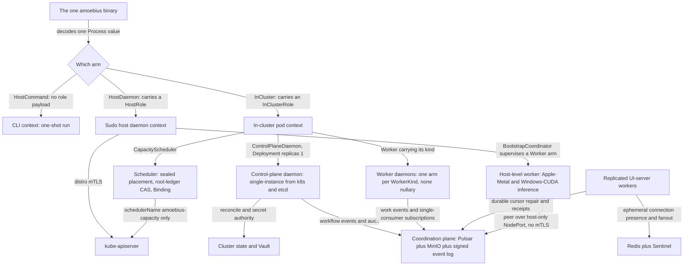

# Daemon Topology

> **Purpose**: Single Source of Truth for the one amoebius binary's three runtime contexts (CLI / sudo
> host-daemon / in-cluster pod) and its closed daemon role taxonomy: the mandatory-Lease control-plane
> control-plane daemon, a dedicated capacity-scheduler process, and N unelected workers.
> **Read this if**: it has to be settled which process does a thing, and with what authority.

This document owns the runtime topology: one binary, the contexts it runs in, the roles the in-cluster
context selects, and which of them holds authority over what. It does not own the bring-up that establishes
that topology, owned by [bootstrap_sequence_doctrine.md](./bootstrap_sequence_doctrine.md), nor the transport
between the parts, owned by [host_cluster_comms_doctrine.md](./host_cluster_comms_doctrine.md).

<details>
<summary>Link-graph metadata</summary>

**Status**: Authoritative source
**Supersedes**: N/A
**Referenced by**: DEVELOPMENT_PLAN/overview.md, DEVELOPMENT_PLAN/phase_18_gateway_migration_model.md, DEVELOPMENT_PLAN/phase_27_gadt_decode_ir.md, DEVELOPMENT_PLAN/phase_35_chain_kernel_boundary.md, DEVELOPMENT_PLAN/phase_49_test_workflow_algebra.md, DEVELOPMENT_PLAN/phase_59_object_reconciler.md, DEVELOPMENT_PLAN/phase_60_capacity_scheduler.md, DEVELOPMENT_PLAN/phase_66_live_dsl_deploy.md, DEVELOPMENT_PLAN/phase_68_pulsar_client.md, DEVELOPMENT_PLAN/phase_70_content_store_workflow.md, DEVELOPMENT_PLAN/phase_71_ui_projection_runtime.md, DEVELOPMENT_PLAN/phase_77_provider_deploy_checkpoint.md, DEVELOPMENT_PLAN/phase_78_provider_child_bringup.md, DEVELOPMENT_PLAN/phase_80_provider_dynamic_nodes.md, DEVELOPMENT_PLAN/phase_85_ui_ha_multizone.md, DEVELOPMENT_PLAN/phase_90_apple_metal_host_daemon.md, DEVELOPMENT_PLAN/phase_94_jitml_rederivation.md, DEVELOPMENT_PLAN/substrates.md, DEVELOPMENT_PLAN/system_components.md, documents/engineering/README.md, documents/engineering/bootstrap_sequence_doctrine.md, documents/engineering/capability_extension_doctrine.md, documents/engineering/chaos_failover_doctrine.md, documents/engineering/chaos_failover_worked_examples.md, documents/engineering/cluster_lifecycle_doctrine.md, documents/engineering/content_addressing_determinism.md, documents/engineering/deterministic_simulation_doctrine.md, documents/engineering/gateway_migration_model_doctrine.md, documents/engineering/host_cluster_comms_doctrine.md, documents/engineering/image_build_doctrine.md, documents/engineering/low_code_ui_runtime_doctrine.md, documents/engineering/manifest_generation_doctrine.md, documents/engineering/monitoring_doctrine.md, documents/engineering/namespace_layout_doctrine.md, documents/engineering/network_fabric_doctrine.md, documents/engineering/pulsar_client_doctrine.md, documents/engineering/pulumi_iac_doctrine.md, documents/engineering/readiness_ordering_doctrine.md, documents/engineering/release_lifecycle_doctrine.md, documents/engineering/resource_capacity_construction.md, documents/engineering/resource_capacity_folds.md, documents/engineering/resource_capacity_sources.md, documents/engineering/service_capability_doctrine.md, documents/engineering/storage_lifecycle_doctrine.md, documents/engineering/substrate_doctrine.md, documents/engineering/testing_doctrine.md, documents/engineering/tla_modelling_assumptions.md, documents/engineering/ui_realtime_coordination_doctrine.md, documents/engineering/vault_pki_doctrine.md, documents/glossary.md, documents/illegal_state/illegal_state_capacity.md, documents/illegal_state/illegal_state_lifecycle.md, documents/illegal_state/illegal_state_security.md, documents/illegal_state/illegal_state_techniques.md
**Generated sections**: none

</details>

> **Historical result (invalidated).** Every pre-reset phase-run and implementation-result statement is diagnostic only and never current validation evidence. Target doctrine remains normative; current state is owned exclusively by the [tracker](../../DEVELOPMENT_PLAN/README.md).

## Contents
- [1. One runtime binary, three contexts](#1-one-runtime-binary-three-contexts)
- [2. Context × role: an orthogonal grid](#2-context--role-an-orthogonal-grid)
- [3. The control-plane daemon](#3-the-control-plane-daemon)
- [4. Worker daemons — N, unelected](#4-worker-daemons--n-unelected)
- [5. Single-instance and coordination — delegated, not elected](#5-single-instance-and-coordination--delegated-not-elected)
- [6. The shared daemon spine](#6-the-shared-daemon-spine)
- [7. Wiring: who talks to whom](#7-wiring-who-talks-to-whom)
- [8. Planning ownership](#8-planning-ownership)
- [Related Documents](#related-documents)

---

**Target scheduler boundary — NOT VALIDATED.** The eventual
[Phase-30 gate](../../DEVELOPMENT_PLAN/phase_30_execution_accelerator_folds.md) must validate the aggregate
snapshot/root-version reservation guard, absent-Pod recovery debit, and pure
Reserved→BindingInFlight→Bound algebra. Phase 60 must later validate the same-binary live scheduler role and
Kubernetes Binding effects. Former reseals and external-run references are permanently invalid evidence.

<a id="1-one-binary-three-contexts"></a>

## 1. One runtime binary, three contexts

**Every Haskell runtime role uses the same executable.** There is no Haskell CLI package and a separate daemon
package; one Haskell binary runs in three different ways. Python `pb` is only the pre-binary bootstrap and
validation handoff: it ensures the toolchain, builds, and `exec`s Haskell command mode. After handoff, that
Haskell command mode calls the control-plane daemon REST API. `pb` is not an operator client or a fourth
runtime role.

| Context | How it runs | What it is for |
|---------|-------------|----------------|
| **Haskell command mode** | A one-shot invocation on a host, entered through `pb` only when a pre-binary handoff is required, exits when done | `bootstrap`, host-local runtime commands, and post-handoff status/administration over the control-plane daemon REST API |
| **Sudo host daemon** | A long-running host process with `sudo` powers | Bring up the distro (kind / rke2) — including installing the **root rke2 server** ([§2.1](#21-a-third-orthogonal-axis-rke2-serveragent-declared)) — install host tooling, talk to `kube-apiserver` over distro mTLS, **supervise host-level worker subprocesses** |
| **In-cluster pod** | Deployed as a generated typed manifest (no Helm) inside the cluster | Hosts the **control-plane daemon role** ([§3](#3-the-control-plane-daemon)), the dedicated **capacity-scheduler role** ([§3.3](#33-the-capacity-scheduler-a-separate-role-in-the-same-binary)), or a **worker role** ([§4](#4-worker-daemons--n-unelected)) |

**The layout follows from this.** One executable means one `app/<binary>/Main.hs`
([`repository_layout_doctrine.md` §2](./repository_layout_doctrine.md#2-complete-repository-structure)); a
role is a decoded value inside it, never a second entry point, and never a second directory named after the
role. A tree carrying `app/<role>/Main.hs` has moved role selection out of the type system and into the
filesystem, where nothing checks it.

The **same-binary policy** is generalized directly from the prodbox sibling
(`prodbox/documents/engineering/distributed_gateway_architecture.md` → "Same-binary
policy"). This is structural, not stylistic:

- **One distribution artifact, one dependency closure**, built once through the bounded pre-binary handoff
  against the current dynamically resolved compatible graph. The repository-local attestation records that graph;
  the repository stores no lock/freeze or permanent compiler/package pin
  ([DEVELOPMENT_PLAN](../../DEVELOPMENT_PLAN/README.md)).
- **One config loader, one logger, one error type, one set of types.** A daemon and a CLI command share
  the `Command` ADT, the structured-error type, and the Dhall decoder — there is nothing to keep in sync
  between two codebases.
- **The CLI introspects its own daemons.** Daemon-launching commands are ordinary `Command` constructors
  that appear in `--help` and the generated docs like any other; a daemon does not own a second argv
  parser. This is the prodbox **daemon-as-Command** pattern.

The *constituent behaviours* of the binary map onto the role taxonomy below: **prodbox** is the root
single-node control-plane behaviour ([§3](#3-the-control-plane-daemon)), **infernix** + **jitML** are the ML worker roles ([§4](#4-worker-daemons--n-unelected)),
and **hostbootstrap** is the bootstrap + DSL-`chain` core that the host daemon drives. Low-code application
UI is not linked application-specific browser or server code. The same executable carries the generic
PureScript assets and Haskell UI-server interpreter specified by
[Low-Code UI Runtime](./low_code_ui_runtime_doctrine.md); a provisioned `UiServerPlan` selects their checked
behaviour. infernix and jitML remain linked trusted workflow and component adapters behind typed ports. The
named behaviours are libraries inside one binary, not separate products.

[Phase 44](../../DEVELOPMENT_PLAN/phase_44_ui_server_boundary.md) owns the future hardware-free Haskell
executable-boundary contract. It must admit the `serve-ui` responsibility and refuse missing, duplicate,
contract-mismatched, or ABI-mismatched handler registries while allowing one unreferenced handler to remain
unreachable. Phase 44 is **NOT VALIDATED**; it cannot establish an in-cluster worker or replica lifecycle.

This document owns *which contexts exist and what each is for*. **How** the host daemon communicates — the
distro-mTLS path to `kube-apiserver`, and the host-only NodePort peering with no mTLS — is owned by
[host_cluster_comms_doctrine.md](./host_cluster_comms_doctrine.md). The **substrate** mechanics behind the
sudo host daemon — substrate detection, the Haskell `BootstrapCoordinator` role, host (non-containerized) worker *nodes*, and the
no-environment-variables / no-`PATH` lazy-tool-ensure contract — are owned by
[substrate_doctrine.md](./substrate_doctrine.md).

---

## 2. Context × role: an orthogonal grid

**"where the binary runs" (context) and "what job it is doing" (role) are independent axes.** Confusing them
is the bug this section prevents — "the in-cluster pod" is not a role, and "the control-plane daemon" is
not a context.

|                         | **Control-plane daemon role** | **Capacity-scheduler role** | **Worker role** |
|-------------------------|----------------------------------|-----------------------------|-----------------|
| **CLI context**         | — (a CLI run is not a daemon) | — | — |
| **Sudo host daemon**    | Pre-cluster bootstrap *acts on behalf of* the future control-plane daemon, then hands off | Bootstrap installs the first provisioned scheduler Pod/config but does not run the live role | Supervises host-level workers (e.g. Apple-Metal and Windows-CUDA inference, [§4](#4-worker-daemons--n-unelected)) |
| **In-cluster pod**      | **Exactly one writer** — Deployment `replicas=1` plus mandatory Lease ([§3](#3-the-control-plane-daemon)) | Independently provisioned same-binary Deployment; sealed placement/root-ledger CAS/Binding only ([§3.3](#33-the-capacity-scheduler-a-separate-role-in-the-same-binary)) | **N**, unelected ([§4](#4-worker-daemons--n-unelected)) |

The role axis is a closed union, and it is the value a pod's container names as its process:

```text
InClusterRole =
  < ControlPlaneDaemon          -- exactly one writer; mandatory Lease (§3)
  | CapacityScheduler              -- sealed placement / root-ledger CAS / Binding only (§3.3)
  | Worker : { kind : WorkerKind, replicas : Positive }   -- N, unelected (§4)
  >
```

There is no fourth arm and no free-text role: a pod that names a role amoebius does not implement has no
constructor. `InClusterRole` is what
[`resource_capacity_schema.md`](./resource_capacity_schema.md)'s `ContainerProcess` names when a container
runs the amoebius binary, which is how "what this container executes" becomes typed rather than inherited
from an image's entrypoint. A Haskell schema declaration must carry these types exactly once; Phase 26 may
lazily render consumer-facing `Role.dhall` and `Image.dhall` files beneath `.build/dhall/**`, but neither
rendered file is tracked source or authority. The present tracked Dhall forms are condemned legacy
observations, not a target module layout. Until Phase 26 closes its source row and structural gate, the arms
above remain design intent only
([`legacy_tracking_for_deletion.md` §2](../../DEVELOPMENT_PLAN/legacy_tracking_for_deletion.md#2-tracked-source-violations)).

**The grid's empty cells have no constructor either.** Context and role are orthogonal, but not every pairing
exists: a CLI run holds no daemon role, and the host daemon is not a container process. Encoding the *legal
cell* rather than the pair is what removes those states from the language:

```text
Process =
  < HostCommand                -- a one-shot run: no role to hold
  | HostDaemon : HostRole      -- long-running on the host
  | InCluster  : InClusterRole -- long-running in a pod
  >

HostRole =
  < BootstrapCoordinator       -- acts for the future control-plane daemon, installs the first scheduler, supervises
  | Worker : WorkerKind        -- a supervised host-level worker: the third fact of this section
  >
```

**Cardinality is indexed on the role.** `ControlPlaneDaemon` and `CapacityScheduler` are exactly-one by
definition, so they carry no replica field at all; only `Worker` admits a count. A control-plane daemon with three
replicas is therefore not rejected by a validation function — it has no shape to be written in. A host-level
worker is one process on one host, so `HostRole`'s `Worker` arm carries the kind alone.

**Every arm answers the same question — *what is this process?*** An earlier draft gave `HostDaemon` a
`supervises : List WorkerKind` payload, which answered a different question (*what are its children?*) and
left the supervised host-level worker with no arm to decode at all, even though this section's third fact
says that worker exists. A union whose arms answer different questions is not a taxonomy, and a **legal**
state left unrepresentable is worse than an illegal one left representable: the implementation must then
either lie in the type or route around it.

The payload is gone for a second reason. Which workers are host-level is a quotient of the detected
substrate ([§4.1](#41-the-engine-offering-vs-the-node-hardware-in-cluster-pod-or-host-subprocess)) and is **never authored free of it**,
so a hand-written list of supervised kinds would be a second, unwitnessed source of truth for a derived fact.
`HostRole` names what a process *is*; what the Haskell `BootstrapCoordinator` supervises follows from the
substrate. This role is never the bounded Python pre-binary handoff.

`HostDaemon` is a **context**, so it appears here and never as an `InClusterRole` arm. A running
copy learns which arm it is by decoding its `FrameConfig`
([`dsl_doctrine.md` §3](./dsl_doctrine.md#3-the-orchestration-surface-parameters-context-witness)) — never by
its own filename, and never from `argv`.

Three facts fall out of the grid:

- **The control-plane daemon is always an in-cluster role.** A cluster's brain lives *in* the cluster it
  governs. Before that cluster exists, the **sudo host daemon** does the bootstrap work that brings the
  first control-plane daemon into being (this is the prodbox root single-node story), then defers to it — the host
  daemon is the Haskell *bootstrap coordinator*, not the brain or the Python pre-binary handoff.
- **Worker daemons run in both daemon contexts.** Most workers are in-cluster pods; a few must be
  host-level subprocesses because their hardware cannot be containerized (Apple-Metal GPU work, and
  native Windows-CUDA inference — CUDA does not run performantly under WSL2). A host-level worker is the **same binary in the worker role under the host-daemon context**, supervised as a subprocess.
- **The capacity scheduler is an in-cluster-only role.** It is not the control-plane daemon, does not hold the Lease or
  Vault authority, and is not a general worker. Its only mutation surface is its provisioned aggregate
  reservation root and Kubernetes Binding subresource.

Which roles run and how many replicas each gets are **deployment-rules** decisions, never application logic —
that orthogonal DSL split is owned by [app_vs_deployment_doctrine.md](./app_vs_deployment_doctrine.md).
**Which workers are host-level is not among them**: it is a quotient of the detected substrate
([§4.1](#41-the-engine-offering-vs-the-node-hardware-in-cluster-pod-or-host-subprocess)), derived rather than
authored, and an earlier draft of this paragraph put it on the deployment-rules side where it does not
belong.

<a id="21-a-third-orthogonal-axis-rke2-serveragent-declared"></a>

### 2.1 The rke2 server/agent node axis remains independent

The grid above already crosses **runtime context** (where the binary runs) with **daemon role** (what job it
does). Cluster topology contributes two different axes, and rke2 adds one conditional node-role axis. Keeping
all five names distinct prevents an engine choice from being mistaken for a detected host fact or a Kubernetes
node role from being mistaken for an amoebius process role:

- **(i) Hardware substrate — detected.** `apple` / `linux-cpu` / `linux-cuda` / `windows`, derived from host facts;
  each derives the `linux-cpu` execution lane, natively or through Incus/Lima/WSL2, while accelerator lanes are additive
  ([cluster_topology_doctrine.md §1](./cluster_topology_doctrine.md#1-two-axes-the-substrate-is-detected-the-engine-is-declared), [substrate_doctrine.md](./substrate_doctrine.md)).
- **(ii) Compute engine — declared.** `Kind` / `Rke2` / `Managed Eks`, authored as deployment intent and
  checked against the detected substrate
  ([cluster_topology_doctrine.md §2](./cluster_topology_doctrine.md#2-computeengine-a-closed-union-eks-a-first-class-arm)).
- **(iii) Runtime context.** one-shot Haskell command mode, sudo host daemon, or in-cluster process
  ([§1](#1-one-binary-three-contexts)).
- **(iv) amoebius daemon role.** the control-plane daemon ([§3](#3-the-control-plane-daemon)), dedicated
  capacity scheduler ([§3.3](#33-the-capacity-scheduler-a-separate-role-in-the-same-binary)), or an unelected worker ([§4](#4-worker-daemons--n-unelected)). The control-plane daemon's
  single-instance is a k8s/etcd property ([§3.1](#31-exactly-one-pod-is-a-k8setcd-property-not-an-amoebius-election)), not an amoebius election, so this axis carries no
  election of its own.
- **(v) rke2 server/agent — declared when the engine is `Rke2`.** which *nodes* carry the Kubernetes control plane
  (kube-apiserver + the etcd quorum) versus which are pure workload nodes. This is the `Rke2Servers` closed
  union — `Single` / `Ha3` / `Ha5`, the only legal odd etcd quorums {1,3,5} — plus
  `Rke2AgentPool = Fixed [Rke2AgentNode] | Autoscaled { floor : [Rke2AgentNode], policy : ScalingPolicy }`, owned by [cluster_topology_doctrine.md §2](./cluster_topology_doctrine.md#2-computeengine-a-closed-union-eks-a-first-class-arm) and
  [§4.1](./cluster_topology_doctrine.md#41-rke2-serveragent-cardinality-odd-quorum-by-union-distinctness-by-fold-taint-by-derivation). An even- or zero-server (no-quorum / split-brain) control plane has no constructor: **type-foreclosed unrepresentable**.

(Further axes such as environment and engine/model/kernel asset tier are owned by their respective doctrines;
this document is normative only about keeping runtime context, daemon role, and the conditional rke2 node role
separate from substrate and compute engine.)

**The five axes never fuse.** An rke2 *server* node is **not** the amoebius control-plane daemon, and an
rke2 *agent* is **not** an amoebius worker. Axis (v) is a property of *Kubernetes nodes* (which host runs
etcd / kube-apiserver); axis (iv) is a property of *amoebius daemon processes* (which process holds cluster + secret
authority, [§3](#3-the-control-plane-daemon)). They are independent: a worker pod may be scheduled onto an rke2 server node, and the
control-plane daemon pod may be scheduled onto an rke2 agent — the Kubernetes scheduler places pods without regard to the
etcd quorum, and the control-plane daemon's node is chosen by the scheduler without regard to its rke2 kind. Axis (v) is
conditioned by axis (ii), not axis (i): rke2 server/agent is meaningful only when the declared engine is
`Rke2`; it does not exist for `Kind` or `Managed Eks`. A detected substrate therefore never implies a
server/agent split.

**Enactment splits across exactly the two daemon contexts ([§1](#1-one-binary-three-contexts)).** This is the one place the rke2 axis touches
daemon topology:

- **The sudo host daemon installs the ROOT rke2 server** — the zero-secret single node
  `{ servers = Rke2Servers.Single host, agents = Fixed [] }`. This makes the [§2](#2-context--role-an-orthogonal-grid) *bootstrap coordinator* concrete: before any
  cluster exists there is no control-plane daemon yet, so the host daemon (acting on behalf of the future control-plane daemon)
  brings up the first `rke2-server`, then defers. This is the prodbox single-node `rke2-server` base —
  **sibling evidence, not an amoebius result** (prodbox's `Rke2.hs` proves the single-node install only).
- **The in-cluster control-plane daemon enacts child server/agent rollout over SSH.** Once kube-apiserver is up
  and the control-plane daemon pod is running, growing the cluster (further `Ha3` / `Ha5` servers, and all agents) is part
  of the control-plane daemon's cluster authority — the *dynamic node provisioning* of [§3.2](#32-what-total-authority-over-the-cluster-and-its-secrets-cashes-out-to), owned by
  [cluster_lifecycle_doctrine.md](./cluster_lifecycle_doctrine.md). It runs the **checkpoint-free tag-discovery host reconciler** — `create → tag → join-fabric → drain-by-tag`, home
  [pulumi_iac_doctrine.md §0](./pulumi_iac_doctrine.md#0-decision-record-why-pulumi-stays--and-why-that-is-not-the-helm-decision) — reaching each new host over SSH. The first server
  mints the `Rke2NodeToken` (a Vault-KV `SecretRef`, parent-minted, referenced by name); further servers and
  agents join via a `server:` URL + that token; rejoin is idempotent. This is a **reconcile, not a state machine**.

A **quorum change** (e.g. `Single → Ha3`) is a deliberate re-provision of the declared server set, **never** an
autoscale; a `ScalingPolicy` exists only in `Rke2AgentPool.Autoscaled` and grows the worker pool beyond its
declared floor within its finite quota. Because axis (iii) is *declared* — not detected — the
control-plane daemon never promotes a node from agent to server at runtime; it re-provisions against the new declaration.

> **Honesty.** Multi-node rke2 server/agent, etcd-HA, and the join-token flow are **Phase-N design intent** —
> net-new across the whole sibling family (hostbootstrap has zero rke2 code). Only the single-node
> `rke2-server` base is proven in the prodbox sibling; that is **sibling evidence, not a tested amoebius > result**.

---

## 3. The control-plane daemon

> **Target delivery boundary — NOT VALIDATED.** Phase 66 must eventually validate the in-cluster
> `replicas=1` control-plane daemon, including the fresh-resourceVersion bootstrap-holder
> release/absence/control-plane-acquire handoff, separate Lease-renewal authority, exact first-pass reconcile,
> zero-write rerun, durable replacement, and administrative surface. No Register-3 result is current.

**Every cluster has exactly one brain.** Exactly one daemon holds **total authority over the cluster and its secrets**: it runs the reconcile loop that drives the live cluster toward the global `.dhall`, and it is the
cluster's secret authority. This role **is the prodbox root single-node control-plane behaviour, generalized**
from "owns the public DNS record" to "owns the whole cluster" ([README](../../README.md): *prodbox = the root single-node control-plane behaviour*).

### 3.1 "Exactly one pod" is a k8s/etcd property, not an amoebius election

The control-plane daemon is a Kubernetes **Deployment with `replicas=1`.** It is **stateless at the pod level**
— it holds no PVC; its durable state is exclusively the Vault-enveloped MinIO bucket
([storage_lifecycle_doctrine.md §7.2](./storage_lifecycle_doctrine.md#72-amoebius-own-control-plane-state-is-the-minio-bucket-not-a-pvc)),
so a lost pod loses nothing and is simply rescheduled by k8s.

Stateless does not mean resource-free. The control-plane daemon is an ordinary bound execution unit with a complete
`PodResourceEnvelope`: digest-selected image/content/import bytes; CPU, memory, and ephemeral-storage requests
and limits covering decode/bind/provision, discovery/diff/SSA serialization, Lease/watch/list buffers,
health/metrics, writable root and logs; mapped ConfigMap/Secret/downward-API/token bytes; bounded local volumes;
no PVC/cache; and no accelerator. Its rollout strategy supplies the finite transition epochs, and provisioning
spends every live/terminating pod, pod/CNI slot, and image/nodefs byte before the Deployment can render.
`replicas=1` is not a scalar exemption from this expansion.

Its MinIO state is equally closed and capacity-admitted. `ControlPlaneStateObjectDemand` contains exactly
`InForceSpecSnapshot`, `ManagedResourceRegistry`, `ReconcileJournal`, `ValidationLedger`, and
content-addressed `JobCompletion`, with a required
`StorageBudgetId`, exact keys/canonical-size inputs, retained versions, failed-write/orphan bounds, and writer
admission. The sole object-write gateway has its own complete pod envelope, and the control-plane daemon holds no direct
S3 mutation credential. A new persistent state kind requires a new union arm and capacity test; it cannot hide
behind “other control-plane bytes.”

**Single-instance is delegated to k8s/etcd — amoebius runs no election of its own.** The Deployment controller
and etcd already guarantee the cluster converges to one running pod, restarting it elsewhere on node loss. A
bespoke ranked-failover election over a signed commit log would **re-implement the consensus etcd already provides**, add a second coordination plane to prove correct, and deadlock at exactly the moment leadership is
most needed (cold-start, and the disaster-recovery of the very services such an election would run on). amoebius
therefore does not build one:

- The steady state is **one pod**, kept so by the Deployment controller (etcd-backed). The control-plane daemon Deployment
  declares **`strategy: Recreate`**, never the default `RollingUpdate`: a rolling update briefly runs the old and
  new pods concurrently (`maxSurge` rounds to 1 at `replicas=1`), which would place two control-plane brains on
  the cluster during every spec change. `Recreate` terminates the old pod before starting the new one, so a
  *rollout* never doubles the control-plane daemon.
- A rollout is not the only doubling risk. Under a **node partition** the ReplicaSet starts a replacement pod
  after the unreachable node's pod-eviction timeout while the original may still be running on the partitioned
  node — a hazard `Recreate` does not close (only confirmed-deletion semantics do). Because the control-plane daemon takes
  non-idempotent **external** actions (route53, Vault), it therefore **always** holds a **Kubernetes `Lease`** —
  the standard etcd-backed leader-election object (the client-go pattern), **not** an amoebius protocol — as its
  at-most-one-writer mutual exclusion. The criterion is explicit: **any role that takes non-idempotent external effects runs under a `Lease`**; for the control-plane daemon the Lease is mandatory, not an "if ever needed" option. This
  uses etcd's consensus through the k8s API; it does not duplicate it. (A `StatefulSet`, which never creates a
  replacement until the old pod is confirmed deleted, is the alternative shape that closes the partition case at
  the workload level; amoebius uses the Deployment-`Recreate`-plus-`Lease` composition.)
- There are **no warm-standby control-plane daemon pods and no candidate population.** "HA always — including
  `replicas=1`" ([platform_services_doctrine.md §2](./platform_services_doctrine.md#2-ha-always--including-replicas1))
  is satisfied by k8s rescheduling the single pod, not by a second pod waiting to be elected.

This is the resolution of the standing pre-plan design-log question of whether the control-plane daemon should run custom
election logic: **it should not — single-instance is a k8s/etcd concern, and amoebius does not duplicate etcd.**

**One honest residue, named: a `Lease` is mutual exclusion, not output fencing.** The Deployment + `Lease`
guarantee at-most-one *lease-holder*; they do **not**, by themselves, fence a stale *external* side effect. A
pod that holds the lease, is stop-the-world-GC-paused or partitioned past the lease's expiry, and then resumes
can still issue a route53 or Vault write while a freshly-elected pod is also writing — the classic fencing-token
gap (Kleppmann, *How to do distributed locking*), and exactly what that log flags when it observes the
control-plane daemon's authority is *external side effects that validate no broker epoch*. This window is **not** a second
election obligation — amoebius runs no election — but it is a named **assumed** premise, sibling to the R8
synchrony premise ([chaos_failover_doctrine.md §13](./chaos_failover_doctrine.md#13-the-supporting-rules--the-conditions-the-moves-need)):
its safety rests on the writes being idempotent / last-writer-safe (route53 is a short-TTL record the migration
protocol already tolerates being briefly contended — [§3.2](#32-what-total-authority-over-the-cluster-and-its-secrets-cashes-out-to);
Vault operations are idempotent or Vault-token-fenced) and on the reconciler re-converging within the TTL. It
is recorded assumed, monitored, never reported as proven — the honest counterpart to "single-instance is
delegated."

### 3.2 What "total authority over the cluster and its secrets" cashes out to

- **Cluster authority.** The control-plane daemon runs the idempotent `discover → diff → enact → re-observe`
  reconciler that owns bring-up, spawn, dynamic node provisioning, and teardown — owned by
  [cluster_lifecycle_doctrine.md §9](./cluster_lifecycle_doctrine.md#9-how-bring-up-and-teardown-are-implemented-the-reconciler-not-a-state-machine), which names this doc as the owner of
  *who runs* that loop.
- **Admin-surface authority.** After the host-daemon→control-plane daemon handoff, the control-plane daemon is the **sole control surface**: the operator CLI drives the cluster only through the control-plane daemon's **admin REST API**
  (`vault init/unseal`, `dhall update`) over the amoebius NodePort — the control-plane daemon's **node-local/private admin channel**, never the wild edge — and the host binary's channel-1 kube-apiserver access is retired to
  **bootstrap-only**. The sequence, the handoff, and the admin plane are owned by
  [bootstrap_sequence_doctrine.md](./bootstrap_sequence_doctrine.md#5-the-admin-control-plane-the-cli--the-control-plane-daemon-rest-api).
- **Secret authority.** The control-plane daemon is the in-cluster principal that **operates Vault** — the only role that
  holds cluster-wide secret authority. The Vault *model* it operates (fail-closed unseal, root
  password-encrypted unseal, parent-injects-secrets-into-the-child's-Vault, the root PKI trust anchor, the
  secrets-are-names-only `SecretRef` contract) is owned in full by [vault_pki_doctrine.md](./vault_pki_doctrine.md).

Fusing cluster control and secret authority into a *single role* is what makes "one brain per cluster"
enforceable, and single-instance of that role is k8s/etcd's job ([§3.1](#31-exactly-one-pod-is-a-k8setcd-property-not-an-amoebius-election)).

**Where the single-writer question is amoebius's own: the cross-cluster gateway.** The control-plane daemon's authority is
exercised as **external side effects** — a route53 DNS write for the cluster gateway, and Vault operations. The
"intra-system consensus is delegated, not re-proved" posture ([§4](#4-worker-daemons--n-unelected)) covers the *internal* plane (Pulsar / MinIO / Postgres); **intra-cluster** single-writer of these effects is delegated to k8s/etcd
([§3.1](#31-exactly-one-pod-is-a-k8setcd-property-not-an-amoebius-election)). The one single-writer question that is *irreducibly amoebius* is **cross-cluster**: which cluster in
a forest owns the wild-ingress gateway DNS record, and how that ownership moves. That is the **gateway migration** — both the `Planned` handover and the `Failover` takeover — and it is amoebius's sole
simulation/proof obligation, owned by [gateway_migration_model_doctrine.md](./gateway_migration_model_doctrine.md)
and [gateway_migration_doctrine.md](./gateway_migration_doctrine.md). route53 has no compare-and-swap, so the
cross-cluster record is a short-TTL A-record with availability-first bounded rebind — modeled there, not here.

### 3.3 The capacity scheduler: a separate role in the same binary

The capacity scheduler is a third closed daemon role, not an implementation detail of the control-plane daemon and not a
kube-scheduler framework plugin. The provisioned bootstrap Deployment runs the same amoebius Haskell binary
with its scheduler command. Its own Pod is the sole `default-scheduler` exception, constrained to one uniquely
eligible node and an exact namespace `ResourceQuota pods=1`; every other Pod able to consume managed-node
capacity—including platform/addon Pods—uses `schedulerName=amoebius-capacity`.

Before reporting Ready, the role validates and atomically activates the sealed prior+desired,
controller-child-indexed reservation config. For each named Pending Pod it authenticates owner chain and
protected identity/template annotations, resolves any attested elastic target, runs the canonical complete
resource fold, CASes the control-plane daemon reservation root to Reserved then BindingInFlight, and alone submits the
Kubernetes Binding. Crash/lost-response recovery keeps the reservation charged until exact UID/node readback
repairs it to Bound or proves it unbound. It never decodes a new desired deployment, operates Vault, applies
general manifests, or holds the reconciler Lease.

This role is resource-bearing and deployment-global. Its image, CPU, memory, logical and physical ephemeral
storage, runtime metadata, Pod/CNI/CSI slots, static bootstrap reservation, config/RBAC/admission/taints,
aggregate ledger bytes/churn, readiness, and live resident-artifact baseline all pass through
`CapacitySchedulerSystemDemand → ProvisionedCapacitySchedulerSystem`. The scheduler's shared amoebius image
extents deduplicate by physical allocation identity with workload extents, while compute/slots remain
additive. The root ledger is scheduler-field-owned and is neither server-side-applied nor pruned by the
control-plane daemon's generic object path.

Phase 60's future Register-3 gate must validate this role boundary with a namespace `pods=1` quota, the sole
default-scheduler bootstrap Pod, restricted cutover authority, independently read managed
taint/admission/Binding RBAC, real Binding assignment after reservation CAS, and leak-free removal of every
gate-scoped cluster resource. Phase 66 must separately deliver the in-cluster control-plane daemon without
giving it scheduler authority. Both phases are **NOT VALIDATED**.

---

## 4. Worker daemons — N, unelected

**If the control-plane daemon is the brain, the workers are the muscle.** A worker daemon does bounded, horizontally
scalable work; it is **not** elected, holds **no** cluster-wide authority, and there can be **many** of
each kind. The canonical worker kinds:

| Worker kind | What it does | Constituent library |
|-------------|--------------|---------------------|
| **UI runtime server** | Serves a checked low-code program, terminates authenticated WebSockets, and mediates every browser effect behind the authenticated edge; Redis routes sockets across replicas | generic UI runtime + bound server plan |
| **UI projection worker** | Folds workflow/data events into bounded owner-scoped UI projections | generic UI runtime + native Pulsar client |
| **Pulsar topic-lifecycle coordinator** | Drives an app's declared topic lifecycles (create / retention / teardown) | the DSL + [pulsar_client_doctrine.md](./pulsar_client_doctrine.md) |
| **ML batch coordinator** | Schedules and tracks batch ML workflows | **infernix** / **jitML** |
| **Inference engine** | Serves model inference — **in-cluster on linux-CUDA; host-level on Apple-Metal and Windows-CUDA** | **infernix** / **jitML** |

The "Constituent library" column above is not prose decoration — it is a typed field, and it is how a
worker reaches the code it runs:

```text
WorkerKind =
  < UiRuntimeServer           : { serves    : AppId, program : ProgramDigest }
  | UiProjectionWorker        : { serves    : AppId, program : ProgramDigest }
  | TopicLifecycleCoordinator : { serves    : ExtensionId }
  | MlBatchCoordinator        : { extension : ExtensionId }   -- infernix | jitML
  | InferenceEngine           : { extension : ExtensionId }
  | AcceleratorOwner          : { extension : ExtensionId }   -- §4.2, per-node singleton
  | ContinuousTrainer         : { extension : ExtensionId }   -- §4.3, Feed-sourced
  >
```

**The dispatch wire, stated once because nothing else stated it.** A worker Pod's minted `FrameConfig`
([dsl_doctrine.md §3](./dsl_doctrine.md#3-the-orchestration-surface-parameters-context-witness)) names its
`InClusterRole`; the `Worker` arm names a `WorkerKind`. Extension-bearing kinds name the `ExtensionId` whose
linked library handles their work. UI kinds instead name an `AppId` plus the immutable `ProgramDigest` of a
provisioned `UiServerPlan`; they do not require application-specific Haskell linkage. Serving behaviour
therefore reaches the binary through the **role**, never through
`extChain` — `extChain :: cfg -> [Step]` is the deploy-time reconcile algebra ([§2](#2-context--role-an-orthogonal-grid) of [dsl_doctrine.md](./dsl_doctrine.md#2-two-languages-one-system-dhall-carries-params-haskell-carries-logic)),
and it carries no request, route, or handler concept. The UI request/handler relation is the sealed port table
owned by [low_code_ui_runtime_doctrine.md §8](./low_code_ui_runtime_doctrine.md#8-effects-are-typed-ports-not-network-operations).

**A named extension must be linked into the pod's own image; a named UI program must be provisioned for that release.** An extension-bearing `WorkerKind`'s `ExtensionId` is required
to be a member of its container's `ImageIdentity.Runtime.linkedAdapters` set
([image_build_doctrine.md §5](./image_build_doctrine.md#5-what-the-image-identity-is-given-that-the-tag-is-an-address)).
A worker naming an extension its own binary does not carry is therefore a decode-time rejection, not a
runtime "handler not found." A UI worker's `ProgramDigest` must instead be a member of the release's sealed UI
program set and must pass the client/server ABI relation. Before readiness, every handler identity referenced
by its serializable `UiServerPlan` must resolve exactly once to an ABI-compatible handler linked into the
generic binary. Other linked handlers are legal but unreachable when absent from that plan's sealed dispatch
table; an arbitrary, stale, or unresolved plan has no ready worker state. Both use the
relation-over-a-collection technique catalogued by
[Illegal State Techniques](../illegal_state/illegal_state_techniques.md).

> **Layer.** The union's closedness and the linked-membership relation are **decode-foreclosed** (gadt-decode).
> Plan/registry hydration is a fail-closed readiness check; that a linked handler actually serves correctly is
> runtime residue, claimed by no gate here.

Properties shared by all workers:

- **Unelected and horizontally scaled.** Workers do not run a leadership election among themselves. Durable
  work coordinates through the shared **coordination plane** — Pulsar + MinIO + the commit log ([§5](#5-single-instance-and-coordination--delegated-not-elected)) — whose
  intra-system consensus is *delegated* to those systems, not re-proved by amoebius
  ([platform_services_doctrine.md §6](./platform_services_doctrine.md#6-pulsar--the-event-and-workflow-backbone-new-vs-prodbox)). A Pulsar topic-lifecycle
  coordinator that needs single-consumer semantics gets it from Pulsar's subscription model and the
  at-least-once + dedup discipline ([pulsar_client_doctrine.md](./pulsar_client_doctrine.md)), not from a
  bespoke amoebius election.
  UI-server connection presence and cross-pod WebSocket fanout additionally use ephemeral Redis, whose loss
  triggers reconnect/cursor repair and never changes durable work. That separate implementation facility is
  owned by [UI Realtime Coordination](./ui_realtime_coordination_doctrine.md).
- **One topology across replica counts; redundancy requires multiple failure domains.** A worker Deployment
  uses the same HA-capable typed projection at every configurable replica count, including `replicas=1`
  ([platform_services_doctrine.md §2](./platform_services_doctrine.md#2-ha-always--including-replicas1)). One
  replica has restart semantics but no replica redundancy; an HA claim additionally requires an admitted
  replica/failure-domain placement and a live fault gate. Every worker
  container declares explicit CPU, memory, and pod-ephemeral requests/limits plus any bounded volume,
  durable, or accelerator provision it consumes
  ([platform_services_doctrine.md §10](./platform_services_doctrine.md#10-every-execution-unit-declares-its-complete-resource-envelope)).
- **UI workers are least-authority workers.** A UI runtime or projection worker receives no control-plane
  Lease, Kubernetes mutation authority, provider-admin credential, root Vault capability, arbitrary outbound
  destination, or caller-selected tenant. Its service account, Vault role, NetworkPolicy, plan set, and
  capability handles are derived from the bound UI program. The browser never connects directly to Pulsar,
  MinIO, SQL, Vault, or an inference engine
  ([low_code_ui_runtime_doctrine.md §13](./low_code_ui_runtime_doctrine.md#13-generic-purescript-client-and-amoebius-ui-server)).
- **Host-level workers are subprocesses, not pods.** When hardware forbids containerization — **Apple-Metal unified-memory inference and native Windows-CUDA inference** (CUDA does not run performantly under WSL2,
  [substrate_doctrine.md](./substrate_doctrine.md)) — the worker runs as a
  **host subprocess supervised by the sudo host daemon** ([§1](#1-one-binary-three-contexts)). It reaches in-cluster MinIO and Pulsar as a
  **peer over a host-only NodePort with no mTLS** — localhost only, no WAN or LAN — owned by
  [host_cluster_comms_doctrine.md](./host_cluster_comms_doctrine.md). It discovers its host tooling lazily
  through the substrate's package manager and invokes it by full path, never through `PATH`
  ([substrate_doctrine.md](./substrate_doctrine.md)). Apple-Metal and Windows-CUDA are the **same host-worker shape** — a native subprocess reaching the cluster only over the host-only NodePort — differing only in
  engine offering and bootstrap ([§4.1](#41-the-engine-offering-vs-the-node-hardware-in-cluster-pod-or-host-subprocess)); their parity is **role parity, not evidence parity**. The on-host
  Windows-CUDA build/run path is **forward design intent with no sibling evidence and no build-shape doc**
  (unlike Apple-Metal's `apple_metal_headless_builds.md`), inheriting the honesty framing below.

> **Honesty.** The Pulsar / ML / inference worker roles are **new relative to prodbox** — prodbox had no
> Pulsar and no ML workers. Phase 68 must eventually validate the client substrate workers consume, including
> all four Pulsar subscription encodings without an amoebius election; it is **NOT VALIDATED**. Worker deployments,
> continuous trainer, and ML/inference roles remain forward work for their owning phases; status lives only in
> [../../DEVELOPMENT_PLAN/README.md](../../DEVELOPMENT_PLAN/README.md)
> ([documentation_standards.md §6](../documentation_standards.md#6-honesty-the-proventestedassumed-discipline)).

### 4.1 The engine offering vs the node hardware: in-cluster pod or host subprocess

A worker's **engine offering** — the cluster-facing `EngineRuntime` it presents (`AppleMetal | Cuda |
LinuxCpu`) — is a **quotient of the detected substrate**, not a free choice: which offering a node makes is
**projected from** its substrate, and that quotient and its bootstrap/wire mapping are owned in full by
[service_capability_doctrine.md §4.1](./service_capability_doctrine.md#41-the-inferenceengine-capability--the-engine-is-target-offering-selected-and-jit-resolved-never-authored).
This doctrine does **not** restate that mapping; it records the one **daemon-context consequence** the
quotient forces on the worker taxonomy.

The consequence: one engine offering is realized in **different daemon contexts** ([§1](#1-one-binary-three-contexts)) according to the
**node hardware / bootstrap** — *how* the offering is stood up and wired:

- A **`Cuda`** offering is an **in-cluster pod** when the node hardware is `linux-cuda` (NVIDIA container
  runtime, reached over in-cluster mTLS), and a **host subprocess** when the node hardware is `windows`
  (native — CUDA does not run under WSL2 — reached only over the host-only NodePort). One offering, two
  bootstraps.
- An **`AppleMetal`** offering is always a **host subprocess** (`apple` node hardware; unified-memory GPU
  work cannot be containerized).
- A **`LinuxCpu`** offering is always an **in-cluster pod**.

So the same engine offering can span both daemon contexts, decided by node hardware, and is **never authored free of the substrate**. These two facts — **engine offering** and **node hardware** — are a finer split of
*which worker realization the substrate projects*; they are **not** the context / role / rke2 axes of
[§2.1](#21-a-third-orthogonal-axis-rke2-serveragent-declared) ("the three axes never fuse") and must not be
conflated with `role` or `substrate`.

### 4.2 The accelerator-owner worker: wholesale per-node ownership, a typed per-node singleton

The inference and training worker kinds above run on nodes carrying accelerators (CUDA GPUs / Apple-Metal).
This round introduces the rule for how those accelerators are **owned**: a node's accelerators are owned
**wholesale** by a single **accelerator-owner worker** on that node — substrate-independent, whether the
owner is an in-cluster pod (`linux-cuda`) or a host subprocess (`windows` / `apple`, [§4.1](#41-the-engine-offering-vs-the-node-hardware-in-cluster-pod-or-host-subprocess)). Other pods may
use the node's leftover CPU, memory, and pod-ephemeral capacity but **never** its accelerators. This revises the earlier narrative in
which a GPU was a per-pod, indivisible bin-packable `Count`: accelerators are reached **only** through the
wholesale owner (the per-pod GPU request axis is removed — [resource_capacity_doctrine.md §3](./resource_capacity_doctrine.md#3-the-types-quantity-capacity-demand-budget)).

To make wholesale ownership a **typed** fact rather than a convention, this round introduces a **typed per-node-singleton accelerator-owner worker kind** — a **DaemonSet-like node-affinity** worker, exactly one
per accelerator node — distinct from the N-replica *unelected* Deployment shape the other worker kinds use
([§4](#4-worker-daemons--n-unelected)). It is still **many across the cluster** (one per accelerator node), so "many of each kind"
holds; the type merely forbids **two on one node**. Because it admits **at most one owner per node**, "two
accelerator owners contending for one node's devices" and "a fractional / straddled accelerator claim" have
**no constructor: type-foreclosed unrepresentable**. The one owner **multiplexes training, serving, and Tier-3 JIT compilation** on its node — which is what lets a node continuously train a model while serving it (the
continuous-training mode owned by content_addressing / dsl, [§4.3](#43-the-feed-sourced-continuous-trainer-single-writer-delegated)). The per-node-singleton is a k8s node-affinity
property (a DaemonSet places at most one pod per node), not an amoebius election.

A heterogeneous cluster cannot use one uniform DaemonSet template: Kubernetes would apply one GPU count to
every node. Binding therefore computes an immutable `AcceleratorOfferingClassKey` from resource key, profile,
full device count, net-VRAM vector, and link topology; every accelerator node/candidate has exactly one such
label. It renders one owner workload per homogeneous offering class with disjoint required affinity and that
class's exact full-device request. Fixed classes expand from concrete nodes; elastic provider classes carry a
class-scoped template for future nodes. Two classes may share a worker binary but never a pod template. The
class partitions cover every accelerator node exactly once, preserving one owner per node without a Pending
4-GPU request on a 1-GPU node.

Wholesale ownership does not make the Kubernetes allocation implicit. On `linux-cuda`, the provision fold
resolves the demand's `ContainerId` exactly once and derives one integer extended-resource request/limit on
that named container **equal to the selected node's full device count**, plus the node/profile/topology
affinity on its pod that binds it to that offering. Subset allocation has no v1 constructor and requires a
future typed DRA/MIG arm. Ordinary workload pods have no constructor for this claim. Per-device VRAM and
supported sharding remain an internal admission budget owned by the resource-capacity doctrine; the Kubernetes
claim allocates whole devices.

Wholesale per-node accelerator ownership and the per-node-singleton invariant are the **SSoT of this doctrine**; [resource_capacity_folds.md §4.1](./resource_capacity_folds.md#41-place-branches-static-proves-a-placement-dynamic-proves-a-growth-envelope) / [§3](./resource_capacity_doctrine.md#3-the-types-quantity-capacity-demand-budget) and the illegal-state catalog **consume** it.

> **Layer / honesty.** The at-most-one-owner-per-node foreclosure is **type-foreclosed** — a per-node-singleton type
> has no two-owner inhabitant; that the daemon **actually holds the node's devices at runtime** is
> **runtime-checked** runtime residue. The typed accelerator-owner worker kind is **forward design intent** — no
> sibling system stands up a DaemonSet-like accelerator owner today; status and gates live only in
> [../../DEVELOPMENT_PLAN/README.md](../../DEVELOPMENT_PLAN/README.md)
> ([documentation_standards.md §6](../documentation_standards.md#6-honesty-the-proventestedassumed-discipline)).

### 4.3 The Feed-sourced continuous trainer: single-writer delegated

Continuous / online training — training forever from a live Pulsar feed (the training-run topology owned by
content_addressing / dsl) — needs a **single authoritative writer** per feed so the model's committed pointer
never regresses. This round places that role with **no new machinery**: `ContinuousTrainer` is its own arm of
`WorkerKind` ([§4](#4-worker-daemons--n-unelected)), but it runs the **existing ML batch coordinator's**
implementation (infernix / jitML) against a `Feed` data source rather than a batch one — a distinct arm so a
pod can name what it is, not a distinct codebase. It is **not** an elected role and is **not** folded into the
control-plane daemon
([§3](#3-the-control-plane-daemon)) — routing every feed through the one cluster authority would bottleneck it, and single-writer
here is a per-feed concern, not cluster authority.

Single-writer is **delegated, not elected** — the same discipline the other workers use for single-consumer
semantics ("from Pulsar's subscription model … not a bespoke amoebius election", [§4](#4-worker-daemons--n-unelected)):

- **Liveness — at most one active trainer per feed** is a **Pulsar Exclusive / Failover subscription** on the
  feed topic ([pulsar_client_doctrine.md](./pulsar_client_doctrine.md)): automatic ranked failover on death,
  resume-from-`latest`.
- **Safety — a race-free `latest` pointer** is the content store's **ETag-CAS single atomic commit point**
  plus the typed **`AdvancePredicate`** ([content_addressing_doctrine.md §2](./content_addressing_doctrine.md#2-the-three-tier-store-blobs--manifests--pointers), [§5](./content_addressing_doctrine.md#5-confluence-content-addressed-data-crosses-cluster-boundaries-safely)) — a
  monotone, idempotent join, so even a bounded failover overlap of two trainers cannot corrupt or regress
  HEAD (the loser's CAS is resolved by `AdvancePredicate`).

So the Feed-sourced trainer is a **reuse**, not an election: an existing coordinator role + a per-feed Pulsar
Exclusive / Failover subscription + the CAS / `AdvancePredicate` commit point. A Continuous run is
single-cluster; other clusters **serve by replication** of the immutable checkpoints, never train a second
authority on the feed. The trainer's commit point is CAS-fenceable at MinIO and confluent (a monotone
`AdvancePredicate` absorbs a bounded two-writer overlap); the cross-cluster gateway authority
([§3.2](#32-what-total-authority-over-the-cluster-and-its-secrets-cashes-out-to)) is non-confluent and not
CAS-fenceable, which is exactly why *it* is the one modeled obligation and *this* is a delegation.

---

## 5. Single-instance and coordination — delegated, not elected

**This section says how single-instance and coordination are achieved without amoebius owning an election.**
The one cross-cluster single-writer question that *is* amoebius's own — gateway migration — is owned by
[gateway_migration_model_doctrine.md](./gateway_migration_model_doctrine.md), not here.

### 5.1 Single-instance is a k8s/etcd concern

The control-plane daemon's "exactly one pod" and the accelerator owner's "one per node" are **Kubernetes placement properties**, backed by etcd, not amoebius protocols ([§3.1](#31-exactly-one-pod-is-a-k8setcd-property-not-an-amoebius-election), [§4.2](#42-the-accelerator-owner-worker-wholesale-per-node-ownership-a-typed-per-node-singleton)):
a `Deployment replicas=1` for the control-plane daemon, a DaemonSet-like node-affinity for the accelerator owner, and a
k8s `Lease` (the etcd-backed client-go leader-election object) wherever strict at-most-one-writer must survive a
rolling update or partition. **amoebius builds no ranked-failover rule, no signed-commit-log election, and no warm-standby candidate population.** Re-deriving consensus that etcd already provides would add a second
coordination plane to prove correct and would deadlock at cold-start and disaster-recovery; the design declines
to duplicate etcd.

### 5.2 The coordination plane is for worker events and audit, not leadership

Worker coordination and durable history still flow through one plane — **Pulsar + MinIO + an append-only, hash-chained, signed event log** — but leadership is *not* derived from it. The commit-log discipline is lifted
from the prodbox gateway daemon (`prodbox/src/Prodbox/Gateway/{Types,Daemon}.hs`): events are
hash-chained and signed by their emitter, merged idempotently by event hash (`appendIfNew`). amoebius carries
the *same event and audit discipline* onto the standard backbone — **Pulsar** for the live event stream (native
TCP binary protocol, no WebSockets — [pulsar_client_doctrine.md](./pulsar_client_doctrine.md)) with Pulsar's own
bounded/tiered/retained topic lifecycle offloading to **MinIO/S3** as the cold tier — as the **workflow event stream and audit trail**, not as an election substrate.

- **Worker single-consumer semantics come from Pulsar subscriptions** (`Exclusive` / `Failover`), never a
  bespoke election ([§4](#4-worker-daemons--n-unelected), [§4.3](#43-the-feed-sourced-continuous-trainer-single-writer-delegated)).
- **Operator read-models are projections.** A log-compacted topic read through a Pulsar TableView materializes
  operator-facing projections (e.g. the `workflow-health` read-model, `WorkflowName → SLOStatus`, produced
  inside the control-plane daemon's reconcile loop and read via `amoebius workflow health`). A TableView yields only `key →
  latest value`; it decides nothing about who leads, because nothing leads by election. The SLO obligation that
  feeds it is owned by [monitoring_doctrine.md](./monitoring_doctrine.md).

Phase 68 must eventually validate that the native client exposes and live-delivers `Exclusive`, `Failover`,
`Shared`, and `Key_Shared`. Phase 70 must then validate the topology choice: three workers attach to one
broker-ranked `Failover` subscription with priority/name order `worker-a`, `worker-b`, `worker-c`, and killing
`worker-a` after its store commit but before command acknowledgement promotes `worker-b`. The target gives the
broker active/standby selection and gives amoebius no Lease or election/lock client. Its closed provision must
fit before the round, and teardown must leave no consumer handle or provider resource. Neither phase is
validated.

> **Honesty.** Carrying the event log over Pulsar + MinIO is **forward design, new vs prodbox** — prodbox
> deliberately did *not* use a durable queue for its gateway log. The signed/hash-chained/idempotent discipline
> is proven *in prodbox over its HTTP gossip transport*; that is evidence from a sibling system, not a tested
> amoebius result ([documentation_standards.md §6](../documentation_standards.md#6-honesty-the-proventestedassumed-discipline)).

Redis does not extend this durable coordination plane. It is a lossy, TTL-bound routing facility for
UI-server WebSocket ownership and fanout; durable cursor repair and command receipts return to Pulsar or the
effect-owning provider. It supplies neither worker leadership nor audit history
([UI Realtime Coordination](./ui_realtime_coordination_doctrine.md)).

---

## 6. The shared daemon spine

Every long-running role above — control-plane daemon or worker — runs the **same daemon lifecycle**, so there is one
spine to learn, observe, and test. The deep, prose-level discipline is owned by the prodbox sibling
(`prodbox/documents/engineering/distributed_gateway_architecture.md` → "Daemon
Lifecycle"); this doc records only the contract amoebius daemons share:

- **Lifecycle:** `load → prereq → acquire → ready → serve → drain → exit`, expressed as nested `bracket` /
  `withAsync`. Fail-fast on bad config; bounded, signal-driven drain on SIGTERM/SIGINT; clean release on
  every exit path. `forkIO` is forbidden in daemon code.
- **Readiness and observability:** every daemon exposes `/healthz`, `/readyz`, and `/metrics`. Filesystem
  readiness markers, `sd_notify`, and `threadDelay` "wait long enough" probes are forbidden. Logging is
  structured JSON to stderr.
- **Boot vs live frame config:** each daemon frame has one local `amoebius.dhall` `FrameConfig`. Live
  frame-local fields hot-reload via atomic STM swap on a file-watch; boot fields trigger a
  drain-and-restart so the supervisor relaunches against the new file. No `PATH`, no
  environment-variable precedence on supported paths ([substrate_doctrine.md](./substrate_doctrine.md) for the no-env/no-`PATH` contract). **That frame config arrives differently per context ([§1](#1-one-binary-three-contexts)):** a **CLI / host**
  binary reads the sibling `amoebius.dhall` written by the Haskell host bootstrap coordinator after Python
  has execed the binary; a binary **descending a bootstrap-lift frame** (VM/container) has it **streamed on
  `stdin` and written once before `exec`** — the parent's
  `context-init` mint ([dsl_doctrine.md §3](./dsl_doctrine.md#3-the-orchestration-surface-parameters-context-witness)); an **in-cluster pod** receives it as a rendered
  `ConfigMap` mount ([manifest_generation_doctrine.md](./manifest_generation_doctrine.md)). In every case a
  frame receives its frame config from its parent and never rewrites its own. The dynamic `InForceSpec` is a
  separate desired-state value updated through the control-plane daemon admin API and stored as a Vault-Transit-enveloped
  MinIO object/ref, not by this file-watch path.

> **Honesty — target only, NOT VALIDATED.** Phase 66 must validate the control-plane-daemon branch of this
> spine: health/readiness/metrics, Lease-gated service, bounded concurrent HTTP connections, serialized
> administrative effects, independent Lease renewal, and replacement recovery. Applying the same spine to
> later worker roles remains phase-owned target design. Sibling evidence is context, not an amoebius result.

Phase 77 must eventually extend the control-plane-daemon contract with a private
`ControlPlaneDaemonContext`: an empty context refuses, replica counts other than one refuse, and prepared
provider invocations require absolute Pulumi/plugin paths and an empty child environment. No former scoped
readback or invalid-authority run is current evidence, and Phase 77 is **NOT VALIDATED**.

Phase 78 must then validate the hostless managed-child topology: exactly one control-plane-daemon role, one
capacity-scheduler role, and no host-daemon context, host NodePort peer, or host-substrate witness. Its
independent positive control must retain a self-managed `linux-cpu` host witness so the managed arm cannot
erase all hosts. Actual managed-provider foreclosure requires real authority and cannot be inferred from
emulated object shape. Phase 78 is **NOT VALIDATED**.

---

## 7. Wiring: who talks to whom

The topology, in one picture. Note the carve-out: the control-plane daemon and the host daemon do **not** enter
through the wild-ingress edge — that path (LoadBalancer → Envoy/Gateway-API → Keycloak, which owns all wild
ingress) is owned by [platform_services_doctrine.md §9](./platform_services_doctrine.md#9-the-loadbalancer-and-the-single-wild-ingress-path). Daemon-to-daemon
control traffic rides the coordination plane and the host-only carve-out instead.


```mermaid
flowchart TD
%% register: orientation
  binary[The one amoebius binary] -->|decodes one Process value| proc{Which arm}
  proc -->|HostCommand: no role payload| cli[CLI context: one-shot run]
  proc -->|HostDaemon: carries a HostRole| hostd[Sudo host daemon context]
  proc -->|InCluster: carries an InClusterRole| pod[In-cluster pod context]
  pod -->|ControlPlaneDaemon, Deployment replicas 1| cp[Control-plane daemon: single-instance from k8s and etcd]
  pod -->|CapacityScheduler| sched[Scheduler: sealed placement, root-ledger CAS, Binding]
  pod -->|Worker carrying its kind| workers[Worker daemons: one arm per WorkerKind, none nullary]
  hostd -->|BootstrapCoordinator supervises a Worker arm| hostwork[Host-level worker: Apple-Metal and Windows-CUDA inference]
  hostd -->|distro mTLS| api[kube-apiserver]
  cp -->|reconcile and secret authority| world[Cluster state and Vault]
  sched -->|schedulerName amoebius-capacity only| api
  cp -->|workflow events and audit| plane[Coordination plane: Pulsar plus MinIO plus signed event log]
  workers -->|work events and single-consumer subscriptions| plane
  uiweb[Replicated UI-server workers] -->|ephemeral connection presence and fanout| redis[Redis plus Sentinel]
  uiweb -->|durable cursor repair and receipts| plane
  hostwork -->|peer over host-only NodePort, no mTLS| plane
```
*Orientation. Design intent; the `Process` union and the context-and-role grid it encodes are owned by [§2](#2-context--role-an-orthogonal-grid). Every box below the fork is the same executable — the fork is a decode over a closed union, never a choice of which binary to run, and the grid's empty cells have no arm to draw.*

Phase 94 must eventually validate a bounded host-CUDA execution slice of the accelerator-owner target. Its
independent contract must require a physical device, `libcuda`, and `nvidia-smi` to agree on one process's
work and subsequent device-memory release. That bounded slice cannot establish device-plugin allocation,
DaemonSet-like owner Pods, resource requests/limits, node affinity, Pod UID/cgroup joins, Kubernetes audit, or
full training/failover. Phase 94 is **NOT VALIDATED**. The universal `linux-cpu` route is
unchanged: Incus supplies a clean Linux/Linux-CUDA guest, Lima serves Apple, and WSL2 serves Windows.

---

## 8. Planning ownership

This document is normative daemon-topology doctrine only. Delivery sequencing, completion status,
validation gates, and remaining work are owned by
[../../DEVELOPMENT_PLAN/README.md](../../DEVELOPMENT_PLAN/README.md) and never restated here. For orientation
only (the plan is authoritative): the contexts and the same-binary spine are targets of the bootstrap-kernel
phase; the in-cluster **control-plane daemon** is a target of the Phase-66 live DSL deploy (per
[cluster_lifecycle_doctrine.md §10](./cluster_lifecycle_doctrine.md#10-planning-ownership)); single-instance is a
k8s/etcd property, while amoebius's Lease client/handoff protocol still requires its phase-owned validation;
and the **cross-cluster gateway migration** — the one
simulation/proof obligation — is owned, modeled, and gated by
[gateway_migration_model_doctrine.md](./gateway_migration_model_doctrine.md) and
[chaos_failover_doctrine.md](./chaos_failover_doctrine.md) in the multi-cluster phase. This doc states the target
shape and links back for status.

---

Phase 85's future scoped UI-worker contract must admit three hard-spread unelected worker roles and observe
non-sticky recovery after one role stops. It must use real Kubernetes/provider observations for any multi-zone
claim. Phase 85 is **NOT VALIDATED**.

## Related Documents
- [Engineering Doctrine Index](./README.md)
- [Host ↔ Cluster Comms Doctrine](./host_cluster_comms_doctrine.md)
- [Gateway Migration Model Doctrine](./gateway_migration_model_doctrine.md) — the one cross-cluster single-writer obligation (both branches); intra-cluster single-instance is delegated to k8s/etcd
- [Chaos / Failover Doctrine](./chaos_failover_doctrine.md)
- [Substrate Doctrine](./substrate_doctrine.md)
- [Vault / PKI Doctrine](./vault_pki_doctrine.md)
- [Platform Services Doctrine](./platform_services_doctrine.md)
- [Cluster Lifecycle Doctrine](./cluster_lifecycle_doctrine.md) — owns the node-lifecycle enactment the control-plane daemon drives for child rke2 server/agent rollout ([§2.1](#21-a-third-orthogonal-axis-rke2-serveragent-declared))
- [Readiness Ordering Doctrine](./readiness_ordering_doctrine.md) — the [§6](#6-the-shared-daemon-spine) daemon-spine `/readyz` + no-`threadDelay`/`sd_notify`/marker rule is the daemon-tier instance of readiness-as-an-edge
- [Cluster Topology Doctrine](./cluster_topology_doctrine.md) — [§2](./cluster_topology_doctrine.md#2-computeengine-a-closed-union-eks-a-first-class-arm)/[§4](./cluster_topology_doctrine.md#4-topology-a-cluster-is-a-fold-over-its-nodes-and-cardinality-is-by-construction) the `Rke2Servers` closed union and the topology fold (the declared server/agent axis of [§2.1](#21-a-third-orthogonal-axis-rke2-serveragent-declared))
- [Pulumi IaC Doctrine](./pulumi_iac_doctrine.md) — [§0](./pulumi_iac_doctrine.md#0-decision-record-why-pulumi-stays--and-why-that-is-not-the-helm-decision) the checkpoint-free tag-discovery host reconciler (tier (b)) that enacts child rke2 rollout over SSH
- [App vs Deployment Doctrine](./app_vs_deployment_doctrine.md)
- [Pulsar Client Doctrine](./pulsar_client_doctrine.md)
- [Resource Capacity Doctrine](./resource_capacity_doctrine.md) — Phase-32 provisioning runs the complete
  post-bind capacity fold before `ProvisionedSpec`/`renderAll`; **consumes** the wholesale per-node accelerator
  ownership of [§4.2](#42-the-accelerator-owner-worker-wholesale-per-node-ownership-a-typed-per-node-singleton)
- [Service Capability Doctrine](./service_capability_doctrine.md) — [§4.1](./service_capability_doctrine.md#41-the-inferenceengine-capability--the-engine-is-target-offering-selected-and-jit-resolved-never-authored) owns the substrate→`EngineRuntime` quotient whose pod-vs-host-subprocess consequence [§4.1](#41-the-engine-offering-vs-the-node-hardware-in-cluster-pod-or-host-subprocess) records
- [Content Addressing Doctrine](./content_addressing_doctrine.md) — the ETag-CAS commit point + `AdvancePredicate` ([§2](./content_addressing_doctrine.md#2-the-three-tier-store-blobs--manifests--pointers)/[§5](./content_addressing_doctrine.md#5-confluence-content-addressed-data-crosses-cluster-boundaries-safely)) the Feed-sourced trainer of [§4.3](#43-the-feed-sourced-continuous-trainer-single-writer-delegated) delegates single-writer to
- [DSL Doctrine](./dsl_doctrine.md) — [§3](./dsl_doctrine.md#3-the-orchestration-surface-parameters-context-witness) how each context's `.dhall` is delivered (sibling / stdin / ConfigMap)
- [Manifest Generation Doctrine](./manifest_generation_doctrine.md) — the rendered `ConfigMap` that delivers an in-cluster pod's config
- [Development Plan](../../DEVELOPMENT_PLAN/README.md)
- [Documentation Standards](../documentation_standards.md)
