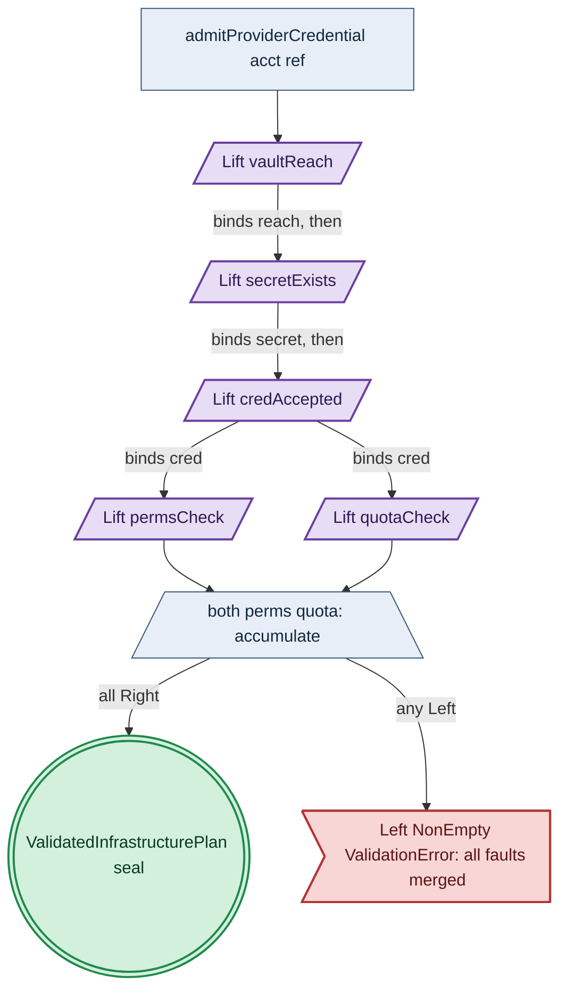
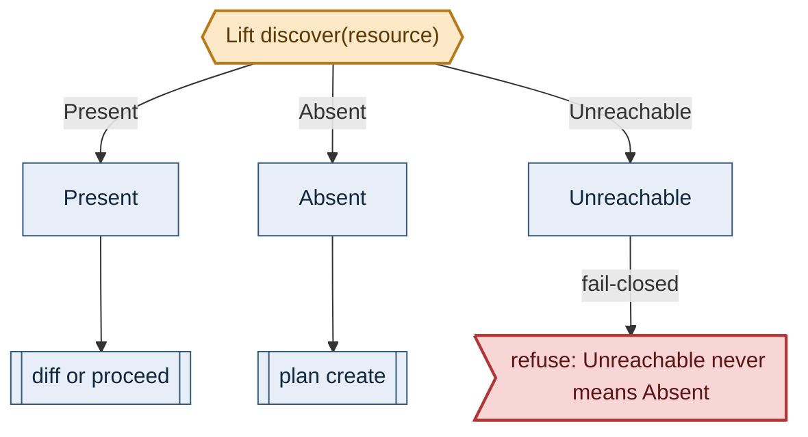

# Pure-Workflow Diagram Conventions

**Status**: Authoritative source
**Supersedes**: N/A
**Referenced by**: DEVELOPMENT_PLAN/phase_30_release_lifecycle.md, DEVELOPMENT_PLAN/phase_34_provider_deploy_checkpoint.md, DEVELOPMENT_PLAN/phase_35_provider_child_bringup.md, DEVELOPMENT_PLAN/phase_37_provider_dynamic_nodes.md, DEVELOPMENT_PLAN/phase_38_determinism_jitcache.md, DEVELOPMENT_PLAN/phase_39_infernix_lift.md, DEVELOPMENT_PLAN/phase_42_test_topology_dsl.md, DEVELOPMENT_PLAN/phase_43_spa_live_deploy.md, documents/documentation_standards.md, documents/engineering/README.md, documents/engineering/app_vs_deployment_doctrine.md, documents/engineering/apple_metal_headless_builds.md, documents/engineering/chaos_failover_doctrine.md, documents/engineering/cluster_lifecycle_doctrine.md, documents/engineering/cluster_topology_doctrine.md, documents/engineering/content_addressing_doctrine.md, documents/engineering/dsl_doctrine.md, documents/engineering/image_build_doctrine.md, documents/engineering/inforcespec_migration_doctrine.md, documents/engineering/manifest_generation_doctrine.md, documents/engineering/namespace_layout_doctrine.md, documents/engineering/network_fabric_doctrine.md, documents/engineering/preflight_validation_doctrine.md, documents/engineering/pulsar_client_doctrine.md, documents/engineering/pulumi_iac_doctrine.md, documents/engineering/readiness_ordering_doctrine.md, documents/engineering/resource_capacity_doctrine.md, documents/engineering/service_capability_doctrine.md, documents/engineering/storage_lifecycle_doctrine.md, documents/engineering/substrate_doctrine.md, documents/engineering/testing_doctrine.md, documents/engineering/vault_pki_doctrine.md, documents/illegal_state/illegal_state_catalog.md, documents/illegal_state/illegal_state_techniques.md
**Generated sections**: none

> **Purpose**: Single Source of Truth for the Mermaid visual vocabulary amoebius uses to draw its pure-functional workflows — the shape/colour/edge scheme, its authoring rules, and the honesty band it makes visible — delegated to by [documentation_standards.md §7](../documentation_standards.md#7-diagrams).

This document owns the *vocabulary*; the general rule that diagrams are flat, solid, and language-tagged is owned by [documentation_standards.md §7](../documentation_standards.md#7-diagrams) and restated here only where it constrains the scheme.

---

## 1. Why this doctrine exists

The corpus carries 65 Mermaid diagrams across roughly thirty documents, and every node is an undifferentiated rectangle or diamond with a prose label: there is no shared visual vocabulary, and none of the diagrams encode the proven/design-intent/runtime-checked honesty band that the prose everywhere depends on ([documentation_standards.md §6](../documentation_standards.md#6-honesty-the-proventestedassumed-discipline)). The defect surfaces at review time: a reader cannot tell from a picture whether a node is a proven sibling primitive, a Tier-1 decode-foreclosed value, or an unverified Tier-2 runtime residue, so the honesty layering a diagram most needs to convey is exactly what it omits.

Letting each document invent its own node styling fails the opposite way. When independent authors colour their own diagrams, the palettes diverge — one document's colour encodes an algebra role, another's a proof status, a third's a validation locus — and the same shape acquires conflicting meanings across documents, so a reader must re-learn the vocabulary per page. A cross-document scheme is therefore not optional polish; it is the only form in which a shared honesty axis is legible.

Amoebius fixes one scheme on two orthogonal axes: **node shape encodes the functional-programming role, and node colour encodes the honesty / validation-locus band**. One glance reads both what a node is and how trustworthy its claim is. The scheme is subgraph-free and uses only solid, labelled edges, so it composes with the constraint [documentation_standards.md §7](../documentation_standards.md#7-diagrams) already imposes.

What the scheme forecloses: per-diagram palettes, colour as the sole carrier of any distinction (every role and the accumulate/short-circuit split survive greyscale via shape and edge), and the nested-subgraph and dotted-edge forms that render unreliably. A recursive product that genuinely needs nesting is drawn under the flat profile of [§8](#8-recursion-profiles); a nested form is a disclosed deviation, never a default.

---

## 2. The two axes

**Node shape encodes the functional-programming role.**

| Shape | Mermaid | Role | Referent |
|---|---|---|---|
| rectangle | `["v"]` | a pure value that flows | `InForceSpec`, `BoundDeployment`, `Placement` |
| subroutine | `[["f"]]` | a total pure function / fold | `chain`, `project`, `planInfrastructure`, `fits`/`place` |
| hexagon | `{{"g"}}` | a typed gate that rejects at Tier-1 | Gate 1 typecheck, Gate 2 decode, three-valued `discover` |
| parallelogram | `[/"p"/]` | the one effectful seam / `Lift` probe | `runChainFromFrame`, `enact`, a Vault/AWS/SSH probe |
| diamond | `{"d"}` | a decision, or a short-circuit combinator | a predicate; the `Bind`/`Select` sublanguage |
| trapezoid | `[/"a"\]` | an accumulating combinator | `AllOf`/`Both`/`independently` |
| double circle | `((("s")))` | an opaque, constructor-private success seal | `ProvisionedSpec`, `ValidatedInfrastructurePlan` |
| flag | `>"r"]` | a fail-closed refuse / `Left` sink | `Unreachable → refuse`, `Left ProvisionError`, zero-writes |

**Node colour (`classDef`) encodes the honesty / validation-locus band** — the axis [documentation_standards.md §6](../documentation_standards.md#6-honesty-the-proventestedassumed-discipline) and [illegal_state_techniques.md §6](../illegal_state/illegal_state_techniques.md) already run on.

| classDef | Meaning |
|---|---|
| `provenPB` | proven in the sibling prodbox/hostbootstrap projects — evidence, not an amoebius result |
| `intent` | new amoebius design intent, Tier-1 in-process |
| `gate` | a typed gate/fold that rejects at Tier-1 |
| `decision` | a decision or predicate node |
| `effect` | the one effectful seam (IO) |
| `seal` | a constructor-private opaque success value |
| `refuse` | a fail-closed reject / sink |
| `runtime` | Tier-2 `runtime-checked`, unverified, deferred |

Shape and colour are independent: a `Lift` probe is a parallelogram whose colour is `effect` (or `runtime` where the observation is the unverified residue); a capacity fold is a subroutine whose colour is `intent`. No meaning rests on colour alone.

---

## 3. The canonical `classDef` header

Every diagram reproduces this header verbatim as the first lines inside the block, so styling is uniform across documents. The fills are light pastels carrying explicit dark strokes and node text, legible on both light and dark canvases.

```
  classDef intent   fill:#e8eef7,stroke:#33587a,color:#12283f,stroke-width:1px
  classDef provenPB fill:#dbeafe,stroke:#1e5fa8,color:#0b2f57,stroke-width:2px
  classDef gate     fill:#fde9c8,stroke:#b8791b,color:#5c3a06,stroke-width:2px
  classDef decision fill:#fdf3d8,stroke:#b8791b,color:#5c3a06,stroke-width:1px
  classDef effect   fill:#e7ddf5,stroke:#6b3fa0,color:#2f1a52,stroke-width:2px
  classDef seal     fill:#d3f0dd,stroke:#1f8a4c,color:#0c3a1f,stroke-width:2px
  classDef refuse   fill:#f8d6d6,stroke:#b23636,color:#5c1414,stroke-width:2px
  classDef runtime  fill:#e4e4e7,stroke:#71717a,color:#2f2f35,stroke-width:1px
```

A diagram that uses only some classes reproduces only the lines it needs; the class names never change.

---

## 4. Edge conventions

Only two solid edge forms appear; the third convention is the deliberate absence of an edge.

| Form | Meaning |
|---|---|
| `A -->\|"binds x"\| B` | a monadic, dependent, value-carrying edge; the label names the bound value, and the first `Left` short-circuits along it |
| `child --> combinator` | an accumulate-merge: several children flow into one trapezoid, all are evaluated, and their `Left`s merge |
| *(no edge between siblings)* | applicative independence, drawn by absence: independent operands touch only their combinator, never each other |

A fail-closed path is an ordinary labelled edge into a flag node: `X -->|"Unreachable"| refuse`. Dotted and animated edges are forbidden ([documentation_standards.md §7](../documentation_standards.md#7-diagrams)); the accumulate/short-circuit distinction is carried by node shape (trapezoid versus diamond), so it survives greyscale without a special edge.

---

## 5. The legend

```mermaid
flowchart LR
  v["pure value"]:::intent
  pb["proven in prodbox"]:::provenPB
  f[["total fold or function"]]:::intent
  gt{{"typed gate, Tier-1 reject"}}:::gate
  d{"decision or Bind or Select"}:::decision
  ac[/"accumulate: AllOf, Both"\]:::intent
  ef[/"effectful seam or Lift probe"/]:::effect
  sl((("opaque seal"))):::seal
  rf>"fail-closed refuse"]:::refuse
  rt["runtime-checked, Tier-2"]:::runtime
  v --> pb --> f --> gt --> d --> ac --> ef --> sl --> rf --> rt
  classDef intent   fill:#e8eef7,stroke:#33587a,color:#12283f,stroke-width:1px
  classDef provenPB fill:#dbeafe,stroke:#1e5fa8,color:#0b2f57,stroke-width:2px
  classDef gate     fill:#fde9c8,stroke:#b8791b,color:#5c3a06,stroke-width:2px
  classDef decision fill:#fdf3d8,stroke:#b8791b,color:#5c3a06,stroke-width:1px
  classDef effect   fill:#e7ddf5,stroke:#6b3fa0,color:#2f1a52,stroke-width:2px
  classDef seal     fill:#d3f0dd,stroke:#1f8a4c,color:#0c3a1f,stroke-width:2px
  classDef refuse   fill:#f8d6d6,stroke:#b23636,color:#5c1414,stroke-width:2px
  classDef runtime  fill:#e4e4e7,stroke:#71717a,color:#2f2f35,stroke-width:1px
```



---

## 6. Worked examples

### 6.1 A dependency spine with accumulating leaves

A `Bind` spine (`vaultReach ⇒ secretExists ⇒ credAccepted`) sequences dependent probes; the two independent properties share no edge and accumulate into `both`. Success constructs the opaque seal; any failure merges into one `Left`.



The referent algebra is owned by [preflight_validation_doctrine.md](./preflight_validation_doctrine.md); this diagram illustrates the scheme, and its `Lift`/`both`/seal semantics are normative there, not here.

### 6.2 A three-valued fail-closed probe

`discover` returns `Present | Absent | Unreachable`; an unreachable observation refuses rather than reading as absence ([cluster_lifecycle_doctrine.md §9](./cluster_lifecycle_doctrine.md#9-how-bring-up-and-teardown-are-implemented-the-reconciler-not-a-state-machine)).



---

## 7. Authoring rules

A pure-workflow diagram is warranted only when the workflow is a pure value — a `chain`/`Check`-shaped expression whose structure is decidable before any effect. A runtime timeline or a cluster topology belongs to a sequence diagram or its owning doctrine, not this scheme. One diagram shows one algebra tree; unrelated trees are split, not nested.

Every diagram carries a one-line honesty caption immediately beneath it, naming the strongest layer it reaches and its provenance, per [documentation_standards.md §6](../documentation_standards.md#6-honesty-the-proventestedassumed-discipline). Each node also tags its band through its `classDef`, so the honesty axis is legible in greyscale.

A diagram conforms when: the block is `flowchart` and language-tagged; the canonical header ([§3](#3-the-canonical-classdef-header)) is present; every node carries a shape and a `:::class`; only `-->` edges appear, none dotted or animated; independent siblings share no edge; accumulate children feed a trapezoid; value-carrying dependencies use a `-->|"binds …"|` label; every failure path terminates in a `refuse` flag; and an honesty caption follows.

---

## 8. Recursion profiles

A recursive product — `SubtreeValidated(n) = localProof(n) × Π children`, owned by [preflight_validation_doctrine.md](./preflight_validation_doctrine.md) — is drawn flat by default: nesting is shown by identifier prefixes and by the fan-in of child seals into the parent's combinator, with no `subgraph`. This obeys [documentation_standards.md §7](../documentation_standards.md#7-diagrams).

A nested-`subgraph` profile is permitted only where the nesting is itself the subject of the diagram, and only with an explicit deviation notice naming [documentation_standards.md §7](../documentation_standards.md#7-diagrams) directly above the block. The flat profile is the default; the nested profile is a disclosed exception, never a convenience.

---

## 9. Relationship to documentation_standards §7

[documentation_standards.md §7](../documentation_standards.md#7-diagrams) owns the general constraint — flat, solid, labelled, language-tagged, no subgraphs, no dotted edges — and delegates the pure-workflow *vocabulary* to this document. The no-subgraph and no-dotted-edge rules are stated in both places because they are hard rendering constraints; every other element of the scheme is owned here. A document adopting the scheme adds one back-link to this file near its first diagram and never restates the palette.

---

## Cross-references
- [Engineering Doctrine Index](./README.md)
- [Documentation Standards](../documentation_standards.md) — [§7](../documentation_standards.md#7-diagrams) delegates the diagram vocabulary here; [§6](../documentation_standards.md#6-honesty-the-proventestedassumed-discipline) the honesty band the colour axis encodes
- [Preflight Validation Doctrine](./preflight_validation_doctrine.md) — the `Check` algebra and forest proof tree these diagrams depict
- [Illegal State Techniques](../illegal_state/illegal_state_techniques.md) — the type/decode/runtime foreclosure layers the colour axis maps to
- [Illegal State Catalog](../illegal_state/illegal_state_catalog.md) — its foreclosure pipeline is the reference instance of this scheme applied to an existing flow
- [Development Plan](../../DEVELOPMENT_PLAN/README.md)
