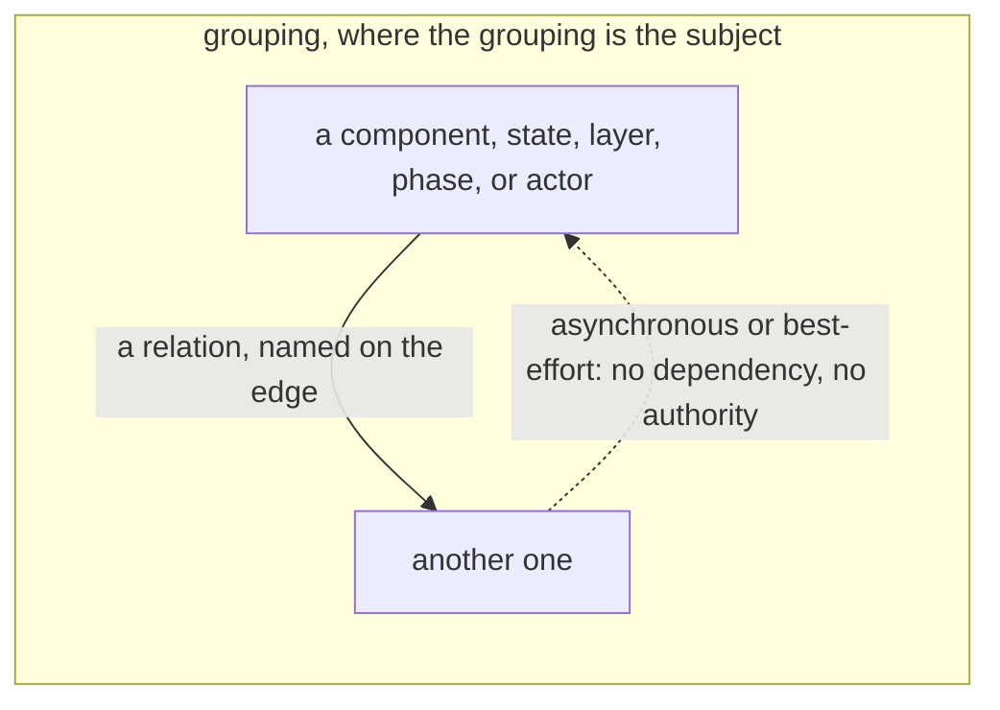
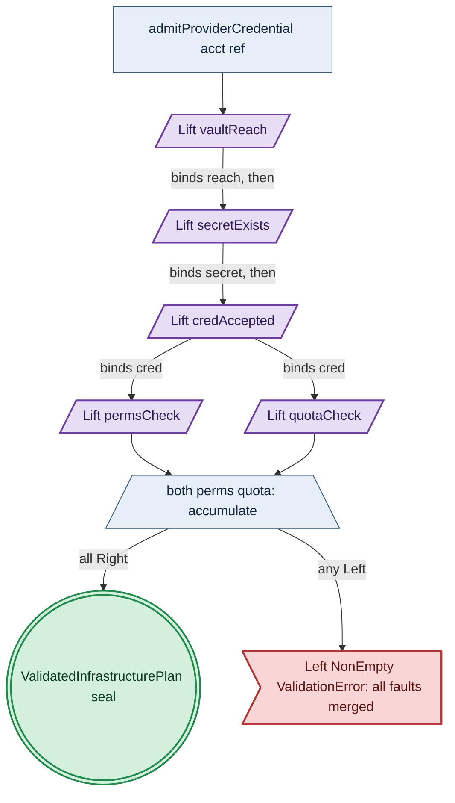
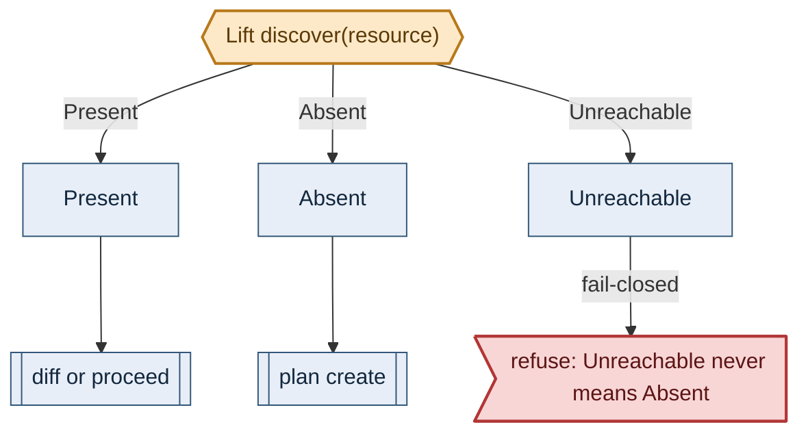

# Diagram Conventions: the Algebra and Orientation Registers

> **Purpose**: Single Source of Truth for the two Mermaid registers amoebius draws in — the algebra register's shape, colour, and edge vocabulary, the orientation register's deliberately semantics-light form, and the rule deciding which register a diagram belongs to — delegated to by [documentation_standards.md §7](../documentation_standards.md#7-diagrams).
> **Read this if**: a diagram is being added to a governed document, or an existing diagram is being reviewed for conformance.

This document owns both diagram vocabularies, the decision rule between them, the per-register conformance
conditions, the per-document quota, and the anti-patterns. It does not own the general constraints that bind
both registers — register declaration, captions, and single ownership — which stay with
[documentation_standards.md §7](../documentation_standards.md#7-diagrams). Reading it presumes familiarity
with the honesty discipline of
[documentation_standards.md §6](../documentation_standards.md#6-honesty-the-proventestedassumed-discipline),
whose bands the algebra register's colour axis encodes.

<details>
<summary>Link-graph metadata</summary>

**Status**: Authoritative source
**Supersedes**: N/A
**Referenced by**: DEVELOPMENT_PLAN/development_plan_standards.md, DEVELOPMENT_PLAN/phase_39_release_lifecycle.md, DEVELOPMENT_PLAN/phase_44_provider_deploy_checkpoint.md, DEVELOPMENT_PLAN/phase_45_provider_child_bringup.md, DEVELOPMENT_PLAN/phase_47_provider_dynamic_nodes.md, DEVELOPMENT_PLAN/phase_48_determinism_jitcache.md, DEVELOPMENT_PLAN/phase_54_test_topology_dsl.md, DEVELOPMENT_PLAN/substrates.md, documents/documentation_standards.md, documents/engineering/README.md, documents/engineering/app_vs_deployment_doctrine.md, documents/engineering/apple_metal_headless_builds.md, documents/engineering/chaos_failover_doctrine.md, documents/engineering/cluster_lifecycle_doctrine.md, documents/engineering/cluster_topology_doctrine.md, documents/engineering/content_addressing_doctrine.md, documents/engineering/dsl_doctrine.md, documents/engineering/formal_model_doctrine.md, documents/engineering/image_build_doctrine.md, documents/engineering/inforcespec_migration_doctrine.md, documents/engineering/low_code_ui_runtime_doctrine.md, documents/engineering/manifest_generation_doctrine.md, documents/engineering/namespace_layout_doctrine.md, documents/engineering/network_fabric_doctrine.md, documents/engineering/preflight_validation_doctrine.md, documents/engineering/pulsar_client_doctrine.md, documents/engineering/pulumi_iac_doctrine.md, documents/engineering/readiness_ordering_doctrine.md, documents/engineering/resource_capacity_folds.md, documents/engineering/resource_capacity_storage.md, documents/engineering/service_capability_doctrine.md, documents/engineering/storage_lifecycle_doctrine.md, documents/engineering/substrate_doctrine.md, documents/engineering/test_derivation_analysis.md, documents/engineering/testing_doctrine.md, documents/engineering/vault_pki_doctrine.md, documents/illegal_state/illegal_state_catalog.md, documents/illegal_state/illegal_state_techniques.md
**Generated sections**: none

</details>

## Contents
- [1. Why this doctrine exists](#1-why-this-doctrine-exists)
- [2. The two registers](#2-the-two-registers)
- [3. The algebra register: the two axes](#3-the-algebra-register-the-two-axes)
- [4. The canonical `classDef` header](#4-the-canonical-classdef-header)
- [5. Edge conventions in the algebra register](#5-edge-conventions-in-the-algebra-register)
- [6. The legends](#6-the-legends)
- [7. Worked examples](#7-worked-examples)
- [8. Authoring rules and conformance](#8-authoring-rules-and-conformance)
- [9. Recursion and nesting](#9-recursion-and-nesting)
- [10. The diagram quota](#10-the-diagram-quota)
- [11. Anti-patterns](#11-anti-patterns)
- [12. Relationship to documentation_standards §7](#12-relationship-to-documentation_standards-7)
- [Related Documents](#related-documents)

---

## 1. Why this doctrine exists

**The problem.** The corpus carries 131 Mermaid diagrams across 92 documents, drawn in two different visual
languages. Seventy-three encode a functional-programming role in node shape and an honesty band in node
colour; the other fifty-seven are component maps, topologies, and state machines drawn as undifferentiated
rectangles. Before this doctrine there were 75 across 42 documents and nothing marked which language a given
picture was written in, so a reader could not
tell whether a node was a proven sibling primitive, a Tier-1 decode-foreclosed value, an unverified Tier-2
runtime residue, or merely a box on a map. The honesty layering a diagram most needs to convey was exactly
what it omitted, and the defect surfaced at review time, silently, in a reader's head.

**Why the obvious alternative fails.** Letting each document invent its own styling fails in the opposite
direction. When independent authors colour their own diagrams the palettes diverge — one document's colour
encodes an algebra role, another's a proof status, a third's a validation locus — and the same shape acquires
conflicting meanings across documents, forcing a reader to re-learn the vocabulary on every page. Collapsing
to a single vocabulary fails too, from the other side: the algebra vocabulary is exact for an expression and
meaningless for a map, and a namespace drawn as a hexagon would claim to be a Tier-1 gate while a cluster
drawn `provenPB` would claim a sibling-project result. The honesty axis the colour scheme exists to carry
would be the first casualty.

**The rule.** amoebius fixes **two registers**. The **algebra register** draws one pure expression, on two
orthogonal axes: node shape encodes the functional-programming role, and node colour encodes the honesty and
validation-locus band, so one glance reads both what a node is and how trustworthy its claim is. The
**orientation register** draws a system, and carries no amoebius-defined visual semantics at all. Every
diagram declares which register it is in. The whole Mermaid language is available to both.

**What it forecloses.** Per-diagram palettes; colour as the sole carrier of any distinction, since every
algebra role and the accumulate/short-circuit split survive greyscale through shape and edge; and any
verification claim made by an orientation diagram, which can only name the document that carries the claim.
The orientation register additionally forecloses compressing information into styling, so a crowded topology
is split into several diagrams rather than colour-coded.

---

## 2. The two registers

**The rule.** A diagram is in the **algebra register** if and only if the whole picture is one expression:
every node denotes a value or a function in a single composition, and every edge denotes that the target
consumes the source's value. Every other diagram is in the **orientation register**.

Applied as three questions, in order — a *no* at any step settles the diagram as orientation:

1. Could the whole picture be written as one Haskell expression whose type could be named — `Check a`,
   `Either ProvisionError a`, a fold over a topology?
2. Does every arrow mean *the target consumes the source's value*, rather than *runs after*, *talks to*,
   *lives inside*, *transitions to*, *is a kind of*, *replicates to*, or *is a later phase than*?
3. Does the absence of an edge between two nodes assert their applicative independence?

The rule's sharp edge, stated as what it forbids: **the algebra register may not draw a component, a namespace, a cluster, a phase, a document, an actor, or a wall-clock ordering.** None of those is a term in an
expression. Conversely the orientation register may not use the eight role shapes of
[§3](#3-the-algebra-register-the-two-axes) or any `classDef`, so it cannot accidentally assert a foreclosure
layer.

Two boundary cases are settled here so they are not re-argued per document. A **reconcile loop is algebra**
and a **readiness-ordered bring-up graph is orientation**, although both are directed graphs of boxes: the
reconciler is one expression evaluated repeatedly, while the bring-up graph is a set of distinct services
under an ordering relation. A **pipeline over artifacts is algebra** and a **pipeline over running services is orientation**: a bake catalog composing into a Dockerfile, a build, and a manifest list is a composition of
total functions over values, while an edge proxy in front of an identity provider in front of a workload names
components that exist independently of one another.

| | algebra register | orientation register |
|---|---|---|
| subject | one pure expression | a system: components, states, layers, phases, types, actors |
| claim | a property of that expression's type | none of its own; it names the Single Source of Truth that carries the claim |
| Mermaid types | `flowchart` | any type that fits — `flowchart`, `stateDiagram-v2`, `sequenceDiagram`, `erDiagram`, `classDiagram`, `timeline`, `mindmap` |
| node shapes | the eight roles of [§3](#3-the-algebra-register-the-two-axes), mandatory | the diagram type's native node form; no amoebius semantics |
| `classDef` and `:::` | the canonical header of [§4](#4-the-canonical-classdef-header), mandatory | absent |
| colour | encodes the honesty and validation-locus band | none; the register is greyscale by construction |
| edges | `-->` only, per [§5](#5-edge-conventions-in-the-algebra-register) | any form the diagram type supports |
| absence of an edge | asserts applicative independence | asserts nothing |
| `subgraph` | not used; nesting is drawn per [§9](#9-recursion-and-nesting) | used freely where grouping is the subject |
| caption | the honesty caption of [§8](#8-authoring-rules-and-conformance) | `*Orientation.*` plus a link to the owning document |
| directive | `%% register: algebra` | `%% register: orientation` |

**The one-glance reading is that colour means the shapes are speaking, and grey means the picture is a map.**
That reading classifies every diagram in the corpus correctly, with no edits, because the two styles were
already kept apart by hand and none mixes them.

### The register directive

Every Mermaid block carries, on the line immediately after the diagram-type declaration, exactly one of:

```text
  %% register: algebra
  %% register: orientation
```

It renders as nothing. It sits *after* the type line because the first non-blank line of a block declares the
diagram type.

The directive is deliberately redundant with colour. The redundancy is the point: with the register declared,
the documentation lint can check the declaration **against the body**, and catch the one defect that is
otherwise unfalsifiable — an algebra diagram that has silently lost its `classDef` header, which is
indistinguishable from an orientation diagram until the two are read together.

### Why the orientation register has no visual semantics

**The problem.** A second closed shape-and-colour vocabulary would not merely double what a reader must learn.
It would collide: a reader who has learned that a hexagon rejects at Tier-1 reads every hexagon that way,
whatever a second table says, and no caption undoes that.

**Why the obvious alternative fails.** The tempting alternative is a small second palette — colour by
namespace, say, or by capability. It fails on this corpus's own rule that no meaning may rest on colour alone,
which would force a second shape axis to carry the same distinction, which is the collision again. It also
duplicates a normative mapping: capability-to-namespace assignment is owned by
[namespace_layout_doctrine.md](./namespace_layout_doctrine.md) and
[service_capability_doctrine.md](./service_capability_doctrine.md), and encoding it in a palette copies that
mapping into every diagram using the palette, where it rots.

**The rule.** The orientation register has no amoebius-defined visual semantics. All meaning lives in the node
label, the edge label, and the diagram type's own syntax — a `stateDiagram-v2` transition, a `sequenceDiagram`
message, an `erDiagram` cardinality — all of which are standard Mermaid carrying no amoebius claim. The
register is defined by what it may not do, which makes it impossible to misread as the algebra register.

**What it forecloses.** Compressing information into styling. A crowded orientation diagram is split into
several, which is the correct response anyway and the same discipline
[§8](#8-authoring-rules-and-conformance) already applies to algebra trees.

**An orientation diagram owns nothing.** It draws content owned by some document, and its caption links to
that owner. Two documents never draw the same system; the second links to the first
([documentation_standards.md §5](../documentation_standards.md#5-duplication-rules)).

---

## 3. The algebra register: the two axes

**Node shape encodes the functional-programming role.**

| Shape | Mermaid | Role | Referent |
|---|---|---|---|
| rectangle | `["v"]` | a pure value that flows | `InForceSpec`, `BoundDeployment`, `Placement` | | subroutine | `[["f"]]` | a total pure function / fold | `chain`, `project`, `planInfrastructure`, `fits`/`place` | | hexagon | `{{"g"}}` | a typed gate that rejects at Tier-1 | Gate 1 typecheck, Gate 2 decode, three-valued `discover` | | parallelogram | `[/"p"/]` | the one effectful seam / `Lift` probe | `runChainFromFrame`, `enact`, a Vault/AWS/SSH probe | | diamond | `{"d"}` | a decision, or a short-circuit combinator | a predicate; the `Bind`/`Select` sublanguage | | trapezoid | `[/"a"\]` | an accumulating combinator | `AllOf`/`Both`/`independently` | | double circle | `((("s")))` | an opaque, constructor-private success seal | `ProvisionedSpec`, `ValidatedInfrastructurePlan` | | flag | `>"r"]` | a fail-closed refuse / `Left` sink | `Unreachable → refuse`, `Left ProvisionError`, zero-writes |

**Node colour (`classDef`) encodes the honesty and validation-locus band** — the axis
[documentation_standards.md §6](../documentation_standards.md#6-honesty-the-proventestedassumed-discipline)
and [illegal_state_techniques.md](../illegal_state/illegal_state_techniques.md) already run on.

| classDef | Meaning |
|---|---|
| `provenPB` | proven in the sibling prodbox/hostbootstrap projects — evidence, not an amoebius result |
| `intent` | new amoebius design intent, Tier-1 in-process |
| `gate` | a typed gate/fold that rejects at Tier-1 |
| `decision` | a decision or predicate node |
| `effect` | the one effectful seam (IO) |
| `seal` | a constructor-private opaque success value |
| `refuse` | a fail-closed reject / sink |
| `runtime` | Tier-2 `runtime-checked`, unverified, deferred |

Shape and colour are independent: a `Lift` probe is a parallelogram whose colour is `effect`, or `runtime`
where the observation is the unverified residue; a capacity fold is a subroutine whose colour is `intent`. No
meaning rests on colour alone.

---

## 4. The canonical `classDef` header

Every algebra diagram reproduces this header verbatim as the last lines inside the block, so styling is
uniform across documents. The fills are light pastels carrying explicit dark strokes and node text, legible on
both light and dark canvases.

```text
  classDef intent   fill:#e8eef7,stroke:#33587a,color:#12283f,stroke-width:1px
  classDef provenPB fill:#dbeafe,stroke:#1e5fa8,color:#0b2f57,stroke-width:2px
  classDef gate     fill:#fde9c8,stroke:#b8791b,color:#5c3a06,stroke-width:2px
  classDef decision fill:#fdf3d8,stroke:#b8791b,color:#5c3a06,stroke-width:1px
  classDef effect   fill:#e7ddf5,stroke:#6b3fa0,color:#2f1a52,stroke-width:2px
  classDef seal     fill:#d3f0dd,stroke:#1f8a4c,color:#0c3a1f,stroke-width:2px
  classDef refuse   fill:#f8d6d6,stroke:#b23636,color:#5c1414,stroke-width:2px
  classDef runtime  fill:#e4e4e7,stroke:#71717a,color:#2f2f35,stroke-width:1px
```

A diagram that uses only some classes reproduces only the lines it needs; the class names never change. An
orientation diagram reproduces none of them.

---

## 5. Edge conventions in the algebra register

Only two edge forms appear; the third convention is the deliberate absence of an edge.

| Form | Meaning |
|---|---|
| `A -->\|"binds x"\| B` | a monadic, dependent, value-carrying edge; the label names the bound value, and the first `Left` short-circuits along it |
| `child --> combinator` | an accumulate-merge: several children flow into one trapezoid, all are evaluated, and their `Left`s merge |
| *(no edge between siblings)* | applicative independence, drawn by absence: independent operands touch only their combinator, never each other |

A fail-closed path is an ordinary labelled edge into a flag node: `X -->|"Unreachable"| refuse`.

The algebra register uses no edge form other than `-->`, and the restriction is not a rendering constraint.
In a language whose structure is total and in which the absence of an edge asserts applicative independence, a
second line style would carry a meaning the node shapes already carry: the accumulate/short-circuit
distinction is already the trapezoid against the diamond, and it survives greyscale. The orientation register
is under no such restriction and uses whatever edge forms its diagram type supports.

---

## 6. The legends

Each register has one legend, and a diagram carries the legend of the register it declares.
The algebra legend below is normative — a reader decodes shape and colour from it — while the orientation
legend names only what its caption must carry.

### 6.1 The algebra register


```mermaid
flowchart LR
  %% register: algebra
  v["pure value"]:::intent
  pb["proven in prodbox"]:::provenPB
  f[["total fold or function"]]:::intent
  gt{{"typed gate, Tier-1 reject"}}:::gate
  d{"decision or Bind or Select"}:::decision
  ac[/"accumulate: AllOf, Both"\]:::intent
  ef[/"effectful seam or Lift probe"/]:::effect
  sl((("opaque seal"))):::seal
  rf>"fail-closed refuse"]:::refuse
  rt["runtime-checked, Tier-2"]:::runtime
  v --> pb --> f --> gt --> d --> ac --> ef --> sl --> rf --> rt
  classDef intent   fill:#e8eef7,stroke:#33587a,color:#12283f,stroke-width:1px
  classDef provenPB fill:#dbeafe,stroke:#1e5fa8,color:#0b2f57,stroke-width:2px
  classDef gate     fill:#fde9c8,stroke:#b8791b,color:#5c3a06,stroke-width:2px
  classDef decision fill:#fdf3d8,stroke:#b8791b,color:#5c3a06,stroke-width:1px
  classDef effect   fill:#e7ddf5,stroke:#6b3fa0,color:#2f1a52,stroke-width:2px
  classDef seal     fill:#d3f0dd,stroke:#1f8a4c,color:#0c3a1f,stroke-width:2px
  classDef refuse   fill:#f8d6d6,stroke:#b23636,color:#5c1414,stroke-width:2px
  classDef runtime  fill:#e4e4e7,stroke:#71717a,color:#2f2f35,stroke-width:1px
```
*Design intent. The complete shape and colour vocabulary of the algebra register, owned by [§3](#3-the-algebra-register-the-two-axes); the chain of edges here carries no meaning beyond ordering the legend.*

### 6.2 The orientation register

The orientation register has no legend to learn. Every node is the diagram type's plain node form, colour is
absent, and every relation is named on its edge.


```mermaid
flowchart LR
  %% register: orientation
  subgraph grp["grouping, where the grouping is the subject"]
    a["a component, state, layer, phase, or actor"]
    b["another one"]
  end
  a -->|"a relation, named on the edge"| b
  b -.->|"asynchronous or best-effort: no dependency, no authority"| a
```
*Orientation. The whole vocabulary of the register, owned by [§2](#2-the-two-registers).*

---

## 7. Worked examples

Three diagrams, each drawn twice: once as it would be written wrongly, once as the register requires. The
wrong version is not a strawman — each reproduces a defect this corpus actually carried before the registers
were introduced.

### 7.1 A dependency spine with accumulating leaves

A `Bind` spine (`vaultReach ⇒ secretExists ⇒ credAccepted`) sequences dependent probes; the two independent
properties share no edge and accumulate into `both`. Success constructs the opaque seal; any failure merges
into one `Left`.


```mermaid
flowchart TD
  %% register: algebra
  start["admitProviderCredential acct ref"]:::intent
  vr[/"Lift vaultReach"/]:::effect
  se[/"Lift secretExists"/]:::effect
  ca[/"Lift credAccepted"/]:::effect
  perms[/"Lift permsCheck"/]:::effect
  quota[/"Lift quotaCheck"/]:::effect
  acc[/"both perms quota: accumulate"\]:::intent
  seal((("ValidatedInfrastructurePlan seal"))):::seal
  bad>"Left NonEmpty ValidationError: all faults merged"]:::refuse
  start --> vr
  vr -->|"binds reach, then"| se
  se -->|"binds secret, then"| ca
  ca -->|"binds cred"| perms
  ca -->|"binds cred"| quota
  perms --> acc
  quota --> acc
  acc -->|"all Right"| seal
  acc -->|"any Left"| bad
  classDef intent  fill:#e8eef7,stroke:#33587a,color:#12283f,stroke-width:1px
  classDef effect  fill:#e7ddf5,stroke:#6b3fa0,color:#2f1a52,stroke-width:2px
  classDef seal    fill:#d3f0dd,stroke:#1f8a4c,color:#0c3a1f,stroke-width:2px
  classDef refuse  fill:#f8d6d6,stroke:#b23636,color:#5c1414,stroke-width:2px
```
*Design intent, Tier-1. The referent algebra is owned by [preflight_validation_doctrine.md](./preflight_validation_doctrine.md); this diagram illustrates the scheme, and its `Lift`, `both`, and seal semantics are normative there, not here.*

### 7.2 A three-valued fail-closed probe

`discover` returns `Present | Absent | Unreachable`; an unreachable observation refuses rather than reading as
absence.


```mermaid
flowchart TD
  %% register: algebra
  d{{"Lift discover(resource)"}}:::gate
  present["Present"]:::intent
  absent["Absent"]:::intent
  unreach["Unreachable"]:::intent
  proceed[["diff or proceed"]]:::intent
  create[["plan create"]]:::intent
  refuse>"refuse: Unreachable never means Absent"]:::refuse
  d -->|"Present"| present
  d -->|"Absent"| absent
  d -->|"Unreachable"| unreach
  present --> proceed
  absent --> create
  unreach -->|"fail-closed"| refuse
  classDef intent  fill:#e8eef7,stroke:#33587a,color:#12283f,stroke-width:1px
  classDef gate    fill:#fde9c8,stroke:#b8791b,color:#5c3a06,stroke-width:2px
  classDef refuse  fill:#f8d6d6,stroke:#b23636,color:#5c1414,stroke-width:2px
```
*Design intent, Tier-1 decode-foreclosed. The three-valued observation is owned by [cluster_lifecycle_doctrine.md §9](./cluster_lifecycle_doctrine.md#9-how-bring-up-and-teardown-are-implemented-the-reconciler-not-a-state-machine).*

---

## 8. Authoring rules and conformance

An algebra diagram is warranted only when the workflow is a pure value — a `chain`- or `Check`-shaped
expression whose structure is decidable before any effect. A runtime timeline, a cluster topology, a
lifecycle, a layer stack, or a phase map is an orientation diagram
([§2](#2-the-two-registers)), not an unmarked algebra one. One algebra diagram shows one algebra tree;
unrelated trees are split, not nested.

Every diagram in both registers carries a one-line italic caption immediately beneath it. An algebra caption
names the strongest layer the diagram reaches and its provenance, per
[documentation_standards.md §6](../documentation_standards.md#6-honesty-the-proventestedassumed-discipline);
each node also tags its band through its `classDef`, so the honesty axis is legible in greyscale. An
orientation caption opens with `*Orientation.*`, states the honesty band in one clause, and carries at least
one link to the document that owns what is drawn. A caption is prose, and is bound by
[documentation_standards.md §8](../documentation_standards.md#8-tone-and-voice) and by the honesty check of
the documentation lint: a caption asserting proof at a layer that reaches only evidence fails the gate.

An **algebra** diagram conforms when the block is `flowchart` and language-tagged; `%% register: algebra` is
the line after the type declaration; the canonical header of
[§4](#4-the-canonical-classdef-header) is present; every node carries a shape and a `:::class`; only `-->`
edges appear; independent siblings share no edge; accumulate children feed a trapezoid; value-carrying
dependencies use a `-->|"binds …"|` label; every failure path terminates in a `refuse` flag; and an honesty
caption follows.

An **orientation** diagram conforms when the block is language-tagged; `%% register: orientation` is the line
after the type declaration; no `classDef` and no `:::` appear anywhere; every edge is labelled with the
relation it denotes, since a map whose arrows mean nothing in particular is the failure this register exists
to prevent; no node or edge names a term that neither the surrounding prose nor the linked owner also names,
in the same words; and a caption follows carrying a link to that owner.

**A diagram is never the sole statement of a normative rule.** Prose states the rule; the diagram shows its
shape. A rule changed in prose is changed in the diagram in the same commit. Where a diagram and the prose
around it disagree, the prose is authoritative and the diagram is the defect.

**One authoring hazard.** A line inside any fenced block, Mermaid included, must never begin with `data `,
`newtype `, or `type ` followed by a capitalised word: the documentation lint scans every fenced block for
type declarations and would attribute a spurious declaration to the document. Prefix such node identifiers, or
quote the label so the keyword is not line-initial.

---

## 9. Recursion and nesting

A recursive product — `SubtreeValidated(n) = localProof(n) × Π children`, owned by
[preflight_validation_doctrine.md](./preflight_validation_doctrine.md) — is drawn flat in the algebra
register: nesting is shown by identifier prefixes and by the fan-in of child seals into the parent's
combinator. The flat form is not a rendering concession. An algebra diagram is one expression, and a grouping
box is an operator with no denotation in that expression, so admitting one would introduce undefined structure
into the single diagram language whose value is that its structure is total.

The orientation register is under no such constraint, and `subgraph` is the ordinary way to draw a trust
boundary, a cluster, a namespace, or a process group there. A recursive topology whose nesting is itself the
subject is therefore an orientation diagram, and needs no deviation notice.

---

## 10. The diagram quota

A quota is a floor, not the programme. It catches the document that has drifted past the point of being
navigable without a picture; it does not decide which pictures are worth drawing.

1. **Document floor.** A governed document over **300 non-fenced lines** carries at least one diagram.
2. **Register balance.** A governed document over **600 non-fenced lines** carries at least one
   **orientation** diagram. Without this rule a long document can carry four excellent algebra diagrams and
   still offer a reader no map.

Where the quota cannot be met without drawing a diagram that restates the adjacent prose, the section is
over-long rather than under-illustrated, and the remedy is
[documentation_standards.md §10](../documentation_standards.md#10-document-shape), not a decorative picture.

---

## 11. Anti-patterns

1. **Quota-chasing.** A diagram added to satisfy [§10](#10-the-diagram-quota) that shows nothing the section's
   first paragraph already says is worse than no diagram: it costs a screen of vertical space and teaches a
   reader that diagrams in this corpus are decoration.
2. **A diagram that restates a list.** A diagram must show a relation a list cannot — a branch, a cycle, a
   concurrency, a layering, an ordering across actors, a cardinality, or an **absence** such as a missing edge
   or an unreachable state. A vertical chain of five boxes with unlabelled arrows is a list drawn slowly. The
   test is whether removing the diagram loses information.
3. **The same system drawn twice.** One diagram, one owner; every other document links to it. This is
   [documentation_standards.md §5](../documentation_standards.md#5-duplication-rules) applied to pictures, and
   the corpus has already demonstrated the failure — two documents draw the wild-ingress path with drifted
   labels.
4. **Register drift.** Colour in an orientation diagram, or a missing `classDef` in an algebra diagram, breaks
   the one-glance rule for every diagram in the corpus, not only that one.
5. **Inventing structure to make a picture legible.** Where a picture needs an edge the doctrine does not
   assert, either the edge is real and belongs in the prose first, or the caption disclaims it. A thematic
   grouping drawn as a graph invites a reader to infer a dependency that was never claimed.
6. **A diagram as the sole statement of a rule.** A picture cannot be cited, cannot be hedged precisely, and
   cannot carry an honesty band in words.
7. **Overclaiming captions.** A caption is prose and is checked like prose.
8. **Node labels that are paragraphs.** A node label names a term; the explanation lives in the prose above.
   Long labels defeat layout and duplicate that prose.

---

## 12. Relationship to documentation_standards §7

[documentation_standards.md §7](../documentation_standards.md#7-diagrams) owns the constraints binding both
registers — register declaration, the caption obligation, single ownership of a diagram, and the
language-tagged fence — and delegates both *vocabularies*, the decision rule, the conformance conditions, the
quota, and the anti-patterns to this document. That section also records the repeal of the earlier
`subgraph` and dotted-edge bans; this document restates the algebra register's narrower restriction on shape
and edge form, which rests on the denotation of an expression rather than on rendering behaviour. A document
adopting the algebra scheme adds one back-link to this file near its first diagram and never restates the
palette.

---

## Related Documents
- [Engineering Doctrine Index](./README.md)
- [Documentation Standards](../documentation_standards.md) — [§7](../documentation_standards.md#7-diagrams) delegates the diagram vocabularies here; [§6](../documentation_standards.md#6-honesty-the-proventestedassumed-discipline) the honesty band the colour axis encodes
- [Preflight Validation Doctrine](./preflight_validation_doctrine.md) — the `Check` algebra and forest proof tree these diagrams depict
- [Illegal State Techniques](../illegal_state/illegal_state_techniques.md) — the type/decode/runtime foreclosure layers the colour axis maps to
- [Illegal State Catalog](../illegal_state/illegal_state_catalog.md) — its foreclosure pipeline is the reference instance of this scheme applied to an existing flow
- [Development Plan](../../DEVELOPMENT_PLAN/README.md)
