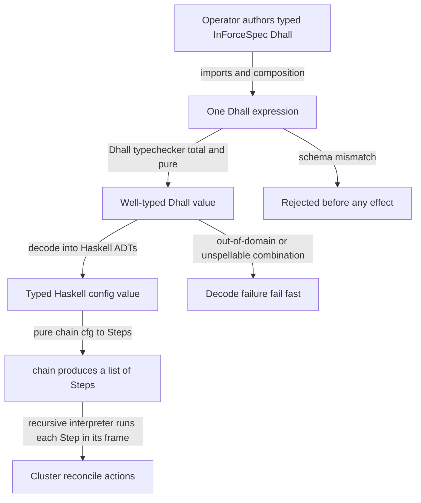
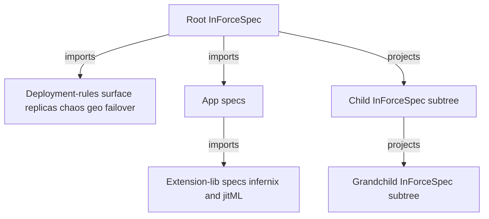

# The Amoebius DSL

**Status**: Authoritative source
**Supersedes**: N/A
**Referenced by**: DEVELOPMENT_PLAN/later_phases.md, DEVELOPMENT_PLAN/overview.md, DEVELOPMENT_PLAN/phase_00_documentation_suite.md, DEVELOPMENT_PLAN/phase_01_toolchain_spike.md, DEVELOPMENT_PLAN/phase_04_dhall_gate1_schema.md, DEVELOPMENT_PLAN/phase_05_gadt_decoder_gate2.md, DEVELOPMENT_PLAN/phase_06_illegal_state_corpus.md, DEVELOPMENT_PLAN/phase_08_capability_binder.md, DEVELOPMENT_PLAN/phase_10_chain_kernel_dryrun.md, DEVELOPMENT_PLAN/phase_13_spa_composition_representational.md, DEVELOPMENT_PLAN/phase_14_midwife_bootstrap_kind.md, DEVELOPMENT_PLAN/phase_22_live_dsl_singleton.md, DEVELOPMENT_PLAN/phase_23_app_tenancy.md, DEVELOPMENT_PLAN/system_components.md, documents/engineering/README.md, documents/engineering/app_vs_deployment_doctrine.md, documents/engineering/backup_recovery_doctrine.md, documents/engineering/bootstrap_sequence_doctrine.md, documents/engineering/capability_extension_doctrine.md, documents/engineering/cluster_lifecycle_doctrine.md, documents/engineering/cluster_topology_doctrine.md, documents/engineering/consistency_pacelc_doctrine.md, documents/engineering/content_addressing_doctrine.md, documents/engineering/daemon_topology_doctrine.md, documents/engineering/gateway_migration_doctrine.md, documents/engineering/generated_artifacts_doctrine.md, documents/engineering/host_cluster_comms_doctrine.md, documents/engineering/image_build_doctrine.md, documents/engineering/manifest_generation_doctrine.md, documents/engineering/monitoring_doctrine.md, documents/engineering/namespace_layout_doctrine.md, documents/engineering/platform_services_doctrine.md, documents/engineering/pulsar_client_doctrine.md, documents/engineering/pulumi_iac_doctrine.md, documents/engineering/readiness_ordering_doctrine.md, documents/engineering/service_capability_doctrine.md, documents/engineering/storage_lifecycle_doctrine.md, documents/engineering/tenancy_doctrine.md, documents/engineering/test_derivation_analysis.md, documents/engineering/testing_doctrine.md, documents/engineering/vault_pki_doctrine.md, documents/illegal_state/illegal_state_capability_messaging.md, documents/illegal_state/illegal_state_capacity.md, documents/illegal_state/illegal_state_catalog.md, documents/illegal_state/illegal_state_lifecycle.md, documents/illegal_state/illegal_state_ml_asset.md, documents/illegal_state/illegal_state_multicluster.md, documents/illegal_state/illegal_state_security.md, documents/illegal_state/illegal_state_storage.md, documents/illegal_state/illegal_state_techniques.md, documents/illegal_state/illegal_state_topology.md
**Generated sections**: none

> **Purpose**: Single source of truth for what the amoebius Dhall DSL is — a typed orchestration surface
> that carries parameters, not logic — the difference between the uploaded `InForceSpec` and the local
> `amoebius.dhall` `FrameConfig`, how specs compose totally, how they name secrets without holding them,
> and the contract by which a valid `InForceSpec` cannot represent illegal cluster state.

---

## 1. Why this doctrine exists

Kubernetes admits specifications that cannot work: a PVC that binds to no PV, a Gateway that points at
the wrong address, a NetworkPolicy that severs two services that must communicate, a NodePort that
exposes an admin surface publicly — each is valid YAML, accepted by the apiserver, so the contradiction
surfaces only at runtime. Amoebius inverts this: a **typed orchestration surface on which such
specifications do not type-check**.

This document owns four things about that surface:

1. **What the DSL is** — a typed Dhall *data* surface, distinct from the Haskell logic that acts on it,
   with two different authority surfaces: the uploaded `InForceSpec` and the local `amoebius.dhall`.
2. **Total composability** — how one `InForceSpec` is built by nesting Dhall fragments (app-in-cluster,
   extension-in-app, child-cluster-in-parent, test-topology-in-Dhall).
3. **Secrets-by-name** — the DSL holds only a *name* for each secret, never a value.
4. **The illegal-state-unrepresentable contract** — the layered principle, the two typed gates for
   structural legality, and the conditional post-bind infrastructure/materialization/provision seal for
   value- and inventory-dependent legality.

It does **not** own: the *catalog* of specific illegal states and the typing techniques that defeat each
one ([illegal_state_catalog.md](../illegal_state/illegal_state_catalog.md)); the application-logic-vs-deployment-rules
*split* substance ([app_vs_deployment_doctrine.md](./app_vs_deployment_doctrine.md)); the SecretRef /
Vault / parent-injection *mechanism* ([vault_pki_doctrine.md](./vault_pki_doctrine.md)); the standard
service *set* the DSL compiles to ([platform_services_doctrine.md](./platform_services_doctrine.md)); or the
*types* the surface carries but does not define — the capacity model
([resource_capacity_doctrine.md](./resource_capacity_doctrine.md)) and the compute-engine / topology axis
([cluster_topology_doctrine.md](./cluster_topology_doctrine.md)). The DSL *carries* those fields; those docs
*own* what makes each unrepresentable.
Phase order and status live only in [../../DEVELOPMENT_PLAN/README.md](../../DEVELOPMENT_PLAN/README.md).

---

## 2. Two languages, one system: Dhall carries params, Haskell carries logic

The amoebius DSL is not a scripting language, and it does not contain the deployment logic. Templating
puts the *how* in the config — loops, conditionals, string-built commands — placing untyped control flow
in configuration that the type-checker cannot inspect. Amoebius excludes that, per the recorded operator
decision: *"in general we do not want to use env vars or bash logic, we want everything to be
dhall"*. It gets there by a hard split between two languages:

- **Dhall is the data.** A *resolved, frozen* Dhall expression is typed, total, side-effect-free *data* — the
  effect-free claim holds for the resolved expression, not for arbitrary unresolved Dhall, whose *import
  resolution* is itself effectful ([§4](#4-total-composability)'s import policy). The uploaded
  `InForceSpec` describes the desired world; the local `amoebius.dhall` describes the authority and
  witnesses of this binary frame. Neither carries control flow that the binary executes, subprocess strings,
  or environment lookups. Each is read, type-checked, and decoded; neither ever "runs."
- **Haskell is the logic.** The actual reconcile logic is a pure Haskell value. Amoebius adopts
  hostbootstrap's **chain/Step algebra**: a project's deploy is a pure function `chain :: cfg -> [Step]`
  (`/home/matthewnowak/hostbootstrap/core/hostbootstrap-core/src/HostBootstrap/Step.hs`,
  `.../Chain.hs`). Each `Step` is *"the pure renderable shape plus the effectful reconcile action"* —
  a label, the frame it runs in, a `StepKind`, and a `stepRun :: HostConfig -> IO ()` action
  (`Step.hs`). The chain is the system; the Dhall only supplies the `cfg`.

That split is load-bearing in three ways:

- **The plan is the data.** Because `[Step]` is a pure value, `amoebius … --dry-run` can render the exact
  plan it would execute — `renderChainPlan` / `renderChain` (`Step.hs`, `Chain.hs`) — *without running a
  single action*. The preview is byte-for-byte what runs. There is no hidden imperative layer between
  the rendered plan and the effects.
- **Only the binary acts.** The recursive interpreter (`runChainFromFrame`, `Chain.hs`) runs a step's
  action only when the binary is *in that step's frame*; the descent logic itself is pure and unit-tested,
  and `runChainFromFrame` is *"the thin effectful seam."* The decoded Dhall value chose *what*; the
  Haskell decides *how and when*.
- **No bash, anywhere.** Tool discovery is lazy and full-path (no `PATH`, no env vars); that contract is
  owned by [substrate_doctrine.md](./substrate_doctrine.md). The relevance here is that it is the *chain
  steps*, written in Haskell, that invoke tools by absolute path — never a Dhall-embedded shell string.

---

## 3. The orchestration surface: parameters, context, witness

Amoebius has **two Dhall authority surfaces**, and their names are intentionally different:

- **`InForceSpec`** — the dynamic, scope-relative desired-state value. The operator authors Dhall locally
  and uploads it through the singleton's `dhall update` admin endpoint; after acceptance it is not a flat
  file named `in-force.dhall`. Its home is the Vault-Transit-enveloped MinIO object/ref owned by the
  in-cluster singleton. A root `InForceSpec` describes the full forest. A child `InForceSpec` is the
  parent-minted subtree rooted at that child: the child itself plus descendants, never siblings or
  ancestor-only authority.
- **`amoebius.dhall` / `FrameConfig`** — the static local sibling config for this running copy of the
  `amoebius` binary. It tells the binary which frame it inhabits, which authority it has, and which local
  runtime witnesses must hold. It may include bootstrap-local facts, but it is not the cluster/tree desired
  state. This is the amoebius form of hostbootstrap's **binary-context contract**: every binary frame reads
  one local Dhall value carrying the context and witness material it needs
  (`/home/matthewnowak/hostbootstrap/core/hostbootstrap-core/src/HostBootstrap/Context.hs`; this is exactly
  the shape the sibling prodbox project proved as its Tier-0 `parameters + context + witness` surface in its
  `config_doctrine.md` §0).

The split keeps the surfaces honest:

- **Parameters** — the `InForceSpec`'s typed knobs: the compute engine and its node topology
  ([cluster_topology_doctrine.md](./cluster_topology_doctrine.md)), replica counts, the per-host capacities,
  storage backings and budgets, topic retention/offload policies, and scaling policies
  ([resource_capacity_doctrine.md](./resource_capacity_doctrine.md)), the app specs, the deployment rules.
  This is the bulk of what an operator authors and the part most people mean when they say "the DSL." The DSL
  *carries* these typed fields; the types that make an over-committed, unbounded, or incompatible value
  unrepresentable live in those owning docs, not here ([§5](#5-the-illegal-state-unrepresentable-contract)).
- **Context** — the `FrameConfig`'s statement of *where this binary sits* in the composed topology: its
  `contextKind`, its place in the `topologyFrames` chain, its `currentFrame`, the `capabilities` it claims,
  the `allowedCommandClasses` it may run, the `resourceEnvelope` it lives inside, and the `childContextKinds` it may spawn
  (`Context.hs`, `BinaryContext`). The local `amoebius.dhall` is *minted
  forward* into each child frame (`contextForKind`, `childContext`, the `context-init` step), which is
  what makes the recursive descent of [§2](#2-two-languages-one-system-dhall-carries-params-haskell-carries-logic) self-describing.
- **Witness** — the `FrameConfig`'s locally-checkable runtime facts (`RuntimeWitness`, `Context.hs`):
  e.g. *a required file or unix socket exists*. A command is gated on its witnesses passing (`validateRuntimeContext`,
  `commandAllowed`), so a binary refuses to act in a context it does not actually inhabit. Amoebius
  **adapts** this vocabulary to its no-environment-variables invariant: it relies on file/socket-existence
  witnesses, not on `PATH`/env-equality kinds — the substrate tool-discovery contract that replaces those
  is owned by [substrate_doctrine.md](./substrate_doctrine.md).

The point of separating these three is that the orchestration surface is **self-validating before it
acts**: the `InForceSpec` says what to build, context says who is allowed to build it here, and witnesses
confirm the binary is actually standing where the context claims. All three are typed Dhall, none is a secret
([§6](#6-secrets-are-names-never-values)), and none is logic ([§2](#2-two-languages-one-system-dhall-carries-params-haskell-carries-logic)).

The uploaded value is also a storage producer; “it lives in MinIO” is not a capacity exemption. After
resolve/freeze/typecheck/decode, the binder derives its canonical serialized byte identity as the
`InForceSpecSnapshot` entry of a `ControlPlaneStateObjectDemand`. That closed demand also covers only
`ManagedResourceRegistry`, `ReconcileJournal`, `ValidationLedger`, and content-addressed `JobCompletion`;
Pulumi checkpoints use their distinct
producer arm. Each has a required `StorageBudgetId`, old/new CAS retention, failure/orphan bounds, and
snapshot-bound mutation admission. Source↔producer equality, the six-arm object-store merge, MinIO geometry,
and the control-plane gateway's own complete pod envelope must provision before the upload endpoint can
persist the candidate or advance the pointer. A one-byte-short backing, omitted state entry, missing gateway
capacity, or changed live snapshot yields zero object writes. There is no open “other control-plane bytes”
constructor.

**How the minted context reaches each frame.** The child `amoebius.dhall`/`FrameConfig` of the Context
bullet is not written to a host file and bind-mounted in; it is **delivered in place, on the lift's `stdin`
channel**. At each frame
handoff the parent streams the *narrowed child projection* into the descending self-invocation, whose
entrypoint writes it to that frame's own sibling `amoebius.dhall` and then `exec`s the binary —
hostbootstrap's
`ConfigDelivery` (`{ cdWritePath, cdExecPath, cdPayload }`) carried by `liftStdin` through the recursive
`runChainFromFrame`
(`/home/matthewnowak/hostbootstrap/core/hostbootstrap-core/src/HostBootstrap/Lift.hs`,
`.../Chain.hs`); the container handoff keeps stdin open and overrides the entrypoint to
`sh -c "cat > <sibling>.dhall && exec <binary>"`. Two invariants fall out, and [§5](#5-the-illegal-state-unrepresentable-contract) leans on both:

- **Only the projection crosses.** The narrowed child config travels on `stdin` alone — never in `argv`,
  never as a bind-mount, and never as a host-side file at rest. The parent's *full* config never crosses the
  boundary, only the child's own frame projection.
- **The parent mints; the child never rewrites.** A frame receives its `amoebius.dhall` read-only at entry
  and has
  no verb that edits its own config — minting is exclusively a parent act (the `context-init` step, one frame
  up). This is the doctrine answer to the standing question *"can a host binary's `amoebius.dhall` ever change? only
  the parent should do that"*: a frame cannot rewrite its own config; only its parent mints it.

The one exception is the terminal **in-cluster pod** frame, whose config is delivered as a rendered
`ConfigMap` mount ([manifest_generation_doctrine.md](./manifest_generation_doctrine.md)) rather than on
`stdin`; the `stdin` mechanism covers the VM/container bootstrap-lift frames. Like the rest of [§2](#2-two-languages-one-system-dhall-carries-params-haskell-carries-logic)–[§3](#3-the-orchestration-surface-parameters-context-witness), this
delivery is **proven in hostbootstrap and inherited as evidence** — not an amoebius-built result
([documentation_standards.md §6](../documentation_standards.md#6-honesty-the-proventestedassumed-discipline)).

---

## 4. Total composability

Total composability is stated in the original vision: *"the key to making amoebius really work well is a great
.dhall DSL that ties everything together. total composability."* An `InForceSpec` is never one
monolith — it is a composition built from smaller typed pieces via Dhall's native import system. Because
every *resolved, frozen* piece is typed, total, side-effect-free data ([§2](#2-two-languages-one-system-dhall-carries-params-haskell-carries-logic)), the pieces nest *without limit
and without leakage*: a frozen import can never smuggle in an effect or a partial value.

**Import policy: resolve-and-freeze before decode.** Dhall *import resolution* is itself effectful — an
`env:VAR` import reads the process environment and a remote `http(s):` import fetches over the network, both
at decode time — so an unrestricted uploaded `InForceSpec` would make Gate-2 decode
([§5](#5-the-illegal-state-unrepresentable-contract)) an effectful surface, colliding with the no-env-vars /
no-`PATH` invariant ([§2](#2-two-languages-one-system-dhall-carries-params-haskell-carries-logic), owned by
[substrate_doctrine.md](./substrate_doctrine.md)) and the no-arbitrary-URL invariant
([illegal_state_catalog.md §3.25](../illegal_state/illegal_state_ml_asset.md#325-an-ml-asset-named-by-arbitrary-url-or-an-unready--unlanded-model)).
Amoebius therefore **forbids** `env:` and remote (`http(s):`) imports in any authored or uploaded spec, and
**resolves-and-freezes** every spec to a fully-local, semantic-integrity-hashed (Dhall `sha256:…`) expression
at `dhall update` upload time, before decode. The effect-free/total claim of
[§2](#2-two-languages-one-system-dhall-carries-params-haskell-carries-logic) holds for this *resolved, frozen*
expression — never for arbitrary unresolved Dhall — and the policy is enforced at the Phase-4/5 gate
([§5](#5-the-illegal-state-unrepresentable-contract)).

Total composability runs along four concrete axes, each owned in detail by a sibling doc:

- **App-in-cluster.** An app is *"a container … and a `.dhall` for that app"*.
  The app spec — its LB services, Keycloak-backed auth rules, durable storage (MinIO buckets, block
  storage, Postgres), and Pulsar topic lifecycles — is a typed fragment that nests inside the cluster
  spec. The generic reusable app chart is populated *from* that fragment, so an operator never writes Helm
  values by hand.
- **Two surfaces per app: logic vs rules.** A locked invariant: **application logic and deployment rules
  are separate DSL surfaces** (DEVELOPMENT_PLAN cross-cutting invariants). The app
  is written once; HA replica count, chaos testing, geo-replication, and failover are an *orthogonal*
  deployment-rules surface that composes over it. That split is owned by
  [app_vs_deployment_doctrine.md](./app_vs_deployment_doctrine.md); this doc owns only the fact that the
  DSL *has* two composable surfaces.
- **Extension-lib-in-app.** ML extension libraries nest the same way: an extension Dhall fragment is nested
  inside the `InForceSpec`. infernix and jitML are libraries unified
  under the DSL, not separate products (DEVELOPMENT_PLAN), so an inference workload is a nested typed
  fragment, not a bolt-on. The precise seam by which such a library registers — the typed **`ExtensionSpec`**,
  merged at link time into the one binary — is spelled out below; this axis's closed v1 set is
  `{infernix, jitML}`. Each of infernix and jitML additionally ships a **demo web app** — a single-page web
  app that drives its ML workflow and renders its results. Per
  [app_vs_deployment_doctrine.md §8](./app_vs_deployment_doctrine.md#8-shared-library-use-is-application-logic),
  a demo web app is *application logic that uses* its extension — **not** itself an extension (an arbitrary
  container app is never an extension) — so it composes as an ordinary app-spec fragment, and these two demo
  web apps are the **SPA-composition fixtures** (SPA composition itself is front-loaded to Phase 13, below).
- **Child-cluster-in-parent.** The name *amoebius* is the recursion: a cluster spawns children, which
  spawn their own. A child receives only its own scoped `InForceSpec` — *"including
  their childrens'"* but nothing about siblings — and the whole tree is rolled out from the root. The
  parent/child trust, secret-injection, and spawning lifecycle are owned by
  [vault_pki_doctrine.md](./vault_pki_doctrine.md) and the cluster-lifecycle doctrine; here the point is
  that an entire child cluster spec is itself a composable fragment of the parent's.

A fifth axis is the **test topology**: a test is a Dhall-authored `InForceSpec` that spins up resources,
runs a workflow, and tears down resources — the same composition, with a teardown
obligation. The testing surface is owned by the testing doctrine; it is named here only as proof that even
*testing* is expressed in the one composable DSL rather than a parallel harness language.

**SPA composition, front-loaded to Phase 13.** Composing a multi-service app together with an ML-workflow
**demo web app** (the infernix/jitML fixtures above) as **typed Dhall fragments** — a single-page-app
composition over this same extension seam — has its *representational / type-level* validity front-loaded to
**Phase 13**, where it is proven at the Tier-1 design/spec layer (the same authoring-time gates of
[§5](#5-the-illegal-state-unrepresentable-contract)); only the **live SPA deploy** stays in **Phase 37**.

### The v1 extension seam: `ExtensionSpec` (linked, not loaded)

The Extension-lib-in-app axis has a precise **registration seam**. A `.dhall` cannot nest an arbitrary
foreign product; what it nests is an **`ExtensionSpec`** — the one typed handle by which a *vendored* library
plugs into the surface:

    ExtensionSpec :
      { extDhall        : <a typed Dhall sub-catalog nested inside the InForceSpec>
      , extChain        : cfg -> [Step]
      , extCapabilities : List Capability
      , extMonitoring   : NonEmpty MonitoringSurface
      }

    MonitoringSurface =
      < Slo : WorkflowMonitor | TensorBoard : { backing : ObjectStoreRef, access : AccessScope } >

Four parts, each already load-bearing above: `extDhall` is a nested typed Dhall sub-catalog ([§4](#4-total-composability)'s
composition); `extChain :: cfg -> [Step]` is the extension's slice of the chain/Step algebra ([§2](#2-two-languages-one-system-dhall-carries-params-haskell-carries-logic) — an
extension carries *no* logic the DSL does not already carry as `[Step]`); `extCapabilities` are the
capability declarations it exports into the capability surface
([service_capability_doctrine.md](./service_capability_doctrine.md)); and `extMonitoring` is the **mandatory,
non-optional** `NonEmpty` list of monitoring surfaces the extension stands up — a closed union of the generic
`Slo` (Prometheus/Grafana) and jitML's `TensorBoard` (backed by MinIO), with no open "other service" arm, so
an extension that declares no monitoring has no inhabitant
([monitoring_doctrine.md](./monitoring_doctrine.md)).

**Linked, not loaded.** The v1 set is **closed at `{infernix, jitML}`**; each contributes one
`ExtensionSpec`, and the specs are merged at **compile/link time into the one binary** — no dlopen, no
per-extension image, no runtime plugin path. The merge adopts hostbootstrap's additive `ProjectSpec` stream
algebra and its **anti-shadow `validateProjectSpec`** (`.../CLI.hs`) — the duplicate-id,
constructor-collision, and empty-suite rejections — so two extensions cannot silently shadow each other's
ids or constructors; but it **drops hostbootstrap's packaging** (no per-project binary or image, no dlopen).
This is *sibling evidence, not an amoebius result*: hostbootstrap proves the `ProjectSpec` algebra and the
anti-shadow validator; amoebius reuses the algebra and discards the packaging.

**A nested `extDhall` is not privileged.** It faces exactly the two gates of [§5](#5-the-illegal-state-unrepresentable-contract) and the catalog's total
folds — no unbounded arm, capacity accounted, topology relations satisfied — like any other fragment. In
particular it introduces **no second secret store**: an extension names its secrets as `SecretRef`s ([§6](#6-secrets-are-names-never-values)) and
may **not** carry a key/secret store of its own. (infernix's k8s-`Secret` store is exactly the divergence
this forbids — *sibling evidence of an anti-pattern*, corrected here, not a shipped amoebius behavior.)

### v1 vs v2: linked extensions vs the third-party extension DSL

The `ExtensionSpec` seam is **Path 1**, and it is deliberately *not* open to the world:

- **v1 — Path 1 (linked).** The closed set `{infernix, jitML}` is *vendored*: each links into
  the one binary through its `ExtensionSpec`. This is the only extension mechanism v1 ships.
- **v2 — Path 2 (the Haskell extension DSL).** A non-vendored third party enters *only* through the future
  **Haskell-as-DSL + custom AST checker + native JIT** — the forward pointer of [§8](#8-the-haskell-extension-dsl-forward-pointer-only), scheduled as a
  later-phases candidate
  ([later_phases.md](../../DEVELOPMENT_PLAN/later_phases.md#candidate-phase-haskell-extension-dsl--custom-ast-checker--native-jit)).
  Path 2 is later-phases design intent, not built.

And the boundary that keeps the seam honest: **an arbitrary container app is NOT an extension.** A party
unwilling to be linked gets no `ExtensionSpec`; it runs as an ordinary app-spec `.dhall` workload —
*"v1 can be an orchestrator for arbitrary containers"* — which is application logic, not extension
([app_vs_deployment_doctrine.md §8](./app_vs_deployment_doctrine.md#8-shared-library-use-is-application-logic)).
Extension = linked-and-vendored; container app = composed-and-orchestrated; the two are different axes. A
future ML family is **deferred**: this pass provisions the seam but names no member beyond the closed set —
a later family would enter via Path 1 once its math is absorbed into a vendored library, or via Path 2.

### The ML-asset types an extension `.dhall` carries: `EngineRuntime` vs `ModelArtifact`

Because infernix and jitML nest as `ExtensionSpec`s, their `extDhall` carries two ML-asset types the surface
must hold apart — and, per [§1](#1-why-this-doctrine-exists), *carries but does not define*:

- **`EngineRuntime`** — a **closed** union of substrate-tagged, *baked* engine identities. It has **no
  `Url`/`Download`/`Fetch` arm**: an engine is *selected by substrate*, never fetched, and exists the moment
  the pod does (because the extension links as a library, not a build-time download).
- **`ModelArtifact`** — a by-name / content-address **reference** into the content store. Its `ArtifactRef`
  is obtainable **only once the `.ready` sentinel exists *and* the artifact carries a provenance witness** —
  a committed producing checkpoint or a pinned content-addressed import — so there is no constructor for an
  unready *or* unwitnessed reference (type-foreclosed for the witness's *presence*; whether the witnessed bytes
  were truly trained is runtime residue, owned downstream, not a decode-time claim).

The relation between them is itself typed: **a `ModelArtifact` must be servable by an `EngineRuntime` present
on the serving substrate lane** (the lane where inference runs, not where the model was produced) — an unmatched
model has no landing engine (a decode-foreclosed total relation over the serving lane's engine set, the same topology-relation-over-a-collection technique [§5](#5-the-illegal-state-unrepresentable-contract) defers to the catalog).
The *detail* of all three — the no-`Url` closure, the `.ready`-plus-provenance-witness gate, and the model↔engine match — is owned by
[illegal_state_catalog.md §3.25](../illegal_state/illegal_state_ml_asset.md#325-an-ml-asset-named-by-arbitrary-url-or-an-unready--unlanded-model) and
[content_addressing_doctrine.md §4.5](./content_addressing_doctrine.md#45-the-ml-asset-lifecycle-one-bounded-content-addressed-cache-resolved-on-first-miss); this doc records only that the
extension seam *carries* these typed fields and defers their unrepresentability there.

The same extension seam carries jitML's **training-run** shape as three further *carried, not defined* typed
fields — how a run is initialized, fed, and bounded:

- **`TrainInit`** — from-scratch, or **continue** from a provenance-witnessed `ModelArtifact` (fine-tune /
  warm-start), composing recursively with the witness gate on `ModelArtifact` above.
- **`TrainData`** — a content-addressed dataset, or a Pulsar **`Feed`** consumed from a cursor.
- **`TrainBudget`** — a bounded step/epoch count, or a **`Continuous`** run committing a checkpoint every cadence.

As with `EngineRuntime`/`ModelArtifact`, the DSL *carries* these fields on an extension's `extDhall`; what
makes an unbounded, un-checkpointed, or non-deterministically-ordered run **unrepresentable** — the closed
union shapes, the no-bare-unbounded-`Continuous` foreclosure, and the fold that keeps a `Feed`'s consumed
prefix content-addressed rather than cursor-keyed — is owned by
[content_addressing_doctrine.md §4.6](./content_addressing_doctrine.md#46-the-training-run-topology-fine-tune-chains-and-continuous-feeds-without-an-unbounded-arm)
and [illegal_state_catalog.md](../illegal_state/illegal_state_catalog.md), not defined here.

### The stretched-node reachability field the surface carries: `Networking`

[§4](#4-total-composability)'s child-cluster and attach-pool composition carries one further *carried, not
defined* typed field: a mandatory **`Networking c`** capability on any **stretched-node / attach** spec — a
node or host worker whose declared network-locality `Site` differs from the control plane's, reached across
the WAN — declaring *how* it reaches the cluster. Like the ML-asset types above, the DSL only *carries* the
field; what makes it total — that `Networking c = Gateway … | Vpn …` has **no arm** collapsing a
secure-gateway reach into wild ingress, and that a stretched shape has **no reachability witness** without a
declared `Networking c` — is owned by
[network_fabric_doctrine.md §5](./network_fabric_doctrine.md#5-the-security-boundary-generalizes-localhost--authenticated-fabric)
and [illegal_state_catalog.md §4.3](../illegal_state/illegal_state_techniques.md#43-gadt-indexed-state-machines--only-legal-transitions-are-typed),
never here.

---

## 5. The illegal-state-unrepresentable contract

The claim is layered, not a blanket assertion that every bad target is uninhabitable. **Closed structural
illegality has no constructor; value- and inventory-dependent illegality is rejected by a total staged
planning/provision check; initial infrastructure effects require a validated plan plus single-use plan/action
tokens; and only the successfully sealed result can authorize Kubernetes rendering.** A raw, well-typed
`InForceSpec` may therefore describe a quantitative overcommit or a CUDA workload paired with CPU-only
inventory. That input is
representable for diagnostics, but it has no deployable representation because infrastructure planning or
`provision` returns `Left` and cannot construct the opaque `ProvisionedSpec`. The contract has a one-line form
an operator can hold onto:

> **Gate 1/2 and bind/expand produce only intent. `planInfrastructure` derives demand from that exact intent
> and declared supply or forest budget: `NoInfrastructureRequired` witnesses the explicit
> `ObservedInfrastructureMaterialization.AlreadyMaterialized` state arm, while its required arm can mutate
> only after its one `ProvisionedProviderActionBatch` is snapshot-validated as the matching
> `ValidatedInfrastructureActionBatch` and the plan/action tokens are CAS-consumed. Receipt-bound
> provider/host readback constructs `ProvisionContext`; only
> `provision` can then construct the opaque `ProvisionedSpec` accepted by deployment-level `renderAll`.**

That guarantee is bought by **two typed gates plus one conditional post-bind
plan/materialize/provision seal**. Raw decoded or bound values authorize no effect; the only pre-spec effect
authority is the validated initial-infrastructure plan and its single-use plan/action tokens, and it cannot
render. This section owns the *principle* and the *mechanism*; the **inventory** of specific illegal states
(PVC↔PV binding, gateway misconfig, DNS
binding the wrong address, certs, taints/tolerations/affinity, NetworkPolicy partitions, backdoor ingress,
resource overcommit, compute-engine/substrate incompatibility, illegal cluster topology, unbounded storage,
and un-tiered topic lifecycles) and the **techniques** that defeat each (capability/phantom tags,
GADT-indexed state machines, ownership indices, content-address totality, the capacity-accounting fold, and
topology relations over a collection) are owned in full by
[illegal_state_catalog.md](../illegal_state/illegal_state_catalog.md) — do not look for them restated here.

### Gate 1 — the Dhall typechecker

Dhall is a *total*, strongly-normalizing, side-effect-free configuration language. An expression that does
not match its declared schema simply **does not type-check**, and a non-terminating or effectful
expression cannot be written at all. This gate fires entirely *before the amoebius binary runs* — at
authoring time, in the operator's editor, in `dhall type`, in CI. A union with no arm for "insecure
ingress" gives the author no syntax to request insecure ingress; a record that requires a PV reference for
every PVC gives no way to omit it. The schema is the boundary, and the boundary is mechanical.

### Gate 2 — the Haskell typed decoder

A well-typed Dhall value still has to become a Haskell value before the chain ([§2](#2-two-languages-one-system-dhall-carries-params-haskell-carries-logic)) can use it. The
local `amoebius.dhall` `FrameConfig` is decoded from the sibling file; the uploaded `InForceSpec` is
decoded from the singleton's decrypted in-memory payload. Both use the native `dhall` library in-process —
`Dhall.inputFile auto` for file-backed values, and the corresponding in-memory decode for uploaded values
(the exact file-backed call hostbootstrap uses is `decodeContextFile = inputFile auto`,
`Context.hs`; the same pattern the sibling prodbox project documents in its `config_doctrine.md` §4). Two
things happen here:

- **Decoding is total and fail-fast.** A malformed or out-of-domain value surfaces as an `Either`/
  structured error (`readContextFile` returns `Left (ContextDecodeFailed …)` rather than throwing into a
  half-applied effect; `Context.hs`). Nothing is reconciled against a config that did not fully decode.
- **The ADTs make structurally illegal combinations un-spellable and refinements reject local value
  failures.** Sum types and type indices give closed illegal shapes no inhabitant; total smart constructors
  can reject constructible values. Gate 2 produces only decoded, unprovisioned declarations. It does not
  decide whole-deployment placement, storage peaks, live target compatibility, or inventory sufficiency.

### Post-gate seal — bind/expand, conditionally materialize infrastructure, provision

The pure Phase-8 binder expands the complete source inventory and produces an unprovisioned
`BoundDeployment`. `planInfrastructure :: ProvisionTargetSupply -> BoundDeployment -> Either ProvisionError
InfrastructurePlanningResult` derives the whole demand from that value and the declared standalone supply or
opaque forest-member budget; it never accepts a second caller-authored demand vector. The result is a closed
choice:

- `NoInfrastructureRequired` supplies the witness for an explicit
  `ObservedInfrastructureMaterialization.AlreadyMaterialized` state and proves that no initial provider or
  SSH-host action is required.
- `InfrastructureRequired` carries a non-renderable `ProvisionedInfrastructurePlan`. Exactly one
  `ProvisionedProviderActionBatch` owns its closed cloud-provider/SSH-host action map, Pulumi deploy graph,
  checkpoints, dependencies, bounded concurrency, and cloud-quota/SSH-child-budget partition. Fresh snapshot
  validation returns a `ValidatedInfrastructurePlan` whose `ValidatedInfrastructureActionBatch` equals that
  batch and whose plan/action tokens are fresh; their CAS consumption and only receipt-bound provider/host
  readback can construct `ObservedInfrastructureMaterialization`.

Either authenticated materialization arm constructs `ProvisionContext`. `provision` then joins that context
to the exact `BoundDeployment`, checks CPU, memory, storage, slots, accelerators, VRAM, quotas, controller
multiplicity, materialized identities, and every other whole-deployment demand, and returns `Either
ProvisionError ProvisionedSpec`. Its success arm is opaque and constructor-private. Only that
`ProvisionedSpec` can cross the Phase-9 deployment-level `renderAll` boundary. Thus a capacity sum is a
checked rejection of constructible input, never a dependent-type inhabitance proof, and a promised
infrastructure identity cannot be smuggled into a manifest before provider/host readback.

The layers compose: Gate 1 rejects Dhall schema failures; Gate 2 rejects structural and local refinement
failures; binding rejects unresolved or incoherent source composition; infrastructure planning rejects an
unfit declared supply/budget or returns the explicit no-action arm / the sole validated action batch; and the
post-materialization provision seal rejects mismatched readback or remaining incompatible demand. The final
success produces the sole representation that `renderAll` accepts. Runtime enforcement remains a separate
claim.

**Where the contract shape is discharged: front-loaded to Phases 4–9 (Tier 1).** Gate 1 is
`dhall type` at authoring time; Gate 2 is the in-process `Dhall.inputFile auto` decode and its focused
properties (Phases 4–7); Phase 8 owns binding, pure infrastructure-plan construction, modeled/fixture
materialization validation, and the opaque provision seal; Phase 9 proves the sole public `renderAll`
boundary and its goldens. These contract/golden checks are pure or in-process and need no cluster. Live CAS
enaction and provider/host readback of an `InfrastructureRequired` plan are exercised only by the later live
infrastructure phases; they are not silently claimed by the Phase-8 type gate. What also stays deferred is the
**Tier-2 runtime-enforcement residue** — that the *running* cluster enforces what the sealed spec composes —
owned by **Phase 22**. A green typecheck or decode alone proves neither target feasibility nor live
enforcement.

### Recursion: a child's spec is a typed subtree projection

The contract extends through the recursive forest. When a cluster spawns a child,
the value the child receives is a **`ChildInForceSpec`** — by construction the projection of *exactly that
child's subtree* (its own config including its children's). The type has no field in which a sibling or
ancestor-only branch can appear, so over-sharing the tree is as unrepresentable as a cross-tenant secret:
`project : RootInForceSpec → ChildId → ChildInForceSpec` can only ever yield a node's own subtree. That
subtree is handed to the child by the **spawn** handoff (a Pulumi deploy) owned by
[cluster_lifecycle_doctrine.md §3](./cluster_lifecycle_doctrine.md#3-amoebic-spawning--the-recursive-forest),
which shares its *projection-only, parent-mints* discipline with the intra-host **frame descent** of [§3](#3-the-orchestration-surface-parameters-context-witness) — the
same rule one level down, delivering each frame's minted context on the lift's `stdin` — the two differing
only in **transport**;
the at-rest encryption under a per-child Transit key (so a child cannot even decrypt a sibling's subtree) is
owned by [vault_pki_doctrine.md §6](./vault_pki_doctrine.md#6-parentchild-unseal-two-sanctioned-modes); the
unrepresentability is catalogued at [illegal_state_catalog.md §3.10](../illegal_state/illegal_state_security.md#310-a-child-spec-that-reaches-beyond-its-own-subtree). This doc
owns only the `ChildInForceSpec` type and its projection.

**Inter-cluster relations are parent-owned, projected read-only.** A relation with two cluster endpoints — a
fabric peering, a gateway-failover pairing — cannot be owned by either endpoint child, so amoebius authors it
in the parent's `RootInForceSpec` and projects it read-only into each participant's `ChildInForceSpec` (the
same *parent-mints, projection-only* discipline). Gateway ownership and its migration are the typed
`GatewayFailover { active : ClusterId, standby : ClusterId, dnsRecord, hubRole }` relation: a cluster's own
gateway *presence* and routes stay in the child's spec, while the failover/migration *pairing*, DNS record,
and WireGuard hub role are the parent's — the same relations-owned-by-the-enclosing-scope rule the fabric peer
graph uses ([network_fabric_doctrine.md §4](./network_fabric_doctrine.md#4-topology-the-hub-is-the-gateway-role-and-the-fabric-moves-with-it)).
The migration *protocols* this relation drives are owned by
[gateway_migration_doctrine.md](./gateway_migration_doctrine.md); this doc owns only the relation's DSL shape
and its parent-minted projection, which — like the rest of the extension surface — is **design intent** for
its building phase, not yet built.

> **Honesty.** The *strength* of this contract is a property of the type designs catalogued in
> [illegal_state_catalog.md](../illegal_state/illegal_state_catalog.md). This doc states the contract and the decode
> plus provision-seal mechanism; it does **not** claim every illegal state is excluded by type inhabitance —
> each catalog entry states whether its foreclosure is type-, decode-, provision-, or runtime-checked. Per
> [documentation_standards.md §6](../documentation_standards.md#6-honesty-the-proventestedassumed-discipline), a typing argument is evidence, not a
> tested or proven result: the pure contract is front-loaded to the pre-cluster gates, Phases 4–9 (Tier 1), while
> runtime enforcement — that the running cluster enforces what the spec composed — stays the Tier-2 residue
> deferred to Phase 22.

---

## 6. Secrets are names, never values

A locked invariant: **secrets never live in Dhall — only names** (DEVELOPMENT_PLAN
cross-cutting invariants). This rule is a direct consequence of [§4](#4-total-composability) and [§5](#5-the-illegal-state-unrepresentable-contract): an `InForceSpec` is composed,
diffed, rolled out from the root across an entire tree of clusters, and stored — so it must be **safe to
read**. A surface that can safely be handed to a child cluster, pasted into a review, or kept in an object store
is a surface that holds no secret bytes.

So the DSL carries a typed **reference** to each secret — a *name/coordinate*, not the value:

- **Parents inject; children resolve.** The actual value is materialized into the child's Vault by its
  parent. The DSL names *where* a secret will be; Vault holds *what* it is.
- **The typechecker never sees a literal secret**, because there is no literal secret in the tree to see —
  only a reference. This is what lets Gate 1 and Gate 2 ([§5](#5-the-illegal-state-unrepresentable-contract)) run over the full config tree without ever
  touching sensitive material.

This is the SSoT-deferring summary. The typed reference (the `SecretRef`-style union), the
production-reference-vs-test-plaintext split, the parent→child injection protocol, the fail-closed
sealed-Vault posture, and the root PKI trust anchor are **all owned by**
[vault_pki_doctrine.md](./vault_pki_doctrine.md) — and proven in the sibling prodbox project's `SecretRef`
model (its `config_doctrine.md` §6.2) as evidence, not yet in amoebius. This doc owns only the DSL-surface
rule: *a name, never a value.*

---

## 7. The DSL compiles to one opinionated platform

The DSL is deliberately **not** a blank canvas. The vision framed the target as *"opinionated helm
deployments and cluster configs"*; amoebius keeps the *opinionated* part and drops
the *helm* part — the DSL compiles to **typed Kubernetes manifests**, rendered and applied by amoebius's own
typed reconciler with no Helm and no third-party charts
([manifest_generation_doctrine.md](./manifest_generation_doctrine.md)). An operator does not get to choose
*which products* realize the platform — whether object storage is MinIO, whether the registry is
`distribution`, whether Postgres is Patroni-backed, or whether ingress flows through Keycloak: those are the
canonical providers behind the **capabilities** owned by
[service_capability_doctrine.md](./service_capability_doctrine.md), over the fixed standard service set owned
by [platform_services_doctrine.md](./platform_services_doctrine.md). The DSL *parameterizes a fixed shape*;
it does not permit that shape to be redesigned.

This is why [§5](#5-the-illegal-state-unrepresentable-contract)'s contract is even tractable. The set of legal worlds is small and opinionated, so the
types that exclude the illegal ones are *writable*. A DSL that tried to express every possible Kubernetes
topology could not also guarantee that every expressible topology is safe. Amoebius narrows the surface
first — one service set, one ingress path, one storage model, HA always — and *then* makes the residue of
illegal configurations unrepresentable. The narrowing and the unrepresentability are the same design
decision viewed from two sides.

---

## 8. The Haskell extension DSL (forward pointer only)

There is a second, later language in the vision: *"orchestration DSL lives in .dhall, extension DSL is
Haskell that is (a) validated by a custom AST checker, and (b) has access to all amoebius libraries + jit
features"*. It is explicitly **v2** — *"jit stuff is probably amoebius v2;
v1 can be an orchestrator for arbitrary containers."*

This doc is the SSoT for the **orchestration** DSL (the Dhall surface). The **extension** DSL — the
Haskell-as-DSL plus its custom AST checker and native JIT — is a scheduled **later phase**, not specified
here. In [§4](#4-total-composability)'s extension taxonomy this is **Path 2** — the *only* path by which a non-vendored third party
extends amoebius (Path 1, the closed linked set `{infernix, jitML}`, is vendored) — scheduled
as a later-phases candidate
([later_phases.md](../../DEVELOPMENT_PLAN/later_phases.md#candidate-phase-haskell-extension-dsl--custom-ast-checker--native-jit)).
See also the "Later phases" entry in
[../../DEVELOPMENT_PLAN/README.md](../../DEVELOPMENT_PLAN/README.md). It is named here only so the
boundary is explicit: when this document says "the DSL," it means the typed Dhall orchestration surface,
not the future Haskell extension language.

---

## 9. Toolchain note

Amoebius decodes Dhall in-process under **GHC 9.12.4** (DEVELOPMENT_PLAN "Toolchain"; the deferred 9.14.1 is a later-phase bump). Because of Hackage version skew, the `dhall` library's transitive
dependencies require `allow-newer` to build on the pinned GHC — the precise toolchain pins and `allow-newer`
set are owned by the dependency-management surface tracked in
[../../DEVELOPMENT_PLAN/README.md](../../DEVELOPMENT_PLAN/README.md), not restated here. There is **no**
intermediate JSON projection on the supported path: file-backed frame config is the typed `amoebius.dhall`
expression, and uploaded desired state is the decrypted `InForceSpec` Dhall expression decoded in-process
([§5](#5-the-illegal-state-unrepresentable-contract)).

Dhall is the **config** surface, not the **data plane**: runtime *message payloads* are never Dhall. They are
dense binary **CBOR** on the wire, owned by
[pulsar_client_doctrine.md §3.1](./pulsar_client_doctrine.md#31-payloads-are-exclusively-cbor) — Dhall carries typed
*params*, a payload carries runtime *bytes*, and the two never mix (the `notes.txt` design note that Dhall
does not serve as a message-payload format).

---

## 10. Planning ownership

This document is normative DSL doctrine only. Delivery sequencing, completion status, validation gates, and
remaining work are owned by [../../DEVELOPMENT_PLAN/README.md](../../DEVELOPMENT_PLAN/README.md). The
orchestration Dhall DSL's **in-process contract validation** — the two typed gates of
[§5](#5-the-illegal-state-unrepresentable-contract), followed by bind/expand, conditional infrastructure
planning/materialization fixtures, and the opaque provision seal (Tier 1: Dhall typecheck + decoder +
QuickCheck + whole-deployment plan/provision + `renderAll` goldens) — is **front-loaded to Phases 4–9**,
while live enaction/readback of a required initial-infrastructure batch belongs to the later live
infrastructure phase that owns that substrate. The DSL's
**runtime-enforcement** half (the live deploy + singleton reconcile that makes the running cluster
enforce what the spec composed, Tier 2) lands in **Phase 22**, atop the Phase 10 `dsl-step`/`chain` kernel
seeded from hostbootstrap. This doc never maintains a competing status ledger; it states the target shape and
links back for status.

> **Honesty.** Everything in this doctrine is Phase 0 design intent, specified before implementation. Where
> it borrows behaviour proven in prodbox or implemented in hostbootstrap, that is *evidence from a sibling
> system*, not proof in amoebius — which has built neither the front-loaded pre-cluster (Phases 4–9)
> in-process validation of this contract (Tier 1: Dhall typecheck + decoder + QuickCheck + conditional
> infrastructure-plan/materialization fixtures + provision seal + `renderAll` goldens) nor the later live
> infrastructure enaction/readback and Phase 22 runtime enforcement (Tier 2)
> that makes the running cluster enforce what the spec composed. Read every prescriptive statement here
> as the contract amoebius intends to satisfy, never as a tested amoebius result
> ([documentation_standards.md §6](../documentation_standards.md#6-honesty-the-proventestedassumed-discipline)).

---

## Cross-references

- [Engineering Doctrine Index](./README.md)
- [App vs Deployment Doctrine](./app_vs_deployment_doctrine.md) — [§8](./app_vs_deployment_doctrine.md#8-shared-library-use-is-application-logic) an arbitrary container app is application logic, not an extension
- [Illegal State Catalog](../illegal_state/illegal_state_catalog.md) — [§3.25](../illegal_state/illegal_state_ml_asset.md#325-an-ml-asset-named-by-arbitrary-url-or-an-unready--unlanded-model) an ML asset fetched/built at pod startup, and an unready/unlanded model, are unrepresentable
- [Content Addressing Doctrine](./content_addressing_doctrine.md) — [§4.5](./content_addressing_doctrine.md#45-the-ml-asset-lifecycle-one-bounded-content-addressed-cache-resolved-on-first-miss) the three-tier ML-asset lifecycle (`EngineRuntime` baked, `ModelArtifact` `.ready`-gated)
- [Service Capability Doctrine](./service_capability_doctrine.md) — the capability surface an `ExtensionSpec` declares into
- [Vault / PKI Doctrine](./vault_pki_doctrine.md)
- [Platform Services Doctrine](./platform_services_doctrine.md)
- [Substrate Doctrine](./substrate_doctrine.md)
- [Network Fabric Doctrine](./network_fabric_doctrine.md) — [§5](./network_fabric_doctrine.md#5-the-security-boundary-generalizes-localhost--authenticated-fabric) the `Networking c` reachability capability the stretched-node surface carries
- [Gateway Migration Doctrine](./gateway_migration_doctrine.md) — the migration protocols the parent-owned `GatewayFailover` forest relation drives ([§5](#recursion-a-childs-spec-is-a-typed-subtree-projection))
- [Resource Capacity Doctrine](./resource_capacity_doctrine.md) — the capacity/budget/scaling types the surface carries
- [Cluster Topology Doctrine](./cluster_topology_doctrine.md) — the compute-engine/topology types the surface carries
- [Pulsar Client Doctrine](./pulsar_client_doctrine.md) — [§3.1](./pulsar_client_doctrine.md#31-payloads-are-exclusively-cbor) runtime message payloads are CBOR, not Dhall
- [Later Phases](../../DEVELOPMENT_PLAN/later_phases.md) — later-phases candidate Haskell extension DSL ([§4](#4-total-composability)/[§8](#8-the-haskell-extension-dsl-forward-pointer-only) Path 2 for third parties)
- [Development Plan](../../DEVELOPMENT_PLAN/README.md)
- [Documentation Standards](../documentation_standards.md)
