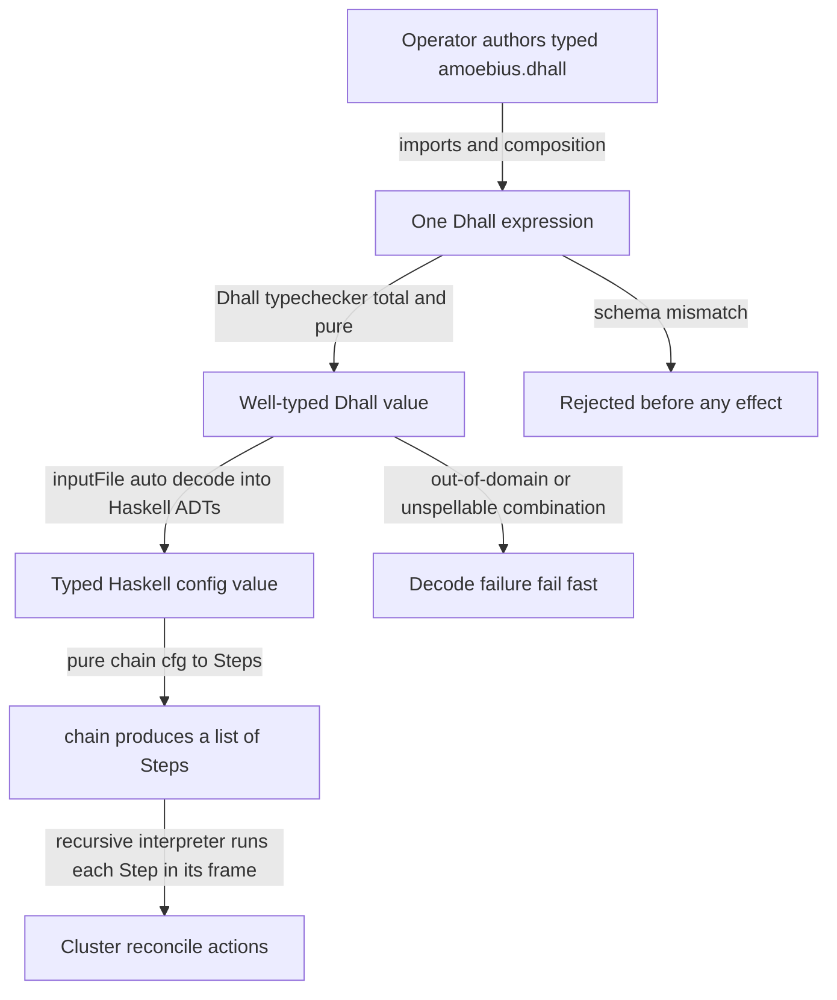
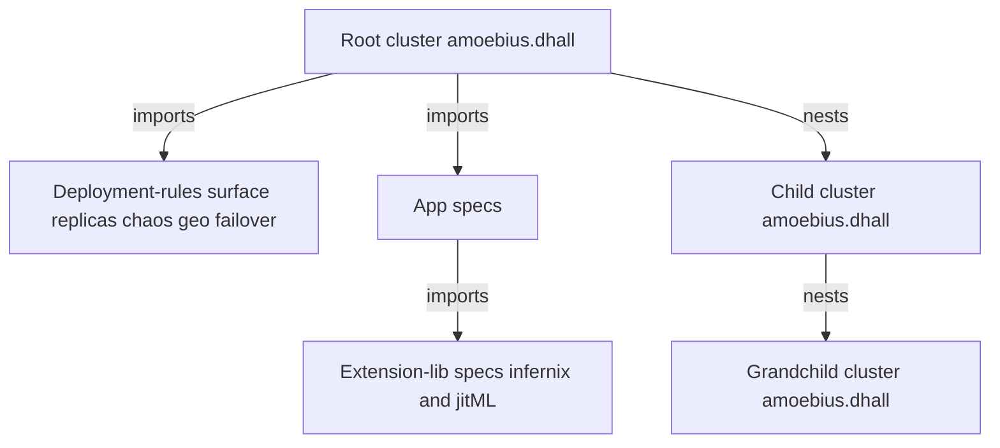

# The Amoebius DSL

**Status**: Authoritative source
**Supersedes**: N/A
**Referenced by**: documents/engineering/README.md, documents/engineering/app_vs_deployment_doctrine.md, documents/engineering/cluster_lifecycle_doctrine.md, documents/engineering/cluster_topology_doctrine.md, documents/engineering/content_addressing_doctrine.md, documents/engineering/daemon_topology_doctrine.md, documents/engineering/host_cluster_comms_doctrine.md, documents/engineering/illegal_state_catalog.md, documents/engineering/image_build_doctrine.md, documents/engineering/manifest_generation_doctrine.md, documents/engineering/platform_services_doctrine.md, documents/engineering/pulsar_client_doctrine.md, documents/engineering/pulumi_iac_doctrine.md, documents/engineering/service_capability_doctrine.md, documents/engineering/storage_lifecycle_doctrine.md, documents/engineering/testing_doctrine.md, documents/engineering/vault_pki_doctrine.md
**Generated sections**: none

> **Purpose**: Single source of truth for what the amoebius Dhall DSL is — a typed orchestration surface
> that carries parameters, not logic — how it composes totally, how it names secrets without holding them,
> and the contract by which a valid `.dhall` cannot represent illegal cluster state.

---

## 1. Why this doctrine exists

Kubernetes lets you represent nonsense. You can write a PVC that binds to no PV, a Gateway that points at
the wrong address, a NetworkPolicy that quietly severs two services that must talk, a backdoor NodePort
that exposes an admin surface to the wild — and the YAML is *valid*. The cluster discovers the mistake at
runtime, in production, at 3am. Amoebius's central bet is the inversion of that: a **typed orchestration
surface where the nonsense is unspellable**.

This document owns four things about that surface:

1. **What the DSL is** — a typed Dhall *data* surface, distinct from the Haskell logic that acts on it.
2. **Total composability** — how one `.dhall` is built by nesting others (app-in-cluster,
   extension-in-app, child-cluster-in-parent, test-in-`.dhall`).
3. **Secrets-by-name** — the DSL holds only a *name* for each secret, never a value.
4. **The illegal-state-unrepresentable contract** — the principle, and the mechanism (two typed gates)
   that enforces it.

It does **not** own: the *catalog* of specific illegal states and the typing techniques that defeat each
one ([illegal_state_catalog.md](./illegal_state_catalog.md)); the application-logic-vs-deployment-rules
*split* substance ([app_vs_deployment_doctrine.md](./app_vs_deployment_doctrine.md)); the SecretRef /
Vault / parent-injection *mechanism* ([vault_pki_doctrine.md](./vault_pki_doctrine.md)); the standard
service *set* the DSL compiles to ([platform_services_doctrine.md](./platform_services_doctrine.md)); or the
*types* the surface carries but does not define — the capacity model
([resource_capacity_doctrine.md](./resource_capacity_doctrine.md)) and the compute-engine / topology axis
([cluster_topology_doctrine.md](./cluster_topology_doctrine.md)). The DSL *carries* those fields; those docs
*own* what makes each unrepresentable.
Phase order and status live only in [../../DEVELOPMENT_PLAN/README.md](../../DEVELOPMENT_PLAN/README.md).

---

## 2. Two languages, one system: Dhall carries params, Haskell carries logic

The single most important thing to understand about the amoebius DSL is what it is **not**: it is not a
scripting language, and it does not contain the deployment logic. The instinct from a decade of bash and
Helm templating is to put the *how* in the config — loops, conditionals, string-built commands. Amoebius
refuses that outright: *"in general we do not want to use env vars or bash logic, we want everything to be
dhall"*. The way it gets there is a hard split between two languages:

- **Dhall is the data.** A `.dhall` file is typed, total, side-effect-free *data* — a description of the
  desired world. It carries no control flow that the binary executes, no subprocess strings, no
  environment lookups. It is read, type-checked, and decoded; it never "runs."
- **Haskell is the logic.** The actual reconcile logic is a pure Haskell value. Amoebius adopts
  hostbootstrap's **chain/Step algebra**: a project's deploy is a pure function `chain :: cfg -> [Step]`
  (`/home/matthewnowak/hostbootstrap/core/hostbootstrap-core/src/HostBootstrap/Step.hs`,
  `.../Chain.hs`). Each `Step` is *"the pure renderable shape plus the effectful reconcile action"* —
  a label, the frame it runs in, a `StepKind`, and a `stepRun :: HostConfig -> IO ()` action
  (`Step.hs`). The chain is the system; the Dhall only supplies the `cfg`.

This is the load-bearing idea, so cash it out:

- **The plan is the data.** Because `[Step]` is a pure value, `amoebius … --dry-run` can render the exact
  plan it would execute — `renderChainPlan` / `renderChain` (`Step.hs`, `Chain.hs`) — *without running a
  single action*. What you preview is byte-for-byte what runs. There is no hidden imperative layer between
  the rendered plan and the effects.
- **Only the binary acts.** The recursive interpreter (`runChainFromFrame`, `Chain.hs`) runs a step's
  action only when the binary is *in that step's frame*; the descent logic itself is pure and unit-tested,
  and `runChainFromFrame` is *"the thin effectful seam."* The `.dhall` chose *what*; the Haskell decides
  *how and when*.
- **No bash, anywhere.** Tool discovery is lazy and full-path (no `PATH`, no env vars); that contract is
  owned by [substrate_doctrine.md](./substrate_doctrine.md). The relevance here is that it is the *chain
  steps*, written in Haskell, that invoke tools by absolute path — never a Dhall-embedded shell string.

---

## 3. The orchestration surface: parameters, context, witness

If Dhall is "the data," what data, exactly? Amoebius inherits hostbootstrap's **binary-context contract**:
every binary reads one project-local `.dhall` carrying three kinds of typed value
(`/home/matthewnowak/hostbootstrap/core/hostbootstrap-core/src/HostBootstrap/Context.hs`; this is exactly
the shape the sibling prodbox project proved as its Tier-0 `parameters + context + witness` surface in its
`config_doctrine.md` §0).

- **Parameters** — the operator's typed knobs: the compute engine and its node topology
  ([cluster_topology_doctrine.md](./cluster_topology_doctrine.md)), replica counts, the per-host capacities,
  storage backings and budgets, topic retention/offload policies, and scaling policies
  ([resource_capacity_doctrine.md](./resource_capacity_doctrine.md)), the app specs, the deployment rules.
  This is the bulk of what an operator authors and the part most people mean when they say "the DSL." The DSL
  *carries* these typed fields; the types that make an over-committed, unbounded, or incompatible value
  unrepresentable live in those owning docs, not here ([§5](#5-the-illegal-state-unrepresentable-contract)).
- **Context** — *where this binary sits* in the composed topology: its `contextKind`, its place in the
  `topologyFrames` chain, its `currentFrame`, the `capabilities` it claims, the `allowedCommandClasses`
  it may run, the `resourceEnvelope` it lives inside, and the `childContextKinds` it may spawn
  (`Context.hs`, `BinaryContext`). The same `.dhall` that an operator writes for the root is *minted
  forward* into each child frame (`contextForKind`, `childContext`, the `context-init` step), which is
  what makes the recursive descent of [§2](#2-two-languages-one-system-dhall-carries-params-haskell-carries-logic) self-describing.
- **Witness** — locally-checkable runtime facts (`RuntimeWitness`, `Context.hs`): e.g. *a required file or
  unix socket exists*. A command is gated on its witnesses passing (`validateRuntimeContext`,
  `commandAllowed`), so a binary refuses to act in a context it does not actually inhabit. Amoebius
  **adapts** this vocabulary to its no-environment-variables invariant: it relies on file/socket-existence
  witnesses, not on `PATH`/env-equality kinds — the substrate tool-discovery contract that replaces those
  is owned by [substrate_doctrine.md](./substrate_doctrine.md).

The point of separating these three is that the orchestration surface is **self-validating before it
acts**: parameters say what to build, context says who is allowed to build it here, and witnesses confirm
the binary is actually standing where the context claims. All three are typed Dhall, none is a secret
([§6](#6-secrets-are-names-never-values)), and none is logic ([§2](#2-two-languages-one-system-dhall-carries-params-haskell-carries-logic)).

**How the minted context reaches each frame.** The child `.dhall` of the Context bullet is not written to a
host file and bind-mounted in; it is **delivered in place, on the lift's `stdin` channel**. At each frame
handoff the parent streams the *narrowed child projection* into the descending self-invocation, whose
entrypoint writes it to that frame's own sibling `.dhall` and then `exec`s the binary — hostbootstrap's
`ConfigDelivery` (`{ cdWritePath, cdExecPath, cdPayload }`) carried by `liftStdin` through the recursive
`runChainFromFrame`
(`/home/matthewnowak/hostbootstrap/core/hostbootstrap-core/src/HostBootstrap/Lift.hs`,
`.../Chain.hs`); the container handoff keeps stdin open and overrides the entrypoint to
`sh -c "cat > <sibling>.dhall && exec <binary>"`. Two invariants fall out, and [§5](#5-the-illegal-state-unrepresentable-contract) leans on both:

- **Only the projection crosses.** The narrowed child config travels on `stdin` alone — never in `argv`,
  never as a bind-mount, and never as a host-side file at rest. The parent's *full* config never crosses the
  boundary, only the child's own subtree.
- **The parent mints; the child never rewrites.** A frame receives its `.dhall` read-only at entry and has
  no verb that edits its own config — minting is exclusively a parent act (the `context-init` step, one frame
  up). This is the doctrine answer to the standing question *"can a host binary's `.dhall` ever change? only
  the parent should do that"*: a frame cannot rewrite its own config; only its parent mints it.

The one exception is the terminal **in-cluster pod** frame, whose config is delivered as a rendered
`ConfigMap` mount ([manifest_generation_doctrine.md](./manifest_generation_doctrine.md)) rather than on
`stdin`; the `stdin` mechanism covers the VM/container bootstrap-lift frames. Like the rest of [§2](#2-two-languages-one-system-dhall-carries-params-haskell-carries-logic)–[§3](#3-the-orchestration-surface-parameters-context-witness), this
delivery is **proven in hostbootstrap and inherited as evidence** — not an amoebius-built result
([documentation_standards.md §6](../documentation_standards.md#6-honesty-the-proventestedassumed-discipline)).

---

## 4. Total composability

The phrase to cash out is from the original vision: *"the key to making amoebius really work well is a great
.dhall DSL that ties everything together. total composability."* An amoebius `.dhall` is never one
monolith — it is a composition built from smaller typed pieces via Dhall's native import system. Because
every piece is typed, total, side-effect-free data ([§2](#2-two-languages-one-system-dhall-carries-params-haskell-carries-logic)), the pieces nest *without limit and without
leakage*: importing a fragment can never smuggle in an effect or a partial value.

Total composability runs along four concrete axes, each owned in detail by a sibling doc:

- **App-in-cluster.** An app is *"a container … and a `.dhall` for that app"*.
  The app spec — its LB services, Keycloak-backed auth rules, durable storage (MinIO buckets, block
  storage, Postgres), and Pulsar topic lifecycles — is a typed fragment that nests inside the cluster
  spec. The generic reusable app chart is populated *from* that fragment, so an operator never writes Helm
  values by hand.
- **Two surfaces per app: logic vs rules.** A locked invariant: **application logic and deployment rules
  are separate DSL surfaces** (DEVELOPMENT_PLAN cross-cutting invariants). The app
  is written once; HA replica count, chaos testing, geo-replication, and failover are an *orthogonal*
  deployment-rules surface that composes over it. That split is owned by
  [app_vs_deployment_doctrine.md](./app_vs_deployment_doctrine.md); this doc owns only the fact that the
  DSL *has* two composable surfaces.
- **Extension-lib-in-app.** ML extension libraries nest the same way: *"the infernix .dhall can be
  contained inside an amoebius.dhall"*. infernix and jitML are libraries unified
  under the DSL, not separate products (DEVELOPMENT_PLAN), so an inference workload is a nested typed
  fragment, not a bolt-on. The precise seam by which such a library registers — the typed **`ExtensionSpec`**,
  merged at link time into the one binary — is spelled out below; this axis's closed v1 set is
  `{infernix, jitML, mattandjames}`.
- **Child-cluster-in-parent.** The name *amoebius* is the recursion: a cluster spawns children, which
  spawn their own. A child receives *only its own* `.dhall` — *"including
  their childrens'"* but nothing about siblings — and the whole tree is rolled out from the root. The
  parent/child trust, secret-injection, and spawning lifecycle are owned by
  [vault_pki_doctrine.md](./vault_pki_doctrine.md) and the cluster-lifecycle doctrine; here the point is
  that an entire child cluster spec is itself a composable fragment of the parent's.

A fifth axis is the **test topology**: a test is *"an amoebius.dhall that spins up resources, runs [a]
workflow, and tears down resources"* — the same composition, with a teardown
obligation. The testing surface is owned by the testing doctrine; it is named here only as proof that even
*testing* is expressed in the one composable DSL rather than a parallel harness language.

### The v1 extension seam: `ExtensionSpec` (linked, not loaded)

The Extension-lib-in-app axis has a precise **registration seam**. A `.dhall` cannot nest an arbitrary
foreign product; what it nests is an **`ExtensionSpec`** — the one typed handle by which a *vendored* library
plugs into the surface:

    ExtensionSpec :
      { extDhall        : <a typed Dhall sub-catalog nested inside amoebius.dhall>
      , extChain        : cfg -> [Step]
      , extCapabilities : List Capability
      }

Three parts, each already load-bearing above: `extDhall` is a nested typed Dhall sub-catalog ([§4](#4-total-composability)'s
composition); `extChain :: cfg -> [Step]` is the extension's slice of the chain/Step algebra ([§2](#2-two-languages-one-system-dhall-carries-params-haskell-carries-logic) — an
extension carries *no* logic the DSL does not already carry as `[Step]`); and `extCapabilities` are the
capability declarations it exports into the capability surface
([service_capability_doctrine.md](./service_capability_doctrine.md)).

**Linked, not loaded.** The v1 set is **closed at `{infernix, jitML, mattandjames}`**; each contributes one
`ExtensionSpec`, and the specs are merged at **compile/link time into the one binary** — no dlopen, no
per-extension image, no runtime plugin path. The merge adopts hostbootstrap's additive `ProjectSpec` stream
algebra and its **anti-shadow `validateProjectSpec`** (`.../CLI.hs`) — the duplicate-id,
constructor-collision, and empty-suite rejections — so two extensions cannot silently shadow each other's
ids or constructors; but it **drops hostbootstrap's packaging** (no per-project binary or image, no dlopen).
This is *sibling evidence, not an amoebius result*: hostbootstrap proves the `ProjectSpec` algebra and the
anti-shadow validator; amoebius reuses the algebra and discards the packaging.

**A nested `extDhall` is not privileged.** It faces exactly the two gates of [§5](#5-the-illegal-state-unrepresentable-contract) and the catalog's total
folds — no unbounded arm, capacity accounted, topology relations satisfied — like any other fragment. In
particular it introduces **no second secret store**: an extension names its secrets as `SecretRef`s ([§6](#6-secrets-are-names-never-values)) and
may **not** carry a key/secret store of its own. (infernix's k8s-`Secret` store is exactly the divergence
this forbids — *sibling evidence of an anti-pattern*, corrected here, not a shipped amoebius behavior.)

### v1 vs v2: linked extensions vs the third-party extension DSL

The `ExtensionSpec` seam is **Path 1**, and it is deliberately *not* open to the world:

- **v1 — Path 1 (linked).** The closed set `{infernix, jitML, mattandjames}` is *vendored*: each links into
  the one binary through its `ExtensionSpec`. This is the only extension mechanism v1 ships.
- **v2 — Path 2 (the Haskell extension DSL).** A non-vendored third party enters *only* through the future
  **Haskell-as-DSL + custom AST checker + native JIT** — the forward pointer of [§8](#8-the-haskell-extension-dsl-forward-pointer-only), scheduled as provisional
  **Phase 15**
  ([later_phases.md](../../DEVELOPMENT_PLAN/later_phases.md#candidate-phase-haskell-extension-dsl--custom-ast-checker--native-jit)).
  Path 2 is Phase-15 design intent, not built.

And the boundary that keeps the seam honest: **an arbitrary container app is NOT an extension.** A party
unwilling to be linked gets no `ExtensionSpec`; it runs as an ordinary app-spec `.dhall` workload —
*"v1 can be an orchestrator for arbitrary containers"* — which is application logic, not extension
([app_vs_deployment_doctrine.md §8](./app_vs_deployment_doctrine.md#8-shared-library-use-is-application-logic)).
Extension = linked-and-vendored; container app = composed-and-orchestrated; the two are different axes. A
future ML family is **deferred**: this pass provisions the seam but names no member beyond the closed set —
a later family would enter via Path 1 once its math is absorbed into a vendored library, or via Path 2.

### The ML-asset types an extension `.dhall` carries: `EngineRuntime` vs `ModelArtifact`

Because infernix and jitML nest as `ExtensionSpec`s, their `extDhall` carries two ML-asset types the surface
must hold apart — and, per [§1](#1-why-this-doctrine-exists), *carries but does not define*:

- **`EngineRuntime`** — a **closed** union of substrate-tagged, *baked* engine identities. It has **no
  `Url`/`Download`/`Fetch` arm**: an engine is *selected by substrate*, never fetched, and exists the moment
  the pod does (because the extension links as a library, not a build-time download).
- **`ModelArtifact`** — a by-name / content-address **reference** into the content store. Its `ArtifactRef`
  is obtainable **only once the `.ready` sentinel exists *and* the artifact carries a provenance witness** —
  a committed producing checkpoint or a pinned content-addressed import — so there is no constructor for an
  unready *or* unwitnessed reference (grade-(1) for the witness's *presence*; whether the witnessed bytes
  were truly trained is runtime residue, owned downstream, not a decode-time claim).

The relation between them is itself typed: **a `ModelArtifact` must be servable by an `EngineRuntime` present
on the deployment's substrate** — an unmatched model has no landing engine (a grade-(2) total relation over
the substrate's engine set, the same topology-relation-over-a-collection technique [§5](#5-the-illegal-state-unrepresentable-contract) defers to the catalog).
The *detail* of all three — the no-`Url` closure, the `.ready`-plus-provenance-witness gate, and the model↔engine match — is owned by
[illegal_state_catalog.md §3.25](./illegal_state_catalog.md#325-an-ml-asset-fetched-or-built-at-pod-startup-or-an-unready--unlanded-model) and
[content_addressing_doctrine.md §4.5](./content_addressing_doctrine.md#45-the-three-tier-ml-asset-lifecycle-engine-baked-model-staged-kernel-jitd); this doc records only that the
extension seam *carries* these typed fields and defers their unrepresentability there.

The same extension seam carries jitML's **training-run** shape as three further *carried, not defined* typed
fields — how a run is initialized, fed, and bounded:

- **`TrainInit`** — from-scratch, or **continue** from a provenance-witnessed `ModelArtifact` (fine-tune /
  warm-start), composing recursively with the witness gate on `ModelArtifact` above.
- **`TrainData`** — a content-addressed dataset, or a Pulsar **`Feed`** consumed from a cursor.
- **`TrainBudget`** — a bounded step/epoch count, or a **`Continuous`** run committing a checkpoint every cadence.

As with `EngineRuntime`/`ModelArtifact`, the DSL *carries* these fields on an extension's `extDhall`; what
makes an unbounded, un-checkpointed, or non-deterministically-ordered run **unrepresentable** — the closed
union shapes, the no-bare-unbounded-`Continuous` foreclosure, and the fold that keeps a `Feed`'s consumed
prefix content-addressed rather than cursor-keyed — is owned by
[content_addressing_doctrine.md §4.6](./content_addressing_doctrine.md#46-the-training-run-topology-fine-tune-chains-and-continuous-feeds-without-an-unbounded-arm)
and [illegal_state_catalog.md](./illegal_state_catalog.md), not defined here.

### The stretched-node reachability field the surface carries: `Networking`

[§4](#4-total-composability)'s child-cluster and attach-pool composition carries one further *carried, not
defined* typed field: a mandatory **`Networking c`** capability on any **stretched-node / attach** spec — a
node or host worker whose declared network-locality `Site` differs from the control plane's, reached across
the WAN — declaring *how* it reaches the cluster. Like the ML-asset types above, the DSL only *carries* the
field; what makes it total — that `Networking c = Gateway … | Vpn …` has **no arm** collapsing a
secure-gateway reach into wild ingress, and that a stretched shape has **no reachability witness** without a
declared `Networking c` — is owned by
[network_fabric_doctrine.md §5](./network_fabric_doctrine.md#5-the-security-boundary-generalizes-localhost--authenticated-fabric)
and [illegal_state_catalog.md §4.3](./illegal_state_catalog.md#43-gadt-indexed-state-machines--only-legal-transitions-are-typed),
never here.

---

## 5. The illegal-state-unrepresentable contract

This is the heart of the doctrine, and the claim is exact: **a valid amoebius `.dhall` cannot represent
illegal, non-working, or insecure cluster state**. Not "is rejected by a
linter," not "is caught in CI" — *cannot be written down in the first place*. The contract has a one-line
form an operator can hold onto:

> **If it decodes, it is deployable.**

That guarantee is bought by **two typed gates** in front of any effect. This section owns the *principle*
and the *mechanism*; the **inventory** of specific illegal states (PVC↔PV binding, gateway misconfig, DNS
binding the wrong address, certs, taints/tolerations/affinity, NetworkPolicy partitions, backdoor ingress,
resource overcommit, compute-engine/substrate incompatibility, illegal cluster topology, unbounded storage,
and un-tiered topic lifecycles) and the **techniques** that defeat each (capability/phantom tags,
GADT-indexed state machines, ownership indices, content-address totality, the capacity-accounting fold, and
topology relations over a collection) are owned in full by
[illegal_state_catalog.md](./illegal_state_catalog.md) — do not look for them restated here.

### Gate 1 — the Dhall typechecker

Dhall is a *total*, strongly-normalizing, side-effect-free configuration language. An expression that does
not match its declared schema simply **does not type-check**, and a non-terminating or effectful
expression cannot be written at all. This gate fires entirely *before the amoebius binary runs* — at
authoring time, in the operator's editor, in `dhall type`, in CI. A union with no arm for "insecure
ingress" gives the author no syntax to request insecure ingress; a record that requires a PV reference for
every PVC gives no way to omit it. The schema is the boundary, and the boundary is mechanical.

### Gate 2 — the Haskell typed decoder

A well-typed Dhall value still has to become a Haskell value before the chain ([§2](#2-two-languages-one-system-dhall-carries-params-haskell-carries-logic)) can use it. Every
amoebius binary decodes its Dhall **in-process** through the native `dhall` library —
`Dhall.inputFile auto` (the exact call hostbootstrap uses: `decodeContextFile = inputFile auto`,
`Context.hs`; the same pattern the sibling prodbox project documents in its `config_doctrine.md` [§4](#4-total-composability)). Two
things happen here:

- **Decoding is total and fail-fast.** A malformed or out-of-domain value surfaces as an `Either`/
  structured error (`readContextFile` returns `Left (ContextDecodeFailed …)` rather than throwing into a
  half-applied effect; `Context.hs`). Nothing is reconciled against a config that did not fully decode.
- **The ADTs make illegal combinations un-spellable.** The Haskell types the Dhall decodes *into* are
  designed — via sum types, smart constructors, and type indices — so that an illegal combination has no
  inhabitant. This is where the catalog's techniques live; the decoder is merely the place they take
  effect. Because the value cannot be constructed, it cannot be decoded, and because it cannot be decoded,
  it cannot be deployed.

The two gates compose: Gate 1 rejects what is not even well-typed Dhall; Gate 2 rejects what is well-typed
Dhall but not a legal amoebius world. What survives both is, by construction, a deployable cluster
description — which is exactly *"if it decodes, it is deployable."*

### Recursion: a child's spec is a typed subtree projection

The contract extends through the recursive forest. When a cluster spawns a child,
the value the child receives is a **`ChildSpec`** — by construction the projection of *exactly that child's
subtree* (its own config including its children's). The type has no field in which a sibling or
ancestor-only branch can appear, so over-sharing the tree is as unrepresentable as a cross-tenant secret:
`project : ForestSpec → ChildId → ChildSpec` can only ever yield a node's own subtree. That subtree is handed
to the child by the **spawn** handoff (a Pulumi deploy) owned by
[cluster_lifecycle_doctrine.md §3](./cluster_lifecycle_doctrine.md#3-amoebic-spawning--the-recursive-forest),
which shares its *projection-only, parent-mints* discipline with the intra-host **frame descent** of [§3](#3-the-orchestration-surface-parameters-context-witness) — the
same rule one level down, delivering each frame's minted context on the lift's `stdin` — the two differing
only in **transport**;
the at-rest encryption under a per-child Transit key (so a child cannot even decrypt a sibling's subtree) is
owned by [vault_pki_doctrine.md §6](./vault_pki_doctrine.md#6-parentchild-unseal-two-sanctioned-modes); the
unrepresentability is catalogued at [illegal_state_catalog.md §3.10](./illegal_state_catalog.md#310-a-child-spec-that-reaches-beyond-its-own-subtree). This doc
owns only the `ChildSpec` type and its projection.

> **Honesty.** The *strength* of this contract is a property of the type designs catalogued in
> [illegal_state_catalog.md](./illegal_state_catalog.md). This doc states the contract and the decode
> mechanism; it does **not** claim any specific illegal state is *proven* unrepresentable — that claim is
> made, state by state, only where the catalog exhibits the type that excludes it. Per
> [documentation_standards.md §6](../documentation_standards.md#6-honesty-the-proventestedassumed-discipline), a typing argument is evidence, not a
> tested or proven result, until the catalog and Phase 3 make it concrete.

---

## 6. Secrets are names, never values

A locked invariant: **secrets never live in Dhall — only names** (DEVELOPMENT_PLAN
cross-cutting invariants). The intuition is a direct consequence of [§4](#4-total-composability) and [§5](#5-the-illegal-state-unrepresentable-contract): a `.dhall` is composed,
diffed, rolled out from the root across an entire tree of clusters, and stored — so it must be **safe to
read**. A surface you can safely hand to a child cluster, paste into a review, or keep in an object store
is a surface that holds no secret bytes.

So the DSL carries a typed **reference** to each secret — a *name/coordinate*, not the value:

- **Parents inject; children resolve.** The actual value is materialized into the child's Vault by its
  parent. The DSL names *where* a secret will be; Vault holds *what* it is.
- **The typechecker never sees a literal secret**, because there is no literal secret in the tree to see —
  only a reference. This is what lets Gate 1 and Gate 2 ([§5](#5-the-illegal-state-unrepresentable-contract)) run over the full config tree without ever
  touching sensitive material.

This is the SSoT-deferring summary. The typed reference (the `SecretRef`-style union), the
production-reference-vs-test-plaintext split, the parent→child injection protocol, the fail-closed
sealed-Vault posture, and the root PKI trust anchor are **all owned by**
[vault_pki_doctrine.md](./vault_pki_doctrine.md) — and proven in the sibling prodbox project's `SecretRef`
model (its `config_doctrine.md` §6.2) as evidence, not yet in amoebius. This doc owns only the DSL-surface
rule: *a name, never a value.*

---

## 7. The DSL compiles to one opinionated platform

The DSL is deliberately **not** a blank canvas. The vision framed the target as *"opinionated helm
deployments and cluster configs"*; amoebius keeps the *opinionated* part and drops
the *helm* part — the DSL compiles to **typed Kubernetes manifests**, rendered and applied by amoebius's own
typed reconciler with no Helm and no third-party charts
([manifest_generation_doctrine.md](./manifest_generation_doctrine.md)). An operator does not get to choose
*which products* realize the platform — whether object storage is MinIO, whether the registry is
`distribution`, whether Postgres is Patroni-backed, or whether ingress flows through Keycloak: those are the
canonical providers behind the **capabilities** owned by
[service_capability_doctrine.md](./service_capability_doctrine.md), over the fixed standard service set owned
by [platform_services_doctrine.md](./platform_services_doctrine.md). The DSL *parameterizes a fixed shape*;
it does not let you redesign it.

This is why [§5](#5-the-illegal-state-unrepresentable-contract)'s contract is even tractable. The set of legal worlds is small and opinionated, so the
types that exclude the illegal ones are *writable*. A DSL that tried to express every possible Kubernetes
topology could not also guarantee that every expressible topology is safe. Amoebius narrows the surface
first — one service set, one ingress path, one storage model, HA always — and *then* makes the residue of
illegal configurations unrepresentable. The narrowing and the unrepresentability are the same design
decision viewed from two sides.

---

## 8. The Haskell extension DSL (forward pointer only)

There is a second, later language in the vision: *"orchestration DSL lives in .dhall, extension DSL is
Haskell that is (a) validated by a custom AST checker, and (b) has access to all amoebius libraries + jit
features"*. It is explicitly **v2** — *"jit stuff is probably amoebius v2;
v1 can be an orchestrator for arbitrary containers."*

This doc is the SSoT for the **orchestration** DSL (the Dhall surface). The **extension** DSL — the
Haskell-as-DSL plus its custom AST checker and native JIT — is a scheduled **later phase**, not specified
here. In [§4](#4-total-composability)'s extension taxonomy this is **Path 2** — the *only* path by which a non-vendored third party
extends amoebius (Path 1, the closed linked set `{infernix, jitML, mattandjames}`, is vendored) — scheduled
as provisional **Phase 15**
([later_phases.md](../../DEVELOPMENT_PLAN/later_phases.md#candidate-phase-haskell-extension-dsl--custom-ast-checker--native-jit)).
See also the "Later phases" entry in
[../../DEVELOPMENT_PLAN/README.md](../../DEVELOPMENT_PLAN/README.md). It is named here only so the
boundary is explicit: when this document says "the DSL," it means the typed Dhall orchestration surface,
not the future Haskell extension language.

---

## 9. Toolchain note

Amoebius decodes Dhall in-process under **GHC 9.12.4** (DEVELOPMENT_PLAN "Toolchain"; the deferred 9.14.1 is a later-phase bump). Because of Hackage version skew, the `dhall` library's transitive
dependencies require `allow-newer` to build on the pinned GHC — the precise toolchain pins and `allow-newer`
set are owned by the dependency-management surface tracked in
[../../DEVELOPMENT_PLAN/README.md](../../DEVELOPMENT_PLAN/README.md), not restated here. There is **no**
intermediate JSON projection on the supported path: the on-disk artifact is the typed Dhall expression,
and the in-memory value is the Haskell record produced by `Dhall.inputFile auto` ([§5](#5-the-illegal-state-unrepresentable-contract)).

Dhall is the **config** surface, not the **data plane**: runtime *message payloads* are never Dhall. They are
dense binary **CBOR** on the wire, owned by
[pulsar_client_doctrine.md §3.1](./pulsar_client_doctrine.md#31-payloads-are-exclusively-cbor) — Dhall carries typed
*params*, a payload carries runtime *bytes*, and the two never mix (the `notes.txt` "does dhall make sense
for a payload? probably not" answer).

---

## 10. Planning ownership

This document is normative DSL doctrine only. Delivery sequencing, completion status, validation gates, and
remaining work are owned by [../../DEVELOPMENT_PLAN/README.md](../../DEVELOPMENT_PLAN/README.md) (the
orchestration Dhall DSL and the illegal-spec-fails-to-type-check gate land in **Phase 3**, atop the Phase 1
`dsl-step`/`chain` kernel seeded from hostbootstrap). This doc never maintains a competing status ledger; it
states the target shape and links back for status.

> **Honesty.** Everything in this doctrine is Phase 0 design intent, specified before implementation. Where
> it borrows behaviour proven in prodbox or implemented in hostbootstrap, that is *evidence from a sibling
> system*, not proof in amoebius — which has not yet built Phase 3. Read every prescriptive statement here
> as the contract amoebius intends to satisfy, never as a tested amoebius result
> ([documentation_standards.md §6](../documentation_standards.md#6-honesty-the-proventestedassumed-discipline)).

---

## Cross-references

- [Engineering Doctrine Index](./README.md)
- [App vs Deployment Doctrine](./app_vs_deployment_doctrine.md) — [§8](./app_vs_deployment_doctrine.md#8-shared-library-use-is-application-logic) an arbitrary container app is application logic, not an extension
- [Illegal State Catalog](./illegal_state_catalog.md) — [§3.25](./illegal_state_catalog.md#325-an-ml-asset-fetched-or-built-at-pod-startup-or-an-unready--unlanded-model) an ML asset fetched/built at pod startup, and an unready/unlanded model, are unrepresentable
- [Content Addressing Doctrine](./content_addressing_doctrine.md) — [§4.5](./content_addressing_doctrine.md#45-the-three-tier-ml-asset-lifecycle-engine-baked-model-staged-kernel-jitd) the three-tier ML-asset lifecycle (`EngineRuntime` baked, `ModelArtifact` `.ready`-gated)
- [Service Capability Doctrine](./service_capability_doctrine.md) — the capability surface an `ExtensionSpec` declares into
- [Vault / PKI Doctrine](./vault_pki_doctrine.md)
- [Platform Services Doctrine](./platform_services_doctrine.md)
- [Substrate Doctrine](./substrate_doctrine.md)
- [Network Fabric Doctrine](./network_fabric_doctrine.md) — [§5](./network_fabric_doctrine.md#5-the-security-boundary-generalizes-localhost--authenticated-fabric) the `Networking c` reachability capability the stretched-node surface carries
- [Resource Capacity Doctrine](./resource_capacity_doctrine.md) — the capacity/budget/scaling types the surface carries
- [Cluster Topology Doctrine](./cluster_topology_doctrine.md) — the compute-engine/topology types the surface carries
- [Pulsar Client Doctrine](./pulsar_client_doctrine.md) — [§3.1](./pulsar_client_doctrine.md#31-payloads-are-exclusively-cbor) runtime message payloads are CBOR, not Dhall
- [Later Phases](../../DEVELOPMENT_PLAN/later_phases.md) — Phase 15 Haskell extension DSL ([§4](#4-total-composability)/[§8](#8-the-haskell-extension-dsl-forward-pointer-only) Path 2 for third parties)
- [Development Plan](../../DEVELOPMENT_PLAN/README.md)
- [Documentation Standards](../documentation_standards.md)
