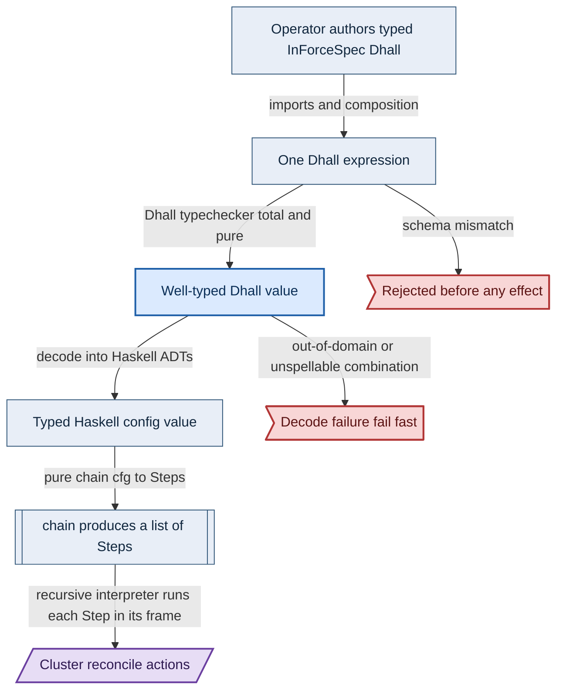
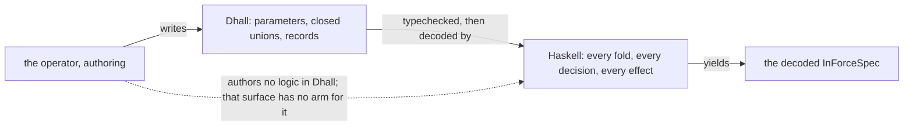
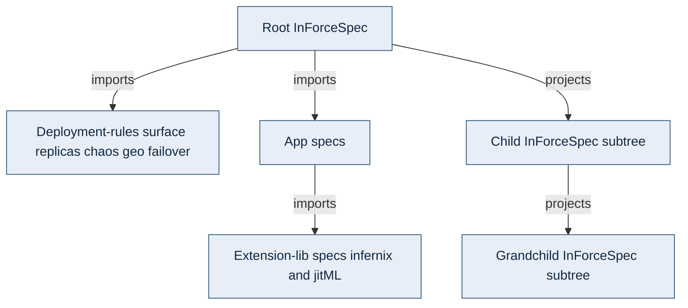
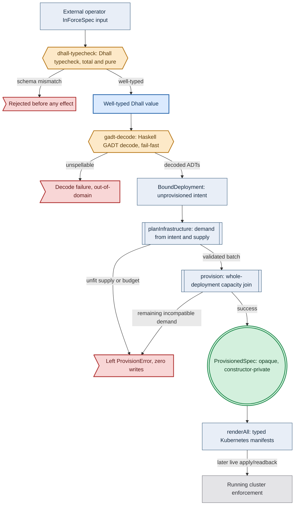

# The Amoebius DSL

> **Purpose**: Single source of truth for what the amoebius Dhall DSL is — a typed orchestration surface
> that carries parameters, not logic — the difference between the uploaded `InForceSpec` and the local
> `amoebius.dhall` `FrameConfig`, how specs compose totally, how they name secrets without holding them,
> and the contract by which a valid `InForceSpec` cannot represent illegal cluster state.
> **Read this if**: something has to be expressed in the specification language, or a language boundary has to be settled.

This document owns the description language: what Dhall carries, what Haskell carries, how the two compose,
and the contract that makes an illegal specification unrepresentable. It does not own the enumerated illegal
states themselves, which belong to
[illegal_state_catalog.md](../illegal_state/illegal_state_catalog.md), nor the manifests the language renders
into, owned by [manifest_generation_doctrine.md](./manifest_generation_doctrine.md).

<details>
<summary>Link-graph metadata</summary>

**Status**: Authoritative source
**Supersedes**: N/A
**Referenced by**: DEVELOPMENT_PLAN/later_phases.md, DEVELOPMENT_PLAN/overview.md, DEVELOPMENT_PLAN/phase_01_toolchain_spike.md, DEVELOPMENT_PLAN/phase_18_dsl_formal_model.md, DEVELOPMENT_PLAN/phase_25_dhall_schema_generation.md, DEVELOPMENT_PLAN/phase_26_gadt_decode_ir.md, DEVELOPMENT_PLAN/phase_27_illegal_state_covering.md, DEVELOPMENT_PLAN/phase_30_capability_bind.md, DEVELOPMENT_PLAN/phase_32_inference_accelerator_provision.md, DEVELOPMENT_PLAN/phase_34_chain_kernel_boundary.md, DEVELOPMENT_PLAN/phase_37_ui_program_schema.md, DEVELOPMENT_PLAN/phase_51_host_ensure_kernel.md, DEVELOPMENT_PLAN/phase_65_live_dsl_deploy.md, DEVELOPMENT_PLAN/system_components.md, documents/engineering/README.md, documents/engineering/app_vs_deployment_doctrine.md, documents/engineering/backup_recovery_doctrine.md, documents/engineering/bootstrap_sequence_doctrine.md, documents/engineering/capability_extension_doctrine.md, documents/engineering/cluster_lifecycle_doctrine.md, documents/engineering/cluster_topology_doctrine.md, documents/engineering/consistency_pacelc_doctrine.md, documents/engineering/content_addressing_determinism.md, documents/engineering/content_addressing_doctrine.md, documents/engineering/daemon_topology_doctrine.md, documents/engineering/gateway_migration_doctrine.md, documents/engineering/host_cluster_comms_doctrine.md, documents/engineering/image_build_doctrine.md, documents/engineering/jit_artifact_doctrine.md, documents/engineering/low_code_ui_runtime_doctrine.md, documents/engineering/manifest_generation_doctrine.md, documents/engineering/monitoring_doctrine.md, documents/engineering/namespace_layout_doctrine.md, documents/engineering/platform_services_doctrine.md, documents/engineering/preflight_validation_doctrine.md, documents/engineering/pulsar_client_doctrine.md, documents/engineering/pulumi_iac_doctrine.md, documents/engineering/readiness_ordering_doctrine.md, documents/engineering/service_capability_doctrine.md, documents/engineering/storage_lifecycle_doctrine.md, documents/engineering/tenancy_doctrine.md, documents/engineering/testing_doctrine.md, documents/engineering/vault_pki_doctrine.md, documents/engineering/workflow_calculus_doctrine.md, documents/glossary.md, documents/illegal_state/illegal_state_capability_messaging.md, documents/illegal_state/illegal_state_capacity.md, documents/illegal_state/illegal_state_catalog.md, documents/illegal_state/illegal_state_lifecycle.md, documents/illegal_state/illegal_state_ml_asset.md, documents/illegal_state/illegal_state_multicluster.md, documents/illegal_state/illegal_state_security.md, documents/illegal_state/illegal_state_storage.md, documents/illegal_state/illegal_state_techniques.md, documents/illegal_state/illegal_state_topology.md, documents/reading_order.md
**Generated sections**: none

</details>

## Contents
- [1. Why this doctrine exists](#1-why-this-doctrine-exists)
- [2. Two languages, one system: Dhall carries params, Haskell carries logic](#2-two-languages-one-system-dhall-carries-params-haskell-carries-logic)
- [3. The orchestration surface: parameters, context, witness](#3-the-orchestration-surface-parameters-context-witness)
- [4. Total composability](#4-total-composability)
- [5. The illegal-state-unrepresentable contract](#5-the-illegal-state-unrepresentable-contract)
- [6. Secrets are names, never values](#6-secrets-are-names-never-values)
- [7. The DSL compiles to one opinionated platform](#7-the-dsl-compiles-to-one-opinionated-platform)
- [8. The Haskell extension DSL — the constrained surface extension-astcheck admits](#8-the-haskell-extension-dsl--the-constrained-surface-extension-astcheck-admits)
- [9. Toolchain note](#9-toolchain-note)
- [10. Planning ownership](#10-planning-ownership)
- [Related Documents](#related-documents)

---

## 1. Why this doctrine exists

Kubernetes admits specifications that cannot work: a PVC that binds to no PV, a Gateway that points at
the wrong address, a NetworkPolicy that severs two services that must communicate, a NodePort that
exposes an admin surface publicly — each is valid YAML, accepted by the apiserver, so the contradiction
surfaces only at runtime. amoebius inverts this: a **typed orchestration surface on which such specifications do not type-check**.

This document owns four things about that surface:

1. **What the DSL is** — a typed Dhall *data* surface, distinct from the Haskell logic that acts on it,
   with two different authority surfaces: the uploaded `InForceSpec` and the local `amoebius.dhall`.
2. **Total composability** — how one `InForceSpec` is built by nesting Dhall fragments (app-in-cluster,
   extension-in-app, child-cluster-in-parent, test-topology-in-Dhall).
3. **Secrets-by-name** — the DSL holds only a *name* for each secret, never a value.
4. **The illegal-state-unrepresentable contract** — the layered principle, the three typed gates (two for
   the spec's structural legality, one for the extension source linked beside it), and the conditional
   post-bind infrastructure/materialization/provision seal for value- and inventory-dependent legality.

It does **not** own: the *catalog* of specific illegal states and the typing techniques that defeat each
one ([illegal_state_catalog.md](../illegal_state/illegal_state_catalog.md)); the application-logic-vs-deployment-rules
*split* substance ([app_vs_deployment_doctrine.md](./app_vs_deployment_doctrine.md)); the SecretRef /
Vault / parent-injection *mechanism* ([vault_pki_doctrine.md](./vault_pki_doctrine.md)); the standard
service *set* the DSL compiles to ([platform_services_doctrine.md](./platform_services_doctrine.md)); or the
*types* the surface carries but does not define — the capacity model
([resource_capacity_doctrine.md](./resource_capacity_doctrine.md)) and the compute-engine / topology axis
([cluster_topology_doctrine.md](./cluster_topology_doctrine.md)). The DSL *carries* those fields; those docs
*own* what makes each unrepresentable.
Phase order and status live only in [../../DEVELOPMENT_PLAN/README.md](../../DEVELOPMENT_PLAN/README.md).

---

## 2. Two languages, one system: Dhall carries params, Haskell carries logic

The amoebius DSL is not a scripting language, and it does not contain the deployment logic. Templating
puts the *how* in the config — loops, conditionals, string-built commands — placing untyped control flow
in configuration that the type-checker cannot inspect. amoebius excludes that, per the recorded operator
decision: *"in general we do not want to use env vars or bash logic, we want everything to be
dhall"*. It gets there by a hard split between two languages:

- **Dhall is the data.** A *resolved, frozen* Dhall expression is typed, total, side-effect-free *data* — the
  effect-free claim holds for the resolved expression, not for arbitrary unresolved Dhall, whose *import
  resolution* is itself effectful ([§4](#4-total-composability)'s import policy). The uploaded
  `InForceSpec` describes the desired world; the local `amoebius.dhall` describes the authority and
  witnesses of this binary frame. Neither carries control flow that the binary executes, subprocess strings,
  or environment lookups. Each is read, type-checked, and decoded; neither ever "runs."
- **Haskell is the logic.** The actual reconcile logic is a pure Haskell value, shaped as a **chain/Step
  algebra**: a project's deploy is a pure function `chain :: cfg -> [Step]`, and each `Step` is the pure
  renderable shape plus the effectful reconcile action — a label, the frame it runs in, a `StepKind`, and a
  run action. The chain is the system; the Dhall only supplies the `cfg`. The algebra is amoebius's own, and
  `hostbootstrap` is its reference implementation rather than its source: amoebius re-derives it to make the
  frame relation *total*, which the reference's fallback arm is not
  ([`lift_and_compose_doctrine.md` §5](./lift_and_compose_doctrine.md#5-the-re-derivation-map)).

**The schema is generated; the value is external.** The split above says Dhall carries the data, and it leaves
open where the *type* of that data comes from. It is reflected from the Haskell checked-IR types rather than
authored beside them: the schema, the prelude of smart constructors, and the examples are all rendered from the
same types the decoder is written against, so the two cannot disagree and there is no parity report because
there is no second statement to compare
([`generated_artifacts_doctrine.md` §2](./generated_artifacts_doctrine.md#2-what-is-generated-and-from-what),
[`jit_artifact_doctrine.md`](./jit_artifact_doctrine.md)). An operator's `InForceSpec` and an application's
`UiSource` are external or untracked inputs. Repository tests construct Haskell values and render temporary
Dhall beneath `.build/**`; no `.dhall` source or fixture is version-controlled.

The UI surface is the bounded refinement of this rule. A normalized `UiSource` is a finite declarative program
**description as data**: it contains no executable callback or effect implementation. gadt-decode checks that value
into `CheckedUiProgram`; Haskell binds its effects and owns server semantics. Haskell client-runtime
declarations lazily generate the PureScript interpreter that consumes the sealed client projection. The
complete boundary is owned by
[low_code_ui_runtime_doctrine.md §3](./low_code_ui_runtime_doctrine.md#3-one-checked-value-two-runtime-plans).

The owning phase must validate this specialization without a tracked Dhall corpus: Haskell fixtures render
the closed UI wire beneath `.build/**`, and a separately reviewed Haskell oracle constrains
tenant/module/node/link meaning rather than copying normalized bytes.

That split is load-bearing in three ways:

- **The plan is the data.** Because `[Step]` is a pure value, `amoebius … --dry-run` can render the exact plan it would execute — `renderChainPlan` / `renderChain` (`Step.hs`, `Chain.hs`) — *without running a
  single action*. The preview is byte-for-byte what runs. There is no hidden imperative layer between
  the rendered plan and the effects.
- **Only the binary acts.** The recursive interpreter (`runChainFromFrame`, `Chain.hs`) runs a step's
  action only when the binary is *in that step's frame*; the descent logic itself is pure and unit-tested,
  and `runChainFromFrame` is *"the thin effectful seam."* The decoded Dhall value chose *what*; the
  Haskell decides *how and when*.
- **No bash, anywhere.** Tool discovery is lazy and full-path (no `PATH`, no env vars); that contract is
  owned by [substrate_doctrine.md](./substrate_doctrine.md). The relevance here is that it is the *chain
  steps*, written in Haskell, that invoke tools by absolute path — never a Dhall-embedded shell string.

Diagram vocabulary: [diagram_conventions.md](./diagram_conventions.md).


```mermaid
flowchart TD
%% register: algebra
  author["Operator authors typed InForceSpec Dhall"]:::intent -->|imports and composition| expr["One Dhall expression"]:::intent
  expr -->|Dhall typechecker total and pure| typed["Well-typed Dhall value"]:::provenPB
  expr -->|schema mismatch| reject1>"Rejected before any effect"]:::refuse
  typed -->|decode into Haskell ADTs| decoded["Typed Haskell config value"]:::intent
  typed -->|out-of-domain or unspellable combination| reject2>"Decode failure fail fast"]:::refuse
  decoded -->|pure chain cfg to Steps| chain[["chain produces a list of Steps"]]:::intent
  chain -->|recursive interpreter runs each Step in its frame| effects[/"Cluster reconcile actions"/]:::effect
  classDef intent   fill:#e8eef7,stroke:#33587a,color:#12283f,stroke-width:1px
  classDef provenPB fill:#dbeafe,stroke:#1e5fa8,color:#0b2f57,stroke-width:2px
  classDef effect   fill:#e7ddf5,stroke:#6b3fa0,color:#2f1a52,stroke-width:2px
  classDef refuse   fill:#f8d6d6,stroke:#b23636,color:#5c1414,stroke-width:2px
```

*Design intent. The Dhall typecheck and GADT decode rest on proven-in-sibling totality; the chain-to-effects seam is Tier-1 design intent, its runtime enactment not proven here.*

---


```mermaid
flowchart LR
  %% register: orientation
  op["the operator, authoring"]
  dh["Dhall: parameters, closed unions, records"]
  hs["Haskell: every fold, every decision, every effect"]
  spec["the decoded InForceSpec"]
  op -->|"writes"| dh
  dh -->|"typechecked, then decoded by"| hs
  hs -->|"yields"| spec
  op -.->|"authors no logic in Dhall; that surface has no arm for it"| hs
```
*Orientation. Design intent. Where the boundary between the two languages falls: an operator authors parameters in Dhall and no logic there. What that forecloses, and at which layer, is owned by [§5](#5-the-illegal-state-unrepresentable-contract); extension Haskell is admitted separately by [§8](#8-the-haskell-extension-dsl--the-constrained-surface-extension-astcheck-admits) under a build-time check.*

## 3. The orchestration surface: parameters, context, witness

amoebius has **two Dhall authority surfaces**, and their names are intentionally different:

- **`InForceSpec`** — the dynamic, scope-relative desired-state value. The operator authors Dhall locally
  and uploads it through the control-plane daemon's `dhall update` admin endpoint; after acceptance it is not a flat
  file named `in-force.dhall`. Its home is the Vault-Transit-enveloped MinIO object/ref owned by the
  in-cluster control-plane daemon. A root `InForceSpec` describes the full forest. A child `InForceSpec` is the
  parent-minted subtree rooted at that child: the child itself plus descendants, never siblings or
  ancestor-only authority.
- **`amoebius.dhall` / `FrameConfig`** — the static local sibling config for this running copy of the
  `amoebius` binary. It tells the binary which frame it inhabits, which authority it has, and which local
  runtime witnesses must hold. It may include bootstrap-local facts, but it is not the cluster/tree desired
  state. This is the amoebius form of hostbootstrap's **binary-context contract**: every binary frame reads
  one local Dhall value carrying the context and witness material it needs
  (`hostbootstrap/core/hostbootstrap-core/src/HostBootstrap/Context.hs`; this is exactly
  the shape the sibling prodbox project proved as its Tier-0 `parameters + context + witness` surface in its
  `config_doctrine.md` §0).

The split keeps the surfaces honest:

- **Parameters** — the `InForceSpec`'s typed knobs: the compute engine and its node topology
  ([cluster_topology_doctrine.md](./cluster_topology_doctrine.md)), replica counts, the per-host capacities,
  storage backings and budgets, topic retention/offload policies, and scaling policies
  ([resource_capacity_doctrine.md](./resource_capacity_doctrine.md)), the app specs, the deployment rules.
  This is the bulk of what an operator authors and the part most people mean when they say "the DSL." The DSL
  *carries* these typed fields; the types that make an over-committed, unbounded, or incompatible value
  unrepresentable live in those owning docs, not here ([§5](#5-the-illegal-state-unrepresentable-contract)).
- **Context** — the `FrameConfig`'s statement of *where this binary sits* in the composed topology: its
  `contextKind`, its place in the `topologyFrames` chain, its `currentFrame`, the `capabilities` it claims,
  the `allowedCommandClasses` it may run, the `resourceEnvelope` it lives inside, and the `childContextKinds` it may spawn
  (`Context.hs`, `BinaryContext`). The local `amoebius.dhall` is *minted
  forward* into each child frame (`contextForKind`, `childContext`, the `context-init` step), which is
  what makes the recursive descent of [§2](#2-two-languages-one-system-dhall-carries-params-haskell-carries-logic) self-describing.
- **Witness** — the `FrameConfig`'s locally-checkable runtime facts (`RuntimeWitness`, `Context.hs`):
  e.g. *a required file or unix socket exists*. A command is gated on its witnesses passing (`validateRuntimeContext`,
  `commandAllowed`), so a binary refuses to act in a context it does not actually inhabit. amoebius
  **adapts** this vocabulary to its no-environment-variables invariant: it relies on file/socket-existence
  witnesses, not on `PATH`/env-equality kinds — the substrate tool-discovery contract that replaces those
  is owned by [substrate_doctrine.md](./substrate_doctrine.md).

The point of separating these three is that the orchestration surface is **self-validating before it acts**: the `InForceSpec` says what to build, context says who is allowed to build it here, and witnesses
confirm the binary is actually standing where the context claims. All three are typed Dhall, none is a secret
([§6](#6-secrets-are-names-never-values)), and none is logic ([§2](#2-two-languages-one-system-dhall-carries-params-haskell-carries-logic)).

The host-side slice of this shape combines bootstrap parameters, the physical-host context, and locally
observed file/socket/resource witnesses before cluster creation. Its first acceptance barrier is
hardware-free: Haskell construction, decoding, witness semantics, source-boundary checks, and independent
Haskell expectations. A later pristine-guest gate may exercise process/storage enforcement, inventory
cross-checks, idempotence, repair, negative controls, and teardown on exactly one natural lane. That later
gate cannot substitute for or precede the language barrier. Phase ownership and current delivery state live
only in the development plan.

The uploaded value is also a storage producer; “it lives in MinIO” is not a capacity exemption. After
resolve/freeze/typecheck/decode, the binder derives its canonical serialized byte identity as the
`InForceSpecSnapshot` entry of a `ControlPlaneStateObjectDemand`. That closed demand also covers only
`ManagedResourceRegistry`, `ReconcileJournal`, `ValidationLedger`, and content-addressed `JobCompletion`;
Pulumi checkpoints use their distinct
producer arm. Each has a required `StorageBudgetId`, old/new CAS retention, failure/orphan bounds, and
snapshot-bound mutation admission. Source↔producer equality, the six-arm object-store merge, MinIO geometry,
and the control-plane gateway's own complete pod envelope must provision before the upload endpoint can
persist the candidate or advance the pointer. A one-byte-short backing, omitted state entry, missing gateway
capacity, or changed live snapshot yields zero object writes. There is no open “other control-plane bytes”
constructor.

**How the minted context reaches each frame.** The child `FrameConfig` is **delivered in place on the lift's
`stdin` channel**. At each frame handoff the parent streams the narrowed child projection into the descending
Haskell self-invocation. That invocation writes the generated Dhall value to its contained
`.build/dhall/frames/<frame-id>/amoebius.dhall` staging path and continues in the same Haskell runtime. No tracked or
embedded shell program performs the handoff. The `hostbootstrap` `ConfigDelivery`/`liftStdin` pattern is seed
evidence for this shape, not a source dependency or an amoebius validation result. Two invariants follow, and
[§5](#5-the-illegal-state-unrepresentable-contract) leans on both:

- **Only the projection crosses.** The narrowed child config travels on `stdin` alone — never in `argv`,
  never as a bind-mount, and never as a host-side file at rest. The parent's *full* config never crosses the
  boundary, only the child's own frame projection.
- **The parent mints; the child never rewrites.** A frame receives its generated `amoebius.dhall` read-only at entry
  and has
  no verb that edits its own config — minting is exclusively a parent act (the `context-init` step, one frame
  up). This is the doctrine answer to the standing question *"can a host binary's `amoebius.dhall` ever change? only
  the parent should do that"*: a frame cannot rewrite its own config; only its parent mints it.

The terminal **in-cluster pod** frame receives the same generated value through a rendered `ConfigMap` mount
([manifest_generation_doctrine.md](./manifest_generation_doctrine.md)) rather than direct `stdin`; the
`stdin` mechanism covers VM/container bootstrap-lift frames. Seed behavior motivates the design but
establishes no amoebius implementation or validation claim
([documentation_standards.md §6](../documentation_standards.md#6-honesty-the-proventestedassumed-discipline)).

---

## 4. Total composability

Total composability is stated in the original vision: *"the key to making amoebius really work well is a great
.dhall DSL that ties everything together. total composability."* An `InForceSpec` is never one
monolith — it is a composition built from smaller typed pieces via Dhall's native import system. Because
every *resolved, frozen* piece is typed, total, side-effect-free data ([§2](#2-two-languages-one-system-dhall-carries-params-haskell-carries-logic)), the pieces nest *without limit
and without leakage*: a frozen import can never smuggle in an effect or a partial value.

**Import policy: resolve-and-freeze before decode.** Dhall *import resolution* is itself effectful — an
`env:VAR` import reads the process environment and a remote `http(s):` import fetches over the network, both
at decode time — so an unrestricted uploaded `InForceSpec` would make gadt-decode decode
([§5](#5-the-illegal-state-unrepresentable-contract)) an effectful surface, colliding with the no-env-vars /
no-`PATH` invariant ([§2](#2-two-languages-one-system-dhall-carries-params-haskell-carries-logic), owned by [substrate_doctrine.md](./substrate_doctrine.md)) and the no-arbitrary-URL invariant
([illegal_state_catalog.md §3.25](../illegal_state/illegal_state_ml_asset.md#325-an-ml-asset-named-by-arbitrary-url-or-an-unready--unlanded-model)).
amoebius therefore **forbids** `env:` and remote (`http(s):`) imports in any external or uploaded spec, and
**resolves-and-freezes** every spec to a fully-local, semantic-integrity-hashed (Dhall `sha256:…`) expression
at `dhall update` upload time, before decode. The effect-free/total claim of
[§2](#2-two-languages-one-system-dhall-carries-params-haskell-carries-logic) holds for this *resolved, frozen*
expression — never for arbitrary unresolved Dhall — and the hardware-free language gate must enforce the
policy before any live phase may consume the value.

Total composability runs along four concrete axes, each owned in detail by a sibling doc:

- **App-in-cluster.** An app value is an external, untracked typed fragment nested inside the cluster value.
  It carries its LB services, Keycloak-backed auth rules, durable storage (MinIO buckets, block storage,
  Postgres), and Pulsar topic lifecycles. Haskell consumes that value and lazily renders required artifacts;
  there is no per-app tracked external-language source tree, bespoke image, chart, or handwritten Helm values.
- **Two surfaces per app: logic vs rules.** A locked invariant: **application logic and deployment rules are separate DSL surfaces** (DEVELOPMENT_PLAN cross-cutting invariants). The app
  is written once; HA replica count, chaos testing, geo-replication, and failover are an *orthogonal*
  deployment-rules surface that composes over it. That split is owned by
  [app_vs_deployment_doctrine.md](./app_vs_deployment_doctrine.md); this doc owns only the fact that the
  DSL *has* two composable surfaces.
- **Extension-lib-in-app.** ML extension libraries nest the same way: an extension Dhall fragment is nested
  inside the `InForceSpec`. infernix and jitML are libraries unified
  under the DSL, not separate products (DEVELOPMENT_PLAN), so an inference workload is a nested typed
  fragment, not a bolt-on. The precise seam by which such a library registers — the typed **`ExtensionSpec`**,
  merged at link time into the one binary — is spelled out below; amoebius's own link set opens with the
  re-derived `infernix` and `jitML` cores. Their workflow and artifact adapters are amoebius-owned Haskell. An application
  presents those workflows through bounded `UiSource` modules and typed port requirements, composed by the
  total module graph owned by
  [low_code_ui_runtime_doctrine.md §6](./low_code_ui_runtime_doctrine.md#6-modules-and-total-composition).
  The siblings' handwritten demo shells are external UX observations only; they are never imported or
  tracked as amoebius application source, fixtures, or oracles.
- **Child-cluster-in-parent.** The name *amoebius* is the recursion: a cluster spawns children, which
  spawn their own. A child receives only its own scoped `InForceSpec` — *"including
  their childrens'"* but nothing about siblings — and the whole tree is rolled out from the root. The
  parent/child trust, secret-injection, and spawning lifecycle are owned by
  [vault_pki_doctrine.md](./vault_pki_doctrine.md) and the cluster-lifecycle doctrine; here the point is
  that an entire child cluster spec is itself a composable fragment of the parent's.

A fifth axis is the **test topology**: a Haskell test declaration lazily renders an `InForceSpec` that spins up resources,
runs a workflow, and tears down resources — the same composition, with a teardown
obligation. The testing surface is owned by the testing doctrine; it is named here only as proof that even
*testing* is expressed in the one composable DSL rather than a parallel harness language.

**Low-code UI composition.** A multi-service app composes its normalized `UiSource` modules with typed
infernix/jitML workflow and artifact ports before any client or server plan exists. The UI-specific dhall-typecheck,
gadt-decode, bind, projection, and runtime boundaries are owned by
[low_code_ui_runtime_doctrine.md §16](./low_code_ui_runtime_doctrine.md#16-admission-stages-and-illegal-state-foreclosure).
The development plan owns when representational and live validation occur.


```mermaid
flowchart TD
%% register: algebra
  root["Root InForceSpec"]:::intent -->|imports| deploy["Deployment-rules surface replicas chaos geo failover"]:::intent
  root -->|imports| apps["App specs"]:::intent
  apps -->|imports| ext["Extension-lib specs infernix and jitML"]:::intent
  root -->|projects| child["Child InForceSpec subtree"]:::intent
  child -->|projects| grandchild["Grandchild InForceSpec subtree"]:::intent
  classDef intent   fill:#e8eef7,stroke:#33587a,color:#12283f,stroke-width:1px
```

*Design intent. InForceSpec import and subtree projection composition is Tier-1 amoebius design intent.*

### The v1 extension seam: `ExtensionSpec` (linked, not loaded)

The Extension-lib-in-app axis has a precise **registration seam**. A `.dhall` cannot nest an arbitrary
foreign product; what it nests is an **`ExtensionSpec`** — the one typed handle by which a linked extension
plugs into the surface:

    ExtensionSpec :
      { extDhall        : <a typed Dhall sub-catalog nested inside the InForceSpec>
      , extChain        : cfg -> [Step] , extCapabilities : List Capability , extUiHandlers   : List TrustedUiHandler , extMonitoring   : NonEmpty MonitoringSurface }

    MonitoringSurface =
      < Slo : WorkflowMonitor | TensorBoard : { backing : ObjectStoreRef, access : AccessScope } >

Four parts, each already load-bearing above:
- `extDhall` is a nested typed Dhall sub-catalog ([§4](#4-total-composability)'s composition)
- `extChain :: cfg -> [Step]` is the extension's slice of the chain/Step algebra ([§2](#2-two-languages-one-system-dhall-carries-params-haskell-carries-logic) — an extension carries *no* logic the DSL does not already carry as `[Step]`) - `extCapabilities` are the capability declarations it exports into the capability surface ([service_capability_doctrine.md](./service_capability_doctrine.md))
- `extUiHandlers` is the closed trusted Haskell handler catalog against which low-code UI ports bind ([low_code_ui_runtime_doctrine.md §8](./low_code_ui_runtime_doctrine.md#8-effects-are-typed-ports-not-network-operations))
- and `extMonitoring` is the **mandatory, non-optional** `NonEmpty` list of monitoring surfaces the
  extension stands up — a closed union of the generic `Slo` (Prometheus/Grafana) and jitML's `TensorBoard`
  (backed by MinIO), with no open "other service" arm, so an extension that declares no monitoring has no
  inhabitant ([monitoring_doctrine.md](./monitoring_doctrine.md)).

**Linked, not loaded.** A **link set** is the finite set of extensions compiled into one binary; it is finite
because linking is, not because the extension set is closed
([`extension_conformance_doctrine.md` §7](./extension_conformance_doctrine.md#7-link-time-union-closure)). Each
member contributes one `ExtensionSpec`, and the specs are merged at **compile/link time into the one binary** —
no dlopen, no per-extension image, no runtime plugin path. The merge adopts hostbootstrap's additive `ProjectSpec` stream
algebra and its **anti-shadow `validateProjectSpec`** (`.../CLI.hs`) — the duplicate-id,
constructor-collision, and empty-suite rejections — so two extensions cannot silently shadow each other's
ids or constructors; but it **drops hostbootstrap's packaging** (no per-project binary or image, no dlopen).
This is *sibling evidence, not an amoebius result*: hostbootstrap proves the `ProjectSpec` algebra and the
anti-shadow validator; amoebius re-derives the algebra and discards the packaging.

**A nested `extDhall` is not privileged.** It faces exactly the two gates of [§5](#5-the-illegal-state-unrepresentable-contract) and the catalog's total
folds — no unbounded arm, capacity accounted, topology relations satisfied — like any other fragment. In
particular it introduces **no second secret store**: an extension names its secrets as `SecretRef`s ([§6](#6-secrets-are-names-never-values)) and
may **not** carry a key/secret store of its own. (infernix's k8s-`Secret` store is exactly the divergence
this forbids — *sibling evidence of an anti-pattern*, corrected here, not a shipped amoebius behavior.)

### v1 vs v2: linked extensions vs the third-party extension DSL

**Superseded.** This subsection recorded a closed set of two named extensions as the v1 mechanism, with a
third-party path deferred to v2. amoebius is an **open core**, so the closed set is not the shape: an extension
is admitted by satisfying a contract, not by being on a list, and the contract is the same one a hardware
substrate satisfies ([`extension_conformance_doctrine.md`](./extension_conformance_doctrine.md)). What survives
is the mechanism and the boundary, restated:

- **Every extension links.** An extension is compiled into the one binary through its declaration, which is why
  the link set is finite and the closure argument is an induction over it
  ([`extension_conformance_doctrine.md` §7](./extension_conformance_doctrine.md#7-link-time-union-closure)).
  There is no dynamic plugin and no loaded code.
- **Admission is a sealed verdict, not membership.** An extension enters the link set by holding a verdict from
  the gate generated out of its own declaration
  ([`extension_conformance_doctrine.md` §6](./extension_conformance_doctrine.md#6-the-verdict-seal)). Naming two
  particular projects here was a way of saying "only ones we have checked"; the verdict says that directly and
  without a list to maintain.

The boundary remains closed: **there is no arbitrary application container and no arbitrary browser-code extension**. An application can be composed without linking app-specific code by supplying bounded `UiSource`
and binding its ports to the existing trusted handler catalog
([app_vs_deployment_doctrine.md §2](./app_vs_deployment_doctrine.md#2-the-application-logic-surface--what-an-app-is)).
If it requires a new server effect or workflow semantic, that implementation enters only as a extension-astcheck-admitted
Haskell adapter. extension-astcheck admits linked implementation; the UI-specific gadt-decode admits declarative interaction
data. Neither route admits an unreviewed image, dynamic plugin, raw browser callback, or provider endpoint.

A future ML family still enters via Path 1 once its math is re-derived as a conforming extension, or via the
constrained surface of [§8](#8-the-haskell-extension-dsl--the-constrained-surface-extension-astcheck-admits). A new low-code
application does not become a new ML extension merely by consuming its typed workflow or artifact ports.

### The ML-asset types an extension `.dhall` carries: `EngineRuntime` vs `ModelArtifact`

Because infernix and jitML nest as `ExtensionSpec`s, their `extDhall` carries two ML-asset types the surface
must hold apart — and, per [§1](#1-why-this-doctrine-exists), *carries but does not define*:

- **`EngineRuntime`** — a **closed** union of substrate-tagged **named catalog identities**. It has **no `Url`/`Download`/`Fetch` arm**: an engine is *selected by substrate* and named, never fetched from an
  operator-supplied address. The **identity** is fixed the moment the spec type-checks; the **payload** is not
  baked into the image — it is jit-resolved on first miss into the `CacheBudget`-bounded per-node cache
  ([`content_addressing_determinism.md` §4.5](./content_addressing_determinism.md#45-the-ml-asset-lifecycle-one-bounded-content-addressed-cache-resolved-on-first-miss)),
  which is the separate non-service exception to the bake-every-non-Registry-service-binary rule. The service
  exception is the separately pinned and preloaded Distribution `registry:2` image
  ([`image_build_doctrine.md`](./image_build_doctrine.md)). What this surface forecloses is the *arbitrary
  address*, not the deferred materialization.
- **`ModelArtifact`** — a by-name / content-address **reference** into the content store. Its `ArtifactRef`
  is obtainable **only once the `.ready` sentinel exists *and* the artifact carries a provenance witness** —
  a committed producing checkpoint or a pinned content-addressed import — so there is no constructor for an
  unready *or* unwitnessed reference (type-foreclosed for the witness's *presence*; whether the witnessed bytes
  were truly trained is runtime residue, owned downstream, not a decode-time claim).

The relation between them is itself typed: **a `ModelArtifact` must be servable by an `EngineRuntime` present on the serving substrate lane** (the lane where inference runs, not where the model was produced) — an unmatched
model has no landing engine (a decode-foreclosed total relation over the serving lane's engine set, the same topology-relation-over-a-collection technique [§5](#5-the-illegal-state-unrepresentable-contract) defers to the catalog).
The *detail* of all three — the no-`Url` closure, the `.ready`-plus-provenance-witness gate, and the model↔engine match — is owned by
[illegal_state_catalog.md §3.25](../illegal_state/illegal_state_ml_asset.md#325-an-ml-asset-named-by-arbitrary-url-or-an-unready--unlanded-model) and
[content_addressing_determinism.md §4.5](./content_addressing_determinism.md#45-the-ml-asset-lifecycle-one-bounded-content-addressed-cache-resolved-on-first-miss); this doc records only that the
extension seam *carries* these typed fields and defers their unrepresentability there.

The same extension seam carries jitML's **training-run** shape as three further *carried, not defined* typed
fields — how a run is initialized, fed, and bounded:

- **`TrainInit`** — from-scratch, or **continue** from a provenance-witnessed `ModelArtifact` (fine-tune /
  warm-start), composing recursively with the witness gate on `ModelArtifact` above.
- **`TrainData`** — a content-addressed dataset, or a Pulsar **`Feed`** consumed from a cursor.
- **`TrainBudget`** — a bounded step/epoch count, or a **`Continuous`** run committing a checkpoint every cadence.

As with `EngineRuntime`/`ModelArtifact`, the DSL *carries* these fields on an extension's `extDhall`; what
makes an unbounded, un-checkpointed, or non-deterministically-ordered run **unrepresentable** — the closed
union shapes, the no-bare-unbounded-`Continuous` foreclosure, and the fold that keeps a `Feed`'s consumed
prefix content-addressed rather than cursor-keyed — is owned by
[content_addressing_determinism.md §4.6](./content_addressing_determinism.md#46-the-training-run-topology-fine-tune-chains-and-continuous-feeds-without-an-unbounded-arm)
and [illegal_state_catalog.md](../illegal_state/illegal_state_catalog.md), not defined here.

### The stretched-node reachability field the surface carries: `Networking`

[§4](#4-total-composability)'s child-cluster and attach-pool composition carries one further *carried, not
defined* typed field: a mandatory **`Networking c`** capability on any **stretched-node / attach** spec — a
node or host worker whose declared network-locality `Site` differs from the control plane's, reached across
the WAN — declaring *how* it reaches the cluster. Like the ML-asset types above, the DSL only *carries* the
field; what makes it total — that `Networking c = Gateway … | Vpn …` has **no arm** collapsing a
secure-gateway reach into wild ingress, and that a stretched shape has **no reachability witness** without a
declared `Networking c` — is owned by
[network_fabric_doctrine.md §5](./network_fabric_doctrine.md#5-the-security-boundary-generalizes-localhost--authenticated-fabric)
and [illegal_state_catalog.md §4.3](../illegal_state/illegal_state_techniques.md#43-gadt-indexed-state-machines--only-legal-transitions-are-typed),
never here.

---

## 5. The illegal-state-unrepresentable contract

The claim is layered, not a blanket assertion that every bad target is uninhabitable. **Closed structural
illegality has no constructor; value- and inventory-dependent illegality is rejected by a total staged
planning/provision check; initial infrastructure effects require a validated plan plus single-use plan/action
tokens; and only the successfully sealed result can authorize Kubernetes rendering.** A raw, well-typed
`InForceSpec` may therefore describe a quantitative overcommit or a CUDA workload paired with CPU-only
inventory. That input is
representable for diagnostics, but it has no deployable representation because infrastructure planning or
`provision` returns `Left` and cannot construct the opaque `ProvisionedSpec`. The contract has a one-line form
an operator can hold onto:

> **dhall-typecheck/2 and bind/expand produce only intent. `planInfrastructure` derives demand from that exact intent
> and declared supply or forest budget: `NoInfrastructureRequired` witnesses the explicit
> `ObservedInfrastructureMaterialization.AlreadyMaterialized` state arm, while its required arm can mutate
> only after its one `ProvisionedProviderActionBatch` is snapshot-validated as the matching
> `ValidatedInfrastructureActionBatch` and the plan/action tokens are CAS-consumed. Receipt-bound
> provider/host readback constructs `ProvisionContext`; only
> `provision` can then construct the opaque `ProvisionedSpec` accepted by deployment-level `renderAll`.**

That guarantee is bought by **three typed gates plus one conditional post-bind plan/materialize/provision seal**. Gates 1 and 2 gate the *spec*; extension-astcheck gates the *extension source* the
spec's `extChain` resolves to ([§4](#4-total-composability)), because a spec whose types are impeccable still
runs whatever code was linked beside it. Raw decoded or bound values authorize no effect; the only pre-spec
effect authority is the validated initial-infrastructure plan and its single-use plan/action tokens, and it
cannot render. This section owns the *principle* and the *mechanism*; the **inventory** of specific illegal states
(PVC↔PV binding, gateway misconfig, DNS
binding the wrong address, certs, taints/tolerations/affinity, NetworkPolicy partitions, backdoor ingress,
resource overcommit, compute-engine/substrate incompatibility, illegal cluster topology, unbounded storage,
and un-tiered topic lifecycles) and the **techniques** that defeat each (capability/phantom tags,
GADT-indexed state machines, ownership indices, content-address totality, the capacity-accounting fold, and
topology relations over a collection) are owned in full by
[illegal_state_catalog.md](../illegal_state/illegal_state_catalog.md) — do not look for them restated here.

### dhall-typecheck — the Dhall typechecker

Dhall is a *total*, strongly-normalizing, side-effect-free configuration language. An expression that does
not match its declared schema simply **does not type-check**, and a non-terminating or effectful
expression cannot be written at all. This gate fires entirely *before the amoebius binary runs* — at
authoring time, in the operator's editor, in `dhall type`, in CI. A union with no arm for "insecure
ingress" gives the author no syntax to request insecure ingress; a record that requires a PV reference for
every PVC gives no way to omit it. The schema is the boundary, and the boundary is mechanical.

The dhall-typecheck gate must generate every positive and negative Dhall value from Haskell into `.build/**`.
Its oracle is an independently reviewed Haskell classification of the required closed unions, fields, nested
types, and diagnostics. Missing generated cases, a no-op typecheck, or a retained tracked `.dhall` copy must
make the gate fail.

### gadt-decode — the Haskell typed decoder

A well-typed Dhall value still has to become a Haskell value before the chain ([§2](#2-two-languages-one-system-dhall-carries-params-haskell-carries-logic)) can use it. The
local `amoebius.dhall` `FrameConfig` is decoded from the sibling file; the uploaded `InForceSpec` is
decoded from the control-plane daemon's decrypted in-memory payload. Both use the native `dhall` library in-process —
`Dhall.inputFile auto` for file-backed values, and the corresponding in-memory decode for uploaded values
(the exact file-backed call hostbootstrap uses is `decodeContextFile = inputFile auto`,
`Context.hs`; the same pattern the sibling prodbox project documents in its `config_doctrine.md` §4). Two
things happen here:

- **Decoding is total and fail-fast.** A malformed or out-of-domain value surfaces as an `Either`/
  structured error (`readContextFile` returns `Left (ContextDecodeFailed …)` rather than throwing into a
  half-applied effect; `Context.hs`). Nothing is reconciled against a config that did not fully decode.
- **The ADTs make structurally illegal combinations un-spellable and refinements reject local value failures.** Sum types and type indices give closed illegal shapes no inhabitant; total smart constructors
  can reject constructible values. gadt-decode produces only decoded, unprovisioned declarations. It does not
  decide whole-deployment placement, storage peaks, live target compatibility, or inventory sufficiency.

The gadt-decode gate must exercise the production decoder against separately reviewed Haskell positives,
negative classifications, and compile-fail pairs. It must prove that each negative reaches the intended
constructor after a valid generated Dhall precondition, and that no normalized byte snapshot or legacy
Python gate decides the result.

### extension-astcheck — the extension AST checker

Gates 1 and 2 prove things about a *value*. Neither says anything about the Haskell linked beside it: an
`ExtensionSpec`'s `extChain` carries a `stepRun :: cfg -> IO ()`, and `IO ()` is a type, not a bound. Before
trusted app-specific workflow or effect adapters were admitted, that gap was covered by closing the set
was closed at two reviewed ML libraries ([§4](#4-total-composability)) — and review is not a mechanism. extension-astcheck
replaces the review with a check.

**Extension source is admitted by a custom AST checker against a closed sanctioned API.** The checker runs at
build time, before link, over the module set an `ExtensionSpec` contributes:

```text
SanctionedApi = -- the closed set of amoebius library entry points extension source may reference
  { modules   : NonEmptySet ModuleName
  , effects   : NonEmptySet SanctionedEffect   -- no unrestricted IO constructor
  }

AstViolationReason =
  < UnsanctionedImport : ModuleName
  | RawIO                                      -- IO not routed through a SanctionedEffect
  | ForeignCall                                -- FFI
  | UnsafeOperation   : Text                   -- unsafePerformIO, unsafeCoerce, …
  | TemplateHaskell
  | OrphanInstance    : Text
  >

AstViolation = { modulePath : AbsPath, srcSpan : SrcSpan, reason : AstViolationReason }

ExtensionSourceVerdict =
  < Rejected : NonEmpty AstViolation
  | Accepted : CheckedExtensionSource          -- opaque; constructors are not exported
  >
```

**`CheckedExtensionSource` is the seal, and it is the same seal `ProvisionedSpec` already is.** Its
constructor is private, the checker is its only producer, and the linker accepts nothing else — so "link
unchecked source" has no more syntax than "render an unprovisioned spec"
([§5](#5-the-illegal-state-unrepresentable-contract)'s post-gate seal, below). The symmetry is the argument
for putting this here rather than in a build script: a lint that a build can skip is not a gate.

A rejection names its module, source span, and reason, so a diagnostic is a located fact rather than a
refusal. And because the sanctioned surface is *closed*, widening it is a deliberate amendment to this
document — the same discipline that keeps `EngineRuntime` and `ImageIdentity` closed
([service_capability_doctrine.md](./service_capability_doctrine.md), [image_build_doctrine.md](./image_build_doctrine.md)) rather than something an extension author can grant
themselves.

> **Layer.** extension-astcheck is **link-time foreclosed**: unchecked source has no linkable representation. That
> checked source *behaves* — terminates, respects its budgets, serves correctly — is **runtime residue** and
> is claimed by no gate. The checker bounds what code may *reach*, never what it computes.

### Post-gate seal — bind/expand, conditionally materialize infrastructure, provision

The pure Phase-30 binder expands the complete source inventory and produces an unprovisioned
`BoundDeployment`. `planInfrastructure :: ProvisionTargetSupply -> BoundDeployment -> Either ProvisionError
InfrastructurePlanningResult` derives the whole demand from that value and the declared standalone supply or
opaque forest-member budget; it never accepts a second caller-authored demand vector. The result is a closed
choice:

The eventual [Phase-30 gate](../../DEVELOPMENT_PLAN/phase_30_capability_bind.md) must establish the first
sentence with independently authored Haskell controls: every closed need must pass the total binder under both
shapes, while product/URL/shape authoring escapes and unbuilt, unbound, cyclic, or shadowed values must fail at
their named Haskell boundary. Phase 30 is **NOT VALIDATED** and cannot establish the infrastructure or
provision steps described below.

- `NoInfrastructureRequired` supplies the witness for an explicit
  `ObservedInfrastructureMaterialization.AlreadyMaterialized` state and proves that no initial provider or
  SSH-host action is required.
- `InfrastructureRequired` carries a non-renderable `ProvisionedInfrastructurePlan`. Exactly one
  `ProvisionedProviderActionBatch` owns its closed cloud-provider/SSH-host action map, Pulumi deploy graph,
  checkpoints, dependencies, bounded concurrency, and cloud-quota/SSH-child-budget partition. Fresh snapshot
  validation returns a `ValidatedInfrastructurePlan` whose `ValidatedInfrastructureActionBatch` equals that
  batch and whose plan/action tokens are fresh; their CAS consumption and only receipt-bound provider/host
  readback can construct `ObservedInfrastructureMaterialization`.

Either authenticated materialization arm constructs `ProvisionContext`. `provision` then joins that context
to the exact `BoundDeployment`, checks CPU, memory, storage, slots, accelerators, VRAM, quotas, controller
multiplicity, materialized identities, and every other whole-deployment demand, and returns `Either
ProvisionError ProvisionedSpec`. Its success arm is opaque and constructor-private. Only that
`ProvisionedSpec` can cross the Phase-33 deployment-level `renderAll` boundary. Thus a capacity sum is a
checked rejection of constructible input, never a dependent-type inhabitance proof, and a promised
infrastructure identity cannot be smuggled into a manifest before provider/host readback.

The layers compose: dhall-typecheck rejects Dhall schema failures; gadt-decode rejects structural and local refinement
failures; binding rejects unresolved or incoherent source composition; infrastructure planning rejects an
unfit declared supply/budget or returns the explicit no-action arm / the sole validated action batch; and the
post-materialization provision seal rejects mismatched readback or remaining incompatible demand. The final
success produces the sole representation that `renderAll` accepts. Runtime enforcement remains a separate
claim.


```mermaid
flowchart TD
%% register: algebra
  author["External operator InForceSpec input"]:::intent
  g1{{"dhall-typecheck: Dhall typecheck, total and pure"}}:::gate
  typed["Well-typed Dhall value"]:::provenPB
  g2{{"gadt-decode: Haskell GADT decode, fail-fast"}}:::gate
  bound["BoundDeployment: unprovisioned intent"]:::intent
  plan[["planInfrastructure: demand from intent and supply"]]:::intent
  prov[["provision: whole-deployment capacity join"]]:::intent
  sealed((("ProvisionedSpec: opaque, constructor-private"))):::seal
  render["renderAll: typed Kubernetes manifests"]:::intent
  live["Running cluster enforcement"]:::runtime
  rej1>"Rejected before any effect"]:::refuse
  rej2>"Decode failure, out-of-domain"]:::refuse
  rej3>"Left ProvisionError, zero writes"]:::refuse
  author --> g1
  g1 -->|"schema mismatch"| rej1
  g1 -->|"well-typed"| typed
  typed --> g2
  g2 -->|"unspellable"| rej2
  g2 -->|"decoded ADTs"| bound
  bound --> plan
  plan -->|"unfit supply or budget"| rej3
  plan -->|"validated batch"| prov
  prov -->|"remaining incompatible demand"| rej3
  prov -->|"success"| sealed
  sealed --> render
  render -->|"later live apply/readback"| live
  classDef intent   fill:#e8eef7,stroke:#33587a,color:#12283f,stroke-width:1px
  classDef provenPB fill:#dbeafe,stroke:#1e5fa8,color:#0b2f57,stroke-width:2px
  classDef gate     fill:#fde9c8,stroke:#b8791b,color:#5c3a06,stroke-width:2px
  classDef decision fill:#fdf3d8,stroke:#b8791b,color:#5c3a06,stroke-width:1px
  classDef effect   fill:#e7ddf5,stroke:#6b3fa0,color:#2f1a52,stroke-width:2px
  classDef seal     fill:#d3f0dd,stroke:#1f8a4c,color:#0c3a1f,stroke-width:2px
  classDef refuse   fill:#f8d6d6,stroke:#b23636,color:#5c1414,stroke-width:2px
  classDef runtime  fill:#e4e4e7,stroke:#71717a,color:#2f2f35,stroke-width:1px
```

**Where the contract must be discharged.** The first tier is hardware-free: Dhall typechecking over a
Haskell-rendered schema, Haskell decoding and binding, pure infrastructure-plan construction, modeled
materialization, whole-deployment provisioning, and the opaque `ProvisionedSpec -> renderAll` boundary. Its
expectations and negative controls are independently reviewed Haskell, and its generated Dhall/manifests live
only beneath `.build/**`. This tier must be accepted before any container, cluster, provider, browser, or
accelerator replay begins.

Live compare-and-swap enactment and provider/host readback form a later runtime-enforcement tier. They can
show that a particular admitted plan was enacted on the observed target; they cannot retroactively validate
the parser, decoder, generator, or expectation that produced it. Conversely, a green typecheck or decode
proves neither target feasibility nor live enforcement for provider, tenant, or cross-cluster surfaces. Phase
ownership and current status live only in the development plan.

### Recursion: a child's spec is a typed subtree projection

The contract extends through the recursive forest. When a cluster spawns a child,
the value the child receives is a **`ChildInForceSpec`** — by construction the projection of *exactly that
child's subtree* (its own config including its children's). The type has no field in which a sibling or
ancestor-only branch can appear, so over-sharing the tree is as unrepresentable as a cross-tenant secret:
`project : RootInForceSpec → ChildId → ChildInForceSpec` can only ever yield a node's own subtree. That
subtree is handed to the child by the **spawn** handoff (a Pulumi deploy) owned by
[cluster_lifecycle_doctrine.md §3](./cluster_lifecycle_doctrine.md#3-amoebic-spawning--the-recursive-forest),
which shares its *projection-only, parent-mints* discipline with the intra-host **frame descent** of [§3](#3-the-orchestration-surface-parameters-context-witness) — the
same rule one level down, delivering each frame's minted context on the lift's `stdin` — the two differing
only in **transport**;
the at-rest encryption under a per-child Transit key (so a child cannot even decrypt a sibling's subtree) is
owned by [vault_pki_doctrine.md §6](./vault_pki_doctrine.md#6-parentchild-unseal-two-sanctioned-modes); the
unrepresentability is catalogued at [illegal_state_catalog.md §3.10](../illegal_state/illegal_state_security.md#310-a-child-spec-that-reaches-beyond-its-own-subtree). This doc
owns only the `ChildInForceSpec` type and its projection.

**Inter-cluster relations are parent-owned, projected read-only.** A relation with two cluster endpoints — a
fabric peering, a gateway-failover pairing — cannot be owned by either endpoint child, so amoebius authors it
in the parent's `RootInForceSpec` and projects it read-only into each participant's `ChildInForceSpec` (the
same *parent-mints, projection-only* discipline). Gateway ownership and its migration are the typed
`GatewayFailover { active : ClusterId, standby : ClusterId, dnsRecord, hubRole }` relation: a cluster's own
gateway *presence* and routes stay in the child's spec, while the failover/migration *pairing*, DNS record,
and WireGuard hub role are the parent's — the same relations-owned-by-the-enclosing-scope rule the fabric peer
graph uses ([network_fabric_doctrine.md §4](./network_fabric_doctrine.md#4-topology-the-hub-is-the-gateway-role-and-the-fabric-moves-with-it)).
The migration *protocols* this relation drives are owned by
[gateway_migration_doctrine.md](./gateway_migration_doctrine.md); this doc owns only the relation's DSL shape
and its parent-minted projection, which — like the rest of the extension surface — is **design intent** for
its building phase, not yet built.

> **Honesty.** The *strength* of this contract is a property of the type designs catalogued in
> [illegal_state_catalog.md](../illegal_state/illegal_state_catalog.md). This doc states the contract and the decode
> plus provision-seal mechanism; it does **not** claim every illegal state is excluded by type inhabitance —
> each catalog entry states whether its foreclosure is type-, decode-, provision-, or runtime-checked. Per
> [documentation_standards.md §6](../documentation_standards.md#6-honesty-the-proventestedassumed-discipline), a typing argument is evidence, not a
> tested or proven result. The pure contract belongs to the hardware-free promotion barrier. Runtime
> enforcement — that one running target enforces what the spec composed — is later, scoped evidence and may
> neither precede nor stand in for that barrier.

---

## 6. Secrets are names, never values

A locked invariant: **secrets never live in Dhall — only names** (DEVELOPMENT_PLAN
cross-cutting invariants). This rule is a direct consequence of [§4](#4-total-composability) and [§5](#5-the-illegal-state-unrepresentable-contract): an `InForceSpec` is composed,
diffed, rolled out from the root across an entire tree of clusters, and stored — so it must be **safe to read**. A surface that can safely be handed to a child cluster, pasted into a review, or kept in an object store
is a surface that holds no secret bytes.

So the DSL carries a typed **reference** to each secret — a *name/coordinate*, not the value:

- **Parents inject; children resolve.** The actual value is materialized into the child's Vault by its
  parent. The DSL names *where* a secret will be; Vault holds *what* it is.
- **The typechecker never sees a literal secret**, because there is no literal secret in the tree to see —
  only a reference. This is what lets dhall-typecheck and gadt-decode ([§5](#5-the-illegal-state-unrepresentable-contract)) run over the full config tree without ever
  touching sensitive material.

**Presence is a live question, and Gates 1 and 2 do not answer it.** A reference is well-typed and decodes
cleanly whether or not the secret exists, so *that* the named secret is actually in Vault is proven at
admission — the live step before a spec may render — and never by the typechecker or the decoder. Keeping it
out of both is what preserves the property this section rests on: dhall-typecheck runs in an editor with no cluster in
reach, and gadt-decode runs over the whole config tree without a secrets client in the path. The admission check
ranges over the references a spec actually names, so a spec naming none needs no Vault at all
([vault_pki_doctrine.md §3.4](./vault_pki_doctrine.md#34-admission-proves-the-named-secret-exists-before-any-effect)).

This is the SSoT-deferring summary. The typed reference (the `SecretRef` union), the absence of any
inline-value arm, the parent→child injection protocol, the fail-closed sealed-Vault posture, the
admission-time presence proof, and the root PKI trust anchor are **all owned by**
[vault_pki_doctrine.md](./vault_pki_doctrine.md) — and proven in the sibling prodbox project's `SecretRef`
model (its `config_doctrine.md` §6.2) as evidence, not yet in amoebius. This doc owns only the DSL-surface
rule: *a name, never a value.*

---

## 7. The DSL compiles to one opinionated platform

The DSL is deliberately **not** a blank canvas. The vision framed the target as *"opinionated helm
deployments and cluster configs"*; amoebius keeps the *opinionated* part and drops
the *helm* part — the DSL compiles to **typed Kubernetes manifests**, rendered and applied by amoebius's own
typed reconciler with no Helm and no third-party charts
([manifest_generation_doctrine.md](./manifest_generation_doctrine.md)). An operator does not get to choose
*which products* realize the platform — whether object storage is MinIO, whether the registry is
Distribution `registry:2`, whether Postgres is Patroni-backed, or whether ingress flows through Keycloak: those are the
canonical providers behind the **capabilities** owned by
[service_capability_doctrine.md](./service_capability_doctrine.md), over the fixed standard service set owned
by [platform_services_doctrine.md](./platform_services_doctrine.md). The DSL *parameterizes a fixed shape*;
it does not permit that shape to be redesigned.

This is why [§5](#5-the-illegal-state-unrepresentable-contract)'s contract is even tractable. The set of legal worlds is small and opinionated, so the
types that exclude the illegal ones are *writable*. A DSL that tried to express every possible Kubernetes
topology could not also guarantee that every expressible topology is safe. amoebius narrows the surface
first — one service set, one ingress path, one storage model, HA always — and *then* makes the residue of
illegal configurations unrepresentable. The narrowing and the unrepresentability are the same design
decision viewed from two sides.

---

## 8. The Haskell extension DSL — the constrained surface extension-astcheck admits

> **Scope narrowed.** What an extension must *satisfy* to compose — the obligation surface, the four law
> families, the generated gate, and the verdict seal — is owned by
> [`extension_conformance_doctrine.md`](./extension_conformance_doctrine.md). This section retains what it has
> always owned: the **syntactic** bound on the Haskell an extension may contain, which extension-astcheck
> enforces. The two are complementary — the checker bounds what the source may reach, and the laws bound what
> the resulting extension may do.

The vision names a second language: *"orchestration DSL lives in .dhall, extension DSL is Haskell that is
(a) validated by a custom AST checker, and (b) has access to all amoebius libraries + jit features"*. It was
scoped **v2** on the strength of one clause — *"v1 can be an orchestrator for arbitrary containers"* — and
that clause no longer holds: an app has no image of its own
([app_vs_deployment_doctrine.md §2](./app_vs_deployment_doctrine.md#2-the-application-logic-surface--what-an-app-is)),
so the arbitrary-container fallback that made the checker deferrable is gone. The **checker half** of the
vision's second language is therefore v1, and it is [§5](#5-the-illegal-state-unrepresentable-contract)'s
extension-astcheck. What remains v2 is the **native JIT** and the absorption of jitML into it — a new capability, not a
discipline ([later_phases.md](../../DEVELOPMENT_PLAN/later_phases.md)).

This doc stays the SSoT for both halves of the two-language split
([§2](#2-two-languages-one-system-dhall-carries-params-haskell-carries-logic)): Dhall carries the params,
Haskell carries the logic, and extension-astcheck bounds what that Haskell may reach. Concretely:

- **The constrained surface is the `SanctionedApi` of [§5](#5-the-illegal-state-unrepresentable-contract).**
  Extension source may name the sanctioned modules and route effects through sanctioned constructors; raw
  `IO`, FFI, `unsafe*`, Template Haskell, and orphan instances are rejected with a located diagnostic.
- **Both extension paths run through it.** Path 1 (a linked extension in the binary's link set) and an optional trusted
  `App` adapter
  ([capability_extension_doctrine.md §2](./capability_extension_doctrine.md#2-three-extension-kinds-workload-capability-and-app))
  are admitted by the same checker. Generic `UiSource` view, state, and transition logic does not enter extension-astcheck;
  it enters the UI-specific gadt-decode. Membership is no longer load-bearing for Haskell-adapter safety — it scopes
  only which workload libraries amoebius ships.
- **The boundary remains explicit.** The Dhall UI program describes bounded interaction semantics; linked
  Haskell implements trusted workflow, data, and effect adapters. A low-code app need not contribute Haskell.
  Any new effect semantics outside the linked catalog require a extension-astcheck-admitted adapter and cannot be smuggled
  into `UiSource` as browser code or a raw network operation
  ([low_code_ui_runtime_doctrine.md §19](./low_code_ui_runtime_doctrine.md#19-extension-rule-and-permanently-absent-escape-hatches)).

---

## 9. Toolchain note

amoebius decodes Dhall in-process under a dynamically resolved compatible GHC and library graph. Haskell and
minimal build metadata record required APIs and compatibility constraints, while the bootstrap resolver records the
selected compiler, packages, compatibility adjustments, and observed integrity data only in the generated
run bundle. No permanent compiler pin, `allow-newer` resolution, lock/freeze file, or package SHA is copied
into Git. The exact in-process decoder graph and positive/negative Haskell values must be re-established by
the owning toolchain and decoder gates. There is **no**
intermediate JSON projection on the supported path: file-backed frame config is the typed `amoebius.dhall`
expression, and uploaded desired state is the decrypted `InForceSpec` Dhall expression decoded in-process
([§5](#5-the-illegal-state-unrepresentable-contract)).

Dhall is the **config** surface, not the **data plane**: runtime *message payloads* are never Dhall. They are
dense binary **CBOR** on the wire, owned by
[pulsar_client_doctrine.md §3.1](./pulsar_client_doctrine.md#31-payloads-are-exclusively-cbor) — Dhall carries typed
*params*, a payload carries runtime *bytes*, and the two never mix (the pre-plan design note that Dhall
does not serve as a message-payload format).

---

## 10. Planning ownership

This document is normative DSL doctrine only. Delivery sequencing, completion status, validation gates, and
remaining work are owned by [../../DEVELOPMENT_PLAN/README.md](../../DEVELOPMENT_PLAN/README.md). In-process,
hardware-free validation must cover Dhall generation/typecheck, decode, bind/expand, provision, `renderAll`,
and dry-run planning before any hardware or container-engine phase can begin. Live enaction and provider
readback are later correspondence checks and cannot validate the earlier DSL semantics.

Every DSL gate consumes Haskell subjects and independently reviewed Haskell expectations. Non-Haskell inputs
are materialized into a fresh `.build/**` tree during the gate. This document records no current validation
result; sibling implementations remain design evidence only.

---

## Related Documents
- [Engineering Doctrine Index](./README.md)
- [Low-Code UI Runtime Doctrine](./low_code_ui_runtime_doctrine.md) — [§3](./low_code_ui_runtime_doctrine.md#3-one-checked-value-two-runtime-plans) the UI-specific Dhall-data refinement and [§16](./low_code_ui_runtime_doctrine.md#16-admission-stages-and-illegal-state-foreclosure) its checked gates
- [App vs Deployment Doctrine](./app_vs_deployment_doctrine.md) — [§8](./app_vs_deployment_doctrine.md#8-shared-library-use-is-application-logic) an arbitrary container app is application logic, not an extension
- [Illegal State Catalog](../illegal_state/illegal_state_catalog.md) — [§3.25](../illegal_state/illegal_state_ml_asset.md#325-an-ml-asset-named-by-arbitrary-url-or-an-unready--unlanded-model) an ML asset fetched/built at pod startup, and an unready/unlanded model, are unrepresentable
- [Content Addressing Doctrine](./content_addressing_doctrine.md) — [§4.5](./content_addressing_determinism.md#45-the-ml-asset-lifecycle-one-bounded-content-addressed-cache-resolved-on-first-miss) the three-tier ML-asset lifecycle (`EngineRuntime` baked, `ModelArtifact` `.ready`-gated)
- [Service Capability Doctrine](./service_capability_doctrine.md) — the capability surface an `ExtensionSpec` declares into
- [Vault / PKI Doctrine](./vault_pki_doctrine.md)
- [Platform Services Doctrine](./platform_services_doctrine.md)
- [Substrate Doctrine](./substrate_doctrine.md)
- [Network Fabric Doctrine](./network_fabric_doctrine.md) — [§5](./network_fabric_doctrine.md#5-the-security-boundary-generalizes-localhost--authenticated-fabric) the `Networking c` reachability capability the stretched-node surface carries
- [Gateway Migration Doctrine](./gateway_migration_doctrine.md) — the migration protocols the parent-owned `GatewayFailover` forest relation drives ([§5](#recursion-a-childs-spec-is-a-typed-subtree-projection))
- [Resource Capacity Doctrine](./resource_capacity_doctrine.md) — the capacity/budget/scaling types the surface carries
- [Cluster Topology Doctrine](./cluster_topology_doctrine.md) — the compute-engine/topology types the surface carries
- [Pulsar Client Doctrine](./pulsar_client_doctrine.md) — [§3.1](./pulsar_client_doctrine.md#31-payloads-are-exclusively-cbor) runtime message payloads are CBOR, not Dhall
- [Later Phases](../../DEVELOPMENT_PLAN/later_phases.md) — later-phases candidate Haskell extension DSL ([§4](#4-total-composability)/[§8](#8-the-haskell-extension-dsl--the-constrained-surface-extension-astcheck-admits) Path 2 for third parties)
- [Development Plan](../../DEVELOPMENT_PLAN/README.md)
- [Documentation Standards](../documentation_standards.md)
