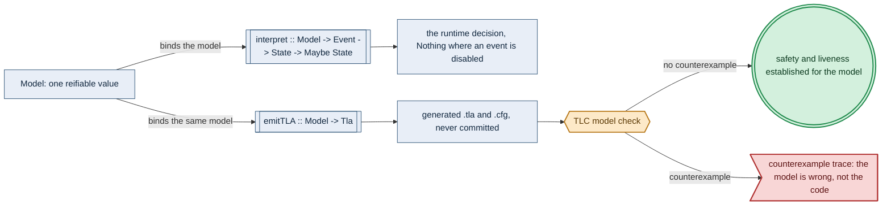

# The Formal Model: one reifiable value, two renderings

> **Purpose**: Single source of truth for how amoebius expresses a concurrent protocol as **one reifiable Haskell `Model` value** from which both the runtime decision function (`interpret`) and the TLA+ specification (`emitTLA`) are total renderings — minimizing drift while differential checks test their correspondence — and the `.tla`/`.cfg` are **generated, never-committed** artifacts.
> **Read this if**: a protocol has to be model-checked, or a model-checking result has to be read for its actual reach.

This document owns the model-as-data discipline: one reifiable value, two total renderings, and the boundary
between what a green model-check establishes and what running code must still earn. It does not own the
protocol being modelled, owned by
[gateway_migration_model_doctrine.md](./gateway_migration_model_doctrine.md), nor the simulation layer that
bridges model and implementation, owned by
[deterministic_simulation_doctrine.md](./deterministic_simulation_doctrine.md).

<details>
<summary>Link-graph metadata</summary>

**Status**: Authoritative source
**Supersedes**: N/A
**Referenced by**: DEVELOPMENT_PLAN/later_phases.md, DEVELOPMENT_PLAN/overview.md, DEVELOPMENT_PLAN/phase_00_documentation_suite.md, DEVELOPMENT_PLAN/phase_01_toolchain_spike.md, DEVELOPMENT_PLAN/phase_02_formal_model_kernel.md, DEVELOPMENT_PLAN/phase_03_gateway_migration_model.md, DEVELOPMENT_PLAN/phase_44_gateway_migration_drills.md, DEVELOPMENT_PLAN/system_components.md, documents/engineering/README.md, documents/engineering/chaos_failover_doctrine.md, documents/engineering/chaos_failover_second_axis.md, documents/engineering/chaos_failover_worked_examples.md, documents/engineering/conformance_harness_doctrine.md, documents/engineering/deterministic_simulation_doctrine.md, documents/engineering/gateway_migration_model_doctrine.md, documents/engineering/generated_artifacts_doctrine.md, documents/engineering/preflight_validation_doctrine.md, documents/engineering/tla_modelling_assumptions.md, documents/glossary.md, documents/reading_order.md
**Generated sections**: none

</details>

> **Historical result (invalidated).** Phase-run and implementation-result statements predate the 2026-08-11 reopen unless the owning phase is Done; target doctrine remains normative, and current state is in the [tracker](../../DEVELOPMENT_PLAN/README.md).

## Contents
- [1. Why this doctrine exists](#1-why-this-doctrine-exists)
- [2. The `Model` is data](#2-the-model-is-data)
- [3. Two total renderings](#3-two-total-renderings)
- [4. Single-source correspondence](#4-single-source-correspondence)
- [5. The `.tla`/`.cfg` are generated, never committed](#5-the-tlacfg-are-generated-never-committed)
- [6. What a green model-check proves, and what it does not](#6-what-a-green-model-check-proves-and-what-it-does-not)
- [7. Prototype validation](#7-prototype-validation)
- [8. Trace validation: the earlier code↔model bridge](#8-trace-validation-the-earlier-codemodel-bridge)
- [9. Planning ownership](#9-planning-ownership)
- [Related Documents](#related-documents)

---

## 1. Why this doctrine exists

A formal model is only useful when it describes the system that actually runs. The usual practice keeps
two artifacts by hand: a `.tla` specification written in TLA+, and the Haskell code that implements it. Their
relationship is then a **hand-maintained correspondence table** — "TLA+ variable `x` stands for Haskell field
`y` in module `Z`" — plus a divergence log recording every place the two have drifted. The sibling prodbox
project carries exactly this: a prose variable→module table and a numbered list of known divergences
(`prodbox/documents/engineering/tla_modelling_assumptions.md §2–§3`). That table is a standing liability: it
is never machine-checked, it rots as either artifact changes, and a green model-check proves a property of the
`.tla` that may no longer describe the code.

The obvious alternative — "keep the two artifacts in sync by discipline" — fails for the same reason every
copy-paste fails: two sources of truth diverge, and nothing forces them back together. The correspondence is
the load-bearing claim, and it is precisely the claim left unverified.

amoebius forecloses the drift by removing the second source of truth. **The protocol is authored once, as a
reifiable Haskell value — the `Model` — and both the running decision function and the TLA+ specification are
total functions of that one value.** This is the same move the rest of the system already makes: hostbootstrap's
plan is the data (`chain :: cfg -> [Step]`, rendered to both a `--dry-run` preview and live execution), and a
Kubernetes manifest is a typed record rendered by `renderAll` ([manifest_generation_doctrine.md](./manifest_generation_doctrine.md)).
Here the *model* is the data, TLA+ is one rendering, and the runtime step is another.

What this forecloses: a model that asserts a property the code does not have, and code that takes a transition
the model never sanctioned. Because both descend from the one `Model`, there is no correspondence table to
maintain and nothing to drift — the correspondence is a fact about the rendering functions, not a document.

---

## 2. The `Model` is data

A `Model` is a bounded transition system expressed in a deliberately small, **first-order, side-effect-free**
fragment: named state variables, an initial assignment, a set of guarded parameterized actions, named boolean
invariants, and an optional state constraint that bounds exploration. The expression language carries only what
the amoebius safety and liveness properties need — booleans, bounded integer arithmetic and comparison, finite
sets with cardinality, quantifiers over finite sets, function literals/update/application, and a conditional —
and no more. The constructor set is declared below rather than described, so the differential generator's
per-constructor coverage floor ([DEVELOPMENT_PLAN/phase_02_formal_model_kernel.md](../../DEVELOPMENT_PLAN/phase_02_formal_model_kernel.md))
quantifies over an enumerated set and not over prose.

**Implementation status.** Phase 2 built this fragment in `src/Amoebius/Formal/Model.hs` and validated both
readings on 2026-08-09 with the Register-1 gate in
[phase_02](../../DEVELOPMENT_PLAN/phase_02_formal_model_kernel.md). The gate exercised every constructor below
across 200 generated models; this is tested renderer correspondence, not Phase-3 code or runtime fidelity.

```haskell
data Model = Model
  { modelName       :: Name
  , modelConstants  :: [(Name, ConstVal)]     -- e.g. the cluster set, a bound
  , modelVars       :: [Name]                  -- state variables
  , modelInit       :: [(Name, Expr)]          -- initial value per variable
  , modelActions    :: [Action]                -- guarded, parameterized transitions
  , modelInvariants :: [(Name, Expr)]          -- named boolean SAFETY properties
  , modelFairness   :: [(Name, Fairness)]      -- per-action weak/strong fairness (WF/SF)
  , modelProperties :: [(Name, Temporal)]      -- named LIVENESS properties (temporal)
  , modelConstraint :: Maybe Expr              -- TLC state constraint (excludes failing states)
  , modelExpansionLimit :: Maybe Expr           -- checked boundary state is not expanded
  }

data Action = Action                            -- a guard that, when it holds, assigns primed
  { actName   :: Name                           -- variables; unlisted variables are UNCHANGED
  , actParams :: [(Name, Expr)]                 -- each parameter ranges over a finite set
  , actGuard  :: Expr
  , actEffect :: [(Name, Expr)]
  }

type Name = Text                                -- a TLA+-legal identifier

data ConstVal                                   -- the closed value domain: what a CONSTANT holds,
  = CBool  Bool                                 -- what a state variable holds, and what an Expr
  | CInt   Integer                              -- evaluates to
  | CStr   Text                                 -- a model value / enumerated symbol
  | CSet   (Set ConstVal)                        -- a finite set
  | CFun   (Map ConstVal ConstVal)               -- a finite function (TLA+ [d -> r])

data Expr                                       -- closed, first-order, side-effect-free
  = Lit     ConstVal                            -- a literal in the value domain
  | Var     Name                                -- read a state variable in the pre-state
  | Param   Name                                -- read an action parameter's binding
  | Const   Name                                -- read a CONSTANT
  | Not     Expr        | And   Expr Expr       -- boolean
  | Or      Expr Expr   | Implies Expr Expr
  | Eq      Expr Expr   | Lt    Expr Expr       -- equality and arithmetic comparison
  | Le      Expr Expr
  | Add     Expr Expr   | Sub   Expr Expr       -- bounded integer arithmetic
  | Card    Expr                                -- finite-set cardinality
  | SetLit  [Expr]      | Union Expr Expr       -- finite sets
  | Diff    Expr Expr   | Member Expr Expr
  | Forall  Name Expr Expr                       -- forall x \in S : P  (S finite)
  | Exists  Name Expr Expr                       -- exists x \in S : P  (S finite)
  | FunLit  Name Expr Expr                       -- [ x \in S |-> e ]
  | FunApp  Expr Expr                            -- f[x]
  | FunUpd  Expr Expr Expr                       -- [ f EXCEPT ![x] = e ]
  | IfThen  Expr Expr Expr
```

**Reading state, and priming.** `Expr` denotes over the **pre-state**: `Var` reads a state variable's current
value, `Param` reads the enclosing action's parameter binding, `Const` reads a `CONSTANT`. There is no primed
term-former, deliberately. Priming is **structural**: the `Name` key of an `actEffect` pair *is* the primed
variable, its `Expr` value is evaluated in the pre-state, and every `modelVars` entry absent from `actEffect`
is `UNCHANGED`. A next-state value therefore cannot be read inside an expression, which is what keeps the
fragment first-order and makes `emitTLA`'s walk a local translation rather than a scope analysis.

`Expr` is **unityped**: nothing at the Haskell type level forbids `And (Lit (CInt 1)) …`. That is a recorded
decision, not an oversight — a GADT-indexed `Expr t` would buy well-formedness at the cost of a generator
(`§4`) that must produce well-typed values by construction, which is the harder half of the differential
test. Ill-sorted expressions are instead rejected by a total well-formedness pass at model-construction time
(booleans where `modelInvariants` and `actGuard` require them; a finite set where `actParams`, `Forall`,
`Exists`, and `FunLit` require one; a `modelFairness` key that names a declared `modelActions` entry), and
that pass is a decode-style check, never claimed as a type fact.

**`Card` and `Add`/`Sub` are load-bearing, not decoration.** amoebius's one obligation states its convergence
goal as `ownerCount ~> ownerCount = 1`
([gateway_migration_model_doctrine.md](./gateway_migration_model_doctrine.md)); `ownerCount` is the
cardinality of the owner set, so a fragment with comparison but no cardinality former could not express the
property the model exists to prove. The bounded arithmetic serves the same role for the replication offset and
the accrued-divergence bound. The fragment is as small as it can be *and still express the one model* — not
smaller.

The smallness is a requirement, not an economy. **To render a model to TLA+ faithfully, its transition relation must be reified — expressed in this closed first-order fragment — not written as an opaque Haskell function.**
An arbitrary Haskell function cannot be translated to TLA+; a value in this fragment can be walked structurally.
Keeping every modelled protocol inside the fragment is the price of "generate the `.tla`, never hand-write it,"
and it is affordable because the one obligation amoebius models is small (a handful of variables — see
[gateway_migration_model_doctrine.md](./gateway_migration_model_doctrine.md)).

**Safety and liveness are both first-class.** `modelInvariants` are boolean **safety** properties (checked on
every reachable state). Some protocol guarantees are irreducibly **liveness** — *progress*, not just the
absence of a bad state: the anti-split-brain guarantee amoebius most cares about is that the forest
*eventually converges to exactly one owner* ([gateway_migration_model_doctrine.md](./gateway_migration_model_doctrine.md)),
which a safety invariant cannot express (a stuck state with *zero* owners satisfies "at most one" yet has not
converged). The fragment therefore carries two more closed, structurally-walkable pieces alongside the
first-order `Expr`:

```haskell
data Fairness = WeakFair | StrongFair          -- WF_vars / SF_vars on an action
data Temporal                                   -- the minimal liveness sub-fragment
  = Always     Expr                             -- []P
  | Eventually Expr                             -- <>P
  | LeadsTo    Expr Expr                        -- P ~> Q  (P leads to Q)
```

`modelFairness` annotates the actions whose continued enablement the liveness argument assumes; `modelProperties`
are the named temporal goals. Both are as small and closed as the safety fragment, so `emitTLA` walks them
structurally too ([§3](#3-two-total-renderings)); what liveness costs — a *fairness assumption*, and a checker
that reasons about infinite behaviours — is paid honestly in [§3](#3-two-total-renderings) and
[§6](#6-what-a-green-model-check-proves-and-what-it-does-not), never hidden.

---

## 3. Two total renderings

The types the two renderings consume and produce are closed and small:

```haskell
type State = Map Name ConstVal                  -- one binding per `modelVars` entry, total over it
data Event = Event                              -- an action under a parameter binding
  { evAction :: Name                            -- names a `modelActions` entry
  , evArgs   :: Map Name ConstVal               -- one binding per `actParams` entry
  }
newtype Tla = Tla Text                          -- the rendered module
newtype Cfg = Cfg Text                          -- the rendered TLC configuration
```

One `Model` value is consumed by two total functions:

- **`interpret :: Model -> Event -> State -> Maybe State`** — the runtime decision core. Given a state and an
  event (an action under a parameter binding), it computes the next state. It returns `Nothing` exactly when
  the event is **not enabled** — the named action's `actGuard` evaluates false under the binding, or the event
  names no declared action — and `Just` the successor otherwise; a disabled event is not an error and is not
  an identity step, because a self-loop would fabricate a stuttering transition TLA+'s `Next` does not
  sanction. Totality is the absence of partiality, not the absence of a `Nothing` case. This is the pure
  function a daemon calls to
  decide what to do next; it is unit-testable with no cluster (Register 1, [conformance_harness_doctrine.md](./conformance_harness_doctrine.md)).
  The explorer's companion is **`enabledEvents :: Model -> State -> [Event]`**, the finite enumeration of every action × parameter binding whose guard holds in a state — finite because each `actParams` range is a finite set — which is what makes the breadth-first frontier of [§4](#4-single-source-correspondence)
  computable at all.
- **`emitTLA :: Model -> (Tla, Cfg)`** — renders the same value to a TLA+ module and its configuration, which
  TLC then model-checks. The emitter is a structural walk of the fragment: state variables become `VARIABLES`,
  the initial assignment becomes `Init`, each action becomes an operator, their disjunction becomes `Next`, the
  invariants become named operators listed as `INVARIANT`s in the `.cfg`, and the constraint becomes a
  `CONSTRAINT`. The **liveness** pieces render too: each `modelFairness` entry becomes a `WF_vars`/`SF_vars`
  conjunct on the temporal `Spec` formula, and each `modelProperties` entry becomes a named temporal operator
  listed as a `PROPERTY` in the `.cfg` — so TLC checks liveness under the declared fairness, not merely safety.

**Safety is checked by both readings; liveness is checked by TLC only.** The in-process explorer
([§4](#4-single-source-correspondence)) is a bounded *reachability* search — it evaluates every safety
invariant on every reachable state, but it does **not** detect infinite/lasso behaviours and so does **not**
check `modelProperties`. Liveness is therefore a **TLC-only** verdict; the explorer↔TLC agreement cross-check
covers safety only. This asymmetry is deliberate (a lasso/SCC liveness checker in-process is a large lift for
little marginal assurance) and is carried into the honesty ledger ([§6](#6-what-a-green-model-check-proves-and-what-it-does-not)).

The interpreter and the emitter are the *only* two consumers, and each is intended to denote the same fragment.
Their checked agreement on the meaning of every constructor is what makes the single source trustworthy.

---


*Design intent, Tier-1. Two total renderings of one value, which is what makes the correspondence between the checked model and the running decision function structural rather than asserted. A green check establishes properties of the model alone; what the code owes beyond that is stated in [§6](#6-what-a-green-model-check-proves-and-what-it-does-not). Vocabulary: [diagram_conventions.md](./diagram_conventions.md).*

## 4. Single-source correspondence

Because `interpret` and `emitTLA` are two renderings of one `Model`, there is **no per-model variable→code correspondence table and no divergence log**. Sharing the source removes one class of manual
drift, but it does not prove the two rendering functions semantically equivalent. Renderer faithfulness is one
reusable meta-obligation, checked across the fragment rather than asserted separately in prose for each model.

Correspondence is made *testable* by a second in-process reading of the same value: a bounded reachability
explorer over `interpret` (breadth-first over reachable states, pruned by the TLC state constraint, checking every
invariant on every reachable state — the same shape TLC applies to the emitted spec). A model is validated by
running **both** checkers on the same `Model`:

- the in-process explorer (Register 1, a `cabal test`), and
- TLC on the emitted `.tla` (Register 1 as well; run through the standard `tla2tools` toolchain).

A validated model is one where both agree — green on the correct model — **and both go red under the same mutation** (a deliberately broken variant of the model reaches the illegal state and both checkers report it).
Agreement plus shared sensitivity to a seeded fault is the operational form of "the two renderings mean the same
thing." This agreement is a **safety** cross-check: both the explorer and TLC evaluate the safety invariants, so
their agreement catches an `emitTLA`/`interpret` divergence on the safety semantics. Liveness has no such
cross-check ([§3](#3-two-total-renderings)) — it is checked by TLC alone.

**Assurance accounting — what the single source does and does not buy.** Two precisions keep the guarantee from
being over-read. First, checked correspondence is between the TLA+ spec and the **decision core**
(`interpret`), *not* between the spec and the effectful **daemon**: `interpret` is the pure function a daemon
*calls*, but whether the daemon captures its inputs with the right freshness/fencing and applies the decision
faithfully is a separate, **runtime-fidelity** obligation (Register-2.5 deterministic simulation and Register-3
chaos, [conformance_harness_doctrine.md](./conformance_harness_doctrine.md),
[chaos_failover_doctrine.md §12](./chaos_failover_doctrine.md#12-the-moral-core--proven-tested-assumed)). Second,
running the explorer, TLC, and io-sim over one `Model` yields **one** protocol proof (the TLC run) plus two
**cross-checks on the renderers** (the explorer over `interpret`, io-sim over the lifted core) — not three
independent proofs of the protocol. The value of the ensemble is real (it hardens the load-bearing renderers,
[§7](#7-prototype-validation), and exercises schedules the pure core leaves open) but must not be triple-counted
as three separate assurances.

**Faithfulness is the load-bearing meta-property, and it is checked — not merely asserted.** The whole scheme
rests on `emitTLA` and `interpret` being faithful denotations of *every* constructor; a renderer bug (a
mistranslated quantifier, a dropped `UNCHANGED`, a mis-ordered primed assignment, a wrong `CONSTRAINT`
semantics) would silently make TLC check a different protocol than the daemon runs. Round-tripping one `ToyModel`
plus one seeded mutation is thin coverage for a property this load-bearing. The operational form of "faithful
denotation" is therefore a **differential property test**: a generator over the `Model` fragment produces random
small models, and the explorer and TLC are run on each under a **pinned convention**. TLC's actual
`CONSTRAINT` semantics excludes a failing successor from the distinct-state set; the explorer mirrors that
exactly. The separate `modelExpansionLimit` is compiled into every action's source guard so a state reached at
that boundary remains distinct and invariant-checked but is **not** expanded in either reading.
`CHECK_DEADLOCK` is set explicitly on both sides, and the test asserts the two
produce identical **canonical state-fingerprint *sets*** — not merely equal cardinality, which equal counts
alone do not establish (equal count + equal verdict is not equal state set) — alongside the same verdict,
shrinking any divergence to a minimal offending model. This differential faithfulness claim is **scoped to the safety sub-fragment**: the generator exercises `emitTLA`'s `Init`/`Next`/`INVARIANT`/`CONSTRAINT` rendering, and
the explorer checks no liveness, so the `modelFairness`/`modelProperties` (`WF`/`SF`/`PROPERTY`) rendering is
**not** covered by this test and rests on the `emitTLA` golden and the TLC-only liveness runs instead. This is the single most valuable place in the
kernel for a **proof assistant**: a machine-checked meta-theorem that each `Expr`/`Temporal` constructor's
`interpret`-denotation equals the TLA+ denotation `emitTLA` targets would upgrade faithfulness from
*tested* to *proven*. That meta-theorem, and the fold-closure proofs the confluence ledger requires
([chaos_failover_second_axis.md §19](./chaos_failover_second_axis.md#19-the-cross-boundary-ledger-and-conformance-rows)),
are the **only** two places a proof assistant is warranted here — adopt it surgically (evaluate Liquid Haskell,
which checks the *actual* Haskell and so introduces no second artifact to drift, against Lean) or not at all; a
broad proof-assistant layer would re-introduce exactly the artifact-drift the `Model`-as-data pattern exists to
foreclose ([§1](#1-why-this-doctrine-exists)).

### 4.1 The reference model, and why its rendering is byte-locked

**The problem.** The renderers are the load-bearing artifacts, and nothing in the scheme so far exercises them
against an expectation authored independently of them. A renderer validated only by re-running itself proves
that it is stable, not that it is right; and the differential test above is **safety-scoped**, so an emitter
that renders `StrongFair` as `WF_vars`, or swaps `[]` for `<>`, is invisible to every other oracle in the kernel. Both gaps are invisible at author time and surface as a TLC run that model-checks a protocol the daemon does not implement.

**Why the obvious alternative fails.** The tempting fixture is a model generated or snapshotted from the
renderer's own first output. That is not an oracle: it re-derives the expectation from the artifact under
test, so it can only ever fail on a *change*, never on an *error*. Equally tempting is a structural
(AST-level) assertion on the emitted spec instead of a byte comparison — but the defects that matter here are
exactly the ones a structural comparison normalizes away: operator precedence, the fairness conjunct attached
to the temporal `Spec` formula, and the `CONSTRAINT`/`CHECK_DEADLOCK` conventions the two checkers must agree
on.

**The chosen rule.** The kernel carries a **reference model** — one small, complete, hand-authored `Model`
that exists only to validate the renderers, distinct from every model that describes a real amoebius
protocol — and its rendering is pinned **byte-for-byte** against a fixture authored *before* the renderer
exists. Three properties make the fixture an oracle rather than a snapshot:

1. **Independence.** The golden is authored and committed in the documentation phase, before any emitter
   source exists, under the gate-integrity discipline
   ([development_plan_standards.md §M](../../DEVELOPMENT_PLAN/development_plan_standards.md#m-gate-integrity-a-gate-cannot-be-passed-by-a-stub)).
   A golden regenerated from the renderer's own output is not a test.
2. **Sole coverage of the liveness path.** Because the differential test is safety-scoped, this golden is the
   **only** oracle that pins the rendered bytes of the fairness and temporal constructors — `WeakFair` and
   `StrongFair` as `WF_vars`/`SF_vars` conjuncts, and `Always`/`Eventually`/`LeadsTo` as `[]`/`<>`/`~>`. Committed renderer mutants that swap one for another must turn it red, or the oracle has no teeth. 3. **Non-vacuity by structural assertion.** A reference model that exercised only booleans would let the golden pass while quantifier, function, and fairness translation stayed stubbed. A committed assertion therefore walks the reference model's own `Expr`/`Action`/`Temporal` nodes and fails unless it carries at least one finite quantifier, one function literal/update/application, **both** `Fairness` constructors, and **all three** `Temporal` constructors. The fixture cannot be weakened without that assertion failing first.

**What it forecloses.** The renderer can no longer be reformatted freely: any change to emitted layout is a
golden change, and a golden may be amended only under the oracle-amendment discipline
([development_plan_standards.md §M](../../DEVELOPMENT_PLAN/development_plan_standards.md#m-gate-integrity-a-gate-cannot-be-passed-by-a-stub)),
never rewritten from a failing run's actual output. That rigidity is the point: it is what makes the byte
comparison an oracle. The concrete reference model — its name, its protocol, its committed fixture paths, and
the mutants that must break it — is a build artifact of the formal-model phase and is named in
[DEVELOPMENT_PLAN/phase_02_formal_model_kernel.md](../../DEVELOPMENT_PLAN/phase_02_formal_model_kernel.md);
this doctrine owns only the obligation and its rationale. The reference model proves the **kernel**; it is not
an amoebius protocol, and no claim about amoebius follows from it. The one real obligation is the gateway
migration ([gateway_migration_model_doctrine.md](./gateway_migration_model_doctrine.md)), which rides the
kernel this fixture validates.

---

## 5. The `.tla`/`.cfg` are generated, never committed

The TLA+ module and its configuration are **build artifacts**, emitted from the `Model` SSoT by an `amoebius`
subcommand and stamped as generated. They are **not** committed to the repository, exactly like the rendered
Kubernetes manifests and the Dhall schema reflected from Haskell types
([generated_artifacts_doctrine.md](./generated_artifacts_doctrine.md)). Model-checking regenerates them from the
current `Model` and runs TLC; a stale committed `.tla` cannot exist because there is no committed `.tla`. This is
the mechanical guarantee behind [§4](#4-single-source-correspondence): the only authored artifact is the
Haskell `Model`.

---

## 6. What a green model-check proves, and what it does not

Per the honesty discipline ([documentation_standards.md §6](../documentation_standards.md#6-honesty-the-proventestedassumed-discipline), [chaos_failover_doctrine.md](./chaos_failover_doctrine.md)):

- **Proven-for-the-model, at the declared bound.** A green TLC run is an exhaustive proof that the declared
  invariants hold on every reachable state of the model *at the bounded scope*. It is a real result, and because
  the model is the same value the runtime interprets, it is a result about the shape the code takes — not about a
  separate hand-written abstraction.
- **Liveness is proven only under the named fairness, and only by TLC.** A green `PROPERTY` result proves a
  `modelProperties` liveness goal holds on the model **under the `modelFairness` assumptions** — which are
  themselves an *assumed* premise (a real system starves an action if a scheduler is adversarial), recorded like
  the R8 synchrony premise ([chaos_failover_doctrine.md §13](./chaos_failover_doctrine.md#13-the-supporting-rules--the-conditions-the-moves-need)),
  never proven. A liveness `PROPERTY` is furthermore **not** checked under a state `CONSTRAINT`: a `CONSTRAINT`
  truncates the behaviour graph at the bound and distorts `WF`/`SF` enabledness, so a continuously-enabled action
  can be cut off at the boundary and TLC report a *spurious* green liveness **within** the bound — a distortion
  the "not a general-scope proof" bullet below (which speaks only to what lies *beyond* the bound) does not
  cover. amoebius therefore **finitizes** every liveness run — bounding the state space through `CONSTANTS` and
  finite, saturating variable domains rather than a state `CONSTRAINT` — so `PROPERTY` checking runs
  **`CONSTRAINT`-free**; where a run instead retains a `CONSTRAINT`, TLC's constraint-truncation semantics is
  recorded as an explicit *assumed* premise, and which of the two a run uses is stated. A liveness green is
  credible only with a **fairness-sensitivity check**: the property must go
  **red** when the fairness assumption is removed (otherwise it was vacuously true and the fairness annotation
  was load-bearing on nothing). The in-process explorer does not check liveness at all ([§3](#3-two-total-renderings)),
  so a liveness verdict is TLC-only and carries no explorer cross-check.
- **Not a general-scope proof.** Bounded model-checking proves nothing beyond its bound unless a **cutoff**
  argument reduces the general case to the bounded one. Where amoebius relies on such a reduction it states the
  reduction explicitly ([gateway_migration_model_doctrine.md](./gateway_migration_model_doctrine.md)); absent a
  cutoff, "green at scope *N*" is exactly that.
- **Not a proof that the model is the right model.** Model-checking proves the model satisfies its invariants,
  never that the invariants are the right ones or that the model faithfully captures the intended protocol. That
  faithfulness is a human act, unchecked by any tool, and is called out as an assumption.
- **One-and-done, never per-`InForceSpec`.** The protocol is model-checked **once**, at design time, over the
  bounded model. TLC is a whole-state-space search and **never** runs on the spec-decode path. What runs
  per-`InForceSpec` is a fast, total **decode-time structural-fit fold** that rejects any spec falling outside
  the envelope the one-and-done proof assumed. This split is owned in detail by
  [gateway_migration_model_doctrine.md](./gateway_migration_model_doctrine.md).

---

## 7. Prototype validation

The mechanism of this doctrine — a `Model` value, the `interpret` explorer, and the `emitTLA` renderer producing
a TLC-checkable spec — was **prototyped in a throwaway spike** over a small transition-system model. The spike
confirmed the load-bearing claims end to end: the in-process explorer and TLC reached the *same* verdict on the
generated spec (identical reachable-state count), and a seeded mutation of the model produced the *expected*
counterexample in both. The spike has been removed; per
[documentation_standards.md §6](../documentation_standards.md#6-honesty-the-proventestedassumed-discipline) this
was historical evidence that the mechanism worked. Phase 2 has now superseded that spike with the built
amoebius kernel: eight exact `ToyModel` fingerprints, safety and liveness under fairness, fairness sensitivity,
all committed mutants killed, and 200 differential models green. The result remains scoped to the model and
does not by itself establish Phase-3 protocol correspondence or runtime fidelity. Phase 3 subsequently used
that kernel for the concrete `GatewayMigration` value: explorer/TLC agreement on 53 states, five safety and
three liveness obligations green, bounded IOSimPOR agreement, and all committed mutants caught. Runtime
fidelity remains UNVERIFIED.

---

## 8. Trace validation: the earlier code↔model bridge

Single-source correspondence ([§4](#4-single-source-correspondence)) removes the hand-maintained mapping and
differentially checks the spec↔decision-core gap, but
the spec↔**daemon** gap — that the *effectful* runtime only ever takes transitions the `Model` sanctions — is a
runtime-fidelity obligation. The design's default instrument for it is Register-3 chaos injection, which is
*sampled* and *late*. **Trace validation** is a formal, earlier bridge that reuses the same `Model`: the daemon
emits a structured **transition log** (its observed `(state, action, state')` steps), and a checker asserts each
observed step is a legal `Next`-step of the emitted spec — the conformance/"eXtreme-modelling" pattern (record
the implementation's real trace, replay it against the TLA+ `Next` relation). Because the spec is generated from
the `Model` the daemon's `interpret` already renders, the trace-check needs no separate abstraction map. It is a
**partial** discharge — it proves the observed transitions were legal, not that every reachable transition is —
so it is honestly weaker than the exhaustive design proof and stronger than sampled chaos; it can run in
Register 2.5 (against the deterministically-simulated daemon,
[deterministic_simulation_doctrine.md](./deterministic_simulation_doctrine.md)) and in Register 3 (against the
live forest). The concrete obligation for the one model is owned by
[gateway_migration_model_doctrine.md §6](./gateway_migration_model_doctrine.md#6-modelling-bounds-and-honesty).

---

## 9. Planning ownership

This document remains the normative formal-model doctrine. The `Model` EDSL, the `interpret` explorer, and the
`emitTLA` renderer were built and validated in Phase 2; the one concrete model (`GatewayMigration`, both
branches) was built and validated in Phase 3. Phase order, status, and gates live only in
[DEVELOPMENT_PLAN/README.md](../../DEVELOPMENT_PLAN/README.md). The kernel and protocol claims above are
tested/proven-for-the-model at their recorded scopes; effectful-daemon and live-runtime fidelity remain design
intent and UNVERIFIED.

---

## Related Documents
- [Engineering Doctrine Index](./README.md)
- [Gateway Migration Model](./gateway_migration_model_doctrine.md) — the one concrete `Model`: both branches of `GatewayMigration`, model-checked and simulated
- [Chaos & Failover Doctrine](./chaos_failover_doctrine.md) — the Extract→Model→Inject methodology and the proven/tested/assumed ledger this rendering serves
- [Generated Artifacts Doctrine](./generated_artifacts_doctrine.md) — why the emitted `.tla`/`.cfg` are never committed
- [Conformance Harness Doctrine](./conformance_harness_doctrine.md) — the Register-1 in-process explorer that mirrors TLC
- [Deterministic Simulation Doctrine](./deterministic_simulation_doctrine.md) — the Register-2.5 io-sim environment that runs the real daemon against a modeled world; the trace-validation home for the built code
- [Manifest Generation Doctrine](./manifest_generation_doctrine.md) — the sibling "render a typed value to its artifact" pattern
- [Documentation Standards](../documentation_standards.md)
- [Development Plan](../../DEVELOPMENT_PLAN/README.md)
