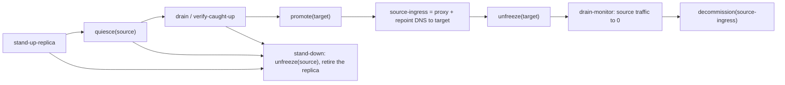

# Gateway Migration

> **Purpose**: Single Source of Truth for how amoebius moves the wild-ingress gateway between clusters — the typed `GatewayMigration = <Planned | Failover>` taxonomy, the planned strong-consistency handover, the unplanned survivor-wins failover, and the client-rebind protocol that keeps a live session bindable throughout.
> **Read this if**: wild-ingress ownership has to move between clusters, planned or otherwise.

This document owns the migration itself: both branches, the client rebind that keeps a live session findable,
and the edge-observed state machine each branch runs. It does not own the formal model that discharges the
obligation, owned by
[gateway_migration_model_doctrine.md](./gateway_migration_model_doctrine.md), nor the method that produced
it, owned by [chaos_failover_doctrine.md](./chaos_failover_doctrine.md). This is the one boundary where
amoebius carries a formal proof obligation rather than delegating it.

Link-graph metadata

**Status**: Authoritative source
**Supersedes**: N/A
**Referenced by**: DEVELOPMENT_PLAN/phase_75_gateway_migration_drills.md, DEVELOPMENT_PLAN/system_components.md, documents/engineering/README.md, documents/engineering/backup_recovery_doctrine.md, documents/engineering/chaos_failover_doctrine.md, documents/engineering/chaos_failover_second_axis.md, documents/engineering/chaos_failover_worked_examples.md, documents/engineering/cluster_lifecycle_doctrine.md, documents/engineering/consistency_pacelc_doctrine.md, documents/engineering/daemon_topology_doctrine.md, documents/engineering/dsl_doctrine.md, documents/engineering/gateway_migration_model_doctrine.md, documents/engineering/inforcespec_migration_doctrine.md, documents/engineering/migration_doctrine.md, documents/engineering/network_fabric_doctrine.md, documents/engineering/readiness_ordering_doctrine.md, documents/engineering/single_logical_data_plane_doctrine.md, documents/engineering/ui_realtime_coordination_doctrine.md, documents/glossary.md, documents/illegal_state/illegal_state_multicluster.md, documents/illegal_state/illegal_state_techniques.md, documents/reading_order.md
**Generated sections**: none

> **Historical result (invalidated).** Every phase-run or implementation-result statement in this document is permanently invalidated diagnostic history. It cannot establish or reactivate current status, even if a phase later advances. Target doctrine remains normative; current status is solely in the [tracker](../../DEVELOPMENT_PLAN/README.md).

---

## 1. Why this doctrine exists

**The problem this doctrine prevents.** Two unlike operations were conflated under one label. One is a
coordinated handover of the wild-ingress gateway between two live clusters; the other is an emergency
takeover after the active gateway vanishes. The corpus named them in two vocabularies that never met —
"graceful teardown-with-cleanup vs chaos-failover" ([cluster_lifecycle_doctrine.md §5](./cluster_lifecycle_doctrine.md#5-teardown-with-cleanup-vs-chaos-failover-the-central-distinction)),
keyed on turning a cluster *off*, and "planned migration vs failover"
([network_fabric_doctrine.md §6](./network_fabric_doctrine.md#6-the-service-mesh-verdict-no-linkerd-for-v1)),
keyed on a traffic weight-shift. The consequence is a defect at two layers: at author time, a deployment
rule cannot state which migration mode it intends; at runtime, a reader cannot tell which data-loss
guarantee (RPO=0 versus a bounded budget) is in force for a given gateway change, nor whether a live
session is guaranteed to rebind. The planned strong-consistency handover between two running clusters had
no canonical description at all.

**Why the obvious alternative fails.** Folding the taxonomy into
[cluster_lifecycle_doctrine.md §5](./cluster_lifecycle_doctrine.md#5-teardown-with-cleanup-vs-chaos-failover-the-central-distinction)
miscategorizes it. That section owns turning a cluster off, and its gateway-handoff step exists because the
source cluster is departing. A gateway migration between two clusters that both keep running is an
ingress-and-consistency operation, not a lifecycle event, and it carries a client-rebind protocol (DNS TTL,
transparent proxy, session portability) that has no home in a lifecycle document. Leaving the taxonomy in
the design notes leaves the concept with no single canonical owner.

**The chosen rule.** A gateway change is a value of the typed sum `GatewayMigration = <Planned | Failover>`.
amoebius owns one canonical taxonomy here; the two arms carry different, explicitly stated guarantees; and
the mechanics each arm invokes — the traffic weight-shift, the hub-role move, the DNS repoint, and the async
proof — stay with their existing owners and are linked, never restated.

**What it forecloses.** Naming a gateway change without committing to a guarantee. The cost is that a gateway
migration is now a first-class deployment-rules concept with a committed guarantee per arm; there is no untyped
DNS-repoint path that commits to no data-loss guarantee. The mode is **world-triggered, not an authored field**: an operator initiates a
`Planned` migration by editing the parent-owned pairing (or a `ScalingPolicy` initiates one on a home→cloud
move), and `Failover` is the automatic, availability-first response to a vanished active — never an
operator-selected posture. The unified PACELC deployment-rules surface that carries the failover budget and
the participation flag is owned by [`consistency_pacelc_doctrine.md`](./consistency_pacelc_doctrine.md).

**Where this sits among the other migrations.** A `Planned` gateway change is the escalation path of an
ordinary `InForceSpec` generation diff: the operator edits the parent-owned pairing, and that diff — which
[`inforcespec_migration_doctrine.md §2`](./inforcespec_migration_doctrine.md#2-a-migration-is-a-typed-diff-not-a-new-operation)
owns on the representational side — cannot be discharged by a same-cluster reconcile, because moving the wild
ingress requires a drain, a freshness proof, and a client rebind. The two documents describe one operation
from two ends. Both are instances of the general migration law
([`migration_doctrine.md §2`](./migration_doctrine.md#2-the-law)), and the `Failover` arm is the one place that
law's verify-before-retire clause is deliberately suspended
([`migration_doctrine.md §4`](./migration_doctrine.md#4-the-two-stated-exceptions)).

Across both arms one thing is invariant: the strong-consistency boundary *within* a cluster is unchanged —
it is delegated to MinIO, Pulsar, and Percona/Patroni Postgres
([platform_services_doctrine.md §9](./platform_services_doctrine.md#9-the-loadbalancer-and-the-single-wild-ingress-path); [chaos_failover_second_axis.md §17](./chaos_failover_second_axis.md#17-the-boundary-and-its-classifier)). What a
`GatewayMigration` changes is only *which cluster owns the wild ingress*. The two prior vocabularies map onto
the sum: graceful teardown's gateway-handoff step and a planned home→provider migration are both `Planned`;
chaos-failover's emergency DNS repoint is `Failover`.

| Arm | Trigger | Both clusters up? | Data-loss guarantee | Modelled? |
|---|---|---|---|---|
| `Planned` | A new `InForceSpec`, or amoebius automated logic (e.g. a `ScalingPolicy`) | Yes | RPO=0 — no committed write lost (the `PlannedIsLossless` model invariant, proven-for-the-model; [§6](#6-honesty-and-layer-markers)) | Yes — `PlannedIsLossless` (cutover reachable only after `verify-caught-up`); no *async* divergence |
| `Failover` | The active gateway is down or unreachable | No — the active has vanished | RPO>0 — bounded by the declared data-loss budget | Yes — the async "Second Axis" (`NoWriteAfterStaleFailover`/`MergeConverges`; [chaos_failover_second_axis.md §16](./chaos_failover_second_axis.md#16-the-second-axis--when-one-cluster-becomes-a-forest)) |

Both branches are modelled as one reifiable `Model` — simulated (io-sim) and proven (TLC) at design time — by
[gateway_migration_model_doctrine.md](./gateway_migration_model_doctrine.md), amoebius's one proof obligation.

---

## 2. The `Planned` branch — a coordinated strong-consistency handover

A `Planned` migration is driven by a new `InForceSpec` (an operator changes which cluster owns the gateway)
or by amoebius automated logic — for example a `ScalingPolicy` moving the gateway from the home network to
the cloud when incoming traffic exceeds what home hosting should serve. The source and target clusters are
both up throughout.

**The target may be built first.** Because a planned migration is not racing a failure, amoebius has time to
manage a graceful transition: it may stand up the target cluster from scratch and geo-replicate it to a full
copy of the source's state *before* any cutover. Full geo-synchronization completes first; the migration
proper begins only from a target that already holds the source's state.

**The protocol is a coordinated quiesce → drain → verify-caught-up → cutover:**

1. **Quiesce** — briefly freeze writes at the source's consistency boundary (the freeze is on writes, not on
   the ingress; see [§4](#4-client-rebind--a-live-session-must-always-find-the-gateway)).
2. **Drain** — let the async replica catch up to the frozen snapshot.
3. **Verify caught-up** — confirm the target holds the frozen snapshot in full. The freeze is what buys RPO=0
   without steady-state synchronous replication.
4. **Cutover** — repoint the gateway DNS record and the WireGuard hub role
   ([network_fabric_doctrine.md §4](./network_fabric_doctrine.md#4-topology-the-hub-is-the-gateway-role-and-the-fabric-moves-with-it))
   to the target, then unfreeze. A gateway migration moves the *wild-ingress* role, not a control-plane
   endpoint: the target cluster is reached through its **own** apiserver, and the apiserver-VPN-IP is a
   per-cluster (stretched-cluster) construct owned by that cluster, never a shared address repointed here.

**Target guarantee — RPO=0.** No committed write may be lost. The `PlannedIsLossless` model invariant targets
proven-for-the-model strength at scope 2, while runtime fidelity of the caught-up verification stays assumed
until Phase 75 ([§6](#6-honesty-and-layer-markers)). Writes must be frozen and the replica verified caught-up
before authority moves. This is a coordinated cross-cluster switchover (Patroni-style), **not** an
asynchronous [Second-Axis](./chaos_failover_second_axis.md#16-the-second-axis--when-one-cluster-becomes-a-forest)
event: it presents no async divergence to reconcile. Browser-session continuity comes from keeping the active
origin unchanged while its protected host-only cookie is checked against caught-up/shared server-side session
state after cutover; the Keycloak/session stores are part of the verified snapshot. Portable bearer semantics
may apply to separately admitted non-browser clients, but browser-exposed OIDC/JWT credentials are not an SPA
premise.

**The illegal state this forecloses — a committed transaction lost during a planned migration.** The
quiesce + verify-caught-up gate makes "authority moved to a target that had not received a committed write"
a state the protocol does not enter; the typed migration relation ([§6](#6-honesty-and-layer-markers)) carries
no arm that repoints before the caught-up edge is observed. The foreclosure technique is the GADT-indexed
state machine ([§5](#5-the-migration-as-a-typed-edge-observed-state-machine); [illegal_state_catalog.md §4.3](../illegal_state/illegal_state_techniques.md#43-gadt-indexed-state-machines--only-legal-transitions-are-typed)),
and the honest limit is that the caught-up edge is **runtime-observed**, not a constructive impossibility
([§6](#6-honesty-and-layer-markers)).

The in-cluster backend traffic cutover rides Gateway-API `HTTPRoute` weights — the one traffic-split feature
amoebius needs, owned by
[network_fabric_doctrine.md §6](./network_fabric_doctrine.md#6-the-service-mesh-verdict-no-linkerd-for-v1)
and [release_lifecycle_doctrine.md §5](./release_lifecycle_doctrine.md#5-rolloutplan--rolloutphase-the-readiness-gated-apply);
the DNS record itself is provisioned by
[pulumi_iac_doctrine.md §5.1](./pulumi_iac_doctrine.md#51-dns--route53) and mutated on cutover.

---

## 3. The `Failover` branch — an availability-first emergency takeover

A `Failover` happens when the active gateway is down or unreachable, so no freeze or drain is possible. A
sibling cluster promotes from its **last async-replicated state** and hard-repoints DNS. It may be mid
geo-sync, with no knowledge of whether the two clusters were consistent at the instant of partition, and it
continues on a best-effort basis.

**Guarantee — RPO>0, bounded, and eventual reconciliation.** Committed-but-un-replicated writes on the dead
active are the honest loss, bounded by the declared **data-loss budget**. Perfect consistency is impossible
across an async boundary that admits partition (CAP/FLP at cluster scale). What is guaranteed is that when
the failed cluster returns, the histories **reconcile to a single owner**.

This is the asynchronous cross-cluster **"Second Axis"** — the one place a per-system proof obligation
concentrates on amoebius itself. Its correctness is owned, and must not be restated here: the fail-closed
freshness promotion gate (R7), the failover budget (R9), the deterministic total merge of the CAS pointer,
and the reconciliation of divergent histories are owned by
[chaos_failover_second_axis.md §16–§19](./chaos_failover_second_axis.md#16-the-second-axis--when-one-cluster-becomes-a-forest)
and its
[Appendix B](./chaos_failover_worked_examples.md#appendix-b--worked-example-fenced-cross-cluster-geo-replication-failover-the-open-cross-cluster-failover-question);
the formal model is [gateway_migration_model_doctrine.md](./gateway_migration_model_doctrine.md) (Phase 17).

**Reconciliation on the primary's return** (summarized; owned by
[chaos_failover_worked_examples.md Appendix B](./chaos_failover_worked_examples.md#appendix-b--worked-example-fenced-cross-cluster-geo-replication-failover-the-open-cross-cluster-failover-question)):
Keycloak **configuration** state (realms, clients, roles, users) is a deterministic projection of the
authoritative `InForceSpec` — re-derived on the survivor rather than merged. **Runtime session** state is
held survivor-wins; sessions on the lost fork past the divergence point re-authenticate. Per Appendix B, the
former primary is rolled back, rejoined as a replica, and its divergent suffix is isolated in the audited
RPO-gap log instead of being silently combined. The reconciliation is
therefore guaranteed to converge on a single gateway owner, with the un-replicated suffix accounted for only
by the data-loss budget.

---

## 4. Client rebind — a live session must always find the gateway

Repointing DNS is not sufficient on its own. DNS TTL and resolver caching leave a window in which a client
still resolves the old gateway address; if the old gateway is hard-stopped at the ingress, a mid-session
client is stranded. "A session that cannot rebind to the migrated gateway" is an illegal state
([illegal_state_catalog.md §3.44](../illegal_state/illegal_state_multicluster.md#344-a-session-that-cannot-rebind-on-gateway-migration)).

**On the `Planned` path** a session always has a working endpoint:

- **Freeze writes, not the ingress.** The old gateway stays alive as a transparent reverse proxy to the
  target over the fabric for the whole DNS-drain window; a client still resolving the old address is
  forwarded, its session state already on the target. This is the primary mechanism — no client-visible host
  change, no cookie-scoping dependency.
- **A low steady-state DNS TTL** on the migrating "active" record bounds the split window. A TTL cannot be
  shortened retroactively, so it must already be low. Each cluster also holds a **stable per-cluster address**
  that never migrates — the proxy target and the explicit-redirect fallback.
- **The explicit 307 redirect** to the target's stable per-cluster address is a fallback only: a host change
  drops the protected host-only UI-session cookie. amoebius does not expose an OIDC bearer or refresh token to
  browser state and does not broaden the cookie to a parent domain merely to make this redirect seamless.
  The fallback may therefore require reauthentication before any effect; the transparent proxy/stable origin
  is the session-preserving path and is preferred.
- **The browser WebSocket** is forwarded by the old-gateway proxy, or sent a graceful close so the client
  reconnects and re-resolves; the in-cluster backend cutover uses `HTTPRoute` weights. The connection itself
  carries no durable cursor or receipt truth, so reconnection resumes through the protocol in
  [UI Realtime Coordination](./ui_realtime_coordination_doctrine.md).

**On the `Failover` path** the active is down, so no old-gateway proxy exists. Clients cached to the dead
address get connection errors, retry, re-resolve the **same active hostname** within the low TTL, and rebind to
the survivor. The host-only protected cookie remains scoped to that stable hostname, while the survivor checks
it against replicated/server-shared session state and current membership/policy. Rebind is still reached, but
it is **not seamless**: brief client errors are expected, post-fork or unreplicated sessions reauthenticate,
and no browser-held bearer portability is assumed.

---

## 5. The migration as a typed, edge-observed state machine

A `Planned` migration is a GADT-indexed state machine whose transitions are ordered and gated on **observed edges**, never elapsed timers
([illegal_state_catalog.md §4.3](../illegal_state/illegal_state_techniques.md#43-gadt-indexed-state-machines--only-legal-transitions-are-typed)):

*Orientation. Design intent; the branch is owned by [§2](#2-the-planned-branch--a-coordinated-strong-consistency-handover) and the machine by [§5](#5-the-migration-as-a-typed-edge-observed-state-machine). Every transition is gated on an observed edge rather than a timer, and this branch holds a zero recovery-point objective.*

The `decommission(source-ingress)` state is reachable **only** from an observed `drain-monitor` edge (source
traffic ≈ 0), so no transition ever removes the last working endpoint for a live session.

### 5.1 Stand-down: a `Planned` migration that does not complete

**The problem.** The forward path above is one-directional. A `Planned` migration can stall indefinitely
before `promote` — a replica that never reaches `verify-caught-up` because replication cannot keep up, an
operator who reconsiders, a target cluster that fails its own bring-up. Without a reverse edge the source is
left quiesced and the target never promoted: a state in which **no** cluster serves the wild ingress, which
`UniqueGatewayOwner` ("at most one") permits and no safety invariant forbids. A stalled handover would satisfy
every stated property while the deployment is down.

**Why the obvious alternative fails.** Treating a stall as a `Failover` is wrong on both arms: the source has
not vanished, so the survivor-wins takeover has no survivor to elect, and `Failover` accepts RPO > 0 for an
operation whose whole point was RPO = 0. Waiting instead — "it will catch up eventually" — makes the outage a
function of a duration, which [readiness_ordering_doctrine.md](./readiness_ordering_doctrine.md) forbids as a
gate anywhere else in the suite.

**The chosen rule.** Every pre-`promote` state carries a **stand-down** edge back to the pre-migration shape:
`unfreeze(source)` and retire the replica. The source never gave up the role, so stand-down restores service
without a DNS change, without a rebind, and with **no** data loss — it is the clause-4 abort of
[migration_doctrine.md §2](./migration_doctrine.md#2-the-law), instantiated for this branch. Stand-down is
reachable from `stand-up-replica`, `quiesce(source)`, and `drain / verify-caught-up`, and from **nowhere after** `promote(target)`: once the target owns the role, returning to the source is not an abort but a second
`Planned` migration in the other direction, with its own `verify-caught-up`. That asymmetry is deliberate —
an "abort" that silently moved the role back would be an unverified cutover wearing the name of a rollback.

**What it forecloses.** The migration can no longer be modelled as a monotone forward walk, and the model
carries a liveness obligation it did not before: a `Planned` migration **reaches a terminal state** — either
`decommission(source-ingress)` or stand-down — rather than resting quiesced forever. The property and its
fairness premise are owned by
[`gateway_migration_model_doctrine.md`](./gateway_migration_model_doctrine.md). What stand-down does not
provide is an escape from a *post*-promote failure; that is the `Failover` arm's territory, and its
consistency cost is stated there ([§3](#3-the-failover-branch--an-availability-first-emergency-takeover)). "A session in limbo
that cannot rebind" therefore has no representable path — it is type-foreclosed by the state machine. The
honest limit is that the `drain-complete` edge is runtime-observed, so the foreclosure is decode/runtime, not
a constructive proof ([illegal_state_catalog.md §6](../illegal_state/illegal_state_techniques.md#6-three-layers-of-foreclosure-and-the-honesty-they-force); [§6](#6-honesty-and-layer-markers)).

The `Planned` branch's promote precondition — cutover reachable only after `verify-caught-up` — is generalized
in the model to a `FreshnessWitness` guard on the gateway-take transition, so a cluster takes the wild-ingress
role only from a data plane proven fresh, whether that freshness comes from a warm caught-up replica or from a
cold secondary seeded from backup within its declared bound. That generalization and its safety invariant
`NoTakeWithoutProvenFreshness` are owned by
[`gateway_migration_model_doctrine.md`](./gateway_migration_model_doctrine.md), and the cold-seed recovery
source it admits is owned by [`backup_recovery_doctrine.md` §8](./backup_recovery_doctrine.md#8-the-gateway-dovetail-seed-from-backup-under-consistency-over-availability).

---

## 6. Honesty and layer markers

The forest/geo-replication substrate is assigned to **Phase 74**. Phase 75 owns the migration-shell target in
`Amoebius.Multicluster.GatewayMigration`, `PlannedHandover`, `PromotionGate`, `DnsRepoint`, and
`ClientRebind`. Phase order, status, and the acceptance gate are owned by
[DEVELOPMENT_PLAN/README.md → Phase 75](../../DEVELOPMENT_PLAN/README.md); this document never restates phase
status.

- The `Planned` branch's **RPO=0** is the model invariant **`PlannedIsLossless`** — cutover is reachable only
  after a `verify-caught-up` edge, so no committed write is lost. It is **proven-for-the-model at scope 2**
  ([gateway_migration_model_doctrine.md §3](./gateway_migration_model_doctrine.md#3-the-model), [§6](./gateway_migration_model_doctrine.md#6-modelling-bounds-and-honesty)), not merely argued. What stays
  **assumed** is the *runtime physics* the model abstracts — that the caught-up verification and the
  MinIO/Pulsar/Patroni lossless delegation actually hold live — a **runtime-observed** caught-up edge, not a
  constructive type-level impossibility. Phase 75 owns the outside-forest-journal and positive-lag observation. Per the
  honesty rule ([documentation_standards.md §6](../documentation_standards.md#6-honesty-the-proventestedassumed-discipline)),
  the model property targets *proven-for-the-model* strength and the drilled runtime fidelity targets *tested* strength.
- **Both** branches are the subject of amoebius's one proof obligation, owned by
  [gateway_migration_model_doctrine.md](./gateway_migration_model_doctrine.md) and set in the concentration
  principle of [chaos_failover_doctrine.md](./chaos_failover_doctrine.md): the `Failover` async correctness via
  `NoWriteAfterStaleFailover` (safety) and `MergeConverges` (liveness), and the `Planned` handover via
  `PlannedIsLossless` — one reifiable `Model`, simulated (io-sim) and proven (TLC) at design time, with
  spec↔decision-core correspondence differentially checked and no deferred prose table. The Register-3 drill
  covers both arms, all modeled actions, raw-kernel hub handoff, and authoritative local DNS. Provider Route53
  mutation and WAN physics remain UNVERIFIED.
- The typed `GatewayFailover { active : ClusterId, standby : ClusterId, dnsRecord, hubRole }` forest relation
  is a **parent-owned** relation in the `RootInForceSpec`, projected read-only into each child's
  `ChildInForceSpec` — the same derive-don't-author, relations-owned-by-the-enclosing-scope pattern the
  fabric peer graph uses (a peering relation has two endpoints and cannot be owned by one child;
  [cluster_lifecycle_doctrine.md §3](./cluster_lifecycle_doctrine.md#3-amoebic-spawning--the-recursive-forest),
  [network_fabric_doctrine.md §4](./network_fabric_doctrine.md#4-topology-the-hub-is-the-gateway-role-and-the-fabric-moves-with-it)).
  A cluster's own gateway presence and routes stay in the child's spec; the failover/migration pairing, DNS
  record, and hub role are the parent's. The **DSL type and its projection are design intent**, authored in
  the DSL phase and not built today ([dsl_doctrine.md](./dsl_doctrine.md#recursion-a-childs-spec-is-a-typed-subtree-projection)).
  The unified PACELC deployment-rules surface that gathers this relation with the R8 replication-lag bound and
  the R9 recovery-time budget — and the derived-RPO rule (the data-loss window *is* the lag bound, not a
  separately-authored field) — is owned by
  [`consistency_pacelc_doctrine.md` §3](./consistency_pacelc_doctrine.md#3-the-one-configurable-axis--the-deployment-rules-pacelc-surface).
- Per-upload spec validation does **not** re-run the model: TLA+/TLC proves the gateway-migration protocol —
  **both** the `Planned` and `Failover` branches — once at design time, parameterized over N clusters and
  reduced by the pairwise cutoff; a spec is validated only by the typed, decode-foreclosed check
  that it stays within the proven envelope
  ([chaos_failover_second_axis.md §17](./chaos_failover_second_axis.md#17-the-boundary-and-its-classifier); [gateway_migration_model_doctrine.md](./gateway_migration_model_doctrine.md)).

---

## Related Documents
- [Cluster Lifecycle Doctrine](./cluster_lifecycle_doctrine.md) — teardown-with-cleanup (a `Planned` trigger; [§5](./cluster_lifecycle_doctrine.md#5-teardown-with-cleanup-vs-chaos-failover-the-central-distinction)) and amoebic spawning / parent-owned forest relations ([§3](./cluster_lifecycle_doctrine.md#3-amoebic-spawning--the-recursive-forest)).
- [Chaos & Failover Doctrine](./chaos_failover_doctrine.md) — the `Failover` branch's proof obligation: the Second Axis ([§16](./chaos_failover_second_axis.md#16-the-second-axis--when-one-cluster-becomes-a-forest)–[§19](./chaos_failover_second_axis.md#19-the-cross-boundary-ledger-and-conformance-rows)), the fail-closed freshness gate and data-loss budget, and the failover / reconciliation worked example (Appendix B).
- [Network Fabric Doctrine](./network_fabric_doctrine.md) — the hub = gateway role and its move ([§4](./network_fabric_doctrine.md#4-topology-the-hub-is-the-gateway-role-and-the-fabric-moves-with-it)); the Gateway-API `HTTPRoute` weight-shift traffic mechanic ([§6](./network_fabric_doctrine.md#6-the-service-mesh-verdict-no-linkerd-for-v1)).
- [Release Lifecycle Doctrine](./release_lifecycle_doctrine.md) — the `RolloutPhase` / `HTTPRoute` weight shift used for the backend cutover.
- [Pulumi IaC Doctrine](./pulumi_iac_doctrine.md) — the route53 DNS record this migration repoints ([§5.1](./pulumi_iac_doctrine.md#51-dns--route53)).
- [Platform Services Doctrine](./platform_services_doctrine.md) — Keycloak owns all wild ingress; the single wild-ingress path ([§9](./platform_services_doctrine.md#9-the-loadbalancer-and-the-single-wild-ingress-path)).
- [Single Logical Data Plane Doctrine](./single_logical_data_plane_doctrine.md) — a genuine second cluster reached by gateway migration, versus remote compute attached to one data plane.
- [Consistency & PACELC Doctrine](./consistency_pacelc_doctrine.md) — the whole-stance PACELC posture and the unified deployment-rules surface (the R8 lag bound, R9 RTO budget, and per-app participation flag) that this taxonomy's budget and pairing feed into.
- [Illegal-State Catalog](../illegal_state/illegal_state_catalog.md) — the "session that cannot rebind on migration" entry ([§3.44](../illegal_state/illegal_state_multicluster.md#344-a-session-that-cannot-rebind-on-gateway-migration)) and the GADT-indexed-state-machine technique ([§4.3](../illegal_state/illegal_state_techniques.md#43-gadt-indexed-state-machines--only-legal-transitions-are-typed)).
- [DSL Doctrine](./dsl_doctrine.md) — the typed `GatewayFailover` forest relation as a parent-minted, child-projected subtree field.
- [Gateway Migration Model Doctrine](./gateway_migration_model_doctrine.md) — the formal model of both the `Planned` and `Failover` branches (Phase 17).
- [Development Plan → Phase 75](../../DEVELOPMENT_PLAN/README.md) — phase order, status, and the failover acceptance gate.
- [Documentation Standards](../documentation_standards.md) — header, SSoT, and the proven/tested/assumed honesty rule.
