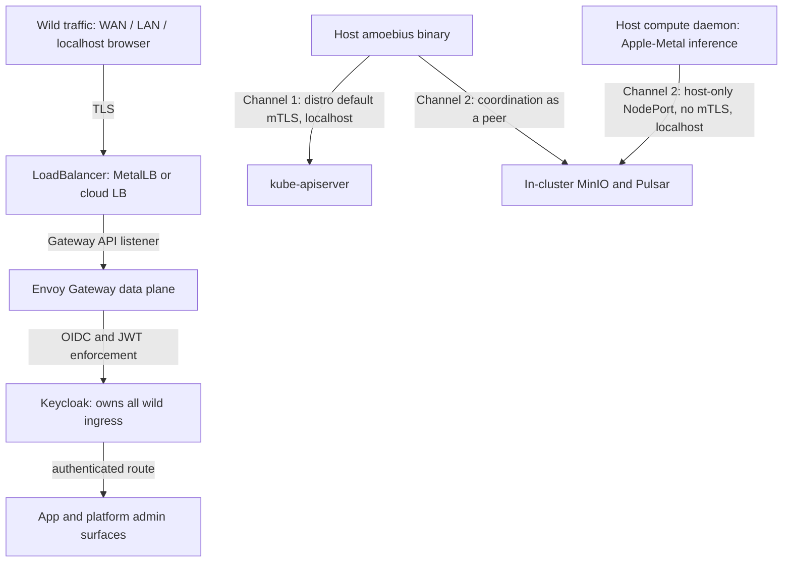

# Host ↔ Cluster Communication

**Status**: Authoritative source
**Supersedes**: N/A
**Referenced by**: DEVELOPMENT_PLAN/overview.md, DEVELOPMENT_PLAN/phase_25_keycloak_ingress.md, DEVELOPMENT_PLAN/phase_41_apple_metal_host_daemon.md, DEVELOPMENT_PLAN/substrates.md, documents/engineering/README.md, documents/engineering/apple_metal_headless_builds.md, documents/engineering/bootstrap_sequence_doctrine.md, documents/engineering/content_addressing_doctrine.md, documents/engineering/daemon_topology_doctrine.md, documents/engineering/network_fabric_doctrine.md, documents/engineering/platform_services_doctrine.md, documents/engineering/pulsar_client_doctrine.md, documents/engineering/single_logical_data_plane_doctrine.md, documents/engineering/substrate_doctrine.md, documents/engineering/vault_pki_doctrine.md, documents/illegal_state/illegal_state_security.md, documents/illegal_state/illegal_state_techniques.md
**Generated sections**: none

> **Purpose**: Define exactly how the host amoebius binary and any host-level worker daemons talk to the
> cluster — the two localhost-only channels, and the resolved decision that a host compute daemon is a
> plain Pulsar + MinIO peer over host-only NodePorts with no mTLS.

---

## 1. The host-origin surface: two channels, both localhost-only

Everything that reaches an amoebius cluster from the *wild* — WAN, LAN, even a
browser on the same machine — traverses a single authenticated ingress edge that Keycloak owns
([platform_services_doctrine.md §9](./platform_services_doctrine.md#9-the-loadbalancer-and-the-single-wild-ingress-path)). This document owns the **one
carve-out** from that rule: the traffic that originates *on the host itself* and never touches a network
anyone else can see.

There are exactly two host-origin channels, and **both are strictly localhost** — these access points are
available only from the host, with no WAN or LAN access:

| # | Who | Reaches | Transport | Why this transport |
|---|-----|---------|-----------|--------------------|
| 1 | The **host binary** (CLI / sudo host-daemon context) | `kube-apiserver` | The k8s distro's **default mTLS** (kind/rke2 client cert) | It is the cluster's control path; the distro already issues a trusted client identity, so amoebius reuses it rather than inventing one |
| 2 | **Host compute daemons** (e.g. Apple-Metal inference) — and the host binary when it coordinates rather than controls | In-cluster **MinIO + Pulsar** | **Host-only NodePort, no mTLS** | Bulk artifact / event I/O needs raw socket bandwidth; security is the network restriction, not transport crypto ([§3](#3-there-is-no-bespoke-control-channel--coordination-is-pulsar--minio)–[§5](#5-why-no-mtls-is-safe-here-the-network-restriction-is-the-security-boundary)) |

Anything that is neither of these is *wild*, and wild traffic has no host-special path: it goes through the
LoadBalancer → Envoy → Keycloak like everyone else. The carve-out is acceptable **precisely because** it is
unreachable off the host; the moment such an access point were exposed to LAN or WAN it would become a
backdoor around Keycloak, which the DSL makes unrepresentable ([§7](#7-what-the-dsl-makes-unrepresentable-here)).

**Channel 2's host-only reach is configured, not a NodePort default.** No Kubernetes distro binds NodePorts to
loopback by default — kube-proxy's `--nodeport-addresses` defaults to empty, which publishes every NodePort on
all node interfaces — so channel 2's "available only from the host" property must be *explicitly established*:
kube-proxy `--nodeport-addresses=127.0.0.1/8`, or an equivalent host-firewall rule restricting the NodePort
range to loopback. That binding is the mechanism that produces the host-only property; absent it the socket is
reachable from LAN/WAN. The security argument therefore rests on that explicit loopback/firewall binding and on
what actually requires privilege — opening a TCP connection to `127.0.0.1:<nodeport>` needs none, whereas reading
the daemon's channel-2 credentials (the sudo host-daemon's kubeconfig / injected secrets) is root-gated — **not**
on any assumption that a loopback NodePort is unreachable by an unprivileged local process.

These two channels and the "coordination *is* Pulsar + MinIO" rule ([§3](#3-there-is-no-bespoke-control-channel--coordination-is-pulsar--minio)) govern the **workload plane** only; the operator admin control plane (Vault init/unseal, delivering a new `.dhall`) rides a distinct privileged REST channel owned by [bootstrap_sequence_doctrine.md §5](./bootstrap_sequence_doctrine.md#5-the-admin-control-plane-the-cli--the-singleton-rest-api).

Channel 2's "localhost-only" is the *steady-state, single-host* form of a more general boundary. When remote
elastic compute must reach the home cluster's one Pulsar/MinIO across an untrusted network, the same channel
generalizes to *"reachable only over the authenticated WireGuard fabric"* without becoming wild — the
generalization is owned by [§5.1](#51-the-generalization-localhost-or-the-authenticated-wireguard-fabric) and [network_fabric_doctrine.md](./network_fabric_doctrine.md). Channel 1 and
the wild-ingress door are unaffected.

---

## 2. The decision that was open, and is now resolved

The amoebius vision posed host↔cluster comms as an **open question**, twice:

- The original vision sketched the carve-out (host binary → kubeapi via distro mTLS; host services →
  cluster services via NodePort, localhost only).
- The original design left this choice open — it lays out the options without picking how the host
  daemon and its subprocesses should talk to the in-cluster daemon. It names three options and an unresolved
  trade-off.

This document **resolves it.** The three options as posed, and the verdict:

| Option | What it buys | Why rejected |
|---------------------------------|--------------|--------------|
| **(a)** Same Keycloak / Envoy / Gateway-API path as wild traffic | One uniform ingress story | Host daemons exist for *performance* (e.g. Apple unified memory), and forcing bulk model/blob/event I/O through OIDC + L7 routing + edge TLS adds auth and proxy overhead to the one path that most needs to be cheap. A host daemon is also not "wild" — treating it as such conflates trust boundaries. |
| **(b)** Separate NodePort with **mTLS issued by root** | Network-level confidentiality + authenticity | The mTLS handshake and per-record encryption are real overhead on high-bandwidth bulk transfer (model weights, content-addressed blobs, Pulsar streams). Every channel-2 byte pays a tax to defend against an attacker who, by the network restriction ([§5](#5-why-no-mtls-is-safe-here-the-network-restriction-is-the-security-boundary)), cannot reach the socket in the first place. |
| **(c)** A **Unix domain socket** | A *hard* guarantee of no network traffic — attractive | One socket becomes the single pipe through which **all** MinIO and Pulsar I/O is funnelled and bottlenecked. It is also not cross-substrate-uniform: the loopback-NodePort shape generalizes cleanly across kind/rke2/Lima/WSL2, a single named socket does not. |

**Resolution — chosen design: a host compute daemon is a plain Pulsar + MinIO *client/peer* over
host-only NodePorts, with no mTLS, and the NodePorts are network-restricted to host-origin traffic only.**
This takes option (c)'s security goal — *no malicious network traffic can use this as a backdoor* — and
achieves it by **network restriction** instead of by crypto or by a single bottlenecking socket, while
keeping option (b)'s bandwidth headroom (a real socket per stream) without paying (b)'s mTLS tax.

> **Honesty.** This is a *resolved design decision* for Phase 41, argued from the threat model and bandwidth
> economics below — **not** a tested or proven amoebius result. The loopback-NodePort pattern has a sibling
> precedent in prodbox ([§6](#6-the-host-only-restriction-in-practice-and-its-sibling-precedent)), which is evidence from another system, not proof here. Status and gates live
> only in [../../DEVELOPMENT_PLAN/README.md](../../DEVELOPMENT_PLAN/README.md) (per
> [documentation_standards.md §6](../documentation_standards.md#6-honesty-the-proventestedassumed-discipline)).

---

## 3. There is no bespoke control channel — coordination *is* Pulsar + MinIO

The cleanest part of the resolution is what it **removes**: there is no custom RPC, no side-channel
protocol, and no "amoebius proxy" that a host daemon dials into. **All workload coordination flows through Pulsar
and MinIO** — the same nervous system every in-cluster worker already uses.

Concretely:

- **Commands arrive as Pulsar messages; results and artifacts land in MinIO.** A host compute daemon
  subscribes to its work topic, does the work (Metal/CUDA), and writes outputs to the content-addressed
  MinIO store. That is the entire interaction shape. The native-protocol client, topic algebra, and
  at-least-once + dedup semantics are owned by [pulsar_client_doctrine.md](./pulsar_client_doctrine.md);
  the artifact store is owned by the content-addressing doctrine
  (see [platform_services_doctrine.md §4](./platform_services_doctrine.md#4-minio--the-object-substrate) and [§6](./platform_services_doctrine.md#6-pulsar--the-event-and-workflow-backbone-new-vs-prodbox)).
- **The host daemon and an in-cluster worker are the same kind of thing.** A daemon is a worker role that
  happens to run on the host for hardware reasons; its *coordination* is identical to a worker Pod's. The
  daemon roles, the control-plane singleton's authority, and its single-instance delegation are owned by
  [daemon_topology_doctrine.md](./daemon_topology_doctrine.md) — this doc does not restate them; it only
  fixes *the wire they ride on*.
- **The line-74 sub-question is answered the same way.** "Should host↔service access pass back through
  amoebius for safety, or should there be ingress rules there?" — **neither.** The daemon does not proxy
  through the binary, and it gets no bespoke *wild* ingress rule. It is a direct peer of MinIO/Pulsar over
  the host-only NodePort, authenticating as an ordinary client. The NodePort plus the network restriction
  ([§5](#5-why-no-mtls-is-safe-here-the-network-restriction-is-the-security-boundary)) *is* the access grant.
- **The host binary uses the same path for coordination.** When the binary needs to *control* cluster
  state it uses channel 1 (kubeapi, [§4](#4-channel-1--the-host-binary--kube-apiserver-via-distro-mtls)); when it needs to *coordinate* with the in-cluster daemon
  it is itself a Pulsar/MinIO client on
  channel 2 — no separate binary↔daemon RPC exists.

No WebSockets anywhere: the daemon speaks the native Pulsar TCP binary protocol via the shared
`amoebius-pulsar` client, which is a locked invariant of
[pulsar_client_doctrine.md](./pulsar_client_doctrine.md).

**This is a workload-plane rule, not an admin-plane one** — [§1](#1-the-host-origin-surface-two-channels-both-localhost-only) draws that split up front. The operator admin control plane it excludes — administering the cluster's own configuration
(Vault init/unseal, delivering a new `.dhall`), a *control* concern rather than worker coordination — rides the
distinct privileged REST channel (the operator CLI → the amoebius NodePort service → the control-plane
singleton), owned by [bootstrap_sequence_doctrine.md §5](./bootstrap_sequence_doctrine.md#5-the-admin-control-plane-the-cli--the-singleton-rest-api).
That channel is privileged, not wild (so it is not a Keycloak bypass, [§1](#1-the-host-origin-surface-two-channels-both-localhost-only)),
and channel 1 ([§4](#4-channel-1--the-host-binary--kube-apiserver-via-distro-mtls)) is retired to
bootstrap-only once it takes over. The "no bespoke channel" verdict here is about the *bulk worker wire*, which
this doc still owns in full.

---

## 4. Channel 1 — the host binary ↔ kube-apiserver via distro mTLS

The host binary's privileged path is the kube-apiserver, reached over the **k8s distro's own default
mTLS** — the client certificate kind or rke2 already mints during bring-up. amoebius does not reinvent this
identity; it consumes the distro's kubeconfig and talks to the apiserver like any trusted admin client.

- **Localhost only.** Like channel 2, this endpoint is host-origin and not exposed to LAN/WAN. On a
  single-node kind/rke2 control plane the apiserver is reachable on loopback; nothing publishes it wild.
- **This is the *control* path, not a data path.** It applies manifests, reads cluster state, and drives
  reconciliation. Bulk artifact/event traffic never rides the apiserver — that is channel 2's job.
- **It is the binary's distinguishing privilege.** The host binary (in its sudo host-daemon context) is the
  bootstrap and total-authority root; the in-cluster control-plane singleton's authority is owned
  by [daemon_topology_doctrine.md](./daemon_topology_doctrine.md). This doc only records that channel 1's
  transport is "whatever mTLS the distro already created," not an amoebius-bespoke scheme.
- **Provider-managed clusters have no channel 1.** On EKS there is no host and no host binary; the in-cluster stateless singleton reaches its own control plane instead. The
  per-distro split is owned by [cluster_lifecycle_doctrine.md](./cluster_lifecycle_doctrine.md); this doc's
  host-channel rules apply only where a host binary exists.

---

## 5. Why no mTLS is safe here: the network restriction *is* the security boundary

**A wire no attacker can reach does not require encryption.** Channel 2's security comes
from *who can open the socket*, not from what flows over it.

The threat model, made explicit:

- **The NodePorts are bound to host-origin traffic only — no WAN, no LAN**. They are not advertised through the LoadBalancer, not routed by Envoy, not exposed by any Service
  of type LoadBalancer, and not reachable from another machine on the LAN. The only thing that can connect
  is a process already running on this host.
- **A process that can already run on the host as the daemon is *inside* the trust boundary anyway.** The
  host binary runs with sudo and owns the kubeconfig; a host compute daemon is a subprocess the binary
  itself launched and manages. Anything with enough access to dial channel 2 already has enough access to
  read the binary's credentials and drive channel 1. Transport mTLS on channel 2 would defend a boundary
  that the host's own process model has already drawn — adding cost without moving the line.
- **"Absolutely certain only localhost can reach these"** is the load-bearing
  property, and it is enforced by the network restriction, *not* by going through Envoy/Keycloak. Channel
  2 exists to be the path that does **not** pass through the wild gateway; routing
  it back through Envoy would re-introduce exactly the overhead [§2](#2-the-decision-that-was-open-and-is-now-resolved) rejected.

The bandwidth half of the argument (why amoebius does not add crypto just in case):

- **Host compute daemons exist for performance.** Apple-Metal inference wants the host's unified memory;
  the daemon is on the host precisely to avoid a containerization/VM tax. Bulk traffic — model weights,
  content-addressed blobs, Pulsar event streams — is the dominant load on channel 2.
- **mTLS would tax every channel-2 byte** (handshake setup, per-record encrypt/decrypt) on the one path
  most sensitive to throughput, to defend against an attacker the network restriction already excludes.
- **A single Unix socket would bottleneck it differently** — all MinIO and Pulsar I/O funnelled through one
  pipe. Host-only NodePorts keep a real socket per stream (full TCP parallelism)
  while preserving the no-network-backdoor guarantee.

Net: **security from network restriction, bandwidth from plain sockets.** That is the trade the resolution
buys.

### 5.1 The generalization: localhost **or** the authenticated WireGuard fabric

> **Owner.** The generalization's normative mechanism — the `wg0`-binding, the still-no-mTLS rationale, and the
> `FabricPeer`-has-no-`WildIngress` constructor — is owned by
> [network_fabric_doctrine.md §5](./network_fabric_doctrine.md#5-the-security-boundary-generalizes-localhost--authenticated-fabric).
> This subsection gives the host↔cluster-comms *reading* of it (why the channel-2 localhost premise generalizes
> rather than breaks); it names those points, it does not re-own them.

The [§5](#5-why-no-mtls-is-safe-here-the-network-restriction-is-the-security-boundary) argument has one load-bearing premise — *no attacker can reach the wire* — and it is realized by
localhost binding. Remote elastic compute breaks that premise: a spot node attached to the home cluster's one
Pulsar/MinIO ([single_logical_data_plane_doctrine.md](./single_logical_data_plane_doctrine.md)) reaches
channel 2 across the public internet, where "localhost-only" cannot hold. The invariant **generalizes rather
than breaks**: channel 2 is reachable *either* from localhost *or* over the **authenticated WireGuard fabric**,
and nowhere else.

The three normative points of the generalization — the `wg0`-binding, the still-no-mTLS rationale, and the
`FabricPeer`-has-no-`WildIngress` constructor — are authored by
[network_fabric_doctrine.md §5](./network_fabric_doctrine.md#5-the-security-boundary-generalizes-localhost--authenticated-fabric); this doc restates none of them, and records only the channel-2-specific readings and carve-out:

- **`wg0`-binding.** Channel 2's listener binds `wg0`, reachable only by a Vault-keyed peer; this doc owns
  only that channel 2 *may ride* the fabric. **Host-comms carve-out:** the operator **admin** plane's reach —
  node-local for seal-critical operations, only *optionally* the fabric post-unseal — is owned by
  [bootstrap_sequence_doctrine.md §5](./bootstrap_sequence_doctrine.md#5-the-admin-control-plane-the-cli--the-singleton-rest-api), **not** here; do not read this channel-2 generalization as the owner of the admin NodePort's reach.
- **mTLS stays rejected over the WAN.** WireGuard's peer auth + tunnel encryption supply the "attacker cannot
  reach the wire" property localhost gave, so the Pulsar/MinIO wire stays **mTLS-free** and the
  [§5](#5-why-no-mtls-is-safe-here-the-network-restriction-is-the-security-boundary) high-bandwidth-bulk economics survive — the boundary moved, the per-byte crypto tax did not return.
- **A fabric peer is not wild ingress.** A `FabricPeer` has **no constructor into `WildIngress`**, so a spot
  worker is an authenticated *peer* of MinIO/Pulsar, never a wild client (exactly as a host daemon is,
  [§3](#3-there-is-no-bespoke-control-channel--coordination-is-pulsar--minio)) — "Keycloak owns all wild
  ingress" ([platform_services_doctrine.md §9](./platform_services_doctrine.md#9-the-loadbalancer-and-the-single-wild-ingress-path)) is preserved.

The rest of [§6](#6-the-host-only-restriction-in-practice-and-its-sibling-precedent)'s host-only realization applies unchanged to the localhost case; the fabric case substitutes
"authenticated-fabric-origin" for "host-origin" as the network restriction, with WireGuard providing the
authentication a shared loopback did not need.

**Stretched-cluster addenda.** When a cluster is *stretched* across the
WAN — a node whose declared locality differs from the control plane's — two further reach-shapes surface. Neither
disturbs the two-channel picture of [§1](#1-the-host-origin-surface-two-channels-both-localhost-only); this doc records
only where each attaches and defers the wire itself to
[network_fabric_doctrine.md](./network_fabric_doctrine.md).

- **A full-node member's kubelet↔apiserver span is *neither* channel 1 nor channel 2.** A stretched *full k8s
  node* — a kubelet registered in the one apiserver/etcd — reaches its control plane over a **separately-owned**
  wire: an additive, stretch-gated `wg0` binding carrying the distro's own mTLS over the tunnel, owned by
  [network_fabric_doctrine.md §5](./network_fabric_doctrine.md#5-the-security-boundary-generalizes-localhost--authenticated-fabric)
  and [§4](./network_fabric_doctrine.md#4-topology-the-hub-is-the-gateway-role-and-the-fabric-moves-with-it). It
  is **not** channel 1 — that stays the host binary's localhost apiserver path
  ([§1](#1-the-host-origin-surface-two-channels-both-localhost-only) table row 1, unaffected) — and **not** channel 2,
  which is data-plane Pulsar/MinIO peering. The control-plane span is a third, network_fabric-owned reach this doc
  names but does not own. (Design intent for the stretched-cluster round; on `Managed Eks` control planes this
  span is representable only as a provider-native capability, per network_fabric / cluster_topology, never an
  amoebius-built second fabric.)
- **Channel 2 for a host worker generalizes once more: localhost, authenticated fabric, *or* authenticated secure
  gateway.** A *host worker* — a non-member Apple-Metal/Windows-CUDA subprocess
  ([§3](#3-there-is-no-bespoke-control-channel--coordination-is-pulsar--minio)) — that is stretched off-host is the
  attach-pool shape ([single_logical_data_plane_doctrine.md §4](./single_logical_data_plane_doctrine.md#4-the-elastic-worker-pool-the-attach-topology)):
  it needs only channel 2's data-plane + Vault reach, never the apiserver. So this section's rule "localhost **or**
  the authenticated WireGuard fabric" widens to *"localhost **or** the authenticated WireGuard fabric (VPN) **or**
  an authenticated secure gateway"* — the **`Gateway` arm** is the seam this generalization attaches to: a distinct
  network_fabric endpoint index with **no constructor into `WildIngress`**
  ([illegal_state_catalog.md §4.3](../illegal_state/illegal_state_techniques.md#43-gadt-indexed-state-machines--only-legal-transitions-are-typed)),
  so "Keycloak owns all wild ingress"
  ([platform_services_doctrine.md §9](./platform_services_doctrine.md#9-the-loadbalancer-and-the-single-wild-ingress-path))
  still holds. The gateway *wire* — including the authentication/encryption a shared loopback did not need — is
  owned by [network_fabric_doctrine.md §5](./network_fabric_doctrine.md#5-the-security-boundary-generalizes-localhost--authenticated-fabric);
  this doc owns only that channel 2 may ride it. The `Gateway`-arm reach constructor is a **named seam this doctrine
  introduces, not a built path** — its host-worker-through-a-gateway inhabitant is deferred.

---

## 6. The host-only restriction in practice (and its sibling precedent)

How the "host-origin only" property is realized is substrate-shaped, and the *substrate catalog* —
apple / linux-cpu / linux-cuda / windows, and the virtualized substrates (Lima on Apple, WSL2 on
Windows) — is owned by [substrate_doctrine.md](./substrate_doctrine.md). This doc owns only
the comms-relevant requirement each substrate must satisfy:

- **The NodePort must be reachable from the host and from nowhere else.** The canonical shape is a NodePort
  bound to loopback (the daemon connects to `127.0.0.1:<nodeport>`), with no path from LAN/WAN. Where the
  node network does not bind NodePorts to loopback by default (Docker-backed kind, the Lima/WSL2 VMs), the
  substrate layer is responsible for the loopback binding / host-only firewalling that makes the same shape
  hold — never by relaxing the restriction.
- **This generalizes a pattern proven in the sibling prodbox project**, where in-cluster Harbor is reached
  by host-origin clients at `127.0.0.1:30080` over a NodePort bound to loopback (prodbox CLAUDE.md,
  "Substrate Equivalence"). That is **evidence from another system, not proof in amoebius** — amoebius has
  not yet built Phase 41. It is precedent for *feasibility*, not a tested amoebius guarantee.
- **The DSL never lets a substrate "fix" a missing piece by widening exposure.** If a substrate's node
  networking makes the loopback binding awkward, the resolution is to extend that substrate's installer to
  honor the host-only contract — not to publish the port wider. Substrate equivalence is structural
  ([platform_services_doctrine.md §12](./platform_services_doctrine.md#12-substrate-equivalence-as-a-structural-invariant)).

---

## 7. What the DSL makes unrepresentable here

The carve-out is safe only if its boundaries cannot be drawn wrong, so the relevant illegal states are
type-excluded rather than merely linted. The catalog of illegal states and the typing techniques that make
each unrepresentable is owned by [illegal_state_catalog.md](../illegal_state/illegal_state_catalog.md), and the
orchestration surface by [dsl_doctrine.md](./dsl_doctrine.md); this section names only the host-comms
invariants those docs must uphold:

- A host-origin NodePort **cannot** be expressed as WAN/LAN-exposed (no `LoadBalancer`-typed Service, no
  Envoy route, no wild listener for it).
- A host compute daemon **cannot** publish its own wild ingress — its only inbound coordination is via
  Pulsar/MinIO peering, and its only privileged control path is the binary's channel 1.
- "Insecure ingress / accidental backdoor around Keycloak" is one of the named illegal states the DSL
  forbids; the host-only NodePort is the *sanctioned* localhost path and is
  structurally distinct from a wild ingress.

The credentials a host daemon presents to MinIO/Pulsar are **secrets-by-name**: Dhall holds only the name,
and Vault holds the value (parents inject into a child's Vault). That model is owned in full by
[vault_pki_doctrine.md](./vault_pki_doctrine.md) and is not restated here — this doc only notes that
channel-2 client auth resolves through it, not through any host environment variable or `PATH` lookup
(the no-env/no-`PATH` lazy-tool-ensure contract is owned by [substrate_doctrine.md](./substrate_doctrine.md)).

A **stretched, non-member host worker** — a host subprocess reaching this cluster from off-host over the
authenticated fabric or secure gateway ([§5.1](#51-the-generalization-localhost-or-the-authenticated-wireguard-fabric)) —
presents the **same secrets-by-name** channel-2/Vault credential; the custody family (parent-minted,
parent-injected `SecretRef`) is unchanged. What is *not* settled is the Vault **authentication *method*** it uses:
a non-member worker holds no in-cluster service-account / kubelet identity, so the in-cluster Kubernetes-auth path
([vault_pki_doctrine.md §9](./vault_pki_doctrine.md#9-in-cluster-consumers-authenticate-to-vault-directly))
does not apply to it. That auth-method seam is a named open gap owned by
[vault_pki_doctrine.md](./vault_pki_doctrine.md); this doc still owns only that the *credential* is
secrets-by-name, never the method.

---

## 8. Boundaries this doc does and does not own

| Owned here (SSoT) | Owned elsewhere (referenced) |
|-------------------|------------------------------|
| The two host-origin channels and that both are localhost-only | — |
| The resolution of the line-27 / line-74 open question (host-only NodePort, no mTLS) and its rationale | — |
| Why no mTLS is safe (network-restriction threat model) and why no crypto/socket (bandwidth) | — |
| "No bespoke control channel; coordination is Pulsar/MinIO" as the host-comms wire rule | Daemon roles, control-plane singleton, single-instance delegation → [daemon_topology_doctrine.md](./daemon_topology_doctrine.md) |
| The host-only network-restriction requirement each substrate must meet | The substrate catalog, virtualized substrates, no-env/PATH contract → [substrate_doctrine.md](./substrate_doctrine.md) |
| That channel-2 transport is plain Pulsar/MinIO peering | The native-protocol client, no-WebSockets, topology algebra → [pulsar_client_doctrine.md](./pulsar_client_doctrine.md) |
| Naming the one carve-out from Keycloak-owns-all-ingress | The wild-ingress rule itself → [platform_services_doctrine.md §9](./platform_services_doctrine.md#9-the-loadbalancer-and-the-single-wild-ingress-path) |
| That channel-2 auth is secrets-by-name | The Vault secret/inject model → [vault_pki_doctrine.md](./vault_pki_doctrine.md) |

---

## 9. Planning ownership

This document is normative host↔cluster comms doctrine only. Delivery sequencing, completion status, and
validation gates are owned by [../../DEVELOPMENT_PLAN/README.md](../../DEVELOPMENT_PLAN/README.md) — host
compute daemons (the Apple-Metal / Windows-CUDA Pulsar+MinIO peers) land in **Phase 41**. This doc never
maintains a competing status ledger; it states the target shape and links back for status.

---

## Cross-references

- [Engineering Doctrine Index](./README.md)
- [Daemon Topology Doctrine](./daemon_topology_doctrine.md)
- [Substrate Doctrine](./substrate_doctrine.md)
- [Platform Services Doctrine](./platform_services_doctrine.md)
- [Pulsar Client Doctrine](./pulsar_client_doctrine.md)
- [Vault / PKI Doctrine](./vault_pki_doctrine.md)
- [Cluster Lifecycle Doctrine](./cluster_lifecycle_doctrine.md)
- [Illegal State Catalog](../illegal_state/illegal_state_catalog.md)
- [DSL Doctrine](./dsl_doctrine.md)
- [Development Plan](../../DEVELOPMENT_PLAN/README.md)
- [Documentation Standards](../documentation_standards.md)
