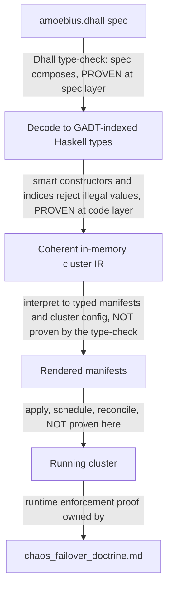

# The Illegal-State Catalog

**Status**: Authoritative source
**Supersedes**: N/A
**Referenced by**: documents/engineering/README.md, documents/engineering/app_vs_deployment_doctrine.md, documents/engineering/chaos_failover_doctrine.md, documents/engineering/cluster_lifecycle_doctrine.md, documents/engineering/cluster_topology_doctrine.md, documents/engineering/content_addressing_doctrine.md, documents/engineering/dsl_doctrine.md, documents/engineering/host_cluster_comms_doctrine.md, documents/engineering/image_build_doctrine.md, documents/engineering/manifest_generation_doctrine.md, documents/engineering/network_fabric_doctrine.md, documents/engineering/platform_services_doctrine.md, documents/engineering/pulsar_client_doctrine.md, documents/engineering/pulumi_iac_doctrine.md, documents/engineering/release_lifecycle_doctrine.md, documents/engineering/resource_capacity_doctrine.md, documents/engineering/service_capability_doctrine.md, documents/engineering/single_logical_data_plane_doctrine.md, documents/engineering/storage_lifecycle_doctrine.md, documents/engineering/substrate_doctrine.md, documents/engineering/testing_doctrine.md, documents/engineering/vault_pki_doctrine.md
**Generated sections**: none

> **Purpose**: The single source of truth for the catalog of illegal and unsafe cluster states amoebius
> makes unrepresentable, and the typing techniques that foreclose each — with the honest limit that a
> type-check proves the *spec composes*, not that the *running cluster enforces it*.

---

## 1. The promise: illegal states fail to type-check

In raw Kubernetes you can author, with a straight face, a Deployment that mounts a PVC no PV will ever
bind, a NetworkPolicy that strands a service from the database it needs, or an Ingress that quietly routes
around your identity provider. Nothing stops you. The YAML is well-formed; the apiserver admits it; the
defect surfaces at 3 a.m. as a pod stuck in `Pending`, a 502, or a backdoor.

amoebius lifts that whole class of failure from *runtime surprise* to *does not type-check*. The DSL is
Dhall — a **total** configuration language (no general recursion, no arbitrary I/O, every expression fully
evaluates), so a spec the type-checker accepts is a finite value amoebius has already inspected end to end.
The contract, stated by [`dsl_doctrine.md`](./dsl_doctrine.md), is blunt: **a valid `amoebius.dhall`
cannot represent illegal state**. This document is the companion to that
contract — the *enumerated* list of what "illegal state" means, and the *typing techniques* that make each
entry uninhabitable.

**SSoT split (read this before you cite the wrong doc).**

- [`dsl_doctrine.md`](./dsl_doctrine.md) owns the **DSL surface and the contract** ("a valid spec cannot
  represent illegal state") as a property of the language.
- **This document** owns the **catalog** ([§3](#3-the-catalog--states-a-valid-spec-cannot-represent) — *which* states are illegal) and the **techniques** ([§4](#4-the-typing-techniques) —
  *how* the types foreclose them), and is the SSoT for **which platform invariants are type-enforced**
  (the question [`platform_services_doctrine.md` §10](./platform_services_doctrine.md#10-every-container-declares-cpu-and-ram) defers here).
- The *normative rule* behind each catalog entry lives in that entry's owning doctrine
  (storage, gateway/ingress, secrets, …). This doc names the owner and never restates its content.

Everything below is **design intent for Phase 3** (the orchestration Dhall DSL + control-plane singleton),
not a tested amoebius result. Status and gates live only in
[`../../DEVELOPMENT_PLAN/README.md`](../../DEVELOPMENT_PLAN/README.md); per
[`documentation_standards.md` §6](../documentation_standards.md#6-honesty-the-proventestedassumed-discipline) this doc states the target shape and links
back for status.

---

## 2. The load-bearing limit: a type-check proves the spec composes, not that the cluster enforces it

This is the most important sentence in the document, so it gets its own section. **The types prove that the
*specification* composes into something internally coherent. They do not prove that the *running
deployment* enforces it.** Conflate the two and you will ship a beautiful proof of the wrong theorem.

Cash that out against the three correctness layers from the chaos/failover doctrine
([`chaos_failover_doctrine.md`](./chaos_failover_doctrine.md), generalized from prodbox's
`chaos_hardening_doctrine.md`):

- **What a green type-check *is*.** A Dhall type-check (and the GADT-indexed Haskell decode behind it, [§4](#4-the-typing-techniques))
  is a **Decision-layer** proof: the spec value is well-formed, every reference resolves, every required
  field is present, every composition the user wrote has an inhabitant. When implemented as specified, that
  is a real proof — at the *spec* layer, in code, the cheapest and strongest of the three. It is the type
  system doing the "Extract the decision" move for free.
- **What it is *not*.** It says **nothing** about whether the interpreter renders the spec to correct
  manifests, whether the apiserver admits those manifests, whether the scheduler places the pods, whether the LB actually
  comes up, or whether two geo-replicated clusters converge after a partition. Those are the **Protocol**
  and **Runtime** layers, and by the *blindness property* (`chaos_failover_doctrine.md` [§4](./chaos_failover_doctrine.md#4-two-traditions-and-the-quiet-third)) a Decision-layer
  proof is structurally blind to them.

So the catalog's promise is exact: *a PVC that cannot bind a PV is unrepresentable in the spec* — meaning
you cannot write that spec and have it type-check. It is **not** the claim that *the running cluster's PVC
is bound*; that is a reconcile-time fact whose verification is owned by
[`chaos_failover_doctrine.md`](./chaos_failover_doctrine.md) and the testing doctrine. We **defer the
runtime-enforcement proof there on purpose**, and never report it here.

> **Honesty.** "When implemented as specified, the type-check is a proof" is itself a claim about a design
> not yet built (Phase 3). Read every "unrepresentable" below as *design intent for the type discipline*,
> never as a tested amoebius behaviour.

---

## 3. The catalog — states a valid spec cannot represent

The entries below enumerate the original illegal-state list ([§3.1](#31-bad--illegal-durable-storage)–[§3.8](#38-cross-tenant-references-and-literal-secrets)), the isolation invariants
([§3.9](#39-a-plaintext-spec-at-rest)–[§3.10](#310-a-child-spec-that-reaches-beyond-its-own-subtree)), the best-practice-by-construction states ([§3.11](#311-an-unsafe-workload-no-resource-limits-no-hardened-securitycontext)–[§3.12](#312-an-app-that-names-a-product-instead-of-a-capability)), the **capacity / topology / bounded-
storage** states ([§3.13](#313-a-compute-engine-incompatible-with-its-substrates-managed-providers-first-class)–[§3.22](#322-a-hand-authored-un-derived-toleration)), the **CBOR-payload** rule ([§3.23](#323-a-non-cbor-pulsar-payload)), and the **rke2-quorum / ML-asset-lifecycle /
release-promotion** states ([§3.24](#324-an-evenzero-server-rke2-control-plane-no-etcd-quorum--split-brain)–[§3.26](#326-an-unverified-environment-promotion-promote--prod-without-the-required-evidence)), and the **schedulability / bin-packing** refinement ([§3.27](#327-a-schedulable-in-aggregate-but-unplaceable-workload-atomic-pod--gpu-bin-packing)) the techniques in [§4](#4-the-typing-techniques) demand. Each entry: the **intuition** (how it goes wrong
in raw k8s), the **owning doctrine** (the SSoT for the rule), and the **technique** ([§4](#4-the-typing-techniques)) that forecloses it.
The [§3.13](#313-a-compute-engine-incompatible-with-its-substrates-managed-providers-first-class)–[§3.22](#322-a-hand-authored-un-derived-toleration) block is foreclosed by the two techniques added for it — [§4.6](#46-capacity-accounting--placement-witness-compute-and-σ-demand--capacity-storage-checked) (the capacity-accounting total
fold) and [§4.7](#47-compatibility--topology-relations-by-construction-over-a-collection) (compatibility/topology relations over a collection) — and is where the honest grade split
matters most: every capacity/storage/retention **sum** is grade-(2), never grade-(1) ([§2](#2-the-load-bearing-limit-a-type-check-proves-the-spec-composes-not-that-the-cluster-enforces-it), [§6](#6-three-grades-of-foreclosure-and-the-honesty-they-force)).

### 3.1 Bad / illegal durable storage

Raw k8s lets you mix arbitrary storage classes, dynamic provisioners, and unsized claims, so "durable"
data can quietly live on an ephemeral, auto-provisioned volume that vanishes with the node. amoebius admits
**only** `no-provisioner`, explicitly-sized, retained PVs — the dynamic-provisioner
path, the unsized claim, and the "default storage class we didn't choose" are simply not constructible.
**Owner:** [`storage_lifecycle_doctrine.md`](./storage_lifecycle_doctrine.md). **Technique:** [§4.1](#41-pvcpv-binding-by-construction)
(PVC↔PV binding by construction) + refined non-zero sizes.

### 3.2 PVCs that don't bind PVs

The canonical k8s footgun: a StatefulSet's `volumeClaimTemplate` and the cluster's PVs are two independent
objects that bind only if their sizes, access modes, and selectors happen to match — and a typo means a pod
hangs in `Pending` forever. amoebius removes the independence: there is no way to declare a claim *without*
its exactly-matching PV ([§4.1](#41-pvcpv-binding-by-construction)). The mismatched pair has no inhabitant. **Owner:**
[`storage_lifecycle_doctrine.md`](./storage_lifecycle_doctrine.md). **Technique:** [§4.1](#41-pvcpv-binding-by-construction).

### 3.3 Misconfigured gateway

A hand-written Gateway/HTTPRoute can listen on a port nothing serves, terminate TLS with a cert for the
wrong host, or route to a backend that doesn't exist. In amoebius the gateway is not free-form: routes are
emitted from the same value that declares the service, so a route to a non-existent backend, or a listener
with no matching service, cannot be written. **Owner:**
[`platform_services_doctrine.md` §9](./platform_services_doctrine.md#9-the-loadbalancer-and-the-single-wild-ingress-path) (Envoy + Gateway API, the single
wild-ingress path). **Technique:** [§4.3](#43-gadt-indexed-state-machines--only-legal-transitions-are-typed) (GADT-indexed: a route is constructed *from* a live service handle)
+ [§4.5](#45-content-address-totality--names-are-total-functions-of-content) totality (the cert/host name is a function of the declared identity, not a free string).

### 3.4 DNS that binds to the wrong IP

Route53 (or any DNS) records are strings; nothing stops you pointing `app.example.com` at an address the
cluster never owned. amoebius never lets the operator *type* the target IP: a DNS binding is a **total
function of the allocated LoadBalancer address** — you bind a name to a *service handle*, and the address is
computed from the realized LB, not supplied. A record pointing at an unowned address therefore has no
representation. **Owner:** [`pulumi_iac_doctrine.md`](./pulumi_iac_doctrine.md) (route53 + zerossl) and
[`platform_services_doctrine.md` §9](./platform_services_doctrine.md#9-the-loadbalancer-and-the-single-wild-ingress-path). **Technique:** [§4.5](#45-content-address-totality--names-are-total-functions-of-content) (content-address
totality, applied to the name→address map).

### 3.5 Undeployable pods (taints, tolerations & affinity)

In raw k8s you can write a nodeSelector / affinity that matches **no** node, *or* a taint no workload
tolerates, *or* a toleration for a taint no node declares — the pod is admitted and then never schedules.
amoebius constrains placement so that a workload's substrate/affinity requirement **and** its taint
tolerations are checked against the *declared* node inventory of the cluster spec: the decode rejects a
workload unless **there exists** a node satisfying its affinity **and** tolerating all its taints — a
schedulability *existence fold* over the single node inventory. Placement is expressed as a capability the
workload *requests* and a node *offers*, and an unmatchable request is uninhabitable; a **toleration is never
hand-authored** — it is *derived* from a declared node taint (the same "derived, never written" discipline as
NetworkPolicy, [§3.6](#36-blocking-networkpolicy-services-cant-reach-each-other)), so "a toleration for a taint no node declares" is unrepresentable and "a taint no
workload tolerates" leaves the existence fold with no landable node. This strengthens the original
affinity-only entry to cover taints and tolerations. This entry checks placement *constraints*
(affinity/taints); the complementary *resource-fit* existence check — that a matching node also has enough
allocatable room once every other pod is placed — is [§3.27](#327-a-schedulable-in-aggregate-but-unplaceable-workload-atomic-pod--gpu-bin-packing),
and the two compose in `place`'s `podFits`. **Owner:**
[`substrate_doctrine.md`](./substrate_doctrine.md) (substrate/arch capabilities, the closed node-taint set +
node inventory) and [`platform_services_doctrine.md` §9](./platform_services_doctrine.md#9-the-loadbalancer-and-the-single-wild-ingress-path) (the
derived-toleration rule, parallel to derived NetworkPolicy). **Technique:** [§4.2](#42-capability-and-phantom-tenant-tags--cross-tenant-refs-are-uninhabitable) (capability tags) + [§4.3](#43-gadt-indexed-state-machines--only-legal-transitions-are-typed) (a
derived toleration handle exists only once its taint edge does) + [§4.4](#44-ownership-indices--single-owner-ssot-structurally) (the node inventory is the single
owner of "what substrates and taints exist"), the existence check itself being a [§4.4](#44-ownership-indices--single-owner-ssot-structurally) value-level fold. Grade
(2) for the existence fold; the derived-toleration shape is grade (1) ([§3.22](#322-a-hand-authored-un-derived-toleration)).

### 3.6 Blocking NetworkPolicy (services can't reach each other)

NetworkPolicies are deny-by-omission: forget an egress rule and you have silently severed a service from
its database, with no error anywhere. amoebius does not let operators hand-author allow/deny rules at all.
Connectivity is **derived** from the declared dependency graph — if service A declares it consumes service
B, the policy permitting A→B is generated, and a dependency you declared can never be a connection the
policy blocks. The "service stranded from a dependency it declared" state is not expressible because the
human never writes the policy. **Owner:**
[`platform_services_doctrine.md`](./platform_services_doctrine.md). **Technique:** [§4.4](#44-ownership-indices--single-owner-ssot-structurally) (the dependency
graph is the single owner of connectivity) + [§4.3](#43-gadt-indexed-state-machines--only-legal-transitions-are-typed) (a consumer handle only exists once the dependency edge
does).

### 3.7 Accidental insecure / backdoor ingress

The nightmare entry: a chart that opens its own NodePort to the wild, or an Ingress that skips Keycloak, so
an unauthenticated path exists that nobody meant to ship. amoebius enforces **Keycloak owns all wild
ingress** structurally: an app cannot publish its own wild ingress, because the
only constructor that yields a wild-reachable endpoint routes through the Keycloak-owned edge. The sole
carve-out — host-origin, localhost-only NodePorts with no mTLS — is a *different type* of endpoint
(`HostLocalPeer`, not `WildIngress`), reachable only from the host and never from WAN/LAN, owned by
[`host_cluster_comms_doctrine.md`](./host_cluster_comms_doctrine.md). There is no constructor that turns a
host-local peer into a wild endpoint, and none that exposes a workload to the wild without the edge.
**Owner:** [`platform_services_doctrine.md` §9](./platform_services_doctrine.md#9-the-loadbalancer-and-the-single-wild-ingress-path). **Technique:** [§4.2](#42-capability-and-phantom-tenant-tags--cross-tenant-refs-are-uninhabitable)
(capability: only the edge holds the "expose-to-wild" capability) + [§4.3](#43-gadt-indexed-state-machines--only-legal-transitions-are-typed) (endpoint kinds are distinct
indices that do not interconvert).

### 3.8 Cross-tenant references and literal secrets

Two locked invariants ride together here. **(a) Secrets are names only** — a literal secret value in Dhall
is unrepresentable; the spec carries a `SecretRef` (a name), and the parent injects the actual material
into the child's Vault. **(b) Tenant isolation** — a child cluster knows
*nothing* about its siblings, so a spec for child *X* must not be able to name
child *Y*'s resources or secrets. Both are foreclosed the same way: references are **tenant-tagged**, and
there is no function that re-tags a reference from one tenant to another ([§4.2](#42-capability-and-phantom-tenant-tags--cross-tenant-refs-are-uninhabitable)). A `SecretRef` is a name
under *this* tenant's tag; a cross-tenant reference has no inhabitant. **Owner:**
[`vault_pki_doctrine.md`](./vault_pki_doctrine.md) (the `SecretRef`-by-name contract, parent→child
injection, the trust tree). **Technique:** [§4.2](#42-capability-and-phantom-tenant-tags--cross-tenant-refs-are-uninhabitable) (phantom tenant tags + capabilities).

### 3.9 A plaintext spec at rest

The in-force spec is sensitive even when it holds no secret *values* — it is the cluster's whole topology.
So the spec has **no plaintext-at-rest representation**: a cluster never holds its own spec as a plaintext
value, only the means to fetch and decrypt it; at runtime the control-plane singleton decrypts the
Vault-Transit MinIO envelope **in-process** and never writes it to a plaintext ConfigMap or to etcd. A spec
materialized to a cluster-legible store is therefore not something a workload's typed inputs can even name
(a workload reads only the unencrypted-basics floor plus the Vault objects its policy allows). **Owner:**
[`vault_pki_doctrine.md` §4](./vault_pki_doctrine.md#4-init-follows-readiness-fail-closed-vault-init) (decrypt-in-process, never-plaintext) and
[`pulumi_iac_doctrine.md` §2](./pulumi_iac_doctrine.md#2-the-backend-every-byte-of-state-is-a-vault-enveloped-object-in-minio) (the enveloped backend). **Technique:** [§4.5](#45-content-address-totality--names-are-total-functions-of-content)
(an envelope/handle, not a plaintext value) — note this row's *enforcement* is partly runtime (per the [§2](#2-the-load-bearing-limit-a-type-check-proves-the-spec-composes-not-that-the-cluster-enforces-it)
limit); the type only removes any plaintext-spec input.

### 3.10 A child spec that reaches beyond its own subtree

A child cluster's spec is, by construction, a projection of **exactly its own subtree** (its own config
including its children's). There is no field in a `ChildSpec` in which a sibling or ancestor-only branch can
appear, so a parent cannot hand a child anything wider than its subtree, and a child cannot name a sibling's
resources — the [§3.8](#38-cross-tenant-references-and-literal-secrets) tenant-isolation invariant lifted to the whole spec tree, reinforced cryptographically
by per-child Transit keys (a child cannot even *decrypt* a sibling's subtree). **Owner:**
[`cluster_lifecycle_doctrine.md` §3](./cluster_lifecycle_doctrine.md#3-amoebic-spawning--the-recursive-forest) (the `project(subtree)` handoff),
[`dsl_doctrine.md`](./dsl_doctrine.md) (the `ChildSpec` type), and
[`vault_pki_doctrine.md` §6](./vault_pki_doctrine.md#6-parentchild-unseal-two-sanctioned-modes) (per-child keys). **Technique:** [§4.2](#42-capability-and-phantom-tenant-tags--cross-tenant-refs-are-uninhabitable) (phantom
tenant/subtree tags) + [§4.4](#44-ownership-indices--single-owner-ssot-structurally) (ownership indices).

### 3.11 An unsafe workload (no resource limits, no hardened securityContext)

In raw k8s a Deployment may omit resource requests/limits — a noisy-neighbour or OOM-the-node risk — and run
as root with a writable root filesystem and full Linux capabilities. amoebius **generates** every workload
object from a typed record that *requires* refined non-zero CPU/RAM and attaches a hardened (non-root,
no-privilege-escalation, dropped-capabilities, read-only-root-by-default) securityContext, so a workload
missing either is not a value `render` can return — there is nothing to lint because there was never a value
to lint. The cpu/ram rule is owned by
[`platform_services_doctrine.md` §10](./platform_services_doctrine.md#10-every-container-declares-cpu-and-ram);
the generation discipline that makes the unsafe shape unconstructible is owned by
[`manifest_generation_doctrine.md` §3](./manifest_generation_doctrine.md#3-best-practice-by-construction-an-unsafe-manifest-is-not-constructible). **Owner:**
[`manifest_generation_doctrine.md`](./manifest_generation_doctrine.md) (best-practice-by-construction) +
[`platform_services_doctrine.md`](./platform_services_doctrine.md) (the cpu/ram rule). **Technique:** [§4.1](#41-pvcpv-binding-by-construction)
(required-field-by-construction — a record without the field has no inhabitant).

### 3.12 An app that names a product instead of a capability

Application logic that writes `minio` or `vault` welds itself to one realization and loses portability across
clusters that deploy the capability differently. amoebius's app surface offers a **capability** union —
`ObjectStore`, `SecretStore`, `MessageBus`, `Sql`, `Identity`, `Observability`, `Registry`, `Edge` — with no
product arms, so "depend on `minio` directly" has no syntax: it fails Gate 1 (the Dhall typechecker) before
any binary runs. **Owner:** [`service_capability_doctrine.md`](./service_capability_doctrine.md) (the
capability abstraction; one canonical provider, the type admitting alternates). **Technique:** [§4.2](#42-capability-and-phantom-tenant-tags--cross-tenant-refs-are-uninhabitable)
(capabilities as a closed union — a product name is uninhabitable).

### 3.13 A compute engine incompatible with its substrates (managed providers first-class)

Raw tooling lets you point kind, rke2, or a managed cluster at a substrate that cannot run it, and lets a
managed provider (EKS) be a bolt-on afterthought rather than a first-class citizen. amoebius makes the
compute engine a **declared axis** distinct from the *detected* substrate, and a `Node` is built by a
compatible-pair smart constructor: only an `(engine, substrate-indexed host | hostless provider)` pair the
relation permits has a constructor, checked **elementwise** so heterogeneous **multi-substrate clusters stay
legal** while an incompatible pairing has no inhabitant. EKS is a first-class `Managed` arm of the closed
`ComputeEngine` union (a product/unknown engine is uninhabitable). **Owner:**
[`cluster_topology_doctrine.md`](./cluster_topology_doctrine.md) (+ the node inventory in
[`substrate_doctrine.md`](./substrate_doctrine.md)). **Technique:** [§4.7](#47-compatibility--topology-relations-by-construction-over-a-collection) (relation over a collection) + [§4.2](#42-capability-and-phantom-tenant-tags--cross-tenant-refs-are-uninhabitable)
(closed union, EKS arm present) + [§4.4](#44-ownership-indices--single-owner-ssot-structurally) (the node inventory the compatibility reads). **Grade:** (2) for the
elementwise compatibility fold; grade (1) sub-part (EKS is a union arm; a product/unknown engine is
uninhabitable).

### 3.14 rke2/kind on a host with no Linux node (apple/windows without an interposed Linux VM)

kind and rke2 need a Linux kernel; on a bare apple or windows host there is none until one is synthesized in
a VM. amoebius makes a `LinuxHost` a **witness** whose only constructor on a non-Linux substrate is the
virtualization provider (`limaHost` on apple, `wsl2Host` on windows), so "rke2/kind on a bare Apple host"
(the VM interposition [`substrate_doctrine.md` §4](./substrate_doctrine.md#4-virtualized-substrates-synthesizing-a-linux-host-where-the-host-is-not-linux)
describes as reconcile behaviour) becomes a *type demand* — the bare-host spec has no inhabitant. (Distinct
from the Apple-Metal *build* carve-out, which is on-host by design,
[`apple_metal_headless_builds.md`](./apple_metal_headless_builds.md).) **Owner:**
[`cluster_topology_doctrine.md`](./cluster_topology_doctrine.md) (+ substrate [§4](#4-the-typing-techniques) for the synthesis).
**Technique:** [§4.3](#43-gadt-indexed-state-machines--only-legal-transitions-are-typed) (a distro GADT indexed by a required `LinuxHost` witness). **Grade:** (1) uninhabitable;
grade-(3) residue — that the Lima/WSL2 VM actually boots.

### 3.15 A multi-node kind cluster not on a single Linux host

kind runs every node as a container on one Docker host, so a multi-node kind cluster spanning machines is a
category error. amoebius's `Kind` arm carries **exactly one** `LinuxHost` field; multi-node is `replicas` on
that one host, and a second host has no field to bind. **Owner:**
[`cluster_topology_doctrine.md`](./cluster_topology_doctrine.md). **Technique:** [§4.1](#41-pvcpv-binding-by-construction) (required-field: one
`host`; `replicas` never adds a host). **Grade:** (1) uninhabitable.

### 3.16 A multi-node rke2 cluster with fewer Linux hosts than nodes (or a host reused)

A multi-node rke2 cluster needs one distinct Linux host per node; raw tooling lets you ask for five nodes with
three machines, or reuse one machine for two nodes. amoebius's `Rke2` arm carries
`{ servers : Rke2Servers, agents : List LinuxHost }`: the server arm fixes the server count structurally
(`Single`/`Ha3`/`Ha5`, [§3.24](#324-an-evenzero-server-rke2-control-plane-no-etcd-quorum--split-brain)) and the `agents` list binds one `LinuxHost` per worker, so every node names its
own host field and "more nodes than hosts" cannot be built. **Distinctness** ("no host reused") is the one part
Dhall cannot express as a type (no Set-distinctness), so it degrades to the total decode-time `mkRke2` fold that
rejects a duplicate `HostId` **over `servers ∪ agents`** — a server host reused as an agent, or two agents on one
machine, is caught alongside two servers on one machine. This **generalizes** the original "the node list *is*
the host list" cardinality to the split server/agent inventory (the quorum shape itself is [§3.24](#324-an-evenzero-server-rke2-control-plane-no-etcd-quorum--split-brain)). **Owner:**
[`cluster_topology_doctrine.md`](./cluster_topology_doctrine.md). **Technique:** [§4.1](#41-pvcpv-binding-by-construction) (`node == host`
cardinality) + [§4.4](#44-ownership-indices--single-owner-ssot-structurally) (distinctness fold over `servers ∪ agents`). **Grade:** (2) — graded to its weaker
distinctness floor; the cardinality sub-part is grade (1).

### 3.17 An over-committed deploy or workload (host / VM / cluster capacity exceeded)

Raw k8s admits a workload requesting more cpu/mem than any node has, a VM or engine asking for more than its
host, or a cluster whose workloads out-total its nodes — each surfaces at runtime as `Pending`, eviction, or
a full disk. amoebius folds the typed `Demand` against the enclosing `Capacity` at every nesting level
(host → VM → guest; cluster → workload) and rejects an overflow at decode. Because capacity is a *value* not a
type index (Dhall has no dependent arithmetic), this is a **total decode-time check**, honestly grade (2) —
never claimed uninhabitable. This entry is the **aggregate** overcommit (Σ demand exceeds Σ capacity); the
distinct case where a set fits in aggregate but an *atomic pod* fits no single node (bin-packing / indivisible
GPU) is [§3.27](#327-a-schedulable-in-aggregate-but-unplaceable-workload-atomic-pod--gpu-bin-packing), caught by
the same [§4.6](#46-capacity-accounting--placement-witness-compute-and-σ-demand--capacity-storage-checked)
placement fold. **Owner:** [`resource_capacity_doctrine.md`](./resource_capacity_doctrine.md)
(consuming the host numbers in [`substrate_doctrine.md`](./substrate_doctrine.md), the cpu/ram in
[`platform_services_doctrine.md` §10](./platform_services_doctrine.md#10-every-container-declares-cpu-and-ram),
and the PV sizes in [`storage_lifecycle_doctrine.md`](./storage_lifecycle_doctrine.md)). **Technique:** [§4.6](#46-capacity-accounting--placement-witness-compute-and-σ-demand--capacity-storage-checked)
(capacity-accounting total fold). **Grade:** (2).

### 3.18 Unbounded storage anywhere

Raw k8s lets a volume grow until it fills the disk; "unbounded" is the default. amoebius admits storage that
is **either** host-level (bounded by a physical disk) **or** cloud (bounded by a quota) — the closed
`StorageBacking` union has **no unbounded arm**, so unbounded storage has no syntax, and the aggregate
`Σ(sizes) ≤ backing` fold bounds the total. **Owner:**
[`storage_lifecycle_doctrine.md` §5.2](./storage_lifecycle_doctrine.md#52-the-storage-backing-is-bounded--the-closed-storagebacking-union) (the union shape) +
[`resource_capacity_doctrine.md`](./resource_capacity_doctrine.md) (the aggregate). **Technique:** [§4.2](#42-capability-and-phantom-tenant-tags--cross-tenant-refs-are-uninhabitable)
(closed `StorageBacking` union — grade 1) + [§4.6](#46-capacity-accounting--placement-witness-compute-and-σ-demand--capacity-storage-checked) (aggregate backing fold — grade 2). **Grade:** (2) aggregate;
the union shape is grade (1).

### 3.19 An application consuming more storage than its backing (MinIO and Pulsar)

Even with each volume bounded, the *sum* of an app's object usage and a topic's retained bytes can exceed the
backing. amoebius folds cumulative store size against the selected `StorageBacking` for **both** MinIO
(`<app>/<bucket>` buckets) and Pulsar (retained topic bytes); "unbounded" is representable only through a
`Growable` scaling policy whose ceiling is itself a quota ([§3.21](#321-capacity-growth-without-an-amoebius-owned-scaling-policy)). **Owner:**
[`resource_capacity_doctrine.md`](./resource_capacity_doctrine.md) +
[`content_addressing_doctrine.md`](./content_addressing_doctrine.md) (the MinIO store) +
[`pulsar_client_doctrine.md`](./pulsar_client_doctrine.md) (topic retention). **Technique:** [§4.6](#46-capacity-accounting--placement-witness-compute-and-σ-demand--capacity-storage-checked)
(cumulative-size ≤ backing fold) + [§4.2](#42-capability-and-phantom-tenant-tags--cross-tenant-refs-are-uninhabitable) (the `Growable` arm gates unboundedness). **Grade:** (2).

### 3.20 A Pulsar topic without a bounded / tiered / retained lifecycle

Raw Pulsar lets a topic keep bytes forever, or offload on a **time-only** trigger that never bounds the hot
tier — so if ingest outpaces the offload lag, BookKeeper fills, bookies go read-only, and the topic (often
the broker) goes **unavailable**. amoebius makes a topic's `RetentionPolicy` a **mandatory, non-optional**
field with a **mandatory size-triggered S3 offload** (time may offload *sooner* for cost but is never the
sole trigger — a time-only policy is uninhabitable), and folds two ceilings: the hot-tier cap **plus
headroom** against the BookKeeper backing (the availability fit) and the retained total against the offload
target (the durability fit). A mandatory backlog quota is the runtime fail-safe. **Owner:**
[`pulsar_client_doctrine.md` §6](./pulsar_client_doctrine.md#6-the-declarative-topology-algebra) (the policy
shape) + [`resource_capacity_doctrine.md`](./resource_capacity_doctrine.md) (the two-ceiling fold).
**Technique:** [§4.1](#41-pvcpv-binding-by-construction) (mandatory `RetentionPolicy` + mandatory size offload — no forever-local arm) + [§4.6](#46-capacity-accounting--placement-witness-compute-and-σ-demand--capacity-storage-checked)
(retention-budget room-fit). **Grade:** (1) for the mandatory shape; (2) for both room-fits; grade-(3) residue
— the burst back-pressure actually holding.

### 3.21 Capacity growth without an amoebius-owned scaling policy

"Just let it autoscale to infinity" is how a bounded budget quietly becomes unbounded. amoebius makes growth
representable **only** through a `Growable = Bounded | Autoscaled ScalingPolicy` union with **no
bare-unbounded arm**: the sole path past a fixed cap carries a typed `ScalingPolicy` (capacity thresholds,
instance price-shopping, a quota cap), and amoebius owns that logic. The fold re-runs against the grown bound,
so "unbounded" storage/compute exists only behind a policy whose ceiling is a quota. **Owner:**
[`resource_capacity_doctrine.md`](./resource_capacity_doctrine.md) (with enaction owned by
[`cluster_lifecycle_doctrine.md` §8](./cluster_lifecycle_doctrine.md#8-dynamic-node-provisioning) and
[`pulumi_iac_doctrine.md` §4](./pulumi_iac_doctrine.md#4-what-pulumi-provisions-the-resource-catalog)).
**Technique:** [§4.2](#42-capability-and-phantom-tenant-tags--cross-tenant-refs-are-uninhabitable) (closed `Growable` union, no unbounded arm). **Grade:** (1) representation; grade-(3) that
the autoscaler actually grows capacity and the cloud honors the quota.

### 3.22 A hand-authored (un-derived) toleration

A free-text toleration is how a pod "tolerates" a taint no node carries (or fails to tolerate the one it
must). amoebius never lets an operator *write* a toleration: a `Toleration` handle has no exported
constructor and is **projected** only from a declared node taint against the single node inventory — the same
derive-don't-author discipline as NetworkPolicy ([§3.6](#36-blocking-networkpolicy-services-cant-reach-each-other)). So a toleration for a nonexistent taint is
unrepresentable, and the schedulability existence fold ([§3.5](#35-undeployable-pods-taints-tolerations--affinity)) does the rest. **Owner:**
[`substrate_doctrine.md`](./substrate_doctrine.md) (the closed `NodeTaintKind` set + node inventory) +
[`platform_services_doctrine.md` §9](./platform_services_doctrine.md#9-the-loadbalancer-and-the-single-wild-ingress-path) (the derivation rule). **Technique:**
[§4.4](#44-ownership-indices--single-owner-ssot-structurally) (the node inventory is the single owner of what taints exist) + [§4.3](#43-gadt-indexed-state-machines--only-legal-transitions-are-typed) (a `Toleration` handle exists only
once its taint edge does). **Grade:** (1) uninhabitable.

### 3.23 A non-CBOR Pulsar payload

Raw messaging lets a producer put any bytes on a topic — JSON, base64-in-JSON (infernix's retired path),
protobuf, an untyped blob — so two services silently disagree on the body format and a consumer mis-reads or
drops. amoebius makes the Pulsar message **body** exclusively CBOR: the produce surface takes only a
`Serialise` value (equivalently a `CborPayload` whose sole constructor is `encodeCbor`), with **no**
`produceRaw` / JSON / protobuf / base64 constructor, so a non-CBOR payload has no inhabitant; consume is a
total `Either DecodeError a`. Canonical CBOR is reused from the content store where a payload is
content-addressed, and the protocol framing (`BaseCommand` / metadata) stays protobuf — Pulsar's wire, a
different layer. **Owner:** [`pulsar_client_doctrine.md` §3.1](./pulsar_client_doctrine.md#31-payloads-are-exclusively-cbor) (+
[`content_addressing_doctrine.md`](./content_addressing_doctrine.md) for the canonical-CBOR discipline).
**Technique:** [§4.2](#42-capability-and-phantom-tenant-tags--cross-tenant-refs-are-uninhabitable) (a closed codec — only the CBOR constructor exists) + [§4.3](#43-gadt-indexed-state-machines--only-legal-transitions-are-typed) (constructor-gating; there is
no non-CBOR payload handle) — **no new technique**. **Grade:** (1) uninhabitable on the *produce* side; the
*consume* decode is a total fail-fast check — grade (2), exactly like the CRC32C frame check — never a
grade-(3) claim that a received body is valid.

### 3.24 An even/zero-server rke2 control plane (no etcd quorum / split-brain)

Raw rke2 HA lets you stand up a **two**-server control plane — two etcd voters can never form a majority, so
the first partition is a split-brain — or a **zero**-server "cluster" of agents with nowhere to join. amoebius
makes the server set a **closed union** `Rke2Servers = < Single : LinuxHost | Ha3 : {…} | Ha5 : {…} >` whose
only arms are the legal **odd etcd quorums {1, 3, 5}**: a 0- or 2-server control plane has no constructor. This
is the same "no unbounded arm" idiom as the `StorageBacking`/`Growable` unions ([§3.18](#318-unbounded-storage-anywhere), [§3.21](#321-capacity-growth-without-an-amoebius-owned-scaling-policy)) — the illegal
cardinality is not rejected, it is *unrepresentable*. The root cluster is
`{ servers = Rke2Servers.Single host, agents = [] }` (the existing zero-secret single node); HA is capped at 5
by design, and a `Ha7` arm is a deliberate future add, not an omission. A quorum change (`Single` → `Ha3`) is a
deliberate re-provision, **never** a `ScalingPolicy`/autoscale — `ScalingPolicy` grows the `agents` list only.
The control-plane taint and its tolerations are **derived** from the server set, never hand-authored (the
[§3.5](#35-undeployable-pods-taints-tolerations--affinity)/[§3.22](#322-a-hand-authored-un-derived-toleration) derive-don't-author discipline). **Owner:**
[`cluster_topology_doctrine.md`](./cluster_topology_doctrine.md). **Technique:** [§4.2](#42-capability-and-phantom-tenant-tags--cross-tenant-refs-are-uninhabitable) (closed `Rke2Servers`
union — the even/zero arm has no constructor). **Grade:** (1) uninhabitable; grade-(3) residue — that etcd
actually forms and holds quorum, owned by [`chaos_failover_doctrine.md`](./chaos_failover_doctrine.md).

### 3.25 An ML asset fetched or built at pod startup (or an unready / unlanded model)

Three ML-asset illegal states ride together. **(a) An engine fetched or built at pod startup.** Sibling ML
runtimes curl-tar native payloads and install venvs at image *build* and then re-select per engine — amoebius
makes the compute engine an `EngineRuntime`, a **closed union of substrate-tagged, baked engine identities with
no `Url`/`Download`/`Fetch` arm**: the engine is *selected* by the detected substrate, never fetched, and since
the numeric libraries LINK in, the engine exists the moment the pod does. A startup download has no syntax.
**(b) A `ModelArtifact` without a completed `.ready`.** A `ModelArtifact` yields an `ArtifactRef` **only** once
its `.ready` sentinel exists — staging writes `.ready` LAST — so a reference to a half-staged model has no
constructor (the same `.ready`-gating the release `PromotionGate` mirrors, [§3.26](#326-an-unverified-environment-promotion-promote--prod-without-the-required-evidence)). **(c) A model with no landing
engine.** A `ModelArtifact` must be servable by an `EngineRuntime` present on the deployment's substrate; an
unmatched model has no landing engine — a **grade-(2) total relation** ([§4.7](#47-compatibility--topology-relations-by-construction-over-a-collection)), the same relation-over-a-
collection shape as the engine↔substrate fold ([§3.13](#313-a-compute-engine-incompatible-with-its-substrates-managed-providers-first-class)). **Owner:**
[`content_addressing_doctrine.md`](./content_addressing_doctrine.md) (the `EngineRuntime`/`ModelArtifact` asset
tiers + the content-addressed store) + [`service_capability_doctrine.md`](./service_capability_doctrine.md) (the
engine as a substrate-selected capability). **Technique:** [§4.2](#42-capability-and-phantom-tenant-tags--cross-tenant-refs-are-uninhabitable) (closed `EngineRuntime` union — no `Url` arm) +
[§4.3](#43-gadt-indexed-state-machines--only-legal-transitions-are-typed) (an `ArtifactRef` handle exists only once its `.ready` edge does) + [§4.7](#47-compatibility--topology-relations-by-construction-over-a-collection) (the model↔engine relation).
**Grade:** (1) for the no-fetch engine and the `.ready`-gated `ArtifactRef`; (2) for the model↔engine relation
(a checked total fold, not an absence of inhabitants); grade-(3) residue — that the staged bytes actually load
on the substrate.

### 3.26 An unverified environment promotion (promote → prod without the required evidence)

Raw delivery lets you point prod at any build — tested, untested, or actively red. amoebius makes
`Environment = < Dev | Staging | Prod >` advance through a typed `PromotionGate`: advancing an environment's
ETag-CAS pointer to a `Release` **requires** that the `Release`'s test-topology ledger
([`testing_doctrine.md`](./testing_doctrine.md) proven/tested/assumed) meet that environment's required evidence
strength (Prod requires the chaos layer). The advance constructor demands an **evidence witness**, so
"promote-unverified → prod" has no inhabitant — the same constructor-gating shape as the `.ready`-gated
`ArtifactRef` ([§3.25](#325-an-ml-asset-fetched-or-built-at-pod-startup-or-an-unready--unlanded-model)), applied to release evidence rather than model bytes. **Owner:**
[`release_lifecycle_doctrine.md` §4](./release_lifecycle_doctrine.md#4-promotiongate-promote-unverifiedprod-is-unrepresentable) (the `PromotionGate` precondition + the
immutable release ledger). **Technique:** [§4.3](#43-gadt-indexed-state-machines--only-legal-transitions-are-typed) (a promotion handle exists only once its evidence edge does).
**Grade:** (1) uninhabitable; grade-(3) residue — that the tests actually ran and that prod actually converged
on the promoted `Release`, owned by [`chaos_failover_doctrine.md`](./chaos_failover_doctrine.md) and the testing
doctrine.

### 3.27 A schedulable-in-aggregate but unplaceable workload (atomic-pod / GPU bin-packing)

Raw k8s admits a workload whose demand fits a cluster *in aggregate* but whose individual pods cannot be packed
onto individual nodes — a 5-CPU pod on a cluster of 4-CPU nodes (aggregate CPU sufficient, no single node big
enough), or a 2-GPU pod where every node has one GPU. Each is well-formed and admits, then hangs `Pending`
forever, because **pods are atomic and cannot straddle nodes** and GPU is indivisible. This is the resource-fit
generalization of [§3.5](#35-undeployable-pods-taints-tolerations--affinity): §3.5 asks whether *a node
matching affinity + tolerating taints exists*; this entry adds *with enough allocatable room, given everything
else placed*. amoebius makes the cluster check a **placement**, not a sum: for a **fixed** node set the decode
computes a concrete pod→node witness by bin-pack (`place`) and rejects `Left Unschedulable` if none exists; for
an **elastic** (autoscaled / `Managed Eks`) set it checks a growth envelope — every pod fits the largest
candidate instance and Σ-at-max-scale ≤ quota — that the autoscaler can always satisfy. The old aggregate-sum
([§3.17](#317-an-over-committed-deploy-or-workload-host--vm--cluster-capacity-exceeded)) does not catch this;
the placement does. **Owner:** [`resource_capacity_doctrine.md` §4.1](./resource_capacity_doctrine.md#41-place-branches-static-proves-a-placement-dynamic-proves-a-growth-envelope)
(the `place` witness/envelope; `Capacity` is *allocatable*, cpu/mem divisible but `gpu` an indivisible `Count`)
+ [`cluster_topology_doctrine.md`](./cluster_topology_doctrine.md) (the fixed-vs-elastic `Topology` shape that
selects the branch). **Technique:** [§4.6](#46-capacity-accounting--placement-witness-compute-and-σ-demand--capacity-storage-checked)
(the placement upgrade of the capacity fold). **Grade:** (2) — a checked construction of a placement witness /
envelope proof, **sound-not-complete** (may reject a packable spec, never admits an unplaceable one); grade-(3)
residue — that the scheduler actually reproduces a feasible placement and the autoscaler actually grows, owned
by [`chaos_failover_doctrine.md`](./chaos_failover_doctrine.md).

---

## 4. The typing techniques

The catalog is foreclosed by seven reusable techniques operating across **two type layers**:

- **The Dhall layer** gives totality, sum types (unions), required fields, and a DSL prelude of *smart
  constructors* — functions that only ever produce valid values, so the user composes from a vocabulary
  with no illegal words. (The DSL surface is owned by [`dsl_doctrine.md`](./dsl_doctrine.md).)
- **The Haskell layer** (GHC 9.12.4; pin owned by
  [`../../DEVELOPMENT_PLAN/README.md`](../../DEVELOPMENT_PLAN/README.md)) decodes that value into
  **GADT-indexed** types carrying phantom tags and ownership indices, so the in-memory IR the interpreter
  walks has the same illegal-states-absent property as the spec it came from.

The seven techniques follow. Each leads with the intuition, then the mechanism. Techniques [§4.6](#46-capacity-accounting--placement-witness-compute-and-σ-demand--capacity-storage-checked) and [§4.7](#47-compatibility--topology-relations-by-construction-over-a-collection) were
added for the capacity / topology / bounded-storage block ([§3.13](#313-a-compute-engine-incompatible-with-its-substrates-managed-providers-first-class)–[§3.22](#322-a-hand-authored-un-derived-toleration)); [§4.6](#46-capacity-accounting--placement-witness-compute-and-σ-demand--capacity-storage-checked) is the one technique that is
**irreducibly grade-(2)** ([§2](#2-the-load-bearing-limit-a-type-check-proves-the-spec-composes-not-that-the-cluster-enforces-it), [§6](#6-three-grades-of-foreclosure-and-the-honesty-they-force)).

### 4.1 PVC↔PV binding by construction

*Intuition:* don't declare two things and hope they match — declare **one** thing that emits the matched
pair. *Mechanism:* a single `BoundVolume` smart constructor takes one size (a refined non-zero quantity)
and emits *both* the StatefulSet claim request *and* the exactly-matching `no-provisioner` PV, sharing size
and access mode, named `<namespace>/<statefulset>/pv_<integer>`. There is no constructor for a bare PVC and
none for a free-floating PV, so [§3.1](#31-bad--illegal-durable-storage) and [§3.2](#32-pvcs-that-dont-bind-pvs) have no inhabitants. The *binding* is the value. The retain,
sizing, and deterministic-rebind rules are owned by
[`storage_lifecycle_doctrine.md`](./storage_lifecycle_doctrine.md); this doc owns only the
*pairing-by-construction* technique.

### 4.2 Capability and phantom tenant tags — cross-tenant refs are uninhabitable

*Intuition:* the right to do or reference a thing is a *token you must hold*, and the tenant a reference
belongs to is *baked into its type* — so the dangerous operation is not "discouraged," it is *unconstructable*
by anyone without the token. *Mechanism:* a reference is `Ref tenant a`, phantom-tagged by a tenant index;
the only constructors that produce a `Ref t a` demand a capability scoped to `t`, and crucially **there is
no function `Ref t1 a -> Ref t2 a`**. A child spec is decoded under its own tenant tag, so it cannot even
*name* a sibling's resources ([§3.8](#38-cross-tenant-references-and-literal-secrets)). The same shape forecloses [§3.7](#37-accidental-insecure--backdoor-ingress): only the Keycloak edge holds the
`ExposeToWild` capability, so no app-authored value can produce a wild endpoint. This is the type-level form
of the locked rules "secrets are names only / parents inject into child Vault" and "Keycloak owns all wild
ingress."

### 4.3 GADT-indexed state machines — only legal transitions are typed

*Intuition:* a thing that moves through phases (a volume that is `Unbound` then `Bound`; an endpoint that is
host-local vs wild; a route that needs a live backend) should make the *illegal* transition simply have no
constructor. *Mechanism:* a GADT indexed by phase, where each operation's type names its precondition phase
and its postcondition phase. An operation that requires a `Bound` volume cannot be applied to an `Unbound`
one; a wild route can only be built *from* a constructed service handle, so [§3.3](#33-misconfigured-gateway)'s "route to a non-existent
backend" and [§3.6](#36-blocking-networkpolicy-services-cant-reach-each-other)'s "consumer with no provider" cannot be written; endpoint kinds (`WildIngress` vs
`HostLocalPeer`, [§3.7](#37-accidental-insecure--backdoor-ingress)) are distinct indices that do not interconvert. The illegal transition is not rejected
at runtime — it was never a value.

### 4.4 Ownership indices — single-owner SSoT, structurally

*Intuition:* every resource has **exactly one** owner; "two owners" and "no owner" should both be impossible,
because shared ownership is how SSoT rots. *Mechanism:* resources are aggregated through an *ownership index*
— building the cluster IR is a total fold from resource to its single owner. A node-inventory owns "which
substrates exist" (so [§3.5](#35-undeployable-pods-taints-tolerations--affinity)'s unmatchable affinity is caught against one authoritative list), and the declared
dependency graph owns connectivity (so [§3.6](#36-blocking-networkpolicy-services-cant-reach-each-other)'s NetworkPolicies are *derived*, never hand-authored). Where the
index is type-level (distinct owner keys), a double-claim fails to type-check; where it is value-level, the
fold is a **total decode-time check** that rejects a duplicate or missing owner. (That distinction is exactly
the [§6](#6-three-grades-of-foreclosure-and-the-honesty-they-force) honesty grade — we do not pretend a decode-time check is a type-inhabitance proof.) This is the
amoebius generalization of the prodbox single-owner SSoT discipline, lifted into the type/decode layer.

### 4.5 Content-address totality — names are total functions of content

*Intuition:* a name that doesn't correspond to a real thing is the root of dangling pointers, wrong-IP DNS,
and stale image refs — so make the name a *computed function of the content*, never a free string an operator
types. *Mechanism:* `contentAddress :: Manifest -> Digest` is a total pure function; the only way to obtain a
reference is to hash an actual artifact, so a dangling reference has no inhabitant. Applied to DNS ([§3.4](#34-dns-that-binds-to-the-wrong-ip)): a
name binds to an *allocated LB address* computed from the realized service, not a typed IP, so "DNS bound to
the wrong/unowned IP" cannot be expressed. The content-addressed MinIO store (pointers → manifests → blobs)
and the `experimentHash` identity are owned by
[`content_addressing_doctrine.md`](./content_addressing_doctrine.md); this doc owns only the *totality
technique* — names are derived, never asserted.

### 4.6 Capacity accounting — placement witness (compute) and Σ demand ≤ capacity (storage), checked

*Intuition:* an aggregate `Σ demand ≤ Σ capacity` is **necessary but not sufficient** for compute — pods are
**atomic and cannot straddle nodes**, so a set can fit in aggregate yet leave a single pod that fits no node
(3×4-CPU nodes admit a 5-CPU pod by the sum; it is `Pending` forever). So the compute check is a **placement**,
not a sum, while genuinely divisible storage/retention stays a `Σ`. *Mechanism:* two shapes selected by
topology ([`resource_capacity_doctrine.md §4.1`](./resource_capacity_doctrine.md#41-place-branches-static-proves-a-placement-dynamic-proves-a-growth-envelope)):
a **fixed** node set → a first-fit-decreasing **witness bin-pack** honoring per-node allocatable, affinity/taints
(`podFits`), and anti-affinity, returning a concrete `Placement` or `Left Unschedulable`; an **elastic** node
set → a **two-envelope** check (each pod fits the largest candidate instance; Σ at max scale ≤ quota) the
autoscaler can always satisfy. Single-owner *carves* below the cluster (VM out of host) stay pure subtractions;
storage is `Σ(sizes) ≤ backing`. It nests — host → VM → guest, cluster → workload — and **re-runs** after any
[§4.2](#42-capability-and-phantom-tenant-tags--cross-tenant-refs-are-uninhabitable) `Growable` policy grows the
bound. Distinct from [§4.4](#44-ownership-indices--single-owner-ssot-structurally) (which checks
single-ownership, not arithmetic). **Honesty:** this technique is **irreducibly grade-(2)** — Dhall has no
dependent arithmetic, so both "a feasible packing exists" and `Σ ≤ cap` are *checked rejections of a
constructible value*, never an absence of inhabitants; any entry claiming a capacity/storage/retention check is
grade-(1) is dishonest. The compute bin-pack is additionally **sound-not-complete** (NP-hard, so a heuristic
that may false-reject a packable spec but never admits an unplaceable one); the storage `Σ` carries no such
caveat. The model (`Capacity`/`Demand`/`Budget`, `podFits`/`place`, the static-vs-elastic branch, the
`StorageBudget` and `Growable` unions, the two-ceiling Pulsar fold, and the declared-vs-probed *allocatable*
cross-check) is owned by [`resource_capacity_doctrine.md`](./resource_capacity_doctrine.md); this doc owns only
the *technique*. Forecloses [§3.17](#317-an-over-committed-deploy-or-workload-host--vm--cluster-capacity-exceeded)–[§3.21](#321-capacity-growth-without-an-amoebius-owned-scaling-policy) and [§3.27](#327-a-schedulable-in-aggregate-but-unplaceable-workload-atomic-pod--gpu-bin-packing).

### 4.7 Compatibility / topology relations by construction over a collection

*Intuition:* a cluster is not a bag of settings — it is a *collection of nodes*, and "which engine may sit on
which substrate" is a *relation* that should have no illegal pair. *Mechanism:* a `Topology` is a fold over a
`NonEmpty Node`; only a compatible `(engine, substrate-indexed LinuxHost | hostless Provider)` pair has a
constructor ([§4.3](#43-gadt-indexed-state-machines--only-legal-transitions-are-typed) gating + [§4.2](#42-capability-and-phantom-tenant-tags--cross-tenant-refs-are-uninhabitable) phantom index), and the cluster-wide check is a **total elementwise fold**
([§4.4](#44-ownership-indices--single-owner-ssot-structurally)) that returns the full list of incompatible nodes. Because it is elementwise, a **heterogeneous
multi-substrate cluster stays legal** while an incompatible pairing has no inhabitant. Cardinality (`node ==
host` list length) is grade-(1) by construction; distinctness ("one host per node, no reuse") is the part
Dhall cannot express as a type and degrades to a grade-(2) fold. This composes [§4.2](#42-capability-and-phantom-tenant-tags--cross-tenant-refs-are-uninhabitable)/[§4.3](#43-gadt-indexed-state-machines--only-legal-transitions-are-typed)/[§4.4](#44-ownership-indices--single-owner-ssot-structurally) applied to a
**binary relation over a collection**, and reads the single node inventory owned by
[`substrate_doctrine.md`](./substrate_doctrine.md). The types are owned by
[`cluster_topology_doctrine.md`](./cluster_topology_doctrine.md); this doc owns the *relation technique*. The
same **binary-relation-over-a-collection** shape covers the **model↔engine** relation ([§3.25](#325-an-ml-asset-fetched-or-built-at-pod-startup-or-an-unready--unlanded-model)): a `ModelArtifact`
is servable only by an `EngineRuntime` present on the deployment's substrate, so an unmatched model has no
landing engine — a grade-(2) total fold exactly like the engine↔substrate check, owned by
[`content_addressing_doctrine.md`](./content_addressing_doctrine.md) and
[`service_capability_doctrine.md`](./service_capability_doctrine.md). And the rke2 **server/agent** inventory
([§3.24](#324-an-evenzero-server-rke2-control-plane-no-etcd-quorum--split-brain), [§3.16](#316-a-multi-node-rke2-cluster-with-fewer-linux-hosts-than-nodes-or-a-host-reused)) is this same collection shape with a *closed-cardinality* server set (`Rke2Servers`, grade-(1))
plus a variable `agents` list whose host-distinctness runs over `servers ∪ agents` (a grade-(2) fold).
Forecloses [§3.13](#313-a-compute-engine-incompatible-with-its-substrates-managed-providers-first-class)–[§3.16](#316-a-multi-node-rke2-cluster-with-fewer-linux-hosts-than-nodes-or-a-host-reused), [§3.24](#324-an-evenzero-server-rke2-control-plane-no-etcd-quorum--split-brain), and the model↔engine relation of [§3.25](#325-an-ml-asset-fetched-or-built-at-pod-startup-or-an-unready--unlanded-model).

---

## 5. Coverage matrix — which technique forecloses which illegal state

| Illegal state ([§3](#3-the-catalog--states-a-valid-spec-cannot-represent)) | Technique(s) ([§4](#4-the-typing-techniques)) | Owning doctrine |
|---|---|---|
| 3.1 Bad / illegal durable storage | 4.1 binding-by-construction + refined sizes | [storage_lifecycle](./storage_lifecycle_doctrine.md) |
| 3.2 PVCs that don't bind PVs | 4.1 binding-by-construction | [storage_lifecycle](./storage_lifecycle_doctrine.md) |
| 3.3 Misconfigured gateway | 4.3 GADT route-from-service + 4.5 totality | [platform_services §9](./platform_services_doctrine.md#9-the-loadbalancer-and-the-single-wild-ingress-path) |
| 3.4 Wrong-IP DNS | 4.5 content-address totality | [pulumi_iac](./pulumi_iac_doctrine.md), [platform_services §9](./platform_services_doctrine.md#9-the-loadbalancer-and-the-single-wild-ingress-path) |
| 3.5 Undeployable taints/tolerations/affinity | 4.2 capability tags + 4.4 node-inventory existence fold | [substrate](./substrate_doctrine.md), [platform_services](./platform_services_doctrine.md) |
| 3.6 Blocking NetworkPolicy | 4.4 dependency-graph owner + 4.3 consumer handle | [platform_services](./platform_services_doctrine.md) |
| 3.7 Accidental insecure ingress | 4.2 `ExposeToWild` capability + 4.3 endpoint indices | [platform_services §9](./platform_services_doctrine.md#9-the-loadbalancer-and-the-single-wild-ingress-path) |
| 3.8 Cross-tenant refs / literal secrets | 4.2 phantom tenant tags + capabilities | [vault_pki](./vault_pki_doctrine.md) |
| 3.9 Plaintext spec at rest | 4.5 envelope handle (+ runtime decrypt-in-process) | [vault_pki §4](./vault_pki_doctrine.md#4-init-follows-readiness-fail-closed-vault-init), [pulumi_iac §2](./pulumi_iac_doctrine.md#2-the-backend-every-byte-of-state-is-a-vault-enveloped-object-in-minio) |
| 3.10 Child spec beyond its subtree | 4.2 subtree/tenant tags + 4.4 ownership indices | [cluster_lifecycle §3](./cluster_lifecycle_doctrine.md#3-amoebic-spawning--the-recursive-forest), [dsl_doctrine](./dsl_doctrine.md), [vault_pki §6](./vault_pki_doctrine.md#6-parentchild-unseal-two-sanctioned-modes) |
| 3.11 Unsafe workload (no limits / securityContext) | 4.1 required-field-by-construction | [manifest_generation](./manifest_generation_doctrine.md), [platform_services §10](./platform_services_doctrine.md#10-every-container-declares-cpu-and-ram) |
| 3.12 App names a product not a capability | 4.2 closed capability union | [service_capability](./service_capability_doctrine.md) |
| 3.13 Engine incompatible w/ substrates; managed provider first-class | 4.7 relation-over-collection + 4.2 closed union + 4.4 node inventory | [cluster_topology](./cluster_topology_doctrine.md) |
| 3.14 rke2/kind on a host with no Linux node / no VM | 4.3 `LinuxHost` witness | [cluster_topology](./cluster_topology_doctrine.md), [substrate §4](./substrate_doctrine.md#4-virtualized-substrates-synthesizing-a-linux-host-where-the-host-is-not-linux) |
| 3.15 Multi-node kind not on a single host | 4.1 one `host` field | [cluster_topology](./cluster_topology_doctrine.md) |
| 3.16 Multi-node rke2 w/ fewer hosts than nodes / host reused | 4.1 `node==host` + 4.4 distinctness fold | [cluster_topology](./cluster_topology_doctrine.md) |
| 3.17 Over-committed host / VM / cluster (aggregate Σ) | 4.6 capacity fold (Σ demand ≤ capacity) | [resource_capacity](./resource_capacity_doctrine.md) |
| 3.18 Unbounded storage anywhere | 4.2 closed `StorageBacking` + 4.6 aggregate | [storage_lifecycle §5.2](./storage_lifecycle_doctrine.md#52-the-storage-backing-is-bounded--the-closed-storagebacking-union), [resource_capacity](./resource_capacity_doctrine.md) |
| 3.19 App consuming more storage than backing (MinIO & Pulsar) | 4.6 cumulative fold + 4.2 Growable gate | [resource_capacity](./resource_capacity_doctrine.md), [content_addressing](./content_addressing_doctrine.md), [pulsar_client](./pulsar_client_doctrine.md) |
| 3.20 Pulsar topic w/o bounded/tiered/retained policy | 4.1 mandatory RetentionPolicy + size offload + 4.6 room-fit | [pulsar_client §6](./pulsar_client_doctrine.md#6-the-declarative-topology-algebra), [resource_capacity](./resource_capacity_doctrine.md) |
| 3.21 Capacity growth w/o an amoebius scaling policy | 4.2 closed `Growable` union | [resource_capacity](./resource_capacity_doctrine.md) |
| 3.22 Hand-authored (un-derived) toleration | 4.4 node-inventory owner + 4.3 derived handle | [substrate](./substrate_doctrine.md), [platform_services §9](./platform_services_doctrine.md#9-the-loadbalancer-and-the-single-wild-ingress-path) |
| 3.23 Non-CBOR Pulsar payload | 4.2 closed codec + 4.3 constructor-gating | [pulsar_client §3.1](./pulsar_client_doctrine.md#31-payloads-are-exclusively-cbor), [content_addressing](./content_addressing_doctrine.md) |
| 3.24 Even/zero-server rke2 control plane (no etcd quorum) | 4.2 closed `Rke2Servers` union (no even/zero arm) | [cluster_topology](./cluster_topology_doctrine.md) |
| 3.25 ML asset fetched/built at startup; unready or unlanded model | 4.2 closed `EngineRuntime` (no `Url` arm) + 4.3 `.ready`-gated `ArtifactRef` + 4.7 model↔engine relation | [content_addressing](./content_addressing_doctrine.md), [service_capability](./service_capability_doctrine.md) |
| 3.26 Unverified environment promotion (promote→prod) | 4.3 evidence-gated `PromotionGate` handle | [release_lifecycle](./release_lifecycle_doctrine.md) |
| 3.27 Schedulable-in-aggregate but unplaceable pod (atomic / GPU bin-packing) | 4.6 placement fold (witness bin-pack / growth envelope) | [resource_capacity §4.1](./resource_capacity_doctrine.md#41-place-branches-static-proves-a-placement-dynamic-proves-a-growth-envelope), [cluster_topology](./cluster_topology_doctrine.md) |

---

## 6. Three grades of foreclosure (and the honesty they force)

Not every entry above is foreclosed the *same* way, and saying otherwise would violate the
proven/tested/assumed discipline ([`documentation_standards.md` §6](../documentation_standards.md#6-honesty-the-proventestedassumed-discipline)). There
are three grades, and a conformant claim names which one it is reaching:

1. **Uninhabitable by type.** The illegal value has *no constructor* — the strongest grade. A cross-tenant
   reference ([§3.8](#38-cross-tenant-references-and-literal-secrets)) and a bare PVC ([§3.2](#32-pvcs-that-dont-bind-pvs)) are meant to live here. The "proof" is type-inhabitance, checked
   by Dhall + GHC at the spec/code layer.
2. **Rejected by total decode-time check.** A looser type *can* hold the value, but a **total** smart
   constructor or fold rejects it during decode (e.g. a value-level ownership double-claim, [§4.4](#44-ownership-indices--single-owner-ssot-structurally); a size
   that fails its refinement). This is still a *spec-layer* guarantee — the spec never reaches the
   interpreter — but it is a *checked rejection*, not an absence of inhabitants. Call it that.
3. **Enforced only at reconcile/runtime.** Some invariants (does the LB actually come up? did the pod
   actually schedule? did two clusters converge after a partition?) cannot be settled by inspecting the
   spec at all. These are **not** in this catalog's promise; their verification is owned by
   [`chaos_failover_doctrine.md`](./chaos_failover_doctrine.md) and the testing doctrine ([§2](#2-the-load-bearing-limit-a-type-check-proves-the-spec-composes-not-that-the-cluster-enforces-it)).

Worked example of the discipline: **every container declares cpu/ram**
([`platform_services_doctrine.md` §10](./platform_services_doctrine.md#10-every-container-declares-cpu-and-ram)). As specified, a workload value
*requires* a `Resources` field whose cpu and ram are refined non-zero quantities — grade (1)/(2): a
container with no resources is unrepresentable / rejected at decode. What the catalog does **not** claim is
that the *running* pod's cgroup limits are honored by the kernel — that is grade (3), and it is not ours to
assert. Stating the grade is the whole point: it is the difference between "illegal state is impossible" as
a slogan and as a defensible boundary.

Second worked example, the one the [§3.13](#313-a-compute-engine-incompatible-with-its-substrates-managed-providers-first-class)–[§3.22](#322-a-hand-authored-un-derived-toleration) block turns on: **capacity sums are the canonical grade-(2)
case, and saying otherwise is dishonest.** `Σ demand ≤ capacity` ([§3.17](#317-an-over-committed-deploy-or-workload-host--vm--cluster-capacity-exceeded)), `Σ(PV caps) ≤ backing` ([§3.18](#318-unbounded-storage-anywhere)),
the store-size fold ([§3.19](#319-an-application-consuming-more-storage-than-its-backing-minio-and-pulsar)), the Pulsar room-fit ([§3.20](#320-a-pulsar-topic-without-a-bounded--tiered--retained-lifecycle)), and the rke2 host-distinctness check ([§3.16](#316-a-multi-node-rke2-cluster-with-fewer-linux-hosts-than-nodes-or-a-host-reused)) are
all **total decode-time rejections of constructible values** — because capacity is a *value*, not a type
index, and Dhall has no dependent arithmetic to make `Σ ≤ cap` a statement about inhabitance ([§4.6](#46-capacity-accounting--placement-witness-compute-and-σ-demand--capacity-storage-checked)). By
contrast, the grade-(1) "no constructor" examples are the topology *witnesses* ([§3.14](#314-rke2kind-on-a-host-with-no-linux-node-applewindows-without-an-interposed-linux-vm) `LinuxHost`, [§3.15](#315-a-multi-node-kind-cluster-not-on-a-single-linux-host)
one-host `Kind`), the *derived* toleration ([§3.22](#322-a-hand-authored-un-derived-toleration)), the mandatory-shape unions ([§3.20](#320-a-pulsar-topic-without-a-bounded--tiered--retained-lifecycle) non-optional
`RetentionPolicy` + size offload, [§3.21](#321-capacity-growth-without-an-amoebius-owned-scaling-policy) `Growable` with no unbounded arm), and the CBOR-only payload codec
([§3.23](#323-a-non-cbor-pulsar-payload), whose *consume*-side decode is a grade-(2) total check like CRC32C). A single catalog entry may mix
grades ([§3.13](#313-a-compute-engine-incompatible-with-its-substrates-managed-providers-first-class), [§3.16](#316-a-multi-node-rke2-cluster-with-fewer-linux-hosts-than-nodes-or-a-host-reused), [§3.18](#318-unbounded-storage-anywhere), [§3.20](#320-a-pulsar-topic-without-a-bounded--tiered--retained-lifecycle)): it is then graded to its **weaker floor**, and the split is stated in
the entry. And the physical residues — the host actually capping bytes/cgroups, the broker actually
offloading to S3, the pod actually scheduling, the Lima/WSL2 VM actually interposing, the autoscaler actually
growing capacity, and the cloud honoring the quota — are always grade-(3), owned by
[`chaos_failover_doctrine.md`](./chaos_failover_doctrine.md) and the testing doctrine, never asserted here.

> **Honesty.** amoebius has not built Phase 3. Every grade-(1) and grade-(2) claim above is the *intended*
> property of the type discipline, not a tested result; grade-(3) is explicitly deferred. Where a technique
> generalizes a behaviour proven in prodbox (single-owner SSoT, Keycloak-owns-ingress), that proof is
> evidence from a sibling system, not proof in amoebius.

---

## 7. Planning ownership

This document is normative catalog-and-technique doctrine only. Delivery sequencing, completion status, and
validation gates are owned by [`../../DEVELOPMENT_PLAN/README.md`](../../DEVELOPMENT_PLAN/README.md): the
DSL and its illegal-state-unrepresentable contract land in **Phase 3** (a deliberately-illegal `.dhall` that
fails to type-check is part of that phase's acceptance gate). The [§3.13](#313-a-compute-engine-incompatible-with-its-substrates-managed-providers-first-class)–[§3.22](#322-a-hand-authored-un-derived-toleration) capacity / topology /
bounded-storage block and its [§4.6](#46-capacity-accounting--placement-witness-compute-and-σ-demand--capacity-storage-checked)/[§4.7](#47-compatibility--topology-relations-by-construction-over-a-collection) techniques are the Phase-3 gate's added negative fixtures (with the
multi-substrate and managed-EKS *positive* fixtures); their **runtime** residues distribute to the phases
that own each substrate — the Pulsar two-ceiling offload in **Phase 4**, the Lima `LinuxHost` witness +
host/VM capacity cross-check in **Phase 7**, live multi-node rke2/kind topology in **Phase 9**, and the
`Managed Eks` arm + `ScalingPolicy` enaction + cloud quota in **Phase 10**. The runtime-enforcement layers
this doc defers are otherwise exercised across the platform (Phase 2), multi-cluster failover (Phase 9), and
testing (Phase 11) phases. This doc never maintains a competing status ledger.

---

## Cross-references

- [DSL Doctrine](./dsl_doctrine.md) — the contract this catalog enumerates
- [Storage Lifecycle Doctrine](./storage_lifecycle_doctrine.md) — PVC↔PV, sizing, retained PVs
- [Platform Services Doctrine](./platform_services_doctrine.md) — gateway / ingress / NetworkPolicy / cpu-ram
- [Vault / PKI Doctrine](./vault_pki_doctrine.md) — `SecretRef`-by-name, parent→child injection, tenant trust
- [Substrate Doctrine](./substrate_doctrine.md) — substrate/arch capabilities for placement, node inventory + taints
- [Resource Capacity Doctrine](./resource_capacity_doctrine.md) — the [§4.6](#46-capacity-accounting--placement-witness-compute-and-σ-demand--capacity-storage-checked) capacity fold ([§3.17](#317-an-over-committed-deploy-or-workload-host--vm--cluster-capacity-exceeded)–[§3.21](#321-capacity-growth-without-an-amoebius-owned-scaling-policy))
- [Cluster Topology Doctrine](./cluster_topology_doctrine.md) — the [§4.7](#47-compatibility--topology-relations-by-construction-over-a-collection) compute-engine/topology relation ([§3.13](#313-a-compute-engine-incompatible-with-its-substrates-managed-providers-first-class)–[§3.16](#316-a-multi-node-rke2-cluster-with-fewer-linux-hosts-than-nodes-or-a-host-reused))
- [Content Addressing Doctrine](./content_addressing_doctrine.md) — pointers→manifests→blobs totality, `EngineRuntime` / `ModelArtifact` tiers ([§3.25](#325-an-ml-asset-fetched-or-built-at-pod-startup-or-an-unready--unlanded-model))
- [Service Capability Doctrine](./service_capability_doctrine.md) — the engine as a substrate-selected capability ([§3.25](#325-an-ml-asset-fetched-or-built-at-pod-startup-or-an-unready--unlanded-model))
- [Release Lifecycle Doctrine](./release_lifecycle_doctrine.md) — the [§3.26](#326-an-unverified-environment-promotion-promote--prod-without-the-required-evidence) `PromotionGate` (promote→prod unrepresentable)
- [Pulumi IaC Doctrine](./pulumi_iac_doctrine.md) — route53 / zerossl name→address binding
- [Host ↔ Cluster Comms Doctrine](./host_cluster_comms_doctrine.md) — the host-local NodePort carve-out
- [Chaos / Failover Doctrine](./chaos_failover_doctrine.md) — the runtime-enforcement proof (the honest limit)
- [Engineering Doctrine Index](./README.md)
- [Development Plan](../../DEVELOPMENT_PLAN/README.md)
- [Documentation Standards](../documentation_standards.md)
