# The Illegal-State Catalog

**Status**: Authoritative source
**Supersedes**: N/A
**Referenced by**: documents/engineering/README.md, documents/engineering/app_vs_deployment_doctrine.md, documents/engineering/chaos_failover_doctrine.md, documents/engineering/cluster_lifecycle_doctrine.md, documents/engineering/content_addressing_doctrine.md, documents/engineering/dsl_doctrine.md, documents/engineering/host_cluster_comms_doctrine.md, documents/engineering/image_build_doctrine.md, documents/engineering/manifest_generation_doctrine.md, documents/engineering/platform_services_doctrine.md, documents/engineering/pulsar_client_doctrine.md, documents/engineering/pulumi_iac_doctrine.md, documents/engineering/service_capability_doctrine.md, documents/engineering/storage_lifecycle_doctrine.md, documents/engineering/testing_doctrine.md, documents/engineering/vault_pki_doctrine.md
**Generated sections**: none

> **Purpose**: The single source of truth for the catalog of illegal and unsafe cluster states amoebius
> makes unrepresentable, and the typing techniques that foreclose each — with the honest limit that a
> type-check proves the *spec composes*, not that the *running cluster enforces it*.

---

## 1. The promise: illegal states fail to type-check

In raw Kubernetes you can author, with a straight face, a Deployment that mounts a PVC no PV will ever
bind, a NetworkPolicy that strands a service from the database it needs, or an Ingress that quietly routes
around your identity provider. Nothing stops you. The YAML is well-formed; the apiserver admits it; the
defect surfaces at 3 a.m. as a pod stuck in `Pending`, a 502, or a backdoor.

amoebius lifts that whole class of failure from *runtime surprise* to *does not type-check*. The DSL is
Dhall — a **total** configuration language (no general recursion, no arbitrary I/O, every expression fully
evaluates), so a spec the type-checker accepts is a finite value amoebius has already inspected end to end.
The contract, stated by [`dsl_doctrine.md`](./dsl_doctrine.md), is blunt: **a valid `amoebius.dhall`
cannot represent illegal state**. This document is the companion to that
contract — the *enumerated* list of what "illegal state" means, and the *typing techniques* that make each
entry uninhabitable.

**SSoT split (read this before you cite the wrong doc).**

- [`dsl_doctrine.md`](./dsl_doctrine.md) owns the **DSL surface and the contract** ("a valid spec cannot
  represent illegal state") as a property of the language.
- **This document** owns the **catalog** (§3 — *which* states are illegal) and the **techniques** (§4 —
  *how* the types foreclose them), and is the SSoT for **which platform invariants are type-enforced**
  (the question [`platform_services_doctrine.md` §10](./platform_services_doctrine.md) defers here).
- The *normative rule* behind each catalog entry lives in that entry's owning doctrine
  (storage, gateway/ingress, secrets, …). This doc names the owner and never restates its content.

Everything below is **design intent for Phase 3** (the orchestration Dhall DSL + control-plane singleton),
not a tested amoebius result. Status and gates live only in
[`../../DEVELOPMENT_PLAN/README.md`](../../DEVELOPMENT_PLAN/README.md); per
[`documentation_standards.md` §6](../documentation_standards.md) this doc states the target shape and links
back for status.

---

## 2. The load-bearing limit: a type-check proves the spec composes, not that the cluster enforces it

This is the most important sentence in the document, so it gets its own section. **The types prove that the
*specification* composes into something internally coherent. They do not prove that the *running
deployment* enforces it.** Conflate the two and you will ship a beautiful proof of the wrong theorem.

Cash that out against the three correctness layers from the chaos/failover doctrine
([`chaos_failover_doctrine.md`](./chaos_failover_doctrine.md), generalized from prodbox's
`chaos_hardening_doctrine.md`):

- **What a green type-check *is*.** A Dhall type-check (and the GADT-indexed Haskell decode behind it, §4)
  is a **Decision-layer** proof: the spec value is well-formed, every reference resolves, every required
  field is present, every composition the user wrote has an inhabitant. When implemented as specified, that
  is a real proof — at the *spec* layer, in code, the cheapest and strongest of the three. It is the type
  system doing the "Extract the decision" move for free.
- **What it is *not*.** It says **nothing** about whether the interpreter renders the spec to correct Helm,
  whether the apiserver admits that Helm, whether the scheduler places the pods, whether the LB actually
  comes up, or whether two geo-replicated clusters converge after a partition. Those are the **Protocol**
  and **Runtime** layers, and by the *blindness property* (`chaos_failover_doctrine.md` §4) a Decision-layer
  proof is structurally blind to them.

So the catalog's promise is exact: *a PVC that cannot bind a PV is unrepresentable in the spec* — meaning
you cannot write that spec and have it type-check. It is **not** the claim that *the running cluster's PVC
is bound*; that is a reconcile-time fact whose verification is owned by
[`chaos_failover_doctrine.md`](./chaos_failover_doctrine.md) and the testing doctrine. We **defer the
runtime-enforcement proof there on purpose**, and never report it here.

```mermaid
flowchart LR
  spec[amoebius.dhall spec] -->|Dhall type-check: spec composes, PROVEN at spec layer| decode[Decode to GADT-indexed Haskell types]
  decode -->|smart constructors and indices reject illegal values, PROVEN at code layer| ir[Coherent in-memory cluster IR]
  ir -->|interpret to Helm and cluster config, NOT proven by the type-check| render[Rendered manifests]
  render -->|apply, schedule, reconcile, NOT proven here| live[Running cluster]
  live -->|runtime enforcement proof owned by| chaos[chaos_failover_doctrine.md]
```

> **Honesty.** "When implemented as specified, the type-check is a proof" is itself a claim about a design
> not yet built (Phase 3). Read every "unrepresentable" below as *design intent for the type discipline*,
> never as a tested amoebius behaviour.

---

## 3. The catalog — states a valid spec cannot represent

The entries below enumerate the original illegal-state list (§3.1–§3.8), plus the isolation invariants
(§3.9–§3.10) and the best-practice-by-construction states (§3.11–§3.12) the techniques in §4 demand. Each
entry: the **intuition** (how it goes wrong in raw k8s), the **owning doctrine** (the SSoT for the rule),
and the **technique** (§4) that forecloses it.

### 3.1 Bad / illegal durable storage

Raw k8s lets you mix arbitrary storage classes, dynamic provisioners, and unsized claims, so "durable"
data can quietly live on an ephemeral, auto-provisioned volume that vanishes with the node. amoebius admits
**only** `no-provisioner`, explicitly-sized, retained PVs — the dynamic-provisioner
path, the unsized claim, and the "default storage class we didn't choose" are simply not constructible.
**Owner:** [`storage_lifecycle_doctrine.md`](./storage_lifecycle_doctrine.md). **Technique:** §4.1
(PVC↔PV binding by construction) + refined non-zero sizes.

### 3.2 PVCs that don't bind PVs

The canonical k8s footgun: a StatefulSet's `volumeClaimTemplate` and the cluster's PVs are two independent
objects that bind only if their sizes, access modes, and selectors happen to match — and a typo means a pod
hangs in `Pending` forever. amoebius removes the independence: there is no way to declare a claim *without*
its exactly-matching PV (§4.1). The mismatched pair has no inhabitant. **Owner:**
[`storage_lifecycle_doctrine.md`](./storage_lifecycle_doctrine.md). **Technique:** §4.1.

### 3.3 Misconfigured gateway

A hand-written Gateway/HTTPRoute can listen on a port nothing serves, terminate TLS with a cert for the
wrong host, or route to a backend that doesn't exist. In amoebius the gateway is not free-form: routes are
emitted from the same value that declares the service, so a route to a non-existent backend, or a listener
with no matching service, cannot be written. **Owner:**
[`platform_services_doctrine.md` §9](./platform_services_doctrine.md) (Envoy + Gateway API, the single
wild-ingress path). **Technique:** §4.3 (GADT-indexed: a route is constructed *from* a live service handle)
+ §4.5 totality (the cert/host name is a function of the declared identity, not a free string).

### 3.4 DNS that binds to the wrong IP

Route53 (or any DNS) records are strings; nothing stops you pointing `app.example.com` at an address the
cluster never owned. amoebius never lets the operator *type* the target IP: a DNS binding is a **total
function of the allocated LoadBalancer address** — you bind a name to a *service handle*, and the address is
computed from the realized LB, not supplied. A record pointing at an unowned address therefore has no
representation. **Owner:** [`pulumi_iac_doctrine.md`](./pulumi_iac_doctrine.md) (route53 + zerossl) and
[`platform_services_doctrine.md` §9](./platform_services_doctrine.md). **Technique:** §4.5 (content-address
totality, applied to the name→address map).

### 3.5 Undeployable pods (taints & affinity)

In raw k8s you can write a nodeSelector / affinity / toleration set that matches **no** node — the pod is
admitted and then never schedules. amoebius constrains placement so that a workload's substrate/affinity
requirement is checked against the *declared* node inventory of the cluster spec: a requirement no node in
the spec can satisfy is a type/decode error, not a `Pending` pod. Placement is expressed as a capability the
workload *requests* and a node *offers*, and an unmatchable request is uninhabitable. **Owner:**
[`substrate_doctrine.md`](./substrate_doctrine.md) (substrate/arch capabilities) and
[`platform_services_doctrine.md`](./platform_services_doctrine.md). **Technique:** §4.2 (capability tags) +
§4.4 (the node inventory is the single owner of "what substrates exist").

### 3.6 Blocking NetworkPolicy (services can't reach each other)

NetworkPolicies are deny-by-omission: forget an egress rule and you have silently severed a service from
its database, with no error anywhere. amoebius does not let operators hand-author allow/deny rules at all.
Connectivity is **derived** from the declared dependency graph — if service A declares it consumes service
B, the policy permitting A→B is generated, and a dependency you declared can never be a connection the
policy blocks. The "service stranded from a dependency it declared" state is not expressible because the
human never writes the policy. **Owner:**
[`platform_services_doctrine.md`](./platform_services_doctrine.md). **Technique:** §4.4 (the dependency
graph is the single owner of connectivity) + §4.3 (a consumer handle only exists once the dependency edge
does).

### 3.7 Accidental insecure / backdoor ingress

The nightmare entry: a chart that opens its own NodePort to the wild, or an Ingress that skips Keycloak, so
an unauthenticated path exists that nobody meant to ship. amoebius enforces **Keycloak owns all wild
ingress** structurally: an app cannot publish its own wild ingress, because the
only constructor that yields a wild-reachable endpoint routes through the Keycloak-owned edge. The sole
carve-out — host-origin, localhost-only NodePorts with no mTLS — is a *different type* of endpoint
(`HostLocalPeer`, not `WildIngress`), reachable only from the host and never from WAN/LAN, owned by
[`host_cluster_comms_doctrine.md`](./host_cluster_comms_doctrine.md). There is no constructor that turns a
host-local peer into a wild endpoint, and none that exposes a workload to the wild without the edge.
**Owner:** [`platform_services_doctrine.md` §9](./platform_services_doctrine.md). **Technique:** §4.2
(capability: only the edge holds the "expose-to-wild" capability) + §4.3 (endpoint kinds are distinct
indices that do not interconvert).

### 3.8 Cross-tenant references and literal secrets

Two locked invariants ride together here. **(a) Secrets are names only** — a literal secret value in Dhall
is unrepresentable; the spec carries a `SecretRef` (a name), and the parent injects the actual material
into the child's Vault. **(b) Tenant isolation** — a child cluster knows
*nothing* about its siblings, so a spec for child *X* must not be able to name
child *Y*'s resources or secrets. Both are foreclosed the same way: references are **tenant-tagged**, and
there is no function that re-tags a reference from one tenant to another (§4.2). A `SecretRef` is a name
under *this* tenant's tag; a cross-tenant reference has no inhabitant. **Owner:**
[`vault_pki_doctrine.md`](./vault_pki_doctrine.md) (the `SecretRef`-by-name contract, parent→child
injection, the trust tree). **Technique:** §4.2 (phantom tenant tags + capabilities).

### 3.9 A plaintext spec at rest

The in-force spec is sensitive even when it holds no secret *values* — it is the cluster's whole topology.
So the spec has **no plaintext-at-rest representation**: a cluster never holds its own spec as a plaintext
value, only the means to fetch and decrypt it; at runtime the control-plane singleton decrypts the
Vault-Transit MinIO envelope **in-process** and never writes it to a plaintext ConfigMap or to etcd. A spec
materialized to a cluster-legible store is therefore not something a workload's typed inputs can even name
(a workload reads only the unencrypted-basics floor plus the Vault objects its policy allows). **Owner:**
[`vault_pki_doctrine.md`](./vault_pki_doctrine.md) §4 (decrypt-in-process, never-plaintext) and
[`pulumi_iac_doctrine.md`](./pulumi_iac_doctrine.md) §2 (the enveloped backend). **Technique:** §4.5
(an envelope/handle, not a plaintext value) — note this row's *enforcement* is partly runtime (per the §2
limit); the type only removes any plaintext-spec input.

### 3.10 A child spec that reaches beyond its own subtree

A child cluster's spec is, by construction, a projection of **exactly its own subtree** (its own config
including its children's). There is no field in a `ChildSpec` in which a sibling or ancestor-only branch can
appear, so a parent cannot hand a child anything wider than its subtree, and a child cannot name a sibling's
resources — the §3.8 tenant-isolation invariant lifted to the whole spec tree, reinforced cryptographically
by per-child Transit keys (a child cannot even *decrypt* a sibling's subtree). **Owner:**
[`cluster_lifecycle_doctrine.md`](./cluster_lifecycle_doctrine.md) §3 (the `project(subtree)` handoff),
[`dsl_doctrine.md`](./dsl_doctrine.md) (the `ChildSpec` type), and
[`vault_pki_doctrine.md`](./vault_pki_doctrine.md) §6 (per-child keys). **Technique:** §4.2 (phantom
tenant/subtree tags) + §4.4 (ownership indices).

### 3.11 An unsafe workload (no resource limits, no hardened securityContext)

In raw k8s a Deployment may omit resource requests/limits — a noisy-neighbour or OOM-the-node risk — and run
as root with a writable root filesystem and full Linux capabilities. amoebius **generates** every workload
object from a typed record that *requires* refined non-zero CPU/RAM and attaches a hardened (non-root,
no-privilege-escalation, dropped-capabilities, read-only-root-by-default) securityContext, so a workload
missing either is not a value `render` can return — there is nothing to lint because there was never a value
to lint. The cpu/ram rule is owned by
[`platform_services_doctrine.md` §10](./platform_services_doctrine.md#10-every-container-declares-cpu-and-ram);
the generation discipline that makes the unsafe shape unconstructible is owned by
[`manifest_generation_doctrine.md` §3](./manifest_generation_doctrine.md). **Owner:**
[`manifest_generation_doctrine.md`](./manifest_generation_doctrine.md) (best-practice-by-construction) +
[`platform_services_doctrine.md`](./platform_services_doctrine.md) (the cpu/ram rule). **Technique:** §4.1
(required-field-by-construction — a record without the field has no inhabitant).

### 3.12 An app that names a product instead of a capability

Application logic that writes `minio` or `vault` welds itself to one realization and loses portability across
clusters that deploy the capability differently. amoebius's app surface offers a **capability** union —
`ObjectStore`, `SecretStore`, `MessageBus`, `Sql`, `Identity`, `Observability`, `Registry`, `Edge` — with no
product arms, so "depend on `minio` directly" has no syntax: it fails Gate 1 (the Dhall typechecker) before
any binary runs. **Owner:** [`service_capability_doctrine.md`](./service_capability_doctrine.md) (the
capability abstraction; one canonical provider, the type admitting alternates). **Technique:** §4.2
(capabilities as a closed union — a product name is uninhabitable).

---

## 4. The typing techniques

The catalog is foreclosed by five reusable techniques operating across **two type layers**:

- **The Dhall layer** gives totality, sum types (unions), required fields, and a DSL prelude of *smart
  constructors* — functions that only ever produce valid values, so the user composes from a vocabulary
  with no illegal words. (The DSL surface is owned by [`dsl_doctrine.md`](./dsl_doctrine.md).)
- **The Haskell layer** (GHC 9.12.4; pin owned by
  [`../../DEVELOPMENT_PLAN/README.md`](../../DEVELOPMENT_PLAN/README.md)) decodes that value into
  **GADT-indexed** types carrying phantom tags and ownership indices, so the in-memory IR the interpreter
  walks has the same illegal-states-absent property as the spec it came from.

The five techniques follow. Each leads with the intuition, then the mechanism.

### 4.1 PVC↔PV binding by construction

*Intuition:* don't declare two things and hope they match — declare **one** thing that emits the matched
pair. *Mechanism:* a single `BoundVolume` smart constructor takes one size (a refined non-zero quantity)
and emits *both* the StatefulSet claim request *and* the exactly-matching `no-provisioner` PV, sharing size
and access mode, named `<namespace>/<statefulset>/pv_<integer>`. There is no constructor for a bare PVC and
none for a free-floating PV, so §3.1 and §3.2 have no inhabitants. The *binding* is the value. The retain,
sizing, and deterministic-rebind rules are owned by
[`storage_lifecycle_doctrine.md`](./storage_lifecycle_doctrine.md); this doc owns only the
*pairing-by-construction* technique.

### 4.2 Capability and phantom tenant tags — cross-tenant refs are uninhabitable

*Intuition:* the right to do or reference a thing is a *token you must hold*, and the tenant a reference
belongs to is *baked into its type* — so the dangerous operation is not "discouraged," it is *unconstructable*
by anyone without the token. *Mechanism:* a reference is `Ref tenant a`, phantom-tagged by a tenant index;
the only constructors that produce a `Ref t a` demand a capability scoped to `t`, and crucially **there is
no function `Ref t1 a -> Ref t2 a`**. A child spec is decoded under its own tenant tag, so it cannot even
*name* a sibling's resources (§3.8). The same shape forecloses §3.7: only the Keycloak edge holds the
`ExposeToWild` capability, so no app-authored value can produce a wild endpoint. This is the type-level form
of the locked rules "secrets are names only / parents inject into child Vault" and "Keycloak owns all wild
ingress."

### 4.3 GADT-indexed state machines — only legal transitions are typed

*Intuition:* a thing that moves through phases (a volume that is `Unbound` then `Bound`; an endpoint that is
host-local vs wild; a route that needs a live backend) should make the *illegal* transition simply have no
constructor. *Mechanism:* a GADT indexed by phase, where each operation's type names its precondition phase
and its postcondition phase. An operation that requires a `Bound` volume cannot be applied to an `Unbound`
one; a wild route can only be built *from* a constructed service handle, so §3.3's "route to a non-existent
backend" and §3.6's "consumer with no provider" cannot be written; endpoint kinds (`WildIngress` vs
`HostLocalPeer`, §3.7) are distinct indices that do not interconvert. The illegal transition is not rejected
at runtime — it was never a value.

### 4.4 Ownership indices — single-owner SSoT, structurally

*Intuition:* every resource has **exactly one** owner; "two owners" and "no owner" should both be impossible,
because shared ownership is how SSoT rots. *Mechanism:* resources are aggregated through an *ownership index*
— building the cluster IR is a total fold from resource to its single owner. A node-inventory owns "which
substrates exist" (so §3.5's unmatchable affinity is caught against one authoritative list), and the declared
dependency graph owns connectivity (so §3.6's NetworkPolicies are *derived*, never hand-authored). Where the
index is type-level (distinct owner keys), a double-claim fails to type-check; where it is value-level, the
fold is a **total decode-time check** that rejects a duplicate or missing owner. (That distinction is exactly
the §6 honesty grade — we do not pretend a decode-time check is a type-inhabitance proof.) This is the
amoebius generalization of the prodbox single-owner SSoT discipline, lifted into the type/decode layer.

### 4.5 Content-address totality — names are total functions of content

*Intuition:* a name that doesn't correspond to a real thing is the root of dangling pointers, wrong-IP DNS,
and stale image refs — so make the name a *computed function of the content*, never a free string an operator
types. *Mechanism:* `contentAddress :: Manifest -> Digest` is a total pure function; the only way to obtain a
reference is to hash an actual artifact, so a dangling reference has no inhabitant. Applied to DNS (§3.4): a
name binds to an *allocated LB address* computed from the realized service, not a typed IP, so "DNS bound to
the wrong/unowned IP" cannot be expressed. The content-addressed MinIO store (pointers → manifests → blobs)
and the `experimentHash` identity are owned by
[`content_addressing_doctrine.md`](./content_addressing_doctrine.md); this doc owns only the *totality
technique* — names are derived, never asserted.

---

## 5. Coverage matrix — which technique forecloses which illegal state

| Illegal state (§3) | Technique(s) (§4) | Owning doctrine |
|---|---|---|
| 3.1 Bad / illegal durable storage | 4.1 binding-by-construction + refined sizes | [storage_lifecycle](./storage_lifecycle_doctrine.md) |
| 3.2 PVCs that don't bind PVs | 4.1 binding-by-construction | [storage_lifecycle](./storage_lifecycle_doctrine.md) |
| 3.3 Misconfigured gateway | 4.3 GADT route-from-service + 4.5 totality | [platform_services §9](./platform_services_doctrine.md) |
| 3.4 Wrong-IP DNS | 4.5 content-address totality | [pulumi_iac](./pulumi_iac_doctrine.md), [platform_services §9](./platform_services_doctrine.md) |
| 3.5 Undeployable taints/affinity | 4.2 capability tags + 4.4 node-inventory owner | [substrate](./substrate_doctrine.md), [platform_services](./platform_services_doctrine.md) |
| 3.6 Blocking NetworkPolicy | 4.4 dependency-graph owner + 4.3 consumer handle | [platform_services](./platform_services_doctrine.md) |
| 3.7 Accidental insecure ingress | 4.2 `ExposeToWild` capability + 4.3 endpoint indices | [platform_services §9](./platform_services_doctrine.md) |
| 3.8 Cross-tenant refs / literal secrets | 4.2 phantom tenant tags + capabilities | [vault_pki](./vault_pki_doctrine.md) |
| 3.9 Plaintext spec at rest | 4.5 envelope handle (+ runtime decrypt-in-process) | [vault_pki §4](./vault_pki_doctrine.md), [pulumi_iac §2](./pulumi_iac_doctrine.md) |
| 3.10 Child spec beyond its subtree | 4.2 subtree/tenant tags + 4.4 ownership indices | [cluster_lifecycle §3](./cluster_lifecycle_doctrine.md), [dsl_doctrine](./dsl_doctrine.md), [vault_pki §6](./vault_pki_doctrine.md) |
| 3.11 Unsafe workload (no limits / securityContext) | 4.1 required-field-by-construction | [manifest_generation](./manifest_generation_doctrine.md), [platform_services §10](./platform_services_doctrine.md) |
| 3.12 App names a product not a capability | 4.2 closed capability union | [service_capability](./service_capability_doctrine.md) |

---

## 6. Three grades of foreclosure (and the honesty they force)

Not every entry above is foreclosed the *same* way, and saying otherwise would violate the
proven/tested/assumed discipline ([`documentation_standards.md` §6](../documentation_standards.md)). There
are three grades, and a conformant claim names which one it is reaching:

1. **Uninhabitable by type.** The illegal value has *no constructor* — the strongest grade. A cross-tenant
   reference (§3.8) and a bare PVC (§3.2) are meant to live here. The "proof" is type-inhabitance, checked
   by Dhall + GHC at the spec/code layer.
2. **Rejected by total decode-time check.** A looser type *can* hold the value, but a **total** smart
   constructor or fold rejects it during decode (e.g. a value-level ownership double-claim, §4.4; a size
   that fails its refinement). This is still a *spec-layer* guarantee — the spec never reaches the
   interpreter — but it is a *checked rejection*, not an absence of inhabitants. Call it that.
3. **Enforced only at reconcile/runtime.** Some invariants (does the LB actually come up? did the pod
   actually schedule? did two clusters converge after a partition?) cannot be settled by inspecting the
   spec at all. These are **not** in this catalog's promise; their verification is owned by
   [`chaos_failover_doctrine.md`](./chaos_failover_doctrine.md) and the testing doctrine (§2).

Worked example of the discipline: **every container declares cpu/ram**
([`platform_services_doctrine.md` §10](./platform_services_doctrine.md)). As specified, a workload value
*requires* a `Resources` field whose cpu and ram are refined non-zero quantities — grade (1)/(2): a
container with no resources is unrepresentable / rejected at decode. What the catalog does **not** claim is
that the *running* pod's cgroup limits are honored by the kernel — that is grade (3), and it is not ours to
assert. Stating the grade is the whole point: it is the difference between "illegal state is impossible" as
a slogan and as a defensible boundary.

> **Honesty.** amoebius has not built Phase 3. Every grade-(1) and grade-(2) claim above is the *intended*
> property of the type discipline, not a tested result; grade-(3) is explicitly deferred. Where a technique
> generalizes a behaviour proven in prodbox (single-owner SSoT, Keycloak-owns-ingress), that proof is
> evidence from a sibling system, not proof in amoebius.

---

## 7. Planning ownership

This document is normative catalog-and-technique doctrine only. Delivery sequencing, completion status, and
validation gates are owned by [`../../DEVELOPMENT_PLAN/README.md`](../../DEVELOPMENT_PLAN/README.md): the
DSL and its illegal-state-unrepresentable contract land in **Phase 3** (a deliberately-illegal `.dhall` that
fails to type-check is part of that phase's acceptance gate), and the runtime-enforcement layers this doc
defers are exercised across the platform (Phase 2), multi-cluster failover (Phase 9), and testing (Phase 11)
phases. This doc never maintains a competing status ledger.

---

## Cross-references

- [DSL Doctrine](./dsl_doctrine.md) — the contract this catalog enumerates
- [Storage Lifecycle Doctrine](./storage_lifecycle_doctrine.md) — PVC↔PV, sizing, retained PVs
- [Platform Services Doctrine](./platform_services_doctrine.md) — gateway / ingress / NetworkPolicy / cpu-ram
- [Vault / PKI Doctrine](./vault_pki_doctrine.md) — `SecretRef`-by-name, parent→child injection, tenant trust
- [Substrate Doctrine](./substrate_doctrine.md) — substrate/arch capabilities for placement
- [Content Addressing Doctrine](./content_addressing_doctrine.md) — pointers→manifests→blobs totality
- [Pulumi IaC Doctrine](./pulumi_iac_doctrine.md) — route53 / zerossl name→address binding
- [Host ↔ Cluster Comms Doctrine](./host_cluster_comms_doctrine.md) — the host-local NodePort carve-out
- [Chaos / Failover Doctrine](./chaos_failover_doctrine.md) — the runtime-enforcement proof (the honest limit)
- [Engineering Doctrine Index](./README.md)
- [Development Plan](../../DEVELOPMENT_PLAN/README.md)
- [Documentation Standards](../documentation_standards.md)
