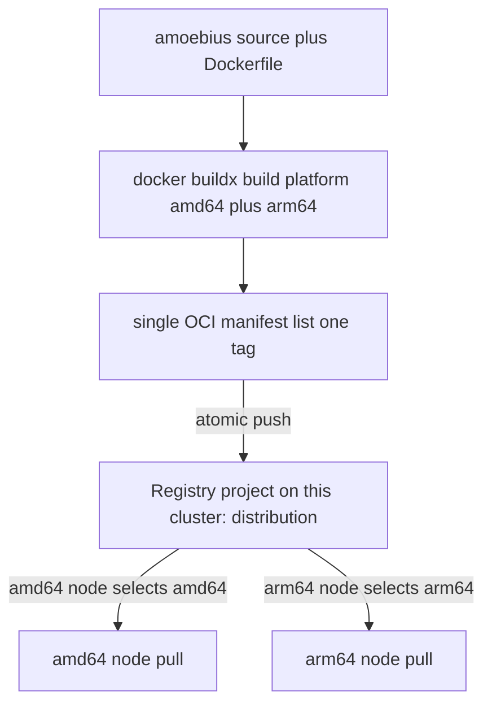

# Image Build & Registry

**Status**: Authoritative source
**Supersedes**: N/A
**Referenced by**: documents/engineering/README.md, documents/engineering/apple_metal_headless_builds.md, documents/engineering/app_vs_deployment_doctrine.md, documents/engineering/content_addressing_doctrine.md, documents/engineering/manifest_generation_doctrine.md, documents/engineering/monitoring_doctrine.md, documents/engineering/network_fabric_doctrine.md, documents/engineering/platform_services_doctrine.md, documents/engineering/service_capability_doctrine.md, documents/engineering/substrate_doctrine.md
**Generated sections**: none

> **Purpose**: Define how amoebius bakes third-party service binaries into one multi-arch base container and
> builds its own runtime image (buildx amd64+arm64), publishes them atomically into the in-cluster
> `distribution` registry (which replaces Harbor), and where the build runs — so every cluster pulls only
> from that registry and every byte is reproducible.

---

## 1. Scope — the build side, not the registry's existence

There are two halves to "containers in amoebius." **That the in-cluster registry exists** — the
single-binary `distribution` registry as a standard service, the single pull source on every cluster — is
owned by [platform_services_doctrine.md](./platform_services_doctrine.md) and
[service_capability_doctrine.md](./service_capability_doctrine.md) (the Registry capability). **How bytes get
built, baked, and land in the registry** is owned here. The seam is deliberate: the platform doc says *what*
the registry is; this doc says *how the pipeline feeds it*.

This document is the SSoT for:

1. The multi-arch build mechanism — `buildx`, `amd64`+`arm64`, one OCI manifest list ([§3](#3-buildx-multi-arch--amd64-and-arm64-one-manifest-list)).
2. Atomic publication and the fail-on-partial-upload semantics ([§4](#4-atomic-publication--a-partial-multi-arch-upload-is-a-failed-upload)).
3. The versioning policy — immutable digest-pinned tags vs `:latest` ([§5](#5-versioning-vs-latest--development_plan-decision-recommended-default-immutable-never-latest), a flagged decision).
4. Where the build runs — host buildx daemon vs in-pod builder ([§6](#6-host-build-vs-in-pod-build--development_plan-decision-recommended-default-host-builder-for-v1), a flagged decision).
5. What amoebius **bakes** (third-party service binaries) versus what it **builds** (its own runtime image) —
   the adopted base-container packaging ([§7](#7-what-amoebius-bakes-vs-builds--the-base-container-is-the-supply-chain)).
6. The no-environment-variable / no-`PATH` build mechanics and credential handling ([§8](#8-build-mechanics-under-the-no-env--no-path-contract)).

What this doctrine deliberately does **not** own:

| Concern | Owned by |
|---------|----------|
| The in-cluster registry (`distribution`) as a standard service and the sole pull source | [platform_services_doctrine.md](./platform_services_doctrine.md), [service_capability_doctrine.md](./service_capability_doctrine.md) |
| The registry's MinIO-backed (S3 driver) blob storage — no PV of its own | [platform_services_doctrine.md §3](./platform_services_doctrine.md#3-the-registry--the-single-image-source), [§4](./platform_services_doctrine.md#4-minio--the-object-substrate) |
| The substrate catalog (apple / linux-cpu / linux-cuda / windows), Lima/WSL2, host worker nodes, and the lazy-tool-ensure contract | [substrate_doctrine.md](./substrate_doctrine.md) |
| The Apple-Metal host worker's headless, on-host, **no-VM** build/run shape (fixed Metal bridge + runtime MSL compilation) | [apple_metal_headless_builds.md](./apple_metal_headless_builds.md) |
| Pulumi-managed cloud registries/infra, the MinIO Pulumi backend, DNS (route53) + TLS (zerossl) | [pulumi_iac_doctrine.md](./pulumi_iac_doctrine.md) |
| The content-addressed **workflow-artifact** store (`experimentHash`, pointers→manifests→blobs) — distinct from OCI image digests | [content_addressing_doctrine.md](./content_addressing_doctrine.md) |
| Cluster bring-up ordering, amoebic spawn, and teardown | [cluster_lifecycle_doctrine.md](./cluster_lifecycle_doctrine.md) |
| Image refs and registry credentials as DSL values / secrets-by-name | [dsl_doctrine.md](./dsl_doctrine.md), [vault_pki_doctrine.md](./vault_pki_doctrine.md) |

This generalizes the pipeline proven in `prodbox`'s `local_registry_pipeline.md`. Where a behaviour is
inherited from prodbox, that is *evidence from a sibling system*, not proof in amoebius ([§9](#9-bring-up-ordering--the-registry-chicken-and-egg-dissolves)).

---

## 2. The single distribution rule: bake the binaries, build the amoebius image, pull only in-cluster

Every byte the cluster runs is either **baked into the amoebius base image** (every third-party service
binary) or **built by amoebius** (its own runtime image), then published once into the cluster's own
in-cluster registry. **No workload ever pulls from a public registry.** This is the strongest form of
the supply-chain guarantee: amoebius controls every byte, does not depend on upstream availability or
rate limits, and a warm cluster is air-gapped by construction.

- **Third-party service binaries are baked, not mirrored.** amoebius does not pull or mirror public *images*
  for the platform services. Each service's binary is installed into the multi-arch base image at build time
  — preferring `apt`, then an official binary/tarball, then build-from-source ([§7](#7-what-amoebius-bakes-vs-builds--the-base-container-is-the-supply-chain)) — so the running workload
  is amoebius's own image carrying a trusted binary, not someone's public container. The only contact with
  upstream is the **base-image build** downloading those binaries/packages on the builder, never an
  in-cluster pull. This reverses prodbox's mirror-into-registry model (`local_registry_pipeline.md` [§5](#5-versioning-vs-latest--development_plan-decision-recommended-default-immutable-never-latest)).
- **The in-cluster registry is `distribution`, not Harbor.** The registry every workload pulls from is the
  single-binary `distribution` (`registry:2`) OCI registry — itself a baked binary ([§7](#7-what-amoebius-bakes-vs-builds--the-base-container-is-the-supply-chain)) — which **replaces
  Harbor**. It serves amoebius-built images (the runtime image, app/workload images); it is *not* a
  pull-through mirror of public registries, because once binaries are baked there is nothing to mirror.
  *Which* provider backs the Registry capability is owned by
  [service_capability_doctrine.md](./service_capability_doctrine.md); this doc owns the build/publish side.
- **The image-ref scheme is registry-project-qualified.** amoebius-built images are named under the
  cluster's registry project, reached at the host-only registry endpoint. This doc owns the *naming* and the
  fact that the runtime is pointed at the in-cluster registry; the per-distro plumbing that makes that
  endpoint resolve on each node (RKE2 `registries.yaml` rewrite, a cloud-substrate containerd-mirror
  DaemonSet) is a substrate detail owned by [substrate_doctrine.md](./substrate_doctrine.md). prodbox's
  `local_registry_pipeline.md` [§4](#4-atomic-publication--a-partial-multi-arch-upload-is-a-failed-upload) is the precedent (generalized from Harbor to `distribution`).
- **Substrate-equivalent image refs.** The build pipeline produces one ref set used on every substrate;
  there is no "cloud-only" or "no-registry" variant. The *image refs* never vary by substrate (the structural
  check is owned by [platform_services_doctrine.md §12](./platform_services_doctrine.md#12-substrate-equivalence-as-a-structural-invariant)); per-cluster
  *deployment shape* may vary, but that is a manifest concern owned by
  [service_capability_doctrine.md](./service_capability_doctrine.md), not an image-ref one.

---

## 3. buildx multi-arch — `amd64` and `arm64`, one manifest list

amoebius runs on both x86 substrates (linux-cpu / linux-cuda, typically `amd64`) and Apple-Silicon hosts
(`arm64`). A single-arch image would mean "this image only runs where it was built" — fatal for a
fungible, spawn-anywhere cluster. So **every amoebius-built image is multi-arch** — the resolved answer to
an open design question of whether amoebius should always use buildx to build multi-arch containers.

Concretely:

- **One `docker buildx` invocation builds both architectures** with `--platform linux/amd64,linux/arm64`.
  The result is a single **OCI manifest list** (a "fat manifest") under one tag; the container runtime on a
  node selects the matching arch automatically at pull time.
- **Native build per arch where possible, cross-build otherwise.** A buildx builder backed by both an
  `amd64` and an `arm64` node builds each arch natively; a single-arch host cross-builds the other arch
  (QEMU emulation or a cross-toolchain). The host-vs-pod choice ([§6](#6-host-build-vs-in-pod-build--development_plan-decision-recommended-default-host-builder-for-v1)) determines which builder backs the
  build; the *output contract* — one fat manifest covering both arches — is identical either way.
- **The amoebius Haskell binary is GHC 9.12.4** ([../../DEVELOPMENT_PLAN/README.md](../../DEVELOPMENT_PLAN/README.md)
  toolchain), pinned identically for both arches. There is no per-arch toolchain drift: the same GHC pin
  compiles the `amd64` and `arm64` layers.

This is the principal generalization over prodbox, which published **native-host-architecture images only**
(`local_registry_pipeline.md` [§6](#6-host-build-vs-in-pod-build--development_plan-decision-recommended-default-host-builder-for-v1) step 4, [§3](#3-buildx-multi-arch--amd64-and-arm64-one-manifest-list)). amoebius lifts native-host-architecture-only builds to always building
both arches as one manifest list.

---

## 4. Atomic publication — a partial multi-arch upload is a failed upload

An open design question asks directly whether a multi-arch publish should fail on both arches if only one
upload fails. amoebius's doctrine answer is **yes — fail closed, atomically.**

A multi-arch tag that resolves on `amd64` but 404s on `arm64` breaks reproducibility on that arch: the
cluster looks healthy until an `arm64` node tries to schedule the pod. A half-published tag fails at schedule
time on the missing arch, not at publish time. So amoebius treats a multi-arch image as one indivisible artifact:

- **Both arches publish under one `buildx ... --push` of the manifest list, or the publication fails.**
  amoebius does not push per-arch tags separately and stitch a manifest afterward. The single push either
  lands the complete manifest list or errors; there is no intermediate state where one arch is live and the
  other is missing.
- **A failed publication leaves the tag un-advertised.** On partial/failed push, amoebius does not record
  the tag as published; downstream reconcile treats the image as not-yet-available and will not deploy a
  workload against it. (This mirrors prodbox's "push custom images only when the Harbor target for the
  current architecture is missing," generalized to "the tag is published only when *every* target arch is
  present.")
- **Re-run is idempotent.** Because publication is all-or-nothing and the published-set is derived from
  what the registry actually holds, re-running the build after a failure re-attempts the whole manifest list; a
  fully-present tag is a no-op. This is the build-side reading of the project-wide idempotent-reconcile
  posture.
- **Transient registry unavailability is retried, then fails loud.** A flake during push is retried against
  the same source; a persistent failure surfaces as an error, never as a silently-skipped arch. amoebius
  inherits prodbox's retry-then-fail-loud publication posture (`local_registry_pipeline.md` [§5](#5-versioning-vs-latest--development_plan-decision-recommended-default-immutable-never-latest)); for its
  multi-arch images the unit of success is the complete manifest list.

> **Honesty.** Fail-closed atomic publication is the *specified* contract for Phase 3, not a tested amoebius
> result. buildx's single-push manifest-list behaviour is a real registry mechanism; that amoebius wires it
> exactly this way is design intent until validated. See
> [../../DEVELOPMENT_PLAN/README.md](../../DEVELOPMENT_PLAN/README.md).

---

## 5. Versioning vs `:latest` — DEVELOPMENT_PLAN decision (recommended default: immutable, never `:latest`)

This is an explicitly open design question: whether to implement a versioned tagging system or just use
`:latest`. It is flagged here as a
[DEVELOPMENT_PLAN](../../DEVELOPMENT_PLAN/README.md) decision (Phase 3); this section records the **trade and
the recommended default**, not a frozen mechanism.

amoebius's core properties are fungibility and reproducibility — a cluster that was destroyed must rebind to
*byte-identical* shape when rebuilt, and a spawned child must run the *same* bytes
as its parent ([platform_services_doctrine.md §1](./platform_services_doctrine.md#1-the-invariant-every-cluster-is-the-same-cluster)). A floating `:latest`
tag is mutable by definition: two pulls of `:latest` at different times can return different bytes. That
directly contradicts fungibility.

**Recommended default: immutable, content-derived image references — `:latest` is forbidden for
amoebius-owned images in cluster specs.**

- **Each build is published under an immutable tag and is consumed by digest.** A workload spec pins an
  image by its immutable identity (tag + digest), so "what runs" is a fixed, reproducible value — never
  "whatever `:latest` happens to be." prodbox's precedent derives a deterministic tag from machine identity
  (`local_registry_pipeline.md` [§3](#3-buildx-multi-arch--amd64-and-arm64-one-manifest-list)); amoebius generalizes to a deterministic, source/content-derived tag so
  that the same inputs produce the same advertised reference.
- **`:latest` is not used as a deployment reference.** A mutable convenience tag may exist as a *pointer*,
  but no cluster `.dhall` denotes a workload by `:latest`. Whether the type layer makes a `:latest`
  deployment reference outright **unrepresentable** is owned by
  [illegal_state_catalog.md](./illegal_state_catalog.md); this doc owns only the policy that immutable
  references are the default.
- **This is distinct from the content-addressed workflow store.** OCI image digests (registry-native) are
  not the `experimentHash`-keyed MinIO artifact store. They rhyme — both are "identify bytes by their
  content" — but the workflow store is owned by
  [content_addressing_doctrine.md](./content_addressing_doctrine.md) and must not be conflated with image
  tags here.

The open part the plan must resolve: the exact tag-derivation scheme (pure source hash vs build-input hash
vs a release calendar) and whether amoebius keeps a floating pointer tag at all.

---

## 6. Host build vs in-pod build — DEVELOPMENT_PLAN decision (recommended default: host builder for v1)

The second open design question: whether the amoebius pod itself eventually takes over container builds, or
that continues to be a host-daemon responsibility. Flagged as a
[DEVELOPMENT_PLAN](../../DEVELOPMENT_PLAN/README.md) decision; recommended default below.

A builder needs a Docker/buildx engine *somewhere*. Two homes are possible — the host's
build daemon (the prodbox model: `docker build` on the host, `local_registry_pipeline.md` [§6](#6-host-build-vs-in-pod-build--development_plan-decision-recommended-default-host-builder-for-v1)) or an in-pod
builder running inside the cluster. The vision states the argument for host directly: a host
builder is "guaranteed to keep all builds in the same place" — including Apple-Silicon native `arm64`
builds, which happen headless on the host (no VM; see
[apple_metal_headless_builds.md](./apple_metal_headless_builds.md)).

**Recommended default: the host builder for v1.**

- **Why host first.** amoebius already requires a sudo-capable host daemon and host build tooling for
  bootstrap; the host is where Apple-Silicon native `arm64` builds happen (headless on-host, no VM —
  [apple_metal_headless_builds.md](./apple_metal_headless_builds.md)), and a single host build
  location keeps arch coverage and build caches in one predictable place. This matches the substrate model
  in which host worker nodes exist precisely for substrate-specific hardware
  ([substrate_doctrine.md](./substrate_doctrine.md)).
- **Why in-pod is the eventual target, not the v1 default.** An in-pod builder removes the host build
  dependency for cloud-managed substrates that have no operator host (the Phase 10 stateless in-cluster
  daemon). The cost is a builder pod that needs privileged build access and its own multi-arch story —
  deferred, not adopted by default.
- **The build location does not change the output contract.** Wherever it runs, the builder emits the [§3](#3-buildx-multi-arch--amd64-and-arm64-one-manifest-list)
  manifest list and publishes under [§4](#4-atomic-publication--a-partial-multi-arch-upload-is-a-failed-upload) atomic semantics. A future host→pod migration is a builder-backend
  swap behind the same publish contract, not a re-architecture of distribution.

The open part the plan must resolve: when (if ever) the in-cluster daemon takes over builds, and how an
in-pod builder reproduces the host's multi-arch coverage (especially Apple-Silicon `arm64`).

---

## 7. What amoebius bakes vs builds — the base container is the supply chain

An open design question asked whether to put *"one big amoebius container with everything in it including
3rd party services … into basecontainer."* The operator has now **adopted** exactly that: amoebius's images
fall into two classes, and the third-party services are **baked**, not mirrored.

- **The amoebius base image carries every third-party service binary.** Vault, MinIO, Pulsar, Keycloak,
  Prometheus/Grafana, **TensorBoard** (the jitML monitoring surface, baked like Grafana and never fetched at
  pod startup — [monitoring_doctrine.md](./monitoring_doctrine.md)), Patroni/Postgres, Envoy, cert-manager,
  MetalLB, the `distribution` registry, and the rest are installed into the multi-arch base image at build
  time, by a strict preference ladder:
  1. **`apt`** where an official package exists (Vault, Grafana, FRR, Redis, Postgres/pgBouncer/pgBackRest,
     code-server, pgAdmin, curl/busybox, …).
  2. **official multi-arch binary/tarball** otherwise (MinIO/mc, `distribution`, the Prometheus stack,
     Thanos, the Envoy-gateway control plane + the Envoy data plane, cert-manager, MetalLB, kube-rbac-proxy,
     the Percona operator, the exporters).
  3. **build-from-source** only as a last resort, adding the language as a first-class build target. The one
     new toolchain required is a **multi-arch Temurin JRE/JDK** for the JVM services (Keycloak,
     keycloak-config-cli, Pulsar+ZooKeeper+BookKeeper) — which are a tarball + a per-arch JRE, not source
     builds. Envoy's data plane is taken as an **official binary** (its from-source path is Bazel, which
     amoebius does not adopt). Go/Rust/C/Node/Python toolchains are already present in the base image.
- **The amoebius runtime image it builds.** The amoebius Haskell binary ships as its own runtime image
  (GHC 9.12.4), role-selected at the pod level — CLI, control-plane singleton, worker — adapting prodbox's
  union-image pattern (`local_registry_pipeline.md` [§6](#6-host-build-vs-in-pod-build--development_plan-decision-recommended-default-host-builder-for-v1)). infernix and jitML are linked in as extension
  libraries, not separate images.
- **The infernix/jitML engine runtimes are baked, not fetched.** The ML engine layer obeys the same
  bake-not-mirror discipline as the platform services. Every infernix/jitML *engine runtime* — the adapter
  processes, the native inference payloads (`llama.cpp`, `whisper.cpp`, the ONNX runtime, Audiveris), and
  the JIT toolchain (`nvcc`, `g++`, the Apple-Metal bridge) — is installed into the multi-arch base image
  at build time by the **same MinIO/Vault/`distribution` asset-map + version resolver** this section already
  uses for the service binaries (the hostbootstrap seam below). Because infernix and jitML link as extension
  libraries (bullet above), the engine exists the moment the pod does; **none is fetched at pod startup** —
  not `curl`-tar'd, not `pip`/venv-installed. This explicitly **replaces infernix's per-engine Poetry-venv +
  `curl`-tar-at-build** shape. The *type-level* guarantee that an engine can never be fetched — `EngineRuntime`
  is a closed, substrate-selected union with **no `Url`/`Download`/`Fetch` arm (type-foreclosed)** — and the full
  three-tier engine/model/kernel asset lifecycle are owned by
  [content_addressing_doctrine.md §4.5](./content_addressing_doctrine.md#45-the-three-tier-ml-asset-lifecycle-engine-baked-model-staged-kernel-jitd) and
  [service_capability_doctrine.md §4](./service_capability_doctrine.md#4-capability--provider--shape-the-binding); this doc owns only the build-side
  fact that the runtimes land in the base image. *Sibling evidence, not an amoebius result:* infernix's
  `docker/Dockerfile` `curl`-tars the native payloads and installs per-engine venvs at IMAGE BUILD — amoebius
  keeps the bake-at-build move but drops the per-engine venv and sources every asset from the asset-map. Read
  as design intent for the ML phase, not a tested amoebius result.
- **A baked engine runtime is OCI-digest bytes, not workflow-store bytes.** Because the engine runtimes are
  part of the base image, each is identified by the **OCI image digest** (registry-owned, [§5](#5-versioning-vs-latest--development_plan-decision-recommended-default-immutable-never-latest)) — never by the
  `experimentHash` of an ML run or the `releaseHash` of a deployment generation. The models an engine serves
  (Tier 2 `ModelArtifact`) and the kernels it JITs (Tier 3, `kernelKey`) are the *content-addressed* tiers
  that live in the `experimentHash`/`kernelKey` workflow store — distinct namespaces owned by
  [content_addressing_doctrine.md](./content_addressing_doctrine.md). The [§5](#5-versioning-vs-latest--development_plan-decision-recommended-default-immutable-never-latest) separation of OCI image digests
  from the `experimentHash`-keyed workflow store extends unchanged to the ML engine layer: baked engine =
  image digest; staged model / JIT kernel = workflow-store hash.

**The seam to extend is already proven in hostbootstrap.** Baking a service binary is the same move
hostbootstrap already uses for Go/helm/mc/pulumi — a mechanism amoebius reuses for its own baked binaries,
though it does **not** bake `helm` ([manifest_generation_doctrine.md §1](./manifest_generation_doctrine.md#1-why-this-doctrine-exists-types-render-manifests-helm-does-not)):
add a per-arch asset map + a version resolver + a
`<SVC>_DOWNLOAD_URL` field in `hostbootstrap/hostbootstrap/base_image.py`, and a matching
`ARG <SVC>_DOWNLOAD_URL` + `RUN … && install -m0755 … /usr/local/bin/<svc>` block in
`hostbootstrap/docker/basecontainer.Dockerfile` (which stays logic-free — every per-arch value is an ARG
resolved on the host). Each baked binary also becomes a constructor of the closed `HostBootstrap.HostTool`
enum (absolute-path `AbsExe`, probe-first `Ensure` reconcile), so it is discovered by full path, never via
`PATH`.

**Harbor is retired.** The one service that did not fit a single binary — Harbor, a ~6-process registry
stack — is replaced by the single-binary `distribution` registry ([§2](#2-the-single-distribution-rule-bake-the-binaries-build-the-amoebius-image-pull-only-in-cluster)), so no third-party service resists
baking. The per-service apt/binary/source classification and the full inventory live with the
platform-services adoption work in
[../../DEVELOPMENT_PLAN/README.md](../../DEVELOPMENT_PLAN/README.md).

---

## 8. Build mechanics under the no-env / no-`PATH` contract

amoebius forbids environment variables entirely — including `PATH` — and discovers host tools lazily
through the substrate's package manager, invoking them by full path
([../../DEVELOPMENT_PLAN/README.md](../../DEVELOPMENT_PLAN/README.md) cross-cutting invariants;
[substrate_doctrine.md](./substrate_doctrine.md)). The build pipeline lives entirely under that contract,
which forces a concrete divergence from prodbox's mechanics:

- **The Docker/buildx binary is full-path-invoked, lazily ensured.** amoebius does not rely on a `docker`
  on `PATH`; it ensures the engine via the substrate package manager and calls the resolved absolute path.
  The lazy-ensure contract is owned by [substrate_doctrine.md](./substrate_doctrine.md); this doc owns only
  that the build step obeys it.
- **No `DOCKER_CONFIG` environment variable — use `docker --config <dir>`.** prodbox isolated registry-push
  auth from public-pull auth with an **ephemeral `DOCKER_CONFIG`** (`local_registry_pipeline.md` §6.1).
  That mechanism is an environment variable, which amoebius forbids. amoebius instead points the build at an
  ephemeral config directory via the `docker --config <ephemeral-dir>` global flag (which also locates
  buildx state), achieving the same isolation **without** an env var. The directory is created per build,
  used for the flow, and scrubbed afterward.
- **No `docker login`; credentials are secrets-by-name.** amoebius never runs `docker login` and never
  writes the operator's global Docker config. The ephemeral config directory holds the registry push
  credential — **not a literal in Dhall** — resolved as a `SecretRef` from Vault at build time
  (secrets-never-live-in-Dhall, [vault_pki_doctrine.md](./vault_pki_doctrine.md);
  [dsl_doctrine.md](./dsl_doctrine.md)). This is the amoebius generalization of prodbox's inline-registry-auth
  mechanism, which used a literal credential; amoebius keeps the *ephemeral-config-no-login* shape but sources
  the credential from Vault by name. (Public-registry auth for in-cluster pulls is moot — there are none.)
- **In-cluster pulls never consult a Docker config.** Nodes reach the in-cluster registry credential-free
  through the substrate's registry wiring ([substrate_doctrine.md](./substrate_doctrine.md)); the ephemeral
  config is a *build-time* concern only.

---

## 9. Bring-up ordering — the registry chicken-and-egg dissolves

prodbox had a real chicken-and-egg: it could not publish into a Harbor that was not yet up, and Harbor could
not come up if its own prerequisite images could only be pulled from a Harbor that did not yet exist.
**Baking dissolves most of this.** The registry is the single-binary `distribution`, baked into the base
image, so it comes up like any other baked service — there is no pre-registry public-pull window to bootstrap
it, and there are no third-party *images* to mirror at all. The thin ordering edge that remains — the
registry stores its blobs in MinIO via the S3 driver, so MinIO must be serving before the registry
([platform_services_doctrine.md §11](./platform_services_doctrine.md#11-bring-up-and-dependency-ordering)); MinIO is itself preloaded and PV-backed, so this is a plain edge, not
a cycle — is owned elsewhere; this doc records only the build-side consequence:

- **The base image is built and loaded before the cluster comes up.** The only upstream contact is the
  base-image *build* (apt/binary/source downloads on the builder, [§2](#2-the-single-distribution-rule-bake-the-binaries-build-the-amoebius-image-pull-only-in-cluster)/[§7](#7-what-amoebius-bakes-vs-builds--the-base-container-is-the-supply-chain)); once that image exists, every
  service — the registry included — runs from it with no public pull. The cluster-bring-up readiness edge
  ("the in-cluster registry up before later app-image pulls") is owned by
  [platform_services_doctrine.md §11](./platform_services_doctrine.md#11-bring-up-and-dependency-ordering).
- **amoebius-built app/workload images publish *after* the registry is healthy.** [§3](#3-buildx-multi-arch--amd64-and-arm64-one-manifest-list)–[§6](#6-host-build-vs-in-pod-build--development_plan-decision-recommended-default-host-builder-for-v1) publication of the
  amoebius runtime and app images runs once the registry is serving. Readiness gating (probes, capability
  checks before any image write) follows the prodbox readiness contract (`local_registry_pipeline.md` §2.1)
  and is a cluster-lifecycle/platform concern, not owned here.
- **Cluster-bring-up sequencing, amoebic spawn, and teardown** are owned by
  [cluster_lifecycle_doctrine.md](./cluster_lifecycle_doctrine.md). A spawned child runs the same baked base
  image and warms its own registry by the same publish pipeline — the build doctrine is identical for parent
  and child because clusters are fungible (platform [§1](#1-scope--the-build-side-not-the-registrys-existence)).

---

## 10. Honesty and planning ownership

> **Honesty.** Every prescriptive statement here is *design intent for Phase 3*
> (the `distribution` registry + baked service binaries + buildx multi-arch amoebius images,
> [../../DEVELOPMENT_PLAN/README.md](../../DEVELOPMENT_PLAN/README.md)), generalized from a pipeline proven
> in `prodbox` but **not yet built in amoebius**. Per
> [documentation_standards.md §6](../documentation_standards.md#6-honesty-the-proventestedassumed-discipline) and
> [chaos_failover_doctrine.md](./chaos_failover_doctrine.md): inherited prodbox proof is evidence from a
> sibling system, not proof in amoebius; read the recommended defaults in [§5](#5-versioning-vs-latest--development_plan-decision-recommended-default-immutable-never-latest) and [§6](#6-host-build-vs-in-pod-build--development_plan-decision-recommended-default-host-builder-for-v1) as flagged decisions
> the plan resolves, never as tested results.

Delivery sequencing, completion status, and validation gates live only in
[../../DEVELOPMENT_PLAN/README.md](../../DEVELOPMENT_PLAN/README.md). This doc states the target shape of
the build-and-registry pipeline and links back for status; it never maintains a competing ledger.

---

## Cross-references

- [Platform Services Doctrine](./platform_services_doctrine.md)
- [Service Capability Doctrine](./service_capability_doctrine.md)
- [Substrate Doctrine](./substrate_doctrine.md)
- [Pulumi IaC Doctrine](./pulumi_iac_doctrine.md)
- [Storage Lifecycle Doctrine](./storage_lifecycle_doctrine.md)
- [Content Addressing Doctrine](./content_addressing_doctrine.md)
- [Cluster Lifecycle Doctrine](./cluster_lifecycle_doctrine.md)
- [Vault / PKI Doctrine](./vault_pki_doctrine.md)
- [DSL Doctrine](./dsl_doctrine.md)
- [Illegal State Catalog](./illegal_state_catalog.md)
- [Engineering Doctrine Index](./README.md)
- [Development Plan](../../DEVELOPMENT_PLAN/README.md)
- [Documentation Standards](../documentation_standards.md)
