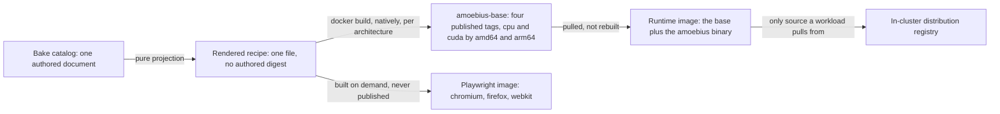
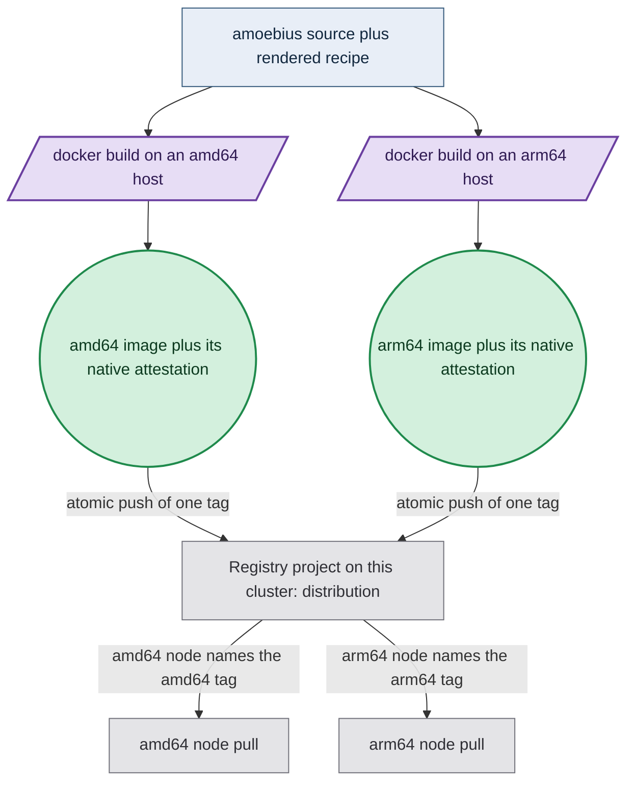

# Image Build & Registry

> **Purpose**: Define how amoebius bakes third-party service binaries into one base container per
> architecture and builds its own generic runtime image from it, publishes them atomically into the in-cluster
> `distribution` registry (which replaces Harbor), and where the build runs — so every cluster pulls only
> from that registry and every byte is reproducible. Low-code UI programs are immutable release data, not
> application-specific browser or server images.
> **Read this if**: an image has to be built or published, or the question is what is baked versus resolved at runtime.

This document owns the build side of image supply: the typed catalog, the generated build file, publication
of each architecture as one atomic act, and the rule fixing what is baked in. It does not own the registry's existence
as a platform service, owned by
[platform_services_doctrine.md §3](./platform_services_doctrine.md#3-the-registry--the-single-image-source),
nor the runtime asset cache that is the deliberate exception, owned by
[content_addressing_doctrine.md](./content_addressing_doctrine.md).

<details>
<summary>Link-graph metadata</summary>

**Status**: Authoritative source
**Supersedes**: N/A
**Referenced by**: DEVELOPMENT_PLAN/README.md, DEVELOPMENT_PLAN/development_plan_phase_model.md, DEVELOPMENT_PLAN/later_phases.md, DEVELOPMENT_PLAN/legacy_tracking_for_deletion.md, DEVELOPMENT_PLAN/legacy_tracking_for_deletion_archive.md, DEVELOPMENT_PLAN/overview.md, DEVELOPMENT_PLAN/phase_35_image_recipe_generation.md, DEVELOPMENT_PLAN/phase_52_linux_engine_bringup.md, DEVELOPMENT_PLAN/phase_55_bootstrap_coordinator_kind.md, DEVELOPMENT_PLAN/phase_56_base_image_registry.md, DEVELOPMENT_PLAN/phase_57_complementary_arch_child.md, DEVELOPMENT_PLAN/phase_62_platform_backbone.md, DEVELOPMENT_PLAN/phase_63_platform_services_2.md, DEVELOPMENT_PLAN/phase_76_provider_deploy_checkpoint.md, DEVELOPMENT_PLAN/phase_77_provider_child_bringup.md, DEVELOPMENT_PLAN/phase_78_provider_ebs_credential.md, DEVELOPMENT_PLAN/phase_80_determinism_jitcache.md, DEVELOPMENT_PLAN/system_components.md, README.md, documents/engineering/README.md, documents/engineering/app_vs_deployment_doctrine.md, documents/engineering/apple_metal_headless_builds.md, documents/engineering/capability_extension_doctrine.md, documents/engineering/content_addressing_determinism.md, documents/engineering/content_addressing_doctrine.md, documents/engineering/daemon_topology_doctrine.md, documents/engineering/dsl_doctrine.md, documents/engineering/generated_artifacts_doctrine.md, documents/engineering/jit_artifact_doctrine.md, documents/engineering/manifest_generation_doctrine.md, documents/engineering/migration_doctrine.md, documents/engineering/monitoring_doctrine.md, documents/engineering/network_fabric_doctrine.md, documents/engineering/platform_services_doctrine.md, documents/engineering/release_lifecycle_doctrine.md, documents/engineering/resource_capacity_construction.md, documents/engineering/resource_capacity_sources.md, documents/engineering/service_capability_doctrine.md, documents/engineering/substrate_doctrine.md, documents/engineering/testing_doctrine.md, documents/engineering/validation_frame_doctrine.md, documents/glossary.md, documents/illegal_state/illegal_state_lifecycle.md, documents/illegal_state/illegal_state_techniques.md
**Generated sections**: none

</details>

> **Historical result (invalidated).** Phase-run and implementation-result statements predate the 2026-08-11 reopen unless the owning phase is Done; target doctrine remains normative, and current state is in the [tracker](../../DEVELOPMENT_PLAN/README.md).

## Contents
- [1. Scope — the build side, not the registry's existence](#1-scope--the-build-side-not-the-registrys-existence)
- [2. The single distribution rule: bake the binaries, build the amoebius image, pull only in-cluster](#2-the-single-distribution-rule-bake-the-binaries-build-the-amoebius-image-pull-only-in-cluster)
- [3. One image per architecture — the tag carries the architecture, not an index](#3-multi-architecture-images--one-natively-built-child-per-architecture)
- [4. Atomic publication — a partial upload is a failed upload](#4-atomic-publication--a-partial-multi-arch-upload-is-a-failed-upload)
- [5. What the image identity is, given that the tag is an address](#5-what-the-image-identity-is-given-that-the-tag-is-an-address)
- [6. Host build vs in-pod build — DEVELOPMENT_PLAN decision (recommended default: host builder for v1)](#6-host-build-vs-in-pod-build--development_plan-decision-recommended-default-host-builder-for-v1)
- [7. What amoebius bakes vs builds — the base container is the supply chain](#7-what-amoebius-bakes-vs-builds--the-base-container-is-the-supply-chain)
- [8. Build mechanics under the no-env / no-`PATH` contract](#8-build-mechanics-under-the-no-env--no-path-contract)
- [9. Bring-up ordering — the registry chicken-and-egg dissolves](#9-bring-up-ordering--the-registry-chicken-and-egg-dissolves)
- [10. Honesty and planning ownership](#10-honesty-and-planning-ownership)
- [Related Documents](#related-documents)

---

## 1. Scope — the build side, not the registry's existence

There are two halves to "containers in amoebius." **That the in-cluster registry exists** — the
single-binary `distribution` registry as a standard service, the single pull source on every cluster — is
owned by [platform_services_doctrine.md](./platform_services_doctrine.md) and
[service_capability_doctrine.md](./service_capability_doctrine.md) (the Registry capability). **How bytes get built, baked, and land in the registry** is owned here. The seam is deliberate: the platform doc says *what*
the registry is; this doc says *how the pipeline feeds it*.

This document is the SSoT for:

1. The per-architecture build mechanism — one natively built image per architecture, published under its own
   architecture-qualified tag and never joined ([§3](#3-multi-architecture-images--one-natively-built-child-per-architecture)).
2. Atomic publication and the fail-on-partial-upload semantics ([§4](#4-atomic-publication--a-partial-multi-arch-upload-is-a-failed-upload)).
3. The versioning policy — immutable digest-pinned tags vs `:latest` ([§5](#5-what-the-image-identity-is-given-that-the-tag-is-an-address), a flagged decision).
4. Where the build runs — host container engine vs in-pod builder ([§6](#6-host-build-vs-in-pod-build--development_plan-decision-recommended-default-host-builder-for-v1), a flagged decision).
5. What amoebius **bakes** (third-party service binaries) versus what it **builds** (its own runtime image) —
   the adopted base-container packaging ([§7](#7-what-amoebius-bakes-vs-builds--the-base-container-is-the-supply-chain)).
6. The no-environment-variable / no-`PATH` build mechanics and credential handling ([§8](#8-build-mechanics-under-the-no-env--no-path-contract)).

What this doctrine deliberately does **not** own:

| Concern | Owned by |
|---------|----------|
| The in-cluster registry (`distribution`) as a standard service and the sole pull source | [platform_services_doctrine.md](./platform_services_doctrine.md), [service_capability_doctrine.md](./service_capability_doctrine.md) |
| The registry's MinIO-backed (S3 driver) blob storage — no PV of its own | [platform_services_doctrine.md §3](./platform_services_doctrine.md#3-the-registry--the-single-image-source), [§4](./platform_services_doctrine.md#4-minio--the-object-substrate) |
| The substrate catalog, universal `linux-cpu` lane, Incus/Lima/WSL2 guests, host worker nodes, and the lazy-tool-ensure contract | [substrate_doctrine.md](./substrate_doctrine.md) |
| The Apple-Metal host worker's headless, on-host, **no-VM** build/run shape (fixed Metal bridge + runtime MSL compilation) | [apple_metal_headless_builds.md](./apple_metal_headless_builds.md) |
| Pulumi-managed cloud registries/infra, the MinIO Pulumi backend, DNS (route53) + TLS (zerossl) | [pulumi_iac_doctrine.md](./pulumi_iac_doctrine.md) |
| The content-addressed **workflow-artifact** store (`experimentHash`, pointers→manifests→blobs) — distinct from OCI image digests | [content_addressing_doctrine.md](./content_addressing_doctrine.md) |
| Cluster bring-up ordering, amoebic spawn, and teardown | [cluster_lifecycle_doctrine.md](./cluster_lifecycle_doctrine.md) |
| Image refs and registry credentials as DSL values / secrets-by-name | [dsl_doctrine.md](./dsl_doctrine.md), [vault_pki_doctrine.md](./vault_pki_doctrine.md) |

This generalizes the pipeline proven in `prodbox`'s `local_registry_pipeline.md`. Where a behaviour is
inherited from prodbox, that is *evidence from a sibling system*, not proof in amoebius ([§9](#9-bring-up-ordering--the-registry-chicken-and-egg-dissolves)).

---

Diagram vocabulary: [diagram_conventions.md](./diagram_conventions.md).


```mermaid
flowchart LR
%% register: orientation
  cat[Bake catalog: one authored document] -->|pure projection| rec[Rendered recipe: one file, no authored digest]
  rec -->|docker build, natively, per architecture| base[amoebius-base: four published tags, cpu and cuda by amd64 and arm64]
  base -->|pulled, not rebuilt| runtime[Runtime image: the base plus the amoebius binary]
  rec -->|built on demand, never published| pw[Playwright image: chromium, firefox, webkit]
  runtime -->|only source a workload pulls from| reg[In-cluster distribution registry]
```
*Orientation. Design intent. One catalog and one recipe produce every image amoebius owns; the base is published so a consumer pulls a toolchain rather than rebuilding it, and the browser engines are the one dependency that does not join the image a cluster runs. The in-cluster registry every workload pulls from is owned by [platform_services_doctrine.md §3](./platform_services_doctrine.md#3-the-registry--the-single-image-source).*

---

## 2. The single distribution rule: bake the binaries, build the amoebius image, pull only in-cluster

Every byte the cluster runs is either **baked into the amoebius base image** (every third-party service
binary) or **built by amoebius** (its own runtime image), then published once into the cluster's own
in-cluster registry. **No workload ever pulls from a public registry.** This is the strongest form of
the supply-chain guarantee: amoebius controls every byte, does not depend on upstream availability or
rate limits, and a warm cluster is air-gapped by construction.

**The published set is exactly four tags**, and this sentence is where that set is stated rather than drawn:
`amoebius-base-cpu-amd64`, `amoebius-base-cpu-arm64`, `amoebius-base-cuda-amd64`, and
`amoebius-base-cuda-arm64` — the cross product of two flavors, **cpu** and **cuda**, with two
architectures, **amd64** and **arm64**. Two flavors because a CPU-only lane should not carry a CUDA toolchain it can never
run; two architectures because nothing cross-builds and nothing joins the halves
([§3](#3-multi-architecture-images--one-natively-built-child-per-architecture)). `amoebius-base` is the one
image a consumer **pulls** rather than rebuilds; every other image in the system is built locally, and the
Playwright test image is never published at all
([validation_frame_doctrine.md §5](./validation_frame_doctrine.md#5-the-one-exception-browsers)).

- **Third-party service binaries are baked, not mirrored.** amoebius does not pull or mirror public *images*
  for the platform services. Each service's binary is installed into the base image at build time
  — preferring `apt`, then an official binary/tarball, then build-from-source ([§7](#7-what-amoebius-bakes-vs-builds--the-base-container-is-the-supply-chain)) — so the running workload
  is amoebius's own image carrying a trusted binary, not someone's public container. The only contact with
  upstream is the **base-image build** downloading those binaries/packages on the builder, never an
  in-cluster pull. This reverses prodbox's mirror-into-registry model (`local_registry_pipeline.md` [§5](#5-what-the-image-identity-is-given-that-the-tag-is-an-address)).
- **The ladder is a typed arm set, not a preference anyone has to remember.** The bake catalog's step union
  carries one arm per rung — an `apt` package, an official artifact with a publisher-resolved checksum, an
  amoebius-built product — so choosing a rung is a modelling decision a reviewer can see in the diff. A
  scavenge-from-image arm may exist as an explicit last resort, and every remaining use records why the rungs
  above it did not apply. Without the upper arms in the type there is only one way in, and the ladder becomes
  advice: the catalog says "copy from a public image" because that is the only sentence it can say.
- **Separately published companion payloads are first-class catalog data.** An executable release may require
  a second publisher archive that is neither another service nor an optional runtime download. The payload
  records its per-platform asset, publisher checksum contract, archive shape, extraction target, and required
  file. The build verifies and extracts it with the owning artifact. An independent OCI-file oracle requires
  the file on every platform, and an omission mutant must fail. Pulsar's tiered-storage bundle is the concrete
  case: its jcloud NAR belongs under `/pulsar/offloaders`, not in a later network fetch.
- **The rule binds workloads, and the exception is enumerated rather than described.** "No public pull" is a
  statement about what the *cluster runs*, and the identities below are build and bootstrap infrastructure
  that no cluster runs. They are enumerated here so the exception is bounded and visible rather than
  discovered later in a Dockerfile:
  - the **kind node image**, pulled by the host container engine before any cluster exists;
  - the **language builder images** that compile the rung-3 build products, each of which runs once on the
    builder, emits one binary into the build context, and is discarded — a builder image that left bytes in
    the final layer set would be the scavenge rung under another name;
  - **`amoebius-base` itself**, which the operator publishes and a consumer pulls rather than rebuilds. It
    is the one amoebius-built image that arrives from outside the cluster, and it arrives there because
    rebuilding a toolchain on every host is the cost the publication exists to remove. The rule it does not
    weaken is the one that matters: *no workload* pulls from a public registry, and every image a cluster
    runs still comes from that cluster's own registry.
- **The in-cluster registry is `distribution`, not Harbor.** The registry every workload pulls from is the
  single-binary `distribution` (`registry:2`) OCI registry — itself a baked binary ([§7](#7-what-amoebius-bakes-vs-builds--the-base-container-is-the-supply-chain)) — which **replaces Harbor**. It serves amoebius-built images — the base image and every `Runtime` variant
  ([§5](#5-what-the-image-identity-is-given-that-the-tag-is-an-address)); it is *not* a
  pull-through mirror of public registries, because once binaries are baked there is nothing to mirror.
  *Which* provider backs the Registry capability is owned by
  [service_capability_doctrine.md](./service_capability_doctrine.md); this doc owns the build/publish side.
- **The image-ref scheme is registry-project-qualified.** amoebius-built images are named under the
  cluster's registry project, reached at the host-only registry endpoint. This doc owns the *naming* and the
  fact that the runtime is pointed at the in-cluster registry; the per-distro plumbing that makes that
  endpoint resolve on each node (RKE2 `registries.yaml` rewrite, a cloud-substrate containerd-mirror
  DaemonSet) is a substrate detail owned by [substrate_doctrine.md](./substrate_doctrine.md). prodbox's
  `local_registry_pipeline.md` [§4](#4-atomic-publication--a-partial-multi-arch-upload-is-a-failed-upload) is the precedent (generalized from Harbor to `distribution`).
- **Substrate-equivalent image refs.** The build pipeline produces one ref set used on every substrate;
  there is no "cloud-only" or "no-registry" variant. The *image refs* never vary by substrate (the structural
  check is owned by [platform_services_doctrine.md §12](./platform_services_doctrine.md#12-substrate-equivalence-as-a-structural-invariant)); per-cluster
  *deployment shape* may vary, but that is a manifest concern owned by
  [service_capability_doctrine.md](./service_capability_doctrine.md), not an image-ref one.

### 2.1 A published tag is a cache warm-up, and its name is the content address

The four tags above are a **performance decision, not a source of truth**, and this subsection is where that is
stated so nothing downstream can read a pull as an authority.

The recipe is a rendered artifact: it is a total function of the bake catalog, and the catalog is a total
function of the Haskell types that declare it
([`jit_artifact_doctrine.md`](./jit_artifact_doctrine.md)). So the image the recipe produces has a **content
address** — a digest over the target, the recipe's own identity, the catalog, and the rendered text
([`jit_artifact_doctrine.md` §4](./jit_artifact_doctrine.md#4-the-address-folds-in-the-rendered-text)) — and
that address is computable by any consumer holding the repository, before a registry is contacted.

**The tag is derived from that address.** A published tag is therefore not a name somebody chooses and
re-points; it is the address, and re-pointing it is not an operation the scheme offers. Two consequences
follow, and the second is the reason for the change:

- **A pull is a cache hit.** A consumer computes the address it needs, asks the registry for it, and either
  receives those exact bytes or does not. Receiving them saves a toolchain rebuild, which is the whole
  motivation for publishing at all.
- **A stale pull cannot succeed.** With a fixed name, a repository change that altered the recipe left the
  published tag matching an older tree, and *nothing reported it* — the pull succeeded and produced the wrong
  toolchain. With an address-derived tag, the changed recipe has a different address, the registry does not
  have it, and the consumer rebuilds. The failure mode becomes a slower build rather than a silently wrong
  image.

**Until this lands, the manual obligation stands.** Today's tags are fixed names, so today a stale pull does
succeed, and the repository's agent policy therefore requires a rebuild and republish whenever the recipe or
the catalog it projects changes. That obligation retires exactly when tags become address-derived, and not
before. Status lives only in the [tracker](../../DEVELOPMENT_PLAN/README.md).

---

<a id="3-buildx-multi-arch--amd64-and-arm64-one-manifest-list"></a>
<a id="3-multi-architecture-images--one-natively-built-child-per-architecture"></a>
## 3. One image per architecture — the tag carries the architecture, not an index

amoebius runs on both x86 substrates (linux-cpu / linux-cuda, typically `amd64`) and Apple-Silicon hosts
(`arm64`), so an image built for one architecture is useless on the other. amoebius answers that with **one
natively built image per architecture, published under an architecture-qualified tag** — and with no index
joining them.

Concretely:

- **One plain `docker build` per architecture, on a host of that architecture.** No `buildx`, no BuildKit
  multi-platform invocation, no emulation, and no cross-toolchain: the requested architecture, the detected
  host architecture, and the container engine's architecture are compared before any build starts, and a
  mismatch refuses rather than emulating. A container shares the host kernel and therefore the host
  instruction set, so an image for an architecture the host cannot execute is not something a build can
  honestly produce.
- **The architecture is in the reference, not in a manifest.** Each build publishes its own tag, and a
  consumer names the architecture it wants. This is the same move the natural-architecture rule already made
  everywhere else — an engine offering and a generated test topology both carry their architecture — applied
  to images.
- **There is no join, and that is the point.** An OCI manifest list would be an artifact **no single host
  ever attested**: whichever machine assembled it would be advertising a child it could not execute, which is
  exactly the half-proven index the 2026-08-16 natural-architecture amendment exists to remove. Removing the
  join does not weaken that amendment; it finishes it, by moving the obligation out of a join step and into
  the reference's own identity.
- **Each architecture resolves its own toolchain graph, and the two must agree.** The compatible compiler and
  packages are resolved per run on each host; the attestations record both observations and reject
  per-architecture dependency drift by comparing them. No resolution file is committed.

What a caller loses is the convenience of one reference that resolves everywhere; what it gains is that every
reference names bytes some machine actually ran. On a mixed-architecture cluster the per-node selection moves
from the registry to the manifest that names the image, which is a deployment concern owned by
[service_capability_doctrine.md](./service_capability_doctrine.md).

[Phase 35](../../DEVELOPMENT_PLAN/phase_35_image_recipe_generation.md) supplies the Register-1 boundary for
this rule: four CPU/CUDA × amd64/arm64 cases join to forty-four exact plain-build argv tokens, and two
observed/requested architecture mismatches refuse before emission. That proves the pure invocation value, not
an engine build, published image, or runtime correspondence; those live layers remain UNVERIFIED here.

Diagram vocabulary: [diagram_conventions.md](./diagram_conventions.md).


```mermaid
flowchart TD
%% register: algebra
  src["amoebius source plus rendered recipe"]:::intent --> bxa[/"docker build on an amd64 host"/]:::effect
  src --> bxb[/"docker build on an arm64 host"/]:::effect
  bxa --> ata(("amd64 image plus its native attestation")):::seal
  bxb --> atb(("arm64 image plus its native attestation")):::seal
  ata -->|atomic push of one tag| reg["Registry project on this cluster: distribution"]:::runtime
  atb -->|atomic push of one tag| reg
  reg -->|amd64 node names the amd64 tag| amd["amd64 node pull"]:::runtime
  reg -->|arm64 node names the arm64 tag| arm["arm64 node pull"]:::runtime
  classDef intent   fill:#e8eef7,stroke:#33587a,color:#12283f,stroke-width:1px
  classDef effect   fill:#e7ddf5,stroke:#6b3fa0,color:#2f1a52,stroke-width:2px
  classDef seal     fill:#d3f0dd,stroke:#1f8a4c,color:#0c3a1f,stroke-width:2px
  classDef runtime  fill:#e4e4e7,stroke:#71717a,color:#2f2f35,stroke-width:1px
```

*Design intent. Each build is an effectful seam on its own architecture's hardware and each image is sealed by the attestation of the host that executed it; the running registry and the two node pulls are runtime-checked, not proven here.*

---

<a id="4-atomic-publication--a-partial-multi-arch-upload-is-a-failed-upload"></a>
## 4. Atomic publication — a partial upload is a failed upload

An open design question asks directly whether a publish should fail when only part of it lands. amoebius's
doctrine answer is **yes — fail closed, atomically** — and with one image per architecture
([§3](#3-one-image-per-architecture--the-tag-carries-the-architecture-not-an-index)) the unit that must be
whole is one tag rather than one index.

A tag that resolves for some of its blobs and 404s for the rest breaks reproducibility: the cluster looks
healthy until a node tries to schedule the pod. A half-published tag fails at schedule time, not at publish
time. So amoebius treats each architecture's image as one indivisible artifact:

- **A tag is advertised under one push, or the publication fails.** There is no intermediate state where a
  tag is live and incomplete. The two architectures are published independently and neither waits on the
  other, which is the practical gain of dropping the join: a machine that can build only one architecture can
  still publish that one completely, instead of holding a half-index nobody can use.
- **An unattested image is an absent image.** A tag is publishable only with the attestation produced on that
  architecture's own hardware, recording the per-binary execution and ELF-machine observations for it. This
  is what keeps an independently built image from re-admitting the half-proven artifact an emulated build
  used to produce.
- **A failed publication leaves the tag un-advertised.** On partial or failed push, amoebius does not record
  the tag as published; downstream reconcile treats the image as not-yet-available and will not deploy a
  workload against it.
- **Re-run is idempotent.** Because publication is all-or-nothing and the published set is derived from what
  the registry actually holds, re-running after a failure re-attempts the whole tag; a fully present tag is a
  no-op. This is the build-side reading of the project-wide idempotent-reconcile posture.
- **Transient registry unavailability is retried, then fails loud.** A flake during push is retried against
  the same source; a persistent failure surfaces as an error, never as a silently skipped image.

**The architecture set is a property of the run, not of the artifact.** A cluster whose nodes are all one
architecture is completely served by one published tag, and a mixed cluster is served by two independently
published ones. Neither case has a partial state, because there is no artifact spanning both.

> **Validated boundary.** Phase 56 exercised a proxy-induced partial-blob fault, observed the immutable tag
> absent and its manifest GET at 404, retained the partial residue in storage accounting, then published the
> exact audited two-architecture index with one final raw-index advertisement. A second run made zero
> mutating registry requests. This tests the amoebius fail-closed publication mechanism for that Register-3
> envelope; it does not claim that arbitrary registries provide transactions. **The two-architecture half of
> that observation is invalidated by the 2026-08-16 natural-architecture amendment**: its non-native child
> was built and probed under emulation, so the index it published had one attested half
> ([§3](#3-multi-architecture-images--one-natively-built-child-per-architecture)).

---

## 5. What the image identity is, given that the tag is an address

The tagging scheme is **not** an open question: [§2.1](#21-a-published-tag-is-a-cache-warm-up-and-its-name-is-the-content-address)
decides it, and a tag is the recipe's content address rather than a name anybody picks. This section owns what
is left over — the closed image *identity* union, and why an application has no image of its own to name.

amoebius's core properties are fungibility and reproducibility — a cluster that was destroyed must rebind to
*byte-identical* shape when rebuilt, and a spawned child must run the *same* bytes
as its parent ([platform_services_doctrine.md §1](./platform_services_doctrine.md#1-the-invariant-every-cluster-is-the-same-cluster)). A floating `:latest`
tag is mutable by definition: two pulls of `:latest` at different times can return different bytes. That
directly contradicts fungibility.

**Image references are immutable and content-derived, and `:latest` has no place in a cluster spec.** That is
[§2.1](#21-a-published-tag-is-a-cache-warm-up-and-its-name-is-the-content-address)'s rule, restated here only to
say what it forecloses on this page.

- **The image set itself is closed, and identity is separate from version.** *Which image this is* is a
  named catalog identity; *which build of it* is the tag+digest the rest of this section governs.

  ```text
  ImageIdentity =
    < KindNode                                  -- host-pulled, pre-cluster, outside the in-cluster boundary
    | Base : { flavor : Flavor, arch : Arch }   -- the third-party-binary base image, per lane and arch (§7)
    | Runtime : { linkedAdapters : Set ExtensionId }
        -- the generic executable plus exactly this trusted server/workload adapter set
    >   -- closed: no Foreign arm, no free digest, no Url; not authorable by an app .dhall
  ```

  An app therefore has no image of its own to name. A declarative `UiSource` and its checked client/server
  plans are immutable `Release` inputs interpreted by the generic runtime; only a genuinely new trusted
  Haskell adapter can change `linkedAdapters`. Thus "run this foreign image" and "compile this app's raw
  browser bundle" have no syntax and fail before any binary runs. This is the same closure move
  [service_capability_doctrine.md §4.1](./service_capability_doctrine.md#41-the-inferenceengine-capability--the-engine-is-target-offering-selected-and-jit-resolved-never-authored)
  already makes for `EngineRuntime`, applied to images; the general rule that such unions close *because
  every arm is a named catalog identity* is owned there and is not restated here. `KindNode` is a distinct
  arm rather than an omission: the kind node-container image is pulled by the host docker before any cluster
  exists, so it sits outside the [§2](#2-the-single-distribution-rule-bake-the-binaries-build-the-amoebius-image-pull-only-in-cluster)
  no-public-pull boundary and must be nameable without being amoebius-built.
- **Each build is published under an immutable tag and is consumed by digest.** A workload spec pins an
  image by its immutable identity (tag + digest), so "what runs" is a fixed, reproducible value — never
  "whatever `:latest` happens to be." The `prodbox` seed derives a deterministic tag from *machine* identity;
  amoebius re-derives the shape against *content* instead, which is the guarantee it adds: a tag that names a
  machine cannot detect a changed recipe, and a tag that names content cannot fail to.
- **There is no floating pointer tag.** A mutable convenience tag is not something the scheme declines to use;
  it is something the scheme does not offer, because re-pointing is not an operation over an address
  ([§2.1](#21-a-published-tag-is-a-cache-warm-up-and-its-name-is-the-content-address)). The type layer is
  specified to give a `:latest` deployment reference no inhabitant, and the entry that records that
  foreclosure is owned by
  [illegal_state_catalog.md](../illegal_state/illegal_state_catalog.md).
- **This is distinct from the content-addressed workflow store.** OCI image digests (registry-native) are
  not the `experimentHash`-keyed MinIO artifact store. They rhyme — both are "identify bytes by their
  content" — but the workflow store is owned by
  [content_addressing_doctrine.md](./content_addressing_doctrine.md) and must not be conflated with image
  tags here.

Nothing here is open. The derivation is the artifact address of
[`jit_artifact_doctrine.md` §4](./jit_artifact_doctrine.md#4-the-address-folds-in-the-rendered-text), and there
is no pointer tag to decide about. What remains is delivery, and which phase delivers it is the
[tracker](../../DEVELOPMENT_PLAN/README.md)'s.

---

## 6. Host build vs in-pod build — DEVELOPMENT_PLAN decision (recommended default: host builder for v1)

The second open design question: whether the amoebius pod itself eventually takes over container builds, or
that continues to be a host-daemon responsibility. Flagged as a
[DEVELOPMENT_PLAN](../../DEVELOPMENT_PLAN/README.md) decision; recommended default below.

A build needs a container engine *somewhere*. Two homes are possible — a project-scoped host
daemon whose data root, runtime directory, contexts, volumes, and build cache all live beneath `.data/**`
for production or `.test_data/**` for a test (the hostbootstrap model), or an in-pod
builder running inside the cluster. The vision states the argument for host directly: a host
builder is "guaranteed to keep all builds in the same place" — including Apple-Silicon native `arm64`
container images. (Two build kinds must not be conflated: the native `arm64` **container image** build on
macOS runs against a Linux docker engine — a Lima/Colima VM, [substrate_doctrine.md §4](./substrate_doctrine.md#4-virtualized-substrates-synthesizing-a-linux-host-where-the-host-is-not-linux) — whereas the
**no-VM** property of [apple_metal_headless_builds.md](./apple_metal_headless_builds.md) is the *Metal worker*
build, on-host MSL compilation, not the container image.)

**Recommended default: the host builder for v1.**

- **The builder is an execution unit, not free host overhead.** Every build carries a pure
  `BuildExecutionEnvelope`:

  ```text
  BakeStep =
    < AptPackage         : { name : Text, pinnedVersion : Text }
    | OfficialTarball    : { identity : CatalogId, sha256 : Text }
    | SourceBuild        : { identity : CatalogId, recipe : BuildRecipe }
    | InstallBinary      : { from : BuildStageId, path : AbsPath, mode : FileMode }
    | CopyGeneratedAsset : { producer : GeneratedArtifactId }
    >   -- closed: there is no RunShell : Text arm, and no Url arm

  BuildStageDemand =
    { id                    : BuildStageId
    , platform              : OsArch
    , dependsOn             : List BuildStageId
    , content               : NonEmpty BakeStep
    , runtime :
        { cpuReservation    : Quantity Cpu
        , cpuCeiling        : Quantity Cpu
        , memoryReservation : Quantity Bytes
        , memoryCeiling     : Quantity Bytes
        }
    , peakIntermediateBytes : Quantity Bytes
    , peakCacheWriteBytes   : Quantity Bytes
    }

  BuildExecutionEnvelope =
    { id : BuildExecutionId
    , stages : NonEmpty BuildStageDemand
    , scratchBacking : HostStorageBackingId
    , cache : HostCacheDemand
    , cacheEquality : cache.source == ImageBuild id
    , archConcurrency : < Serial | BoundedParallel : PositiveNatural >
    , stageConcurrency : < Serial | BoundedParallel : PositiveNatural >
    }
  ```

  The stage graph is non-empty, closed over `dependsOn`, and acyclic. **Each stage's `content` is a non-empty list of typed `BakeStep`s, and those steps are the only way bytes enter an image.** The union's
  arms are exactly the [§7](#7-what-amoebius-bakes-vs-builds--the-base-container-is-the-supply-chain)
  preference ladder — `AptPackage`, then `OfficialTarball`, then `SourceBuild` — plus the two intra-build
  moves (`InstallBinary` from an earlier stage, `CopyGeneratedAsset` from a
  [generated_artifacts_doctrine.md](./generated_artifacts_doctrine.md) renderer). There is **no `RunShell : Text` arm and no `Url` arm**: an interpolated shell fragment and an operator-supplied download
  address are both unrepresentable, so the interior of an image is typed data rather than a template that
  becomes a filesystem only when it runs. Binding enumerates every dependency-
  valid simultaneous stage set admitted by the separate architecture and stage concurrency policies, derives
  the maximum runtime, intermediate-layer workspace, and cache-write delta, and proves it fits the host/
  engine-VM CPU, memory, scratch, and cache carves. The cache obligation is `observed residents + derived
  concurrent write delta ≤ CacheBudget ≤ physical cache carve`; a ceiling without a write-demand operand is
  not admission evidence. There is no editable aggregate capable of hiding one expensive stage.
  `scratchBacking` resolves exactly once to a physical `HostStoragePool` tagged `BuildScratch`; the cache
  resolves exactly once to a `HostCachePool`. If their carves share a physical disk, their peaks are debited
  together under that disk's single parent. A retained cache consumes its observed resident bytes until an
  observed GC removes them; the fold never assumes a cache hit, eviction, or reclaim.
- **Build admission is snapshot-bound and precedes the build.** Immediately before the first builder process,
  amoebius observes host/engine-VM residual CPU, memory, backing allocations, current build-cache residents,
  and other live build/VM/process commitments; derives the whole build transition peak; and mints a
  single-use token bound to that fingerprint. Any mismatch, unknown commitment, or changed fingerprint
  refuses with zero builder execution and zero cache/scratch mutation. The runtime ceiling is
  enforced on the BuildKit worker/cgroup or engine-VM boundary rather than treated as an estimate.
- **Why host first.** amoebius already requires a sudo-capable host daemon and host build tooling for
  bootstrap; the host is where Apple-Silicon native `arm64` container images are built (against a Linux docker
  engine in a Lima/Colima VM, [substrate_doctrine.md §4](./substrate_doctrine.md#4-virtualized-substrates-synthesizing-a-linux-host-where-the-host-is-not-linux); the Metal *worker* build is separately
  on-host, no VM — [apple_metal_headless_builds.md](./apple_metal_headless_builds.md)), and a single host build
  location keeps arch coverage and build caches in one predictable place. This matches the substrate model
  in which host worker nodes exist precisely for substrate-specific hardware
  ([substrate_doctrine.md](./substrate_doctrine.md)).
- **Why in-pod is the eventual target, not the v1 default.** An in-pod builder removes the host build
  dependency for cloud-managed substrates that have no operator host (the Phase 76 stateless in-cluster
  daemon). The cost is a builder pod that needs privileged build access and its own multi-arch story —
  deferred, not adopted by default.
- **The build location does not change the output contract.** Wherever it runs, the builder emits the [§3](#3-multi-architecture-images--one-natively-built-child-per-architecture)
  architecture-qualified image and publishes under [§4](#4-atomic-publication--a-partial-multi-arch-upload-is-a-failed-upload) atomic semantics. A future host→pod migration is a builder-backend
  swap behind the same publish contract, not a re-architecture of distribution. The
  `BuildExecutionEnvelope` accounts for execution; the resulting platform-indexed `ImageArtifact` records OCI
  index/child-manifest/config/compressed-layer stored bytes, snapshot chain ids/unpacked bytes, and peak import
  workspace. The node-storage fold deduplicates content objects and snapshots in their distinct identity
  domains under its pinned runtime model. Neither provision may stand in for the other.

The open part the plan must resolve: when (if ever) the in-cluster daemon takes over builds, and how an
in-pod builder reproduces the host's multi-arch coverage (especially Apple-Silicon `arm64`) without
emulating an architecture its node does not have ([§3](#3-multi-architecture-images--one-natively-built-child-per-architecture)).

---

## 7. What amoebius bakes vs builds — the base container is the supply chain

An open design question asked whether to put *"one big amoebius container with everything in it including
3rd party services … into basecontainer."* The operator has now **adopted** exactly that: the third-party
services are **baked**, not mirrored. The two classes this section governs — the base image and the runtime
image — are the two amoebius-built arms of the closed
[§5](#5-what-the-image-identity-is-given-that-the-tag-is-an-address)
`ImageIdentity`; there is no third, app-supplied class. A low-code app supplies a checked program to a generic
`Runtime` variant rather than an image or executable of its own.

### The amoebius base image carries every third-party service binary

Vault, MinIO, Pulsar, **Redis (`redis-server`, including Sentinel mode and `redis-cli`)**, Keycloak,
Prometheus/Grafana, the **alert receiver** that holds the firing set for the `Observability` capability,
**TensorBoard** (the jitML monitoring surface, baked like Grafana and never fetched at
pod startup — [monitoring_doctrine.md](./monitoring_doctrine.md)), Patroni/Postgres, Envoy, cert-manager,
MetalLB, the `distribution` registry, and provider-only infrastructure binaries such as the AWS EBS CSI
controller/node implementation and its required sidecars are installed into the multi-arch base image at
build time, by a strict preference ladder, each rung a distinct arm of the typed bake catalog:
1. **`apt`** where an official package exists (Vault, Grafana, FRR, Redis, Postgres/pgBouncer/pgBackRest,
   code-server, pgAdmin, curl/busybox, …).
2. **official multi-arch binary/tarball** otherwise (MinIO/mc, `distribution`, the Prometheus stack,
   Thanos, the Envoy-gateway control plane + the Envoy data plane, cert-manager, MetalLB, kube-rbac-proxy,
   the Percona operator, the exporters), verified against the **publisher's own checksum manifest resolved at
   build time** rather than a digest copied into the catalog.
3. **build-from-source** only as a last resort, adding the language as a first-class build target.

**Extracting a binary from a public image is below rung 3, not beside rung 2.** It reintroduces exactly the
public-image dependency the first bullet of [§2](#2-the-single-distribution-rule-bake-the-binaries-build-the-amoebius-image-pull-only-in-cluster)
removes, and it transfers the upstream image's shared-library closure into amoebius's hands: a service copied
out of a foreign image brings its `libxml2`/`libgssapi_krb5`-shaped dependencies with it, and every one of
them becomes a path someone must maintain by hand forever. Where it is unavoidable it is recorded with the
reason the rungs above it did not apply.

**The base is a plain Ubuntu image.** The accelerator toolchain belongs to the `linux-cuda` lane, not to
every lane: a CPU-only cluster that carries a CUDA *devel* base pays for a compiler stack it can never use,
and the `linux-cpu` lane's "no accelerator offering" claim is easier to believe when the accelerator
toolchain is not sitting in the image. The one
   new toolchain required is a **multi-arch Temurin JRE/JDK** for the JVM services (Keycloak,
   keycloak-config-cli, Pulsar+ZooKeeper+BookKeeper) — which are a tarball + a per-arch JRE, not source
   builds. Envoy's data plane is taken as an **official binary** (its from-source path is Bazel, which
   amoebius does not adopt). The rung-3 build products are compiled in throwaway builder containers
rather than in the image, because a build product's *inputs* are not something the image should carry.

**The language toolchains themselves are a different case, and they are in the base.** The base is the
validation frame: every language-validation verb the host binary offers is a `docker run --rm` into it, so
the compilers it carries are the compilers the plan's Register-1 and Register-2 results were produced with
([`validation_frame_doctrine.md`](./validation_frame_doctrine.md)). Leaving them out would put the toolchain
back on the developer's host, which is the fact the frame exists to remove from every claim. The price is
real — a pod pulls compilers it will not run — and it is the price of one lineage rather than two.

### The runtime image: one recipe, a family of trusted-adapter variants

The amoebius Haskell binary ships as its own runtime image, built with the run's dynamically resolved
compatible compiler. Its **in-cluster pod role** is a decoded `InClusterRole`, whose arms are owned by
[`daemon_topology_doctrine.md` §2](./daemon_topology_doctrine.md#2-context--role-an-orthogonal-grid) —
adapting prodbox's union-image pattern (`local_registry_pipeline.md`
[§6](#6-host-build-vs-in-pod-build--development_plan-decision-recommended-default-host-builder-for-v1)).
**The image never encodes which role runs**: `ContainerProcess`'s `AmoebiusRole` arm carries a role and no
path, so one image serves every role and the choice is a value, not an entrypoint.
infernix and jitML are linked in as extension libraries, not separate images. An optional trusted app
adapter may also be linked when the existing handler catalog cannot satisfy a UI port; the app's `UiSource`
and client plan never are. That boundary is owned by
[capability_extension_doctrine.md §2](./capability_extension_doctrine.md#2-three-extension-kinds-workload-capability-and-app)
and
[low_code_ui_runtime_doctrine.md §13](./low_code_ui_runtime_doctrine.md#13-generic-purescript-client-and-amoebius-ui-server).

Each `Runtime` arm is indexed by its `linkedAdapters` set, so the *recipe* is one and the *variants* are
bounded by trusted code, not by the number of declarative apps. A program-only app change mints a new
`ProgramDigest` and `Release`, but reuses the exact runtime image digest. Two consequences are load-bearing.
First, the control-plane and generic UI runtime **cannot be perturbed by a program-data change** — there is
no app relink, so the control-plane daemon's `strategy: Recreate` pod
([daemon_topology_doctrine.md §3](./daemon_topology_doctrine.md#3-the-control-plane-daemon))
is untouched. Second, when a trusted adapter really is added, the link-time merge obligations of
[capability_extension_doctrine.md §6](./capability_extension_doctrine.md#6-the-merge-total-acyclic-anti-shadow)
are discharged **per variant** over a small reviewed set, not globally over every UI program at once.
Variants share their common layers by digest
([resource_capacity_doctrine.md](./resource_capacity_doctrine.md)).

### The browser payload is one generic interpreter, not one bundle per app

The runtime image carries the versioned PureScript interpreter, trusted component catalog, and immutable
static serving machinery. A release supplies a generated `ClientPlan` envelope and content manifest for that
interpreter. No Docker layer is rebuilt merely because a route, view, form, workflow binding, or model
interaction changes; only a runtime/catalog ABI change rebuilds the image. Generated client plans and
minimal entry artifacts remain non-committed release artifacts under
[generated_artifacts_doctrine.md](./generated_artifacts_doctrine.md).

### The browser engines are a separate image, built on demand and never published

The monocontainer carries no browser. amoebius drives a browser for exactly one purpose — an end-to-end gate
deciding whether what the interpreter served matches what the release plan said — and that is a statement a
gate makes about a release, not a workload the cluster runs. No `InClusterRole` opens a page, no `WorkerKind`
names a browser, and no capability provider is one, so a browser in the monocontainer would charge every pod
in every cluster for a renderer none of them reaches.

It is the one service-shaped dependency that does not join the monocontainer, and it gets its own image
rather than a host install:

- **A dedicated Playwright image, from the same Ubuntu base**, carrying **chromium, firefox and webkit**.
  The end-to-end policy is that every end-to-end test runs against all three engines, so all three are
  present or the policy is unenforceable.
- **Built on demand, idempotently, by the host binary** — not published. It is a test fixture whose inputs
  are the authored recipe, so rebuilding it is cheap and re-deriving it is always available; publishing it
  would add a fourth artefact to keep in step with the repository for no reader.
- **Reached through `docker run --rm`.** Running tests is a host-binary responsibility like every other
  lifecycle action, and the browser image is one more frame the binary lifts a step into rather than a
  second way of running a test.

This is why the base image's browser story is one *interpreter* and no *engine*: the payload it serves is
[above](#the-browser-payload-is-one-generic-interpreter-not-one-bundle-per-app), and the engine that renders
it lives outside the image the cluster runs.

### The infernix/jitML engine runtimes are jit-resolved, not baked

What the base image *does* bake for the ML layer is the **jit-build resolver and the host-side compiler**
it needs to build an engine from source on a cache miss. The accelerator compiler is **not** among them:
`nvcc` has no step in the catalog and is not meant to acquire one, because the accelerator toolchain
arrives with the lane's parent image rather than as a bake step, and a CPU-only lane must not carry a
compiler it can never run. The **Apple-Metal bridge is not among the baked inputs**: it is a macOS Mach-O
**host-resident** dylib source-built headless *on the Apple host* with `/usr/bin/clang` in the
apple-substrate phase (Phase 89 —
[apple_metal_headless_builds.md §1](./apple_metal_headless_builds.md#1-the-commitment-headless-on-host-no-vm),
[§3.1](./apple_metal_headless_builds.md#31-fixed-host-metal-bridge)) and **cannot run in a Linux container or a Linux VM**, so it is **never baked into the multi-arch `linux/amd64`+`arm64` base image** — the base
image bakes only the Linux resolver toolchain, and the Metal bridge is a Phase-89 on-host build. The engine
*payloads* themselves (`llama.cpp`, `whisper.cpp`, the ONNX runtime, Audiveris, the adapters) are **named catalog identities** the shared `jit-build` resolver **downloads-or-builds on first miss into the `CacheBudget`-bounded content-addressed cache** — none is baked into the image, and none is authored by URL.
Because infernix and jitML link as extension libraries (bullet above), the *library* is present the moment
the pod is; the *engine payload* it drives is cache-resident after the first resolve. This explicitly
**replaces infernix's per-engine Poetry-venv + `curl`-tar-at-build** shape with the one shared
resolve-on-miss path. The *type-level* guarantee — `EngineRuntime` is a closed, substrate-selected,
named-identity union with **no arbitrary-`Url`/`Download` arm (type-foreclosed)**, resolved into a bounded
cache — and the full one-cache-shape asset lifecycle are owned by
[content_addressing_determinism.md §4.5](./content_addressing_determinism.md#45-the-ml-asset-lifecycle-one-bounded-content-addressed-cache-resolved-on-first-miss)
and
[service_capability_doctrine.md §4](./service_capability_doctrine.md#4-capability--provider--shape-the-binding);
this doc owns only the build-side fact that the **resolver and its toolchain** land in the base image.
*Sibling evidence, not an amoebius result:* infernix's `docker/Dockerfile` `curl`-tars the native payloads
and installs per-engine venvs at IMAGE BUILD — amoebius drops the bake-the-payload move for the one
resolve-on-miss path. Read as design intent for the ML phase, not a tested amoebius result.

### A resolved engine is a content-addressed cache asset, not OCI-digest bytes

With the engine jit-resolved, all three ML-asset kinds — engine, model, kernel — live in the
**content-addressed cache / workflow store**, keyed by content-address (`CacheBudget`-bounded for the
resident cache), never by the `experimentHash` of an ML run or the `releaseHash` of a deployment generation.
What the base image contributes by **OCI image digest**
([§5](#5-what-the-image-identity-is-given-that-the-tag-is-an-address)) is the
platform-service binaries and the **jit-build resolver + toolchain**; the ML engine payloads, the models
(Tier 2 `ModelArtifact`), and the JIT kernels (Tier 3, `kernelKey`) are the *content-addressed* tiers owned
by [content_addressing_doctrine.md](./content_addressing_doctrine.md). The
[§5](#5-what-the-image-identity-is-given-that-the-tag-is-an-address)
separation of OCI image digests from the content-addressed store therefore extends to all three ML tiers:
base image (services + resolver) = image digest; engine / model / kernel = content-addressed cache/store
hash.

### The monocontainer build must prove Redis is present

Redis is a mandatory `BakeCatalog` member, not an illustrative package-preference example. The catalog pins a
Redis version and per-architecture package/repository identity, installs `redis-server` and `redis-cli` in the
runtime stage, and records their file digests in the baked inventory/SBOM. Sentinel uses the same
`redis-server` executable with a generated Sentinel configuration; no separate upstream container is pulled.

The generated Dockerfile must contain only the typed Redis bake step emitted from that catalog. The
monocontainer build fails unless an architecture-native container invocation of
`/usr/bin/redis-server --version` and `/usr/bin/redis-cli --version` matches the pinned catalog version and the
expected absolute paths. Each architecture's gate runs those probes on its own hardware — natively, never
under emulation — and the index is publishable only when both attestations exist
([§3](#3-multi-architecture-images--one-natively-built-child-per-architecture)). The publication gate
checks the SBOM/digest inventory, and verifies that the Redis/Sentinel manifests use the published
monocontainer digest. A public `redis` image reference, a startup download, a missing CLI, a version mismatch,
or a Dockerfile hand edit is a gate failure.

**The seam to extend is already proven in hostbootstrap.** Baking a service binary is the same move
hostbootstrap already uses for Go/helm/mc/pulumi — a mechanism amoebius re-derives for its own baked binaries,
though it does **not** bake `helm` ([manifest_generation_doctrine.md §1](./manifest_generation_doctrine.md#1-why-this-doctrine-exists-types-render-manifests-helm-does-not)):
add a per-arch asset map + a version resolver + a
`<SVC>_DOWNLOAD_URL` field in `hostbootstrap/hostbootstrap/base_image.py`, and a matching
`ARG <SVC>_DOWNLOAD_URL` + `RUN … && install -m0755 … /usr/local/bin/<svc>` block in
`hostbootstrap/docker/basecontainer.Dockerfile` (which stays logic-free — every per-arch value is an ARG
resolved on the host). Each baked binary also becomes a constructor of the closed `HostBootstrap.HostTool`
enum (absolute-path `AbsExe`, probe-first `Ensure` reconcile), so it is discovered by full path, never via
`PATH`.

For amoebius, that sibling seam informs the implementation but does not become a second source of truth:
`dhall/amoebius/BakeCatalog.dhall` is authoritative and emits the uncommitted Dockerfile. Redis is added to
that catalog and its independent expected-service inventory; editing only a handwritten basecontainer file is
non-conforming.

**Harbor is retired.** The one service that did not fit a single binary — Harbor, a ~6-process registry
stack — is replaced by the single-binary `distribution` registry ([§2](#2-the-single-distribution-rule-bake-the-binaries-build-the-amoebius-image-pull-only-in-cluster)), so no third-party service resists
baking. The per-service apt/binary/source classification and the full inventory live with the
platform-services adoption work in
[../../DEVELOPMENT_PLAN/README.md](../../DEVELOPMENT_PLAN/README.md).

---

## 8. Build mechanics under the no-env / no-`PATH` contract

The host-side build orchestrator accepts no ambient-environment configuration and never searches host `PATH`.
It discovers tools lazily through the substrate's package manager and invokes them by full path
([../../DEVELOPMENT_PLAN/README.md](../../DEVELOPMENT_PLAN/README.md) cross-cutting invariants; [substrate_doctrine.md](./substrate_doctrine.md)). The build pipeline lives entirely under that contract,
which forces a concrete divergence from prodbox's mechanics:

- **The Docker engine binary is full-path-invoked, lazily ensured.** amoebius does not rely on a `docker`
  on `PATH`; it ensures the engine and calls the resolved absolute path. The engine is ensured **inside the
  Linux frame** the substrate supplies — natively on Linux, in the Lima VM on Apple, in the WSL2 distro on
  Windows ([`substrate_doctrine.md` §4](./substrate_doctrine.md#4-virtualized-substrates-synthesizing-a-linux-host-where-the-host-is-not-linux)) —
  so no host outside that frame needs a container runtime installed before amoebius runs. The lazy-ensure
  contract and the floor it presupposes are owned by
  [`substrate_doctrine.md` §3.1](./substrate_doctrine.md#31-the-per-substrate-floor-what-only-the-operator-can-supply);
  this doc owns only that the build step obeys them.
- **The engine is project-contained.** amoebius never uses the host-global daemon for project-owned state.
  Production selects the project daemon beneath `.data/docker/**`; a gate creates its daemon beneath its
  unique `.test_data/runs/<run-id>/docker/**`. A daemon that reports any data-root, runtime directory, context,
  volume source, or build-cache path outside the physical checkout is rejected before the build starts.
- **Public acquisition uses a cache, not credentials or a platform-image mirror.** Canonical Docker Hub
  builder/base identities remain the authored channels. The project-private Docker daemon and bounded
  builder use Google's `mirror.gcr.io` cache for those public build inputs; canonical metadata is
  preferred, with cache metadata accepted only after a canonical 429 and recorded as `resolvedVia` beside
  the canonical digest. This cache is never configured on the host-global daemon, never used by a workload,
  and never changes the rule that only the amoebius-built image enters the in-cluster registry.
- **A rendered image recipe carries no authored digest.** Every public identity the build touches enters as
  an authored channel and leaves as a run-local observation: the recipe names a build argument, the run
  resolves the channel to an immutable index digest, and that digest reaches the build as the argument's
  value. No tracked file states which bytes a public identity had. This is the split the bake catalog
  already applies to every downloaded artifact, whose integrity value is fetched from the publisher's own
  manifest in the layer that verifies it — extended to the one place the catalog had exempted itself. An
  authored digest is a resolution the repository performed once and then asserts forever; a channel plus its
  recorded resolution is a resolution *this run* performed. It also stops the rendered recipe changing every
  time an upstream base is republished, which is a diff nobody reads and everybody approves.

  [Phase 35](../../DEVELOPMENT_PLAN/phase_35_image_recipe_generation.md) supplies the Register-1 evidence for
  this pure boundary: the catalog has no `baseDigest` field, `BaseChannel` excludes digest syntax, and the
  renderer emits one `ARG BASE_IMAGE` and one `FROM ${BASE_IMAGE}` while two run-local resolution values leave
  its bytes unchanged. Registry resolution and use of the observed digest in a live build remain UNVERIFIED.
- **No `DOCKER_CONFIG` environment variable — use `docker --config <dir>`.** prodbox isolated registry-push
  auth from public-pull auth with an **ephemeral `DOCKER_CONFIG`** (`local_registry_pipeline.md` §6.1).
  That mechanism is an environment variable, which amoebius forbids. amoebius instead points the build at an
  `.build/tmp/` config directory via the `docker --config <dir>` global flag (which also locates
  buildx state), achieving the same isolation **without** an env var. The directory is created per build,
  used for the flow, and scrubbed afterward.
- **No `docker login`; credentials are secrets-by-name.** amoebius never runs `docker login` and never
  writes the operator's global Docker config. The `.build/tmp/` config directory holds the registry push
  credential — **not a literal in Dhall** — resolved as a `SecretRef` from Vault at build time
  (secrets-never-live-in-Dhall, [vault_pki_doctrine.md](./vault_pki_doctrine.md); [dsl_doctrine.md](./dsl_doctrine.md)). This is the amoebius generalization of prodbox's inline-registry-auth
  mechanism, which used a literal credential; amoebius keeps the *ephemeral-config-no-login* shape but sources
  the credential from Vault by name. (Public-registry auth for in-cluster pulls is moot — there are none.)
- **In-cluster pulls never consult a Docker config.** Nodes reach the in-cluster registry credential-free
  through the substrate's registry wiring ([substrate_doctrine.md](./substrate_doctrine.md)); the ephemeral
  config is a *build-time* concern only.

---

## 9. Bring-up ordering — the registry chicken-and-egg dissolves

prodbox had a real chicken-and-egg: it could not publish into a Harbor that was not yet up, and Harbor could
not come up if its own prerequisite images could only be pulled from a Harbor that did not yet exist.
**Baking plus one typed action dissolves this.** The registry is the single-binary `distribution`, baked into
the base image, so there is no pre-registry public pull and no third-party image mirror. But Phase 56 still
precedes the full scheduler/reconciler deployment and therefore cannot pretend a standalone service is a
whole `ProvisionedSpec`. It constructs an explicit resource-complete `ProvisionedBootstrapRegistry`, validates
it against a fresh Phase-55 snapshot, and mints a single-use `BootstrapRegistryAction` that side-loads the
image and initializes only the exact registry/proxy object domain. The action uses the same package-private
source serializer as `renderAll`; it exposes no public per-service renderer. Enactment CAS-consumes its
snapshot-indexed token and returns a receipt on both applied and ambiguous outcomes; an ambiguous response
permits only fresh node-image/API-object observation, never replay.

The provision retains a canonical identity/source/initialized-field handoff digest. The later
whole-deployment `ProvisionedSpec` may adopt those objects only after live equality readback and a one-time
typed ownership transfer, without a second writer or delete/recreate. The later storage edge — registry blobs
move to MinIO's S3 driver after MinIO is serving
([platform_services_doctrine.md §11](./platform_services_doctrine.md#11-bring-up-and-dependency-ordering)) —
is a separate ordinary migration, not this bootstrap cycle. This doc records the build-side consequence:

- **The base image is built and side-loaded before registry object initialization.** Phase 55's empty cluster
  already exists. The only upstream contact is the base-image *build* (apt/binary/source downloads on the
  builder, [§2](#2-the-single-distribution-rule-bake-the-binaries-build-the-amoebius-image-pull-only-in-cluster)/[§7](#7-what-amoebius-bakes-vs-builds--the-base-container-is-the-supply-chain)); once that image is admitted and side-loaded, the registry/proxy
  run from it with no public pull. The cluster-bring-up readiness edge
  ("the in-cluster registry up before later app-image pulls") is owned by
  [platform_services_doctrine.md §11](./platform_services_doctrine.md#11-bring-up-and-dependency-ordering).
- **amoebius-built `Runtime` variants publish *after* the registry is healthy.** [§3](#3-multi-architecture-images--one-natively-built-child-per-architecture)–[§6](#6-host-build-vs-in-pod-build--development_plan-decision-recommended-default-host-builder-for-v1) publication of the
  generic runtime and any trusted-adapter variants runs once the registry is serving. UI programs and client
  plans publish through the immutable release/content path, not the OCI image path. Readiness gating (probes, capability
  checks before any image write) follows the prodbox readiness contract (`local_registry_pipeline.md` §2.1)
  and is a cluster-lifecycle/platform concern, not owned here.
- **The ownership handoff is equality-gated.** Initializing the bootstrap objects records their exact
  identities and initialized fields. Whole-deployment reconciliation begins owning them only after observing
  the matching digest; mismatch or repeated handoff is a typed no-write rejection, never an opportunistic SSA
  takeover.
- **Cluster-bring-up sequencing, amoebic spawn, and teardown** are owned by
  [cluster_lifecycle_doctrine.md](./cluster_lifecycle_doctrine.md). A spawned child runs the same baked base
  image and warms its own registry by the same publish pipeline — the build doctrine is identical for parent
  and child because clusters are fungible (platform [§1](./platform_services_doctrine.md#1-the-invariant-every-cluster-is-the-same-cluster)).

---

## 10. Honesty and planning ownership

> **Validated Phase-56 boundary — sealed 2026-08-14.** One `python3 tools/base_image_registry_gate.py --execute` run
> live-validated the typed acquisition ladder, the generated Dockerfile against its committed golden, the
> bounded host build, one `linux/amd64` + `linux/arm64` OCI index, execution of all 22
> baked binaries by absolute path — natively for the host's own architecture and, for the other,
> under an emulator the natural-architecture amendment has since forbidden — deterministic file SBOMs, the selected-platform node side-load, the
> resource/storage-complete bootstrap action, and the exact six-object `distribution`/mutation-proxy standup
> from the side-loaded digest — with the standup observer seeing zero public-registry connections. The same run
> then validated a proxy-induced mid-upload failure leaving the tag unadvertised with residue retained, the
> one-request byte-exact manifest commit, the immutable digest reference, a zero-mutation rerun, and an
> enforcing node firewall under which the public `PullAlways` canary failed at containerd with the expected
> timeout while the exact private digest pull succeeded. All fourteen committed mutants went red, including the
> unenforced kindnet policy. These are Register-3 *tested* results, never proofs. Per
> [documentation_standards.md §6](../documentation_standards.md#6-honesty-the-proventestedassumed-discipline) and
> [chaos_failover_doctrine.md](./chaos_failover_doctrine.md): inherited prodbox proof is evidence from a
> sibling system, not proof in amoebius. Phase 56 resolved the immutable-reference and host-builder decisions
> for the validated v1 boundary; broader mechanisms remain governed by their later phase gates. The
> reconciler-owned rendering correspondence (Phase 58) and the MinIO-backed storage rehome (Phase 62) are
> **UNVERIFIED**: both phases are open under the reopened numeric sequence, and their pre-amendment records do
> not carry forward.

The validated `linux-cpu` image and registry lane is always available on every hardware substrate.

Phase 76's provider plan pins a CPU-only node class and immutable SKU/catalog identity, but no EKS launch
template was materialized because AWS authentication failed. Consequently, preload of the pinned amoebius
base/scheduler OCI content into a managed node's CRI store, public-pull absence during provider bootstrap, and
import-workspace release are still UNVERIFIED. The two scoped executor Jobs did use the already side-loaded
Phase-56 immutable base digest with `imagePullPolicy: Never`; that is parent-placement evidence only.

Phase 77's provider-child contract rejects public and mutable image references, and its retained-Kubernetes
drill read back only the pinned private digest with `imagePullPolicy: Never`; the committed public-pull mutant
turns the independent contract red. No managed-node CRI preload, provider convergence argv trace, containerd
network observer, or EKS public-pull absence was available, so those layers remain UNVERIFIED. This scoped
result must not be described as a provider image-supply-chain pass.

Phase 78 pins five AWS-EBS-CSI controller/node/sidecar binary identities, absolute paths, versions, and both
base architectures. Its static install model has no external-provisioner, Helm, public-image, or dynamic
StorageClass arm, and the corresponding mutant turns red. The binaries were not added to or executed from a
rebuilt provider base image in this scoped run, so both architecture probes and actual EBS CSI readiness remain
UNVERIFIED; the fixture is an inventory contract, not a supply-chain result.

Phase 80 resolves a pinned 41-byte executable engine fixture through absolute build/download recipes, verifies
its digest, size, and version, stores it under the private content key, and observes a registry-backed warm HIT
without a public egress event. This is custody and resolver evidence for the Tier-1 mechanism; it is not a
production llama.cpp payload, model-inference image, cross-architecture binary, or CUDA/Metal supply-chain
result. Every hardware substrate can always select `linux-cpu`.

Delivery sequencing, completion status, and validation gates live only in
[../../DEVELOPMENT_PLAN/README.md](../../DEVELOPMENT_PLAN/README.md). This doc states the target shape of
the build-and-registry pipeline and links back for status; it never maintains a competing ledger.

---

## Related Documents
- [Platform Services Doctrine](./platform_services_doctrine.md)
- [Service Capability Doctrine](./service_capability_doctrine.md)
- [Substrate Doctrine](./substrate_doctrine.md)
- [Pulumi IaC Doctrine](./pulumi_iac_doctrine.md)
- [Storage Lifecycle Doctrine](./storage_lifecycle_doctrine.md)
- [Content Addressing Doctrine](./content_addressing_doctrine.md)
- [Cluster Lifecycle Doctrine](./cluster_lifecycle_doctrine.md)
- [Vault / PKI Doctrine](./vault_pki_doctrine.md)
- [DSL Doctrine](./dsl_doctrine.md)
- [Illegal State Catalog](../illegal_state/illegal_state_catalog.md)
- [Engineering Doctrine Index](./README.md)
- [Development Plan](../../DEVELOPMENT_PLAN/README.md)
- [Documentation Standards](../documentation_standards.md)
