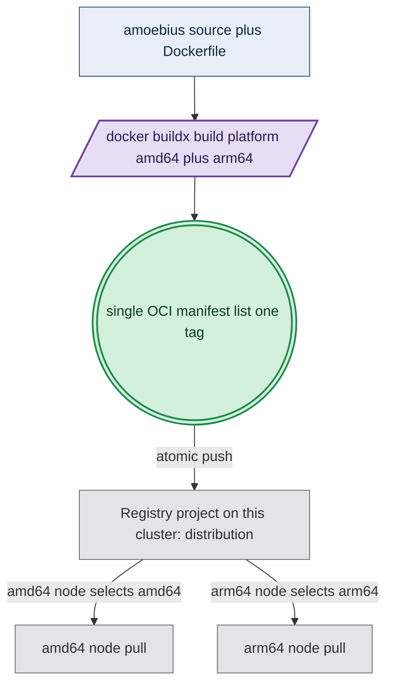

# Image Build & Registry

> **Purpose**: Define how amoebius bakes third-party service binaries into one multi-arch base container and
> builds its own generic runtime image (buildx amd64+arm64), publishes them atomically into the in-cluster
> `distribution` registry (which replaces Harbor), and where the build runs — so every cluster pulls only
> from that registry and every byte is reproducible. Low-code UI programs are immutable release data, not
> application-specific browser or server images.
> **Read this if**: an image has to be built or published, or the question is what is baked versus resolved at runtime.

This document owns the build side of image supply: the typed catalog, the generated build file, multi-arch
publication as one atomic act, and the rule fixing what is baked in. It does not own the registry's existence
as a platform service, owned by
[platform_services_doctrine.md §3](./platform_services_doctrine.md#3-the-registry--the-single-image-source),
nor the runtime asset cache that is the deliberate exception, owned by
[content_addressing_doctrine.md](./content_addressing_doctrine.md).

<details>
<summary>Link-graph metadata</summary>

**Status**: Authoritative source
**Supersedes**: N/A
**Referenced by**: DEVELOPMENT_PLAN/later_phases.md, DEVELOPMENT_PLAN/legacy_tracking_for_deletion.md, DEVELOPMENT_PLAN/overview.md, DEVELOPMENT_PLAN/phase_25_base_image_registry.md, DEVELOPMENT_PLAN/phase_30_platform_backbone.md, DEVELOPMENT_PLAN/phase_31_platform_services_2.md, DEVELOPMENT_PLAN/phase_44_provider_deploy_checkpoint.md, DEVELOPMENT_PLAN/phase_45_provider_child_bringup.md, DEVELOPMENT_PLAN/phase_46_provider_ebs_credential.md, DEVELOPMENT_PLAN/phase_48_determinism_jitcache.md, DEVELOPMENT_PLAN/system_components.md, documents/engineering/README.md, documents/engineering/app_vs_deployment_doctrine.md, documents/engineering/apple_metal_headless_builds.md, documents/engineering/capability_extension_doctrine.md, documents/engineering/content_addressing_doctrine.md, documents/engineering/daemon_topology_doctrine.md, documents/engineering/dsl_doctrine.md, documents/engineering/generated_artifacts_doctrine.md, documents/engineering/lift_and_compose_doctrine.md, documents/engineering/manifest_generation_doctrine.md, documents/engineering/migration_doctrine.md, documents/engineering/monitoring_doctrine.md, documents/engineering/network_fabric_doctrine.md, documents/engineering/platform_services_doctrine.md, documents/engineering/release_lifecycle_doctrine.md, documents/engineering/resource_capacity_construction.md, documents/engineering/resource_capacity_sources.md, documents/engineering/service_capability_doctrine.md, documents/engineering/substrate_doctrine.md, documents/glossary.md, documents/illegal_state/illegal_state_lifecycle.md, documents/illegal_state/illegal_state_techniques.md
**Generated sections**: none

</details>

> **Historical result (invalidated).** Phase-run and implementation-result statements predate the 2026-08-11 reopen unless the owning phase is Done; target doctrine remains normative, and current state is in the [tracker](../../DEVELOPMENT_PLAN/README.md).

## Contents
- [1. Scope — the build side, not the registry's existence](#1-scope--the-build-side-not-the-registrys-existence)
- [2. The single distribution rule: bake the binaries, build the amoebius image, pull only in-cluster](#2-the-single-distribution-rule-bake-the-binaries-build-the-amoebius-image-pull-only-in-cluster)
- [3. buildx multi-arch — `amd64` and `arm64`, one manifest list](#3-buildx-multi-arch--amd64-and-arm64-one-manifest-list)
- [4. Atomic publication — a partial multi-arch upload is a failed upload](#4-atomic-publication--a-partial-multi-arch-upload-is-a-failed-upload)
- [5. Versioning vs `:latest` — DEVELOPMENT_PLAN decision (recommended default: immutable, never `:latest`)](#5-versioning-vs-latest--development_plan-decision-recommended-default-immutable-never-latest)
- [6. Host build vs in-pod build — DEVELOPMENT_PLAN decision (recommended default: host builder for v1)](#6-host-build-vs-in-pod-build--development_plan-decision-recommended-default-host-builder-for-v1)
- [7. What amoebius bakes vs builds — the base container is the supply chain](#7-what-amoebius-bakes-vs-builds--the-base-container-is-the-supply-chain)
- [8. Build mechanics under the no-env / no-`PATH` contract](#8-build-mechanics-under-the-no-env--no-path-contract)
- [9. Bring-up ordering — the registry chicken-and-egg dissolves](#9-bring-up-ordering--the-registry-chicken-and-egg-dissolves)
- [10. Honesty and planning ownership](#10-honesty-and-planning-ownership)
- [Related Documents](#related-documents)

---

## 1. Scope — the build side, not the registry's existence

There are two halves to "containers in amoebius." **That the in-cluster registry exists** — the
single-binary `distribution` registry as a standard service, the single pull source on every cluster — is
owned by [platform_services_doctrine.md](./platform_services_doctrine.md) and
[service_capability_doctrine.md](./service_capability_doctrine.md) (the Registry capability). **How bytes get built, baked, and land in the registry** is owned here. The seam is deliberate: the platform doc says *what*
the registry is; this doc says *how the pipeline feeds it*.

This document is the SSoT for:

1. The multi-arch build mechanism — `buildx`, `amd64`+`arm64`, one OCI manifest list ([§3](#3-buildx-multi-arch--amd64-and-arm64-one-manifest-list)).
2. Atomic publication and the fail-on-partial-upload semantics ([§4](#4-atomic-publication--a-partial-multi-arch-upload-is-a-failed-upload)).
3. The versioning policy — immutable digest-pinned tags vs `:latest` ([§5](#5-versioning-vs-latest--development_plan-decision-recommended-default-immutable-never-latest), a flagged decision).
4. Where the build runs — host buildx daemon vs in-pod builder ([§6](#6-host-build-vs-in-pod-build--development_plan-decision-recommended-default-host-builder-for-v1), a flagged decision).
5. What amoebius **bakes** (third-party service binaries) versus what it **builds** (its own runtime image) —
   the adopted base-container packaging ([§7](#7-what-amoebius-bakes-vs-builds--the-base-container-is-the-supply-chain)).
6. The no-environment-variable / no-`PATH` build mechanics and credential handling ([§8](#8-build-mechanics-under-the-no-env--no-path-contract)).

What this doctrine deliberately does **not** own:

| Concern | Owned by |
|---------|----------|
| The in-cluster registry (`distribution`) as a standard service and the sole pull source | [platform_services_doctrine.md](./platform_services_doctrine.md), [service_capability_doctrine.md](./service_capability_doctrine.md) |
| The registry's MinIO-backed (S3 driver) blob storage — no PV of its own | [platform_services_doctrine.md §3](./platform_services_doctrine.md#3-the-registry--the-single-image-source), [§4](./platform_services_doctrine.md#4-minio--the-object-substrate) |
| The substrate catalog, universal `linux-cpu` lane, Incus/Lima/WSL2 guests, host worker nodes, and the lazy-tool-ensure contract | [substrate_doctrine.md](./substrate_doctrine.md) |
| The Apple-Metal host worker's headless, on-host, **no-VM** build/run shape (fixed Metal bridge + runtime MSL compilation) | [apple_metal_headless_builds.md](./apple_metal_headless_builds.md) |
| Pulumi-managed cloud registries/infra, the MinIO Pulumi backend, DNS (route53) + TLS (zerossl) | [pulumi_iac_doctrine.md](./pulumi_iac_doctrine.md) |
| The content-addressed **workflow-artifact** store (`experimentHash`, pointers→manifests→blobs) — distinct from OCI image digests | [content_addressing_doctrine.md](./content_addressing_doctrine.md) |
| Cluster bring-up ordering, amoebic spawn, and teardown | [cluster_lifecycle_doctrine.md](./cluster_lifecycle_doctrine.md) |
| Image refs and registry credentials as DSL values / secrets-by-name | [dsl_doctrine.md](./dsl_doctrine.md), [vault_pki_doctrine.md](./vault_pki_doctrine.md) |

This generalizes the pipeline proven in `prodbox`'s `local_registry_pipeline.md`. Where a behaviour is
inherited from prodbox, that is *evidence from a sibling system*, not proof in amoebius ([§9](#9-bring-up-ordering--the-registry-chicken-and-egg-dissolves)).

---

## 2. The single distribution rule: bake the binaries, build the amoebius image, pull only in-cluster

Every byte the cluster runs is either **baked into the amoebius base image** (every third-party service
binary) or **built by amoebius** (its own runtime image), then published once into the cluster's own
in-cluster registry. **No workload ever pulls from a public registry.** This is the strongest form of
the supply-chain guarantee: amoebius controls every byte, does not depend on upstream availability or
rate limits, and a warm cluster is air-gapped by construction.

- **Third-party service binaries are baked, not mirrored.** amoebius does not pull or mirror public *images*
  for the platform services. Each service's binary is installed into the multi-arch base image at build time
  — preferring `apt`, then an official binary/tarball, then build-from-source ([§7](#7-what-amoebius-bakes-vs-builds--the-base-container-is-the-supply-chain)) — so the running workload
  is amoebius's own image carrying a trusted binary, not someone's public container. The only contact with
  upstream is the **base-image build** downloading those binaries/packages on the builder, never an
  in-cluster pull. This reverses prodbox's mirror-into-registry model (`local_registry_pipeline.md` [§5](#5-versioning-vs-latest--development_plan-decision-recommended-default-immutable-never-latest)).
- **The in-cluster registry is `distribution`, not Harbor.** The registry every workload pulls from is the
  single-binary `distribution` (`registry:2`) OCI registry — itself a baked binary ([§7](#7-what-amoebius-bakes-vs-builds--the-base-container-is-the-supply-chain)) — which **replaces Harbor**. It serves amoebius-built images — the base image and every `Runtime` variant
  ([§5](#5-versioning-vs-latest--development_plan-decision-recommended-default-immutable-never-latest)); it is *not* a
  pull-through mirror of public registries, because once binaries are baked there is nothing to mirror.
  *Which* provider backs the Registry capability is owned by
  [service_capability_doctrine.md](./service_capability_doctrine.md); this doc owns the build/publish side.
- **The image-ref scheme is registry-project-qualified.** amoebius-built images are named under the
  cluster's registry project, reached at the host-only registry endpoint. This doc owns the *naming* and the
  fact that the runtime is pointed at the in-cluster registry; the per-distro plumbing that makes that
  endpoint resolve on each node (RKE2 `registries.yaml` rewrite, a cloud-substrate containerd-mirror
  DaemonSet) is a substrate detail owned by [substrate_doctrine.md](./substrate_doctrine.md). prodbox's
  `local_registry_pipeline.md` [§4](#4-atomic-publication--a-partial-multi-arch-upload-is-a-failed-upload) is the precedent (generalized from Harbor to `distribution`).
- **Substrate-equivalent image refs.** The build pipeline produces one ref set used on every substrate;
  there is no "cloud-only" or "no-registry" variant. The *image refs* never vary by substrate (the structural
  check is owned by [platform_services_doctrine.md §12](./platform_services_doctrine.md#12-substrate-equivalence-as-a-structural-invariant)); per-cluster
  *deployment shape* may vary, but that is a manifest concern owned by
  [service_capability_doctrine.md](./service_capability_doctrine.md), not an image-ref one.

---

## 3. buildx multi-arch — `amd64` and `arm64`, one manifest list

amoebius runs on both x86 substrates (linux-cpu / linux-cuda, typically `amd64`) and Apple-Silicon hosts
(`arm64`). A single-arch image would mean "this image only runs where it was built" — fatal for a
fungible, spawn-anywhere cluster. So **every amoebius-built image is multi-arch** — the resolved answer to
an open design question of whether amoebius should always use buildx to build multi-arch containers.

Concretely:

- **One `docker buildx` invocation builds both architectures** with `--platform linux/amd64,linux/arm64`.
  The result is a single **OCI manifest list** (a "fat manifest") under one tag; the container runtime on a
  node selects the matching arch automatically at pull time.
- **Native build per arch where possible, cross-build otherwise.** A buildx builder backed by both an
  `amd64` and an `arm64` node builds each arch natively; a single-arch host cross-builds the other arch
  (QEMU emulation or a cross-toolchain). The host-vs-pod choice ([§6](#6-host-build-vs-in-pod-build--development_plan-decision-recommended-default-host-builder-for-v1)) determines which builder backs the
  build; the *output contract* — one fat manifest covering both arches — is identical either way.
- **Both architectures use one dynamically resolved toolchain graph.** The current compatible compiler and
  packages are resolved once per run and used for both `amd64` and `arm64`. The external attestation records
  both observations and rejects per-architecture dependency drift; no resolution file is committed.

This is the principal generalization over prodbox, which published **native-host-architecture images only**
(`local_registry_pipeline.md` [§6](#6-host-build-vs-in-pod-build--development_plan-decision-recommended-default-host-builder-for-v1) step 4, [§3](#3-buildx-multi-arch--amd64-and-arm64-one-manifest-list)). amoebius lifts native-host-architecture-only builds to always building
both arches as one manifest list.

Diagram vocabulary: [diagram_conventions.md](./diagram_conventions.md).


```mermaid
flowchart TD
%% register: algebra
  src["amoebius source plus Dockerfile"]:::intent --> bx[/"docker buildx build platform amd64 plus arm64"/]:::effect
  bx --> ml((("single OCI manifest list one tag"))):::seal
  ml -->|atomic push| reg["Registry project on this cluster: distribution"]:::runtime
  reg -->|amd64 node selects amd64| amd["amd64 node pull"]:::runtime
  reg -->|arm64 node selects arm64| arm["arm64 node pull"]:::runtime
  classDef intent   fill:#e8eef7,stroke:#33587a,color:#12283f,stroke-width:1px
  classDef effect   fill:#e7ddf5,stroke:#6b3fa0,color:#2f1a52,stroke-width:2px
  classDef seal     fill:#d3f0dd,stroke:#1f8a4c,color:#0c3a1f,stroke-width:2px
  classDef runtime  fill:#e4e4e7,stroke:#71717a,color:#2f2f35,stroke-width:1px
```

*Design intent. The buildx build is the effectful seam and the manifest list its sealed success artifact; the running registry and the amd64/arm64 node pulls are runtime-checked, not proven here.*

---

## 4. Atomic publication — a partial multi-arch upload is a failed upload

An open design question asks directly whether a multi-arch publish should fail on both arches if only one
upload fails. amoebius's doctrine answer is **yes — fail closed, atomically.**

A multi-arch tag that resolves on `amd64` but 404s on `arm64` breaks reproducibility on that arch: the
cluster looks healthy until an `arm64` node tries to schedule the pod. A half-published tag fails at schedule
time on the missing arch, not at publish time. So amoebius treats a multi-arch image as one indivisible artifact:

- **Both arches publish under one `buildx ... --push` of the manifest list, or the publication fails.**
  amoebius does not push per-arch tags separately and stitch a manifest afterward. The single push either
  lands the complete manifest list or errors; there is no intermediate state where one arch is live and the
  other is missing.
- **A failed publication leaves the tag un-advertised.** On partial/failed push, amoebius does not record
  the tag as published; downstream reconcile treats the image as not-yet-available and will not deploy a
  workload against it. (This mirrors prodbox's "push custom images only when the Harbor target for the
  current architecture is missing," generalized to "the tag is published only when *every* target arch is
  present.")
- **Re-run is idempotent.** Because publication is all-or-nothing and the published-set is derived from
  what the registry actually holds, re-running the build after a failure re-attempts the whole manifest list; a
  fully-present tag is a no-op. This is the build-side reading of the project-wide idempotent-reconcile
  posture.
- **Transient registry unavailability is retried, then fails loud.** A flake during push is retried against
  the same source; a persistent failure surfaces as an error, never as a silently-skipped arch. amoebius
  inherits prodbox's retry-then-fail-loud publication posture (`local_registry_pipeline.md` [§5](#5-versioning-vs-latest--development_plan-decision-recommended-default-immutable-never-latest)); for its
  multi-arch images the unit of success is the complete manifest list.

> **Validated boundary.** Phase 25 exercised a proxy-induced partial-blob fault, observed the immutable tag
> absent and its manifest GET at 404, retained the partial residue in storage accounting, then published the
> exact audited two-architecture index with one final raw-index advertisement. A second run made zero
> mutating registry requests. This tests the amoebius fail-closed publication mechanism for that Register-3
> envelope; it does not claim that arbitrary registries provide transactions.

---

## 5. Versioning vs `:latest` — DEVELOPMENT_PLAN decision (recommended default: immutable, never `:latest`)

This is an explicitly open design question: whether to implement a versioned tagging system or just use
`:latest`. It is flagged here as a
[DEVELOPMENT_PLAN](../../DEVELOPMENT_PLAN/README.md) decision (Phase 25); this section records the **trade and the recommended default**, not a frozen mechanism.

amoebius's core properties are fungibility and reproducibility — a cluster that was destroyed must rebind to
*byte-identical* shape when rebuilt, and a spawned child must run the *same* bytes
as its parent ([platform_services_doctrine.md §1](./platform_services_doctrine.md#1-the-invariant-every-cluster-is-the-same-cluster)). A floating `:latest`
tag is mutable by definition: two pulls of `:latest` at different times can return different bytes. That
directly contradicts fungibility.

**Recommended default: immutable, content-derived image references — `:latest` is forbidden for amoebius-owned images in cluster specs.**

- **The image set itself is closed, and identity is separate from version.** *Which image this is* is a
  named catalog identity; *which build of it* is the tag+digest the rest of this section governs.

  ```text
  ImageIdentity =
    < KindNode                                  -- host-pulled, pre-cluster, outside the in-cluster boundary
    | Base                                      -- the multi-arch third-party-binary base image (§7)
    | Runtime : { linkedAdapters : Set ExtensionId }
        -- the generic executable plus exactly this trusted server/workload adapter set
    >   -- closed: no Foreign arm, no free digest, no Url; not authorable by an app .dhall
  ```

  An app therefore has no image of its own to name. A declarative `UiSource` and its checked client/server
  plans are immutable `Release` inputs interpreted by the generic runtime; only a genuinely new trusted
  Haskell adapter can change `linkedAdapters`. Thus "run this foreign image" and "compile this app's raw
  browser bundle" have no syntax and fail before any binary runs. This is the same closure move
  [service_capability_doctrine.md §4.1](./service_capability_doctrine.md#41-the-inferenceengine-capability--the-engine-is-target-offering-selected-and-jit-resolved-never-authored)
  already makes for `EngineRuntime`, applied to images; the general rule that such unions close *because
  every arm is a named catalog identity* is owned there and is not restated here. `KindNode` is a distinct
  arm rather than an omission: the kind node-container image is pulled by the host docker before any cluster
  exists, so it sits outside the [§2](#2-the-single-distribution-rule-bake-the-binaries-build-the-amoebius-image-pull-only-in-cluster)
  no-public-pull boundary and must be nameable without being amoebius-built.
- **Each build is published under an immutable tag and is consumed by digest.** A workload spec pins an
  image by its immutable identity (tag + digest), so "what runs" is a fixed, reproducible value — never
  "whatever `:latest` happens to be." prodbox's precedent derives a deterministic tag from machine identity
  (`local_registry_pipeline.md` [§3](#3-buildx-multi-arch--amd64-and-arm64-one-manifest-list)); amoebius generalizes to a deterministic, source/content-derived tag so
  that the same inputs produce the same advertised reference.
- **`:latest` is not used as a deployment reference.** A mutable convenience tag may exist as a *pointer*,
  but no cluster `.dhall` denotes a workload by `:latest`. Whether the type layer makes a `:latest`
  deployment reference outright **unrepresentable** is owned by
  [illegal_state_catalog.md](../illegal_state/illegal_state_catalog.md); this doc owns only the policy that immutable
  references are the default.
- **This is distinct from the content-addressed workflow store.** OCI image digests (registry-native) are
  not the `experimentHash`-keyed MinIO artifact store. They rhyme — both are "identify bytes by their
  content" — but the workflow store is owned by
  [content_addressing_doctrine.md](./content_addressing_doctrine.md) and must not be conflated with image
  tags here.

The open part the plan must resolve: the exact tag-derivation scheme (pure source hash vs build-input hash
vs a release calendar) and whether amoebius keeps a floating pointer tag at all.

---

## 6. Host build vs in-pod build — DEVELOPMENT_PLAN decision (recommended default: host builder for v1)

The second open design question: whether the amoebius pod itself eventually takes over container builds, or
that continues to be a host-daemon responsibility. Flagged as a
[DEVELOPMENT_PLAN](../../DEVELOPMENT_PLAN/README.md) decision; recommended default below.

A builder needs a Docker/buildx engine *somewhere*. Two homes are possible — the host's
build daemon (the prodbox model: `docker build` on the host, `local_registry_pipeline.md` [§6](#6-host-build-vs-in-pod-build--development_plan-decision-recommended-default-host-builder-for-v1)) or an in-pod
builder running inside the cluster. The vision states the argument for host directly: a host
builder is "guaranteed to keep all builds in the same place" — including Apple-Silicon native `arm64`
container images. (Two build kinds must not be conflated: the native `arm64` **container image** build on
macOS runs against a Linux docker engine — a Lima/Colima VM, [substrate_doctrine.md §4](./substrate_doctrine.md#4-virtualized-substrates-synthesizing-a-linux-host-where-the-host-is-not-linux) — whereas the
**no-VM** property of [apple_metal_headless_builds.md](./apple_metal_headless_builds.md) is the *Metal worker*
build, on-host MSL compilation, not the container image.)

**Recommended default: the host builder for v1.**

- **The builder is an execution unit, not free host overhead.** Every build carries a pure
  `BuildExecutionEnvelope`:

  ```text
  BakeStep =
    < AptPackage         : { name : Text, pinnedVersion : Text }
    | OfficialTarball    : { identity : CatalogId, sha256 : Text }
    | SourceBuild        : { identity : CatalogId, recipe : BuildRecipe }
    | InstallBinary      : { from : BuildStageId, path : AbsPath, mode : FileMode }
    | CopyGeneratedAsset : { producer : GeneratedArtifactId }
    >   -- closed: there is no RunShell : Text arm, and no Url arm

  BuildStageDemand =
    { id                    : BuildStageId
    , platform              : OsArch
    , dependsOn             : List BuildStageId
    , content               : NonEmpty BakeStep
    , runtime :
        { cpuReservation    : Quantity Cpu
        , cpuCeiling        : Quantity Cpu
        , memoryReservation : Quantity Bytes
        , memoryCeiling     : Quantity Bytes
        }
    , peakIntermediateBytes : Quantity Bytes
    , peakCacheWriteBytes   : Quantity Bytes
    }

  BuildExecutionEnvelope =
    { id : BuildExecutionId
    , stages : NonEmpty BuildStageDemand
    , scratchBacking : HostStorageBackingId
    , cache : HostCacheDemand
    , cacheEquality : cache.source == ImageBuild id
    , archConcurrency : < Serial | BoundedParallel : PositiveNatural >
    , stageConcurrency : < Serial | BoundedParallel : PositiveNatural >
    }
  ```

  The stage graph is non-empty, closed over `dependsOn`, and acyclic. **Each stage's `content` is a non-empty list of typed `BakeStep`s, and those steps are the only way bytes enter an image.** The union's
  arms are exactly the [§7](#7-what-amoebius-bakes-vs-builds--the-base-container-is-the-supply-chain)
  preference ladder — `AptPackage`, then `OfficialTarball`, then `SourceBuild` — plus the two intra-build
  moves (`InstallBinary` from an earlier stage, `CopyGeneratedAsset` from a
  [generated_artifacts_doctrine.md](./generated_artifacts_doctrine.md) renderer). There is **no `RunShell : Text` arm and no `Url` arm**: an interpolated shell fragment and an operator-supplied download
  address are both unrepresentable, so the interior of an image is typed data rather than a template that
  becomes a filesystem only when it runs. Binding enumerates every dependency-
  valid simultaneous stage set admitted by the separate architecture and stage concurrency policies, derives
  the maximum runtime, intermediate-layer workspace, and cache-write delta, and proves it fits the host/
  engine-VM CPU, memory, scratch, and cache carves. The cache obligation is `observed residents + derived
  concurrent write delta ≤ CacheBudget ≤ physical cache carve`; a ceiling without a write-demand operand is
  not admission evidence. There is no editable aggregate capable of hiding one expensive stage.
  `scratchBacking` resolves exactly once to a physical `HostStoragePool` tagged `BuildScratch`; the cache
  resolves exactly once to a `HostCachePool`. If their carves share a physical disk, their peaks are debited
  together under that disk's single parent. A retained cache consumes its observed resident bytes until an
  observed GC removes them; the fold never assumes a cache hit, eviction, or reclaim.
- **Build admission is snapshot-bound and precedes `buildx`.** Immediately before the first builder process,
  amoebius observes host/engine-VM residual CPU, memory, backing allocations, current build-cache residents,
  and other live build/VM/process commitments; derives the whole multi-arch transition peak; and mints a
  single-use token bound to that fingerprint. Any mismatch, unknown commitment, or changed fingerprint
  refuses with zero `buildx`/BuildKit execution and zero cache/scratch mutation. The runtime ceiling is
  enforced on the BuildKit worker/cgroup or engine-VM boundary rather than treated as an estimate.
- **Why host first.** amoebius already requires a sudo-capable host daemon and host build tooling for
  bootstrap; the host is where Apple-Silicon native `arm64` container images are built (against a Linux docker
  engine in a Lima/Colima VM, [substrate_doctrine.md §4](./substrate_doctrine.md#4-virtualized-substrates-synthesizing-a-linux-host-where-the-host-is-not-linux); the Metal *worker* build is separately
  on-host, no VM — [apple_metal_headless_builds.md](./apple_metal_headless_builds.md)), and a single host build
  location keeps arch coverage and build caches in one predictable place. This matches the substrate model
  in which host worker nodes exist precisely for substrate-specific hardware
  ([substrate_doctrine.md](./substrate_doctrine.md)).
- **Why in-pod is the eventual target, not the v1 default.** An in-pod builder removes the host build
  dependency for cloud-managed substrates that have no operator host (the Phase 44 stateless in-cluster
  daemon). The cost is a builder pod that needs privileged build access and its own multi-arch story —
  deferred, not adopted by default.
- **The build location does not change the output contract.** Wherever it runs, the builder emits the [§3](#3-buildx-multi-arch--amd64-and-arm64-one-manifest-list)
  manifest list and publishes under [§4](#4-atomic-publication--a-partial-multi-arch-upload-is-a-failed-upload) atomic semantics. A future host→pod migration is a builder-backend
  swap behind the same publish contract, not a re-architecture of distribution. The
  `BuildExecutionEnvelope` accounts for execution; the resulting platform-indexed `ImageArtifact` records OCI
  index/child-manifest/config/compressed-layer stored bytes, snapshot chain ids/unpacked bytes, and peak import
  workspace. The node-storage fold deduplicates content objects and snapshots in their distinct identity
  domains under its pinned runtime model. Neither provision may stand in for the other.

The open part the plan must resolve: when (if ever) the in-cluster daemon takes over builds, and how an
in-pod builder reproduces the host's multi-arch coverage (especially Apple-Silicon `arm64`).

---

## 7. What amoebius bakes vs builds — the base container is the supply chain

An open design question asked whether to put *"one big amoebius container with everything in it including
3rd party services … into basecontainer."* The operator has now **adopted** exactly that: the third-party
services are **baked**, not mirrored. The two classes this section governs — the base image and the runtime
image — are the two amoebius-built arms of the closed
[§5](#5-versioning-vs-latest--development_plan-decision-recommended-default-immutable-never-latest)
`ImageIdentity`; there is no third, app-supplied class. A low-code app supplies a checked program to a generic
`Runtime` variant rather than an image or executable of its own.

### The amoebius base image carries every third-party service binary

Vault, MinIO, Pulsar, **Redis (`redis-server`, including Sentinel mode and `redis-cli`)**, Keycloak,
Prometheus/Grafana, the **alert receiver** that holds the firing set for the `Observability` capability,
**TensorBoard** (the jitML monitoring surface, baked like Grafana and never fetched at
pod startup — [monitoring_doctrine.md](./monitoring_doctrine.md)), Patroni/Postgres, Envoy, cert-manager,
MetalLB, the `distribution` registry, and provider-only infrastructure binaries such as the AWS EBS CSI
controller/node implementation and its required sidecars are installed into the multi-arch base image at
build time, by a strict preference ladder:
1. **`apt`** where an official package exists (Vault, Grafana, FRR, Redis, Postgres/pgBouncer/pgBackRest,
   code-server, pgAdmin, curl/busybox, …).
2. **official multi-arch binary/tarball** otherwise (MinIO/mc, `distribution`, the Prometheus stack,
   Thanos, the Envoy-gateway control plane + the Envoy data plane, cert-manager, MetalLB, kube-rbac-proxy,
   the Percona operator, the exporters).
3. **build-from-source** only as a last resort, adding the language as a first-class build target. The one
   new toolchain required is a **multi-arch Temurin JRE/JDK** for the JVM services (Keycloak,
   keycloak-config-cli, Pulsar+ZooKeeper+BookKeeper) — which are a tarball + a per-arch JRE, not source
   builds. Envoy's data plane is taken as an **official binary** (its from-source path is Bazel, which
   amoebius does not adopt). Go/Rust/C/Node/Python toolchains are already present in the base image.

### The runtime image: one recipe, a family of trusted-adapter variants

The amoebius Haskell binary ships as its own runtime image, built with the run's dynamically resolved
compatible compiler. Its **in-cluster pod role** is
selected as control-plane singleton, dedicated `amoebius-capacity` scheduler, or worker — adapting prodbox's
union-image pattern (`local_registry_pipeline.md`
[§6](#6-host-build-vs-in-pod-build--development_plan-decision-recommended-default-host-builder-for-v1)). The
CLI and sudo host daemon are contexts of the same executable outside that pod-role list; a CLI is not a
pod-level runtime role. The generic worker roles include UI server and UI projection responsibilities.
infernix and jitML are linked in as extension libraries, not separate images. An optional trusted app
adapter may also be linked when the existing handler catalog cannot satisfy a UI port; the app's `UiSource`
and client plan never are. That boundary is owned by
[capability_extension_doctrine.md §2](./capability_extension_doctrine.md#2-three-extension-kinds-workload-capability-and-app)
and
[low_code_ui_runtime_doctrine.md §13](./low_code_ui_runtime_doctrine.md#13-generic-purescript-client-and-amoebius-ui-server).

Each `Runtime` arm is indexed by its `linkedAdapters` set, so the *recipe* is one and the *variants* are
bounded by trusted code, not by the number of declarative apps. A program-only app change mints a new
`ProgramDigest` and `Release`, but reuses the exact runtime image digest. Two consequences are load-bearing.
First, the control-plane and generic UI runtime **cannot be perturbed by a program-data change** — there is
no app relink, so the singleton's `strategy: Recreate` pod
([daemon_topology_doctrine.md §3](./daemon_topology_doctrine.md#3-the-control-plane-singleton))
is untouched. Second, when a trusted adapter really is added, the link-time merge obligations of
[capability_extension_doctrine.md §6](./capability_extension_doctrine.md#6-the-merge-total-acyclic-anti-shadow)
are discharged **per variant** over a small reviewed set, not globally over every UI program at once.
Variants share their common layers by digest
([resource_capacity_doctrine.md](./resource_capacity_doctrine.md)).

### The browser payload is one generic interpreter, not one bundle per app

The runtime image carries the versioned PureScript interpreter, trusted component catalog, and immutable
static serving machinery. A release supplies a generated `ClientPlan` envelope and content manifest for that
interpreter. No Docker layer is rebuilt merely because a route, view, form, workflow binding, or model
interaction changes; only a runtime/catalog ABI change rebuilds the image. Generated client plans and
minimal entry artifacts remain non-committed release artifacts under
[generated_artifacts_doctrine.md](./generated_artifacts_doctrine.md).

### The infernix/jitML engine runtimes are jit-resolved, not baked

What the base image *does* bake for the ML layer is the **jit-build resolver and its build toolchain** — the
Linux source-build inputs (`nvcc`, `g++`, the pinned compilers) the resolver needs to build an engine from
source on a cache miss. The **Apple-Metal bridge is not among the baked inputs**: it is a macOS Mach-O
**host-resident** dylib source-built headless *on the Apple host* with `/usr/bin/clang` in the
apple-substrate phase (Phase 53 —
[apple_metal_headless_builds.md §1](./apple_metal_headless_builds.md#1-the-commitment-headless-on-host-no-vm),
[§3.1](./apple_metal_headless_builds.md#31-fixed-host-metal-bridge)) and **cannot run in a Linux container or a Linux VM**, so it is **never baked into the multi-arch `linux/amd64`+`arm64` base image** — the base
image bakes only the Linux resolver toolchain, and the Metal bridge is a Phase-53 on-host build. The engine
*payloads* themselves (`llama.cpp`, `whisper.cpp`, the ONNX runtime, Audiveris, the adapters) are **named catalog identities** the shared `jit-build` resolver **downloads-or-builds on first miss into the `CacheBudget`-bounded content-addressed cache** — none is baked into the image, and none is authored by URL.
Because infernix and jitML link as extension libraries (bullet above), the *library* is present the moment
the pod is; the *engine payload* it drives is cache-resident after the first resolve. This explicitly
**replaces infernix's per-engine Poetry-venv + `curl`-tar-at-build** shape with the one shared
resolve-on-miss path. The *type-level* guarantee — `EngineRuntime` is a closed, substrate-selected,
named-identity union with **no arbitrary-`Url`/`Download` arm (type-foreclosed)**, resolved into a bounded
cache — and the full one-cache-shape asset lifecycle are owned by
[content_addressing_doctrine.md §4.5](./content_addressing_doctrine.md#45-the-ml-asset-lifecycle-one-bounded-content-addressed-cache-resolved-on-first-miss)
and
[service_capability_doctrine.md §4](./service_capability_doctrine.md#4-capability--provider--shape-the-binding);
this doc owns only the build-side fact that the **resolver and its toolchain** land in the base image.
*Sibling evidence, not an amoebius result:* infernix's `docker/Dockerfile` `curl`-tars the native payloads
and installs per-engine venvs at IMAGE BUILD — amoebius drops the bake-the-payload move for the one
resolve-on-miss path. Read as design intent for the ML phase, not a tested amoebius result.

### A resolved engine is a content-addressed cache asset, not OCI-digest bytes

With the engine jit-resolved, all three ML-asset kinds — engine, model, kernel — live in the
**content-addressed cache / workflow store**, keyed by content-address (`CacheBudget`-bounded for the
resident cache), never by the `experimentHash` of an ML run or the `releaseHash` of a deployment generation.
What the base image contributes by **OCI image digest**
([§5](#5-versioning-vs-latest--development_plan-decision-recommended-default-immutable-never-latest)) is the
platform-service binaries and the **jit-build resolver + toolchain**; the ML engine payloads, the models
(Tier 2 `ModelArtifact`), and the JIT kernels (Tier 3, `kernelKey`) are the *content-addressed* tiers owned
by [content_addressing_doctrine.md](./content_addressing_doctrine.md). The
[§5](#5-versioning-vs-latest--development_plan-decision-recommended-default-immutable-never-latest)
separation of OCI image digests from the content-addressed store therefore extends to all three ML tiers:
base image (services + resolver) = image digest; engine / model / kernel = content-addressed cache/store
hash.

### The monocontainer build must prove Redis is present

Redis is a mandatory `BakeCatalog` member, not an illustrative package-preference example. The catalog pins a
Redis version and per-architecture package/repository identity, installs `redis-server` and `redis-cli` in the
runtime stage, and records their file digests in the baked inventory/SBOM. Sentinel uses the same
`redis-server` executable with a generated Sentinel configuration; no separate upstream container is pulled.

The generated Dockerfile must contain only the typed Redis bake step emitted from that catalog. The
monocontainer build fails unless an architecture-native container invocation of
`/usr/bin/redis-server --version` and `/usr/bin/redis-cli --version` matches the pinned catalog version and the
expected absolute paths. The multi-arch publication gate runs both probes on `linux/amd64` and `linux/arm64`,
checks the SBOM/digest inventory, and verifies that the Redis/Sentinel manifests use the published
monocontainer digest. A public `redis` image reference, a startup download, a missing CLI, a version mismatch,
or a Dockerfile hand edit is a gate failure.

**The seam to extend is already proven in hostbootstrap.** Baking a service binary is the same move
hostbootstrap already uses for Go/helm/mc/pulumi — a mechanism amoebius reuses for its own baked binaries,
though it does **not** bake `helm` ([manifest_generation_doctrine.md §1](./manifest_generation_doctrine.md#1-why-this-doctrine-exists-types-render-manifests-helm-does-not)):
add a per-arch asset map + a version resolver + a
`<SVC>_DOWNLOAD_URL` field in `hostbootstrap/hostbootstrap/base_image.py`, and a matching
`ARG <SVC>_DOWNLOAD_URL` + `RUN … && install -m0755 … /usr/local/bin/<svc>` block in
`hostbootstrap/docker/basecontainer.Dockerfile` (which stays logic-free — every per-arch value is an ARG
resolved on the host). Each baked binary also becomes a constructor of the closed `HostBootstrap.HostTool`
enum (absolute-path `AbsExe`, probe-first `Ensure` reconcile), so it is discovered by full path, never via
`PATH`.

For amoebius, that sibling seam informs the implementation but does not become a second source of truth:
`dhall/amoebius/BakeCatalog.dhall` is authoritative and emits the uncommitted Dockerfile. Redis is added to
that catalog and its independent expected-service inventory; editing only a handwritten basecontainer file is
non-conforming.

**Harbor is retired.** The one service that did not fit a single binary — Harbor, a ~6-process registry
stack — is replaced by the single-binary `distribution` registry ([§2](#2-the-single-distribution-rule-bake-the-binaries-build-the-amoebius-image-pull-only-in-cluster)), so no third-party service resists
baking. The per-service apt/binary/source classification and the full inventory live with the
platform-services adoption work in
[../../DEVELOPMENT_PLAN/README.md](../../DEVELOPMENT_PLAN/README.md).

---

## 8. Build mechanics under the no-env / no-`PATH` contract

The host-side build orchestrator accepts no ambient-environment configuration and never searches host `PATH`.
It discovers tools lazily through the substrate's package manager and invokes them by full path
([../../DEVELOPMENT_PLAN/README.md](../../DEVELOPMENT_PLAN/README.md) cross-cutting invariants; [substrate_doctrine.md](./substrate_doctrine.md)). The build pipeline lives entirely under that contract,
which forces a concrete divergence from prodbox's mechanics:

- **The Docker/buildx binary is full-path-invoked, lazily ensured.** amoebius does not rely on a `docker`
  on `PATH`; it ensures the engine via the substrate package manager and calls the resolved absolute path.
  The lazy-ensure contract is owned by [substrate_doctrine.md](./substrate_doctrine.md); this doc owns only
  that the build step obeys it.
- **No `DOCKER_CONFIG` environment variable — use `docker --config <dir>`.** prodbox isolated registry-push
  auth from public-pull auth with an **ephemeral `DOCKER_CONFIG`** (`local_registry_pipeline.md` §6.1).
  That mechanism is an environment variable, which amoebius forbids. amoebius instead points the build at an
  ephemeral config directory via the `docker --config <ephemeral-dir>` global flag (which also locates
  buildx state), achieving the same isolation **without** an env var. The directory is created per build,
  used for the flow, and scrubbed afterward.
- **No `docker login`; credentials are secrets-by-name.** amoebius never runs `docker login` and never
  writes the operator's global Docker config. The ephemeral config directory holds the registry push
  credential — **not a literal in Dhall** — resolved as a `SecretRef` from Vault at build time
  (secrets-never-live-in-Dhall, [vault_pki_doctrine.md](./vault_pki_doctrine.md); [dsl_doctrine.md](./dsl_doctrine.md)). This is the amoebius generalization of prodbox's inline-registry-auth
  mechanism, which used a literal credential; amoebius keeps the *ephemeral-config-no-login* shape but sources
  the credential from Vault by name. (Public-registry auth for in-cluster pulls is moot — there are none.)
- **In-cluster pulls never consult a Docker config.** Nodes reach the in-cluster registry credential-free
  through the substrate's registry wiring ([substrate_doctrine.md](./substrate_doctrine.md)); the ephemeral
  config is a *build-time* concern only.

---

## 9. Bring-up ordering — the registry chicken-and-egg dissolves

prodbox had a real chicken-and-egg: it could not publish into a Harbor that was not yet up, and Harbor could
not come up if its own prerequisite images could only be pulled from a Harbor that did not yet exist.
**Baking plus one typed action dissolves this.** The registry is the single-binary `distribution`, baked into
the base image, so there is no pre-registry public pull and no third-party image mirror. But Phase 25 still
precedes the full scheduler/reconciler deployment and therefore cannot pretend a standalone service is a
whole `ProvisionedSpec`. It constructs an explicit resource-complete `ProvisionedBootstrapRegistry`, validates
it against a fresh Phase-24 snapshot, and mints a single-use `BootstrapRegistryAction` that side-loads the
image and initializes only the exact registry/proxy object domain. The action uses the same package-private
source serializer as `renderAll`; it exposes no public per-service renderer. Enactment CAS-consumes its
snapshot-indexed token and returns a receipt on both applied and ambiguous outcomes; an ambiguous response
permits only fresh node-image/API-object observation, never replay.

The provision retains a canonical identity/source/initialized-field handoff digest. The later
whole-deployment `ProvisionedSpec` may adopt those objects only after live equality readback and a one-time
typed ownership transfer, without a second writer or delete/recreate. The later storage edge — registry blobs
move to MinIO's S3 driver after MinIO is serving
([platform_services_doctrine.md §11](./platform_services_doctrine.md#11-bring-up-and-dependency-ordering)) —
is a separate ordinary migration, not this bootstrap cycle. This doc records the build-side consequence:

- **The base image is built and side-loaded before registry object initialization.** Phase 24's empty cluster
  already exists. The only upstream contact is the base-image *build* (apt/binary/source downloads on the
  builder, [§2](#2-the-single-distribution-rule-bake-the-binaries-build-the-amoebius-image-pull-only-in-cluster)/[§7](#7-what-amoebius-bakes-vs-builds--the-base-container-is-the-supply-chain)); once that image is admitted and side-loaded, the registry/proxy
  run from it with no public pull. The cluster-bring-up readiness edge
  ("the in-cluster registry up before later app-image pulls") is owned by
  [platform_services_doctrine.md §11](./platform_services_doctrine.md#11-bring-up-and-dependency-ordering).
- **amoebius-built `Runtime` variants publish *after* the registry is healthy.** [§3](#3-buildx-multi-arch--amd64-and-arm64-one-manifest-list)–[§6](#6-host-build-vs-in-pod-build--development_plan-decision-recommended-default-host-builder-for-v1) publication of the
  generic runtime and any trusted-adapter variants runs once the registry is serving. UI programs and client
  plans publish through the immutable release/content path, not the OCI image path. Readiness gating (probes, capability
  checks before any image write) follows the prodbox readiness contract (`local_registry_pipeline.md` §2.1)
  and is a cluster-lifecycle/platform concern, not owned here.
- **The ownership handoff is equality-gated.** Initializing the bootstrap objects records their exact
  identities and initialized fields. Whole-deployment reconciliation begins owning them only after observing
  the matching digest; mismatch or repeated handoff is a typed no-write rejection, never an opportunistic SSA
  takeover.
- **Cluster-bring-up sequencing, amoebic spawn, and teardown** are owned by
  [cluster_lifecycle_doctrine.md](./cluster_lifecycle_doctrine.md). A spawned child runs the same baked base
  image and warms its own registry by the same publish pipeline — the build doctrine is identical for parent
  and child because clusters are fungible (platform [§1](./platform_services_doctrine.md#1-the-invariant-every-cluster-is-the-same-cluster)).

---

## 10. Honesty and planning ownership

> **Validated Phase-25 boundary.** Sprints 25.1–25.2 live-validated the typed bake catalog, generated Dockerfile, bounded
> host build, one `linux/amd64` + `linux/arm64` OCI index, architecture-native executable probes,
> deterministic file SBOMs, selected-platform node side-load, resource/storage-complete bootstrap action, and
> exact six-object `distribution`/mutation-proxy standup from the side-loaded digest. The standup observer saw
> zero public-registry connections. Sprint 25.3 then live-validated a proxy-induced mid-upload failure with an
> unadvertised tag and retained residue, the one-request byte-exact manifest-list commit, immutable digest
> reference, and a zero-mutation rerun. Sprint 25.4 installed an enforcing node firewall, made the public
> `PullAlways` canary fail at containerd with the expected timeout while the exact private digest pull
> succeeded, and observed zero established public-registry connections; the unenforced kindnet policy mutant
> went red. Phase 26 subsequently validated reconciler correspondence, and Phase 30 validated the MinIO S3
> storage rehome: the source stayed stable through verified old-digest copy/cutover, a post-cutover blob was
> observed in MinIO, all runtime image IDs matched the baked Phase-25 digest, and the node pull-event window
> recorded zero public pulls. These are Register-3 *tested* results, never proofs. Per
> [documentation_standards.md §6](../documentation_standards.md#6-honesty-the-proventestedassumed-discipline) and
> [chaos_failover_doctrine.md](./chaos_failover_doctrine.md): inherited prodbox proof is evidence from a
> sibling system, not proof in amoebius. Phase 25 resolved the immutable-reference and host-builder decisions
> for the validated v1 boundary; broader mechanisms remain governed by their later phase gates.

The validated `linux-cpu` image and registry lane is always available on every hardware substrate. When an
image or registry gate requires a pristine Linux host, use Incus on Linux/Linux-CUDA, Lima on Apple, or WSL2
on Windows.

Phase 44's provider plan pins a CPU-only node class and immutable SKU/catalog identity, but no EKS launch
template was materialized because AWS authentication failed. Consequently, preload of the pinned amoebius
base/scheduler OCI content into a managed node's CRI store, public-pull absence during provider bootstrap, and
import-workspace release are still UNVERIFIED. The two scoped executor Jobs did use the already side-loaded
Phase-25 immutable base digest with `imagePullPolicy: Never`; that is parent-placement evidence only.

Phase 45's provider-child contract rejects public and mutable image references, and its retained-Kubernetes
drill read back only the pinned private digest with `imagePullPolicy: Never`; the committed public-pull mutant
turns the independent contract red. No managed-node CRI preload, provider convergence argv trace, containerd
network observer, or EKS public-pull absence was available, so those layers remain UNVERIFIED. This scoped
result must not be described as a provider image-supply-chain pass. The `linux-cpu` lane remains available on
every hardware substrate, with pristine Linux supplied by Incus on Linux/Linux-CUDA, Lima on Apple, or WSL2
on Windows.

Phase 46 pins five AWS-EBS-CSI controller/node/sidecar binary identities, absolute paths, versions, and both
base architectures. Its static install model has no external-provisioner, Helm, public-image, or dynamic
StorageClass arm, and the corresponding mutant turns red. The binaries were not added to or executed from a
rebuilt provider base image in this scoped run, so both architecture probes and actual EBS CSI readiness remain
UNVERIFIED; the fixture is an inventory contract, not a supply-chain result.

Phase 48 resolves a pinned 41-byte executable engine fixture through absolute build/download recipes, verifies
its digest, size, and version, stores it under the private content key, and observes a registry-backed warm HIT
without a public egress event. This is custody and resolver evidence for the Tier-1 mechanism; it is not a
production llama.cpp payload, model-inference image, cross-architecture binary, or CUDA/Metal supply-chain
result. Every hardware substrate can always select `linux-cpu`. For a pristine Linux image-build host use
Incus on Linux/Linux-CUDA, Lima on Apple, or WSL2 on Windows.

Delivery sequencing, completion status, and validation gates live only in
[../../DEVELOPMENT_PLAN/README.md](../../DEVELOPMENT_PLAN/README.md). This doc states the target shape of
the build-and-registry pipeline and links back for status; it never maintains a competing ledger.

---

## Related Documents
- [Platform Services Doctrine](./platform_services_doctrine.md)
- [Service Capability Doctrine](./service_capability_doctrine.md)
- [Substrate Doctrine](./substrate_doctrine.md)
- [Pulumi IaC Doctrine](./pulumi_iac_doctrine.md)
- [Storage Lifecycle Doctrine](./storage_lifecycle_doctrine.md)
- [Content Addressing Doctrine](./content_addressing_doctrine.md)
- [Cluster Lifecycle Doctrine](./cluster_lifecycle_doctrine.md)
- [Vault / PKI Doctrine](./vault_pki_doctrine.md)
- [DSL Doctrine](./dsl_doctrine.md)
- [Illegal State Catalog](../illegal_state/illegal_state_catalog.md)
- [Engineering Doctrine Index](./README.md)
- [Development Plan](../../DEVELOPMENT_PLAN/README.md)
- [Documentation Standards](../documentation_standards.md)
