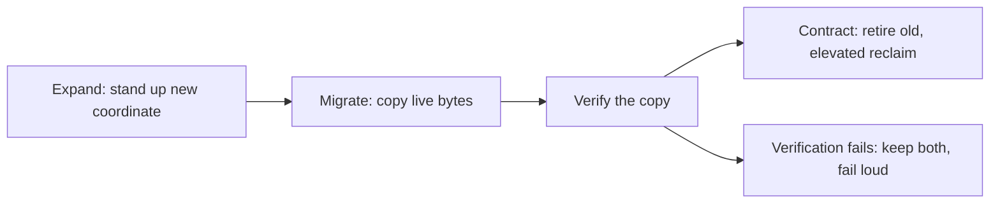

# InForceSpec Migrations and No-Destruction

**Status**: Authoritative source
**Supersedes**: N/A
**Referenced by**: DEVELOPMENT_PLAN/phase_26_release_lifecycle.md, documents/engineering/README.md, documents/engineering/tenancy_doctrine.md
**Generated sections**: none

> **Purpose**: Single source of truth for how an `InForceSpec` evolves between generations — an ordered,
> idempotent, readiness-gated typed diff whose DSL surface exposes no verb that represents destruction of
> durable data, and whose sanctioned cross-tenant/cross-app sharing is an append-only, revocable capability
> edge rather than a re-tag.

---

## 1. Why this doctrine exists

A long-lived cluster does not keep one fixed `InForceSpec`; the operator uploads a new generation whenever the
target shape changes — a bigger volume, a renamed bucket, a shrunk topic retention, a migrated schema. The
load-bearing obligation is that this evolution can **never represent destruction of durable data**. The
failure to foreclose surfaces at **author time** (a `.dhall` value that denotes "delete this durable volume,"
"drop this data," or an in-place truncation), at **decode time** (a new generation that silently orphans a
retained coordinate, or shrinks a retention span below what is currently retained, with no data-preserving
disposition), and at **runtime** (a reconcile that trades live bytes for an unverified new home). A parallel
failure is a migration that **re-tags** a datum from one tenant or app to another to express "share this,"
which would let a spec name a foreign tenant's resource.

The obvious alternative models a migration as an imperative script of CRUD steps — `ALTER … DROP COLUMN`, a
`DROP`/`TRUNCATE` in a hand-written migration file, `kubectl delete pvc`, or a re-tag that repoints a resource
at a new owner. That surface makes destruction and cross-tenant reference **representable**: no-data-loss and
tenant isolation then rest on review and on the migration author's discipline, which is exactly the layer the
amoebius illegal-state contract rejects for this class of invariant
([illegal_state_catalog.md §3.8](../illegal_state/illegal_state_security.md#38-cross-tenant-references-and-literal-secrets)).

The rule this doctrine states: **a migration is the typed diff between the in-force `RootInForceSpec` and a
newly-uploaded one, delivered through `dhall update` and realized by the ordinary reconcile — not a new
operation — and the only verbs it may author over an existing durable coordinate live in a closed
`StorageMutation = Retain | Offload | Grow | Shrink` union with no `Delete`/`Drop`/`Erase`/`Truncate` arm.**
`Shrink` is *defined* as create-new → verified-migrate → retire-old; the retire-old reclaim is an
elevated-harness act, never a spec verb; and sanctioned sharing is an append-only, revocable capability edge,
never a re-tag.

What it forecloses: the migration surface can no longer express an in-place truncation, an immediate
destructive drop, or any spec-level reclaim of durable storage. Reclaim of a retired volume is deferred to a
deliberate, privileged, runtime-checked action ([§4](#4-shrink-is-create-new--verified-migrate--retire-old-the-reclaim-is-an-elevated-harness-act)). The residual honesty ([§8](#8-the-honest-limit)) is that a
type cannot prove a live box still holds its disk, nor that a verified copy's bytes match — those remain
runtime-checked.

---

## 2. A migration is a typed diff, not a new operation

An "`InForceSpec` migration" introduces no new machinery. It is the typed diff between the in-force
`RootInForceSpec` and a newly-uploaded one, submitted through the singleton's `dhall update` endpoint and
realized by the **ordinary reconcile** — desired is `render(spec)`, observed is cluster state, and the diff is
typed ([manifest_generation_doctrine.md §6](./manifest_generation_doctrine.md#6-the-reconcile-state-model-desired-is-renderinforcespec-observed-is-etcd-a-diff-is-typed)).
There is no bespoke "migrate" verb bolted onto the control plane.

- **The migration rides the release primitives it does not re-own.** A migration composes with the ordered,
  readiness-gated `RolloutPlan` / `RolloutPhase` apply owned by
  [release_lifecycle_doctrine.md §5](./release_lifecycle_doctrine.md#5-rolloutplan--rolloutphase-the-readiness-gated-apply);
  this doctrine adds the *no-destruction* guarantees that ride on top of that apply model, not a second
  reconciler.
- **A DB schema migration is only one phase inside it.** The database schema change is a single
  `RolloutPhase` obeying `create-new → verified-migrate → retire-old`
  ([release_lifecycle_doctrine.md §5](./release_lifecycle_doctrine.md#5-rolloutplan--rolloutphase-the-readiness-gated-apply)),
  not the whole of a migration and not a side channel around the reconciler.
- **Immutability makes rollback free.** Because each generation is an immutable `Release` in the ledger
  ([release_lifecycle_doctrine.md §2](./release_lifecycle_doctrine.md#2-release-and-the-immutable-release-ledger-releasehash)),
  a migration is undone by advancing the environment pointer back to the prior `releaseHash` and letting the
  reconciler converge — it finds data intact because no phase destroyed anything unverified ([§6](#6-migration-rolloutphases-expand--migrate--contract)).

This doctrine owns the two guarantees that ride on the diff — **no destruction of durable data** ([§3](#3-the-dsl-exposes-no-destructive-verb--the-closed-storagemutation-union), [§4](#4-shrink-is-create-new--verified-migrate--retire-old-the-reclaim-is-an-elevated-harness-act), [§5](#5-the-decode-time-no-orphan-fold)) and **no
re-tag sharing** ([§7](#7-sanctioned-sharing-is-an-append-only-revocable-capability-edge)) — and defers the diff/apply machinery itself to release_lifecycle and
manifest_generation.

---

## 3. The DSL exposes no destructive verb — the closed `StorageMutation` union

Type-foreclosure comes first. The migration surface offers exactly one closed set of verbs over an existing
durable coordinate (a PV, a bucket, a topic, a schema), and that set contains no arm that denotes destroying
bytes:

```haskell
-- Illustrative only; the storage prohibition the arms reduce to is owned by storage_lifecycle_doctrine.md.
data StorageMutation
  = Retain  RetentionPolicy   -- keep, adjust retention/lifecycle within the data-preserving envelope
  | Offload  Target           -- move bytes to a colder/other backing, still preserving them
  | Grow    Size              -- enlarge in place; the larger volume strictly contains the old bytes
  | Shrink  Size              -- DEFINED as create-new -> verified-migrate -> retire-old (§4), never truncation
  -- no Delete / Drop / Erase / Truncate arm exists, anywhere the spec can reach
```

- **"Destroy these bytes" has no inhabitant.** Because the union has no `Delete`/`Drop`/`Erase`/`Truncate`
  constructor, a `.dhall` value cannot denote destruction of durable data. This fails Gate 1 (the Dhall
  typechecker) before any binary runs — it is **type-foreclosed**, not a runtime guard. This is the migration
  surface's expression of the storage-side prohibition owned by
  [storage_lifecycle_doctrine.md §7](./storage_lifecycle_doctrine.md#7-deleting-durable-data-is-forbidden-under-normal-operation)
  (deleting durable data is forbidden under normal operation); this doctrine owns the *verb union*, that
  doctrine owns the *posture the arms preserve*.
- **`Grow` is data-preserving in place.** Enlarging a coordinate is an ordinary change — the larger volume
  still holds every original byte — so it needs no migration pipeline
  ([storage_lifecycle_doctrine.md §8](./storage_lifecycle_doctrine.md#8-shrinking-storage-without-representing-data-destruction)).
- **`Shrink` is the only hard arm, and it is not truncation.** `Shrink` is *defined* as the
  create-new → verified-migrate → retire-old pipeline of [§4](#4-shrink-is-create-new--verified-migrate--retire-old-the-reclaim-is-an-elevated-harness-act), so even reducing an effective size never
  denotes discarding bytes.

The general "the right verb simply has no constructor" idiom is the closed-union / GADT-indexed-transition
technique owned by
[illegal_state_catalog.md §4.2](../illegal_state/illegal_state_techniques.md#42-capability-and-phantom-tenant-tags--cross-tenant-refs-are-uninhabitable);
this section records the migration-specific instance.

---

## 4. `Shrink` is create-new → verified-migrate → retire-old; the reclaim is an elevated-harness act

The `Shrink` arm ([§3](#3-the-dsl-exposes-no-destructive-verb--the-closed-storagemutation-union)) realizes a smaller effective size without ever representing data destruction. The
`.dhall` value the operator writes denotes the *target smaller size*; the reconciler provisions a new,
correctly-sized retained coordinate, copies the live bytes, **verifies** the copy, and only then retires the
old one. No `.dhall` value ever denotes "discard these bytes." This is the verified-shrink mechanism owned by
[storage_lifecycle_doctrine.md §8](./storage_lifecycle_doctrine.md#8-shrinking-storage-without-representing-data-destruction),
referenced here, not restated.

- **The retire-old reclaim is an elevated-harness act, never a spec verb.** The final reclaim of the
  now-orphaned old coordinate is itself a durable-data deletion, so it inherits
  [storage_lifecycle_doctrine.md §7](./storage_lifecycle_doctrine.md#7-deleting-durable-data-is-forbidden-under-normal-operation):
  under normal operation it is forbidden, and the only actor permitted to perform it is the **elevated
  harness**, the sole deleter of durable storage, on resources it flagged — the same path
  [storage_lifecycle_doctrine.md §7.1](./storage_lifecycle_doctrine.md#71-the-single-exception-the-elevated-test-harness)
  and [testing_doctrine.md](./testing_doctrine.md) own. The reclaim is **not** an arm the migration spec can
  author.
- **A failed verification retires nothing.** A `Shrink` that cannot verify its copy leaves *both* coordinates
  intact and fails loud; it never trades the old bytes for an unverified new home.
- **A rename is a move over a fixed identity, never a delete-then-create.** A coordinate's identity is a total
  function of `(tenant, app, name)`, so a rename is realized as a dual-name / copy-verify / drop-alias move
  that preserves the bytes under a stable identity — it cannot degrade to a destroy-then-recreate that loses
  data.

The open question of **whether the destructive reclaim credential lives outside the spec entirely (an
elevated action) or as a privileged, auditable spec arm**, and the concrete create-vs-delete credential model
that backs it, are owned by
[pulumi_iac_doctrine.md §6](./pulumi_iac_doctrine.md#6-the-ebs-create-vs-delete-credential-model) — this
doctrine records only that no *ordinary* migration verb may reclaim durable storage.

---

## 5. The decode-time no-orphan fold

Type-foreclosure ([§3](#3-the-dsl-exposes-no-destructive-verb--the-closed-storagemutation-union)) removes any single destructive *verb*, but a migration could still destroy data by
*omission* — the new generation simply drops a retained coordinate that the old generation named. Dhall cannot
compare two whole specs at the type level, so this residue is caught by a **decode-time fold** over the
old→new diff, the genuinely new mechanism this doctrine adds:

- **Orphan rejection.** A `dhall update` is rejected at decode if the diff would **orphan** a retained
  coordinate — drop it from the active spec with no data-preserving disposition (`Retain`/`Offload`, or a
  `Shrink` that carries its verified-migrate). A silent drop is not a value the update accepts.
- **Retention-floor rejection.** A diff that would shrink a retention span **below the currently-retained
  span** without an offload-first phase is likewise rejected — retention cannot contract past live data
  without first preserving it.
- **This is decode-foreclosed, not type-foreclosed.** Because it compares two decoded generations rather than
  living inside one type, it is Gate 2 (the decoder), catalogued honestly as a decode-time rejection, using
  the ownership-index / relation-over-a-collection technique family owned by
  [illegal_state_catalog.md](../illegal_state/illegal_state_catalog.md). The part of the orphan check that must consult
  **live retained-state** (does a real coordinate still hold data?) is a hybrid decode+runtime gate, labelled
  as such in [§8](#8-the-honest-limit).

---

## 6. Migration `RolloutPhase`s: expand → migrate → contract

A migration is enacted as an ordered, readiness-gated `RolloutPlan`
([release_lifecycle_doctrine.md §5](./release_lifecycle_doctrine.md#5-rolloutplan--rolloutphase-the-readiness-gated-apply))
whose phases follow **expand → migrate → contract**, so nothing destructive fires before verification: new
capacity is stood up first, bytes are migrated and verified, and only a later phase contracts the old shape.
The per-subsystem shapes:

| Migration kind | Phase shape |
|---|---|
| DB schema | create-new → verified-migrate → retire-old |
| Topic retention shrink | offload-before-shrink |
| PV shrink | new-volume → copy → verify → (elevated) retire |
| Rename | dual-name → copy-verify → drop-alias |
| Reader cutover | Pulsar subscription cutover, or Gateway-API `HTTPRoute` weight shift |



- **Each phase gates on an observed readiness edge, never a timer.** The next phase applies only when the
  prior phase's readiness gate is observed from live state
  ([release_lifecycle_doctrine.md §5](./release_lifecycle_doctrine.md#5-rolloutplan--rolloutphase-the-readiness-gated-apply)).
- **Rollback is free and lossless.** The prior generation is still an immutable `Release`, so rollback is a
  CAS of the environment pointer back to the prior `releaseHash`; the reconciler converges and finds data
  intact, because no phase destroyed anything unverified
  ([release_lifecycle_doctrine.md §2](./release_lifecycle_doctrine.md#2-release-and-the-immutable-release-ledger-releasehash)).
- **The `PromotionGate` still applies.** A migration into `Prod` remains gated by the `PromotionGate`
  ([release_lifecycle_doctrine.md §4](./release_lifecycle_doctrine.md#4-promotiongate-promote-unverifiedprod-is-unrepresentable));
  promote-unverified→prod stays type-foreclosed unrepresentable regardless of whether the promotion carries a
  migration.

---

## 7. Sanctioned sharing is an append-only, revocable capability edge

Cross-tenant or cross-app sharing — for example, app B continuing app A's model
([content_addressing_doctrine.md §4.5](./content_addressing_doctrine.md#45-the-ml-asset-lifecycle-one-bounded-content-addressed-cache-resolved-on-first-miss)) —
is expressed as a **grant**: an append-only, revocable **capability edge** from the owner to the grantee. It
is never a **re-tag** that would move a datum's owning identity, because a re-tag is exactly what would let a
spec name a foreign tenant's resource.

- **`TenantId` is minted once and travels with the bytes.** No migration re-tags a datum from `t1` to `t2`;
  the absence of any `Ref t1 a → Ref t2 a` coercion is the shared boundary between this doctrine and the
  tenant surface ([tenancy_doctrine.md §3](./tenancy_doctrine.md#3-what-a-tenant-is),
  [illegal_state_catalog.md §4.2](../illegal_state/illegal_state_techniques.md#42-capability-and-phantom-tenant-tags--cross-tenant-refs-are-uninhabitable)).
  A migration inherits this invariant unchanged.
- **A grant adds an edge; it never rewrites a tag.** The grantee gains a scoped capability to reach the
  owner's coordinate; the coordinate keeps its owning `(tenant, app, name)` identity. The grant is append-only
  (recorded, not mutated in place) and **revocable** (an edge can be withdrawn without touching the data),
  which a re-tag could offer neither of.
- **Cross-tenant reference stays uninhabitable.** Because sharing is an edge and not a tag rewrite, a spec
  still has no syntax to *name* a foreign tenant's resource directly
  ([illegal_state_catalog.md §3.8](../illegal_state/illegal_state_security.md#38-cross-tenant-references-and-literal-secrets),
  [illegal_state_catalog.md §3.10](../illegal_state/illegal_state_security.md#310-a-child-spec-that-reaches-beyond-its-own-subtree)) —
  the grant is the *only* sanctioned way one identity's data becomes reachable by another, and it is derived,
  not hand-authored ([tenancy_doctrine.md §5](./tenancy_doctrine.md#5-rbac-is-derived-never-authored)).

The tenant/user/RBAC surface, the phantom-tag mechanism, and the honest limit that the *derivation* onto
provider ACLs may itself be unfaithful are owned by
[tenancy_doctrine.md §7](./tenancy_doctrine.md#7-two-isolation-layers-and-the-honest-limit); this doctrine
owns only that migration sharing is an edge, never a re-tag.

---

## 8. The honest limit

The no-destruction guarantee is honest about the layer it reaches, per
[documentation_standards.md §6](../documentation_standards.md#6-honesty-the-proventestedassumed-discipline):

- **A type cannot prove a live box still has its disk**, nor that a verified copy's bytes match the original.
  The verified-migrate step and the retire-old reclaim are therefore **runtime-checked** residue, not
  type-foreclosed guarantees — the type removes the destructive *verb*, but the physical preservation of bytes
  is observed at runtime.
- **The retire-old reclaim is an elevated, flagged, runtime-checked action** ([§4](#4-shrink-is-create-new--verified-migrate--retire-old-the-reclaim-is-an-elevated-harness-act)), performed only by the
  elevated harness on flagged resources, never by an ordinary migration verb.
- **The orphan check is a hybrid decode+runtime gate.** The structural half of [§5](#5-the-decode-time-no-orphan-fold) is decode-foreclosed, but
  determining whether a dropped coordinate still holds live data may require consulting live retained-state —
  that half is runtime-checked and labelled honestly, never reported as a compile-time impossibility.
- **Sibling evidence, not an amoebius result.** The schema-migration-as-a-phase shape is proven **live in the
  sibling jitML** (its pre/post-grant Postgres phase, cited by
  [release_lifecycle_doctrine.md §5](./release_lifecycle_doctrine.md#5-rolloutplan--rolloutphase-the-readiness-gated-apply)),
  and the `.ready`-gated artifact idiom in infernix; these are **sibling evidence, not amoebius results**. The
  closed `StorageMutation` union, the decode-time no-orphan fold, and the sharing-as-capability-edge are
  amoebius design intent, unbuilt.

---

## 9. Planning ownership

This document is normative `InForceSpec`-migration doctrine only. It states the **target shape**: a migration
is a typed diff whose verb surface admits no destruction, whose `Shrink` is a verified pipeline, whose orphan
check is decode-time, and whose sharing is an append-only revocable edge. Every statement here is **design
intent**, not a built or tested amoebius capability. Delivery sequencing, completion status, and validation
gates — including the DB schema-migration `RolloutPhase` (the promoted Phase-34 candidate that
[release_lifecycle_doctrine.md §5](./release_lifecycle_doctrine.md#5-rolloutplan--rolloutphase-the-readiness-gated-apply)
homes), the verified-shrink migration
([storage_lifecycle_doctrine.md §8](./storage_lifecycle_doctrine.md#8-shrinking-storage-without-representing-data-destruction)),
and the create-vs-delete credential model
([pulumi_iac_doctrine.md §6](./pulumi_iac_doctrine.md#6-the-ebs-create-vs-delete-credential-model)) — live
only in [../../DEVELOPMENT_PLAN/README.md](../../DEVELOPMENT_PLAN/README.md). This doc never maintains a
competing status ledger; it links back for status.

---

## Cross-references

- [Engineering Doctrine Index](./README.md)
- [Storage Lifecycle Doctrine](./storage_lifecycle_doctrine.md) — [§7](./storage_lifecycle_doctrine.md#7-deleting-durable-data-is-forbidden-under-normal-operation) the durable-data-deletion prohibition, [§7.1](./storage_lifecycle_doctrine.md#71-the-single-exception-the-elevated-test-harness) the elevated harness as sole deleter, [§8](./storage_lifecycle_doctrine.md#8-shrinking-storage-without-representing-data-destruction) the verified-shrink mechanism the `Shrink` arm reduces to
- [Release Lifecycle Doctrine](./release_lifecycle_doctrine.md) — [§5](./release_lifecycle_doctrine.md#5-rolloutplan--rolloutphase-the-readiness-gated-apply) the readiness-gated `RolloutPlan`/`RolloutPhase` a migration composes with; [§2](./release_lifecycle_doctrine.md#2-release-and-the-immutable-release-ledger-releasehash) the immutable ledger that makes rollback free; [§4](./release_lifecycle_doctrine.md#4-promotiongate-promote-unverifiedprod-is-unrepresentable) the `PromotionGate`
- [Tenancy Doctrine](./tenancy_doctrine.md) — [§3](./tenancy_doctrine.md#3-what-a-tenant-is) the immutable `TenantId` that travels with the bytes, [§5](./tenancy_doctrine.md#5-rbac-is-derived-never-authored) derived-not-authored grants, [§7](./tenancy_doctrine.md#7-two-isolation-layers-and-the-honest-limit) the two isolation layers and the honest limit
- [Illegal State Catalog](../illegal_state/illegal_state_catalog.md) — [§3.8](../illegal_state/illegal_state_security.md#38-cross-tenant-references-and-literal-secrets) / [§3.10](../illegal_state/illegal_state_security.md#310-a-child-spec-that-reaches-beyond-its-own-subtree) cross-tenant and cross-subtree references, [§4.2](../illegal_state/illegal_state_techniques.md#42-capability-and-phantom-tenant-tags--cross-tenant-refs-are-uninhabitable) the phantom-tag / no-`Ref t1 → Ref t2` technique
- [Manifest Generation Doctrine](./manifest_generation_doctrine.md) — [§6](./manifest_generation_doctrine.md#6-the-reconcile-state-model-desired-is-renderinforcespec-observed-is-etcd-a-diff-is-typed) the ordinary reconcile (`desired = render(spec)`, the diff is typed) a migration is realized by
- [Content Addressing Doctrine](./content_addressing_doctrine.md) — [§4.5](./content_addressing_doctrine.md#45-the-ml-asset-lifecycle-one-bounded-content-addressed-cache-resolved-on-first-miss) the `ModelArtifact` a cross-app grant may share
- [Pulumi IaC Doctrine](./pulumi_iac_doctrine.md) — [§6](./pulumi_iac_doctrine.md#6-the-ebs-create-vs-delete-credential-model) the create-vs-delete credential model behind the elevated reclaim
- [Testing Doctrine](./testing_doctrine.md) — the elevated harness that performs the retire-old reclaim on flagged resources
- [Development Plan](../../DEVELOPMENT_PLAN/README.md)
- [Documentation Standards](../documentation_standards.md)
