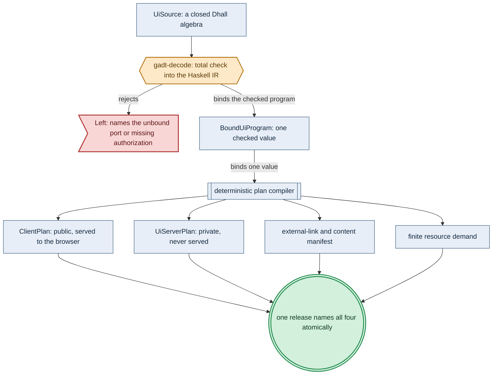
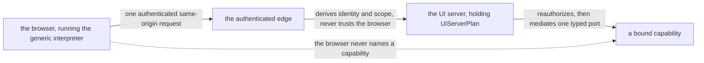

# Low-Code UI Runtime

> **Purpose**: Define the bounded external Dhall language, checked Haskell intermediate representation,
> Haskell-generated PureScript client runtime, server responsibility, and security boundaries by which amoebius composes
> authenticated single-page applications with services, data, workflows, and ML artifacts without exposing
> an escape hatch around authorization or tenant isolation.
> **Read this if**: an application value has to be supplied externally, or the browser/server trust boundary has to be settled.

This document owns the bounded application language and its runtime: one checked value projected into a
public client plan and a private server plan, typed effect ports, and the rule that a browser is never an
authority source. It does not own realtime transport, owned by
[ui_realtime_coordination_doctrine.md](./ui_realtime_coordination_doctrine.md), nor offline continuity,
owned by [browser_offline_runtime_doctrine.md](./browser_offline_runtime_doctrine.md).

<details>
<summary>Link-graph metadata</summary>

**Status**: Authoritative source
**Supersedes**: N/A
**Referenced by**: DEVELOPMENT_PLAN/overview.md, DEVELOPMENT_PLAN/phase_08_scope_index.md, DEVELOPMENT_PLAN/phase_37_ui_program_schema.md, DEVELOPMENT_PLAN/phase_38_ui_authorization_kernel.md, DEVELOPMENT_PLAN/phase_39_ui_effect_binding.md, DEVELOPMENT_PLAN/phase_40_ui_plan_compiler.md, DEVELOPMENT_PLAN/phase_41_offline_language_plan.md, DEVELOPMENT_PLAN/phase_42_ui_browser_interpreter.md, DEVELOPMENT_PLAN/phase_43_ui_server_boundary.md, DEVELOPMENT_PLAN/phase_44_ui_local_composition.md, DEVELOPMENT_PLAN/phase_46_ui_contract_generation.md, DEVELOPMENT_PLAN/phase_68_user_tenant_isolation_live.md, DEVELOPMENT_PLAN/phase_70_ui_projection_runtime.md, DEVELOPMENT_PLAN/phase_72_ui_program_release.md, DEVELOPMENT_PLAN/phase_81_ui_single_tenant_live.md, DEVELOPMENT_PLAN/phase_82_ui_multi_tenant_live.md, DEVELOPMENT_PLAN/phase_83_ui_rollout_reconnect.md, DEVELOPMENT_PLAN/phase_84_ui_ha_multizone.md, DEVELOPMENT_PLAN/phase_92_infernix_ui_rederivation.md, DEVELOPMENT_PLAN/phase_94_jitml_ui_rederivation.md, DEVELOPMENT_PLAN/system_components.md, README.md, documents/engineering/README.md, documents/engineering/app_vs_deployment_doctrine.md, documents/engineering/browser_offline_runtime_doctrine.md, documents/engineering/capability_extension_doctrine.md, documents/engineering/daemon_topology_doctrine.md, documents/engineering/dsl_doctrine.md, documents/engineering/extension_conformance_security.md, documents/engineering/generated_artifacts_doctrine.md, documents/engineering/image_build_doctrine.md, documents/engineering/lift_and_compose_doctrine.md, documents/engineering/low_code_ui_workflow_lifting.md, documents/engineering/migration_doctrine.md, documents/engineering/monitoring_doctrine.md, documents/engineering/namespace_layout_doctrine.md, documents/engineering/platform_services_doctrine.md, documents/engineering/pulsar_client_doctrine.md, documents/engineering/release_lifecycle_doctrine.md, documents/engineering/service_capability_doctrine.md, documents/engineering/tenancy_doctrine.md, documents/engineering/ui_realtime_coordination_doctrine.md, documents/glossary.md, documents/illegal_state/illegal_state_capability_messaging.md, documents/illegal_state/illegal_state_ml_asset.md, documents/illegal_state/illegal_state_security.md, documents/illegal_state/illegal_state_techniques.md, documents/illegal_state/illegal_state_tenancy.md
**Generated sections**: none

</details>

## Contents
- [1. Why this doctrine exists](#1-why-this-doctrine-exists)
- [2. Scope and single-source ownership](#2-scope-and-single-source-ownership)
- [3. One checked value, two runtime plans](#3-one-checked-value-two-runtime-plans)
- [4. The external Dhall surface](#4-the-external-dhall-surface)
- [5. gadt-decode and the checked Haskell IR](#5-gadt-decode-and-the-checked-haskell-ir)
- [6. Modules and total composition](#6-modules-and-total-composition)
- [7. State, events, and deterministic updates](#7-state-events-and-deterministic-updates)
- [8. Effects are typed ports, not network operations](#8-effects-are-typed-ports-not-network-operations)
- [9. Routes, identity, authorization, and the edge](#9-routes-identity-authorization-and-the-edge)
- [10. Single-tenant and multi-tenant applications](#10-single-tenant-and-multi-tenant-applications)
- [11. Data, forms, and storage](#11-data-forms-and-storage)
- [12. Workflows and artifact lifting into the UX](#12-workflows-and-artifact-lifting-into-the-ux)
- [13. Generic PureScript client and amoebius UI server](#13-generic-purescript-client-and-amoebius-ui-server)
- [14. Runtime role, deployment, and high availability](#14-runtime-role-deployment-and-high-availability)
- [15. Versioning, rollout, and generated artifacts](#15-versioning-rollout-and-generated-artifacts)
- [16. Admission stages and illegal-state foreclosure](#16-admission-stages-and-illegal-state-foreclosure)
- [17. Verification obligations](#17-verification-obligations)
- [18. Honesty boundary](#18-honesty-boundary)
- [19. Extension rule and permanently absent escape hatches](#19-extension-rule-and-permanently-absent-escape-hatches)
- [Related Documents](#related-documents)

---

Phase order, implementation status, and validation gates live only in
[`DEVELOPMENT_PLAN/README.md`](../../DEVELOPMENT_PLAN/README.md). This document owns the intended UI language
and runtime contract; it does not assert that the contract is implemented.

## 1. Why this doctrine exists

An application assembled from text fields, routes, callbacks, endpoint strings, and browser credentials can
type-check as Dhall while still bypassing the gateway, omitting an authorization check, addressing another
tenant's row, or invoking an ML artifact before its provenance and serving compatibility are established. The
failure may first appear in a browser, a handler, or a live provider, after the external configuration has
already been accepted.

Treating Dhall as a general programming language, or embedding JavaScript, HTML, CSS, SQL, URLs, and policy
fragments inside it, cannot provide the required closure. Each embedded language introduces another authority
surface and another way for client and server interpretation to diverge. Generating a bespoke frontend and a
separately hand-maintained non-Haskell backend has the same desynchronization problem.

amoebius therefore accepts a **finite declarative UI program as data**, checks it into a typed Haskell
representation, binds every effect to a server-side capability and authorization contract, and emits two
projections of that one checked value: a client plan for a generic interpreter generated as PureScript and a
server plan for an amoebius UI-server worker. Dhall describes the external program value but never executes an
effect. Haskell owns checking, binding, server semantics, and the client-runtime source declaration.

This choice forecloses arbitrary browser code and arbitrary web-platform access. A SPA is general only within
the versioned UI type, component, expression, and effect algebras. A capability that those algebras cannot
express requires a reviewed extension to the trusted Haskell and PureScript runtimes; it never requires a raw
escape arm in application Dhall.

---

## 2. Scope and single-source ownership

This document is the single source of truth for:

- the external `UiSource` shape and its bounded UI algebras;
- the `CheckedUiProgram` invariants and client/server projections;
- UI modules, component state, events, effects, routes, and typed port requirements;
- the browser/server trust split and the UI-specific authorization and tenant-isolation protocol;
- workflow and artifact presentation, including interactive infernix and jitML artifacts;
- the Haskell-declared, PureScript-materialized runtime contract and the amoebius UI-server responsibility; and
- UI-specific high-availability, version-handshake, and rollout requirements.

The following documents retain ownership of the adjacent rules. This doctrine depends on those rules and does
not redefine them.

| Concern | Owning source | Relationship to this doctrine |
|---------|---------------|-------------------------------|
| General Dhall gates, total composition, secret references | [The Amoebius DSL](./dsl_doctrine.md) | `UiSource` is one bounded application-language value admitted through the same dhall-typecheck and gadt-decode discipline. |
| Application logic versus deployment rules | [Application Logic vs Deployment Rules](./app_vs_deployment_doctrine.md) | UI behavior is application logic; replica count, placement, rollout, and failover remain deployment rules. |
| Abstract capabilities and provider binding | [Service Capabilities](./service_capability_doctrine.md) | UI ports require capabilities; they cannot select MinIO, Pulsar, Postgres, Keycloak, Envoy, or an inference provider. |
| Extension merge and linked infernix/jitML code | [The Capability-Extension Graph](./capability_extension_doctrine.md) | UI fragments consume the total, acyclic, anti-shadow extension graph; they do not load runtime plugins. |
| Re-derivation from infernix, jitML, and UI seed observations | [Lift and Compose](./lift_and_compose_doctrine.md) | Behavior is re-declared in amoebius-owned Haskell; no sibling PureScript or other non-Haskell source is imported. |
| Tenant identities, memberships, roles, grants, and provider RBAC | [Tenancy](./tenancy_doctrine.md) | The UI receives opaque scope witnesses derived from that model and never authors tenant authority. |
| One executable and daemon role taxonomy | [Daemon Topology](./daemon_topology_doctrine.md) | The UI server is a worker responsibility of the same amoebius executable, not a second privileged executable. |
| Keycloak/Envoy ingress and platform HA | [Platform Services](./platform_services_doctrine.md) | Every browser and UI API path traverses the platform-owned authenticated edge. |
| Browser WebSocket transport and Redis routing | [UI Realtime Coordination](./ui_realtime_coordination_doctrine.md) | This doctrine declares typed ports/subscriptions; the realtime doctrine fixes their same-origin wire, cross-pod routing, and durable-replay boundary. |
| Offline persistence, outbox replay, and local blobs | [Browser Offline Runtime](./browser_offline_runtime_doctrine.md) | `UiSource` selects offline semantics; the offline doctrine owns encrypted browser facilities, replay, compatibility, and quotas. |
| Artifact identity, readiness, provenance, and compatibility | [Content Addressing & Determinism](./content_addressing_doctrine.md) | The UI can consume only a server-issued ready artifact handle. |
| Workflow and extension monitoring | [Monitoring Doctrine](./monitoring_doctrine.md) | Workflow status views consume the mandatory authenticated monitoring surface. |
| Generated-file policy | [Generated Artifacts](./generated_artifacts_doctrine.md) | Per-app plans/content manifests and the generic runtime's catalog codecs/bundle are generated and never committed. |
| Foreclosure terminology and honesty | [Illegal-State Techniques](../illegal_state/illegal_state_techniques.md) | This doctrine identifies type-, decode-, bind-, and runtime-foreclosed UI states without overstating any layer. |

The statement in [The Amoebius DSL](./dsl_doctrine.md) that Dhall carries parameters rather than logic remains
the general rule. The UI-specific refinement is that a normalized Dhall value may carry a **declarative program description**. It carries no executable callback, interpreter, effect implementation, authorization decision,
or provider operation. The trusted runtimes continue to carry all operational semantics.

---

## 3. One checked value, two runtime plans

The UI compilation boundary is fixed:

```text
external/untracked UiSource.dhall
  -> Dhall normalization and type-check
  -> dhall-typecheck wire-shape decode
  -> gadt-decode semantic check
  -> CheckedUiProgram
  -> capability + identity + tenancy + workflow binding
  -> BoundUiProgram
  -> ClientPlan + UiServerPlan
  -> provisioned deployment and generated client artifacts
```

No later stage reparses an earlier text representation. `CheckedUiProgram`, `BoundUiProgram`, `ClientPlan`, and
`UiServerPlan` have private constructors. Failure returns structured diagnostics and produces neither a partial
client plan nor a partial server plan.

The two plans are projections of the same `BoundUiProgram`:

- `ClientPlan` contains view nodes, safe expression instructions, initial client state, deterministic transition
  tables, public codecs, opaque port identifiers, route metadata, and presentation metadata.
- `ClientPlan` also contains the exact navigation-only projections of the bound trusted external-link subset;
  these values are not members of the effect or media instruction algebras.
- `UiServerPlan` contains the matching port dispatch table, trusted request-context requirements,
  authorization contracts, tenant-scope derivations, server codecs, resource bounds, audit metadata, and bound
  handler identities. It is a serializable manifest, not a serialization of Haskell functions; the linked
  amoebius runtime must resolve every identity exactly once in its trusted handler registry before serving it.

The client projection cannot contain provider coordinates, internal resource identifiers, secret references,
role-binding rules, raw policy, or handler implementation details. The server projection cannot trust a client
claim merely because the matching client plan would normally emit it.

The projection gate must compare the private Haskell value with independently reviewed Haskell semantic
projections. JSON plans and manifests are generated under `.build/**`, never used as their own oracle, and
removed for a clean-room rerun. The browser gate must compile freshly generated PureScript and compare its
transitions and observations with a distinct Haskell reference semantics plus required red controls.

---


*Design intent, Tier-1 decode-foreclosed at the gate. Four artifacts derive from one Haskell-owned checked
value, so there is no separately maintained client/server source pair to drift. The typed effect ports the
server plan mediates are owned by [§8](#8-effects-are-typed-ports-not-network-operations). Vocabulary:
[diagram_conventions.md](./diagram_conventions.md).*

## 4. The external Dhall surface

The Dhall schema, constructors, and examples are generated lazily beneath `.build/**` from Haskell. An
operator's `UiSource` is external or local-untracked input; no `.dhall` application source is committed.

### 4.1 A normalized graph, not recursive executable syntax

Dhall does not provide a native recursive datatype suitable for an open-ended UI tree. `UiSource` therefore
uses finite, normalized tables keyed by nominal identifiers. References connect entries; gadt-decode checks that
every reference resolves uniquely and that each required graph is finite and acyclic.

The top-level shape is conceptually:

```dhall
{ languageVersion : UiLanguageVersion
, application     : AppName
, tenancyMode     : UiTenancyMode
, modules         : List UiModuleSource
, routes          : List UiRouteSource
, ports           : List UiPortRequirement
, externalLinks   : List NamedExternalLinkRequirement
, continuity      : < OnlineOnly | Offline : OfflineSource >
, initialRoute    : RouteRef
}
```

`UiModuleSource` contains normalized tables for local types, state cells, events, expressions, view nodes,
components, update rules, slots, and exported outputs. A table entry has a nominal local identifier; a
cross-module reference uses a fully qualified `(AppName, ModuleName, LocalId)` identity. User-visible labels
are never identities.

The accepted schema contains no expression arm that evaluates Dhall at browser runtime. Dhall functions may
be used while an operator constructs and normalizes the external finite value, but no Dhall closure crosses
dhall-typecheck.

### 4.2 The client-safe value universe

The UI value universe is closed and versioned. Its core consists of bounded text, booleans, bounded integral
and decimal values, instants, dates, durations, optional values, bounded lists, closed records, closed variants,
enumerations, public domain projections, and opaque handles. Every text and collection value carries a declared
maximum size in a public contract.

Opaque types include `SessionHandle`, `TenantChoiceHandle`, `ResourceHandle`, `WorkflowHandle`,
`ReadyArtifactHandle`, `UploadHandle`, `DownloadHandle`, and `GrantHandle`. Dhall can name a requirement for
such a value but cannot construct one from text, a digest, a URL, a database key, or a tenant identifier.

Every value that crosses a component, module, port, workflow, storage, model, response, export, cache, audit, or
observability boundary also has a checked information-flow label. The label is not an author-editable field of
the value; gadt-decode and binding derive it from the source, current scope, public contract, and sink contract.

The client-safe universe excludes secrets, credentials, Vault references, Kubernetes identities, provider
coordinates, raw tenant identifiers, SQL fragments, Pulsar topics/subscriptions, MinIO buckets/keys, network
addresses, policy documents, and executable code.

### 4.3 Bounded representational generality

The core view algebra includes:

- semantic document, region, heading, text, image-by-`MediaHandle`, and accessible status nodes;
- row, column, grid, stack, panel, tabs, dialog, and responsive layout nodes using theme tokens;
- exhaustive variant matching, boolean conditionals, and bounded collection projection;
- typed text, number, date, choice, toggle, file, and domain-specific inputs;
- forms, buttons, links, tables, pagination, sorting, filters, charts, and validation summaries;
- local and remote-data status views;
- workflow controls, progress, monitoring links, artifact summaries, and model interactors; and
- module instances and typed slots.

This algebra represents dashboards, CRUD applications, multi-step forms, workflow consoles, administrative
surfaces, and interactive inference applications. It does not represent arbitrary DOM mutation, arbitrary
canvas/WebGL programs, browser extensions, eval-like computation, or third-party scripts. Specialized
visualizations and interactions enter only as named, audited members of the versioned trusted component
catalog.

There is no `RawHtml`, `RawCss`, `RawJavaScript`, `RawUrl`, `CustomCallback`, `CustomFetch`, or untyped
`Component` arm. Plain text is escaped by the runtime. Styling uses closed semantic tokens and constrained
layout values. Navigation uses route or named-link references. Media uses authorized handles.

### 4.4 External links are names resolved by a trusted catalog

`NamedExternalLinkRequirement` contains only a nominal `ExternalLinkId`; application Dhall cannot carry a URI,
scheme, host, path, query, fragment, redirect target, or interpolation template. Binding resolves every required
id exactly once against the versioned, linked `ExternalLinkCatalog`. A catalog entry contains one canonical,
absolute `https` destination and a fixed navigation policy. The first runtime contract admits no userinfo,
non-HTTPS scheme, wildcard origin, caller-derived suffix, or runtime redirect. Missing, duplicate, shadowed,
noncanonical, or disallowed entries reject the complete bind.

The resolved catalog subset is sealed into `BoundUiProgram`, included in `ProgramDigest`, and projected into
`ClientPlan` only as a navigation-only instruction. It cannot be converted to an effect URL, image source,
download location, form action, or same-origin transport target. A new browsing context receives the fixed
`noopener`/`noreferrer` policy and no session value or application datum is appended. The browser interpreter
and built-artifact gate test the canonical destination and absence of open-redirect or fetch reuse. Adding a
destination requires review of the trusted catalog; changing application Dhall cannot add one.

The closed `UiSource` record admits named link requirements but no raw URL field. Its gate must generate Dhall
cases from Haskell, check the exact diagnostic with an independent Haskell expectation, and prove that a
raw-URL mutant turns the gate red at this representational boundary.

---

## 5. gadt-decode and the checked Haskell IR

dhall-typecheck establishes only that normalized Dhall has the expected wire shape. gadt-decode resolves identifiers,
reconstructs type witnesses, checks graphs and contracts, and seals the existential `CheckedUiProgram`.
Illustrative internal types have this shape:

```haskell
data UiType a where
  TBool       :: UiType Bool
  TText       :: TextBound -> UiType BoundedText
  TInt        :: IntRange -> UiType BoundedInt
  TMaybe      :: UiType a -> UiType (Maybe a)
  TList       :: CollectionBound -> UiType a -> UiType (BoundedList a)
  TRecord     :: RecordWitness fields -> UiType (Record fields)
  TVariant    :: VariantWitness arms -> UiType (Variant arms)
  TPublic     :: PublicContractRef a -> UiType a
  TOpaque     :: ScopeWitness scope -> HandleKind kind -> UiType (Handle scope kind)

data CheckedExpr a where
  Literal     :: UiType a -> a -> CheckedExpr a
  ReadState   :: StateRef a -> CheckedExpr a
  ReadProp    :: PropRef a -> CheckedExpr a
  ReadEvent   :: EventFieldRef a -> CheckedExpr a
  Construct   :: ConstructorRef args a -> HList CheckedExpr args -> CheckedExpr a
  ApplyPure   :: PureFunction args a -> HList CheckedExpr args -> CheckedExpr a
  MatchTotal  :: CheckedExpr (Variant arms) -> TotalBranches arms a -> CheckedExpr a

data FlowLabel tenant audience integrity
data Labeled label a
data CanFlowTo source sink

data CheckedUiProgram where
  CheckedUiProgram :: CheckedModuleGraph modules
                   -> CheckedRouteGraph routes
                   -> CheckedPortRequirements ports
                   -> CheckedUiProgram
```

The concrete implementation may choose different constructor names, but it must preserve these properties:

1. Every expression has one reified result type.
2. Every state, property, event-field, node, route, slot, and port reference resolves uniquely.
3. Record and variant construction is complete and type-correct.
4. Variant decisions are exhaustive; there is no default arm that hides a new constructor.
5. View graphs, module imports, and pure-expression dependencies are finite and acyclic.
6. Collection traversals carry a bound and cannot recurse.
7. An opaque handle is introduced only by a trusted server result or trusted initial context.
8. Every source, transform, state cell, and sink has a derived `FlowLabel`; a checked edge carries a
   `CanFlowTo` witness.
9. No checked constructor contains raw code, raw markup, a provider address, or a policy fragment.
10. Only the sealed checked value can reach binding and rendering.

The PureScript runtime does not reproduce these proofs. It receives a compact plan whose construction was
possible only from the sealed Haskell value, validates its plan envelope and digest, and interprets the same
closed instruction set defensively.

The checked-graph gate must exercise private `CheckedUiProgram` construction and total identity, reference,
cycle, bound, port, event, and public-projection checks. Independently reviewed Haskell program semantics and
graph expectations constrain meaning; normalized-wire bytes are generated observations, never an oracle.

---

## 6. Modules and total composition

A UI module is a peer fragment, not a runtime plugin. It declares:

- typed immutable input properties;
- private typed state and initial values;
- typed input events and output events;
- required typed ports;
- exported components with typed slots; and
- a root view plus total update rules.

Module state is private. Another module can supply properties, fill declared slots, and consume output events;
it cannot read or write the module's state cells directly. Cross-module communication therefore remains
visible in the checked graph.

Composition is total, acyclic, and anti-shadow:

- every qualified import and slot requirement has exactly one provider;
- every required property, event, and port has an identical reified type and compatible scope;
- no local or imported identifier shadows another qualified identity;
- the module and component-instantiation graphs are acyclic;
- every required slot is filled exactly once unless its type explicitly permits absence or a bounded list;
- all output events are handled or explicitly discarded by a typed `Ignore` declaration; and
- duplicate routes, port identities, public contract identities, and component identities are rejected.

An application, an infernix extension, or a jitML extension may contribute a `UiModuleSource` and typed port
requirements. The existing linked-extension merge resolves the contributing set before UI checking. No module
downloads code, alters the interpreter, or chooses a provider at runtime.

---

## 7. State, events, and deterministic updates

Each module follows a finite model/event/update contract. A state schema and an event schema are known at Gate
2. For every accepted event constructor, the update table contains an exhaustive decision tree over safe
expressions and yields:

```text
(simultaneous state writes, zero or more ordered effect requests, optional route transition)
```

State writes are validated first and committed simultaneously. Effects are then enqueued in declared order
against the committed state snapshot. A failed effect does not retroactively mutate state; its typed completion
event drives the next transition. Multiple update rules cannot race to write a cell inside one event turn.

Remote state uses a mandatory sum rather than unrelated booleans:

```text
NotAsked
| Loading RequestId
| Ready ValueVersion a
| Failed PublicError
```

Every asynchronous completion carries its `RequestId`, program digest, session epoch, and server-observed
scope epoch. The client accepts a completion only for the live request and epoch. Tenant changes, sign-out,
route disposal, and incompatible-plan responses cancel or invalidate outstanding work and clear scoped state.

Concurrency, debounce windows, retry limits, subscription counts, page sizes, and client collection sizes are
bounded values. There is no unbounded retry, unbounded fan-out, recursive event dispatch, or author-controlled
timer loop. Optimistic presentation is allowed only as explicitly marked speculative state; it never changes
the authoritative server version and must reconcile with a typed success or conflict result.

`continuity = OnlineOnly` keeps application state in memory and forbids browser persistence. An
offline-capable program selects `continuity = Offline ...`; its projections, queueable ports, local blobs,
encrypted stores, cross-tab ownership, replay outcomes, and compatibility horizon are governed by
[Browser Offline Runtime](./browser_offline_runtime_doctrine.md). `UiSource` declares offline semantics only;
it never selects a browser API or transport product.

---

## 8. Effects are typed ports, not network operations

An effect is an invocation of a required port. Its checked shape is equivalent to:

```haskell
data CheckedPort where
  CheckedPort
    :: PortId
    -> ScopeWitness scope
    -> UiType input
    -> UiType output
    -> UiType publicError
    -> EffectClass effect
    -> AuthPolicyRef
    -> CheckedPort

data EffectClass
  = ReadData
  | MutateData
  | StartWorkflow
  | ObserveWorkflow
  | Subscribe
  | SignalWorkflow
  | CancelWorkflow
  | InvokeArtifact
  | UploadObject
  | DownloadObject
  | EndSession
```

Client-only navigation is a checked route transition, not an effect. Every server effect is mediated by a
bound Haskell handler. A port requirement names a semantic operation and public contract; it never names an
HTTP method, URL, header, SQL statement, topic, subscription, bucket, object key, secret, model path, or
inference socket.

Binding succeeds only when all of the following hold:

1. Exactly one linked handler implements the required semantic operation.
2. Input, output, and public-error contracts match exactly.
3. The handler accepts the port's trusted scope witness and effect class.
4. The application possesses every required abstract capability.
5. The route policy and port policy resolve to a compatible identity/role/grant rule.
6. Mutating and workflow-starting operations declare idempotency and conflict semantics.
7. Streaming operations declare a bounded subscription and resume protocol.
8. The operation has audit metadata and, where it starts or observes a workflow, a monitoring binding.
9. The handler exposes only a client-safe public projection and sanitized public errors.

Binding produces one closed action registry from the bound ports. Each entry owns the action identity, input,
output, public error, handler, required permission, tenant/audience scope, audit class, and policy source. Client
controls, server dispatch, edge routes, authorization projections, and audit events are derived from that
registry. A total exact-key check rejects a missing, extra, duplicate, handler-mismatched, or
permission-mismatched projection.

Server dispatch first resolves the action in the current registry, joins it with an authenticated
`RequestContext tenant subject`, and evaluates current policy. Only that path can construct the private
`AuthorizedAction tenant subject action` value accepted by a bound effect handler. There is no handler API that
accepts a public action identifier and performs the provider effect before authorization.

The client receives an opaque `PortId`. Each request carries the immutable client-plan digest, port identifier,
request identifier, session epoch, and encoded public input. The authenticated edge and UI server supply the
trusted subject, tenant scope, grants, authorization-policy version, and trace/audit context. A field duplicated
inside the public input has no authority and is rejected when the contract forbids it.

The pure binding gate must exact-join every closed effect arm to independently reviewed Haskell handler, codec,
scope, capability, retry, and audit expectations. It must reject provider coordinates and effect-transport
links before `BoundUiProgram` exists, and every paired production mutant must turn the intended check red.

---


*Orientation. Design intent. The trust boundary drawn as reachability: the browser names a port, and the server names the capability. Whether that separation is foreclosed by construction or enforced at runtime is stated by [§9](#9-routes-identity-authorization-and-the-edge), which owns the rule.*

## 9. Routes, identity, authorization, and the edge

> **The laws this section instantiates.** A route's relationship to identity is governed by
> [`extension_conformance_security.md`](./extension_conformance_security.md): a handler is a function from a
> scope obtained by authenticating, never from a request
> ([§S2](./extension_conformance_security.md#s2-the-scope-is-skolemised-not-passed)); an anonymous caller
> cannot name a scope, which is why the non-optional policy below is a type rather than a convention
> ([§S1](./extension_conformance_security.md#s1-authentication-is-an-index-not-a-check)); and a refusal
> discloses nothing about what it refused
> ([§S4](./extension_conformance_security.md#s4-a-refusal-reveals-nothing)). This section owns the route
> algebra and the edge; the laws own why it has this shape.

Every application route carries a non-optional `AuthPolicyRef`. There is no application-authored `Public`
policy in the first runtime contract. Login initiation, callback handling, health checks, and immutable asset
delivery are platform-owned endpoints and cannot be repurposed as application handlers.

Routes use a typed segment algebra. Captured values have public codecs and bounds; route values cannot become
tenant scope, resource authority, a SQL predicate, a provider coordinate, or an external URL. Links are one of
an internal `RouteRef`, an allowlisted `NamedExternalLinkRef`, or an authorized `DownloadHandle`. Redirect
targets are resolved or validated server-side to prevent open redirects. A `NamedExternalLinkRef` resolves
only through the exact-key trusted catalog in [§4.4](#44-external-links-are-names-resolved-by-a-trusted-catalog);
route captures, form values, response fields, and model output cannot influence its destination.

The browser reaches the application only through the Keycloak/Envoy wild edge and the same-origin UI server.
It cannot address platform services or extension workers directly. Authentication establishes a server-side
session represented in the browser by a secure, HTTP-only, same-site cookie or an equivalently protected
platform mechanism. Bearer credentials and refresh tokens are not exposed to UI state or Dhall.

Rendering a control may depend on a public authorization projection so inaccessible actions are not offered.
That rendering decision is only presentation. Every port invocation is independently authenticated and
authorized by the server against current policy. A hidden button, disabled route, or client-side guard never
confers or removes authority.

The authorization gate must cover hidden-but-invocable and absent-policy cases with an independent Haskell
relation. Default-allow and visibility-as-authorization mutants must fail at distinct loci. Later live checks
must pair sanctioned effects with independent provider readback and prove zero foreign effect; they cannot be
used to supply the earlier pure oracle.

The generated client is served with a restrictive content-security policy, no inline script requirement,
subresource integrity for immutable assets, strict MIME handling, clickjacking protection, and origin/CSRF
checks appropriate to the session mechanism. These controls are server-owned defaults, not Dhall options.

---

## 10. Single-tenant and multi-tenant applications

`UiTenancyMode` has only `SingleTenant` and `MultiTenant` arms. It must agree with the application's checked
tenancy declaration; the UI cannot weaken or reinterpret that declaration.

### 10.1 Single-tenant mode

The server binds the deployment's one tenant scope into authenticated request context. The client does not send
a tenant identifier and no tenant selector exists. Every scoped port and handle is indexed by that server-side
scope.

### 10.2 Multi-tenant mode

The server may return a bounded list of opaque `TenantChoiceHandle` values for scopes the authenticated subject
may enter. A handle contains no client-editable tenant authority. Selecting one asks the server to establish a
new scoped session epoch after rechecking membership and policy.

A successful scope change:

1. rotates the scope/session epoch;
2. invalidates existing resource, workflow, artifact, upload, download, and grant handles;
3. cancels or ignores outstanding requests and subscriptions;
4. clears all tenant-scoped client state and caches; and
5. reloads route and authorization projections for the new scope.

Server caches, deduplication keys, subscriptions, cursors, logs, and audit records include the trusted tenant
scope and subject where applicable. Client-controlled display aliases are not cache or authorization keys.

Cross-tenant access is not a tenant switch, identifier substitution, or resource retag. It requires an opaque,
revocable `GrantHandle` issued from the tenancy model. The bound operation consumes that handle and verifies its
grantor, grantee, resource, operation, epoch, and revocation state on the server. A value scoped to tenant A
cannot be passed to a port scoped to tenant B in the checked IR.

### 10.3 Information-flow labels

Every checked source and sink carries `FlowLabel tenant audience integrity`. `tenant` identifies the trusted
tenant scope, `audience` is a closed subject/role/tenant/grant audience, and `integrity` records whether the value
is untrusted input, validated domain data, or authority-bearing data. The label is phantom/checker-owned
metadata; application Dhall cannot erase, forge, or retag it.

Pure transformations preserve confidentiality and propagate the least trusted integrity among their inputs.
State cells, formatters, joins, caches, workflow inputs/outputs, model prompts/results, response projections,
exports, logs, audit events, and observability fields are sources or sinks in the same checked flow graph. A sink
accepts `Labeled source a` only when binding constructs `CanFlowTo source sink`. The total flow fold evaluates
transitive paths, not only adjacent edges, before `BoundUiProgram` is sealed.

Confidentiality may be narrowed without new authority. Audience widening or cross-tenant release requires a
closed named release/grant action with current authorization, declared purpose, target audience, audit class,
and a server-issued result carrying the new label. There is no general declassification function.

The standalone pure scope gate must exercise fresh request indices, owner joins, swaps, flow decisions, graph
diagnostics, compiler-negative pairs, generated reject classes, and production-source mutants. Its expected
relations are Haskell values reviewed independently of the implementation.

Browser input and model output begin with untrusted integrity. They cannot flow to an authority-bearing sink,
policy decision, provider coordinate, executable action identity, ownership field, or release decision until a
named action-specific validator produces the required integrity witness. Escaping text or decoding a public
codec does not by itself raise integrity.

---

## 11. Data, forms, and storage

Boundary data types come from reified public domain contracts linked into the Haskell program. A public
contract is a deliberate projection; server-only fields are absent rather than hidden by a client convention.
Generated PureScript codecs decode only that projection and reject unknown, malformed, or over-bound data.
The public projection retains its checked tenant/audience/integrity label even when the label is not rendered.

Forms distinguish value provenance:

```text
UserSupplied | UiStateDerived | RouteDerived | SessionDerived | ServerDerived | Unforgeable
```

Only provenance permitted by the bound port input may populate a submitted field. Subject, tenant, owner,
role, grant, authorization version, resource provenance, idempotency identity, storage coordinates, workflow
ownership, and artifact readiness are `SessionDerived`, `ServerDerived`, or `Unforgeable`; a form cannot bind
them. Route-derived values remain untrusted data unless the server exchanges them for an authorized handle.

The validation algebra is closed: required/optional, bounded length, bounded numeric range, enumerated choice,
public-contract refinement, and named audited pattern or domain validators. Client validation improves feedback;
the bound server handler repeats all authoritative validation.

Data reads and mutations obey these rules:

- a query uses a typed filter/sort/page algebra with declared maxima, never SQL or a provider query string;
- tenant and subject constraints are injected by the server and cannot be removed by the query;
- a mutation carries an idempotency key and, where concurrent edits matter, an expected version/ETag;
- conflicts return a typed public result rather than silently overwriting newer state;
- list and export operations have explicit result, time, and byte bounds; and
- internal exceptions, query text, storage locations, and unauthorized-existence distinctions are not public
  errors.

Uploads and downloads pass through dedicated ports. The server derives tenant/object placement, enforces
declared byte and media constraints, performs configured quarantine/validation steps, and issues only bounded,
short-lived opaque handles. Dhall cannot request a bucket, key, filesystem path, pre-signed provider URL, or
arbitrary content type. The browser never receives MinIO, SQL, Pulsar, Vault, or inference-engine credentials.

The live read-model gate must verify that every row key, subscription, receipt, workflow identity, and handle
retains its declared scope. Conflicting normalized input must produce `IdempotencyConflict` with zero new
effect, judged against independent Haskell expectations and provider observations.

---

## 12. Workflows and artifact lifting into the UX

Owned by [low_code_ui_workflow_lifting.md](./low_code_ui_workflow_lifting.md), a slice of this document.

## 13. Generic PureScript client and amoebius UI server

The client is one generic interpreter declared in Haskell and lazily generated as PureScript beneath
`.build/ui/**`, versioned with the UI language and component catalog. It
loads an immutable `ClientPlan`, verifies its envelope and digest, decodes public values, renders only trusted
components, applies deterministic transitions, and invokes opaque ports through the fixed same-origin HTTPS
plus authenticated-WebSocket contract owned by
[UI Realtime Coordination](./ui_realtime_coordination_doctrine.md).
Application authors do not write PureScript, JavaScript, HTML, CSS, fetch calls, or browser storage code.

The server is a distinct **binary responsibility**, not a distinct binary artifact. The same amoebius
executable runs it as the `UiRuntimeServer` arm of `WorkerKind`, whose constructor and lifecycle are owned by
[`daemon_topology_doctrine.md` §4](./daemon_topology_doctrine.md#4-worker-daemons--n-unelected); this doctrine
names the required behavior:

- serve immutable generated client assets and the bound client plan, never the private server-plan manifest;
- establish and rotate authenticated sessions and tenant scope;
- validate plan/contract/session epochs on every request;
- decode public input and dispatch only through the sealed port table;
- inject trusted identity, tenant, grant, idempotency, trace, and audit context;
- reauthorize and revalidate every effect;
- sanitize and encode public output and errors; and
- proxy resumable bounded subscriptions without becoming their durable owner.
- register each authenticated WebSocket with the platform-internal realtime coordinator, route typed frames
  across replicas, and repair every detected cursor gap from the durable projection.

The UI server is a backend-for-frontend security boundary. It never accepts a user-supplied handler name,
provider address, capability binding, tenant identity, or policy. Unknown plan digests, port identifiers,
contracts, handles, epochs, and route identities fail closed.

Before becoming ready, the worker verifies the server ABI and exact-joins every serialized handler identity in
`UiServerPlan` against the closed registry linked into that amoebius binary. A missing, duplicate, or
incompatible binding for a referenced identity refuses readiness; there is no reflective module load or
name-based fallback. The generic binary may link handlers unused by a particular app, but they are unreachable
because they are absent from that app's sealed dispatch table.

The client/server boundary gate must derive request context from an independent post-start authority, refuse
foreign, spoofed, revoked, wrong-origin, and stale requests before handler bytes are observed, and exact-join
the dispatch set. A later browser boundary check must compile the generated client in a fresh `.build/**`
tree, carry a fresh challenge through the server, and prove that no direct browser/backend path exists.

The client and server responsibilities are intentionally asymmetric:

| Browser runtime | UI server |
|-----------------|-----------|
| Untrusted presentation and interaction | Trusted dispatch and enforcement boundary |
| May hide unavailable actions | Reauthorizes every invocation |
| Holds public values and opaque handles | Resolves handles to scoped server resources |
| Performs advisory validation | Performs authoritative validation |
| Detects stale request/plan epochs for UX | Rejects stale request/plan/policy/scope epochs |
| Has no provider credentials | Uses bound capabilities through server handlers |

---

## 14. Runtime role, deployment, and high availability

`UiServer app` is an unelected, horizontally scalable worker responsibility. It holds no durable application,
workflow, authorization, tenant, receipt, or cursor truth in process memory. Durable data lives behind bound
platform capabilities. Short-lived session/connection routing uses the platform-internal Redis facility and
subscription continuity uses server-verified cursors, as fixed by
[UI Realtime Coordination](./ui_realtime_coordination_doctrine.md). Sticky sessions are not a correctness
mechanism and are not part of the admitted topology.

The application UI source contains no replica count, placement, topology-spread, disruption-budget, rollout,
or failover field. Deployment rules select `ReplicaCardinality` and the applicable rollout and placement shape.
The renderer derives Services, readiness and liveness probes, NetworkPolicy, resource envelopes, topology
spread, disruption controls, and gateway backends from the provisioned deployment.

With more than one admitted replica, requests may reach any ready replica. Mutations and workflow starts remain
safe under gateway retries and replica loss because their port contracts are idempotent or explicitly
conflict-detecting. A frame observed by one pod reaches a socket owned by another through scoped Redis fanout;
missed lossy notifications are detected and repaired from checked durable cursors. No UI-server replica
performs leader election.

A deployment with one UI-server replica has the same stateless topology but no replica redundancy. It must not
be described as highly available. End-to-end UI availability also depends on the platform edge, identity,
storage, messaging, database, and relevant workflow/inference capabilities; redundant UI-server replicas alone
do not establish end-to-end HA.

The UI worker follows the shared daemon lifecycle: start, readiness only after its immutable plans and bound
handlers are loaded, drain new work, finish or hand off bounded in-flight work, and terminate. A readiness
failure removes the replica from gateway service without granting another replica any new authority.

---

## 15. Versioning, rollout, and generated artifacts

Every bound program records exact values for:

- `UiLanguageVersion`;
- `ProgramDigest` over normalized checked source and binding identities;
- `ComponentCatalogVersion`;
- each public domain-contract digest;
- `ClientRuntimeAbi` and `UiServerAbi`; and
- the application release identity.

`ProgramDigest` covers the complete authority-bearing input set: normalized UI program, bound action registry,
authorization policy graph and version, tenant-role/grant graph and epoch, public schemas, workflow/data
contracts, component catalog, resolved external-link catalog subset, and referenced artifact provenance. Exact
input-key equality rejects an omitted authority input. Cosmetic assets outside that declared input set may
change without pretending to change authority.

There is no `latest`, wildcard, or semantic-version range in a deployed plan. Every request includes the program
and contract identity required by its port. During a rolling release, the server may serve old and new plans
only when a checked compatibility witness covers the accepted pair. Without that witness, a stale client
receives a typed `ReloadRequired` response and no effect executes.

The release gate must exercise at least two immutable releases: only exact client/server pairs may dispatch;
stale authority/content digests, missing halves, mixed pairs, omitted digests, and fabricated tuples must all
return `ReloadRequired` before effect. The same generated runtime bundle is reused; no per-program source or
image is tracked.

The browser's digest is an observation, never a capability. Immediately before an effect, the server resolves
the action in its currently sealed plan and compares the current policy, membership, grant, scope, handler,
contract, and artifact epochs. An authority-bearing change invalidates a cached authorization result even if the
UI program text did not change. No constructor retags an old plan as current.

State evolution is explicit. A changed client-state schema either has a total pure migration from the old
schema or starts a fresh client state. Server-side durable schema changes remain release phases owned by the
release/deployment system; UI Dhall cannot perform a migration.

For an offline-capable program, starting fresh is not permitted while a persisted outbox or blob dependency
exists. Persisted records carry the program/runtime/server ABI, public and port contract digests, and storage
schema. A release retains a total migration or old decoder/replay handler for the declared maximum offline
horizon; `ReloadRequired` cannot discard queued intent. The complete rule is owned by
[Browser Offline Runtime §11](./browser_offline_runtime_doctrine.md#11-release-schema-and-compatibility-horizon).

The committed behavioral sources are Haskell only. External `UiSource` values are untracked inputs, and the
PureScript runtime is generated lazily. The following build/release artifacts are never committed:

- normalized and checked UI plans;
- reflected Dhall schemas and public-contract manifests;
- PureScript contract/catalog types and codecs built into the generic runtime;
- one immutable generic client bundle per runtime ABI/component-catalog identity;
- immutable paired per-app `ClientPlan` and serializable `UiServerPlan` manifests plus public-contract/content
  manifests, which never rebuild an OCI layer;
- UI-server dispatch tables, resolved external-link entries, and route manifests; and
- Kubernetes objects and edge configuration derived from the provisioned deployment.

Generation is deterministic for the same normalized source, linked binary, catalog, and contract inputs. Build
or check commands regenerate and compare artifacts rather than accepting hand-edited output.

The pure generator gate must enumerate the closed public `ValueType` boundary while excluding `ServerHandle`,
then emit public types, total field codecs, and the bundle entry point only into a caller-owned `.build/**`
root. It must compare semantic projections with independent Haskell expectations, require deterministic
rerenders, scan generated source and the bundle for forbidden capabilities, and record a run-local content
address.

---

## 16. Admission stages and illegal-state foreclosure

The admission stages are cumulative:

| Stage | Establishes | Does not establish |
|-------|-------------|--------------------|
| Dhall normalization/type-check | The source is total Dhall of the published wire type. | Semantic references, authorization, provider availability. |
| dhall-typecheck | Wire constructors and scalar bounds decode. | Cross-reference or domain-contract validity. |
| gadt-decode | UI references/types/graphs/branches/modules are valid; a sealed `CheckedUiProgram` exists. | A handler, tenant, or provider is bound. |
| Bind | Ports, identity policies, tenancy scopes, grants, workflows, artifacts, and abstract capabilities are compatible; a `BoundUiProgram` exists. | Runtime identity truth, current revocation state, or service liveness. |
| Provision/render | Deployment resources and placement are admitted and both plans derive from one value. | Browser correctness or live provider enforcement. |
| Runtime | Current session, scope, policy, handle, input, revocation, resource state, and service response are checked. | Future availability or absence of implementation defects. |

Representative illegal states are foreclosed as follows:

| Illegal state | Earliest foreclosure | Required mechanism |
|---------------|----------------------|--------------------|
| Raw JavaScript, HTML, CSS, URL, SQL, topic, bucket, secret, or provider endpoint | Type/dhall-typecheck | No constructor in the closed source algebra. |
| Missing, duplicate, non-HTTPS, templated, or untrusted external-link destination | Bind | Exact-key join to the canonical linked `ExternalLinkCatalog`; source carries ids only. |
| Missing, duplicate, shadowed, cyclic, or wrongly typed UI reference | gadt-decode | Qualified nominal identities, type witnesses, acyclic total graph checks. |
| Non-exhaustive variant or event handling | gadt-decode | Closed variants and total branch/event tables. |
| Unbounded list, upload, retry, subscription, page, or timer loop | Type/gadt-decode | Positive bounded refinements and no recursive effect instruction. |
| Effect with no server handler or capability | Bind | Exact one-provider port binding and capability requirements. |
| Serialized server-plan handler or ABI absent from the linked runtime | Runtime admission | Exact pre-readiness join to the closed handler registry and binary ABI; no reflective fallback. |
| Private `UiServerPlan` or dispatch/policy manifest served as a browser asset | Render and runtime | Exact public-asset allowlist; server-plan content paths are unreachable and return no private bytes. |
| Effect with no authorization policy | Type/Bind | Non-optional policy references and compatibility checks. |
| Client-supplied tenant, owner, subject, role, grant, or storage coordinate | Type/gadt-decode | Provenance-indexed form fields and absent public constructors. |
| Cross-tenant access without a current grant | Bind and runtime | Typed `GrantHandle` plus authoritative revocation check. |
| Value reaches a broader tenant/subject/audience or higher-integrity sink | gadt-decode/Bind and runtime | Derived `FlowLabel`, transitive flow fold, `CanFlowTo` witness, and provider enforcement. |
| Browser bypasses the edge or contacts a platform service directly | Render and runtime | Same-origin route derivation, NetworkPolicy, no credentials, server-only capabilities. |
| Mutation duplicated by retry or replica loss | Bind and runtime | Mandatory idempotency/conflict contract and scoped deduplication. |
| Failed or incompatible artifact used for inference | Bind and runtime | Server-issued `ReadyArtifactHandle` after readiness/provenance/engine checks. |
| Browser or model output becomes authority without validation | Type/Bind and runtime | Untrusted integrity label, no authority constructor, and named server validator. |
| Stale client invokes a changed server contract | Runtime | Exact digests/epochs and checked rollout compatibility or `ReloadRequired`. |
| Release contains only one plan half or mixes client/server generations | Release and runtime | Atomic pair identity over both content objects plus exact pair admission before dispatch. |
| Sensitive server field appears in a client payload | Type/Bind | Reified public projection and generated codecs. |
| UI source controls its own HA posture | Type | No deployment-rule fields in `UiSource`. |

The table classifies the earliest intended foreclosure. Rows that include runtime checks are not claimed to be
fully type-foreclosed.

---

## 17. Verification obligations

The target requires evidence at the repository's established verification registers. The first four items
form a hardware-free UI/DSL/generator barrier and must be accepted by an authorized reviewer before items 5–8 begin:

1. Haskell semantic expectations and properties cover Dhall normalization, dhall-typecheck decoding, gadt-decode checking, module merge,
   referential integrity, type equality, exhaustive decisions, bounds, transitive information-flow checking,
   action-registry projection parity, and deterministic plan generation.
2. Haskell negative-case declarations cover every row in the preceding table; any rejected Dhall, serialized
   request, fixture, or mutant is rendered only beneath `.build/**` and never becomes its own oracle.
3. A separately reviewed Haskell reference interpreter and the Haskell-declared production client generated
   as PureScript execute Haskell-generated event traces and must produce identical visible state, effect
   requests, cancellation behavior, and route transitions. The generator and generated client cannot supply
   the reference expectation.
4. Boundary tests with fakes exercise startup refusal for missing, duplicate, or incompatible referenced
   handler identities or server ABI; private server-plan non-disclosure; authorization denial; tenant switching;
   grant revocation; stale epochs; idempotent retry; upload limits; sanitized errors; subscription resume; and
   artifact readiness changes.
5. Browser tests exercise keyboard/focus semantics, escaped rendering, CSP, CSRF/origin behavior, route guards,
   sign-out clearing, reload compatibility, the `OnlineOnly` persistence prohibition, and the encrypted,
   partitioned persistence contract for offline-capable plans.
6. Live tests traverse Keycloak/Envoy and real bound services for single-tenant and multi-tenant applications,
   including valid-session wrong-origin/CSRF refusal, tenant-choice issuance/selection/revocation, a
   tenant/subject-isolation matrix with provider read/dispatch/effect audit, and a real infernix/jitML
   workflow-to-interaction path.
7. Realtime tests force a socket onto one UI-server pod and originate its event or receipt on another, then
   restart/flush Redis and require reconnect plus durable cursor/receipt repair with no duplicated effect.
8. HA tests use real authority while a provider-confirmed fault withdraws every member in one admitted failure
   domain during reads, idempotent mutations, workflow starts, and subscriptions. A cookie-empty browser must
   also complete a new OIDC login and current membership/epoch check while the fault remains active. The tests
   externally verify identity availability, retry/resume, exactly-once accepted effects, and same-tenant/
   cross-tenant denial, and explicitly distinguish one-replica, one-node loss, and genuine redundant multi-zone
   deployment.

The future gate must derive public contract generators, Haskell server decoders, and generated PureScript
client codecs from the same reified Haskell contract value, while semantic acceptance comes from the
independent Haskell expectations above.
Hand-maintained correspondence tables do not satisfy the obligation. Every generated input and report must
remain under `.build/**`, and the barrier includes a clean-source audit plus targeted mutations proving that
each claimed locus turns red without borrowing a browser, container, cluster, or hardware result.

The [Development Plan](../../DEVELOPMENT_PLAN/README.md) alone assigns this contract to implementation and
validation phases. It owns their numerical order, completion state, gates, and remaining work; this doctrine
does not restate a phase map or claim that any part has been delivered.

---

## 18. Honesty boundary

The design makes forbidden **source shapes** absent and requires total checkers for constructible semantic
failures. That is a design claim until the schemas, private constructors, checkers, binders, and tests exist.
Dhall acceptance alone does not prove that a UI is secure.

A sealed `BoundUiProgram` can establish that every represented effect has an authorization contract, a scoped
handler, a public codec, and a capability binding. It cannot establish that Keycloak reported the correct
identity, that a handler's implementation applies its scope correctly, that a provider enforces isolation, that
a dependency has no vulnerability, or that the browser runtime contains no defect. Those facts require runtime
checks, implementation review, boundary tests, and live evidence.

The absence of raw HTML and JavaScript from the accepted external language reduces its XSS surface; it is not a proof that the renderer or
a trusted catalog component is free of XSS. Scope-indexed handles and server-derived tenancy prevent the DSL
from expressing a direct cross-tenant reference; they are not a formal noninterference proof for all Haskell
handlers and storage providers. Differential tests provide evidence that the two interpreters agree for tested
traces; they do not prove agreement for every implementation state unless a separate proof is supplied.

The HA shape is an architectural requirement. Availability is observed and tested under declared failure
conditions; it is not inferred from a replica count. No security, isolation, correctness, or availability
claim is reported as implemented, tested, or proven until an authorized reviewer accepts independently observed
evidence and records the corresponding development-plan status.

---

## 19. Extension rule and permanently absent escape hatches

The trusted UI language grows by adding a constructor and its complete interpretation across Haskell-owned
Dhall reflection, dhall-typecheck, gadt-decode, reference semantics, client-plan encoding, the
Haskell-declared client runtime generated as PureScript, server binding
where applicable, illegal-state tests, and version compatibility. A partial implementation is not admitted.

A trusted catalog component may wrap a browser library only when it has a bounded typed property/event
contract, uses no ambient authority, obeys the same CSP and sanitization policy, performs no direct network or
persistent-storage access, and reaches effects only through declared ports. Its implementation is linked and
versioned with amoebius. Application or third-party Dhall cannot supply a script, package URL, WebAssembly blob,
stylesheet, callback, codec, policy evaluator, or dynamic component loader.

These exclusions are permanent architectural boundaries unless a later authoritative doctrine replaces this
one. Convenience does not justify an untyped escape arm because such an arm would also be an authorization,
tenancy, and capability escape arm.

---

## Related Documents
- [Development Plan](../../DEVELOPMENT_PLAN/README.md)
- [Engineering Doctrine Index](./README.md)
- [Documentation Standards](../documentation_standards.md)
- [UI Realtime Coordination](./ui_realtime_coordination_doctrine.md)
- [Browser Offline Runtime](./browser_offline_runtime_doctrine.md)
