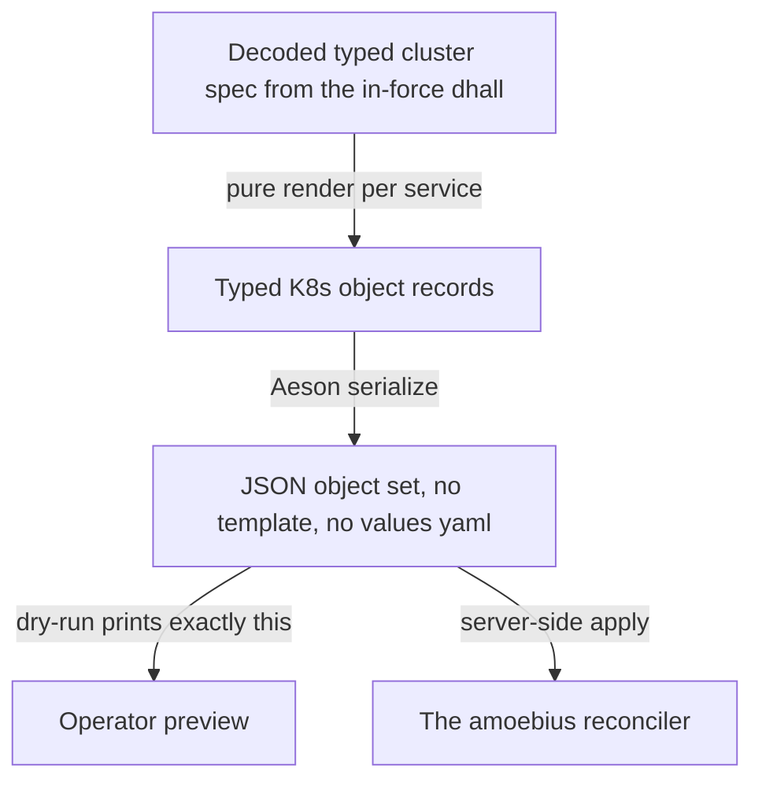
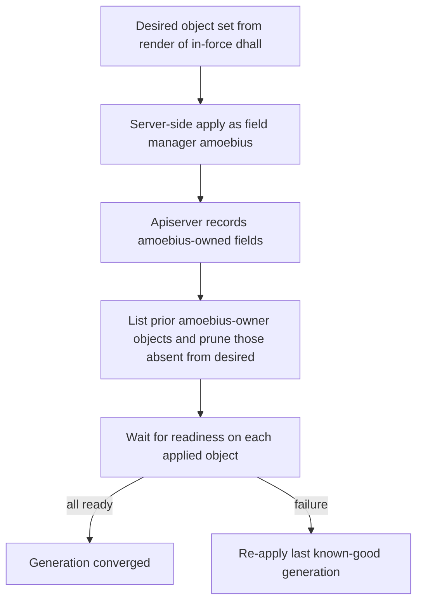
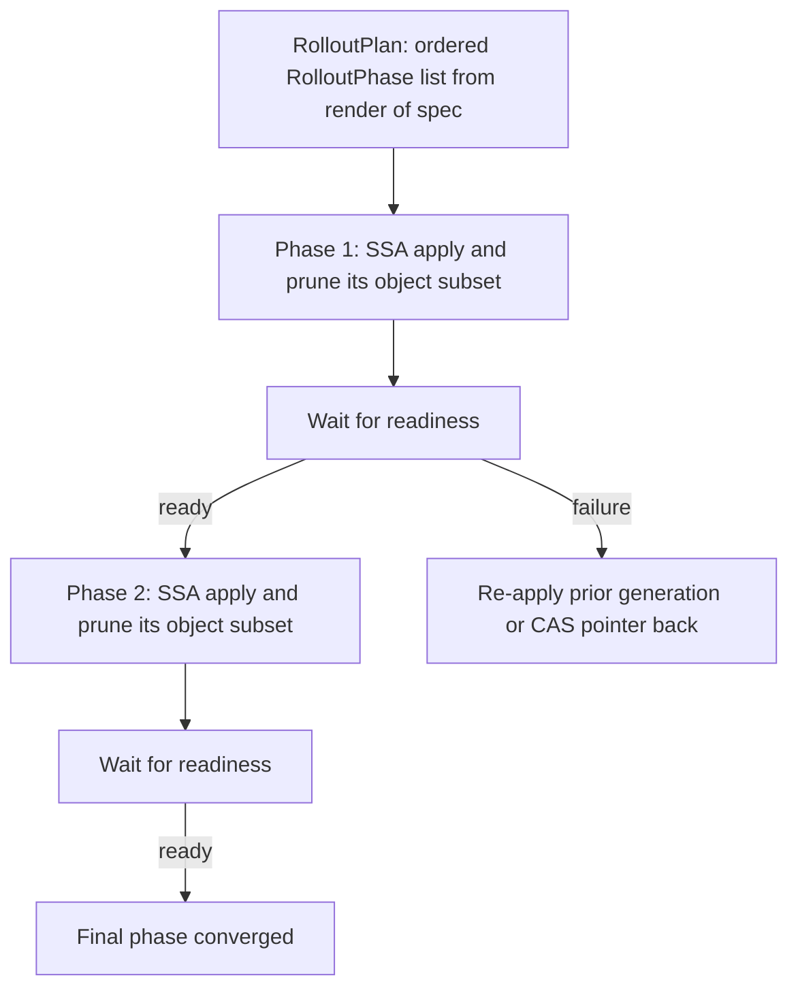
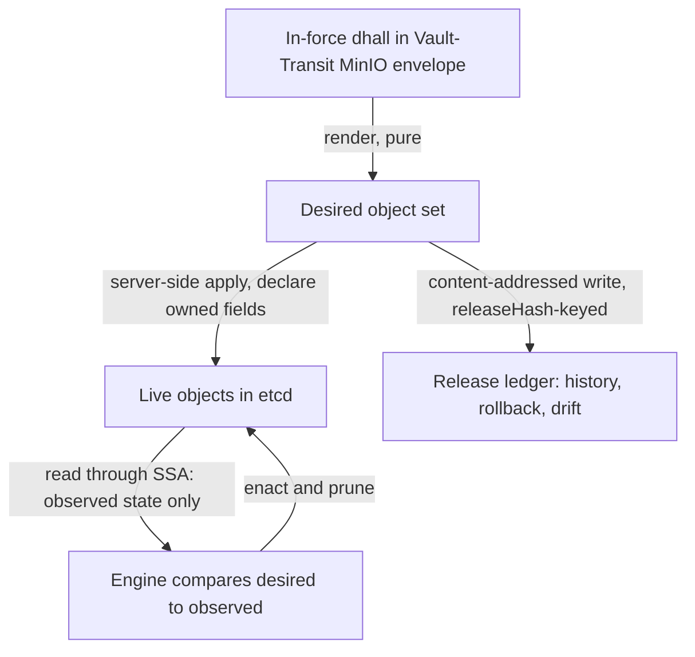

# Manifest Generation & the Typed Reconciler

**Status**: Authoritative source
**Supersedes**: N/A
**Referenced by**: documents/engineering/README.md, documents/engineering/app_vs_deployment_doctrine.md, documents/engineering/daemon_topology_doctrine.md, documents/engineering/dsl_doctrine.md, documents/engineering/illegal_state_catalog.md, documents/engineering/pulumi_iac_doctrine.md, documents/engineering/readiness_ordering_doctrine.md, documents/engineering/service_capability_doctrine.md, documents/engineering/release_lifecycle_doctrine.md
**Generated sections**: none

> **Purpose**: Single source of truth for how amoebius turns a typed cluster spec into running Kubernetes objects — a pure `render(spec)` that emits the full per-service object set from Haskell ADTs, and amoebius's own idempotent server-side-apply reconciler that applies, prunes, and waits — with **no Helm, no templating layer, and no third-party charts**.

---

## 1. Why this doctrine exists: types render manifests, Helm does not

The vision text frames the target as interpreting the DSL *"into opinionated helm deployments and cluster
configs"*, with *"a generic & reusable helm chart for amoebius apps"*.
**This doctrine records the operator's locked decision to drop that framing.** amoebius does not template
YAML and does not ship or consume a Helm chart — its own or anyone else's. It **generates the complete
per-service Kubernetes object set from pure typed Haskell**, serializes it with Aeson, and applies it with
its own reconciler ([§5](#5-the-applyreconcile-engine-server-side-apply-owned-field-manager-prune-wait)). This is the same anti-templating rule [dsl_doctrine.md §2](./dsl_doctrine.md#2-two-languages-one-system-dhall-carries-params-haskell-carries-logic)
already states for the config surface — grounded in the recorded operator vision that *"we want everything to be dhall"*, which keeps the *how* out of templated config — carried all the way down to the manifests.

Two reasons motivate the decision, and they are different:

- **A Go-templated chart is stringly-typed and unverified.** A Helm template is text that *becomes* YAML
  only after string interpolation; nothing checks that the result is a well-formed object, that a referenced
  Secret exists, or that an `image:` resolves, until the apiserver rejects it (or worse, accepts something
  subtly wrong) at deploy time. The template language has no type system, so `{{ .Values.replicas }}`
  landing in a field that wants an int, or a missing `with` guard emitting `null`, is a runtime surprise.
  This is exactly the *"valid YAML, wrong cluster"* failure class [illegal_state_catalog.md §1](./illegal_state_catalog.md#1-illegal-states-fail-to-type-check)
  exists to abolish — and a string template re-opens it underneath an otherwise-typed system.
- **A third-party chart is unreviewed YAML amoebius does not own.** Pulling `bitnami/postgresql` or an operator's
  upstream chart means running hundreds of lines of someone else's templated manifests — with their RBAC,
  their securityContext defaults, their image refs, their `hostPath` mounts — that no amoebius type ever
  inspected. Neither *"every container declares cpu/ram"* nor *"secrets are Vault-only"* can be made true by
  construction over manifests amoebius did not generate. amoebius therefore renders **every** object it applies,
  including the install manifests of the operators it runs ([§4](#4-no-third-party-charts--no-third-party-software-operators-are-generated)).

amoebius needs semantics around cluster manifest changes, and proofs of correctness / that there won't be a
degenerate or broken state — exactly the guarantee this buys. A pure
`render(spec)` over typed ADTs is where those semantics live — the manifest set is a *value* amoebius can
inspect end to end before any object reaches the cluster.

**The prodbox seed is real, and so is the gap it leaves.** The sibling prodbox project already renders a
large slice of its object set from types, not templates:
`Secret`/`ServiceAccount`/`Role`/`RoleBinding`/`ClusterIssuer`/`GatewayClass`/`EnvoyProxy`/`SecurityPolicy`/
`HTTPRoute`/`IPAddressPool` are built as `Data.Aeson.object [...]` in `src/Prodbox/CLI/Rke2.hs` and applied
with `kubectl apply -f`, and `Namespace`/`PersistentVolume`/`PersistentVolumeClaim`/`StorageClass` (provisioner
`kubernetes.io/no-provisioner`) are built from `ChartStorageSpec → ChartStorageBinding → object` in
`src/Prodbox/Lib/Storage.hs`. **But prodbox still ships its *workloads* (Deployments, StatefulSets, the
services themselves) as Helm charts**, orchestrated by the pure planner in `src/Prodbox/Lib/ChartPlatform.hs`
(`buildChartDeploymentPlan` produces a `ChartDeploymentPlan` of `ChartReleasePlan`s carrying a
`chartReleasePlanValuesJson` fed to Helm). amoebius's move is to close that gap: **lift the typed-render
discipline prodbox already applies to its supporting objects up to the entire object set, and replace the
Helm-release target with direct typed-manifest rendering plus an amoebius-owned apply engine.** That prodbox
slice is *evidence the approach works*, not proof amoebius has built the whole renderer ([§8](#8-reusable-prodbox-seeds-vs-what-is-new)).

**What this doc owns vs. what it defers.** This document owns *how* a spec becomes objects (generation, [§2](#2-the-typed-manifest-model-render-is-a-pure-total-function-to-objects)–[§4](#4-no-third-party-charts--no-third-party-software-operators-are-generated))
and *how* those objects are applied and reconciled ([§5](#5-the-applyreconcile-engine-server-side-apply-owned-field-manager-prune-wait)–[§6](#6-the-reconcile-state-model-desired-is-renderdhall-observed-is-etcd-a-diff-is-typed)). It does **not** own:

| Concern | Owned by |
|---------|----------|
| *What* services/capabilities exist, their canonical providers, and the per-cluster deployment *shape* | [service_capability_doctrine.md](./service_capability_doctrine.md) |
| The standard service set, HA-always, the derived-NetworkPolicy connectivity rule, the cpu/ram rule, the single ingress path | [platform_services_doctrine.md](./platform_services_doctrine.md) |
| The DSL surface the spec decodes from, and the two typed gates | [dsl_doctrine.md](./dsl_doctrine.md) |
| The *catalog* of unrepresentable states and the typing techniques | [illegal_state_catalog.md](./illegal_state_catalog.md) |
| Secrets-by-name / `SecretRef` / Vault k8s auth — a manifest never carries a plaintext secret | [vault_pki_doctrine.md](./vault_pki_doctrine.md) |
| Retained `no-provisioner` PV mechanics for StatefulSet storage | [storage_lifecycle_doctrine.md](./storage_lifecycle_doctrine.md) |
| The build pipeline, the baked base container, and registry refs | [image_build_doctrine.md](./image_build_doctrine.md) |
| The control-plane singleton that *runs* this reconciler | [daemon_topology_doctrine.md](./daemon_topology_doctrine.md) |
| The cluster-level `discover → diff → enact` reconciler shape this specializes | [cluster_lifecycle_doctrine.md §9](./cluster_lifecycle_doctrine.md#9-how-bring-up-and-teardown-are-implemented-the-reconciler-not-a-state-machine) |

---

## 2. The typed manifest model: `render` is a pure, total function to objects

The core object is one pure function:

```haskell
-- Conceptual shape — the renderer is the value this doctrine specifies.
render :: ServiceSpec -> [K8sObject]
```

`render` takes a typed description of one service (or one operator, or one app) and returns the **complete
set of typed Kubernetes objects** that service requires — `Deployment` / `StatefulSet` / `Service` /
`Secret` (reference only, [§3](#3-best-practice-by-construction-an-unsafe-manifest-is-not-constructible)) / RBAC (`ServiceAccount` / `Role` / `RoleBinding` / `ClusterRole*`) /
`NetworkPolicy` / `HTTPRoute` / `Gateway` / `ConfigMap` / `CustomResourceDefinition` / a Custom Resource
instance / `ClusterIssuer` / `Certificate` — each as a typed Haskell record serialized to JSON via Aeson,
exactly as prodbox already serializes its supporting objects ([§1](#1-why-this-doctrine-exists-types-render-manifests-helm-does-not)). There is no intermediate text template
and no `values.yaml`; the *record* is the manifest.

Among those objects, the rendered **`ConfigMap`** is how an **in-cluster pod** frame receives its own
`.dhall` — the one config-delivery path that stays a ConfigMap mount rather than the in-place `stdin`
streaming used for the VM/container bootstrap-lift frames. [dsl_doctrine.md §3](./dsl_doctrine.md#3-the-orchestration-surface-parameters-context-witness) owns that
frame-descent delivery contract; this doc owns only the ConfigMap render.

Three properties make this the right shape:

- **Pure and total.** `render` performs no I/O, reaches no cluster, and (being a total function over a
  decoded, total Dhall value — [dsl_doctrine.md §5](./dsl_doctrine.md#5-the-illegal-state-unrepresentable-contract))
  always produces a value. The plan **is data**: `amoebius … --dry-run` can print the exact object set it
  would apply without contacting the apiserver, the same "what is previewed is what runs" guarantee the
  chain/Step algebra gives the lifecycle ([dsl_doctrine.md §2](./dsl_doctrine.md#2-two-languages-one-system-dhall-carries-params-haskell-carries-logic)).
- **Unit-testable without a cluster.** Because `render` is pure, a test asserts properties of the *emitted
  objects* — "every container has resource requests and limits," "no Service is type `LoadBalancer` outside
  the edge," "the rendered RBAC grants exactly these verbs" — by inspecting the returned `[K8sObject]`. No
  kind cluster, no apiserver, no golden-YAML diffing of templated strings. This is the manifest-layer face
  of the project's pure-FP testing posture.
- **Composable per the dependency graph.** The cluster renderer is the fold of every service's `render`
  over the decoded spec; ordering and connectivity are derived from the declared dependency graph, not
  hand-authored ([§3](#3-best-practice-by-construction-an-unsafe-manifest-is-not-constructible)). One spec value renders the whole cluster.



---

## 3. Best practice by construction: an unsafe manifest is not constructible

Because amoebius *generates* every object, it can make the safe shape the *only* shape — the manifest that
omits a best practice is not a manifest the renderer can emit. Each rule below is enforced at the type/decode
layer; the *unrepresentability* of its violation is catalogued, state by state, by
[illegal_state_catalog.md](./illegal_state_catalog.md) (the owner — this section only names which generation
rules feed it):

- **Every container declares CPU and RAM.** The workload record *requires* a `Resources` field with refined
  non-zero requests and limits, so an "unlimited pod" has no inhabitant. The rule itself is owned by
  [platform_services_doctrine.md §10](./platform_services_doctrine.md#10-every-container-declares-cpu-and-ram);
  whether it is a type-inhabitance or a decode-time check is classified by
  [illegal_state_catalog.md §6](./illegal_state_catalog.md#6-three-layers-of-foreclosure-and-the-honesty-they-force).
- **Every pod gets a hardened `securityContext`.** `render` attaches a non-root, no-privilege-escalation,
  read-only-root-filesystem-by-default, dropped-capabilities security context to every workload it emits;
  there is no code path that renders a bare pod spec. A chart amoebius does not own cannot make this promise ([§1](#1-why-this-doctrine-exists-types-render-manifests-helm-does-not)).
- **RBAC is least-privilege per workload.** A workload's `ServiceAccount` / `Role` / `RoleBinding` are
  rendered *from the same value that declares the workload*, scoped to exactly the verbs and resources that
  workload needs — the technique prodbox already uses in `Rke2.hs` (it renders `ServiceAccount` + `Role` +
  `RoleBinding` triples as typed objects). There is no shared over-privileged role to over-grant.
- **NetworkPolicy is default-deny plus derived-allow.** Operators never hand-author allow/deny rules;
  `render` emits a default-deny baseline and then exactly the edges the declared dependency graph permits.
  The connectivity rule is owned by
  [platform_services_doctrine.md §9 → east-west connectivity is derived from the dependency graph](./platform_services_doctrine.md#9-the-loadbalancer-and-the-single-wild-ingress-path),
  and the "service stranded from a dependency it declared" / "open policy for an undeclared edge" states are
  catalogued unrepresentable at [illegal_state_catalog.md §3.6](./illegal_state_catalog.md#36-blocking-networkpolicy-services-cant-reach-each-other).
- **Secrets are Vault-only; a manifest never carries a plaintext secret.** A rendered object references a
  secret by name and the workload reads it via Vault Kubernetes auth at runtime; the renderer has no input
  that is a literal secret value, because the spec carries only a `SecretRef`. The whole model — `SecretRef`,
  parent→child injection, Vault k8s auth, the fail-closed posture — is owned by
  [vault_pki_doctrine.md](./vault_pki_doctrine.md) and must not be restated here. The relevant generation
  fact: *a Secret object amoebius renders carries a Vault coordinate, never bytes.*

The framing is uniform: **a manifest lacking any of these is not a value `render` can return.** That is
strictly stronger than a chart linter that flags violations after the fact — there is nothing to flag,
because there was never a value to lint.

---

## 4. No third-party charts ≠ no third-party software: operators are *generated*

prodbox today still consumes five upstream operator/platform charts — Harbor, MetalLB, Envoy Gateway,
cert-manager, and the Percona PostgreSQL operator. amoebius eliminates all five **as charts** without
eliminating the software. The distinction has three parts:

- **The operator *binary* is baked, not pulled.** Every third-party service binary — including each
  operator's controller — is baked into the multi-arch amoebius base container per the supply-chain rule;
  the build pipeline, the baked base container, and the resulting registry refs are owned by
  [image_build_doctrine.md](./image_build_doctrine.md). amoebius does not pull an upstream operator image
  from a public registry at steady state.
- **The operator's *install manifests* are generated.** Instead of `helm install cert-manager`, `render`
  emits the operator's `CustomResourceDefinition`s, its controller `Deployment`, and its RBAC as typed
  objects — the same `object [...]` discipline prodbox already uses for `EnvoyProxy`, `GatewayClass`,
  `ClusterIssuer`, and friends in `Rke2.hs`. The install is amoebius's manifests running amoebius's baked
  binary.
- **The operator's *CR instances* are generated too.** A `Certificate`, a `PerconaPGCluster`, a `Gateway`,
  an `IPAddressPool` is rendered from the typed service spec that needs it. prodbox already renders the
  Gateway-API and cert-manager CRs this way; amoebius extends the same treatment to the Postgres and LB
  operators' CRs. The operator binary then reconciles its own CRs as usual.

So **"no third-party charts" is not "no third-party software."** cert-manager still issues certificates and
the Percona operator still runs Patroni — amoebius simply owns every byte of YAML around them and pulls the
binaries from its own registry.

This is also where the registry itself changes shape. amoebius's image registry is the single-binary
`distribution` OCI registry (`registry:2`) — baked like MinIO and Vault — which **replaces Harbor**: no
Trivy scanning, no UI, no robot RBAC, no replication, by design. *Which* provider backs the Registry
capability is owned by [service_capability_doctrine.md](./service_capability_doctrine.md); the generation
consequence here is only that amoebius renders the registry's own manifests like any other service rather
than installing a Harbor chart.

> A later, per-service option this doctrine deliberately leaves open: where an operator's job is small and
> well-understood, amoebius may eventually **reimplement that reconcile loop natively** (its own typed
> reconciler emitting the leaf objects directly) rather than running the upstream operator binary at all.
> That is a deferred choice made per service, not a present commitment — and it is exactly the same
> `discover → diff → enact` loop as [§5](#5-the-applyreconcile-engine-server-side-apply-owned-field-manager-prune-wait).

---

## 5. The apply/reconcile engine: server-side apply, owned field manager, prune, wait

Dropping Helm means amoebius must supply, in its own code, the one useful thing Helm did: take a
desired object set and *make the cluster match it, idempotently*. amoebius's engine is the
`discover → diff → enact → re-observe` reconciler of
[cluster_lifecycle_doctrine.md §9](./cluster_lifecycle_doctrine.md#9-how-bring-up-and-teardown-are-implemented-the-reconciler-not-a-state-machine),
specialized from "any resource the forest can create" down to "Kubernetes objects in this cluster." It is
**run by the elected control-plane singleton** — the in-cluster role with total cluster authority owned by
[daemon_topology_doctrine.md §3](./daemon_topology_doctrine.md#3-the-control-plane-singleton--exactly-one-elected) —
never by a CLI invocation racing another writer.

The mechanism, four parts:

- **Server-side apply under a fixed `amoebius` field manager.** Every object is applied with SSA declaring
  the `amoebius` field manager. The apiserver then tracks, per field, that amoebius owns it. amoebius
  declares the fields it intends and lets Kubernetes merge — it does **not** GET-modify-PUT, so it does not
  clobber fields owned by other managers (e.g. a controller-populated status), and a field amoebius owns
  that has drifted is forced back to the declared value on the next apply. Drift self-heals because re-apply
  re-asserts ownership.
- **Owner-label / ApplySet pruning.** Every rendered object carries an `amoebius/owner` label identifying
  the spec generation that produced it. After applying the desired set, the engine lists the previously-owned
  objects (the prior ApplySet) and **prunes any object with the owner label that is no longer in the desired
  set** — this is how a removed service's objects are garbage-collected without a release store. prodbox
  already seeds exactly this: it stamps every object it renders with a `prodbox.io/id` label and annotation
  (`prodboxLabelKey` / `prodboxAnnotationKey` in `Rke2.hs`), which is precisely the owner key an ApplySet
  prune recovers the prior object set from.
- **Wait-for-ready.** After apply, the engine waits for the relevant readiness condition (rollout complete,
  `Ready`/`Available`, CR `status` healthy) before declaring the generation converged — replacing Helm's
  `--wait`. Readiness is observed from the live object, never assumed by a `threadDelay`.
- **Rollback.** Because each applied generation is recorded in the release ledger ([§6.1](#61-the-release-ledger-the-applied-log-is-canonical-not-optional)), a failed
  convergence can re-apply the prior generation's object set — the same SSA-declare-and-prune path, pointed at
  the last known-good desired state. A *phased* or canary rollout is the ordered form of this same apply,
  driven by the typed `RolloutPlan` of [§5.1](#51-the-rolloutplan-ordered-readiness-gated-phases-on-this-same-reconciler-tier-c).

**What is genuinely new vs. prodbox.** prodbox applies with `kubectl apply -f <manifest>` and owns objects by
the `prodbox.io/id` label, but it does **not** drive SSA with a named field manager, does **not** do
ApplySet-style pruning of a prior owned set, and leans on Helm for rollout-wait of its workloads. The
**SSA field-manager model, the ApplySet prune, the unified wait-for-ready, and rollback are amoebius's new
code** — the part Helm otherwise provided. The label-as-owner-key and the typed-`object` rendering are the
seed; the reconciler around them is new ([§8](#8-reusable-prodbox-seeds-vs-what-is-new)).



> **Honesty.** This engine is **design intent for Phase 2**, not a built amoebius result. SSA field
> managers, ApplySet pruning, and SSA-based drift correction are real, documented Kubernetes mechanisms;
> *that amoebius wires them into this specific reconciler* is specified here and unproven until the phase
> lands. The idempotent `discover → diff → enact` shape it specializes is *proven in prodbox* for AWS/cluster
> teardown — evidence from a sibling, not amoebius proof ([documentation_standards.md §6](../documentation_standards.md#6-honesty-the-proventestedassumed-discipline)).

### 5.1 The `RolloutPlan`: ordered, readiness-gated phases on this same reconciler (tier (c))

[§5](#5-the-applyreconcile-engine-server-side-apply-owned-field-manager-prune-wait) converges *one* generation in a single declare-and-prune pass. Some changes must not land as one pass: a
schema migration, a canary, a message-bus consumer cutover need **ordered, readiness-gated steps**, each
gated on the *previous* step's live readiness before the next is applied. amoebius expresses that as a typed
value the reconciler folds — not an imperative script and not a Helm release list:

```haskell
-- Conceptual shape. A RolloutPlan is data; the tier-(c) reconciler folds it phase by phase.
type RolloutPlan  = [RolloutPhase]            -- ordered; phase n+1 waits on phase n's readiness
data RolloutPhase = RolloutPhase
  { phaseObjects   :: [K8sObject]             -- the render(spec) object subset this phase applies (§2)
  , phaseReadiness :: ReadinessGate           -- the live condition that must hold before the next phase
  }
```

- **Same reconciler, no new one.** Each `RolloutPhase` is one SSA-declare-and-prune pass over its object
  subset ([§5](#5-the-applyreconcile-engine-server-side-apply-owned-field-manager-prune-wait)); between phases, the engine's existing **wait-for-ready** ([§5](#5-the-applyreconcile-engine-server-side-apply-owned-field-manager-prune-wait)) is the gate. Enactment is
  **this doc's tier-(c) reconciler** — the in-cluster SSA/ApplySet manifest engine; tier (a) (Pulumi-checkpointed
  cloud IaC) and tier (b) (checkpoint-free tag-discovery host) live in
  [pulumi_iac_doctrine.md](./pulumi_iac_doctrine.md). A `RolloutPlan` introduces **no new reconciler** and no
  orchestration daemon — the plan is a `render(spec)`-derived value folded by the engine already run by the
  control-plane singleton ([daemon_topology_doctrine.md §3](./daemon_topology_doctrine.md#3-the-control-plane-singleton--exactly-one-elected)).
- **Where the plan is owned.** The typed `RolloutPlan` / `RolloutPhase`, the `Environment` promotion pointer,
  and the `Release` a rollout advances are owned by [release_lifecycle_doctrine.md §5](./release_lifecycle_doctrine.md#5-rolloutplan--rolloutphase-the-readiness-gated-apply)
  (and [§2](#2-the-typed-manifest-model-render-is-a-pure-total-function-to-objects) for the ledger it advances); **this doc owns only their *enactment* on the tier-(c) reconciler.**
- **DB-schema migration is a `RolloutPhase` (runtime-checked residue; deferred).** A schema change is a
  phase sequence obeying **create-new → verified-migrate → retire-old** — the exact anti-in-place-destruction
  ordering owned by [storage_lifecycle_doctrine.md §8](./storage_lifecycle_doctrine.md#8-shrinking-storage-without-representing-data-destruction):
  stand up the new schema/table, run the migration and *verify it behind a readiness gate*, and only then
  retire the old — never an in-place mutation. The ordering is enforced by the reconciler's readiness gate at
  runtime, **runtime-checked**: the list is data, and the "no retire-old before verified-migrate" property holds
  because the engine will not apply phase *n+1* until phase *n* is live-ready — it is not a type-level
  impossibility.
- **Canary and cutover.** A canary phase is a **Gateway-API `HTTPRoute` `backendRefs` weight shift** on the
  Envoy edge amoebius already renders — the traffic-split mechanism owned by
  [network_fabric_doctrine.md §6](./network_fabric_doctrine.md#6-the-service-mesh-verdict-no-linkerd-for-v1)
  (no service mesh needed). A Pulsar workload cuts over by **consumer-group**, not by weight.
  **Rollback** is not special-cased: re-apply the prior generation's object set (the [§5](#5-the-applyreconcile-engine-server-side-apply-owned-field-manager-prune-wait) rollback path) or
  CAS the environment pointer back to the prior `Release` — both are ordinary reconciles.



> **Sibling evidence (the PATTERN, not Helm; not an amoebius result).** jitML's
> `~/jitML/src/JitML/Cluster/Helm.hs` carries exactly this shape: a closed
> `data HelmPhase = HarborPhase | PlatformPhase | FinalPhase` and a `phasedReleases :: [HelmRelease]` whose
> every element is tagged with a `releasePhase`, folded by `helmPhasedRolloutPlan` into an ordered plan;
> `~/jitML/src/JitML/Cluster/Readiness.hs` supplies the between-phase gates (`postgresReadinessSubprocesses`,
> `rolloutStatusSubprocess`, `runMinioBucketReadinessIO`); and `~/jitML/src/JitML/Bootstrap.hs` **splits its
> rollout around a live schema grant** — `livePreGrantSubprocessesForPort` brings the operator and cluster up
> *through readiness*, the typed Haskell schema grant then runs, and `livePostGrantSubprocessesForPort`
> continues — the readiness-gated pre/post migration shape, LIVE in a sibling. But jitML enacts every phase
> with `helm install`; amoebius keeps only the **phase-tagged ordered list + readiness gate**, renames
> `HelmPhase` → `RolloutPhase`, and enacts each phase as a `render(spec)` SSA pass with **no Helm**. This is
> sibling evidence, not an amoebius result.

> **Honesty.** The `RolloutPlan` is **Phase-2 design intent** — it rides the tier-(c) SSA reconciler, itself
> Phase 2 and unbuilt; the DB-schema-migration `RolloutPhase` is the **deferred Phase-14** shape, proven
> *only* as the Helm-driven pattern in the jitML sibling. Read as the contract amoebius intends, never as a
> tested amoebius result.

---

## 6. The reconcile state model: desired is `render(.dhall)`, observed is etcd, a diff is typed

This is the decision that makes "no Helm" coherent: **amoebius keeps no release store.** Helm persists each
release as an opaque gzipped Secret holding the rendered manifests, and the cluster's "desired state" is
*that stored blob*. amoebius does not. Its model is:

- **Desired state is a pure function of the in-force spec.** `desired = render(in-force .dhall)`, and the
  *home* of the in-force `.dhall` is the Vault-Transit-enveloped MinIO object that is the cluster's
  single source of truth — owned by [vault_pki_doctrine.md](./vault_pki_doctrine.md) (decrypt-in-process,
  never plaintext at rest) and the Pulumi/MinIO backend. There is no second desired-state store to drift out
  of sync with the spec, because desired state is *recomputed* from the spec, not stored.
- **Observed state is etcd, read through SSA.** The cluster's live objects are the only "observed" store.
  The engine reads them (and their `amoebius`-managed fields) directly; etcd holds **only** live state, never
  a copy of the desired spec.
- **A replica change is a typed spec-generation diff, not a cluster diff.** Bumping a Deployment from 1 to 3
  replicas is a change to the *rendered spec value*, and SSA simply **declares the new owned field**. amoebius
  does **not** need to read the old replica count to set the new one — it declares `replicas = 3` as a field
  it owns, and the apiserver reconciles. Drift (someone hand-scaled to 5) is corrected on the next apply
  because amoebius re-asserts the owned value. This is why "declare-new, no need to know the old" is sound.
- **Pruning recovers the prior set from etcd, not from a release manifest.** When a service is removed from
  the spec, its objects are found by their `amoebius/owner` label on the live objects ([§5](#5-the-applyreconcile-engine-server-side-apply-owned-field-manager-prune-wait)) and pruned — the
  prior object set is reconstructed from the cluster, never from a stored Helm release.
- **Each applied generation is persisted content-addressed — the canonical release ledger.** amoebius writes
  each rendered generation into the content-addressed MinIO store (pointers → manifests → blobs), reusing the
  mechanism owned by [content_addressing_doctrine.md](./content_addressing_doctrine.md). That buys a **typed
  revision history**, **rollback** to any prior generation ([§5](#5-the-applyreconcile-engine-server-side-apply-owned-field-manager-prune-wait)), and **drift detection** (diff live objects
  against the recorded generation) — and it is strictly *more* than Helm offers: typed, content-addressed,
  deduplicated, and confluent across clusters, where Helm's release Secret is an opaque gzip blob with no
  cross-cluster story. **[§6.1](#61-the-release-ledger-the-applied-log-is-canonical-not-optional) promotes this applied-log from *optional* to THE canonical immutable release
  ledger keyed by `releaseHash`** — a durable record of *what was applied*, never a second desired-state
  store.

The contrast is direct. Helm's release store has well-known desync failure modes — the stored release and
the live cluster disagree after a manual `kubectl edit`, a `helm rollback` to a release whose manifests no
longer match the chart, or a half-applied upgrade that leaves the release marked `deployed` over a broken
object set. amoebius has **no release store to desync**: desired state is always exactly `render(spec)`, and
the only persisted history is the immutable, content-addressed release ledger ([§6.1](#61-the-release-ledger-the-applied-log-is-canonical-not-optional)) — a record of *what was
applied*, not a competing source of desired state.



### 6.1 The release ledger: the applied-log is canonical, not optional

[§6](#6-the-reconcile-state-model-desired-is-renderdhall-observed-is-etcd-a-diff-is-typed)'s applied-log is described as *optional*. **This subsection promotes it: the immutable, content-addressed
applied-log is THE canonical release ledger** — the one durable record of what amoebius has deployed. The
promotion changes *nothing* about desired state: **desired is still `render(in-force .dhall)`, and there is
still no separate desired-state store** ([§6](#6-the-reconcile-state-model-desired-is-renderdhall-observed-is-etcd-a-diff-is-typed)). The ledger records *what was applied*; it never becomes a thing
the reconciler converges *toward*.

- **A `Release` is one immutable ledger entry, keyed by `releaseHash`.** Each converged generation is written
  content-addressed as a `Release = { releaseHash, deploymentDhallRef, imageDigests, substrateFp }`, where
  `releaseHash = sha256(resolved-deployment-dhall ‖ image-digests ‖ substrate-fp)` — a hash **class**
  registered in the
  [content_addressing_doctrine.md §2.3 master table](./content_addressing_doctrine.md#23-the-hashpointer-master-table-four-hash-classes-three-pointer-kinds),
  namespaced away from `experimentHash` / `kernelKey` / the OCI image digest and never shared with them. The
  ledger reuses the same pointer → manifest → blob store [§6](#6-the-reconcile-state-model-desired-is-renderdhall-observed-is-etcd-a-diff-is-typed) already names; the `Release` type, the ledger, the
  `Environment` promotion pointer, and the `PromotionGate` are owned by
  [release_lifecycle_doctrine.md §2](./release_lifecycle_doctrine.md#2-release-and-the-immutable-release-ledger-releasehash) (ledger) and [§3](#3-best-practice-by-construction-an-unsafe-manifest-is-not-constructible)–[§4](#4-no-third-party-charts--no-third-party-software-operators-are-generated) (pointer, gate) —
  **this doc owns only that the reconciler *writes* the entry on convergence.**
- **Why canonical, not optional.** An append-only `releaseHash`-keyed ledger is what makes rollback ([§5](#5-the-applyreconcile-engine-server-side-apply-owned-field-manager-prune-wait)),
  drift detection (diff live objects against a recorded `Release`), typed revision history, and cross-cluster
  confluence *always* available rather than best-effort — and it is the auditability substrate that lets
  amoebius refuse an external CI/CD control plane (no Argo/Flux/Tekton), owned by
  [release_lifecycle_doctrine.md §1](./release_lifecycle_doctrine.md#1-no-external-cicd-control-plane--delivery-is-typed-composition-on-primitives-amoebius-owns). Leaving it optional would reintroduce a
  "sometimes there is no history" mode; promoting it closes that.
- **Still not a Helm release store.** The ledger is immutable and content-addressed — a *new* `releaseHash`
  per generation, never an in-place-mutated blob — so it has none of the desync modes of Helm's gzipped
  release Secret ([§6](#6-the-reconcile-state-model-desired-is-renderdhall-observed-is-etcd-a-diff-is-typed)). The environment pointers that *select* a `Release` (dev / staging / prod, advanced by
  ETag-CAS under a `PromotionGate`) are pointer kinds in the same
  [§2.3 master table](./content_addressing_doctrine.md#23-the-hashpointer-master-table-four-hash-classes-three-pointer-kinds)
  and are owned by release_lifecycle_doctrine.md [§3](./release_lifecycle_doctrine.md#3-environment-and-the-etag-cas-promotion-pointer)–[§4](./release_lifecycle_doctrine.md#4-promotiongate-promote-unverifiedprod-is-unrepresentable), not here.

> **Honesty.** The release ledger is **Phase-N design intent** — it composes with the content-store phase
> ([§9](#9-planning-ownership)) and the tier-(c) reconciler (Phase 2), neither built in amoebius. Content-addressed immutable storage
> is proven mechanism; *that amoebius records each converged generation as a `releaseHash`-keyed `Release` and
> promotes environments by CAS over it* is specified across this [§6.1](#61-the-release-ledger-the-applied-log-is-canonical-not-optional) and release_lifecycle_doctrine.md and is
> unbuilt.

---

## 7. One renderer, many shapes: per-cluster structure is why generation beats templating

prodbox enforces **substrate-equivalence** with a lint: the home and AWS substrates must stand up the
*identical* service set with identical image refs, and a build-time check forbids any substrate-keyed
re-pinning ([platform_services_doctrine.md §12](./platform_services_doctrine.md#12-substrate-equivalence-as-a-structural-invariant)).
**amoebius deliberately reverses that constraint for service *shape*.** A capability has one canonical
provider, but the same capability may take a **structurally different deployment shape per cluster** —
single-node MinIO on a laptop kind vs. distributed MinIO on a provider cluster; a one-replica Patroni vs. a
three-replica Patroni — a difference of *object structure*, not merely of a `values` scalar.

This is precisely what a values-only Helm chart handles badly and a typed renderer handles cleanly. A single
chart parameterized by a `replicas` value cannot, without templating contortions, emit a *different set and
shape* of objects for "single-node" vs. "distributed"; a typed `render :: CapabilitySpec -> [K8sObject]`
just pattern-matches the shape and returns the right object set, each shape independently type-checked. The
capability abstraction — capabilities named by role (`ObjectStore`, `SecretStore`, `MessageBus`, `Sql`,
`Identity`, `Observability`, `Registry`, `Edge`), one canonical provider each, the type *admitting* alternates
later, and the per-cluster shapes — is owned by [service_capability_doctrine.md](./service_capability_doctrine.md);
**this doc owns only the rendering consequence**: generation, not templating, is what makes per-cluster
structural shapes expressible while keeping each shape best-practice-by-construction ([§3](#3-best-practice-by-construction-an-unsafe-manifest-is-not-constructible)).

> **Honesty.** Per-cluster structural shapes are design intent (Phase 3 capability abstraction), and the
> reversal of prodbox's substrate-equivalence lint is a deliberate amoebius decision, not an inherited-proven
> behaviour. prodbox's equivalence lint is the *evidence* that structural divergence is the thing worth
> controlling; amoebius chooses to control it by typing rather than by forbidding it.

---

## 8. Reusable prodbox seeds vs. what is new

Stating the boundary honestly, because most of this generalizes a sibling rather than inheriting a proof:

| Capability | prodbox seed (evidence) | amoebius status |
|---|---|---|
| Render supporting objects from typed records to Aeson | `Rke2.hs` (`Secret`, RBAC, `GatewayClass`, `EnvoyProxy`, `SecurityPolicy`, `HTTPRoute`, `ClusterIssuer`, `IPAddressPool`), `Storage.hs` (`Namespace`, `PV`, `PVC`, `StorageClass`) | **Generalize** into one typed manifest library covering the *whole* object set |
| Pure deployment planner with dependency/values orchestration | `ChartPlatform.hs` (`buildChartDeploymentPlan` → `ChartDeploymentPlan`/`ChartReleasePlan`) | **Repurpose** the planner; **drop** its Helm-release/`valuesJson` target |
| Owner-label stamping for object ownership | `prodbox.io/id` label + annotation on every rendered object | **Reuse** as the `amoebius/owner` ApplySet prune key |
| Full **workload** renderer (Deployment/StatefulSet/Service from types) | prodbox still uses Helm charts for workloads | **New** — the gap [§1](#1-why-this-doctrine-exists-types-render-manifests-helm-does-not) closes |
| Server-side apply with a named field manager + ApplySet pruning + wait-for-ready + rollback | prodbox uses `kubectl apply -f` + Helm `--wait` | **New** — the engine [§5](#5-the-applyreconcile-engine-server-side-apply-owned-field-manager-prune-wait) |
| Generated operator installs + CR instances (no upstream charts) | prodbox consumes 5 upstream charts | **New** — [§4](#4-no-third-party-charts--no-third-party-software-operators-are-generated) |
| Multi-arch baked binaries replacing public-registry pulls | prodbox caches via Harbor mirror (`ContainerImage.hs`, `DockerConfig.hs` no-`docker login`) | **New** ([image_build_doctrine.md](./image_build_doctrine.md)) |

---

## 9. Planning ownership

This document is normative manifest-generation-and-reconcile doctrine only. Delivery sequencing, completion
status, validation gates, and remaining work are owned by
[../../DEVELOPMENT_PLAN/README.md](../../DEVELOPMENT_PLAN/README.md), never restated here. For orientation
only (the plan is authoritative): the **typed manifest renderer and the server-side-apply reconciler** land
with platform services in **Phase 2**; the **capability abstraction and per-cluster shapes** ride the DSL
type-family work in **Phase 3**; the **content-addressed release ledger ([§6.1](#61-the-release-ledger-the-applied-log-is-canonical-not-optional))** composes with the
content-store phase; and the **`RolloutPlan` / `RolloutPhase`** enactment ([§5.1](#51-the-rolloutplan-ordered-readiness-gated-phases-on-this-same-reconciler-tier-c)) rides the tier-(c) reconciler,
with the DB-schema-migration phase deferred to **Phase 14**. This doc states the target shape and links back
for status.

---

## Cross-references

- [Engineering Doctrine Index](./README.md)
- [Service Capability Doctrine](./service_capability_doctrine.md) — *what* shape each capability takes and its canonical provider; this doc owns *how* it renders
- [DSL Doctrine](./dsl_doctrine.md) — the spec surface the renderer consumes and the two typed gates
- [Illegal State Catalog](./illegal_state_catalog.md) — the unrepresentability of the unsafe manifests [§3](./illegal_state_catalog.md#3-the-catalog--states-a-valid-spec-cannot-represent) forecloses
- [Platform Services Doctrine](./platform_services_doctrine.md) — the standard set, the derived-NetworkPolicy rule ([§9](./platform_services_doctrine.md#9-the-loadbalancer-and-the-single-wild-ingress-path)), the cpu/ram rule ([§10](./platform_services_doctrine.md#10-every-container-declares-cpu-and-ram)), substrate-equivalence ([§12](./platform_services_doctrine.md#12-substrate-equivalence-as-a-structural-invariant))
- [Readiness Ordering Doctrine](./readiness_ordering_doctrine.md) — [§6](./readiness_ordering_doctrine.md#6-the-runtime-enactor-the-reconciler-observes-never-sleeps) the [§5](#5-the-applyreconcile-engine-server-side-apply-owned-field-manager-prune-wait) wait-for-ready is the runtime enactor of a readiness edge (observed from the live object, never a `threadDelay`)
- [Resource Capacity Doctrine](./resource_capacity_doctrine.md) — `render` consumes the capacity-checked IR; overcommit is rejected before render
- [Cluster Topology Doctrine](./cluster_topology_doctrine.md) — the compute-engine/topology the rendered node set realizes
- [Vault / PKI Doctrine](./vault_pki_doctrine.md) — secrets-by-name; a rendered manifest never carries plaintext secret bytes
- [Storage Lifecycle Doctrine](./storage_lifecycle_doctrine.md) — retained `no-provisioner` PVs for StatefulSet storage; [§8](./storage_lifecycle_doctrine.md#8-shrinking-storage-without-representing-data-destruction) create-new→verified-migrate→retire-old is the DB-schema-migration `RolloutPhase` ([§5.1](./storage_lifecycle_doctrine.md#51-storage-is-independent-of-the-node-lifecycle))
- [Content Addressing Doctrine](./content_addressing_doctrine.md) — the content-addressed store backing the [§6.1](./content_addressing_doctrine.md#61-proven--tested--assumed-spelled-out) release ledger; the [§2.3](./content_addressing_doctrine.md#23-the-hashpointer-master-table-four-hash-classes-three-pointer-kinds) master table registers `releaseHash`
- [Release Lifecycle Doctrine](./release_lifecycle_doctrine.md) — `Release` / `releaseHash` ledger ([§2](./release_lifecycle_doctrine.md#2-release-and-the-immutable-release-ledger-releasehash)), the `Environment` promotion pointer / `PromotionGate` ([§3](./release_lifecycle_doctrine.md#3-environment-and-the-etag-cas-promotion-pointer)–[§4](./release_lifecycle_doctrine.md#4-promotiongate-promote-unverifiedprod-is-unrepresentable)), and the `RolloutPlan` / `RolloutPhase` ([§5](./release_lifecycle_doctrine.md#5-rolloutplan--rolloutphase-the-readiness-gated-apply)) this doc's tier-(c) reconciler enacts ([§5.1](#51-the-rolloutplan-ordered-readiness-gated-phases-on-this-same-reconciler-tier-c))
- [Network Fabric Doctrine](./network_fabric_doctrine.md) — the Gateway-API `HTTPRoute` weight shift ([§6](./network_fabric_doctrine.md#6-the-service-mesh-verdict-no-linkerd-for-v1)) that is the canary `RolloutPhase` ([§5.1](#51-the-rolloutplan-ordered-readiness-gated-phases-on-this-same-reconciler-tier-c))
- [Image Build Doctrine](./image_build_doctrine.md) — the build pipeline, baked base container, and registry refs
- [Daemon Topology Doctrine](./daemon_topology_doctrine.md) — the control-plane singleton that runs the reconciler
- [Cluster Lifecycle Doctrine](./cluster_lifecycle_doctrine.md) — the `discover → diff → enact` reconciler shape this specializes
- [App vs Deployment Doctrine](./app_vs_deployment_doctrine.md) — replica counts and topology are deployment rules, not app logic
- [Development Plan](../../DEVELOPMENT_PLAN/README.md)
- [Documentation Standards](../documentation_standards.md)

> **Honesty.** Everything in this doctrine is Phase 0 **design intent**: the typed manifest renderer and the
> server-side-apply reconciler are Phase 2, and the capability abstraction is Phase 3 — neither is built or
> proven in amoebius. The approach is **generalized from the prodbox sibling**, which already renders a slice
> of its object set from typed Haskell to Aeson and applies it with `kubectl`, stamps every object with an
> owner label, and orchestrates a pure deployment planner — but prodbox still ships its workloads as Helm
> charts and consumes five upstream charts, so the full workload renderer, the SSA/ApplySet engine, the
> generated-operator path, and the no-Helm/no-third-party-chart posture are **new and unproven**. Per
> [documentation_standards.md §6](../documentation_standards.md#6-honesty-the-proventestedassumed-discipline), read every prescriptive statement as the
> contract amoebius intends to satisfy, never as a tested amoebius result; inherited prodbox behaviour is
> evidence from a sibling system, not proof in amoebius.
