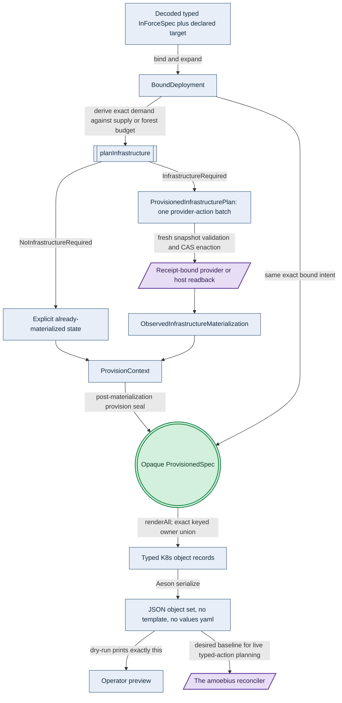
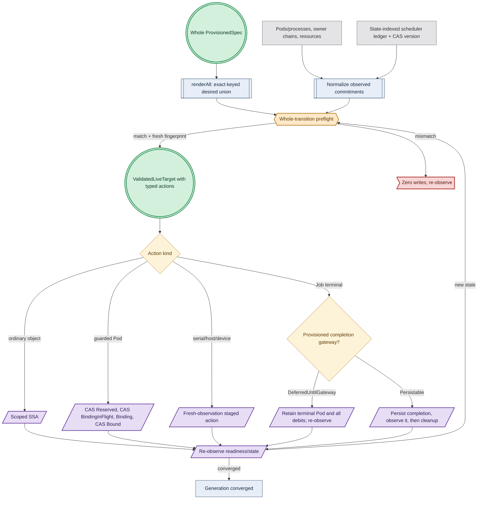
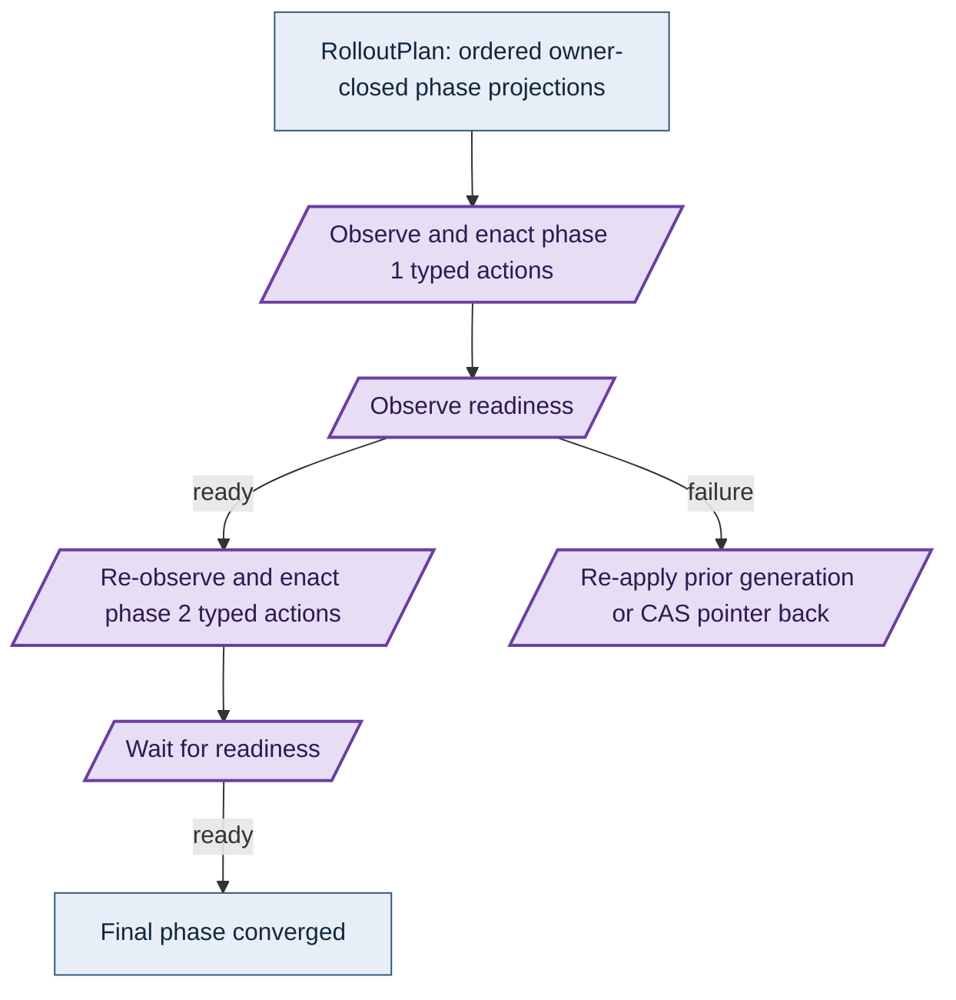
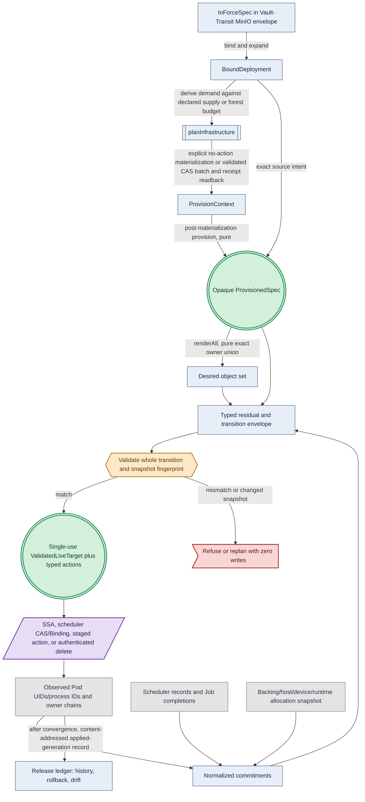

# Manifest Generation & the Typed Reconciler

**Status**: Authoritative source
**Supersedes**: N/A
**Referenced by**: DEVELOPMENT_PLAN/development_plan_standards.md, DEVELOPMENT_PLAN/later_phases.md, DEVELOPMENT_PLAN/legacy_tracking_for_deletion.md, DEVELOPMENT_PLAN/overview.md, DEVELOPMENT_PLAN/phase_11_provision_seal.md, DEVELOPMENT_PLAN/phase_13_render_manifest_goldens.md, DEVELOPMENT_PLAN/phase_19_object_reconciler.md, DEVELOPMENT_PLAN/phase_20_capacity_scheduler.md, DEVELOPMENT_PLAN/phase_21_retained_storage.md, DEVELOPMENT_PLAN/phase_23_platform_backbone.md, DEVELOPMENT_PLAN/phase_24_platform_services_2.md, DEVELOPMENT_PLAN/phase_25_keycloak_ingress.md, DEVELOPMENT_PLAN/phase_30_release_lifecycle.md, DEVELOPMENT_PLAN/phase_31_network_fabric_wireguard.md, DEVELOPMENT_PLAN/system_components.md, documents/documentation_standards.md, documents/engineering/README.md, documents/engineering/app_vs_deployment_doctrine.md, documents/engineering/bootstrap_sequence_doctrine.md, documents/engineering/capability_extension_doctrine.md, documents/engineering/cluster_lifecycle_doctrine.md, documents/engineering/conformance_harness_doctrine.md, documents/engineering/daemon_topology_doctrine.md, documents/engineering/dsl_doctrine.md, documents/engineering/formal_model_doctrine.md, documents/engineering/generated_artifacts_doctrine.md, documents/engineering/image_build_doctrine.md, documents/engineering/inforcespec_migration_doctrine.md, documents/engineering/lift_and_compose_doctrine.md, documents/engineering/namespace_layout_doctrine.md, documents/engineering/network_fabric_doctrine.md, documents/engineering/pulumi_iac_doctrine.md, documents/engineering/readiness_ordering_doctrine.md, documents/engineering/release_lifecycle_doctrine.md, documents/engineering/service_capability_doctrine.md, documents/engineering/substrate_doctrine.md, documents/illegal_state/illegal_state_security.md, documents/illegal_state/illegal_state_techniques.md
**Generated sections**: none

> **Purpose**: Single source of truth for how amoebius turns a typed cluster spec into running Kubernetes
> objects — pure bind/expand, conditional infrastructure planning and authenticated materialization, then the
> post-materialization provision seal followed by deployment-global
> `renderAll :: ProvisionedSpec -> [K8sObject]`, then amoebius's own idempotent preflighted typed-action reconciler —
> scoped SSA, scheduler CAS/Binding, staged execution, authenticated deletion — with **no Helm, no templating layer,
> and no third-party charts**.

---

## 1. Why this doctrine exists: types render manifests, Helm does not

The vision text frames the target as interpreting the DSL *"into opinionated helm deployments and cluster
configs"*, with *"a generic & reusable helm chart for amoebius apps"*.
**This doctrine records the operator's locked decision to drop that framing.** amoebius does not template
YAML and does not ship or consume a Helm chart — its own or anyone else's. It **generates the complete
per-service Kubernetes object set from pure typed Haskell**, serializes it with Aeson, and applies it with
its own reconciler ([§5](#5-the-applyreconcile-engine-snapshot-bound-typed-actions)). This is the same anti-templating rule [dsl_doctrine.md §2](./dsl_doctrine.md#2-two-languages-one-system-dhall-carries-params-haskell-carries-logic)
already states for the config surface — grounded in the recorded operator vision that *"we want everything to be dhall"*, which keeps the *how* out of templated config — carried all the way down to the manifests.

Two reasons motivate the decision, and they are different:

- **A Go-templated chart is stringly-typed and unverified.** A Helm template is text that *becomes* YAML
  only after string interpolation; nothing checks that the result is a well-formed object, that a referenced
  Secret exists, or that an `image:` resolves, until the apiserver rejects it (or worse, accepts something
  subtly wrong) at deploy time. The template language has no type system, so `{{ .Values.replicas }}`
  landing in a field that wants an int, or a missing `with` guard emitting `null`, is a runtime surprise.
  This is exactly the *"valid YAML, wrong cluster"* failure class [illegal_state_catalog.md §1](../illegal_state/illegal_state_catalog.md#1-illegal-states-fail-to-type-check)
  exists to abolish — and a string template re-opens it underneath an otherwise-typed system.
- **A third-party chart is unreviewed YAML amoebius does not own.** Pulling `bitnami/postgresql` or an operator's
  upstream chart means running hundreds of lines of someone else's templated manifests — with their RBAC,
  their securityContext defaults, their image refs, their `hostPath` mounts — that no amoebius type ever
  inspected. Neither *"every execution unit has a complete resource envelope"* nor *"secrets are Vault-only"* can be made true by
  construction over manifests amoebius did not generate. amoebius therefore renders **every** object it applies,
  including the install manifests of the operators it runs ([§4](#4-no-third-party-charts--no-third-party-software-operators-are-generated)).

amoebius needs semantics around cluster manifest changes, and a render-layer guarantee that a degenerate or
broken manifest set is not constructible — a property established where the spec is type-checked and composed,
not a proof of live convergence. Pure bind/expand and infrastructure planning,
the explicit already-materialized arm or validated/CAS-enacted/read-back initial-infrastructure batch, and
then `provision` followed by `renderAll(ProvisionedSpec)` over typed ADTs are where those semantics live —
the manifest set is a *value* amoebius can
inspect end to end before any object reaches the cluster.

**The prodbox seed is real, and so is the gap it leaves.** The sibling prodbox project already renders a
large slice of its object set from types, not templates:
`Secret`/`ServiceAccount`/`Role`/`RoleBinding`/`ClusterIssuer`/`GatewayClass`/`EnvoyProxy`/`SecurityPolicy`/
`HTTPRoute`/`IPAddressPool` are built as `Data.Aeson.object [...]` in `src/Prodbox/CLI/Rke2.hs` and applied
with `kubectl apply -f`, and `Namespace`/`PersistentVolume`/`PersistentVolumeClaim`/`StorageClass` (provisioner
`kubernetes.io/no-provisioner`) are built from `ChartStorageSpec → ChartStorageBinding → object` in
`src/Prodbox/Lib/Storage.hs`. **But prodbox still ships its *workloads* (Deployments, StatefulSets, the
services themselves) as Helm charts**, orchestrated by the pure planner in `src/Prodbox/Lib/ChartPlatform.hs`
(`buildChartDeploymentPlan` produces a `ChartDeploymentPlan` of `ChartReleasePlan`s carrying a
`chartReleasePlanValuesJson` fed to Helm). amoebius's move is to close that gap: **lift the typed-render
discipline prodbox already applies to its supporting objects up to the entire object set, and replace the
Helm-release target with direct typed-manifest rendering plus an amoebius-owned apply engine.** That prodbox
slice is *evidence the approach works*, not proof amoebius has built the whole renderer ([§8](#8-reusable-prodbox-seeds-vs-what-is-new)).

**What this doc owns vs. what it defers.** This document owns *how* a spec becomes objects (generation, [§2](#2-the-typed-manifest-model-renderall-is-the-sole-public-pure-function-to-objects)–[§4](#4-no-third-party-charts--no-third-party-software-operators-are-generated))
and *how* those objects are applied and reconciled ([§5](#5-the-applyreconcile-engine-snapshot-bound-typed-actions)–[§6](#6-the-reconcile-state-model-desired-is-renderallprovisionedspec-observed-is-live-inventory-actions-are-typed)). It does **not** own:

| Concern | Owned by |
|---------|----------|
| *What* services/capabilities exist, their canonical providers, and the per-cluster deployment *shape* | [service_capability_doctrine.md](./service_capability_doctrine.md) |
| The standard service set, HA-always, the derived-NetworkPolicy connectivity rule, the complete resource-envelope rule, the single ingress path | [platform_services_doctrine.md](./platform_services_doctrine.md) |
| The DSL surface the spec decodes from, and the two typed gates | [dsl_doctrine.md](./dsl_doctrine.md) |
| The *catalog* of unrepresentable states and the typing techniques | [illegal_state_catalog.md](../illegal_state/illegal_state_catalog.md) |
| Secrets-by-name / `SecretRef` / Vault k8s auth — a manifest never carries a plaintext secret | [vault_pki_doctrine.md](./vault_pki_doctrine.md) |
| Retained `no-provisioner` PV mechanics for StatefulSet storage | [storage_lifecycle_doctrine.md](./storage_lifecycle_doctrine.md) |
| The build pipeline, the baked base container, and registry refs | [image_build_doctrine.md](./image_build_doctrine.md) |
| The control-plane singleton that *runs* this reconciler | [daemon_topology_doctrine.md](./daemon_topology_doctrine.md) |
| The cluster-level `discover → diff → enact` reconciler shape this specializes | [cluster_lifecycle_doctrine.md §9](./cluster_lifecycle_doctrine.md#9-how-bring-up-and-teardown-are-implemented-the-reconciler-not-a-state-machine) |

---

## 2. The typed manifest model: `renderAll` is the sole public pure function to objects

The core is a per-projection renderer closed by one whole-deployment pure function:

```haskell
type K8sObjectIdentity =
  (ApiGroup, ApiVersion, Kind, Maybe NamespaceId, KubernetesObjectName)
type KubernetesObjectId = K8sObjectIdentity -- compatibility alias, not a second identity

-- Phase 10 seals one unique source per Kubernetes object identity.
renderSourcePrivate :: ProvisionedRenderSource identity -> K8sObject

-- Whole-deployment closure. KubernetesObjectId is (group/version/kind, namespace, name).
renderAll :: ProvisionedSpec -> [K8sObject]
```

Phase 10 constructs `ProvisionedRenderSourceSet` without depending on this Phase-13 object/Aeson model. Its
private `renderSourcePrivate` maps one already-owned source to one object and cannot independently apply a
list. Deployment-level `renderAll` owns the **complete set of typed Kubernetes objects** — `Namespace` /
`Node` /
`Deployment` / `StatefulSet` /
`DaemonSet` / `Job` / `Service` / `PersistentVolume` / `PersistentVolumeClaim` / `StorageClass` / `Lease` /
`Secret` (reference only, [§3](#3-best-practice-by-construction-an-unsafe-manifest-is-not-constructible)) / RBAC (`ServiceAccount` / `Role` / `RoleBinding` / `ClusterRole*`) /
`NetworkPolicy` / `HTTPRoute` / `Gateway` / `ConfigMap` / `CustomResourceDefinition` / a Custom Resource
instance / `ResourceQuota` / `LimitRange` / admission-webhook configuration /
`ClusterIssuer` / `Certificate` — each as a typed Haskell record serialized to JSON via Aeson,
exactly as prodbox already serializes its supporting objects ([§1](#1-why-this-doctrine-exists-types-render-manifests-helm-does-not)). There is no intermediate text template
and no `values.yaml`; the *record* is the manifest.

`renderAll` is not an unchecked list concatenation. It traverses the unique
`K8sObjectIdentity → ProvisionedRenderSource K8sObjectIdentity` map already sealed by Phase 10. Each key equals
the source's embedded identity and has exactly one
structural source owner; duplicate candidates or an omitted source-domain member fail
`provisionRenderSources` before `ProvisionedSpec`, without depending on this later renderer. A deliberately
shared object is owned by one deployment-global source and service rows only reference it. Consequently
`--dry-run`, live preflight, and enactment consume the identical identity-sorted deployment object set,
including objects which do not belong to any single service. `KubernetesObjectId` is used elsewhere only as
an alias for this same key type.

The private constructor matters: after provider/shape expansion, `planInfrastructure` derives demand from the
exact `BoundDeployment` plus declared standalone supply or forest budget. It either witnesses the explicit
`ObservedInfrastructureMaterialization.AlreadyMaterialized` no-action arm or returns one non-renderable
`ProvisionedInfrastructurePlan` whose
`ProvisionedProviderActionBatch` solely owns the closed cloud-provider/SSH-host action map, Pulumi graph,
checkpoints, dependencies, bounded concurrency, and cloud-quota/SSH-child-budget partition. Fresh validation
constructs a `ValidatedInfrastructurePlan` joining the matching `ValidatedInfrastructureActionBatch` to the
plan; only plan/action-token CAS enaction and receipt-bound provider/host readback construct the
`ObservedInfrastructureMaterialization` in `ProvisionContext`. The whole `ProvisionedSpec` is then produced
only by the pure `provision` boundary after the CPU, memory, pod/IP/CSI slots, mapped-file and etcd-logical,
pod-ephemeral/image/cache, durable/object-store/migration/native-host storage, controller/admission/Pulumi
execution, accelerator, and VRAM folds succeed
([resource_capacity_doctrine.md §4](./resource_capacity_doctrine.md#4-the-total-fold-fits-carve-place-and-the-nesting)).
Its private service projections contribute sources; they are not independently renderable. There is no
public `render :: ServiceSpec -> …` or `render :: ProvisionedServiceSpec -> …` escape hatch. A CUDA workload paired with a topology that has
no CUDA offering therefore cannot be rendered even though each raw input value is independently well-typed.

Every source carries a closed `RenderReconcileMode`. `DeclarativeApply` contains the exact field paths SSA
may own. `InitializeThenTypedActions` partitions immutable schema/initial fields from mutable action-owned
fields: scheduler root-ledger entries/CAS versions belong only to scheduler ledger actions, and mandatory
Lease holder/renewal state belongs only to Lease transition actions. Those mutable fields are not generic
`renderAll`/SSA input, so a reconcile cannot reset either state machine.

Each source also carries
`RenderActivation = Immediate | BootstrapSchedulerStage | AfterBootstrapAddonCutover |
AfterManagedCapacityReady`. `renderAll` is a description of the complete desired set, so it emits all four
classes deterministically rather than pretending later-stage objects are absent. The live typed diff/enactor
requires the corresponding readiness witness before minting an action for a class. In particular, managed
taint/admission objects are present in desired output but cannot be included in the initial scheduler-stage
generic apply.

That private boundary is exact rather than an invitation to recalculate. Ordinary Kubernetes objects are
projected from the `MaterializedExecutionInstance`s selected by checked `ProvisionedExecutionEpochs`; raw
controller/cardinality/policy operands never enter the renderer. The private desired controller map selects
Deployment, StatefulSet, DaemonSet, or Job and carries only that kind's legal fields; host-process rows have
no Kubernetes workload projection, and prior-only controllers are available only to snapshot-bound
transition actions. Deployment rolling preserves its checked nonzero pair, DaemonSet its exclusive
Surge/Unavailable arm, StatefulSet native serial partition zero, and Job its finite completion/terminal policy.
Every Pod template copies admission-protected deployment/generation/source/revision annotations and the provisioned
`schedulerName`; the scheduler execution/config/RBAC/reservation-CRD projection renders before consumers.
`ProvisionedKubeletRuntimeMetadataDemand` and the node-level component→role→layout backing map remain
capacity witnesses and have no manifest byte field. A CUDA pod may receive only the whole-device
request/limit and affinity projection derived from `ProvisionedCudaOwnerDemand`; its source/workload maps and
epoch assignments are sealed, and `ProvisionedMetalOwnerDemand` stays entirely in the host-worker tier. The
render module therefore has no `BoundDeployment`, `PodRuntimeMetadataSource`, `CudaOwnerDemand`, or
`MetalOwnerDemand` input constructor.

Among those objects, the rendered **`ConfigMap`** is how an **in-cluster pod** frame receives its own
`.dhall` — the one config-delivery path that stays a ConfigMap mount rather than the in-place `stdin`
streaming used for the VM/container bootstrap-lift frames. [dsl_doctrine.md §3](./dsl_doctrine.md#3-the-orchestration-surface-parameters-context-witness) owns that
frame-descent delivery contract; this doc owns only the ConfigMap render.

Three properties make this the right shape:

- **Pure and total.** `renderAll` performs no I/O, reaches no cluster, and (being a total function over an
  opaque value already produced by the staged bind/plan/materialize/provision boundary —
  [dsl_doctrine.md §5](./dsl_doctrine.md#5-the-illegal-state-unrepresentable-contract))
  always produces a value. The plan **is data**: `amoebius … --dry-run` can print the exact object set it
  would apply without contacting the apiserver, the same "what is previewed is what runs" guarantee the
  chain/Step algebra gives the lifecycle ([dsl_doctrine.md §2](./dsl_doctrine.md#2-two-languages-one-system-dhall-carries-params-haskell-carries-logic)).
- **Unit-testable without a cluster.** Because `renderAll` is pure, a test asserts properties of the *emitted
  objects* — "every container has resource requests and limits," "no Service is type `LoadBalancer` outside
  the edge," "the rendered RBAC grants exactly these verbs" — by inspecting the returned `[K8sObject]`. No
  kind cluster, no apiserver, no golden-YAML diffing of templated strings. This is the manifest-layer face
  of the project's pure-FP testing posture.
- **Composable per the dependency graph.** `renderAll` maps every service/global render source in the
  Phase-10-sealed unique source inventory. Ordering and connectivity are derived
  from the declared dependency graph, not hand-authored
  ([§3](#3-best-practice-by-construction-an-unsafe-manifest-is-not-constructible)). One spec value renders the
  whole cluster, and duplicate ownership cannot be hidden by list order.

Diagram vocabulary: [diagram_conventions.md](./diagram_conventions.md).


*Design intent. The bind/plan/provision pipeline is Tier-1 in-process and closes on the opaque `ProvisionedSpec` seal; the infrastructure readback and the downstream reconciler are the effectful seams, and the running-cluster residue is runtime-checked, not proven here.*

---

## 3. Best practice by construction: an unsafe manifest is not constructible

Because amoebius *generates* every object, it can make the safe shape the *only* shape — the manifest that
omits a best practice is not a manifest the renderer can emit. Each rule below is enforced at the type/decode
layer; the *unrepresentability* of its violation is catalogued, state by state, by
[illegal_state_catalog.md](../illegal_state/illegal_state_catalog.md) (the owner — this section only names which generation
rules feed it):

- **Every execution unit preserves its complete resource provision.** Each desired workload object comes
  from an exact `(PlannedExecutionSlotId, sourceUnit, revision, ordinal)`
  `MaterializedExecutionInstance` in the selected `ExecutionEpoch`; the slot is a pure capacity identity,
  never a prediction of a Kubernetes Pod UID. Replica and rollout shape are projections of the private,
  kind-indexed controller witness, never renderer defaults. The projection cannot put Deployment fields on
  StatefulSet/DaemonSet/Job, and every guarded Pod template carries admission-protected
  deployment/generation/source/revision/reservation-template provenance plus
  `schedulerName=amoebius-capacity`. A Deployment rolling
  projection copies its checked pair exactly; a DaemonSet emits exactly one positive Surge/Unavailable arm;
  StatefulSet emits no feature-gated `maxUnavailable`; Job emits its exact replacement/terminal-cleanup
  controls (`restartPolicy=Never`, `podReplacementPolicy=Failed`, no `ttlSecondsAfterFinished`). Every app/sidecar/init/controller/
  operator/platform container carries derived non-zero CPU, memory, and `ephemeral-storage` requests and
  limits; `ReadOnlyRootfs` renders `securityContext.readOnlyRootFilesystem: true`, while `WritableRootfs`
  renders false and carries a bounded allowance; every pod-local disk cache/scratch volume is size-bounded and
  those bounds plus writable/log headroom fit the effective pod ephemeral request; every durable claim has its
  exact StatefulSet slot, backing, and size. Planned slots carry planned
  `ProvisionedKubeletRuntimeMetadataDemand`; only observed Bound/Terminating or retained Terminal Pod UIDs
  acquire observed rows. Each row's components are model-assigned to `KubeletNodefs | CriRuntimeRoot`, then
  layout-resolved and alias-grouped exactly once with the disjoint image-model components at node scope;
  PendingUnscheduled is API-only and Reserved-before-Bind is debited through the planned scheduler ledger
  vector. Those bytes/routes are capacity-only and are not copied into a Pod. The typed accelerator owner carries the full selected-node offering count plus the
  claim/affinity projection derived from `ProvisionedCudaOwnerDemand`; raw source/workload/policy maps and
  private epoch assignments are not manifest fields. Heterogeneous accelerator supply is
  expanded into one owner workload per immutable homogeneous offering class, each with disjoint class
  affinity and a uniform exact count; one generic DaemonSet template is forbidden. The renderer
  also emits the deployment-global scheduler config/RBAC/admission/taint/ledger objects and its one complete
  default-scheduled bootstrap Pod from `CapacitySchedulerSystemDemand`; every other managed-capacity Pod is
  custom-scheduled. It copies these fields from the provisioned projections exactly — it neither invents defaults nor recalculates
  capacity. An "unlimited pod", an unbounded cache, or a GPU owner with no device claim is not a value it can
  return. The declaration rule itself is owned by
  [platform_services_doctrine.md §10](./platform_services_doctrine.md#10-every-execution-unit-declares-its-complete-resource-envelope);
  the resource-to-capacity witness is owned by
  [resource_capacity_doctrine.md](./resource_capacity_doctrine.md); whether each part is a type-inhabitance or
  a decode-time check is classified by
  [illegal_state_techniques.md §6](../illegal_state/illegal_state_techniques.md#6-three-layers-of-foreclosure-and-the-honesty-they-force).
- **Every pod gets a hardened `securityContext`.** `renderAll` attaches a non-root, no-privilege-escalation,
  dropped-capabilities security context to every workload it emits and projects the required closed root-
  filesystem arm exactly; writable is explicit and bounded, never a default inferred from omission;
  there is no code path that renders a bare pod spec. A chart amoebius does not own cannot make this promise ([§1](#1-why-this-doctrine-exists-types-render-manifests-helm-does-not)).
- **RBAC is least-privilege per workload.** A workload's `ServiceAccount` / `Role` / `RoleBinding` are
  rendered *from the same value that declares the workload*, scoped to exactly the verbs and resources that
  workload needs — the technique prodbox already uses in `Rke2.hs` (it renders `ServiceAccount` + `Role` +
  `RoleBinding` triples as typed objects). There is no shared over-privileged role to over-grant.
- **NetworkPolicy is default-deny plus derived-allow.** Operators never hand-author allow/deny rules;
  `renderAll` emits a default-deny baseline and then exactly the edges the declared dependency graph permits.
  The connectivity rule is owned by
  [platform_services_doctrine.md §9 → east-west connectivity is derived from the dependency graph](./platform_services_doctrine.md#9-the-loadbalancer-and-the-single-wild-ingress-path),
  and the "service stranded from a dependency it declared" / "open policy for an undeclared edge" states are
  catalogued unrepresentable at [illegal_state_catalog.md §3.6](../illegal_state/illegal_state_security.md#36-blocking-networkpolicy-services-cant-reach-each-other).
- **Secrets are Vault-only; a manifest never carries a plaintext secret.** A rendered object references a
  secret by name and the workload reads it via Vault Kubernetes auth at runtime; the renderer has no input
  that is a literal secret value, because the spec carries only a `SecretRef`. The whole model — `SecretRef`,
  parent→child injection, Vault k8s auth, the fail-closed posture — is owned by
  [vault_pki_doctrine.md](./vault_pki_doctrine.md) and must not be restated here. The relevant generation
  fact: *a Secret object amoebius renders carries a Vault coordinate, never bytes.*

The framing is uniform: **a manifest lacking any of these is not a value `renderAll` can return.** That is
strictly stronger than a chart linter that flags violations after the fact — there is nothing to flag,
because there was never a value to lint.

---

## 4. No third-party charts ≠ no third-party software: operators are *generated*

prodbox today still consumes five upstream operator/platform charts — Harbor, MetalLB, Envoy Gateway,
cert-manager, and the Percona PostgreSQL operator. amoebius eliminates all five **as charts** without
eliminating the software. The distinction has three parts:

- **The operator *binary* is baked, not pulled.** Every third-party service binary — including each
  operator's controller — is baked into the multi-arch amoebius base container per the supply-chain rule;
  the build pipeline, the baked base container, and the resulting registry refs are owned by
  [image_build_doctrine.md](./image_build_doctrine.md). amoebius does not pull an upstream operator image
  from a public registry at steady state.
- **The operator's *install manifests* are generated.** Instead of `helm install cert-manager`, `renderAll`
  emits the operator's `CustomResourceDefinition`s, its controller `Deployment`, and its RBAC as typed
  objects — the same `object [...]` discipline prodbox already uses for `EnvoyProxy`, `GatewayClass`,
  `ClusterIssuer`, and friends in `Rke2.hs`. The install is amoebius's manifests running amoebius's baked
  binary.
- **The operator's *CR instances* are generated too.** A `Certificate`, a `PerconaPGCluster`, a `Gateway`,
  an `IPAddressPool` is rendered from the typed service spec that needs it. prodbox already renders the
  Gateway-API and cert-manager CRs this way; amoebius extends the same treatment to the Postgres and LB
  operators' CRs. For every supported CR kind, its replica, pod-template resource, PVC-size, and rollout
  fields are an exact provider-specific projection of the provisioned child envelope; omitting a field to an
  operator default is not a projection. A CR kind for which amoebius cannot define that total projection has
  no supported binding. The operator binary then reconciles its own CRs as usual.
- **Controller children are constrained before a CR can create them.** For every supported controller arm,
  the renderer first emits a dedicated `ControllerEnvelopeNamespace` that may belong to exactly one CR owner,
  an amoebius-owned child-envelope validating webhook, and namespace-scoped
  `ResourceQuota`/`LimitRange` derived from the same provision witness. The validating admission path
  requires the expected controller/CR owner identity, rejects missing requests/limits/PVC caps and any
  per-child or rollout value outside the envelope, and is Ready before the CR is applied. The namespace quota
  atomically enforces the cumulative aggregate while the webhook enforces exact typed fields. Two owner
  envelopes cannot share one namespace, and a child cannot target another owner's namespace. Thus a
  misbehaving operator receives an admission rejection before an over-bound Pod/PVC object or allocation
  exists. Post-ready child enumeration remains an independent drift check; it is not the first enforcement
  point. The webhook itself is not free: the binder's version-pinned child model derives its image,
  CPU/memory/ephemeral requests and limits, log/writable allowance, replicas, pod slots, and rollout overlap;
  `ProvisionedControllerChildren.admissionExecution` must place successfully before `renderAll` can emit the
  namespace/webhook/CR sequence. The rendered webhook Deployment is an exact projection of that private
  envelope, is observed live before the CR, and a topology where all children fit but the webhook does not
  yields no objects to apply.

Transition workers are rendered by the same rule. A private `ProvisionedStorageMigration`,
`ProvisionedRegistryBackendMigration`, or `ProvisionedSchemaMigration` projects its exact replacement
volume/object controls and copy/verify or schema Job envelope. The renderer cannot accept an old/new size map
or hand-authored Job. Live preflight admits old+new+workspace/temp/WAL plus the complete executor before the
first replacement create or DDL; failed verification preserves the old route/data and all observed partial
commitments.

So **"no third-party charts" is not "no third-party software."** cert-manager still issues certificates and
the Percona operator still runs Patroni — amoebius simply owns every byte of YAML around them and pulls the
binaries from its own registry.

This is also where the registry itself changes shape. amoebius's image registry is the single-binary
`distribution` OCI registry (`registry:2`) — baked like MinIO and Vault — which **replaces Harbor**: no
Trivy scanning, no UI, no robot RBAC, no replication, by design. *Which* provider backs the Registry
capability is owned by [service_capability_doctrine.md](./service_capability_doctrine.md); the generation
consequence has one explicit bootstrap edge. Phase 18 cannot fabricate a minimal `ProvisionedServiceSpec` or
call a service renderer before the whole deployment and its scheduler exist. Instead,
`provisionBootstrapRegistry` constructs a resource-complete `ProvisionedBootstrapRegistry`; a fresh snapshot
may mint one `BootstrapRegistryAction` that side-loads its image and initializes only its equal-keyed
registry/proxy source domain through the same package-private `renderSourcePrivate`. This is a typed action,
not generic SSA and not a second public render boundary. Its fresh snapshot token is CAS-consumed; both
applied and ambiguous outcomes return the consumed receipt, and only fresh readback can resolve ambiguity.

The bootstrap provision retains a canonical identity/source/initialized-field digest. A later whole
`ProvisionedSpec` lists the intended bootstrap adoptions, but the reconciler may transfer ownership only after
live readback proves those exact identities and owned fields equal that digest. The handoff is one-time and
does not delete/recreate the objects; mismatch leaves the bootstrap owner intact and produces no apply. After
handoff, registry objects are ordinary members of the sole `renderAll` set. The bootstrap cycle-break is
therefore narrow without weakening whole-deployment source uniqueness.

> A later, per-service option this doctrine deliberately leaves open: where an operator's job is small and
> well-understood, amoebius may eventually **reimplement that reconcile loop natively** (its own typed
> reconciler emitting the leaf objects directly) rather than running the upstream operator binary at all.
> That is a deferred choice made per service, not a present commitment — and it is exactly the same
> `discover → diff → enact` loop as [§5](#5-the-applyreconcile-engine-snapshot-bound-typed-actions).

---

## 5. The apply/reconcile engine: snapshot-bound typed actions

Dropping Helm means amoebius must supply, in its own code, the one useful thing Helm did: take a
desired object set and *make the cluster match it, idempotently*. amoebius's engine is the
`discover → diff → enact → re-observe` reconciler of
[cluster_lifecycle_doctrine.md §9](./cluster_lifecycle_doctrine.md#9-how-bring-up-and-teardown-are-implemented-the-reconciler-not-a-state-machine),
specialized from "any resource the forest can create" down to "Kubernetes objects in this cluster." It is
**run by the control-plane singleton** — the in-cluster role with total cluster authority owned by
[daemon_topology_doctrine.md §3](./daemon_topology_doctrine.md#3-the-control-plane-singleton) —
never by a CLI invocation racing another writer.

Before any mutation, the engine runs `renderAll`, takes one read-only snapshot of live objects and resource
inventory, constructs the typed diff and peak transition envelope, and validates the whole-deployment
`ProvisionedSpec` against residual capacity. The desired `ExecutionEpoch` is keyed by
`PlannedExecutionSlotId`, a pure capacity slot. Live state is instead an `ObservedExecutionSet` keyed by
actual `PodUid | HostProcessInstanceId | HostReservationId`. A Pod row is authenticated by its protected
deployment/generation/source/revision/template annotations and its kind-indexed owner chain (including the
ReplicaSet hop for Deployment Pods); a host row is authenticated by its supervisor identity. Multiple Pod
UIDs that correspond to the same planned slot — for example a terminating predecessor and its replacement —
remain distinct commitments.

The live reader also takes the state-indexed scheduler/host ledgers and resourceVersions. It normalizes
PendingUnscheduled as API-only and Reserved as a planned-vector ledger debit. An unbound
BindingInFlight remains ledger-only; if the Pod is already confirmed Bound while its ledger still says
BindingInFlight, the observed Pod UID is represented once as `BindingRecovery` and carries the capability to
repair the ledger. Bound/Terminating joins the Pod and matching ledger into one debit, while Terminal keeps
only retained axes. Host `Reserved`, no-process `LaunchInFlight`, and `RetainedArtifacts` are keyed by
`HostReservationId`; an observed process in `LaunchInFlight`, `Running`, or `Draining` is keyed by
`HostProcessInstanceId` and exact-joined to the same reservation. An absent Pod's Reserved,
BindingInFlight, Bound, Terminating, or TerminalRetained row enters the matching state-indexed
`LedgerOnlyAbsentRecovery` and keeps its full/retained debit until release or cleanup CAS; only an
unclassified orphan is invalid. A missing, wrong-state, wrong-node,
wrong-generation, wrong-template, or unequal-vector reservation rejects, as does adding the observed and
ledger copies of one Bound UID twice. For node storage, preflight reconstructs each eligible observed Pod's
runtime components, groups them by `KubeletNodefs | CriRuntimeRoot`, resolves those roles through the observed
`Unified | SplitRuntime | SplitImage` layout, combines them with the disjoint
`ImageContentRoot | CriRuntimeRoot` image-model components, and checks every physical backing exactly once.
An elastic planned target retains `PerInstanceKubeletFilesystemLayout` and only
`(ProviderInstanceId, DiskTemplateId, DiskCarveTemplateId)` refs—never a concrete `DiskCarveId`. Its
`ObservedNodeTargetBinding` must materialize that exact ref domain one-to-one before the observed aggregate is
accepted; missing, extra, aliased, wrong-instance/template, or byte-unequal mappings reject.
PendingUnscheduled has no node-runtime row; Reserved and an unbound/unknown `BindingInFlight` use their
planned reservation vectors. Exact-node `BindingRecovery`, Bound/Terminating, and retained Terminal Pod UIDs
instantiate observed metadata rows.

The custom scheduler is part of the desired deployment, not an assumed cluster feature. The same amoebius
Haskell binary runs a dedicated `amoebius-capacity` scheduler role. `renderAll` emits its complete bootstrap
Deployment, config, RBAC, readiness contract, protected-identity admission policy, managed-capacity taint
policy, reservation CRD/objects, and `CapacitySchedulerSystemDemand`. Canonical serialization derives each
record's API/etcd bytes, and the maximum normalized Pod-UID population — including retained terminal rows —
derives ledger cardinality/churn rather than accepting a scalar. Its sole bootstrap Pod is pinned,
default-scheduled with unique-node affinity and an exact namespace `ResourceQuota pods=1`; its static owner
participates in the same identity-aware fold as ledger rows, so shared image extents deduplicate while
compute/slots add. It is the only cycle-break
exception. Every other Pod that can tolerate the managed-capacity taint must name `amoebius-capacity`.
A bootstrap-only read-only preflight may mint only the scoped capability for that statically admitted
scheduler system. After installation and observed readiness, its snapshot is discarded and a fresh
whole-deployment preflight runs. Before any guarded controller action, the scheduler must report Ready for
the exact active generation and config digest.

For each pending guarded Pod, the scheduler authenticates its UID, annotations, controller chain, generation,
and reservation-template digest plus controller-child discriminator, re-folds static/foreign/resident,
whole-root, and candidate state, CAS-creates `Reserved`, CASes `Reserved→BindingInFlight`, submits Kubernetes
Binding, and after exact UID/node readback CASes `BindingInFlight→Bound`. Same-UID retry reuses the exact row;
only Reserved may retarget. A confirmed same-UID/RV unbound result or absence may release; error, timeout,
lost response, and unknown outcome remain charged. Bound/Terminating rows release only resource-indexed
partitions: ordinary absence retains physical artifacts, CUDA also requires device/process release, and Job
terminal evidence retains modeled axes until cleanup/GC.

Success mints one opaque, single-use `ValidatedLiveTarget` containing the observation fingerprint,
resourceVersions, scheduler ledger/CAS version, normalized execution/runtime-storage witnesses, and a map of
typed mutation actions. A final fingerprint recheck consumes it; change discards the plan and restarts the
read-only prefix. Failure exposes no capability and writes nothing. The action algebra, not a blind
"apply everything, then prune labels" loop, determines enactment:

- **Declarative object actions use scoped SSA.** A desired ordinary object action may server-side apply its
  exact fields under `fieldManager=amoebius`; fields owned solely by another manager remain untouched, while
  a declared field may be reclaimed according to the action's conflict policy. Scheduler Binding, ledger
  CAS, host-process control, durable/provider mutations, and authenticated deletes are separate capabilities,
  never disguised as SSA. Being present in `renderAll` is not action authority: the source's
  `RenderActivation` must match the current staged readiness witness before the diff may mint even an ordinary
  SSA action.
- **Execution actions are kind- and state-indexed.** `ApplyDesiredPodController` carries exactly one
  provisioned Deployment, StatefulSet, DaemonSet, or Job controller. `SerialOnDeleteStart` deletes only the
  witnessed old Pod; a fresh observation mints `SerialOnDeleteResume` only after Pod absence plus ordinary or
  CUDA device-release evidence; another fresh observation mints `SerialOnDeleteAdvance` only after the
  expected replacement UID is Bound and Ready before the next deletion. Host actions stop/drain and start
  only with `NoPrior | OrdinaryAfterExit | CudaAfterDeviceRelease | MetalAfterDrain` authorization.
  `NoOp` cannot mutate.
- **Deletion is authenticated and dependency-gated.** The owner label is necessary discovery evidence, not
  sufficient delete authority. A desired-object absence becomes an object-delete or
  `PruneRemovedPodController` action only when the prior object/controller ownership, generation,
  resourceVersion, retention policy, and dependent cleanup order match the snapshot. Unknown or foreign
  labels, retained storage, an old serial Pod still holding resources, and objects outside the exact
  deployment-global desired/prior union cannot be pruned.
- **Jobs have a closed deferred-or-durable terminal plan.** When
  `ProvisionedJobCompletionPlan = DeferredUntilGateway`, terminal success or backoff exhaustion can mint only
  `RetainTerminalAwaitingCompletionGateway`; the Pod/API/log/runtime-metadata and ledger partition remain
  charged, and no write or cleanup capability exists. Only the `Persistable` arm selects the exact
  `ProvisionedJobCompletionVariant` and runs `RecordJobCompletion` through its provisioned object-store
  gateway. A fresh observation of matching durable `ObservedJobCompletion`, the cleanup deadline, and the
  scheduler release partition can then mint `CleanupTerminalPod`. A matching completion digest/payload yields
  `CompletedJobNoOp`; it suppresses re-creation until a new execution revision, even though `renderAll`
  remains the pure desired-object baseline.
- **Readiness gates action progress.** Scheduler active-generation/config readiness precedes guarded
  controllers. Workload rollout/Ready/Available and CR health are observed, never slept. Operator admission
  and quota are Ready before CR apply; a healthy CR is followed by owner-chain enumeration and exact child
  envelope validation. Serial OnDelete cannot advance until replacement Bound+Ready, and Job cleanup cannot
  advance until completion persistence is observed.
- **Rollback is another validated transition.** The immutable release ledger ([§6.1](#61-the-release-ledger-the-applied-log-is-canonical-not-optional)) may select a prior generation, but that generation is rebound/provisioned and re-observed to
  produce fresh actions; it is not permission to replay an old unvalidated SSA/prune script.

**What is genuinely new vs. prodbox.** prodbox's typed objects and owner label are useful seeds. It has no
state-indexed scheduler ledger, no Binding-after-CAS scheduler role, no planned/observed execution join, no
typed serial/host/accelerator/Job action algebra, and no authenticated dependency-gated prune. Those mechanisms,
plus scoped SSA and observed readiness, are amoebius's new code ([§8](#8-reusable-prodbox-seeds-vs-what-is-new)).


*Design intent for Phase 19. The `ProvisionedSpec` seal and `renderAll` desired union are Tier-1; the live inventory and scheduler ledger are runtime-checked observed residue; the preflight gate mints the single-use `ValidatedLiveTarget` seal or refuses with zero writes, and SSA/CAS/staged/completion are the effectful seams — none proven in amoebius here.*

> **Honesty.** This engine is **design intent for Phase 19**, not a built amoebius result. SSA field
> managers, Kubernetes Binding, and resourceVersion compare-and-swap are real Kubernetes mechanisms;
> *that amoebius wires them into this specific reconciler* is specified here and unproven until the phase
> lands. The idempotent `discover → diff → enact` shape it specializes is *proven in prodbox* for AWS/cluster
> teardown — evidence from a sibling, not amoebius proof ([documentation_standards.md §6](../documentation_standards.md#6-honesty-the-proventestedassumed-discipline)).

### 5.1 The `RolloutPlan`: ordered, readiness-gated phases on this same reconciler (tier (c))

[§5](#5-the-applyreconcile-engine-snapshot-bound-typed-actions) converges *one* generation through a snapshot-bound typed action plan. Some changes must not land in one action stage: a
schema migration, a canary, a message-bus consumer cutover need **ordered, readiness-gated steps**, each
gated on the *previous* step's live readiness before the next is applied. amoebius expresses that as a typed
value the reconciler folds — not an imperative script and not a Helm release list:

```haskell
-- Conceptual shape. A RolloutPlan is data; the tier-(c) reconciler folds it phase by phase.
type RolloutPlan  = [RolloutPhase]            -- ordered; phase n+1 waits on phase n's readiness
data RolloutPhase = RolloutPhase
  { phaseProjection :: DesiredObjectSubset    -- owned subset of renderAll(ProvisionedSpec) (§2)
  , phaseTransition :: ProvisionedTransition  -- pure inputs; live capabilities are minted later
  , phaseReadiness  :: ReadinessGate          -- observed before the next phase
  }
```

- **Same reconciler, no new one.** Each `RolloutPhase` selects an exact owner-closed subset of the global
  desired union and pure transition inputs. The live engine re-observes and mints the applicable SSA,
  scheduler, staged execution, provider, or authenticated-delete actions ([§5](#5-the-applyreconcile-engine-snapshot-bound-typed-actions)); between phases, the engine's existing **wait-for-ready** is the gate. Enactment is
  **this doc's tier-(c) reconciler** — the in-cluster typed manifest/action engine; tier (a) (Pulumi-checkpointed
  cloud IaC) and tier (b) (checkpoint-free tag-discovery host) live in
  [pulumi_iac_doctrine.md](./pulumi_iac_doctrine.md). A `RolloutPlan` introduces **no new reconciler** and no
  orchestration daemon — the plan is a `renderAll(ProvisionedSpec)`-derived value folded by the engine already run by the
  control-plane singleton ([daemon_topology_doctrine.md §3](./daemon_topology_doctrine.md#3-the-control-plane-singleton)).
- **Where the plan is owned.** The typed `RolloutPlan` / `RolloutPhase`, the `Environment` promotion pointer,
  and the `Release` a rollout advances are owned by [release_lifecycle_doctrine.md §5](./release_lifecycle_doctrine.md#5-rolloutplan--rolloutphase-the-readiness-gated-apply)
  (and [§2](#2-the-typed-manifest-model-renderall-is-the-sole-public-pure-function-to-objects) for the ledger it advances); **this doc owns only their *enactment* on the tier-(c) reconciler.**
- **DB-schema migration is a `RolloutPhase` (runtime-checked residue; deferred).** A schema change is a
  phase sequence obeying **create-new → verified-migrate → retire-old** — the exact anti-in-place-destruction
  ordering owned by [storage_lifecycle_doctrine.md §8](./storage_lifecycle_doctrine.md#8-shrinking-storage-without-representing-data-destruction):
  stand up the new schema/table, run the migration and *verify it behind a readiness gate*, and only then
  retire the old — never an in-place mutation. The ordering is enforced by the reconciler's readiness gate at
  runtime, **runtime-checked**: the list is data, and the "no retire-old before verified-migrate" property holds
  because the engine will not authorize phase *n+1* until phase *n* is live-ready — it is not a type-level
  impossibility.
- **Canary and cutover.** A canary phase is a **Gateway-API `HTTPRoute` `backendRefs` weight shift** on the
  Envoy edge amoebius already renders — the traffic-split mechanism owned by
  [network_fabric_doctrine.md §6](./network_fabric_doctrine.md#6-the-service-mesh-verdict-no-linkerd-for-v1)
  (no service mesh needed). A Pulsar workload cuts over by **consumer-group**, not by weight.
  **Rollback** is not special-cased: select the prior generation or CAS the environment pointer back to its
  `Release`, then bind, run the conditional infrastructure/materialization stage, provision, and re-observe it
  to mint fresh [§5](#5-the-applyreconcile-engine-snapshot-bound-typed-actions)
  actions. No stored action capability is replayed.


*Design intent for Phase 30. The `RolloutPlan` is a Tier-1 typed value; each phase's enact/observe step and the rollback are effectful seams on the tier-(c) reconciler, and the readiness gating that orders them is runtime-checked, not proven here.*

> **Sibling evidence (the PATTERN, not Helm; not an amoebius result).** jitML's
> `~/jitML/src/JitML/Cluster/Helm.hs` carries exactly this shape: a closed
> `data HelmPhase = HarborPhase | PlatformPhase | FinalPhase` and a `phasedReleases :: [HelmRelease]` whose
> every element is tagged with a `releasePhase`, folded by `helmPhasedRolloutPlan` into an ordered plan;
> `~/jitML/src/JitML/Cluster/Readiness.hs` supplies the between-phase gates (`postgresReadinessSubprocesses`,
> `rolloutStatusSubprocess`, `runMinioBucketReadinessIO`); and `~/jitML/src/JitML/Bootstrap.hs` **splits its
> rollout around a live schema grant** — `livePreGrantSubprocessesForPort` brings the operator and cluster up
> *through readiness*, the typed Haskell schema grant then runs, and `livePostGrantSubprocessesForPort`
> continues — the readiness-gated pre/post migration shape, LIVE in a sibling. But jitML enacts every phase
> with `helm install`; amoebius keeps only the **phase-tagged ordered list + readiness gate**, renames
> `HelmPhase` → `RolloutPhase`, and enacts each phase through fresh checked actions derived from an
> owner-closed `renderAll(ProvisionedSpec)` projection with
> **no Helm**. This is
> sibling evidence, not an amoebius result.

> **Honesty.** The `RolloutPlan` is **Phase-30 design intent** — it rides the tier-(c) typed-action reconciler, itself
> Phase 19 and unbuilt; the DB-schema-migration `RolloutPhase` is part of that Phase-30 shape, proven
> *only* as the Helm-driven pattern in the jitML sibling. Read as the contract amoebius intends, never as a
> tested amoebius result.

---

## 6. The reconcile state model: desired is `renderAll(ProvisionedSpec)`, observed is live inventory, actions are typed

This is the decision that makes "no Helm" coherent: **amoebius keeps no release store.** Helm persists each
release as an opaque gzipped Secret holding the rendered manifests, and the cluster's "desired state" is
*that stored blob*. amoebius does not. Its model is:

- **Desired state is a pure function of the `InForceSpec`, its declared target, and authenticated
  infrastructure materialization.** The non-bypass path is `decode → bind/expand →
  planInfrastructure → (explicit already-materialized arm or validate + CAS-enact the one batch +
  receipt-bound readback) → ProvisionContext → provision → renderAll`, where the planning result cannot
  render and `provision` must construct the opaque whole-deployment `ProvisionedSpec` before `renderAll` can
  run. `planInfrastructure` derives demand from the exact `BoundDeployment`; a caller cannot substitute a
  second request vector. The
  *home* of that scope's `InForceSpec` is the Vault-Transit-enveloped MinIO object/ref that is the cluster's
  single source of truth — owned by [vault_pki_doctrine.md](./vault_pki_doctrine.md) (decrypt-in-process,
  never plaintext at rest) and the Pulumi/MinIO backend. There is no flat `in-force.dhall` file and no
  second desired-state store to drift out of sync with the spec, because the exact keyed object union is *recomputed* from
  the source and checked declarations, not stored. Current observed inventory and allocations gate mutation
  through the snapshot-bound `ValidatedLiveTarget`; they do not become another desired-state source. A
  matching durable Job-completion digest may yield the typed `CompletedJobNoOp` action and suppress Job
  recreation until a new execution revision; that is an enactment decision, not a second desired object set.
- **Observed state is etcd, the scheduler ledger, and OS-boundary allocation snapshots.** The engine reads
  objects, managed fields, Pod UIDs and owner chains, host-process instance IDs, state-indexed reservation
  records with resourceVersions/CAS version, durable Job completions, runtime backing identities, and
  backing/host/device allocations. etcd holds live Kubernetes state, never a copy of desired Dhall.
- **Planned and observed execution identities cannot be substituted.** `PlannedExecutionSlotId` indexes
  capacity epochs; `ObservedExecutionId = PodUid | HostProcessInstanceId | HostReservationId` indexes live
  commitments. The third arm preserves ledger-only host `Reserved`, no-process `LaunchInFlight`, and
  `RetainedArtifacts` rows even when no process instance exists. Protected provenance and the
  controller/supervisor/reservation chain join an observed instance to a source unit and revision.
  Two UIDs for one planned slot remain two live debits until the older one releases its retained axes.
- **A replica or image change is a typed spec-generation transition.** The desired controller field can be
  declared by scoped SSA without GET-modify-PUT, but capacity safety still requires reading the actual old,
  terminating, reserved, and replacement instances. Deployment, StatefulSet, DaemonSet, Job, and HostProcess
  policies generate different actions; serial OnDelete and accelerator/host replacement require fresh staged
  release evidence rather than one generic rolling apply.
- **Deletion recovers candidates from live ownership and authenticates each action.** Owner labels and the
  prior live object set discover possible removals, but only exact structural owner/generation/resourceVersion
  equality plus retention and dependency guards mint a delete capability. No global label sweep can prune a
  foreign object, retained data, a Job terminal Pod before completion persistence, or a serial predecessor
  before release.
- **Scheduling is a ledger transition, not an optimistic Pod apply.** The same amoebius binary's scheduler
  role must be Ready for the exact provision generation/config digest. It validates Pod provenance, CAS-
  reserves the complete node vector, CASes `Reserved→BindingInFlight`, submits Binding, then CASes
  `BindingInFlight→Bound` after exact UID/node readback, with idempotent same-UID and crash recovery. A
  confirmed Bound Pod with an in-flight ledger row is the observed-Pod-UID `BindingRecovery` arm, not a
  second planned debit. The observed Pod/ledger exact join is part of every new `ValidatedLiveTarget`.
- **Each applied generation is persisted content-addressed — the canonical release ledger.** amoebius writes
  each rendered generation into the content-addressed MinIO store (pointers → manifests → blobs), reusing the
  mechanism owned by [content_addressing_doctrine.md](./content_addressing_doctrine.md). That buys a **typed
  revision history**, **rollback** to any prior generation ([§5](#5-the-applyreconcile-engine-snapshot-bound-typed-actions)), and **drift detection** (diff live objects
  against the recorded generation) — and it is strictly *more* than Helm offers: typed, content-addressed,
  deduplicated, and confluent across clusters, where Helm's release Secret is an opaque gzip blob with no
  cross-cluster story. **[§6.1](#61-the-release-ledger-the-applied-log-is-canonical-not-optional) promotes this applied-log from *optional* to THE canonical immutable release
  ledger keyed by `releaseHash`** — a durable record of *what was applied*, never a second desired-state
  store. Persistence is capacity-admitted: exact release blob/manifest/ledger and environment-pointer
  identities form an `ObjectStoreDemand` in the closed `Content` producer arm, with `StorageBudgetId`,
  retention/concurrency/failure/orphan bounds, and writer admission. The release write is not exposed until
  the live snapshot proves that structured peak and the sole object gateway's complete pod envelope fit.

The contrast is direct. Helm's release store has well-known desync failure modes — the stored release and
the live cluster disagree after a manual `kubectl edit`, a `helm rollback` to a release whose manifests no
longer match the chart, or a half-applied upgrade that leaves the release marked `deployed` over a broken
object set. amoebius has **no release store to desync**: desired state is always exactly the result of the
conditional `decode → bind/expand → planInfrastructure → authenticated materialization →
ProvisionContext → provision → renderAll` path, and
the only persisted history is the immutable, content-addressed release ledger ([§6.1](#61-the-release-ledger-the-applied-log-is-canonical-not-optional)) — a record of *what was
applied*, not a competing source of desired state.


*Design intent. Desired state is the Tier-1 `decode → provision → renderAll` result sealing on `ProvisionedSpec`; the observed Pod/ledger/allocation inputs are runtime-checked residue, the preflight gate mints the `ValidatedLiveTarget` seal or refuses with zero writes, and the single enact seam is the one effect — not proven in amoebius here.*

### 6.1 The release ledger: the applied-log is canonical, not optional

[§6](#6-the-reconcile-state-model-desired-is-renderallprovisionedspec-observed-is-live-inventory-actions-are-typed)'s applied-log is described as *optional*. **This subsection promotes it: the immutable, content-addressed
applied-log is THE canonical release ledger** — the one durable record of what amoebius has deployed. The
promotion changes *nothing* about desired state: **desired is still the checked conditional
`decode → bind/expand → planInfrastructure → authenticated materialization → ProvisionContext →
provision → renderAll` result, and there is
still no separate desired-state store** ([§6](#6-the-reconcile-state-model-desired-is-renderallprovisionedspec-observed-is-live-inventory-actions-are-typed)). The ledger records *what was applied*; it never becomes a thing
the reconciler converges *toward*.

- **A `Release` is one immutable ledger entry, keyed by `releaseHash`.** Each converged generation is written
  content-addressed as a `Release = { releaseHash, deploymentDhallRef, imageDigests, substrateFp }`, where
  `releaseHash = sha256(resolved-deployment-dhall ‖ image-digests ‖ substrate-fp)` — a hash **class**
  registered in the
  [content_addressing_doctrine.md §2.3 master table](./content_addressing_doctrine.md#23-the-hashpointer-master-table-four-hash-classes-three-pointer-kinds),
  namespaced away from `experimentHash` / `kernelKey` / the OCI image digest and never shared with them. The
  ledger reuses the same pointer → manifest → blob store [§6](#6-the-reconcile-state-model-desired-is-renderallprovisionedspec-observed-is-live-inventory-actions-are-typed) already names; the `Release` type, the ledger, the
  `Environment` promotion pointer, and the `PromotionGate` are owned by
  [release_lifecycle_doctrine.md §2](./release_lifecycle_doctrine.md#2-release-and-the-immutable-release-ledger-releasehash) (ledger) and [§3](#3-best-practice-by-construction-an-unsafe-manifest-is-not-constructible)–[§4](#4-no-third-party-charts--no-third-party-software-operators-are-generated) (pointer, gate) —
  **this doc owns only that the reconciler *writes* the entry on convergence.**
- **Writing the ledger is itself provisioned.** The exact release blob, manifest, entry, and three
  environment-pointer old/new/CAS identities are the `Content` arm of the six-arm object-store producer
  inventory. Source↔producer equality, one resolved `StorageBudgetId`, MinIO/object-quota fit, failed-CAS
  orphan exposure, and the mutation gateway's image/CPU/memory/ephemeral/log/pod-slot envelope are checked
  before the first PUT. Direct backend credentials/routes are denied. A one-byte-short store or one-unit-short
  gateway rejects the rollout before its first live mutation and records zero ledger/pointer writes; a runtime
  partial/failed CAS makes the generation ineligible for promotion and remains charged until observed deletion.
- **Why canonical, not optional.** An append-only `releaseHash`-keyed ledger is what makes rollback ([§5](#5-the-applyreconcile-engine-snapshot-bound-typed-actions)),
  drift detection (diff live objects against a recorded `Release`), typed revision history, and cross-cluster
  confluence *always* available rather than best-effort — and it is the auditability substrate that lets
  amoebius refuse an external CI/CD control plane (no Argo/Flux/Tekton), owned by
  [release_lifecycle_doctrine.md §1](./release_lifecycle_doctrine.md#1-no-external-cicd-control-plane--delivery-is-typed-composition-on-primitives-amoebius-owns). Leaving it optional would reintroduce a
  "sometimes there is no history" mode; promoting it closes that.
- **Still not a Helm release store.** The ledger is immutable and content-addressed — a *new* `releaseHash`
  per generation, never an in-place-mutated blob — so it has none of the desync modes of Helm's gzipped
  release Secret ([§6](#6-the-reconcile-state-model-desired-is-renderallprovisionedspec-observed-is-live-inventory-actions-are-typed)). The environment pointers that *select* a `Release` (dev / staging / prod, advanced by
  ETag-CAS under a `PromotionGate`) are pointer kinds in the same
  [§2.3 master table](./content_addressing_doctrine.md#23-the-hashpointer-master-table-four-hash-classes-three-pointer-kinds)
  and are owned by release_lifecycle_doctrine.md [§3](./release_lifecycle_doctrine.md#3-environment-and-the-etag-cas-promotion-pointer)–[§4](./release_lifecycle_doctrine.md#4-promotiongate-promote-unverifiedprod-is-unrepresentable), not here.

> **Honesty.** The release ledger is **Phase-N design intent** — it composes with the content-store phase
> ([§9](#9-planning-ownership)) and the tier-(c) reconciler (Phase 19), neither built in amoebius. Content-addressed immutable storage
> is proven mechanism; *that amoebius records each converged generation as a `releaseHash`-keyed `Release` and
> promotes environments by CAS over it* is specified across this [§6.1](#61-the-release-ledger-the-applied-log-is-canonical-not-optional) and release_lifecycle_doctrine.md and is
> unbuilt.

---

## 7. One renderer, many shapes: per-cluster structure is why generation beats templating

prodbox enforces **substrate-equivalence** with a lint: the home and AWS substrates must stand up the
*identical* service set with identical image refs, and a build-time check forbids any substrate-keyed
re-pinning ([platform_services_doctrine.md §12](./platform_services_doctrine.md#12-substrate-equivalence-as-a-structural-invariant)).
**amoebius deliberately reverses that constraint for service *shape*.** A capability has one canonical
provider, but the same capability may take a **structurally different deployment shape per cluster** —
single-node MinIO on a laptop kind vs. distributed MinIO on a provider cluster; a one-replica Patroni vs. a
three-replica Patroni — a difference of *object structure*, not merely of a `values` scalar.

This is precisely what a values-only Helm chart handles badly and a typed renderer handles cleanly. A single
chart parameterized by a `replicas` value cannot, without templating contortions, emit a *different set and
shape* of objects for "single-node" vs. "distributed"; a typed
Phase 10's private `ProvisionedServiceObjectSource` constructors pattern-match the shape and enter the unique
whole-deployment source map; Phase 13's `renderSourcePrivate` total-maps those sources before `renderAll`
returns the deployment set. Each shape remains independently type-checked. The
capability abstraction — capabilities named by role (`ObjectStore`, `SecretStore`, `MessageBus`, `Sql`,
`Identity`, `Observability`, `Registry`, `Edge`), one canonical provider each, the type *admitting* alternates
later, and the per-cluster shapes — is owned by [service_capability_doctrine.md](./service_capability_doctrine.md);
**this doc owns only the rendering consequence**: generation, not templating, is what makes per-cluster
structural shapes expressible while keeping each shape best-practice-by-construction ([§3](#3-best-practice-by-construction-an-unsafe-manifest-is-not-constructible)).

> **Honesty.** Per-cluster structural shapes are design intent (the Phase 10 capability binder and Phase 13 per-cluster `renderAll` output), and the
> reversal of prodbox's substrate-equivalence lint is a deliberate amoebius decision, not an inherited-proven
> behaviour. prodbox's equivalence lint is the *evidence* that structural divergence is the thing worth
> controlling; amoebius chooses to control it by typing rather than by forbidding it.

---

## 8. Reusable prodbox seeds vs. what is new

Stating the boundary honestly, because most of this generalizes a sibling rather than inheriting a proof:

| Capability | prodbox seed (evidence) | amoebius status |
|---|---|---|
| Render supporting objects from typed records to Aeson | `Rke2.hs` (`Secret`, RBAC, `GatewayClass`, `EnvoyProxy`, `SecurityPolicy`, `HTTPRoute`, `ClusterIssuer`, `IPAddressPool`), `Storage.hs` (`Namespace`, `PV`, `PVC`, `StorageClass`) | **Generalize** into one typed manifest library covering the *whole* object set |
| Pure deployment planner with dependency/values orchestration | `ChartPlatform.hs` (`buildChartDeploymentPlan` → `ChartDeploymentPlan`/`ChartReleasePlan`) | **Repurpose** the planner; **drop** its Helm-release/`valuesJson` target |
| Owner-label stamping for object ownership | `prodbox.io/id` label + annotation on every rendered object | **Reuse** as discovery evidence; add exact structural ownership and snapshot-bound delete authority |
| Full **workload** renderer (Deployment/StatefulSet/Service from types) | prodbox still uses Helm charts for workloads | **New** — the gap [§1](#1-why-this-doctrine-exists-types-render-manifests-helm-does-not) closes |
| Typed live actions: scoped SSA, scheduler CAS/Binding, authenticated delete, staged execution, wait, rollback | prodbox uses `kubectl apply -f` + Helm `--wait` | **New** — the engine [§5](#5-the-applyreconcile-engine-snapshot-bound-typed-actions) |
| Generated operator installs + CR instances (no upstream charts) | prodbox consumes 5 upstream charts | **New** — [§4](#4-no-third-party-charts--no-third-party-software-operators-are-generated) |
| Multi-arch baked binaries replacing public-registry pulls | prodbox caches via Harbor mirror (`ContainerImage.hs`, `DockerConfig.hs` no-`docker login`) | **New** ([image_build_doctrine.md](./image_build_doctrine.md)) |

---

## 9. Planning ownership

This document is normative manifest-generation-and-reconcile doctrine only. Delivery sequencing, completion
status, validation gates, and remaining work are owned by
[../../DEVELOPMENT_PLAN/README.md](../../DEVELOPMENT_PLAN/README.md), never restated here. For orientation
only (the plan is authoritative): the **typed manifest renderer and the server-side-apply reconciler** land
in **Phases 13 and 19**; the **capability abstraction and per-cluster shapes** ride the Phase-10 binder and
Phase-13 renderer; the **content-addressed release ledger ([§6.1](#61-the-release-ledger-the-applied-log-is-canonical-not-optional))** composes with the
Phase-29 content store; and the **`RolloutPlan` / `RolloutPhase`** enactment, including its
DB-schema-migration phase ([§5.1](#51-the-rolloutplan-ordered-readiness-gated-phases-on-this-same-reconciler-tier-c)),
lands in Phase 30 on the tier-(c) reconciler. This doc states the target shape and links back for status.

---

## Cross-references

- [Engineering Doctrine Index](./README.md)
- [Service Capability Doctrine](./service_capability_doctrine.md) — *what* shape each capability takes and its canonical provider; this doc owns *how* it renders
- [DSL Doctrine](./dsl_doctrine.md) — the spec surface the renderer consumes and the two typed gates
- [Illegal State Catalog](../illegal_state/illegal_state_catalog.md) — the unrepresentability of the unsafe manifests [§3](../illegal_state/illegal_state_catalog.md#3-the-catalog--states-a-valid-spec-cannot-represent) forecloses
- [Platform Services Doctrine](./platform_services_doctrine.md) — the standard set, the derived-NetworkPolicy
  rule ([§9](./platform_services_doctrine.md#9-the-loadbalancer-and-the-single-wild-ingress-path)), the complete
  resource-envelope rule ([§10](./platform_services_doctrine.md#10-every-execution-unit-declares-its-complete-resource-envelope)),
  substrate-equivalence ([§12](./platform_services_doctrine.md#12-substrate-equivalence-as-a-structural-invariant))
- [Readiness Ordering Doctrine](./readiness_ordering_doctrine.md) — [§6](./readiness_ordering_doctrine.md#6-the-runtime-enactor-the-reconciler-observes-never-sleeps) the [§5](#5-the-applyreconcile-engine-snapshot-bound-typed-actions) wait-for-ready is the runtime enactor of a readiness edge (observed from the live object, never a `threadDelay`)
- [Resource Capacity Doctrine](./resource_capacity_doctrine.md) — `renderAll` consumes the capacity-checked IR; overcommit is rejected before `renderAll`
- [Cluster Topology Doctrine](./cluster_topology_doctrine.md) — the compute-engine/topology the rendered node set realizes
- [Vault / PKI Doctrine](./vault_pki_doctrine.md) — secrets-by-name; a rendered manifest never carries plaintext secret bytes
- [Storage Lifecycle Doctrine](./storage_lifecycle_doctrine.md) — retained `no-provisioner` PVs for StatefulSet storage; [§8](./storage_lifecycle_doctrine.md#8-shrinking-storage-without-representing-data-destruction) create-new→verified-migrate→retire-old is the DB-schema-migration `RolloutPhase` ([§5.1](#51-the-rolloutplan-ordered-readiness-gated-phases-on-this-same-reconciler-tier-c))
- [Content Addressing Doctrine](./content_addressing_doctrine.md) — the content-addressed store backing the [§6.1](#61-the-release-ledger-the-applied-log-is-canonical-not-optional) release ledger; the [§2.3](./content_addressing_doctrine.md#23-the-hashpointer-master-table-four-hash-classes-three-pointer-kinds) master table registers `releaseHash`
- [Release Lifecycle Doctrine](./release_lifecycle_doctrine.md) — `Release` / `releaseHash` ledger ([§2](./release_lifecycle_doctrine.md#2-release-and-the-immutable-release-ledger-releasehash)), the `Environment` promotion pointer / `PromotionGate` ([§3](./release_lifecycle_doctrine.md#3-environment-and-the-etag-cas-promotion-pointer)–[§4](./release_lifecycle_doctrine.md#4-promotiongate-promote-unverifiedprod-is-unrepresentable)), and the `RolloutPlan` / `RolloutPhase` ([§5](./release_lifecycle_doctrine.md#5-rolloutplan--rolloutphase-the-readiness-gated-apply)) this doc's tier-(c) reconciler enacts ([§5.1](#51-the-rolloutplan-ordered-readiness-gated-phases-on-this-same-reconciler-tier-c))
- [Network Fabric Doctrine](./network_fabric_doctrine.md) — the Gateway-API `HTTPRoute` weight shift ([§6](./network_fabric_doctrine.md#6-the-service-mesh-verdict-no-linkerd-for-v1)) that is the canary `RolloutPhase` ([§5.1](#51-the-rolloutplan-ordered-readiness-gated-phases-on-this-same-reconciler-tier-c))
- [Image Build Doctrine](./image_build_doctrine.md) — the build pipeline, baked base container, and registry refs
- [Daemon Topology Doctrine](./daemon_topology_doctrine.md) — the control-plane singleton that runs the reconciler
- [Cluster Lifecycle Doctrine](./cluster_lifecycle_doctrine.md) — the `discover → diff → enact` reconciler shape this specializes
- [App vs Deployment Doctrine](./app_vs_deployment_doctrine.md) — replica counts and topology are deployment rules, not app logic
- [Development Plan](../../DEVELOPMENT_PLAN/README.md)
- [Documentation Standards](../documentation_standards.md)

> **Honesty.** Everything in this doctrine is Phase 0 **design intent**: the typed manifest renderer and the
> server-side-apply reconciler are Phase 19, and the capability abstraction is Phase 10 — neither is built or
> proven in amoebius. The approach is **generalized from the prodbox sibling**, which already renders a slice
> of its object set from typed Haskell to Aeson and applies it with `kubectl`, stamps every object with an
> owner label, and orchestrates a pure deployment planner — but prodbox still ships its workloads as Helm
> charts and consumes five upstream charts, so the full workload renderer, typed live-action engine, the
> generated-operator path, and the no-Helm/no-third-party-chart posture are **new and unproven**. Per
> [documentation_standards.md §6](../documentation_standards.md#6-honesty-the-proventestedassumed-discipline), read every prescriptive statement as the
> contract amoebius intends to satisfy, never as a tested amoebius result; inherited prodbox behaviour is
> evidence from a sibling system, not proof in amoebius.
