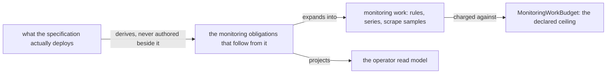

# Monitoring Doctrine

> **Purpose**: Make monitoring a mandatory, non-vacuous property of a workflow, of an extension, and of every
> execution unit — so an unmonitored workflow, an unmonitored extension, an unmonitored deployed unit, and an
> unauthenticated monitoring surface are all unrepresentable — and define the derived dashboards, the operator
> read-model, the admin/per-subject access model, the extensible per-workflow surfaces (TensorBoard), the
> in-cluster alert receiver and its out-of-band delivery boundary, the parent-monitoring posture, and the
> honest foreclosure layer each obligation reaches.
> **Read this if**: something has to be observed, or a monitoring cost has to be accounted for.

This document owns observability as a derived obligation: what is monitored follows from what is deployed
rather than being authored beside it, and its cost folds through the ordinary capacity machinery. It does
not own the capacity types that cost passes through, owned by
[resource_capacity_types.md](./resource_capacity_types.md), nor the services that realize it, owned by
[platform_services_doctrine.md](./platform_services_doctrine.md).

<details>
<summary>Link-graph metadata</summary>

**Status**: Authoritative source
**Supersedes**: N/A
**Referenced by**: DEVELOPMENT_PLAN/phase_32_platform_services_2.md, DEVELOPMENT_PLAN/phase_36_pulsar_client.md, documents/engineering/README.md, documents/engineering/app_vs_deployment_doctrine.md, documents/engineering/capability_extension_doctrine.md, documents/engineering/cluster_lifecycle_doctrine.md, documents/engineering/content_addressing_doctrine.md, documents/engineering/daemon_topology_doctrine.md, documents/engineering/dsl_doctrine.md, documents/engineering/image_build_doctrine.md, documents/engineering/low_code_ui_runtime_doctrine.md, documents/engineering/namespace_layout_doctrine.md, documents/engineering/platform_services_doctrine.md, documents/engineering/pulsar_client_doctrine.md, documents/engineering/resource_capacity_sources.md, documents/engineering/service_capability_doctrine.md, documents/illegal_state/illegal_state_lifecycle.md, documents/illegal_state/illegal_state_techniques.md
**Generated sections**: none

</details>

> **Historical result (invalidated).** Phase-run and implementation-result statements predate the 2026-08-11 reopen unless the owning phase is Done; target doctrine remains normative, and current state is in the [tracker](../../DEVELOPMENT_PLAN/README.md).

## Contents
- [1. Monitoring is a property of what is deployed, not a bolt-on](#1-monitoring-is-a-property-of-what-is-deployed-not-a-bolt-on)
- [2. The four mandatory obligations](#2-the-four-mandatory-obligations)
- [3. Derivation and the operator read-model](#3-derivation-and-the-operator-read-model)
- [4. Access: one admin, delegated per-user scope, no public arm](#4-access-one-admin-delegated-per-user-scope-no-public-arm)
- [5. Extensible surfaces: TensorBoard](#5-extensible-surfaces-tensorboard)
- [6. The parent-monitoring posture](#6-the-parent-monitoring-posture)
- [7. Fit within resource limits](#7-fit-within-resource-limits)
- [8. The three foreclosure layers](#8-the-three-foreclosure-layers)
- [9. Planning ownership](#9-planning-ownership)
- [Related Documents](#related-documents)

---

**Pure cost-model status.** The [Phase 9 gate](../../DEVELOPMENT_PLAN/phase_09_execution_accelerator_folds.md)
executes the finite `MonitoringWorkBudget` evaluation, query/proxy compute, and TSDB temporary-plus-resident
storage derivation in Register 1. Prometheus behavior and rendered/live correspondence remain unverified; the
pure fold ledger is `external-run-reference`.

## 1. Monitoring is a property of what is deployed, not a bolt-on

**The problem.** A workflow can decode, deploy, and then go dark: its daemons run, its topics carry traffic,
and nothing observes whether it is healthy. The same is true of everything else a spec deploys — a platform
capability, an ordinary workload, a Job, a host worker, a fabric role. Observability treated as a **cluster**
capability alone ([service_capability_doctrine.md](./service_capability_doctrine.md), Prometheus/Grafana) is
never a property of the thing deployed. So a `RouteEntry`, an `ExtensionSpec`, an app spec, and any bound
execution unit could all be constructed with no monitoring obligation attached; the gap surfaces only at
runtime, as an unmonitored production workload nobody is alerted on.

**Why the obvious alternative fails.** The tempting fix is an *optional* monitoring field plus a convention
that operators fill it in, and a Grafana instance operators are trusted to add panels to. Optionality and
operator diligence are exactly what the catalog rejects elsewhere: the mandatory non-optional `RetentionPolicy`
([illegal_state_catalog.md §3.20](../illegal_state/illegal_state_storage.md#320-a-pulsar-topic-without-a-bounded--tiered--retained-lifecycle)) exists because "keep forever" as an optional
default is a disk-full outage, and `TestTopology`'s non-optional `teardown`
([testing_doctrine.md](./testing_doctrine.md)) exists because "tear down if the operator remembers" leaks
resources. An optional monitor is monitored-if-remembered.

**The chosen rule.** Monitoring is a **mandatory, non-vacuous field** of the workflow, extension, and
execution-unit types, and the surfaces it drives are **derived** from that field, never hand-authored. A
`Workflow` without a `WorkflowMonitor`, a `RouteEntry` without a `Liveness`, an `ExtensionSpec` without its
`extMonitoring` surfaces, and a `BoundExecutionUnit` without its `UnitMonitor` each have **no inhabitant**
([§2](#2-the-four-mandatory-obligations)). This is the
required-field-by-construction technique ([illegal_state_catalog.md §4.1](../illegal_state/illegal_state_techniques.md#41-pvcpv-binding-by-construction)) applied to observability, and it
mirrors the `TrainBudget` `Continuous`-requires-`checkpointCadence` foreclosure
([content_addressing_doctrine.md](./content_addressing_doctrine.md)) and the universal `ResourceEnvelope`
obligation ([platform_services_doctrine.md §10](./platform_services_doctrine.md#10-every-execution-unit-declares-its-complete-resource-envelope)).

**What it forecloses.** An author loses the freedom to ship a workflow — or any other runnable member — with
monitoring deferred to later; the obligation must be discharged for the spec to decode and bind. Universal
coverage is also not free: the derived rule/series population grows with the execution set, so a deployment
can now be refused for monitoring cost it previously never incurred
([§7](#7-fit-within-resource-limits)). And the guarantee is honest about its limit: the type
forces a monitor to *exist* and be *non-vacuous by construction*, not to be *operationally meaningful* — that
an SLI names a live metric series, and that the objective is actually met, is runtime-checked
([§8](#8-the-three-foreclosure-layers)), never claimed stronger.

---

## 2. The four mandatory obligations

Monitoring attaches at four points, each a required field whose omission is uninhabitable. The first three
bind the workflow surface; the fourth ([§2.4](#24-per-execution-unit-obligation--boundexecutionunitmonitor))
binds everything else that runs, so "monitored deployment" and "deployment" have the same inhabitants.

### 2.1 Per-workflow SLO — `Workflow.monitor`

The topology SSoT is promoted from a bare `List RouteEntry` to a per-workflow grouping record. `monitor` is
mandatory; the routing lanes carry their own per-topic liveness ([§2.2](#22-per-topic-liveness--routeentryliveness)):

```text
Workflow = { name : Text, routes : NonEmpty RouteEntry, monitor : WorkflowMonitor }

WorkflowMonitor =
  { sli : NonEmpty Sli, objective : Objective, sink : AlertBinding, access : AccessScope }
Sli          = { name : MetricName, kind : SliKind, objective : Objective }
SliKind      = < Availability | Latency | Saturation | FreshnessSli | BacklogSli >
Objective    = { threshold : Quantity, window : Duration, errorBudget : ErrorBudget }
AlertBinding = < ToObservability : { severity : Severity } >
Severity     = < Page | Warn >

MetricName   = Text                 -- refined: a non-empty Prometheus-legal series name
ErrorBudget  = Quantity             -- refined: 0 < b < 1, the tolerated fraction of `window`
```

`access` is the same mandatory `AccessScope` every other renderable surface carries
([§4](#4-access-one-admin-delegated-per-user-scope-no-public-arm)); carrying it on `WorkflowMonitor` is what
makes the no-`Public` guarantee true of the **generic Prometheus/Grafana surface** and not only of the
`TensorBoard` arm ([§2.3](#23-per-extension-surfaces--extensionspecextmonitoring)) — without it the
[§8](#8-the-three-foreclosure-layers) type-foreclosure claim would hold for one arm of `MonitoringSurface` and
not the other. `MetricName` and `ErrorBudget` are refined newtypes whose smart constructors reject the empty
name and the degenerate `0`/`1` budget at decode; `Quantity` and `Duration` are owned by
[resource_capacity_doctrine.md §3](./resource_capacity_doctrine.md#3-the-types-quantity-capacity-demand-budget)
and are referenced, never redeclared. The `SliKind` arms are `FreshnessSli`/`BacklogSli` rather than
`Freshness`/`Backlog` so the *classifier* arms cannot be confused with the refined `Freshness` newtype and the
`BacklogBound` quantity that [§2.2](#22-per-topic-liveness--routeentryliveness) declares — two distinct
concepts that shared a spelling.

`sli` is `NonEmpty` — the same no-empty-list idiom that makes a routing entry with no lanes unroutable
([pulsar_client_doctrine.md §6](./pulsar_client_doctrine.md#6-the-declarative-topology-algebra)). That idiom
removes the *empty* list at Gate 1; the non-vacuousness of each indicator's bounds is a decode-time refinement
([§8](#8-the-three-foreclosure-layers)), never claimed as a type fact. The two
`objective` fields are distinct, not redundant: each **`Sli.objective`** is the per-indicator target that one
indicator must hold (its own `threshold`+`window`), while the top-level **`WorkflowMonitor.objective`** is the
**workflow-level SLO** the workflow as a whole is judged and alerted against — the per-SLI objectives gate each
indicator, the workflow objective gates the composite. `AlertBinding` has **one** arm, routing to the cluster
`Observability` capability by name — no URL arm and no product arm, mirroring the capability surface's
no-product rule ([service_capability_doctrine.md](./service_capability_doctrine.md)) — and it has **no**
`Off`/`None`/`Silent` arm, mirroring `RetentionPolicy`'s absent keep-forever arm. `Objective.threshold` is a
refined non-zero `Quantity` ([resource_capacity_doctrine.md](./resource_capacity_doctrine.md)). The promotion
is **not** purely additive: `topicFor`/`validateTopology` re-base onto `Workflow`, and a decode-time fold
reconciles `routes[].workflow` against `Workflow.name` ([§3](#3-derivation-and-the-operator-read-model)).

### 2.2 Per-topic liveness — `RouteEntry.liveness`

Every routing entry additionally carries a mandatory per-derived-topic liveness obligation:

```text
RouteEntry = { workflow : Text, phase : Phase, lanes : List Substrate, liveness : Liveness }
Liveness   = { freshness : Freshness, backlog : BacklogBound }   -- closed; no Silent arm

Freshness    = Duration             -- refined: 0 < d < ceiling, no Infinity
BacklogBound = Quantity             -- refined: finite messages-or-bytes, no unbounded arm
```

`Freshness` is a refined newtype (`0 < d < ceiling`, no `Infinity`), so a topic that is never expected to
produce — a silent lane — is not constructible. `BacklogBound` is a refined finite `Quantity` that composes
with the topic's existing mandatory backlog quota ([pulsar_client_doctrine.md §6.1](./pulsar_client_doctrine.md#61-topic-storage-lifecycle-bounded-tiered-retained--and-the-hot-tier-never-overflows)).
Neither is the `FreshnessSli`/`BacklogSli` classifier arm of `SliKind`
([§2.1](#21-per-workflow-slo--workflowmonitor)): a `SliKind` arm names *what an indicator measures*, and
these two name *the bound a derived topic must hold*.

### 2.3 Per-extension surfaces — `ExtensionSpec.extMonitoring`

An extension declares the monitoring surfaces it stands up. Every extension is linked, not loaded
([dsl_doctrine.md §4](./dsl_doctrine.md#4-total-composability)), and the surfaces it may declare are a
**closed** union with no open "other service" arm — the same closure the capability union carries
([service_capability_doctrine.md](./service_capability_doctrine.md)). The closure rests on the **platform**
kinds, whose membership is vendored and closed
([capability_extension_doctrine.md §2](./capability_extension_doctrine.md#2-three-extension-kinds-workload-capability-and-app)):
`TensorBoard` exists because jitML does. The open `App` tier does not widen it — an app draws from the same
fixed arms, and since `extMonitoring` is `NonEmpty`, an app that declares no monitoring has no inhabitant:

```text
ExtensionSpec = { extDhall, extChain, extCapabilities, extMonitoring : NonEmpty MonitoringSurface }

MonitoringSurface =
  < Slo         : WorkflowMonitor
  | TensorBoard : { backing : ObjectStoreRef, access : AccessScope } >
```

`extMonitoring` is `NonEmpty` and mandatory, so an extension's `extDhall` cannot be constructed without at
least one declared surface — jitML's is a `TensorBoard` surface backed by MinIO
([§5](#5-extensible-surfaces-tensorboard)), so an unmonitored jitML run has no inhabitant. infernix and
jitML declare at least the generic `Slo` surface. A low-code app need not contribute an `App` extension at
all; its workflow and generic UI-server/projector monitoring surfaces are derived from the checked bound
program and therefore remain mandatory without pretending the UI source is linked code.

### 2.4 Per-execution-unit obligation — `BoundExecutionUnit.monitor`

**The problem.** The three obligations above bind the *workflow* surface. They leave everything that is not a
workflow, a routing lane, or a linked extension with no monitoring obligation at all: an ordinary
Deployment/StatefulSet/DaemonSet workload, each of the eight cluster-invariant platform capabilities
([service_capability_doctrine.md](./service_capability_doctrine.md)), a retained StatefulSet's volume, the
Envoy/Keycloak edge, a copy/schema/Pulumi/ACME Job, a controller child or admission webhook, a host process or
host worker, and the topology-derived network-fabric roles. Each of those decodes, provisions, renders, and
runs with nothing observing it — the failure surfaces at **runtime**, as an unobserved platform service in a
deployment whose *workflows* are fully monitored, which reads as coverage and is not.

**Why the obvious alternative fails.** The tempting fix is that platform services are amoebius-derived and
therefore "monitored by construction, so no field is needed". That is the same monitored-if-remembered
argument [§1](#1-monitoring-is-a-property-of-what-is-deployed-not-a-bolt-on) rejects, moved from the operator to
the implementation: nothing forces the derivation to emit a rule for a unit it forgot, and nothing detects
the omission. The corpus already refused this reasoning for the parallel obligation — a derived pod does not
get to skip its `ResourceEnvelope`
([platform_services_doctrine.md §10](./platform_services_doctrine.md#10-every-execution-unit-declares-its-complete-resource-envelope): *"No pod is exempt"*).

**The chosen rule.** **Monitoring attaches to every execution unit, exactly as the resource envelope does.**
`BoundExecutionUnit` — the private Gate-2 constructor every runnable member expands into
([resource_capacity_doctrine.md §3](./resource_capacity_doctrine.md#3-the-types-quantity-capacity-demand-budget)) —
carries a mandatory `monitor` field beside its envelope, so the binder cannot construct a unit without one:

```text
BoundExecutionUnit = { id, owner, scope, revision, body, monitor : UnitMonitor }

UnitMonitor        = { provenance : MonitorProvenance, slo : WorkflowMonitor }
MonitorProvenance  = < Authored | DerivedForCapability | DerivedForRole >   -- no Exempt/None arm
```

`slo` is the **same** closed record [§2.1](#21-per-workflow-slo--workflowmonitor) declares — one SLO shape for
the whole system, not a second parallel one — so a unit monitor inherits `NonEmpty Sli`, the no-`Off`
`AlertBinding`, the refined non-zero `Objective`, and the no-`Public` `AccessScope` unchanged.
`MonitorProvenance` records *who authored the obligation*, never whether one exists: `Authored` is an app or
extension unit stating its own SLO, `DerivedForCapability` is a platform capability's monitor minted by the
binder from the capability's bound shape, and `DerivedForRole` covers the daemon roles, fabric roles, and
Job/controller-child units. There is no `Exempt` or `None` arm, so "this unit is not the kind of thing that
gets monitored" is not a value.

Derived provenance keeps the derived-never-hand-authored rule of
[§3](#3-derivation-and-the-operator-read-model): an operator cannot hand-write a capability's monitor, and the
binder cannot omit it. The two directions are the same guarantee seen from each end.

**What it forecloses.** A deployment can no longer ship a monitored workflow beside an unobserved platform
service, a silent Job, or an unwatched host worker; the obligation must be discharged for the unit to bind.
The cost is real and is stated rather than hidden: the monitored population is now the execution set, not the
workflow list, so the derived rule/series cost folds against `MonitoringWorkBudget` over a strictly larger
input ([§7](#7-fit-within-resource-limits)), and a deployment that fits its capacity budget with
workflow-only monitoring may not fit it with universal monitoring. That refusal is the intended behaviour —
capacity push-back at the provision seal, never silent under-coverage. And the guarantee keeps
[§1](#1-monitoring-is-a-property-of-what-is-deployed-not-a-bolt-on)'s honest limit: the field forces a monitor to
*exist* and be *non-vacuous*, not to be *operationally meaningful*
([§8](#8-the-three-foreclosure-layers)).

Backups need no fourth mechanism: a backup runs as a Job, and its unit carries the obligation like any other
([backup_recovery_doctrine.md](./backup_recovery_doctrine.md)).

---


*Orientation. Design intent. Monitoring is derived from what is deployed rather than authored alongside it, which is why a deployed thing cannot be silently unmonitored. The budget its work is charged against is owned by [resource_capacity_types.md](./resource_capacity_types.md); whether a live cluster honours the ceiling is runtime-checked.*

## 3. Derivation and the operator read-model

Monitoring artifacts are **derived**, never authored, so coverage cannot be forgotten. The derivation is a
total function of the same descriptor the topology fold already walks:

```text
monitorFor       :: Workflow -> (NonEmpty PrometheusRule, GrafanaPanel)   -- total
validateTopology :: [Workflow] -> [ExtensionSpec] -> Either [TopologyError] MonitoredTopology

PrometheusRule    = < Recording : { name : MetricName, expr : RuleExpr }
                    | Alerting  : { name : MetricName, expr : RuleExpr
                                  , for : Duration, severity : Severity } >
GrafanaPanel      = { title : Text, rows : NonEmpty PanelRow, access : AccessScope }
PanelRow          = { sli : MetricName, objective : Objective }
MonitoredTopology = -- opaque; constructible only by `validateTopology`
BudgetRemaining   = Quantity     -- refined: 0 ≤ r ≤ 1, the unspent fraction of `ErrorBudget`
BreachReason      = < ObjectiveMissed : MetricName | FreshnessLapsed : Text | BacklogExceeded : Text >
```

`monitorFor` returns a `NonEmpty PrometheusRule` and one `GrafanaPanel` whose `rows` are `NonEmpty` and cover
**every** `Sli` of the workflow's monitor — a derivation that emitted no rule, or a panel missing an
indicator, would satisfy "monitoring exists" vacuously at the output end after the input end was made
non-vacuous. That total-coverage postcondition is a decode-time fold, not a type fact
([§8](#8-the-three-foreclosure-layers)). `RuleExpr` is the derived PromQL form; it is generated from the
`Sli`/`Objective` pair and is never author-written, so it carries no escape arm. `MonitoredTopology` is
**opaque** — the same private-constructor idiom as `ProvisionedSpec`
([dsl_doctrine.md](./dsl_doctrine.md)) — so a topology that never passed the fold cannot be presented as one
that did.

`validateTopology` ([pulsar_client_doctrine.md §6](./pulsar_client_doctrine.md#6-the-declarative-topology-algebra)) is extended to fold every `monitor`,
`liveness`, and `extMonitoring` alongside its existing one-sided-link checks, and returns the **full**
violation list. Two new violations:

- `MonitoringInfeasible workflow reason` — a declared freshness below the achievable scrape interval, or a
  derived recording-rule cost that overflows the `Observability` workload's `Capacity` ([§7](#7-fit-within-resource-limits)).
- `UnroutedMonitor workflow` — a `routes[].workflow` with no owning `Workflow` record (the promotion's reconciliation hole).

The per-execution-unit obligation ([§2.4](#24-per-execution-unit-obligation--boundexecutionunitmonitor)) is
folded at the same seal rather than here, because it walks the bound execution set and not the topology: a
`BoundExecutionUnit` whose derived rules are unsatisfiable, or whose `Sli` set the derivation cannot cover,
returns `MonitoringInfeasible` from `provision` before any `ProvisionedSpec` exists.

**Alerts are delivered inside the cluster; delivery beyond its edge is out of band.** `Severity = <Page | Warn>`
names a class, and `AlertBinding` routes by capability name — so the receiver that groups, deduplicates,
silences, and holds the firing set is part of the `Observability` capability itself
([platform_services_doctrine.md §7](./platform_services_doctrine.md#7-prometheus--grafana--observability-is-not-an-add-on)),
baked like every other service binary ([image_build_doctrine.md §7](./image_build_doctrine.md#7-what-amoebius-bakes-vs-builds--the-base-container-is-the-supply-chain))
and reachable only through the Keycloak-owned edge. It is **not** a new capability arm — that union is closed
([service_capability_doctrine.md](./service_capability_doctrine.md)) — and it declares a complete envelope like
any pod ([§7](#7-fit-within-resource-limits)). What amoebius deliberately does **not** represent is an
outbound delivery target: an email/SMS/webhook destination would be exactly the arbitrary-`Url` arm the DSL
forecloses everywhere else, and amoebius runs identically on a disconnected laptop. Carrying a page out of the
cluster is therefore an operator-owned out-of-band integration against the receiver, recorded here as a
deliberate boundary rather than an omission.

The operator sees monitoring two ways, both on pre-existing surfaces:

- **Grafana (human browser).** The derived Prometheus recording/alert rules and a per-workflow health
  dashboard are provisioned into the existing Grafana, reachable only through the Keycloak-owned edge
  ([platform_services_doctrine.md §7](./platform_services_doctrine.md#7-prometheus--grafana--observability-is-not-an-add-on)). This adds panels, not a new browser surface.
- **The `workflow-health` read-model (typed).** A compacted `workflow-health` Pulsar topic is projected
  through the existing compaction + TableView machinery ([pulsar_client_doctrine.md §5.1](./pulsar_client_doctrine.md#51-two-derived-capabilities-read-model-and-two-deliberately-absent-ones), [daemon_topology_doctrine.md §5.2](./daemon_topology_doctrine.md#52-the-coordination-plane-is-for-worker-events-and-audit-not-leadership)) as `WorkflowName -> SLOStatus`, the first
  operator-facing TableView beside the internal leader-election one. The singleton produces the projection
  inside its existing reconcile loop — no new container — and the operator reads it via a `pb workflow health`
  verb on the singleton admin REST ([bootstrap_sequence_doctrine.md](./bootstrap_sequence_doctrine.md)).

```text
SLOStatus = Fresh | Degraded BudgetRemaining | Breached BreachReason | NotYetObserved
```

`NotYetObserved` is the lag-tailed state past a replication watermark ([§6](#6-the-parent-monitoring-posture)); the read-model is
eventually-consistent, never live truth. `BudgetRemaining` is the unspent fraction of the objective's
`ErrorBudget` ([§2.1](#21-per-workflow-slo--workflowmonitor)) and `BreachReason` is a closed union — a breach
always names which indicator or bound failed, so `Breached` cannot degrade to an opaque string.

### 3.1 In-flight migrations are first-class derived signals

A migration is the one class of operation that is expected to be *temporarily* in an inconsistent-looking
shape — two coordinates live, both charged, one not yet verified — so the ordinary SLO signals cannot
distinguish "migrating" from "broken". Derivation therefore emits, for every transition-class instance in
[migration_doctrine.md §3](./migration_doctrine.md#3-one-discipline-many-instances) that touches durable
bytes, a bounded signal set: in-flight count by kind, elapsed against the instance's declared budget,
verification outcome (verified / failed / not yet), stand-down and abort counts, and the depth of the
`ReclaimEligible` backlog awaiting an out-of-band reclaim. Labels are the bounded kind and outcome classes
only — never a volume, schema, digest, tenant, or coordinate identity, which would make migration cardinality
into monitoring cardinality ([§7](#7-fit-within-resource-limits)).

The signal that matters most is the one a success-only view omits: a migration **stalled** past its budget
with verification not yet reached is a distinct alertable state, not the absence of a completion event. A
`ReclaimEligible` backlog that only grows is likewise a reportable condition rather than a fault — the
reclaim is deliberately an out-of-band human act
([inforcespec_migration_doctrine.md §4](./inforcespec_migration_doctrine.md#4-shrink-is-create-new--verified-migrate--retire-old-backing-reclaim-is-external-and-privileged)),
so the signal exists to tell an operator that the act is owed, never to authorize amoebius to perform it.

### 3.2 UI realtime and offline health are first-class derived signals

For each admitted UI runtime, derivation includes bounded metrics and alerts for active WebSockets by scoped
route class, handshake/origin/auth failures, reconnect/drain rate, Redis primary/Sentinel health, replication
lag, client/output-buffer pressure, expired/stale connection registrations, Pub/Sub delivery failures, and
cursor/receipt repair latency. It also includes offline replay backlog count/bytes/age, typed outcome counts,
receipt lookup latency, migration failures, upload staging/chunk retry, quota refusal/eviction, and oldest
compatible record age. Labels use bounded program/tenant/result classes; subject, device, command, connection,
cursor, Redis key, and blob identities are never Prometheus labels. Redis loss is an availability signal, not
proof that a durable command failed or succeeded.

---

## 4. Access: one admin, delegated per-user scope, no public arm

Every renderable monitoring surface carries a mandatory access scope with no unauthenticated arm:

```text
AccessScope =
  < AdminGlobal
  | SubjectScoped : { tenant : TenantRef, owner : SubjectRef, policy : AuthPolicyRef }
  | TenantRoleScoped : { tenant : TenantRef, role : RoleRef, policy : AuthPolicyRef }
  >   -- no Public / Unauthenticated arm
```

**The problem.** A monitoring surface that publishes without authentication, or a per-user view that leaks
another user's data, is a data-exposure defect that a convention ("remember to gate it") does not prevent.

**Why the obvious alternative fails.** An optional `public : Bool` or an ungated default route is the same
optionality [§1](#1-monitoring-is-a-property-of-what-is-deployed-not-a-bolt-on) rejects, and it reproduces the
insecure-ingress state the catalog already forecloses ([illegal_state_catalog.md §3.7](../illegal_state/illegal_state_security.md#37-accidental-insecure--backdoor-ingress)).

**The chosen rule.** `AccessScope` has no `Public` arm, so an unauthenticated monitoring surface has no
inhabitant — reinforcing the existing rule that only the Keycloak edge holds `ExposeToWild`
([illegal_state_catalog.md §3.7](../illegal_state/illegal_state_security.md#37-accidental-insecure--backdoor-ingress)); every surface reaches the browser only through that edge
([platform_services_doctrine.md §9](./platform_services_doctrine.md#9-the-loadbalancer-and-the-single-wild-ingress-path)). Three arms:

- **`AdminGlobal`** — the single admin identity. There is exactly one admin login, named in the `InForceSpec`
  and uploaded to Vault before any gateway deploys, and it reaches every console (Grafana, Prometheus, MinIO,
  Keycloak, Vault, Postgres). This is the admin-dashboard answer; the admin identity itself is owned by
  [vault_pki_doctrine.md](./vault_pki_doctrine.md) and the bootstrap admin plane
  ([bootstrap_sequence_doctrine.md](./bootstrap_sequence_doctrine.md)).
- **`SubjectScoped`** — a verified subject sees only projections whose mandatory owner index equals the
  request context's `(TenantRef, SubjectRef)`. The subject and tenant are minted from authenticated membership,
  never supplied by a dashboard parameter. Storage, projection, cache, artifact, and workflow references carry
  the same owner index.
- **`TenantRoleScoped`** — a tenant role sees a deliberate tenant-shared projection. The policy is a closed,
  derived reference into the tenant→role graph, not an author-written claim expression or filter.

**What it forecloses.** The type introduces the subject/owner grain required by
[low_code_ui_runtime_doctrine.md §10](./low_code_ui_runtime_doctrine.md#10-single-tenant-and-multi-tenant-applications).
There is no `Ref tenant owner a -> Ref tenant otherOwner a` coercion and no optional owner predicate. A
cross-user monitoring reference is type- or decode-foreclosed in the checked graph; faithful enforcement by
Keycloak, the UI server, the projection worker, and the provider remains runtime-checked
([§8](#8-the-three-foreclosure-layers)). Admin-global access remains a distinct operator authority and cannot
be obtained by widening a subject-scoped application policy.

---

## 5. Extensible surfaces: TensorBoard

`MonitoringSurface` is a closed union whose arms cover the closed extension set's needs: the generic `Slo`
(Prometheus/Grafana), and `TensorBoard { backing : ObjectStoreRef, access : AccessScope }` for jitML.

**TensorBoard is a baked binary.** amoebius runs identically on an offline laptop and forbids pod-startup
fetches, so TensorBoard is baked into the base image beside Prometheus/Grafana
([image_build_doctrine.md §7](./image_build_doctrine.md#7-what-amoebius-bakes-vs-builds--the-base-container-is-the-supply-chain)), never pulled at start-up.

**The MinIO backing.** jitML's checkpoints are content-addressed in MinIO with a `metrics` manifest field
([content_addressing_doctrine.md](./content_addressing_doctrine.md)), but TensorBoard reads `tfevents` files.
So jitML emits `tfevents` to a per-experiment MinIO prefix (`jitml-checkpoints/<experiment-hash>/tb/`) that
the `TensorBoard` surface reads over MinIO's S3 API — MinIO is the S3-shaped `ObjectStore`
([service_capability_doctrine.md](./service_capability_doctrine.md)). Those objects are bounded by the store's
budget ([§7](#7-fit-within-resource-limits)); their retention/GC follows the deferral to the sibling jitML
checkpoint-format doctrine ([content_addressing_doctrine.md](./content_addressing_doctrine.md)).

**Per-subject is an access filter, not a pod per subject.** A per-subject jitML TensorBoard is a `SubjectScoped` view over
the **one shared** TensorBoard instance ([§4](#4-access-one-admin-delegated-per-user-scope-no-public-arm)),
filtered by the `sub` claim — not a TensorBoard pod per user, which would multiply `Demand`
([§7](#7-fit-within-resource-limits)).

---

## 6. The parent-monitoring posture

Monitoring aggregation is split by cluster topology, and both cross-cluster transports that would violate the
fabric's invariants are rejected.

- **Peer / sibling clusters (HA of one workflow).** A monitor breach is an event on the workflow's own event
  topic, already carried sibling↔sibling by the existing async Pulsar geo-replication + write-once
  content-addressed MinIO channel ([cluster_lifecycle_doctrine.md](./cluster_lifecycle_doctrine.md), [chaos_failover_doctrine.md](./chaos_failover_doctrine.md)), alongside the exported live-lag monitor and
  `DataLossBudget` the failover boundary already ships. A peer pulls from a log it already consumes — no new
  edge, nothing pushed outward.
- **The spawn forest (parent↔child): foreclosed by design.** A child cannot name or replicate to its parent —
  a `ChildInForceSpec` projection has no field in which a sibling or **ancestor**-only branch can appear
  ([cluster_lifecycle_doctrine.md §3](./cluster_lifecycle_doctrine.md#3-amoebic-spawning--the-recursive-forest)), and geo-replication is a parent-configured
  *sibling* mesh, not an upward channel. A parent reaching across the boundary to pull a child's telemetry is
  the synchronous cross-cluster RPC / multicluster service-mirroring ruled actively anti-doctrinal
  ([network_fabric_doctrine.md](./network_fabric_doctrine.md)). So in-cluster parent→child telemetry is
  foreclosed by the same isolation invariant that makes cross-tenant references unrepresentable
  ([illegal_state_catalog.md §3.10](../illegal_state/illegal_state_security.md#310-a-child-spec-that-reaches-beyond-its-own-subtree)). The accepted cross-forest viewer is the out-of-forest
  human operator, whose laptop reaches each cluster's own Grafana and `pb` admin plane through Keycloak — a
  privileged admin path, not a forest data edge.

**What it forecloses.** A spawned child can be unhealthy indefinitely with its in-cluster parent structurally
unable to observe it; only the out-of-forest operator sees it. This blind spot is a deliberate consequence of
per-child crypto isolation, not a defect to patch. A one-way, human-triggered, out-of-forest sealed
attestation channel is a possible later relaxation, recorded as open, not built.

---

## 7. Fit within resource limits

The generic monitoring path adds **zero** per-workflow pod `Demand`: it is pull/scrape of the `/healthz`
`/readyz` `/metrics` endpoints every daemon already exposes ([daemon_topology_doctrine.md](./daemon_topology_doctrine.md)),
with **no per-workflow sidecar** — honouring the no-sidecar-fleet stance and the Linkerd-rejected-for-being-a-sidecar
precedent ([network_fabric_doctrine.md](./network_fabric_doctrine.md)). Each remaining cost folds against the
existing capacity machinery ([resource_capacity_doctrine.md](./resource_capacity_doctrine.md)):

- Recording/alert-rule evaluation runs inside the `Observability` Prometheus workload and is folded **as a function of the monitored population**, not a flat add. The mandatory finite `MonitoringWorkBudget` and its
  nested `QueryWorkBudget` — their complete field list, cardinality bounds, and TSDB/query cost models — are
  owned by [resource_capacity_sources.md §9.2](./resource_capacity_sources.md#92-monitoring-cost-folds-through-the-standard-machinery-and-the-forest-has-no-parent-rollup-budget)
  and are referenced here, never restated. Binding
  rejects a descriptor above any cardinality bound and derives Prometheus requests/limits from a version-pinned
  conservative baseline + rule/series/evaluation cost overlapping maximum concurrent query work. It also
  derives the query-admission proxy's complete pod envelope; neither request set is a fixed constant
  independent of the descriptor. The renderer writes that same interval to Prometheus's global evaluation setting and every
  generated rule group (no shorter override); the live gate reads the effective configuration back. A cost
  derived for one interval with a shorter runtime default is drift and refuses convergence.
- Versioned TSDB/query models derive the retained-block bytes plus WAL/head, old+new block compaction overlap,
  and query/temp headroom from the bounded series/sample rate, retention, and structural query operands. A
  scalar `maxQueryTempBytes` is not authorable. That result is required usable bytes;
  the pinned filesystem-overhead model and backing minimum/quantum then construct the private
  `ProvisionedVolumeDemand` for Prometheus. The exact rounded PVC/PV capacity, volumeMode/fsType, and
  `--storage.tsdb.retention.time`/`--storage.tsdb.retention.size` configuration are rendered from it.
  Prometheus receives the concurrency/sample/timeout flags and a sole-routable admission proxy enforces
  series/range bounds; NetworkPolicy denies direct query API access. A PVC
  whose mounted usable bytes are one byte below the TSDB peak, or whose raw allocation is one quantum below
  `provisionedBytes`, rejects. Live validation drives a compaction boundary and verifies
  WAL/head/blocks/temp remain inside usable capacity and raw allocation. Optional local Thanos remains a distinct
  bounded pod/durable demand and cannot borrow this claim.
- The `workflow-health` topic and the jitML `tfevents` prefix are Pulsar/MinIO objects, bounded by the
  mandatory retention/offload/backlog triple ([pulsar_client_doctrine.md §6.1](./pulsar_client_doctrine.md#61-topic-storage-lifecycle-bounded-tiered-retained--and-the-hot-tier-never-overflows)) and the closed
  `StorageBudget` with no unbounded arm.
- The optional local Thanos downsample/long-term store is one companion beside the single Prometheus — a
  strictly **local** role for the baked-but-otherwise-roleless binary, never a cross-cluster Query/Store/Receive
  — whose pod declares the complete CPU/memory/`ephemeral-storage` envelope, bounded scratch, durable demand,
  and explicit accelerator `None`, then folds via `place`.
- The **one shared** TensorBoard pod declares complete CPU/memory/`ephemeral-storage` requests/limits,
  bounded scratch, and explicit durable/cache/accelerator provisions, and folds via `place`/`podFits` like
  any pod. Per-user scoping is an access filter over that shared instance
  ([§5](#5-extensible-surfaces-tensorboard)), not a pod per user, so it does not multiply `Demand`.
- **No parent-rollup budget exists** — the forest rollup flow is foreclosed
  ([§6](#6-the-parent-monitoring-posture)), so there is no parent-side storage to budget.
- WebSocket/Redis and offline signals from [§3.2](#32-ui-realtime-and-offline-health-are-first-class-derived-signals)
  consume the same finite `MonitoringWorkBudget`; their derived series and scrape rate are included before
  Prometheus placement. Per-connection, subject, command, device, cursor, and blob labels are forbidden, so
  connection or outbox cardinality cannot silently become monitoring cardinality.
- The per-execution-unit obligation ([§2.4](#24-per-execution-unit-obligation--boundexecutionunitmonitor))
  makes the monitored population the **bound execution set**, not the workflow list, so the rule/series fold
  is over a strictly larger input and `MonitoringWorkBudget`'s cardinality bounds bite sooner. A deployment
  whose workflow-only monitoring fitted and whose universal monitoring does not is refused at the provision
  seal with a `MonitoringInfeasible` `ProvisionError` — the intended push-back, never silent
  under-coverage. Unit monitors add no pod `Demand` of their own: they are scrape targets on endpoints the
  units already expose, with no sidecar.
- The alert receiver inside the `Observability` capability
  ([§3](#3-derivation-and-the-operator-read-model)) is one more pod beside Prometheus — complete
  CPU/memory/`ephemeral-storage` envelope, bounded scratch, explicit accelerator `None`, folded via `place`.
  It holds the firing set in memory against a finite bound; it is not a second durable store.

The honest residue is narrower: the mandatory cardinality/work budget and conservative cost model bound the
declared Prometheus CPU/memory provision, but actual query latency and transient engine overhead remain
runtime-checked within those ceilings. There is no optional bypass and no descriptor-independent fixed request.

---

## 8. The three foreclosure layers

Per the honesty discipline ([illegal_state_catalog.md §6](../illegal_state/illegal_state_techniques.md#6-three-layers-of-foreclosure-and-the-honesty-they-force), [documentation_standards.md §6](../documentation_standards.md#6-honesty-the-proventestedassumed-discipline)), each guarantee names the layer it reaches. The
monitoring obligation is the same three-way split `RetentionPolicy` publishes ([illegal_state_catalog.md §3.20](../illegal_state/illegal_state_storage.md#320-a-pulsar-topic-without-a-bounded--tiered--retained-lifecycle)),
not a flat "type-foreclosed":

- **type-foreclosed** — field *presence* (`monitor`, `liveness`, `extMonitoring`, and the `BoundExecutionUnit`
  `monitor` of [§2.4](#24-per-execution-unit-obligation--boundexecutionunitmonitor)), the `NonEmpty` lists, and
  the absent arms (`AlertBinding` no-off, `AccessScope` no-public, `MonitorProvenance` no-exempt): a
  `Workflow`/`RouteEntry`/`ExtensionSpec`/execution unit omitting its obligation, a "monitoring off" value, or
  a public surface has no syntax and no inhabitant. Because the `WorkflowMonitor` of
  [§2.1](#21-per-workflow-slo--workflowmonitor) itself carries `access`, this reaches the generic
  Prometheus/Grafana surface and not only the `TensorBoard` arm.
- **decode-foreclosed** — non-vacuousness of the bounds (refinement smart constructors on `Freshness`,
  `MetricName`, `ErrorBudget`), total coverage of the *derived* output (`monitorFor`'s `NonEmpty` rule set and
  its panel-row-per-`Sli` postcondition, [§3](#3-derivation-and-the-operator-read-model)), the execution-set
  monitoring fold at the provision seal, coverage across derived topics (a relation-over-a-collection fold that, per
  [illegal_state_catalog.md §4.7](../illegal_state/illegal_state_techniques.md#47-compatibility--topology-relations-by-construction-over-a-collection), degrades to a decode-foreclosed fold and is **never**
  type-foreclosed), feasibility (`MonitoringInfeasible`), and the `routes[].workflow`-vs-`name` reconciliation
  (`UnroutedMonitor`).
- **runtime-checked** — that the SLO is actually met, the alert actually fires and reaches the receiver, the
  named `/metrics` series actually exists on the unit that declared it, and a `SubjectScoped` surface actually
  filters correctly. These are the "a type cannot prove a
  port is responsive" residues ([illegal_state_catalog.md §2](../illegal_state/illegal_state_catalog.md#2-the-load-bearing-limit-a-type-check-proves-the-spec-composes-not-that-the-cluster-enforces-it)), owned by
  [chaos_failover_doctrine.md](./chaos_failover_doctrine.md) and the review tier, never claimed stronger.
  Delivery of a `Page` *beyond* the cluster edge is out of scope entirely
  ([§3](#3-derivation-and-the-operator-read-model)) — an operator-owned integration amoebius does not
  represent, and therefore does not claim at any layer.

> **Honesty.** Type-foreclosed and decode-foreclosed statements here are target properties; current delivery
> and revalidation progress live in the [tracker](../../DEVELOPMENT_PLAN/README.md#current-implementation-audit).
> Runtime-checked residues remain explicit. Reused sibling behavior, including Pulsar Failover subscriptions
> and Keycloak ext-authz, is evidence from another system, not amoebius proof.

---

### Historical Phase-32 bounded observability result (invalidated)

Phase 32 live-tested a descriptor-derived Prometheus provision with finite evaluation, retention, query
concurrency, series, sample, range, timeout, and retained-storage operands. The sole query proxy returned 200
for an in-bound request and 429 for the one-over series request; NetworkPolicy denied Grafana's direct query
to Prometheus. Three platform targets were active, derived rules were loaded, retained TSDB high-water stayed
inside its usable bound, and Grafana completed its PostgreSQL-backed migrations. This is a tested
`linux-cpu` result, not a proof that every future SLO is satisfied. Every hardware substrate always retains
that linux-cpu baseline; pristine Linux uses Incus on Linux/Linux-CUDA, Lima on Apple, or WSL2 on Windows.

---

## 9. Planning ownership

Phase order, status, and validation gates live only in
[`DEVELOPMENT_PLAN/README.md`](../../DEVELOPMENT_PLAN/README.md). The monitoring obligation types — including
the `UnitMonitor` of [§2.4](#24-per-execution-unit-obligation--boundexecutionunitmonitor) — land in **Phase 4**,
their decoder and non-vacuity refinements in **Phase 5**, and the
`validateTopology` fold in **Phase 36**; the execution-set monitoring fold rides the whole-deployment seal in
**Phase 11**; rendered monitoring shapes and baked binaries (including the alert receiver) land in
**Phases 13 and 25**;
the bounded Prometheus/Grafana projection and derived rules/panels landed in **Phase 32**, while the receiver,
the `AccessScope`-behind-Keycloak obligation, and any optional local Thanos companion remain owned by their
respective later delivery surfaces; the `workflow-health` TableView
projection in **Phase 34** and the orchestrator/worker SLO-status event in **Phase 38**; the extension surfaces in **Phase 50**
(infernix) and **Phase 52** (jitML → TensorBoard); the peer-cluster posture and the forest foreclosure in
**Phase 43**; and the decode-rejection tests in **Phase 55**. This doc never maintains a competing status
ledger; it states the target shape and links back for status, per
[documentation_standards.md §6](../documentation_standards.md#6-honesty-the-proventestedassumed-discipline).

## Related Documents
- [Development Plan](../../DEVELOPMENT_PLAN/README.md)
- [Documentation Standards](../documentation_standards.md)
- [Illegal State Catalog](../illegal_state/illegal_state_catalog.md)
- [The Native Pulsar Client](./pulsar_client_doctrine.md)
- [DSL Doctrine](./dsl_doctrine.md)
- [App vs Deployment Doctrine](./app_vs_deployment_doctrine.md)
- [Service Capability Doctrine](./service_capability_doctrine.md)
- [Platform Services Doctrine](./platform_services_doctrine.md)
- [Resource Capacity Doctrine](./resource_capacity_doctrine.md)
- [Content Addressing Doctrine](./content_addressing_doctrine.md)
- [Daemon Topology Doctrine](./daemon_topology_doctrine.md)
- [Cluster Lifecycle Doctrine](./cluster_lifecycle_doctrine.md)
- [Image Build Doctrine](./image_build_doctrine.md)
- [UI Realtime Coordination](./ui_realtime_coordination_doctrine.md)
- [Browser Offline Runtime](./browser_offline_runtime_doctrine.md)
