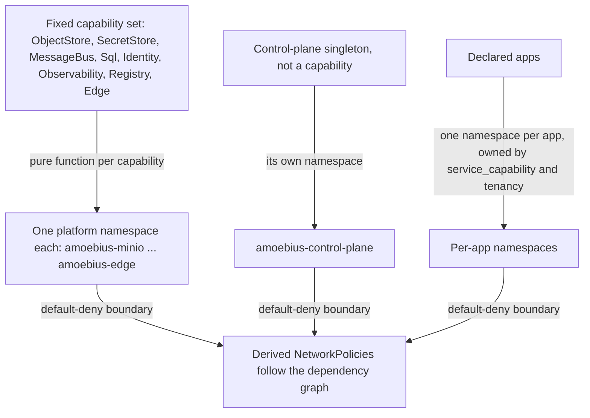

# Namespace Layout

**Status**: Authoritative source
**Supersedes**: N/A
**Referenced by**: documents/engineering/README.md
**Generated sections**: none

> **Purpose**: Single source of truth for the Kubernetes namespace partition — one namespace per platform
> capability plus one per app — derived from the fixed capability set so a workload's namespace is a pure
> function of what it is, never a free-text field an operator or app writes.

---

## 1. Why this doctrine exists

A Kubernetes namespace is the coarse isolation and blast-radius boundary every workload lands in: it scopes
RBAC, NetworkPolicy, resource quota, and the per-namespace teardown that lets one service be removed without
touching another. If the namespace a workload lands in is a **free-text field** the spec author fills in, then
the failure surfaces at author time — a manifest can name `amoebius-vault` for a workload that has nothing to
do with the secrets root, an app can place itself in a platform capability's namespace, and two unrelated
capabilities can be collapsed into one namespace that dissolves the isolation boundary between them. None of
those mistakes is caught until a policy leaks or a teardown deletes the wrong slice at runtime.

The obvious alternative — a `namespace : Text` field on every manifest, or a single flat default namespace for
everything — fails for the reason every hand-authored coordinate fails in amoebius: a free string cannot
express the invariant *this workload belongs to exactly its own capability's slice*. A `Text` namespace admits
`amoebius-minio` on a Postgres StatefulSet as readily as the correct value; a flat namespace has no boundary to
enforce at all. Isolation would then rest on review, not on construction, which the amoebius contract
([dsl_doctrine.md](./dsl_doctrine.md), [illegal_state_catalog.md](../illegal_state/illegal_state_catalog.md)) rejects for
exactly this class of invariant.

The rule this doctrine states: **the namespace layout is DERIVED from the fixed capability set — one namespace
per platform capability, one namespace per app — and a workload's namespace is computed from what the workload
is, never authored.** A platform provider lands in its capability's namespace because it *is* that capability's
realization; an app lands in its own namespace because it *is* that app. No spec surface accepts a namespace
string, so a workload cannot name a foreign capability's namespace and two capabilities cannot share one.

What it forecloses: the freedom to invent a namespace, to co-locate two capabilities for convenience, or to
place an app inside a platform namespace. That freedom is deliberately given up; the derived layout is fixed,
identical on every substrate ([platform_services_doctrine.md §12](./platform_services_doctrine.md#12-substrate-equivalence-as-a-structural-invariant)),
and is the partition the derived NetworkPolicies ([§5](#5-networkpolicy-default-deny--derived-allow-follows-the-dependency-graph-referenced)) draw their default-deny boundary along.

---

## 2. One namespace per platform capability — the derived set

Each platform capability of [service_capability_doctrine.md §2](./service_capability_doctrine.md#2-the-capability-set)
occupies **exactly one namespace**, holding the manifests of that capability's canonical provider
([service_capability_doctrine.md §3](./service_capability_doctrine.md#3-one-canonical-provider-the-type-admits-alternates))
as deployed by [platform_services_doctrine.md](./platform_services_doctrine.md). The set is fixed and
derived — not a layout an installer hand-maintains:

| Namespace | Capability / role | Concrete provider (owned by platform_services) |
|---|---|---|
| `amoebius-minio` | ObjectStore | MinIO — the single S3 substrate ([platform_services_doctrine.md §4](./platform_services_doctrine.md#4-minio--the-object-substrate)) |
| `amoebius-vault` | SecretStore | Vault — the fail-closed secrets root ([vault_pki_doctrine.md](./vault_pki_doctrine.md)) |
| `amoebius-pulsar` | MessageBus | Pulsar + ZooKeeper + BookKeeper ([platform_services_doctrine.md §6](./platform_services_doctrine.md#6-pulsar--the-event-and-workflow-backbone-new-vs-prodbox)) |
| `amoebius-postgres` | Sql | the Percona operator ([§3](#3-the-postgres-namespace-holds-the-operator-not-per-consumer-databases)) |
| `amoebius-observability` | Observability | Prometheus / Grafana / Thanos / TensorBoard ([platform_services_doctrine.md §7](./platform_services_doctrine.md#7-prometheus--grafana--observability-is-not-an-add-on), [monitoring_doctrine.md](./monitoring_doctrine.md)) |
| `amoebius-registry` | Registry | `distribution` (`registry:2`), blobs in MinIO, no PV ([platform_services_doctrine.md §3](./platform_services_doctrine.md#3-the-registry--the-single-image-source)) |
| `amoebius-keycloak` | Identity | Keycloak — owns all wild ingress ([platform_services_doctrine.md §9](./platform_services_doctrine.md#9-the-loadbalancer-and-the-single-wild-ingress-path)) |
| `amoebius-edge` | Edge | Envoy + Gateway API + the L4 LoadBalancer (MetalLB or cloud LB) |
| `amoebius-control-plane` | the orchestrator singleton (not a capability) | the control-plane Deployment `replicas=1` ([§6](#6-the-control-plane-namespace--a-stateless-singleton-no-pvc)) |

Two properties make the set a *derivation*, not a convention:

- **One namespace per capability, never a shared one.** The Identity edge (Keycloak) and the L7 edge
  (Envoy/Gateway) are distinct capabilities and therefore distinct namespaces (`amoebius-keycloak`,
  `amoebius-edge`), even though they compose on the single wild-ingress path; the registry is its own
  namespace, never folded into the control plane. The wild-ingress path that spans `amoebius-edge` and
  `amoebius-keycloak` is an ordinary cross-namespace edge the derived NetworkPolicy allows ([§5](#5-networkpolicy-default-deny--derived-allow-follows-the-dependency-graph-referenced)), not a reason to merge the two.
- **The namespace name is a platform-realization fact, not an app-surface name.** A platform namespace is named
  for its concrete provider (`amoebius-minio`) because it is not a name application logic ever writes — an app
  names the **capability** `ObjectStore` and never the product or its namespace
  ([service_capability_doctrine.md §1](./service_capability_doctrine.md#1-why-capabilities-not-products)). The
  `amoebius-` prefix marks a namespace as a platform slice, so an app namespace ([§4](#4-one-namespace-per-app--per-app-tenancy-referenced)) can never collide with a
  capability's.

The concrete provider set, its HA-always deployment, and its bring-up ordering are owned by
[platform_services_doctrine.md](./platform_services_doctrine.md); this doctrine owns only that the set is
partitioned one-namespace-per-capability and that the partition is derived.

---

## 3. The Postgres namespace holds the operator, not per-consumer databases

`amoebius-postgres` holds the cluster-wide **Percona operator**, a platform component drawn from the shared
inventory so it installs identically on every substrate
([platform_services_doctrine.md §12](./platform_services_doctrine.md#12-substrate-equivalence-as-a-structural-invariant)).
It is **not** a shared mega-database namespace. Each consuming service or app that needs SQL renders its own
`PerconaPGCluster` **in its own namespace**, which the cluster-wide operator reconciles — a per-consumer
Patroni cluster, co-located with its consumer for blast-radius isolation and clean per-namespace teardown. The
one-cluster-per-consumer rule and its rationale are owned by
[platform_services_doctrine.md §8](./platform_services_doctrine.md#8-postgres--patroni-via-percona-one-cluster-per-consumer-with-pgadmin);
this doctrine records only that the operator lives in the Sql-capability namespace while the Patroni instances
land in their consumers' namespaces, so `amoebius-postgres` never becomes a cross-service data pool.

---

## 4. One namespace per app — per-app tenancy (referenced)

Every app occupies its **own** namespace. That namespace holds the app's workloads, its per-app durable-storage
requests, and any `PerconaPGCluster` it consumes ([§3](#3-the-postgres-namespace-holds-the-operator-not-per-consumer-databases)). The per-app namespace and the `<app>/<bucket>`
resource binding are owned by
[service_capability_doctrine.md §4](./service_capability_doctrine.md#4-capability--provider--shape-the-binding),
and the tenant axis that scopes many tenants across shared platform services — the `TenantId` bundle of a
Keycloak realm, a Vault path, Pulsar tenant-namespaces, and a MinIO prefix — is owned by
[tenancy_doctrine.md §3](./tenancy_doctrine.md#3-what-a-tenant-is). This doctrine states only that the app
partition follows the *same* derived-not-authored rule as the platform partition: an app namespace is computed
from the app's identity, never written as a free field, so an app can no more name `amoebius-vault` than it can
name another app's namespace or another tenant's resource
([tenancy_doctrine.md §7](./tenancy_doctrine.md#7-two-isolation-layers-and-the-honest-limit)).

---

## 5. NetworkPolicy default-deny + derived-allow follows the dependency graph (referenced)

The namespace partition is what gives east-west connectivity a boundary to enforce. Every namespace is
**default-deny**, and the **allow** edges are **derived from the declared dependency graph** — never
hand-authored: an app that declares consuming `Sql` gets exactly the allow edge to its Patroni cluster, and a
workload that declares no dependency on a capability cannot reach that capability's namespace. Because the
partition is one-per-capability, the derived policies operate along clean namespace boundaries, and the layout
**adds no new ingress** — cross-namespace reachability is still exactly the derived dependency edges, nothing
more.

The connectivity-derivation rule itself is owned by
[platform_services_doctrine.md §9](./platform_services_doctrine.md#9-the-loadbalancer-and-the-single-wild-ingress-path)
and lifted into a compile-time impossibility — a blocking NetworkPolicy that severs a declared dependency, and
an open one that exposes an undeclared one, are both unrepresentable — by
[illegal_state_catalog.md §3.6](../illegal_state/illegal_state_security.md#36-blocking-networkpolicy-services-cant-reach-each-other).
This doctrine owns only the **partition** those policies are drawn across; it does not restate the derivation
and defines no NetworkPolicy of its own.

---

## 6. The control-plane namespace — a stateless singleton, no PVC

`amoebius-control-plane` holds the control-plane singleton and nothing that needs durable local state. The
singleton is a Kubernetes **Deployment `replicas=1`**; its single-instance property is **delegated to
k8s/etcd** (a `Lease` if one is ever needed), never a bespoke amoebius election — owned by
[daemon_topology_doctrine.md §3.1](./daemon_topology_doctrine.md#31-exactly-one-pod-is-a-k8setcd-property-not-an-amoebius-election).

- **No PVC in the control-plane namespace.** The singleton mounts no durable volume and keeps nothing on local
  disk; the namespace holds no StatefulSet and no retained PV. Its durable state is **exclusively the
  Vault-enveloped MinIO bucket** in `amoebius-minio` — the `InForceSpec`, the Pulumi state, and every other
  persisted byte live as Vault-Transit-enveloped objects, decrypted in-process, never written to a
  control-plane PVC or a plaintext ConfigMap
  ([storage_lifecycle_doctrine.md §7.2](./storage_lifecycle_doctrine.md#72-amoebius-own-control-plane-state-is-the-minio-bucket-not-a-pvc)).
- **The namespace boundary is not an authority boundary.** The singleton holds total authority over the cluster
  and its secrets ([daemon_topology_doctrine.md §3](./daemon_topology_doctrine.md#3-the-control-plane-singleton))
  and reconciles workloads into every namespace; its residence in `amoebius-control-plane` isolates its *own*
  footprint (RBAC subject, network default-deny, teardown slice), not its reach. That the singleton is
  stateless and PVC-free is what keeps it disposable — k8s can reschedule it onto any node with no volume to
  re-attach.

---

## 7. What this doctrine does not own

| Concern | Owned by |
|---|---|
| The concrete provider set and how each is deployed (HA-always, bring-up ordering) | [platform_services_doctrine.md](./platform_services_doctrine.md) |
| The capability set and the capability → provider → shape binding | [service_capability_doctrine.md](./service_capability_doctrine.md) |
| Per-app tenancy, `<app>/<bucket>`, and the `TenantId` tenant axis | [service_capability_doctrine.md §4](./service_capability_doctrine.md#4-capability--provider--shape-the-binding), [tenancy_doctrine.md](./tenancy_doctrine.md) |
| Derived east-west NetworkPolicy (default-deny + dependency-graph allow) and its unrepresentability | [platform_services_doctrine.md §9](./platform_services_doctrine.md#9-the-loadbalancer-and-the-single-wild-ingress-path), [illegal_state_catalog.md §3.6](../illegal_state/illegal_state_security.md#36-blocking-networkpolicy-services-cant-reach-each-other) |
| One-Patroni-cluster-per-consumer and the Percona operator | [platform_services_doctrine.md §8](./platform_services_doctrine.md#8-postgres--patroni-via-percona-one-cluster-per-consumer-with-pgadmin) |
| The stateless control-plane singleton, its k8s/etcd-delegated single-instance, and its MinIO-bucket state | [daemon_topology_doctrine.md §3](./daemon_topology_doctrine.md#3-the-control-plane-singleton), [storage_lifecycle_doctrine.md §7.2](./storage_lifecycle_doctrine.md#72-amoebius-own-control-plane-state-is-the-minio-bucket-not-a-pvc) |
| Retained-PV storage for platform-service volumes | [storage_lifecycle_doctrine.md](./storage_lifecycle_doctrine.md) |
| Rendering `Namespace` objects from typed Haskell (no Helm, no templating) | [manifest_generation_doctrine.md](./manifest_generation_doctrine.md) |

---

## 8. Planning ownership

This document is normative namespace-layout doctrine only. Delivery sequencing, completion status, validation
gates, and remaining work live only in
[../../DEVELOPMENT_PLAN/README.md](../../DEVELOPMENT_PLAN/README.md); this doc states the target shape and links
back for status. Every statement here is **design intent** — amoebius is greenfield and has built none of this.
The sibling **prodbox** project is *evidence* that namespaces render from typed records — its
[/home/matthewnowak/prodbox/src/Prodbox/Lib/Storage.hs](file:///home/matthewnowak/prodbox/src/Prodbox/Lib/Storage.hs)
renders `Namespace` objects from a typed spec — but that is **sibling evidence, not an amoebius result**, and
prodbox partitions its own way. Per
[documentation_standards.md §6](../documentation_standards.md#6-honesty-the-proventestedassumed-discipline),
read every prescriptive statement above as the contract amoebius intends to satisfy, never as a tested amoebius
result.

---

## Cross-references

- [Engineering Doctrine Index](./README.md)
- [Platform Services Doctrine](./platform_services_doctrine.md) — the concrete provider set, derived NetworkPolicy ([§9](./platform_services_doctrine.md#9-the-loadbalancer-and-the-single-wild-ingress-path)), and one-Patroni-per-consumer ([§8](./platform_services_doctrine.md#8-postgres--patroni-via-percona-one-cluster-per-consumer-with-pgadmin))
- [Service Capability Doctrine](./service_capability_doctrine.md) — the capability set the layout is derived from and the per-app binding ([§4](./service_capability_doctrine.md#4-capability--provider--shape-the-binding))
- [Tenancy Doctrine](./tenancy_doctrine.md) — the `TenantId` axis across shared platform services and per-app namespaces
- [Daemon Topology Doctrine](./daemon_topology_doctrine.md) — the control-plane singleton in `amoebius-control-plane` ([§3.1](./daemon_topology_doctrine.md#31-exactly-one-pod-is-a-k8setcd-property-not-an-amoebius-election))
- [Storage Lifecycle Doctrine](./storage_lifecycle_doctrine.md) — the control plane holds no PVC; its state is the MinIO bucket ([§7.2](./storage_lifecycle_doctrine.md#72-amoebius-own-control-plane-state-is-the-minio-bucket-not-a-pvc))
- [Illegal State Catalog](../illegal_state/illegal_state_catalog.md) — the blocking/over-open NetworkPolicy made unrepresentable ([§3.6](../illegal_state/illegal_state_security.md#36-blocking-networkpolicy-services-cant-reach-each-other))
- [Manifest Generation Doctrine](./manifest_generation_doctrine.md) — rendering `Namespace` objects from typed Haskell
- [Monitoring Doctrine](./monitoring_doctrine.md) — the observability surfaces that reside in `amoebius-observability`
- [Development Plan](../../DEVELOPMENT_PLAN/README.md)
- [Documentation Standards](../documentation_standards.md)
