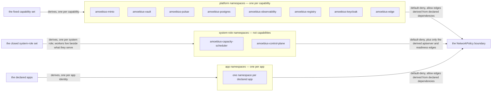

# Namespace Layout

> **Purpose**: Single source of truth for the Kubernetes namespace partition — one namespace per platform
> capability, dedicated namespaces for the closed capacity-scheduler and control-plane daemon roles, plus one per app —
> derived from typed identity so a workload's namespace is a pure function of what it is, never a free-text
> field an operator or app writes.
> **Read this if**: a workload needs to land in a namespace, or a policy, quota, or teardown boundary has to be
> drawn along one.

This document owns the *partition* — which namespaces exist, what each holds, and the rule that every one of
them is computed rather than written. It does not own what is deployed into them, which belongs to
[platform_services_doctrine.md](./platform_services_doctrine.md), nor the network policies drawn across the
partition, which belong to [§5](#5-networkpolicy-default-deny--derived-allow-follows-the-dependency-graph-referenced)'s
named owners. Reading it presumes the capability set of
[service_capability_doctrine.md §2](./service_capability_doctrine.md#2-the-capability-set), since the platform
half of the partition is derived directly from it.

Link-graph metadata

**Status**: Authoritative source
**Supersedes**: N/A
**Referenced by**: DEVELOPMENT_PLAN/phase_33_render_manifest_oracles.md, documents/engineering/README.md, documents/engineering/diagram_conventions.md, documents/engineering/manifest_generation_doctrine.md, documents/engineering/platform_services_doctrine.md, documents/engineering/service_capability_doctrine.md, documents/engineering/tenancy_doctrine.md, documents/glossary.md
**Generated sections**: none

> **Historical result (invalidated).** Phase-run and implementation-result statements predate the 2026-08-11 reopen unless the owning phase is Done; target doctrine remains normative, and current state is in the [tracker](../../DEVELOPMENT_PLAN/README.md).

## Contents
- [1. Why this doctrine exists](#1-why-this-doctrine-exists)
- [2. One namespace per platform capability — the derived set](#2-one-namespace-per-platform-capability--the-derived-set)
- [3. The Postgres namespace holds the operator, not per-consumer databases](#3-the-postgres-namespace-holds-the-operator-not-per-consumer-databases)
- [4. One namespace per app — per-app tenancy (referenced)](#4-one-namespace-per-app--per-app-tenancy-referenced)
- [5. NetworkPolicy default-deny + derived-allow follows the dependency graph (referenced)](#5-networkpolicy-default-deny--derived-allow-follows-the-dependency-graph-referenced)
- [6. The control-plane namespace — a stateless daemon, no PVC](#6-the-control-plane-namespace--a-stateless-daemon-no-pvc)
- [7. What this doctrine does not own](#7-what-this-doctrine-does-not-own)
- [8. Planning ownership](#8-planning-ownership)
- [Related Documents](#related-documents)

---

## 1. Why this doctrine exists

**The problem.** A Kubernetes namespace is the coarse isolation and blast-radius boundary every workload lands
in. It scopes role-based access control (RBAC), NetworkPolicy, resource quota, and the per-namespace teardown
that lets one service be removed without touching another. If the namespace is a **free-text field** the spec
author fills in, three failures become expressible at author time: a manifest can name `amoebius-vault` for a
workload unrelated to the secrets root, an app can place itself inside a platform capability's namespace, and
two unrelated capabilities can collapse into one namespace that dissolves the isolation boundary between them.
None of the three is caught until a policy leaks or a teardown deletes the wrong slice, at runtime.

**Why the obvious alternative fails.** A `namespace : Text` field on every manifest, or a single flat default
namespace, fails for the reason every hand-authored coordinate fails here: a free string cannot express the
invariant *this workload belongs to exactly its own capability's slice*. A `Text` namespace admits
`amoebius-minio` on a Postgres StatefulSet as readily as the correct value, and a flat namespace has no
boundary to enforce at all. Isolation would rest on review rather than on construction, which the amoebius
contract ([dsl_doctrine.md](./dsl_doctrine.md), [illegal_state_catalog.md](../illegal_state/illegal_state_catalog.md)) rejects for this class of invariant.

**The rule.** The namespace layout is **derived** from the fixed capability set and the closed system-role set
— one namespace per platform capability, one for each of the scheduler and control-plane daemon roles, and one namespace
per app — and a workload's namespace is computed from what the workload is, never authored. A platform
provider lands in its capability's namespace because it *is* that capability's realization; an app lands in its
own namespace because it *is* that app. No spec surface accepts a namespace string, so a workload cannot name
a foreign capability's namespace and two capabilities cannot share one.

**What it forecloses.** The freedom to invent a namespace, to co-locate two capabilities for convenience, or
to place an app inside a platform namespace. That freedom is deliberately given up. The derived layout is
fixed and identical on every substrate
([platform_services_doctrine.md §12](./platform_services_doctrine.md#12-substrate-equivalence-as-a-structural-invariant)),
and it is the partition along which the derived NetworkPolicies
([§5](#5-networkpolicy-default-deny--derived-allow-follows-the-dependency-graph-referenced)) draw their
default-deny boundary.

---

## 2. One namespace per platform capability — the derived set

Each platform capability of [service_capability_doctrine.md §2](./service_capability_doctrine.md#2-the-capability-set)
occupies **exactly one namespace**, holding the manifests of that capability's canonical provider
([service_capability_doctrine.md §3](./service_capability_doctrine.md#3-one-canonical-provider-the-type-admits-alternates))
as deployed by [platform_services_doctrine.md](./platform_services_doctrine.md). The set is fixed and
derived — not a layout an installer hand-maintains:

| Namespace | Capability / role | Concrete provider (owned by platform_services) |
|---|---|---|
| `amoebius-minio` | ObjectStore | MinIO — the single S3 substrate ([platform_services_doctrine.md §4](./platform_services_doctrine.md#4-minio--the-object-substrate)) |
| `amoebius-vault` | SecretStore | Vault — the fail-closed secrets root ([vault_pki_doctrine.md](./vault_pki_doctrine.md)) |
| `amoebius-pulsar` | MessageBus | Pulsar + ZooKeeper + BookKeeper ([platform_services_doctrine.md §6](./platform_services_doctrine.md#6-pulsar--the-event-and-workflow-backbone-new-vs-prodbox)) |
| `amoebius-postgres` | Sql | the Percona operator ([§3](#3-the-postgres-namespace-holds-the-operator-not-per-consumer-databases)) |
| `amoebius-observability` | Observability | Prometheus / Grafana / alert receiver / Thanos / TensorBoard ([platform_services_doctrine.md §7](./platform_services_doctrine.md#7-prometheus--grafana--observability-is-not-an-add-on), [monitoring_doctrine.md](./monitoring_doctrine.md)) |
| `amoebius-registry` | Registry | `distribution` (`registry:2`), blobs in MinIO, no PV ([platform_services_doctrine.md §3](./platform_services_doctrine.md#3-the-registry--the-single-image-source)) |
| `amoebius-keycloak` | Identity | Keycloak — owns all wild ingress ([platform_services_doctrine.md §9](./platform_services_doctrine.md#9-the-loadbalancer-and-the-single-wild-ingress-path)) |
| `amoebius-edge` | Edge | Envoy + Gateway API + the L4 LoadBalancer (MetalLB or cloud LB) |
| `amoebius-capacity-scheduler` | capacity-scheduler bootstrap role (not a capability) | the one `amoebius-capacity` scheduler Deployment, its namespaced config/root projection, and its exact `ResourceQuota pods=1` cycle break |
| `amoebius-control-plane` | the orchestrator control-plane daemon (not a capability) | the control-plane Deployment `replicas=1` ([§6](#6-the-control-plane-namespace--a-stateless-daemon-no-pvc)) |

Three properties make the set a *derivation*, not a convention:

Phase 33's Register-1 `render-golden` battery is the validated rendering enactment of this partition: every
sealed render-source identity is emitted once in deterministic order, and the output-domain property rejects
missing, duplicate, or cross-owned identities. Live namespace admission remains Phase-58/runtime residue.

- **One namespace per capability, never a shared one.** The Identity edge (Keycloak) and the L7 edge
  (Envoy/Gateway) are distinct capabilities and therefore distinct namespaces (`amoebius-keycloak`,
  `amoebius-edge`), even though they compose on the single wild-ingress path; the registry is its own
  namespace, never folded into the control plane. The wild-ingress path that spans `amoebius-edge` and
  `amoebius-keycloak` is an ordinary cross-namespace edge the derived NetworkPolicy allows ([§5](#5-networkpolicy-default-deny--derived-allow-follows-the-dependency-graph-referenced)), not a reason to merge the two.
- **The namespace name is a platform-realization fact, not an app-surface name.** A platform namespace is named
  for its concrete provider (`amoebius-minio`) because it is not a name application logic ever writes — an app
  names the **capability** `ObjectStore` and never the product or its namespace
  ([service_capability_doctrine.md §1](./service_capability_doctrine.md#1-why-capabilities-not-products)). The
  `amoebius-` prefix marks a namespace as a platform slice, so an app namespace ([§4](#4-one-namespace-per-app--per-app-tenancy-referenced)) can never collide with a
  capability's.
- **The scheduler cycle break has its own namespace.** `amoebius-capacity-scheduler` is derived from the
  closed capacity-scheduler role, never authored by an operator. Its exact `ResourceQuota pods=1` applies only
  to the one default-scheduled, unique-node-affinity scheduler Deployment. It cannot share
  `amoebius-control-plane`: doing so would either cap the later control-plane daemon out of existence or weaken the
  scheduler's one-Pod bootstrap proof. The namespace is default-deny like every other slice; only the derived
  apiserver/config/readiness edges required by the scheduler role are admitted. No platform workload, app,
  controller child, or control-plane daemon Pod may land there.

The concrete provider set, its HA-always deployment, and its bring-up ordering are owned by
[platform_services_doctrine.md](./platform_services_doctrine.md); this doctrine owns only that the set is
partitioned one-namespace-per-capability plus the two closed control roles and that the partition is derived.

Diagram vocabulary: [diagram_conventions.md](./diagram_conventions.md).

```mermaid
flowchart LR
  %% register: orientation
  capset["the fixed capability set"]
  roles["the closed system-role set"]
  apps["the declared apps"]

  subgraph plat["platform namespaces — one per capability"]
    minio["amoebius-minio"]
    vault["amoebius-vault"]
    pulsar["amoebius-pulsar"]
    pg["amoebius-postgres"]
    obs["amoebius-observability"]
    reg["amoebius-registry"]
    kc["amoebius-keycloak"]
    edge["amoebius-edge"]
  end

  subgraph sys["system-role namespaces — not capabilities"]
    sched["amoebius-capacity-scheduler"]
    cp["amoebius-control-plane"]
  end

  subgraph appns["app namespaces — one per app"]
    a1["one namespace per declared app"]
  end

  capset -->|"derives, one per capability"| plat
  roles -->|"derives, one per system role; workers live beside what they serve"| sys
  apps -->|"derives, one per app identity"| appns

  plat -->|"default-deny, allow edges derived from declared dependencies"| policy["the NetworkPolicy boundary"]
  sys -->|"default-deny, plus only the derived apiserver and readiness edges"| policy
  appns -->|"default-deny, allow edges derived from declared dependencies"| policy
```
*Orientation. Design intent. Every namespace above is computed from the identity on its left and is never authored; the concrete providers deployed into the platform namespaces are owned by [platform_services_doctrine.md](./platform_services_doctrine.md), the app partition by [service_capability_doctrine.md §4](./service_capability_doctrine.md#4-capability--provider--shape-the-binding), and the policy derivation by [§5](#5-networkpolicy-default-deny--derived-allow-follows-the-dependency-graph-referenced). Whether a running cluster actually enforces the boundary is runtime-checked and is not shown here.*

---

## 3. The Postgres namespace holds the operator, not per-consumer databases

`amoebius-postgres` holds the cluster-wide **Percona operator**, a platform component drawn from the shared
inventory so it installs identically on every substrate
([platform_services_doctrine.md §12](./platform_services_doctrine.md#12-substrate-equivalence-as-a-structural-invariant)).
It is **not** a shared mega-database namespace. Each consuming service or app that needs SQL renders its own
`PerconaPGCluster` **in its own namespace**, which the cluster-wide operator reconciles — a per-consumer
Patroni cluster, co-located with its consumer for blast-radius isolation and clean per-namespace teardown. The
one-cluster-per-consumer rule and its rationale are owned by
[platform_services_doctrine.md §8](./platform_services_doctrine.md#8-postgres--patroni-via-percona-one-cluster-per-consumer-with-pgadmin);
this doctrine records only that the operator lives in the Sql-capability namespace while the Patroni instances
land in their consumers' namespaces, so `amoebius-postgres` never becomes a cross-service data pool.

---

## 4. One namespace per app — per-app tenancy (referenced)

Every app occupies its **own** namespace. That namespace holds the app's workloads, its per-app durable-storage
requests, any `PerconaPGCluster` it consumes ([§3](#3-the-postgres-namespace-holds-the-operator-not-per-consumer-databases)),
and the generic `UiServer app` and `UiProjectionWorker app` responsibilities when the app declares a UI. The per-app namespace and the `<app>/<bucket>`
resource binding are owned by
[service_capability_doctrine.md §4](./service_capability_doctrine.md#4-capability--provider--shape-the-binding),
and the tenant axis that scopes many tenants across shared platform services — the `TenantId` bundle of a
Keycloak realm, a Vault path, Pulsar tenant-namespaces, and a MinIO prefix — is owned by
[tenancy_doctrine.md §3](./tenancy_doctrine.md#3-what-a-tenant-is). This doctrine states only that the app
partition follows the *same* derived-not-authored rule as the platform partition: an app namespace is computed
from the app's identity, never written as a free field, so an app can no more name `amoebius-vault` than it can
name another app's namespace or another tenant's resource
([tenancy_doctrine.md §7](./tenancy_doctrine.md#7-two-isolation-layers-and-the-honest-limit)).

The namespace is an application blast-radius boundary, **not** the complete tenant or subject authority
boundary. A multi-tenant program normally shares the same generic UI-server and projector Deployments across
its tenants; each request, projection key, handle, provider operation, and audit record remains indexed by the
server-derived `Principal`, `TenantId`, and `Owner`. Creating one namespace per tenant would not make a missing
owner predicate safe, and sharing an app namespace does not authorize cross-tenant access. The owner-scoped
runtime contract is owned by
[low_code_ui_runtime_doctrine.md §9](./low_code_ui_runtime_doctrine.md#9-routes-identity-authorization-and-the-edge).

Neither worker receives an author-supplied namespace. Both are derived from `AppId`; their plans are immutable
release inputs and their ServiceAccounts receive only the exact server-side capability edges produced by
binding. The browser has no ServiceAccount, provider credential, cross-namespace route, or direct service
endpoint.

---

## 5. NetworkPolicy default-deny + derived-allow follows the dependency graph (referenced)

The namespace partition is what gives east-west connectivity a boundary to enforce. Every namespace is
**default-deny**, and the **allow** edges are **derived from the declared dependency graph** — never
hand-authored: an app that declares consuming `Sql` gets exactly the allow edge to its Patroni cluster, and a
workload that declares no dependency on a capability cannot reach that capability's namespace. Because the
partition is one-per-capability, the derived policies operate along clean namespace boundaries, and the layout
**adds no new ingress** — cross-namespace reachability is still exactly the derived dependency edges, nothing
more.

For a UI app, the public allow path is exactly `edge → identity → UiServer app`. The derived server-side
edges then follow its bound port and projection demands. There is no `browser → MinIO/Postgres/Pulsar/Vault/
inference` edge, no broad `UiServer → platform` wildcard, and no policy derived merely because a component is
visually present. Live validation must probe those forbidden direct paths from outside the subject under test;
a rendered policy claiming to be default-deny is not enforcement evidence.

The connectivity-derivation rule itself is owned by
[platform_services_doctrine.md §9](./platform_services_doctrine.md#9-the-loadbalancer-and-the-single-wild-ingress-path)
and lifted into a compile-time impossibility — a blocking NetworkPolicy that severs a declared dependency, and
an open one that exposes an undeclared one, are both unrepresentable — by
[illegal_state_catalog.md §3.6](../illegal_state/illegal_state_security.md#36-blocking-networkpolicy-services-cant-reach-each-other).
This doctrine owns only the **partition** those policies are drawn across; it does not restate the derivation
and defines no NetworkPolicy of its own.

---

## 6. The control-plane namespace — a stateless daemon, no PVC

`amoebius-control-plane` holds the control-plane daemon and nothing that needs durable local state. It is
distinct from `amoebius-capacity-scheduler`; the latter's exact `pods=1` quota never constrains this
namespace. The control-plane daemon is a Kubernetes **Deployment `replicas=1`**; its single-instance property is **delegated to k8s/etcd** through the mandatory reconciler `Lease`, never a bespoke amoebius election — owned by
[daemon_topology_doctrine.md §3.1](./daemon_topology_doctrine.md#31-exactly-one-pod-is-a-k8setcd-property-not-an-amoebius-election).
The namespace also owns that Lease and its namespaced RBAC. At cold start, a bootstrap capability limited to
this Namespace and Lease may create/acquire them; no scheduler, platform, or workload write is authorized
until the exact bootstrap holder/resourceVersion is read back.

- **No PersistentVolumeClaim (PVC) in the control-plane namespace.** The control-plane daemon mounts no durable volume
  and keeps nothing on local disk; the namespace holds no StatefulSet and no retained PersistentVolume (PV).
  Its durable state is **exclusively the Vault-enveloped MinIO bucket** in `amoebius-minio` — the `InForceSpec`, the Pulumi state, and every other
  persisted byte live as Vault-Transit-enveloped objects, decrypted in-process, never written to a
  control-plane PVC or a plaintext ConfigMap
  ([storage_lifecycle_doctrine.md §7.2](./storage_lifecycle_doctrine.md#72-amoebius-own-control-plane-state-is-the-minio-bucket-not-a-pvc)).
- **The namespace boundary is not an authority boundary.** The control-plane daemon holds total authority over the cluster
  and its secrets ([daemon_topology_doctrine.md §3](./daemon_topology_doctrine.md#3-the-control-plane-daemon))
  and reconciles workloads into every namespace; its residence in `amoebius-control-plane` isolates its *own*
  footprint (RBAC subject, network default-deny, teardown slice), not its reach. That the control-plane daemon is
  stateless and PVC-free is what keeps it disposable — k8s can reschedule it onto any node with no volume to
  re-attach.

---

## 7. What this doctrine does not own

| Concern | Owned by |
|---|---|
| The concrete provider set and how each is deployed (HA-always, bring-up ordering) | [platform_services_doctrine.md](./platform_services_doctrine.md) |
| The capability set and the capability → provider → shape binding | [service_capability_doctrine.md](./service_capability_doctrine.md) |
| Per-app tenancy, `<app>/<bucket>`, and the `TenantId` tenant axis | [service_capability_doctrine.md §4](./service_capability_doctrine.md#4-capability--provider--shape-the-binding), [tenancy_doctrine.md](./tenancy_doctrine.md) |
| Generic UI-server/projector behavior, owner-scoped plans, and browser/server trust boundary | [low_code_ui_runtime_doctrine.md](./low_code_ui_runtime_doctrine.md) |
| Derived east-west NetworkPolicy (default-deny + dependency-graph allow) and its unrepresentability | [platform_services_doctrine.md §9](./platform_services_doctrine.md#9-the-loadbalancer-and-the-single-wild-ingress-path), [illegal_state_catalog.md §3.6](../illegal_state/illegal_state_security.md#36-blocking-networkpolicy-services-cant-reach-each-other) |
| One-Patroni-cluster-per-consumer and the Percona operator | [platform_services_doctrine.md §8](./platform_services_doctrine.md#8-postgres--patroni-via-percona-one-cluster-per-consumer-with-pgadmin) |
| The stateless control-plane daemon, its k8s/etcd-delegated single-instance, and its MinIO-bucket state | [daemon_topology_doctrine.md §3](./daemon_topology_doctrine.md#3-the-control-plane-daemon), [storage_lifecycle_doctrine.md §7.2](./storage_lifecycle_doctrine.md#72-amoebius-own-control-plane-state-is-the-minio-bucket-not-a-pvc) |
| The scheduler's bootstrap/full-readiness protocol, managed-node authority, and reservation accounting | [resource_capacity_doctrine.md](./resource_capacity_doctrine.md), [readiness_ordering_doctrine.md](./readiness_ordering_doctrine.md) |
| Retained-PV storage for platform-service volumes | [storage_lifecycle_doctrine.md](./storage_lifecycle_doctrine.md) |
| Rendering `Namespace` objects from typed Haskell (no Helm, no templating) | [manifest_generation_doctrine.md](./manifest_generation_doctrine.md) |

---

## 8. Planning ownership

This document is normative namespace-layout doctrine only. Delivery sequencing, completion status, validation
gates, and remaining work live only in
[../../DEVELOPMENT_PLAN/README.md](../../DEVELOPMENT_PLAN/README.md); this doc states the target shape and links
back for status. Every statement here is **design intent** — amoebius is greenfield and has built none of this.
The sibling **prodbox** project is *evidence* that namespaces render from typed records — its
`prodbox/src/Prodbox/Lib/Storage.hs` (sibling source)
renders `Namespace` objects from a typed spec — but that is **sibling evidence, not an amoebius result**, and
prodbox partitions its own way. Per
[documentation_standards.md §6](../documentation_standards.md#6-honesty-the-proventestedassumed-discipline),
read every prescriptive statement above as the contract amoebius intends to satisfy, never as a tested amoebius
result.

---

## Related Documents

- [Engineering Doctrine Index](./README.md)
- [Platform Services Doctrine](./platform_services_doctrine.md) — the concrete provider set, derived NetworkPolicy ([§9](./platform_services_doctrine.md#9-the-loadbalancer-and-the-single-wild-ingress-path)), and one-Patroni-per-consumer ([§8](./platform_services_doctrine.md#8-postgres--patroni-via-percona-one-cluster-per-consumer-with-pgadmin))
- [Service Capability Doctrine](./service_capability_doctrine.md) — the capability set the layout is derived from and the per-app binding ([§4](./service_capability_doctrine.md#4-capability--provider--shape-the-binding))
- [Tenancy Doctrine](./tenancy_doctrine.md) — the `TenantId` axis across shared platform services and per-app namespaces
- [Daemon Topology Doctrine](./daemon_topology_doctrine.md) — the control-plane daemon in `amoebius-control-plane` ([§3.1](./daemon_topology_doctrine.md#31-exactly-one-pod-is-a-k8setcd-property-not-an-amoebius-election))
- [Storage Lifecycle Doctrine](./storage_lifecycle_doctrine.md) — the control plane holds no PVC; its state is the MinIO bucket ([§7.2](./storage_lifecycle_doctrine.md#72-amoebius-own-control-plane-state-is-the-minio-bucket-not-a-pvc))
- [Illegal State Catalog](../illegal_state/illegal_state_catalog.md) — the blocking/over-open NetworkPolicy made unrepresentable ([§3.6](../illegal_state/illegal_state_security.md#36-blocking-networkpolicy-services-cant-reach-each-other))
- [Manifest Generation Doctrine](./manifest_generation_doctrine.md) — rendering `Namespace` objects from typed Haskell
- [Monitoring Doctrine](./monitoring_doctrine.md) — the observability surfaces that reside in `amoebius-observability`
- [Low-Code UI Runtime Doctrine](./low_code_ui_runtime_doctrine.md) — generic per-app UI workers and the tenant/subject authority boundary that a namespace does not replace
- [Development Plan](../../DEVELOPMENT_PLAN/README.md)
- [Documentation Standards](../documentation_standards.md)
