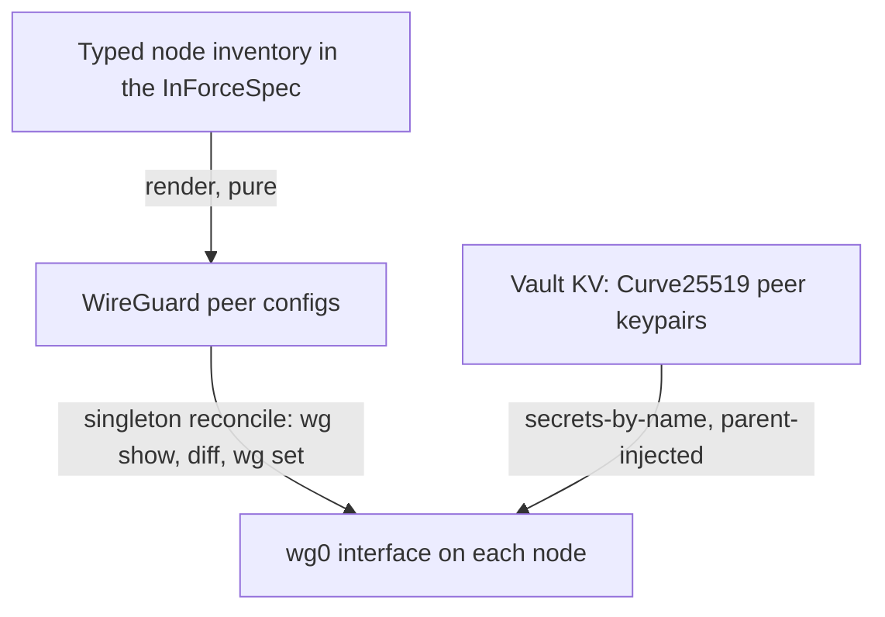

# The Network Fabric (WireGuard) & the Service-Mesh Verdict

**Status**: Authoritative source
**Supersedes**: N/A
**Referenced by**: DEVELOPMENT_PLAN/later_phases.md, documents/engineering/README.md, documents/engineering/bootstrap_sequence_doctrine.md, documents/engineering/cluster_lifecycle_doctrine.md, documents/engineering/cluster_topology_doctrine.md, documents/engineering/dsl_doctrine.md, documents/engineering/gateway_migration_doctrine.md, documents/engineering/host_cluster_comms_doctrine.md, documents/engineering/manifest_generation_doctrine.md, documents/engineering/monitoring_doctrine.md, documents/engineering/release_lifecycle_doctrine.md, documents/engineering/resource_capacity_doctrine.md, documents/engineering/single_logical_data_plane_doctrine.md, documents/engineering/vault_pki_doctrine.md, documents/illegal_state/illegal_state_multicluster.md, documents/illegal_state/illegal_state_security.md, documents/illegal_state/illegal_state_techniques.md
**Generated sections**: none

> **Purpose**: Single Source of Truth for amoebius's inter-node / inter-cluster network fabric — **raw kernel
> WireGuard configured directly by amoebius (never Netmaker)**, with peer keys custodied in Vault, peer config
> *rendered* from the node inventory and reconciled by the singleton, a hub bound to the gateway *role* so the
> fabric moves with the gateway on failover — and for the verdict that a service mesh (Linkerd) is **not
> adopted for v1**. It also generalizes the host-comms security boundary from "localhost-only" to "reachable
> only over the authenticated fabric."

---

## 1. Why this doctrine exists: the inter-cluster wire is an open gap

amoebius has, until now, described exactly two network surfaces: the single **wild-ingress** door
(LoadBalancer → Envoy → Gateway API → Keycloak, [platform_services_doctrine.md §9](./platform_services_doctrine.md#9-the-loadbalancer-and-the-single-wild-ingress-path))
and the two **localhost-only** host channels ([host_cluster_comms_doctrine.md](./host_cluster_comms_doctrine.md)).
Neither covers the case the elastic single-logical-data-plane design needs: **a remote node reaching the home
cluster's Pulsar/MinIO across an untrusted network.** The cross-cluster geo-replication link
([chaos_failover_doctrine.md](./chaos_failover_doctrine.md)) is named "over Pulsar," but the *secure wire* it
rides — broker↔broker, or a remote worker↔home broker over the WAN — is undescribed. That gap is the open
`notes.txt` question *"vpn and linkerd service mesh story (certs?)"*. This doctrine closes it **for the two
spans it actually renders** — the remote-worker↔home-broker attach wire (K1, [§3](#3-keys-config-and-distribution--wireguard-as-just-another-reconcile)) and the stretched
full-node kubelet↔apiserver wire (K2, [§3](#3-keys-config-and-distribution--wireguard-as-just-another-reconcile)/[§4](#4-topology-the-hub-is-the-gateway-role-and-the-fabric-moves-with-it)) — and **defers the cross-cluster
broker↔broker geo-replication wire to Phase 29**: it is design-intent, its `render()` obligation is not yet
written, and it carries the same *"witness present, constructor deferred"* posture the `Gateway` arm of the
`Networking` sum carries in [§5](#5-the-security-boundary-generalizes-localhost--authenticated-fabric). The addressing precondition exists (disjoint per-cluster VPN ranges,
[§4](#4-topology-the-hub-is-the-gateway-role-and-the-fabric-moves-with-it)); the per-peer render does not.

The fabric is what makes [single_logical_data_plane_doctrine.md](./single_logical_data_plane_doctrine.md)'s
attach topology physically possible: a remote spot node can be a client of the home cluster's one store only
if it has a route to that store that no one else can use.

**The gap has a second half: the control-plane span.** The wire above carries a *non-member* remote worker to
the home **store** (the data-plane half). A **stretched cluster** poses the harder half — a full k8s node (a
kubelet) whose declared network locality differs from the control plane's yet which registers in the *one*
apiserver/etcd across the WAN. That kubelet↔apiserver span is the **control-plane** half of the same open gap,
and this round routes it over the same fabric: a stretched full node (the K2 case, owned by
[cluster_topology_doctrine.md §4.1](./cluster_topology_doctrine.md#41-rke2-serveragent-cardinality-odd-quorum-by-union-distinctness-by-fold-taint-by-derivation))
reaches its apiserver over `wg0` on **self-managed rke2 only**. This doctrine adds the endpoint index and the
`render()` obligation for that span ([§3](#3-keys-config-and-distribution--wireguard-as-just-another-reconcile),
[§4](#4-topology-the-hub-is-the-gateway-role-and-the-fabric-moves-with-it),
[§5](#5-the-security-boundary-generalizes-localhost--authenticated-fabric)); *which* nodes are members stays
with cluster_topology.

---

## 2. Raw WireGuard, not Netmaker

**Adopt raw kernel WireGuard, configured directly by amoebius. Reject Netmaker.** Netmaker is not
"WireGuard" — it is a WireGuard *control-plane product*, and every subsystem it brings duplicates one
amoebius already owns, in a weaker, unreviewed form carrying its own desync-able state store. It is the
Harbor/Helm of networking: the duplicated-control-plane pattern amoebius rejects
([manifest_generation_doctrine.md §1](./manifest_generation_doctrine.md#1-why-this-doctrine-exists-types-render-manifests-helm-does-not),
[image_build_doctrine.md](./image_build_doctrine.md)).

| Netmaker brings | amoebius already owns |
|---|---|
| Its own control server | The control-plane singleton ([daemon_topology_doctrine.md](./daemon_topology_doctrine.md)) |
| Its own DB (a desired-state store) | `render(InForceSpec)` — **no external release store** ([manifest_generation_doctrine.md §6](./manifest_generation_doctrine.md#6-the-reconcile-state-model-desired-is-renderinforcespec-observed-is-etcd-a-diff-is-typed)) |
| Its own MQTT broker to push peer changes | Pulsar — the one coordination plane ([pulsar_client_doctrine.md](./pulsar_client_doctrine.md)) |
| Its own PKI / mTLS | The Vault forest CA + secrets model ([vault_pki_doctrine.md](./vault_pki_doctrine.md)) |
| Its own node/peer inventory | The typed node inventory ([substrate_doctrine.md](./substrate_doctrine.md)) + the Dhall spec |

Five duplicated control planes, five second state stores. Amoebius configures the
raw WireGuard *primitive* it owns end to end, and runs none of Netmaker's machinery.

---

## 3. Keys, config, and distribution — WireGuard as just-another-reconcile

WireGuard fits the amoebius disciplines cleanly because it is a *primitive*, not a platform:

- **Keys are Vault-custodied, but they are not PKI certs.** WireGuard authenticates peers with raw
  Curve25519 static keypairs, not X.509. So peer keys are a **Vault KV secret class** under the
  secrets-by-name + parent-injection model ([vault_pki_doctrine.md](./vault_pki_doctrine.md)) — Vault mints
  and holds the keypair, the Dhall names it, the parent injects it into a child's Vault. The
  forest CA hierarchy's "any mesh" clause ([vault_pki_doctrine.md §8](./vault_pki_doctrine.md#8-the-root-cluster-owns-the-pki-trust-anchor)) is reserved
  for a *later* TLS/mesh layer ([§6](#6-the-service-mesh-verdict-no-linkerd-for-v1)), **not** consumed by WireGuard. Because these keys are Vault-KV, the
  fabric they configure is strictly a **post-unseal overlay**: it is stretch-gated (a co-located node draws no
  peer, below) and is **never** the transport by which a cluster reaches its own unseal authority — that reach
  is the Vault-independent floor `ParentReachChannel`
  ([vault_pki_doctrine.md §6](./vault_pki_doctrine.md#6-parentchild-unseal-two-sanctioned-modes), [bootstrap_sequence_doctrine.md §5](./bootstrap_sequence_doctrine.md#5-the-admin-control-plane-the-cli--the-singleton-rest-api)), so no fabric key ever gates an unseal.
- **Peer config is rendered, not managed.** `render(nodeInventory) -> [WireGuardPeerConfig]` — the pure
  `render()` discipline of [manifest_generation_doctrine.md §2](./manifest_generation_doctrine.md#2-the-typed-manifest-model-render-is-a-pure-total-function-to-objects) lifted to
  `wg` config. Illegal peer configurations are foreclosed before runtime, at the honest layer for each: a
  **keyless peer** (a mandatory key field) is **type-foreclosed** — unrepresentable — while **overlapping VPN
  IPs** and an **`AllowedIPs` outside the fabric CIDR** are **decode-foreclosed**, a total relation/fold over
  the peer set returning a `Left` rather than an uninhabitable type. Either way the error surfaces in the typed
  inventory, never at runtime. For a **stretched
  full k8s node** (the K2 case), `render()` additionally emits a `ControlPlanePeer` covering that cluster's
  **apiserver VPN-IP** ([§4](#4-topology-the-hub-is-the-gateway-role-and-the-fabric-moves-with-it)) — the
  kubelet↔apiserver span is a rendered peer like any other, so the render fold stays *total* over it (a
  decode-foreclosed decode fact), never a side channel. The obligation is **stretch-gated**: a co-located node draws no
  such peer.
- **Distribution is a reconcile, not an agent.** The singleton reconciles the interface the same way it
  reconciles everything else ([cluster_lifecycle_doctrine.md §9](./cluster_lifecycle_doctrine.md#9-how-bring-up-and-teardown-are-implemented-the-reconciler-not-a-state-machine)):
  `discover` (`wg show`) → diff against `render(inventory)` → enact (`wg set`). No Netmaker agent, no side
  channel; peer-set changes propagate as reconciles rolled out from the root.

---

## 4. Topology: the hub is the gateway *role*, and the fabric moves with it

- **The hub is bound to the gateway role, not to a fixed cluster.** The WireGuard hub is addressed by a
  stable VPN IP + stable endpoint, reassigned on a gateway migration — a planned handover or an unplanned
  failover — exactly as the route53 gateway record is repointed
  ([gateway_migration_doctrine.md](./gateway_migration_doctrine.md); the forced case is
  [chaos_failover_doctrine.md](./chaos_failover_doctrine.md)). When the gateway migrates or fails over, **the
  hub role moves with it**; peers keep the same hub VPN-IP view and only the endpoint behind it changes. (Shorthand: the flattened mesh
  moves with the gateway.)
- **VPN-IP allocation is by disjoint per-cluster ranges.** Each cluster draws VPN IPs from its own
  sub-range of the fabric CIDR — which is *also* the failover doctrine's disjoint-namespace allocation, so IP
  assignment is **confluent by construction** (two clusters can never mint the same VPN IP).
- **For the attach topology, the home cluster is the hub.** It holds the one store, so remote spot workers
  are spokes that reach the home Pulsar/MinIO through the hub over the fabric
  ([single_logical_data_plane_doctrine.md](./single_logical_data_plane_doctrine.md)).
- **The apiserver VPN-IP is a distinct fabric address from the data-plane hub VPN-IP, and it moves with the
  control plane.** A stretched full node (K2) reaches the one apiserver at a **stable apiserver VPN-IP** that
  is *not* the data-plane hub's VPN-IP — the store-hub and the control plane are separate fabric endpoints. Like
  the hub, it is a **role-bound** address: on failover it is repointed to wherever the control plane now runs
  (the same [chaos_failover_doctrine.md](./chaos_failover_doctrine.md) repoint the gateway record uses), so a
  stretched agent keeps one apiserver VPN-IP view while the endpoint behind it changes. (Self-managed rke2
  only; the render obligation is [§3](#3-keys-config-and-distribution--wireguard-as-just-another-reconcile).)

---

## 5. The security boundary generalizes: localhost → authenticated fabric

Today, channel 2 (host → Pulsar/MinIO) binds NodePorts to loopback and is safe *because the packet never
leaves the box* ([host_cluster_comms_doctrine.md §5](./host_cluster_comms_doctrine.md#5-why-no-mtls-is-safe-here-the-network-restriction-is-the-security-boundary)). A remote spot worker
crosses the public internet, so "localhost-only" no longer holds. The invariant **generalizes**, it does not
break:

- **Bind those listeners to the WireGuard interface (`wg0`), never to `0.0.0.0`/LAN/WAN.** The security
  property moves from *"reachable only from localhost"* to *"reachable only over the authenticated WireGuard
  fabric."* Only a peer holding a Vault-minted WireGuard key can open a socket on `wg0`.
- **No amoebius principle is traded.** The one thing localhost gave that the WAN cannot — that no
  attacker can reach the wire — WireGuard supplies with Curve25519 peer authentication + ChaCha20-Poly1305
  encryption. The [host_cluster_comms_doctrine.md §2](./host_cluster_comms_doctrine.md#2-the-decision-that-was-open-and-is-now-resolved) **option-(b)
  mTLS rejection still holds**: WireGuard has already authenticated and encrypted the peer, so the Pulsar/MinIO
  wire itself stays mTLS-free and the high-bandwidth-bulk argument survives even over the WAN. The boundary
  moved; the tax did not return.
- **`FabricPeer` is a distinct endpoint kind.** A fabric-reachable listener is *not* a wild ingress: a new
  `FabricPeer` endpoint index sits alongside `WildIngress` and `HostLocalPeer`
  ([illegal_state_catalog.md §4.3](../illegal_state/illegal_state_techniques.md#43-gadt-indexed-state-machines--only-legal-transitions-are-typed)), with **no constructor turning a `FabricPeer`
  into a `WildIngress`** — so "Keycloak owns all wild ingress"
  ([platform_services_doctrine.md §9](./platform_services_doctrine.md#9-the-loadbalancer-and-the-single-wild-ingress-path)) is preserved by construction. The
  detailed generalization of the channel-2 rule is owned by
  [host_cluster_comms_doctrine.md §5](./host_cluster_comms_doctrine.md#5-why-no-mtls-is-safe-here-the-network-restriction-is-the-security-boundary); this doc owns the fabric that makes
  it safe.
- **The required-networking sum `Networking c = Gateway (SecureGatewayReach c) | Vpn (VpnFabric c)` is owned
  here.** Every *stretched* constructor — the K1 host-worker attach carrier and the K2 full-node agent alike —
  must consume exactly one `Networking c`, and this doc is its single owner. The `Vpn` arm is the WireGuard
  fabric above ([§2](#2-raw-wireguard-not-netmaker)–[§4](#4-topology-the-hub-is-the-gateway-role-and-the-fabric-moves-with-it)). OPEN (constructor deferred; witness type present).
  `Networking c = Vpn (VpnFabric c) | Gateway (SecureGatewayReach c)` — the `Gateway` arm has a witness type but
  no inhabitant yet. Current position: `Vpn` (WireGuard) is the only shipping arm; `Gateway` lands with the
  non-VPN remote-attach phase. Safe deferral: no stretched constructor can omit `Networking`. The stretched
  constructors in
  [cluster_topology_doctrine.md §4.1](./cluster_topology_doctrine.md#41-rke2-serveragent-cardinality-odd-quorum-by-union-distinctness-by-fold-taint-by-derivation)
  and [single_logical_data_plane_doctrine.md §3](./single_logical_data_plane_doctrine.md#3-the-binding-reachability-is-a-type-not-a-runtime-probe)
  **consume** this sum; they never re-declare it. The mandatory field is type-foreclosed (no stretched constructor has
  an inhabitant that omits it); *which* branch a genuinely-remote entity is routed to is the decode-foreclosed fold over
  the declared `Site`
  ([substrate_doctrine.md §8](./substrate_doctrine.md#8-the-node-inventory-the-single-owner-of-hosts-capacity-and-taints)).
- **Two more endpoint indices join the `FabricPeer` family, both barred from `WildIngress`.** `SecureGatewayReach`
  (the K1 `Gateway` wire) and `ControlPlanePeer` (the K2 kubelet↔apiserver wire) sit alongside `FabricPeer`,
  `HostLocalPeer`, and `WildIngress`
  ([illegal_state_catalog.md §4.3](../illegal_state/illegal_state_techniques.md#43-gadt-indexed-state-machines--only-legal-transitions-are-typed)),
  each with **no constructor turning it into a `WildIngress`** — so "Keycloak owns all wild ingress"
  ([platform_services_doctrine.md §9](./platform_services_doctrine.md#9-the-loadbalancer-and-the-single-wild-ingress-path))
  is preserved by construction for the secure-gateway door too (type-foreclosed). A `SecureGatewayReach` mints the
  *same* `FabricMember c` the data-plane resolver already gates on
  ([single_logical_data_plane_doctrine.md §3](./single_logical_data_plane_doctrine.md#3-the-binding-reachability-is-a-type-not-a-runtime-probe)),
  not a second resolver-unknown witness — it differs in *how* reach is achieved, never *that* reach is possible.
- **The `ControlPlanePeer` binding is additive and stretch-gated (self-managed rke2 only).** For a stretched
  full node (K2), this doctrine adds a `wg0`-bound apiserver listener — the additive apiserver-VPN-IP binding of
  [§4](#4-topology-the-hub-is-the-gateway-role-and-the-fabric-moves-with-it) — and carries the distro's own
  kubelet↔apiserver **mTLS over the WireGuard tunnel**: the rke2 control-plane TLS rides *inside* the encrypted
  fabric (the fabric authenticates the peer, the distro authenticates the kubelet). It is **gated on the
  stretched K2 case and self-managed rke2**: a co-located node needs no such binding, and a `Managed Eks`
  control plane has **no such constructor at all** (a full member on the hostless managed arm is
  provider-native-only,
  [cluster_topology_doctrine.md §4.1](./cluster_topology_doctrine.md#41-rke2-serveragent-cardinality-odd-quorum-by-union-distinctness-by-fold-taint-by-derivation)).
  The wire and the render obligation are owned here; *which* nodes are stretched members is owned by
  cluster_topology. Layer: the endpoint index + the no-`WildIngress` constructor are type-foreclosed; the render fold
  covering the apiserver VPN-IP is decode-foreclosed; the tunnel actually coming up and the distro mTLS handshaking over
  the WAN are runtime-checked residue.

---

## 6. The service-mesh verdict: no Linkerd for v1

A service mesh (Linkerd) is **not adopted for v1.** For a Pulsar-centric *async* architecture its marquee
features have little surface to act on, and each is already covered:

| Mesh feature | Why it is redundant / declined here |
|---|---|
| East-west pod-to-pod mTLS | East-west is authorized by NetworkPolicy (default-deny + derived-allow, [platform_services_doctrine.md §9](./platform_services_doctrine.md#9-the-loadbalancer-and-the-single-wild-ingress-path)), identity is Vault PKI, and the cross-cluster wires §5 *renders* — the attach (K1) and stretched control-plane (K2) spans — are WireGuard-encrypted ([§5](#5-the-security-boundary-generalizes-localhost--authenticated-fabric); the broker↔broker geo-replication wire is deferred, [§1](#1-why-this-doctrine-exists-the-inter-cluster-wire-is-an-open-gap)). The in-cluster network is already treated as trusted, and coordination is broker-mediated Pulsar + MinIO, not synchronous pod-to-pod HTTP — little east-west surface to encrypt. |
| Retries / timeouts / circuit-breaking | The bus already gives at-least-once + dedup ([pulsar_client_doctrine.md](./pulsar_client_doctrine.md)) at the typed application layer, where amoebius wants it — not hidden in a sidecar. |
| Golden metrics | Prometheus/Grafana is already a standard service ([platform_services_doctrine.md](./platform_services_doctrine.md)). |
| Traffic-split (the *one* relevant feature, for gateway migration) | **Gateway-API `HTTPRoute` `backendRefs` carry weights natively**, on the Envoy edge amoebius already renders and Keycloak-fronts. A planned home→provider migration ([gateway_migration_doctrine.md](./gateway_migration_doctrine.md)) is a weight shift on the edge already in the stack — no mesh needed. |
| Multicluster service-mirroring | Introduces the **synchronous cross-cluster RPC the architecture deliberately avoids** ([app_vs_deployment_doctrine.md](./app_vs_deployment_doctrine.md), [chaos_failover_doctrine.md](./chaos_failover_doctrine.md)) and manufactures new non-confluent invariants + latency. Actively anti-doctrinal. |

**Scope note (the stretched-cluster contrast case).** That last verdict targets **multicluster** service-mirroring —
synchronous RPC *across N separate clusters*, each its own etcd. It does **not** touch a single **stretched**
cluster's *intra-cluster* control-plane span (one apiserver/etcd, one boundary, a kubelet reaching its
apiserver over `wg0` — [§5](#5-the-security-boundary-generalizes-localhost--authenticated-fabric)): a stretched
kubelet↔apiserver wire is *one cluster's own* traffic, not cross-cluster RPC, so it manufactures no
non-confluent cross-cluster invariant. Stretched-cluster spanning is owned by
[cluster_topology_doctrine.md §4.1](./cluster_topology_doctrine.md#41-rke2-serveragent-cardinality-odd-quorum-by-union-distinctness-by-fold-taint-by-derivation).

The delivery mode is a further disqualifier: Linkerd's only mode is the per-pod micro-proxy **sidecar** (ambient/sidecarless
is Istio, not Linkerd), which contradicts the stated "no sidecar fleet" architectural point. The honest
residual is that declining Linkerd means accepting **unencrypted in-cluster east-west traffic** (authorized,
not encrypted) — consistent with the existing no-in-cluster-mTLS posture. **The reconsideration trigger:** if
a future compliance/threat requirement demands in-cluster encryption-in-transit *and* per-workload
cryptographic identity beyond NetworkPolicy + Vault, revisit — and even then prefer **Vault-PKI-issued
workload certs consumed directly** (the reserved "any mesh" CA clause, [§3](#3-keys-config-and-distribution--wireguard-as-just-another-reconcile)) over a mandatory sidecar fleet.

---

## 7. Boundaries this doc owns vs defers

| Owned here (SSoT) | Owned elsewhere (referenced) |
|-------------------|------------------------------|
| Raw-WireGuard-over-Netmaker; the fabric primitive amoebius configures directly | — |
| Rendered peer config, `wg`-reconcile distribution, disjoint-namespace VPN-IP allocation | The `render()` discipline → [manifest_generation_doctrine.md](./manifest_generation_doctrine.md); the reconcile shape → [cluster_lifecycle_doctrine.md §9](./cluster_lifecycle_doctrine.md#9-how-bring-up-and-teardown-are-implemented-the-reconciler-not-a-state-machine) |
| The hub = gateway-role topology; the fabric moves with the gateway | Gateway ownership + its migration (planned or forced) → [gateway_migration_doctrine.md](./gateway_migration_doctrine.md); the forced-failover proof → [chaos_failover_doctrine.md](./chaos_failover_doctrine.md) |
| The service-mesh (Linkerd) verdict + Gateway-API-weights-for-migration | The Gateway-API / Envoy edge → [platform_services_doctrine.md §9](./platform_services_doctrine.md#9-the-loadbalancer-and-the-single-wild-ingress-path); the migration that shifts the weights → [gateway_migration_doctrine.md](./gateway_migration_doctrine.md) |
| That WireGuard peer keys are a Vault KV secret class (not PKI certs) | The Vault secret model + the reserved "any mesh" CA clause → [vault_pki_doctrine.md](./vault_pki_doctrine.md) |
| The fabric that makes the localhost→fabric generalization safe | The channel-2 rule generalization itself → [host_cluster_comms_doctrine.md §5](./host_cluster_comms_doctrine.md#5-why-no-mtls-is-safe-here-the-network-restriction-is-the-security-boundary) |

> **Deferred, not delivered here:** the cross-cluster **broker↔broker** geo-replication render obligation is
> named in-scope ([§1](#1-why-this-doctrine-exists-the-inter-cluster-wire-is-an-open-gap)) but is Phase-29 design intent — the disjoint-per-cluster addressing exists, the
> per-peer `render()` does not. The two spans this doc actually delivers are the attach (K1) and
> stretched-control-plane (K2) obligations.

---

## 8. Planning ownership

This document is normative network-fabric doctrine only. Delivery sequencing, completion status, and
validation gates are owned by [../../DEVELOPMENT_PLAN/README.md](../../DEVELOPMENT_PLAN/README.md). For
orientation only: the fabric is promoted from the provisional Phase 36 "WireGuard / Linkerd vs Envoy"
candidate into a first-class phase (the network fabric is now *load-bearing* for the attach topology, not the
"redundant, do not adopt" default the Phase-36 framing assumed when it measured only against north-south
ingress); the Linkerd half collapses to the written verdict in [§6](#6-the-service-mesh-verdict-no-linkerd-for-v1).

> **Honesty.** Everything here is Phase 0 **design intent**. A WireGuard fabric, its rendered-config
> reconcile, and the localhost→fabric generalization are **new amoebius design with no sibling proof** —
> WireGuard, `wg`, and Gateway-API HTTPRoute weights are real, documented mechanisms, but *that amoebius wires
> them into this specific fabric* is specified here and unproven until the phase lands. Per
> [documentation_standards.md §6](../documentation_standards.md#6-honesty-the-proventestedassumed-discipline), read every prescriptive statement as the
> contract amoebius intends to satisfy, never as a tested result.

---

## Cross-references

- [Engineering Doctrine Index](./README.md)
- [Single Logical Data Plane Doctrine](./single_logical_data_plane_doctrine.md) — the attach topology this wire enables
- [Host ↔ Cluster Communication](./host_cluster_comms_doctrine.md) — [§5](./host_cluster_comms_doctrine.md#5-why-no-mtls-is-safe-here-the-network-restriction-is-the-security-boundary), the localhost→fabric generalization
- [Vault / PKI Doctrine](./vault_pki_doctrine.md) — WireGuard peer keys as a KV secret class; the reserved "any mesh" CA clause
- [Platform Services Doctrine](./platform_services_doctrine.md) — [§9](./platform_services_doctrine.md#9-the-loadbalancer-and-the-single-wild-ingress-path) the single wild-ingress path + Gateway-API weights
- [Chaos / Failover Doctrine](./chaos_failover_doctrine.md) — the gateway role the hub tracks; the forced-failover proof
- [Gateway Migration Doctrine](./gateway_migration_doctrine.md) — the `GatewayMigration = <Planned | Failover>` taxonomy the hub role moves with (planned handover and forced failover)
- [Daemon Topology Doctrine](./daemon_topology_doctrine.md) — the singleton that reconciles the fabric
- [Manifest Generation Doctrine](./manifest_generation_doctrine.md) — the `render()` discipline the peer config reuses
- [Substrate Doctrine](./substrate_doctrine.md) — the node inventory the peer config is rendered from
- [Development Plan](../../DEVELOPMENT_PLAN/README.md)
- [Documentation Standards](../documentation_standards.md)
