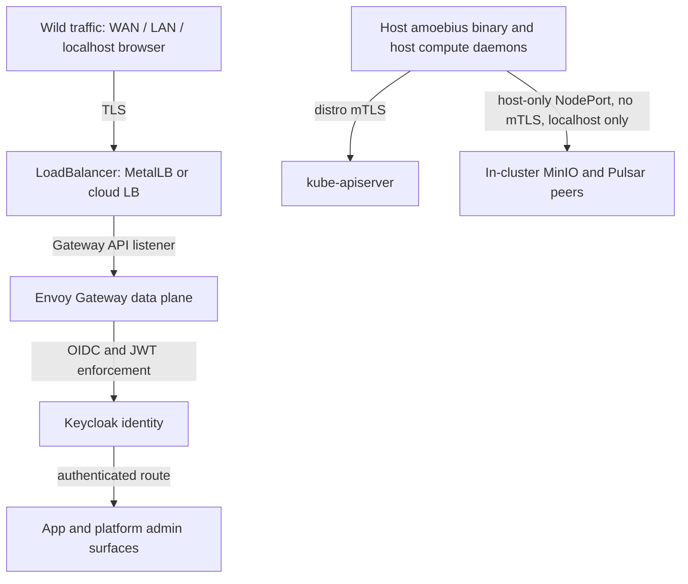
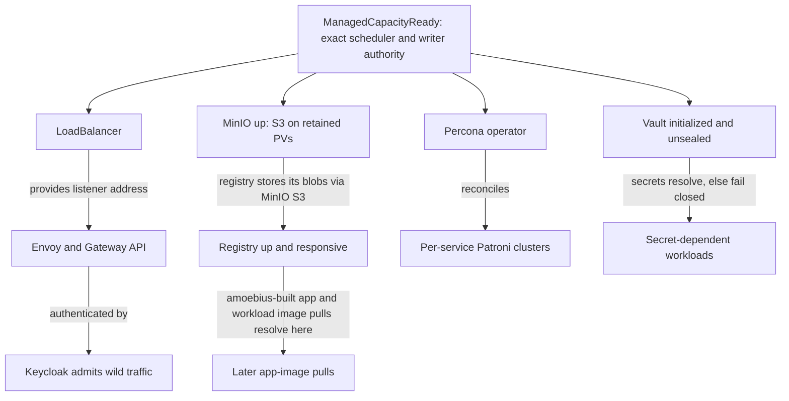

# Platform Services

**Status**: Authoritative source
**Supersedes**: N/A
**Referenced by**: DEVELOPMENT_PLAN/legacy_tracking_for_deletion.md, DEVELOPMENT_PLAN/overview.md, DEVELOPMENT_PLAN/phase_09_render_manifest_goldens.md, DEVELOPMENT_PLAN/phase_15_base_image_registry.md, DEVELOPMENT_PLAN/phase_18_vault_pki.md, DEVELOPMENT_PLAN/phase_19_platform_backbone.md, DEVELOPMENT_PLAN/phase_20_platform_services_2.md, DEVELOPMENT_PLAN/phase_21_keycloak_ingress.md, DEVELOPMENT_PLAN/phase_23_app_tenancy.md, DEVELOPMENT_PLAN/phase_37_spa_live_deploy.md, DEVELOPMENT_PLAN/substrates.md, DEVELOPMENT_PLAN/system_components.md, documents/engineering/README.md, documents/engineering/app_vs_deployment_doctrine.md, documents/engineering/bootstrap_sequence_doctrine.md, documents/engineering/chaos_failover_doctrine.md, documents/engineering/cluster_lifecycle_doctrine.md, documents/engineering/content_addressing_doctrine.md, documents/engineering/daemon_topology_doctrine.md, documents/engineering/dsl_doctrine.md, documents/engineering/gateway_migration_doctrine.md, documents/engineering/host_cluster_comms_doctrine.md, documents/engineering/image_build_doctrine.md, documents/engineering/manifest_generation_doctrine.md, documents/engineering/monitoring_doctrine.md, documents/engineering/namespace_layout_doctrine.md, documents/engineering/network_fabric_doctrine.md, documents/engineering/pulsar_client_doctrine.md, documents/engineering/pulumi_iac_doctrine.md, documents/engineering/readiness_ordering_doctrine.md, documents/engineering/resource_capacity_doctrine.md, documents/engineering/service_capability_doctrine.md, documents/engineering/storage_lifecycle_doctrine.md, documents/engineering/substrate_doctrine.md, documents/engineering/tenancy_doctrine.md, documents/engineering/vault_pki_doctrine.md, documents/illegal_state/illegal_state_capacity.md, documents/illegal_state/illegal_state_catalog.md, documents/illegal_state/illegal_state_lifecycle.md, documents/illegal_state/illegal_state_security.md, documents/illegal_state/illegal_state_techniques.md
**Generated sections**: none

> **Purpose**: Define the fixed set of standard services every amoebius cluster runs (the concrete providers
> behind the capabilities of [service_capability_doctrine.md](./service_capability_doctrine.md)), how each is
> deployed (HA-always, image-from-the-in-cluster-registry, complete resource envelopes), and the single Keycloak-owned
> wild-ingress path.

---

## 1. The Invariant: every cluster is the same cluster

An amoebius cluster is **fungible** — fungible in its *capability set*, not necessarily in its every
manifest. Tear one down and spin another up — on a different substrate, at a different replica count — and it
offers the **same standard services / capabilities, wired the same way**. There is no "lite" cluster, no
"no-registry" cluster, no missing-capability cluster. What may legitimately differ between clusters is the
*deployment shape* of a service (single-node vs distributed) — a deployment-rules concern owned by
[service_capability_doctrine.md](./service_capability_doctrine.md): the *set* is invariant, the *shape* may
vary. This refines the prodbox **substrate-equivalence** rule (`home` vs `AWS`): amoebius keeps "every
cluster stands up the same *set*" while deliberately relaxing "the same *shape*." The structural enforcement
of the set-invariant is [§12](#12-substrate-equivalence-as-a-structural-invariant).

Why this matters: it is what makes amoebic spawning, ephemeral teardown/rebuild, and geo-replicated
failover even *expressible*. A never-before-seen child cluster is the same machine as the parent; a
cluster destroyed and rebuilt rebinds to the same shape. Fungibility is
the precondition for every cross-cluster move in [cluster_lifecycle_doctrine.md](./cluster_lifecycle_doctrine.md)
and [chaos_failover_doctrine.md](./chaos_failover_doctrine.md).

The standard service set (DEVELOPMENT_PLAN "Standard platform services"):

| Service | Role on every cluster | Deeper mechanics owned by |
|---------|-----------------------|---------------------------|
| **LoadBalancer** (MetalLB *or* cloud LB) | The single L4 entry point to the cluster | [substrate_doctrine.md](./substrate_doctrine.md) (the LB choice is the one substrate-driven difference) |
| **Envoy + Gateway API** | L7 routing and edge TLS termination | [§9](#9-the-loadbalancer-and-the-single-wild-ingress-path); [host_cluster_comms_doctrine.md](./host_cluster_comms_doctrine.md) (the carve-out) |
| **Keycloak** | OIDC identity; **owns all wild ingress** | [§9](#9-the-loadbalancer-and-the-single-wild-ingress-path) |
| **Registry** (`distribution`) | The single-binary OCI image registry; **every image is pulled from here** (replaces Harbor) | [image_build_doctrine.md](./image_build_doctrine.md), [service_capability_doctrine.md](./service_capability_doctrine.md) |
| **MinIO** | S3 object substrate: content store, Pulumi backend, app buckets | [storage_lifecycle_doctrine.md](./storage_lifecycle_doctrine.md), [content_addressing_doctrine.md](./content_addressing_doctrine.md), [pulumi_iac_doctrine.md](./pulumi_iac_doctrine.md) |
| **Vault** | Fail-closed secrets root + PKI trust anchor | [vault_pki_doctrine.md](./vault_pki_doctrine.md) |
| **Pulsar** | Native-protocol pub/sub event + workflow backbone (**new vs prodbox**) | [pulsar_client_doctrine.md](./pulsar_client_doctrine.md) |
| **Prometheus / Grafana** | Cluster-local metrics + dashboards | (this doc, [§7](#7-prometheus--grafana--observability-is-not-an-add-on)) |
| **Percona/Patroni Postgres + pgAdmin** | Relational store: **one Patroni cluster per consuming service** | [§8](#8-postgres--patroni-via-percona-one-cluster-per-consumer-with-pgadmin); [storage_lifecycle_doctrine.md](./storage_lifecycle_doctrine.md) |

Application logic never names these products directly; it names the **capabilities** they realize, owned by
[service_capability_doctrine.md](./service_capability_doctrine.md). This document is the SSoT for *which*
concrete services exist and *how each is deployed at the platform level* — the providers behind those
capabilities. It does **not** restate the capability abstraction, the storage model, the secrets model, the
image-build pipeline, the manifest-generation engine, or the host-comms carve-out — those are owned by the
linked siblings and only referenced here.

---

## 2. HA always — including `replicas=1`

There is no separate "dev topology." A kind cluster on an admin's laptop at `replicas=1` runs the
byte-identical HA charts a production cluster runs — only the replica count changes. This kills the entire
class of *works-in-dev, breaks-in-prod-because-the-topology-differs* bugs: the chart debugged at one
replica is the chart that runs at five.

Concretely (DEVELOPMENT_PLAN cross-cutting invariants):

- **Replica count is a deployment-rules knob, not a chart fork.** The midwife's `bootstrap` hand-off requires
  `--distro={kind,rke2}`; `kind` accepts `--replicas=n` (default `1`). The HA charts are identical across
  values of `n`. The application-logic-vs-deployment-rules split that makes replicas a separate orthogonal
  surface is owned by [app_vs_deployment_doctrine.md](./app_vs_deployment_doctrine.md).
- **HA chart even at `replicas=1`.** A single-replica deployment is still the HA chart with one replica —
  never a hand-special-cased single-pod variant. Postgres at one node is still a Patroni-via-Percona
  cluster ([§8](#8-postgres--patroni-via-percona-one-cluster-per-consumer-with-pgadmin)), not a bare `postgres` Pod.
- **No degenerate single-node path.** prodbox historically simulated HA by deploying *multiple kind
  clusters*; amoebius replaces that with one HA stack whose replica count is declarative. A demo web app's
  "mock 3-replica" pattern collapses to a `replicas=n` value.

> **Honesty.** The HA-always model is *specified* here and inherited from prodbox where parts of it are
> proven; in amoebius it is design intent delivered across Phase 15 and Phases 18–21, not a tested amoebius result. Status and gates live
> only in [../../DEVELOPMENT_PLAN/README.md](../../DEVELOPMENT_PLAN/README.md) (per
> [documentation_standards.md §6](../documentation_standards.md#6-honesty-the-proventestedassumed-discipline) and
> [chaos_failover_doctrine.md](./chaos_failover_doctrine.md)).

---

## 3. The registry — the single image source

The in-cluster registry is the **single-binary `distribution` (`registry:2`) OCI registry**, which
**replaces Harbor**. Once it is up, **nothing in the cluster pulls from a public registry**: every image is
either baked into the base container or built by amoebius and served from here. The result is reproducibility
(amoebius owns the bytes), air-gap capability, and zero exposure to upstream rate-limits or flakes.

- **No bootstrap chicken-and-egg.** The registry binary is baked into the base image, which is loaded onto
  the node before bring-up ([image_build_doctrine.md §9](./image_build_doctrine.md#9-bring-up-ordering--the-registry-chicken-and-egg-dissolves)), so the registry runs from the preloaded
  image rather than pulling itself from a public registry (the prodbox Harbor bootstrap problem dissolves).
  Its one runtime dependency is MinIO, which holds the registry's blobs and is itself a preloaded, PV-backed
  service — so the dependency is a plain ordering edge (MinIO before the registry, [§11](#11-bring-up-and-dependency-ordering)), never a pull cycle.
- **It needs no relational database, and no PV of its own.** Unlike Harbor, `distribution` stores its blobs
  in **MinIO via the S3 storage driver** ([§4](#4-minio--the-object-substrate)) — it holds no PersistentVolume and runs no Postgres/Redis of
  its own, so it takes neither a Patroni cluster under the [§8](#8-postgres--patroni-via-percona-one-cluster-per-consumer-with-pgadmin) rule nor a retained PV under the storage
  model. amoebius drops Harbor's scanning, web UI, robot RBAC, and replication as separate concerns,
  revisited only if ever needed.
- **The build side is not owned here.** Baking binaries, buildx multi-arch (`amd64`/`arm64`),
  versioning-vs-`:latest`, and host-vs-in-pod builds are owned by
  [image_build_doctrine.md](./image_build_doctrine.md); *which* provider backs the Registry capability is
  owned by [service_capability_doctrine.md](./service_capability_doctrine.md). This doc owns only: *the
  registry is a standard service, and it is the sole pull source on every cluster.*

---

## 4. MinIO — the object substrate

MinIO is the cluster's S3: everything that needs durable bytes that are not a SQL row lands here. It plays
three distinct roles, each owned by a different sibling doc — this doc only records that MinIO is a
standard HA service:

- **Content-addressed artifact store** (pointers → manifests → blobs) — [content_addressing_doctrine.md](./content_addressing_doctrine.md).
- **Pulumi state backend** with Vault-envelope encryption — [pulumi_iac_doctrine.md](./pulumi_iac_doctrine.md).
- **App buckets** named `<app>/<bucket>` — [app_vs_deployment_doctrine.md](./app_vs_deployment_doctrine.md) and the DSL.

Its on-disk durability — retained backing that survives cluster delete/recreate and is exposed again through
a freshly rendered `no-provisioner` PV binding — is owned entirely by
[storage_lifecycle_doctrine.md](./storage_lifecycle_doctrine.md).
MinIO runs HA (distributed). The one path by which something *outside* the cluster reaches MinIO — a host
compute daemon as a MinIO peer over a host-only NodePort — is the carve-out in [§9](#9-the-loadbalancer-and-the-single-wild-ingress-path), owned by
[host_cluster_comms_doctrine.md](./host_cluster_comms_doctrine.md).

---

## 5. Vault — the secrets root (reference-only)

Vault is where secrets *actually live*; Dhall only ever holds a **name** for a secret. Keep this section
thin: [vault_pki_doctrine.md](./vault_pki_doctrine.md) is the SSoT for the Vault model, and this doc must
not duplicate its normative content.

What belongs here, and only here, is the platform-service fact: **Vault is a singleton HA platform service
deployed on every cluster**, on the same footing as the registry, MinIO, Pulsar, and Postgres. The fail-closed
secrets-root behaviour, the root password-encrypted unseal, the parent-injects-secrets-into-child model,
the secret-by-name `SecretRef` contract, and the PKI trust anchor are all owned by
[vault_pki_doctrine.md](./vault_pki_doctrine.md). Its durable PV is owned by
[storage_lifecycle_doctrine.md](./storage_lifecycle_doctrine.md).

---

## 6. Pulsar — the event and workflow backbone (new vs prodbox)

Pulsar is the cluster's nervous system: workflow commands, lifecycle events, and geo-replication streams
all flow over it. **Flag explicitly: Pulsar is new relative to prodbox** — prodbox had no Pulsar — so
everything here is forward design, not inherited-proven behaviour.

- **Native TCP binary protocol, no WebSockets.** The client is `amoebius-pulsar`, forked from
  `cr-org/supernova`, owned by [pulsar_client_doctrine.md](./pulsar_client_doctrine.md). The
  no-WebSockets rule is a locked invariant: lookup / produce / consume / subscribe / seek all ride the
  native protocol.
- **Topic lifecycles are declarative.** An app spec declares its topic lifecycles; the topology algebra
  and the at-least-once + dedup semantics are owned by the client doc and the DSL doc.
- **Pulsar does its own intra-cluster consensus.** amoebius therefore *delegates* the synchronous HA
  correctness obligation to Pulsar's brokers/bookies rather than re-proving it — the only proof obligation
  that concentrates on amoebius is the asynchronous cross-cluster boundary (the "Second Axis" in
  [chaos_failover_doctrine.md](./chaos_failover_doctrine.md)).
- **The metadata store is explicit, not broker overhead.** The canonical v1 provider is
  Pulsar + ZooKeeper + BookKeeper. Its pure `PulsarMetadataStoreDemand = ZooKeeper` carries exact
  persistent/session-ephemeral znode identities, transaction/session/watch bounds, every member's complete
  pod envelope and retained volume, log/snapshot retention, and failure recovery bound. The pinned model
  derives per-member steady/recovery bytes and must provision before brokers start. A topology whose
  brokers/bookies/offload fit but ZooKeeper CPU, memory, ephemeral storage, pod/CSI slots, or one retained
  backing does not is undeployable; BookKeeper or MinIO storage cannot be silently reused.
- **Host compute daemons join as Pulsar peers** over host-only NodePorts (no mTLS) — [§9](#9-the-loadbalancer-and-the-single-wild-ingress-path) and
  [host_cluster_comms_doctrine.md](./host_cluster_comms_doctrine.md).

---

## 7. Prometheus / Grafana — observability is not an add-on

Every cluster ships its own metrics and dashboards; observability is part of the standard set, not an
optional bolt-on. Prometheus scrapes platform and app workloads; Grafana is reachable **only** through the
Keycloak-owned edge like every other browser surface ([§9](#9-the-loadbalancer-and-the-single-wild-ingress-path)), never via a private side-door. If Grafana is
configured against a SQL backend, that database follows the per-service Patroni rule in [§8](#8-postgres--patroni-via-percona-one-cluster-per-consumer-with-pgadmin).

The metrics are workflow-aware. Each workflow's mandatory SLO and each topic's liveness derive Prometheus
recording/alert rules and a per-workflow Grafana dashboard — derived, never hand-authored — and each extension
stands up its declared surfaces (jitML's `TensorBoard`, backed by MinIO). The single Grafana instance, the
derived surfaces, and any extension surface reach the browser only through the Keycloak edge under a mandatory
`AccessScope` with no `Public` arm (admin-global, or a per-user Keycloak-backed filter). An optional local
Thanos companion beside the single Prometheus is the long-term/downsample store — a strictly cluster-local
role, never a cross-cluster Query/Store/Receive. The pull/scrape posture ("nothing is pushed outward") is the
scrape-wire stance, not a bar on the intra-forest async geo-replication a peer cluster already consumes. The
obligation types, the derived surfaces, the access model, the Thanos role, and the parent-monitoring posture
are owned by [monitoring_doctrine.md](./monitoring_doctrine.md).

---

## 8. Postgres — Patroni-via-Percona, one cluster per consumer, with pgAdmin

amoebius **never** runs a "just one Postgres Pod." Every relational database is a Patroni cluster managed
by the Percona operator, and **each consuming service gets its own cluster**, never a shared
mega-database, each paired with **its own pgAdmin**.

Why separate-per-service: blast-radius isolation (one service's DB incident can't take down another's),
independent version and lifecycle, and clean per-namespace teardown.

- **The Percona operator is itself a platform component**, drawn from the shared inventory ([§12](#12-substrate-equivalence-as-a-structural-invariant)) so it
  installs identically on every substrate. A service needing SQL renders a `PerconaPGCluster` in its own
  namespace; the cluster-wide operator reconciles it. (This generalizes the prodbox
  `helm_chart_platform_doctrine.md` §4 Patroni dependency contract, where Keycloak is the proven
  consumer — without restating its prodbox-specific naming.)
- **HA always applies here too ([§2](#2-ha-always--including-replicas1)).** At its configured steady state a Patroni cluster runs multiple
  replicas; at `replicas=1` it is still a Patroni cluster, never a bare Pod. This doc deliberately fixes
  **no specific replica count** — the count is a deployment-rules value, not a doctrine constant.
- **Synchronous replication is a required, typed configuration — not Patroni's default.** Patroni defaults to
  *asynchronous* replication: `synchronous_mode` is opt-in, and a non-strict synchronous cluster silently
  degrades to async whenever no synchronous standby is available. amoebius therefore fixes the Patroni
  configuration as a platform-service invariant, not a per-service option:
  - `synchronous_mode: on` — the primary acknowledges a commit only after a synchronous standby has confirmed it;
  - `synchronous_mode_strict: on` — the *decided* strict stance: when no synchronous standby is available the
    primary **refuses new writes** rather than accepting commits it cannot synchronously replicate. The
    non-strict alternative (degrade to async, stay writable) is explicitly rejected, because it trades the
    durability guarantee for availability without signalling the loss;
  - `maximum_lag_on_failover` set low (bytes-bounded) — a replica lagging past the bound is ineligible for
    promotion, so a failover cannot elect a stale primary.

  This configuration is the premise on which the RPO=0 / "effectively lossless" delegation and the
  `PlannedIsLossless` obligation in [chaos_failover_doctrine.md §6](./chaos_failover_doctrine.md#6-the-concentration-principle--where-the-obligation-lives)
  rest: that doctrine delegates the intra-cluster synchronous-HA correctness to Percona/Patroni rather than
  re-proving it, and the delegation holds **only** with these settings. Absent them an intra-cluster failover
  can promote a replica missing acknowledged commits and thereby lose them — so this is stated as a required
  configuration, not an assumed default.
- **Canonical consumers.** Keycloak is the proven prodbox consumer; other standard services that need a
  relational database each get their own Patroni cluster + pgAdmin. (The registry does **not** —
  `distribution` needs no database, [§3](#3-the-registry--the-single-image-source) — which is one fewer Patroni consumer than prodbox's Harbor.) The
  authoritative list of which standard services take a database is a Phase 20 delivery detail tracked in
  [../../DEVELOPMENT_PLAN/README.md](../../DEVELOPMENT_PLAN/README.md), not frozen here.
- **Storage is not owned here.** Retained PVs, the `<namespace>/<statefulset>/pv_<integer>` naming, sizing,
  and deterministic rebind are owned by [storage_lifecycle_doctrine.md](./storage_lifecycle_doctrine.md).
- **Capacity remains per consumer.** Binding constructs one `PatroniSqlDemand` for each consuming capability:
  the operator/controller and validating-webhook child envelopes, finite data/WAL/checkpoint/failover-replay
  inputs, required `StorageBudgetId`, declared volume presentation/backing, bounded SQL writer admission and
  its proxy envelope, and rollout/recovery overlap. Only the private
  `ProvisionedPatroniSql` renders the CR and quota boundary. Adding Keycloak or an app therefore adds a real
  database compute/storage demand; it cannot reuse Grafana's or another consumer's capacity witness.

### Tenant policy persistence is one provider-indexed transaction

Tenant RBAC starts with `deriveTenantPolicies :: TenantSpec -> TenantPolicyDerivation`, the pure intermediate
owned by [tenancy_doctrine.md §5](./tenancy_doctrine.md#5-rbac-is-derived-never-authored), never with a direct
renderer. Its closed provider index has six arms, each with a canonical payload, exact target, persistence
projection, and apply intent:

| Provider | Policy payload | Resource-bearing persistence |
|---|---|---|
| Keycloak | realms, roles, client scopes, route-auth rules | Keycloak schema/index rows and WAL |
| Vault | policies and auth bindings | persisted versions, Raft logs, snapshots |
| Pulsar | tenants, namespaces, ACLs | ZooKeeper entries, transaction logs, snapshots |
| MinIO | IAM, service accounts, bucket policies | dynamic system metadata under budget/geometry/model |
| Kubernetes API | generated RBAC and NetworkPolicy objects | serialized API objects, etcd revisions and Events |
| Postgres | tenant database roles and grants | Postgres schema/index rows and WAL |

Keycloak and Postgres remain distinct provider/persistence arms even when both ultimately use Patroni. MinIO
policy records are storage-system metadata, not application objects and not another arm of
`ObjectStoreProducerDemand`. The canonical demand shapes are defined by
[resource_capacity_doctrine.md §5.1](./resource_capacity_doctrine.md#51-durable-demand-is-logical-first-physical-only-after-geometry).

All output/action/executor/MinIO-metadata identities are qualified by `TenantId`, and each nested source tenant
must equal its outer key. The planner accepts a possibly empty desired tenant map and diffs the exact
`desired ∪ observed` domain. An observed-only row retains source, target, action, and executor provenance and
produces authenticated deletes. Deleting the final tenant and the exact empty no-op are therefore representable;
a non-empty desired collection is not an invariant.

Observed executors are one global target-keyed inventory, not copied inside every tenant. The plural binder
resolves abstract `< Dedicated | SharedControlPlaneRole >` attachments and coalesces complete execution deltas by
resolved target across the entire transaction. It sums all members before replacing a shared base once;
dedicated targets are unique. Per-tenant executor copies, uncoalesced deltas, or a repeated base debit reject.

Every action has optional old and desired provider targets. A target change retains both target-keyed physical
high-waters: old and new Keycloak/Postgres databases and WAL, Vault backings, Pulsar metadata stores, MinIO
stores/budgets/geometries/models, Kubernetes clusters/namespaces/etcd models, executor epochs, and failed or
rollback residents. Desired absence alone never releases the old side.

For MinIO, the global key is `(store,budget,geometry,model)`, and dynamic entry ids remain tenant-qualified.
Concurrent old and new groups are resolved only against retained MinIO backings. One physical fold per store
adds `metadataReservePerDrive` once per resident store and every dynamic group once. Observed readback carries
the metadata model and separates static reserve from dynamic per-drive bytes, so a model mismatch,
static-per-tenant debit, or dynamic ownership hole/overlap cannot normalize. `ProviderObjectQuota` remains a
different, unsupported supply arm.

Whole-deployment provision seals a private provider-indexed `ProvisionedTenantPolicyAction` for every operation,
including tenant/source, payload digest, old and desired target, persistence high-water, provisioned executor,
retention, and cleanup predicate. Only the matching provider enactor plus the fresh fingerprint-equal
`ValidatedLiveTarget` may act. Read-only provider observers and post-action readback must prove the desired
state or authenticated delete absence and then prove old-target cleanup before capacity is released. Failed
apply retains old/new/action/rollback/executor residents. Raw derivations, binder-stage targets, and prior
`Provisioned*` records are not enactor inputs.

Phase 23 owns provider administrative apply/readback for all six arms. In particular, its Pulsar adapter applies
and observes tenant/namespace/ACL policy but does not use an application client. Phase 24, after the native
`amoebius-pulsar` client exists, owns the authenticated produce/consume round-trip gate. Administrative policy
convergence in Phase 23 must not be reported as proof of the Phase-24 data path.

---

## 9. The LoadBalancer and the single wild-ingress path

The Keycloak-owned identity edge is the **single sanctioned ingress point** for all external traffic. All wild traffic —
WAN, LAN, and even a localhost *browser* connection — enters through the LoadBalancer, is routed by Envoy
through the Gateway API, and is authenticated by Keycloak before it reaches any workload. No app publishes
its own ingress; no chart opens a backdoor NodePort to the wild. Keycloak owning all wild ingress is
the only sanctioned ingress shape, and the DSL makes the alternatives unrepresentable
(see [dsl_doctrine.md](./dsl_doctrine.md) and [illegal_state_catalog.md](../illegal_state/illegal_state_catalog.md)).

- **The LoadBalancer is the one substrate-driven difference.** MetalLB on bare-metal / kind; a cloud LB
  (e.g. the AWS Load Balancer Controller) on provider-managed substrates. The *choice* of LB is owned by
  [substrate_doctrine.md](./substrate_doctrine.md); everything above it is substrate-identical.
- **Envoy + Gateway API** terminate TLS and route. TLS certificate provisioning (zerossl) and DNS
  (route53) integration are owned by [pulumi_iac_doctrine.md](./pulumi_iac_doctrine.md) and the DSL.

### The sole exception: host-origin, localhost-only traffic

There is exactly one carve-out from "Keycloak owns all wild ingress," and it is **not** wild — it is
host-origin and strictly localhost:

1. The **host amoebius binary** talks to `kube-apiserver` directly over the distro's default mTLS.
2. **Host compute daemons** (e.g. an Apple-Metal inference engine that needs unified memory and cannot run
   in a container) reach in-cluster MinIO and Pulsar as **peers over host-only NodePorts with no mTLS** —
   localhost only, with **no WAN or LAN access**.

This carve-out is owned in full by [host_cluster_comms_doctrine.md](./host_cluster_comms_doctrine.md); it
is recorded here only so the "Keycloak owns everything" rule names its one exception. The no-mTLS NodePort
is acceptable *precisely because* it is unreachable off the host.

### East-west connectivity is derived from the dependency graph

Service-to-service (east-west) connectivity is **derived from the declared dependency graph**, never
hand-authored. An app declares which services it consumes; amoebius generates the NetworkPolicies so that
exactly those edges are allowed and every other is denied. A service that does not declare consuming `B`
cannot reach `B`. Consequently a blocking NetworkPolicy that severs a declared dependency, and an open
policy that exposes an undeclared one, are both **unrepresentable**. This subsection is the SSoT for the
connectivity rule that [illegal_state_catalog.md §3.6](../illegal_state/illegal_state_security.md#36-blocking-networkpolicy-services-cant-reach-each-other) turns into a
compile-time impossibility.

### Tolerations are derived from node taints, never hand-authored

Placement scheduling is **derived**, exactly like east-west connectivity, and for the same reason: a
free-text toleration is how a pod ends up unschedulable (it tolerates a taint no node carries, or fails to
tolerate the taint it must). So amoebius does not let an operator *write* a toleration at all. A workload's
tolerations are **generated** from the declared node taints — the closed `NodeTaintKind` set and per-node
taints owned by the node inventory ([substrate_doctrine.md §8](./substrate_doctrine.md#8-the-node-inventory-the-single-owner-of-hosts-capacity-and-taints))
— so a `Toleration` handle exists only once its taint edge does. Consequently post-bind provisioning rejects a workload
unless **there exists** a node satisfying its affinity **and** tolerating all its taints: a schedulability
*existence fold* over the single node inventory, never a `Pending` pod. This subsection is the SSoT for the
derivation rule that [illegal_state_catalog.md §3.5](../illegal_state/illegal_state_capacity.md#35-undeployable-pods-taints-tolerations--affinity) / [§3.22](../illegal_state/illegal_state_capacity.md#322-a-hand-authored-un-derived-toleration) turns into a
compile/provision boundary (type-foreclosed for the derived-toleration shape; checked at `provision-seal` for
the target-relative existence fold).

`ManagedCapacity` is the authority-bearing member of that closed taint set. Its toleration is an inseparable
projection with `schedulerName = amoebius-capacity`: no constructor can render the toleration while leaving the
Pod on `default-scheduler`. The only exception is the capacity scheduler's own bootstrap Pod, which is
structurally separate, uniquely node-affined, statically debited, and isolated in
`amoebius-capacity-scheduler` under exact `ResourceQuota pods=1`. Existing distro/bootstrap add-ons are allowed
to use `default-scheduler` only before cutover and while the managed taint is absent. They are then patched to
the custom scheduler and their old UIDs are observed absent/released and replacements reservation-joined
before full managed-node authority can become Ready. A hand-authored toleration, a managed-capacity Pod with
another scheduler, or a second default-scheduler exception is rejected before Pod creation.

---

## 10. Every execution unit declares its complete resource envelope

No pod is exempt — including init containers, controllers, operator installs, admission gateways/webhooks,
copy/schema/Pulumi/ACME Jobs, and platform services — and
neither is any host-level worker. Every execution unit carries the pure `ResourceEnvelope` owned by
[resource_capacity_doctrine.md §3](./resource_capacity_doctrine.md#3-the-types-quantity-capacity-demand-budget);
the Kubernetes resource map is derived from that value after the whole deployment has passed `provision`.

For every rendered container:

- CPU, memory, and `ephemeral-storage` **requests and limits** are explicit refined non-zero quantities with
  `requests ≤ limits`.
- Disk-backed pod-local cache/scratch is a bounded ephemeral volume. Every container's private writable-layer
  and log allowances fit that container's own ephemeral request/limit; shared disk-volume bounds plus the
  lifecycle-effective private allowance fit the effective pod request/limit. A memory-backed `emptyDir` instead
  names access modes and stage-local/pod-lifetime persistence. The lifecycle fold assigns one request carrier
  per resident volume/concurrency epoch and proves unique resident volumes + live working sets fit the
  effective pod request/limit; possible charged accessors' limits cover writable volumes. The effective pod
  memory/ephemeral envelope is charged once, never with a second volume debit. For the
  per-node in-cluster cache owner,
  `ProvisionedCacheDemand.derivedPeak ≤ CacheBudget ≤ emptyDir.sizeLimit` and
  `Σ disk-backed volume sizeLimits + lifecycle-effective private allowances ≤
  effectivePod.ephemeralStorage.request ≤ effectivePod.ephemeralStorage.limit`; these are nested proofs on one
  debit, not separate cache and ephemeral consumers.
- ConfigMap, Secret, downward-API, projected, and service-account-token mounts are not free files. Binding
  derives their `KubeletMappedFileDemand` from the same serialized API-object source, applies the pinned
  AtomicWriter old+new/symlink/metadata model, and routes that mapped-file component to kubelet-nodefs
  ephemeral storage or memory.
  Each `PodRuntimeMetadataSource` additionally preserves exact network-attachment and container/volume-mount
  identities without accepting authored bytes. After kind-indexed Deployment/StatefulSet/DaemonSet/Job or
  host-process expansion, provisioning derives one planned-slot metadata demand per
  `MaterializedExecutionInstance`, while live validation derives a separate Pod-UID-indexed observed demand.
  Sandbox/pod-directory/CNI/volume/mount components use `KubeletNodefs`; CRI runtime components use
  `CriRuntimeRoot`. The selected `Unified | SplitRuntime | SplitImage` resolver maps those roles to physical
  backing ids, groups aliased components once, combines them with the node image model under a disjoint
  ownership witness, and fits the largest simultaneous node aggregate. It never routes one combined metadata
  scalar blindly to nodefs. Each live pod also
  consumes one pod/CNI slot and one driver-scoped attach slot per unique mounted CSI PVC.
- Every container image is content-digested and carries per-OS/arch index/manifest/config/compressed-layer
  stored bytes, snapshot chain/unpacked bytes, and bounded import workspace. After placement, content objects
  and snapshots are deduplicated in their respective identity domains, the enforced pull policy determines
  workspace peak, and the closed kubelet layout routes the selected-platform peak with writable/log/volume
  bytes to each real nodefs/imagefs backing; image bytes are not disguised as a second pod request.
- Durable bytes are not hidden in the container envelope: every persistent claim is a separate, explicit
  `DeclaredVolumeDemand` whose geometry, presentation, and backing allocation derive a private hard cap.
- Accelerator access is never an ambient device mount. A model/job capability can declare an
  appropriate pod/host accelerator demand, but provisioning routes it through exactly one typed per-node
  accelerator owner; ordinary workload pods cannot author a device claim. Each `CudaOwnerDemand` or
  `MetalOwnerDemand` has an exact source inventory and equal-keyed workload map, exact class domains in both
  coexistence bounds, structural residency placement/shards, and no authored owner-total or favorable epoch.
  Provisioning derives every permitted coexistence epoch and, for CUDA, aggregates all co-resident residency
  components per device against net allocatable VRAM. On `linux-cuda`, only the demand's
  exactly-once named owner container receives the equal integer extended-resource request/limit, while its pod
  receives required accelerator-profile affinity; only that private claim/affinity projection renders.

The pure provisioner derives the effective pod request/ceiling from every app/sidecar/ordinary-init/
restartable-init-sidecar container and pod overhead using the pinned Kubernetes scheduling semantics. It then
proves both request placement and the finite-limit/physical-peak fit for memory, ephemeral storage, cache,
durable storage, accelerator devices, and every derived residency/coexistence epoch, charging an in-cluster cache once through its owner's
ephemeral limit. The ephemeral limit is a kubelet measurement/eviction boundary, not a synchronous quota;
the cache owner's private admission guard and the layout-routed backing enforce the hard
materialization/physical bounds. A
manifest cannot introduce a resource field that was absent from that proof, and it cannot omit one the proof
carried.

**Host-level worker subprocesses declare the corresponding host envelope.** An Apple-Metal or Windows-CUDA
native worker is not a pod, but it still declares CPU, memory, scratch/cache storage, accelerator family/device
ownership, and an identity-complete `CudaOwnerDemand` or `MetalOwnerDemand`. CUDA epochs debit discrete
per-device net VRAM; Metal epochs debit unified host memory. That envelope is the operand the host → host-worker fold consumes
alongside the co-resident WSL2/Lima VM carve against physical-host capacity. Its enforcement witness is
substrate-indexed: Linux cgroup v2, Windows Job Object, or a finite Apple supervisor policy. The Apple arm is
reactive sampling plus termination and is never described as an instantaneous hard CPU/RSS quota; a workload
that requires stronger enforcement than its selected host can supply returns `UnsupportedEnforcement`.

This doc owns only the **per-execution-unit declarations** — the atoms. The whole-deployment derivation,
placement/capability witness, disjoint storage-pool arithmetic, and opaque `ProvisionedSpec` boundary are owned
by [resource_capacity_doctrine.md](./resource_capacity_doctrine.md). There is no second capacity fold here.

---

## 11. Bring-up and dependency ordering

The services cannot all come up at once; a few **hard edges** constrain the order. This doc owns only those
platform-service ordering edges — full cluster lifecycle, teardown ordering, and amoebic spawn are owned by
[cluster_lifecycle_doctrine.md](./cluster_lifecycle_doctrine.md). These edges are the **derived readiness DAG**
of [readiness_ordering_doctrine.md](./readiness_ordering_doctrine.md): each is a *condition* (the dependency is
observed ready), never an elapsed duration, and the order is derived from the declared dependency graph — not a
prose sequence an installer is trusted to honour. The catalog turns a duration-gated or hand-ordered bring-up
into a foreclosed illegal state at
[illegal_state_catalog.md §3.41](../illegal_state/illegal_state_lifecycle.md#341-a-duration-gated--hand-ordered-bring-up-sequence-a-readiness-race).

- **`ManagedCapacityReady` before every general/reconciler-owned platform-service Pod** — bootstrap first observes
  `BootstrapCapacitySchedulerReady` for the exact scheduler generation/config/root while the managed taint is
  still absent. Its restricted cutover capability patches every pre-existing bootstrap add-on to
  `amoebius-capacity` and waits for old UID absence/release plus replacement reservation joins. Only then are
  the managed-node taint, identity admission, and exclusive Binding RBAC installed and independently read back
  as `ManagedCapacityReady`. No platform-service controller is applied from the general plan before that full
  witness exists. The finite pre-SSA Phase-15 registry/proxy units are bootstrap inputs, not an exception for
  new workloads: they must be included in the cutover domain and become custom-scheduled before this witness.
- **LoadBalancer before the Envoy/Gateway edge** — the Gateway needs an LB address to publish a listener.
- **MinIO before the registry** — the `distribution` registry stores its blobs via MinIO's S3 API
  ([§3](#3-the-registry--the-single-image-source), [§4](#4-minio--the-object-substrate)), so MinIO must be serving before the registry is ready. MinIO runs from
  the preloaded base image on retained PVs, so this is a plain ordering edge, not a pull cycle.
- **The registry before later app-image pulls** — once MinIO backs it, the registry must be serving before
  amoebius publishes or pulls amoebius-built app/workload images ([§3](#3-the-registry--the-single-image-source)). Platform services do not
  wait on the registry: they run from the preloaded base image ([image_build_doctrine.md §9](./image_build_doctrine.md#9-bring-up-ordering--the-registry-chicken-and-egg-dissolves)).
- **The Percona operator before any Postgres consumer** — a `PerconaPGCluster` has nothing to reconcile it
  otherwise ([§8](#8-postgres--patroni-via-percona-one-cluster-per-consumer-with-pgadmin)).
- **Vault initialized and unsealed before secret-dependent startup** — a sealed Vault fails secret-dependent
  Pod startup *closed*, with no plaintext fallback ([vault_pki_doctrine.md](./vault_pki_doctrine.md)).
- **Keycloak before the authenticated edge admits wild traffic** — there is no un-authenticated wild path
  to fall back to ([§9](#9-the-loadbalancer-and-the-single-wild-ingress-path)).

---

## 12. Substrate equivalence as a structural invariant

"Same service set on every cluster" is **enforced structurally**, not maintained by parallel hand-edited
installers. This generalizes the prodbox substrate-equivalence mechanism (prodbox CLAUDE.md "Substrate
Equivalence" and `helm_chart_platform_doctrine.md` §3A) from two substrates to all of them. The three
mechanisms, adapted:

1. **One release/version value per platform-component image, shared across substrates.** A platform
   component (Envoy control plane, Envoy data plane, the operators, the registries) is pinned to exactly
   one release value used by every substrate. There is no per-substrate version. This kills
   control-plane-vs-data-plane version skew at the root: a single value pins chart, control plane, and data
   plane together.
2. **A check forbids substrate-keyed re-pinning.** No code path may re-pin a chart version or image ref
   conditionally on the active substrate. Divergence is a build-time error, never a silent drift — "the
   cloud substrate needs a different Envoy" cannot be expressed.
3. **One platform-component inventory drives every substrate's installer.** A coverage check asserts that
   no substrate silently drops a component another installs. Each substrate keeps its own *ordering* ([§11](#11-bring-up-and-dependency-ordering)),
   but never a different *set*. The cloud substrate is **not** a "no-registry" cluster — when a managed
   substrate looks like it is missing a piece the local cluster has, the fix is to extend the shared
   inventory and that substrate's installer, never to render a different service set. **This equivalence
   governs the service *set* and *image refs*, not the deployment *shape*: a service may legitimately take a
   different shape per cluster (single-node vs distributed), owned by
   [service_capability_doctrine.md §6](./service_capability_doctrine.md#6-fungibility-reconciled-app-surface-invariant-shape-deployment-ruled), and that is not a violation of this
   rule.**

The substrate *catalog* itself (apple / linux-cpu / linux-cuda / windows, virtualized substrates, the LB
choice, the no-env/no-PATH lazy-tool-ensure contract) is owned by
[substrate_doctrine.md](./substrate_doctrine.md). Note the no-environment-variables / no-`PATH` rule: all
host tooling that brings these services up is discovered lazily through the substrate's package manager and
invoked by full path — there is no `PATH`-based discovery anywhere in the bring-up sequence.

> **Honesty.** Where this section generalizes a behaviour proven in prodbox, that proof is *evidence from a
> sibling system*, not proof in amoebius — which has not yet built the Phase-15 / Phases-18–21 service set. Read every prescriptive
> statement here as design intent, never as a tested amoebius result.

---

## 13. Planning ownership

This document is normative platform-services doctrine only. Delivery sequencing, completion status,
validation gates, and remaining work are owned by
[../../DEVELOPMENT_PLAN/README.md](../../DEVELOPMENT_PLAN/README.md) (the full service set lands across
**Phase 15 and Phases 18–21**).
This doc never maintains a competing status ledger; it states the target shape and links back for status.

---

## Cross-references

- [Engineering Doctrine Index](./README.md)
- [Storage Lifecycle Doctrine](./storage_lifecycle_doctrine.md)
- [Resource Capacity Doctrine](./resource_capacity_doctrine.md) — whole-deployment provisioning across
  CPU/memory/ephemeral and durable storage/cache/accelerator/VRAM over the per-execution-unit atoms
- [Vault / PKI Doctrine](./vault_pki_doctrine.md)
- [Image Build Doctrine](./image_build_doctrine.md)
- [Host ↔ Cluster Comms Doctrine](./host_cluster_comms_doctrine.md)
- [Pulsar Client Doctrine](./pulsar_client_doctrine.md)
- [Tenancy Doctrine](./tenancy_doctrine.md) — the provider-indexed whole-deployment policy transaction and the
  Phase-23 administrative-policy / Phase-24 Pulsar data-path boundary
- [App vs Deployment Doctrine](./app_vs_deployment_doctrine.md)
- [Cluster Lifecycle Doctrine](./cluster_lifecycle_doctrine.md)
- [Substrate Doctrine](./substrate_doctrine.md)
- [DSL Doctrine](./dsl_doctrine.md)
- [Illegal State Catalog](../illegal_state/illegal_state_catalog.md)
- [Content Addressing Doctrine](./content_addressing_doctrine.md)
- [Pulumi IaC Doctrine](./pulumi_iac_doctrine.md)
- [Chaos / Failover Doctrine](./chaos_failover_doctrine.md)
- [Development Plan](../../DEVELOPMENT_PLAN/README.md)
- [Documentation Standards](../documentation_standards.md)
