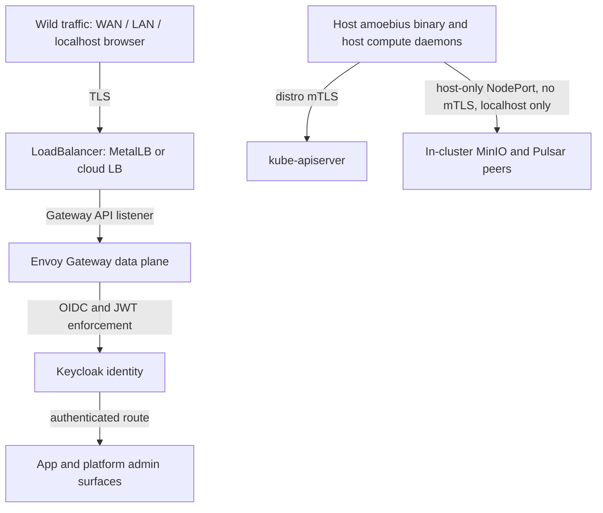
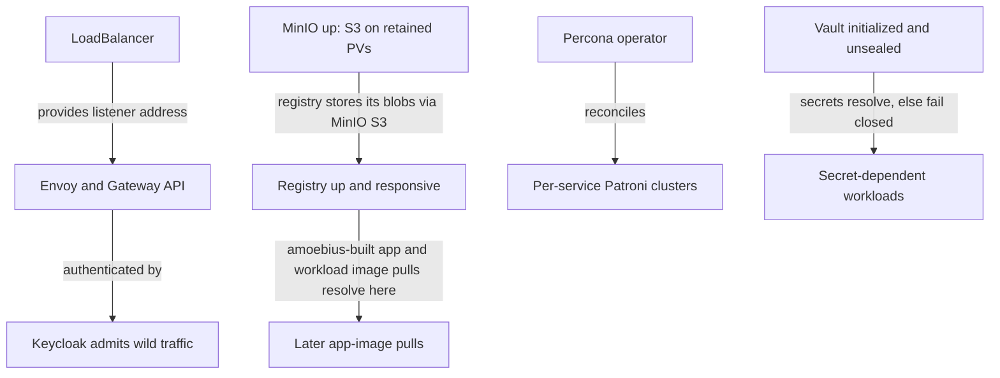

# Platform Services

**Status**: Authoritative source
**Supersedes**: N/A
**Referenced by**: documents/engineering/README.md, documents/engineering/app_vs_deployment_doctrine.md, documents/engineering/chaos_failover_doctrine.md, documents/engineering/cluster_lifecycle_doctrine.md, documents/engineering/content_addressing_doctrine.md, documents/engineering/daemon_topology_doctrine.md, documents/engineering/dsl_doctrine.md, documents/engineering/gateway_migration_doctrine.md, documents/engineering/host_cluster_comms_doctrine.md, documents/engineering/illegal_state_catalog.md, documents/engineering/image_build_doctrine.md, documents/engineering/manifest_generation_doctrine.md, documents/engineering/monitoring_doctrine.md, documents/engineering/network_fabric_doctrine.md, documents/engineering/pulsar_client_doctrine.md, documents/engineering/pulumi_iac_doctrine.md, documents/engineering/readiness_ordering_doctrine.md, documents/engineering/resource_capacity_doctrine.md, documents/engineering/service_capability_doctrine.md, documents/engineering/storage_lifecycle_doctrine.md, documents/engineering/substrate_doctrine.md, documents/engineering/tla_modelling_assumptions.md, documents/engineering/vault_pki_doctrine.md
**Generated sections**: none

> **Purpose**: Define the fixed set of standard services every amoebius cluster runs (the concrete providers
> behind the capabilities of [service_capability_doctrine.md](./service_capability_doctrine.md)), how each is
> deployed (HA-always, image-from-the-in-cluster-registry, cpu/ram-declared), and the single Keycloak-owned
> wild-ingress path.

---

## 1. The Invariant: every cluster is the same cluster

An amoebius cluster is **fungible** — fungible in its *capability set*, not necessarily in its every
manifest. Tear one down and spin another up — on a different substrate, at a different replica count — and it
offers the **same standard services / capabilities, wired the same way**. There is no "lite" cluster, no
"no-registry" cluster, no missing-capability cluster. What may legitimately differ between clusters is the
*deployment shape* of a service (single-node vs distributed) — a deployment-rules concern owned by
[service_capability_doctrine.md](./service_capability_doctrine.md): the *set* is invariant, the *shape* may
vary. This refines the prodbox **substrate-equivalence** rule (`home` vs `AWS`): amoebius keeps "every
cluster stands up the same *set*" while deliberately relaxing "the same *shape*." The structural enforcement
of the set-invariant is [§12](#12-substrate-equivalence-as-a-structural-invariant).

Why this matters: it is what makes amoebic spawning, ephemeral teardown/rebuild, and geo-replicated
failover even *expressible*. A never-before-seen child cluster is the same machine as the parent; a
cluster destroyed and rebuilt rebinds to the same shape. Fungibility is
the precondition for every cross-cluster move in [cluster_lifecycle_doctrine.md](./cluster_lifecycle_doctrine.md)
and [chaos_failover_doctrine.md](./chaos_failover_doctrine.md).

The standard service set (DEVELOPMENT_PLAN "Standard platform services"):

| Service | Role on every cluster | Deeper mechanics owned by |
|---------|-----------------------|---------------------------|
| **LoadBalancer** (MetalLB *or* cloud LB) | The single L4 entry point to the cluster | [substrate_doctrine.md](./substrate_doctrine.md) (the LB choice is the one substrate-driven difference) |
| **Envoy + Gateway API** | L7 routing and edge TLS termination | [§9](#9-the-loadbalancer-and-the-single-wild-ingress-path); [host_cluster_comms_doctrine.md](./host_cluster_comms_doctrine.md) (the carve-out) |
| **Keycloak** | OIDC identity; **owns all wild ingress** | [§9](#9-the-loadbalancer-and-the-single-wild-ingress-path) |
| **Registry** (`distribution`) | The single-binary OCI image registry; **every image is pulled from here** (replaces Harbor) | [image_build_doctrine.md](./image_build_doctrine.md), [service_capability_doctrine.md](./service_capability_doctrine.md) |
| **MinIO** | S3 object substrate: content store, Pulumi backend, app buckets | [storage_lifecycle_doctrine.md](./storage_lifecycle_doctrine.md), [content_addressing_doctrine.md](./content_addressing_doctrine.md), [pulumi_iac_doctrine.md](./pulumi_iac_doctrine.md) |
| **Vault** | Fail-closed secrets root + PKI trust anchor | [vault_pki_doctrine.md](./vault_pki_doctrine.md) |
| **Pulsar** | Native-protocol pub/sub event + workflow backbone (**new vs prodbox**) | [pulsar_client_doctrine.md](./pulsar_client_doctrine.md) |
| **Prometheus / Grafana** | Cluster-local metrics + dashboards | (this doc, [§7](#7-prometheus--grafana--observability-is-not-an-add-on)) |
| **Percona/Patroni Postgres + pgAdmin** | Relational store: **one Patroni cluster per consuming service** | [§8](#8-postgres--patroni-via-percona-one-cluster-per-consumer-with-pgadmin); [storage_lifecycle_doctrine.md](./storage_lifecycle_doctrine.md) |

Application logic never names these products directly; it names the **capabilities** they realize, owned by
[service_capability_doctrine.md](./service_capability_doctrine.md). This document is the SSoT for *which*
concrete services exist and *how each is deployed at the platform level* — the providers behind those
capabilities. It does **not** restate the capability abstraction, the storage model, the secrets model, the
image-build pipeline, the manifest-generation engine, or the host-comms carve-out — those are owned by the
linked siblings and only referenced here.

---

## 2. HA always — including `replicas=1`

There is no separate "dev topology." A kind cluster on an admin's laptop at `replicas=1` runs the
byte-identical HA charts a production cluster runs — only the replica count changes. This kills the entire
class of *works-in-dev, breaks-in-prod-because-the-topology-differs* bugs: the chart debugged at one
replica is the chart that runs at five.

Concretely (DEVELOPMENT_PLAN cross-cutting invariants):

- **Replica count is a deployment-rules knob, not a chart fork.** `bootstrap.sh` requires
  `--distro={kind,rke2}`; `kind` accepts `--replicas=n` (default `1`). The HA charts are identical across
  values of `n`. The application-logic-vs-deployment-rules split that makes replicas a separate orthogonal
  surface is owned by [app_vs_deployment_doctrine.md](./app_vs_deployment_doctrine.md).
- **HA chart even at `replicas=1`.** A single-replica deployment is still the HA chart with one replica —
  never a hand-special-cased single-pod variant. Postgres at one node is still a Patroni-via-Percona
  cluster ([§8](#8-postgres--patroni-via-percona-one-cluster-per-consumer-with-pgadmin)), not a bare `postgres` Pod.
- **No degenerate single-node path.** prodbox historically simulated HA by deploying *multiple kind
  clusters*; amoebius replaces that with one HA stack whose replica count is declarative. A demo web app's
  "mock 3-replica" pattern collapses to a `replicas=n` value.

> **Honesty.** The HA-always model is *specified* here and inherited from prodbox where parts of it are
> proven; in amoebius it is design intent for Phase 3, not a tested amoebius result. Status and gates live
> only in [../../DEVELOPMENT_PLAN/README.md](../../DEVELOPMENT_PLAN/README.md) (per
> [documentation_standards.md §6](../documentation_standards.md#6-honesty-the-proventestedassumed-discipline) and
> [chaos_failover_doctrine.md](./chaos_failover_doctrine.md)).

---

## 3. The registry — the single image source

The in-cluster registry is the **single-binary `distribution` (`registry:2`) OCI registry**, which
**replaces Harbor**. Once it is up, **nothing in the cluster pulls from a public registry**: every image is
either baked into the base container or built by amoebius and served from here. The result is reproducibility
(amoebius owns the bytes), air-gap capability, and zero exposure to upstream rate-limits or flakes.

- **No bootstrap chicken-and-egg.** The registry binary is baked into the base image, which is loaded onto
  the node before bring-up ([image_build_doctrine.md §9](./image_build_doctrine.md#9-bring-up-ordering--the-registry-chicken-and-egg-dissolves)), so the registry runs from the preloaded
  image rather than pulling itself from a public registry (the prodbox Harbor bootstrap problem dissolves).
  Its one runtime dependency is MinIO, which holds the registry's blobs and is itself a preloaded, PV-backed
  service — so the dependency is a plain ordering edge (MinIO before the registry, [§11](#11-bring-up-and-dependency-ordering)), never a pull cycle.
- **It needs no relational database, and no PV of its own.** Unlike Harbor, `distribution` stores its blobs
  in **MinIO via the S3 storage driver** ([§4](#4-minio--the-object-substrate)) — it holds no PersistentVolume and runs no Postgres/Redis of
  its own, so it takes neither a Patroni cluster under the [§8](#8-postgres--patroni-via-percona-one-cluster-per-consumer-with-pgadmin) rule nor a retained PV under the storage
  model. amoebius drops Harbor's scanning, web UI, robot RBAC, and replication as separate concerns,
  revisited only if ever needed.
- **The build side is not owned here.** Baking binaries, buildx multi-arch (`amd64`/`arm64`),
  versioning-vs-`:latest`, and host-vs-in-pod builds are owned by
  [image_build_doctrine.md](./image_build_doctrine.md); *which* provider backs the Registry capability is
  owned by [service_capability_doctrine.md](./service_capability_doctrine.md). This doc owns only: *the
  registry is a standard service, and it is the sole pull source on every cluster.*

---

## 4. MinIO — the object substrate

MinIO is the cluster's S3: everything that needs durable bytes that are not a SQL row lands here. It plays
three distinct roles, each owned by a different sibling doc — this doc only records that MinIO is a
standard HA service:

- **Content-addressed artifact store** (pointers → manifests → blobs) — [content_addressing_doctrine.md](./content_addressing_doctrine.md).
- **Pulumi state backend** with Vault-envelope encryption — [pulumi_iac_doctrine.md](./pulumi_iac_doctrine.md).
- **App buckets** named `<app>/<bucket>` — [app_vs_deployment_doctrine.md](./app_vs_deployment_doctrine.md) and the DSL.

Its on-disk durability — the `no-provisioner` retained PV that survives cluster delete/recreate and
rebinds deterministically — is owned entirely by [storage_lifecycle_doctrine.md](./storage_lifecycle_doctrine.md).
MinIO runs HA (distributed). The one path by which something *outside* the cluster reaches MinIO — a host
compute daemon as a MinIO peer over a host-only NodePort — is the carve-out in [§9](#9-the-loadbalancer-and-the-single-wild-ingress-path), owned by
[host_cluster_comms_doctrine.md](./host_cluster_comms_doctrine.md).

---

## 5. Vault — the secrets root (reference-only)

Vault is where secrets *actually live*; Dhall only ever holds a **name** for a secret. Keep this section
thin: [vault_pki_doctrine.md](./vault_pki_doctrine.md) is the SSoT for the Vault model, and this doc must
not duplicate its normative content.

What belongs here, and only here, is the platform-service fact: **Vault is a singleton HA platform service
deployed on every cluster**, on the same footing as the registry, MinIO, Pulsar, and Postgres. The fail-closed
secrets-root behaviour, the root password-encrypted unseal, the parent-injects-secrets-into-child model,
the secret-by-name `SecretRef` contract, and the PKI trust anchor are all owned by
[vault_pki_doctrine.md](./vault_pki_doctrine.md). Its durable PV is owned by
[storage_lifecycle_doctrine.md](./storage_lifecycle_doctrine.md).

---

## 6. Pulsar — the event and workflow backbone (new vs prodbox)

Pulsar is the cluster's nervous system: workflow commands, lifecycle events, and geo-replication streams
all flow over it. **Flag explicitly: Pulsar is new relative to prodbox** — prodbox had no Pulsar — so
everything here is forward design, not inherited-proven behaviour.

- **Native TCP binary protocol, no WebSockets.** The client is `amoebius-pulsar`, forked from
  `cr-org/supernova`, owned by [pulsar_client_doctrine.md](./pulsar_client_doctrine.md). The
  no-WebSockets rule is a locked invariant: lookup / produce / consume / subscribe / seek all ride the
  native protocol.
- **Topic lifecycles are declarative.** An app spec declares its topic lifecycles; the topology algebra
  and the at-least-once + dedup semantics are owned by the client doc and the DSL doc.
- **Pulsar does its own intra-cluster consensus.** amoebius therefore *delegates* the synchronous HA
  correctness obligation to Pulsar's brokers/bookies rather than re-proving it — the only proof obligation
  that concentrates on amoebius is the asynchronous cross-cluster boundary (the "Second Axis" in
  [chaos_failover_doctrine.md](./chaos_failover_doctrine.md)).
- **Host compute daemons join as Pulsar peers** over host-only NodePorts (no mTLS) — [§9](#9-the-loadbalancer-and-the-single-wild-ingress-path) and
  [host_cluster_comms_doctrine.md](./host_cluster_comms_doctrine.md).

---

## 7. Prometheus / Grafana — observability is not an add-on

Every cluster ships its own metrics and dashboards; observability is part of the standard set, not an
optional bolt-on. Prometheus scrapes platform and app workloads; Grafana is reachable **only** through the
Keycloak-owned edge like every other browser surface ([§9](#9-the-loadbalancer-and-the-single-wild-ingress-path)), never via a private side-door. If Grafana is
configured against a SQL backend, that database follows the per-service Patroni rule in [§8](#8-postgres--patroni-via-percona-one-cluster-per-consumer-with-pgadmin).

The metrics are workflow-aware. Each workflow's mandatory SLO and each topic's liveness derive Prometheus
recording/alert rules and a per-workflow Grafana dashboard — derived, never hand-authored — and each extension
stands up its declared surfaces (jitML's `TensorBoard`, backed by MinIO). The single Grafana instance, the
derived surfaces, and any extension surface reach the browser only through the Keycloak edge under a mandatory
`AccessScope` with no `Public` arm (admin-global, or a per-user Keycloak-backed filter). An optional local
Thanos companion beside the single Prometheus is the long-term/downsample store — a strictly cluster-local
role, never a cross-cluster Query/Store/Receive. The pull/scrape posture ("nothing is pushed outward") is the
scrape-wire stance, not a bar on the intra-forest async geo-replication a peer cluster already consumes. The
obligation types, the derived surfaces, the access model, the Thanos role, and the parent-monitoring posture
are owned by [monitoring_doctrine.md](./monitoring_doctrine.md).

---

## 8. Postgres — Patroni-via-Percona, one cluster per consumer, with pgAdmin

amoebius **never** runs a "just one Postgres Pod." Every relational database is a Patroni cluster managed
by the Percona operator, and **each consuming service gets its own cluster**, never a shared
mega-database, each paired with **its own pgAdmin**.

Why separate-per-service: blast-radius isolation (one service's DB incident can't take down another's),
independent version and lifecycle, and clean per-namespace teardown.

- **The Percona operator is itself a platform component**, drawn from the shared inventory ([§12](#12-substrate-equivalence-as-a-structural-invariant)) so it
  installs identically on every substrate. A service needing SQL renders a `PerconaPGCluster` in its own
  namespace; the cluster-wide operator reconciles it. (This generalizes the prodbox
  `helm_chart_platform_doctrine.md` [§4](#4-minio--the-object-substrate) Patroni dependency contract, where Keycloak is the proven
  consumer — without restating its prodbox-specific naming.)
- **HA always applies here too ([§2](#2-ha-always--including-replicas1)).** At its configured steady state a Patroni cluster runs multiple
  replicas with synchronous replication; at `replicas=1` it is still a Patroni cluster, never a bare Pod.
  This doc deliberately fixes **no specific replica count** — the count is a deployment-rules value, not a
  doctrine constant.
- **Canonical consumers.** Keycloak is the proven prodbox consumer; other standard services that need a
  relational database each get their own Patroni cluster + pgAdmin. (The registry does **not** —
  `distribution` needs no database, [§3](#3-the-registry--the-single-image-source) — which is one fewer Patroni consumer than prodbox's Harbor.) The
  authoritative list of which standard services take a database is a Phase 3 delivery detail tracked in
  [../../DEVELOPMENT_PLAN/README.md](../../DEVELOPMENT_PLAN/README.md), not frozen here.
- **Storage is not owned here.** Retained PVs, the `<namespace>/<statefulset>/pv_<integer>` naming, sizing,
  and deterministic rebind are owned by [storage_lifecycle_doctrine.md](./storage_lifecycle_doctrine.md).

---

## 9. The LoadBalancer and the single wild-ingress path

The Keycloak-owned identity edge is the **single sanctioned ingress point** for all external traffic. All wild traffic —
WAN, LAN, and even a localhost *browser* connection — enters through the LoadBalancer, is routed by Envoy
through the Gateway API, and is authenticated by Keycloak before it reaches any workload. No app publishes
its own ingress; no chart opens a backdoor NodePort to the wild. Keycloak owning all wild ingress is
the only sanctioned ingress shape, and the DSL makes the alternatives unrepresentable
(see [dsl_doctrine.md](./dsl_doctrine.md) and [illegal_state_catalog.md](./illegal_state_catalog.md)).

- **The LoadBalancer is the one substrate-driven difference.** MetalLB on bare-metal / kind; a cloud LB
  (e.g. the AWS Load Balancer Controller) on provider-managed substrates. The *choice* of LB is owned by
  [substrate_doctrine.md](./substrate_doctrine.md); everything above it is substrate-identical.
- **Envoy + Gateway API** terminate TLS and route. TLS certificate provisioning (zerossl) and DNS
  (route53) integration are owned by [pulumi_iac_doctrine.md](./pulumi_iac_doctrine.md) and the DSL.

### The sole exception: host-origin, localhost-only traffic

There is exactly one carve-out from "Keycloak owns all wild ingress," and it is **not** wild — it is
host-origin and strictly localhost:

1. The **host amoebius binary** talks to `kube-apiserver` directly over the distro's default mTLS.
2. **Host compute daemons** (e.g. an Apple-Metal inference engine that needs unified memory and cannot run
   in a container) reach in-cluster MinIO and Pulsar as **peers over host-only NodePorts with no mTLS** —
   localhost only, with **no WAN or LAN access**.

This carve-out is owned in full by [host_cluster_comms_doctrine.md](./host_cluster_comms_doctrine.md); it
is recorded here only so the "Keycloak owns everything" rule names its one exception. The no-mTLS NodePort
is acceptable *precisely because* it is unreachable off the host.

### East-west connectivity is derived from the dependency graph

Service-to-service (east-west) connectivity is **derived from the declared dependency graph**, never
hand-authored. An app declares which services it consumes; amoebius generates the NetworkPolicies so that
exactly those edges are allowed and every other is denied. A service that does not declare consuming `B`
cannot reach `B`. Consequently a blocking NetworkPolicy that severs a declared dependency, and an open
policy that exposes an undeclared one, are both **unrepresentable**. This subsection is the SSoT for the
connectivity rule that [illegal_state_catalog.md §3.6](./illegal_state_catalog.md#36-blocking-networkpolicy-services-cant-reach-each-other) turns into a
compile-time impossibility.

### Tolerations are derived from node taints, never hand-authored

Placement scheduling is **derived**, exactly like east-west connectivity, and for the same reason: a
free-text toleration is how a pod ends up unschedulable (it tolerates a taint no node carries, or fails to
tolerate the taint it must). So amoebius does not let an operator *write* a toleration at all. A workload's
tolerations are **generated** from the declared node taints — the closed `NodeTaintKind` set and per-node
taints owned by the node inventory ([substrate_doctrine.md §8](./substrate_doctrine.md#8-the-node-inventory-the-single-owner-of-hosts-capacity-and-taints))
— so a `Toleration` handle exists only once its taint edge does. Consequently the decode rejects a workload
unless **there exists** a node satisfying its affinity **and** tolerating all its taints: a schedulability
*existence fold* over the single node inventory, never a `Pending` pod. This subsection is the SSoT for the
derivation rule that [illegal_state_catalog.md §3.5](./illegal_state_catalog.md#35-undeployable-pods-taints-tolerations--affinity) / [§3.22](./illegal_state_catalog.md#322-a-hand-authored-un-derived-toleration) turns into a
compile/decode-time impossibility (type-foreclosed for the derived-toleration shape, decode-foreclosed for the existence fold).

---

## 10. Every container declares CPU and RAM

No pod is exempt — and neither is any host-level worker: **every container — platform service and
app alike — and every host-level worker subprocess declares explicit CPU and RAM**
(DEVELOPMENT_PLAN cross-cutting invariants). Cashing that out:

- The scheduler can place HA replicas across nodes deterministically.
- Dynamic node provisioning can reason about real capacity (load / spot cost / workflow completion) — see
  [cluster_lifecycle_doctrine.md](./cluster_lifecycle_doctrine.md).
- A runaway workload cannot starve the platform out from under itself.

amoebius requires explicit CPU and RAM **requests and limits** on every container the chart layer renders —
the `Resources = { requests, limits }` pair whose shape is owned by
[resource_capacity_doctrine.md §3](./resource_capacity_doctrine.md#3-the-types-quantity-capacity-demand-budget).
The two are read at *different* layers: **`requests`** is the scheduling number — it is what the placement fold
sums against allocatable capacity, because it is what the scheduler reserves — while **`limits`** is the runtime
cgroup ceiling (throttle/OOM), a runtime-checked enforcement fact, never summed by the fold. Both are mandatory, with
`requests ≤ limits` per axis (and `requests == limits` for gpu, which cannot be overcommitted). Whether this
requirement is lifted into the Dhall type layer (so an under-declared workload is *unrepresentable*, not merely
rejected at render time) is catalogued by
[illegal_state_catalog.md](./illegal_state_catalog.md), which is the SSoT for which platform invariants are
type-enforced.

**Host-level worker subprocesses declare cpu/mem too — the host-worker `Demand` source.** This round extends
the per-declaration rule past the container boundary. A host-level accelerator worker — the Apple-Metal or
Windows-CUDA native subprocess that reaches the cluster only over a host-only NodePort, owned by
[daemon_topology_doctrine.md](./daemon_topology_doctrine.md) and [substrate_doctrine.md](./substrate_doctrine.md)
— is **not** a pod and never enters the cluster's allocatable bin-pack, yet it too declares explicit cpu/mem. That
declaration is the single host-worker `Demand` source (there was none before): it is the operand the host →
host-worker capacity fold in [resource_capacity_doctrine.md](./resource_capacity_doctrine.md) consumes, checking the
worker's `Demand` — alongside the co-resident WSL2/Lima VM carve — against its declared physical-host `Capacity`.
Accelerator (VRAM) demand is handled separately and is not part of this cpu/mem atom. As with containers, this doc
supplies only the declaration; the host-tier fold that packs it is owned there.

This doc owns only the **per-container and per-host-worker declaration** — the atom. The **aggregate** — that a cluster's workloads
admit a feasible placement of their `requests` against the cluster's allocatable `Capacity` (and, nested, that
an engine/VM does not exceed its host) — is owned by [resource_capacity_doctrine.md](./resource_capacity_doctrine.md) (the
[§4.6](./illegal_state_catalog.md#46-capacity-accounting--placement-witness-compute-and-σ-demand--capacity-storage-checked) capacity-accounting fold, [illegal_state_catalog.md §3.17](./illegal_state_catalog.md#317-an-over-committed-deploy-or-workload-host--vm--cluster-capacity-exceeded)/[§3.27](./illegal_state_catalog.md#327-a-schedulable-in-aggregate-but-unplaceable-workload-atomic-pod--gpu-bin-packing)), which *reads*
these per-container declarations. There is no second capacity fold here: this doc supplies the atoms (the
`requests`), the capacity doctrine packs them.

---

## 11. Bring-up and dependency ordering

The services cannot all come up at once; a few **hard edges** constrain the order. This doc owns only those
platform-service ordering edges — full cluster lifecycle, teardown ordering, and amoebic spawn are owned by
[cluster_lifecycle_doctrine.md](./cluster_lifecycle_doctrine.md). These edges are the **derived readiness DAG**
of [readiness_ordering_doctrine.md](./readiness_ordering_doctrine.md): each is a *condition* (the dependency is
observed ready), never an elapsed duration, and the order is derived from the declared dependency graph — not a
prose sequence an installer is trusted to honour. The catalog turns a duration-gated or hand-ordered bring-up
into a foreclosed illegal state at
[illegal_state_catalog.md §3.41](./illegal_state_catalog.md#341-a-duration-gated--hand-ordered-bring-up-sequence-a-readiness-race).

- **LoadBalancer before the Envoy/Gateway edge** — the Gateway needs an LB address to publish a listener.
- **MinIO before the registry** — the `distribution` registry stores its blobs via MinIO's S3 API
  ([§3](#3-the-registry--the-single-image-source), [§4](#4-minio--the-object-substrate)), so MinIO must be serving before the registry is ready. MinIO runs from
  the preloaded base image on retained PVs, so this is a plain ordering edge, not a pull cycle.
- **The registry before later app-image pulls** — once MinIO backs it, the registry must be serving before
  amoebius publishes or pulls amoebius-built app/workload images ([§3](#3-the-registry--the-single-image-source)). Platform services do not
  wait on the registry: they run from the preloaded base image ([image_build_doctrine.md §9](./image_build_doctrine.md#9-bring-up-ordering--the-registry-chicken-and-egg-dissolves)).
- **The Percona operator before any Postgres consumer** — a `PerconaPGCluster` has nothing to reconcile it
  otherwise ([§8](#8-postgres--patroni-via-percona-one-cluster-per-consumer-with-pgadmin)).
- **Vault initialized and unsealed before secret-dependent startup** — a sealed Vault fails secret-dependent
  Pod startup *closed*, with no plaintext fallback ([vault_pki_doctrine.md](./vault_pki_doctrine.md)).
- **Keycloak before the authenticated edge admits wild traffic** — there is no un-authenticated wild path
  to fall back to ([§9](#9-the-loadbalancer-and-the-single-wild-ingress-path)).

---

## 12. Substrate equivalence as a structural invariant

"Same service set on every cluster" is **enforced structurally**, not maintained by parallel hand-edited
installers. This generalizes the prodbox substrate-equivalence mechanism (prodbox CLAUDE.md "Substrate
Equivalence" and `helm_chart_platform_doctrine.md` [§3](#3-the-registry--the-single-image-source)A) from two substrates to all of them. The three
mechanisms, adapted:

1. **One release/version value per platform-component image, shared across substrates.** A platform
   component (Envoy control plane, Envoy data plane, the operators, the registries) is pinned to exactly
   one release value used by every substrate. There is no per-substrate version. This kills
   control-plane-vs-data-plane version skew at the root: a single value pins chart, control plane, and data
   plane together.
2. **A check forbids substrate-keyed re-pinning.** No code path may re-pin a chart version or image ref
   conditionally on the active substrate. Divergence is a build-time error, never a silent drift — "the
   cloud substrate needs a different Envoy" cannot be expressed.
3. **One platform-component inventory drives every substrate's installer.** A coverage check asserts that
   no substrate silently drops a component another installs. Each substrate keeps its own *ordering* ([§11](#11-bring-up-and-dependency-ordering)),
   but never a different *set*. The cloud substrate is **not** a "no-registry" cluster — when a managed
   substrate looks like it is missing a piece the local cluster has, the fix is to extend the shared
   inventory and that substrate's installer, never to render a different service set. **This equivalence
   governs the service *set* and *image refs*, not the deployment *shape*: a service may legitimately take a
   different shape per cluster (single-node vs distributed), owned by
   [service_capability_doctrine.md §6](./service_capability_doctrine.md#6-fungibility-reconciled-app-surface-invariant-shape-deployment-ruled), and that is not a violation of this
   rule.**

The substrate *catalog* itself (apple / linux-cpu / linux-cuda / windows, virtualized substrates, the LB
choice, the no-env/no-PATH lazy-tool-ensure contract) is owned by
[substrate_doctrine.md](./substrate_doctrine.md). Note the no-environment-variables / no-`PATH` rule: all
host tooling that brings these services up is discovered lazily through the substrate's package manager and
invoked by full path — there is no `PATH`-based discovery anywhere in the bring-up sequence.

> **Honesty.** Where this section generalizes a behaviour proven in prodbox, that proof is *evidence from a
> sibling system*, not proof in amoebius — which has not yet built Phase 3. Read every prescriptive
> statement here as design intent, never as a tested amoebius result.

---

## 13. Planning ownership

This document is normative platform-services doctrine only. Delivery sequencing, completion status,
validation gates, and remaining work are owned by
[../../DEVELOPMENT_PLAN/README.md](../../DEVELOPMENT_PLAN/README.md) (platform services land in **Phase 3**).
This doc never maintains a competing status ledger; it states the target shape and links back for status.

---

## Cross-references

- [Engineering Doctrine Index](./README.md)
- [Storage Lifecycle Doctrine](./storage_lifecycle_doctrine.md)
- [Resource Capacity Doctrine](./resource_capacity_doctrine.md) — the aggregate cpu/ram capacity fold over the per-container atoms
- [Vault / PKI Doctrine](./vault_pki_doctrine.md)
- [Image Build Doctrine](./image_build_doctrine.md)
- [Host ↔ Cluster Comms Doctrine](./host_cluster_comms_doctrine.md)
- [Pulsar Client Doctrine](./pulsar_client_doctrine.md)
- [App vs Deployment Doctrine](./app_vs_deployment_doctrine.md)
- [Cluster Lifecycle Doctrine](./cluster_lifecycle_doctrine.md)
- [Substrate Doctrine](./substrate_doctrine.md)
- [DSL Doctrine](./dsl_doctrine.md)
- [Illegal State Catalog](./illegal_state_catalog.md)
- [Content Addressing Doctrine](./content_addressing_doctrine.md)
- [Pulumi IaC Doctrine](./pulumi_iac_doctrine.md)
- [Chaos / Failover Doctrine](./chaos_failover_doctrine.md)
- [Development Plan](../../DEVELOPMENT_PLAN/README.md)
- [Documentation Standards](../documentation_standards.md)
