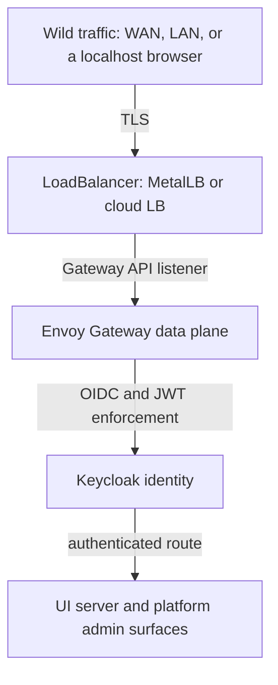
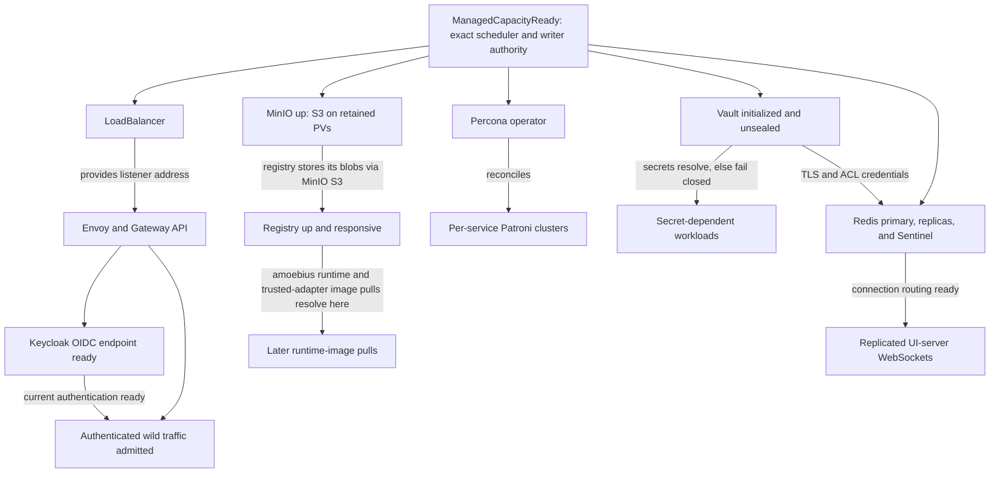

# Platform Services

> **Purpose**: Define the runtime topology of the standard services selected by
> [service_capability_doctrine.md](./service_capability_doctrine.md): HA-always deployment,
> image-from-the-in-cluster-registry, complete resource envelopes, and the single Keycloak-owned
> wild-ingress path.
> **Read this if**: a platform service has to be deployed, replaced, or reasoned about at cluster scale.

This document owns how the selected service set is deployed and the single wild-ingress path in front of it.
It does not own capability-to-provider selection, which belongs to
[service_capability_doctrine.md](./service_capability_doctrine.md), nor the namespaces the services occupy,
owned by [namespace_layout_doctrine.md](./namespace_layout_doctrine.md). Reading it presumes that capability
set.

Link-graph metadata

**Status**: Authoritative source
**Supersedes**: N/A
**Referenced by**: DEVELOPMENT_PLAN/overview.md, DEVELOPMENT_PLAN/phase_33_render_manifest_oracles.md, DEVELOPMENT_PLAN/phase_56_base_image_registry.md, DEVELOPMENT_PLAN/phase_61_vault_pki.md, DEVELOPMENT_PLAN/phase_62_platform_backbone.md, DEVELOPMENT_PLAN/phase_63_platform_services_2.md, DEVELOPMENT_PLAN/phase_64_keycloak_ingress.md, DEVELOPMENT_PLAN/phase_65_live_dsl_deploy.md, DEVELOPMENT_PLAN/phase_66_app_tenancy.md, DEVELOPMENT_PLAN/phase_77_provider_child_bringup.md, DEVELOPMENT_PLAN/phase_81_ui_single_tenant_live.md, DEVELOPMENT_PLAN/phase_84_ui_ha_multizone.md, DEVELOPMENT_PLAN/substrates.md, DEVELOPMENT_PLAN/system_components.md, documents/engineering/README.md, documents/engineering/app_vs_deployment_doctrine.md, documents/engineering/bootstrap_sequence_doctrine.md, documents/engineering/chaos_failover_doctrine.md, documents/engineering/chaos_failover_worked_examples.md, documents/engineering/cluster_lifecycle_doctrine.md, documents/engineering/content_addressing_doctrine.md, documents/engineering/daemon_topology_doctrine.md, documents/engineering/dsl_doctrine.md, documents/engineering/extension_conformance_transactions.md, documents/engineering/gateway_migration_doctrine.md, documents/engineering/host_cluster_comms_doctrine.md, documents/engineering/image_build_doctrine.md, documents/engineering/low_code_ui_runtime_doctrine.md, documents/engineering/manifest_generation_doctrine.md, documents/engineering/monitoring_doctrine.md, documents/engineering/namespace_layout_doctrine.md, documents/engineering/network_fabric_doctrine.md, documents/engineering/pulsar_client_doctrine.md, documents/engineering/pulumi_iac_doctrine.md, documents/engineering/readiness_ordering_doctrine.md, documents/engineering/resource_capacity_doctrine.md, documents/engineering/resource_capacity_folds.md, documents/engineering/resource_capacity_sources.md, documents/engineering/service_capability_doctrine.md, documents/engineering/storage_lifecycle_doctrine.md, documents/engineering/substrate_doctrine.md, documents/engineering/substrate_node_inventory.md, documents/engineering/tenancy_doctrine.md, documents/engineering/ui_realtime_coordination_doctrine.md, documents/engineering/vault_pki_doctrine.md, documents/glossary.md, documents/illegal_state/illegal_state_capacity.md, documents/illegal_state/illegal_state_catalog.md, documents/illegal_state/illegal_state_lifecycle.md, documents/illegal_state/illegal_state_security.md, documents/illegal_state/illegal_state_techniques.md
**Generated sections**: none

> **Historical result (invalidated).** Every pre-reset phase-run and implementation-result statement is
> diagnostic only and never current validation evidence. Target doctrine remains normative; current state is
> owned exclusively by the [tracker](../../DEVELOPMENT_PLAN/README.md).

## Contents
- [1. The Invariant: every cluster is the same cluster](#1-the-invariant-every-cluster-is-the-same-cluster)
- [2. HA always — including `replicas=1`](#2-ha-always--including-replicas1)
- [3. The registry — the single image source](#3-the-registry--the-single-image-source)
- [4. MinIO — the object substrate](#4-minio--the-object-substrate)
- [5. Vault — the secrets root (reference-only)](#5-vault--the-secrets-root-reference-only)
- [6. Pulsar — the event and workflow backbone (new vs prodbox)](#6-pulsar--the-event-and-workflow-backbone-new-vs-prodbox)
- [7. Prometheus / Grafana — observability is not an add-on](#7-prometheus--grafana--observability-is-not-an-add-on)
- [8. Postgres — Patroni-via-Percona, one cluster per consumer, with pgAdmin](#8-postgres--patroni-via-percona-one-cluster-per-consumer-with-pgadmin)
- [9. The LoadBalancer and the single wild-ingress path](#9-the-loadbalancer-and-the-single-wild-ingress-path)
- [10. Every execution unit declares its complete resource envelope](#10-every-execution-unit-declares-its-complete-resource-envelope)
- [11. Bring-up and dependency ordering](#11-bring-up-and-dependency-ordering)
- [12. Substrate equivalence as a structural invariant](#12-substrate-equivalence-as-a-structural-invariant)
- [13. Planning ownership](#13-planning-ownership)
- [Related Documents](#related-documents)

---

## 1. The Invariant: every cluster is the same cluster

An amoebius cluster is **fungible** in its **eight-core capability set**, not necessarily in every manifest.
Tear one down and spin another up — on a different substrate, at a different replica count — and it offers the
**same eight core services/capabilities, wired the same way**. There is no "lite" cluster, no "no-registry"
cluster, and no cluster missing a core capability. Extension-provided capabilities such as `InferenceEngine`
are additional target offerings and are not part of this core-set invariant
([service_capability_doctrine.md §2](./service_capability_doctrine.md#2-the-capability-set)). What may legitimately differ between clusters is the
*deployment shape* of a service (single-node vs distributed) — a deployment-rules concern owned by
[service_capability_doctrine.md](./service_capability_doctrine.md): the *set* is invariant, the *shape* may
vary. This refines the prodbox **substrate-equivalence** rule (`home` vs `AWS`): amoebius keeps "every
cluster stands up the same *set*" while deliberately relaxing "the same *shape*." The structural enforcement
of the set-invariant is [§12](#12-substrate-equivalence-as-a-structural-invariant).

Fungibility is what makes amoebic spawning, ephemeral teardown/rebuild, and geo-replicated
failover expressible. A never-before-seen child cluster is the same machine as the parent; a
cluster destroyed and rebuilt rebinds to the same shape. Fungibility is
the precondition for every cross-cluster move in [cluster_lifecycle_doctrine.md](./cluster_lifecycle_doctrine.md)
and [chaos_failover_doctrine.md](./chaos_failover_doctrine.md).

The standard service set (DEVELOPMENT_PLAN "Standard platform services"):

| Service | Role on every cluster | Deeper mechanics owned by |
|---------|-----------------------|---------------------------|
| **LoadBalancer** (MetalLB *or* cloud LB) | The single L4 entry point to the cluster | [substrate_doctrine.md](./substrate_doctrine.md) (the backend is derived from the materialized engine/provider) |
| **Envoy + Gateway API** | L7 routing and edge TLS termination | [§9](#9-the-loadbalancer-and-the-single-wild-ingress-path); [host_cluster_comms_doctrine.md](./host_cluster_comms_doctrine.md) (the carve-out) |
| **Keycloak** | OIDC identity; **owns all wild ingress** | [§9](#9-the-loadbalancer-and-the-single-wild-ingress-path) |
| **Registry** (Distribution `registry:2`) | The single-binary OCI image registry; **every image is pulled from here** | [service_capability_doctrine.md §3](./service_capability_doctrine.md#3-canonical-providers-extension-is-capability-specific) owns the fixed provider selection; [image_build_doctrine.md](./image_build_doctrine.md) owns byte flow |
| **MinIO** | S3 object substrate: content store, Pulumi backend, app buckets | [storage_lifecycle_doctrine.md](./storage_lifecycle_doctrine.md), [content_addressing_doctrine.md](./content_addressing_doctrine.md), [pulumi_iac_doctrine.md](./pulumi_iac_doctrine.md) |
| **Vault** | Fail-closed secrets root + PKI trust anchor | [vault_pki_doctrine.md](./vault_pki_doctrine.md) |
| **Pulsar** | Native-protocol pub/sub event + workflow backbone (**new vs prodbox**) | [pulsar_client_doctrine.md](./pulsar_client_doctrine.md) |
| **Redis + Sentinel** | Ephemeral UI-session/connection presence, cross-pod WebSocket routing, and rate counters; never durable application truth | [ui_realtime_coordination_doctrine.md](./ui_realtime_coordination_doctrine.md) |
| **Prometheus / Grafana** | Cluster-local metrics + dashboards | (this doc, [§7](#7-prometheus--grafana--observability-is-not-an-add-on)) |
| **Percona/Patroni Postgres + pgAdmin** | Relational store: **one Patroni cluster per consuming service** | [§8](#8-postgres--patroni-via-percona-one-cluster-per-consumer-with-pgadmin); [storage_lifecycle_doctrine.md](./storage_lifecycle_doctrine.md) |

Application logic never names these products directly; it names the **capabilities** they realize. Provider
selection is owned by [service_capability_doctrine.md](./service_capability_doctrine.md). This document is the
SSoT for *how each selected service is deployed at the platform level*. It does **not** restate the provider
binding, the capability abstraction, the storage model, the secrets model, the
image-build pipeline, the manifest-generation engine, or the host-comms carve-out — those are owned by the
linked siblings and only referenced here.

---

## 2. HA always — including `replicas=1`

There is no separate "dev topology." A kind cluster on an admin's laptop at `replicas=1` uses the same typed
HA-capable deployment projection as a production cluster — only the declared replica count changes. The
object kinds, dependency edges, and safety policies exercised at one replica are the ones used at five.

Concretely (DEVELOPMENT_PLAN cross-cutting invariants):

- **Replica count is a deployment-rules knob, not a renderer fork.** The user supplies
  `bootstrap --distro={kind,rke2}`; `kind` accepts `--replicas=n` (default `1`). Python forwards that argv
  unchanged, and only the Haskell command mode interprets it. The typed deployment projection is shared
  across values of `n`. The application-logic-vs-deployment-rules split that makes replicas a separate orthogonal
  surface is owned by [app_vs_deployment_doctrine.md](./app_vs_deployment_doctrine.md).
- **HA-capable projection even at `replicas=1`.** A single-replica deployment is still the same HA-capable object shape with one replica —
  never a hand-special-cased single-pod variant. Postgres at one node is still a Patroni-via-Percona
  cluster ([§8](#8-postgres--patroni-via-percona-one-cluster-per-consumer-with-pgadmin)), not a bare `postgres` Pod.
- **HA-capable shape is not an HA claim.** `replicas=1` has no replica redundancy and must never be reported as
  highly available. The invariant in this section is byte/topology parity across environments; an HA outcome
  additionally requires admitted redundant members in independent failure domains and a live failure test
  observed from outside the service. This distinction applies to every platform provider and to the generic
  UI-server/projector workers.
- **A multi-zone claim requires a whole-zone fault.** Killing one Pod or node demonstrates only member/node
  tolerance even when replicas are spread across zones. The initial UI HA gate must have a provider observer
  confirm that every predeclared serving member and endpoint in one selected zone is unavailable while the
  cookie-empty OIDC login/current-membership check, read/mutation/workflow/subscription, and cross-tenant-denial
  matrix continue through the remaining zones. Pre-fault sessions alone do not establish identity-service
  availability.
- **No degenerate single-node path.** prodbox historically simulated HA by deploying *multiple kind
  clusters*; amoebius replaces that with one HA stack whose replica count is declarative. A sibling demo
  client's "mock 3-replica" pattern becomes a deployment-rules `replicas=n` value outside the checked UI
  program.

> **Validation reset.** Phase 62 and every later platform phase are NOT VALIDATED. The four-drive MinIO,
> three-member ZooKeeper, three-bookie BookKeeper, and two-broker Pulsar topology is the target contract;
> pre-reset run descriptions are diagnostic only and establish neither topology parity nor consensus or
> multi-zone availability. Status and gates live only in
> [../../DEVELOPMENT_PLAN/README.md](../../DEVELOPMENT_PLAN/README.md).

---

## 3. The registry — the single image source

The in-cluster registry runs the **single-binary Distribution `registry:2` OCI registry** selected by
[service_capability_doctrine.md §3](./service_capability_doctrine.md#3-canonical-providers-extension-is-capability-specific).
This document does not admit or select registry providers; it owns only this provider's runtime topology.
Once it is up, **nothing in the cluster pulls from a public registry**: every image is
either baked into the base container or built by amoebius and served from here. The result is reproducibility
(amoebius owns the bytes), air-gap capability, and zero exposure to upstream rate-limits or flakes.

- **No bootstrap chicken-and-egg.** The fixed Distribution `registry:2` image is digest-checked and preloaded
  into the node before bring-up ([image_build_doctrine.md §9](./image_build_doctrine.md#9-bring-up-ordering--the-registry-chicken-and-egg-dissolves)); its binary is not baked into `amoebius-base`, and the service never tries to pull itself.
  Its one runtime dependency is MinIO, which holds the registry's blobs and is itself a preloaded, PV-backed
  service — so the dependency is a plain ordering edge (MinIO before the registry, [§11](#11-bring-up-and-dependency-ordering)), never a pull cycle.
- **The pre-MinIO bootstrap target is finite — NOT VALIDATED.** Phase 56.2 is required to run the registry backend behind a
  read-only service proxy and a sole capability-gated mutation proxy from the side-loaded image. Its temporary
  filesystem blob store is a snapshot-admitted, size-limited `emptyDir`; the exact digest-keyed object,
  concurrent-upload workspace, and failed-upload/GC peak remain charged. Phase 62 migrates those admitted
  bytes to MinIO before ordinary whole-deployment ownership, so the bootstrap store is an explicit bounded
  ordering seam rather than a second storage architecture. Phase 56.3 must publish one architecture-qualified
  child atomically and demonstrate a zero-mutation rerun; Phase 56.4 must pair an exact private pull with a
  public-pull refusal under an enforcing node firewall. Earlier run descriptions and seals are invalid as
  current evidence. The MinIO-backed driver and migration of those admitted bytes are likewise unverified.
- **It needs no relational database, and no PV of its own.** Distribution `registry:2` stores its blobs
  in **MinIO via the S3 storage driver** ([§4](#4-minio--the-object-substrate)) — it holds no PersistentVolume and runs no Postgres/Redis of
  its own, so it takes neither a Patroni cluster under the [§8](#8-postgres--patroni-via-percona-one-cluster-per-consumer-with-pgadmin) rule nor a retained PV under the storage
  model. Registry scanning, a registry web UI, registry-local RBAC, and registry replication are outside the
  admitted service contract and may not imply a second provider.
- **The build side is not owned here.** Baking binaries, one native build per architecture (`amd64`/`arm64`),
  the content-address-derived tag, and host-vs-in-pod builds are owned by
  [image_build_doctrine.md](./image_build_doctrine.md); *which* provider backs the Registry capability is
  owned by [service_capability_doctrine.md](./service_capability_doctrine.md). This doc owns only: *the
  registry is a standard service, and it is the sole pull source on every cluster.*

---

## 4. MinIO — the object substrate

MinIO is the cluster's S3: everything that needs durable bytes that are not a SQL row lands here. It plays
three distinct roles, each owned by a different sibling doc — this doc only records that MinIO is a
standard HA service:

- **Content-addressed artifact store** (pointers → manifests → blobs) — [content_addressing_doctrine.md](./content_addressing_doctrine.md).
- **Pulumi state backend** with Vault-envelope encryption — [pulumi_iac_doctrine.md](./pulumi_iac_doctrine.md).
- **App buckets** named `<app>/<bucket>` — [app_vs_deployment_doctrine.md](./app_vs_deployment_doctrine.md) and the DSL.

Its on-disk durability — retained backing that survives cluster delete/recreate and is exposed again through
a freshly rendered `no-provisioner` PV binding — is owned entirely by
[storage_lifecycle_doctrine.md](./storage_lifecycle_doctrine.md).
MinIO runs HA (distributed). The one path by which something *outside* the cluster reaches MinIO — a host
compute daemon as a MinIO peer over a host-only NodePort — is the carve-out in [§9](#9-the-loadbalancer-and-the-single-wild-ingress-path), owned by
[host_cluster_comms_doctrine.md](./host_cluster_comms_doctrine.md).

---

## 5. Vault — the secrets root (reference-only)

Vault is where secrets *actually live*; Dhall only ever holds a **name** for a secret. Keep this section
thin: [vault_pki_doctrine.md](./vault_pki_doctrine.md) is the SSoT for the Vault model, and this doc must
not duplicate its normative content.

What belongs here, and only here, is the platform-service fact: **Vault is a control-plane daemon HA platform service deployed on every cluster**, on the same footing as the registry, MinIO, Pulsar, and Postgres. The fail-closed
secrets-root behaviour, the root password-encrypted unseal, the parent-injects-secrets-into-child model,
the secret-by-name `SecretRef` contract, and the PKI trust anchor are all owned by
[vault_pki_doctrine.md](./vault_pki_doctrine.md). Its durable PV is owned by
[storage_lifecycle_doctrine.md](./storage_lifecycle_doctrine.md).

---

## 6. Pulsar — the event and workflow backbone (new vs prodbox)

Pulsar carries workflow commands, lifecycle events, and geo-replication streams.
**Flag explicitly: Pulsar is new relative to prodbox** — prodbox had no Pulsar — so
everything here is forward design, not inherited-proven behaviour.

- **Native TCP binary protocol, no Pulsar WebSocket proxy.** The internal client is `amoebius-pulsar`, forked from
  `cr-org/supernova`, owned by [pulsar_client_doctrine.md](./pulsar_client_doctrine.md). The
  rule is scoped to Pulsar access: lookup / produce / consume / subscribe / seek all ride the native protocol.
  Browser-facing WebSockets terminate at replicated UI servers and are governed separately by
  [UI Realtime Coordination](./ui_realtime_coordination_doctrine.md).
- **Topic lifecycles are declarative.** An app spec declares its topic lifecycles; the topology algebra
  and the at-least-once + dedup semantics are owned by the client doc and the DSL doc.
- **Pulsar does its own intra-cluster consensus.** amoebius therefore *delegates* the synchronous HA
  correctness obligation to Pulsar's brokers/bookies rather than re-proving it — the only proof obligation
  that concentrates on amoebius is the asynchronous cross-cluster boundary (the "Second Axis" in
  [chaos_failover_doctrine.md](./chaos_failover_doctrine.md)).
- **The metadata store is explicit, not broker overhead.** The canonical v1 provider is
  Pulsar + ZooKeeper + BookKeeper. Its pure `PulsarMetadataStoreDemand = ZooKeeper` carries exact
  persistent/session-ephemeral znode identities, transaction/session/watch bounds, every member's complete
  pod envelope and retained volume, log/snapshot retention, and failure recovery bound. The pinned model
  derives per-member steady/recovery bytes and must provision before brokers start. A topology whose
  brokers/bookies/offload fit but ZooKeeper CPU, memory, ephemeral storage, pod/CSI slots, or one retained
  backing does not is undeployable; BookKeeper or MinIO storage cannot be silently reused.
- **Host compute daemons join as Pulsar peers** over host-only NodePorts (no mTLS) — [§9](#9-the-loadbalancer-and-the-single-wild-ingress-path) and
  [host_cluster_comms_doctrine.md](./host_cluster_comms_doctrine.md).

### 6.1 Redis and Sentinel — ephemeral UI realtime coordination

Redis is a standard platform-internal service because any UI-server pod must be able to route a typed event to
a WebSocket owned by another pod. It is not a ninth core application capability: `UiSource` cannot request,
name, address, or select Redis, and a trusted handler cannot use it as application storage. The complete data
classes, key/TTL/buffer bounds, one-primary/two-replica/three-Sentinel topology, TLS/Vault ACL boundary,
no-persistence rule, cursor repair, and failure semantics are owned by
[UI Realtime Coordination](./ui_realtime_coordination_doctrine.md).

The service runs from the Phase-56 monocontainer/base image. It has no PVC, AOF, RDB snapshot, backup, or
cross-cluster replication. Losing it may close sockets and discard presence/cache/fanout hints; it must not
discard a durable receipt or change whether a provider effect occurred. The single-node deployment preserves
the same role/configuration projection while making no HA claim.

---

## 7. Prometheus / Grafana — observability is not an add-on

Every cluster ships its own metrics and dashboards; observability is part of the standard set, not an
optional bolt-on. Prometheus scrapes platform and app workloads; Grafana is reachable **only** through the
Keycloak-owned edge like every other browser surface ([§9](#9-the-loadbalancer-and-the-single-wild-ingress-path)), never via a private side-door. If Grafana is
configured against a SQL backend, that database follows the per-service Patroni rule in [§8](#8-postgres--patroni-via-percona-one-cluster-per-consumer-with-pgadmin).

The metrics cover everything deployed, not only the workflow surface. Each workflow's mandatory SLO, each
topic's liveness, each extension's declared surfaces (jitML's `TensorBoard`, backed by MinIO), **and every bound execution unit's mandatory monitor** derive Prometheus recording/alert rules and Grafana dashboards —
derived, never hand-authored. A platform service is therefore no more exempt from its monitor than it is from
its `ResourceEnvelope` ([§10](#10-every-execution-unit-declares-its-complete-resource-envelope)); the
capability's own units carry `DerivedForCapability` monitors the binder mints and an operator cannot
hand-write. The single Grafana instance, the derived surfaces, and any extension surface reach the browser
only through the Keycloak edge under a mandatory `AccessScope` with no `Public` arm (admin-global, subject-
scoped, or tenant-role-scoped). The **alert receiver** that groups, deduplicates, and silences the firing set
is part of this capability — one more baked binary beside Prometheus and Grafana, behind the same Keycloak
edge, with no representable outbound delivery target; carrying a page beyond the cluster edge is an
operator-owned out-of-band integration. An optional local
Thanos companion beside the single Prometheus is the long-term/downsample store — a strictly cluster-local
role, never a cross-cluster Query/Store/Receive. The pull/scrape posture ("nothing is pushed outward") is the
scrape-wire stance, not a bar on the intra-forest async geo-replication a peer cluster already consumes. The
obligation types, the derived surfaces, the access model, the receiver's delivery boundary, the Thanos role,
and the parent-monitoring posture are owned by [monitoring_doctrine.md](./monitoring_doctrine.md).

---

## 8. Postgres — Patroni-via-Percona, one cluster per consumer, with pgAdmin

**Postgres has two roles, and this section owns exactly one of them.** In the first, Postgres is a
*provisioned backend* for a platform service — Keycloak's realms and users are the standard case. amoebius
sizes it, backs it up, monitors it, and tears it down, and issues no statement against it: its schema belongs to
its consumer, and amoebius reading or writing it would be a second owner of one state. That role is what this
section governs. In the second, Postgres is the **typed data plane** holding an application's own tenanted
rows, where amoebius emits every statement, the schema, and the row policy from its own types; that role is
governed by [`extension_conformance_transactions.md`](./extension_conformance_transactions.md) and none of the
provisioning shape below implies a general query surface for it.

amoebius **never** runs a "just one Postgres Pod." Every relational database is a Patroni cluster managed
by the Percona operator, and **each consuming service gets its own cluster**, never a shared
mega-database, each paired with **its own pgAdmin**.

Why separate-per-service: blast-radius isolation (one service's DB incident can't take down another's),
independent version and lifecycle, and clean per-namespace teardown.

- **The Percona operator is itself a platform component**, drawn from the shared inventory ([§12](#12-substrate-equivalence-as-a-structural-invariant)) so it
  installs identically on every substrate. A service needing SQL renders a `PerconaPGCluster` in its own
  namespace; the cluster-wide operator reconciles it. This generalizes the prodbox Patroni dependency
  contract, where Keycloak is the sibling-system example, without retaining its Helm-specific implementation.
- **HA always applies here too ([§2](#2-ha-always--including-replicas1)).** At its configured steady state a Patroni cluster runs multiple
  replicas; at `replicas=1` it is still a Patroni cluster, never a bare Pod. This doc deliberately fixes
  **no specific replica count** — the count is a deployment-rules value, not a doctrine constant.
- **Synchronous replication is a required, typed configuration — not Patroni's default.** Patroni defaults to
  *asynchronous* replication: `synchronous_mode` is opt-in, and a non-strict synchronous cluster silently
  degrades to async whenever no synchronous standby is available. amoebius therefore fixes the Patroni
  configuration as a platform-service invariant, not a per-service option:
  - `synchronous_mode: on` — the primary acknowledges a commit only after a synchronous standby has confirmed it;
  - `synchronous_mode_strict: on` — the *decided* strict stance: when no synchronous standby is available the
    primary **refuses new writes** rather than accepting commits it cannot synchronously replicate. The
    non-strict alternative (degrade to async, stay writable) is explicitly rejected, because it trades the
    durability guarantee for availability without signalling the loss;
  - `maximum_lag_on_failover` set low (bytes-bounded) — a replica lagging past the bound is ineligible for
    promotion, so a failover cannot elect a stale primary.

  This configuration is the premise on which the RPO=0 / "effectively lossless" delegation and the
  `PlannedIsLossless` obligation in [chaos_failover_doctrine.md §6](./chaos_failover_doctrine.md#6-the-concentration-principle--where-the-obligation-lives)
  rest: that doctrine delegates the intra-cluster synchronous-HA correctness to Percona/Patroni rather than
  re-proving it, and the delegation holds **only** with these settings. Absent them an intra-cluster failover
  can promote a replica missing acknowledged commits and thereby lose them — so this is stated as a required
  configuration, not an assumed default.
- **Canonical consumers.** The Phase-63 target fixes the amoebius database-consumer set to exactly `{Grafana}`;
  its Patroni cluster, pgAdmin surface, and Grafana migrations are NOT VALIDATED. Keycloak is the planned
  Phase-64 consumer. Other standard services that later need a
  relational database each get their own Patroni cluster + pgAdmin. The Registry has no Patroni consumer
  because Distribution `registry:2` needs no database ([§3](#3-the-registry--the-single-image-source)). The
  authoritative list is tracked in [../../DEVELOPMENT_PLAN/README.md](../../DEVELOPMENT_PLAN/README.md); this
  doctrine fixes the target floor without preventing later typed additions.
- **Storage is not owned here.** Retained PVs, the `<namespace>/<statefulset>/pv_<integer>` naming, sizing,
  and deterministic rebind are owned by [storage_lifecycle_doctrine.md](./storage_lifecycle_doctrine.md).
- **Capacity remains per consumer.** Binding constructs one `PatroniSqlDemand` for each consuming capability:
  the operator/controller and validating-webhook child envelopes, finite data/WAL/checkpoint/failover-replay
  inputs, required `StorageBudgetId`, declared volume presentation/backing, bounded SQL writer admission and
  its proxy envelope, and rollout/recovery overlap. Only the private
  `ProvisionedPatroniSql` renders the CR and quota boundary. Adding Keycloak or an app therefore adds a real
  database compute/storage demand; it cannot reuse Grafana's or another consumer's capacity witness.

### Tenant policy persistence is one provider-indexed transaction

Tenant RBAC persistence is one provider-indexed whole-deployment transaction, derived from
`deriveTenantPolicies :: TenantSpec -> TenantPolicyDerivation` and owned end-to-end by
[tenancy_doctrine.md §5](./tenancy_doctrine.md#5-rbac-is-derived-never-authored); this doc does not restate its
mechanics. The platform-services fact recorded here is only *where each provider's tenant-policy state lands* —
each of the six arms persists onto that provider's own standard platform backing:

- **Keycloak** and **Postgres** each persist onto their own per-consumer Patroni cluster
  ([§8](#8-postgres--patroni-via-percona-one-cluster-per-consumer-with-pgadmin)), and remain **distinct provider/persistence arms even though both are Patroni-backed** — one more instance of the
  one-cluster-per-consumer rule.
- **Vault** persists onto its Raft store (versions, logs, snapshots) ([§5](#5-vault--the-secrets-root-reference-only)).
- **Pulsar** persists onto its explicit ZooKeeper metadata store ([§6](#6-pulsar--the-event-and-workflow-backbone-new-vs-prodbox)).
- **MinIO** persists as object-store metadata under its budget/geometry/model — storage-system metadata, not an
  application object and not another arm of `ObjectStoreProducerDemand`.
- **Kubernetes API** persists as serialized API objects with their etcd revisions and Events.

The canonical demand shapes are owned by
[resource_capacity_storage.md §5.1](./resource_capacity_storage.md#51-durable-demand-is-logical-first-physical-only-after-geometry);
the tenant-qualification, empty/diff planner, executor coalescing, target-change retention, MinIO physical fold,
and sealed provider enactors are owned by [tenancy_doctrine.md §5](./tenancy_doctrine.md#5-rbac-is-derived-never-authored).

Phase 66 must eventually validate provider administrative apply/readback for all six arms with separated live
observers over equal-shaped tenants. Its Pulsar scope is tenant/namespace/ACL policy, not an application
client. Phase 67 separately owns the authenticated native-client produce/consume contract. Both phases are
**NOT VALIDATED**, and administrative convergence can never substitute for data-path evidence.

---

## 9. The LoadBalancer and the single wild-ingress path

The Keycloak-owned identity edge is the **single sanctioned ingress point** for all external traffic. All wild traffic —
WAN, LAN, and even a localhost *browser* connection — enters through the LoadBalancer, is routed by Envoy
through the Gateway API, and is authenticated by Keycloak before it reaches any workload. No app publishes
its own ingress; no generated object set opens a backdoor NodePort to the wild. Keycloak owning all wild ingress is
the only sanctioned ingress shape, and the DSL makes the alternatives unrepresentable
(see [dsl_doctrine.md](./dsl_doctrine.md) and [illegal_state_catalog.md](../illegal_state/illegal_state_catalog.md)).

- **The LoadBalancer backend follows the materialized target.** Self-managed `Kind`/`Rke2` use MetalLB;
  `Managed Eks` uses its provider integration. [substrate_doctrine.md](./substrate_doctrine.md) owns that
  derived mapping; everything above it is target-invariant.
- **Envoy + Gateway API** terminate TLS and route. TLS certificate provisioning (zerossl) and DNS
  (route53) integration are owned by [pulumi_iac_doctrine.md](./pulumi_iac_doctrine.md) and the DSL.

### The UI server is the application reference monitor

Successful edge authentication is necessary but not sufficient authorization. Envoy strips caller-supplied
identity, tenant, role, and subject headers before inserting authenticated metadata. The low-code UI server then
validates the issuer/audience/session binding, constructs the opaque current tenant/subject context, and
reauthorizes every typed port invocation. A hidden client control, a forwarded header, or possession of an
opaque action identifier confers no authority.

Browser traffic is same-origin to the UI server. The browser has no direct route or credential for SQL, MinIO,
Pulsar, Vault, Keycloak administration, workflow workers, or an inference engine. The derived NetworkPolicy
admits Gateway→UI-server ingress and only the UI-server/projector capability edges present in the sealed server
plan. Direct Service/Pod probes remain mandatory negatives in the live gate; edge success cannot mask a
backdoor. The complete client/server contract is owned by
[low_code_ui_runtime_doctrine.md §13](./low_code_ui_runtime_doctrine.md#13-generic-purescript-client-and-amoebius-ui-server).

### The sole exception: host-origin, localhost-only traffic

There is exactly one carve-out from "Keycloak owns all wild ingress," and it is **not** wild — it is
host-origin and strictly localhost:

1. The **host amoebius binary** talks to `kube-apiserver` directly over the distro's default mTLS.
2. **Host compute daemons** (e.g. an Apple-Metal inference engine that needs unified memory and cannot run
   in a container) reach in-cluster MinIO and Pulsar as **peers over host-only NodePorts with no mTLS** —
   localhost only, with **no WAN or LAN access**.

This carve-out is owned in full by [host_cluster_comms_doctrine.md](./host_cluster_comms_doctrine.md); it
is recorded here only so the "Keycloak owns everything" rule names its one exception. The no-mTLS NodePort
is acceptable *precisely because* it is unreachable off the host.

```mermaid
flowchart TD
%% register: orientation
  wild["Wild traffic: WAN, LAN, or a localhost browser"] -->|"TLS"| lb["LoadBalancer: MetalLB or cloud LB"]
  lb -->|"Gateway API listener"| envoy["Envoy Gateway data plane"]
  envoy -->|"OIDC and JWT enforcement"| kc["Keycloak identity"]
  kc -->|"authenticated route"| app["UI server and platform admin surfaces"]
```
*Orientation. Design intent. The single path every request originating outside the host takes, with no bypass arm. Host-origin traffic uses none of these hops and is owned by [host_cluster_comms_doctrine.md §1](./host_cluster_comms_doctrine.md#1-the-host-origin-surface-two-channels-both-localhost-only); whether a live cluster admits no other route is runtime-checked.*

### East-west connectivity is derived from the dependency graph

Service-to-service (east-west) connectivity is **derived from the declared dependency graph**, never
hand-authored. An app declares which services it consumes; amoebius generates the NetworkPolicies so that
exactly those edges are allowed and every other is denied. A service that does not declare consuming `B`
cannot reach `B`. Consequently a blocking NetworkPolicy that severs a declared dependency, and an open
policy that exposes an undeclared one, are both **unrepresentable**. This subsection is the SSoT for the
connectivity rule that [illegal_state_catalog.md §3.6](../illegal_state/illegal_state_security.md#36-blocking-networkpolicy-services-cant-reach-each-other) turns into a
compile-time impossibility.

### Tolerations are derived from node taints, never hand-authored

Placement scheduling is **derived**, exactly like east-west connectivity, and for the same reason: a
free-text toleration is how a pod ends up unschedulable (it tolerates a taint no node carries, or fails to
tolerate the taint it must). So amoebius does not let an operator *write* a toleration at all. A workload's
tolerations are **generated** from the declared node taints — the closed `NodeTaintKind` set and per-node
taints owned by the node inventory ([substrate_doctrine.md §8](./substrate_doctrine.md#8-the-node-inventory-the-single-owner-of-hosts-capacity-and-taints))
— so a `Toleration` handle exists only once its taint edge does. Consequently post-bind provisioning rejects a workload
unless **there exists** a node satisfying its affinity **and** tolerating all its taints: a schedulability
*existence fold* over the single node inventory, never a `Pending` pod. This subsection is the SSoT for the
derivation rule that [illegal_state_catalog.md §3.5](../illegal_state/illegal_state_capacity.md#35-undeployable-pods-taints-tolerations--affinity) / [§3.22](../illegal_state/illegal_state_capacity.md#322-a-hand-authored-un-derived-toleration) turns into a
compile/provision boundary (type-foreclosed for the derived-toleration shape; checked at `provision-seal` for
the target-relative existence fold).

`ManagedCapacity` is the authority-bearing member of that closed taint set. Its toleration is an inseparable
projection with `schedulerName = amoebius-capacity`: no constructor can render the toleration while leaving the
Pod on `default-scheduler`. The only exception is the capacity scheduler's own bootstrap Pod, which is
structurally separate, uniquely node-affined, statically debited, and isolated in
`amoebius-capacity-scheduler` under exact `ResourceQuota pods=1`. Existing distro/bootstrap add-ons are allowed
to use `default-scheduler` only before cutover and while the managed taint is absent. They are then patched to
the custom scheduler and their old UIDs are observed absent/released and replacements reservation-joined
before full managed-node authority can become Ready. A hand-authored toleration, a managed-capacity Pod with
another scheduler, or a second default-scheduler exception is rejected before Pod creation.

---

## 10. Every execution unit declares its complete resource envelope

No pod is exempt — including init containers, controllers, operator installs, admission gateways/webhooks,
copy/schema/Pulumi/ACME Jobs, and platform services — and
neither is any host-level worker. Every execution unit carries the pure `ResourceEnvelope` owned by
[resource_capacity_doctrine.md §3](./resource_capacity_doctrine.md#3-the-types-quantity-capacity-demand-budget);
the Kubernetes resource map is derived from that value after the whole deployment has passed `provision`.

The same exemption-free rule governs observability: every execution unit carries a mandatory `UnitMonitor`
beside its envelope, owned by
[monitoring_doctrine.md §2.4](./monitoring_doctrine.md#24-per-execution-unit-obligation--boundexecutionunitmonitor).
The two obligations are deliberately parallel — a unit that cannot state what it costs and a unit that cannot
state how it is observed are the same class of defect — and neither admits an exempt arm.

For every rendered container:

- CPU, memory, and `ephemeral-storage` **requests and limits** are explicit refined non-zero quantities with
  `requests ≤ limits`.
- Disk-backed pod-local cache/scratch is a bounded ephemeral volume. Every container's private writable-layer
  and log allowances fit that container's own ephemeral request/limit; shared disk-volume bounds plus the
  lifecycle-effective private allowance fit the effective pod request/limit. A memory-backed `emptyDir` instead
  names access modes and stage-local/pod-lifetime persistence. The lifecycle fold assigns one request carrier
  per resident volume/concurrency epoch and proves unique resident volumes + live working sets fit the
  effective pod request/limit; possible charged accessors' limits cover writable volumes. The effective pod
  memory/ephemeral envelope is charged once, never with a second volume debit. For the
  per-node in-cluster cache owner,
  `ProvisionedCacheDemand.derivedPeak ≤ CacheBudget ≤ emptyDir.sizeLimit` and
  `Σ disk-backed volume sizeLimits + lifecycle-effective private allowances ≤
  effectivePod.ephemeralStorage.request ≤ effectivePod.ephemeralStorage.limit`; these are nested proofs on one
  debit, not separate cache and ephemeral consumers.
- ConfigMap, Secret, downward-API, projected, and service-account-token mounts are not free files. Binding
  derives their `KubeletMappedFileDemand` from the same serialized API-object source, applies the pinned
  AtomicWriter old+new/symlink/metadata model, and routes that mapped-file component to kubelet-nodefs
  ephemeral storage or memory.
  Each `PodRuntimeMetadataSource` additionally preserves exact network-attachment and container/volume-mount
  identities without accepting authored bytes. After kind-indexed Deployment/StatefulSet/DaemonSet/Job or
  host-process expansion, provisioning derives one planned-slot metadata demand per
  `MaterializedExecutionInstance`, while live validation derives a separate Pod-UID-indexed observed demand.
  Sandbox/pod-directory/CNI/volume/mount components use `KubeletNodefs`; CRI runtime components use
  `CriRuntimeRoot`. The selected `Unified | SplitRuntime | SplitImage` resolver maps those roles to physical
  backing ids, groups aliased components once, combines them with the node image model under a disjoint
  ownership witness, and fits the largest simultaneous node aggregate. It never routes one combined metadata
  scalar blindly to nodefs. Each live pod also
  consumes one pod/CNI slot and one driver-scoped attach slot per unique mounted CSI PVC.
- Every container image is content-digested and carries per-OS/arch index/manifest/config/compressed-layer
  stored bytes, snapshot chain/unpacked bytes, and bounded import workspace. After placement, content objects
  and snapshots are deduplicated in their respective identity domains, the enforced pull policy determines
  workspace peak, and the closed kubelet layout routes the selected-platform peak with writable/log/volume
  bytes to each real nodefs/imagefs backing; image bytes are not disguised as a second pod request.
- Durable bytes are not hidden in the container envelope: every persistent claim is a separate, explicit
  `DeclaredVolumeDemand` whose geometry, presentation, and backing allocation derive a private hard cap.
- Accelerator access is never an ambient device mount. A model/job capability can declare an
  appropriate pod/host accelerator demand, but provisioning routes it through exactly one typed per-node
  accelerator owner; ordinary workload pods cannot author a device claim. Each `CudaOwnerDemand` or
  `MetalOwnerDemand` has an exact source inventory and equal-keyed workload map, exact class domains in both
  coexistence bounds, structural residency placement/shards, and no authored owner-total or favorable epoch.
  Provisioning derives every permitted coexistence epoch and, for CUDA, aggregates all co-resident residency
  components per device against net allocatable VRAM. On `linux-cuda`, only the demand's
  exactly-once named owner container receives the equal integer extended-resource request/limit, while its pod
  receives required accelerator-profile affinity; only that private claim/affinity projection renders.

The pure provisioner derives the effective pod request/ceiling from every app/sidecar/ordinary-init/
restartable-init-sidecar container and pod overhead using the pinned Kubernetes scheduling semantics. It then
proves both request placement and the finite-limit/physical-peak fit for memory, ephemeral storage, cache,
durable storage, accelerator devices, and every derived residency/coexistence epoch, charging an in-cluster cache once through its owner's
ephemeral limit. The ephemeral limit is a kubelet measurement/eviction boundary, not a synchronous quota;
the cache owner's private admission guard and the layout-routed backing enforce the hard
materialization/physical bounds. A
manifest cannot introduce a resource field that was absent from that proof, and it cannot omit one the proof
carried.

**Host-level worker subprocesses declare the corresponding host envelope.** An Apple-Metal or Windows-CUDA
native worker is not a pod, but it still declares CPU, memory, scratch/cache storage, accelerator family/device
ownership, and an identity-complete `CudaOwnerDemand` or `MetalOwnerDemand`. CUDA epochs debit discrete
per-device net VRAM; Metal epochs debit unified host memory. That envelope is the operand the host → host-worker fold consumes
alongside the co-resident WSL2/Lima VM carve against physical-host capacity. Its enforcement witness is
substrate-indexed: Linux cgroup v2, Windows Job Object, or a finite Apple supervisor policy. The Apple arm is
reactive sampling plus termination and is never described as an instantaneous hard CPU/RSS quota; a workload
that requires stronger enforcement than its selected host can supply returns `UnsupportedEnforcement`.

This doc owns only the **per-execution-unit declarations** — the atoms. The whole-deployment derivation,
placement/capability witness, disjoint storage-pool arithmetic, and opaque `ProvisionedSpec` boundary are owned
by [resource_capacity_doctrine.md](./resource_capacity_doctrine.md). There is no second capacity fold here.

---

## 11. Bring-up and dependency ordering

The services cannot all come up at once; a few **hard edges** constrain the order. This doc owns only those
platform-service ordering edges — full cluster lifecycle, teardown ordering, and amoebic spawn are owned by
[cluster_lifecycle_doctrine.md](./cluster_lifecycle_doctrine.md). These edges are the **derived readiness DAG**
of [readiness_ordering_doctrine.md](./readiness_ordering_doctrine.md): each is a *condition* (the dependency is observed ready), never an elapsed duration, and the order is derived from the declared dependency graph — not a
prose sequence an installer is trusted to honour. The catalog turns a duration-gated or hand-ordered bring-up
into a foreclosed illegal state at
[illegal_state_catalog.md §3.41](../illegal_state/illegal_state_lifecycle.md#341-a-duration-gated--hand-ordered-bring-up-sequence-a-readiness-race).

- **`ManagedCapacityReady` before every general/reconciler-owned platform-service Pod** — bootstrap first observes
  `BootstrapCapacitySchedulerReady` for the exact scheduler generation/config/root while the managed taint is
  still absent. Its restricted cutover capability patches every pre-existing bootstrap add-on to
  `amoebius-capacity` and waits for old UID absence/release plus replacement reservation joins. Only then are
  the managed-node taint, identity admission, and exclusive Binding RBAC installed and independently read back
  as `ManagedCapacityReady`. No platform-service controller is applied from the general plan before that full
  witness exists. The finite pre-SSA Phase-56 registry/proxy units are bootstrap inputs, not an exception for
  new workloads: they must be included in the cutover domain and become custom-scheduled before this witness.
- **LoadBalancer before the Envoy/Gateway edge** — the Gateway needs an LB address to publish a listener.
- **MinIO before the registry** — Distribution `registry:2` stores its blobs via MinIO's S3 API
  ([§3](#3-the-registry--the-single-image-source), [§4](#4-minio--the-object-substrate)), so MinIO must be serving before the registry is ready. MinIO runs from
  the preloaded base image on retained PVs, so this is a plain ordering edge, not a pull cycle.
- **The registry before later runtime-image pulls** — once MinIO backs it, the registry must be serving before
  amoebius publishes or pulls the generic `Runtime` and trusted-adapter variants
  ([§3](#3-the-registry--the-single-image-source)). Checked UI programs follow the immutable content/release
  path rather than minting per-app images. Platform services other than the Registry do not wait on it: their
  binaries run from the preloaded base image. The Registry itself runs only from the separately pinned and
  preloaded Distribution `registry:2` image and becomes ready after MinIO
  ([image_build_doctrine.md §9](./image_build_doctrine.md#9-bring-up-ordering--the-registry-chicken-and-egg-dissolves)).
- **The Percona operator before any Postgres consumer** — a `PerconaPGCluster` has nothing to reconcile it
  otherwise ([§8](#8-postgres--patroni-via-percona-one-cluster-per-consumer-with-pgadmin)).
- **Vault before Redis credentials; Redis/Sentinel readiness before a UI-server accepts WebSockets** — Vault
  supplies TLS/ACL material, and the server must be able to register/route its connection before advertising
  realtime readiness. HTTPS health and immutable assets do not turn a disconnected WebSocket route into a
  ready interactive backend.
- **Vault initialized and unsealed before secret-dependent startup** — a sealed Vault fails secret-dependent
  Pod startup *closed*, with no plaintext fallback ([vault_pki_doctrine.md](./vault_pki_doctrine.md)).
- **Keycloak before the authenticated edge admits wild traffic** — there is no un-authenticated wild path
  to fall back to ([§9](#9-the-loadbalancer-and-the-single-wild-ingress-path)).

```mermaid
flowchart TD
%% register: orientation
  scheduler[ManagedCapacityReady: exact scheduler and writer authority] --> lb[LoadBalancer]
  scheduler --> minio[MinIO up: S3 on retained PVs]
  scheduler --> operator[Percona operator]
  scheduler --> vault[Vault initialized and unsealed]
  scheduler --> redis[Redis primary, replicas, and Sentinel]
  lb -->|provides listener address| edge[Envoy and Gateway API]
  minio -->|registry stores its blobs via MinIO S3| reg[Registry up and responsive]
  reg -->|amoebius runtime and trusted-adapter image pulls resolve here| apppulls[Later runtime-image pulls]
  operator -->|reconciles| pg[Per-service Patroni clusters]
  vault -->|secrets resolve, else fail closed| secretdeps[Secret-dependent workloads]
  vault -->|TLS and ACL credentials| redis
  redis -->|connection routing ready| uiserver[Replicated UI-server WebSockets]
  edge --> keycloak[Keycloak OIDC endpoint ready]
  edge --> admitted[Authenticated wild traffic admitted]
  keycloak -->|current authentication ready| admitted
```
*Orientation. Design intent. The bring-up order every cluster follows, derived from declared dependencies rather than hand-sequenced; the readiness discipline its edges obey is owned by [readiness_ordering_doctrine.md §3](./readiness_ordering_doctrine.md#3-readiness-is-a-condition-never-a-duration).*

---

## 12. Substrate equivalence as a structural invariant

"Same service set on every cluster" is **enforced structurally**, not maintained by parallel hand-edited
installers. This generalizes the prodbox substrate-equivalence mechanism from two substrates to all of them,
while replacing its Helm-specific realization with typed object generation. The three mechanisms are:

1. **One release/version value per platform-component image, shared across substrates.** A platform
   component (Envoy control plane, Envoy data plane, the operators, the registries) is pinned to exactly
   one release value used by every substrate. There is no per-substrate version. This kills
   control-plane-vs-data-plane version skew at the root: one value pins the component image, control plane, and
   data plane together.
2. **A check forbids substrate-keyed re-pinning.** No code path may re-pin a component version or image ref
   conditionally on the active substrate. Divergence is a build-time error, never a silent drift — "the
   managed target needs a different Envoy" cannot be expressed.
3. **One platform-component inventory drives every target's installer.** A coverage check asserts that
   no target silently drops a component another installs. Each engine/provider path keeps its own *ordering* ([§11](#11-bring-up-and-dependency-ordering)),
   but never a different *set*. A managed target is **not** a "no-registry" cluster — when it appears to miss
   a component present locally, extend the shared inventory and that target's installer rather than rendering a different service set. **This equivalence
   governs the service *set* and *image refs*, not the deployment *shape*: a service may legitimately take a
   different shape per cluster (single-node vs distributed), owned by
   [service_capability_doctrine.md §6](./service_capability_doctrine.md#6-fungibility-reconciled-app-surface-invariant-shape-deployment-ruled), and that is not a violation of this
   rule.**
4. **The architecture and the accelerator lane index the base image's parent, and nothing else.** Mechanism 2
   forbids re-pinning a component version or image ref on the active substrate, and that prohibition stands:
   "the managed target needs a different Envoy" remains inexpressible. What this clause admits is narrower by
   construction rather than by promise. The bake catalog is **one tracked Haskell value**, and each image is a
   *projection* of it — the same steps, the same pinned package versions, the same release values, read once
   per architecture and lane. A per-target component version is therefore not something a reviewer must
   refrain from writing; it is something the projection has no field for. The only values indexed are the
   parent image and the architecture-qualified tag, drawn from closed sets and selected by detected hardware,
   never selected by an external/untracked cluster `.dhall` value.

   **This governs authored values, not layer bytes.** Installing a pinned package version against two parents
   yields the same version and a different dependency closure, so the two images' layer digests differ and are
   *expected* to. A reader who expects digest equality across architectures has read this clause as a claim it
   does not make. What the structural check asserts is that every projection carries the same component set
   and the same release values, because they are the same catalog rows.

The substrate *catalog* itself (apple / linux-cpu / linux-cuda / windows), virtualized substrates, the
engine/provider-derived LB mapping, and the no-env/no-PATH lazy-tool-ensure contract are owned by
[substrate_doctrine.md](./substrate_doctrine.md). Note the no-environment-variables / no-`PATH` rule: all
host tooling that brings these services up is discovered lazily through the substrate's package manager and
invoked by full path — there is no `PATH`-based discovery anywhere in the bring-up sequence.

> **Validation reset.** Where this section generalizes sibling behaviour, that remains sibling evidence only.
> Phases 56, 61, 62, 63, 64, and 77 are all NOT VALIDATED. The subsections below preserve pre-reset
> observations solely as diagnostic context; none is a current pass, seal, proof, tested result, or promotion
> input. Only a rewritten phase contract and delegated promotion can establish current status.

---

### Phase-61 Vault readiness diagnostic — invalidated

An earlier run reported a secret consumer staying blocked
while Vault was sealed, then authenticated through `auth/kubernetes/login` and read the exact canary only after
unseal, plus cluster delete/recreate retaining Vault state and the PKI root without re-initialization. That
observation is not current Phase-61 evidence. The remaining service-DAG edges are owned by their later phases.

### Phase-62 backbone diagnostic — invalidated

An earlier run reported observations of MetalLB, distributed MinIO, the registry's MinIO S3 rehome, and Pulsar's
ZooKeeper/BookKeeper/broker topology. External observations covered a stable reachable VIP, MinIO byte
identity, registry source stability and target objects, native Pulsar CBOR/dedup traffic, size-triggered
offload, and a hot tier below its committed cap. Fifty-three SSA-owned object projections and eleven freshly
rendered Haskell execution-unit projections were byte-identical to the live fields they own; every runtime
image ID resolving to the then-recorded Phase-56 digest and no public pull being observed. These are invalidated
diagnostics, not current `linux-cpu` evidence or proof of third-party consensus or multi-zone HA.

### Phase-63 service-set diagnostic — invalidated

An earlier run reported the database-consumer set `{Grafana}` with a three-member Patroni cluster carrying
`synchronous_mode: on`, `synchronous_mode_strict: on`, and a bytes-bounded
`maximum_lag_on_failover`; pgAdmin became Ready and Grafana completed hundreds of migrations through that
Postgres service. The Percona 2.6 operator observed the `PerconaPGCluster`, while the receipt honestly records
the exact Patroni StatefulSet as an amoebius-owned manual child projection rather than attributing it to the
operator. Prometheus ran from a descriptor-derived retained-storage and query budget, direct access was
denied by NetworkPolicy, its proxy accepted an in-bound query and rejected the one-over series bound, and
Grafana used Postgres. Redis ran one primary, two replicas, and three mutually authenticated Sentinel voters;
a Vault-issued TLS/ACL client observed replication, forced promotion, and retained the TTL-bound challenge,
with no PVC/AOF/RDB/backup. The old report also named 256 deterministic partial-failure schedules, eleven
Haskell projections, fifty SSA projections, eight red mutants, and a 14-service warm apiserver readiness
trace. These are invalidated diagnostics, not current linux-cpu evidence or proofs of third-party consensus. Hardware selection never
removes the `linux-cpu` fallback. When the run needs a clean guest instead of the existing host, launch it
through Incus for Linux or Linux-CUDA hardware, Lima for Apple hardware, and WSL2 for Windows hardware.

### Phase-64 authenticated-edge diagnostic — invalidated

An earlier run reported one amoebius wild-edge topology with exactly one LoadBalancer:
`edge-system/envoy` at the MetalLB VIP. The typed Gateway/HTTPRoute inventory covered Grafana, Keycloak,
Vault, MinIO, the platform API, and the authenticated WebSocket probe. Host, WAN-Pod, LAN-Pod, and
localhost-port-forward observers all completed positive OIDC requests; the paired unauthenticated requests
were refused or stayed inside Keycloak's own login boundary. The real Envoy Gateway v1.4.2 provider,
Gateway-API, and xDS runners were observed Ready. The receipt explicitly records that its GatewayClass uses
the amoebius manual-projection controller and that the two-replica baked Envoy Deployment is the typed static
data-plane projection; it does not attribute that child to Envoy Gateway.

Keycloak uses its own retained three-member Patroni cluster in `keycloak-db`, separate from Grafana's cluster,
with strict synchronous mode and the bounded failover-lag oracle. The Percona operator observed the Keycloak
CR while the exact child is recorded as an amoebius manual projection. The old report said default-deny policy completed an external
scratch-Pod deny→allow→deny graph variation, the committed backdoor Service made the scanner red before its
removal restored green, and the sole `HostLocalPeer` NodePort succeeded on node loopback but failed from the
WAN Pod. Valid and invalid WebSocket tuples were reported for Origin, one-use nonce, subprotocol,
authentication, and direct-Service denial. These are invalidated diagnostics, not current Register-3
linux-cpu evidence or proofs of third-party controller or database consensus.

### Phase-77 provider-child diagnostic — invalidated

The Phase-77 contract pins the exact sixteen-object standard service-name set and requires
exact-set/no-extra/no-missing validation in the provider-child protocol. A pre-reset retained-kind drill
reported creating and reading those Service objects with zero second-pass Kubernetes mutations. It is not
current evidence and does not establish EKS, a cloud LoadBalancer, service data-plane reachability, HA
behavior, or wild ingress exclusively through provider Keycloak/Envoy. Phase 77 is NOT VALIDATED.

## 13. Planning ownership

This document is normative platform-services doctrine only. Delivery sequencing, completion status,
validation gates, and remaining work are owned by
[../../DEVELOPMENT_PLAN/README.md](../../DEVELOPMENT_PLAN/README.md) (the baked service inventory is a
Phase-56 target; the live backbone, remaining services, identity, and edge are Phase-62–64 targets).
This doc never maintains a competing status ledger; it states the target shape and links back for status.

---

Phase 84 is planned to test the three-zone Redis/Sentinel topology and ephemeral-authority rules as a scoped
admission kernel plus a loopback process campaign. It is NOT VALIDATED; real Redis/Sentinel election,
provider-zone survival, and observed availability remain unverified.

## Related Documents
- [Engineering Doctrine Index](./README.md)
- [Storage Lifecycle Doctrine](./storage_lifecycle_doctrine.md)
- [Resource Capacity Doctrine](./resource_capacity_doctrine.md) — whole-deployment provisioning across
  CPU/memory/ephemeral and durable storage/cache/accelerator/VRAM over the per-execution-unit atoms
- [Vault / PKI Doctrine](./vault_pki_doctrine.md)
- [Image Build Doctrine](./image_build_doctrine.md)
- [Host ↔ Cluster Comms Doctrine](./host_cluster_comms_doctrine.md)
- [Pulsar Client Doctrine](./pulsar_client_doctrine.md)
- [Tenancy Doctrine](./tenancy_doctrine.md) — the provider-indexed whole-deployment policy transaction and the
  Phase-66 administrative-policy / Phase-67 Pulsar data-path boundary
- [App vs Deployment Doctrine](./app_vs_deployment_doctrine.md)
- [Cluster Lifecycle Doctrine](./cluster_lifecycle_doctrine.md)
- [Substrate Doctrine](./substrate_doctrine.md)
- [DSL Doctrine](./dsl_doctrine.md)
- [Illegal State Catalog](../illegal_state/illegal_state_catalog.md)
- [Content Addressing Doctrine](./content_addressing_doctrine.md)
- [Pulumi IaC Doctrine](./pulumi_iac_doctrine.md)
- [Chaos / Failover Doctrine](./chaos_failover_doctrine.md)
- [Development Plan](../../DEVELOPMENT_PLAN/README.md)
- [Documentation Standards](../documentation_standards.md)
