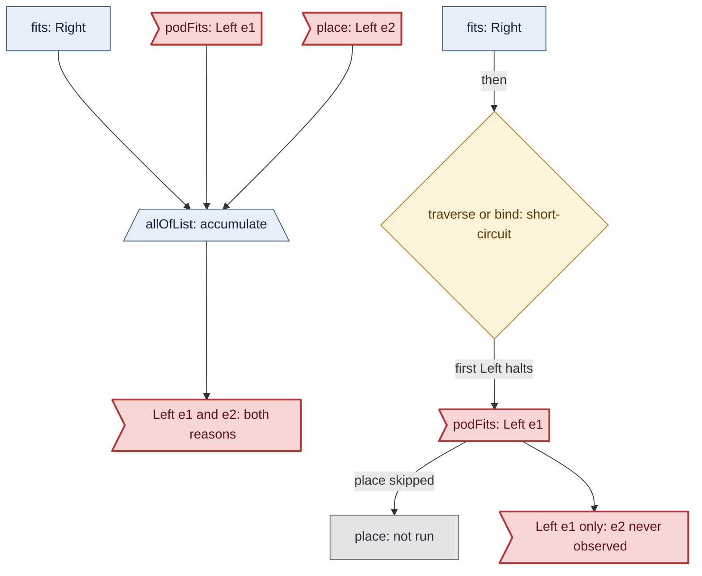
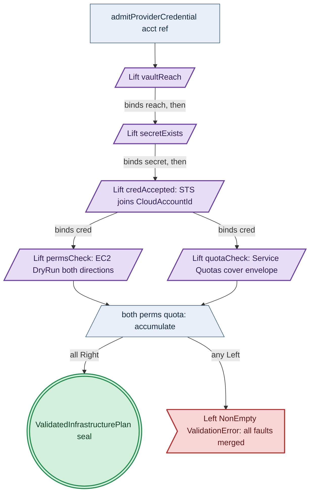
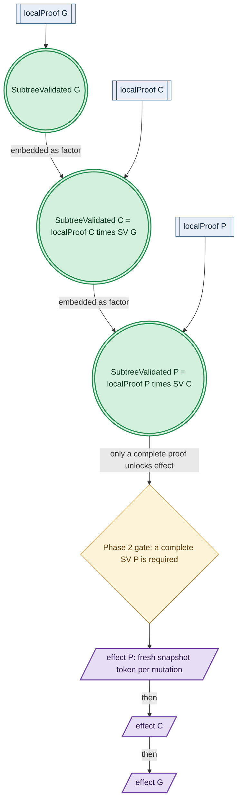
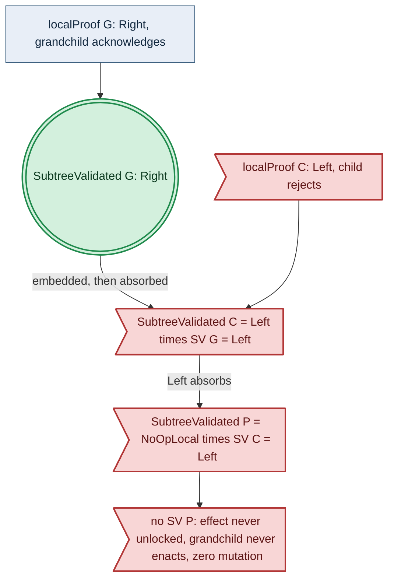

# Preflight Validation: the `Check` Algebra and the Forest Proof Tree

**Status**: Authoritative source
**Supersedes**: N/A
**Referenced by**: documents/engineering/README.md, documents/engineering/diagram_conventions.md
**Generated sections**: none

> **Purpose**: Single Source of Truth for the pure-functional validation algebra (`Check`) that is the mechanism of the `dhall update` admission gate, its credential/host/quota probe instances including the worst-case dynamic envelope, and the recursive-forest validate-before-effect proof tree that makes a partial acknowledgement across a parent/child/grandchild forest unrepresentable.

Everything in this document is Phase-0 design intent; amoebius has built no phase. Where a mechanism runs today in the sibling prodbox/hostbootstrap projects it is marked **proven-in-sibling** — evidence, not a tested amoebius result ([documentation_standards.md §6](../documentation_standards.md#6-honesty-the-proventestedassumed-discipline)). The impossibility theorem of [§2](#2-the-check-algebra) is established functional-programming mathematics; the `Check` GADT, its interpreters, the worst-case envelope, and the forest proof tree are **new-design-intent**.

Diagram vocabulary: [diagram_conventions.md](./diagram_conventions.md).

---

## 1. Why this doctrine exists

The Dhall gates foreclose only structurally-illegal specifications. Gate 1 (typecheck) and Gate 2 (the total decoder) reject a spec that names no API-key `SecretRef` for a cloud provision, or no SSH key for a self-managed host ([dsl_doctrine.md §2](./dsl_doctrine.md#2-two-languages-one-system-dhall-carries-params-haskell-carries-logic)). They cannot decide whether Vault is reachable, whether a named key exists, whether the live AWS or SSH authority recognises that key and grants the permissions and quotas the spec demands, whether an SSH host actually carries its declared hardware, or whether two clusters in a forest collide in a provider's resource identity. Each of these is a fact about a running world, settled only by observation; a spec that decodes cleanly can still fail at the first cloud or host call.

An untyped, per-call validation layer fails the property amoebius requires. Ad-hoc checks scattered through the deploy path report the first failure and stop, cannot express which checks are independent (and therefore parallelisable) versus dependent, and admit a deploy that then fails halfway through `pulumi up` with resources half-created. The admission the deploy needs is a single composable structure whose success is a precondition of any mutation.

Amoebius already owns the runtime admission gate this requires: `dhall update` "actively proves each named secret before admitting the upload, and rejects fail-fast otherwise", reaching real hosts and cloud APIs and rejecting an absent secret, an SSH key that cannot connect, a host short of its declared resources, or a cloud credential lacking permission or quota, before any reconcile ([bootstrap_sequence_doctrine.md](./bootstrap_sequence_doctrine.md)). This document owns the *mechanism* of that gate — one pure-functional `Check` algebra ([§2](#2-the-check-algebra)), its probe instances ([§3](#3-the-check-instances-the-mechanism-of-the-dhall-update-gate)), and the recursive lift of the same algebra over the forest ([§4](#4-the-recursive-forest)) — and two extensions the gate's prose does not yet spell out: the worst-case dynamic envelope that validates a future-needed credential now, and the ack/nack proof tree.

What the design forecloses, stated honestly ([§5](#5-the-guarantee-and-its-honest-limits)): a `Check` proof is stamped to observation time and cannot prove the running cluster complies. "A validated deploy cannot fail" is not achievable; the achievable and claimed property is that no enumerated, probe-observable precondition can fail at validation and that every subsequent self-management mutation is re-confirmed by the existing single-use snapshot token and fails closed on drift.

---

## 2. The `Check` algebra

### 2.1 The impossibility theorem forces a two-node split

No single lawful type is both an error-accumulating `Applicative` and a short-circuiting `Monad`. For any type carrying lawful `Monad` and `Applicative` instances, the coherence law forces `mf <*> mx = mf >>= \f -> mx >>= \x -> pure (f x)`; the right-hand side makes `mx`'s contribution a function of `mf`'s result, so a failed `mf` short-circuits and `mx` is never inspected. An accumulating `<*>` must inspect `mx` even when `mf` failed, which the coherence law forbids. `Validation (NonEmpty e)` therefore has no lawful `Monad`, and `Either e` has a short-circuiting `Applicative`; the two behaviours cannot coexist in one lawful instance.

Amoebius resolves this the way the deploy algebra already resolves it — independence is `Applicative`, dependency is `Monad`, and which one holds is the structure of the composition, not a runtime decision ([pulumi_iac_doctrine.md §7](./pulumi_iac_doctrine.md#7-applicative-parallelism-for-independent-deploys)). `Check` is a free GADT whose type-class instances take the lawful, short-circuiting reading, while accumulation lives in distinct constructors interpreted through `Validation`:

```haskell
data Check a where
  Pure  :: a -> Check a
  Lift  :: ProbeReq a -> Check a                    -- the one effectful seam
  Bind  :: Check a -> (a -> Check b) -> Check b      -- dependent; the only node holding a function
  AllOf :: NonEmpty (Check a) -> Check (NonEmpty a)  -- independent fan-out; accumulate every failure
  Both  :: Check a -> Check b -> Check (a, b)        -- the binary accumulating combinator
  Select :: Check (Either a b) -> Check (a -> b) -> Check b   -- selective; short-circuit only

instance Applicative Check where pure = Pure; (<*>) = ap   -- lawful, short-circuiting
instance Monad       Check where (>>=) = Bind

independently :: NonEmpty (Check a) -> Check (NonEmpty a)   -- = AllOf: the accumulating applicative
allOfList     :: (a -> Check b) -> [a] -> Check [b]         -- the sanctioned "validate every x" form
both          :: Check a -> Check b -> Check (a, b)         -- = Both
```

One `Check` value carries both disciplines — the `Bind` fragment in the short-circuit monad, the `AllOf`/`Both` fragment in the accumulating applicative — without any one lawful instance being both.

### 2.2 Independence is machine-checked

`AllOf` and `Both` hold children of type `Check _`, never `_ -> Check _`. The type has no position in which one child can be written as a function of a sibling's result, so composing checks under an accumulating combinator is a machine-checked assertion of their independence; expressing a dependency forces a `Bind`, which relocates the pair onto the sequential spine. This is the validation-shaped image of the deploy rule that two operations writing the same checkpoint namespace are a data dependency and therefore compose monadically, not applicatively ([pulumi_iac_doctrine.md §7](./pulumi_iac_doctrine.md#7-applicative-parallelism-for-independent-deploys)).

### 2.3 The accumulation discipline

The canonical `Applicative`/`Monad` instances short-circuit (`<*> = ap`). Error accumulation is reachable only through the named combinators `independently`, `allOfList`, and `both`. A site that must validate several inputs and report every failure uses those combinators; `traverse`, `mapM`, and `<*>` are forbidden there, because they re-enter the short-circuit instance and report only the first failure. An accumulating operand may close over a value already bound by an enclosing `Bind` but may not consume a sibling operand's output — consuming a sibling's output is a data dependency, which the type admits only through `Bind`.

### 2.4 Laws and the mutant corpus

The laws are stated over a pure interpreter `runPure :: Env -> Check a -> Outcome a`, quantified over generated `Env` and `Check`. The `Bind` fragment satisfies the Functor, Applicative, and Monad laws, including coherence (`<*> = ap`) and short-circuit (a failed `mf` leaves `mx` unobserved). `AllOf`/`Both` are homomorphisms into `Validation`'s accumulating applicative, preserving error multiplicity (`errorCount (Both a b) = errorCount a + errorCount b`). The load-bearing law is non-collapse: `both a b` and `a >>= \x -> b >>= \y -> pure (x, y)` agree on the successful value but differ on failure — the former accumulates both reasons, the latter reports one. `Select` is left-biased: on the left branch's success the right is unobserved; on both-branch failure both reasons are kept.

A committed mutant corpus fixes these properties, following the seeded-mutant idiom of [formal_model_doctrine.md](./formal_model_doctrine.md) and [testing_doctrine.md](./testing_doctrine.md): each mutation must turn a property red. Representative mutants: `AllOf` short-circuits (killed by the accumulation homomorphism and non-collapse); `Both` drops the second error (homomorphism and non-collapse); `Select` drops an unproven branch's errors (the `Select` law); `<*>` accumulates (coherence); `AllOf`'s `mappend` becomes set-union, losing multiplicity; `both` becomes silently monadic (non-collapse); and the success seal is exposed so `renderAll` accepts an unsealed value (the seal-opacity golden of [illegal_state_techniques.md §6](../illegal_state/illegal_state_techniques.md)).

### 2.5 Interpreters, result type, and the seal

`Outcome = Validation (NonEmpty ValidationError)`. `ValidationError` embeds `ProvisionError` as one arm, so the existing capacity and quota folds return into the same accumulation channel as the new Vault, host, and permission arms. Those folds — `fits`, `podFits`, `place`, `observeProviderAccount`, `validateInfrastructurePlan` — each return `Either` internally and become a single `Lift`/`liftEither` leaf carrying one reason; accumulation across several independent concerns is `allOfList` over the leaves, never an attempt to make one `place` call accumulate. Two `Probe` instances, `runLocal` and `runSsh sshDial`, interpret the identical pure `Check`; they differ only in how a `Lift` leaf is discharged, generalising the reconciler's cloud-arm-versus-SSH-host-arm observation split ([pulumi_iac_doctrine.md §8](./pulumi_iac_doctrine.md#8-how-deploys-are-enacted-the-reconciler-referenced-not-restated)) and the substrate detector's pure-classify/impure-probe seam ([substrate_doctrine.md](./substrate_doctrine.md)). A successful `Outcome` carries the existing constructor-private `ValidatedInfrastructurePlan`/`ProvisionedSpec` seal; the design stacks on that seal rather than introducing a parallel one, and only that value crosses `renderAll` ([dsl_doctrine.md](./dsl_doctrine.md)). Results persist to the existing `ValidationLedger` control-plane object ([dsl_doctrine.md](./dsl_doctrine.md)), never a new store. Each leaf keeps its foreclosure-layer tag: the same GADT hosts both the Tier-1 pure provision-seal fold and the Tier-2 runtime probe, interpreted differently ([illegal_state_techniques.md §6](../illegal_state/illegal_state_techniques.md)).


*Design intent. The non-collapse law is the property the corpus pins: `allOfList` reports both reasons; `traverse`/`Bind` reports only the first.*

---

## 3. The `Check` instances: the mechanism of the `dhall update` gate

The pure capacity fold proves that worst-case demand fits declared supply. This layer proves the effectful complement — that declared supply is covered by observed authority — at the upload locus; composed, the two bound worst-case demand by observed capacity.

A sealed, uninitialised, or unreachable Vault is the monadic head of the whole validation: `vaultReach` is bound before any `SecretRef` is probed, so a sealed Vault short-circuits fail-closed and no probe leaks whether a named secret exists ([vault_pki_doctrine.md](./vault_pki_doctrine.md)). This is the mechanism of the gate's requirement that a named secret exist in Vault ([bootstrap_sequence_doctrine.md](./bootstrap_sequence_doctrine.md)).

Each credential is tested against its real authority through one shape, `reachable ⇒ recognises ⇒ satisfies`, a monadic spine whose `satisfies` stage runs its independent properties under `both`. The AWS interpreter recognises the credential by joining the `sts:GetCallerIdentity` account to the authored `CloudAccountId`, and satisfies it by proving permissions (an EC2 `DryRun` in both directions — create and modify authorised, durable `DeleteVolume` denied) accumulated with quotas (AWS Service Quotas cover the demand). The SSH interpreter recognises the credential by connecting to the intended host with the Vault-resolved key, and satisfies it by running the substrate resource-probe over SSH transport — the same probe run locally, marshalled to the remote host — against the declared per-host capacity; a host declared `linux-cuda` with no accelerator refuses ([substrate_doctrine.md](./substrate_doctrine.md)). Both interpreters are the mechanism of the gate's requirement that an SSH key connect and match observed hardware and that a cloud credential carry the required permissions and quotas ([bootstrap_sequence_doctrine.md](./bootstrap_sequence_doctrine.md)).


*Design intent. The `Bind` spine short-circuits on a sealed Vault; `perms` and `quota` share no edge and accumulate. The seal is the existing `ValidatedInfrastructurePlan`, not a new value.*

Ongoing self-management logic is bound by validating the worst-case future envelope at upload. A pure fold derives, from the `InForceSpec`, the union over every reachable branch — including a branch gated behind a runtime threshold — of the credentials it may resolve, the accounts and hosts it may target, and the quota ceiling it may reach. The projection and observation types are reused from the existing scaling model: the ceiling is the `ScalingPolicy` quota and its worst-case projection, observed against the residual of `ObservedProviderAccount` ([resource_capacity_doctrine.md](./resource_capacity_doctrine.md)). The only new element is pulling the check that the declared ceiling fits observed headroom forward from the runtime locus to the upload locus. A cloud-burst branch that fires only above a traffic threshold therefore contributes its account credential to the set validated at upload, so a credential the branch will later need is proven present now; a scaling ceiling that could exceed observed quota refuses at upload rather than at runtime.

Re-validation after upload is driven by observed drift, never by an elapsed duration: the reconciler re-runs the same `Check` when its `discover → diff → enact → re-observe` loop observes a relevant change ([cluster_lifecycle_doctrine.md §9](./cluster_lifecycle_doctrine.md#9-how-bring-up-and-teardown-are-implemented-the-reconciler-not-a-state-machine)), and each mutation is re-confirmed by the pre-mutation snapshot token, in keeping with the prohibition on timers ([readiness_ordering_doctrine.md](./readiness_ordering_doctrine.md)).

The new `ValidationError` arms are `VaultAuthorityUnreachable`, `HostUnreachable`, `HostCredentialRejected`, `HostHardwareInsufficient`, `QuotaBudgetExceedsObservedLimit`, `QuotaObservationIncomplete`, and `DynamicCredentialAbsentNow`, alongside the credential and IAM arms the AWS gate already defines.

---

## 4. The recursive forest

### 4.1 Cross-cluster resource-identity disjointness

A credential is a shareable name; an owned resource identity is single-owner. A parent and child may hold the same AWS key, but must not deploy into the same VPC or onto the same SSH host. A per-cluster VPC identity is name-disjoint by derivation — a total function of the forest-unique `ClusterId`, so two clusters cannot name the same identity, a decode-level property resting on the same `ClusterId`-distinctness fold that rejects a reused host ([illegal_state_techniques.md](../illegal_state/illegal_state_techniques.md)) — and is actually disjoint by fresh spawn, because each spawn is a distinct Pulumi deploy under a disjoint budget ([pulumi_iac_doctrine.md §8](./pulumi_iac_doctrine.md#8-how-deploys-are-enacted-the-reconciler-referenced-not-restated)); the latter is a runtime effect, not a type foreclosure. A statically-named SSH-host collision across sibling subtrees is rejected by a root-scope distinctness fold. Because a child receives only its downward subtree projection ([cluster_lifecycle_doctrine.md §3](./cluster_lifecycle_doctrine.md#3-amoebic-spawning--the-recursive-forest)), that fold runs at the root only and is not part of per-child re-validation; downward-only projection makes this consistent. A host identity discovered at reconcile time rides the existing three-valued `discover`/`Unreachable → refuse` gate and the `dhall update` capability probe.

### 4.2 Secret-injection exactness

The set of secrets a child needs is the `SecretRef` closure of its projected spec unioned with its worst-case dynamic envelope. Injection is defined as that closure — one fold, not two independently authored sets — so no verb injects an arbitrary secret and a secret outside the closure has no injection site; over-injection is unrepresentable by construction, the same binding-by-construction technique that ties a PVC to its PV ([illegal_state_techniques.md](../illegal_state/illegal_state_techniques.md)). Under-injection is closed by a fold that yields an opaque `SeededProof`, a precondition of the child spec handoff: a child does not receive its `InForceSpec` until every needed secret, including a future-needed one, is seeded ([vault_pki_doctrine.md §7](./vault_pki_doctrine.md#7-parent-injects-secrets-into-the-childs-vault)). `SeededProof` persists in the `ValidationLedger`.

### 4.3 The two-phase validate-before-effect proof tree

The forest validation is one recursive value: `SubtreeValidated(n) = localProof(n) ⊗ Π over children SubtreeValidated(c)`, opaque and constructor-private. `localProof(n)` is the monadic chain Gate 1, Gate 2, bind, `planInfrastructure`, `provision`, the `dhall update` capability admission, and the parent's reach to the node; independent sibling subtrees fold under `independently`. Because a parent's proof embeds every descendant's proof as a factor, and a `Left` factor absorbs the product, a state in which a grandchild acknowledges and the child then rejects — with the parent already enacted — is unrepresentable: any rejection makes the whole product `Left`, and no parent proof, hence no parent effect, is constructed. The ordering in which descendants validate before an ancestor may enact is a property of the product, not a scheduled protocol; there is no coordinator and no acknowledgement sequence to order incorrectly. This is the forest-scale generalisation of `Unreachable → refuse` ([cluster_lifecycle_doctrine.md §9](./cluster_lifecycle_doctrine.md#9-how-bring-up-and-teardown-are-implemented-the-reconciler-not-a-state-machine)).


*Design intent. Phase 1 assembles the product bottom-up; Phase 2 effect is gated top-down on the complete proof.*

### 4.4 Diff-gating: two distinct predicates

Two predicates govern an unchanged node, and conflating them reopens the partial-acknowledgement hole. `Unchanged(node) = NoOpLocal ⊗ Π children SubtreeValidated(c)` degrades only the local conjunct to a no-local-effect proof; the child product is always retained, so validation still descends the whole subtree. `subtreeNoOp(node) = NoOpLocal(node) ∧ ⋀ children subtreeNoOp(c)` is strictly stronger, recursively computed, and is the only predicate that prunes the Phase-2 effect walk; `subtreeNoOp` implies `Unchanged`, never the converse. Pruning the effect walk on the node-local `Unchanged` predicate is the defect: a parent that is locally unchanged above a changed grandchild would drop the grandchild's mutation, a silently skipped effect. Pruning only on `subtreeNoOp` is fail-closed, mirroring `Unreachable → refuse`. Across the eight parent/child/grandchild change combinations, an unchanged middle node never severs the chain, because its retained child product keeps the parent's proof embedding the grandchild's, so the parent cannot enact until the grandchild has validated.


*Design intent. A grandchild acknowledgement followed by a child rejection is an uninhabited product, not a caught schedule.*

### 4.5 The Phase-2 seal stack and transport

The effect of a subtree consumes a stack of three seals in order: the pure `ProvisionedSpec` that `renderAll` accepts, settled per node in Phase 1; the recursive `SubtreeValidated`, settled for the whole subtree in Phase 1; and a fresh `ValidatedInfrastructureActionBatch`/single-use snapshot token re-read immediately before each mutation in Phase 2 ([pulumi_iac_doctrine.md §8](./pulumi_iac_doctrine.md#8-how-deploys-are-enacted-the-reconciler-referenced-not-restated)). The first two are settled before any effect, which is what validate-before-effect means; the third handles world-drift per mutation, and a stale token restarts observation with zero mutation. The acknowledgement rides the `ParentReachChannel` projected from each child's compute engine, so a child its parent cannot reach has no inhabitant ([bootstrap_sequence_doctrine.md](./bootstrap_sequence_doctrine.md)); reachability is a factor of `localProof`, so an unreachable child collapses every ancestor's product.

---

## 5. The guarantee and its honest limits

When the deploy's `Check` returns success — the `ValidatedInfrastructurePlan` seal — then at each probe's observation instant Vault was unsealed and every named secret resolved, every credential was accepted by its live target, permissions and quotas covered the spec's worst-case demand including its dynamic envelope, every target's hardware fit, no two tiers collided in a resource identity, and every needed secret was seeded. For every subsequent self-management mutation, the single-use snapshot token is re-read immediately before the mutation and a drifted snapshot yields zero mutation.

The limits are stated per [documentation_standards.md §6](../documentation_standards.md#6-honesty-the-proventestedassumed-discipline). "A validated deploy cannot fail under ongoing logic" is not achievable and is not claimed; the worst-case envelope is necessary but not sufficient, and what bounds ongoing logic is the pre-mutation token making every future mutation refuse on drift, not succeed. A `Check` proof is stamped to observation time, so the token collapses the check-to-effect window to per-mutation but does not erase it. The guarantee covers enumerated, probe-observable preconditions, not a denotational completeness claim ([illegal_state_techniques.md §6](../illegal_state/illegal_state_techniques.md)); and it is Tier-2 runtime-checked — that the new state is actually effected is observed by the reconciler, never asserted as a type proof ([readiness_ordering_doctrine.md](./readiness_ordering_doctrine.md)).

---

## 6. What this doctrine does not own

| Concern | Owner |
|---|---|
| The `dhall update` admission gate and the `ParentReachChannel` | [bootstrap_sequence_doctrine.md](./bootstrap_sequence_doctrine.md) |
| Vault reachability/seal semantics, `SecretRef`, parent injection | [vault_pki_doctrine.md](./vault_pki_doctrine.md) |
| The `ScalingPolicy` quota, its worst-case projection, `ObservedProviderAccount` | [resource_capacity_doctrine.md](./resource_capacity_doctrine.md) |
| The opaque `ProvisionedSpec` seal, the two gates, `ValidationLedger` | [dsl_doctrine.md](./dsl_doctrine.md) |
| The single-use snapshot token, cloud-vs-SSH observation arms, the EBS credential model | [pulumi_iac_doctrine.md](./pulumi_iac_doctrine.md) |
| The reconciler `discover → diff → enact → re-observe`, amoebic spawning, the subtree projection | [cluster_lifecycle_doctrine.md](./cluster_lifecycle_doctrine.md) |
| The substrate capability axis and the local resource-probe | [substrate_doctrine.md](./substrate_doctrine.md) |
| The three foreclosure layers and the seal-opacity discipline | [illegal_state_techniques.md](../illegal_state/illegal_state_techniques.md) |
| The Mermaid vocabulary the diagrams use | [diagram_conventions.md](./diagram_conventions.md) |
| Phase order, status, and validation gates | [DEVELOPMENT_PLAN/README.md](../../DEVELOPMENT_PLAN/README.md) |

---

## Cross-references
- [Engineering Doctrine Index](./README.md)
- [DSL Doctrine](./dsl_doctrine.md) — the two gates, the opaque seal, `ValidationLedger`
- [Bootstrap Sequence Doctrine](./bootstrap_sequence_doctrine.md) — the `dhall update` gate this is the mechanism of
- [Pulumi IaC Doctrine](./pulumi_iac_doctrine.md) — applicative independence, the snapshot token, observation arms
- [Vault / PKI Doctrine](./vault_pki_doctrine.md) — `SecretRef`, parent injection
- [Resource Capacity Doctrine](./resource_capacity_doctrine.md) — the scaling ceiling and observed account residual
- [Cluster Lifecycle Doctrine](./cluster_lifecycle_doctrine.md) — the reconciler, the recursive forest
- [Substrate Doctrine](./substrate_doctrine.md) — the capability axis and resource-probe
- [Illegal State Techniques](../illegal_state/illegal_state_techniques.md) — foreclosure layers, seal opacity
- [Diagram Conventions](./diagram_conventions.md) — the pure-workflow diagram vocabulary
- [Development Plan](../../DEVELOPMENT_PLAN/README.md)
