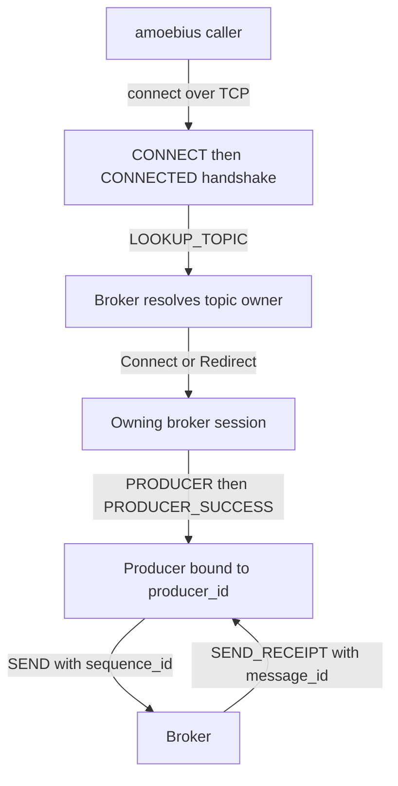
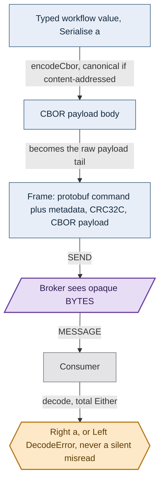
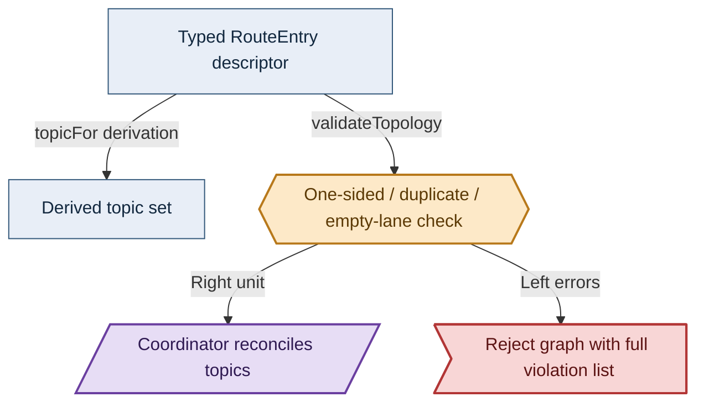
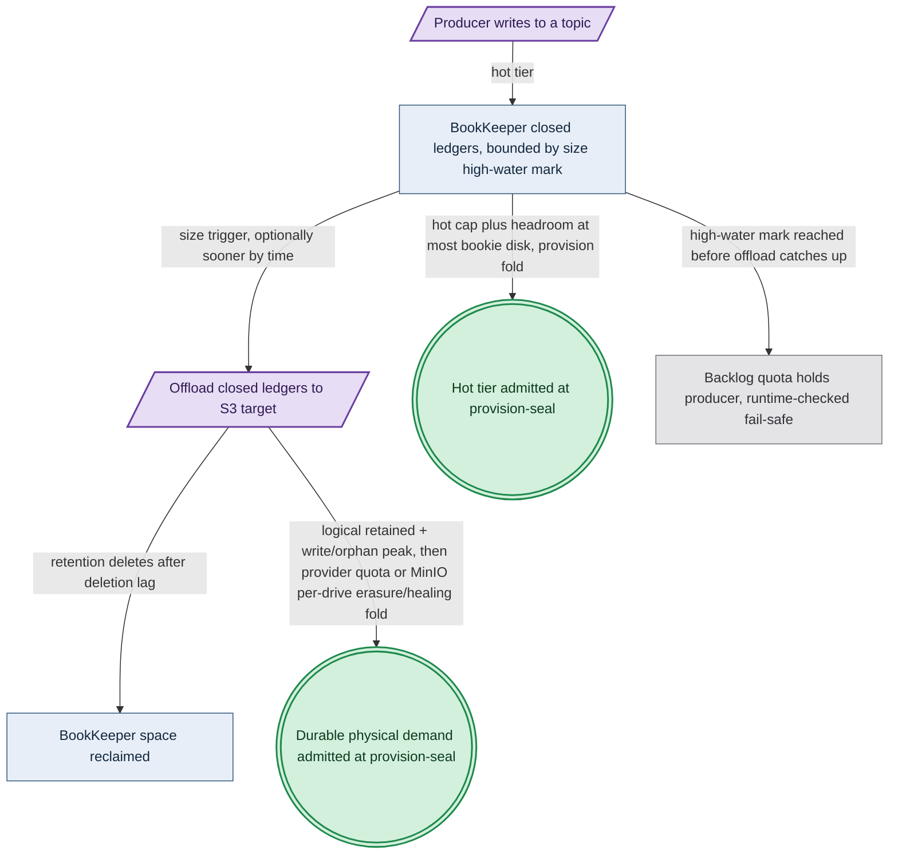

# The Native Pulsar Client

**Status**: Authoritative source
**Supersedes**: N/A
**Referenced by**: DEVELOPMENT_PLAN/legacy_tracking_for_deletion.md, DEVELOPMENT_PLAN/overview.md, DEVELOPMENT_PLAN/phase_08_storage_geometry_folds.md, DEVELOPMENT_PLAN/phase_23_platform_backbone.md, DEVELOPMENT_PLAN/phase_28_pulsar_client.md, DEVELOPMENT_PLAN/phase_29_content_store_workflow.md, DEVELOPMENT_PLAN/phase_39_infernix_lift.md, DEVELOPMENT_PLAN/phase_41_apple_metal_host_daemon.md, DEVELOPMENT_PLAN/system_components.md, documents/documentation_standards.md, documents/engineering/README.md, documents/engineering/app_vs_deployment_doctrine.md, documents/engineering/backup_recovery_doctrine.md, documents/engineering/chaos_failover_doctrine.md, documents/engineering/cluster_lifecycle_doctrine.md, documents/engineering/cluster_topology_doctrine.md, documents/engineering/content_addressing_doctrine.md, documents/engineering/daemon_topology_doctrine.md, documents/engineering/dsl_doctrine.md, documents/engineering/host_cluster_comms_doctrine.md, documents/engineering/lift_and_compose_doctrine.md, documents/engineering/monitoring_doctrine.md, documents/engineering/network_fabric_doctrine.md, documents/engineering/platform_services_doctrine.md, documents/engineering/release_lifecycle_doctrine.md, documents/engineering/resource_capacity_doctrine.md, documents/engineering/single_logical_data_plane_doctrine.md, documents/engineering/tenancy_doctrine.md, documents/illegal_state/illegal_state_capability_messaging.md, documents/illegal_state/illegal_state_lifecycle.md, documents/illegal_state/illegal_state_ml_asset.md, documents/illegal_state/illegal_state_storage.md, documents/illegal_state/illegal_state_techniques.md
**Generated sections**: none

> **Purpose**: Define `amoebius-pulsar` — the one native-protocol Haskell Pulsar client (forked from
> `cr-org/supernova`) that replaces every WebSocket transport, its capability surface (lookup / produce /
> consume / subscribe / seek), the declarative topology algebra, and the at-least-once + broker-side-dedup
> delivery contract.

---

## 1. One client, one wire, no WebSockets

amoebius has **exactly one** way to talk to Pulsar: a native-protocol Haskell library, `amoebius-pulsar`,
that speaks Pulsar's TCP binary protocol directly. There is no second transport, no fallback, no
HTTP-upgrade side-door. This is the amoebius generalization of a lesson from the two extension
libraries it absorbs:

- **infernix** talked to Pulsar over the **WebSocket gateway** in-process (`Network.WebSockets`), opening a
  fresh WebSocket producer connection *per publish* and base64-encoding every payload into a JSON envelope
  (`Infernix.Runtime.Pulsar` — `buildProducerSocketPath`, `publishTopicPayload`).
- **jitML** talked to Pulsar by shelling out to a **Node.js subprocess** that owned the WebSocket client —
  a second language runtime and a process boundary on the hot path.

Both transports are deleted. One native client replaces both, with four concrete consequences:

- **No per-publish connection churn.** A native producer is a long-lived session that sends framed binary
  messages; infernix's "one WebSocket per message" pattern (with its repeated HTTP upgrade and handshake)
  disappears.
- **No base64 inflation.** The native protocol carries raw payload bytes with a CRC32C checksum ([§3](#3-the-native-binary-protocol)); the
  WebSocket path inflated every payload ~33% into base64 inside a JSON object.
- **No second runtime.** jitML's Node subprocess and its IPC are gone; the client is plain Haskell on the
  pinned toolchain.
- **`sequence_id` is a first-class protocol field**, not a smuggled URL parameter — which makes the dedup
  contract in [§6](#6-the-declarative-topology-algebra) clean rather than a workaround.

> **Honesty (per [documentation_standards.md §6](../documentation_standards.md#6-honesty-the-proventestedassumed-discipline)).** "Performance via the
> native protocol" is the **design rationale** — base64 elimination, persistent producers, no process hop —
> not a benchmarked amoebius result. amoebius has not yet built Phase 28. The WebSocket costs above are read
> off the infernix/jitML source as *sibling evidence*; the amoebius speedup is expected, not measured.

The no-WebSockets rule is a **locked invariant**, recorded as a standard-service fact in
[platform_services_doctrine.md §6](./platform_services_doctrine.md#6-pulsar--the-event-and-workflow-backbone-new-vs-prodbox): lookup, produce, consume, subscribe,
and seek all ride the native protocol or they do not happen.

---

## 2. Scope — what this document owns

This doc is the SSoT for **the client and its delivery contract**. It owns:

1. The `amoebius-pulsar` library: the native binary-protocol implementation and the supernova fork ([§3](#3-the-native-binary-protocol)–[§4](#4-forked-from-supernova--what-amoebius-inherits-and-what-it-builds)).
2. The capability surface: lookup / produce / consume / subscribe / seek ([§5](#5-the-capability-surface-lookup--produce--consume--subscribe--seek)).
3. The **declarative topology algebra**: how topic names are *derived*, never written, and the
   one-sided-link validation that rejects an unroutable graph ([§6](#6-the-declarative-topology-algebra)).
4. The **topic storage lifecycle**: mandatory retention, a *size-triggered* S3 offload, and the two-ceiling
   storage budget that keeps the hot tier from ever overflowing ([§6.1](#61-topic-storage-lifecycle-bounded-tiered-retained--and-the-hot-tier-never-overflows)).
5. The **at-least-once + broker-side dedup** delivery contract ([§7](#7-delivery-at-least-once-with-broker-side-dedup-the-robust-default)).
6. The **payload codec**: application message payloads are **exclusively CBOR** (canonical where
   content-addressed), [§3.1](#31-payloads-are-exclusively-cbor).

It deliberately does **not** own, and only references:

| Concern | Owner |
|---------|-------|
| What a payload *references* (raw content-addressed blobs, the manifest CBOR shape) — the *encoding* of the payload envelope is CBOR, owned here ([§3.1](#31-payloads-are-exclusively-cbor)) | [content_addressing_doctrine.md](./content_addressing_doctrine.md) |
| *Who* runs producers/consumers, topic-lifecycle coordinators, single-instance delegation | [daemon_topology_doctrine.md](./daemon_topology_doctrine.md) |
| *How* a host daemon reaches the broker (Pulsar peer over host-only NodePort, no mTLS) | [host_cluster_comms_doctrine.md](./host_cluster_comms_doctrine.md) |
| That Pulsar is a standard HA service on every cluster | [platform_services_doctrine.md §6](./platform_services_doctrine.md#6-pulsar--the-event-and-workflow-backbone-new-vs-prodbox) |
| The app-spec surface that *declares* topic lifecycles | [dsl_doctrine.md](./dsl_doctrine.md) |
| Intra-cluster HA correctness (delegated to brokers/bookies) | [chaos_failover_doctrine.md](./chaos_failover_doctrine.md) |

Phase order and status are owned only by [../../DEVELOPMENT_PLAN/README.md](../../DEVELOPMENT_PLAN/README.md)
(the client lands in **Phase 28**); this doc states the target shape and links back, never a status ledger.

---

## 3. The native binary protocol

A Pulsar frame is a length-prefixed protobuf command, optionally followed by a checksummed
metadata-and-payload tail. The client's job is to encode/decode those frames correctly and keep one TCP
session per broker connection alive.

The wire format (from the [Pulsar binary protocol spec](https://pulsar.apache.org/docs/4.0.x/developing-binary-protocol/)):

- **Simple command** (no payload): `totalSize (4B)` · `commandSize (4B)` · `command` (a protobuf
  `BaseCommand`). `BaseCommand` carries a `Type` enum and sets exactly one subcommand field.
- **Payload command** (a message): the command, then an optional broker-entry-metadata block guarded by
  magic `0x0e02`, then magic `0x0e01`, then a **CRC32C checksum** over everything after it, then
  `metadataSize` + `metadata` (protobuf) + raw `payload`.
- Maximum frame size is 5 MiB; larger application data must be a content-addressed reference, not an inline
  blob — see [content_addressing_doctrine.md](./content_addressing_doctrine.md).

Implementation rules for `amoebius-pulsar`:

- **`proto-lens` is the protobuf layer.** `BaseCommand` and message metadata are generated from
  `PulsarApi.proto` via `proto-lens` (the same `Data.ProtoLens` codegen infernix already uses:
  `encodeMessage` / `decodeMessage` / `defMessage`). Hand-rolled wire parsing of the protobuf bodies is
  forbidden — only the *framing* (size prefixes, magic numbers, CRC32C) is hand-written.
- **CRC32C is mandatory on payload frames** and checked on receive; a checksum mismatch is a structured
  decode error, never a silent drop.
- **One persistent TCP session per broker**, multiplexing producers and consumers by `producer_id` /
  `consumer_id` / `request_id`, as the protocol intends. This is the structural reason the
  per-publish-connection cost of the old WebSocket path vanishes ([§1](#1-one-client-one-wire-no-websockets)).
- **Toolchain & discovery.** The fork builds on **GHC 9.12.4** (the repo-wide pin). Any code-generation
  tool it needs (e.g. `protoc` for `proto-lens`) is discovered **lazily through the substrate's package
  manager and invoked by full path** — there is **no `PATH` lookup and no environment variable** anywhere
  in the build or runtime path. That no-env/no-`PATH` contract is owned by
  [substrate_doctrine.md](./substrate_doctrine.md); it is named here only because the supernova fork must
  conform to it.



### 3.1 Payloads are exclusively CBOR

The frame ([§3](#3-the-native-binary-protocol)) has two independent layers, and this section is the SSoT for the *inner* one.
The **command/metadata layer** is protobuf — that is Pulsar's own wire format (`BaseCommand`, message
metadata, via `proto-lens`), and it is not amoebius's to change. The **application payload** — the raw
`payload` tail after the metadata — is amoebius's, and it is **exclusively CBOR**. There is no JSON, no
base64, no protobuf, and no untyped `ByteString` application payload: a Pulsar message body that is not CBOR
is **unrepresentable** ([illegal_state_catalog.md §3.23](../illegal_state/illegal_state_capability_messaging.md#323-a-non-cbor-pulsar-payload)).

- **One codec, one body format.** A payload is produced only through a typed codec — `produce` takes a
  `Serialise`-constrained value (equivalently, a `CborPayload` newtype whose sole constructor is
  `encodeCbor :: Serialise a => a -> CborPayload`). There is **no** `produceRaw :: ByteString -> …` and no
  JSON/protobuf/base64 path, so a non-CBOR payload has no inhabitant — type-foreclosed uninhabitable
  ([illegal_state_catalog.md §6](../illegal_state/illegal_state_techniques.md#6-three-layers-of-foreclosure-and-the-honesty-they-force)).
  Consume is the mirror: `Serialise a => … -> Either DecodeError a`, a **total, fail-fast** decode — a
  corrupt or mistyped body is a structured error, never a silent misread, the posture the mandatory
  CRC32C ([§3](#3-the-native-binary-protocol)) already takes on the frame.
- **Canonical where content-addressed; fast elsewhere.** amoebius reuses — it does **not** restate — the
  canonical-CBOR discipline the content store already owns: the `encodeManifestCbor` canonical encoder
  ([content_addressing_doctrine.md §2.1](./content_addressing_doctrine.md#21-three-object-classes-two-write-protocols))
  sorts components so equal logical content yields byte-identical CBOR. A payload that is **content-addressed
  or hashed** (a result body, a manifest-SHA-bearing envelope) is encoded **canonically**; an ephemeral
  command/event is not required to be, because dedup keys on `(producer_name, sequence_id)`, never on payload
  bytes ([§7](#7-delivery-at-least-once-with-broker-side-dedup-the-robust-default)), and determinism is scoped to the durable body only, never to broker-assigned ids/timestamps
  ([content_addressing_doctrine.md §5](./content_addressing_doctrine.md#5-confluence-content-addressed-data-crosses-cluster-boundaries-safely)).
- **Big data is a reference, still CBOR.** Frames are ≤ 5 MiB ([§3](#3-the-native-binary-protocol)); a payload that must carry a large
  artifact carries the artifact's **manifest SHA** — a content-address reference — as a field of the CBOR
  envelope, never the raw blob inline. The *reference* is CBOR (here); the *blob bytes* and the *manifest
  CBOR shape* stay owned by [content_addressing_doctrine.md](./content_addressing_doctrine.md) (blobs are raw
  opaque bytes; only manifests are CBOR).
- **The broker sees opaque bytes.** amoebius owns the codec; it does **not** use Pulsar's schema registry.
  The Pulsar message schema is `BYTES`, and the CBOR body is opaque to the broker — so the codec, not a
  server-side schema, is the single source of truth for the wire body (the same "one client, one wire"
  posture as [§1](#1-one-client-one-wire-no-websockets)).
- **Why CBOR.** It is a dense, self-describing binary format — *functional* in the sense the vision wants
  (no external `.proto` schema to keep in sync, unlike the protocol layer), it eliminates the ~33% base64
  inflation of the retired WebSocket path ([§1](#1-one-client-one-wire-no-websockets)), and it is **already the project's chosen binary format** for
  content-addressed manifests — so payloads and manifests share one format and one canonical encoder rather
  than introducing a second.
- **Toolchain.** The codec is built on **`serialise`** (the `Serialise` typeclass) over **`cborg`** (whose
  `Codec.CBOR.Write` sorted-map writer gives canonical encoding), on the repo-wide GHC 9.12.4 pin; the
  dependency is carried in the `amoebius-pulsar` cabal package and registered in the dependency-management
  surface tracked by [../../DEVELOPMENT_PLAN/README.md](../../DEVELOPMENT_PLAN/README.md). Any codegen tool
  is discovered lazily by full path (no env, no `PATH`), as `protoc` is ([§3](#3-the-native-binary-protocol)).

Diagram vocabulary: [diagram_conventions.md](./diagram_conventions.md).



*Design intent. The CBOR encode and frame chain is Tier-1 in-process and the receive-side decode is a total gate; the broker seam and the running consumer are runtime-checked, not proven here.*

> **Honesty.** The CBOR-payload rule is Phase-28 design intent, not a tested amoebius result. Canonical CBOR
> is *proven in the sibling jitML content store* (`encodeManifestCbor`) — that is sibling evidence, not
> amoebius proof ([documentation_standards.md §6](../documentation_standards.md#6-honesty-the-proventestedassumed-discipline)). The type-foreclosed claim is the
> *produce* surface having no non-CBOR constructor; that a *received* body decodes is the same total-check /
> runtime residue the CRC32C guarantee already carries, not a stronger claim.

---

## 4. Forked from supernova — what amoebius inherits and what it builds

amoebius-pulsar starts as a fork of [`cr-org/supernova`](https://github.com/cr-org/supernova) (Apache-2.0,
on [Hackage](https://hackage.haskell.org/package/supernova)). Supernova already implements the binary
protocol foundation in Haskell: the `proto-lens`-generated `PulsarApi`, the CONNECT/CONNECTED handshake,
LOOKUP-based service discovery, producing, consuming with the subscription types, acknowledgment, and
seek — over dependencies amoebius already wants (`network`, `binary`, `crc32c`, `proto-lens`).

Forking — rather than depending on the published package — is the honest choice for three reasons:

1. **Supernova is explicitly early-stage** ("still very much under development… use at your own risk"). Its
   published surface demonstrates the *Exclusive* subscription and a basic produce/consume/ack loop;
   production concerns (robust reconnection, partitioned topics, dedup wiring, the topology algebra) are
   amoebius's to add.
2. **Toolchain pinning.** Supernova's dependency bounds predate GHC 9.12.4; the fork carries the bumps and
   the pin ([§3](#3-the-native-binary-protocol)).
3. **Layering.** The topology algebra ([§6](#6-the-declarative-topology-algebra)) and the dedup contract ([§7](#7-delivery-at-least-once-with-broker-side-dedup-the-robust-default)) are amoebius doctrine, not generic
   client features; they live in the fork, above supernova's transport core.

> **Honesty.** Treat supernova as a *starting point with sibling provenance*, not a proven foundation.
> Every capability in [§5](#5-the-capability-surface-lookup--produce--consume--subscribe--seek) is "supernova demonstrates it" or "the protocol provides it" — neither is an
> amoebius test result. Hardening, reconnection semantics, and the dedup proof are Phase 28 work tracked in
> [../../DEVELOPMENT_PLAN/README.md](../../DEVELOPMENT_PLAN/README.md).

---

## 5. The capability surface: lookup · produce · consume · subscribe · seek

These five verbs are the whole **primitive** surface; two derived read-model capabilities and two
deliberately-absent features are recorded in [§5.1](#51-two-derived-capabilities-read-model-and-two-deliberately-absent-ones).
Each verb maps to a protocol exchange and to a daemon role
([daemon_topology_doctrine.md](./daemon_topology_doctrine.md) owns *who* uses which).

- **Lookup (service discovery).** Before producing or consuming, the client issues `LOOKUP_TOPIC` and
  follows the broker's answer: a *Connect* response names the owning broker; a *Redirect* response sends the
  client to try another broker. The client loops on redirects until it reaches an owner. This is how a
  client finds the right broker without a static map.
- **Produce.** `PRODUCER` → `PRODUCER_SUCCESS` binds a `producer_id` and a `producer_name` (client-chosen
  or broker-generated). Each `SEND` carries that `producer_id` and a `sequence_id`; the broker replies
  `SEND_RECEIPT` (with the assigned `message_id`) or `SEND_ERROR`. The `(producer_name, sequence_id)` pair
  is the dedup key ([§7](#7-delivery-at-least-once-with-broker-side-dedup-the-robust-default)).
- **Consume.** `SUBSCRIBE` binds a `consumer_id` and a subscription. Consumers grant credit with `FLOW`
  permits; the broker pushes `MESSAGE` frames up to the granted permits; the consumer replies `ACK`
  (confirmed by `ACK_RESPONSE`). Flow control is the consumer's backpressure knob.
- **Subscribe — the four subscription types**, each with a distinct amoebius use:

  | Type | Shape | Typical amoebius use |
  |------|-------|----------------------|
  | **Exclusive** | one consumer per subscription | a singleton reader (e.g. control-plane projection) |
  | **Failover** | primary + standbys, ordered by consumer name | HA workflow coordinators — one active, others hot |
  | **Shared** | round-robin across many consumers | horizontally-scaled stateless workers |
  | **Key_Shared** | same key → same consumer | per-key ordering across a worker pool |

  Which role picks which type is owned by [daemon_topology_doctrine.md](./daemon_topology_doctrine.md); the
  client only exposes all four.
- **Seek (replay).** `SEEK` repositions a subscription to an earlier `message_id` (or timestamp), letting a
  consumer replay the log. This is the mechanism behind rebuild-from-log and the geo-replication
  catch-up that [chaos_failover_doctrine.md](./chaos_failover_doctrine.md) reasons about.

### 5.1 Two derived capabilities (read-model), and two deliberately absent ones

The five verbs above are the whole *primitive* surface. Two **derived** capabilities layer on them and are
exposed for v1; two Pulsar features are deliberately **not** exposed. This subsection records that surface
choice so the omissions are auditable, not silent.

- **Exposed (derived): topic compaction + TableView.** *Compaction* is a namespace/topic policy the
  coordinator reconciles like retention and dedup ([§6.1](#61-topic-storage-lifecycle-bounded-tiered-retained--and-the-hot-tier-never-overflows), [§7](#7-delivery-at-least-once-with-broker-side-dedup-the-robust-default));
  a *TableView* is a client-side `key → latest-value` materialization over a compacted `consume`. Together
  they give the control-plane its current-state **read-model** and resolved-singleton dissemination — adopted,
  and owned, by [daemon_topology_doctrine.md §5.2](./daemon_topology_doctrine.md#52-the-coordination-plane-is-for-worker-events-and-audit-not-leadership).
  The operator-facing `workflow-health` projection (`WorkflowName → SLOStatus`) is a second application of the
  same primitive, owned by [monitoring_doctrine.md](./monitoring_doctrine.md).
  They are a *projection*, never a decision primitive: no ownership or election logic lives in a TableView.
- **Not exposed: exclusive-producer access mode** (`Exclusive` / `WaitForExclusive` / `ExclusiveWithFencing`).
  Pulsar's purpose-built single-writer-with-fencing primitive is deliberately absent from the client surface —
  it was evaluated and rejected as the control-plane election substrate (bootstrap/DR circularity; it fences
  only Pulsar-topic writes, not the external route53/Vault effects; and it is incompatible with the
  multi-writer commit log). Full rationale: [daemon_topology_doctrine.md §5.2](./daemon_topology_doctrine.md#52-the-coordination-plane-is-for-worker-events-and-audit-not-leadership).
- **Not exposed: transactions.** Cross-topic atomicity is unused — at-least-once + broker-side dedup
  ([§7](#7-delivery-at-least-once-with-broker-side-dedup-the-robust-default)) delivers exactly-once *effect* more cheaply, so a transaction coordinator earns no place
  in the surface.

---

## 6. The declarative topology algebra

**Nobody writes a topic string by hand.** A topic name is a *derived* function of a typed
descriptor, and a routing graph that fails validation cannot be reconciled. This is the
illegal-state-unrepresentable principle ([illegal_state_catalog.md](../illegal_state/illegal_state_catalog.md)) applied to
the message bus: a malformed topology is a compile/validate error, not a runtime mystery.

The algebra is generalized from jitML's `JitML.Coordinator.Topology` (`RouteEntry` / `validateTopology` /
`topicFor`), where it already replaced a hardcoded topic list.

### Topic = `<workflow>.<command|event>.<substrate>`

A fully-qualified topic is derived, never literal:

```text
persistent://<tenant>/<namespace>/<workflow>.<phase>.<substrate>
```

- **`<workflow>`** — the logical workflow (jitML's concrete instance: `training`, `tune`, `rl`,
  `inference`, `gc`).
- **`<phase>`** — `command | event` in the canonical two-sided form; the algebra admits a richer phase set
  where a workflow needs it (jitML uses `command` / `event` / `result` / `request` / `host-command`, where
  inputs are `command`/`request`/`host-command` and reports are `event`/`result`).
- **`<substrate>`** — the lane the topic is published on (`apple` / `linux-cpu` / `linux-cuda` / `windows`),
  so the same workflow's traffic is partitioned per substrate. The substrate catalog is owned by
  [substrate_doctrine.md](./substrate_doctrine.md).

The single source of truth is a **typed descriptor**. A workflow is a
`Workflow { name, routes : NonEmpty RouteEntry, monitor : WorkflowMonitor }`, where each
`RouteEntry { workflow, phase, lanes, liveness }` names a routing lane — not a list of strings. The `monitor`
(a per-workflow SLO) and each entry's `liveness` (a per-topic freshness/backlog obligation) are **mandatory
and non-optional**, so an unmonitored workflow has no inhabitant; their shapes and the derived dashboards are
owned by [monitoring_doctrine.md](./monitoring_doctrine.md). Adding a workflow or a lane edits the descriptor;
the topic set is *derived* from it. The exact reconciled topic set, and a substrate-stripped *logical* topic family for anti-drift checking
against the durable-state registry, both fall out of the same descriptor — so the per-substrate routing
cannot silently diverge from the declared logical set.

### One-sided-link validation

A routing graph is **unroutable** — and validation rejects it — when it contains any of:

1. a **duplicate** derived topic;
2. a routing entry with **no lanes** (a phase declared but published nowhere);
3. a **one-sided link** on a `(workflow, lane)` pair:
   - an **input** (`command`/`request`/`host-command`) with **no report** (`event`/`result`) on that same
     lane — work arrives that can never report back; or
   - a **report with no producing input** on that lane — a result nobody can cause — *except* an
     explicitly **emit-only** workflow (jitML's garbage-collector `gc` is the exemplar exemption).

Why one-sidedness is illegal: an unanswered command is work that can never report back, and an
unsourced event is a result nothing can produce. Both are the "compiles, deploys, then hangs at runtime"
failure the DSL exists to prevent. `validateTopology` returns the **full list** of violations (not just the
first), so a topology author fixes the whole graph in one pass. The same fold additionally checks each
workflow's `monitor`, each entry's `liveness`, and every extension's `extMonitoring`, adding
`MonitoringInfeasible` (a declared freshness below the achievable scrape interval, or a derived rule cost that
overflows the `Observability` workload) and `UnroutedMonitor` (a `routes[].workflow` with no owning `Workflow`
record) to the same violation list — the monitoring fold and its dashboards are owned by
[monitoring_doctrine.md](./monitoring_doctrine.md).

The DSL *surface* that lets an app declare its topic lifecycles is owned by
[dsl_doctrine.md](./dsl_doctrine.md); the **algebra and its validation** are owned here.



*Design intent. The validateTopology gate rejects an unroutable graph at Tier-1 with the full violation list; only a valid graph reaches the effectful coordinator reconcile.*

### 6.1 Topic storage lifecycle: bounded, tiered, retained — and the hot tier never overflows

A topic that keeps bytes forever, or offloads on a **time-only** trigger, can drive the hot tier to a
disk-full outage. Pulsar's hot tier is BookKeeper (bookies on retained PVs); tiered storage offloads only **closed**
ledgers to S3 and does **not** free BookKeeper until retention deletes them (there is a deletion lag), and the
currently-open ledger can never be offloaded. So a time-only offload does not bound occupancy: if ingest ×
offload-lag exceeds the bookie disk, BookKeeper fills, bookies go read-only, and the topic — often the
broker — becomes **unavailable**. amoebius makes that state unrepresentable
([illegal_state_catalog.md §3.20](../illegal_state/illegal_state_storage.md#320-a-pulsar-topic-without-a-bounded--tiered--retained-lifecycle)) by making a topic's lifecycle a **pure typed
policy**, not an operator afterthought. This is the SSoT for that policy; the DSL *surface* that carries it is
owned by [dsl_doctrine.md](./dsl_doctrine.md), and the two-ceiling *arithmetic* by
[resource_capacity_doctrine.md §7](./resource_capacity_doctrine.md#7-pulsar-has-two-ceilings-the-hot-tier-and-the-durable-total).

The topic's two ceilings are not the provider's complete storage provision. Pulsar's canonical v1 binding also
constructs a separate `PulsarMetadataStoreDemand = ZooKeeper` for exact znode/session/watch/transaction
population, complete member pod envelopes, retained transaction logs/snapshots, and failure recovery overlap.
That metadata demand is deployment-wide rather than per-topic and must fit independently before brokers start;
neither BookKeeper headroom nor the offload target can pay for it.

Every topic carries three mandatory, non-optional fields and folds against **two** ceilings:

- **A mandatory `RetentionPolicy`.** There is no "keep forever" arm and no optional retention — a topic
  without a bounded retention (by time and/or size, on acknowledged messages) has no inhabitant (type-foreclosed
  shape). Backlog (unacknowledged) is bounded separately by the backlog quota below.
- **A mandatory *size-triggered* S3 offload.** The offload trigger is a **size high-water mark on the primary
  (BookKeeper) tier** — an optional time threshold may offload *sooner* for cost, but is **never** the sole
  trigger, so a time-only policy is uninhabitable. This is the load-bearing difference: the size trigger is
  what bounds the hot tier.
- **The hot-tier fit (availability-critical).** The per-topic hot-tier cap **plus headroom** — the open
  ledger, in-flight ingest during offload, and the deletion lag — is a **logical**
  `BookKeeperLogicalDemand`, not a disk debit. The pure capacity fold validates
  `ackQuorum ≤ writeQuorum ≤ ensembleSize ≤ bookies`, places bounded ledger segments onto `writeQuorum`
  distinct bookies, adds each bookie's journal/index reserve, and derives every failure subset required by
  the finite bookie fault policy. It then re-replicates each scenario and takes the per-bookie maximum while
  old/replacement copies coexist. Every bookie ordinal must fit its physical slot, after which each
  StatefulSet claim-template group is rounded to its maximum ordinal requirement and the uniform
  `uniformProvisionedBytes × ordinalCount` debit is checked. `Σ(hot caps + headroom) ≤ Σ bookie disk` and the unequal raw
  physical sum are never sufficient. A logical-fit/physical-overflow, rounded-template overflow, or omitted
  required recovery case is a post-bind `provision-seal` rejection
  ([resource_capacity_doctrine.md §5.1](./resource_capacity_doctrine.md#51-durable-demand-is-logical-first-physical-only-after-geometry)).
- **The durable-total fit.** The total retained bytes fold against the selected offload target's ceiling — a
  provider-S3 quota ([pulumi_iac_doctrine.md](./pulumi_iac_doctrine.md)) for cloud clusters, or the MinIO
  content store ([content_addressing_doctrine.md](./content_addressing_doctrine.md)) for host-bounded ones
  — the `StorageBacking` arm ([storage_lifecycle_doctrine.md §5.2](./storage_lifecycle_doctrine.md#52-the-storage-backing-is-bounded--the-closed-storagebacking-union)) selecting
  which owner's number the fold reads. A normalized `PulsarOffloadObjectDemand` requires the topic's
  `StorageBudgetId` and derives ledger-object count/size from retained bytes, segment size, maximum concurrent
  offloads, maximum segments per finite window, deletion lag, and explicit failed-offload/orphan-GC bounds.
  Provider S3 checks that structured demand in its declared logical/billed quota. Retained-PV MinIO instead
  joins exact observed offload-object identities and those structured future/deletion-lag/failure extents with
  every other closed object-store producer, expands every object through data/parity geometry and stripe
  padding, and proves the steady/healing maximum on every active and replacement drive. Each
  claim-template group is then rounded to its maximum drive requirement and debited uniformly across its
  ordinals. Neither the logical retained total, the unequal raw drive sum, nor a cluster-wide physical average
  is a MinIO capacity witness. Offload mutation uses its snapshot-bound writer capability through the sole
  object gateway; direct broker S3 PUT credentials/routes are denied.
- **A mandatory backlog quota (runtime fail-safe).** A burst, or a stalled/S3-unreachable offload, can still
  race the cap at runtime — no spec-layer check prevents that. So the policy carries a mandatory backlog
  quota (`producer_request_hold` / back-pressure at the high-water mark), so overflow degrades to **per-topic
  producer throttling, never a disk-full broker outage**. The two-ceiling fit is a pure post-bind
  `provision-seal` rejection; the
  back-pressure actually holding is runtime-checked, owned by [chaos_failover_doctrine.md](./chaos_failover_doctrine.md).

The retention/offload/backlog policy is enabled on the namespace as a reconcile step, the same shape as the
broker-side dedup namespace policy ([§7](#7-delivery-at-least-once-with-broker-side-dedup-the-robust-default)) — a pure typed value the coordinator reconciles, not a hand-set knob.



*Design intent. The two-ceiling capacity fold admits the hot and durable tiers at a provision-seal; the backlog-quota hold is runtime-checked, not proven here.*

### 6.2 A topic as a cursor-anchored replayable training feed

The three primitives this doc already owns — **Seek** (replay, [§5](#5-the-capability-surface-lookup--produce--consume--subscribe--seek)), the four
**subscription** types ([§5](#5-the-capability-surface-lookup--produce--consume--subscribe--seek)), and the **bounded-tiered-retained** storage lifecycle
([§6.1](#61-topic-storage-lifecycle-bounded-tiered-retained--and-the-hot-tier-never-overflows)) — compose into a second way to read a topic: not as a one-shot command/event stream, but
as a **cursor-anchored replayable feed** a long-running consumer trains from. The ML half this round
introduces (training-from-a-feed) rides on that composition; this subsection states only the **client-side**
feed semantics, and defers the training-run unions, the checkpoint DAG, and the materialized-prefix
content-address to their owner in [content_addressing_doctrine.md](./content_addressing_doctrine.md). Three client facts make the feed view sound:

- **The durable-retention tier IS the replayable history.** A feed's replay depth is exactly the topic's
  retained span — closed ledgers on BookKeeper plus the S3-offloaded tail
  ([§6.1](#61-topic-storage-lifecycle-bounded-tiered-retained--and-the-hot-tier-never-overflows)). Because retention is **mandatory and bounded** (no keep-forever arm, [§6.1](#61-topic-storage-lifecycle-bounded-tiered-retained--and-the-hot-tier-never-overflows)), a
  feed is replayable **only within its declared retention window**, and **re-deriving a consumed prefix
  directly from the live topic is bounded by the two-ceiling storage budget**
  ([resource_capacity_doctrine.md §7](./resource_capacity_doctrine.md#7-pulsar-has-two-ceilings-the-hot-tier-and-the-durable-total)). A consumed prefix that must outlive retention is materialized
  into an immutable content-addressed blob by the content-addressing layer
  ([content_addressing_doctrine.md](./content_addressing_doctrine.md)) — that blob, not the broker cursor, is the "forever" input; a Pulsar cursor
  is broker-assigned metadata, **never an input to any content hash**
  ([content_addressing_doctrine.md §5](./content_addressing_doctrine.md#5-confluence-content-addressed-data-crosses-cluster-boundaries-safely)). So the two-ceiling budget bounds only **re-derivation from the topic**,
  never a checkpoint's already-pinned input.
- **A single active trainer per feed is a subscription, not a bespoke election.** At-most-one active reader
  on a feed is the **Exclusive** — or ranked **Failover** — subscription this doc already exposes
  ([§5](#5-the-capability-surface-lookup--produce--consume--subscribe--seek)): Pulsar's own single-consumer semantics, with automatic ranked failover on death and resume
  from the subscription's committed cursor. amoebius **delegates** this single-writer property to the
  broker's subscription model; it does **not** re-prove it and adds **no** amoebius election — the
  "consensus is delegated, not re-proven" posture [§7](#7-delivery-at-least-once-with-broker-side-dedup-the-robust-default) takes for HA. *Who* runs the feed-sourced trainer,
  and the content-store commit that makes each checkpoint's `latest` advance race-free, are owned by
  [daemon_topology_doctrine.md](./daemon_topology_doctrine.md) / [content_addressing_doctrine.md](./content_addressing_doctrine.md); the client owns only that the feed subscription is
  Failover.
- **Replay is Seek.** Resuming a feed from a checkpoint's committed cursor, or rebuilding from the start of
  the retained span, is the same `SEEK` primitive ([§5](#5-the-capability-surface-lookup--produce--consume--subscribe--seek)) already provides for rebuild-from-log and the
  geo-replication catch-up [chaos_failover_doctrine.md](./chaos_failover_doctrine.md) reasons about — no new client capability.

> **Honesty.** The training-feed view is Phase-26-and-later design intent layered on the client, not a built
> or benchmarked amoebius result. The single-active-trainer property is **delegated** to Pulsar's
> Failover subscription (jitML/infernix already coordinate this way — *sibling evidence*), not an
> amoebius election proof; per [documentation_standards.md §6](../documentation_standards.md#6-honesty-the-proventestedassumed-discipline), read this as the specified composition, not a
> proven behaviour.

---

## 7. Delivery: at-least-once with broker-side dedup (the robust default)

amoebius defaults to **at-least-once delivery, made effectively-once** — and that guarantee is split across
**two distinct mechanisms on two distinct paths**, not folded into one. A **producer resend** — the same
`(producer_name, sequence_id)` re-published after a retry, on the PRODUCE path — is collapsed **broker-side**
at ingest. A **consumer redelivery** — an un-acked message re-pushed to a consumer after a crash or
rebalance — is a *different* duplicate on the CONSUME path: the broker does **not** dedup it, and it is
collapsed instead by `ACK` plus the application's **work-id-keyed idempotent log-fold**. Broker dedup keys on
`(producer_name, sequence_id)` on the produce path only; it does **not** absorb consumer-side redelivery. The
two are not interchangeable, and this section keeps them separate.

### Why at-least-once is the floor

At-least-once is the honest guarantee a durable log can give cheaply: a consumer `ACK`s only after it has
processed, and an un-acked message is redelivered after a crash or rebalance. The cost is **consumer-side**
duplicates — absorbed by the application's work-id-keyed idempotent log-fold, **not** by broker dedup (which
collapses only producer resends, [below](#why-dedup-lives-broker-side)).

### Why dedup lives broker-side

This is generalized from infernix's `ensureNamespaceDeduplicationEnabled` + producer-side sequence wiring.
With Pulsar's **namespace deduplication policy** enabled, the broker tracks `(producer_name, sequence_id)`
pairs and **rejects duplicates** at ingest. The contract has two halves:

1. **Broker half** — deduplication is turned on for the namespace (the reconcile step).
2. **Producer half** — every publish carries a **stable `producer_name`** and a **monotonic `sequence_id`**
   within that producer scope. Pulsar stores the *highest* sequence per producer, so the producer-name
   scoping must be chosen so unrelated keys don't share one dedup cursor — the
   `inferenceRequestProducerNameForFields` lesson from infernix (a stable causal id keeps the
   context-scoped producer; a one-off key gets a per-message producer name so its hash can't collapse a
   later legitimate message).

Broker-side is the **robust default** for **producer resends** rather than client-side memoization because it
survives the things that break producer-local memory: a restarted producer replica, a second coordinator
elected after failover. The dedup cursor is the broker's, so it outlives any single *producer* process — but
its retention is **bounded**, not eternal, and it does not extend to a seek/replay (that is the assumed
premise below, and the reason the seek-rebuild case falls to the application fold, not the broker).

> **Assumed premise (a named *assumed* physics, per [documentation_standards.md §6](../documentation_standards.md#6-honesty-the-proventestedassumed-discipline), sibling to the R8
> synchrony premise in [chaos_failover_doctrine.md §13](./chaos_failover_doctrine.md#13-the-supporting-rules--the-conditions-the-moves-need)).** Broker dedup state has a **bounded
> retention**: the `(producer_name, sequence_id)` cursor is persisted only via periodic snapshots and is
> **evicted after a producer-inactivity timeout** (Pulsar default ~6h). So a `SEEK`/replay or geo-replication
> catch-up ([§5](#5-the-capability-surface-lookup--produce--consume--subscribe--seek)) that **re-publishes derived events past that window is not collapsed by the broker** — a
> producer key the broker has already forgotten re-produces as new. Effective-once across that boundary
> therefore rests on the **work-id-keyed idempotent log-fold at the application**, never on broker dedup. This
> is a *monitored assumption* (a retention/timeout bound), not a proven amoebius guarantee.

### The native protocol makes this clean

On the native protocol `sequence_id` is a **first-class field of `CommandSend`** and the broker refers to
the message by it in `SEND_RECEIPT`. Contrast infernix's WebSocket path, which had to smuggle the baseline
through an `initialSequenceId` URL query parameter and encode the target sequence N as
`initialSequenceId = N - 1` because it opened one producer per publish. amoebius keeps a persistent producer
and sets `sequence_id` directly — the workaround is retired.

A recurring derivation amoebius adopts from infernix: when a message has a causal upstream Pulsar
`MessageId` (serialized `<ledgerId>:<entryId>:<partition>:<batchIdx>`), pack `ledgerId`/`entryId` into a
64-bit `sequence_id` (both are monotonic per topic-partition); otherwise fall back to a stable hash of a
generated request id, paired with a request-scoped producer name so unordered hashes never share a cursor.

> **Honesty.** infernix's source records that its dedup duplicate-collapse was validated against a real
> broker (its Sprint 7.14 chaos validation) — but **over WebSockets, in infernix**. That is *sibling
> evidence*, not an amoebius result: amoebius re-implements the same contract over the native protocol and
> has not yet run it. Per [documentation_standards.md §6](../documentation_standards.md#6-honesty-the-proventestedassumed-discipline) and
> [chaos_failover_doctrine.md](./chaos_failover_doctrine.md), read this section as the specified contract,
> not a proven amoebius behaviour.

### Consensus is delegated, not re-proven

amoebius does **not** re-prove Pulsar's intra-cluster HA. Synchronous broker/bookie replication is Pulsar's
own consensus problem and is delegated to it; the only proof obligation that concentrates on amoebius is the
**asynchronous cross-cluster** boundary (the "Second Axis"), owned by
[chaos_failover_doctrine.md](./chaos_failover_doctrine.md). Seek ([§5](#5-the-capability-surface-lookup--produce--consume--subscribe--seek)) and at-least-once + dedup are the
client-side primitives that the cross-cluster reasoning is built on, but the durable-replication correctness
itself is not this doc's claim.

---

## 8. What this client replaces

`amoebius-pulsar` collapses two transports and two runtimes into one client.

| Was | Mechanism (sibling source) | Becomes |
|-----|----------------------------|---------|
| infernix Pulsar I/O | direct in-process **WebSocket** gateway, one producer per publish, base64-in-JSON payloads (`Infernix.Runtime.Pulsar`) | `amoebius-pulsar` native protocol |
| jitML Pulsar I/O | **Node.js subprocess** owning the WebSocket client | `amoebius-pulsar` native protocol |
| **message payload encoding** | **base64-in-JSON** envelope (infernix), ~33% inflation | **exclusively CBOR** — a dense binary body via a typed codec, canonical where content-addressed ([§3.1](#31-payloads-are-exclusively-cbor)) |
| jitML topic strings | typed `RouteEntry` + `validateTopology` (`JitML.Coordinator.Topology`) | the topology algebra ([§6](#6-the-declarative-topology-algebra)), promoted into the client doctrine |
| infernix dedup wiring | namespace dedup policy + `(producer_name, sequence_id)` + `initialSequenceId` URL workaround | broker-side dedup with `sequence_id` as a native field ([§7](#7-delivery-at-least-once-with-broker-side-dedup-the-robust-default)) |

infernix and jitML remain **ML extension libraries**; they stop shipping their own transports and consume
`amoebius-pulsar` instead — one subsystem at a time, per the Phase 39 migration in
[../../DEVELOPMENT_PLAN/README.md](../../DEVELOPMENT_PLAN/README.md).

---

## 9. Planning ownership

This document is normative client doctrine only. Delivery sequencing, completion status, and validation
gates are owned by [../../DEVELOPMENT_PLAN/README.md](../../DEVELOPMENT_PLAN/README.md): the native client,
the topology algebra, and the round-trip gate land in **Phase 28**, and the infernix/jitML migration onto it
is **Phases 39 (infernix) and 34 (jitML)**. This doc never maintains a competing status ledger.

---

## Cross-references

- [Engineering Doctrine Index](./README.md)
- [Content Addressing Doctrine](./content_addressing_doctrine.md)
- [Resource Capacity Doctrine](./resource_capacity_doctrine.md) — the two-ceiling topic-storage fold
- [Storage Lifecycle Doctrine](./storage_lifecycle_doctrine.md) — the `StorageBacking` union the offload target selects
- [Pulumi IaC Doctrine](./pulumi_iac_doctrine.md) — the cloud-S3 offload target quota
- [Daemon Topology Doctrine](./daemon_topology_doctrine.md)
- [Host ↔ Cluster Comms Doctrine](./host_cluster_comms_doctrine.md)
- [Platform Services Doctrine](./platform_services_doctrine.md)
- [DSL Doctrine](./dsl_doctrine.md)
- [Illegal State Catalog](../illegal_state/illegal_state_catalog.md)
- [Substrate Doctrine](./substrate_doctrine.md)
- [Chaos / Failover Doctrine](./chaos_failover_doctrine.md)
- [Development Plan](../../DEVELOPMENT_PLAN/README.md)
- [Documentation Standards](../documentation_standards.md)
- [Pulsar binary protocol specification](https://pulsar.apache.org/docs/4.0.x/developing-binary-protocol/)
- [cr-org/supernova](https://github.com/cr-org/supernova)
