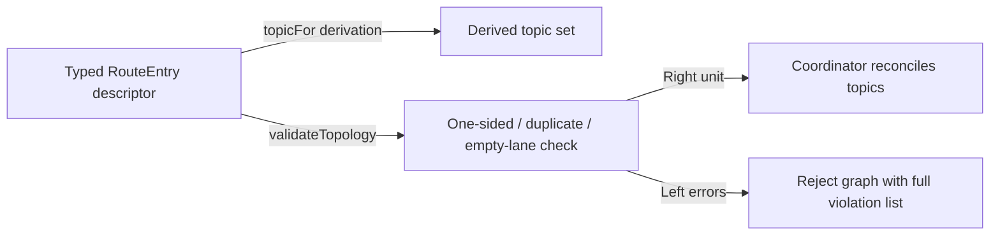

# The Native Pulsar Client

**Status**: Authoritative source
**Supersedes**: N/A
**Referenced by**: documents/engineering/README.md, documents/engineering/app_vs_deployment_doctrine.md, documents/engineering/chaos_failover_doctrine.md, documents/engineering/cluster_lifecycle_doctrine.md, documents/engineering/content_addressing_doctrine.md, documents/engineering/daemon_topology_doctrine.md, documents/engineering/host_cluster_comms_doctrine.md, documents/engineering/platform_services_doctrine.md
**Generated sections**: none

> **Purpose**: Define `amoebius-pulsar` — the one native-protocol Haskell Pulsar client (forked from
> `cr-org/supernova`) that replaces every WebSocket transport, its capability surface (lookup / produce /
> consume / subscribe / seek), the declarative topology algebra, and the at-least-once + broker-side-dedup
> delivery contract.

---

## 1. One client, one wire, no WebSockets

amoebius has **exactly one** way to talk to Pulsar: a native-protocol Haskell library, `amoebius-pulsar`,
that speaks Pulsar's TCP binary protocol directly. There is no second transport, no fallback, no
HTTP-upgrade side-door. This is the amoebius generalization of a hard lesson from the two extension
libraries it absorbs:

- **infernix** talked to Pulsar over the **WebSocket gateway** in-process (`Network.WebSockets`), opening a
  fresh WebSocket producer connection *per publish* and base64-encoding every payload into a JSON envelope
  (`Infernix.Runtime.Pulsar` — `buildProducerSocketPath`, `publishTopicPayload`).
- **jitML** talked to Pulsar by shelling out to a **Node.js subprocess** that owned the WebSocket client —
  a second language runtime and a process boundary on the hot path.

Both transports are deleted. One native client replaces both. The payoff is concrete, not cosmetic:

- **No per-publish connection churn.** A native producer is a long-lived session that sends framed binary
  messages; infernix's "one WebSocket per message" pattern (with its repeated HTTP upgrade and handshake)
  disappears.
- **No base64 inflation.** The native protocol carries raw payload bytes with a CRC32C checksum (§3); the
  WebSocket path inflated every payload ~33% into base64 inside a JSON object.
- **No second runtime.** jitML's Node subprocess and its IPC are gone; the client is plain Haskell on the
  pinned toolchain.
- **`sequence_id` is a first-class protocol field**, not a smuggled URL parameter — which makes the dedup
  contract in §6 clean rather than a hack.

> **Honesty (per [documentation_standards.md §6](../documentation_standards.md)).** "Performance via the
> native protocol" is the **design rationale** — base64 elimination, persistent producers, no process hop —
> not a benchmarked amoebius result. amoebius has not yet built Phase 4. The WebSocket costs above are read
> off the infernix/jitML source as *sibling evidence*; the amoebius speedup is expected, not measured.

The no-WebSockets rule is a **locked invariant**, recorded as a standard-service fact in
[platform_services_doctrine.md §6](./platform_services_doctrine.md): lookup, produce, consume, subscribe,
and seek all ride the native protocol or they do not happen.

---

## 2. Scope — what this document owns

This doc is the SSoT for **the client and its delivery contract**. It owns:

1. The `amoebius-pulsar` library: the native binary-protocol implementation and the supernova fork (§3–§4).
2. The capability surface: lookup / produce / consume / subscribe / seek (§5).
3. The **declarative topology algebra**: how topic names are *derived*, never written, and the
   one-sided-link validation that rejects an unroutable graph (§6).
4. The **at-least-once + broker-side dedup** delivery contract (§7).

It deliberately does **not** own, and only references:

| Concern | Owner |
|---------|-------|
| What rides *inside* a message (content-addressed refs, not blobs) | [content_addressing_doctrine.md](./content_addressing_doctrine.md) |
| *Who* runs producers/consumers, topic-lifecycle coordinators, leadership election | [daemon_topology_doctrine.md](./daemon_topology_doctrine.md) |
| *How* a host daemon reaches the broker (Pulsar peer over host-only NodePort, no mTLS) | [host_cluster_comms_doctrine.md](./host_cluster_comms_doctrine.md) |
| That Pulsar is a standard HA service on every cluster | [platform_services_doctrine.md §6](./platform_services_doctrine.md) |
| The app-spec surface that *declares* topic lifecycles | [dsl_doctrine.md](./dsl_doctrine.md) |
| Intra-cluster HA correctness (delegated to brokers/bookies) | [chaos_failover_doctrine.md](./chaos_failover_doctrine.md) |

Phase order and status are owned only by [../../DEVELOPMENT_PLAN/README.md](../../DEVELOPMENT_PLAN/README.md)
(the client lands in **Phase 4**); this doc states the target shape and links back, never a status ledger.

---

## 3. The native binary protocol

Intuition: a Pulsar frame is a length-prefixed protobuf command, optionally followed by a checksummed
metadata-and-payload tail. The client's job is to encode/decode those frames correctly and keep one TCP
session per broker connection alive.

The wire format (from the [Pulsar binary protocol spec](https://pulsar.apache.org/docs/4.0.x/developing-binary-protocol/)):

- **Simple command** (no payload): `totalSize (4B)` · `commandSize (4B)` · `command` (a protobuf
  `BaseCommand`). `BaseCommand` carries a `Type` enum and sets exactly one subcommand field.
- **Payload command** (a message): the command, then an optional broker-entry-metadata block guarded by
  magic `0x0e02`, then magic `0x0e01`, then a **CRC32C checksum** over everything after it, then
  `metadataSize` + `metadata` (protobuf) + raw `payload`.
- Maximum frame size is 5 MiB; larger application data must be a content-addressed reference, not an inline
  blob — see [content_addressing_doctrine.md](./content_addressing_doctrine.md).

Implementation rules for `amoebius-pulsar`:

- **`proto-lens` is the protobuf layer.** `BaseCommand` and message metadata are generated from
  `PulsarApi.proto` via `proto-lens` (the same `Data.ProtoLens` codegen infernix already uses:
  `encodeMessage` / `decodeMessage` / `defMessage`). Hand-rolled wire parsing of the protobuf bodies is
  forbidden — only the *framing* (size prefixes, magic numbers, CRC32C) is hand-written.
- **CRC32C is mandatory on payload frames** and checked on receive; a checksum mismatch is a structured
  decode error, never a silent drop.
- **One persistent TCP session per broker**, multiplexing producers and consumers by `producer_id` /
  `consumer_id` / `request_id`, exactly as the protocol intends. This is the structural reason the
  per-publish-connection cost of the old WebSocket path vanishes (§1).
- **Toolchain & discovery.** The fork builds on **GHC 9.12.4** (the repo-wide pin). Any code-generation
  tool it needs (e.g. `protoc` for `proto-lens`) is discovered **lazily through the substrate's package
  manager and invoked by full path** — there is **no `PATH` lookup and no environment variable** anywhere
  in the build or runtime path. That no-env/no-`PATH` contract is owned by
  [substrate_doctrine.md](./substrate_doctrine.md); it is named here only because the supernova fork must
  conform to it.


---

## 4. Forked from supernova — what we inherit and what we build

amoebius-pulsar starts as a fork of [`cr-org/supernova`](https://github.com/cr-org/supernova) (Apache-2.0,
on [Hackage](https://hackage.haskell.org/package/supernova)). Supernova already implements the binary
protocol foundation in Haskell: the `proto-lens`-generated `PulsarApi`, the CONNECT/CONNECTED handshake,
LOOKUP-based service discovery, producing, consuming with the subscription types, acknowledgment, and
seek — over dependencies amoebius already wants (`network`, `binary`, `crc32c`, `proto-lens`).

Forking — rather than depending on the published package — is the honest choice for three reasons:

1. **Supernova is explicitly early-stage** ("still very much under development… use at your own risk"). Its
   published surface demonstrates the *Exclusive* subscription and a basic produce/consume/ack loop;
   production concerns (robust reconnection, partitioned topics, dedup wiring, the topology algebra) are
   amoebius's to add.
2. **Toolchain pinning.** Supernova's dependency bounds predate GHC 9.12.4; the fork carries the bumps and
   the pin (§3).
3. **Layering.** The topology algebra (§6) and the dedup contract (§7) are amoebius doctrine, not generic
   client features; they live in the fork, above supernova's transport core.

> **Honesty.** Treat supernova as a *starting point with sibling provenance*, not a proven foundation.
> Every capability in §5 is "supernova demonstrates it" or "the protocol provides it" — neither is an
> amoebius test result. Hardening, reconnection semantics, and the dedup proof are Phase 4 work tracked in
> [../../DEVELOPMENT_PLAN/README.md](../../DEVELOPMENT_PLAN/README.md).

---

## 5. The capability surface: lookup · produce · consume · subscribe · seek

These five are the whole client. Each maps to a protocol exchange and to a daemon role
([daemon_topology_doctrine.md](./daemon_topology_doctrine.md) owns *who* uses which).

- **Lookup (service discovery).** Before producing or consuming, the client issues `LOOKUP_TOPIC` and
  follows the broker's answer: a *Connect* response names the owning broker; a *Redirect* response sends the
  client to try another broker. The client loops on redirects until it reaches an owner. This is how a
  client finds the right broker without a static map.
- **Produce.** `PRODUCER` → `PRODUCER_SUCCESS` binds a `producer_id` and a `producer_name` (client-chosen
  or broker-generated). Each `SEND` carries that `producer_id` and a `sequence_id`; the broker replies
  `SEND_RECEIPT` (with the assigned `message_id`) or `SEND_ERROR`. The `(producer_name, sequence_id)` pair
  is the dedup key (§7).
- **Consume.** `SUBSCRIBE` binds a `consumer_id` and a subscription. Consumers grant credit with `FLOW`
  permits; the broker pushes `MESSAGE` frames up to the granted permits; the consumer replies `ACK`
  (confirmed by `ACK_RESPONSE`). Flow control is the consumer's backpressure knob.
- **Subscribe — the four subscription types**, each with a distinct amoebius use:

  | Type | Shape | Typical amoebius use |
  |------|-------|----------------------|
  | **Exclusive** | one consumer per subscription | a singleton reader (e.g. control-plane projection) |
  | **Failover** | primary + standbys, ordered by consumer name | HA workflow coordinators — one active, others hot |
  | **Shared** | round-robin across many consumers | horizontally-scaled stateless workers |
  | **Key_Shared** | same key → same consumer | per-key ordering across a worker pool |

  Which role picks which type is owned by [daemon_topology_doctrine.md](./daemon_topology_doctrine.md); the
  client only exposes all four.
- **Seek (replay).** `SEEK` repositions a subscription to an earlier `message_id` (or timestamp), letting a
  consumer replay the log. This is the mechanism behind rebuild-from-log and the geo-replication
  catch-up that [chaos_failover_doctrine.md](./chaos_failover_doctrine.md) reasons about.

---

## 6. The declarative topology algebra

Intuition: **nobody writes a topic string by hand.** A topic name is a *derived* function of a typed
descriptor, and a routing graph that fails validation cannot be reconciled. This is the
illegal-state-unrepresentable principle ([illegal_state_catalog.md](./illegal_state_catalog.md)) applied to
the message bus: a malformed topology is a compile/validate error, not a runtime mystery.

The algebra is generalized from jitML's `JitML.Coordinator.Topology` (`RouteEntry` / `validateTopology` /
`topicFor`), where it already replaced a hardcoded topic list.

### Topic = `<workflow>.<command|event>.<substrate>`

A fully-qualified topic is derived, never literal:

```
persistent://<tenant>/<namespace>/<workflow>.<phase>.<substrate>
```

- **`<workflow>`** — the logical workflow (jitML's concrete instance: `training`, `tune`, `rl`,
  `inference`, `gc`).
- **`<phase>`** — `command | event` in the canonical two-sided form; the algebra admits a richer phase set
  where a workflow needs it (jitML uses `command` / `event` / `result` / `request` / `host-command`, where
  inputs are `command`/`request`/`host-command` and reports are `event`/`result`).
- **`<substrate>`** — the lane the topic is published on (`apple` / `linux-cpu` / `linux-cuda` / `windows`),
  so the same workflow's traffic is partitioned per substrate. The substrate catalog is owned by
  [substrate_doctrine.md](./substrate_doctrine.md).

The single source of truth is a **typed descriptor** — a list of `RouteEntry { workflow, phase, lanes }` —
not a list of strings. Adding a workflow or a lane edits the descriptor; the topic set is *derived* from
it. The exact reconciled topic set, and a substrate-stripped *logical* topic family for anti-drift checking
against the durable-state registry, both fall out of the same descriptor — so the per-substrate routing
cannot silently diverge from the declared logical set.

### One-sided-link validation

A routing graph is **unroutable** — and validation rejects it — when it contains any of:

1. a **duplicate** derived topic;
2. a routing entry with **no lanes** (a phase declared but published nowhere);
3. a **one-sided link** on a `(workflow, lane)` pair:
   - an **input** (`command`/`request`/`host-command`) with **no report** (`event`/`result`) on that same
     lane — work arrives that can never report back; or
   - a **report with no producing input** on that lane — a result nobody can cause — *except* an
     explicitly **emit-only** workflow (jitML's garbage-collector `gc` is the exemplar exemption).

Cashing out *why one-sidedness is illegal*: an unanswered command is a silent black hole, and an
unsourced event is a ghost. Both are exactly the kind of "compiles, deploys, then mysteriously hangs"
failure the DSL exists to prevent. `validateTopology` returns the **full list** of violations (not just the
first), so a topology author fixes the whole graph in one pass.

The DSL *surface* that lets an app declare its topic lifecycles is owned by
[dsl_doctrine.md](./dsl_doctrine.md); the **algebra and its validation** are owned here.



---

## 7. Delivery: at-least-once with broker-side dedup (the robust default)

Intuition: amoebius defaults to **at-least-once delivery, made effectively-once by broker-side
deduplication** — and it puts the dedup in the *broker*, not the client, on purpose. A producer may retry; a
consumer may be redelivered a message after a crash; the broker collapses the duplicates so idempotent
state stays correct.

### Why at-least-once is the floor

At-least-once is the honest guarantee a durable log can give cheaply: a consumer `ACK`s only after it has
processed, and an un-acked message is redelivered after a crash or rebalance. The cost is duplicates — which
dedup absorbs.

### Why dedup lives broker-side

This is generalized from infernix's `ensureNamespaceDeduplicationEnabled` + producer-side sequence wiring.
With Pulsar's **namespace deduplication policy** enabled, the broker tracks `(producer_name, sequence_id)`
pairs and **rejects duplicates** at ingest. The contract has two halves:

1. **Broker half** — deduplication is turned on for the namespace (the reconcile step).
2. **Producer half** — every publish carries a **stable `producer_name`** and a **monotonic `sequence_id`**
   within that producer scope. Pulsar stores the *highest* sequence per producer, so the producer-name
   scoping must be chosen so unrelated keys don't share one dedup cursor — exactly the
   `inferenceRequestProducerNameForFields` lesson from infernix (a stable causal id keeps the
   context-scoped producer; a one-off key gets a per-message producer name so its hash can't collapse a
   later legitimate message).

Broker-side is the **robust default** rather than client-side memoization because it survives the things
that break client memory: a restarted producer replica, a second coordinator elected after failover, a
consumer rebuild from seek (§5). The dedup state is the broker's, so it outlives any single process.

### The native protocol makes this clean

On the native protocol `sequence_id` is a **first-class field of `CommandSend`** and the broker refers to
the message by it in `SEND_RECEIPT`. Contrast infernix's WebSocket path, which had to smuggle the baseline
through an `initialSequenceId` URL query parameter and encode "I want sequence N" as
`initialSequenceId = N - 1` because it opened one producer per publish. amoebius keeps a persistent producer
and sets `sequence_id` directly — the hack is retired.

A recurring derivation amoebius adopts from infernix: when a message has a causal upstream Pulsar
`MessageId` (serialized `<ledgerId>:<entryId>:<partition>:<batchIdx>`), pack `ledgerId`/`entryId` into a
64-bit `sequence_id` (both are monotonic per topic-partition); otherwise fall back to a stable hash of a
generated request id, paired with a request-scoped producer name so unordered hashes never share a cursor.

> **Honesty.** infernix's source records that its dedup duplicate-collapse was validated against a real
> broker (its Sprint 7.14 chaos validation) — but **over WebSockets, in infernix**. That is *sibling
> evidence*, not an amoebius result: amoebius re-implements the same contract over the native protocol and
> has not yet run it. Per [documentation_standards.md §6](../documentation_standards.md) and
> [chaos_failover_doctrine.md](./chaos_failover_doctrine.md), read this section as the specified contract,
> not a proven amoebius behaviour.

### Consensus is delegated, not re-proven

amoebius does **not** re-prove Pulsar's intra-cluster HA. Synchronous broker/bookie replication is Pulsar's
own consensus problem and is delegated to it; the only proof obligation that concentrates on amoebius is the
**asynchronous cross-cluster** boundary (the "Second Axis"), owned by
[chaos_failover_doctrine.md](./chaos_failover_doctrine.md). Seek (§5) and at-least-once + dedup are the
client-side primitives that the cross-cluster reasoning is built on, but the durable-replication correctness
itself is not this doc's claim.

---

## 8. What this client replaces

The whole point of `amoebius-pulsar` is collapse: two transports, two runtimes, one client.

| Was | Mechanism (sibling source) | Becomes |
|-----|----------------------------|---------|
| infernix Pulsar I/O | direct in-process **WebSocket** gateway, one producer per publish, base64-in-JSON payloads (`Infernix.Runtime.Pulsar`) | `amoebius-pulsar` native protocol |
| jitML Pulsar I/O | **Node.js subprocess** owning the WebSocket client | `amoebius-pulsar` native protocol |
| jitML topic strings | typed `RouteEntry` + `validateTopology` (`JitML.Coordinator.Topology`) | the topology algebra (§6), promoted into the client doctrine |
| infernix dedup wiring | namespace dedup policy + `(producer_name, sequence_id)` + `initialSequenceId` URL hack | broker-side dedup with `sequence_id` as a native field (§7) |

infernix and jitML remain **ML extension libraries**; they stop shipping their own transports and consume
`amoebius-pulsar` instead — one subsystem at a time, per the Phase 5 migration in
[../../DEVELOPMENT_PLAN/README.md](../../DEVELOPMENT_PLAN/README.md).

---

## 9. Planning ownership

This document is normative client doctrine only. Delivery sequencing, completion status, and validation
gates are owned by [../../DEVELOPMENT_PLAN/README.md](../../DEVELOPMENT_PLAN/README.md): the native client,
the topology algebra, and the round-trip gate land in **Phase 4**, and the infernix/jitML migration onto it
is **Phase 5**. This doc never maintains a competing status ledger.

---

## Cross-references

- [Engineering Doctrine Index](./README.md)
- [Content Addressing Doctrine](./content_addressing_doctrine.md)
- [Daemon Topology Doctrine](./daemon_topology_doctrine.md)
- [Host ↔ Cluster Comms Doctrine](./host_cluster_comms_doctrine.md)
- [Platform Services Doctrine](./platform_services_doctrine.md)
- [DSL Doctrine](./dsl_doctrine.md)
- [Illegal State Catalog](./illegal_state_catalog.md)
- [Substrate Doctrine](./substrate_doctrine.md)
- [Chaos / Failover Doctrine](./chaos_failover_doctrine.md)
- [Development Plan](../../DEVELOPMENT_PLAN/README.md)
- [Documentation Standards](../documentation_standards.md)
- [Pulsar binary protocol specification](https://pulsar.apache.org/docs/4.0.x/developing-binary-protocol/)
- [cr-org/supernova](https://github.com/cr-org/supernova)
