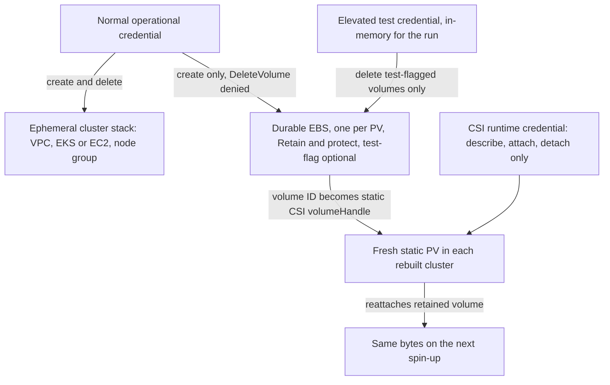

# Pulumi EBS credential model

> **Purpose**: Define the create-vs-delete credential split for EBS volumes — which authority may create a volume, which may delete one, and why the two are never the same credential.
> **Read this if**: a provisioning path creates or removes durable block storage and you need to know which credential it runs under.

This document owns the EBS credential split and the deletion authority that follows from it. It does not own the surrounding subject — owned by
[pulumi_iac_doctrine.md](./pulumi_iac_doctrine.md), of which this is a slice.

Link-graph metadata

**Status**: Authoritative source
**Supersedes**: N/A
**Referenced by**: DEVELOPMENT_PLAN/phase_48_test_workflow_algebra.md, DEVELOPMENT_PLAN/phase_76_provider_deploy_checkpoint.md, DEVELOPMENT_PLAN/phase_78_provider_ebs_credential.md, documents/engineering/README.md, documents/engineering/backup_recovery_doctrine.md, documents/engineering/inforcespec_migration_doctrine.md, documents/engineering/pulumi_iac_doctrine.md, documents/engineering/single_logical_data_plane_doctrine.md, documents/engineering/storage_lifecycle_doctrine.md, documents/engineering/testing_doctrine.md, documents/illegal_state/illegal_state_storage.md, documents/illegal_state/illegal_state_techniques.md
**Generated sections**: none

> **Historical result (invalidated).** Every phase-run or implementation-result statement in this document is permanently invalidated diagnostic history. It cannot establish or reactivate current status, even if a phase later advances. Target doctrine remains normative; current status is solely in the [tracker](../../DEVELOPMENT_PLAN/README.md).

---

## 6. The EBS create-vs-delete credential model

This is the section the storage doctrine defers to
([storage_lifecycle_doctrine.md §5](./storage_lifecycle_doctrine.md#5-sizes-are-explicit-hard-capped-and-one-volume-per-claim) and [§7](./storage_lifecycle_doctrine.md#7-deleting-durable-data-is-forbidden-under-normal-operation)) and
the one the original vision flags as genuinely open: *"does this mean eg EBS drives are not in pulumi? or
that the AWS keys only have authority to create, not delete, EBS resources? (and test cleanup should only be
done with elevated permissions?) … does it make sense for pulumi to create with one set of credentials then
destroy with another? or is the harness manually deleting these resources then destroying the pulumi backend
(after a final resource sweep)?"* This doctrine takes a **design position** and resolves it.

**The risk.** Durable storage must survive every ordinary teardown, or "ephemeral cluster,
durable data" collapses. But a Pulumi stack that *creates* a volume can, by
default, *destroy* it on `pulumi destroy`. If the ephemeral cluster stack owned its EBS volumes, tearing
the cluster down would delete the data. So the EBS volumes must be **structurally** outside the ephemeral
destroy set, and the authority to delete them must be **structurally** withheld from normal operation.

**The resolution — five locked decisions.**

1. **EBS volumes are in Pulumi, but in their own durable class — never in the ephemeral cluster stack.**
   The cluster stack (VPC, EKS/EC2, node group) is per-run and freely destroyable; the per-PV EBS volumes
   are a *durable* class ([§3](./pulumi_iac_doctrine.md#3-state-lifetime-matches-resource-lifetime-per-class)) carried in separate state and flagged `Retain`/`protect` so a normal
   `pulumi destroy` of the cluster never includes them. This is the IaC realization of
   storage_lifecycle's node-vs-storage decoupling: a destroyed node's volume detaches and survives, and
   the next bring-up re-attaches the same volume to the same claim
   ([storage_lifecycle_doctrine.md §5.1](./storage_lifecycle_doctrine.md#51-storage-is-independent-of-the-node-lifecycle) and [§6](./storage_lifecycle_doctrine.md#6-the-lossless-teardown-guarantee-deterministic-rebind)).
   Before create, the provision witness contains a deterministic `ProviderVolumeSlotId` derived from account,
   cluster, StatefulSet claim slot, and the private allocation-rounded `ProviderVolumeRequest` (type, zone,
   `requiredUsableBytes`, allocation minimum/quantum, `sizeGiB`, `provisionedBytes`, presentation, and
   witness)—never a fabricated future EBS id. Its rounded raw
   bytes/count debit the observed quota. `CreateVolume` moves the private backing from `Promised` to
   `Materialized` only after the returned raw size and `ProviderVolumeId` are attached and cross-checked;
   retained rebind preserves the slot. The 1:1 rule here is claim/PVC/PV/EBS identity and cardinality, not
   equality between logical, usable, pre-rounding raw, and provider-rounded bytes.
2. **Normal operational credentials can create EBS but cannot delete it.** The least-privilege operational
   credential — the one a running cluster uses for ordinary deploys — is granted `ec2:CreateVolume` (and
   the cluster-stack create/delete it needs) but **denied `ec2:DeleteVolume`** on durable, retained
   volumes. "Accidentally delete durable storage" is therefore *unauthorized at the cloud API*, not merely
   discouraged by policy (the requirement is set by
   [storage_lifecycle_doctrine.md §7](./storage_lifecycle_doctrine.md#7-deleting-durable-data-is-forbidden-under-normal-operation), the credential mechanics are owned
   here).
3. **The elevated test harness is the only automated EBS deleter, and only for test-flagged volumes.**
   Leak-free test cycles *must* reclaim what they create. The elevated test credential — held in
   memory for the run, never stored — carries the delete authority the normal credential lacks, and uses it
   **only on volumes carrying the harness's test flag**. The flag-and-sweep
   mechanism, the per-run leak ledger, and the always-tear-down test `.dhall` are owned by
   [testing_doctrine.md](./testing_doctrine.md); this doc owns the credential split and the
   create/delete authority boundary.
4. **Pulumi creates the volume; a static-only AWS EBS CSI path attaches it.** Kubernetes does not dynamically
   provision EBS. The upstream AWS EBS CSI controller/node components and required sidecars are baked into the
   amoebius base image and installed from typed manifests — no Helm and no public image pull — with no
   external-provisioner component. Each rebuilt cluster receives a fresh PV whose
   `spec.csi.driver` is `ebs.csi.aws.com`, whose `volumeHandle` is the durable Pulumi EBS ID, and whose node
   affinity names that volume's Availability Zone; the sole StorageClass remains
   `kubernetes.io/no-provisioner`. The CSI runtime identity is distinct from the Pulumi operational identity:
   it may describe/attach/detach, but is denied both `CreateVolume` and `DeleteVolume`. This consumes the
   provider's upstream CSI implementation; amoebius does not build its own attach controller.
5. **Replacement and shrink are explicit old+new migrations, never in-place edits or advance capacity credit.** A provider-volume transition starts from a `StorageMigrationIntent` naming a raw
   `PriorProvisionRefSource` Volume arm. gadt-decode validates and brands that arm as an opaque
   `PriorVolumeProvisionRef`; binding expands it to
   `StorageMigrationDemand { identity, old, replacement, policy }`. Provisioning resolves `old` from the
   prior `ProvisionedSpec` context and presentation-rounds the
   replacement and privately returns `ProvisionedStorageMigration { old, replacement, workspaceBytes,
   copyExecution, perBackingPeak, witness }`. Before `CreateVolume`, the fold fits the old raw allocation, new
   raw allocation, copy/verification workspace, provider volume-count overlap, and the complete copy/verify
   Job `PodResourceEnvelope` (image, CPU/memory, pod-ephemeral, logs, writable root, mapped inputs, exact
   byte-free `PodRuntimeMetadataSource` network/mount identities, concurrency, rollout, and termination).
   Cutover follows verified copy; failure or loss of observation retains both
   volumes and the checkpoint evidence. Even after cutover, old bytes/count remain charged until a fresh
   privileged external observation proves deletion, so a smaller desired volume is never capacity credit for
   creating its replacement.

Production break-glass reclaim is deliberately outside this automated model. No `.dhall`, reconciler, or
test-harness credential can delete production EBS; after verified migration the old backing remains until a
human operator performs an audited external reclaim against its exact `ReclaimEligible` record.

**On "create with one credential, destroy with another."** For test cleanup, the vision worries whether Pulumi can create
under one credential and destroy under another. amoebius's answer avoids the hazard by *separating the
state*, not by swapping credentials inside one stack: the durable EBS lives in its own state, so the
elevated harness destroys it through a *deletion of its own durable-class resources* — observe the
test-flagged volume, delete it under elevated authority, then prune the now-orphaned durable-class
checkpoint entry. This is exactly the vision's second option ("the harness manually deleting these
resources then destroying the pulumi backend after a final resource sweep"), made principled: the sweep is
the reconciler's `reconcileAbsent` over the durable test-flagged subset, and the final tag-sweep backstop
is supplemented by the independent Kubernetes/host/cloud inventory backstop, which fails closed on any
survivor — both owned by the reconciler and testing doctrines
([cluster_lifecycle_doctrine.md §9](./cluster_lifecycle_doctrine.md#9-how-bring-up-and-teardown-are-implemented-the-reconciler-not-a-state-machine)) and the prodbox lifecycle pattern it
generalizes.

*Orientation. Design intent; the credential model is owned by [§6](#6-the-ebs-create-vs-delete-credential-model). The operational credential is denied volume deletion at the cloud API, so a cluster destroy cannot remove durable backing; whether the cloud honours that denial is runtime-checked.*

> **Honesty.** This is a **design resolution of an explicitly open question**, not
> a built or tested amoebius capability. The credential split, the `protect`/`Retain` separation, the
> static-only CSI attachment, and the elevated test-flagged sweep are specification to be validated — the
> credential-class split is *proven in prodbox* (operational vs ephemeral-elevated credentials per resource
> class), but EBS-in-prodbox is
> CSI-driver-created, not Pulumi-tracked, so amoebius's Pulumi-tracked durable-EBS model is **new design, > not inherited proof.** Delivery is tracked in
> [../../DEVELOPMENT_PLAN/README.md](../../DEVELOPMENT_PLAN/README.md).

The **backup write credential** is a sibling of this create-vs-delete split. A backup is written under a
put-only credential whose `allowedActions` structurally excludes `DeleteObject`/`ExpireObject`/
`PutBucketLifecycle`, so amoebius can write backups but never delete, expire, or lifecycle them; retention and
deletion belong to a distinct lifetime class ([§3](./pulumi_iac_doctrine.md#3-state-lifetime-matches-resource-lifetime-per-class))
owned by the medium's object-lock policy, a separate external account, or an audited human break-glass. The
put-only backup credential and its enforcement layer are owned by
[`backup_recovery_doctrine.md` §4](./backup_recovery_doctrine.md#4-the-write-but-never-delete-credential-boundary);
this doctrine owns only that its create-vs-delete boundary is the model the backup credential specializes.

---

## Related Documents
- [Pulumi EBS credential model hub](./pulumi_iac_doctrine.md) — the document this slice belongs to.
- [Engineering Doctrine Index](./README.md)
