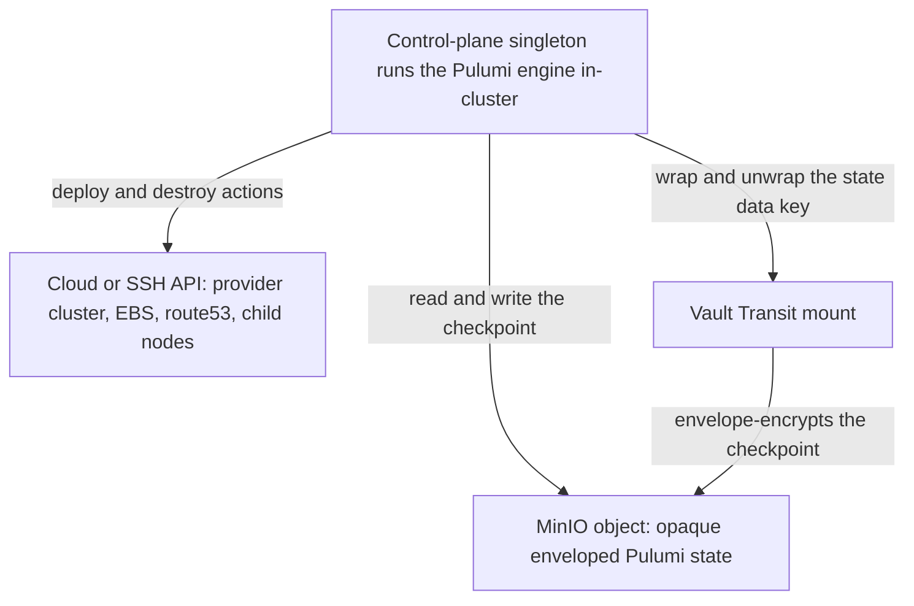
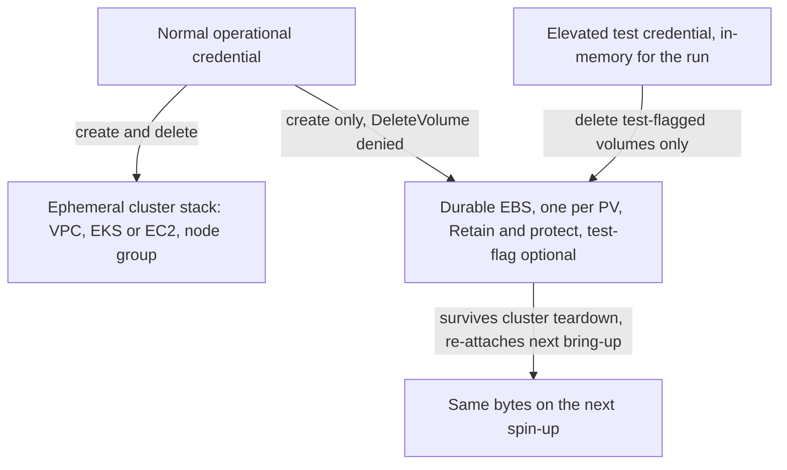

# Pulumi IaC

**Status**: Authoritative source
**Supersedes**: N/A
**Referenced by**: documents/engineering/README.md, documents/engineering/cluster_lifecycle_doctrine.md, documents/engineering/cluster_topology_doctrine.md, documents/engineering/gateway_migration_doctrine.md, documents/illegal_state/illegal_state_catalog.md, documents/engineering/image_build_doctrine.md, documents/engineering/platform_services_doctrine.md, documents/engineering/pulsar_client_doctrine.md, documents/engineering/resource_capacity_doctrine.md, documents/engineering/single_logical_data_plane_doctrine.md, documents/engineering/storage_lifecycle_doctrine.md, documents/engineering/substrate_doctrine.md, documents/engineering/testing_doctrine.md, documents/engineering/tla_modelling_assumptions.md, documents/engineering/vault_pki_doctrine.md
**Generated sections**: none

> **Purpose**: Single Source of Truth for how amoebius runs Pulumi — only from inside an existing amoebius cluster, with every byte of state held as a Vault-Transit-enveloped object in MinIO — to provision provider-managed clusters (EKS), spawn self-managed children, materialize per-PV EBS volumes under the create-but-never-delete credential model, and integrate DNS (route53) and TLS (zerossl); and how independent deploys are parallelized applicatively.

---

## 0. Decision record: why Pulumi stays — and why that is not the Helm decision

amoebius dropped Helm ([manifest_generation_doctrine.md §1](./manifest_generation_doctrine.md#1-why-this-doctrine-exists-types-render-manifests-helm-does-not)) but keeps
Pulumi, and the two decisions can look inconsistent until the asymmetry that separates them is made explicit.

**Helm sat on a substrate that already reconciles; Pulumi sits on one that does not.** Kubernetes *is* a
reconciler — the apiserver, its controllers, and server-side apply already drive observed state toward a
declared desired state. Helm was a (stringly-typed) wrapper over `kubectl apply` on top of that engine, so
dropping it costs little: amoebius renders better-typed inputs and hands them straight to the reconciler
that already exists. Cloud provider APIs (EKS, EC2/EBS, route53, ACME) have **no** built-in declarative
reconciler — Pulumi *is* the state, diff, dependency-ordering, and `destroy` engine. Dropping Pulumi would
mean building or adopting an engine that otherwise does not exist. The work Pulumi does is therefore
materially harder to replace than the work Helm did; the two removals are *not* symmetric.

**The v1 decision: keep Pulumi.** It brings mature multi-cloud CRUD/diff/destroy and provider coverage, and
its encrypted-MinIO-backend + Vault-Transit envelope shape ([§2](#2-the-backend-every-byte-of-state-is-a-vault-enveloped-object-in-minio)) is *proven in the sibling prodbox project*.
Reimplementing that surface is a far larger and riskier undertaking than the Helm removal was, for no
present gain.

**The tension.** Pulumi's checkpoint is a *stored* second state store — exactly the shape
amoebius rejects in Helm's release Secret, whose "the stored state and the world disagree" desync mode the
manifest doctrine calls out ([manifest_generation_doctrine.md §6](./manifest_generation_doctrine.md#6-the-reconcile-state-model-desired-is-renderinforcespec-observed-is-etcd-a-diff-is-typed)). And
[§8](#8-how-deploys-are-enacted-the-reconciler-referenced-not-restated) of this very doc argues *against* a global stored state machine ("data in, data out — each `discover`
queries the right authority at the moment of use"), which points toward tag-based discovery of live cloud
state rather than toward a checkpoint. So keeping Pulumi is the pragmatic v1 choice, not a perfect fit for
the thesis.

**Crossplane is rejected.** The obvious alternative — modelling cloud resources as typed CRs reconciled
*in-cluster*, collapsing this engine into the server-side-apply manifest reconciler and removing the external
checkpoint — is **declined** for a provability-first system. Crossplane requires parent/management clusters to
run its provider controllers **continuously** (a standing footprint on even the laptop root, *and* an
autonomous substrate authority acting on its own reconcile loop beside the control-plane singleton — a categorically
larger delegation than the in-cluster operators the manifest doctrine blesses
([manifest_generation_doctrine.md §4](./manifest_generation_doctrine.md#4-no-third-party-charts--no-third-party-software-operators-are-generated))); it stores state in **k8s Secrets,
at odds with the Vault-centric secrets model** the whole forest trust tree rests on
([vault_pki_doctrine.md](./vault_pki_doctrine.md)); and its continuous autonomous reconcile is **harder to
formally prove** than Pulumi's batch invocation under the singleton plus amoebius's own typed reconciler. This
closes the open `notes.txt` question *"do we actually need pulumi? can our state be the dhall just as it was
with helm?"*: **yes — Pulumi stays for v1, Crossplane is out.**

**The same "surface a provider capability, do not build a second control plane" line governs stretched full
nodes.** The Crossplane rejection above generalizes into a discipline this round leans on elsewhere: where a
*provider-managed* control plane would otherwise force amoebius to stand up an autonomous continuous fabric
beside the control-plane singleton, amoebius declines to build it and instead surfaces the provider's own capability
if one exists. The concrete case is a **stretched full k8s member node** (a kubelet whose declared
network-locality differs from its control plane's): on a self-managed rke2 control plane it is representable
over amoebius's own WireGuard fabric + distro-mTLS, but on a **`Managed Eks`** control plane it is
representable **only** if the provider natively supports it — **EKS Hybrid Nodes**. That, if ever added, is a
provider capability the `Managed Eks` arm would *surface* (provisioned via the cloud API,
[§4](#4-what-pulumi-provisions-the-resource-catalog)), **never** an amoebius-built continuous second
control-plane fabric — which would be exactly the "autonomous substrate authority acting on its own reconcile
loop beside the control-plane singleton" Crossplane shape rejected here. Absent that provider-native arm, a stretched
full node on a managed control plane simply has **no constructor** — type-foreclosed uninhabitable, the closed-union
"no arm = not supported" idiom owned by [cluster_topology_doctrine.md §2, §4.1](./cluster_topology_doctrine.md#2-computeengine-a-closed-union-eks-a-first-class-arm);
the surface-a-provider-capability-vs-build-a-fabric axis it rests on is
[cluster_lifecycle_doctrine.md §1](./cluster_lifecycle_doctrine.md#1-two-cluster-kinds-one-lifecycle-shape).
This is design intent recorded before any provisioning code exists, exactly like the Crossplane decision above.

**But the checkpoint drawback is contained, not tolerated everywhere.** Where a resource class is high-churn,
self-describing, and holds **no durable state** — the elastic spot worker pool that
[single_logical_data_plane_doctrine.md](./single_logical_data_plane_doctrine.md) attaches to the home data
plane — the checkpoint is pure liability and [§8](#8-how-deploys-are-enacted-the-reconciler-referenced-not-restated)'s "data in, data out, discover each time" is strictly better.
That class is **carved out of Pulumi into a bespoke checkpoint-free reconciler** (`create → tag → join-fabric
→ drain-by-tag`, discovering live state by an `amoebius`-fleet tag each tick), realizing [§8](#8-how-deploys-are-enacted-the-reconciler-referenced-not-restated) exactly. **Pulumi
therefore stays the engine for the coarse, durable, dependency-ordered substrate** (EKS spawn, per-PV EBS,
route53, zerossl, self-managed children) where a checkpoint earns its keep, and nothing else.

> **Honesty.** This is a design decision recorded before any amoebius provisioning code exists, per
> [documentation_standards.md §6](../documentation_standards.md#6-honesty-the-proventestedassumed-discipline). The Pulumi backend shape is prodbox-proven
> evidence, not an amoebius result; the Crossplane rejection and the bespoke checkpoint-free fleet reconciler
> are recorded design decisions, not built or tested capabilities.

---

## 1. Pulumi runs only from inside an existing amoebius cluster

A laptop shell that can `pulumi up` is a laptop that holds long-lived cloud
credentials, a plaintext state file, and the unilateral power to mutate live infrastructure — exactly the
ad-hoc, env-var-driven, secret-on-disk shape amoebius exists to abolish. So amoebius makes Pulumi a
*cluster capability*, not a host tool: **"via pulumi, amoebius may spawn other k8s clusters … in all cases
these deployments are to be tracked using pulumi, using minio backend, locally encrypted via vault
transport engine"** and **"eks clusters, along with all pulumi deploys of all assets, only happens within
an existing amoebius cluster, using MinIO as the backend and vault envelope encryption for that backend"**.

Concretely:

- **The Pulumi engine runs under the in-cluster control-plane singleton**, never on a bare host. The
  singleton is the total cluster + secret authority; its single-instance delegation and worker-role model are owned
  by [daemon_topology_doctrine.md](./daemon_topology_doctrine.md). A deploy is therefore something the
  cluster *does*, gated by the same authority that owns every other mutation — not something an operator's
  shell does behind the cluster's back.
- **The root is the bottom turtle.** The very first cluster (typically a single-node `kind` on an admin's
  laptop) is *bootstrapped*, not Pulumi-deployed — bootstrap needs no secrets and no backend
  ([cluster_lifecycle_doctrine.md §2](./cluster_lifecycle_doctrine.md#2-bring-up-and-bootstrap)). Every cluster *after* the root is
  a Pulumi deploy issued from inside an already-running parent. There is no chicken-and-egg: bootstrap
  makes the first cluster; that cluster's Pulumi makes the next.
- **No environment variables, no `PATH`, ever.** The `pulumi` binary, the cloud-provider plugin, and any
  CLI a deploy shells out to are discovered lazily through the substrate's package manager and invoked by
  full path; credentials and backend coordinates come from the `.dhall` and Vault, never from process
  environment (the no-env contract is owned by
  [substrate_doctrine.md](./substrate_doctrine.md)). amoebius does not export `PULUMI_*`,
  `AWS_*`, or `PULUMI_CONFIG_PASSPHRASE` into a child process's environment as a side channel.

This single rule is what the rest of the document elaborates: where the state lives ([§2](#2-the-backend-every-byte-of-state-is-a-vault-enveloped-object-in-minio)), how long it lives
([§3](#3-state-lifetime-matches-resource-lifetime-per-class)), what it provisions ([§4](#4-what-pulumi-provisions-the-resource-catalog)–[§6](#6-the-ebs-create-vs-delete-credential-model)), and how independent deploys run concurrently ([§7](#7-applicative-parallelism-for-independent-deploys)).

---

## 2. The backend: every byte of state is a Vault-enveloped object in MinIO

Pulumi's checkpoint holds the credentials and state that grant full control of the managed cloud
resources — it records resource IDs, outputs, and often secret material. If it sits in a plaintext local file or a cloud-vendor state service, then a
`.data/` snapshot or an S3 read leaks the whole infrastructure. amoebius refuses both: state lives in the
cluster's own object substrate, **encrypted with a key the cluster's Vault holds**, so a stolen snapshot is
opaque ciphertext.

- **Backend = MinIO.** The Pulumi backend is the in-cluster MinIO object store — the same S3 substrate that
  holds the content-addressed store and app buckets ([platform_services_doctrine.md](./platform_services_doctrine.md);
  [storage_lifecycle_doctrine.md](./storage_lifecycle_doctrine.md)). The checkpoint is one **opaque object**,
  not a vendor-managed state service and not a host file.
- **Encryption = a Vault-Transit envelope.** The checkpoint is sealed with a data key that Vault's Transit
  engine wraps and unwraps; the plaintext key never lands on disk, and MinIO sees only ciphertext.
  **This doctrine does not own the envelope mechanism** — the Transit mount, the
  wrap/unwrap policy, the seal/unseal posture, and the parent/child trust tree are owned by
  [vault_pki_doctrine.md](./vault_pki_doctrine.md). This doc owns only the *requirement* that Pulumi state
  be a Transit-enveloped MinIO object and never anything weaker.
- **Per-child state is keyed per child.** When a parent spawns a child, that child's Pulumi state and its
  subtree spec are enveloped under the child's **own per-child Transit key**
  (`transit/amoebius-<child-id>-config`), not a single shared parent key — so a child's checkpoint is opaque
  to its siblings even under an unsealed parent. The per-child key mechanism and policy are owned by
  [vault_pki_doctrine.md §6](./vault_pki_doctrine.md#6-parentchild-unseal-two-sanctioned-modes); this doc
  only requires that each child's backend object use it.
- **Durability rides the platform's durable storage.** Because the backend is MinIO, and MinIO's own bytes
  live on `no-provisioner` retained PVs, the checkpoint survives a cluster teardown-and-rebuild exactly the
  way every other durable object does — a rebuilt cluster *reattaches* its Pulumi history rather than
  losing it. The retained-PV rebind contract is owned by
  [storage_lifecycle_doctrine.md](./storage_lifecycle_doctrine.md); this doc only relies on it.
- **A sealed Vault fails the deploy closed.** Reading or writing the checkpoint requires an unsealed Vault
  whose policy permits the Transit unwrap. A deploy or destroy that cannot reach an unsealed Vault
  **refuses before any cloud mutation** rather than degrading to an unencrypted or un-checkpointed run —
  the fail-closed posture is owned by [vault_pki_doctrine.md](./vault_pki_doctrine.md) and mirrors prodbox's
  Vault gate on every `aws stack` action.

> **Honesty.** This backend shape is **proven in the sibling prodbox project** (`Prodbox.Pulumi.EncryptedBackend`:
> a scratch backend hydrated from an opaque Model-B MinIO object, with a Transit/KV Vault gate on every
> apply/destroy). That is *evidence from a sibling system, not proof in amoebius*, which has not built its
> backend layer. Read every statement here as design intent
> ([documentation_standards.md §6](../documentation_standards.md#6-honesty-the-proventestedassumed-discipline)).

---

## 3. State lifetime matches resource lifetime, per class

A leak is almost always a *lifetime mismatch* — state that outlived its resources (a stale
checkpoint pointing at nothing) or resources that outlived their state (orphans Pulumi can no longer see).
amoebius forecloses both by classifying every deploy and pinning **state lifetime to resource lifetime,
per class.** This generalizes the prodbox **State-Lifetime Rule**
(`prodbox/documents/engineering/lifecycle_reconciliation_doctrine.md [§2](#2-the-backend-every-byte-of-state-is-a-vault-enveloped-object-in-minio)`) from "AWS stacks" to "anything an
amoebius forest can Pulumi-deploy."

| Lifetime class | Examples | State (checkpoint) lifetime | Credential class ([§6](#6-the-ebs-create-vs-delete-credential-model)) |
|---|---|---|---|
| **Ephemeral / per-run** | A child cluster's VPC + control plane + node group; test-spun substrate; dynamically provisioned nodes | Lives exactly as long as the cluster/run; destroyed with it | Normal operational credential (create + delete) |
| **Durable** | Per-PV EBS volumes (one per PV, [§6](#6-the-ebs-create-vs-delete-credential-model)); retained DNS zones | Outlives any single cluster; never destroyed by a normal teardown | Normal credential **creates**; only the elevated test harness **deletes** test-flagged ones ([§6](#6-the-ebs-create-vs-delete-credential-model)) |
| **Long-lived shared** | A shared DNS apex/parent zone; a long-lived TLS retention store | Provisioned once, retained by design; destroyed only by an explicit, privileged total-teardown | Elevated/admin credential, matching the power to its lifetime |

**The rule (verbatim in spirit from prodbox):** *no new Pulumi deploy may be added to any amoebius code path
without first deciding its lifetime class, selecting the matching backend object, and matching the
credential class.* In prodbox this is machine-enforced — every stack is one `StackDescriptor` record and a
`check-code` lint refuses a creatable-but-unclassified resource. amoebius adopts the same totality:

- **Per-run state dies with its run.** A child cluster torn down (gracefully or by chaos) takes its own
  checkpoint with it; the per-run class is precisely the set whose "I cannot observe the state" outcome is
  *equivalent* to "the state is gone," because the state was scoped to the now-absent cluster.
- **Durable and long-lived state is never auto-destroyed.** A cluster teardown reconciles only the
  *ephemeral* class to absent; it must not touch durable EBS or long-lived shared infra. This is the
  Pulumi-side reading of the storage cardinal rule
  ([storage_lifecycle_doctrine.md §7](./storage_lifecycle_doctrine.md#7-deleting-durable-data-is-forbidden-under-normal-operation)): durable storage exists until a
  deliberate, privileged deletion, never "until the next teardown."
- **The class assignment is the single source of truth for both backend and credential.** A resource's
  class selects *which* checkpoint object it lives in and *which* credential may mutate it, so the two can
  never drift apart. The managed-resource registry that makes this total — one typed entry per creatable
  resource, each with a `discover` and a `destroy` — is owned by the reconciler doctrine
  ([cluster_lifecycle_doctrine.md §9](./cluster_lifecycle_doctrine.md#9-how-bring-up-and-teardown-are-implemented-the-reconciler-not-a-state-machine)); this doc supplies the Pulumi
  entries' *lifetime-and-credential* metadata.

---

## 4. What Pulumi provisions (the resource catalog)

Pulumi is amoebius's provisioning mechanism for everything that is *not* a typed-manifest-reconciled
in-cluster object. In-cluster workloads are reconciled through the kube API by amoebius's own typed reconciler
([manifest_generation_doctrine.md](./manifest_generation_doctrine.md)); the **substrate beneath and around** a
cluster — the cloud account, the other clusters, the DNS, the certs — is reconciled through Pulumi. This
table is the catalog; the **owner** column names where each resource's *meaning* lives, so this doc never
duplicates it.

| Resource | What Pulumi does here | Owned by |
|---|---|---|
| **Provider-managed clusters** (EKS — prodbox's reality) | Provision the managed cluster via cloud keys over the API, from inside a parent; land the stateless in-cluster singleton daemon | Lifecycle meaning: [cluster_lifecycle_doctrine.md §1, §3](./cluster_lifecycle_doctrine.md#1-two-cluster-kinds-one-lifecycle-shape) |
| **Spawned self-managed children** (`kind` / `rke2`) | Provision nodes via one or more SSH keys, then bring up the standard service set | Spawn lifecycle: [cluster_lifecycle_doctrine.md §3](./cluster_lifecycle_doctrine.md#3-amoebic-spawning--the-recursive-forest) |
| **Dynamic node provisioning** | Add/drain EC2 or managed nodes driven by load / spot cost / workflow completion, enacting a typed `ScalingPolicy` | Elastic-shape policy: [cluster_lifecycle_doctrine.md §8](./cluster_lifecycle_doctrine.md#8-dynamic-node-provisioning); the `ScalingPolicy` type + capacity fold: [resource_capacity_doctrine.md §6](./resource_capacity_doctrine.md#6-growable--scalingpolicy-the-escape-valve-amoebius-owns) |
| **Cloud resource quota** | The outer bound on cloud storage/compute — the `CloudQuota` backing ceiling and the `ScalingPolicy` cap, so "unbounded" cloud storage is never truly unbounded | Backing union: [storage_lifecycle_doctrine.md §5.2](./storage_lifecycle_doctrine.md#52-the-storage-backing-is-bounded--the-closed-storagebacking-union); the fold: [resource_capacity_doctrine.md](./resource_capacity_doctrine.md) |
| **Per-PV EBS volumes** | One EBS per PV, sized 1:1 to its PVC, decoupled from the EC2/node lifecycle | Sizing/rebind invariant: [storage_lifecycle_doctrine.md §5, §5.1](./storage_lifecycle_doctrine.md#5-sizes-are-explicit-hard-capped-and-one-volume-per-claim); credential model: [§6](#6-the-ebs-create-vs-delete-credential-model) here |
| **DNS — route53** | Provision/maintain hosted zones and records | This doctrine, [§5](#5-dns-route53-and-tls-zerossl-the-provider-integrations-this-doctrine-owns) |
| **TLS — zerossl** | The ACME **provider integration** only: the ZeroSSL account/directory choice, the EAB credential (a `SecretRef` into Vault), the route53 zone/credential the solver uses, and the **retained** certificate material across rebuilds. **Issuance itself is cert-manager's**, in-cluster — see [§5.2](#52-tls--zerossl) | This doctrine, [§5](#5-dns-route53-and-tls-zerossl-the-provider-integrations-this-doctrine-owns); the in-cluster issuer → [manifest_generation_doctrine.md §4](./manifest_generation_doctrine.md#4-no-third-party-charts--no-third-party-software-operators-are-generated) |

Two boundaries worth stating, because they are easy to blur:

- **Pulumi provisions the cluster; the typed reconciler fills it.** Pulumi stops at the substrate boundary —
  it stands up the managed/self-managed cluster and its node set. The standard services *inside* the cluster
  (the registry, MinIO, Vault, Pulsar, **cert-manager and its rendered `ClusterIssuer`/`Certificate` CRs**, …,
  all HA) are reconciled from **typed manifests — no Helm** — and
  owned by [platform_services_doctrine.md](./platform_services_doctrine.md) and
  [manifest_generation_doctrine.md](./manifest_generation_doctrine.md), not by Pulumi.
- **Pulumi provisions DNS/TLS; Keycloak owns the ingress that uses them.** This doc owns the route53/zerossl
  *provider integration* ([§5](#5-dns-route53-and-tls-zerossl-the-provider-integrations-this-doctrine-owns)). The wild-ingress routing those records and certs front — LB → Gateway API →
  Keycloak — is owned by [platform_services_doctrine.md §9](./platform_services_doctrine.md#9-the-loadbalancer-and-the-single-wild-ingress-path), and the
  failover **repoint** of those DNS records when a lead's gateway dies is owned by
  [chaos_failover_doctrine.md](./chaos_failover_doctrine.md). Provisioning, routing, and failover are three
  different concerns with three different owners.
- **A provider-native node capability is *surfaced* into this catalog, never re-built.** Should a provider
  offer off-cloud full-member nodes on its own managed control plane — **EKS Hybrid Nodes** — that capability,
  if ever added, would enter this catalog as one more Pulumi-provisioned resource the `Managed Eks` arm
  *surfaces* over the cloud API, on the same "surface, don't build" rationale
  [§0](#0-decision-record-why-pulumi-stays--and-why-that-is-not-the-helm-decision) records for the Crossplane
  rejection. It would be provisioned exactly as the managed cluster itself is (the first catalog row), **not**
  stood up as an amoebius-built continuous second control-plane fabric; absent the provider-native arm, a
  stretched full member node on a managed control plane is unrepresentable
  ([cluster_topology_doctrine.md §2, §4.1](./cluster_topology_doctrine.md#2-computeengine-a-closed-union-eks-a-first-class-arm)).

---

## 5. DNS (route53) and TLS (zerossl): the provider integrations this doctrine owns

A cluster that terminates public TLS and answers on a public name needs two external facts
to be *true in the world* — a DNS record that points at its load balancer, and a certificate a browser will
trust. Both are external mutations, so both are Pulumi/IaC concerns, and **amoebius models them so the wrong
binding is unrepresentable**.

### 5.1 DNS — route53

- **A programmatic DNS API is required; route53 is the canonical default.** A programmable DNS provider API is
  needed for two amoebius-driven categories. The first is the ephemeral **ACME DNS-01 challenge records**:
  Pulumi provisions the hosted **zone** and the route53 **credential**, but the challenge-record writes at
  issuance time are performed by **cert-manager's Route 53 solver**, not Pulumi ([§5.2](#52-tls--zerossl)). The
  second is the durable **geo-failover repoints** of a cluster's records when a lead's gateway dies, which
  Pulumi itself mutates. That category is what fixes the requirement; route53 is the prodbox-proven default,
  not a hard-wired constant.
  The DNS provider is operator-selectable wherever a programmable API exists, with route53 as the canonical
  default.
- **Zones and records are declarative, provisioned via Pulumi.** A cluster's public name(s) and the
  records that resolve them are `.dhall`-declared and realized through the route53 provider, tracked in the
  encrypted MinIO backend ([§2](#2-the-backend-every-byte-of-state-is-a-vault-enveloped-object-in-minio)) under the lifetime class ([§3](#3-state-lifetime-matches-resource-lifetime-per-class)) matching the zone: a per-cluster subzone is
  per-run/durable; a shared apex/parent zone is long-lived.
- **"DNS that binds to the wrong IP address" is unrepresentable.** The DSL ties a record to the cluster's
  *actual* LB endpoint rather than a free-text address, so the illegal binding the vision names
  cannot be written. The typing technique that enforces this lives in
  [dsl_doctrine.md](./dsl_doctrine.md) / [illegal_state_catalog.md](../illegal_state/illegal_state_catalog.md); this doc
  owns the route53 *realization* of the bound record.
- **Failover repoint is a different owner.** Geo-replicated siblings repointing DNS when the lead's gateway
  dies is a *failover behaviour* owned by [chaos_failover_doctrine.md](./chaos_failover_doctrine.md). This
  doc owns the steady-state route53 provisioning the repoint later mutates.

### 5.2 TLS — zerossl

- **cert-manager issues; Pulumi owns the provider integration.** Public-edge certificate **issuance** is
  performed **in-cluster by cert-manager** — a baked operator whose `ClusterIssuer`/`Certificate` CRs are
  *rendered* by the typed manifest reconciler, never Helm-installed and never Pulumi-provisioned
  ([manifest_generation_doctrine.md §4](./manifest_generation_doctrine.md#4-no-third-party-charts--no-third-party-software-operators-are-generated); [vault_pki_doctrine.md §8](./vault_pki_doctrine.md#8-the-root-cluster-owns-the-pki-trust-anchor) plane 2). Pulumi's TLS role is the **provider
  integration** only: the ZeroSSL ACME account/directory choice, the EAB credential injected as a `SecretRef`
  into Vault, and the route53 zone + credential cert-manager's DNS-01 solver consumes. So "TLS — zerossl" in the
  [§4](#4-what-pulumi-provisions-the-resource-catalog) catalog is Pulumi's *integration + retention*, never the issuing controller.
- **ZeroSSL is the canonical ACME default, via DNS-01.** Issuance is ACME against the ZeroSSL
  directory, solved over a route53 DNS-01 challenge (the prodbox-proven shape: a single ZeroSSL `ClusterIssuer`
  with a Route 53 DNS-01 solver, requiring the ZeroSSL EAB credential). The ACME directory is a
  deployment-rules choice, not a hard-wired constant: ZeroSSL is the prodbox-proven default, and the
  certificate-issuer type should admit a LetsEncrypt arm. The challenge records are themselves DNS
  mutations ([§5.1](#51-dns--route53)).
- **Certificate material is durable and retained, never casually deleted.** Issued material is retained
  across cluster rebuilds (its retention store is a long-lived class, [§3](#3-state-lifetime-matches-resource-lifetime-per-class)) so a rebuild *restores* rather
  than re-issues — issuance is rate-limited and slow, so losing it on every teardown would be a real
  outage. The retained TLS object is a registered managed resource with `Unreachable → refuse` gate
  semantics, exactly like any other durable resource (reconciler ownership:
  [cluster_lifecycle_doctrine.md §9](./cluster_lifecycle_doctrine.md#9-how-bring-up-and-teardown-are-implemented-the-reconciler-not-a-state-machine)).
- **Secrets are names, injected — not in Dhall.** The ZeroSSL EAB credential and any route53 API credential
  appear in the `.dhall` only as a `SecretRef`-style *name*; the bytes are injected into the cluster's Vault
  by its parent and resolved at use ([vault_pki_doctrine.md](./vault_pki_doctrine.md)).

> **Honesty.** The single-issuer ZeroSSL-DNS-01 model and the retain-and-restore certificate flow are
> **proven in prodbox**, not in amoebius. Treat them as the design amoebius adopts, not a tested amoebius
> result.

---

## 6. The EBS create-vs-delete credential model

This is the section the storage doctrine defers to
([storage_lifecycle_doctrine.md §5, §7](./storage_lifecycle_doctrine.md#5-sizes-are-explicit-hard-capped-and-one-volume-per-claim)) and the one the original vision
flags as genuinely open: *"does this mean eg EBS drives are not in pulumi? or that the AWS keys
only have authority to create, not delete, EBS resources? (and test cleanup should only be done with
elevated permissions?) … does it make sense for pulumi to create with one set of credentials then destroy
with another? or is the harness manually deleting these resources then destroying the pulumi backend
(after a final resource sweep)?"* This doctrine takes a **design position** and resolves it.

**The risk.** Durable storage must survive every ordinary teardown, or "ephemeral cluster,
durable data" collapses. But a Pulumi stack that *creates* a volume can, by
default, *destroy* it on `pulumi destroy`. If the ephemeral cluster stack owned its EBS volumes, tearing
the cluster down would delete the data. So the EBS volumes must be **structurally** outside the ephemeral
destroy set, and the authority to delete them must be **structurally** withheld from normal operation.

**The resolution — three locked decisions.**

1. **EBS volumes are in Pulumi, but in their own durable class — never in the ephemeral cluster stack.**
   The cluster stack (VPC, EKS/EC2, node group) is per-run and freely destroyable; the per-PV EBS volumes
   are a *durable* class ([§3](#3-state-lifetime-matches-resource-lifetime-per-class)) carried in separate state and flagged `Retain`/`protect` so a normal
   `pulumi destroy` of the cluster never includes them. This is the IaC realization of
   storage_lifecycle's node-vs-storage decoupling: a destroyed node's volume detaches and survives, and
   the next bring-up re-attaches the same volume to the same claim
   ([storage_lifecycle_doctrine.md §5.1, §6](./storage_lifecycle_doctrine.md#51-storage-is-independent-of-the-node-lifecycle)).
2. **Normal operational credentials can create EBS but cannot delete it.** The least-privilege operational
   credential — the one a running cluster uses for ordinary deploys — is granted `ec2:CreateVolume` (and
   the cluster-stack create/delete it needs) but **denied `ec2:DeleteVolume`** on durable, retained
   volumes. "Accidentally delete durable storage" is therefore *unauthorized at the cloud API*, not merely
   discouraged by policy (the requirement is set by
   [storage_lifecycle_doctrine.md §7](./storage_lifecycle_doctrine.md#7-deleting-durable-data-is-forbidden-under-normal-operation), the credential mechanics are owned
   here).
3. **Only the elevated test harness may delete durable EBS, and only test-flagged volumes.** Leak-free test
   cycles *must* reclaim what they create. The elevated test credential — held in
   memory for the run, never stored — carries the delete authority the normal credential lacks, and uses it
   **only on volumes carrying the harness's test flag**. The flag-and-sweep
   mechanism, the per-run leak ledger, and the always-tear-down test `.dhall` are owned by
   [testing_doctrine.md](./testing_doctrine.md); this doc owns the credential split and the
   create/delete authority boundary.

**On "create with one credential, destroy with another."** The vision worries whether Pulumi can create
under one credential and destroy under another. amoebius's answer avoids the hazard by *separating the
state*, not by swapping credentials inside one stack: the durable EBS lives in its own state, so the
elevated harness destroys it through a *deletion of its own durable-class resources* — observe the
test-flagged volume, delete it under elevated authority, then prune the now-orphaned durable-class
checkpoint entry. This is exactly the vision's second option ("the harness manually deleting these
resources then destroying the pulumi backend after a final resource sweep"), made principled: the sweep is
the reconciler's `reconcileAbsent` over the durable test-flagged subset, and the final tag-sweep backstop
fails closed on any survivor — both owned by the reconciler doctrine
([cluster_lifecycle_doctrine.md §9](./cluster_lifecycle_doctrine.md#9-how-bring-up-and-teardown-are-implemented-the-reconciler-not-a-state-machine)) and the prodbox lifecycle pattern it
generalizes.

> **Honesty.** This is a **design resolution of an explicitly open question**, not
> a built or tested amoebius capability. The credential split, the `protect`/`Retain` separation, and the
> elevated test-flagged sweep are specification to be validated — the credential-class split is *proven in
> prodbox* (operational vs ephemeral-elevated credentials per resource class), but EBS-in-prodbox is
> CSI-driver-created, not Pulumi-tracked, so amoebius's Pulumi-tracked durable-EBS model is **new design,
> not inherited proof.** Delivery is tracked in
> [../../DEVELOPMENT_PLAN/README.md](../../DEVELOPMENT_PLAN/README.md).

---

## 7. Applicative parallelism for independent deploys

If a parent must spin up three unrelated child clusters, running them strictly one after
another is slow for no reason — they share no data, so their *independence is a fact about the program* that
the type structure should make visible and the runtime should exploit. amoebius does exactly that:
**"we want to use sound FP principles, including applicatives wherever possible to parallelize work (eg
multiple independent pulumi deploys)"**.

- **Independence = `Applicative`; dependency = `Monad`.** Independent deploys compose under the applicative
  combinator (`<*>` / `traverse`-style), which *cannot* express a data dependency between its operands — so
  composing two deploys applicatively is a machine-checked assertion that they are independent, and the
  runtime is free to run them concurrently. A deploy that genuinely needs a prior deploy's *output* (a
  child that needs its parent VPC's id) composes under monadic bind (`>>=`), which forces the sequencing.
  The shape of which-is-which is *not a runtime guess*; it is the structure of the composition.
- **This rides the DSL's chain/Step algebra, it does not reinvent it.** A project's deploy is a pure
  `chain :: cfg -> [Step]` where each `Step` is a renderable shape plus an effectful reconcile action; the
  recursive interpreter is the one effectful seam ([dsl_doctrine.md §2](./dsl_doctrine.md#2-two-languages-one-system-dhall-carries-params-haskell-carries-logic)). Independent
  `Step`s — independent Pulumi deploys among them — are composed applicatively so the interpreter may fan
  them out; dependent `Step`s remain a sequence. This doc owns the *Pulumi-deploy application* of that
  algebra; the algebra itself is owned by [dsl_doctrine.md](./dsl_doctrine.md).
- **Parallelism never weakens the safety rules.** Concurrent deploys still each run under [§1](#1-pulumi-runs-only-from-inside-an-existing-amoebius-cluster) (inside the
  cluster, under the singleton, no env vars), [§2](#2-the-backend-every-byte-of-state-is-a-vault-enveloped-object-in-minio) (enveloped MinIO state), and [§3](#3-state-lifetime-matches-resource-lifetime-per-class) (lifetime/credential
  class). Two deploys writing the *same* checkpoint object would be a data dependency and therefore are
  **not** independent — they would compose monadically, not applicatively — so applicative fan-out cannot
  produce a write-write race on one checkpoint by construction.
- **It composes with the orthogonal deployment-rules surface.** "Run these N children" is a
  deployment-rule, not app logic ([app_vs_deployment_doctrine.md](./app_vs_deployment_doctrine.md)); the
  applicative fan-out is how that rule is *enacted* efficiently when the N are independent.

> **Honesty.** Applicative fan-out of Pulumi deploys is *design intent* in amoebius — the principle is
> sound FP, but no amoebius deploy runtime has been built or measured. No concurrency or speedup claim here
> is a tested result.

---

## 8. How deploys are enacted: the reconciler, referenced not restated

Every Pulumi action in this document — spawn a child ([§4](#4-what-pulumi-provisions-the-resource-catalog)), provision a node ([§4](#4-what-pulumi-provisions-the-resource-catalog)), materialize an EBS volume
([§6](#6-the-ebs-create-vs-delete-credential-model)), create a DNS record or issue a cert ([§5](#5-dns-route53-and-tls-zerossl-the-provider-integrations-this-doctrine-owns)) — is enacted by the **same reconciler shape** the rest of
amoebius uses: *observe the authoritative source, diff against the `.dhall`, enact, re-observe,* idempotent
by construction, with three-valued `Present | Absent | Unreachable` observation and `Unreachable → refuse`.

This doc **does not own** that machinery. The reconciler-with-predicates pattern, the managed-resource
registry, the totality/soundness/idempotence invariants, and the canonical teardown cascade are owned by
[cluster_lifecycle_doctrine.md §9](./cluster_lifecycle_doctrine.md#9-how-bring-up-and-teardown-are-implemented-the-reconciler-not-a-state-machine), which itself generalizes prodbox's
`lifecycle_reconciliation_doctrine.md`. The Pulumi-specific contributions this doc makes *into* that
machinery are exactly three, all stated above:

1. Each Pulumi-creatable resource is a registry entry whose `discover` reads its **encrypted MinIO
   checkpoint** ([§2](#2-the-backend-every-byte-of-state-is-a-vault-enveloped-object-in-minio)) and whose `destroy` runs the matching `pulumi destroy` — observed read-only *first*,
   so a corrupt or unreadable checkpoint **refuses** (fail-closed) rather than crashing or silently
   skipping.
2. Each entry carries its **lifetime class** ([§3](#3-state-lifetime-matches-resource-lifetime-per-class)), which selects its checkpoint object and its credential
   class — so per-run state dies with its run, durable/long-lived state is never auto-destroyed.
3. Each entry carries its **credential class** ([§6](#6-the-ebs-create-vs-delete-credential-model)), so the create/delete authority boundary is part of the
   registry, not an out-of-band convention.

There is deliberately **no global Pulumi state machine.** The authoritative state lives in external systems
(the cloud API, MinIO, Vault) that no in-memory model can refresh transactionally; "data in, data out" —
each `discover` queries the right authority at the moment of use — is the same argument the reconciler
doctrine makes, applied to Pulumi.

---

## 9. What this doctrine deliberately does not own

To keep SSoT boundaries crisp:

| Concern | Owned by |
|---|---|
| The Vault Transit envelope mechanism, seal/unseal, parent/child trust tree, secret-by-name injection | [vault_pki_doctrine.md](./vault_pki_doctrine.md) |
| MinIO durability / retained-PV rebind that the checkpoint object rides on; EBS sizing (1:1 per PV) and node-vs-storage decoupling; the cardinal "no normal deletion of durable data" rule | [storage_lifecycle_doctrine.md](./storage_lifecycle_doctrine.md) |
| The reconciler-with-predicates pattern, managed-resource registry, teardown cascade, `Unreachable → refuse` | [cluster_lifecycle_doctrine.md §9](./cluster_lifecycle_doctrine.md#9-how-bring-up-and-teardown-are-implemented-the-reconciler-not-a-state-machine) |
| The *lifecycle meaning* of spawning a child, dynamic node provisioning, push-back on unsatisfiable root `InForceSpec` | [cluster_lifecycle_doctrine.md](./cluster_lifecycle_doctrine.md) |
| The elevated test harness as sole storage deleter, test-flagged resources, leak-free cycles, the per-run ledger | [testing_doctrine.md](./testing_doctrine.md) |
| DNS failover **repoint** when a lead's gateway dies; the async cross-cluster proof obligation | [chaos_failover_doctrine.md](./chaos_failover_doctrine.md) |
| Wild-ingress routing (LB → Gateway API → Keycloak) that DNS/TLS front; the in-cluster standard services Pulumi does *not* deploy | [platform_services_doctrine.md](./platform_services_doctrine.md) |
| The `chain`/`Step` algebra and the applicative/monadic composition primitives themselves | [dsl_doctrine.md](./dsl_doctrine.md) |
| Making "DNS bound to the wrong IP", "a PVC that can't bind", "open ingress" unrepresentable | [dsl_doctrine.md](./dsl_doctrine.md), [illegal_state_catalog.md](../illegal_state/illegal_state_catalog.md) |
| Which daemon context runs the Pulumi engine (the control-plane singleton) | [daemon_topology_doctrine.md](./daemon_topology_doctrine.md) |
| The no-env / no-`PATH` lazy-tool-ensure contract for the `pulumi` binary and plugins | [substrate_doctrine.md](./substrate_doctrine.md) |

---

## 10. Planning ownership

This document is normative Pulumi-IaC doctrine only. Delivery sequencing, completion status, validation
gates, and remaining work are owned by
[../../DEVELOPMENT_PLAN/README.md](../../DEVELOPMENT_PLAN/README.md), never restated here. For orientation
only (the plan is authoritative): the DNS (route53) + TLS (zerossl) provider integration and root
Vault/PKI land in **Phase 17**; amoebic spawning via SSH-key Pulumi with the MinIO backend + Vault-envelope
encryption lands in **Phase 29**; provider-managed clusters (EKS) and dynamic node
provisioning land in **Phase 30**; the elevated-harness storage-deletion safety that makes the [§6](#6-the-ebs-create-vs-delete-credential-model)
create-vs-delete model leak-free lands in **Phase 31**. Per
[documentation_standards.md §6](../documentation_standards.md#6-honesty-the-proventestedassumed-discipline), no statement here is a proven amoebius
result: the model generalizes behaviour proven in prodbox into amoebius design intent, and the [§6](#6-the-ebs-create-vs-delete-credential-model) EBS
credential model is an explicit *resolution of an open question*, not a tested capability.

---

## Cross-references

- [Engineering Doctrine Index](./README.md)
- [Cluster Lifecycle Doctrine](./cluster_lifecycle_doctrine.md)
- [Storage Lifecycle Doctrine](./storage_lifecycle_doctrine.md)
- [Resource Capacity Doctrine](./resource_capacity_doctrine.md) — the `ScalingPolicy` this provisions and the cloud-quota ceiling
- [Cluster Topology Doctrine](./cluster_topology_doctrine.md) — the `Managed Eks` engine arm this provisions
- [Vault / PKI Doctrine](./vault_pki_doctrine.md)
- [Testing Doctrine](./testing_doctrine.md)
- [Platform Services Doctrine](./platform_services_doctrine.md)
- [Chaos / Failover Doctrine](./chaos_failover_doctrine.md)
- [DSL Doctrine](./dsl_doctrine.md)
- [Illegal State Catalog](../illegal_state/illegal_state_catalog.md)
- [Daemon Topology Doctrine](./daemon_topology_doctrine.md)
- [Substrate Doctrine](./substrate_doctrine.md)
- [App vs Deployment Doctrine](./app_vs_deployment_doctrine.md)
- [Development Plan](../../DEVELOPMENT_PLAN/README.md)
- [Documentation Standards](../documentation_standards.md)
