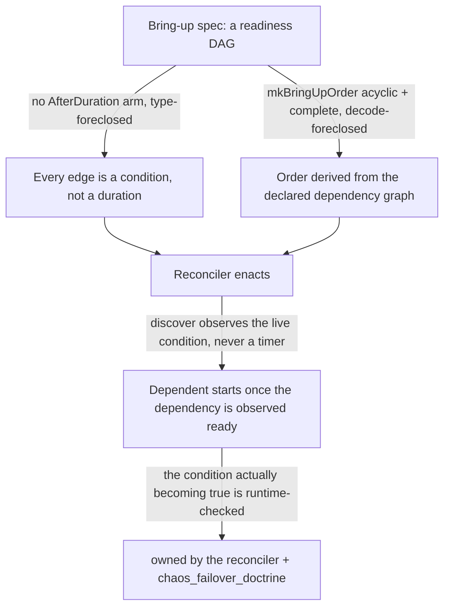

# Readiness Ordering: Event-Driven Sequences, Not Timed Waits

**Status**: Authoritative source
**Supersedes**: N/A
**Referenced by**: documents/engineering/README.md, documents/engineering/bootstrap_sequence_doctrine.md, documents/engineering/illegal_state_catalog.md, documents/engineering/cluster_lifecycle_doctrine.md, documents/engineering/platform_services_doctrine.md, documents/engineering/vault_pki_doctrine.md, documents/engineering/daemon_topology_doctrine.md, documents/engineering/manifest_generation_doctrine.md, documents/engineering/single_logical_data_plane_doctrine.md, documents/engineering/release_lifecycle_doctrine.md, DEVELOPMENT_PLAN/system_components.md
**Generated sections**: none

> **Purpose**: Single Source of Truth for how amoebius sequences bring-up — a dependent starts on a
> *dependency's observed readiness edge*, never on an elapsed duration — and the honest limit that the spec
> forecloses the *sequence shape*, while the *running port coming up* is a reconcile-time fact owned elsewhere.

---

## 1. Why this doctrine exists

The vision names the anti-pattern directly:

> *"have we made it impossible to represent deployment readiness races, particularly in the initial cluster
> bootstrap? we don't want arbitrary wait periods till a port becomes responsive, we want event driven
> sequences."*

Raw tooling makes the race the *default*. A Helm chart assumes its database is up; an initContainer polls a
port in a `sleep`-loop; a bootstrap script runs `sleep 30 && kubectl apply` and hopes the apiserver answered.
Each is a **duration standing in for a condition** — it passes on a fast machine and flakes on a slow one, and
the failure surfaces at 3 a.m. as a half-applied cluster.

amoebius refuses the substitution. **A bring-up sequence is a DAG of readiness edges, never a schedule of
durations.** A dependent is constructed *from* its dependency's readiness — so "start B after 30 seconds" has
no sanctioned way to be written, and "start B once A is ready" is the only shape the surface offers. This
doctrine owns that discipline; the pieces that already embody it — the reconciler's observation loop, the
`.ready` sentinel, Vault fail-closed, `FabricMember` reachability, the daemon `/readyz` contract, the
`RolloutPlan` readiness gate — are enumerated in [§7](#7-one-discipline-many-instances) as instances of it,
each owned by its own doctrine.

The **"particularly in the initial cluster bootstrap"** qualifier is load-bearing and gets its own section
([§5](#5-the-bootstrap-tier-local-observed-witnesses-never-timers)): before the cluster's own event
machinery (the SSA reconciler, Pulsar) exists, there is nothing to observe *with* except the host — which is
exactly where a `sleep` is most tempting and this doctrine most necessary.

---

## 2. The load-bearing limit: the spec forecloses the sequence *shape*, not the port's *liveness*

This is the most important sentence in the document, so it gets its own section, and it is the readiness face
of the catalog's [§2 load-bearing limit](./illegal_state_catalog.md#2-the-load-bearing-limit-a-type-check-proves-the-spec-composes-not-that-the-cluster-enforces-it):
**a type-check cannot prove a port is responsive.** Whether Vault is unsealed, whether the apiserver answers,
whether the LB has an address — these are eventually-consistent facts about a running world, settled only by
*looking*. No Dhall value decides them.

So this doctrine does **not** claim to make a readiness race "impossible" in the running cluster. It makes
two weaker, honest, and sufficient claims, graded on the catalog's
[three layers](./illegal_state_catalog.md#6-three-layers-of-foreclosure-and-the-honesty-they-force):

- **The gate is a condition, never a duration** — `type-foreclosed` at the sanctioned surface
  ([§3](#3-readiness-is-a-condition-never-a-duration)). A "wait N milliseconds then assume ready" has no
  constructor in the sequencing vocabulary.
- **The order is a derived, acyclic readiness DAG** — `decode-foreclosed`
  ([§4](#4-ordering-is-a-derived-readiness-dag-not-a-hand-sequenced-script)). A missing dependency edge or a
  cycle is rejected at decode, before any effect.

The residue — *that the observed condition actually becomes true, and in bounded time* — is `runtime-checked`,
owned by the reconciler ([§6](#6-the-runtime-enactor-the-reconciler-observes-never-sleeps)) and
[`chaos_failover_doctrine.md`](./chaos_failover_doctrine.md), never asserted here. Stating the layer is the
whole point: amoebius forecloses the *shape that races*, and honestly delegates the *observation that
resolves it*.



---

## 3. Readiness is a condition, never a duration

The sequencing vocabulary carries a typed **`Readiness`** — the live condition a dependent waits on — and its
defining property is a *missing arm*:

```haskell
-- The condition a dependent gates on. There is NO `AfterDuration NominalDiffTime` arm.
data Readiness
  = Reachable  Endpoint         -- a TCP/mTLS handshake succeeds (the "port responsive" case, observed)
  | Serving    HealthEdge       -- a /readyz-class endpoint reports ready
  | Condition  ResourceCond     -- a live object reaches Ready / Available / rollout-complete / CR-status-healthy
  | Unsealed   VaultHandle      -- Vault reports reachable, initialized, and unsealed
  | Committed  ReadyWitness      -- a staged artifact's `.ready` sentinel / a commit-log edge exists
```

This is the same **no-illegal-arm** idiom the catalog uses for
[`Rke2Servers`](./illegal_state_catalog.md#324-an-evenzero-server-rke2-control-plane-no-etcd-quorum--split-brain)
(no even/zero quorum arm), `StorageBacking`
([§3.18](./illegal_state_catalog.md#318-unbounded-storage-anywhere), no unbounded arm), and `Growable`
([§3.21](./illegal_state_catalog.md#321-capacity-growth-without-an-amoebius-owned-scaling-policy)): the
illegal case is not rejected, it is *unspellable*. Because `Readiness` has no duration arm, the sanctioned
sequencing combinator — the readiness gate a `Step`
([`dsl_doctrine.md` §2](./dsl_doctrine.md#2-two-languages-one-system-dhall-carries-params-haskell-carries-logic))
or a bring-up edge carries — **takes a `Readiness`, never a delay**. "Wait 30 s and proceed" cannot be
constructed through it. This generalizes the `ReadinessGate` that
[`manifest_generation_doctrine.md` §5.1](./manifest_generation_doctrine.md#51-the-rolloutplan-ordered-readiness-gated-phases-on-this-same-reconciler-tier-c)
already carries on a `RolloutPhase` — the in-cluster tier-(c) instance — down to *every* tier, including the
host-level bootstrap tier ([§5](#5-the-bootstrap-tier-local-observed-witnesses-never-timers)).

> **Honesty (the escape hatch, named honestly).** A `Step`'s reconcile action is ultimately
> `stepRun :: … -> IO ()`, and `IO` can call `threadDelay`. The `type-foreclosed` claim is therefore scoped
> to the *sanctioned sequencing surface* — the `Readiness`-typed gate — **not** to the whole `IO` monad. A
> raw `threadDelay` masquerading as a readiness gate is caught one layer out, by the daemon-spine rule that
> **forbids `threadDelay`/`sd_notify`/filesystem-marker "wait long enough" probes**
> ([`daemon_topology_doctrine.md` §6](./daemon_topology_doctrine.md#6-the-shared-daemon-spine)) — a
> `runtime-checked` discipline + review gate, not a type. We do not pretend otherwise.

---

## 4. Ordering is a derived readiness DAG, not a hand-sequenced script

The *order* is not authored either. amoebius already derives connectivity — a NetworkPolicy is *generated*
from the declared dependency graph, never hand-written
([`illegal_state_catalog.md` §3.6](./illegal_state_catalog.md#36-blocking-networkpolicy-services-cant-reach-each-other)),
and a toleration is *projected* from a node taint, never typed
([§3.22](./illegal_state_catalog.md#322-a-hand-authored-un-derived-toleration)). Bring-up ordering rides the
**same declared dependency graph**:

- **A start-handle exists only once its dependency's `Ready` edge does.** A dependent's "you may start"
  handle is constructed *from* the upstream's `Readiness`, exactly the
  [catalog §4.3](./illegal_state_catalog.md#43-gadt-indexed-state-machines--only-legal-transitions-are-typed)
  "a handle exists only once its edge does" discipline that already gates a `.ready`-sentinel `ArtifactRef`
  and an evidence-gated `PromotionGate`. A "start B before A is ready" edge has no constructor.
- **The DAG is total and acyclic by decode.** The platform's hard ordering edges — LoadBalancer → edge,
  registry → image pulls, Percona operator → Postgres consumers, Vault-unsealed → secret-dependent startup,
  Keycloak → wild traffic — are the *derived* readiness DAG owned by
  [`platform_services_doctrine.md` §11](./platform_services_doctrine.md#11-bring-up-and-dependency-ordering),
  not a prose ordering an installer is trusted to honour. A total `mkBringUpOrder` fold rejects a **cycle** or
  an **undeclared dependency** at decode — `decode-foreclosed`, the same shape as `mkRke2`'s host-distinctness
  fold ([§3.16](./illegal_state_catalog.md#316-a-multi-node-rke2-cluster-with-fewer-linux-hosts-than-nodes-or-a-host-reused)).

The consequence: an operator cannot express *when* a service comes up — only *what it depends on being
ready*. The order is a theorem of the dependency graph, and every edge in it is a
[§3](#3-readiness-is-a-condition-never-a-duration) condition.

---

## 5. The bootstrap tier: local observed witnesses, never timers

This is the section the vision's *"particularly in the initial cluster bootstrap"* demands. The in-cluster
readiness machinery — the SSA reconciler's wait-for-ready, Pulsar Failover subscriptions — does not exist yet
during first bring-up: the host daemon is standing the cluster *up*
([`cluster_lifecycle_doctrine.md` §2](./cluster_lifecycle_doctrine.md#2-bring-up-and-bootstrap),
[`daemon_topology_doctrine.md` §3](./daemon_topology_doctrine.md#3-the-control-plane-singleton--exactly-one-elected)).
The temptation to `sleep` is maximal precisely because nothing fancy is up to observe with. The rule holds
anyway, using the two primitives the host tier *does* have:

- **The three-valued observation.** The reconciler's `discover` returns **Present / Absent / Unreachable**,
  with **`Unreachable → refuse`**
  ([`cluster_lifecycle_doctrine.md` §9](./cluster_lifecycle_doctrine.md#9-how-bring-up-and-teardown-are-implemented-the-reconciler-not-a-state-machine)).
  "kube-apiserver is up" is `discover = Present` — a **successful mTLS API call that returned**, the
  `Reachable`/`Serving` arm of [§3](#3-readiness-is-a-condition-never-a-duration) — *not* `sleep 30 && curl`.
  This is the honest form of "the port is responsive": you learn it by a call that succeeded, and an
  ambiguous timeout is *not* silently read as ready (the `timeout-coerces-unknown` rule of
  [`chaos_failover_doctrine.md`](./chaos_failover_doctrine.md)).
- **The runtime witness.** The `RuntimeWitness` file/socket-existence facts of
  [`dsl_doctrine.md` §3](./dsl_doctrine.md#3-the-orchestration-surface-parameters-context-witness) gate a
  command on a *locally checkable* condition (a required unix socket exists), so a witness-gated bootstrap
  step **refuses fast** when its socket witness is absent — no cluster touched, no timer burned.

The **host-daemon → in-cluster-singleton handoff** — the open bootstrap-sequencing question the vision pairs
with this one — is gated the same way: the host daemon hands off once the singleton reports ready over its
`/readyz` (a `Serving` edge) and the election commit is observed on the coordination log (a `Committed`
edge), **never** on a fixed delay after launching the pod. Vault init is the canonical worked example:
**no secret consumer runs before Vault reports reachable, initialized, and unsealed; a consumer that reaches
a sealed Vault fails closed rather than racing it**
([`vault_pki_doctrine.md` §4](./vault_pki_doctrine.md#4-init-follows-readiness-fail-closed-vault-init)) —
`Unsealed` is a condition, and fail-closed is the event-driven resolution of the race, not a wait around it.

---

## 6. The runtime enactor: the reconciler observes, never sleeps

Sections [§3](#3-readiness-is-a-condition-never-a-duration)–[§5](#5-the-bootstrap-tier-local-observed-witnesses-never-timers)
own the *shape*; the *enactment* is not a new engine. It is the one
`discover → diff → enact → re-observe` reconciler
([`cluster_lifecycle_doctrine.md` §9](./cluster_lifecycle_doctrine.md#9-how-bring-up-and-teardown-are-implemented-the-reconciler-not-a-state-machine)),
whose in-cluster specialization is the SSA apply engine's **wait-for-ready**: after apply it *observes* the
live object's readiness condition (rollout complete / `Ready`/`Available` / CR `status` healthy) before
declaring convergence — **"readiness is observed from the live object, never assumed by a `threadDelay`"**
([`manifest_generation_doctrine.md` §5](./manifest_generation_doctrine.md#5-the-applyreconcile-engine-server-side-apply-owned-field-manager-prune-wait)).
Its ordered form, the `RolloutPlan` whose phase *n+1* gates on phase *n*'s live readiness, is owned by
[`release_lifecycle_doctrine.md` §5](./release_lifecycle_doctrine.md#5-rolloutplan--rolloutphase-the-readiness-gated-apply).

Every wait here is honest under the chaos discipline: **bound everything** (every probe, retry, and wait
carries an explicit finite bound) and **timeout-coerces-unknown** (a timeout is a *shrug*, never a definite
"ready") — both owned by [`chaos_failover_doctrine.md`](./chaos_failover_doctrine.md). This layer is
`runtime-checked` and never claimed stronger: the type foreclosed the *duration-gated shape*; the reconciler
supplies the *observation*, and the honesty is in keeping those two claims apart.

---

## 7. One discipline, many instances

Readiness-as-an-edge was already present across the suite, one site at a time. This doctrine names the
discipline once; each site keeps its own SSoT and is cited, never restated:

| Instance | What it gates | Layer | Owned by |
|---|---|---|---|
| Derived bring-up DAG | platform-service bring-up order | `decode-foreclosed` (order) + `type-foreclosed` (edge shape) | [platform_services §11](./platform_services_doctrine.md#11-bring-up-and-dependency-ordering) |
| Vault ready-before-consumer / fail-closed | a secret consumer vs a sealed Vault | `runtime-checked` (fail-closed); the `Unsealed` edge is [§3](#3-readiness-is-a-condition-never-a-duration) | [vault_pki §4](./vault_pki_doctrine.md#4-init-follows-readiness-fail-closed-vault-init) |
| `FabricMember c` reachability | a workload bound to a store it cannot reach | `type-foreclosed` (static reach is a *type*, not a probe) | [single_logical_data_plane §3](./single_logical_data_plane_doctrine.md#3-the-binding-reachability-is-a-type-not-a-runtime-probe) |
| `.ready` sentinel / `ArtifactRef` | serving a half-staged model | `type-foreclosed` (no handle without the sentinel edge) | [content_addressing §4.5](./content_addressing_doctrine.md#45-the-three-tier-ml-asset-lifecycle-engine-baked-model-staged-kernel-jitd) |
| SSA wait-for-ready | a generation declared converged before it is | `runtime-checked` (observed from live object) | [manifest_generation §5](./manifest_generation_doctrine.md#5-the-applyreconcile-engine-server-side-apply-owned-field-manager-prune-wait) |
| `RolloutPlan` / `ReadinessGate` | phase *n+1* before phase *n* is ready | `runtime-checked` gate on a `type-foreclosed` phase value | [release_lifecycle §5](./release_lifecycle_doctrine.md#5-rolloutplan--rolloutphase-the-readiness-gated-apply) |
| Daemon `/readyz`, no-`threadDelay` | a daemon self-reporting ready by a timer | `runtime-checked` discipline (forbids the timer) | [daemon_topology §6](./daemon_topology_doctrine.md#6-the-shared-daemon-spine) |

The catalog entry that turns "a duration-gated / hand-ordered bring-up sequence" into a foreclosed illegal
state is [`illegal_state_catalog.md` §3.41](./illegal_state_catalog.md#341-a-duration-gated--hand-ordered-bring-up-sequence-a-readiness-race).

---

## 8. Planning ownership

This document is normative readiness-ordering doctrine only. Delivery sequencing, completion status,
validation gates, and remaining work are owned by
[`../../DEVELOPMENT_PLAN/README.md`](../../DEVELOPMENT_PLAN/README.md), never restated here. For orientation
only (the plan is authoritative): the **bootstrap-tier** rule — `discover`/`RuntimeWitness` gates, no timers,
the host-daemon→singleton handoff — rides **Phase 1** with the `chain`/`Step` kernel and idempotent kind
bring-up; the **typed `Readiness` gate** and the [§3.41](./illegal_state_catalog.md#341-a-duration-gated--hand-ordered-bring-up-sequence-a-readiness-race)
catalog foreclosure land in **Phase 3** with the orchestration DSL and the control-plane singleton. This doc
states the target shape and links back for status.

> **Honesty.** Everything here is Phase 0 design intent, specified before implementation. The reconciler's
> observed-condition loop and the daemon spine are *proven in the prodbox / hostbootstrap siblings* and
> inherited as evidence, not a tested amoebius result
> ([documentation_standards.md §6](../documentation_standards.md#6-honesty-the-proventestedassumed-discipline)).

---

## Cross-references

- [Engineering Doctrine Index](./README.md)
- [Illegal State Catalog](./illegal_state_catalog.md) — [§3.41](./illegal_state_catalog.md#341-a-duration-gated--hand-ordered-bring-up-sequence-a-readiness-race) the readiness race as a foreclosed illegal state; [§2](./illegal_state_catalog.md#2-the-load-bearing-limit-a-type-check-proves-the-spec-composes-not-that-the-cluster-enforces-it)/[§6](./illegal_state_catalog.md#6-three-layers-of-foreclosure-and-the-honesty-they-force) the load-bearing limit and the three layers
- [Cluster Lifecycle Doctrine](./cluster_lifecycle_doctrine.md) — [§2](./cluster_lifecycle_doctrine.md#2-bring-up-and-bootstrap) init-follows-readiness, [§9](./cluster_lifecycle_doctrine.md#9-how-bring-up-and-teardown-are-implemented-the-reconciler-not-a-state-machine) the reconciler that enacts every edge
- [Bootstrap Sequence Doctrine](./bootstrap_sequence_doctrine.md) — [§4](./bootstrap_sequence_doctrine.md#4-the-host-daemon--singleton-handoff) consumes the [§5](#5-the-bootstrap-tier-local-observed-witnesses-never-timers) handoff trigger (`/readyz` + election-commit) as the host-daemon→singleton gate
- [Platform Services Doctrine](./platform_services_doctrine.md) — [§11](./platform_services_doctrine.md#11-bring-up-and-dependency-ordering) the derived bring-up DAG
- [Vault / PKI Doctrine](./vault_pki_doctrine.md) — [§4](./vault_pki_doctrine.md#4-init-follows-readiness-fail-closed-vault-init) ready-before-consumer / fail-closed
- [Daemon Topology Doctrine](./daemon_topology_doctrine.md) — [§6](./daemon_topology_doctrine.md#6-the-shared-daemon-spine) the daemon spine forbids `threadDelay`/`sd_notify`/marker probes
- [Manifest Generation Doctrine](./manifest_generation_doctrine.md) — [§5](./manifest_generation_doctrine.md#5-the-applyreconcile-engine-server-side-apply-owned-field-manager-prune-wait) wait-for-ready observed from the live object
- [Single Logical Data Plane Doctrine](./single_logical_data_plane_doctrine.md) — [§3](./single_logical_data_plane_doctrine.md#3-the-binding-reachability-is-a-type-not-a-runtime-probe) reachability is a type, not a runtime probe
- [Release Lifecycle Doctrine](./release_lifecycle_doctrine.md) — [§5](./release_lifecycle_doctrine.md#5-rolloutplan--rolloutphase-the-readiness-gated-apply) the readiness-gated `RolloutPlan`
- [DSL Doctrine](./dsl_doctrine.md) — [§2](./dsl_doctrine.md#2-two-languages-one-system-dhall-carries-params-haskell-carries-logic) the `chain`/`Step` surface the gate rides, [§3](./dsl_doctrine.md#3-the-orchestration-surface-parameters-context-witness) the `RuntimeWitness`
- [Chaos / Failover Doctrine](./chaos_failover_doctrine.md) — bound-everything and timeout-coerces-unknown
- [Development Plan](../../DEVELOPMENT_PLAN/README.md)
- [Documentation Standards](../documentation_standards.md)
