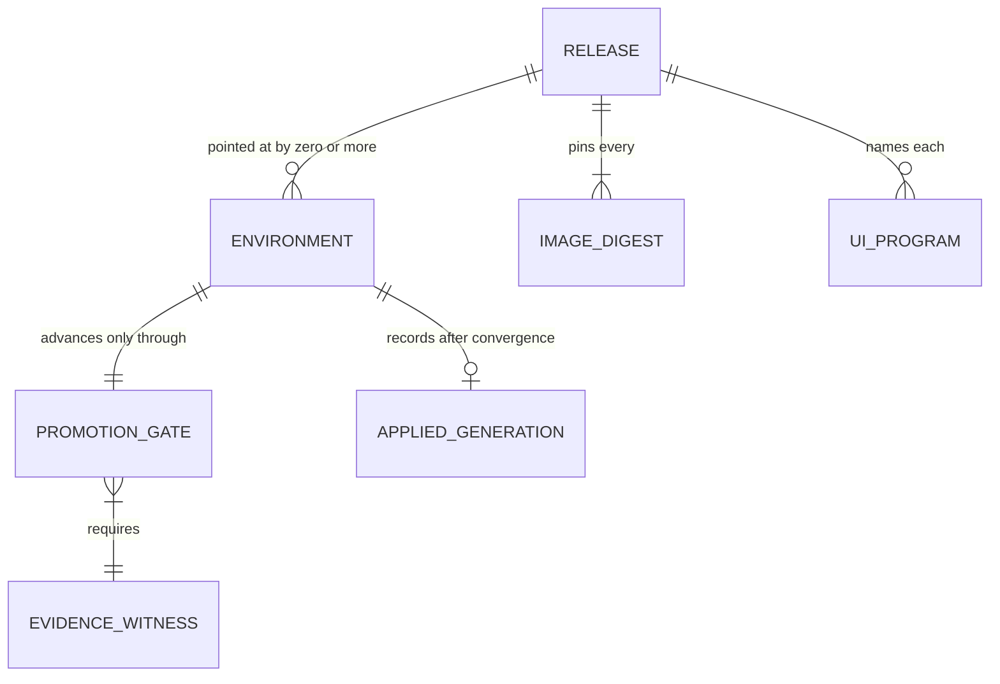

# Release Lifecycle

> **Purpose**: Single Source of Truth for delivery as **typed composition on primitives amoebius already > owns** — the immutable `Release` ledger keyed by `releaseHash`, the per-`Environment`
> (`Dev`/`Staging`/`Prod`) ETag-CAS promotion pointer, the `PromotionGate` that makes promote-unverified→prod
> **unrepresentable**, and the readiness-gated `RolloutPlan`/`RolloutPhase` apply — with **no external CI/CD > control plane** (no Argo, no Flux, no Tekton).
> **Read this if**: something has to be promoted between environments, or a rollout or rollback has to be reasoned about.

This document owns delivery: the immutable release ledger, the pointer that is the only mutable thing, the
evidence a promotion requires, and the readiness-gated rollout. It does not own the evidence layers
themselves, owned by [testing_doctrine.md §2](./testing_doctrine.md#2-the-registers-of-amoebius-testing),
nor the reconciler that applies a generation, owned by
[manifest_generation_doctrine.md](./manifest_generation_doctrine.md).

<details>
<summary>Link-graph metadata</summary>

**Status**: Authoritative source
**Supersedes**: N/A
**Referenced by**: DEVELOPMENT_PLAN/later_phases.md, DEVELOPMENT_PLAN/phase_44_release_lifecycle.md, DEVELOPMENT_PLAN/phase_45_ui_program_release.md, DEVELOPMENT_PLAN/phase_59_ui_rollout_reconnect.md, DEVELOPMENT_PLAN/phase_63_offline_release_evolution.md, DEVELOPMENT_PLAN/system_components.md, documents/engineering/README.md, documents/engineering/app_vs_deployment_doctrine.md, documents/engineering/browser_offline_runtime_doctrine.md, documents/engineering/content_addressing_doctrine.md, documents/engineering/gateway_migration_doctrine.md, documents/engineering/inforcespec_migration_doctrine.md, documents/engineering/manifest_generation_doctrine.md, documents/engineering/migration_doctrine.md, documents/engineering/readiness_ordering_doctrine.md, documents/engineering/tenancy_doctrine.md, documents/engineering/test_derivation_analysis.md, documents/engineering/testing_doctrine.md, documents/glossary.md, documents/illegal_state/illegal_state_lifecycle.md, documents/illegal_state/illegal_state_techniques.md
**Generated sections**: none

</details>

> **Historical result (invalidated).** Phase-run and implementation-result statements predate the 2026-08-11 reopen unless the owning phase is Done; target doctrine remains normative, and current state is in the [tracker](../../DEVELOPMENT_PLAN/README.md).

## Contents
- [1. No external CI/CD control plane — delivery is typed composition on primitives amoebius owns](#1-no-external-cicd-control-plane--delivery-is-typed-composition-on-primitives-amoebius-owns)
- [2. `Release` and the immutable release ledger (`releaseHash`)](#2-release-and-the-immutable-release-ledger-releasehash)
- [3. `Environment` and the ETag-CAS promotion pointer](#3-environment-and-the-etag-cas-promotion-pointer)
- [4. `PromotionGate`: promote-unverified→prod is unrepresentable](#4-promotiongate-promote-unverifiedprod-is-unrepresentable)
- [5. `RolloutPlan` / `RolloutPhase`: the readiness-gated apply](#5-rolloutplan--rolloutphase-the-readiness-gated-apply)
- [6. What this doctrine deliberately does not own / Planning ownership](#6-what-this-doctrine-deliberately-does-not-own--planning-ownership)
- [Related Documents](#related-documents)

---

## 1. No external CI/CD control plane — delivery is typed composition on primitives amoebius owns

A conventional platform bolts a **second control plane** onto the cluster to do delivery: Argo CD polls a git
repo and reconciles the diff, Flux does the same with its own CRDs, Tekton runs pipeline pods, and each one is
its own operator, its own RBAC surface, its own upgrade cycle, its own store of "what should be deployed."
That second plane is, to delivery, exactly what Helm is to manifests and Harbor is to the registry: an
unowned, unreviewed intermediary that re-introduces the *"valid YAML, wrong cluster"* failure class
([illegal_state_catalog.md §1](../illegal_state/illegal_state_catalog.md#1-illegal-states-fail-to-type-check)) at the delivery layer — a git-polling controller
can apply a manifest set no amoebius type ever inspected.

**amoebius refuses the second control plane, exactly as it refuses Helm and Harbor.** Delivery is not a
separate system; it is a handful of typed values composed over primitives amoebius has already defined
elsewhere. There is nothing to install, nothing to poll, and nothing to reconcile *the reconciler*:

- **One binary, two enactment frames.** The single amoebius binary composes the whole pipeline. The **build**
  half — producing multi-arch images and pushing them to the in-cluster `distribution` registry — is enacted
  by the **sudo host daemon** ([image_build_doctrine.md](./image_build_doctrine.md)). The
  **test / promote / rollout** half is enacted by the **in-cluster singleton**
  ([daemon_topology_doctrine.md §3](./daemon_topology_doctrine.md#3-the-control-plane-singleton)). No third process arbitrates between them.
- **Auditability comes from an immutable ledger, not a controller's opinion.** What a conventional platform
  gets from "the state Argo believes is desired," amoebius gets from the immutable `Release` ledger ([§2](#2-release-and-the-immutable-release-ledger-releasehash)) plus
  the ETag-CAS pointer history ([§3](#3-environment-and-the-etag-cas-promotion-pointer)): a content-addressed, append-only record of every generation ever built
  and every promotion ever made. There is no polling loop to trust. The environment pointer selects an
  immutable `Release`; the reconciler resolves that release's `deploymentDhallRef` into the authenticated
  `InForceSpec` materialization and recomputes desired state through the pure
  `bind/expand → plan/resolve infrastructure → provision → renderAll` path
  ([manifest_generation_doctrine.md §6](./manifest_generation_doctrine.md#6-the-reconcile-state-model-desired-is-renderallprovisionedspec-observed-is-live-inventory-actions-are-typed)).
- **The environment axis is orthogonal, not a new machine.** Dev/staging/prod is one of amoebius's four
  independent typed dimensions (substrate detected; daemon role declared; rke2 server/agent declared;
  environment declared) — it rides the same reconciler, never a bespoke delivery engine.

**What refusing a second control plane forecloses.** The rule gives up pull-based git-ops reconciliation from
external repositories and the third-party pipeline ecosystems (Argo/Flux/Tekton and the tooling built around
them) that assume such an intermediary: amoebius cannot consume a delivery flow it does not itself render and
type, so any workflow expressed only as an external pipeline's CRDs or polling loop is out of reach by
construction.

**This document owns vs. composes.** This document **owns** the `Release` type and immutable release-ledger
contract, the `environment` promotion-pointer kind, the `PromotionGate` and its
environment→required-evidence mapping, and the `RolloutPlan`/`RolloutPhase` apply model. It **composes** the
content-addressed storage and ETag-CAS protocol
([content_addressing_doctrine.md §2.3](./content_addressing_doctrine.md#23-the-hashpointer-master-table-four-hash-classes-three-pointer-kinds)),
the reconciler that appends an `AppliedGeneration` only after convergence
([manifest_generation_doctrine.md §6.1](./manifest_generation_doctrine.md#61-the-release-ledger-the-applied-log-is-canonical-not-optional)),
and the test-evidence ledger
([testing_doctrine.md §4](./testing_doctrine.md#4-no-skips-fail-fast-and-the-per-run-ledger-artifact)).

**What this doctrine owns vs. defers.** This document owns the four delivery values and how they chain. It
delegates their storage, reconciliation, evidence, and provider mechanisms as follows:

| Concern | Owned by |
|---------|----------|
| `releaseHash`, the hash/pointer master registry, the content-addressed store the ledger writes into | [content_addressing_doctrine.md §2.3](./content_addressing_doctrine.md#23-the-hashpointer-master-table-four-hash-classes-three-pointer-kinds) / [§4](./content_addressing_doctrine.md#4-determinism-by-construction-pinned-inputs--pure-stages--derived-seed) |
| The SSA/ApplySet reconciler that enacts a `RolloutPlan` and appends `AppliedGeneration` after convergence | [manifest_generation_doctrine.md §5](./manifest_generation_doctrine.md#5-the-applyreconcile-engine-snapshot-bound-typed-actions) / [§6.1](./manifest_generation_doctrine.md#61-the-release-ledger-the-applied-log-is-canonical-not-optional) |
| The per-run proven/tested/assumed evidence ledger a `PromotionGate` reads | [testing_doctrine.md §4](./testing_doctrine.md#4-no-skips-fail-fast-and-the-per-run-ledger-artifact) |
| That env differences are **deployment rules**, and app bytes are byte-identical across environments | [app_vs_deployment_doctrine.md §3](./app_vs_deployment_doctrine.md#3-the-deployment-rules-surface--how-the-same-app-runs) / [§4](./app_vs_deployment_doctrine.md#4-the-dividing-line--a-litmus-test) |
| `create-new → verified-migrate → retire-old` for the schema-migration phase | [storage_lifecycle_doctrine.md §8](./storage_lifecycle_doctrine.md#8-shrinking-storage-without-representing-data-destruction) |
| Gateway-API `HTTPRoute` `backendRefs` weights the canary shifts | [network_fabric_doctrine.md](./network_fabric_doctrine.md) |
| The control-plane singleton that runs the promote/rollout half | [daemon_topology_doctrine.md §3](./daemon_topology_doctrine.md#3-the-control-plane-singleton) |
| The bounded UI language, plan envelope, browser/server ABI, and compatibility witness | [low_code_ui_runtime_doctrine.md §15](./low_code_ui_runtime_doctrine.md#15-versioning-rollout-and-generated-artifacts) |

> **Validated instance.** Phase 44 built all four delivery values in `amoebius-release` and validated their
> intra-cluster wiring at Register 3 on `linux-cpu`: immutable MinIO release entries, closed environment
> pointers with ETag CAS, evidence-witness refusal/advance, and externally readiness-gated
> base→schema-migration→finalize apply. The runtime layer is tested, never proven. Gateway-API canary shifting,
> Pulsar consumer-group cutover, and cross-cluster/geo promotion remain **UNVERIFIED**. The sibling examples
> below remain provenance for the original pattern, not evidence substituted for the Phase-44 result.

---

## 2. `Release` and the immutable release ledger (`releaseHash`)

The unit of delivery is one immutable value:

```haskell
-- Conceptual shape — a Release is a ledger entry, never edited in place.
data Release = Release
  { releaseHash        :: ReleaseHash        -- sha256(resolved-deployment-dhall ‖ image-digests ‖ substrate-fp)
  , deploymentDhallRef :: ContentAddress     -- the resolved deployment .dhall, by content
  , imageDigests       :: [(ImageIdentity, OciImageDigest)]  -- the exact images, each by closed identity
  , uiPrograms         :: [(AppId, UiProgramRelease)]
      -- exact ProgramDigest/catalog/contracts/client+server ABI; part of resolved deployment identity
  , substrateFp        :: SubstrateFingerprint
  }

-- Written only after the selected Release has converged in one environment.
data AppliedGeneration = AppliedGeneration
  { appliedRelease       :: ReleaseHash
  , appliedEnvironment   :: Environment
  , appliedObjectSetHash :: AppliedObjectSetHash
  }
```

- **Each pinned digest names which image it is.** `imageDigests` pairs every digest with its closed
  `ImageIdentity` ([image_build_doctrine.md §5](./image_build_doctrine.md#5-versioning-vs-latest--development_plan-decision-recommended-default-immutable-never-latest)),
  so a generation records not merely *which bytes* it ran but *which image those bytes are* — the base image,
  or the `Runtime` variant linking a named app set. Nothing about the promotion model changes: an app's
  relink moves only its own variant's digest, and the `Environment` pointer still advances a whole
  generation at a time ([§3](#3-environment-and-the-etag-cas-promotion-pointer)), exactly as it did when the
  list was untyped digests.
- **A UI program is a pinned release input, not mutable configuration.** Each `UiProgramRelease` records the
  exact `ProgramDigest`, component catalog, public-contract digests, `ClientRuntimeAbi`, `UiServerAbi`, and
  compatibility witnesses admitted for that app, plus the content identities of its paired `ClientPlan` and
  serializable `UiServerPlan` manifest. The release pointer names both or neither, and the pair identity is
  covered by `releaseHash`; neither half can be replaced, omitted, or mixed with another generation while
  retaining the same release identity. The generic client/server image may remain byte-identical while a program changes,
  but that change still mints a distinct `Release`. The authoritative field set and digest coverage are owned
  by [low_code_ui_runtime_doctrine.md §15](./low_code_ui_runtime_doctrine.md#15-versioning-rollout-and-generated-artifacts).
- **The paired-plan rule is observed live.** [Phase 45](../../DEVELOPMENT_PLAN/phase_45_ui_program_release.md)
  publishes two distinct content-addressed UI releases and observes the environment pointer history advancing
  only A-pair then B-pair. No pointer effect names a missing or mixed half, and the unchanged generic runtime
  image demonstrates that program release data does not require an OCI rebuild.
- **`releaseHash` is a distinct hash class, never shared.** It is registered in the canonical hash/pointer
  master table alongside `experimentHash`, `kernelKey`, and the OCI image digest
  ([content_addressing_doctrine.md §2.3](./content_addressing_doctrine.md#23-the-hashpointer-master-table-four-hash-classes-three-pointer-kinds)),
  which is that table's **single source of truth** — this doctrine consumes it and does not restate the
  formula's authority. `releaseHash = sha256(resolved-deployment-dhall ‖ image-digests ‖ substrate-fp)` folds
  in exactly the three things that can change what a generation *does*: the resolved deployment spec, the
  image bytes it runs, and the substrate it targets. Change any one and the identity changes; change none and
  the same `Release` is returned — content-addressed, self-naming, deduplicated.
- **Candidate identity and application history are distinct immutable records.** A build first writes the
  canonical `Release` ledger entry, before any environment can point at it. Promotion advances an environment
  pointer onto that existing candidate ([§3](#3-environment-and-the-etag-cas-promotion-pointer)). After the
  selected release converges, the manifest reconciler appends an `AppliedGeneration` that references the
  `releaseHash`, environment, and exact applied-object-set hash
  ([manifest_generation_doctrine.md §6.1](./manifest_generation_doctrine.md#61-the-release-ledger-the-applied-log-is-canonical-not-optional)).
  Rollback selects a prior `Release` and recomputes its desired object set; it never treats the application
  record as desired YAML ([§5](#5-rolloutplan--rolloutphase-the-readiness-gated-apply)).
- **A `Release` is immutable; only pointers move.** No field of a `Release` is ever edited. Promotion,
  rollback, and drift-correction are all expressed as **pointer** operations ([§3](#3-environment-and-the-etag-cas-promotion-pointer)) over a fixed set of ledger
  entries — the same discipline as a `trial` pointer flipping over immutable manifests
  ([content_addressing_doctrine.md §2](./content_addressing_doctrine.md#2-the-three-tier-store-blobs--manifests--pointers)).
  This is why there is no mutable rendered-manifest store to desynchronize: unlike Helm's mutable, gzip-blob
  release Secret, an amoebius `Release` cannot be edited out from under a pointer.
- **The ledger, application records, and pointers are an admitted `Content` producer, not free MinIO bytes.** Binding derives exact
  store/tenant/bucket/full-key identities for every release blob, manifest, ledger entry, applied-generation record, and the `Dev`,
  `Staging`, and `Prod` pointer old/new/CAS versions. They form an `ObjectStoreDemand` under the `Content` arm
  of the six-arm `ObjectStoreProducerDemand`, with a required `StorageBudgetId`, structural retention,
  concurrent-write and failed-write/orphan bounds, and an `ObjectStoreMutationAdmission` writer. The
  source↔producer equality check, object geometry/quota, and sole gateway's complete pod envelope must
  provision against the fresh live snapshot before the first ledger PUT or pointer CAS. A missing release/
  pointer object, one-byte-short backing, or gateway shortage yields zero writes; a failed CAS leaves all
  successfully written immutable objects charged until observed GC.

> **Layer.** The immutability and self-naming are **runtime-checked residue** enforced by the
> content-addressed write protocol (a blob at a hash either is the bytes that hash to it, or the write is
> rejected) — the enforcement actually holds at runtime, it is not a compile-time impossibility.

### Sibling evidence — the `Release` ledger

No sibling keeps a content-addressed *release* ledger; the closest evidence is that jitML and infernix already
key ML *artifacts* by a `sha256(resolved-dhall ‖ substrate-fingerprint)` `experimentHash`
([content_addressing_doctrine.md §3](./content_addressing_doctrine.md#3-experimenthash-identity-is-what-was-requested--where-it-ran)),
so the "identity = what was requested ‖ where it ran" fold is demonstrated for runs and **generalized** here to
deployment generations. That is sibling evidence, not an amoebius result.

---

## 3. `Environment` and the ETag-CAS promotion pointer

Environments are a closed, three-arm union, and each names a **mutable pointer** into the immutable ledger:

```haskell
data Environment = Dev | Staging | Prod          -- closed union; no fourth, unnamed environment exists
-- one ETag-CAS pointer per Environment, each pointing at a Release (by releaseHash)
```

- **"Promote to prod" is a pointer CAS, then a converge.** Advancing an environment is not a redeploy and not
  a new build — it is a **compare-and-swap of that environment's pointer** from the old `releaseHash` to the
  new one, using the same ETag-CAS write protocol that advances a `trial` or `model` pointer
  ([content_addressing_doctrine.md §2.3](./content_addressing_doctrine.md#23-the-hashpointer-master-table-four-hash-classes-three-pointer-kinds), where the `environment` pointer kind is registered as owned by this doctrine). Once the pointer moves, the
  in-cluster SSA reconciler ([§5](#5-rolloutplan--rolloutphase-the-readiness-gated-apply)) resolves the selected
  release's `deploymentDhallRef`, recomputes the desired objects, and converges them for that environment. The
  CAS is the atomic, race-free commit; the reconcile is the enactment.
- **App release inputs are byte-identical across environments.** Dev, staging, and prod run the **same image digests**, checked UI program digests, contracts, and application logic — an app is
  [written once](./app_vs_deployment_doctrine.md#1-two-surfaces-one-app-written-once). Everything that
  differs between environments lives on the **deployment-rules surface**
  ([app_vs_deployment_doctrine.md §3](./app_vs_deployment_doctrine.md#3-the-deployment-rules-surface--how-the-same-app-runs)):
  replica counts, resource budgets, chaos schedules, geo-topology. There is **no** `if prod then …` in an app
  spec, and no rebuild between environments — promoting is moving a pointer at a `Release`, not producing a
  new one. (This is the delivery-layer face of the app/deployment split: the *same* `Release` can be pointed
  at by `Staging` and then `Prod` with zero app change.)
- **The pointer history is the audit trail.** Because each environment pointer is advanced only by CAS and the
  store retains prior pointer values, "what was in prod, when, and which `Release` preceded it" is a first-class
  query — replacing the git-polling controller's changelog with an immutable pointer log.

> **Layer.** Atomicity of promotion is **runtime-checked**: it is the ETag-CAS runtime protocol that forecloses a
> lost-update / split-promotion race, not a type-level impossibility. The *closedness* of `Environment` (no
> fourth environment) is **type-foreclosed** — an un-enumerated environment has no constructor.

### Sibling evidence — the `Environment` promotion pointer

The ETag-CAS pointer flip is demonstrated in the sibling content store for `trial` pointers (best/latest over ML
manifests); the `environment` pointer **reuses that exact protocol** for a new pointee (`Release`). Sibling
evidence for the mechanism, not an amoebius result for environment promotion.

---


*Orientation. Design intent; the ledger is owned by [§2](#2-release-and-the-immutable-release-ledger-releasehash) and the pointer by [§3](#3-environment-and-the-etag-cas-promotion-pointer). The cardinalities carry the rule: many environments may point at one release, a release pins every digest it names, and the only mutable thing in the picture is the pointer.*

## 4. `PromotionGate`: promote-unverified→prod is unrepresentable

A `PromotionGate` is a **typed precondition on advancing an environment pointer**: the CAS of [§3](#3-environment-and-the-etag-cas-promotion-pointer) cannot fire
unless the `Release` being promoted carries the evidence that environment requires.

```haskell
-- Conceptual shape — the advance constructor demands an evidence witness.
advance :: Environment -> Release -> EvidenceWitness -> PointerCas
--                                   ^^^^^^^^^^^^^^^^^ no witness ⇒ no advance value ⇒ nothing to CAS
```

- **The gate reads the test-topology ledger; it does not compute it.** Every test run emits a
  proven/tested/assumed evidence ledger as a first-class artifact — owned entirely by
  [testing_doctrine.md §4](./testing_doctrine.md#4-no-skips-fail-fast-and-the-per-run-ledger-artifact), whose
  methodology and grammar are in turn owned by
  [chaos_failover_doctrine.md](./chaos_failover_doctrine.md). The `PromotionGate` **consumes** that ledger as
  the `EvidenceWitness` for a `Release`. This doctrine owns only the *mapping from environment to required
  evidence strength*, not the ledger itself.
- **Prod requires the chaos layer tested.** The required-evidence-strength mapping is monotone up the closed
  three-arm `Environment` union: `Dev` may advance on a green Decision layer; `Staging` additionally requires
  the Protocol layer ***tested*** via Register-2.5 deterministic simulation against modeled substrates — a
  per-release, per-run result the ledger emits, not the design-time TLC token (a property of the model,
  invariant across releases, carrying no `Release`-specific witness); `Prod`
  additionally requires the **Runtime/chaos layer *tested***, not merely assumed. *Tested* is the **highest achievable** strength for that layer, not a concession: live fault injection samples the faults chosen and
  is therefore categorically *tested*, never *proven*
  ([chaos_failover_doctrine.md §12](./chaos_failover_doctrine.md#12-the-moral-core--proven-tested-assumed), [testing_doctrine.md §4](./testing_doctrine.md#4-no-skips-fail-fast-and-the-per-run-ledger-artifact)).
  Requiring *proven* at the Runtime layer would demand a strength no applicable move can emit, making prod
  promotion unsatisfiable rather than strict. A layer the run recorded **UNVERIFIED** (a skipped-but-applicable
  move, [testing_doctrine.md §4](./testing_doctrine.md#4-no-skips-fail-fast-and-the-per-run-ledger-artifact))
  yields no witness for that layer — so a `Release` short of an environment's required strength has **no**
  `advance` value to hand the CAS.
- **A Tier-1-only in-process ledger cannot advance the gate to prod.** The front-loaded pre-cluster (Phases 3–7)
  formal-validation track emits its evidence ledger from a purely **in-process** run — Dhall typecheck +
  decoder + QuickCheck + TLA+/TLC, **no live substrate** — a **Tier-1 (design-time) artifact** that
  establishes only that the spec composes and the protocol is sound in the abstract, with the Runtime/chaos
  (Tier-2) correspondence and enforcement left **UNVERIFIED**
  ([testing_doctrine.md §4](./testing_doctrine.md#4-no-skips-fail-fast-and-the-per-run-ledger-artifact) owns this Tier-1-only variant). Because the strength mapping demands the Runtime/chaos layer *tested* for `Prod`,
  such a ledger supplies **no Runtime `EvidenceWitness`** — there is no `advance` value to hand the CAS, so a
  `Prod` `PromotionGate` **cannot be advanced on a Tier-1-only (in-process, correspondence/runtime-UNVERIFIED) ledger**. This is the structural fence that keeps *in-process validation of the DSL* from ever meaning *the cluster enforces it*.
- **Promote-unverified→prod is type-foreclosed unrepresentable.** Because `advance` demands an `EvidenceWitness` and
  that witness exists only once the corresponding evidence edge exists, there is simply **no term** that
  promotes an under-verified `Release` to prod — not a runtime check that fires, but a value that cannot be
  constructed. This is the same idiom as infernix's `.ready`-gated `ArtifactRef` (an artifact handle exists
  only once the `.ready` sentinel does) and as amoebius's own `ModelArtifact` (§ content-addressing) — *a
  handle exists only once its evidence edge does*. This state is catalogued at
  [illegal_state_catalog.md §3.26](../illegal_state/illegal_state_lifecycle.md#326-an-unverified-environment-promotion-promote--prod-without-the-required-evidence) (an unverified environment promotion), owned by this doctrine, technique "a handle exists only once its evidence
  edge does."
- **Generalizes the already-planned `Multicluster/PromotionGate.hs`.** amoebius already scopes a
  `PromotionGate` for the multicluster spawn path; Phase 44 **generalizes** that single-purpose gate into
  the now-built uniform per-environment promotion precondition. Cross-cluster use remains Phase 47 work.

> **Layer.** Promote-unverified→prod is **type-foreclosed** (uninhabitable — no `advance` term). The *strength
> mapping* itself (which layer prod requires) is a policy value the gate enforces at construction time.

### Sibling evidence — the `PromotionGate`

infernix gates a servable artifact behind a `.ready` sentinel written **last** (`model_bootstrap.py`,
`model_cache.py`) — the "no handle without its completion edge" pattern the `PromotionGate` mirrors at the
promotion layer. This remains sibling evidence for the *idiom*; Phase 44 now supplies amoebius's live-wiring
evidence for the `PromotionGate` itself.

---

## 5. `RolloutPlan` / `RolloutPhase`: the readiness-gated apply

Once a pointer advances, the change is enacted as an **ordered, readiness-gated plan** on the reconciler
amoebius already owns — it introduces **no new reconciler**:

```haskell
newtype RolloutPlan = RolloutPlan [RolloutPhase]   -- ordered; each phase gates the next on readiness
data RolloutPhase = RolloutPhase
  { phaseObjects :: [K8sObject]   -- the desired slice this phase applies
  , phaseWork    :: ProvisionedRolloutWork
  , phaseGate    :: ReadinessGate -- what "this phase is done" means, observed from live state
  }

data ProvisionedRolloutWork       -- private constructors only
  = ApplyEpoch ProvisionedApplyEpoch
  | SchemaEpoch ProvisionedSchemaMigration
```

- **Enacted by reconciler tier (c) — the in-cluster SSA/ApplySet reconciler.** A `RolloutPlan` is applied by
  the server-side-apply engine of
  [manifest_generation_doctrine.md §5](./manifest_generation_doctrine.md#5-the-applyreconcile-engine-snapshot-bound-typed-actions):
  each phase's objects are applied under the `amoebius` field manager, its readiness gate is **observed from the live object** (rollout complete / `Ready` / CR `status` healthy — never a `threadDelay`), and only then
  does the next phase apply. This is tier (c) of the reconciler taxonomy; the host-level spot-fleet reconciler
  (tier b) and the Pulumi cloud-IaC reconciler (tier a) are unrelated and live in
  [pulumi_iac_doctrine.md](./pulumi_iac_doctrine.md).
- **DB-schema migration is a `RolloutPhase`.** A schema change is not a side channel — it is an ordered phase
  obeying **`create-new → verified-migrate → retire-old`**, the exact shape
  [storage_lifecycle_doctrine.md §8](./storage_lifecycle_doctrine.md#8-shrinking-storage-without-representing-data-destruction)
  requires so that **no `.dhall` value ever denotes "discard these bytes"**. Binding constructs a
  `SchemaMigrationDemand` from exact old/new relation/index identities, database/workspace backings, and a
  versioned concurrency/cost model. Provisioning derives the complete executor `PodResourceEnvelope`,
  old+new table/index extents, temporary sort/copy workspace, and WAL high-water and fits them—plus rollout
  overlap—before a DDL statement. The migrate phase uses only the private `ProvisionedSchemaMigration`,
  migrates and **verifies** the copy, and only a later phase retires the old — with the
  retire step inheriting the durable-data-deletion prohibition. This is the delivery home of the schema-migration
  half of **Phase 44** (release lifecycle); the remaining manifest-change-correctness hardening stays in
  [DEVELOPMENT_PLAN/later_phases.md](../../DEVELOPMENT_PLAN/later_phases.md). The schema-migration engine is a
  `RolloutPhase`, and the manifest-change-correctness half hardens the typed diff of
  [manifest_generation_doctrine.md §6](./manifest_generation_doctrine.md#6-the-reconcile-state-model-desired-is-renderallprovisionedspec-observed-is-live-inventory-actions-are-typed).
  A failed executor/verification leaves the old schema/data active and every new/temp/WAL byte charged; a
  topology where steady old/new fit but the transition Job or backing high-water is one unit short cannot
  construct `SchemaEpoch`.
- **Canary is a Gateway-API weight shift, not a mesh.** A canary phase shifts traffic by adjusting
  Gateway-API `HTTPRoute` `backendRefs` **weights** on the Envoy edge amoebius already renders and
  Keycloak-fronts — the *one* traffic-split feature amoebius needs, and precisely the mechanism
  [network_fabric_doctrine.md](./network_fabric_doctrine.md) records as making a service mesh unnecessary for
  v1. A `RolloutPhase` moves weight (e.g. 5% → 50% → 100%) and gates each step on the new generation's
  readiness/health. **Pulsar-consuming workloads cut over by consumer-group / subscription** instead of by
  traffic weight — the new generation subscribes, drains, and the old subscription is retired
  ([pulsar_client_doctrine.md](./pulsar_client_doctrine.md)).
- **A UI rollout moves a coherent client/server/program generation.** Gateway weight never sends a client
  plan to a server that has not admitted its exact program and contract identities. Old and new generations
  may overlap only under an explicit compatibility witness; otherwise an old client receives
  `ReloadRequired` and no effect executes. Projection consumers must reach the release's recorded watermark
  before traffic shifts, and reconnect cursors remain owner-scoped across rollout and rollback. Browser asset
  success alone is not readiness evidence.
- **Rollback is re-apply or CAS-back.** A failed convergence has two equivalent recoveries, both already in
  the primitive set: **re-apply the prior generation's object set** via the same SSA-declare-and-prune path
  ([manifest_generation_doctrine.md §5](./manifest_generation_doctrine.md#5-the-applyreconcile-engine-snapshot-bound-typed-actions)),
  or **CAS the environment pointer back** to the previous `Release` ([§3](#3-environment-and-the-etag-cas-promotion-pointer)) and let the reconciler converge. Both
  are ordinary operations over the immutable ledger — there is no special "undo" machinery, because a prior
  generation is still a valid `Release` and a prior pointer value is still a valid CAS target.
- **Offline compatibility is a promotion and readiness obligation.** If a UI program permits offline
  continuity, its release records the finite offline/replay horizon plus the storage-schema, public-contract,
  client/server ABI, decoder, migration, and replay-handler identities that cover that horizon. Promotion is
  refused when any still-admitted record kind has neither a total independently tested migration nor a
  retained decoder and current-authority replay handler. Rollout readiness includes successful crash-resumable
  migration or old-handler availability; asset readiness and `ReloadRequired` never authorize clearing an
  encrypted outbox or blob dependency. The detailed record and replay contract is owned by
  [Browser Offline Runtime §11](./browser_offline_runtime_doctrine.md#11-release-schema-and-compatibility-horizon).

> **`RolloutPhase` is a rename of jitML's phase PATTERN — with no Helm.** The ordered, readiness-gated phase
> *type* is jitML's `HelmPhase` idea (see below) lifted off Helm entirely: amoebius renders every object
> itself (no charts, [manifest_generation_doctrine.md §1](./manifest_generation_doctrine.md#1-why-this-doctrine-exists-types-render-manifests-helm-does-not)),
> so a `RolloutPhase` applies **rendered objects**, never a `helm install`. The pattern is borrowed; the Helm
> is dropped.

> **Layer / honesty.** Phase 44 validated the typed three-phase plan and its live SSA/readiness wiring for
> base apply, verified PostgreSQL schema migration, and finalize. This is runtime-tested residue, never a
> proof. Gateway-API canary weights, Pulsar subscription cutover, and cross-cluster rollout were not exercised
> and remain **UNVERIFIED**.

### Sibling evidence — the `RolloutPlan` apply

jitML's `src/JitML/Cluster/Helm.hs` defines exactly this shape — a `HelmPhase`
(`HarborPhase | PlatformPhase | FinalPhase`), a `releasePhase :: HelmPhase` field on each release, and a
`helmPhasedRolloutPlan` that applies them in readiness-gated phase order — the **`RolloutPhase` pattern, demonstrated in a sibling** (but bound to Helm, which amoebius drops). jitML's `src/JitML/Bootstrap.hs` splits its
rollout in two around the Postgres schema grant (`livePreGrantSubprocessesForPort → postgresSchemaGrantIO →
livePostGrantSubprocessesForPort`), which is **the schema-migration-as-a-phase shape, LIVE in a sibling** and
the concrete evidence behind the Phase-44 rollout shape. By contrast, hostbootstrap's only delivery gate
is the build-time `check-code`, with no rollout-phase or promotion concept at all. All sibling evidence, not
amoebius results.

---

## 6. What this doctrine deliberately does not own / Planning ownership

Keeping the SSoT boundaries crisp — this doctrine *composes*, so almost every primitive it names is owned
elsewhere:

| Concern | Owned by |
|---------|----------|
| The `releaseHash` formula, the hash/pointer master registry, ETag-CAS pointer mechanics, the content-addressed store | [content_addressing_doctrine.md §2.3](./content_addressing_doctrine.md#23-the-hashpointer-master-table-four-hash-classes-three-pointer-kinds) / [§4](./content_addressing_doctrine.md#4-determinism-by-construction-pinned-inputs--pure-stages--derived-seed) |
| The SSA/ApplySet reconciler, wait-for-ready, prune, and post-convergence `AppliedGeneration` append | [manifest_generation_doctrine.md §5](./manifest_generation_doctrine.md#5-the-applyreconcile-engine-snapshot-bound-typed-actions) / [§6.1](./manifest_generation_doctrine.md#61-the-release-ledger-the-applied-log-is-canonical-not-optional) |
| The proven/tested/assumed evidence ledger the `PromotionGate` reads, and the no-skip / UNVERIFIED rule | [testing_doctrine.md §4](./testing_doctrine.md#4-no-skips-fail-fast-and-the-per-run-ledger-artifact) |
| The Extract → Model → Inject chaos methodology and the layer-strength grammar | [chaos_failover_doctrine.md](./chaos_failover_doctrine.md) |
| That environment differences are deployment rules and app bytes are identical across environments | [app_vs_deployment_doctrine.md §3](./app_vs_deployment_doctrine.md#3-the-deployment-rules-surface--how-the-same-app-runs) / [§4](./app_vs_deployment_doctrine.md#4-the-dividing-line--a-litmus-test) |
| `create-new → verified-migrate → retire-old` and the durable-data-deletion prohibition the schema phase inherits | [storage_lifecycle_doctrine.md §7](./storage_lifecycle_doctrine.md#7-deleting-durable-data-is-forbidden-under-normal-operation) / [§8](./storage_lifecycle_doctrine.md#8-shrinking-storage-without-representing-data-destruction) |
| Gateway-API `HTTPRoute` weights the canary shifts, and the no-mesh verdict | [network_fabric_doctrine.md](./network_fabric_doctrine.md) |
| Pulsar subscription / consumer-group cutover mechanics | [pulsar_client_doctrine.md](./pulsar_client_doctrine.md) |
| The build half of the pipeline (multi-arch images, the `distribution` registry) | [image_build_doctrine.md](./image_build_doctrine.md) |
| The sudo host daemon and the in-cluster singleton that enact the two halves | [daemon_topology_doctrine.md](./daemon_topology_doctrine.md) |
| The UI program digest, client/server plan envelope, stale-plan behavior, and UI compatibility witness | [low_code_ui_runtime_doctrine.md §15](./low_code_ui_runtime_doctrine.md#15-versioning-rollout-and-generated-artifacts) |
| The offline storage/replay horizon, migration table, retained old codecs/handlers, and outbox-preservation rule | [browser_offline_runtime_doctrine.md §11](./browser_offline_runtime_doctrine.md#11-release-schema-and-compatibility-horizon) |
| The catalogued unrepresentability of an unverified promotion | [illegal_state_catalog.md §3.26](../illegal_state/illegal_state_lifecycle.md#326-an-unverified-environment-promotion-promote--prod-without-the-required-evidence) |

**Planning ownership.** This document is normative release-lifecycle doctrine only. Delivery sequencing,
completion status, and validation gates are owned by
[../../DEVELOPMENT_PLAN/README.md](../../DEVELOPMENT_PLAN/README.md), never restated here. For orientation
only (the plan is authoritative): the environment/promotion values compose with the SSA reconciler landing in
**Phase 31** and the test-topology / evidence-ledger work in **Phase 56**; the DB-schema-migration
`RolloutPhase` lands in **Phase 44**, while the remaining manifest-change-correctness hardening and the generic
third-party extension mechanism remain in [Later Phases](../../DEVELOPMENT_PLAN/later_phases.md). This doc states the target shape and links back for status.

---

## Related Documents
- [Engineering Doctrine Index](./README.md)
- [Content Addressing Doctrine](./content_addressing_doctrine.md) — [§2.3](./content_addressing_doctrine.md#23-the-hashpointer-master-table-four-hash-classes-three-pointer-kinds) the hash/pointer master registry (`releaseHash`, the `environment` pointer kind), [§4](./content_addressing_doctrine.md#4-determinism-by-construction-pinned-inputs--pure-stages--derived-seed) determinism; the store the ledger writes into
- [Manifest Generation Doctrine](./manifest_generation_doctrine.md) — [§5](./manifest_generation_doctrine.md#5-the-applyreconcile-engine-snapshot-bound-typed-actions) the SSA/ApplySet reconciler `RolloutPlan` enacts, [§6.1](./manifest_generation_doctrine.md#61-the-release-ledger-the-applied-log-is-canonical-not-optional) the post-convergence `AppliedGeneration` append
- [Readiness Ordering Doctrine](./readiness_ordering_doctrine.md) — [§3](./readiness_ordering_doctrine.md#3-readiness-is-a-condition-never-a-duration) the `ReadinessGate` on a `RolloutPhase` is the tier-(c) instance of the general `Readiness` edge (a condition, never a duration)
- [Testing Doctrine](./testing_doctrine.md) — [§4](./testing_doctrine.md#4-no-skips-fail-fast-and-the-per-run-ledger-artifact) the per-run proven/tested/assumed evidence ledger the `PromotionGate` consumes
- [Chaos / Failover Doctrine](./chaos_failover_doctrine.md) — the Extract → Model → Inject grammar behind the evidence-strength the gate requires
- [App vs Deployment Doctrine](./app_vs_deployment_doctrine.md) — [§3](./app_vs_deployment_doctrine.md#3-the-deployment-rules-surface--how-the-same-app-runs)/[§4](./app_vs_deployment_doctrine.md#4-the-dividing-line--a-litmus-test) env differences are deployment rules; app bytes are byte-identical across environments
- [Storage Lifecycle Doctrine](./storage_lifecycle_doctrine.md) — [§8](./storage_lifecycle_doctrine.md#8-shrinking-storage-without-representing-data-destruction) `create-new → verified-migrate → retire-old` for the schema-migration `RolloutPhase`
- [Network Fabric Doctrine](./network_fabric_doctrine.md) — Gateway-API `HTTPRoute` weights the canary phase shifts; the no-mesh verdict
- [Pulsar Client Doctrine](./pulsar_client_doctrine.md) — consumer-group / subscription cutover for Pulsar workloads
- [Illegal State Catalog](../illegal_state/illegal_state_catalog.md) — [§3.26](../illegal_state/illegal_state_lifecycle.md#326-an-unverified-environment-promotion-promote--prod-without-the-required-evidence) promote-unverified→prod is type-foreclosed unrepresentable
- [Browser Offline Runtime](./browser_offline_runtime_doctrine.md) — [§11](./browser_offline_runtime_doctrine.md#11-release-schema-and-compatibility-horizon) the offline compatibility witness consumed by promotion and rollout
- [Image Build Doctrine](./image_build_doctrine.md) — the build half (multi-arch images, the `distribution` registry)
- [Daemon Topology Doctrine](./daemon_topology_doctrine.md) — [§3](./daemon_topology_doctrine.md#3-the-control-plane-singleton) the control-plane singleton that runs promote/rollout; the host daemon that builds
- [Low-Code UI Runtime Doctrine](./low_code_ui_runtime_doctrine.md) — [§15](./low_code_ui_runtime_doctrine.md#15-versioning-rollout-and-generated-artifacts) pins a coherent UI program and client/server ABI into each release
- [Pulumi IaC Doctrine](./pulumi_iac_doctrine.md) — reconciler tiers (a) cloud-IaC and (b) the tag-discovery host reconciler, distinct from tier (c)
- [Development Plan](../../DEVELOPMENT_PLAN/README.md)
- [Later Phases](../../DEVELOPMENT_PLAN/later_phases.md) — the remaining manifest-change-correctness hardening after Phase 44 homes the schema-migration rollout
- [Documentation Standards](../documentation_standards.md)

> **Honesty.** Phase 44 is the validated amoebius instance for the immutable `Release` ledger, closed
> `Environment` pointer, `PromotionGate`, and base→schema-migration→finalize `RolloutPlan`. The live wiring was
> tested on `linux-cpu`, never proven. The sibling systems remain historical evidence for the borrowed shapes;
> Gateway-API canary shifting, Pulsar consumer cutover, and cross-cluster/geo promotion remain **UNVERIFIED**.

> **Phase 59 scoped evidence.** The immutable A→B→A state machine now gates both forward and rollback gateway
> decisions on the corresponding projector watermark; its stale-plan, scoped-cursor, registration-drain, and
> four mutation checks pass with a fresh append-only host-local observer. Real Gateway API/Envoy, Keycloak,
> Pulsar, browser, Kubernetes, CNI, and provider observations remain **UNVERIFIED**. Every hardware substrate
> can always run `linux-cpu`; pristine Linux is supplied by Incus on Linux/Linux-CUDA, Lima on Apple, or WSL2
> on Windows.

> **Phase 63 scoped evidence.** Promotion now requires a finite path for every admitted offline record kind.
> Real Chrome processes stage B, terminate, resume B atomically, preserve intent through reload, and roll back
> to A; an append-only local observer records A→B→A and incompatible C is refused. Real Gateway, Pulsar,
> provider, Keycloak, Kubernetes, and CNI observations remain **UNVERIFIED**. Every hardware substrate can
> always run `linux-cpu`; pristine Linux uses Incus on Linux/Linux-CUDA, Lima on Apple, or WSL2 on Windows.
