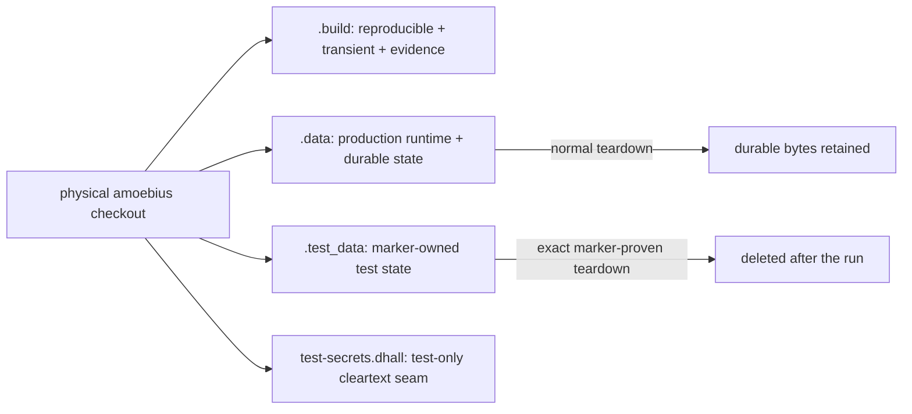

# Repository Layout and Artifact Provenance

> **Purpose**: Define the complete amoebius repository layout, the authored-versus-derived classification,
> every generated-output class, and the required `.gitignore` and `.dockerignore` contracts.
> **Read this if**: a file is being added, generated, moved, ignored, packaged into a container context, or
> considered for version control.

This document owns repository placement and artifact provenance. It does not own a generator's domain
semantics, which remain with that subsystem's doctrine. Phase sequencing and migration status live in
[`../../DEVELOPMENT_PLAN/README.md`](../../DEVELOPMENT_PLAN/README.md). Familiarity with the generated-artifact
rule in [`generated_artifacts_doctrine.md`](./generated_artifacts_doctrine.md) is useful but not required.

<details>
<summary>Link-graph metadata</summary>

**Status**: Authoritative source
**Supersedes**: N/A
**Referenced by**: DEVELOPMENT_PLAN/README.md, DEVELOPMENT_PLAN/development_plan_gate_integrity.md, DEVELOPMENT_PLAN/development_plan_standards.md, DEVELOPMENT_PLAN/legacy_tracking_for_deletion.md, DEVELOPMENT_PLAN/overview.md, DEVELOPMENT_PLAN/phase_00_documentation_suite.md, DEVELOPMENT_PLAN/phase_01_toolchain_spike.md, DEVELOPMENT_PLAN/phase_25_base_image_registry.md, DEVELOPMENT_PLAN/system_components.md, README.md, documents/README.md, documents/engineering/README.md, documents/engineering/generated_artifacts_doctrine.md, documents/engineering/substrate_doctrine.md, documents/engineering/test_derivation_analysis.md, documents/engineering/testing_doctrine.md, documents/reading_order.md
**Generated sections**: none

</details>

## Contents
- [1. Classification rule](#1-classification-rule)
- [2. Complete repository structure](#2-complete-repository-structure)
- [3. Complete generated-output inventory](#3-complete-generated-output-inventory)
- [4. Dependency and toolchain resolution](#4-dependency-and-toolchain-resolution)
- [5. Run evidence and phase status](#5-run-evidence-and-phase-status)
- [6. `.gitignore` contract](#6-gitignore-contract)
- [7. `.dockerignore` contract](#7-dockerignore-contract)
- [8. Enforcement and source-snapshot acceptance](#8-enforcement-and-source-snapshot-acceptance)
- [9. Migration boundary](#9-migration-boundary)
- [Related Documents](#related-documents)

---

## 1. Classification rule

Every repository path has exactly one provenance class.

| Class | Meaning | Version-controlled |
|---|---|---|
| Authored input | A human-maintained source, contract, independent fixture, or policy | Yes |
| External immutable input | Reviewed vendored source or patch whose upstream provenance is recorded | Yes |
| Derived output | Any file reproducible from another file, command, compiler, resolver, renderer, or test | No |
| Run evidence | Logs, receipts, ledgers, traces, reports, screenshots, and machine observations from one execution | No |
| Runtime state | Secrets, credentials, caches, downloaded tools, browser profiles, databases, and local service state | No |

A file's extension does not decide its class. An independently authored `.json`, `.tsv`, `.dhall`, or golden
may be source. The same extension emitted by a command is derived output. Copying, renaming, or reformatting a
derived file does not convert it into authored input.

The classification question is mechanical: if repository inputs plus a documented command can reproduce the
file, the file is generated and cannot be version-controlled. A generated result may be inspected or retained
under `.build/`, but it never moves back into an authored root. Python interpreter bytecode is the sole
location exception: it may be cached beside imported source, but both ignore contracts exclude it and it is
never an authored input, tracked file, or container-context input.

## 2. Complete repository structure

The tree below is the **target final layout**: the shape the repository has at completion, not a record of
what a build target once needed. It is exhaustive by ownership; `**` denotes every descendant of the named
root. Every root is justified by what its contents *are* — the language they are written in, or the reader
that consumes them — never by which phase or build target introduced them. A new top-level root requires an
amendment here, reviewed against that justification, before any file is added
([`development_plan_standards.md` §U](../../DEVELOPMENT_PLAN/development_plan_standards.md#u-the-final-repository-layout)).

```text
amoebius/
├── .git/**                               local VCS metadata; never a build/context input
├── .dockerignore                         authored container-context policy
├── .gitignore                            authored worktree policy
├── AGENTS.md                             authored agent policy, read by every agent
├── CLAUDE.md                             the same policy's second entry point; a link, never a copy
├── README.md                             authored repository entry point
├── amoebius.cabal                        the one authored Haskell package: libraries, executables, suites, flags
├── cabal.project                         authored package set and out-of-tree source resolution
├── package.json                          authored JavaScript/PureScript tool requirements
├── DEVELOPMENT_PLAN/**                   authored plan suite: rulebook, tracker, one contract per phase
├── documents/**                          authored doctrine suite and illegal-state catalog
├── src/**                                authored Haskell library source; one module tree, read by GHC
├── app/<executable>/**                   authored executable main modules; one directory per executable
├── dhall/**                              authored schemas, examples, and catalogs; read by the Dhall interpreter
├── proto/**                              authored protobuf schemas; bindings render to .build/proto/
├── ui/**                                 authored PureScript source and its one spago project
├── pb/**                                 authored Python distribution whose console script is `pb`
├── pulumi/**                             authored programs the Pulumi engine executes verbatim
├── test/**                               authored specs, fixtures, goldens, negatives, oracles, mutants, harnesses
├── tools/**                              authored gates, generators, lints, policy inputs, declared seed corpora
├── probe/**                              the standalone toolchain probe: the one package resolved apart
├── vendor/**                             reviewed external source with recorded upstream provenance
├── patches/**                            reviewed compatibility patches applied to out-of-tree source
├── .build/**                             reproducible, transient, and evidentiary local output; ignored by both contracts
├── .data/**                              production runtime and durable state; operator-retained; ignored by both contracts
├── .test_data/**                         harness-owned test runtime and durable state; safely disposable; ignored by both contracts
├── test-secrets-types.dhall              tracked test-secret field/type shape; contains no values
└── test-secrets.dhall                    ignored test-only cleartext values; never production input
```

Two roots fix a second level, because their second level is where the taxonomy drifted:

```text
test/
├── spec/**                               suite mains and independently authored reference implementations
├── fixture/**                            authored positive inputs
├── golden/**                             authored expected outputs, byte-exact under a pinned convention
├── negative/**                           authored rejected inputs, each beside its expected diagnostic
├── oracle/**                             independently authored reference tables and predicates
├── mutant/**                             seeded mutants: one record format, one registry, every operator
└── harness/**                            fakes, argv shims, OS-boundary observers, gate scripts

app/
├── amoebius/Main.hs                      the operator and control-plane binary
├── amoebius-singleton/Main.hs            the in-cluster singleton binary
├── amoebius-ui-server/Main.hs            the UI server binary
└── infernix-driver/Main.hs               the native inference driver
```

Every `test/` second-level name is a **singular** role noun. A plural sibling, a case variant, or an eighth
role is non-conforming on sight; module hierarchy lives *below* `test/spec/`, never at `test/`'s second level,
so casing is decided by the module name and cannot fork.

### 2.1 When a unit warrants its own build package

There is exactly one authored Haskell package. The criterion is **separately resolvable, never merely
separately configured** — three admitted grounds, each independently checkable:

| Ground | Test | Instances |
|---|---|---|
| Foreign provenance | its source is not authored in this repository | `vendor/**` |
| Foreign resolution | it must solve against a different compiler, project file, or dependency set — including a deliberately perturbed one used as a gate mutant | `probe/**` |
| Foreign consumer | something outside this repository depends on it by name and version | none today |

None of the following is a ground, because cabal answers each *inside* one package: a different flag set
(flags are package-scoped and `if flag(…)` is per-component), a different module namespace (`library <name>`
sub-libraries), a different `hs-source-dirs` or warning set (per-component), a different test grouping
(unlimited `test-suite` stanzas), or an import cycle. The cycle case is the one that matters: an intra-package
sub-library graph cannot cycle at the package level, so a package split introduced to break a cycle creates
the cycle it breaks. A `build-type: Custom` `Setup.hs` is likewise not a ground — it is a generator, and
[§3.1](#31-canonical-build-tree) already declares its output's home.

The same reasoning names the roots by their reader rather than their owner: `dhall/` is read by the Dhall
interpreter, `proto/` by protoc, `pb/` by CPython, `ui/` by purs, `pulumi/` by the Pulumi engine, and
`src/`/`app/` by GHC. Where a subject has both a program the third-party engine executes and Haskell that
decides what to ask it, the program lives in the reader's root and the Haskell lives in `src/`.

Per-substrate host code is a module tree, not a root. `src/Amoebius/Substrate/**` and
`src/Amoebius/HostWorker/**` hold every substrate side by side, which is what makes the Apple and Windows host
workers structurally symmetric as [`substrate_doctrine.md`](./substrate_doctrine.md) requires; a root for one
substrate and none for the other contradicts that symmetry rather than expressing it.

### 2.2 Present-day roots and their required destination

The roots below exist today and are **migration surfaces, not canonical source classes**. Each is owned by the
phase named in
[`legacy_tracking_for_deletion.md`](../../DEVELOPMENT_PLAN/legacy_tracking_for_deletion.md), which carries the
closure condition; none may receive new content.

| Present path | Required destination |
|---|---|
| `DEVELOPMENT_PLAN/evidence/**` | `.build/runs/**` plus the repository-local evidence store under `.build/evidence-store/` |
| `DEVELOPMENT_PLAN/ledgers/**` | authored reasoning retained in a phase doc; generated ledger views to `.build/docs/**` |
| `test/enumeration/**` | `.build/test-surfaces/**` |
| `test/golden/phase_*_ledger.json` | `.build/runs/<phase>/<run-id>/ledger.json` |
| `mutants/**`, `test/live/mutants/**`, `test/host/mutants/**` | `test/mutant/**`, one record format |
| `test/goldens/**`, `test/fixtures/**`, `test/negatives/**`, `test/Ui/**` | their singular-role siblings |
| `toolchain/bin/**`, `toolchain/runtime/**`, `toolchain/downloads/**`, `toolchain/cache/**` | `.build/toolchain/**`; the authored requirements file moves beside its only consumer under `tools/**` |
| `docker/**` | the typed bake catalog under `dhall/**`, rendering to `.build/docker/**/Dockerfile` |
| `ui-runtime/**` | `ui/**`, under the one spago project |
| the cabal-only package roots, the sibling-lift roots, and the `amoebius-*` package roots | stanzas in `amoebius.cabal`; their source to `src/**`, `test/**`, `proto/**`, and `dhall/**` |
| out-of-tree `hs-source-dirs` reaching a sibling checkout | a `source-repository-package` in `cabal.project`, so the input is resolvable from the source snapshot |
| root dependency lock/freeze files | `.build/locks/**` |
| `toolchain/pins.json` | **migrated.** The authored half is the compatibility requirements — ranges, release channels, asset patterns, no paths; the resolved half is `.build/toolchain/resolved.json`, written per run |
| `tools/doc_lint_corpus/**/negative_*` and `negative_multi_*` | keep authored positive seeds and mutation recipes; materialize negative copies under `.build/test-corpora/**` |
| reference-program expected output beneath `test/golden/**` | retain the reference program and authored inputs; produce expected results under the run bundle |
| frozen sibling-source and expected-hash tables | resolve the reviewed sibling boundary at run time and record observations under `.build/runs/**` |
| fixed versions, URLs, paths, or integrity fields in bootstrap/toolchain envelopes | split authored compatibility requirements from run-local resolution under `.build/toolchain/**` |
| generated digest, checksum, trace, and expected-output fixtures | independently author and review the expectation, or regenerate it under the owning run bundle |
| `gen/**`, `dist-*/**`, `node_modules/**`, `toolchain/{bin,runtime,downloads,cache}/**` | the matching class beneath `.build/**` |
| `/tmp/amoebius*`, `/var/tmp/amoebius*`, `/var/lib/amoebius/**`, `~/.amoebius/**`, `~/.local/share/amoebius/**` | `.build/**`, `.data/**`, or `.test_data/**` according to lifecycle; delete the external path after verified migration |
| host-global Docker containers, volumes, build cache, and daemon data for amoebius | a project-scoped engine whose entire data root and runtime directory are beneath `.data/**` or `.test_data/**` |

A fixture remains version-controlled only when its expectation was authored independently. A generated
snapshot, reference-program output, enumeration, coverage table, or run ledger cannot remain in any authored
root. No path in either tree above carries a phase ordinal
([`development_plan_standards.md` §U](../../DEVELOPMENT_PLAN/development_plan_standards.md#u-the-final-repository-layout)
clause 3).

### 2.3 The closed local-state roots

**The problem.** A path can be ignored and still escape the project. System temporary directories, user-home
state, global Docker volumes, and `/var/lib` backing survive beyond the checkout, evade the repository audit,
and make cleanup depend on remembering every tool's private default.

**Why the obvious alternative fails.** Documenting a longer list of external paths does not create
containment. It merely makes the escape reproducible, while a shared daemon or changed environment variable
can introduce another storage home without amending the repository contract.

**The rule.** amoebius has a closed set of project-owned local-state roots:

- `.build/**` contains every reproducible or transient byte: builds, acquired tools, package stores, caches,
  generated source, temporary files, run bundles, logs, and the local content-addressed evidence store.
- `.data/**` contains production runtime and durable state. Normal teardown may remove ephemeral objects but
  never this root or durable descendants; destructive reclamation is an explicit operator action.
- `.test_data/**` contains only harness-created test runtime and durable state. A run owns a unique descendant,
  records an ownership marker before mutation, and may delete only that exact descendant after proving the
  marker and path are unchanged. Tests fail before acting when production state or configuration is present.
- `test-secrets.dhall` is the only cleartext secret-at-rest amoebius permits. It is ignored, excluded from
  every container context, read only by the elevated test harness, and rejected by every production command.

Path resolution starts from the physical repository root, not the caller's current directory. amoebius sets
tool-specific cache, store, temp, Docker data-root, Docker runtime, kubeconfig, and service-state paths below
the appropriate project root before invoking a tool. A container or guest may use conventional internal
paths only when the image, volume, and virtual disk that back those bytes are themselves stored below the
project root. Operator-installed prerequisite executables may be shared; amoebius must not place
project-owned data beside them.


*Orientation. The root selected at creation determines lifecycle and deletion authority; the [testing doctrine](./testing_doctrine.md) owns test deletion, and no arrow leaves the physical checkout.*

**What it forecloses.** amoebius cannot use the host's default system Docker daemon for project-owned
containers, volumes, or build cache, cannot fall back to `/tmp`, `/var/tmp`, `/var/lib/amoebius`, or a user
home, and cannot run a test against `.data/**`. A tool that cannot redirect all project-owned state into the
closed roots is not an admissible backend.

## 3. Complete generated-output inventory

Every generated file belongs to one of the paths below, including the explicitly source-adjacent Python cache
patterns in §3.2. A generator requiring a new output class must amend this inventory before it writes the file.

### 3.1 Canonical `.build/` tree

```text
.build/
├── tla/**/*.tla                          emitted TLA+ modules
├── tla/**/*.cfg                          emitted TLC configurations
├── manifests/**/*.{yaml,yml,json}        rendered Kubernetes and provider objects
├── dhall/**/*.dhall                      reflected or projected Dhall
├── dsl/**                                decoder/fold/bind battery observations and locus ledgers
├── ui/**                                 client/server/offline plans and compiled browser output
│   ├── client-plans/**
│   ├── server-plans/**
│   ├── contracts/**
│   ├── codecs/**
│   ├── migrations/**
│   ├── service-workers/**
│   └── bundles/**
├── docker/**/Dockerfile                  rendered image recipes
├── proto/**/*.hs                         generated protobuf Haskell modules
├── proto/**/*.{hi,o,dyn_hi,dyn_o}        protobuf compiler output
├── test-surfaces/phase_*.json            runtime test enumeration
├── test-corpora/**                       materialized negatives derived from authored seeds/recipes
├── locks/**                              dependency solver output
│   └── phase_*/resolution-*.json
├── toolchain/**                          downloaded/resolved tool state
│   ├── resolved.json
│   ├── downloads/**
│   ├── bin/**
│   └── runtime/**
├── cabal-store/**                        repository-local Cabal package store
├── dist-newstyle/**                      Cabal build root
├── node_modules/**                       package-manager dependency tree
├── evidence-store/**                     content-addressed local gate attestations
├── runs/<phase>/<run-id>/**              one-run evidence
│   ├── ledger.{json,tsv}
│   ├── receipt.{json,tsv}
│   ├── commands.json
│   ├── environment.json
│   ├── toolchain.json
│   ├── substrate.json
│   ├── checks.{json,tsv}
│   ├── mutants.{json,tsv}
│   ├── coverage.{json,tsv,xml}
│   ├── junit.xml
│   ├── traces/**
│   ├── logs/**
│   ├── screenshots/**
│   ├── browser-profile/**
│   └── topology/**
├── docs/**                               generated dashboards and reports
└── tmp/**                                disposable generator scratch space
```

### 3.2 Build, compiler, package-manager, and cache output

| Pattern | Generated content |
|---|---|
| `dist-newstyle/**`, `.cabal-sandbox/**`, `.ghc.environment.*` | Cabal/GHC plans, builds, indexes, objects, interfaces |
| `**/*.{o,hi,dyn_o,dyn_hi,hie}` | Haskell compiler output |
| `node_modules/**` | npm-installed dependency trees and their nested lock metadata |
| `ui-runtime/.spago/**`, `ui-runtime/output/**`, `ui-runtime/dist/**` | Spago and PureScript build state |
| `**/__pycache__/**`, `**/*.{pyc,pyo,pyd}` | Source-adjacent Python interpreter caches; permitted locally only because both ignore contracts exclude them |
| `.pytest_cache/**`, `.coverage*`, `htmlcov/**`, `coverage/**` | Python and general coverage state |
| `toolchain/bin/**`, `toolchain/runtime/**`, `toolchain/downloads/**`, `toolchain/cache/**` | acquired tools and archives |
| `.phase*-build/**`, `phase*-build/**`, `build/**`, `_build/**`, `out/**`, `output/**`, `dist/**` | phase and language build roots |
| `.cache/**`, `tmp/**`, `temp/**` | local caches and temporary files |
| `playwright-report/**`, `test-results/**`, `screenshots/**` | browser/test reports |
| browser profiles, SQLite run databases, PID files, sockets, logs | ephemeral runtime state |

### 3.3 Dependency-resolution output

No `.lock` or `.freeze` file is version-controlled. The rule covers, without exception:

- `cabal.project.freeze`, `*.freeze`, and `*.lock`;
- `package-lock.json`, `npm-shrinkwrap.json`, `yarn.lock`, and `pnpm-lock.yaml`;
- `spago.lock`, `flake.lock`, `poetry.lock`, `Pipfile.lock`, `Gemfile.lock`, `composer.lock`, and `mix.lock`;
- `go.sum` and any package-manager checksum database;
- any generated package graph, solver plan, downloaded-package manifest, or dependency SHA table.

### 3.4 Generated source, tests, and documentation

The prohibition includes generated source code. Protobuf bindings, reflected codecs, generated PureScript,
test enumerations, expected outputs produced by a reference program, generated Markdown, tables, diagrams,
contents blocks, and copied command output remain untracked. The original `.proto`, authored reference
implementation, authored expectation, or authored prose remains the source.

A generated negative corpus follows the same rule. Version control retains the smallest independently
meaningful source: positive seed files, an explicit mutation definition, and the checker. Mutated copies,
Cartesian expansions, and other mechanically materialized negatives are emitted under `.build/test-corpora/`
or `.build/tmp/`. Their number, path layout, or usefulness as test input does not make them source.

Generated Markdown is written only under `.build/docs/**`. Governed Markdown under `documents/` and
`DEVELOPMENT_PLAN/` always declares `**Generated sections**: none`.

### 3.5 TSV inventory and provenance

TSV is a transport format, not a source class. The repository audit classifies the present TSV families as
follows:

| Path or filename family | Classification and destination |
|---|---|
| `DEVELOPMENT_PLAN/evidence/**/*.tsv` | Generated run evidence; relocate to `.build/runs/<phase>/<run-id>/**`, attest in `.build/evidence-store/**`, and remove from the plan tree |
| `.build/**/*.tsv` | Canonical local generated output; ignored and never version-controlled |
| `phase-results.tsv`, `validation-locus-ledger.tsv`, `live-*.tsv`, `sprint-*.tsv`, `*-red-before-correction.tsv` in any root | Generated observation or report; canonicalize beneath the owning run bundle |
| `dhall/examples/locus_registry.tsv`, `test/fixtures/**/*.tsv`, `test/oracle/formal/**/*.tsv`, non-ledger `test/golden/**/*.tsv`, `test/oracle/**/*.tsv` | Candidate authored fixture/oracle; version-control only with independent authorship or review provenance |
| `mutants/**/*.tsv`, `test/mutants/**/*.tsv`, `tools/ledger_lint_corpus/**/*.tsv` | Candidate authored negative corpus; version-control only when rows are intentionally authored and not emitted by the system under test |
| Any `expected_hashes.tsv`, `expected_digests.tsv`, `reference_traces.tsv`, expected-output table, or copied inventory | Ambiguous migration input; the owning phase must establish independent authorship or regenerate it under `.build/**` |

Renaming a run ledger to “golden” or an emitted table to “oracle” does not make it source. Phase 0 records the
provenance decision for shared corpora; each later phase owns its domain-specific tables before revalidation.

### 3.6 Authored negative corpora and their audit scope

A corpus that seeds a defect contains that defect on purpose, so the repository audit would otherwise report
its own fixtures. The exemption that resolves this is **one authored declaration**, not a special case per
corpus: the table below names every authored negative corpus and the audit rules it deliberately seeds, and
the audit steps over exactly those pairings. A rule the corpus does not seed still applies to it, and a path
the table does not name is never exempt.

| Corpus | Rules it seeds | Why the corpus must contain what the rule rejects |
|---|---|---|
| `tools/ledger_lint_corpus/` | r2 | A hand-written run ledger is the only way to seed the ledger-shape classifier |
| `tools/doc_lint_corpus/` | r15 | The documentation lint checks plan-document naming, so its positive seed must be a synthetic `phase_NN_<slug>.md`; the ordinal is the property under test, not a label on a capability |
| `tools/artifact_policy_selftest.py` | r1, r5, r6, r16 | The audit's own per-rule mutants: an invented output class, a generated path beneath an authored root, a resolved home path, and explicit outside-host state paths |
| `tools/toolchain_spike_negative_corpus.py` | r6 | The toolchain gate's build configurations carry a developer-home compiler path and an archive checksum beside its URL |
| `tools/attestation_negative_corpus.py` | r5 | A refused run bundle must name a plan-tree evidence path for the store to reject it |

Two properties keep the declaration from becoming a silence. A corpus is a **dedicated module or directory**
whose entire purpose is visible in one reading, so seeded bodies move out of the tool that consumes them
rather than exempting that tool. And every declared pairing must **actually suppress a finding**: a corpus
that stops seeding its rule, or a path that no longer exists, is reported as a stale exemption and removed.

## 4. Dependency and toolchain resolution

amoebius records requirements, not resolver output. An authored requirement may state a compiler/API
compatibility range, a package name, a release channel, or a minimum feature set. It does not contain a
library archive SHA, package checksum, transitive solver graph, local executable path, or user-home path.

Each clean run resolves the current compatible set dynamically. The resolver writes versions, source
identities, download URLs, observed checksums, signatures, executable paths, and the complete dependency graph
to `.build/toolchain/**` and `.build/locks/**`. Those observations are attached to run evidence, not copied
into Markdown or a tracked manifest.

Transport authentication and upstream signatures are verified when an ecosystem supplies them. A checksum
computed after resolution detects corruption within that run; it is not promoted into a permanent package
pin. This policy deliberately trades repository-embedded frozen resolution for continuously refreshed
compatibility evidence.

No tracked file may contain an absolute path beneath a developer home directory. Gates resolve logical tool
names through the run-local toolchain record. Standard guest paths may be contractual only when the guest
image itself owns them.

## 5. Run evidence and phase status

A gate emits its evidence under `.build/runs/**` and installs an immutable, content-addressed attestation in
`.build/evidence-store/**`. Git contains neither the ledger nor a copy of the receipt. The attestation binds the source tree,
phase contract, command, resolved dependency graph, toolchain, substrate, checks, mutants, coverage, cleanup,
and raw-observation digests.

The development-plan tracker records the human status decision and a content-addressed run reference when needed. It
does not embed a generated ledger hash or duplicate run output. A Done decision requires a run whose recorded
source-snapshot digest still matches the tree; editing the source afterwards invalidates the binding and needs
a fresh run. Commit timing is orthogonal and is never a gate condition.

## 6. `.gitignore` contract

The tracked `.gitignore` must cover every generated class. The block below is normative and **exhaustive in
both directions**: order may differ, but a class the block names and the file omits is missing coverage, and a
pattern the file carries and the block does not name is an undeclared class. Both are findings. A one-way
subset check lets the file grow patterns nobody reviewed — which is how a build root came to be clean only
under a developer's personal ignore configuration, invisible to every check that reads the worktree.

A pattern here is also a claim that the path is generated. An ignore rule for a path the
[§2](#2-complete-repository-structure) target tree does not contain is removed rather than kept, because a rule
hiding a path nobody intends is how a second home for a generated class survives review. The rules covering
migration surfaces in [§2.2](#22-present-day-roots-and-their-required-destination) are therefore temporary:
each retires with the root it covers, owned by the phase that relocates it.

```gitignore
# Every pattern here is a claim that the path it names is generated, and that the
# repository-layout doctrine section 2 target tree contains it. A rule for a path the
# tree does not contain is removed rather than kept — a rule hiding a path nobody
# intends is how a second home for a generated class survives review. The rules covering
# section 2.2 migration surfaces are temporary and retire with the root they cover.

# Canonical contained-state roots.
/.build/
/.data/
/.test_data/

# Pre-containment migration surfaces.
/gen/
/DEVELOPMENT_PLAN/evidence/
/test/enumeration/
/test/golden/phase_*_ledger.json
/test/golden/phase_55_expected_run_ledger.json

# Dependency resolution is refreshed dynamically and never committed.
*.lock
*.freeze
package-lock.json
npm-shrinkwrap.json
pnpm-lock.yaml
go.sum

# Haskell and formal-model build output. Cabal roots and discovery scratch are
# redirected beneath `.build/**`; only source-adjacent compiler products need classes.
*.o
*.hi
*.dyn_o
*.dyn_hi
*.hie
*.tla
*.cfg

# JavaScript and PureScript legacy build output below the authored UI root.
/ui-runtime/.spago/
/ui-runtime/output/
/ui-runtime/dist/

# Python may keep source-adjacent interpreter caches. They are always generated
# and must never become repository inputs.
__pycache__/
*.py[cod]

# Runtime output written beside a run.
*.log
*.pid
*.sock

# The single sanctioned cleartext-secret file is the test-secrets seam of
# vault_pki_doctrine.md section 3.3: test-only, flagged, never tracked.
/test-secrets.dhall
```

A generic ignore pattern never substitutes for the provenance check. CI must also reject a tracked file whose
header or generator registry classifies it as derived.

## 7. `.dockerignore` contract

The Docker context excludes every derived, evidentiary, secret, and runtime-state class. It is at least as
strict as `.gitignore` for generated content, and the block below is normative and **exhaustive in both
directions** on the same terms as [§6](#6-gitignore-contract): a class named here and absent from the file is
missing coverage, and a pattern the file carries and this block does not name is an undeclared class.

```dockerignore
# Every pattern here is a claim that the path it names is generated, and that the
# repository-layout doctrine section 2 target tree contains it, on the same terms as
# `.gitignore`. This contract is at least as strict as that one for generated content.

# Version-control metadata is never a build input.
.git
.git/**

# Canonical contained-state roots.
.build
.build/**
.data
.data/**
.test_data
.test_data/**

# Pre-containment migration surfaces.
gen
gen/**
DEVELOPMENT_PLAN/evidence
DEVELOPMENT_PLAN/evidence/**
test/enumeration
test/enumeration/**
test/golden/phase_*_ledger.json
test/golden/phase_55_expected_run_ledger.json

# Dependency resolution is refreshed dynamically.
**/*.lock
**/*.freeze
**/package-lock.json
**/npm-shrinkwrap.json
**/pnpm-lock.yaml
**/go.sum

# Haskell, JavaScript, and PureScript build products.
**/*.o
**/*.hi
**/*.dyn_o
**/*.dyn_hi
**/*.hie
**/*.tla
**/*.cfg
ui-runtime/.spago
ui-runtime/.spago/**
ui-runtime/output
ui-runtime/output/**
ui-runtime/dist
ui-runtime/dist/**

# Source-adjacent Python interpreter caches are local accelerators, never image
# build inputs.
**/__pycache__
**/__pycache__/**
**/*.pyc
**/*.pyo
**/*.pyd

# Runtime output written beside a run.
**/*.log
**/*.pid
**/*.sock

# The test-secrets seam of vault_pki_doctrine.md section 3.3 is test-only and never
# enters a build context.
test-secrets.dhall
```

An image build that needs a derived artifact regenerates it inside a staged build or receives it as an
explicit build input from the current run. It never broadens the context to include local caches or evidence.

## 8. Enforcement and source-snapshot acceptance

Every phase gate inherits these postconditions:

1. The run binds to its source snapshot: every non-ignored file as it stands when the gate starts.
2. Every deliberate generator, compiler, resolver, tool, and subprocess writes only to `.build/**`; normal
   source-adjacent Python interpreter caches are the sole location exception.
3. Test enumeration is regenerated and joined to independently authored expectations by stable identity.
4. No test or generator writes beneath an authored root except for Python's ignored interpreter cache.
5. `git ls-files` contains no derived path, generated header, lock/freeze file, bytecode, or run evidence.
6. The gate leaves every tracked file unchanged and creates no unignored generated file.
7. The Docker context audit contains no derived output, evidence, cache, credential, or runtime state.
8. The repository-local attestation verifies before the phase can be marked Done.
9. The source snapshot contains every authored input referenced by a build, test, or gate; an ignored
   worktree file can never complete the repository's source closure.
10. The tracked-tree audit classifies files semantically, not only by ignore-pattern or path match, and rejects
    reproducible copies even when they live in an otherwise authored root.

The inherited host-inventory, production/test separation, and test-secrets postconditions are stated once in
[`development_plan_gate_integrity.md` §S](../../DEVELOPMENT_PLAN/development_plan_gate_integrity.md#s-universal-artifact-hygiene-gate).

Python commands run with ordinary bytecode caching enabled. The cache may remain beside source on a developer
worktree because `.gitignore` excludes `__pycache__/` and all Python bytecode suffixes, while `.dockerignore`
excludes the same paths from every build context. Phase 0 rejects missing patterns, tracked bytecode, Docker
context leakage, and command-level bytecode suppression; it does not require deleting a valid ignored cache.

Phase 0 audits two different boundaries. The current-tree audit covers tracked, ignored, untracked, and
effective Docker-context paths, then repeats the documented verifier against the source snapshot alone. The revision-history
audit separately scans reachable commits for secrets, credentials, generated artifacts, obsolete names, and
other files that current ignore rules cannot remove retroactively. Unreachable local objects are reported as
local state and are not treated as part of the shared repository closure.

A secret or credential found in history requires immediate rotation and a coordinated history purge. A
non-secret generated or obsolete historical blob requires forward removal plus an explicit recorded decision:
retain the old history, or perform an operator-approved coordinated rewrite. A documentation or cleanup phase
must never rewrite shared history implicitly.

When a pristine Linux host is required, every hardware substrate supplies the `linux-cpu` lane. Incus is used
on Linux and Linux-CUDA hosts, Lima on Apple, and WSL2 on Windows. A specialized Apple or Linux-CUDA gate may
add its one specialized lane without removing the baseline.

## 9. Migration boundary

The repository does not yet satisfy this doctrine. The current generated ledgers, evidence, enumeration,
derived test corpora, reference-program outputs, checksum/digest fixtures, resolved paths, and hard-coded
package integrity values are migration inputs, not exceptions. Ignored authored compatibility patches and
human reasoning in ignored phase ledgers must be relocated before their old paths are deleted. Their exact
disposition is tracked in
[`../../DEVELOPMENT_PLAN/legacy_tracking_for_deletion.md`](../../DEVELOPMENT_PLAN/legacy_tracking_for_deletion.md).

Documentation adoption alone supplies no implementation evidence. The 2026-08-11 source-closure audit found the
Phase-0 verifier depending on ignored inputs; as of 2026-08-12 the provenance classifier, semantic tracked-path
and effective Docker-context audits, authored-root write guard, history audit, fresh-clone gate,
dynamic-resolution audit, and repository-local attestation are implemented and pass two-sided from a clone. Phase 0
is sealed: the gate publishes an attestation bound to the source snapshot it ran against.

The migration surface those checks reveal is not closed by them. Each finding outside the running phase's
ownership is deferred to the phase named in
[`../../DEVELOPMENT_PLAN/legacy_tracking_for_deletion.md`](../../DEVELOPMENT_PLAN/legacy_tracking_for_deletion.md),
reported on every run, and cleared by that phase's gate. Every later phase remains reopened until its gate
uses the new output paths, produces repository-local evidence, and passes the source-snapshot acceptance above.

## Related Documents

- [Generated Artifacts](./generated_artifacts_doctrine.md) — semantic rule for projections and authored inputs
- [Testing Doctrine](./testing_doctrine.md) — enumeration, independent expectations, and repository-local evidence
- [Documentation Standards](../documentation_standards.md) — governed Markdown remains authored
- [Development Plan Standards](../../DEVELOPMENT_PLAN/development_plan_standards.md) — phase-gate adoption
- [Legacy Tracking](../../DEVELOPMENT_PLAN/legacy_tracking_for_deletion.md) — migration work and deletion owners
- [Substrate Doctrine](./substrate_doctrine.md) — universal `linux-cpu` and pristine-host routing
