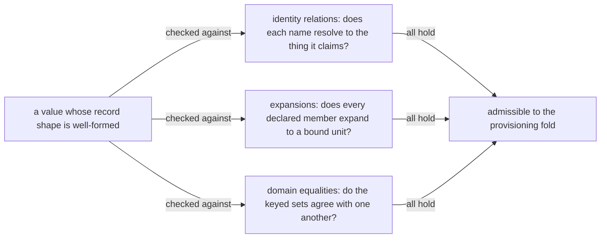

# Resource Capacity: Checked Construction

> **Purpose**: The identity and derivation obligations checked construction adds to the resource types, which their record spellings alone cannot express.
> **Read this if**: a decoded resource value has to be checked for more than its shape.

This slice of the resource-capacity family carries what construction checks beyond a record's fields: the
identity relations, the expansions, and the domain equalities a value must satisfy before it can be
provisioned. It does not carry the types themselves, owned by
[resource_capacity_types.md](./resource_capacity_types.md), nor the folds that consume them, owned by
[resource_capacity_folds.md](./resource_capacity_folds.md).

<details>
<summary>Link-graph metadata</summary>

**Status**: Authoritative source
**Supersedes**: N/A
**Referenced by**: DEVELOPMENT_PLAN/phase_09_execution_accelerator_folds.md, documents/engineering/resource_capacity_types.md
**Generated sections**: none

</details>

## Contents
- [Checked construction](#checked-construction)
- [Related Documents](#related-documents)

---

## Checked construction


*Orientation. Design intent. The three obligation classes below, and the fact that a well-formed record satisfies none of them by itself; the types they range over are owned by [resource_capacity_types.md](./resource_capacity_types.md), and the fold that consumes an admissible value by [resource_capacity_folds.md](./resource_capacity_folds.md).*

#### Checked construction: what a record spelling cannot state

Checked construction adds identity/derivation obligations that the record spelling alone cannot express:

- every container names both **which image it is** and **what it executes**, and the two must agree. An
  `ImageArtifact` carries a closed `ImageIdentity`
  ([image_build_doctrine.md §5](./image_build_doctrine.md#5-versioning-vs-latest--development_plan-decision-recommended-default-immutable-never-latest))
  alongside its digests, so a digest alone no longer inhabits the type and there is no arm for a foreign
  image. A `ContainerEnvelope` carries a `ContainerProcess`, so what runs is a typed value rather than
  whatever the image's entrypoint happens to be. Two relations are checked at binding and reject before
  render: an `AmoebiusRole` container must run an image whose identity is the `Runtime` arm. An
  extension-bearing `Worker` kind's named `ExtensionId` must be a member of that arm's `linkedAdapters` set;
  a `UiRuntimeServer` or `UiProjectionWorker` instead carries `AppId + ProgramDigest`, which must resolve in
  the release's sealed UI-program set with compatible client/server ABI
  ([daemon_topology_doctrine.md §4](./daemon_topology_doctrine.md#4-worker-daemons--n-unelected)). A
  `BakedService` container's `BakedBinaryId` must be installed by some `BakeStep` in the identity's own
  build content, so it cannot name an executable no stage put in the image. Neither relation is a runtime
  probe — an unsatisfiable pair has no provisioned value. A declarative UI program therefore cannot smuggle
  an `ExtensionId` into the executable-membership relation, and an installed adapter cannot stand in for
  release admission;
- domain phases may name structural composites such as `EdgeResourceDemand`,
  `PulsarClientExecutionDemand`, `WorkflowRuntimeDemand`, or `ReleaseExecutionDemand`, but those are pure
  source-grouping types, not alternate resource vocabularies or renderer inputs. Binding must total-expand
  every runnable member into one identity-keyed `BoundExecutionSet` using the canonical `ResourceEnvelope`
  atoms before `provision`; source↔execution equality rejects a dropped worker, gateway, Job, controller, or
  host process. The enclosing `BoundExecutionInventory` also carries exactly one deployment-level
  `FirstDeployment | UpdateFrom PriorExecutionProvisionRef` arm; it never carries a prior `Provisioned*`
  value. Only private projections of the resulting whole-deployment witness may render or enact.

#### The bound execution unit and its expansion

Every `BoundExecutionUnit` is an unprovisioned declaration with stable identity/revision and a private
`BoundExecutionBody`; controller, cardinality, resource arm, and replacement safety are one checked sum,
not an invalid cross-product. Deployment/StatefulSet use only `Once | Replicated`; DaemonSet alone embeds
`PerNode { selector }`; Job uses explicit positive completions/parallelism plus finite backoff and
`podReplacementPolicy=Failed`; HostProcess uses `Once | PerNode` and a substrate supervisor. Deployment
supports `Recreate | RollingUpdate { maxSurge, maxUnavailable }` with at least one positive. StatefulSet
supports `OnDelete | RollingUpdate NativeSerialPartitionZero`; amoebius emits neither a nonzero final
partition nor the feature-gated StatefulSet `maxUnavailable` field. DaemonSet supports
`OnDelete | RollingUpdate (Surge PositiveNatural | Unavailable PositiveNatural)`, so neither both-zero nor
both-positive can reach Kubernetes validation. Both `OnDelete` arms carry
`AmoebiusSerialOnDelete`; pure provision derives only the ordered prior-slot/release policy. After live
observation, `ValidatedLiveTarget` authenticates actual Pod UIDs and mints a
`ValidatedSerialOnDeletePlan`; the enactor then deletes exactly one witnessed old Pod, waits for observed
absence and any accelerator-release predicate, and allows its guarded replacement before advancing. They are never
mistaken for an automatically converging native controller rollout. Job construction derives every active
wave and a finite worst-case retained-terminal set from completions, parallelism, backoff, replacement,
amoebius cleanup horizon, and the pinned terminal-retention model; it reserves terminal
Pod/API/etcd/log/runtime-metadata backing
alongside active waves before the first Pod exists. Observed Succeeded/Failed Pods must match that
projection until cleanup. The completed Job object and content-addressed completion ledger are retained;
reconcile suppresses rerun even if the Job object later disappears, and does not emit
`ttlSecondsAfterFinished`. A `NodeEligibilitySelector` is a conjunction of closed typed
constraints over engine role, provider class, site, accelerator profile, and inventory-owned taints; no
free-text selector/toleration exists. Provision derives one planned slot per Once/replica/Job concurrency or
eligible PerNode member; a missing constraint target or missing/extra/ineligible slot rejects.
Gate 2 also refines resource ownership structurally: a CUDA Pod is a DaemonSet `OnDelete` owner with
`CudaRecreateAfterDeviceRelease`; a CUDA host process has the analogous device-release policy; a Metal host
process has `MetalDrainThenReplaceAfterObservedExit`; ordinary Pod/host arms cannot claim those policies,
and Deployment/StatefulSet/Job cannot be paired with a host envelope. These private constructors return a
field-path-specific `UnspellableCombination` for every kind/cardinality/policy/resource mismatch.
Before epoch construction, `FirstDeployment` supplies the exact empty prior
execution map and rejects any supplied/observed amoebius-owned predecessor. `UpdateFrom` resolves the
deployment and exact generation through `ProvisionContext`; its private prior steady projection supplies
every old `(sourceUnit, revision, ordinal, resource)` row. Equal unit/revision identities are unchanged and
deduplicated, changed revisions use the desired unit's legal rollout policy, added desired units have no old
twin, and removed prior-only units remain in apply-before-prune/termination epochs. Provisioning defensively
rechecks kind-specific rollout invariants before it derives identity-keyed steady and planned old/new/surge
`ExecutionEpoch`s and proves both desired-source and prior-source keys equal their instance projections—no
dropped replica, invented instance, copied new envelope/revision into an old row, or favorable epoch.
Desired controller projections alone may render/apply new objects. Separately, prior-authenticated
transition actions may delete an old OnDelete Pod, drain/stop an old host process, or prune a removed unit
under its carried prior controller/replacement guard; no prior-only row can render as desired state.
Each transition `ExecutionEpoch` is an ordinary `Map`: the zero-live-instance gap of `Recreate`, the initial
first-deploy step, and a legal zero-surge/full-unavailable rolling step remain exactly representable.
Desired `steady` is also an ordinary `ExecutionEpoch`: checked construction proves it non-empty whenever a
service/daemon/host controller remains desired, while a Job-only deployment may reach an exact empty
completed steady state. Retained terminal Job Pods contribute only their model-derived API/node metadata,
not a released scheduler reservation. Each epoch places and counts CPU, memory,
logical and physical
ephemeral storage, images/snapshots/workspace, pod/CNI/CSI slots, accelerators, and durable/cache demand.
Live admission exact-joins observed old/still-terminating identities to that resolved prior generation,
unions them with desired new/surge instances, and retains them until disappearance is observed. Unknown,
wrong-generation, wrong-revision, or resource-divergent owned survivors reject rather than becoming free
foreign demand. Observed identities are not planner ordinals: a planned
`MaterializedExecutionInstance.id` is a capacity slot, while every live Kubernetes Pod UID or supervised
host-process id is distinct and remains charged, including two same-revision UIDs for a terminating Pod and
its replacement. Admission-protected deployment/generation/source/revision annotations plus the full
kind-indexed controller ownership chain authenticate Pod provenance; CREATE requires them, UPDATE cannot
change/remove them, and the amoebius scheduler's pre-Binding gate/readback rechecks both. Host supervisors emit the analogous
process identity. Missing, spoofed, or
wrong-generation provenance rejects.
Because Kubernetes may create a replacement while its predecessor is still terminating, no raw
`maxRetainedTerminating` promise exists. Provision instead derives one resource-indexed
`ProvisionedExecutionTransitionGuard` per unit. The Pod arm's exact namespace projection hard-bounds the
ResourceQuota-expressible aggregate requests/limits/counts, while the scheduler guard owns the remaining
placement axes. Admission requires `nodeName` absent, the exact provisioned
resource/image/volume/runtime-class/affinity/toleration projection, exact
source/revision/reservation-template annotations, and `schedulerName = amoebius-capacity`; resize,
ephemeral-container, attachment, and PVC-expansion mutations cannot bypass an atomic provisioned
re-reservation. Only the scheduler service account may use the Binding subresource. The scheduler is the same
amoebius Haskell binary in a dedicated process role, not a kube-scheduler framework plugin or profile. Before
it reports `BootstrapCapacitySchedulerReady` for a generation, it atomically loads and validates the sealed
`ProvisionedSchedulerGuardConfig`: its config generation contains the exact prior+desired source-generation
domain and a map of accepted template sets. Immutable predecessor Pods/ledger rows authenticate against
their prior set; desired Pods authenticate against their desired set; the aggregate config digest commits
to both. Every `(sourceGeneration, sourceUnit, revision, controllerChild)`—including StatefulSet ordinal/PVC,
DaemonSet fixed-or-elastic target, and Job attempt class—maps to exact per-candidate-target
CPU, memory, logical/physical ephemeral, runtime-metadata, image/snapshot/workspace, slot, durable-attachment,
accelerator/VRAM, backing-route, and model operands derived by `provision`. It watches only that scheduler
name, sees the created Pod's stable UID, authenticates the template digest and owner chain, instantiates the
UID-qualified reservation after an attested elastic-target→NodeId binding, and runs canonical placement.
One singleton ledger-root object is the aggregate CAS boundary. It CASes a candidate to `Reserved`, CASes
that record to `BindingInFlight`, then submits Kubernetes Binding.
The transaction does not blindly add numeric Pod vectors: it re-folds static bootstrap/system reservations,
normalized foreign commitments, retained observed runtime artifacts, the complete root ledger, and the
candidate under one fingerprint. CPU/memory/slot and Pod-UID-qualified physical components add; CSI
attachments union by `(node,driver,VolumeIdentity)`; OCI/snapshot extents union once per physical allocation
domain only when bytes/backing/model agree; pull workspace is the top-n missing/pulling work-item peak and
becomes zero only after resident readback; a CUDA device has one Pod owner; grouped backing totals are
re-derived once. Concurrent candidates therefore cannot spend the same residual. A restart/retry
for the same Pod UID reuses an identical reservation without a second debit; a different node may replace
only a `Reserved` record by whole-root resourceVersion CAS. Generation,
source, template, node, axes, identity extent, model, or backing mismatch rejects. Cancellation before a
Binding may release only confirmed-unbound/absent Reserved or BindingInFlight state. A timeout/lost response
remains charged; recovery reads exact UID/node and either repairs BindingInFlight→Bound by CAS or proves
unbound before release. A Bound or Terminating Pod's complete reservation remains until resource-indexed
evidence partitions it: ordinary absence releases compute/slots but retains observed physical artifacts,
CUDA additionally requires device-hold/process release, and Job terminal evidence retains modeled
metadata/log/API bytes until cleanup/GC. The observed ledger and Pod inventory exact-join by
`(deployment, generation, PodUid, templateSet, child, childTemplate, node, axes, state)`: every Reserved/BindingInFlight/Bound/Terminating Pod has one
state-indexed matching `SchedulerReservationRef state`; the sole cross-system recovery arm is an
exact-node observed Bound Pod paired with BindingInFlight plus a repair capability. Any other state mismatch,
orphan, or owner mismatch rejects. Normalization debits Reserved/BindingInFlight candidates once; a
Bound/Terminating UID exact-joins its observed and ledger copies into one vector; and a
Terminal UID debits only the observed retained partition. Summing observed+ledger as two claims is a
no-double-debit failure. A terminal Job Pod may retain its API
object and model-derived node metadata after the scheduler releases compute/slot/device axes; a typed
`Terminal` arm and `SchedulerResourceReleaseWitness` prevent either deadlock or premature metadata credit.
Bootstrap readiness authorizes only the fixed bootstrap-add-on controller cutover. The observer then proves
every old default-scheduled add-on UID absent and every replacement custom-scheduled UID Bound and joined to
its reservation, with old+new overlap charged. Only after that observation may the reconciler install and
read back the managed taint, admission policy, and exclusive Binding RBAC and mint
`ManagedCapacityReady`; only that token authorizes general controller mutation. The scheduler remains active
through termination and invalidates either readiness token whenever the terminating/reservation set,
selected node, or capacity fingerprint changes. A lingering terminator therefore delays scheduling instead
of becoming unbudgeted demand. The scheduler itself is not free: the standard platform inventory includes
`CapacitySchedulerSystemDemand`, then seals one `ProvisionedCapacitySchedulerSystem` with the scheduler-role
image, CPU/memory/storage, controller, config, RBAC/admission/taints, readiness requirement, API objects, and
singleton root ledger's bounded bytes/churn and unique deployment-global render ownership.
Managed-capacity nodes carry an admission-owned taint: every Pod allowed to tolerate it must use this
scheduler, except the one bootstrap scheduler Pod. That exception is pinned to one uniquely eligible node,
uses `Recreate` plus an exact namespace `ResourceQuota pods=1`, and is debited as a perpetual static
reservation inside the same identity-aware fold. Its shared amoebius OCI layers deduplicate normally with
workload layers; compute/slots remain additive. Thus a default-scheduler write cannot race ledger residual.
All other system/addon Pods use the custom scheduler, and there are no other default-scheduler/foreign writers
to managed-node capacity. Workload controllers remain paused until `ManagedCapacityReady`; missing,
conflicting, or one-short scheduler/config/ledger/bootstrap/add-on-conversion capacity rejects.
The HostProcess arm uses its own per-host singleton CAS ledger:
Reserved→LaunchInFlight→Running/Draining, with ambiguous launch outcomes kept charged until process
readback. It partitions release only after observed process exit plus any CUDA device-hold or Metal
drain/allocation/cache predicate, while host cache/log/local artifacts remain in the observed resident
baseline until deletion/GC. Thus
native host workers do not pretend to pass Kubernetes admission. Controller
descriptors lower their children and webhook into
these same generic `BoundExecutionUnit`s; `ControllerChildEnvelope` explains source expansion and records
the shared epoch witness but is never folded as a second controller-private rollout debit. An ordinary
Deployment exact-fit must pass, its one-unit-short twin must fail, a zero-progress rolling negative must
fail before epoch construction, and mutants that admit `{ 0, 0 }`, drop one replica, surge instance, or
observed old/terminating instance must turn the independent epoch oracle red.

#### Slots, backings, and build stages

- for every planned Pod slot, provisioning derives one unprovisioned
  `KubeletRuntimeMetadataDemand` from the exact desired or resolved-prior source, accounting identity,
  container inventory,
  `PodRuntimeMetadataSource.networkAttachments`, and exact volume/mount references. It structurally counts the
  sandbox, pod directory, container-runtime state, CNI state, unique-volume metadata, and mount metadata, then
  applies only the selected node's pinned `kubeletMetadataModel`; callers cannot provide metadata bytes or
  routes. The model emits component ownership plus `KubeletNodefs | CriRuntimeRoot` role totals, the layout
  resolves those roles to concrete backing ids, and the fold sums distinct aliased components before checking
  each backing once beside mapped/log/writable/OCI demand. The component domain is an exact disjoint partition
  with `NodeImageStorageModel`, preventing double or missing runtime state. Planned steady/rollout slots feed
  static capacity and scheduler reservation vectors. PendingUnscheduled Pods are API-only. Reserved and an
  unbound/unknown `BindingInFlight` row debit the planned ledger vector. Once exact Pod UID/node readback
  confirms the Binding—even before the repair CAS changes BindingInFlight→Bound—the observed Pod-UID runtime
  row replaces and exact-joins the planned component projection. Bound/Terminating UIDs and Terminal UIDs with
  observed retained components likewise instantiate observed rows. At confirmed Binding/Bound, the reservation and observed UID
  exact-join into one debit; the node/scope domain witness rejects missing or double-counted rows.
  Missing-largest-pod, role swap/drop, model ownership overlap/hole, Unified alias double-supply/drop,
  SplitRuntime one-byte-short nodefs, and SplitRuntime one-byte-short `containerfs=imagefs` mutants must fail
  while exact-fit controls succeed;
- every host `HostResources.enforcement` matches its bound substrate: Linux requires `LinuxCgroupV2`, Windows
  requires `WindowsJobObject`, and Apple requires a finite `AppleSupervisor` sampling/termination policy.
  Linux/Windows project kernel controls; Apple is explicitly reactive and does not claim an instantaneous
  hard CPU/RSS quota or scheduler reservation. An execution unit whose declared guarantee requires hard
  kernel enforcement on a target that can supply only supervised reaction returns
  `Left UnsupportedEnforcement` before launch;
- every simultaneously live pod consumes one indivisible pod slot, including per-node units, controller
  children, rollout old/new/surge/terminating pods, admission gateways, copy Jobs, and Pulumi executors. A pod
  also consumes one attach slot per **unique** mounted PVC on its declared CSI driver; the same PVC mounted by
  multiple containers is one attachment, while `NodeLocal` volumes consume none. Fixed placement spends the
  selected node's residual slot maps; elastic classes derive `allocatablePods`, CNI/IP slots, and driver
  limits from the pinned SKU+CNI/CSI policies before cover construction. Account-wide volume count is not a substitute for
  per-node attachment fit. Live admission uses the lesser of the declaration, kubelet
  `status.allocatable.pods`/remaining CNI IP capacity, and `CSINode`/SKU attach limits after surviving pods and
  attachments;
- every `BackingId`, `CacheBackingId`, and `HostStorageBackingId` resolves exactly once to its corresponding
  retained, cache, or host-storage pool (or to one explicitly identified provider backing); the referenced
  pool's `NamedDiskCarve.id` resolves exactly once under one `PhysicalDiskBackingId`, and all carve arithmetic
  is performed at that physical parent. Every `DeclaredVolumeDemand` has one `StatefulSetClaimSlot`, one
  `BackingId`, a logical demand, a typed geometry owner, and `VolumePresentation`. Provisioning ignores no
  operand: it derives per-slot required usable bytes, applies the pinned filesystem overhead model, then rounds
  the raw allocation up to the backing's minimum/quantum before uniform-claim grouping. Only its private
  constructor can produce `ProvisionedVolumeDemand.provisionedBytes` and witness. That rounded value is the
  PVC/PV and provider allocation later rendered, while the mounted/block device must expose at least
  `requiredUsableBytes`; there is no author-supplied physical-byte shortcut;
- each `NodeLocalStorageCapacity.filesystems` arm has exactly the aliases stated by
  `KubeletFilesystemLayout`. `Unified` resolves one `nodefs` carve once; `SplitRuntime` and `SplitImage` resolve
  distinct `nodefs`/`imagefs` carves once, with `containerfs` derived as the appropriate alias rather than a
  third editable capacity. The logical pod-ephemeral fold and the per-physical-filesystem fold both run.
  Selected `ImageArtifact`s are an exact join to stored OCI content objects and snapshot chains; same-digest
  size conflicts, a missing config/manifest/compressed layer, a missing snapshot cost, a layout alias, or a
  runtime that cannot witness `SplitImage` rejects;
- build scratch may reference only a `HostStoragePool` tagged `BuildScratch`, package/tool installation only
  `ToolInstall`, host-worker local demand only `HostWorkerLocal`, and no logical pool id or carve id aliases
  another role;
- a build stage graph is acyclic and closed over `dependsOn`; the provisioner derives, rather than accepts,
  its maximum CPU, memory, scratch demand, and simultaneous cache-write delta over every dependency-valid set
  permitted by both concurrency policies. The cache proof is
  `observed resident cache bytes + derived concurrent cache-write delta ≤ CacheBudget ≤ backing`; a budget
  alone is not treated as a demand estimate; and
- `BootstrapExecutionEnvelope.installs` is an ordered, unique, exact join to the mutating `[InstallStep]`
  plan—no missing, duplicate, or extra tool id. For each backing and step `i`, admission derives
  `observed installed residents + Σ installedBytes through i + current peakDownloadUnpackBytes`; the required
  transition peak is the maximum over all steps. Every logical install backing resolves to a `ToolInstall`
  pool, so dropping the largest tool or counting only an empty disk is not a fit.

#### Platform-specific demands

- each selected catalog asset joins exactly once to catalog-owned
  `AssetMaterializationDemand { identity, digest, residentBytes, peakTemporaryBytes }`. Binding groups the
  exact selected set per cache owner, rejects conflicting size metadata for one digest, deduplicates residents
  by digest, and adds the largest simultaneously permitted first-miss temporary peaks. Only
  `ProvisionedCacheDemand.derivedPeak` can be compared with `CacheBudget`; deleting the largest selected asset
  or replacing the derived peak with a caller-authored aggregate is not a valid decode;
- each `RegistryStoredArtifact` is derived exactly from the selected `ImageArtifact` object metadata.
  Provisioning deduplicates resident and new objects by digest, rejects size conflicts, and uses the upload
  model, finite concurrency, failure window, maximum failures, and GC horizon to include simultaneous upload
  workspace and retained partial uploads as a model-derived object-extent multiset. The same private
  `ProvisionedRegistryStorageDemand` retains the digest map, structured `objectStorePeak`, and scalar
  `derivedPeak`: the scalar sizes only the interim bounded filesystem volume, while Phase 30 feeds the
  structured resident objects and transient extents through MinIO's per-object stripe/parity/metadata
  geometry. Equal-byte peaks with different object counts therefore need not have equal physical demand.
  Its private admission witness configures the only mutating registry path: a local proxy authenticates the
  snapshot-bound publisher capability, admits only the provisioned digest/size set and bounded concurrency,
  and owns partial-upload accounting. The registry backend listens only on the proxy-private socket;
  credential-free host access is read-only. An unexpected or unauthenticated `POST`/`PATCH`/`PUT` is rejected
  before storage mutation, so foreign local uploads cannot invalidate the peak. A
  `RegistryBlobBudget`/`blobPeak` scalar has no constructor;
- a registry backend change is a migration, not a configuration-only re-render.
  Gate 1/`ClusterIR` carry `RegistryBackendMigrationIntent`; Gate 2 validates its raw source arm and brands it
  as an opaque `PriorRegistryProvisionRef`, and binding constructs the unprovisioned
  `RegistryBackendMigrationDemand` plus its MinIO-bound replacement demand. `provision` alone resolves that
  ref from `ProvisionContext` to the still-live
  private filesystem provision. The pinned copy model derives the complete digest→full
  object-store-id map, transfer/verification Job envelope, workspace, and source+target high-water.
  Provisioning requires every old object to have exactly one byte-identical target and fits both backings
  before the first copy. Cutover is admitted only after independent digest verification; a failed verification
  keeps the source route and all source/target/workspace commitments charged until observed cleanup;
- the v1 Pulsar metadata-store arm is explicitly `ZooKeeper`; brokers and BookKeeper cannot make it free.
  Binding derives the exact persistent/session-ephemeral znode set, session/watch/transaction bounds, complete
  member pod envelopes, and one durable volume per member. The pinned storage model expands payloads into
  transaction logs, snapshots, metadata, and every failure-policy recovery overlap per ordinal. A scalar
  znode-byte total, an unbounded session/watch population, or a topology whose brokers/bookies fit while one
  ZooKeeper member/volume does not returns `Left`;
- every schema transition constructs `SchemaMigrationDemand` from exact old and replacement relation/index
  identities plus its structural policy. The versioned model derives concurrent index/table old+new extents,
  temporary sort/copy space, WAL amplification, and a complete migration executor pod envelope. The private
  `ProvisionedSchemaMigration` must fit the database backing and executor placement before a DDL statement;
  failure retains the old schema/data and all written new/temp/WAL extents until observation proves rollback
  or cleanup;
- every SQL consumer constructs a distinct `PatroniSqlDemand`. Its `StorageBudgetId` resolves to the declared
  volume backing; exact table/index objects and the WAL/checkpoint/failover/recovery operands expand through
  the pinned storage model; controller children/webhook expand every steady/rollout/failover epoch. The bounded
  writer policy derives a sole SQL admission proxy's full pod envelope and provider controls. The private
  result retains all three witnesses, so a database cannot fit by borrowing another consumer's budget or by
  omitting the admission unit that enforces its write/concurrency envelope;
- `VaultStorageDemand.persisted` is the exact bounded expansion of declared KV versions, Transit/PKI/auth
  records, and maximum live leases. The pinned Raft model derives resident records, WAL, snapshots,
  compaction old+new overlap, and recovery headroom per ordinal; file-audit rotation derives
  `(maxBackups + 1) * maxBytesPerFile` against its separately named backing. Only the private provisioned value
  reaches render; and
- `EngineSystemReserve.role` selects an exact process/storage shape: `KindControlPlane` has kubelet,
  apiserver, etcd, controller-manager, scheduler, and kind-node overhead with a `ControlPlane` storage arm;
  `KindWorker` has kubelet and kind-node overhead with `Worker`; `Rke2Server` has runtime, kubelet, apiserver,
  etcd, controller-manager, scheduler, and rke2-
  server overhead with `ControlPlane`; `Rke2Agent` has runtime, kubelet, and rke2-agent overhead with
  `Worker`. Missing, duplicate, foreign-role, or unqualified process instances reject. A
  `KindEngineDemand.nodeContainers` ordinal set is exactly `0..replicas-1`, where `replicas` comes from the
  same `ComputeEngine.Kind` value; it is not a second editable count. Each ordinal's `NodeCapacity` is the
  exact capacity stored in `Topology.supply`. For each ordinal,
  `NodeCapacity allocatable + in-node EngineSystemReserve ≤ nodeContainer.runtime` and the in-node system plus
  the layout-derived kubelet filesystem carve(s) fit inside that node root. At the physical host,
  `sum nodeContainer.runtime + KindHostEngineReserve ≤ host residual`; the in-node reserve is **not** added
  again. `KindHostEngineReserve` contains exactly the host Docker/containerd/kind-supervisor processes plus
  its `KindHostRuntimeStorageDemand`, never kubelet/apiserver/etcd. Provisioning unions observed/desired host
  OCI objects by digest, charges model-derived active snapshots/writable/log bytes once per node-container,
  adds bounded missing-pull workspace, and fits the named host runtime-root carve. Unknown/swapped data-root
  identity, storage-model/driver mismatch, or missing resident metadata rejects before a pull or container
  create. Its concrete accelerator devices are a disjoint
  assignment from the host offering. A host CUDA device cannot appear in two kind nodes.
- `NetworkFabricSystemDemand` is joined to the exact topology-derived node/peer graph. Its versioned cost model
  derives per-node kernel/listener CPU and memory from peer count and the finite packet-rate/queue policy, plus
  rotated nodefs bytes. The private per-node result is subtracted from node/candidate effective capacity before
  pod placement and fits inside any enclosing kind-node/rke2 host runtime once, never both there and as an
  invented pod. Missing peer operands, unlimited queues/rate, or an unexplained fixed reserve rejects.

#### Accelerator residency and the etcd envelope

Every CUDA link endpoint resolves to exactly one device/slot in its offering and duplicate/conflicting links
reject. For either owner family, checked construction first requires
`keys sources = keys workloads` and
`domains(maxResidentByClass) = domains(maxRunningByClass) = classes(sources)`; a missing class never defaults
to zero/serial and an extra class rejects. Each source tag supplies its workload class. The pinned coexistence model derives
all allowed resident/running source sets from those class bounds; an authored epoch list, pre-aggregated VRAM
total, or hand-selected non-overlap scenario has no constructor.

For every allowed CUDA epoch, an `Unsharded` residency is assigned indivisibly to one selected device,
`ReplicatedPerDevice` is added to every selected device, and a `Sharded` residency requires unique shard ids,
`sum(shards.bytes) = residency.bytes`, and `length(shards) ≤ owner.devices`. `AcceleratorResidencyDemand.bytes`
means total bytes for `Unsharded`/`Sharded` and bytes **per selected device** for `ReplicatedPerDevice`. The
complete shard set must fit an injective device assignment whose links satisfy `NoPeerRequirement`, complete
peer access, or complete NVLink. Per-device debits are then summed across **all** co-resident workload/residency identities in
that epoch before comparison with each device's net `allocatableVram`; an owner-total sum cannot hide a
one-short device. Provider templates prove the same relation over slot-local ids before instantiation and
re-check it against observed device identities, profiles, raw/reserved/net VRAM, and links after join. For the
v1 `nvidia.com/gpu` projection, `CudaOwnerDemand.devices = length CudaDeviceOffering.devices`; the wholesale
witness covers the complete offering. Metal enumerates the identical allowed source epochs and sums all
co-resident residency components into shared physical-host memory. Only private
`ProvisionedCudaOwnerDemand`/`ProvisionedMetalOwnerDemand` aggregates reach render or enact. Independent
mutants that omit one source/work item, accept a caller-selected favorable epoch, drop a co-resident
per-device debit so an overlap fits by one byte, or spend raw VRAM when net allocatable is one byte short must
all turn the provision oracle red.

`ControlPlaneStorageDemand` has one non-overlapping physical formula:

```text
provisionEtcdLogical(desiredObjects, observedSurvivors, old/new/apply overlap, churn)
  = ProvisionedEtcdLogicalDemand

ProvisionedEtcdLogicalDemand.derivedPeak <= etcd.backendQuotaBytes
```

The pure object serializer used for this demand is the same byte model golden-locked for render; ConfigMap/
Secret/projected sources also feed `KubeletMappedFileDemand`. The versioned MVCC model adds retained revisions,
bounded Lease population, and `ceil(eventRetention/eventWindow) × maxEventsPerWindow × maxEventBytes`.
`EtcdLogicalDemand.churn` is the only Event authority: `eventRetention` renders the apiserver Event TTL, while
`maxEventsPerWindow`, `eventWindow`, and `maxEventBytes` feed logical-quota derivation and any enforceable
apiserver admission/rate controls. There is no second Event record to compare. At live preflight, observed
DB/object identities and desired old/new/apply-before-prune objects are unioned exactly;
a missing object or one-byte logical quota overrun rejects even when the physical system disk fits.

```text
controlPlanePeak =
    staticEngineBytes
  + etcdPhysicalPeak(etcd)
  + (audit.maxBackups + 1) * audit.maxBytesPerFile
  + (kubeletRuntimeLogs.maxBackups + 1) * kubeletRuntimeLogs.maxBytesPerFile

workerPeak =
    staticEngineBytes
  + (kubeletRuntimeLogs.maxBackups + 1) * kubeletRuntimeLogs.maxBytesPerFile
```

Kubernetes Events live **inside** the etcd backend quota;
`etcd.logical.churn.eventRetention` maps to the apiserver Event TTL and is never added as a separate byte pool.
Checked construction requires `etcd.logical.churn.eventRetention ≥ historyRequirement`; audit retention is
checked independently against the same history requirement. `etcdPhysicalPeak` is a total, version-pinned function over
enforceable inputs: backend quota, `--max-wals`, retained backup count, and serialized snapshot/defrag
maintenance. It includes current backend bytes, the model's WAL segment/overshoot and preallocated-next-WAL
bound, retained snapshots, snapshot-save temporary overlap, and backend-copy/defrag old+new overlap. A caller
cannot substitute an arbitrary `etcdWalMaxBytes`, assume an exact WAL segment, or omit maintenance workspace.
The v1 maintenance runner serializes snapshot and defrag; a future concurrent policy would require another
typed geometry arm. Audit per-file size/backups/age map to the apiserver audit rotation flags;
kubelet/runtime log size/count plus the declared retention map to their rotation configuration and bounded
sweeper. `maxBackups` excludes the active file, hence the explicit `+ 1`. Event/audit retention must cover
`historyRequirement`. An implementation unable to enforce any declared cap/retention returns
`UnsupportedEnforcement` rather than treating it as capacity evidence.

---

## Related Documents
- [Resource Capacity Types](./resource_capacity_types.md) — the types these obligations range over
- [Resource Capacity Doctrine](./resource_capacity_doctrine.md) — the hub of this family
- [Resource Capacity Schema](./resource_capacity_schema.md) — the type spellings
- [Engineering Doctrine Index](./README.md)
- [Development Plan](../../DEVELOPMENT_PLAN/README.md) — phase order and status for this work
