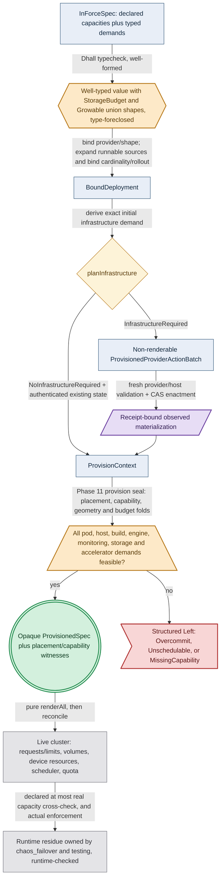
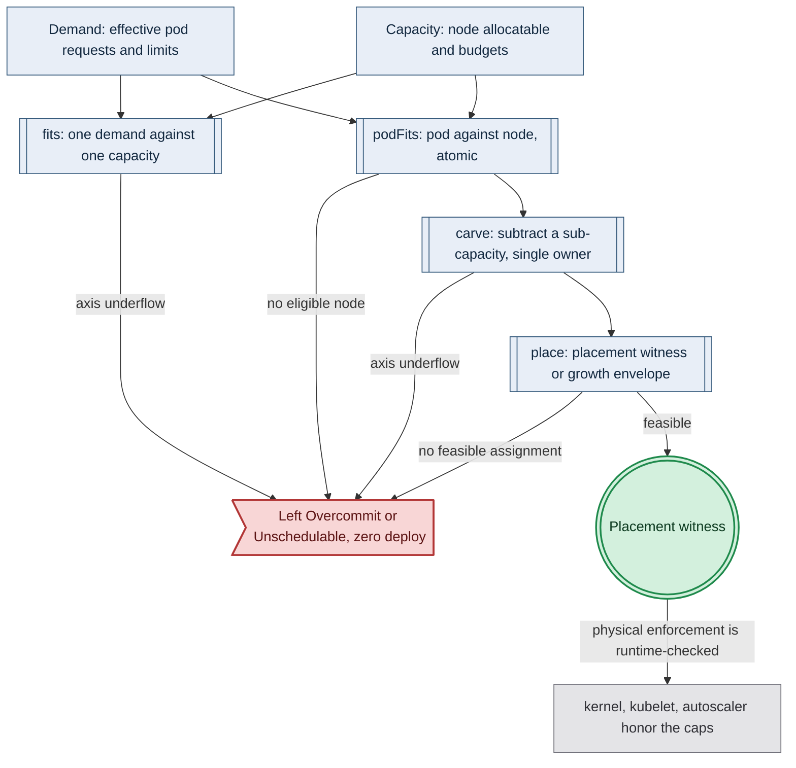

# Resource Capacity

**Status**: Authoritative source
**Supersedes**: N/A
**Referenced by**: DEVELOPMENT_PLAN/later_phases.md, DEVELOPMENT_PLAN/overview.md, DEVELOPMENT_PLAN/phase_04_dhall_gate1_schema.md, DEVELOPMENT_PLAN/phase_05_gadt_decoder_gate2.md, DEVELOPMENT_PLAN/phase_06_illegal_state_corpus.md, DEVELOPMENT_PLAN/phase_07_capacity_core_folds.md, DEVELOPMENT_PLAN/phase_08_storage_geometry_folds.md, DEVELOPMENT_PLAN/phase_09_execution_accelerator_folds.md, DEVELOPMENT_PLAN/phase_10_capability_bind.md, DEVELOPMENT_PLAN/phase_11_provision_seal.md, DEVELOPMENT_PLAN/phase_12_inference_accelerator_provision.md, DEVELOPMENT_PLAN/phase_13_render_manifest_goldens.md, DEVELOPMENT_PLAN/phase_17_midwife_bootstrap_kind.md, DEVELOPMENT_PLAN/phase_18_base_image_registry.md, DEVELOPMENT_PLAN/phase_19_object_reconciler.md, DEVELOPMENT_PLAN/phase_20_capacity_scheduler.md, DEVELOPMENT_PLAN/phase_21_retained_storage.md, DEVELOPMENT_PLAN/phase_22_vault_pki.md, DEVELOPMENT_PLAN/phase_23_platform_backbone.md, DEVELOPMENT_PLAN/phase_24_platform_services_2.md, DEVELOPMENT_PLAN/phase_25_keycloak_ingress.md, DEVELOPMENT_PLAN/phase_26_live_dsl_singleton.md, DEVELOPMENT_PLAN/phase_27_app_tenancy.md, DEVELOPMENT_PLAN/phase_28_pulsar_client.md, DEVELOPMENT_PLAN/phase_29_content_store_workflow.md, DEVELOPMENT_PLAN/phase_30_release_lifecycle.md, DEVELOPMENT_PLAN/phase_31_network_fabric_wireguard.md, DEVELOPMENT_PLAN/phase_32_multicluster_spawn_georepl.md, DEVELOPMENT_PLAN/phase_33_gateway_migration_drills.md, DEVELOPMENT_PLAN/phase_34_provider_deploy_checkpoint.md, DEVELOPMENT_PLAN/phase_36_provider_ebs_credential.md, DEVELOPMENT_PLAN/phase_37_provider_dynamic_nodes.md, DEVELOPMENT_PLAN/phase_38_determinism_jitcache.md, DEVELOPMENT_PLAN/phase_39_infernix_lift.md, DEVELOPMENT_PLAN/phase_40_jitml_lift_cuda.md, DEVELOPMENT_PLAN/phase_41_apple_metal_host_daemon.md, DEVELOPMENT_PLAN/phase_42_test_topology_dsl.md, DEVELOPMENT_PLAN/phase_43_spa_live_deploy.md, DEVELOPMENT_PLAN/substrates.md, DEVELOPMENT_PLAN/system_components.md, documents/engineering/README.md, documents/engineering/app_vs_deployment_doctrine.md, documents/engineering/backup_recovery_doctrine.md, documents/engineering/cluster_lifecycle_doctrine.md, documents/engineering/cluster_topology_doctrine.md, documents/engineering/consistency_pacelc_doctrine.md, documents/engineering/content_addressing_doctrine.md, documents/engineering/daemon_topology_doctrine.md, documents/engineering/dsl_doctrine.md, documents/engineering/inforcespec_migration_doctrine.md, documents/engineering/manifest_generation_doctrine.md, documents/engineering/monitoring_doctrine.md, documents/engineering/namespace_layout_doctrine.md, documents/engineering/network_fabric_doctrine.md, documents/engineering/platform_services_doctrine.md, documents/engineering/preflight_validation_doctrine.md, documents/engineering/pulsar_client_doctrine.md, documents/engineering/pulumi_iac_doctrine.md, documents/engineering/readiness_ordering_doctrine.md, documents/engineering/service_capability_doctrine.md, documents/engineering/single_logical_data_plane_doctrine.md, documents/engineering/storage_lifecycle_doctrine.md, documents/engineering/substrate_doctrine.md, documents/engineering/tenancy_doctrine.md, documents/engineering/testing_doctrine.md, documents/illegal_state/illegal_state_capacity.md, documents/illegal_state/illegal_state_ml_asset.md, documents/illegal_state/illegal_state_multicluster.md, documents/illegal_state/illegal_state_security.md, documents/illegal_state/illegal_state_storage.md, documents/illegal_state/illegal_state_techniques.md
**Generated sections**: none

> **Purpose**: Single Source of Truth for the amoebius resource-provisioning model — the pure
> `Capacity` / `Demand` / `Budget` / execution-envelope types spanning pod/host/build/engine CPU and memory;
> pod ephemeral, node image, cache, control-plane, and geometry-amplified durable storage; monitoring work;
> accelerator family/device count and raw/reserved/net/live-free VRAM or unified memory; the
> *capacity-accounting fold* that rejects any deploy with no feasible target; the `ProvisionedSpec` witness
> whose sealed whole-deployment render-source set is the manifest renderer's only public input; the
> closed `StorageBudget` union; and the
> `Growable` / `ScalingPolicy` escape valve.

---

## 1. Capacity is a budget the fold consumes, and overcommit is a checked rejection

Raw Kubernetes admits a Deployment that requests more memory or local ephemeral storage than any node has, a
StatefulSet whose volumes sum past the disk, a cache with no bounded backing, or a CUDA workload in a cluster
with no CUDA-capable node. Each can be well-formed YAML; each surfaces later as a `Pending` pod, eviction,
accelerator initialization failure, or a full disk. amoebius lifts that whole class to *does-not-provision*: a
decoded deployment must produce a **feasible resource witness** against single-owner capacities — a concrete
pod→node witness for a fixed cluster, a sound growth envelope for an elastic one, `Σ ≤ backing` for durable or
native-host-cache storage plus nested in-cluster cache bounds within pod ephemeral storage, and an
accelerator-offering witness for every accelerator demand. Failure returns a structured
`Left Overcommit` / `Left Unschedulable` / `Left MissingCapability` before any value reaches the renderer. The
aggregate sum alone is *not* enough, because pods and accelerator offerings are atomic
([§4](#4-the-total-fold-fits-carve-place-and-the-nesting)).

This document owns the *capacity arithmetic* and nothing else. It owns:

1. The `Capacity` / `Demand` / `Budget` / `ResourceEnvelope` records and the refined non-zero `Quantity` they
   are built from ([§3](#3-the-types-quantity-capacity-demand-budget)).
2. The fold — `fits` / `podFits` / `carve` / `place` — the static-vs-elastic `place` branch, and the nesting (host → cluster/VM → workload) ([§4](#4-the-total-fold-fits-carve-place-and-the-nesting)).
3. The conditional infrastructure boundary that derives initial infrastructure demand from the fully
   source-expanded but wholly unprovisioned graph, admits only authenticated existing or receipt-bound
   materialized infrastructure into `ProvisionContext`, and then lets `provision` materialize ordinary
   execution identities and epochs, normalize every resource demand, check it against the target topology,
   and construct the opaque whole-deployment `ProvisionedSpec`; private service
   projections contribute to its unique object-source map, while only deployment-level `renderAll` crosses
   the seal ([§4](#4-the-total-fold-fits-carve-place-and-the-nesting)).
4. The closed `StorageBudget` union — no *unbounded* arm — and how each arm names its single ceiling owner
   ([§5](#5-storagebudget-bounded-by-construction-single-owner-ceiling-per-arm)).
5. The `Growable` / `ScalingPolicy` escape valve: dynamic provisioning owned by amoebius, the only path by
   which a bounded budget grows ([§6](#6-growable--scalingpolicy-the-quota-bounded-dynamic-provisioning-arm)).

It **consumes, never restates**, the domain numbers it folds: the per-host/node CPU, memory, logical
ephemeral and physical filesystem/content/snapshot storage, accelerator, and
raw/reserved/allocatable/current-free VRAM inventory
([substrate_doctrine.md](./substrate_doctrine.md)); the per-volume hard-capped PV sizes
([storage_lifecycle_doctrine.md](./storage_lifecycle_doctrine.md)); the complete per-container resource
envelope and host-worker demand
([platform_services_doctrine.md §10](./platform_services_doctrine.md#10-every-execution-unit-declares-its-complete-resource-envelope)),
the cache budget ([content_addressing_doctrine.md §4.5](./content_addressing_doctrine.md#45-the-ml-asset-lifecycle-one-bounded-content-addressed-cache-resolved-on-first-miss)),
the cloud quota ([pulumi_iac_doctrine.md](./pulumi_iac_doctrine.md)), and the Pulsar topic retention
([pulsar_client_doctrine.md](./pulsar_client_doctrine.md)). Each number has exactly one owner elsewhere; this
doc owns only the *placement / does-not-exceed* relation over them. The **catalog** of which capacity states are
illegal and the technique that forecloses them is
[illegal_state_catalog.md §3.17-§3.21 / §4.6](../illegal_state/illegal_state_capacity.md#317-an-over-committed-deploy-or-workload-host--vm--cluster-capacity-exceeded); this doc is the normative home of
the model that catalog names.

Everything below is **design intent for Phase 4** (the source types), Phases 7–13 (the pure
provision/fold/render boundary), and the later live phases that enact and cross-check it. Status and gates live only in
[../../DEVELOPMENT_PLAN/README.md](../../DEVELOPMENT_PLAN/README.md).

---

## 2. The load-bearing honesty limit: a capacity sum is a decode-foreclosed check, never type-foreclosed

**A capacity check — whether
the compute *placement witness* ([§4](#4-the-total-fold-fits-carve-place-and-the-nesting)) or the
storage/retention `Σ demand ≤ capacity` — is a `decode-foreclosed` checked rejection in the catalog's
historical layer taxonomy, concretely evaluated at the post-bind `provision-seal` locus, never a type-foreclosed
uninhabitable-by-type proof.** Dhall (and the GADT-indexed Haskell it decodes into) has **no dependent
arithmetic**: capacity is a *value*, not a type index, so neither "a feasible packing exists" nor "the sum fits"
can be a statement about type inhabitance. Each is a **total smart constructor / fold** that inspects a
constructible value and rejects it (`Left Overcommit` / `Left Unschedulable`) during Phase-10 provisioning,
after the complete source inventory is bound and before `ProvisionedSpec` or `renderAll` exists. Per the three
foreclosure layers ([illegal_state_catalog.md §6](../illegal_state/illegal_state_techniques.md#6-three-layers-of-foreclosure-and-the-honesty-they-force)),
this remains `decode-foreclosed`: a *spec-layer guarantee* (the spec never reaches the interpreter), but a
*checked rejection*, not an absence of inhabitants. The validation locus is `provision-seal`, not
`Gate-2-decoder`; any doc that calls a capacity check "uninhabitable" or says `Dhall.inputFile` performed the
whole-deployment fold is reporting the wrong boundary, and this doc forbids that.

Because the guarantee is a *checked rejection*, the check's own correctness is a property to establish, not a
given. The fold's soundness — and, for the two-directionally-decidable checks (`Σ ≤ backing`, elementwise
compatibility), its **accepts ⟺ in-envelope equivalence** — is property-tested over generated inputs in Phase 7
(never a fixed fixture set alone). Where a specific fold's algebraic laws are load-bearing enough to warrant a
machine-checked proof, that is the surgical, deferred proof-assistant track
([later_phases.md](../../DEVELOPMENT_PLAN/later_phases.md)), not a broad proof layer.

**The compute placement is sound, not complete.** Optimal bin-packing is NP-hard, so `place`
([§4](#4-the-total-fold-fits-carve-place-and-the-nesting)) searches for a feasible pod→node assignment by a
total heuristic (first-fit-decreasing) rather than an exhaustive optimum. The honesty this buys is
one-directional: `place` may *reject* a spec that is in principle packable (a false `Left Unschedulable`), but
it never *admits* one that is not — **soundness over completeness**, the correct trade when the objective is
"no runtime `Pending`." A rejected-but-packable spec is fixed by the operator declaring more headroom, never by
the model quietly admitting an unplaceable workload. (Storage and retention within one named backing are
genuine sums, not packings, so they carry no completeness caveat; the bin-pack is the **atomic pod/device
placement** upgrade, [§4](#4-the-total-fold-fits-carve-place-and-the-nesting).)

The type-foreclosed pieces near capacity live elsewhere and are cited, not claimed here: the `StorageBudget` union
having **no unbounded arm** ([§5](#5-storagebudget-bounded-by-construction-single-owner-ceiling-per-arm)) and the `Growable` union having **no bare-unbounded arm** ([§6](#6-growable--scalingpolicy-the-quota-bounded-dynamic-provisioning-arm)) are type-foreclosed
*union shapes* — a value simply cannot name "unbounded" without a policy. The *arithmetic* over those bounded
values is always a checked, post-bind provisioning rejection.

The runtime-checked residue is equally explicit and **not this doc's to assert**: whether the physical host actually
caps bytes/cgroups, whether the scheduler actually places the pods, whether the autoscaler actually grows the
node set, and whether the cloud actually honors the quota are **runtime** facts owned by
[chaos_failover_doctrine.md](./chaos_failover_doctrine.md) and the testing doctrine. [§8](#8-where-the-numbers-come-from-declared-in-pure-input-provisioned-before-render-cross-checked-at-runtime) states the one
runtime cross-check the model *requires* (declared capacity ≤ real capacity) and honestly classifies it as runtime-checked.



*Design intent. The Dhall typecheck is type-foreclosed and the provision-seal fold is decode-foreclosed at Tier-1; the CAS-enactment seam and the live-cluster residue (declared capacity at most real capacity) are runtime-checked, owned by chaos_failover and testing, not proven here.*

---

## 3. The types: `Quantity`, `Capacity`, `Demand`, `Budget`

Every quantity is refined and unit-tagged, every provider advertises a typed capacity, and every execution
unit carries one complete resource envelope. Kubernetes resource maps are a **rendered projection** of this
pure value; they are never a second source of truth.

- **`Quantity u`** — a refined strictly-positive measure tagged by unit: CPU millicores, memory bytes, logical
  ephemeral-storage bytes, physical filesystem/content/snapshot bytes, required-usable and provisioned
  durable-storage bytes, cache bytes, accelerator device
  count, or VRAM bytes. A zero or negative quantity is not constructible.
- **`Residual u = Zero | Remaining (Quantity u)`** — the zero-capable result of subtraction. Declarations
  remain strictly positive, but an exact fit must be representable as `Zero`; it is not an overcommit and it
  must not require constructing an illegal zero `Quantity`. `Headroom` and `AvailableCapacity` use
  `Residual` on every scalar axis and remove allocated discrete device/backing identities. Every subsequent
  carve consumes `AvailableCapacity`, so an exact-fit first carve cannot be spent a second time.
- **`PodResourceVec`** — the three schedulable built-in Kubernetes resource axes every app, sidecar,
  controller, operator, platform, and init container declares: `cpu`, `memory`, and `ephemeralStorage`.
  `Resources = { requests, limits }` carries two `PodResourceVec`s and requires `requests ≤ limits` per axis.
  `requests` is the scheduler reservation folded by `place`; `limits` is the rendered finite consumption
  boundary. The provision proof carries **both** obligations: reservation feasibility over requests, and
  finite-ceiling/physical-peak fit over memory and ephemeral-storage limits on the returned placement. CPU remains throttleable:
  its summed requests must fit allocatable CPU, and summed effective CPU limits must fit the limit budget
  derived from the node's closed
  `CpuOvercommitPolicy = NoCpuOvercommit | BoundedCpuOvercommit { maxLimitToAllocatable : RatioAtLeastOne }`.
  Thus overcommit is an explicit finite pure provision, never an unrepresented convention. No writable layer,
  log budget, or disk-backed `emptyDir` cache is allowed to exist outside `ephemeralStorage`.
  Enforcement semantics remain explicit rather than conflated: CPU is throttled by cgroups; memory is bounded
  reactively by the kernel; Kubernetes measures local ephemeral use and evicts a pod after a limit breach—it
  does not promise synchronous `ENOSPC` at the container field. The cache owner therefore also enforces its
  private `ProvisionedCacheDemand` before materialization, and node filesystem carves retain hard physical
  headroom/eviction reserve. The pure fit proves no admitted declared peak exceeds those bounds; timing of
  kubelet measurement/eviction remains runtime-checked residue.
- **Accelerator demand** — a closed requirement separate from the open-for-every-container
  `PodResourceVec`. The pod arm admits
  `PodAcceleratorDemand = None | Cuda { owner : ContainerId, demand : CudaOwnerDemand }`; the native-host arm
  admits `HostAcceleratorDemand = None | Cuda CudaOwnerDemand | AppleMetal MetalOwnerDemand`, so Apple Metal
  has no pod constructor. The pod `Cuda` arm carries an owner `ContainerId` that must resolve exactly once in
  the pod's container list, because Kubernetes extended resources are container fields. Each owner demand
  carries two identity-keyed maps: the exact source inventory of served models, training jobs, JIT
  compilations, and accelerator-library work, and a `NonEmptyMap` of their structural residency demands.
  Their key sets must be equal. Weights, serving KV cache, activations, optimizer state, JIT workspace, and
  library workspace remain distinct residency classes with `Unsharded`, `ReplicatedPerDevice`, or explicit
  `Sharded` placement; an editable owner-total scalar has no constructor.
  `AcceleratorCoexistencePolicy` supplies finite resident/running bounds by workload class and a pinned model,
  not a caller-authored list of favorable epochs. Provisioning enumerates every source subset allowed by those
  bounds, derives each epoch's per-device assignment for CUDA or unified-memory sum for Metal, and fits the
  worst permitted epoch. The same policy is rendered/enforced, so declaring serial execution cannot excuse
  concurrent residency that the policy permits. CUDA preserves requested wholesale device count, profile,
  residency placement/sharding, and interconnect; Metal preserves its profile and charges every permitted
  epoch to physical-host memory rather than a fictional second VRAM pool.
  The closed union preserves accelerator-family identity. The wholesale per-node ownership rule still holds:
  a model/job/capability may require an accelerator, but provisioning must route that demand through exactly
  one typed accelerator owner on the selected node/host. In the v1 generic `nvidia.com/gpu` lane,
  **wholesale means the requested count equals the selected node's full CUDA offering count**. This makes a
  concrete per-device VRAM/topology witness enforceable despite the device plugin choosing device ids: the
  owner receives every device in the offering and cannot be handed an unproved smaller device from a
  heterogeneous set. Subset allocation has no v1 constructor; it requires a future profile/device-selectable
  DRA or MIG resource-class arm. On `linux-cuda`, that owner is a pod and the renderer
  emits the full whole-device count as an integer extended-resource request/limit on its exactly-once
  named owner container plus required node affinity on the pod; on Apple/Windows it is a host worker and never
  enters a pod resource map. Ordinary pods cannot author an accelerator claim, and there is no fractional or
  second-owner constructor. An `Unsharded` residency is indivisible on one selected device,
  `ReplicatedPerDevice` is charged on every selected device, and a `Sharded` residency carries the complete
  shard-byte inventory and interconnect requirement. Equal aggregate bytes never excuse a one-short device.
- **`StorageDemand`** — explicit storage provisions split by lifetime and accounting owner.
  `PodLocalStorageDemand` names every bounded disk-backed volume and every bounded memory-backed volume plus its
  persistence and non-empty access set. Each `ContainerEnvelope` separately declares private
  writable-layer and log allowances and a runtime memory working-set allowance. Disk-backed bytes fold into
  `ephemeralStorage`, while memory-backed bytes fold into `memory`. `DurableVolume` is a hard-capped PVC/PV
  size. `CacheDemand` has two closed realizations:
  `InClusterCache` references exactly one already-declared disk-backed volume by typed `VolumeId`, so its
  logical `CacheBudget` must fit that volume's `sizeLimit` without declaring a second allocation; `HostCache`
  references a named native-host backing. For every container,
  a `WritableRootfs` allowance plus `logHeadroom` must fit the container's
  `ephemeralStorage.request ≤ limit`; `ReadOnlyRootfs` contributes no writable-layer bytes and renders the
  corresponding security control. Then all shared disk-volume
  bounds plus the lifecycle-derived effective private allowance must fit the effective pod request/limit.
  Memory volumes additionally carry access mode and `StageLocal | PodLifetime` persistence. Provisioning
  expands the container lifecycle into concurrency epochs and deterministically assigns each resident volume
  to exactly one live **reservation carrier per epoch**. A carrier's derived request includes that volume;
  another concurrent writer's request does not include it again. Every possible charged accessor's memory
  limit still covers its runtime working set plus the full writable volumes it may be charged for. For every
  epoch, the validator proves
  `Σ live runtime working sets + Σ unique resident memory-volume bounds ≤ effectivePod.memory.request ≤ limit`.
  Thus two concurrent writers reserve one tmpfs volume once, while an init-filled pod-lifetime volume remains
  reserved alongside the later app working set. The effective pod request is charged once to the node; volume
  bytes are not added again. These are nested proofs on their respective **one physical debit**. `HostCache` is used only
  by native Apple/Windows host workers and carves once from a named host cache pool. A memory-backed
  `emptyDir` consumes `memory`, not `ephemeralStorage`. No cache is smuggled through an unaccounted writable
  `hostPath`; clients receive typed handles and declare only their private staging bytes.
  Binding also derives non-authorable `KubeletMappedFileDemand`s from every ConfigMap/Secret/projected/
  downward-API/service-account-token object and mount. Exact known payload bytes plus bounded token/metadata
  sources pass through a versioned AtomicWriter old+new/symlink/metadata model; the model routes each source to
  nodefs ephemeral storage or memory. The same typed API-object bytes enter etcd logical demand, so mapped
  files are neither free node storage nor a second caller-supplied aggregate. Separately, every identity-
  expanded Pod instance derives sandbox, pod-directory, runtime-state, CNI-state, and volume/mount-metadata
  counts from `PodRuntimeMetadataSource` and the complete container/volume graph. The selected node's pinned
  `kubeletMetadataModel` converts those structural counts into identity-keyed components and assigns each
  component a closed `KubeletNodefs | CriRuntimeRoot` role; callers author neither bytes nor routes. The
  selected layout resolves roles to real backing ids, and a component-ownership witness partitions the full
  runtime-storage source domain exactly and disjointly between this per-Pod model and
  `NodeImageStorageModel`. This bookkeeping is not falsely added to a container's logical
  ephemeral-storage request; it is a distinct physical cost charged once per planned slot or observed Pod UID.
- **Node-local filesystem and image demand** — every `ContainerEnvelope` names a content-digested OCI manifest list whose
  `ImageArtifact` metadata carries a non-empty platform map. Each OS/arch entry has its selected child/config
  digests and stored bytes, compressed layer digest/bytes, snapshot chain id/unpacked bytes, and peak
  pull/import workspace; binding to a node or candidate must resolve
  exactly one matching entry. The node also carries a closed `KubeletFilesystemLayout`: `Unified` aliases
  `nodefs=imagefs=containerfs`; `SplitRuntime` keeps `nodefs` separate while
  `imagefs=containerfs`; `SplitImage` keeps images on `imagefs` while
  `containerfs=nodefs`. There is no arbitrary three-filesystem arm because kubelet does not support it.
  `SplitImage` additionally requires an observed runtime/feature witness; the v1 containerd engines cannot
  construct that witness and therefore admit only `Unified` or `SplitRuntime`.
  Kubernetes's **logical** pod-ephemeral check is layout-independent:
  disk `emptyDir` + pod logs + writable-layer allowance + kubelet-mapped pod files must fit the pod's rendered
  `ephemeral-storage` request/limit and the node's logical allocatable value. The **physical** debit is then
  routed by layout:
  `Unified` resolves both metadata roles, the entire logical demand, and OCI
  content/snapshots/import workspace to `nodefs`;
  `SplitRuntime` resolves `KubeletNodefs` plus disk `emptyDir`/logs/mapped files to `nodefs`, while
  `CriRuntimeRoot`, writable layers, and OCI content/snapshots/import workspace resolve to
  `containerfs=imagefs`; `SplitImage` resolves `KubeletNodefs`, `CriRuntimeRoot=containerfs`, and the complete
  logical pod demand to `nodefs`, while only image content/import roles resolve to `imagefs`. The pinned model,
  rather than a field name, chooses each runtime component's role. When roles alias, distinct components are
  summed and their one shared backing is checked once—an alias never drops a component or manufactures a
  second supply. Thus writable rootfs/runtime bytes are never lost or charged to a fictitious pool.
  After placement, provisioning unions persistent OCI content by object digest and snapshotter content by
  chain id **per node**, applies the version-pinned snapshotter metadata/active-snapshot model, adds bounded
  concurrent pull/import workspace, groups every operand by the derived physical backing, and proves each
  backing peak fits once. Compressed content, manifests, and configs therefore cannot disappear behind an
  unpacked-layer-only estimate. For elastic candidates the same derivation includes all topology-required per-node images
  before computing effective capacity. Each node capacity carries an enforced
  `ImagePullConcurrencyPolicy = Serial | BoundedParallel n`; workspace peak is the sum of the largest `n`
  simultaneously new unique-image workspaces (`Serial` means one), never an unspecified max. Live transition
  admission computes
  `bytes(unionByDigest(observed resident, old desired, new desired)) + workspace(new missing unique pulls)`;
  one digest is debited once even if resident and desired, while an observed digest remains debited until
  observed GC removes it. Conflicting byte metadata for one digest is `ImageMetadataMismatch`, never a
  guessed size. Thus admission assumes neither a duplicate debit nor reclaim. The only permitted backing
  aliases are the ones forced by the selected layout; a declared alias in `SplitRuntime`, swapped roles, or
  two nominal capacities over one unrecorded filesystem is `BackingAlias`/`FilesystemLayoutMismatch`.
  Container application logs remain in each pod's `logHeadroom`; engine/kubelet/system logs live only in the
  system reserve.
- **`ResourceEnvelope`** — the closed sum carried by every execution unit:
  `Pod PodResourceEnvelope | HostWorker HostResourceEnvelope`. The pod arm requires Kubernetes
  a non-empty list of lifecycle-tagged `ContainerEnvelope`s (each with its own requests/limits), optional
  pod/runtime overhead, `PodLocalStorageDemand`, durable volumes, an optional in-cluster cache demand, and only
  `None | Cuda` accelerator demand. The host arm instead requires host CPU/memory reservation+ceiling, named
  host-local storage demand, an optional native-host cache demand, and `None | Cuda | AppleMetal`. Omission of
  the envelope, a container without resources, an Apple demand in a pod, or an in-cluster cache backed by a
  host pool therefore has no constructor rather than relying on a later convention.
- **Controller-created child resources** — a supported operator/CR does not get a resource-free exception.
  Its version-pinned descriptor expander is the only constructor of a private `ControllerChildEnvelope`: an
  exact, identity-keyed set of materialized child pod envelopes and durable volume demands plus the
  controller's replica and rollout operands. The authored CR cannot supply a scalar "child peak" or a generic
  child list. Binding joins every source descriptor field to the selected
  `ControllerChildExpansionModelVersion`, exhaustively derives steady and old/new/surge transition epochs,
  and rejects a CR arm whose model cannot explain every child. Provisioning places every derived epoch and
  privately records its peak/witness; rendering projects both the CR controls and namespace
  `ResourceQuota`/admission policy from that same witness. The versioned model also derives the validating
  webhook's complete pod/image/CPU/memory/ephemeral/log/replica/transition envelope and inserts it into
  `BoundDeployment`; a child set that fits only when the admission unit is free rejects. Live child
  enumeration must normalize back to the envelope or fail closed as `UnknownCommitment`.
- **Host build execution** — `buildx`/BuildKit is an execution unit even though it precedes a pod. Its required
  `BuildExecutionEnvelope` contains the complete acyclic architecture/stage graph: every stage has host/
  engine-VM CPU and memory reservation+ceiling and intermediate-layer scratch demand; the envelope names one
  scratch backing, one bounded build-cache backing, and separate finite architecture and stage concurrency
  policies. Binding enumerates every dependency-valid concurrent stage set and derives the runtime and scratch
  maxima before the first builder process; there is no caller-authored aggregate that can omit an expensive
  stage. The result's `ImageArtifact` is a separate node-image-store demand; neither provision substitutes for
  the other.
- **Engine/control-plane reserve** — `EngineSystemReserve` is not an unexplained subtraction and is required
  on every self-managed engine node. It contains a role tag and the exact role-indexed set of named static
  engine processes, each with CPU/memory reservation+ceiling. `KindControlPlane` and `Rke2Server` use a
  `ControlPlaneStorageDemand` for static engine bytes, the aggregate etcd backend quota/WAL/snapshots (Events
  are retained inside that quota, never charged twice), audit logs, and
  kubelet/runtime logs; `KindWorker` and `Rke2Agent` use a `WorkerEngineStorageDemand` for static engine bytes and bounded
  kubelet/runtime logs and has no fictitious etcd/audit allocation. All rotation/retention controls are
  finite. `ControlPlaneStorageDemand.etcd.logical.churn` is the sole Event
  rate/window/maximum-size/retention authority; its `eventRetention` and the separate audit retention each
  cover the declared longest live-gate history requirement,
  and the derived storage peak fits one named system carve. Each kind node-container carries its own in-node
  reserve, which must fit **inside** that container's runtime/disk envelope; a separate
  `KindHostEngineReserve` accounts for host Docker/containerd/kind-supervisor work outside the containers and
  a structural `KindHostRuntimeStorageDemand`: process/log bytes, the selected kind-node OCI artifact,
  model-versioned host content/snapshots, per-ordinal active snapshot/writable/log allowances, finite pull
  workspace/concurrency, and one named data-root/graphroot carve. Host content deduplicates by digest, but
  active snapshots remain one per ordinal. Each rke2 server/agent carries its own role-specific host reserve. Provider-
  managed EKS exposes worker allocatable capacity but not an invented host/control-plane reserve.
  Kube-system add-on pods remain ordinary topology-expanded pod envelopes and are not counted in this reserve.
  The etcd `backendQuotaBytes` is not assumed large enough merely because its disk fits: the complete
  `EtcdLogicalDemand` exact-joins every serialized desired Kubernetes object plus bounded old/new/apply
  transition objects, revisions, Leases, and Event rate/size/retention through a versioned MVCC model and must
  fit the quota first. Only then does the separate storage model expand the full quota into WAL,
  snapshot-save, retained-snapshot, and defrag physical high-water.
- **Monitoring work** — every `Observability` binding carries a mandatory finite `MonitoringWorkBudget`.
  Binding derives workflows, rules, series, and maximum scrape samples/second from the complete descriptor and
  uses named versioned evaluation, query, and TSDB cost models. It derives Prometheus CPU/memory for the
  overlap of evaluation plus maximum concurrent query work and derives the query-admission proxy's own
  complete pod envelope. The storage model derives resident blocks for the
  finite retention window, WAL/head, worst-case compaction old+new overlap, and query temporary work from a
  structural `QueryWorkBudget` (finite concurrency, per-query series/samples/range/timeout, and a versioned
  cost model), then alone
  constructs the private physical claim demand against the named backing. Counts/rate/cost or a one-byte-
  undersized claim or insufficient Prometheus/proxy compute rejects; no optional budget, arbitrary tiny PVC,
  or descriptor-independent fixed resource
  arm exists. A caller-authored `maxQueryTempBytes` scalar has no field. Rendered evaluation, TSDB time/size
  retention, Prometheus query flags, and the sole-routable query-admission proxy's concurrency/series/range
  limits are the same operands used by the model; direct query API access is denied.
- **`Capacity`** — what a provider offers. A Kubernetes node advertises allocatable CPU and memory, logical
  pod-ephemeral bytes, allocatable pod slots, driver-scoped attachable-volume slots, an explicit kubelet
  filesystem layout with named physical backing(s), a finite
  `CpuOvercommitPolicy`, plus
  `NodeAcceleratorOffering = None | CudaOffering CudaDeviceOffering`, where every offering carries its
  concrete device vector and typed peer/NVLink graph, and every CUDA device carries a stable profile, raw
  VRAM, a mandatory driver/runtime safety reserve, and the
  resulting **allocatable VRAM**. Provisioning spends only allocatable VRAM; a model that fits the nominal
  device label or raw `memory.total` but not that net quantity is rejected. A physical host advertises the same base
  resource/storage facts plus
  `HostAcceleratorOffering = None | CudaOffering CudaDeviceOffering | AppleMetalOffering MetalProfile`.
  The Apple arm proves compatible Metal exists but carries no separate memory quantity: unified-memory demand
  is debited from physical-host `memory`. A physical host also advertises the native-cache/storage backing
  available to host workers; a retained-disk `StorageBacking` advertises physical allocatable bytes per named
  bookie/drive, while a provider object-store arm advertises its selected, model-indexed logical-or-billed
  byte quota plus object-count quota. The
  geometry fold below is therefore mandatory before retained-disk demand can be compared with supply.
  Kube/system-reserved space and eviction headroom are already netted out.
- **`Demand`** — the normalized reservation and finite-ceiling/physical-peak requirement derived from all
  resource envelopes inside `provision`, after deployment shape, arm-specific execution cardinality/rollout
  expansion into complete epochs, init-container semantics, runtime overhead, and provider structure are
  known. For a
  pod, the effective request/limit mirrors the pinned Kubernetes scheduling semantics exactly. With ordinary
  sequential init containers it is the higher of the concurrently running app/sidecar sum and the largest
  init request/limit, plus declared pod/runtime overhead. Restartable init-sidecars are accumulated with the
  app and later init stages according to their lifecycle rather than treated as one-shot maxima. This
  derivation is pure and version-pinned; a naive sum that disagrees with the rendered pod is a test failure.
- **`Budget`** — a capacity an owner is allowed to consume against, fixed or quota-capped growable
  ([§5](#5-storagebudget-bounded-by-construction-single-owner-ceiling-per-arm),
  [§6](#6-growable--scalingpolicy-the-quota-bounded-dynamic-provisioning-arm)).
- **`ProvisionedSpec` / private service projections** — opaque post-fold values whose constructors are not
  exported. `provision` is the only constructor: it derives all demands, binds each to an offering/backing,
  and stores the placement/capability witnesses in the whole deployment. Private service projections
  contribute sources to one sealed identity-keyed object set; the only public manifest boundary is
  whole-deployment `renderAll :: ProvisionedSpec -> [K8sObject]`, never an unchecked `ServiceSpec`.

```text
Residual u =
  < Zero | Remaining : Quantity u >

-- Same scalar/resource shape as Capacity, but every scalar is Residual and
-- allocated discrete identities have been removed.
AvailableCapacity = Residualized Capacity
Headroom         = AvailableCapacity

Resources =
  { requests : PodResourceVec
  , limits   : PodResourceVec
  }

PodResourceVec =
  { cpu              : Quantity Cpu
  , memory           : Quantity Bytes
  , ephemeralStorage : Quantity Bytes
  }

CpuOvercommitPolicy =
  < NoCpuOvercommit
  | BoundedCpuOvercommit : { maxLimitToAllocatable : RatioAtLeastOne }
  >

ContainerLifecycle =
  < App | Sidecar | Init | RestartableInit >

ContainerEnvelope =
  { id                    : ContainerId
  , lifecycle             : ContainerLifecycle
  , image                 : ImageArtifact
  , runtimeMemoryWorkingSet : Quantity Bytes
  , privateEphemeral      :
      { rootFilesystem :
          < ReadOnlyRootfs
          | WritableRootfs : { allowance : Quantity Bytes }
          >
      , logHeadroom : Quantity Bytes
      }
  , resources             : Resources
  }

ImageLayer =
  { blobDigest     : OciObjectDigest
  , compressedBytes: Quantity Bytes
  , chainId        : SnapshotChainId
  , unpackedBytes  : Quantity Bytes
  }

ImageArtifact =
  { manifestListDigest : ImageDigest
  , manifestListBytes  : Quantity Bytes
  , platforms          : NonEmpty
      { platform          : OsArch
      , childDigest       : ImageDigest
      , childManifestBytes: Quantity Bytes
      , configDigest      : OciObjectDigest
      , configBytes       : Quantity Bytes
      , layers            : NonEmpty ImageLayer
      , peakImportWorkspace : Quantity Bytes
      }
  }

NodeImageStorageImportDemand =
  { image       : ImageArtifact
  , targets     : NonEmptySet ProvisionedNodeTarget
  , concurrency : ImagePullConcurrencyPolicy
  , model       : NodeImageStorageModelVersion
  }

ProvisionedImageArtifact = -- private selected-platform content projection
  { source          : ImageArtifact
  , selected        : NonEmptyMap OsArch ImageDigest
  , contentObjects  : Map OciObjectDigest (Quantity Bytes)
  , snapshotChains  : Map SnapshotChainId (Quantity Bytes)
  , importWorkspace : Quantity Bytes
  , sourceEquality  : ImageArtifactSelectedPlatformContentEqualityWitness
  }

NodeFilesystemBacking =
  { carve : DiskCarveId, allocatableBytes : Quantity Bytes }

ImagePullConcurrencyPolicy =
  < Serial
  | BoundedParallel : PositiveNatural
  >

KubeletFilesystemLayout =
  < Unified :
      { nodefs : NodeFilesystemBacking }
  | SplitRuntime :
      { nodefs : NodeFilesystemBacking
      , imagefs : NodeFilesystemBacking
      }
  | SplitImage :
      { nodefs : NodeFilesystemBacking
      , imagefs : NodeFilesystemBacking
      , support : SplitImageRuntimeWitness
      }
  >

resolvePodRuntimeRole
  :: KubeletFilesystemLayout
  -> PodRuntimeRole
  -> NodeFilesystemBacking

resolveImageStorageRole
  :: KubeletFilesystemLayout
  -> ImageStorageRole
  -> NodeFilesystemBacking
-- Unified: all roles -> nodefs
-- SplitRuntime: KubeletNodefs -> nodefs; CriRuntimeRoot -> imagefs (= containerfs)
--               ImageContentRoot -> imagefs
-- SplitImage: KubeletNodefs/CriRuntimeRoot -> nodefs (= containerfs)
--             ImageContentRoot -> imagefs

NodeLocalStorageCapacity =
  { podEphemeralAllocatable : Quantity Bytes
  , filesystems             : KubeletFilesystemLayout
  , imageStorageModel       : NodeImageStorageModelVersion
  , imagePullConcurrency    : ImagePullConcurrencyPolicy
  , kubeletMetadataModel    : KubeletRuntimeMetadataModelVersion
  }

ProviderPodSlotPolicy =
  { catalogMaximum : PositiveNatural
  , systemReserve  : Natural
  , allocatable    : PositiveNatural
  , partitionExact : ProviderPodSlotCatalogReserveAllocatableEqualityWitness
  }

ProviderCniSlotPolicy =
  { catalogMaximum : PositiveNatural
  , systemReserve  : Natural
  , allocatable    : PositiveNatural
  , partitionExact : ProviderCniSlotCatalogReserveAllocatableEqualityWitness
  }

ProviderAttachSlotPolicy =
  { catalogMaximum : PositiveNatural
  , systemReserve  : Natural
  , allocatable    : PositiveNatural
  , partitionExact : ProviderAttachSlotCatalogReserveAllocatableEqualityWitness
  }

NodeCapacity =
  { allocatableCpu        : Quantity Cpu
  , allocatableMemory     : Quantity Bytes
  , allocatablePods       : PositiveNatural
  , allocatableCniSlots   : Map CniDriverId PositiveNatural
  , attachableVolumes     : Map CsiDriverId PositiveNatural
  , cpuOvercommit         : CpuOvercommitPolicy
  , localStorage          : NodeLocalStorageCapacity
  , accelerator           : NodeAcceleratorOffering
  }

-- A reusable elastic/provider class is a recipe for one future node, not an
-- already-existing NodeCapacity. Its ids are class-local template names.
ProviderNodeCapacityTemplate =
  { allocatableCpu       : Quantity Cpu
  , allocatableMemory    : Quantity Bytes
  , podSlots             : ProviderPodSlotPolicy
  , cniSlots             : Map CniDriverId ProviderCniSlotPolicy
  , attachableVolumes    : Map CsiDriverId ProviderAttachSlotPolicy
  , localDisks           : NonEmpty PerInstanceDiskTemplate
  , cpuOvercommit        : CpuOvercommitPolicy
  , localStorage         : PerInstanceNodeLocalStorageTemplate
  , accelerator          : PerInstanceAcceleratorOffering
  }

ProviderInstanceId =
  { account : CloudAccountId
  , cluster : ClusterId
  , class   : ProviderNodeClassId
  , ordinal : Natural
  }

PerInstanceDiskTemplate =
  { id               : DiskTemplateId
  , backing          :
      < InstanceStore :
          { skuDevice : ProviderLocalDeviceName
          , provisionedRawBytes : Quantity Bytes
          , presentation : FilesystemPresentation
          }
      | EphemeralRootEbs :
          { policy : ProviderNodeRootVolumePolicy }
      >
  , systemReserve    : ProviderUsableDiskCarveTemplate
  , carves           : NonEmpty ProviderUsableDiskCarveTemplate
  }

ProviderNodeRootVolumePolicy =
  { volumeType  : ProviderVolumeType
  , presentation: FilesystemPresentation
  , allocation  : BackingAllocationPolicy
  }

ProvisionedNodeRootVolumeRequest = -- private constructor
  { instance            : ProviderInstanceId
  , diskTemplate        : DiskTemplateId
  , account             : CloudAccountId
  , volumeType          : ProviderVolumeType
  , requiredUsableBytes : Quantity Bytes
  , presentation        : FilesystemPresentation
  , allocation          : BackingAllocationPolicy
  , sizeGiB             : PositiveNatural
  , provisionedBytes    : Quantity Bytes
  , witness             : BackingAllocationWitness
  , sourceEquality      :
      ProviderInstanceDiskAccountRootPolicyRequestEqualityWitness
  }

ProviderUsableDiskCarveTemplate =
  { id                  : DiskCarveTemplateId
  , requiredUsableBytes : Quantity Bytes
  }

ProvisionedPerInstanceDiskTemplate = -- private constructor
  { instance            : ProviderInstanceId
  , source              : PerInstanceDiskTemplate
  , requiredUsableBytes : Quantity Bytes
  , provisionedRawBytes : Quantity Bytes
  , mountedUsableBytes  : Quantity Bytes
  , presentation        : FilesystemPresentation
  , rootRequest         : Optional ProvisionedNodeRootVolumeRequest
  , carves              :
      NonEmptyMap DiskCarveTemplateId ProviderUsableDiskCarveTemplate
  , carveKeys           :
      ProviderUsableDiskCarveMapKeyEmbeddedTemplateIdentityEqualityWitness
  , rawToUsable         :
      ProviderDiskRawPresentationMountedUsableCapacityWitness
  , nestedFit           :
      ProviderSystemReserveAndUniqueCarvesFitMountedUsableBytesExactlyOnceWitness
  , backingArm          :
      InstanceStoreRawBytesOrEphemeralRootRequestExactlyMatchesSourceWitness
  , sourceEquality      :
      ProviderInstanceDiskSourceGeometryCarveRootRequestEqualityWitness
  }
-- Provider carve-template bytes are explicitly usable filesystem bytes. Checked construction first derives
-- one mounted-usable capacity from the SKU-pinned raw instance-store bytes or the allocation-rounded root-EBS
-- request, then proves systemReserve + Σ unique carves <= mountedUsableBytes. No usable carve enters a raw
-- parent sum, and no raw provider byte count is compared directly with a usable filesystem role.

PerInstanceCarveRef =
  { disk : DiskTemplateId, carve : DiskCarveTemplateId }

PerInstanceFilesystemRef =
  { carve : PerInstanceCarveRef, allocatableBytes : Quantity Bytes }

PerInstanceKubeletFilesystemLayout =
  < Unified :
      { nodefs : PerInstanceFilesystemRef }
  | SplitRuntime :
      { nodefs : PerInstanceFilesystemRef
      , imagefs : PerInstanceFilesystemRef
      }
  | SplitImage :
      { nodefs : PerInstanceFilesystemRef
      , imagefs : PerInstanceFilesystemRef
      , requiredRuntime : SplitImageRuntimeRequirement
      }
  >

PerInstanceNodeLocalStorageTemplate =
  { podEphemeralAllocatable : Quantity Bytes
  , filesystems             : PerInstanceKubeletFilesystemLayout
  , imageStorageModel       : NodeImageStorageModelVersion
  , imagePullConcurrency    : ImagePullConcurrencyPolicy
  , kubeletMetadataModel    : KubeletRuntimeMetadataModelVersion
  }

PerInstanceAcceleratorSlot = -- private checked constructor after Gate-1 decode
  { id                   : AcceleratorSlotTemplateId
  , profile              : AcceleratorProfile
  , rawVram              : Quantity Bytes
  , driverRuntimeReserve : Quantity Bytes
  , allocatableVram      : Quantity Bytes
  , vramPartition        :
      AcceleratorDriverReservePlusAllocatableWithinRawVramWitness
  }

PerInstanceAcceleratorLink =
  { from : AcceleratorSlotTemplateId
  , to   : AcceleratorSlotTemplateId
  , kind : < PciePeerAccess | NvLink >
  }

PerInstanceAcceleratorOffering =
  < None
  | CudaOffering :
      { devices : NonEmpty PerInstanceAcceleratorSlot
      , links   : List PerInstanceAcceleratorLink
      }
  >

PhysicalHostCapacity =
  { allocatableCpu    : Quantity Cpu
  , allocatableMemory : Quantity Bytes
  , diskPartitions    : NonEmpty PhysicalDiskPartition
  , accelerator       : HostAcceleratorOffering
  }

PhysicalDiskPartition =
  { backing             : PhysicalDiskBackingId
  , allocatableRawBytes : Quantity Bytes
  , systemReserve       : NamedDiskCarve PhysicalRawExtent
  , vmDisks             : List VmDiskCarve
  , directNodePools     : List (KubeletFilesystemCarves PhysicalRawExtent)
  , retainedPools       : List RetainedStoragePool
  , hostCachePools      : List HostCachePool
  , hostStoragePools    : List HostStoragePool
  }

DiskParentExtent = < PhysicalRawExtent | VmGuestUsableExtent >

NamedDiskCarve parent =
  < ExactParentExtent :
      { id          : DiskCarveId
      , parentBytes : Quantity Bytes
      }
  | PresentedUsableExtent :
      { id                  : DiskCarveId
      , requiredUsableBytes : Quantity Bytes
      , presentation        : VolumePresentation
      , allocation          : BackingAllocationPolicy
      }
  >

ProvisionedNamedDiskCarve parent = -- private constructor
  { source          : NamedDiskCarve parent
  , id              : DiskCarveId
  , parentDebitBytes: Quantity Bytes
  , witness         : NamedCarveParentDomainPresentationAllocationWitness parent
  , sourceEquality  : NamedCarveSourceIdentityParentDebitEqualityWitness
  }
-- PhysicalRawExtent parent debits are raw physical bytes. VmGuestUsableExtent parent debits are usable
-- bytes inside the already-provisioned VM filesystem. The parent index prevents adding either unit to the
-- other; PresentedUsableExtent derives its parent debit through presentation/allocation geometry.

RetainedStoragePool =
  { id : BackingId, carve : NamedDiskCarve PhysicalRawExtent }

HostCachePool =
  { id : CacheBackingId, carve : NamedDiskCarve PhysicalRawExtent }

HostStoragePurpose =
  < HostWorkerLocal | BuildScratch | ToolInstall >

HostStoragePool =
  { id : HostStorageBackingId
  , purpose : HostStoragePurpose
  , carve : NamedDiskCarve PhysicalRawExtent
  }

VmDiskCarve =
  { id           : DiskCarveId
  , presentation : FilesystemPresentation
  , allocation   : BackingAllocationPolicy
  , guestSystem  : NamedDiskCarve VmGuestUsableExtent
  , kubelet      : KubeletFilesystemCarves VmGuestUsableExtent
  }

ProvisionedVmDiskCarve = -- private constructor
  { id                  : DiskCarveId
  , requiredUsableBytes : Quantity Bytes
  , provisionedBytes    : Quantity Bytes
  , presentation        : FilesystemPresentation
  , allocation          : BackingAllocationPolicy
  , witness             : BackingAllocationWitness
  , nestedCarves        : Map DiskCarveId (ProvisionedNamedDiskCarve VmGuestUsableExtent)
  , nestedFit           : VmGuestUsableExtentExactlyOnceFitWitness
  , sourceEquality      : VmDiskSourceIdentityGeometryNestedCarveEqualityWitness
  }

KubeletFilesystemCarves parent =
  < Unified :
      { nodefs : NamedDiskCarve parent }
  | SplitRuntime :
      { nodefs : NamedDiskCarve parent
      , imagefs : NamedDiskCarve parent
      }
  | SplitImage :
      { nodefs : NamedDiskCarve parent
      , imagefs : NamedDiskCarve parent
      }
  >

ProvisionedPhysicalDiskPartition = -- private provision-seal result
  { source          : PhysicalDiskPartition
  , carves          : Map DiskCarveId (ProvisionedNamedDiskCarve PhysicalRawExtent)
  , vmDisks         : Map DiskCarveId ProvisionedVmDiskCarve
  , parentDebit     : Quantity Bytes
  , residualRawBytes: Residual Bytes
  , exactOnceFit    : PhysicalRawExtentChildIdentityAndSumWitness
  , sourceEquality  : PhysicalPartitionSourceBackingChildDomainEqualityWitness
  }

BookieSlot =
  { id                     : BookieId
  , claim                  : StatefulSetClaimSlot
  , backing                : BackingId
  , journalAndIndexReserve : Quantity Bytes
  }

BookKeeperGeometry =
  { bookies             : NonEmpty BookieSlot
  , ensembleSize        : PositiveNatural
  , writeQuorum         : PositiveNatural
  , ackQuorum           : PositiveNatural
  , ledgerSegmentBytes  : Quantity Bytes
  , faultPolicy         :
      { maxSimultaneousUnavailableBookies : PositiveNatural }
  }

BookKeeperLogicalDemand =
  { retainedHotBytes     : Quantity Bytes
  , openLedgerHeadroom   : Quantity Bytes
  , inFlightOffloadBytes : Quantity Bytes
  , deletionLagBytes     : Quantity Bytes
  }

ZooKeeperMetadataEntryDemand =
  { path            : ZooKeeperPath
  , maxPayloadBytes : Quantity Bytes
  , lifetime        : < Persistent | SessionEphemeral : ZooKeeperSessionClassId >
  }

ZooKeeperChurnBudget =
  { maxTransactionsPerWindow : PositiveNatural
  , transactionWindow        : FiniteDuration
  , maxConcurrentSessions    : PositiveNatural
  , maxWatches               : PositiveNatural
  , retainedSnapshots        : PositiveNatural
  , retainedTransactionLogs  : PositiveNatural
  , maxUnavailableMembers    : PositiveNatural
  }

ZooKeeperMemberDemand =
  { id       : ZooKeeperMemberId
  , resource : PodResourceEnvelope
  , volume   : DeclaredVolumeDemand
  }

ZooKeeperMetadataStoreDemand =
  { members : NonEmpty ZooKeeperMemberDemand
  , entries : NonEmpty ZooKeeperMetadataEntryDemand
  , churn   : ZooKeeperChurnBudget
  , model   : ZooKeeperStorageModelVersion
  }

ProvisionedZooKeeperMetadataStoreDemand = -- private constructor
  { members           : NonEmpty
      { id       : ZooKeeperMemberId
      , resource : PodResourceEnvelope
      , volume   : ProvisionedVolumeDemand
      }
  , logicalPeak       : Quantity Bytes
  , recoveryWorkspace : Map ZooKeeperMemberId (Quantity Bytes)
  , witness           : ZooKeeperCapacityWitness
  }

PulsarMetadataStoreDemand =
  < ZooKeeper : ZooKeeperMetadataStoreDemand >

LogicalObjectExtent =
  { count : PositiveNatural, maxBytesEach : Quantity Bytes }

LogicalObjectSet = List LogicalObjectExtent

ObjectStoreObjectId =
  { store  : ObjectStoreId
  , tenant : TenantId
  , bucket : BucketId
  , key    : ObjectKey
  }

ProvisionedObjectStoreLogicalPeak = -- private constructor
  { residentObjects  : Map ObjectStoreObjectId (Quantity Bytes)
  , futureResidentExtents : LogicalObjectSet
  , transientExtents : LogicalObjectSet
  , derivedPeak      : Quantity Bytes
  , admissions       : NonEmptyMap ObjectStoreWriterId ObjectStoreMutationAdmissionWitness
  , witness          : ObjectStorePeakWitness
  }

ObjectStoreRetentionBudget =
  { maxAdditionalResidentExtents : NonEmpty LogicalObjectExtent
  , maxRetention                 : FiniteDuration
  }

ObjectStoreFailureBudget =
  { maxFailedWriteSetsPerWindow : PositiveNatural
  , failureWindow               : FiniteDuration
  , orphanGcHorizon             : FiniteDuration
  }

ObjectStoreWriteBudget =
  { maxConcurrentWriteSets : PositiveNatural
  , maxWriteSet            : NonEmpty LogicalObjectExtent
  , failure                : ObjectStoreFailureBudget
  }

ObjectStoreMutationAdmission =
  { model  : ObjectStoreAdmissionModelVersion
  , writer : ObjectStoreWriterId
  , costModel : ObjectStoreAdmissionCostModelVersion
  }

ObjectStoreGatewayIntent = -- Gate-1/ClusterIR source; writers come from producer intents
  { gateway : ObjectStoreGatewayId
  , model   : ObjectStoreGatewayExecutionModelVersion
  }

ObjectStoreDemand =
  { budget            : StorageBudgetId
  , committedResident : Map ObjectStoreObjectId (Quantity Bytes)
  , retention         : ObjectStoreRetentionBudget
  , writes            : ObjectStoreWriteBudget
  , mutationAdmission : ObjectStoreMutationAdmission
  }

ContentStoreLogicalDemand = ObjectStoreDemand

PulsarOffloadObjectDemand =
  { topic                 : TopicId
  , budget                : StorageBudgetId
  , retainedBytes         : Quantity Bytes
  , ledgerSegmentBytes    : Quantity Bytes
  , maxConcurrentOffloads : PositiveNatural
  , maxSegmentsPerWindow  : PositiveNatural
  , offloadWindow         : FiniteDuration
  , deletionLag           : FiniteDuration
  , failure                : ObjectStoreFailureBudget
  , model                 : PulsarOffloadObjectModelVersion
  , mutationAdmission     : ObjectStoreMutationAdmission
  }

PulumiStateFieldDemand =
  { path              : PulumiStateFieldPath
  , maxCanonicalBytes : Quantity Bytes
  , secrecy           : < Plain | Secret >
  }

PulumiStateEntryDemand =
  { identity : PulumiResourceStateId
  , fields   : NonEmpty PulumiStateFieldDemand
  }

PulumiCheckpointObjectDemand =
  { stack                : PulumiStackId
  , budget               : StorageBudgetId
  , entries              : NonEmpty PulumiStateEntryDemand
  , maxRetainedRevisions : PositiveNatural
  , updateConcurrency    : < Serial >
  , failure              : ObjectStoreFailureBudget
  , model                : PulumiCheckpointModelVersion
  , mutationAdmission    : ObjectStoreMutationAdmission
  }

ProvisionedPulumiCheckpointObjectDemand = -- private provision result
  { source          : PulumiCheckpointObjectDemand
  , logicalPeak     : ProvisionedObjectStoreLogicalPeak
  , storageBudget   : StorageBudgetId
  , gateway         : ProvisionedObjectStoreAdmissionGateway
  , entryDomain     : PulumiCheckpointEntryFieldDomainEqualityWitness
  , sourceEquality  :
      PulumiCheckpointStackBudgetPeakGatewayMutationEqualityWitness
  }

ControlPlaneStateEntryDemand =
  { identity          : ControlPlaneStateId
  , kind              :
      < InForceSpecSnapshot
      | ManagedResourceRegistry
      | ReconcileJournal
      | ValidationLedger
      | JobCompletion
      >
  , maxCanonicalBytes : Quantity Bytes
  }

ControlPlaneStateObjectDemand =
  { budget               : StorageBudgetId
  , entries              : NonEmpty ControlPlaneStateEntryDemand
  , maxRetainedVersions  : PositiveNatural
  , updateConcurrency    : < Serial >
  , failure              : ObjectStoreFailureBudget
  , model                : ControlPlaneStateModelVersion
  , mutationAdmission    : ObjectStoreMutationAdmission
  }

PulumiPluginDemand =
  { identity         : PulumiPluginId
  , digest           : ContentAddress
  , installedBytes   : Quantity Bytes
  , peakInstallBytes : Quantity Bytes
  }

PulumiDeployUnit =
  { id           : PulumiDeployId
  , executionUnit: ExecutionUnitId
  , dependsOn    : List PulumiDeployId
  , state        : NonEmpty PulumiStateEntryDemand
  , plugins      : NonEmpty PulumiPluginId
  , cache        : InClusterCacheDemand
  , cacheEquality:
      PulumiDeployExecutionUnitCacheSourceEqualityWitness
  }

PulumiExecutionDemand =
  { deploys          : NonEmpty PulumiDeployUnit
  , concurrency      : < Serial | BoundedParallel : PositiveNatural >
  , plugins          : NonEmpty PulumiPluginDemand
  , pluginVolume     : VolumeId
  , workspaceVolume  : VolumeId
  , model            : PulumiExecutionCostModelVersion
  }

PulumiExecutionVolumeRole = < PluginVolume | WorkspaceVolume >

ProvisionedPulumiExecutionVolume role = -- private constructor
  { role                : role
  , volume              : VolumeId
  , requiredUsableBytes : Quantity Bytes
  , provisionedRawBytes : Quantity Bytes
  , presentation        : VolumePresentation
  , allocation          : BackingAllocationPolicy
  , witness             : BackingAllocationWitness
  , sourceEquality      :
      PulumiExecutionRoleSourceVolumePeakPresentationAllocationEqualityWitness
  }
-- The plugin/workspace peak is a required-usable demand. It first resolves the named volume's presentation
-- and allocation policy and derives a raw debit; neither peak is compared directly with raw backing supply.

ProvisionedPulumiExecutionDemand = -- private constructor
  { source        : PulumiExecutionDemand
  , executorPods  : NonEmptyMap PulumiDeployId PodResourceEnvelope
  , deployGraph   : NonEmptyMap PulumiDeployId (Set PulumiDeployId)
  , pluginObjects : NonEmptyMap PulumiPluginId PulumiPluginDemand
  , pluginVolume  : ProvisionedPulumiExecutionVolume PluginVolume
  , workspaceVolume : ProvisionedPulumiExecutionVolume WorkspaceVolume
  , caches        : NonEmptyMap PulumiDeployId (ProvisionedCacheDemand InClusterCacheOwner)
  , sourceEquality:
      PulumiDeployGraphPluginDigestProvisionedVolumeExecutorCacheDomainEqualityWitness
  , witness       : PulumiExecutionWitness
  }

ObjectStoreProducerIntent = -- Gate-1/ClusterIR source union
  < AppBucket       : ObjectStoreDemand
  | Content         : ContentStoreLogicalDemand
  | Registry        : RegistryStorageIntent
  | PulsarOffload   : PulsarOffloadObjectDemand
  | PulumiCheckpoint: PulumiCheckpointObjectDemand
  | ControlPlaneState: ControlPlaneStateObjectDemand
  >

ObjectStoreProducerDemand = -- binder output; normalized six-arm expansion of ObjectStoreProducerIntent
  < AppBucket       : ObjectStoreDemand
  | Content         : ContentStoreLogicalDemand
  | Registry        : RegistryStorageDemand
  | PulsarOffload   : PulsarOffloadObjectDemand
  | PulumiCheckpoint: PulumiCheckpointObjectDemand
  | ControlPlaneState: ControlPlaneStateObjectDemand
  >

ObjectStoreAdmissionGatewayDemand = -- binder output from ObjectStoreGatewayIntent + producer writers
  { gateway : ObjectStoreGatewayId
  , writers : NonEmptyMap ObjectStoreWriterId ObjectStoreMutationAdmission
  , model   : ObjectStoreGatewayExecutionModelVersion
  }

ProvisionedObjectStoreAdmissionGateway = -- private constructor
  { gateway      : ObjectStoreGatewayId
  , execution    : PodResourceEnvelope
  , admitted     : NonEmptyMap ObjectStoreWriterId ObjectStoreMutationAdmissionWitness
  , witness      : ObjectStoreGatewayCapacityWitness
  }

MinioDrive =
  { id               : MinioDriveId
  , claim            : StatefulSetClaimSlot
  , backing          : BackingId
  }

StatefulSetClaimSlot =
  { statefulSet : StatefulSetId
  , template    : VolumeClaimTemplateId
  , ordinal     : Natural
  }

UniformClaimPlan = -- private constructor
  { statefulSet          : StatefulSetId
  , template             : VolumeClaimTemplateId
  , ordinals             : NonEmpty Natural
  , members              : Map StatefulSetClaimSlot ProvisionedVolumeDemand
  , presentation         : VolumePresentation
  , allocation           : BackingAllocationPolicy
  , requiredUsableBytes  : Quantity Bytes
  , provisionedBytes     : Quantity Bytes
  , perBackingDebit      : Map BackingId (Quantity Bytes)
  , witness              : UniformClaimWitness
  }

MinioErasureSet =
  { id           : ErasureSetId
  , drives       : NonEmpty MinioDrive
  , dataShards   : PositiveNatural
  , parityShards : PositiveNatural
  }

MinioErasureGeometry =
  { sets                     : NonEmpty MinioErasureSet
  , shardBlockBytes          : Quantity Bytes
  , metadataReservePerDrive  : Quantity Bytes
  , healingWorkspacePerDrive : Quantity Bytes
  , faultPolicy              :
      { maxUnavailablePerErasureSet : PositiveNatural
      , replacementDrives            : NonEmpty MinioDrive
      }
  }

AcceleratorDevice = -- private checked constructor
  { id                   : AcceleratorDeviceId
  , profile              : AcceleratorProfile
  , rawVram              : Quantity Bytes
  , driverRuntimeReserve : Quantity Bytes
  , allocatableVram      : Quantity Bytes
  , vramPartition        :
      AcceleratorDriverReservePlusAllocatableWithinRawVramWitness
  }

ObservedAcceleratorDevice =
  { declared        : AcceleratorDevice
  , currentFreeVram : Residual Bytes
  }

ObservedCudaOffering =
  { devices : NonEmpty ObservedAcceleratorDevice
  , links   : List AcceleratorLink
  }

AcceleratorLink =
  { from : AcceleratorDeviceId
  , to   : AcceleratorDeviceId
  , kind : < PciePeerAccess | NvLink >
  }

CudaDeviceOffering =
  { devices : NonEmpty AcceleratorDevice
  , links   : List AcceleratorLink
  }

VramShard =
  { id : VramShardId, bytes : Quantity Bytes }

AcceleratorInterconnectRequirement =
  < NoPeerRequirement
  | FullyConnectedPeerAccess
  | FullyConnectedNvLink
  >

ShardingPlan =
  { shards       : NonEmpty VramShard
  , interconnect : AcceleratorInterconnectRequirement
  }

AcceleratorWorkloadClass =
  < ServedModel | TrainingJob | JitCompilation | LibraryWork >

AcceleratorWorkloadSource =
  < ServedModel   : ModelArtifactId
  | TrainingJob   : TrainingJobId
  | JitCompilation: JitWorkId
  | LibraryWork   : AcceleratorLibraryWorkId
  >

AcceleratorResidencyClass =
  < Weights | ServingKvCache | Activations | OptimizerState | JitWorkspace | LibraryWorkspace >

AcceleratorResidencyPlacement =
  < Unsharded
  | ReplicatedPerDevice
  | Sharded : ShardingPlan
  >

AcceleratorResidencyDemand =
  { id        : AcceleratorResidencyId
  , class     : AcceleratorResidencyClass
  , bytes     : Quantity Bytes
  , placement : AcceleratorResidencyPlacement
  }

AcceleratorCoexistencePolicy =
  { maxResidentByClass : NonEmptyMap AcceleratorWorkloadClass PositiveNatural
  , maxRunningByClass  : NonEmptyMap AcceleratorWorkloadClass PositiveNatural
  , model              : AcceleratorCoexistenceModelVersion
  }

CudaWorkloadDemand =
  { residency : NonEmptyMap AcceleratorResidencyId AcceleratorResidencyDemand }

MetalWorkloadDemand =
  { residency : NonEmptyMap AcceleratorResidencyId
      { class : AcceleratorResidencyClass, bytes : Quantity Bytes }
  }

CudaOwnerDemand = -- unprovisioned wholesale-owner input
  { profile     : AcceleratorProfile
  , devices     : PositiveNatural
  , sources     : NonEmptyMap AcceleratorWorkloadId AcceleratorWorkloadSource
  , workloads   : NonEmptyMap AcceleratorWorkloadId CudaWorkloadDemand
  , coexistence : AcceleratorCoexistencePolicy
  }

MetalOwnerDemand = -- unprovisioned wholesale-owner input
  { profile     : MetalProfile
  , sources     : NonEmptyMap AcceleratorWorkloadId AcceleratorWorkloadSource
  , workloads   : NonEmptyMap AcceleratorWorkloadId MetalWorkloadDemand
  , coexistence : AcceleratorCoexistencePolicy
  }

ProvisionedCudaOwnerDemand = -- private ProvisionedSpec member
  { epochs      : NonEmptyMap AcceleratorEpochId (Map AcceleratorDeviceId (Quantity Bytes))
  , assignments : AcceleratorWorkloadAssignmentWitness
  , witness     : AcceleratorCapacityWitness
  }

ProvisionedMetalOwnerDemand = -- private ProvisionedSpec member
  { epochs  : NonEmptyMap AcceleratorEpochId (Quantity Bytes)
  , witness : AcceleratorCapacityWitness
  }

PodAcceleratorDemand =
  < None | Cuda : { owner : ContainerId, demand : CudaOwnerDemand } >

HostAcceleratorDemand =
  < None | Cuda : CudaOwnerDemand | AppleMetal : MetalOwnerDemand >

NodeAcceleratorOffering =
  < None
  | CudaOffering : CudaDeviceOffering
  >

HostAcceleratorOffering =
  < None
  | CudaOffering       : CudaDeviceOffering
  | AppleMetalOffering : MetalProfile
  >

ObservedHostAcceleratorInventory =
  { host             : HostId
  , offering         : HostAcceleratorOffering
  , cudaDevices      : Map AcceleratorDeviceId
      { profile         : AcceleratorProfile
      , rawVram         : Quantity Bytes
      , runtimeReserve  : Quantity Bytes
      , allocatableVram : Quantity Bytes
      , currentFreeVram : Residual Bytes
      , vramPartition   :
          ObservedDriverReservePlusAllocatableWithinRawVramReadbackWitness
      , hold            : Optional HostReservationId
      }
  , metal            : Optional
      { profile              : MetalProfile
      , allocatedUnifiedMemory : Residual Bytes
      }
  , sourceEquality   : ObservedHostAcceleratorSourceDomainWitness
  , fingerprint      : InventoryFingerprint
  }

KubeletMappedFileDemand =
  { id           : MappedFileVolumeId
  , source       :
      < ConfigMap
      | Secret
      | DownwardApi
      | ServiceAccountToken
      >
  , payloadBytes : Quantity Bytes
  , accounting   : < NodefsEphemeral | Memory >
  , model        : KubeletMappedFileModelVersion
  }

PodRuntimeMetadataSource = -- structural pod input; no authorable byte total
  { networkAttachments : NonEmpty NetworkAttachmentId
  , mounts             : Map PodVolumeMountId
      { container : ContainerId
      , volume    : PodVolumeId
      }
  }

KubeletRuntimeMetadataShape = -- derived from structural Pod source; no authorable bytes/routes
  { sourceUnit         : ExecutionUnitId
  , sandboxCount       : PositiveNatural
  , podDirectoryCount  : PositiveNatural
  , runtimeStateCount  : PositiveNatural
  , cniStateCount      : PositiveNatural
  , volumeMetadataCount: Natural
  , mountMetadataCount : Natural
  , model              : KubeletRuntimeMetadataModelVersion
  }

PlannedKubeletRuntimeMetadataDemand =
  { slot  : PlannedExecutionSlotId
  , shape : KubeletRuntimeMetadataShape
  }

ObservedKubeletRuntimeMetadataDemand =
  { podUid  : PodUid
  , shape   : KubeletRuntimeMetadataShape
  , source  : ObservedExecutionSourceWitness
  }

KubeletRuntimeMetadataDemand =
  < Planned : PlannedKubeletRuntimeMetadataDemand
  | Observed: ObservedKubeletRuntimeMetadataDemand
  >

ProvisionedKubeletRuntimeMetadataDemand identity demand = -- private ProvisionedSpec member
  { identity           : identity
  , demand             : demand
  , components         : NonEmptyMap RuntimeStorageComponentId
      { role  : PodRuntimeRole
      , bytes : Quantity Bytes
      }
  , bytesByRole        : NonEmptyMap PodRuntimeRole (Quantity Bytes)
  , backingDebits      : NonEmptyMap ProvisionedRuntimeOrStorageBackingRef (Quantity Bytes)
  , identityEquality   : RuntimeMetadataDemandIdentityWitness identity demand
  , roleEquality       : RuntimeMetadataRoleGroupingWitness
  , backingEquality    : RuntimeMetadataBackingGroupingWitness
  , witness            : KubeletRuntimeMetadataWitness
  }

ProvisionedPlannedKubeletRuntimeMetadataDemand =
  ProvisionedKubeletRuntimeMetadataDemand
    PlannedExecutionSlotId PlannedKubeletRuntimeMetadataDemand

ProvisionedObservedKubeletRuntimeMetadataDemand =
  ProvisionedKubeletRuntimeMetadataDemand
    PodUid ObservedKubeletRuntimeMetadataDemand

PodRuntimeRole = < KubeletNodefs | CriRuntimeRoot >
ImageStorageRole = < ImageContentRoot | CriRuntimeRoot >
RuntimeFilesystemRole = < KubeletNodefs | CriRuntimeRoot | ImageContentRoot > -- resolver codomain only

NodeRuntimeStorageComponentKey identity =
  < Pod :
      { accounting : identity
      , component  : RuntimeStorageComponentId
      }
  | Image : NodeImageStorageComponentId
  >

ProvisionedNodeImageStorageDemand =
  { target          : ProvisionedNodeTarget
  , model           : NodeImageStorageModelVersion
  , components      : NonEmptyMap NodeImageStorageComponentId
      { role  : ImageStorageRole
      , bytes : Quantity Bytes
      }
  , contentObjects  : Map OciObjectDigest (Quantity Bytes)
  , snapshotChains  : Map SnapshotChainId (Quantity Bytes)
  , importWorkspace : Residual Bytes
  , roleEquality    : NodeImageRoleGroupingWitness
  , witness         : NodeImageStorageWitness
  }

ProvisionedKubeletFilesystemLayout =
  < Fixed :
      { target     : ProvisionedNodeTarget
      , fixed      : ProvisionedNodeTargetIsFixedWitness
      , layout     : KubeletFilesystemLayout
      , roleRoutes : NonEmptyMap RuntimeFilesystemRole ProvisionedRuntimeOrStorageBackingRef
      }
  | Elastic :
      { target     : ProvisionedNodeTarget
      , elastic    : ProvisionedNodeTargetIsElasticWitness
      , layout     : PerInstanceKubeletFilesystemLayout
      , roleRoutes : NonEmptyMap RuntimeFilesystemRole ProvisionedRuntimeOrStorageBackingRef
      }
  >

ProvisionedNodeRuntimeStorageCommon identity =
  { target            : ProvisionedNodeTarget
  , layout            : ProvisionedKubeletFilesystemLayout
  , metadataModel     : KubeletRuntimeMetadataModelVersion
  , imageModelVersion : NodeImageStorageModelVersion
  , imageModel        : ProvisionedNodeImageStorageDemand
  , nodeImageEquality : NodeImageTargetLayoutModelEqualityWitness
  , ownership         : RuntimeStorageComponentOwnershipWitness identity
  , backingDebits     : NonEmptyMap ProvisionedRuntimeOrStorageBackingRef (Quantity Bytes)
  , targetEquality    : RuntimeStorageTargetAndLayoutEqualityWitness
  , backingEquality  : NodeRuntimeBackingGroupingWitness
  }

ProvisionedPlannedNodeRuntimeStorageAccounting =
  { scope             : ExecutionEpochFingerprint
  , target            : ProvisionedNodeTarget
  , common            : ProvisionedNodeRuntimeStorageCommon PlannedExecutionSlotId
  , podMetadata       : Map PlannedExecutionSlotId
      { demand : PlannedKubeletRuntimeMetadataDemand
      , provisioned : ProvisionedPlannedKubeletRuntimeMetadataDemand
      }
  , podKeyEquality    : PlannedRuntimeMetadataSlotKeyWitness
  , podDomainEquality : PlannedAssignedPodRuntimeMetadataDomainWitness
  , targetEquality    : PlannedRuntimeStorageOuterTargetEqualityWitness
  , scopeEquality     : PlannedRuntimeStorageScopeValueWitness
  }

ProvisionedObservedNodeRuntimeStorageAccounting =
  { scope             : InventoryFingerprint
  , target            : ProvisionedNodeTarget
  , common            : ProvisionedNodeRuntimeStorageCommon PodUid
  , binding           : ObservedNodeTargetBinding
  , podMetadata       : Map PodUid
      { demand : ObservedKubeletRuntimeMetadataDemand
      , provisioned : ProvisionedObservedKubeletRuntimeMetadataDemand
      }
  , podKeyEquality    : ObservedRuntimeMetadataPodUidKeyWitness
  , podDomainEquality : ObservedAssignedPodRuntimeMetadataDomainWitness
  , targetBindingEquality : ObservedRuntimeStorageTargetBindingMaterializationWitness
  , scopeEquality     : ObservedRuntimeStorageScopeValueWitness
  }

ProvisionedNodeRuntimeStorageAccounting =
  < Planned  : ProvisionedPlannedNodeRuntimeStorageAccounting
  | Observed : ProvisionedObservedNodeRuntimeStorageAccounting
  >

ObservedNodeRuntimeStorageInventory =
  { nodes : Map NodeId
      { binding         : ObservedNodeTargetBinding
      , layout          : ObservedKubeletFilesystemLayout
      , rootIdentities  : Map RuntimeFilesystemRole ObservedRuntimeRootIdentity
      , metadataModel   : KubeletRuntimeMetadataModelVersion
      , imageModel      : NodeImageStorageModelVersion
      , podComponents   : Map
          (PodUid, RuntimeStorageComponentId) ObservedRuntimeStorageComponent
      , contentObjects  : Map OciObjectDigest ObservedOciContentObject
      , snapshotChains  : Map SnapshotChainId ObservedSnapshotChain
      , pullWorkspaces  : Map ImagePullWorkItemId ObservedImagePullState
      , backingUsage    : Map DiskCarveId (Residual Bytes)
      , sourceEquality  : ObservedNodeRuntimeStorageSourceWitness
      }
  , fingerprint : InventoryFingerprint
  , nodeDomain  : ObservedNodeRuntimeStorageDomainWitness
  }

RuntimeStorageComponentOwnershipWitness identity =
  { sourceComponents : Set (NodeRuntimeStorageComponentKey identity)
  , podMetadataOwned : Set (NodeRuntimeStorageComponentKey identity)
  , imageModelOwned  : Set (NodeRuntimeStorageComponentKey identity)
  , unionExact       : Required
  , intersectionEmpty: Required
  }

PodLocalStorageDemand =
  { diskBackedVolumes   : List { id : VolumeId, sizeLimit : Quantity Bytes }
  , mappedFiles          : List KubeletMappedFileDemand
  , memoryBackedVolumes :
      List
        { id        : VolumeId
        , sizeLimit : Quantity Bytes
        , persistence : < StageLocal : ContainerId | PodLifetime >
        , access    : NonEmpty
            { container : ContainerId
            , mode      : < ReadOnly | ReadWrite >
            }
        }
  }

CacheBudgetSource =
  < ExecutionUnit : ExecutionUnitId
  | ImageBuild    : BuildExecutionId
  | EngineProcess : EngineProcessId
  >

HostCacheSource =
  < ImageBuild    : BuildExecutionId
  | EngineProcess : EngineProcessId
  >

CacheBudgetId = -- opaque deployment/source-scoped nominal identity
  { deployment : DeploymentId
  , source     : CacheBudgetSource
  , ordinal    : Natural
  }

InClusterCacheOwner =
  { volume : VolumeId }

HostCacheOwner =
  { host    : HostId
  , backing : CacheBackingId
  }

CacheBudget owner =
  { id      : CacheBudgetId
  , owner   : owner
  , ceiling : Quantity Bytes
  }
-- Quantity is a finite, strictly positive refinement; absence is represented by no cache demand, never zero
-- or an unbounded/caller-authored elastic arm.
-- The owner index resolves to exactly one bounded pod volume or named native-host cache backing.

InClusterCacheBudget = CacheBudget InClusterCacheOwner
HostCacheBudget      = CacheBudget HostCacheOwner

InClusterCacheDemand =
  { sourceUnit : ExecutionUnitId
  , budget     : InClusterCacheBudget
  , population : CachePopulationDemand
  , sourceEquality :
      budget.id.source == ExecutionUnit sourceUnit
  }

HostCacheDemand =
  { source     : HostCacheSource
  , budget     : HostCacheBudget
  , population : CachePopulationDemand
  , sourceEquality : HostCacheSourceBudgetIdEqualityWitness
  }

AssetMaterializationDemand =
  { identity           : CatalogAssetId
  , digest             : ContentAddress
  , residentBytes      : Quantity Bytes
  , peakTemporaryBytes : Quantity Bytes
  }

CachePopulationDemand =
  { assets               : NonEmpty AssetMaterializationDemand
  , firstMissConcurrency : < Serial | BoundedParallel : PositiveNatural >
  }

CachePopulationSourceEqualityWitness =
  { selectedAssetIds     : Set CatalogAssetId
  , materializedDigests  : Set ContentAddress
  , exactAssetDigestJoin : Required
  , noDigestSizeConflict : Required
  }

ResolvedCacheSupply owner =
  { owner             : owner
  , logicalLimit      : Quantity Bytes
  , physicalBacking   : ProvisionedRuntimeOrStorageBackingRef
  , physicalCapacity  : Quantity Bytes
  , ownerRouteEquality: CacheOwnerVolumeOrHostBackingResolutionEqualityWitness
  }

CachePeakWitness owner budget objectSet derivedPeak =
  { budgetId       : budget.id
  , owner          : budget.owner
  , objectSet      : objectSet
  , derivedPeak    : derivedPeak
  , ceiling        : budget.ceiling
  , withinCeiling  : Required
  , resolvedSupply : ResolvedCacheSupply owner
  , ownerSupplyEquality : resolvedSupply.owner == budget.owner
  , ceilingWithinLogicalLimit  : Required
  , logicalLimitWithinBacking  : Required
  , sourceEquality : CachePopulationSourceEqualityWitness
  , exactProjection: Required
  }

ProvisionedCacheDemand owner = -- private constructor; renderer/enactor input
  { enclosingSource : CacheBudgetSource
  , budget       : CacheBudget owner
  , objectSet    : Map ContentAddress (Quantity Bytes)
  , derivedPeak  : Quantity Bytes
  , witness      : CachePeakWitness owner budget objectSet derivedPeak
  , sourceEquality :
      ProvisionedCacheEnclosingSourceBudgetPopulationEqualityWitness
  }
-- The target is derived only from budget.owner; there is no independent target that can be cross-paired.
-- provision proves derivedPeak = deduplicated residents + bounded concurrent temporary materialization
--                  <= budget.ceiling <= resolved volume/backing capacity.

FilesystemPresentation =
  { fsType        : FilesystemType
  , overheadModel : FilesystemOverheadModelVersion
  }

VolumePresentation =
  < Block
  | Filesystem : FilesystemPresentation
  >

DeclaredVolumeDemand =
  { claim         : StatefulSetClaimSlot
  , backing       : BackingId
  , attachment    :
      < NodeLocal
      | Csi : { driver : CsiDriverId }
      >
  , logicalBytes  : Quantity Bytes
  , geometry      :
      < Direct
      | BookKeeper : BookieId
      | Minio      : MinioDriveId
      >
  , presentation  : VolumePresentation
  }

ProvisionedVolumeDemand = -- private constructor; renderer input
  { claim               : StatefulSetClaimSlot
  , backing             : BackingId
  , attachment          : < NodeLocal | Csi : { driver : CsiDriverId } >
  , requiredUsableBytes : Quantity Bytes
  , provisionedBytes    : Quantity Bytes
  , presentation        : VolumePresentation
  , allocation          : BackingAllocationPolicy
  , witness             : VolumeGeometryWitness
  }

PriorProvisionRefSource = -- Gate-1 source, branded by Gate 2; never a prior output record
  { deployment : DeploymentId
  , generation : ProvisionGenerationDigest
  , resource   :
      < Execution
      | Volume   : StatefulSetClaimSlot
      | Registry : StorageBudgetId
      >
  }

PriorExecutionProvisionRef = opaque ref to the deployment-level Execution arm of PriorProvisionRefSource
PriorVolumeProvisionRef   = opaque ref to the Volume arm of PriorProvisionRefSource
PriorRegistryProvisionRef = opaque ref to the Registry arm of PriorProvisionRefSource

StorageMigrationPolicy =
  { model            : StorageCopyModelVersion
  , workspaceBacking : BackingId
  , copyConcurrency  : PositiveNatural
  , copyChunkBytes   : Quantity Bytes
  }

StorageMigrationIntent = -- Gate-1/ClusterIR source
  { identity    : StorageMigrationId
  , old         : PriorProvisionRefSource -- must be the Volume arm
  , replacement : DeclaredVolumeDemand
  , policy      : StorageMigrationPolicy
  }

StorageMigrationDemand =
  { identity    : StorageMigrationId
  , old         : PriorVolumeProvisionRef
  , replacement : DeclaredVolumeDemand
  , policy      : StorageMigrationPolicy
  }

ProvisionedStorageMigration = -- private constructor
  { identity        : StorageMigrationId
  , old             : ProvisionedVolumeDemand
  , replacement     : ProvisionedVolumeDemand
  , workspaceBytes  : Quantity Bytes
  , copyExecution   : PodResourceEnvelope
  , perBackingPeak  : Map BackingId (Quantity Bytes)
  , witness         : StorageMigrationWitness
  }

SchemaObjectDemand =
  { identity : DatabaseSchemaObjectId
  , kind     : < Table | Index | Constraint | MaterializedView >
  , maxBytes : Quantity Bytes
  }

SchemaMigrationPolicy =
  { model                   : SchemaMigrationCostModelVersion
  , maxConcurrentOperations : PositiveNatural
  , workspaceBacking        : BackingId
  }

SchemaMigrationIntent = -- Gate-1/ClusterIR source
  { identity    : SchemaMigrationId
  , database    : DatabaseId
  , dataBacking : BackingId
  , old         : Map DatabaseSchemaObjectId SchemaObjectDemand
  , replacement : Map DatabaseSchemaObjectId SchemaObjectDemand
  , policy      : SchemaMigrationPolicy
  }

SchemaMigrationDemand = normalized, unprovisioned expansion of SchemaMigrationIntent

ProvisionedSchemaMigration = -- private constructor
  { identity        : SchemaMigrationId
  , old             : Map DatabaseSchemaObjectId (Quantity Bytes)
  , replacement     : Map DatabaseSchemaObjectId (Quantity Bytes)
  , temporaryExtents: NonEmpty LogicalObjectExtent
  , walPeak         : Quantity Bytes
  , execution       : PodResourceEnvelope
  , perBackingPeak  : Map BackingId (Quantity Bytes)
  , witness         : SchemaMigrationWitness
  }

PatroniLogicalStorageIntent = -- Gate-1/ClusterIR source
  { objects               : NonEmpty SchemaObjectDemand
  , maxWalBytes           : Quantity Bytes
  , checkpointBytes       : Quantity Bytes
  , failoverReplayBytes   : Quantity Bytes
  , recoveryWorkspaceBytes: Quantity Bytes
  , model                 : PatroniStorageModelVersion
  }

PatroniLogicalStorageDemand = normalized, unprovisioned expansion of PatroniLogicalStorageIntent

SqlMutationIntent = -- Gate-1/ClusterIR source
  { writer                   : SqlWriterId
  , maxConnections           : PositiveNatural
  , maxConcurrentTransactions: PositiveNatural
  , maxTransactionsPerWindow : PositiveNatural
  , transactionWindow        : FiniteDuration
  , maxWalBytesPerTransaction: Quantity Bytes
  , costModel                : SqlAdmissionCostModelVersion
  }

SqlMutationAdmission = normalized, unprovisioned expansion of SqlMutationIntent

PatroniSqlIntent = -- Gate-1/ClusterIR source; contains no controller child envelope
  { database : DatabaseId
  , budget   : StorageBudgetId
  , storage  : PatroniLogicalStorageIntent
  , volume   : DeclaredVolumeDemand
  , mutation : SqlMutationIntent
  }

PatroniSqlDemand = -- binder output; still unprovisioned
  { database : DatabaseId
  , budget   : StorageBudgetId
  , children : ControllerChildEnvelope
  , storage  : PatroniLogicalStorageDemand
  , volume   : DeclaredVolumeDemand
  , mutationAdmission : SqlMutationAdmission
  }

ProvisionedPatroniSql = -- private constructor
  { database           : DatabaseId
  , children           : ProvisionedControllerChildren
  , volume             : ProvisionedVolumeDemand
  , admissionExecution : PodResourceEnvelope
  , admission           : SqlMutationAdmissionWitness
  , perBackingPeak     : Map BackingId (Quantity Bytes)
  , witness            : PatroniCapacityWitness
  }

RegistryStoredObject =
  { digest      : OciObjectDigest
  , storedBytes : Quantity Bytes
  , kind        : < Index | Manifest | Config | CompressedLayer >
  }

ObservedRegistryStoredObject =
  { digest      : OciObjectDigest
  , storedBytes : Quantity Bytes
  , kind        : < Index | Manifest | Config | CompressedLayer | FailedPartial >
  , observedAt  : ObservationTimestamp
  , source      : RegistryBackendInventorySourceWitness
  }

RegistryStoredArtifact =
  { reference : ImageDigest
  , objects   : NonEmpty RegistryStoredObject
  }

RegistryMutationAdmission =
  { model      : RegistryAdmissionModelVersion
  , publisher  : RegistryPublisherId
  , costModel  : RegistryAdmissionCostModelVersion
  }

RegistryStorageIntent = -- Gate-1/ClusterIR source
  { budget    : StorageBudgetId
  , artifacts : NonEmpty ImageDigest -- exact-joined by binding to selected ImageArtifact metadata
  , upload    :
      { concurrency              : < Serial | BoundedParallel : PositiveNatural >
      , failureWindow            : FiniteDuration
      , maxFailedUploadsPerWindow: PositiveNatural
      , failedUploadGcHorizon    : FiniteDuration
      , model                    : RegistryUploadModelVersion
      }
  , mutationAdmission : RegistryMutationAdmission
  , backend   :
      < InterimEphemeral : { volume : VolumeId }
      | Minio : { store : ObjectStoreId }
      >
  }

RegistryStorageDemand = -- binder output; normalized and exact-joined to ImageArtifact metadata
  { budget    : StorageBudgetId
  , artifacts : NonEmpty RegistryStoredArtifact
  , upload    :
      { concurrency              : < Serial | BoundedParallel : PositiveNatural >
      , failureWindow            : FiniteDuration
      , maxFailedUploadsPerWindow: PositiveNatural
      , failedUploadGcHorizon    : FiniteDuration
      , model                    : RegistryUploadModelVersion
      }
  , mutationAdmission : RegistryMutationAdmission
  , backend   :
      < InterimEphemeral : { volume : VolumeId }
      | Minio : { store : ObjectStoreId }
      >
  }

ProvisionedRegistryStorageDemand = -- private constructor
  { objectSet       : Map OciObjectDigest (Quantity Bytes)
  , objectStorePeak : ProvisionedObjectStoreLogicalPeak
  , derivedPeak     : Quantity Bytes
  , backend         : < InterimEphemeral : VolumeId | Minio : ObjectStoreId >
  , admission       : RegistryMutationAdmissionWitness
  , witness         : RegistryStorageWitness
  }

BootstrapRegistryDemand =
  { image           : ImageArtifact
  , registryUnit    : BoundExecutionUnit
  , mutationProxy   : BoundExecutionUnit
  , storage         : RegistryStorageDemand
  , nodeImport      : NodeImageStorageImportDemand
  , sourceEquality  : BootstrapRegistryDemandSourceWitness
  }

BootstrapRegistryProvisionedVolumeProjection =
  { volume          : VolumeId
  , sizeLimit       : Quantity Bytes
  , backing         : ProvisionedRuntimeOrStorageBackingRef
  , storage         : ProvisionedRegistryStorageDemand
  , nestingEquality : RegistryEmptyDirPodEphemeralBackingEqualityWitness
  }

BootstrapRegistryControllerProjection =
  { deployment      : KubernetesObjectId
  , namespace       : NamespaceId
  , replicas        : Once
  , template        :
      { image       : ProvisionedImageArtifact
      , resource    : PodResourceEnvelope
      , volumes     : Map VolumeId BootstrapRegistryProvisionedVolumeProjection
      , identity    : KubernetesPodTemplateDigest
      }
  , service         : Optional KubernetesObjectId
  , sourceEquality  : BootstrapRegistryControllerSourceWitness
  }

BootstrapRegistryExactPodQuotaProjection =
  { namespace       : NamespaceId
  , units           : NonEmptySet ExecutionUnitId
  , pods            : PositiveNatural
  , requests        : ResourceQuotaRequestVector
  , limits          : ResourceQuotaLimitVector
  , apiObject       : KubernetesApiObjectSource
  , exactProjection : BootstrapRegistryQuotaExecutionDomainEqualityWitness
  }

ProvisionedBootstrapRegistryExecution =
  { units           : NonEmptyMap ExecutionUnitId
      { controller    : BootstrapRegistryControllerProjection
      , schedulerName : DefaultScheduler
      , nodeName      : MustBeAbsent
      , uniqueNodeAffinity : FixedNodeUniqueEligibilityProjection
      , rollout       : Recreate
      }
  , slots           : NonEmptyMap PlannedExecutionSlotId MaterializedExecutionInstance
  , staticReservations : NonEmptyMap
      ExecutionUnitId (CompleteResourceReservation ExecutionUnitId)
  , namespaceQuota  : BootstrapRegistryExactPodQuotaProjection
  , fixedPlacement  : BootstrapRegistryFixedNodePlacementWitness
  , sourceEquality  : BootstrapRegistryExecutionSourceDomainWitness
  , preManagedDomain: DisjointFromManagedAdmissionDomainWitness
  , cutoverRequired : RequireBootstrapAddonSchedulerCutoverMembership
  }

ProvisionedBootstrapRegistry =
  { image           : ProvisionedImageArtifact
  , execution       : ProvisionedBootstrapRegistryExecution
  , storage         : ProvisionedRegistryStorageDemand
  , nodeImport      : ProvisionedNodeImageStorageDemand
  , objectSources   : NonEmptyMap
      K8sObjectIdentity (ProvisionedRenderSource K8sObjectIdentity)
  , objectDomain    : BootstrapRegistryObjectDomainWitness
  , fieldOwnership  : BootstrapRegistryFieldOwnershipWitness
  , laterHandoff    : BootstrapRegistryWholeDeploymentHandoffIdentityDigest
  , capacity        : BootstrapRegistryCompleteCapacityWitness
  }

ObservedBootstrapRegistryInventory =
  { topology          : TopologyFingerprint
  , allocatable       : ObservedCapacity
  , foreignCommitments: Map LiveCommitmentOwner LiveCommitment
  , foreignCommitmentKeys :
      ObservedLiveCommitmentMapKeyOwnerEqualityWitness
  , nodeRuntimeStorage: ObservedNodeRuntimeStorageInventory
  , registryResidents : Map OciObjectDigest ObservedRegistryStoredObject
  , apiObjects        : Map KubernetesObjectId ResourceVersion
  , hostAuthority     : SoleHostBootstrapMutationAuthorityWitness
  , schedulerNotRequiredYet : PreSchedulerBootstrapStageWitness
  , fingerprint       : InventoryFingerprint
  }

BootstrapRegistryTokenState = < Fresh | Consumed >
SingleUseBootstrapRegistryToken state =
  { sourceDigest : BootstrapRegistryWholeDeploymentHandoffIdentityDigest
  , inventory    : InventoryFingerprint
  , nonce        : ContentAddress
  , state        : state
  }

ValidatedBootstrapRegistryTarget =
  { provision       : ProvisionedBootstrapRegistry
  , observed        : ObservedBootstrapRegistryInventory
  , inventory       : InventoryFingerprint
  , resourceVersions: Map KubernetesObjectId ResourceVersion
  , runtimeStorage  : ProvisionedObservedNodeRuntimeStorageAccounting
  , sourceEquality  : BootstrapRegistrySnapshotEqualityWitness
  , singleUse       : SingleUseBootstrapRegistryToken Fresh
  }

SnapshotBoundNodeImageImportCapability =
  { image           : ProvisionedImageArtifact
  , targetNode      : NodeId
  , runtimeStorage  : ProvisionedObservedNodeRuntimeStorageAccounting
  , inventory       : InventoryFingerprint
  , allowedDigest   : OciObjectDigest
  , sourceEquality  :
      BootstrapImageDigestNodeRuntimeStorageSnapshotEqualityWitness
  }

BootstrapRegistryObjectInitializeCapability =
  { objects         : NonEmptyMap K8sObjectIdentity CanonicalProvisionedKubernetesFields
  , resourceVersions: Map KubernetesObjectId ResourceVersion
  , inventory       : InventoryFingerprint
  , fieldOwnership  : BootstrapRegistryFieldOwnershipWitness
  , sourceEquality  :
      BootstrapObjectDomainFieldVersionSnapshotEqualityWitness
  }

SoleHostBootstrapMutationCapability =
  { authority       : SoleHostBootstrapMutationAuthorityWitness
  , inventory       : InventoryFingerprint
  , allowedActions  :
      { importProvisionedImage              : Required
      , initializeBootstrapRegistryObjects  : Required
      }
  , sourceEquality  :
      SoleHostBootstrapAuthorityCompleteActionSetSnapshotEqualityWitness
  }

BootstrapRegistryAction =
  { target          : ValidatedBootstrapRegistryTarget
  , importImage     : SnapshotBoundNodeImageImportCapability
  , initializeObjects : BootstrapRegistryObjectInitializeCapability
  , authority       : SoleHostBootstrapMutationCapability
  , sourceDigest    : BootstrapRegistryWholeDeploymentHandoffIdentityDigest
  , noGenericServiceRenderBoundary : Required
  , sourceEquality  :
      BootstrapRegistryTargetCapabilityAuthoritySourceDigestEqualityWitness
  }

BootstrapRegistryImportAndObjectInitializationAttemptDomain =
  { imageDigest     : OciObjectDigest
  , objects         : NonEmptySet KubernetesObjectId
  , exactProjection :
      BootstrapActionImageAndObjectAttemptDomainEqualityWitness
  }

BootstrapRegistryTransportOutcome =
  < Acknowledged
  | RejectedBeforeEffect
  | TimeoutOrCancelled
  | LostOrAmbiguousResponse
  >

ObservedNodeImageImportResult =
  { imageDigest     : OciObjectDigest
  , node            : NodeId
  , runtimeStorage  : ProvisionedObservedNodeRuntimeStorageAccounting
  , importedObjects : NonEmptyMap OciObjectDigest ObservedRegistryStoredObject
  , fingerprint     : InventoryFingerprint
  , sourceEquality  :
      NodeImageImportDigestNodeRuntimeObjectSnapshotEqualityWitness
  }

FreshNodeImageAndApiObjectObservationRequirement receipt =
  { imageDigest     : OciObjectDigest
  , objects         : NonEmptySet KubernetesObjectId
  , afterAttempt    : receipt.attempt
  , attemptedDomain : receipt.attempted
  , required        : Required
  , sourceEquality  :
      BootstrapReobservationReceiptAttemptDomainEqualityWitness
  }

BootstrapRegistryConsumptionReceipt =
  { sourceDigest    : BootstrapRegistryWholeDeploymentHandoffIdentityDigest
  , inventory       : InventoryFingerprint
  , attempt         : ContentAddress
  , token           : SingleUseBootstrapRegistryToken Consumed
  , attempted       : BootstrapRegistryImportAndObjectInitializationAttemptDomain
  , transport       : BootstrapRegistryTransportOutcome
  , consumptionCas  : BootstrapRegistryFreshToConsumedCompareAndSwapWitness
  , sourceEquality  :
      BootstrapRegistryActionConsumedTokenAttemptIdDomainTransportEqualityWitness
  }

BootstrapRegistryEnactmentResult =
  < Applied :
      { receipt       : BootstrapRegistryConsumptionReceipt
      , importedImage : ObservedNodeImageImportResult
      , initializedObjects : Map KubernetesObjectId ResourceVersion
      , postInventory : ObservedBootstrapRegistryInventory
      , equality      :
          BootstrapRegistryReceiptImportObjectPostInventoryEqualityWitness
      }
  | OutcomeUnknown :
      { receipt       : BootstrapRegistryConsumptionReceipt
      , latestImage   : Optional ObservedNodeImageImportResult
      , latestObjects : Map KubernetesObjectId ResourceVersion
      , reobserve     : FreshNodeImageAndApiObjectObservationRequirement receipt
      , noReplay      : Required
      , equality      :
          BootstrapUnknownOutcomeReceiptLatestStateReobservationEqualityWitness
      }
  >

BootstrapRegistryLiveValidationError =
  < BootstrapRegistryObservedSnapshotMismatch
  | BootstrapRegistryImageImportCapacityUnavailable
  | BootstrapRegistryObjectInitializationConflict
  | BootstrapRegistrySoleHostAuthorityUnavailable
  >

BootstrapRegistryPreEnactmentError =
  < BootstrapRegistrySnapshotChanged
  | BootstrapRegistryTargetAlreadyConsumed
  | BootstrapRegistryCapabilityUnavailable
  | BootstrapRegistryConsumptionCasConflict
  >

provisionBootstrapRegistry
  :: Topology
  -> BootstrapRegistryDemand
  -> Either ProvisionError ProvisionedBootstrapRegistry

validateBootstrapRegistryTarget
  :: ObservedBootstrapRegistryInventory
  -> ProvisionedBootstrapRegistry
  -> Either BootstrapRegistryLiveValidationError BootstrapRegistryAction

enactBootstrapRegistry
  :: BootstrapRegistryAction
  -> Either BootstrapRegistryPreEnactmentError BootstrapRegistryEnactmentResult
-- Left is pre-CAS and proves zero effects. Once the token is consumed, every acknowledged or ambiguous
-- transport outcome returns a receipt; OutcomeUnknown exposes only re-observation, never the old action.

-- This explicit cycle-break exists before the scheduler image can be pulled. It provisions and initializes
-- only the registry/proxy objects through a typed action using the same private source serializer as Phase 13;
-- it does not expose per-service render/apply. A later whole-deployment ProvisionedSpec may adopt those exact
-- identities only after observing equal source/field digests and transfers ownership once.

RegistryBackendMigrationPolicy =
  { model           : RegistryBackendCopyModelVersion
  , workspaceVolume : VolumeId
  , copyConcurrency : PositiveNatural
  }

RegistryBackendMigrationIntent = -- Gate-1/ClusterIR source
  { identity    : RegistryBackendMigrationId
  , source      : PriorProvisionRefSource -- must be the Registry arm
  , replacement : RegistryStorageIntent
  , policy      : RegistryBackendMigrationPolicy
  }

RegistryBackendMigrationDemand =
  { identity    : RegistryBackendMigrationId
  , source      : PriorRegistryProvisionRef
  , replacement : RegistryStorageDemand
  , policy      : RegistryBackendMigrationPolicy
  }

ProvisionedRegistryBackendMigration = -- private constructor
  { identity          : RegistryBackendMigrationId
  , source            : ProvisionedRegistryStorageDemand
  , replacement       : ProvisionedRegistryStorageDemand
  , objectCopyMap     : Map OciObjectDigest ObjectStoreObjectId
  , workspaceBytes    : Quantity Bytes
  , transferExecution : PodResourceEnvelope
  , perBackingPeak    : Map BackingId (Quantity Bytes)
  , witness           : RegistryBackendMigrationWitness
  }

VaultPersistedObjectDemand =
  { identity        : VaultObjectId
  , kind            : < Kv | TransitKey | Pki | Auth | Lease >
  , versions        : PositiveNatural
  , maxPayloadBytes : Quantity Bytes
  }

VaultAuditDemand =
  { maxBytesPerFile : Quantity Bytes
  , maxBackups      : Natural
  , retention       : FiniteDuration
  , backing         :
      < PodEphemeral : { volume : VolumeId }
      | Retained :
          { claim : StatefulSetClaimSlot
          , backing : BackingId
          , presentation : VolumePresentation
          }
      >
  }

VaultStorageDemand =
  { persisted       : NonEmpty VaultPersistedObjectDemand
  , maxActiveLeases : PositiveNatural
  , raftModel       : VaultRaftStorageModelVersion
  , raftVolumes     : NonEmpty
      { claim : StatefulSetClaimSlot
      , backing : BackingId
      , presentation : VolumePresentation
      }
  , audit           : VaultAuditDemand
  }

ProvisionedVaultStorageDemand = -- private constructor
  { raftVolumes : NonEmpty ProvisionedVolumeDemand
  , audit       :
      < PodEphemeral : { volume : VolumeId, peakBytes : Quantity Bytes }
      | Retained : ProvisionedVolumeDemand
      >
  , witness     : VaultStorageWitness
  }

PodResourceEnvelope =
  { containers  : NonEmpty ContainerEnvelope
  , overhead    : Optional PodResourceVec
  , podLocal    : PodLocalStorageDemand
  , runtimeMetadata : PodRuntimeMetadataSource
  , durable     : List DeclaredVolumeDemand
  , cache       : Optional InClusterCacheDemand
  , accelerator : PodAcceleratorDemand
  }

HostResourceVec =
  { cpu    : Quantity Cpu
  , memory : Quantity Bytes
  }

AppleSupervisorPolicy =
  { sampleInterval                 : FiniteDuration
  , maxConsecutiveOverLimitSamples : PositiveNatural
  , response                       : < Terminate >
  }

HostRuntimeEnforcement =
  < LinuxCgroupV2
  | WindowsJobObject
  | AppleSupervisor : AppleSupervisorPolicy
  >

HostResources =
  { reservation : HostResourceVec
  , ceiling     : HostResourceVec
  , enforcement : HostRuntimeEnforcement
  }

HostResourceEnvelope =
  { runtime      : HostResources
  , localStorage : List { backing : HostStorageBackingId, bytes : Quantity Bytes }
  , cache        : Optional HostCacheDemand
  , accelerator  : HostAcceleratorDemand
  }

ResourceEnvelope =
  < Pod : PodResourceEnvelope | HostWorker : HostResourceEnvelope >

PodComputeReservationAxes =
  { cpuRequest        : Quantity Cpu
  , cpuLimitDebit     : Quantity Cpu
  , memoryRequest     : Quantity Bytes
  , memoryLimitDebit  : Quantity Bytes
  , logicalEphemeralRequest    : Quantity Bytes
  , logicalEphemeralLimitDebit : Quantity Bytes
  , renderedRequestLimitEquality : PodRenderedRequestLimitEqualityWitness
  }

PodSlotReservationAxes =
  { podSlots : Natural
  , cniSlots : Map CniDriverId Natural
  , csiAttachments : Map (CsiDriverId, VolumeIdentity) CsiAttachmentReservation
  , csiCounts       : Map CsiDriverId Natural
  , csiIdentityCountEquality : CsiAttachmentIdentityCountWitness
  }

PodComputeReservationPartitionAxes =
  { cpuRequest                : Residual Cpu
  , cpuLimitDebit             : Residual Cpu
  , memoryRequest             : Residual Bytes
  , memoryLimitDebit          : Residual Bytes
  , logicalEphemeralRequest   : Residual Bytes
  , logicalEphemeralLimitDebit: Residual Bytes
  }

CsiAttachmentReservation =
  { target         : ProvisionedNodeTarget
  , driver         : CsiDriverId
  , volume         : VolumeIdentity
  , slots          : ExactlyOne
  , sourceEquality :
      CsiAttachmentTargetDriverUniqueVolumeOneSlotEqualityWitness
  }

PodSlotReservationPartitionAxes =
  { podSlots      : Natural
  , cniSlots      : Map CniDriverId Natural
  , csiAttachments: Map (CsiDriverId, VolumeIdentity) CsiAttachmentReservation
  , csiCounts     : Map CsiDriverId Natural
  , equality      : CsiAttachmentIdentityCountWitness
  }

PodScopedPhysicalComponentKind =
  < KubeletRuntimeMetadata
  | CriRuntimeMetadata
  | WritableSnapshot
  | ContainerLog
  | PodLocalVolume
  | InClusterCache
  >

PodScopedPhysicalComponent owner =
  { identity : (owner, PodScopedPhysicalComponentKind, LocalComponentId)
  , backing  : ProvisionedRuntimeOrStorageBackingRef
  , bytes    : Quantity Bytes
  , model    : PhysicalStorageModelFingerprint
  , source   : PodPhysicalComponentSourceWitness
  }

ProvisionedNodeTarget =
  < Fixed   : NodeId
  | Elastic :
      { instance  : ProviderInstanceId
      , classSlot : ProviderNodeClassSlotId
      }
  >

RuntimeOrStorageBackingId =
  < NodeFilesystem :
      { node  : NodeId
      , carve : DiskCarveId
      }
  | RetainedStorage : BackingId
  | ProviderVolume  : ProviderVolumeId
  | HostCache       : HostCacheOwner
  | HostStorage     : HostStorageBackingId
  >
-- The closed arm is part of identity. A node filesystem, retained backing, provider volume, cache, and
-- purpose-tagged host extent cannot alias merely because their textual ids or byte counts match.

ProvisionedRuntimeOrStorageBackingRef =
  < Materialized : RuntimeOrStorageBackingId
  | Elastic :
      { instance : ProviderInstanceId
      , disk     : DiskTemplateId
      , carve    : DiskCarveTemplateId
      }
  >

ProvisionedAcceleratorDeviceRef =
  < Materialized : AcceleratorDeviceId
  | Elastic :
      { instance : ProviderInstanceId
      , slot     : AcceleratorSlotTemplateId
      }
  >

ObservedNodeTargetBinding =
  { target       : ProvisionedNodeTarget
  , node         : NodeId
  , provider     : Optional ProviderInstanceAttestation
  , ready        : NodeReadyWitness
  , capacity     : ObservedCapacityEqualityWitness
  , backings     : Map ProvisionedRuntimeOrStorageBackingRef RuntimeOrStorageBackingId
  , devices      : Map ProvisionedAcceleratorDeviceRef AcceleratorDeviceId
  , materializationEquality : NodeBackingDeviceMaterializationWitness
  , fingerprint  : NodeTargetBindingFingerprint
  }

PhysicalAllocationDomain =
  < Node          : ProvisionedNodeTarget
  | GlobalBacking : BackingId
  >

SharedExtentIdentity =
  < OciContent :
      { scope  : ProvisionedNodeTarget
      , digest : OciObjectDigest
      }
  | SnapshotChain :
      { scope    : ProvisionedNodeTarget
      , identity : SnapshotChainId
      }
  | DurableVolume : VolumeIdentity
  >

SharedIdentityExtent =
  < OciContent :
      { scope    : ProvisionedNodeTarget
      , digest   : OciObjectDigest
      , bytes    : Quantity Bytes
      , backing  : ProvisionedRuntimeOrStorageBackingRef
      , model    : OciContentStorageModelFingerprint
      }
  | SnapshotChain :
      { scope    : ProvisionedNodeTarget
      , identity : SnapshotChainId
      , bytes    : Quantity Bytes
      , backing  : ProvisionedRuntimeOrStorageBackingRef
      , model    : SnapshotStorageModelFingerprint
      }
  | DurableVolume :
      { identity : VolumeIdentity
      , backing  : BackingId
      , physical : Quantity Bytes
      , model    : ProvisionedVolumeModelFingerprint
      }
  >

HostCacheAllocationDomain = HostCacheOwner
HostCacheExtentKey = (HostCacheAllocationDomain, CacheExtentId)

HostCacheExtent =
  { identity : CacheExtentId
  , backing  : HostCacheOwner
  , physical : Quantity Bytes
  , model    : CacheStorageModelFingerprint
  , source   : HostCacheDemandProjectionWitness
  }

SharedExtentKey = (PhysicalAllocationDomain, SharedExtentIdentity)

SharedExtentSet =
  { extents     : Map SharedExtentKey SharedIdentityExtent
  , keyEquality :
      SharedExtentKeyDomainAndArmSpecificValueIdentityEqualityWitness
  }

NonEmptySharedExtentSet =
  { extents     : NonEmptyMap SharedExtentKey SharedIdentityExtent
  , keyEquality :
      SharedExtentKeyDomainAndArmSpecificValueIdentityEqualityWitness
  }
-- sharedExtentIdentity is a total arm-specific projection. Key equality also proves the key's physical
-- allocation domain equals the value's scope/backing domain, so two families cannot deduplicate by a
-- coincidentally equal digest/id.

ImagePullReservationIntent =
  { scope           : ProvisionedNodeTarget
  , workItem        : ImagePullWorkItemId
  , digest          : OciManifestDigest
  , content         : NonEmptySharedExtentSet
  , workspaceBacking: ProvisionedRuntimeOrStorageBackingRef
  , maxWorkspace    : Quantity Bytes
  , policy          :
      { concurrency : < Serial | BoundedParallel : PositiveNatural >
      , sameDigest  : CoalesceOnePullPerNode
      , failedPartialRetention : FiniteDuration
      }
  , model           : ImagePullWorkspaceModelFingerprint
  }

CudaDeviceReservation owner =
  { owner           : owner
  , device          : ProvisionedAcceleratorDeviceRef
  , family          : CudaAcceleratorFamily
  , profile         : AcceleratorProfile
  , vramBytes       : Quantity Bytes
  , wholeDevice     : ExclusiveGenericNvidiaGpuAllocation
  , source          : AcceleratorAllocationSourceWitness
  }

RuntimeStorageModelKey =
  < KubeletRuntimeMetadata
  | KubeletFilesystemLayout
  | OciContent
  | SnapshotChain
  | ImagePullWorkspace
  | VolumePresentation
  | CachePopulation
  | ContainerLogs
  | MappedFiles
  >

RuntimeStorageModelFingerprintSet =
  { models      : NonEmptyMap RuntimeStorageModelKey ContentAddress
  , exactDomain : RuntimeStorageModelClosedDomainEqualityWitness
  }

ReservationModelKey =
  < RuntimeStorage
  | Placement
  | PodCniCsiSlots
  | AcceleratorAllocation
  | ApiEtcd
  | ControllerTransition
  >

ReservationModelFingerprintSet =
  { models         : NonEmptyMap ReservationModelKey ContentAddress
  , runtimeStorage : RuntimeStorageModelFingerprintSet
  , exactDomain    : ReservationModelClosedDomainEqualityWitness
  , sourceEquality : ReservationAndRuntimeStorageModelEqualityWitness
  }

CompleteResourceReservation owner = -- private, canonical scheduler-ledger value
  { owner                 : owner
  , target                : ProvisionedNodeTarget
  , node                  : NodeId
  , targetBinding         : NodeTargetBindingEqualityWitness
  , compute               : PodComputeReservationAxes
  , slots                 : PodSlotReservationAxes
  , podScopedPhysical     : Map
      (owner, PodScopedPhysicalComponentKind, LocalComponentId)
      (PodScopedPhysicalComponent owner)
  , sharedIdentityExtents : SharedExtentSet
  , imagePullIntents      : Map ImagePullWorkItemId ImagePullReservationIntent
  , devices               : Map ProvisionedAcceleratorDeviceRef (CudaDeviceReservation owner)
  , podScopedBackingDebits: Map ProvisionedRuntimeOrStorageBackingRef (Quantity Bytes)
  , activePodSlotPositive : PositivePodSlotWitness
  , materializedTargets   : ReservationTargetMaterializationWitness
  , topologyFingerprint   : TopologyFingerprint
  , modelFingerprints     : ReservationModelFingerprintSet
  , backingEquality       : ReservationComponentBackingGroupingWitness
  , sourceEquality        : ResourceEnvelopeReservationProjectionWitness
  }

CompleteResourceReservationTemplate =
  { source                : SchedulerReservationTemplateKey
  , target                : ProvisionedNodeTarget
  , compute               : PodComputeReservationAxes
  , slots                 : PodSlotReservationAxes
  , podScopedComponents   : Map
      (PodScopedPhysicalComponentKind, LocalComponentId)
      UnqualifiedPodScopedPhysicalComponent
  , sharedIdentityExtents : SharedExtentSet
  , imagePullIntents      : Map ImagePullWorkItemId ImagePullReservationIntent
  , devices               : Map ProvisionedAcceleratorDeviceRef (CudaDeviceReservation SchedulerReservationTemplateKey)
  , podScopedBackingDebits: Map ProvisionedRuntimeOrStorageBackingRef (Quantity Bytes)
  , topologyFingerprint   : TopologyFingerprint
  , modelFingerprints     : ReservationModelFingerprintSet
  , backingEquality       : ReservationTemplateBackingGroupingWitness
  , sourceEquality        : ProvisionedPodReservationTemplateWitness
  }

instantiateReservation
  :: ObservedNodeTargetBinding
  -> PodUid
  -> CompleteResourceReservationTemplate
  -> CompleteResourceReservation PodUid
-- replaces the provisioned node target with its attested live NodeId, qualifies every additive component
-- and CUDA device hold with PodUid, and leaves allocation-domain-scoped shared identities stable

ResourceReservationPartition owner =
  { owner                 : owner
  , target                : ProvisionedNodeTarget
  , node                  : NodeId
  , compute               : PodComputeReservationPartitionAxes
  , slots                 : PodSlotReservationPartitionAxes
  , podScopedPhysical     : Map
      (owner, PodScopedPhysicalComponentKind, LocalComponentId)
      (PodScopedPhysicalComponent owner)
  , sharedIdentityExtents : SharedExtentSet
  , imagePullIntents      : Map ImagePullWorkItemId ImagePullReservationIntent
  , devices               : Map ProvisionedAcceleratorDeviceRef (CudaDeviceReservation owner)
  , podScopedBackingDebits: Map ProvisionedRuntimeOrStorageBackingRef (Quantity Bytes)
  , sourcePartition       : ReservationPartitionSourceWitness
  }

RetainedResourceReservation owner = -- private refinement
  { base             : ResourceReservationPartition owner
  , zeroCompute      : ZeroComputeReservationWitness
  , zeroDevices      : EmptyCudaDeviceReservationWitness
  , slotRetention    : PodSlotReleaseAndRetentionEqualityWitness
  , observedResident : ObservedResidentResourceEqualityWitness
  }

PodSlotReleaseEvidence =
  { podUid            : PodUid
  , reserved          : PodSlotReservationAxes
  , released          : PodSlotReservationPartitionAxes
  , retained          : PodSlotReservationPartitionAxes
  , podSlotObservation: ObservedNodePodSlotReleaseOrRetentionWitness
  , cni               : Map CniDriverId ObservedCniAllocationReleaseOrRetentionWitness
  , csi               : Map (CsiDriverId, VolumeIdentity)
      ObservedCsiAttachmentReleaseOrRetentionWitness
  , partitionExact    : PodSlotPartitionExactWitness
  , identityEquality  : PodSlotAttachmentIdentityEqualityWitness
  }

SchedulerReservationAxes state =
  < Active :
      { state : < Reserved | BindingInFlight | Bound | Terminating >
      , axes  : CompleteResourceReservation PodUid
      }
  | TerminalRetained :
      { state : TerminalRetained
      , axes  : RetainedResourceReservation PodUid
      }
  > -- the private constructor requires the embedded state to equal the type index

ObservedImagePullState =
  < Missing
  | Pulling :
      { workItem : ImagePullWorkItemId, partialBytes : Residual Bytes
      , startedAt : ObservationTimestamp }
  | Resident :
      { digest : OciManifestDigest, content : NonEmptySharedExtentSet }
  | FailedPartial :
      { workItem : ImagePullWorkItemId, partialBytes : Residual Bytes
      , retainUntil : FiniteDeadline }
  >

ObservedResidentResourceBaseline =
  { nodeBindings       : NonEmptyMap ProvisionedNodeTarget ObservedNodeTargetBinding
  , imagePullState     : Map (ProvisionedNodeTarget, ImagePullWorkItemId) ObservedImagePullState
  , sharedExtents      : SharedExtentSet
  , activePodArtifacts : Map
      (PodUid, PodScopedPhysicalComponentKind, LocalComponentId)
      (PodScopedPhysicalComponent PodUid)
  , retainedPodArtifacts : Map
      (PodUid, PodScopedPhysicalComponentKind, LocalComponentId)
      (PodScopedPhysicalComponent PodUid)
  , activeLedgerJoin   : ActivePodArtifactLedgerEqualityWitness
  , artifactPartition  : ActiveAndRetainedPodArtifactPartitionWitness
  , backingAllocations : Map ProvisionedRuntimeOrStorageBackingRef (Quantity Bytes)
  , modelFingerprints  : ReservationModelFingerprintSet
  , inventoryFingerprint : InventoryFingerprint
  , sourceEquality     : ObservedResidentResourceSourceEqualityWitness
  }

ResidentResourceDebitSet =
  { sharedExtents      : SharedExtentSet
  , retainedPodArtifacts : Map
      (PodUid, PodScopedPhysicalComponentKind, LocalComponentId)
      (PodScopedPhysicalComponent PodUid)
  , failedPullPartials : Map (ProvisionedNodeTarget, ImagePullWorkItemId)
      { bytes : Residual Bytes, retainUntil : FiniteDeadline }
  , backingTotals      : Map ProvisionedRuntimeOrStorageBackingRef (Quantity Bytes)
  , observation        : InventoryFingerprint
  , equality           : ObservedResidentDebitProjectionWitness
  } -- copied into the singleton ledger root; removal requires fresh observed-absence/GC evidence and CAS

ValidatedSchedulerLedgerRoot =
  { identity       : SchedulerLedgerRootId
  , entries        : Map PodUid SomeSchedulerReservationRecord
  , retainedDebits : ResidentResourceDebitSet
  , keyOwnerEquality : SchedulerLedgerKeyPodUidAxesOwnerEqualityWitness
  , recordAxesEquality : SchedulerRecordSourceChildTargetAxesEqualityWitness
  , residentFingerprint : InventoryFingerprint
  , foldDigest     : ReservationSetFoldDigest
  , rootResourceVersion : ResourceVersion
  , rootCasVersion   : SchedulerLedgerCasVersion
  , singleton      : SchedulerLedgerSingletonAuthorityWitness
  }

ReservationFoldInput =
  { staticBaseline    : Map ExecutionUnitId (CompleteResourceReservation ExecutionUnitId)
  , staticKeyEquality : StaticReservationKeyOwnerEqualityWitness
  , staticLedgerDisjoint : StaticAndLiveReservationOwnerDisjointnessWitness
  , liveCommitments   : Map LiveCommitmentOwner LiveCommitment
  , liveKeyEquality   :
      LiveCommitmentMapKeyOwnerDebitEqualityWitness
  , residentBaseline  : ObservedResidentResourceBaseline
  , residentRootEquality : SchedulerRootResidentDebitEqualityWitness
  , activeResidentJoin   : ActivePodArtifactLedgerEqualityWitness
  , podScopedDisjointness: LedgerAndRetainedPodArtifactDisjointnessWitness
  , ledger            : ValidatedSchedulerLedgerRoot
  , candidate         : Optional (CompleteResourceReservation PodUid)
  , candidateLedgerIdempotency : CandidateLedgerPodUidIdempotencyWitness
  , capacityFingerprint : ObservedCapacityFingerprint
  , sourceFingerprint : InventoryFingerprint
  , sourceEquality    : SchedulerFoldInputSourceEqualityWitness
  }

ReservationSetFold =
  { additiveCompute      : Map NodeId PodComputeReservationAxes
  , additiveSlots        : Map NodeId PodSlotReservationAxes
  , podScopedComponents  : Map
      (PodUid, PodScopedPhysicalComponentKind, LocalComponentId)
      (PodScopedPhysicalComponent PodUid)
  , sharedIdentityExtents: SharedExtentSet
  , imagePullWorkspacePeak : Map ProvisionedRuntimeOrStorageBackingRef (Residual Bytes)
  , devices              : Map ProvisionedAcceleratorDeviceRef (CudaDeviceReservation PodUid)
  , backingTotals        : Map ProvisionedRuntimeOrStorageBackingRef (Quantity Bytes)
  , fit                  : CompleteCapacityFitWitness
  , identityUnion        : SharedExtentIdentityDedupWitness
  , modelEquality        : ReservationModelEqualityWitness
  , backingEquality      : ReservationSetBackingGroupingWitness
  }

foldReservationSet
  :: Topology
  -> ReservationFoldInput
  -> Either ProvisionError ReservationSetFold
-- additive rows have disjoint owner-qualified keys. Equal shared identities union once only inside the same
-- physical allocation domain and only when bytes/backing/model agree. Image workspace is the policy-bounded
-- top-n of observed missing/pulling work items after same-node/digest coalescing; Resident contributes zero
-- workspace and FailedPartial remains until its observed deadline. A CUDA device may occur for one PodUid
-- owner only (same-UID retries are idempotent). Every CAS re-folds the singleton root plus static, foreign,
-- resident, and candidate state under the same capacity/inventory fingerprint.

CompleteResourceReservationSchema owner =
  { owner              : owner
  , computeAxes        : ExactCanonicalFields
  , slotAxes           : ExactCanonicalFields
  , podScopedComponents: CanonicalIdentityMap
  , sharedExtents      : CanonicalIdentityMap
  , imagePullIntents   : CanonicalIdentityMap
  , devices            : CanonicalDeviceMap
  , backingTotals      : DerivedCanonicalMap
  , modelFingerprints  : Required
  , serializer         : CanonicalSchedulerReservationSerializerModel
  , foldRule           : RecomputeWholeLedgerSetBeforeCas
  }

LivePodResourceReservationSchema = CompleteResourceReservationSchema PodUid
StaticResourceReservationSchema = CompleteResourceReservationSchema ExecutionUnitId

CompleteHostResourceReservation owner =
  { owner            : owner
  , host             : HostId
  , runtime          : HostResources
  , localComponents  : Map HostStorageExtentId
      { backing : HostStorageBackingId, bytes : Quantity Bytes }
  , cacheExtents     : Map CacheExtentId HostCacheExtent
  , accelerator     :
      < None
      | Cuda  : Map ProvisionedAcceleratorDeviceRef (CudaDeviceReservation owner)
      | Metal :
          { profile : MetalProfile
          , unifiedMemoryDebit : Quantity Bytes
          , epoch : MetalAllocationEpoch
          }
      >
  , localBackingTotals : Map HostStorageBackingId (Quantity Bytes)
  , cacheBackingTotals : Map CacheBackingId (Quantity Bytes)
  , sourceEquality  : HostResourceEnvelopeReservationProjectionWitness
  , backingEquality : HostReservationBackingGroupingWitness
  }

CompleteHostResourceReservationSchema owner =
  { identity    : owner
  , axes        : ClosedHostReservationFields
  , serializer  : CanonicalHostReservationSerializerModel
  , foldRule    : RecomputeWholeHostLedgerSetBeforeCas
  }

OrdinaryPodResourceEnvelope = -- opaque Gate-2 refinement
  { base : PodResourceEnvelope, acceleratorIsNone : EqualityWitness }

CudaPodResourceEnvelope = -- opaque Gate-2 refinement
  { base : PodResourceEnvelope
  , demand : CudaOwnerDemand
  , acceleratorEqualsCudaDemand : EqualityWitness
  }

OrdinaryHostResourceEnvelope = -- opaque Gate-2 refinement
  { base : HostResourceEnvelope, acceleratorIsNone : EqualityWitness }

CudaHostResourceEnvelope = -- opaque Gate-2 refinement
  { base : HostResourceEnvelope
  , demand : CudaOwnerDemand
  , acceleratorEqualsCudaDemand : EqualityWitness
  }

MetalHostResourceEnvelope = -- opaque Gate-2 refinement
  { base : HostResourceEnvelope
  , demand : MetalOwnerDemand
  , acceleratorEqualsMetalDemand : EqualityWitness
  }

NodeEligibilityConstraint =
  < EngineRole         : EngineNodeRole
  | ProviderClass      : ProviderNodeClassId
  | Site               : Site
  | AcceleratorProfile : AcceleratorProfile
  | CarriesTaint       : NodeTaintKind
  >

NodeEligibilitySelector =
  { allOf : Set NodeEligibilityConstraint }

ReplicaCardinality =
  < Once
  | Replicated : { desiredReplicas : PositiveNatural }
  >

RawDeploymentRolloutPolicy = -- Gate-1/Dhall input; refined at Gate 2
  < Recreate
  | RollingUpdate :
      { maxSurge               : Natural
      , maxUnavailable         : Natural
      }
  >

DeploymentRolloutPolicy = -- opaque Gate-2 value; constructors are not exported
  < Recreate
  | RollingUpdate :
      { maxSurge               : Natural
      , maxUnavailable         : Natural
      } -- invariant: maxSurge + maxUnavailable > 0
  >

mkDeploymentRollingUpdate
  :: Natural
  -> Natural
  -> Either DecodeError DeploymentRolloutPolicy
-- succeeds iff maxSurge + maxUnavailable > 0

StatefulSetRolloutPolicy =
  < OnDelete : AmoebiusSerialOnDelete
  | RollingUpdate : NativeSerialPartitionZero
  >

DaemonSetRolloutPolicy =
  < OnDelete : AmoebiusSerialOnDelete
  | RollingUpdate :
      < Surge       : PositiveNatural
      | Unavailable : PositiveNatural
      > -- Kubernetes DaemonSet validation forbids both zero and both positive
  >

JobExecutionPolicy =
  { completions          : PositiveNatural
  , parallelism          : PositiveNatural
  , backoffLimit         : Natural
  , podRestartPolicy     : Never
  , podReplacementPolicy : Failed -- no replacement while predecessor merely Terminating
  , terminalRetention    :
      { cleanupAfter : FiniteDuration -- amoebius cleanup; not ttlSecondsAfterFinished
      , model : JobTerminalRetentionModelVersion
      }
  }

HostProcessReplacementPolicy =
  < RecreateAfterObservedExit
  | CudaRecreateAfterDeviceRelease
  | MetalDrainThenReplaceAfterObservedExit
  >

AmoebiusSerialOnDelete = closed source marker; no parallel/native-automatic arm

PodReleasePolicy =
  < Ordinary :
      { schedulerPartition : RequireObservedPodAbsenceAndResidentResourcePartition
      , slotPartition      : RequireCniCsiReleaseOrTerminalRetainedLedgerDebit
      }
  | Cuda :
      { deviceRelease      : ProvisionedCudaReleasePolicy
      , schedulerPartition : RequireObservedResidentResourcePartition
      , slotPartition      : RequireCniCsiReleaseOrTerminalRetainedLedgerDebit
      }
  >

ProvisionedSerialOnDeletePolicy =
  { priorSlots    : Map PlannedExecutionSlotId PodReleasePolicy
  , order         : ExactOrdinalOrNodeOrderWitness
  , sourceEquality: PriorPodSlotEqualityWitness
  }

ValidatedSerialOnDeletePlan = -- constructed only after live observation/token validation
  { desiredController : ProvisionedPodController
  , desiredTemplateLive : ObservedDesiredControllerTemplateWitness
  , next :
      { priorPod      : PodUid
      , controller    : KubernetesControllerUid
      , ordinalOrNode : < Ordinal : Natural | Node : NodeId >
      , present       : ObservedPodUidPresentWitness
      , delete        : PriorAuthenticatedPodDeleteCapability
      }
  , remaining          : List PlannedExecutionSlotId
  , order              : ExactOrdinalOrNodeOrderWitness
  , preDeleteFingerprint: ExecutionTransitionFingerprint
  }

ValidatedSerialOnDeleteContinuation = -- minted only by a fresh post-delete observation
  { deletedPod          : PodUid
  , absenceAndRelease   : ValidatedPodReleaseEvidence
  , expectedReplacement : PlannedExecutionSlotId
  , resumeController    : ControllerResumeCapability
  , postDeleteFingerprint : ExecutionTransitionFingerprint
  }

ValidatedSerialOnDeleteAdvance = -- minted only after another fresh observation
  { replacementPod   : PodUid
  , expectedSlot     : PlannedExecutionSlotId
  , sourceEquality   : ReplacementPodSourceEqualityWitness
  , boundAndReady    : ReplacementPodBoundReadyWitness
  , next             : Optional ValidatedSerialOnDeletePlan
  , fingerprint      : ExecutionTransitionFingerprint
  }

PodExecutionController =
  < Deployment :
      { cardinality : ReplicaCardinality
      , rollout     : DeploymentRolloutPolicy
      }
  | StatefulSet :
      { cardinality : ReplicaCardinality
      , rollout     : StatefulSetRolloutPolicy
      }
  | DaemonSet :
      { selector : NodeEligibilitySelector
      , rollout  : DaemonSetRolloutPolicy
      }
  | Job : JobExecutionPolicy
  >

HostProcessCardinality =
  < Once
  | PerNode : NodeEligibilitySelector
  >

BoundExecutionBody =
  < Pod :
      < Ordinary :
          { controller : PodExecutionController
          , resource   : OrdinaryPodResourceEnvelope -- accelerator=None
          }
      | CudaOwner :
          { controller :
              { selector : NodeEligibilitySelector
              , rollout  : AmoebiusSerialOnDelete -- DaemonSet replacement is amoebius-gated
              }
          , resource : CudaPodResourceEnvelope
          }
      >
  | HostProcess :
      < Ordinary :
          { cardinality : HostProcessCardinality
          , replacement : RecreateAfterObservedExit
          , resource    : OrdinaryHostResourceEnvelope
          }
      | CudaOwner :
          { cardinality : HostProcessCardinality
          , replacement : CudaRecreateAfterDeviceRelease
          , resource    : CudaHostResourceEnvelope
          }
      | MetalOwner :
          { cardinality : HostProcessCardinality
          , replacement : MetalDrainThenReplaceAfterObservedExit
          , resource    : MetalHostResourceEnvelope
          }
      >
  >

ExecutionUnitScope =
  < Kubernetes : NamespaceId
  | Host       : HostExecutionScopeId
  >

BoundExecutionUnit = -- private Gate-2 constructor; body arms enforce controller/resource/scope compatibility
  { id              : ExecutionUnitId
  , owner           : ResourceOwnerId
  , scope           : ExecutionUnitScope
  , revision        : ExecutionRevisionId
  , body            : BoundExecutionBody
  }

BoundExecutionSet = NonEmptyMap ExecutionUnitId BoundExecutionUnit

ExecutionTransitionSource =
  < FirstDeployment
  | UpdateFrom : PriorExecutionProvisionRef
  >

BoundExecutionInventory = -- required whole-deployment member
  { transition : ExecutionTransitionSource
  , desired    : BoundExecutionSet
  }

ExecutionControllerKind = < Deployment | StatefulSet | DaemonSet | Job | HostProcess >

MaterializedExecutionInstance = -- unprovisioned identity expansion
  { id         : PlannedExecutionSlotId -- capacity slot, not a future Kubernetes Pod UID
  , sourceUnit : ExecutionUnitId
  , revision   : ExecutionRevisionId
  , ordinal    : Natural
  , kind       : ExecutionControllerKind
  , nodeTarget : Optional ProvisionedNodeTarget
  , resource   : ResourceEnvelope
  }

ExecutionEpoch = Map PlannedExecutionSlotId MaterializedExecutionInstance -- transition steps may be empty

SchedulerReservationState =
  < Reserved | BindingInFlight | Bound | Terminating | TerminalRetained >

SchedulerReservationRef state =
  { key             : (DeploymentId, ProvisionGenerationDigest, PodUid)
  , sourceUnit      : ExecutionUnitId
  , revision        : ExecutionRevisionId
  , templateSet     : SchedulerTemplateSetDigest
  , child           : SchedulerControllerChildDiscriminator
  , childTemplate   : SchedulerReservationTemplateDigest
  , axes            : SchedulerReservationAxes state
  , state           : state
  , rootResourceVersion : ResourceVersion
  , rootCasVersion   : SchedulerLedgerCasVersion
  , ledgerEquality  : SchedulerLedgerStateEqualityWitness state
  }

ReservedSchedulerReservationRef = SchedulerReservationRef Reserved
BindingInFlightSchedulerReservationRef = SchedulerReservationRef BindingInFlight
BoundSchedulerReservationRef = SchedulerReservationRef Bound
TerminatingSchedulerReservationRef = SchedulerReservationRef Terminating
TerminalRetainedSchedulerReservationRef = SchedulerReservationRef TerminalRetained

PendingPodApiCommitment =
  { podUid          : PodUid
  , deployment      : DeploymentId
  , generation      : ProvisionGenerationDigest
  , sourceUnit      : ExecutionUnitId
  , revision        : ExecutionRevisionId
  , templateSet     : SchedulerTemplateSetDigest
  , child           : SchedulerControllerChildDiscriminator
  , childTemplate   : SchedulerReservationTemplateDigest
  , namespace       : NamespaceId
  , podObject       : KubernetesApiObjectSource
  , etcdObject      : EtcdLogicalObjectSource
  , serializerModel : CanonicalKubernetesApiSerializerModel
  , reservation     : SchedulerReservationAbsentWitness
  , nodeRuntimeDebit: EmptyResourceReservationWitness
  , sourceEquality  : PendingPodSourceEqualityWitness
  }

ObservedKubernetesPodCommon =
  { podUid          : PodUid
  , deployment      : DeploymentId
  , generation      : ProvisionGenerationDigest
  , sourceUnit      : ExecutionUnitId
  , revision        : ExecutionRevisionId
  , templateSet     : SchedulerTemplateSetDigest
  , child           : SchedulerControllerChildDiscriminator
  , childTemplate   : SchedulerReservationTemplateDigest
  , namespace       : NamespaceId
  , podObject       : KubernetesApiObjectSource
  , etcdObject      : EtcdLogicalObjectSource
  , controller      : KubernetesPodControllerChain
  , resource        : PodResourceEnvelope
  , sourceEquality  : ObservedPodIdentityAndTemplateEqualityWitness
  }

ObservedPodScheduling state =
  < PendingUnscheduled :
      { state : PendingUnscheduled, reservation : SchedulerReservationAbsentWitness }
  | Reserved :
      { state : Reserved, reservation : ReservedSchedulerReservationRef }
  | BindingRecovery :
      { state       : BindingRecovery
      , reservation : BindingInFlightSchedulerReservationRef
      , outcome     :
          < Unknown : KeepReservedAndReobserve
          | ConfirmedBound :
              { node : NodeId, binding : KubernetesBindingObservationWitness
              , repair : BindingInFlightToBoundCasCapability }
          | ConfirmedUnbound :
              { sameUidAndResourceVersion : Required
              , release : BindingInFlightReleaseCapability }
          >
      }
  | Bound :
      { state : Bound, reservation : BoundSchedulerReservationRef }
  | Terminating :
      { state : Terminating, reservation : TerminatingSchedulerReservationRef }
  | Terminal :
      { state            : Terminal
      , outcome          : < Succeeded | Failed >
      , lastNode         : NodeId
      , schedulerReleased: SchedulerResourceReleaseWitness
      , retained         : TerminalPodRetentionDemand
      }
  > -- private constructor requires the selected arm's state to equal the type index

ObservedKubernetesPodExecution state =
  { common     : ObservedKubernetesPodCommon
  , scheduling : ObservedPodScheduling state
  , equality   : ObservedPodCommonSchedulingIdentityTemplateResourceEqualityWitness state
  }

SomeObservedKubernetesPodExecution =
  < PendingUnscheduled : ObservedKubernetesPodExecution PendingUnscheduled
  | Reserved           : ObservedKubernetesPodExecution Reserved
  | BindingRecovery    : ObservedKubernetesPodExecution BindingRecovery
  | Bound              : ObservedKubernetesPodExecution Bound
  | Terminating        : ObservedKubernetesPodExecution Terminating
  | Terminal           : ObservedKubernetesPodExecution Terminal
  >

HostReservationState =
  < Reserved | LaunchInFlight | Running | Draining | RetainedArtifacts >

HostReservationCommon =
  { reservation     : HostReservationId
  , deployment      : DeploymentId
  , generation      : ProvisionGenerationDigest
  , sourceUnit      : ExecutionUnitId
  , revision        : ExecutionRevisionId
  , template        : HostReservationTemplateDigest
  , supervisor      : HostSupervisorId
  , host            : HostId
  }

HostReservationAxes state =
  < Active :
      { state : < Reserved | LaunchInFlight | Running | Draining >
      , axes  : CompleteHostResourceReservation HostReservationId
      }
  | Retained :
      { state : RetainedArtifacts
      , axes  : RetainedHostResourceReservation
      }
  > -- private constructor requires embedded state = type index

HostReservationProcess state =
  < Reserved :
      { state : Reserved, process : NotCreated }
  | LaunchInFlight :
      { state : LaunchInFlight
      , process : < NotCreated | Observed : HostProcessInstanceId >
      }
  | Running :
      { state : Running, process : Observed HostProcessInstanceId }
  | Draining :
      { state : Draining, process : Observed HostProcessInstanceId }
  | RetainedArtifacts :
      { state : RetainedArtifacts, process : NotCreated }
  > -- private constructor requires selected arm = state

HostReservationRecord state =
  { common          : HostReservationCommon
  , axes            : HostReservationAxes state
  , state           : state
  , process         : HostReservationProcess state
  , resourceVersion : ResourceVersion
  , casVersion      : HostReservationCasVersion
  , stateEquality   : HostReservationStateEqualityWitness state
  }

HostLaunchInFlightNoProcessRecord = -- opaque refinement
  { record          : HostReservationRecord LaunchInFlight
  , processEquality : record.process == NotCreated
  }

HostLaunchInFlightObservedRecord = -- opaque refinement
  { record          : HostReservationRecord LaunchInFlight
  , process         : HostProcessInstanceId
  , processEquality : record.process == Observed process
  }

SomeHostReservationRecord =
  < Reserved          : HostReservationRecord Reserved
  | LaunchInFlight    : HostReservationRecord LaunchInFlight
  | Running           : HostReservationRecord Running
  | Draining          : HostReservationRecord Draining
  | RetainedArtifacts : HostReservationRecord RetainedArtifacts
  >

ObservedHostProcessReservation state =
  < LaunchRecovery : HostLaunchInFlightObservedRecord
  | Running        : HostReservationRecord Running
  | Draining       : HostReservationRecord Draining
  > -- private constructor requires selected arm = state

ObservedHostProcessExecution state =
  { process         : HostProcessInstanceId
  , reservation     : ObservedHostProcessReservation state
  , state           : state
  , resource        : HostResourceEnvelope
  , sourceEquality  : ObservedHostProcessReservationEqualityWitness
  }

SomeObservedHostProcessExecution =
  < LaunchRecovery : ObservedHostProcessExecution LaunchRecovery
  | Running        : ObservedHostProcessExecution Running
  | Draining       : ObservedHostProcessExecution Draining
  >

LedgerOnlyAbsentRecovery state =
  < Reserved :
      { state       : Reserved
      , reservation : ReservedSchedulerReservationRef
      , podAbsent   : ObservedPodUidAbsentWitness
      , release     : ReservedReleaseByWholeRootCasCapability
      }
  | BindingInFlight :
      { state       : BindingInFlight
      , reservation : BindingInFlightSchedulerReservationRef
      , podAbsent   : ObservedPodUidAbsentWitness
      , release     : BindingInFlightReleaseCapability
      , apiEtcdRelease : PendingPodApiObjectAbsenceWitness
      }
  | Bound :
      { state       : Bound
      , reservation : BoundSchedulerReservationRef
      , podAbsent   : ObservedPodUidAbsentWitness
      , release     : RequireFreshResourceIndexedReleasePartition
      }
  | Terminating :
      { state       : Terminating
      , reservation : TerminatingSchedulerReservationRef
      , podAbsent   : ObservedPodUidAbsentWitness
      , release     : RequireFreshResourceIndexedReleasePartition
      }
  | TerminalRetained :
      { state       : TerminalRetained
      , reservation : TerminalRetainedSchedulerReservationRef
      , podAbsent   : ObservedPodUidAbsentWitness
      , cleanup     : RequirePersistedCompletionDeadlineAndArtifactCleanup
      }
  > -- private constructor requires the selected arm's embedded state to equal the type index.
    -- Its exact identity/source/vector debit is the state-indexed projection of reservation.axes; no
    -- independent debit can be paired with another ledger row.

SomeLedgerOnlyAbsentRecovery =
  < Reserved         : LedgerOnlyAbsentRecovery Reserved
  | BindingInFlight  : LedgerOnlyAbsentRecovery BindingInFlight
  | Bound            : LedgerOnlyAbsentRecovery Bound
  | Terminating      : LedgerOnlyAbsentRecovery Terminating
  | TerminalRetained : LedgerOnlyAbsentRecovery TerminalRetained
  >

ObservedHostReservationLedger =
  { identity       : HostReservationLedgerId
  , entries        : Map HostReservationId SomeHostReservationRecord
  , keyEquality    : HostReservationKeyOwnerEqualityWitness
  , recordAxesEquality : HostReservationCommonHostOwnerTemplateAxesEqualityWitness
  , processJoin    : HostReservationProcessJoinWitness
  , residentStorage: ObservedHostResidentResourceBaseline
  , resourceVersion: ResourceVersion
  , casVersion     : HostReservationCasVersion
  , singletonPerHost: HostReservationAuthorityWitness
  }

ObservedHostResidentResourceBaseline =
  { activeByReservation : Map HostReservationId
      { localComponents : Map HostStorageExtentId
          { backing : HostStorageBackingId, bytes : Quantity Bytes }
      , cacheExtents : Map CacheExtentId HostCacheExtent
      }
  , retainedByReservation : Map HostReservationId RetainedHostResourceReservation
  , activeLedgerJoin : ActiveHostArtifactLedgerEqualityWitness
  , activeRetainedPartition : HostActiveRetainedArtifactPartitionWitness
  , localBackingTotals : Map HostStorageBackingId (Quantity Bytes)
  , cacheBackingTotals : Map CacheBackingId (Quantity Bytes)
  , fingerprint      : InventoryFingerprint
  }

HostReservationSetFold =
  { runtimeByHost    : Map HostId
      { cpuReservation : Residual Cpu
      , cpuCeiling     : Residual Cpu
      , memoryReservation : Residual Bytes
      , memoryCeiling : Residual Bytes
      }
  , cudaOwners       : Map ProvisionedAcceleratorDeviceRef HostReservationId
  , metalByHost      : Map HostId (Residual Bytes)
  , cacheExtents     : Map HostCacheExtentKey HostCacheExtent
  , localBackingTotals : Map HostStorageBackingId (Quantity Bytes)
  , cacheBackingTotals : Map CacheBackingId (Quantity Bytes)
  , cacheIdentityUnion : HostCacheExtentIdentityBackingModelUnionWitness
  , fit              : CompleteHostCapacityFitWitness
  , activeResidentJoin : ActiveHostArtifactLedgerEqualityWitness
  , noDoubleDebit    : HostReservationDedupWitness
  }

HostReservationFoldInput =
  { host             : HostId
  , allocatable      : ObservedHostCapacity
  , commitments      : Map HostCommitmentOwner HostCommitment
  , commitmentKeys   :
      HostCommitmentMapKeyOwnerAndEveryValueHostEqualsInputHostWitness
  , ledger           : ObservedHostReservationLedger
  , residentEquality : HostFoldLedgerResidentBaselineEqualityWitness
  , candidate        : Optional (CompleteHostResourceReservation HostReservationId)
  , candidateLedgerIdempotency : HostCandidateLedgerReservationIdAxesIdempotencyWitness
  , inventoryFingerprint : InventoryFingerprint
  , capacityFingerprint  : ObservedCapacityFingerprint
  , domainEquality   : HostReservationFoldInputDomainWitness
  }

foldHostReservationSet
  :: Topology
  -> HostReservationFoldInput
  -> Either ProvisionError HostReservationSetFold
-- re-folds the per-host singleton ledger plus retained residents; active rows carry full runtime/device axes,
-- RetainedArtifacts rows carry zero runtime/device axes, and every key/owner/process/host join is exact

RetainedHostResourceReservation =
  { reservation      : HostReservationId
  , localComponents  : Map HostStorageExtentId
      { backing : HostStorageBackingId, bytes : Quantity Bytes }
  , cacheExtents     : Map CacheExtentId HostCacheExtent
  , localBackingTotals : Map HostStorageBackingId (Quantity Bytes)
  , cacheBackingTotals : Map CacheBackingId (Quantity Bytes)
  , zeroRuntime      : ZeroHostCpuMemoryReservationWitness
  , zeroAccelerator  : EmptyHostAcceleratorReservationWitness
  , residentEquality : ObservedHostResidentResourceEqualityWitness
  }

HostResourceReservationPartition =
  { reservation      : HostReservationId
  , cpuReservation   : Residual Cpu
  , cpuCeiling       : Residual Cpu
  , memoryReservation: Residual Bytes
  , memoryCeiling    : Residual Bytes
  , localComponents  : Map HostStorageExtentId
      { backing : HostStorageBackingId, bytes : Quantity Bytes }
  , cacheExtents     : Map CacheExtentId HostCacheExtent
  , localBackingTotals : Map HostStorageBackingId (Quantity Bytes)
  , cacheBackingTotals : Map CacheBackingId (Quantity Bytes)
  , cudaDevices      : Map ProvisionedAcceleratorDeviceRef
      (CudaDeviceReservation HostReservationId)
  , metalUnifiedMemory : Residual Bytes
  }

HostReservationReleaseWitness =
  { reservation      : HostReservationId
  , reserved         : CompleteHostResourceReservation HostReservationId
  , released         : HostResourceReservationPartition
  , retained         : RetainedHostResourceReservation
  , partitionExact   : HostReservationPartitionExactWitness
  , intersectionEmpty: HostReservationPartitionDisjointWitness
  , observation      :
      < Ordinary : ObservedProcessAbsent
      | Cuda     : ValidatedCudaReleaseEvidence
      | Metal    : ValidatedMetalReleaseEvidence
      >
  , ledgerCas        : HostReservationReleaseCasWitness
  , sourceEquality   :
      HostReleaseReservationOwnerHostSourceArmObservationCasEqualityWitness
  }

ObservedExecutionInstance =
  < KubernetesPod : SomeObservedKubernetesPodExecution
  | HostProcess   : SomeObservedHostProcessExecution
  | HostReservation :
      < Reserved          : HostReservationRecord Reserved
      | LaunchInFlight    : HostLaunchInFlightNoProcessRecord
      | RetainedArtifacts : HostReservationRecord RetainedArtifacts
      >
  >

KubernetesPodControllerChain =
  < Deployment :
      { replicaSet         : KubernetesControllerUid
      , deployment         : KubernetesControllerUid
      , podToReplicaSet    : OwnerReferenceWitness
      , replicaSetToDeploy : OwnerReferenceWitness
      , revisionHash       : PodTemplateHash
      , resourceVersions   : NonEmptyMap KubernetesControllerUid ResourceVersion
      }
  | StatefulSet :
      { owner : KubernetesControllerUid, resourceVersion : ResourceVersion }
  | DaemonSet :
      { owner : KubernetesControllerUid, resourceVersion : ResourceVersion }
  | Job :
      { owner : KubernetesControllerUid, resourceVersion : ResourceVersion }
  >

ObservedExecutionId =
  < KubernetesPod : PodUid
  | HostProcess   : HostProcessInstanceId
  | HostReservation : HostReservationId
  >
ObservedExecutionSet = Map ObservedExecutionId ObservedExecutionInstance
-- checked construction proves each map key equals the embedded union identity

NormalizedExecutionCommitment =
  < PendingUnscheduled :
      { execution : ObservedKubernetesPodExecution PendingUnscheduled
      , api       : PendingPodApiCommitment
      , equality  : PendingPodApiCommitmentEqualityWitness
      }
  | Reserved :
      { execution   : ObservedKubernetesPodExecution Reserved }
      -- reservation ref and debit are execution.scheduling.reservation and its axes.
  | BindingRecovery :
      { execution   : ObservedKubernetesPodExecution BindingRecovery }
      -- repaired BindingInFlight ref and debit are projections of execution.scheduling.
  | LedgerOnlyAbsent : SomeLedgerOnlyAbsentRecovery
  | Bound :
      { execution   : ObservedKubernetesPodExecution Bound }
  | Terminating :
      { execution   : ObservedKubernetesPodExecution Terminating }
      -- Bound/Terminating reservation refs and debits are derived only from execution.scheduling.
  | Terminal :
      { execution : ObservedKubernetesPodExecution Terminal }
      -- retained/release are derived only from execution.scheduling.retained/schedulerReleased.
  | HostReservation : HostReservationRecord Reserved
  | HostLaunchRecovery :
      { execution : ObservedHostProcessExecution LaunchRecovery }
      -- the observed LaunchInFlight record is execution.reservation; there is no second record to pair.
  | HostLaunchPending :
      { reservation : HostLaunchInFlightNoProcessRecord }
      -- no-process is already proven by the refinement; the debit is reservation.record.axes.
  | HostProcess :
      < Running  : ObservedHostProcessExecution Running
      | Draining : ObservedHostProcessExecution Draining
      >
  | HostRetainedArtifacts : RetainedHostResourceReservation
  >

NormalizedExecutionCommitmentSet =
  { commitments : Map ObservedExecutionId NormalizedExecutionCommitment
  , sourceDomain : ExecutionCommitmentSourceDomainWitness
  , noDoubleDebit: ExecutionCommitmentDedupWitness
  }

ObservedJobCompletion =
  { executionDigest : JobExecutionIdentityDigest
  , outcome         :
      < Succeeded
      | FailedBackoffExhausted : { retryPolicy : RequireNewExecutionRevision }
      >
  , entry           : ControlPlaneStateId
  , payload         : CanonicalJobCompletionPayload
  , contentDigest   : CanonicalContentDigest
  , storageBudget   : StorageBudgetId
  , objectStore     : ObjectStoreId
  , variantEquality :
      JobCompletionPayloadExecutionOutcomeAndContentDigestEqualityWitness
  , sourceEquality  : JobCompletionSourceEqualityWitness
  , resourceVersion : ObjectVersion
  }

SchedulerResourceReleaseWitness =
  { podUid            : PodUid
  , reservationState  :
      < Removed :
          { absent        : SchedulerReservationAbsenceWitness
          , zeroRetainedSchedulerSlots :
              ZeroRetainedPodCniCsiReservationWitness
          , physicalTransferredToResidentRoot :
              RetainedPhysicalDebitRootTransferWitness
          }
      | TerminalRetained :
          { reservation   : TerminalRetainedSchedulerReservationRef
          , retainedSlots : RetainedPodCniCsiLedgerEqualityWitness
          }
      >
  , reservedAxes      : CompleteResourceReservation PodUid
  , releasedAxes      : ResourceReservationPartition PodUid
  , retainedAxes      : RetainedResourceReservation PodUid
  , partitionExact    : Required
  , intersectionEmpty : Required
  , slotRelease       : PodSlotReleaseEvidence
  , releaseObservation:
      < Ordinary :
          { podAbsent : ObservedPodUidAbsentWitness
          , resident  : ObservedResidentResourceEqualityWitness
          }
      | Cuda :
          { release   : ValidatedCudaReleaseEvidence
          , resident  : ObservedResidentResourceEqualityWitness
          }
      | JobTerminal :
          { terminal  : JobTerminalOutcomeEvidence
          , resident  : ObservedResidentResourceEqualityWitness
          }
      >
  , retainedStateEquality : TerminalReservationStateWitness
  , sourceEquality :
      SchedulerReleasePodReservationAxesSlotsObservationEqualityWitness
  }

TerminalSchedulerReleasePolicy =
  { terminalOutcome      : RequireAuthenticatedJobTerminalOutcome
  , computeRelease       : ReleaseCpuMemoryAndLogicalEphemeral
  , deviceRelease        : None -- Gate 2 permits CUDA Pods only in the serial DaemonSet owner arm
  , slotRelease          : RequirePerPodCniCsiReleaseOrTerminalRetainedLedgerDebit
  , physicalRetention    :
      RequireExactRuntimeMetadataLogSnapshotAndPodLocalResidentPartition
  , apiEtcdRetention     : RequireTerminalPodRetentionDemandUntilCleanup
  , cleanup              :
      RequirePersistedCompletionFreshDeadlineAndObservedResidentRelease
  , partitionEquality    : TerminalSchedulerReleaseAxisCompletenessWitness
  }

ContainerLogRetentionDemand =
  { container       : ContainerId
  , stream          : ContainerLogStreamId
  , maxBytesPerFile : Quantity Bytes
  , maxBackups      : Natural
  , activeAndRotatedPeak : Quantity Bytes
  , retention       : FiniteDuration
  , model           : ContainerLogStorageModelVersion
  , derivation      : ContainerLogRotationPeakWitness
  }

PodLogRetentionDemand =
  { streams         : NonEmptyMap ContainerId ContainerLogRetentionDemand
  , backing         : ProvisionedRuntimeOrStorageBackingRef
  , retainedBytes   : Quantity Bytes
  , streamDomain    : PodContainerLogDomainEqualityWitness
  , backingEquality : PodLogBackingGroupingWitness
  , derivation      : PodLogRetentionPeakWitness
  }

TerminalPodRetentionDemand =
  { podUid          : PodUid
  , deployment      : DeploymentId
  , generation      : ProvisionGenerationDigest
  , sourceUnit      : ExecutionUnitId
  , revision        : ExecutionRevisionId
  , lastNode        : NodeId
  , apiObject       : KubernetesApiObjectSource
  , etcd            : EtcdLogicalObjectSource
  , runtimeMetadata : ObservedKubeletRuntimeMetadataDemand
  , backingResolution : RuntimeMetadataBackingGroupingWitness
  , logs            : PodLogRetentionDemand
  , cleanupDeadline : FiniteDeadline
  , witness         : TerminalPodRetentionWitness
  }

PriorExecutionProvision = -- private projection resolved only from ProvisionContext.priorSpecs
  { source         : PriorExecutionProvisionRef
  , steady         : Map PlannedExecutionSlotId MaterializedExecutionInstance
  , controllers    : Map ExecutionUnitId ProvisionedExecutionController
  , transitionGuards : Map ExecutionUnitId PriorExecutionTransitionGuardProjection
  , sourceEquality : PriorExecutionSourceEqualityWitness
  , witness        : PriorExecutionProvisionWitness
  }

ProvisionedExecutionEpochs = -- private ProvisionedSpec member
  { transitionSource      : ExecutionTransitionSource
  , priorSteady           : Map PlannedExecutionSlotId MaterializedExecutionInstance
  , priorSourceEquality   : PriorExecutionSourceEqualityWitness
  , desiredSourceEquality : ExecutionSourceEqualityWitness
  , desiredControllers    : NonEmptyMap ExecutionUnitId ProvisionedExecutionController
  , controllerEquality    : ExecutionControllerProjectionWitness
  , steady                : ExecutionEpoch
  , rollout               : NonEmpty ExecutionEpoch
  , podScheduling         :
      < NoPodExecution : EmptyPodExecutionDomainWitness
      | Pods :
          { domain   : NonEmptySet ExecutionUnitId
          , guard    : ProvisionedExecutionSchedulingGuard
          , equality : PodExecutionDomainWitness
          }
      >
  , transitionGuards      : NonEmptyMap ExecutionUnitId ProvisionedExecutionTransitionGuard
  , transitionGuardEquality : ExecutionTransitionGuardDomainWitness
  , runtimeStorageByEpoch : NonEmptyMap ExecutionEpochFingerprint
      (Map ProvisionedNodeTarget ProvisionedPlannedNodeRuntimeStorageAccounting)
  , runtimeStorageEquality: ExecutionRuntimeStorageDomainWitness
  , witness               : ExecutionEpochCapacityWitness
  }

ProvisionedExecutionController = -- authority comes from its container, never from this payload alone
  < Deployment  : ProvisionedDeploymentController
  | StatefulSet : ProvisionedStatefulSetController
  | DaemonSet   : ProvisionedDaemonSetController
  | Job         : ProvisionedJobController
  | HostProcess : ProvisionedHostProcessController
  >
-- `ProvisionedExecutionEpochs.desiredControllers` may render/apply desired state. The same payload under
-- `PriorExecutionProvision.controllers` cannot render desired state; only a fresh snapshot-bound transition
-- action may use it to delete/prune the authenticated predecessor.

ProvisionedPodController =
  < Deployment  : ProvisionedDeploymentController
  | StatefulSet : ProvisionedStatefulSetController
  | DaemonSet   : ProvisionedDaemonSetController
  | Job         : ProvisionedJobController
  >

ProvisionedPodControllerTemplateIdentity =
  { deployment : DeploymentId
  , generation : ProvisionGenerationDigest
  , sourceUnit : ExecutionUnitId
  , namespace  : NamespaceId
  , revision   : ExecutionRevisionId
  , reservationTemplateSet : SchedulerTemplateSetDigest
  }

ProvisionedHostProcessTemplateIdentity =
  { deployment : DeploymentId
  , generation : ProvisionGenerationDigest
  , sourceUnit : ExecutionUnitId
  , revision   : ExecutionRevisionId
  , scope      : HostExecutionScopeId
  , reservationTemplate : HostReservationTemplateDigest
  }

ProvisionedDeploymentController =
  { replicas    : PositiveNatural
  , rollout     : DeploymentRolloutPolicy
  , template    : ProvisionedPodControllerTemplateIdentity
  , scheduler   : AmoebiusCapacityScheduler
  , witness     : DeploymentControllerProjectionWitness
  }

ProvisionedStatefulSetController =
  { replicas    : PositiveNatural
  , rollout     :
      < OnDelete : ProvisionedSerialOnDeletePolicy
      | RollingUpdate : NativeSerialPartitionZero
      >
  , template    : ProvisionedPodControllerTemplateIdentity
  , scheduler   : AmoebiusCapacityScheduler
  , witness     : StatefulSetControllerProjectionWitness
  }

ProvisionedNodeEligibilitySelector =
  { source          : NodeEligibilitySelector
  , eligibleTargets : NonEmptySet ProvisionedNodeTarget
  , affinity        : DerivedNodeAffinityProjection
  , taints          : DerivedTolerationProjection
  , sourceEquality  :
      NodeSelectorTargetAffinityTaintCapabilityEqualityWitness
  }

ProvisionedDaemonSetController =
  { selector        : ProvisionedNodeEligibilitySelector
  , eligibleTargets : NonEmptyMap ProvisionedNodeTarget PlannedExecutionSlotId
  , elasticCover   : PerNodeElasticMaximumCoverWitness
  , observedBindingsRequired : PerNodeTargetBindingBeforeSchedulingWitness
  , rollout       :
      < OnDelete : ProvisionedSerialOnDeletePolicy
      | RollingUpdate : < Surge : PositiveNatural | Unavailable : PositiveNatural >
      >
  , template      : ProvisionedPodControllerTemplateIdentity
  , scheduler     : AmoebiusCapacityScheduler
  , witness       : DaemonSetControllerProjectionWitness
  }

ProvisionedJobController =
  { policy    : JobExecutionPolicy
  , template  : ProvisionedPodControllerTemplateIdentity
  , scheduler : AmoebiusCapacityScheduler
  , terminalRetention : ProvisionedJobTerminalRetention
  , completion         : ProvisionedJobCompletionPlan
  , witness   : JobControllerProjectionWitness
  }

JobExecutionWave =
  { index            : Natural
  , activeAttempts   : NonEmptyMap PlannedExecutionSlotId
      { completionIndex : Optional Natural
      , attempt         : Natural
      , resource        : PodResourceEnvelope
      }
  , completedBefore  : Natural
  , failedBefore     : Natural
  , parallelismBound : JobParallelismEqualityWitness
  , backoffBound     : JobBackoffAttemptEqualityWitness
  }

JobExecutionTemplateDigest =
  canonical digest of the revision-stable executable Pod template operands
  (images, command/config identities, resources, mounts, volumes, runtime class, placement, and policy),
  excluding deployment-generation provenance annotations

JobExecutionIdentity =
  { deployment      : DeploymentId
  , sourceUnit      : ExecutionUnitId
  , revision        : ExecutionRevisionId
  , podTemplate     : JobExecutionTemplateDigest
  , completions     : PositiveNatural
  , parallelism     : PositiveNatural
  , backoffLimit    : Natural
  , replacement     : Failed
  , policyModel     : JobExecutionPolicyModelVersion
  }

JobExecutionIdentityDigest =
  canonical digest of the complete JobExecutionIdentity record

CanonicalJobCompletionOutcome =
  < Succeeded
  | FailedBackoffExhausted : { retryPolicy : RequireNewExecutionRevision }
  >

CanonicalJobCompletionPayload =
  { execution       : JobExecutionIdentity
  , executionDigest : JobExecutionIdentityDigest
  , completedGeneration : ProvisionGenerationDigest -- provenance, not part of execution identity
  , outcome         : CanonicalJobCompletionOutcome
  , canonicalModel  : JobCompletionCanonicalizationModelVersion
  , identityEquality: JobExecutionIdentityDigestEqualityWitness
  , payloadEquality : JobCompletionPayloadOutcomeAndExecutionEqualityWitness
  }

TerminalPodRetentionPeak =
  { scenario         : JobTerminalScenarioId
  , terminalPods     : NonEmptyMap PlannedExecutionSlotId
      { outcome      : < Succeeded | Failed >
      , lastTarget   : ProvisionedNodeTarget
      , apiObject    : KubernetesApiObjectSource
      , etcdObject   : EtcdLogicalObjectSource
      , runtimeShape : PlannedKubeletRuntimeMetadataDemand
      , logs         : PodLogRetentionDemand
      }
  , apiEtcdDemand    : Quantity Bytes
  , runtimeByTarget  : Map ProvisionedNodeTarget ProvisionedPlannedNodeRuntimeStorageAccounting
  , retainedPeakByBacking : Map ProvisionedRuntimeOrStorageBackingRef (Quantity Bytes)
  , completeness     : JobTerminalScenarioCompletenessWitness
  }

JobTerminalCleanupProjection =
  { cleanupAfter     : FiniteDuration
  , deadlineModel    : JobTerminalRetentionModelVersion
  , nativeTtlField   : Absent
  , order            :
      ObserveTerminalThenPersistCompletionThenObserveCompletionThenDeadlineThenCleanup
  , retainedUntil    : RequireFreshDeadlineAndResidentReleaseEvidence
  , witness          : JobTerminalCleanupDerivationWitness
  }

JobCompletionControlPlaneStateEntryDemand = -- opaque refinement
  { base          : ControlPlaneStateEntryDemand
  , kindEquality  : base.kind == JobCompletion
  , identityEquality : JobExecutionIdentityToControlPlaneStateIdWitness
  }

ProvisionedControlPlaneStateProducerRef =
  { source        : ControlPlaneStateObjectDemand
  , peak          : ProvisionedObjectStoreLogicalPeak
  , gateway       : ProvisionedObjectStoreAdmissionGateway
  , writer        : ObjectStoreWriterId
  , budget        : StorageBudgetId
  , sourceEquality: ControlPlaneStateProducerAndGatewayEqualityWitness
  }

ProvisionedJobTerminalRetention =
  { maxTerminalPods : PositiveNatural -- derived from completions/backoff/model, never authored separately
  , activeWaves     : NonEmpty JobExecutionWave
  , retainedPeak   : TerminalPodRetentionPeak
  , apiEtcdPeak    : ApiEtcdTransitionWitness
  , backingPeak    : NodeRuntimeBackingGroupingWitness
  , cleanup        : JobTerminalCleanupProjection
  , witness        : JobTerminalRetentionDerivationWitness
  }

ProvisionedJobCompletionLedgerRef =
  { executionDigest : JobExecutionIdentityDigest
  , entry           : JobCompletionControlPlaneStateEntryDemand
  , producer        : ProvisionedControlPlaneStateProducerRef
  , storageBudget   : StorageBudgetId
  , variants        :
      { succeeded :
          { payload       : CanonicalJobCompletionPayload
          , contentDigest : CanonicalContentDigest
          , outcome       : Succeeded
          }
      , failedBackoffExhausted :
          { payload       : CanonicalJobCompletionPayload
          , contentDigest : CanonicalContentDigest
          , outcome       : FailedBackoffExhausted
          , retryPolicy   : RequireNewExecutionRevision
          }
      }
  , entryBound      : MaxOfClosedCompletionVariantPayloadsWitness
  , objectStoreWitness : ControlPlaneStateProducerEqualityWitness
  , variantEquality :
      JobCompletionLedgerExecutionEntryProducerBudgetVariantEqualityWitness
  , sourceEquality  : JobCompletionLedgerSourceIdentityEqualityWitness
  , noRerun         : ContentAddressedCompletionSuppressionWitness
  }

DeferredJobCompletionDemand =
  { executionDigest : JobExecutionIdentityDigest
  , entry           : JobCompletionControlPlaneStateEntryDemand
  , variants        :
      { succeeded :
          { payload       : CanonicalJobCompletionPayload
          , contentDigest : CanonicalContentDigest
          , outcome       : Succeeded
          }
      , failedBackoffExhausted :
          { payload       : CanonicalJobCompletionPayload
          , contentDigest : CanonicalContentDigest
          , outcome       : FailedBackoffExhausted
          , retryPolicy   : RequireNewExecutionRevision
          }
      }
  , variantEquality : DeferredCompletionVariantPayloadDigestOutcomeEqualityWitness
  , noProducerYet   : AbsentProvisionedControlPlaneStateProducerWitness
  , terminalPolicy  : RetainTerminalPodsUntilProvisionedProducer
  , sourceEquality  : DeferredJobCompletionSourceWitness
  }

ProvisionedJobCompletionPlan =
  < DeferredUntilGateway :
      { demand : DeferredJobCompletionDemand
      , allowedAction : RetainTerminalAwaitingCompletionGatewayOnly
      }
  | Persistable :
      { ledger : ProvisionedJobCompletionLedgerRef
      , producerCapacity : ControlPlaneStateProducerEqualityWitness
      }
  >

JobSucceededEvidence =
  { execution       : JobExecutionIdentity
  , executionDigest : JobExecutionIdentityDigest
  , jobUid          : KubernetesControllerUid
  , terminalPods    : NonEmptyMap PodUid KubernetesSucceededConditionWitness
  , completions     : JobSucceededCompletionCountEqualityWitness
  , sourceEquality  : JobTerminalSourceRevisionPolicyEqualityWitness
  , digestEquality  : JobExecutionIdentityDigestEqualityWitness
  , fingerprint     : InventoryFingerprint
  }

JobBackoffExhaustedEvidence =
  { execution       : JobExecutionIdentity
  , executionDigest : JobExecutionIdentityDigest
  , jobUid          : KubernetesControllerUid
  , terminalPods    : NonEmptyMap PodUid KubernetesFailedConditionWitness
  , attempts        : JobBackoffExhaustionEqualityWitness
  , sourceEquality  : JobTerminalSourceRevisionPolicyEqualityWitness
  , digestEquality  : JobExecutionIdentityDigestEqualityWitness
  , fingerprint     : InventoryFingerprint
  }

ProvisionedHostProcessController =
  { instances   :
      < Once    : { host : HostId, slot : PlannedExecutionSlotId }
      | PerHost : NonEmptyMap HostId PlannedExecutionSlotId
      >
  , replacement : HostProcessReplacementPolicy
  , template    : ProvisionedHostProcessTemplateIdentity
  , topologyEquality : HostProcessTopologyProjectionWitness
  , witness     : HostProcessControllerProjectionWitness
  }

ProvisionedOrdinaryHostProcessController =
  opaque refinement of ProvisionedHostProcessController with RecreateAfterObservedExit
ProvisionedCudaHostProcessController =
  opaque refinement of ProvisionedHostProcessController with CudaRecreateAfterDeviceRelease
ProvisionedMetalHostProcessController =
  opaque refinement of ProvisionedHostProcessController with MetalDrainThenReplaceAfterObservedExit

ProvisionedExecutionTransitionGuard =
  < Pod :
      { scheduling  : ProvisionedExecutionSchedulingGuardRef
      , replacement : ProvisionedPodReplacementGuard
      }
  | HostProcess :
      < Ordinary :
          { reservation : ProvisionedHostProcessReservationGuard
          , replacement : RecreateAfterObservedExit
          , release     : RequireObservedProcessAbsent
          }
      | CudaOwner :
          { reservation : ProvisionedHostProcessReservationGuard
          , replacement : CudaRecreateAfterDeviceRelease
          , release     : ProvisionedCudaReleasePolicy
          }
      | MetalOwner :
          { reservation : ProvisionedHostProcessReservationGuard
          , replacement : MetalDrainThenReplaceAfterObservedExit
          , release     : ProvisionedMetalReleasePolicy
          }
      >
  >

PriorExecutionTransitionGuardProjection =
  opaque private projection of the prior unit's controller/resource-indexed replacement and release semantics

ProvisionedPodReplacementGuard =
  < Ordinary
  | CudaRecreateAfterDeviceRelease : ProvisionedCudaReleasePolicy
  >

ProvisionedCudaReleasePolicy =
  { owner          : ExecutionUnitId
  , devices        : NonEmptySet ProvisionedAcceleratorDeviceRef
  , requiredFree   : NonEmptyMap ProvisionedAcceleratorDeviceRef (Quantity Bytes)
  , sourceEquality : CudaReleaseSourceEqualityWitness
  }

ProvisionedMetalReleasePolicy =
  { owner          : ExecutionUnitId
  , host           : HostId
  , requiredMemory : Quantity Bytes
  , cacheBackings  : Set CacheBackingId
  , sourceEquality : MetalReleaseSourceEqualityWitness
  }

ValidatedCudaReleaseEvidence =
  { policy                : ProvisionedCudaReleasePolicy
  , oldOwnerAbsent        : ObservedExecutionAbsentWitness
  , deviceMaterialization : NonEmptyMap
      ProvisionedAcceleratorDeviceRef AcceleratorDeviceId
  , materializationSource :
      < KubernetesNode : ObservedNodeTargetBinding
      | NativeHost     : ObservedHostAcceleratorInventory
      >
  , materializationEquality :
      CudaReleaseDeviceMapAuthenticatedInventoryEqualityWitness
  , releasedDeviceHolds   : NonEmptyMap AcceleratorDeviceId DeviceHoldReleasedWitness
  , currentFreeReobserved : NonEmptyMap AcceleratorDeviceId (Residual Bytes)
  , policyDomainEquality  : CudaReleasePolicyMaterializedDeviceDomainWitness
  , observedDomainEquality: MaterializedCudaReleaseObservationDomainWitness
  , fingerprint           : AcceleratorReleaseFingerprint
  , inventoryFingerprint  : InventoryFingerprint
  , sourceEquality        :
      CudaPolicyOwnerAbsenceDeviceMaterializationReleaseSnapshotEqualityWitness
  }

ValidatedMetalReleaseEvidence =
  { policy                     : ProvisionedMetalReleasePolicy
  , drained                    : DrainedWitness
  , processAbsent              : ObservedProcessAbsent
  , hostInventory              : ObservedHostAcceleratorInventory
  , currentAllocatedReobserved : MetalAllocationReleaseWitness
  , cacheStateReobserved       : HostCacheReleaseWitness
  , policyReservationEquality  :
      MetalReleaseOwnerHostMemoryCacheReservationEqualityWitness
  , inventoryEquality          : MetalReleaseHostInventoryEqualityWitness
  , fingerprint                : MetalReleaseFingerprint
  , inventoryFingerprint       : InventoryFingerprint
  , sourceEquality             :
      MetalPolicyOwnerHostDrainProcessAbsenceReservationAllocationCacheSnapshotEqualityWitness
  }

ValidatedPodReleaseEvidence =
  < Ordinary :
      { oldPodAbsent : ObservedPodUidAbsentWitness
      , schedulerRelease : SchedulerResourceReleaseWitness
      , equality : OrdinaryPodAbsenceSchedulerReleaseEqualityWitness
      }
  | Cuda :
      { deviceRelease : ValidatedCudaReleaseEvidence
      , schedulerRelease : SchedulerResourceReleaseWitness
      , equality : CudaPodDeviceSchedulerReleaseEqualityWitness
      }
  >

HostStartAuthorization =
  < NoPrior :
      { controller : ProvisionedHostProcessController
      , host       : HostId
      , source     : AddedOrFirstDeploymentHostWitness
      , equality   : HostStartNoPriorControllerHostSourceEqualityWitness
      }
  | OrdinaryAfterExit :
      { controller : ProvisionedOrdinaryHostProcessController
      , host       : HostId
      , evidence   : ObservedProcessAbsent
      , reservationRelease : HostReservationReleaseWitness
      , equality   : HostStartOrdinaryControllerHostReleaseEqualityWitness
      }
  | CudaAfterDeviceRelease :
      { controller : ProvisionedCudaHostProcessController
      , host       : HostId
      , evidence   : ValidatedCudaReleaseEvidence
      , reservationRelease : HostReservationReleaseWitness
      , equality   : HostStartCudaControllerHostDeviceReleaseEqualityWitness
      }
  | MetalAfterDrain :
      { controller : ProvisionedMetalHostProcessController
      , host       : HostId
      , evidence   : ValidatedMetalReleaseEvidence
      , reservationRelease : HostReservationReleaseWitness
      , equality   : HostStartMetalControllerHostDrainReleaseEqualityWitness
      }
  >
-- Every private equality joins controller source/revision/template and target host to the exact prior
-- process/reservation/device/cache release evidence. No authorization arm can combine different hosts.

HostProcessRecordActionEqualityWitness process record capability =
  { processEqualsRecordProcess : Required
  , reservationIdentityExact   : Required
  , hostSourceRevisionExact    : Required
  , capabilityCasVersionExact  : Required
  }

HostReserveActionEqualityWitness authorization reservation fit cas =
  { authorizationTargetExact : Required
  , reservationAxesExact     : Required
  , fitCandidateExact        : Required
  , fitFingerprintExact      : Required
  , casLedgerVersionExact    : Required
  }

HostReservationActionEqualityWitness record capability =
  { reservationIdentityExact : Required
  , stateAndCasVersionExact  : Required
  , sourceRevisionExact      : Required
  }

ValidatedExecutionTransitionAction =
  < NoOp : ValidatedUnchangedExecutionWitness
  | ApplyDesiredPodController :
      { controller : ProvisionedPodController
      , apply      : PodControllerApplyCapability
      , equality   : PodControllerApplyIdentityGenerationFieldManagerEqualityWitness
      }
  | ApplyDesiredControllerForSerial :
      { controller : ProvisionedPodController
      , apply      : PodControllerApplyCapability
      , nextRequiresFreshTemplateObservation : Required
      , equality   : PodControllerApplyIdentityGenerationFieldManagerEqualityWitness
      }
  | SerialOnDeleteStart : ValidatedSerialOnDeletePlan
  | SerialOnDeleteResume: ValidatedSerialOnDeleteContinuation
  | SerialOnDeleteAdvance: ValidatedSerialOnDeleteAdvance
  | BeginHostProcessDrain :
      { process : HostProcessInstanceId
      , running : HostReservationRecord Running
      , cas     : HostRunningToDrainingCasCapability
      , equality: HostProcessRecordActionEqualityWitness process running cas
      }
  | StopHostProcess :
      { process : HostProcessInstanceId
      , draining : HostReservationRecord Draining
      , stop    : HostProcessStopOrDrainCapability
      , equality: HostProcessRecordActionEqualityWitness process draining stop
      }
  | ReserveHostProcess :
      { authorization : HostStartAuthorization
      , reservation   : CompleteHostResourceReservation HostReservationId
      , fit           : HostReservationSetFold
      , cas           : HostReserveCasCapability
      , equality      : HostReserveActionEqualityWitness authorization reservation fit cas
      }
  | BeginHostProcessLaunch :
      { reserved      : HostReservationRecord Reserved
      , cas           : HostReservedToLaunchInFlightCasCapability
      , equality      : HostReservationActionEqualityWitness reserved cas
      }
  | LaunchHostProcess :
      { launchInFlight: HostLaunchInFlightNoProcessRecord
      , start         : HostProcessStartCapability
      , equality      : HostReservationActionEqualityWitness launchInFlight.record start
      }
  | CleanupHostRetainedArtifacts :
      { retained      : HostReservationRecord RetainedArtifacts
      , evidence      : HostRetainedArtifactCleanupEvidence
      , cas           : HostRetainedArtifactsRemovalCasCapability
      , equality      : HostRetainedCleanupRecordEvidenceCasEqualityWitness
      }
  | PruneRemovedPodController :
      { priorController : ProvisionedPodController
      , prune           : PriorAuthenticatedControllerPruneCapability
      , equality        : PriorControllerPruneIdentityGenerationRvEqualityWitness
      }
  | RecordJobCompletion :
      { terminalEvidence : JobTerminalOutcomeEvidence
      , completion       : ProvisionedJobCompletionLedgerRef
      , variant          : ProvisionedJobCompletionVariant
      , completionEquality :
          JobCompletionVariantOutcomeExecutionDigestAndPayloadEqualityWitness
      , write            : ObjectStoreGatewayWriteCapability
      , writeEquality    : JobCompletionGatewayWriterSourceEqualityWitness
      }
  | RetainTerminalAwaitingCompletionGateway :
      { terminalEvidence : JobTerminalOutcomeEvidence
      , completion       : DeferredJobCompletionDemand
      , retained         : TerminalPodRetentionDemand
      , deferredEquality :
          DeferredJobTerminalEvidenceCompletionAndRetentionEqualityWitness
      , noWriteCapability: AbsentObjectStoreGatewayWriteCapabilityWitness
      }
  | CleanupTerminalPod :
      { authorization : ValidatedTerminalPodCleanupAuthorization
      , delete        : PriorAuthenticatedPodDeleteCapability
      , equality      : TerminalPodCleanupAuthorizationDeleteEqualityWitness
      }
      -- Pod, persisted completion, retained debit, release, and deadline derive from authorization only.
  | CompletedJobNoOp :
      { controller : ProvisionedJobController
      , completion : ObservedJobCompletion
      , equality   :
          JobCompletionControllerDigestOutcomeAndPayloadEqualityWitness
      }
  >

SnapshotBoundCleanupDeadlineReachedEvidence identity =
  { identity           : identity
  , cleanupDeadline    : FiniteDeadline
  , observedAt         : ObservationTimestamp
  , deadlineReached    : Required
  , inventoryFingerprint : InventoryFingerprint
  }

PodCleanupDeadlineReachedEvidence =
  SnapshotBoundCleanupDeadlineReachedEvidence PodUid

HostCleanupDeadlineReachedEvidence =
  SnapshotBoundCleanupDeadlineReachedEvidence HostReservationId

HostRetainedArtifactCleanupEvidence =
  { reservation       : HostReservationId
  , localArtifactsGone: Map HostStorageExtentId ObservedHostArtifactAbsentWitness
  , cacheArtifactsGone: Map CacheExtentId ObservedHostCacheExtentAbsentWitness
  , deadlineReached   : HostCleanupDeadlineReachedEvidence
  , fingerprint       : InventoryFingerprint
  , sourceEquality    : HostRetainedArtifactCleanupSourceWitness
  }

JobTerminalOutcomeEvidence =
  < Succeeded : JobSucceededEvidence
  | FailedBackoffExhausted :
      { evidence         : JobBackoffExhaustedEvidence
      , retryPolicy      : RequireNewExecutionRevision
      , equality         : JobBackoffEvidenceRetryPolicyEqualityWitness
      }
  >

DeferredJobTerminalEvidenceCompletionAndRetentionEqualityWitness =
  { executionDigestExact          : Required
  , outcomeVariantExact           : Required
  , terminalPodMembershipExact    : Required
  , deploymentGenerationExact     : Required
  , sourceRevisionExact           : Required
  , retentionAndRuntimeDebitExact : Required
  }
-- Private construction joins terminalEvidence, completion, and retained from one execution/source row.

ValidatedTerminalPodCleanupAuthorization =
  { terminalOutcome      : JobTerminalOutcomeEvidence
  , completionEquality   : JobCompletionOutcomeAndDigestEqualityWitness
  , retentionEquality    : TerminalPodRetentionEqualityWitness
  , schedulerRelease     : SchedulerResourceReleaseWitness
  , deadlineReached      : PodCleanupDeadlineReachedEvidence
  , observationFreshness : LiveObservationFreshnessWitness
  , sourceEquality       :
      TerminalOutcomeCompletionRetentionReleaseDeadlineSnapshotEqualityWitness
  }

ProvisionedJobCompletionVariant =
  < Succeeded :
      { payload       : CanonicalJobCompletionPayload
      , contentDigest : CanonicalContentDigest
      }
  | FailedBackoffExhausted :
      { payload       : CanonicalJobCompletionPayload
      , contentDigest : CanonicalContentDigest
      , retryPolicy   : RequireNewExecutionRevision
      }
  >

ExecutionSchedulingGuardId =
  digest of deployment, scheduler config generation, and exact prior+desired Pod source/revision domain

ProvisionedExecutionSchedulingGuardRef =
  { identity       : ExecutionSchedulingGuardId
  , sourceUnit     : ExecutionUnitId
  , podDomain      : NonEmptySet ExecutionUnitId
  , sourceDomain   : NonEmptySet (ExecutionSourceGeneration, ExecutionUnitId, ExecutionRevisionId)
  , member         : PodExecutionDomainMembershipWitness
  , guardFingerprint : ProvisionedExecutionSchedulingGuardFingerprint
  , equality       : SharedSchedulingGuardReferenceEqualityWitness
  }

ResourceQuotaRequestVector =
  { cpu              : Quantity Cpu
  , memory           : Quantity Bytes
  , ephemeralStorage : Quantity Bytes
  , extended         : Map ExtendedResourceName PositiveNatural
  }

ResourceQuotaLimitVector =
  { cpu              : Quantity Cpu
  , memory           : Quantity Bytes
  , ephemeralStorage : Quantity Bytes
  , extended         : Map ExtendedResourceName PositiveNatural
  }

ResourceQuotaObjectCountVector =
  { pods        : Natural
  , deployments : Natural
  , statefulSets: Natural
  , daemonSets  : Natural
  , jobs        : Natural
  }

ExecutionNamespaceQuota =
  { namespace       : NamespaceId
  , sourceUnits     : NonEmptySet ExecutionUnitId
  , requests        : ResourceQuotaRequestVector
  , limits          : ResourceQuotaLimitVector
  , counts          : ResourceQuotaObjectCountVector
  , apiObject       : KubernetesApiObjectSource
  , projection      : ExactGuardedPodQuotaProjectionWitness
  }

ExecutionNamespaceQuotaProjection =
  { namespaces      : NonEmptyMap NamespaceId ExecutionNamespaceQuota
  , podDomain       : NonEmptySet ExecutionUnitId
  , exactDomain     : NamespaceQuotaPodDomainEqualityWitness
  , disjointGrouping: NamespaceQuotaSourceDisjointnessWitness
  , noSchedulerAxisOmission :
      ResourceQuotaExpressibleAxesAndSchedulerOnlyAxesPartitionWitness
  }

ProvisionedExecutionSchedulingGuard = -- private Pod guard; derived, never caller-authored
  { identity            : ExecutionSchedulingGuardId
  , deployment          : DeploymentId
  , podDomain           : NonEmptySet ExecutionUnitId
  , allowedSources      : ExecutionTransitionSourceEqualityWitness
  , capacity            : ExecutionTransitionCapacityWitness
  , namespaceQuota      : ExecutionNamespaceQuotaProjection
  , podAdmission        : ExecutionPodAdmissionProjection
  , schedulerReservation: ExecutionSchedulerReservationProjection
  , witness             : TerminatingCommitmentAdmissionWitness
  }

ExecutionPodAdmissionProjection =
  { namespaces          : NonEmptySet NamespaceId
  , protectedAnnotations:
      { deployment : Required
      , generation : Required
      , sourceUnit : Required
      , revision   : Required
      , reservationTemplateSet : Required
      }
  , createRule          :
      { identityAndScheduler : RequireProvisionedIdentityAndScheduler
      , nodeName            : MustBeAbsent
      , specProjection      : RequireExactProvisionedResourcesImagesVolumesRuntimeClassAffinityAndTolerations
      }
  , updateRule          : RejectProtectedFieldChangeOrRemoval
  , capacityMutationRule:
      { ephemeralContainers : DenyForManagedPods
      , inPlaceResize       : RequireAtomicReservationDeltaBeforeMutation
      , resourceFields      : RequireReservationTemplateEquality
      , volumeAttachments   : RequireProvisionedTransitionAndAtomicReservationDelta
      , pvcExpansion        : RequireNewProvisionedVolumeTransition
      }
  , bindingRule         :
      { writer : SchedulerServiceAccountOnly
      , node   : MustEqualBindingInFlightReservation
      , rbac   : ExclusivePodsBindingSubresourceWriterWitness
      }
  , ownerChainRule      : RequireKindIndexedControllerChain
  , schedulerReserveRule: RecheckIdentityOwnerChainAndGeneration
  , writerScope         : ManagedControllerWriterSet
  , bootstrapException  :
      { unit      : ExecutionUnitId
      , scheduler : DefaultScheduler
      , node      : NodeId
      , staticDebit : CompleteResourceReservation ExecutionUnitId
      , namespaceQuota : ExactPodsOneResourceQuota
      , writerScope : SoleBootstrapControllerWriter
      , equality  : UniqueSchedulerBootstrapExceptionWitness
      }
  , managedNodeAuthority : ManagedCapacityNodeAdmissionProjection
  , witness             : PodIdentityAdmissionWitness
  }

ExecutionSourceGeneration =
  { deployment : DeploymentId
  , generation : ProvisionGenerationDigest -- prior or desired source generation
  }

SchedulerControllerChildDiscriminator =
  < DeploymentReplicaClass
  | StatefulOrdinal :
      { ordinal : Natural, slot : PlannedExecutionSlotId }
  | DaemonTarget : ProvisionedNodeTarget
  | JobAttemptClass :
      { completionIndex : Optional Natural
      , slotClass       : PlannedExecutionSlotId
      }
  >

SchedulerReservationTemplateKey =
  (ExecutionSourceGeneration, ExecutionUnitId, ExecutionRevisionId,
   SchedulerControllerChildDiscriminator)

SchedulerReservationTemplate =
  { key               : SchedulerReservationTemplateKey
  , namespace         : NamespaceId
  , controllerKind    : < Deployment | StatefulSet | DaemonSet | Job >
  , podTemplateDigest : KubernetesPodTemplateDigest
  , candidates        : NonEmptyMap ProvisionedNodeTarget CompleteResourceReservationTemplate
  , placementModel    : PlacementCostModelVersion
  , runtimeModels     : RuntimeStorageModelFingerprintSet
  , acceleratorModel  : Optional AcceleratorAllocationModelFingerprint
  , digest            : SchedulerReservationTemplateDigest
  , sourceEquality    : SchedulerTemplateSourceAndAxisEqualityWitness
  }

SchedulerTemplateSet =
  { digest            : SchedulerTemplateSetDigest
  , sourceGenerations : NonEmptySet ExecutionSourceGeneration
  , templates         : NonEmptyMap SchedulerReservationTemplateKey SchedulerReservationTemplate
  , sourceDomain      : NonEmptySet
      (ExecutionSourceGeneration, ExecutionUnitId, ExecutionRevisionId)
  , keyDigestEquality : SchedulerTemplateSetKeyDigestEqualityWitness
  , domainEquality    : SchedulerTemplateSetSourceDomainEqualityWitness
  }

ProvisionedSchedulerGuardConfig =
  { configGeneration  : SchedulerConfigGenerationDigest
  , acceptedTemplateSets : NonEmptyMap SchedulerTemplateSetDigest SchedulerTemplateSet
  , sourceGenerations : NonEmptySet ExecutionSourceGeneration
  , templates         : NonEmptyMap SchedulerReservationTemplateKey SchedulerReservationTemplate
  , configDigest      : CanonicalContentDigest
  , podDomain         : NonEmptySet ExecutionUnitId
  , sourceDomain      : NonEmptySet
      (ExecutionSourceGeneration, ExecutionUnitId, ExecutionRevisionId)
  , canonicalObject   : KubernetesApiObjectSource
  , contentDigest     : CanonicalContentDigest
  , domainEquality    : SchedulerTemplatePodDomainEqualityWitness
  , acceptedSetEquality :
      PriorAndDesiredTemplateSetSourceRecordDomainEqualityWitness
  , canonicalBytes    : CanonicalSchedulerGuardConfigSerializerWitness
  , reload            : AtomicGenerationSwapAfterFullValidation
  , readinessRequirement : ExpectedActiveConfigGenerationAndDigest
  }

ManagedCapacityNodeAdmissionProjection =
  { targets           : NonEmptySet ProvisionedNodeTarget
  , exclusiveTaint    : ManagedCapacityTaint
  , customScheduler   : AmoebiusCapacityScheduler
  , tolerationRule    : RequireCustomSchedulerForManagedCapacityToleration
  , defaultSchedulerWriters :
      < SoleBootstrap :
          { unit        : ExecutionUnitId
          , pinnedNode  : NodeId
          , oneAtATime  : ExactPodsOneQuotaEnforcedRecreate
          , staticDebit : CompleteResourceReservation ExecutionUnitId
          , staticAndLedgerMerge : IdentityAwareStaticBaselineMergeWitness
          }
      >
  , foreignWriterDomain : EmptySetWitness
  , objects          :
      { nodeTaints       : NonEmptyMap ProvisionedNodeTarget KubernetesNodeTaintProjection
      , admissionPolicy  : KubernetesApiObjectSource
      , schedulerRbac    : NonEmptyMap KubernetesObjectId KubernetesApiObjectSource
      , bootstrapQuota   : KubernetesApiObjectSource
      }
  , authorityEquality   : ManagedNodePlacementAuthorityWitness
  }

ManagedCapacityTaint = -- checked refinement of substrate-owned NodeTaint
  { kind          : NodeTaintKind
  , kindEquality  : kind == ManagedCapacity
  , key           : KubernetesTaintKey
  , value         : KubernetesTaintValue
  , effect        : NoSchedule
  , exactMapping  :
      (key, value, effect) == ("amoebius.dev/managed-capacity", "reserved", NoSchedule)
  }

KubernetesNodeTaintProjection =
  { target        : ProvisionedNodeTarget
  , taint         : ManagedCapacityTaint
  , toleration    : DerivedManagedCapacityToleration
  , schedulerRule : TolerationImpliesAmoebiusCapacityScheduler
  , sourceEquality: ManagedCapacityTaintProjectionWitness
  }

ObservedManagedCapacityTaint =
  { node          : NodeId
  , taint         : NodeTaint
  , kindEquality  : taint.kind == ManagedCapacity
  , exactEquality : ObservedManagedCapacityKeyValueEffectEqualityWitness
  , resourceVersion : ResourceVersion
  }

ObservedManagedCapacityNodeAuthority =
  { targetBindings     : NonEmptyMap ProvisionedNodeTarget ObservedNodeTargetBinding
  , taints             : NonEmptyMap NodeId ObservedManagedCapacityTaint
  , admissionConfig    : ObservedAdmissionConfiguration
  , bindingWriterRbac  : ObservedExclusiveBindingWriterRbac
  , bootstrapQuota     : ObservedExactPodsOneResourceQuota
  , authorizedWriters  : ObservedManagedNodeWriterDomain
  , sourceEquality     : ManagedNodePlacementAuthorityReadbackWitness
  , fingerprint        : InventoryFingerprint
  }

ExecutionSchedulerReservationProjection =
  { schedulerName : AmoebiusCapacityScheduler
  , rootIdentity  : SchedulerLedgerRootId
  , guardConfig   : ProvisionedSchedulerGuardConfig
  , axisSchema    : LivePodResourceReservationSchema -- every placed compute/storage/slot/device axis
  , reserve       : WholeRootCompareAndSwapToReserved
  , beginBinding  : WholeRootCompareAndSwapReservedToBindingInFlight
  , bind          : KubernetesBindingApi
  , bindingOutcome:
      < ConfirmedBound : RepairBindingInFlightToBoundByCas
      | ConfirmedUnboundSameUidAndResourceVersion : ReleaseByCas
      | PodAbsent : ReleaseByCas
      | Unknown : KeepChargedAndReobserve
      >
  , recovery      :
      { identicalUidRetry : ReuseExactReservationWithoutDebit
      , retargetUnbound   : WholeRootCasMoveReservedOnly
      , crashAfterBind    : ObserveExactUidNodeThenCasBindingInFlightToBound
      , lostResponse      : NeverReleaseUntilConfirmedUnboundOrAbsent
      , mismatch          : RejectGenerationTemplateChildNodeAxesOrModelMismatch
      }
  , releaseBound  :
      < Ordinary :
          RequireObservedPodAbsentAndResidentPartition
      | Cuda :
          { deviceRelease : ProvisionedCudaReleasePolicy
          , partition     : RequireObservedResidentResourcePartition
          }
      | JobTerminal :
          TerminalSchedulerReleasePolicy
      >
  }

ProvisionedHostProcessReservationGuard =
  { ledger       : HostReservationLedgerDemand
  , keyPrefix    : (DeploymentId, ProvisionGenerationDigest)
  , axisSchema   : CompleteHostResourceReservationSchema HostReservationId
  , reserveStart : WholeHostLedgerCasToReserved
  , beginLaunch  : WholeHostLedgerCasReservedToLaunchInFlight
  , recovery     :
      { sameReservationRetry : Idempotent
      , observedProcess      : CasLaunchInFlightToRunning
      , unknownLaunchOutcome : KeepChargedAndReobserve
      , confirmedNoProcess   : ReleaseOrRetryByCas
      }
  , release      :
      < Ordinary :
          RequireObservedProcessExitAndResidentPartition
      | Cuda :
          { deviceRelease : ProvisionedCudaReleasePolicy
          , retained      : RequireObservedHostResidentResourcePartition }
      | Metal :
          { drainRelease : ProvisionedMetalReleasePolicy
          , retained     : RequireObservedHostResidentResourcePartition }
      >
  }

ProvisionedHostReservationLedgerBacking =
  < KubernetesApi :
      { object         : KubernetesApiObjectSource
      , etcd           : ProvisionedEtcdLogicalDemand
      }
  | HostAtomicFile :
      { host           : HostId
      , backing        : HostStorageBackingId
      , canonicalBytes : Quantity Bytes
      , atomicReplacePeak : Quantity Bytes
      , fsyncModel     : HostAtomicLedgerPersistenceModelVersion
      , capacity       : HostLedgerFileBackingCapacityWitness
      }
  >

HostReservationLedgerDemand =
  { identity      : HostReservationLedgerId
  , maxEntries    : DerivedMaximumHostReservationPopulation
  , maxRetainedArtifacts : DerivedMaximumHostRetainedArtifactPopulation
  , artifactRetention : FiniteDuration
  , maxBytes      : DerivedCanonicalHostLedgerByteBound
  , churn         : DerivedHostReservationCasChurn
  , cleanupChurn  : DerivedHostArtifactCleanupChurn
  , apiOrFileBacking : ProvisionedHostReservationLedgerBacking
  , soleWriter    : HostSupervisorReservationWriterWitness
  , capacity      : HostReservationLedgerCapacityWitness
  }

CapacitySchedulerSystemDemand =
  { execution : BootstrapScheduledExecution
  , implementation : SameAmoebiusHaskellBinarySchedulerRole
  , bootstrapApiObjects :
      NonEmptyMap KubernetesObjectId KubernetesApiObjectSource
  , ledger    : SchedulerReservationLedgerDemand
  , managedNodeAuthority : ManagedCapacityNodeAdmissionProjection
  , stageDomain : SchedulerBootstrapManagedObjectStageSourceWitness
  , witness   : SchedulerSystemSourceEqualityWitness
  }

BootstrapScheduledExecution =
  { unit           : BootstrapSchedulerPodUnit
  , schedulerName  : DefaultScheduler
  , pinnedNode     : NodeId
  , staticDebit    : CompleteResourceReservation ExecutionUnitId
  , oneAtATime     : ExactPodsOneQuotaEnforcedRecreate
  , cycleBreak     : BootstrapSchedulerCycleBreakWitness
  , normalDomainDisjoint : SchedulerBootstrapDomainDisjointnessWitness
  , executionDebit : ExactlyOnce
  }

BootstrapSchedulerPodUnit = -- opaque refinement
  { unit       : BoundExecutionUnit
  , body       : Pod Ordinary Deployment
  , accelerator: None
  , resourceEquality : CompleteSchedulerPodEnvelopeWitness
  }

KubernetesDeploymentProjection =
  { object         : KubernetesApiObjectSource
  , replicas       : PositiveNatural
  , template       : KubernetesPodTemplateDigest
  , ownedFields    : NonEmptySet KubernetesFieldPath
  , sourceEquality : DeploymentObjectReplicaTemplateFieldEqualityWitness
  }

FixedNodeUniqueEligibilityProjection =
  { node            : NodeId
  , affinity        : DerivedNodeAffinityProjection
  , exactlyOneMatch : FixedNodeUniqueEligibilityWitness
  }

ExactPodsOneResourceQuotaProjection =
  { namespace       : NamespaceId
  , hardPods        : One
  , object          : KubernetesApiObjectSource
  , sourceEquality  : ExactPodsOneQuotaNamespaceObjectEqualityWitness
  }

SoleBootstrapControllerWriterProjection =
  { serviceAccount  : ServiceAccountId
  , controller      : KubernetesObjectId
  , mutableFields   : NonEmptySet KubernetesFieldPath
  , soleWriter      : Required
  , sourceEquality  : BootstrapControllerWriterScopeEqualityWitness
  }

BootstrapAddonControllerPatchOnlyCapabilityProjection =
  { controllers     : NonEmptySet KubernetesObjectId
  , verbs           : Set < Get | List | Watch | Patch >
  , createDelete    : Forbidden
  , fieldScope      : NonEmptySet KubernetesFieldPath
  , sourceEquality  : BootstrapAddonPatchCapabilityScopeEqualityWitness
  }

BootstrapAddonBindingOnlyRbacProjection =
  { serviceAccount : ServiceAccountId
  , podRead        : Set < Get | List | Watch >
  , bindingCreate  : Allowed
  , podCreatePatchDelete : Forbidden
  , sourceEquality : BootstrapBindingOnlyRbacEqualityWitness
  }

SchedulerExclusiveRbacProjection =
  { serviceAccount : ServiceAccountId
  , podRead        : Set < Get | List | Watch >
  , bindingCreate  : Allowed
  , ledgerCas      : Allowed
  , otherWriters   : Forbidden
  , sourceEquality : SchedulerExclusiveRbacEqualityWitness
  }

ProvisionedBootstrapSchedulerController =
  { deployment      : KubernetesDeploymentProjection
  , template        : ProvisionedPodControllerTemplateIdentity
  , schedulerName   : DefaultScheduler
  , nodeName        : MustBeAbsent
  , uniqueNodeAffinity : FixedNodeUniqueEligibilityProjection
  , rollout         : Recreate
  , namespaceQuota  : ExactPodsOneResourceQuotaProjection
  , writerScope     : SoleBootstrapControllerWriterProjection
  , staticReservation : CompleteResourceReservation ExecutionUnitId
  , sourceEquality  : BootstrapSchedulerControllerProjectionWitness
  }

BootstrapAddonSchedulerCutoverProjection =
  { addons          : NonEmptyMap ExecutionUnitId
      { priorController : KubernetesControllerUid
      , priorPods       : NonEmptyMap PodUid
          (CompleteResourceReservation PodUid)
      , desiredController : ProvisionedPodController
      , desiredTemplates  : NonEmptyMap
          SchedulerReservationTemplateKey SchedulerReservationTemplate
      }
  , overlap         : ReservationSetFold
  , staticPriorJoin : BootstrapAddonStaticReservationEqualityWitness
  , desiredLedgerJoin : BootstrapAddonDesiredReservationEqualityWitness
  , authority       : BootstrapAddonControllerPatchOnlyCapabilityProjection
  , completion      :
      RequirePriorUidsAbsentAndDesiredUidsBoundReservationJoined
  }

ProvisionedCapacitySchedulerSystem = -- private whole-deployment ProvisionedSpec member
  { implementation  : SameAmoebiusHaskellBinarySchedulerRole
  , controller      : ProvisionedBootstrapSchedulerController
  , image           : ProvisionedImageArtifact
  , guardConfig     : ProvisionedSchedulerGuardConfig
  , addonCutover    : BootstrapAddonSchedulerCutoverProjection
  , managedAuthority: ManagedCapacityNodeAdmissionProjection
  , ledgerRoot      :
      { demand : SchedulerReservationLedgerDemand
      , schema : SchedulerLedgerRootSchema
      , apiObject : KubernetesApiObjectSource
      }
  , objectsByStage  :
      { bootstrap :
          NonEmptyMap KubernetesObjectId KubernetesApiObjectSource
      , managedAuthority :
          NonEmptyMap KubernetesObjectId KubernetesApiObjectSource
      , disjointOrEqualImmutable :
          SchedulerBootstrapManagedObjectStagePartitionWitness
      }
  , bootstrapRbac   : BootstrapAddonBindingOnlyRbacProjection
  , managedRbac     : SchedulerExclusiveRbacProjection
  , capacity        : SchedulerSystemCapacityWitness
  , objectDomain    : SchedulerGlobalObjectDomainWitness
  , renderOwner     : UniqueWholeDeploymentGlobalRenderOwnerWitness
  , sourceEquality  : SchedulerSystemSourceEqualityWitness
  }

BootstrapCapacitySchedulerReady =
  { deploymentUid    : KubernetesControllerUid
  , podUid           : PodUid
  , podResourceVersion : ResourceVersion
  , configObject     : KubernetesObjectId
  , configResourceVersion : ResourceVersion
  , activeConfigGeneration : SchedulerConfigGenerationDigest
  , activeContentDigest : CanonicalContentDigest
  , ledgerRootResourceVersion : ResourceVersion
  , readyCondition    : KubernetesReadyConditionWitness
  , actionAuthority   : BootstrapAddonControllerPatchOnlyCapability
  , noManagedTaintAuthority : ManagedCapacityAuthorityNotYetInstalledWitness
  , expectedEquality  : BootstrapCapacitySchedulerExpectedGenerationDigestWitness
  , fingerprint       : InventoryFingerprint
  }

ObservedBootstrapAddonSchedulerCutover =
  { priorPodAbsence   : NonEmptyMap PodUid ObservedPodUidAbsentWitness
  , desiredPods       : NonEmptyMap PodUid (ObservedKubernetesPodExecution Bound)
  , reservations      : NonEmptyMap PodUid BoundSchedulerReservationRef
  , desiredJoin       : BootstrapAddonPodReservationEqualityWitness
  , overlapAccounted  : BootstrapAddonTransitionFoldEqualityWitness
  , fingerprint       : InventoryFingerprint
  }

ManagedCapacityReady =
  { scheduler         : BootstrapCapacitySchedulerReady
  , addonCutover      : ObservedBootstrapAddonSchedulerCutover
  , managedAuthority  : ObservedManagedCapacityNodeAuthority
  , admissionInstalledAfterCutover :
      ManagedAuthorityInstallOrderingWitness
  , generalControllerAuthority :
      ManagedCapacityGeneralControllerMutationCapability
  , fingerprint       : InventoryFingerprint
  }

ObservedCapacitySchedulerReady = ManagedCapacityReady

SchedulerReservationLedgerDemand =
  { rootIdentity  : SchedulerLedgerRootId
  , model         : SchedulerLedgerModelVersion
  , entrySchema   : SchedulerReservationRecordSchema
  , maxEntries    : DerivedMaximumNormalizedPodUidPopulation
  , maxRootBytes  : DerivedCanonicalLedgerRootByteBound
  , casChurn      : DerivedSchedulerCasChurn
  , cleanup       : SchedulerLedgerCleanupPolicy
  , apiObjectJoin : KubernetesApiObjectSourceEqualityWitness
  , soleWriter    : SchedulerServiceAccountFieldOwnershipWitness
  } -- canonical API serializer/etcd model derives bytes; no caller scalar

SchedulerLedgerCleanupPolicy =
  { reserved :
      RequireSameUidAndResourceVersionConfirmedUnboundOrPodAbsent
  , bindingInFlight :
      < ConfirmedBound : RepairToBoundBeforeAnyRelease
      | ConfirmedUnboundSameUidAndResourceVersion : ReleaseByWholeRootCas
      | PodAbsent : ReleaseByWholeRootCas
      | Unknown : KeepFullDebitAndReobserve
      >
  , boundOrTerminating :
      RequireResourceIndexedReleasePartitionAndResidentRootTransfer
  , terminalRetained :
      RequirePersistedCompletionFreshDeadlineObservedSlotAndArtifactCleanup
  , stateDomainEquality : SchedulerLedgerCleanupStateCompletenessWitness
  }

SchedulerReservationRecordSchema =
  { fields :
      { podUid     : Required
      , deployment : Required
      , generation : Required
      , sourceUnit : Required
      , revision   : Required
      , templateSet : Required
      , child       : Required
      , childTemplate : Required
      , axes       : Required
      , state      : Required
      }
  , states : < Reserved | BindingInFlight | Bound | Terminating | TerminalRetained >
  , axesByState :
      { active   : CompleteResourceReservation PodUid
      , terminal : RetainedResourceReservation PodUid
      }
  , serializer : CanonicalKubernetesApiSerializerModel
  }

SchedulerLedgerRootSchema =
  { identity       : SchedulerLedgerRootId
  , entries        : Map PodUid SomeSchedulerReservationRecord
  , retainedDebits : ResidentResourceDebitSet
  , residentFingerprint : InventoryFingerprint
  , foldDigest     : ReservationSetFoldDigest
  , casVersion     : SchedulerLedgerCasVersion
  , serializer     : CanonicalKubernetesApiSerializerModel
  } -- one API object/resourceVersion is the serialization boundary for all candidate CAS operations

SchedulerReservationRecord state =
  { podUid      : PodUid
  , deployment  : DeploymentId
  , generation  : ProvisionGenerationDigest
  , sourceUnit  : ExecutionUnitId
  , revision    : ExecutionRevisionId
  , templateSet : SchedulerTemplateSetDigest
  , child       : SchedulerControllerChildDiscriminator
  , childTemplate : SchedulerReservationTemplateDigest
  , axes        : SchedulerReservationAxes state
  , state       : state
  }

SomeSchedulerReservationRecord =
  < Reserved         : SchedulerReservationRecord Reserved
  | BindingInFlight  : SchedulerReservationRecord BindingInFlight
  | Bound            : SchedulerReservationRecord Bound
  | Terminating      : SchedulerReservationRecord Terminating
  | TerminalRetained : SchedulerReservationRecord TerminalRetained
  >

MaterializedControllerChild =
  { id        : ControllerChildId
  , execution : BoundExecutionUnit -- Pod arm; lowered through the generic epoch mechanism
  }

ControllerChildEnvelope = -- private binder result, never an authored scalar/list
  { owner             : ControllerResourceId
  , model             : ControllerChildExpansionModelVersion
  , sourceFingerprint : ControllerSourceFingerprint
  , steadyChildren    : NonEmpty MaterializedControllerChild
  }

ProvisionedControllerChildren = -- private provision result
  { envelope           : ControllerChildEnvelope
  , executionEpochs    : ProvisionedExecutionEpochs
  , admissionExecution : ExecutionUnitId
  , witness            : ControllerChildProvisionWitness
  }

BuildStageDemand =
  { id                    : BuildStageId
  , platform              : OsArch
  , dependsOn             : List BuildStageId
  , runtime               : HostResources
  , peakIntermediateBytes : Quantity Bytes
  , peakCacheWriteBytes   : Quantity Bytes
  }

BuildExecutionEnvelope =
  { id               : BuildExecutionId
  , stages           : NonEmpty BuildStageDemand
  , scratchBacking   : HostStorageBackingId
  , cache            : HostCacheDemand
  , cacheEquality    : cache.source == ImageBuild id
  , archConcurrency  : < Serial | BoundedParallel : PositiveNatural >
  , stageConcurrency : < Serial | BoundedParallel : PositiveNatural >
  }

BuildExecutionId =
  { sourceDigest : ContentAddress
  , output       : ImageDigest
  }

ToolInstallDemand =
  { tool                : ToolId
  , backing             : HostStorageBackingId
  , installedBytes      : Quantity Bytes
  , peakDownloadUnpackBytes : Quantity Bytes
  }

BootstrapExecutionEnvelope =
  { runtime  : HostResources
  , installs : NonEmpty ToolInstallDemand
  , build    : BuildExecutionEnvelope
  }

EngineProcessEnvelope =
  { id : EngineProcessId, runtime : HostResources }

EngineNodeRole =
  < KindControlPlane | KindWorker | Rke2Server | Rke2Agent >

KubernetesApiObjectDemand =
  { identity        : KubernetesObjectId
  , serializedBytes : Quantity Bytes
  }

KubernetesApiObjectSource =
  { demand          : KubernetesApiObjectDemand
  , owner           : ResourceOwnerId
  , deployment      : DeploymentId
  , generation      : ProvisionGenerationDigest
  , serializerModel : CanonicalKubernetesApiSerializerModel
  , sourceEquality  : KubernetesApiObjectIdentityByteModelSourceEqualityWitness
  }
-- identity and serialized byte demand are projected from one canonical object source; neither is authored
-- independently by retention, scheduler, quota, Lease, or bootstrap consumers.

MandatoryReconcilerLeaseDemand =
  { identity       : KubernetesObjectId
  , namespace      : NamespaceId
  , leaseDuration  : FiniteDuration
  , renewDeadline  : FiniteDuration
  , retryPeriod    : FiniteDuration
  , maxRenewalsPerWindow : PositiveNatural
  , renewalWindow  : FiniteDuration
  , timing         :
      ReconcilerLeaseTimingRefinement retryPeriod renewDeadline leaseDuration
        maxRenewalsPerWindow renewalWindow
  , apiObject      : KubernetesApiObjectDemand
  , maximumMutationBytes : Quantity Bytes
  , mutationByteModel    : CanonicalKubernetesLeaseMutationSerializerModel
  , sourceEquality : ReconcilerLeaseSourceWitness
  }
-- maximumMutationBytes is derived from the finite provisioned bootstrap/singleton holder identities and every
-- reachable acquire/renew/release/handoff payload under mutationByteModel; it is not an independently authored
-- estimate. apiObject.serializedBytes remains the exact initial object source.

ReconcilerLeaseTimingRefinement retryPeriod renewDeadline leaseDuration
  maxRenewalsPerWindow renewalWindow =
  { retryBeforeRenewDeadline : retryPeriod < renewDeadline
  , renewBeforeLeaseExpiry   : renewDeadline < leaseDuration
  , renewalBoundary          :
      LeftClosedRightOpenWindowWithAttemptAtWindowStart
  , requiredRenewalsPerWindow:
      CeilPositiveDurationRatio renewalWindow retryPeriod
  , renewalBudgetSufficient  :
      CeilPositiveDurationRatio renewalWindow retryPeriod
        <= maxRenewalsPerWindow
  }
-- A renewal window is [windowStart, windowStart + renewalWindow). An attempt at windowStart counts; an
-- attempt exactly at the right boundary belongs to the next window. Therefore attempts at
-- windowStart + k*retryPeriod have cardinality ceil(renewalWindow/retryPeriod), including when the ratio is
-- integral. The old product inequality rounded in the wrong direction and could under-budget a partial period.

ReconcilerExecutionUnitId = -- opaque refinement of the singleton execution identity
  { unit          : ExecutionUnitId
  , body          : Pod Ordinary Deployment
  , cardinality   : Once
  , rollout       : Recreate
  , sourceEquality: ReconcilerExecutionUnitSourceWitness
  }

KubernetesLeaseHolderIdentity =
  { lease  : KubernetesObjectId
  , holder : ContentAddress
  }

ReconcilerMutationAction =
  < BootstrapRegistryMutation
  | BootstrapSchedulerMutation
  | LeaseAcquireRenewReleaseHandoff
  | DeclarativeApply
  | SchedulerLedgerCas
  | ExecutionTransition
  | TenantProviderMutation
  | StorageMutation
  >

BootstrapMutationActionSubset =
  { actions     : Set ReconcilerMutationAction
  , exactDomain : BootstrapMutationActionClosedSubsetWitness
  }

InClusterReconcilerMutationActionSet =
  { actions     : NonEmptySet ReconcilerMutationAction
  , exactDomain : InClusterMutationActionClosedDomainWitness
  }

StageScopedLeaseExclusiveWriterProjection =
  { lease           : KubernetesObjectId
  , bootstrapHolder : KubernetesLeaseHolderIdentity
  , singletonHolder : KubernetesLeaseHolderIdentity
  , bootstrapActions: BootstrapMutationActionSubset
  , singletonActions: InClusterReconcilerMutationActionSet
  , overlap         : Forbidden
  , sourceEquality  : LeaseHolderStageActionRbacEqualityWitness
  }

BootstrapHostReconcilerLeaseHolder =
  { host           : HostId
  , process        : HostProcessInstanceId
  , holderIdentity : KubernetesLeaseHolderIdentity
  , stage          : HostPrecursorBootstrap
  , sourceEquality : BootstrapLeaseHolderSourceWitness
  }

ParentClusterReconcilerLeaseHolder =
  { parentDeployment : DeploymentId
  , parentExecution  : ReconcilerExecutionUnitId
  , childCluster     : ClusterId
  , holderIdentity   : KubernetesLeaseHolderIdentity
  , stage            : ParentClusterChildBootstrap
  , sourceEquality   : ParentClusterBootstrapLeaseHolderSourceWitness
  }

BootstrapReconcilerLeaseHolder =
  < Host          : BootstrapHostReconcilerLeaseHolder
  | ParentCluster : ParentClusterReconcilerLeaseHolder
  >

InClusterReconcilerLeaseHolder =
  { execution      : ReconcilerExecutionUnitId
  , holderIdentity : KubernetesLeaseHolderIdentity
  , stage          : InClusterSingleton
  , sourceEquality : SingletonLeaseHolderSourceWitness
  }

ReconcilerLeaseHolder =
  < BootstrapAuthority : BootstrapReconcilerLeaseHolder
  | InClusterSingleton : InClusterReconcilerLeaseHolder
  >

ReconcilerLeaseHandoffPolicy =
  { order :
      BootstrapAcquireThenReleaseThenObserveSameLeaseUnheldThenSingletonAcquire
  , sameLeaseIdentity : Required
  , overlap           : Forbidden
  , bootstrapAuthority: BootstrapMutationActionSubset
  , singletonAuthority: InClusterReconcilerMutationActionSet
  , churn             : LeaseAcquireRenewReleaseHandoffChurnWitness
  }

ReconcilerLeaseAuthorityStage =
  < BootstrapAuthorityStage | SingletonAuthorityStage >

ReconcilerLeaseReleasePurpose =
  < BootstrapForHandoff | SingletonForReplacement >

LeaseReleaseSourceState BootstrapForHandoff     = BootstrapHeld
LeaseReleaseSourceState SingletonForReplacement = SingletonHeld

MandatoryReconcilerLeaseState =
  < Absent
  | Expired      : ReconcilerLeaseAuthorityStage
  | BootstrapHeld
  | Released     : ReconcilerLeaseReleasePurpose
  | SingletonHeld
  >

LeaseHolderAbsent =
  { holderIdentity : None
  , sourceEquality : ReleasedLeaseHolderFieldAbsenceWitness
  }

ReconcilerLeaseTarget BootstrapHeld =
  < BootstrapHolder : BootstrapReconcilerLeaseHolder >
ReconcilerLeaseTarget SingletonHeld =
  < SingletonHolder : InClusterReconcilerLeaseHolder >
ReconcilerLeaseTarget (Released purpose) =
  < HolderAbsent : LeaseHolderAbsent >

ReconcilerLeaseMutationKind =
  < Acquire | Renew | Release | HandoffAcquire >

LeaseEtcdChurnDebitState = < Reserved | Committed | ReleasedUnused >

ReconcilerLeaseEtcdChurnDebit debitState kind =
  { kind                    : kind
  , apiObject               : KubernetesApiObjectDemand
  , payload                 : CanonicalKubernetesLeaseMutationPayload kind
  , payloadDigest           : ContentAddress
  , updateSlots             : ExactlyOneEtcdUpdate
  , revisionSlots           : ExactlyOneRetainedEtcdRevision
  , serializedRevisionBytes : Quantity Bytes
  , provisionedMaximumMutationBytes : Quantity Bytes
  , serialization           :
      CanonicalLeasePayloadSerializerAndExactByteCountWitness
  , withinProvisionedMaximum:
      serializedRevisionBytes <= provisionedMaximumMutationBytes
  , debitState              : debitState
  , budgetWindow            : FiniteDuration
  , budget                  : EtcdChurnBudget
  , exactProjection         :
      OneLeaseMutationToEtcdUpdatesRevisionRetentionAndLeaseBytesProjectionWitness
  , sourceEquality          :
      LeaseMutationApiObjectPayloadByteMaximumKindBudgetWindowAndDebitEqualityWitness
  }

ProvisionedReconcilerLeaseEtcdChurnProjection demand etcd =
  { demand                    : demand
  , etcd                      : etcd
  , budget                    : EtcdChurnBudget
  , activeLeaseObjects        : ExactlyOne
  , maximumLeaseBytes         : demand.maximumMutationBytes
  , renewalWritesPerWindow    :
      CeilPositiveDurationRatio demand.renewalWindow demand.retryPeriod
  , reachableActionSchedule   : ReconcilerLeaseReachableActionSchedule
  , derivedPeakWritesPerWindow: PositiveNatural
  , debitFor                  : forall kind.
      CanonicalKubernetesLeaseMutationPayload kind
        -> Either ProvisionError
             (ReconcilerLeaseEtcdChurnDebit Reserved kind)
  , renewalFit                :
      renewalWritesPerWindow <= demand.maxRenewalsPerWindow
  , windowNormalization       :
      LeaseRenewalAndTransitionScheduleNormalizedToBudgetUpdateWindowWitness
  , aggregateBudgetFit        :
      LeaseObjectRevisionAndReachableActionScheduleFitsEtcdChurnBudgetWitness
  , actionDomainEquality      :
      ReachableLeaseActionKindsEqualExactDebitProjectionDomainWitness
  , sourceEquality            :
      LeaseDemandTimingApiObjectReachableScheduleEtcdBudgetAndPeakEqualityWitness
  }
-- Each attempted Lease write reserves exactly one update/revision debit before transport. Success commits
-- that debit. A conflict, timeout, cancelled request, or lost response retains it until a fresh observation
-- proves that this action did not advance the object; it is never optimistically refunded. The reachable
-- acquire/renew/release/handoff schedule and every other etcd producer form a disjoint exact partition of the
-- aggregate EtcdChurnBudget, so Lease activity cannot borrow an unrepresented update or revision.

ProvisionedMandatoryReconcilerLease = -- private whole-deployment render member
  { demand         : MandatoryReconcilerLeaseDemand
  , etcd           : ProvisionedEtcdLogicalDemand
  , bootstrapHolder: BootstrapReconcilerLeaseHolder
  , singletonHolder: InClusterReconcilerLeaseHolder
  , handoff        : ReconcilerLeaseHandoffPolicy
  , rbac           : StageScopedLeaseExclusiveWriterProjection
  , churnProjection:
      ProvisionedReconcilerLeaseEtcdChurnProjection demand etcd
  , capacity       : ReconcilerLeaseCapacityWitness
  , globalOwner    : UniqueWholeDeploymentGlobalRenderOwnerWitness
  , sourceEquality :
      MandatoryLeaseDemandEtcdHolderHandoffRbacChurnCapacityGlobalOwnerEqualityWitness
  }

KubernetesObjectUid = ContentAddress

ObservedKubernetesLease =
  { identity        : KubernetesObjectId
  , namespace       : NamespaceId
  , objectUid       : KubernetesObjectUid
  , holder          : Optional ReconcilerLeaseHolder
  , resourceVersion : ResourceVersion
  , acquireTime     : Optional ObservationTimestamp
  , renewTime       : Optional ObservationTimestamp
  , leaseDuration   : FiniteDuration
  , observedAt      : ObservationTimestamp
  , expiresAt       : Optional FiniteDeadline
  , stillPresent    : ObservedKubernetesObjectPresentWitness
  , timingEquality  :
      ObservedLeaseRenewalExpiryFreshnessDerivationWitness
  , fingerprint     : InventoryFingerprint
  }

ObservedKubernetesLeaseAbsent =
  { identity          : KubernetesObjectId
  , namespace         : NamespaceId
  , observedAt        : ObservationTimestamp
  , collectionVersion : ResourceVersion
  , absent             : ObservedKubernetesObjectAbsentAtCollectionVersionWitness
  , fingerprint        : InventoryFingerprint
  , sourceEquality     : LeaseIdentityNamespaceAbsenceVersionSnapshotEqualityWitness
  }

AbsentReconcilerLeaseCreatePrecondition =
  { observed       : ObservedKubernetesLeaseAbsent
  , createOnly     : KubernetesCreateMustNotAlreadyExist
  , sourceEquality : AbsentLeaseCreatePreconditionEqualityWitness
  }

PresentReconcilerLeaseCasPrecondition state =
  { objectUid       : KubernetesObjectUid
  , expectedVersion : ResourceVersion
  , observed        : ObservedMandatoryReconcilerLeaseState state
  , sourceEquality  : PresentLeaseUidResourceVersionSnapshotEqualityWitness
  }

ReconcilerLeaseCasPrecondition Absent = AbsentReconcilerLeaseCreatePrecondition
ReconcilerLeaseCasPrecondition (Expired stage) =
  PresentReconcilerLeaseCasPrecondition (Expired stage)
ReconcilerLeaseCasPrecondition BootstrapHeld =
  PresentReconcilerLeaseCasPrecondition BootstrapHeld
ReconcilerLeaseCasPrecondition (Released purpose) =
  PresentReconcilerLeaseCasPrecondition (Released purpose)
ReconcilerLeaseCasPrecondition SingletonHeld =
  PresentReconcilerLeaseCasPrecondition SingletonHeld
-- Every transition from a present state carries the exact observed object UID and resourceVersion and is sent
-- as a compare-and-swap update. Kubernetes cannot supply a
-- ResourceVersion for an absent object, so initial acquisition uses create-if-absent rather than a fictional
-- version. Delete/recreate, stale-version, or same-name/different-UID observations cannot continue.

ObservedBootstrapHeldReconcilerLease =
  { lease           : ObservedKubernetesLease
  , holderEquality  : ObservedLeaseHolderIdentityEqualityWitness
  , expiry          : FiniteDeadline
  , expiryDerived   : LeaseExpiryDerivedFromAcquireOrRenewTimeAndDurationWitness
  , unexpired       : lease.observedAt < expiry
  , expiryBoundary  : HeldStrictlyBeforeExpiryBoundaryWitness
  , sourceEquality  : BootstrapHolderLeaseUidRvTimingSnapshotEqualityWitness
  }

ObservedExpiredReconcilerLease authorityStage =
  { lease             : ObservedKubernetesLease
  , priorHolder       : ReconcilerLeaseHolder
  , authorityStage    : authorityStage
  , holderEquality    : ObservedExpiredLeasePriorHolderStageEqualityWitness
  , authorityContinuity:
      ExpiredLeaseAuthorityEpochContinuityWitness authorityStage
  , expiry            : FiniteDeadline
  , expiryDerived     : LeaseExpiryDerivedFromAcquireOrRenewTimeAndDurationWitness
  , expired           : lease.observedAt >= expiry
  , expiryBoundary    : ExpiredAtOrAfterExpiryBoundaryWitness
  , sourceEquality    : ExpiredLeaseUidRvHolderTimingSnapshotEqualityWitness
  }

ObservedLeaseReleaseTransitionReceipt purpose =
  { purpose         : purpose
  , lease           : KubernetesObjectId
  , objectUid       : KubernetesObjectUid
  , actionDigest    : ContentAddress
  , requestUid      : KubernetesApiRequestUid
  , preVersion      : ResourceVersion
  , postVersion     : ResourceVersion
  , versionChanged  : postVersion != preVersion
  , casCausality    :
      ApiAuditRequestUidExpectedVersionAndObservedReleaseEqualityWitness
  , consumedToken   :
      SingleUseReconcilerLeaseMutationToken Consumed Release
        (LeaseReleaseSourceState purpose) (Released purpose)
  , committedDebit  : ReconcilerLeaseEtcdChurnDebit Committed Release
  , sourceEquality  :
      LeaseReleasePurposeActionTokenUidVersionDebitEqualityWitness
  }

ObservedReleasedReconcilerLease purpose =
  { releasePurpose    : purpose
  , releaseReceipt    : ObservedLeaseReleaseTransitionReceipt purpose
  , lease             : ObservedKubernetesLease
  , holderAbsent      : ObservedSameLeaseHolderAbsentWitness
  , sameIdentity      : MandatoryReconcilerLeaseIdentityEqualityWitness
  , fingerprint       : InventoryFingerprint
  , sourceEquality    : ReleaseReceiptLeaseUidRvHolderSnapshotEqualityWitness
  }

ObservedSingletonHeldReconcilerLease =
  { lease           : ObservedKubernetesLease
  , bootstrapGone   : ObservedBootstrapHolderAbsentWitness
  , handoff         : ReconcilerLeaseHandoffEqualityWitness
  , expiry          : FiniteDeadline
  , expiryDerived   : LeaseExpiryDerivedFromAcquireOrRenewTimeAndDurationWitness
  , unexpired       : lease.observedAt < expiry
  , expiryBoundary  : HeldStrictlyBeforeExpiryBoundaryWitness
  , sourceEquality  : SingletonHolderLeaseUidRvTimingHandoffSnapshotEqualityWitness
  }

ObservedMandatoryReconcilerLeaseState Absent =
  < AbsentState : ObservedKubernetesLeaseAbsent >
ObservedMandatoryReconcilerLeaseState (Expired BootstrapAuthorityStage) =
  < ExpiredBootstrapState :
      ObservedExpiredReconcilerLease BootstrapAuthorityStage >
ObservedMandatoryReconcilerLeaseState (Expired SingletonAuthorityStage) =
  < ExpiredSingletonState :
      ObservedExpiredReconcilerLease SingletonAuthorityStage >
ObservedMandatoryReconcilerLeaseState BootstrapHeld =
  < BootstrapHeldState : ObservedBootstrapHeldReconcilerLease >
ObservedMandatoryReconcilerLeaseState (Released BootstrapForHandoff) =
  < ReleasedForHandoffState :
      ObservedReleasedReconcilerLease BootstrapForHandoff >
ObservedMandatoryReconcilerLeaseState (Released SingletonForReplacement) =
  < ReleasedForReplacementState :
      ObservedReleasedReconcilerLease SingletonForReplacement >
ObservedMandatoryReconcilerLeaseState SingletonHeld =
  < SingletonHeldState : ObservedSingletonHeldReconcilerLease >

ObservedMandatoryReconcilerLease =
  < Absent                 : ObservedMandatoryReconcilerLeaseState Absent
  | ExpiredBootstrap       :
      ObservedMandatoryReconcilerLeaseState (Expired BootstrapAuthorityStage)
  | ExpiredSingleton       :
      ObservedMandatoryReconcilerLeaseState (Expired SingletonAuthorityStage)
  | BootstrapHeld          : ObservedMandatoryReconcilerLeaseState BootstrapHeld
  | ReleasedForHandoff     :
      ObservedMandatoryReconcilerLeaseState (Released BootstrapForHandoff)
  | ReleasedForReplacement :
      ObservedMandatoryReconcilerLeaseState (Released SingletonForReplacement)
  | SingletonHeld          : ObservedMandatoryReconcilerLeaseState SingletonHeld
  >
-- These private refinements are exhaustive only over recognized mandatory-Lease states. A present object with
-- an unknown/anonymous holder, missing expiry operands, conflicting UID, or invalid timing has no constructor.
-- BootstrapHeld/SingletonHeld end strictly before expiresAt; Expired begins at expiresAt. Released requires a
-- confirmed typed Release result on the same still-present object, not merely holder=None discovered in an
-- unrelated snapshot. No sibling holder, UID, or resourceVersion field can drift from the observed source.

ReconcilerLeaseMutationTokenState = < Fresh | Consumed >
SingleUseReconcilerLeaseMutationToken tokenState kind from to =
  { lease       : KubernetesObjectId
  , kind        : kind
  , from        : from
  , to          : to
  , observation : InventoryFingerprint
  , actionDigest: ContentAddress
  , nonce       : ContentAddress
  , state       : tokenState
  , equality    : LeaseTokenActionStateSnapshotEqualityWitness
  }

PreparedReconcilerLeaseMutation kind from to =
  { kind           : kind
  , fromState      : from
  , toState        : to
  , provisioned    : ProvisionedMandatoryReconcilerLease
  , observed       : ObservedMandatoryReconcilerLeaseState from
  , precondition   : ReconcilerLeaseCasPrecondition from
  , target         : ReconcilerLeaseTarget to
  , debit          : ReconcilerLeaseEtcdChurnDebit Reserved kind
  , immediateRecheck : RequireSameLeaseUidResourceVersionAndInventoryFingerprint
  , singleUse      :
      SingleUseReconcilerLeaseMutationToken Fresh kind from to
  , sourceEquality :
      LeaseProvisionObservedCasTargetDebitTokenWholeActionEqualityWitness
  }

ReconcilerLeaseAction from to =
  < AcquireBootstrapFromAbsent :
      PreparedReconcilerLeaseMutation Acquire Absent BootstrapHeld
  | AcquireBootstrapFromExpired :
      PreparedReconcilerLeaseMutation Acquire
        (Expired BootstrapAuthorityStage) BootstrapHeld
  | RenewBootstrap :
      PreparedReconcilerLeaseMutation Renew BootstrapHeld BootstrapHeld
  | ReleaseBootstrapForHandoff :
      PreparedReconcilerLeaseMutation Release BootstrapHeld
        (Released BootstrapForHandoff)
  | HandoffAcquireSingleton :
      PreparedReconcilerLeaseMutation HandoffAcquire
        (Released BootstrapForHandoff) SingletonHeld
  | AcquireSingletonFromExpired :
      PreparedReconcilerLeaseMutation Acquire
        (Expired SingletonAuthorityStage) SingletonHeld
  | AcquireSingletonAfterRelease :
      PreparedReconcilerLeaseMutation Acquire
        (Released SingletonForReplacement) SingletonHeld
  | RenewSingleton :
      PreparedReconcilerLeaseMutation Renew SingletonHeld SingletonHeld
  | ReleaseSingletonForReplacement :
      PreparedReconcilerLeaseMutation Release SingletonHeld
        (Released SingletonForReplacement)
  >
-- Renew fixes target to the exact observed holder. Bootstrap release fixes it to HolderAbsent. Handoff fixes it
-- to the authenticated singleton Pod UID and is the only BootstrapForHandoff -> SingletonHeld transition.
-- An expired bootstrap holder cannot be acquired by a singleton, and bootstrap authority has no constructor
-- from a singleton-stage state.

ReconcilerLeaseTransportOutcome =
  < Acknowledged | RejectedConflict | TimeoutOrCancelled | LostOrAmbiguousResponse >

KubernetesApiRequestUid = ContentAddress

AttemptedReconcilerLeaseAction from to =
  { action         : ReconcilerLeaseAction from to
  , requestUid     : KubernetesApiRequestUid
  , transportPolicy: ExactlyOneApiMutationRequestWithNoImplicitWriteRetry
  , transport      : ReconcilerLeaseTransportOutcome
  , singleUse      :
      SingleUseReconcilerLeaseMutationToken Consumed action.kind from to
  , consumptionCas : ReconcilerLeaseActionTokenFreshToConsumedCasWitness
  , retainedDebit  :
      ReconcilerLeaseEtcdChurnDebit Reserved action.kind
  , mustReobserve  : Required
  , noAuthorityFromTransportResponse : Required
  , sourceEquality :
      LeaseAttemptActionRequestUidConsumedTokenCasDebitTransportPolicyEqualityWitness
  }

SomeObservedMandatoryReconcilerLeaseState =
  { state    : MandatoryReconcilerLeaseState
  , observed : ObservedMandatoryReconcilerLeaseState state
  }

ObservedReconcilerLeaseActionResult from to =
  < TransitionObserved :
      { attempt        : AttemptedReconcilerLeaseAction from to
      , post           : ObservedMandatoryReconcilerLeaseState to
      , committedDebit :
          ReconcilerLeaseEtcdChurnDebit Committed attempt.action.kind
      , casAdvanced    : ExpectedResourceVersionTransitionOrAbsentCreateWitness
      , causality      :
          ApiAuditRequestUidExpectedCasPayloadDigestAndPostObjectEqualityWitness
      , equality       :
          LeaseActionAttemptPostStateUidRvHolderCommittedDebitSourceEqualityWitness
      }
  | NoTransitionObserved :
      { attempt        : AttemptedReconcilerLeaseAction from to
      , post           : SomeObservedMandatoryReconcilerLeaseState
      , releasedDebit  :
          ReconcilerLeaseEtcdChurnDebit ReleasedUnused attempt.action.kind
      , noMatchingWrite:
          ObservedRevisionAndApiAuditProveRequestUidDidNotCommitWitness
      , noCapability   : Required
      , equality       :
          LeaseActionAttemptObservedNoWriteReleasedDebitSourceEqualityWitness
      }
  | ObservationStillAmbiguous :
      { attempt        : AttemptedReconcilerLeaseAction from to
      , latest         : Optional SomeObservedMandatoryReconcilerLeaseState
      , retainedDebit  :
          ReconcilerLeaseEtcdChurnDebit Reserved attempt.action.kind
      , reobserveAgain : Required
      , noCapability   : Required
      , equality       :
          LeaseActionAttemptAmbiguousObservationRetainedDebitSourceEqualityWitness
      }
  >

prepareReconcilerLeaseAction
  :: ProvisionedMandatoryReconcilerLease
  -> ObservedMandatoryReconcilerLeaseState from
  -> ReconcilerLeaseTransitionRequest from to
  -> Either ProvisionError (ReconcilerLeaseAction from to)

attemptReconcilerLeaseAction
  :: ReconcilerLeaseAction from to
  -> IO (AttemptedReconcilerLeaseAction from to)

observeReconcilerLeaseActionResult
  :: AttemptedReconcilerLeaseAction from to
  -> IO (ObservedReconcilerLeaseActionResult from to)
-- Acknowledgement is not authority. Every attempt CAS-consumes its fresh token and enters the read-only
-- re-observation path. Lost/ambiguous outcomes retain both the one-update etcd debit and zero mutation
-- capability; only an exact TransitionObserved result at the expected successor state can commit the debit
-- and participate in an authority witness. A new action requires a new observation and a new token.

ValidatedMandatoryReconcilerLease =
  < BootstrapAuthority :
      { observed    : ObservedMandatoryReconcilerLeaseState BootstrapHeld
      , capability  : BootstrapMutationActionSubsetCapability
      , singleHolder: MandatoryLeaseSingletonWriterWitness
      , equality    : BootstrapLeaseObservedCapabilityIdentityRvSnapshotEqualityWitness
      }
  | SingletonAuthority :
      { observed    : ObservedMandatoryReconcilerLeaseState SingletonHeld
      , capability  : InClusterReconcilerMutationCapability
      , handoff     : BootstrapReleaseSameLeaseUnheldSingletonAcquireWitness
      , singleHolder: MandatoryLeaseSingletonWriterWitness
      , equality    : SingletonLeaseObservedCapabilityIdentityRvHandoffSnapshotEqualityWitness
      }
  >

EtcdChurnBudget =
  { maxUpdatesPerWindow : PositiveNatural
  , updateWindow        : FiniteDuration
  , revisionRetention   : FiniteDuration
  , maxActiveLeases     : PositiveNatural
  , maxLeaseBytes       : Quantity Bytes
  , maxEventsPerWindow  : PositiveNatural
  , eventWindow         : FiniteDuration
  , maxEventBytes       : Quantity Bytes
  , eventRetention      : FiniteDuration
  }

EtcdLogicalDemand =
  { desiredObjects : Map KubernetesObjectId KubernetesApiObjectDemand
  , churn          : EtcdChurnBudget
  , model          : EtcdLogicalStorageModelVersion
  }

EtcdLogicalObjectSource =
  { apiObject      : KubernetesApiObjectSource
  , logicalBytes   : Quantity Bytes
  , model          : EtcdLogicalStorageModelVersion
  , sourceEquality : EtcdLogicalObjectApiIdentityByteModelEqualityWitness
  }

ProvisionedEtcdLogicalDemand = -- private constructor
  { objectSet   : Map KubernetesObjectId (Quantity Bytes)
  , derivedPeak : Quantity Bytes
  , witness     : EtcdLogicalCapacityWitness
  }

TenantPolicySourceIdentity =
  { tenant          : TenantId
  , roleGraph       : TenantRoleGraphId
  , canonicalDigest : ContentAddress
  }

TenantPolicyOutputKey = (TenantId, TenantPolicyOutputId)
TenantPolicyActionKey = (TenantId, TenantPolicyActionId)
TenantPolicyExecutorKey = (TenantId, TenantPolicyExecutorId)
QualifiedMinioSystemMetadataId = (TenantId, MinioSystemMetadataId)

CanonicalProviderObjectPayload =
  { identity      : ProviderObjectId
  , kind          : ProviderObjectKind
  , canonicalBody : CanonicalBytes
  , bytes         : Quantity Bytes
  , contentDigest : ContentAddress
  }

KeycloakPolicyOutput =
  { realm   : KeycloakRealmId
  , objects : NonEmptyMap ProviderObjectId CanonicalProviderObjectPayload
  }

VaultPolicyOutput =
  { mount   : VaultMountId
  , objects : NonEmptyMap ProviderObjectId CanonicalProviderObjectPayload
  }

PulsarPolicyOutput =
  { tenantNamespace : PulsarTenantNamespaceId
  , objects         : NonEmptyMap ProviderObjectId CanonicalProviderObjectPayload
  }

MinioPolicyOutput =
  { store   : ObjectStoreId
  , objects : NonEmptyMap ProviderObjectId CanonicalProviderObjectPayload
  }

NetworkPolicyOutput =
  { namespace : NamespaceId
  , objects   : NonEmptyMap ProviderObjectId CanonicalProviderObjectPayload
  }

PostgresPolicyOutput =
  { database : DatabaseId
  , schema   : DatabaseSchemaId
  , objects  : NonEmptyMap ProviderObjectId CanonicalProviderObjectPayload
  }

TenantPolicyOutput =
  < Keycloak : KeycloakPolicyOutput
  | Vault    : VaultPolicyOutput
  | Pulsar   : PulsarPolicyOutput
  | Minio    : MinioPolicyOutput
  | Network  : NetworkPolicyOutput
  | Postgres : PostgresPolicyOutput
  >

TenantPolicyOutputDemand =
  { identity       : TenantPolicyOutputId
  , source         : TenantPolicySourceIdentity
  , output         : TenantPolicyOutput
  , canonicalBytes : Quantity Bytes
  , canonicalModel : TenantPolicyCanonicalizationModelVersion
  , canonicalContentDigest : ContentAddress
  }

TenantPolicyMutationWindow =
  { maxMutationsPerWindow       : PositiveNatural
  , mutationWindow              : FiniteDuration
  , maxFailedMutationsPerWindow : PositiveNatural
  , failedMutationRetention     : FiniteDuration
  }

KeycloakPolicyTarget =
  { service : KeycloakServiceId, realm : KeycloakRealmId, database : DatabaseId
  , storageModel : PatroniStorageModelVersion }

VaultPolicyTarget =
  { cluster : VaultClusterId, mount : VaultMountId, raftBacking : BackingId
  , storageModel : VaultRaftStorageModelVersion }

PulsarPolicyTarget =
  { cluster : PulsarClusterId, metadataStore : ZooKeeperClusterId
  , storageModel : ZooKeeperStorageModelVersion }

MinioPolicyTarget =
  { store : ObjectStoreId, budget : StorageBudgetId
  , geometry : MinioErasureGeometryFingerprint
  , model : MinioSystemMetadataModelVersion }

KubernetesApiPolicyTarget =
  { cluster : ClusterId, namespace : NamespaceId
  , storageModel : EtcdLogicalStorageModelVersion }

PostgresPolicyTarget =
  { cluster : PatroniClusterId, database : DatabaseId, schema : DatabaseSchemaId
  , storageModel : PatroniStorageModelVersion }

TenantPolicyProviderTarget =
  < Keycloak      : KeycloakPolicyTarget
  | Vault         : VaultPolicyTarget
  | Pulsar        : PulsarPolicyTarget
  | Minio         : MinioPolicyTarget
  | KubernetesApi : KubernetesApiPolicyTarget
  | Postgres      : PostgresPolicyTarget
  >

TenantPolicyProviderTargetKey = canonical identity of TenantPolicyProviderTarget

TenantPolicyProvider = < Keycloak | Vault | Pulsar | Minio | KubernetesApi | Postgres >

TenantPolicyProvisionError = -- closed arms of ProvisionError
  < PolicySourceDigestMismatch
  | PolicyKeySetMismatch
  | UnexpectedPolicyPersistence
  | PolicyNestedIdentityMismatch
  | MissingPolicyAction
  | MissingPolicyExecutor
  | MissingObservedPolicyState
  | TenantPolicyBudgetResolutionMismatch
  | MinioMetadataComponentMismatch
  | DuplicateTenantPolicyExecutionTarget
  | UncoalescedTenantPolicyExecutionDelta
  | TenantPolicyBaseExecutionDoubleDebit
  | TenantPolicyMinioGroupMismatch
  | UnsupportedTenantPolicyProviderObjectQuota
  | PolicyContentDigestMismatch
  >

TenantPolicyApplyIntent =
  { identity : TenantPolicyActionId
  , output   : TenantPolicyOutputId
  , source   : TenantPolicySourceIdentity
  , provider : TenantPolicyProvider
  , target   : TenantPolicyProviderTarget
  , executor : TenantPolicyExecutorId
  }

TenantPolicyExecutorAttachment =
  < Dedicated
  | SharedControlPlaneRole : TenantPolicyControlPlaneRole
  >

TenantPolicyExecutorIntent =
  { identity                    : TenantPolicyExecutorId
  , source                      : TenantPolicySourceIdentity
  , actions                     : NonEmpty TenantPolicyActionId
  , concurrency                 : < Serial | BoundedParallel : PositiveNatural >
  , maxAttemptsPerWindow        : PositiveNatural
  , attemptWindow               : FiniteDuration
  , maxFailedActionsPerWindow   : PositiveNatural
  , failedActionRetention       : FiniteDuration
  , costModel                   : TenantPolicyExecutionCostModelVersion
  , attachment                  : TenantPolicyExecutorAttachment
  }

TenantKeycloakPolicyPersistenceDemand =
  { output                   : TenantPolicyOutputId
  , source                   : TenantPolicySourceIdentity
  , objects                  : NonEmpty SchemaObjectDemand
  , mutation                 : TenantPolicyMutationWindow
  , maxWalBytesPerMutation   : Quantity Bytes
  , retainedWalWindows       : PositiveNatural
  }

TenantPostgresPolicyPersistenceDemand =
  { output                   : TenantPolicyOutputId
  , source                   : TenantPolicySourceIdentity
  , objects                  : NonEmpty SchemaObjectDemand
  , mutation                 : TenantPolicyMutationWindow
  , maxWalBytesPerMutation   : Quantity Bytes
  , retainedWalWindows       : PositiveNatural
  }

TenantVaultPolicyPersistenceDemand =
  { output             : TenantPolicyOutputId
  , source             : TenantPolicySourceIdentity
  , persisted          : NonEmpty VaultPersistedObjectDemand
  , mutation           : TenantPolicyMutationWindow
  , maxRaftBytesPerMutation : Quantity Bytes
  , retainedRaftLogs   : PositiveNatural
  , retainedSnapshots : PositiveNatural
  }

TenantPulsarPolicyPersistenceDemand =
  { output  : TenantPolicyOutputId
  , source  : TenantPolicySourceIdentity
  , entries : NonEmpty ZooKeeperMetadataEntryDemand
  , churn   : ZooKeeperChurnBudget
  }

MinioSystemMetadataEntryDemand =
  { identity        : MinioSystemMetadataId
  , output          : TenantPolicyOutputKey
  , source          : TenantPolicySourceIdentity
  , kind            : < IamPolicy | IamBinding | BucketPolicy | ServiceAccount >
  , maxPayloadBytes : Quantity Bytes
  , retainedVersions: PositiveNatural
  }

TenantMinioPolicyPersistenceDemand =
  { output                     : TenantPolicyOutputKey
  , source                     : TenantPolicySourceIdentity
  , store                      : ObjectStoreId
  , budget                     : StorageBudgetId
  , entries                    : NonEmpty MinioSystemMetadataEntryDemand
  , mutation                   : TenantPolicyMutationWindow
  , maxJournalBytesPerMutation : Quantity Bytes
  , retainedJournalWindows     : PositiveNatural
  , model                      : MinioSystemMetadataModelVersion
  , exactOutput                : MinioEntryOutputKeyEqualityWitness
  }

MinioSystemMetadataGroupKey =
  { store    : ObjectStoreId
  , budget   : StorageBudgetId
  , geometry : MinioErasureGeometryFingerprint
  , model    : MinioSystemMetadataModelVersion
  }

MergedMinioSystemMetadataDemand = -- private all-tenant binder result
  { key                      : MinioSystemMetadataGroupKey
  , tenantSources            : NonEmptyMap TenantId TenantPolicySourceIdentity
  , entries                  : NonEmptyMap TenantPolicyOutputKey (NonEmpty MinioSystemMetadataEntryDemand)
  , mutationWindows          : NonEmptyMap TenantPolicyOutputKey TenantPolicyMutationWindow
  , dynamicJournalExtents    : LogicalObjectSet
  , model                    : MinioSystemMetadataModelVersion
  , modelEquality            : AllTenantMinioMetadataModelsEqualWitness
  , witness                  : MinioSystemMetadataMergeWitness
  }

RetainedMinioStorageBacking = opaque exact RetainedBacking/StorageBacking join for the selected MinIO store

ResolvedRetainedMinioBudgetSupply = -- private binder result; ProviderObjectQuota has no constructor
  { identity            : StorageBudgetId
  , budget              : StorageBudget
  , owner               : BackingId
  , supply              : RetainedMinioStorageBacking
  , budgetInventoryHash : BoundStorageBudgetInventoryFingerprint
  , topologyFingerprint : TopologyFingerprint
  , witness             : StorageBudgetResolutionWitness
  }

ResolvedMinioSystemMetadataGroup = -- private binder result; still unprovisioned
  { demand   : MergedMinioSystemMetadataDemand
  , budget   : ResolvedRetainedMinioBudgetSupply
  , geometry : MinioErasureGeometry
  , witness  : MinioSystemMetadataResolutionWitness
  }

ResolvedMinioSystemMetadataStoreDemand = -- one store, all tenant groups, one physical call
  { store    : ObjectStoreId
  , geometry : MinioErasureGeometry
  , model    : MinioSystemMetadataModelVersion
  , groups   : NonEmptyMap MinioSystemMetadataGroupKey ResolvedMinioSystemMetadataGroup
  , modelEquality : AllStoreGroupModelsEqualTopologyModelWitness
  , witness  : MinioSystemMetadataStoreMergeWitness
  }

ProvisionedMinioSystemMetadataStoreDemand = -- private constructor
  { store                 : ObjectStoreId
  , model                 : MinioSystemMetadataModelVersion
  , dynamicGroups         : NonEmptyMap MinioSystemMetadataGroupKey MinioSystemMetadataGroupProvisionWitness
  , dynamicEntrySet       : Map QualifiedMinioSystemMetadataId (Quantity Bytes)
  , dynamicJournalExtents : LogicalObjectSet
  , dynamicPerDrivePeak   : Map MinioDriveId (Quantity Bytes) -- excludes geometry.metadataReservePerDrive
  , budgetWitnesses       : NonEmptyMap StorageBudgetId StorageBudgetWitness
  , geometryWitness       : MinioSystemMetadataGeometryWitness
  , modelWitness          : MinioSystemMetadataModelEqualityWitness
  }

TenantApiPolicyPersistenceDemand =
  { output  : TenantPolicyOutputId
  , source  : TenantPolicySourceIdentity
  , objects : NonEmpty KubernetesApiObjectDemand
  , mutation: TenantPolicyMutationWindow
  }

DesiredProviderPolicy target payload persistence =
  { key             : TenantPolicyOutputKey
  , action          : TenantPolicyActionKey
  , source          : TenantPolicySourceIdentity
  , executor        : TenantPolicyExecutorKey
  , target          : target
  , payload         : payload
  , persistence     : persistence
  , canonicalBytes  : Quantity Bytes
  , canonicalModel  : TenantPolicyCanonicalizationModelVersion
  , contentDigest   : ContentAddress
  , sourceEquality  : DesiredTenantPolicyProjectionWitness
  }

DesiredTenantPolicyProjection =
  < Keycloak :
      DesiredProviderPolicy KeycloakPolicyTarget KeycloakPolicyOutput
        TenantKeycloakPolicyPersistenceDemand
  | Vault :
      DesiredProviderPolicy VaultPolicyTarget VaultPolicyOutput
        TenantVaultPolicyPersistenceDemand
  | Pulsar :
      DesiredProviderPolicy PulsarPolicyTarget PulsarPolicyOutput
        TenantPulsarPolicyPersistenceDemand
  | Minio :
      DesiredProviderPolicy MinioPolicyTarget MinioPolicyOutput
        TenantMinioPolicyPersistenceDemand
  | Network :
      DesiredProviderPolicy KubernetesApiPolicyTarget NetworkPolicyOutput
        TenantApiPolicyPersistenceDemand
  | Postgres :
      DesiredProviderPolicy PostgresPolicyTarget PostgresPolicyOutput
        TenantPostgresPolicyPersistenceDemand
  >

ObservedKeycloakPolicyPersistence =
  { objects : Map DatabaseSchemaObjectId (Quantity Bytes)
  , wal     : Map SqlWalSegmentId (Quantity Bytes)
  , model   : PatroniStorageModelVersion
  }

ObservedPostgresPolicyPersistence =
  { objects : Map DatabaseSchemaObjectId (Quantity Bytes)
  , wal     : Map SqlWalSegmentId (Quantity Bytes)
  , model   : PatroniStorageModelVersion
  }

ObservedVaultPolicyPersistence =
  { persisted : Map VaultObjectId (Quantity Bytes)
  , raftLogs  : Map VaultRaftLogId (Quantity Bytes)
  , snapshots : Map VaultSnapshotId (Quantity Bytes)
  , model     : VaultRaftStorageModelVersion
  }

ObservedPulsarPolicyPersistence =
  { entries         : Map ZooKeeperPath (Quantity Bytes)
  , transactionLogs : Map ZooKeeperTransactionLogId (Quantity Bytes)
  , snapshots       : Map ZooKeeperSnapshotId (Quantity Bytes)
  , model           : ZooKeeperStorageModelVersion
  }

ObservedMinioPolicyPersistence =
  { group            : MinioSystemMetadataGroupKey
  , entries          : Map QualifiedMinioSystemMetadataId (Quantity Bytes)
  , journals         : Map (TenantId, MinioMetadataJournalId) (Quantity Bytes)
  , dynamicPerDrive  : Map MinioDriveId (Quantity Bytes)
  , model            : MinioSystemMetadataModelVersion
  }

ObservedApiPolicyPersistence =
  { objects   : Map KubernetesObjectId (Quantity Bytes)
  , revisions : Map EtcdRevisionId (Quantity Bytes)
  , model     : EtcdLogicalStorageModelVersion
  }

ObservedProviderPolicy target payload persistence =
  { key             : TenantPolicyOutputKey
  , action          : TenantPolicyActionKey
  , source          : TenantPolicySourceIdentity
  , executor        : TenantPolicyExecutorKey
  , target          : target
  , payload         : payload
  , persistence     : persistence
  , canonicalBytes  : Quantity Bytes
  , canonicalModel  : TenantPolicyCanonicalizationModelVersion
  , contentDigest   : ContentAddress
  , providerVersion : ProviderObjectVersion
  , lifecycle       : < Active | ReplacingOld | ReplacingNew | DeleteRetained >
  , sourceEquality  : ObservedTenantPolicyProjectionWitness
  }

ObservedTenantPolicyProjection =
  < Keycloak :
      ObservedProviderPolicy KeycloakPolicyTarget KeycloakPolicyOutput
        ObservedKeycloakPolicyPersistence
  | Vault :
      ObservedProviderPolicy VaultPolicyTarget VaultPolicyOutput
        ObservedVaultPolicyPersistence
  | Pulsar :
      ObservedProviderPolicy PulsarPolicyTarget PulsarPolicyOutput
        ObservedPulsarPolicyPersistence
  | Minio :
      ObservedProviderPolicy MinioPolicyTarget MinioPolicyOutput
        ObservedMinioPolicyPersistence
  | Network :
      ObservedProviderPolicy KubernetesApiPolicyTarget NetworkPolicyOutput
        ObservedApiPolicyPersistence
  | Postgres :
      ObservedProviderPolicy PostgresPolicyTarget PostgresPolicyOutput
        ObservedPostgresPolicyPersistence
  >

ObservedTenantPolicyOutput =
  { key          : TenantPolicyOutputKey
  , realizations : NonEmptyMap ProviderRealizationId ObservedTenantPolicyProjection
  , active       : Optional ProviderRealizationId
  , keyEquality  : ObservedPolicyRealizationKeyEqualityWitness
  , sourceEquality : ObservedPolicyRealizationSourceEqualityWitness
  }

ObservedTenantPolicyState = -- one tenant only; executors and MinIO stores are deployment-global
  { tenant               : TenantId
  , inventoryFingerprint : InventoryFingerprint
  , outputs              : Map TenantPolicyOutputKey ObservedTenantPolicyOutput
  , tenantKeyEquality    : TenantPolicyOuterKeyEqualityWitness
  , outputDomain         : ObservedTenantPolicyOutputDomainWitness
  }

ObservedTenantPolicyExecutorMember =
  { key          : TenantPolicyExecutorKey
  , source       : TenantPolicySourceIdentity
  , actions      : Set TenantPolicyActionKey
  , attachment   : TenantPolicyExecutorAttachment
  , policy       : TenantPolicyExecutorIntent
  , live         : LiveCommitment
  , sourceEquality : ObservedTenantPolicyExecutorSourceWitness
  }

ObservedTenantPolicyExecutorInventory =
  { targets :
      Map ExecutionUnitId
        { target      : ExecutionUnitId
        , base        : Optional LiveCommitment
        , members     : NonEmptyMap TenantPolicyExecutorKey ObservedTenantPolicyExecutorMember
        , actionDomain: Set TenantPolicyActionKey
        }
  , membership  : ExactTenantPolicyExecutorMembershipWitness
  , actionDomain: ExactTenantPolicyActionExecutorDomainWitness
  , noDoubleDebit: TenantPolicyObservedExecutorDedupWitness
  }

ObservedMinioDynamicGroup =
  { key             : MinioSystemMetadataGroupKey
  , outputs         : NonEmptySet TenantPolicyOutputKey
  , entries         : Map QualifiedMinioSystemMetadataId (Quantity Bytes)
  , journals        : Map (TenantId, MinioMetadataJournalId) (Quantity Bytes)
  , dynamicPerDrive : Map MinioDriveId (Quantity Bytes)
  , modelEquality   : MinioSystemMetadataModelEqualityWitness
  }

ObservedMinioMetadataStore =
  { store                 : ObjectStoreId
  , geometry              : MinioErasureGeometryFingerprint
  , model                 : MinioSystemMetadataModelVersion
  , staticReservePerDrive : Map MinioDriveId (Quantity Bytes)
  , dynamicGroups         : Map MinioSystemMetadataGroupKey ObservedMinioDynamicGroup
  , dynamicPerDrive       : Map MinioDriveId (Quantity Bytes)
  , inventoryFingerprint  : InventoryFingerprint
  , staticDynamicEquality : ObservedMinioStaticDynamicPartitionWitness
  }

ObservedTenantPolicyWholeDeploymentSnapshot =
  { tenants              : Map TenantId ObservedTenantPolicyState
  , executors            : ObservedTenantPolicyExecutorInventory
  , minioStores          : Map ObjectStoreId ObservedMinioMetadataStore
  , inventoryFingerprint : InventoryFingerprint
  , outerKeyEquality     : ObservedTenantPolicyWholeDeploymentKeyWitness
  }

ProviderPolicyTransition observed desired =
  < Create :
      { new : desired }
  | Replace :
      { old : NonEmptyMap ProviderRealizationId observed
      , new : desired
      }
  | Delete :
      { old : NonEmptyMap ProviderRealizationId observed }
  | NoOp :
      { old : NonEmptyMap ProviderRealizationId observed
      , new : desired
      , equality : IdentityProviderTargetContentEqualityWitness
      , noResidualRealizations : ExactOneActiveNoTransitionResidueWitness
      }
  >

KeycloakTenantPolicyTransition =
  ProviderPolicyTransition
    (ObservedProviderPolicy KeycloakPolicyTarget KeycloakPolicyOutput ObservedKeycloakPolicyPersistence)
    (DesiredProviderPolicy KeycloakPolicyTarget KeycloakPolicyOutput TenantKeycloakPolicyPersistenceDemand)
VaultTenantPolicyTransition =
  ProviderPolicyTransition
    (ObservedProviderPolicy VaultPolicyTarget VaultPolicyOutput ObservedVaultPolicyPersistence)
    (DesiredProviderPolicy VaultPolicyTarget VaultPolicyOutput TenantVaultPolicyPersistenceDemand)
PulsarTenantPolicyTransition =
  ProviderPolicyTransition
    (ObservedProviderPolicy PulsarPolicyTarget PulsarPolicyOutput ObservedPulsarPolicyPersistence)
    (DesiredProviderPolicy PulsarPolicyTarget PulsarPolicyOutput TenantPulsarPolicyPersistenceDemand)
MinioTenantPolicyTransition =
  ProviderPolicyTransition
    (ObservedProviderPolicy MinioPolicyTarget MinioPolicyOutput ObservedMinioPolicyPersistence)
    (DesiredProviderPolicy MinioPolicyTarget MinioPolicyOutput TenantMinioPolicyPersistenceDemand)
NetworkTenantPolicyTransition =
  ProviderPolicyTransition
    (ObservedProviderPolicy KubernetesApiPolicyTarget NetworkPolicyOutput ObservedApiPolicyPersistence)
    (DesiredProviderPolicy KubernetesApiPolicyTarget NetworkPolicyOutput TenantApiPolicyPersistenceDemand)
PostgresTenantPolicyTransition =
  ProviderPolicyTransition
    (ObservedProviderPolicy PostgresPolicyTarget PostgresPolicyOutput ObservedPostgresPolicyPersistence)
    (DesiredProviderPolicy PostgresPolicyTarget PostgresPolicyOutput TenantPostgresPolicyPersistenceDemand)

TenantPolicyTransitionAction =
  < Keycloak : KeycloakTenantPolicyTransition
  | Vault    : VaultTenantPolicyTransition
  | Pulsar   : PulsarTenantPolicyTransition
  | Minio    : MinioTenantPolicyTransition
  | Network  : NetworkTenantPolicyTransition
  | Postgres : PostgresTenantPolicyTransition
  >

NoProviderCleanup =
  { required : Forbidden }

ProviderCleanupRequirement =
  < None : NoProviderCleanup
  | RetainUntilVerifiedCutover :
      { targets          : NonEmptySet TenantPolicyProviderTargetKey
      , cutover          : ProviderCutoverVerificationRequirement
      , rollbackRetained : Required
      , deadline         : FiniteDeadline
      , sourceEquality   : ProviderCleanupTargetTransitionEqualityWitness
      }
  >

ProviderTargetHighWater target persistence =
  { target    : target
  , old       : Optional persistence
  , new       : Optional persistence
  , nonEmptySide : OldOrNewPersistencePresentWitness
  , overlap   : ProviderTransitionOverlapWitness
  , rollback  : ProviderRollbackRetentionWitness
  , cleanup   : ProviderCleanupRequirement
  , equality  : ProviderTargetHighWaterEqualityWitness target persistence
  }

TenantPolicyProviderTargetHighWater =
  < Keycloak :
      ProviderTargetHighWater KeycloakPolicyTarget PatroniLogicalStorageDemand
  | Vault :
      ProviderTargetHighWater VaultPolicyTarget VaultStorageDemand
  | Pulsar :
      ProviderTargetHighWater PulsarPolicyTarget ZooKeeperMetadataStoreDemand
  | Minio :
      ProviderTargetHighWater MinioPolicyTarget MergedMinioSystemMetadataDemand
  | Network :
      ProviderTargetHighWater KubernetesApiPolicyTarget EtcdLogicalDemand
  | Postgres :
      ProviderTargetHighWater PostgresPolicyTarget PatroniLogicalStorageDemand
  >

ProvisionedProviderTargetHighWater target provision =
  { target    : target
  , old       : Optional provision
  , new       : Optional provision
  , nonEmptySide : OldOrNewProvisionPresentWitness
  , physicalHighWater : ProviderPhysicalHighWaterWitness
  , cleanup   : ProviderCleanupRequirement
  , equality  : ProvisionedProviderTargetHighWaterEqualityWitness target provision
  }

ProvisionedTenantPolicyTargetHighWater =
  < Keycloak :
      ProvisionedProviderTargetHighWater KeycloakPolicyTarget PatroniCapacityWitness
  | Vault :
      ProvisionedProviderTargetHighWater VaultPolicyTarget VaultStorageWitness
  | Pulsar :
      ProvisionedProviderTargetHighWater PulsarPolicyTarget ZooKeeperCapacityWitness
  | Minio :
      ProvisionedProviderTargetHighWater MinioPolicyTarget MinioSystemMetadataGroupProvisionWitness
  | Network :
      ProvisionedProviderTargetHighWater KubernetesApiPolicyTarget EtcdLogicalCapacityWitness
  | Postgres :
      ProvisionedProviderTargetHighWater PostgresPolicyTarget PatroniCapacityWitness
  >

-- The closed provider arm fixes the target and persistence/provision family together. A Keycloak target
-- therefore cannot carry Vault demand merely because both values inhabit deployment-wide inventories.

MinioStoreTransitionHighWater =
  { store           : ObjectStoreId
  , old             : Optional ObservedMinioMetadataStore
  , new             : Optional ResolvedMinioSystemMetadataStoreDemand
  , staticUnionOnce : MinioStaticReserveUnionWitness
  , dynamicUnionOnce: MinioDynamicGroupUnionWitness
  , cleanup         : ProviderCleanupRequirement
  , witness         : MinioStoreTransitionHighWaterWitness
  }

TenantPolicyTransitionExecutorDemand = -- desired plus authenticated observed-only deletes
  { key      : TenantPolicyExecutorKey
  , source   : TenantPolicySourceIdentity
  , actions  : NonEmptySet TenantPolicyActionKey
  , policy   : TenantPolicyExecutorIntent
  , provenance :
      < Desired : TenantPolicyExecutorIntent
      | ObservedDelete : ObservedTenantPolicyExecutorMember
      >
  }

TenantPolicyTransitionPlan = -- private result of read-only observed-state diff; never authored
  { tenant              : TenantId
  , old                 : Optional ObservedTenantPolicyState
  , desired             : Optional TenantPolicyDerivation
  , nonEmptySide        : OldOrDesiredPresentWitness
  , actions             : Map TenantPolicyActionKey TenantPolicyTransitionAction
  , targetHighWater     : Map TenantPolicyProviderTargetKey TenantPolicyProviderTargetHighWater
  , executorMembers     : Map TenantPolicyExecutorKey TenantPolicyTransitionExecutorDemand
  , failedApplyRetention: FiniteDuration
  , rollbackRetention   : FiniteDuration
  , cleanup             : RequiresObservedCutoverAndCleanup
  , witness             : TenantPolicyTransitionPlanWitness
  }

TenantPolicyWholeDeploymentInventory = -- zero tenants and final-tenant deletion are representable
  { derivations      : Map TenantId TenantPolicyDerivation
  , observed         : Map TenantId ObservedTenantPolicyState
  , observedExecutors: ObservedTenantPolicyExecutorInventory
  , observedMinio    : Map ObjectStoreId ObservedMinioMetadataStore
  , transitions      : Map TenantId TenantPolicyTransitionPlan
  , minioStoreTransitions : Map ObjectStoreId MinioStoreTransitionHighWater
  , minioStoreDomain : WholeDeploymentMinioStoreTransitionDomainWitness
  , tenantDomain     : DesiredObservedTenantUnionDomainWitness
  , population       :
      < Empty    : TenantPolicyZeroInventoryWitness
      | NonEmpty : TenantPolicyNonEmptyInventoryWitness
      >
  , witness          : TenantPolicyWholeDeploymentInventoryWitness
  }

ResourceEnvelopeArm = < Pod | HostWorker >

PodResourceVecAddition =
  { cpu              : Residual Cpu
  , memory           : Residual Bytes
  , ephemeralStorage : Residual Bytes
  }

ContainerResourceSourceAddition =
  < NewContainer : ContainerEnvelope
  | ExistingContainer :
      { id                       : ContainerId
      , requests                 : PodResourceVecAddition
      , limits                   : PodResourceVecAddition
      , runtimeMemoryWorkingSet  : Residual Bytes
      , writableRootfsAllowance  : Residual Bytes
      , logHeadroom              : Residual Bytes
      , immutableImageLifecycle  : ExistingContainerImageLifecycleEqualityWitness
      }
  >

PodLocalStorageSourceAddition =
  { diskBackedVolumes : Map VolumeId (Quantity Bytes)
  , mappedFiles       : Map MappedFileVolumeId KubeletMappedFileDemand
  , memoryBackedVolumes : Map VolumeId
      { sizeLimit   : Quantity Bytes
      , persistence : < StageLocal : ContainerId | PodLifetime >
      , access      : NonEmptyMap ContainerId < ReadOnly | ReadWrite >
      }
  , identityModels : PodLocalStorageAdditionIdentityModelWitness
  }

PodRuntimeMetadataSourceAddition =
  { networkAttachments : Set NetworkAttachmentId
  , mounts             : Map PodVolumeMountId
      { container : ContainerId
      , volume    : PodVolumeId
      }
  , structuralOnly     : NoAuthoredRuntimeMetadataBytesWitness
  }

PodAcceleratorSourceAddition =
  < NoChange
  | CudaWorkloads :
      { owner       : ContainerId
      , sources     : NonEmptyMap AcceleratorWorkloadId AcceleratorWorkloadSource
      , workloads   : NonEmptyMap AcceleratorWorkloadId CudaWorkloadDemand
      , coexistence : AcceleratorCoexistencePolicy
      , domain      : AcceleratorWorkloadSourceDemandDomainWitness
      }
  >

HostAcceleratorSourceAddition =
  < NoChange
  | CudaWorkloads :
      { sources     : NonEmptyMap AcceleratorWorkloadId AcceleratorWorkloadSource
      , workloads   : NonEmptyMap AcceleratorWorkloadId CudaWorkloadDemand
      , coexistence : AcceleratorCoexistencePolicy
      , domain      : AcceleratorWorkloadSourceDemandDomainWitness
      }
  | MetalWorkloads :
      { sources     : NonEmptyMap AcceleratorWorkloadId AcceleratorWorkloadSource
      , workloads   : NonEmptyMap AcceleratorWorkloadId MetalWorkloadDemand
      , coexistence : AcceleratorCoexistencePolicy
      , domain      : AcceleratorWorkloadSourceDemandDomainWitness
      }
  >

TenantPolicyExecutionResourceDelta =
  < Pod :
      { containers      : Map ContainerId ContainerResourceSourceAddition
      , overhead        : PodResourceVecAddition
      , podLocal        : PodLocalStorageSourceAddition
      , runtimeMetadata : PodRuntimeMetadataSourceAddition
      , durable         : Map StatefulSetClaimSlot DeclaredVolumeDemand
      , caches          : Map VolumeId InClusterCacheDemand
      , accelerator     : PodAcceleratorSourceAddition
      , completeAxes    : PodResourceEnvelopeSourceAdditionCompletenessWitness
      }
  | HostWorker :
      { runtime :
          { cpuReservation    : Residual Cpu
          , cpuCeiling        : Residual Cpu
          , memoryReservation : Residual Bytes
          , memoryCeiling     : Residual Bytes
          }
      , localStorage : Map HostStorageExtentId
          { backing : HostStorageBackingId, bytes : Quantity Bytes }
      , caches       : Map CacheExtentId HostCacheDemand
      , accelerator  : HostAcceleratorSourceAddition
      , completeAxes : HostResourceEnvelopeSourceAdditionCompletenessWitness
      }
  >

emptyTenantPolicyExecutionDelta
  :: ResourceEnvelopeArm
  -> TenantPolicyExecutionResourceDelta

mergeTenantPolicyExecutionDelta
  :: TenantPolicyExecutionResourceDelta
  -> TenantPolicyExecutionResourceDelta
  -> Either ProvisionError TenantPolicyExecutionResourceDelta
-- same-arm, identity-keyed, associative and commutative; non-negative numeric source axes add. New structural
-- members union by identity only when their immutable image/lifecycle, backing, presentation, attachment,
-- cache, or accelerator model agrees. Runtime metadata additions are attachments and mounts, never caller-
-- supplied component bytes. The empty value is the identity.

applyTenantPolicyExecutionDelta
  :: BoundExecutionUnit
  -> TenantPolicyExecutionResourceDelta
  -> Either ProvisionError BoundExecutionUnit
-- arm mismatch, conflicting identity/model, or an accelerator-family/owner conflict rejects. The complete
-- source-level replacement is re-run through Gate 2, which re-derives runtime metadata components, cache
-- peaks, physical storage, accelerator allocation/VRAM, and the ordinary/CUDA/Metal controller-resource
-- refinement before the unit may enter BoundExecutionSet.

TenantPolicyExecutionDeltaDemand = -- binder-derived from one abstract executor intent
  { tenant     : TenantId
  , executor   : TenantPolicyExecutorId
  , actions    : NonEmptyMap TenantPolicyActionId TenantPolicyTransitionAction
  , attachment : TenantPolicyExecutorAttachment
  , delta      : TenantPolicyExecutionResourceDelta
  }

BoundTenantPolicyExecutionTarget = -- private plural-binder result keyed by resolved target
  { target      : ExecutionUnitId
  , attachment  : < DedicatedTarget | SharedControlPlaneTarget : TenantPolicyControlPlaneRole >
  , members     : NonEmptyMap (TenantId, TenantPolicyExecutorId) TenantPolicyExecutionDeltaDemand
  , baseline    :
      < ExistingTarget  : BoundExecutionUnit
      | DedicatedSeed   : BoundExecutionUnit
      >
  , summedDelta : TenantPolicyExecutionResourceDelta
  , replacement : BoundExecutionUnit -- complete unit inserted/replaced exactly once
  , algebra     : TenantPolicyExecutionDeltaAssociativeIdentityWitness
  , witness     : TenantPolicyExecutionCoalescingWitness
  }

BoundTenantPolicyExecutionSet = -- private binder result; never stored under ProvisionedSpec
  { targets      : Map ExecutionUnitId BoundTenantPolicyExecutionTarget
  , executionSet : BoundExecutionSet
  , observed     : ObservedTenantPolicyExecutorInventory
  , witness      : TenantPolicyExecutionBindingWitness
  }

ProvisionedTenantPolicyExecutionRef = opaque private reference to one provisioned ExecutionUnitId/epoch witness

ProvisionedTenantPolicyExecution = -- private ProvisionedSpec member
  { targets    : Map ExecutionUnitId ProvisionedTenantPolicyExecutionRef
  , capacity   : TenantPolicyExecutionCapacityWitness
  , coalescing : TenantPolicyExecutionCoalescingWitness
  }

TenantPolicyDerivation =
  { source       : TenantPolicySourceIdentity
  , outputs      : NonEmptyMap TenantPolicyOutputId DesiredTenantPolicyProjection
  , actions      : NonEmptyMap TenantPolicyActionId TenantPolicyApplyIntent
  , executors    : NonEmptyMap TenantPolicyExecutorId TenantPolicyExecutorIntent
  , providerDomains : ProviderIndexedOutputActionPersistenceEqualityWitness
  }

SealedProviderCommand target payload =
  < Create :
      { newTarget       : target
      , desiredPayload  : payload
      , canonicalRequest: CanonicalBytes
      , requestDigest   : ContentAddress
      , cleanup         : ProviderCleanupRequirement
      , projection      : ProviderCreateCommandProjectionWitness
      }
  | Replace :
      { oldTargets      : NonEmptySet target
      , newTarget       : target
      , desiredPayload  : payload
      , canonicalRequest: CanonicalBytes
      , requestDigest   : ContentAddress
      , cleanup         : ProviderCleanupRequirement
      , projection      : ProviderReplaceCommandProjectionWitness
      }
  | Delete :
      { oldTargets      : NonEmptySet target
      , canonicalRequest: CanonicalBytes
      , requestDigest   : ContentAddress
      , cleanup         : ProviderCleanupRequirement
      , projection      : ProviderDeleteCommandProjectionWitness
      }
  | NoOp :
      { oldTarget       : target
      , desiredTarget   : target
      , desiredPayload  : payload
      , equality        : IdentityProviderTargetContentEqualityWitness
      , canonicalRequest: CanonicalBytes
      , requestDigest   : ContentAddress
      , cleanup         : NoProviderCleanup
      , projection      : ProviderNoOpCommandProjectionWitness
      }
  >

ProviderTransitionCommandEqualityWitness action transition command =
  { actionIdentityExact : Required
  , selectedArmExact    : Required
  , oldTargetsExact     : Required
  , newTargetExact      : Required
  , desiredPayloadExact : Required
  , requestDigestExact  : Required
  }
-- Private construction indexes the sealed command by the exact action and transition arm; Create cannot
-- carry Delete/Replace/NoOp bytes, and old/new target or payload identities cannot be cross-paired.

TenantPolicyTargetSnapshotPrecondition target =
  { key       : TenantPolicyProviderTargetKey
  , observed  :
      < Absent : ObservedProviderTargetAbsentWitness
      | Present :
          { target          : target
          , contentDigest   : ContentAddress
          , providerVersion : ProviderObjectVersion
          , resourceVersion : Optional ResourceVersion
          }
      >
  , fingerprint : InventoryFingerprint
  }

TenantPolicyActionSnapshotPreconditionSet action command highWater target =
  { action             : action
  , commandDigest      : command.requestDigest
  , targets            : NonEmptyMap
      TenantPolicyProviderTargetKey (TenantPolicyTargetSnapshotPrecondition target)
  , targetDomainExact  : targets.keys == highWater.keys
  , oldNewContentExact : Required
  , highWaterExact     : Required
  , snapshot           : InventoryFingerprint
  }

ProvisionedProviderAction transition target payload provision =
  { action          : TenantPolicyActionId
  , transition      : transition
  , command         : SealedProviderCommand target payload
  , transitionCommandEquality :
      ProviderTransitionCommandEqualityWitness action transition command
  , executor        : ProvisionedTenantPolicyExecutionRef
  , highWater       : NonEmptyMap
      TenantPolicyProviderTargetKey (ProvisionedProviderTargetHighWater target provision)
  , providerHighWaterDomain : ActionTargetHighWaterKeyDomainEqualityWitness
  , capacity        : TenantPolicyActionCapacityWitness
  , snapshotPreconditions :
      TenantPolicyActionSnapshotPreconditionSet action command highWater target
  }

ProvisionedTenantPolicyAction =
  < Keycloak :
      ProvisionedProviderAction KeycloakTenantPolicyTransition KeycloakPolicyTarget
        KeycloakPolicyOutput PatroniCapacityWitness
  | Vault :
      ProvisionedProviderAction VaultTenantPolicyTransition VaultPolicyTarget
        VaultPolicyOutput VaultStorageWitness
  | Pulsar :
      ProvisionedProviderAction PulsarTenantPolicyTransition PulsarPolicyTarget
        PulsarPolicyOutput ZooKeeperCapacityWitness
  | Minio :
      ProvisionedProviderAction MinioTenantPolicyTransition MinioPolicyTarget
        MinioPolicyOutput MinioSystemMetadataGroupProvisionWitness
  | Network :
      ProvisionedProviderAction NetworkTenantPolicyTransition KubernetesApiPolicyTarget
        NetworkPolicyOutput EtcdLogicalCapacityWitness
  | Postgres :
      ProvisionedProviderAction PostgresTenantPolicyTransition PostgresPolicyTarget
        PostgresPolicyOutput PatroniCapacityWitness
  >

ProvisionedProviderPolicyOutput desired target provision =
  { key          : TenantPolicyOutputKey
  , projection   : desired
  , action       : TenantPolicyActionKey
  , executor     : ProvisionedTenantPolicyExecutionRef
  , persistence  : ProvisionedProviderTargetHighWater target provision
  , sourceEquality :
      ProvisionedProviderPolicyOutputSourceTargetProvisionEqualityWitness desired target provision
  }

ProvisionedTenantPolicyOutput =
  < Keycloak :
      ProvisionedProviderPolicyOutput
        (DesiredProviderPolicy KeycloakPolicyTarget KeycloakPolicyOutput
          TenantKeycloakPolicyPersistenceDemand)
        KeycloakPolicyTarget PatroniCapacityWitness
  | Vault :
      ProvisionedProviderPolicyOutput
        (DesiredProviderPolicy VaultPolicyTarget VaultPolicyOutput
          TenantVaultPolicyPersistenceDemand)
        VaultPolicyTarget VaultStorageWitness
  | Pulsar :
      ProvisionedProviderPolicyOutput
        (DesiredProviderPolicy PulsarPolicyTarget PulsarPolicyOutput
          TenantPulsarPolicyPersistenceDemand)
        PulsarPolicyTarget ZooKeeperCapacityWitness
  | Minio :
      ProvisionedProviderPolicyOutput
        (DesiredProviderPolicy MinioPolicyTarget MinioPolicyOutput
          TenantMinioPolicyPersistenceDemand)
        MinioPolicyTarget MinioSystemMetadataGroupProvisionWitness
  | Network :
      ProvisionedProviderPolicyOutput
        (DesiredProviderPolicy KubernetesApiPolicyTarget NetworkPolicyOutput
          TenantApiPolicyPersistenceDemand)
        KubernetesApiPolicyTarget EtcdLogicalCapacityWitness
  | Postgres :
      ProvisionedProviderPolicyOutput
        (DesiredProviderPolicy PostgresPolicyTarget PostgresPolicyOutput
          TenantPostgresPolicyPersistenceDemand)
        PostgresPolicyTarget PatroniCapacityWitness
  >

ProvisionedTenantPolicyPersistence = -- private nested member of ProvisionedSpec; provider enactor input only through validated actions
  { sourceEquality : TenantPolicyWholeDeploymentSourceEqualityWitness
  , transition     : TenantPolicyWholeDeploymentTransitionProvisionWitness
  , outputs        : Map TenantPolicyOutputKey ProvisionedTenantPolicyOutput
  , actions        : Map TenantPolicyActionKey ProvisionedTenantPolicyAction
  , actionDomain   : TenantPolicyProvisionedActionDomainWitness
  , execution      : ProvisionedTenantPolicyExecution
  , targetHighWater: Map
      TenantPolicyProviderTargetKey ProvisionedTenantPolicyTargetHighWater
  , keycloak       : Map KeycloakPolicyTarget PatroniCapacityWitness
  , vault          : Map VaultPolicyTarget VaultStorageWitness
  , pulsar         : Map PulsarPolicyTarget ZooKeeperCapacityWitness
  , minio          : Map ObjectStoreId ProvisionedMinioSystemMetadataStoreDemand
  , minioTransitions : Map ObjectStoreId ProvisionedMinioStoreTransition
  , apiObjects     : Map KubernetesApiPolicyTarget EtcdLogicalCapacityWitness
  , postgres       : Map PostgresPolicyTarget PatroniCapacityWitness
  , minioStoreEquality : TenantPolicyMinioStorePhysicalSealWitness
  , population     :
      < Empty    : TenantPolicyZeroInventoryWitness
      | NonEmpty : TenantPolicyNonEmptyInventoryWitness
      >
  }

ProvisionedMinioPhysicalDemand = -- private constructor
  { store                 : ObjectStoreId
  , dynamicGroups         : Set MinioSystemMetadataGroupKey
  , payloadPerDrive       : Map MinioDriveId (Quantity Bytes)
  , staticReservePerDrive : Map MinioDriveId (Quantity Bytes)
  , dynamicMetadataPerDrive : Map MinioDriveId (Quantity Bytes)
  , healingPerDrive       : Map MinioDriveId (Quantity Bytes)
  , totalPerDrive         : Map MinioDriveId (Quantity Bytes)
  , exactlyOnceWitness    : MinioPhysicalComponentDisjointnessWitness
  }

ProvisionedMinioStoreTransition =
  { store              : ObjectStoreId
  , observedOld        : Optional ObservedMinioMetadataStore
  , desiredNew         : Optional ProvisionedMinioSystemMetadataStoreDemand
  , highWaterPhysical  : ProvisionedMinioPhysicalDemand
  , postCleanupPhysical: ProvisionedMinioPhysicalDemand
  , nonEmptyTransition : OldOrNewMinioStorePresentWitness
  , oldNewUnion        : MinioStoreOldNewGroupIdentityUnionWitness
  , staticUnionOnce    : MinioStaticReserveUnionWitness
  , cleanup            : ProviderCleanupRequirement
  , zeroAfterFinalDelete : FinalMinioStoreDeletionZeroDynamicWitness
  , sourceEquality     : ProvisionedMinioStoreTransitionSourceWitness
  }

ControlPlaneStorageDemand =
  { staticEngineBytes : Quantity Bytes
  , etcd              :
      { backendQuotaBytes : Quantity Bytes
      , maxWalFiles       : PositiveNatural
      , retainedSnapshots : Natural
      , maintenance       : < SerializedSnapshotAndDefrag >
      , storageModel      : EtcdStorageModelVersion
      , logical           : EtcdLogicalDemand
      }
  , audit             :
      { maxBytesPerFile : Quantity Bytes, maxBackups : Natural, retention : FiniteDuration }
  , kubeletRuntimeLogs:
      { maxBytesPerFile : Quantity Bytes, maxBackups : Natural, retention : FiniteDuration }
  , historyRequirement : FiniteDuration
  }

WorkerEngineStorageDemand =
  { staticEngineBytes : Quantity Bytes
  , kubeletRuntimeLogs:
      { maxBytesPerFile : Quantity Bytes, maxBackups : Natural, retention : FiniteDuration }
  }

EngineStorageDemand =
  < ControlPlane : ControlPlaneStorageDemand
  | Worker       : WorkerEngineStorageDemand
  >

EngineSystemReserve =
  { role      : EngineNodeRole
  , processes : NonEmpty EngineProcessEnvelope
  , storage   :
      { carve : DiskCarveId
      , demand : EngineStorageDemand
      }
  }

KindHostEngineReserve =
  { processes : NonEmpty EngineProcessEnvelope
  , storage   : KindHostRuntimeStorageDemand
  }

KindHostRuntimeStorageDemand =
  { carve            : DiskCarveId
  , processStorage   : WorkerEngineStorageDemand
  , nodeImage        : ImageArtifact
  , nodeContainers   : NonEmpty
      { ordinal                : Natural
      , writableLayerAllowance : Quantity Bytes
      , logHeadroom             : Quantity Bytes
      }
  , storageModel     : HostContainerStorageModelVersion
  , pullConcurrency  : ImagePullConcurrencyPolicy
  }

ProvisionedKindHostRuntimeStorageDemand = -- private constructor
  { contentObjects  : Map OciObjectDigest (Quantity Bytes)
  , activeSnapshots : Map Natural (Quantity Bytes)
  , pullWorkspace   : Quantity Bytes
  , derivedPeak     : Quantity Bytes
  , carve           : DiskCarveId
  , witness         : KindHostRuntimeStorageWitness
  }

KindNodeContainerDemand =
  { ordinal      : Natural
  , runtime      : HostResources
  , capacity     : NodeCapacity
  , systemReserve: EngineSystemReserve
  }

KindEngineDemand =
  { nodeContainers : NonEmpty KindNodeContainerDemand
  , hostReserve    : KindHostEngineReserve
  }

NetworkFabricSystemDemand =
  { maxPacketsPerSecond : PositiveNatural
  , maxQueuedBytes      : Quantity Bytes
  , logs                :
      { maxBytesPerFile : Quantity Bytes
      , maxBackups      : Natural
      , retention       : FiniteDuration
      }
  , costModel           : NetworkFabricCostModelVersion
  }

ProvisionedNetworkFabricSystemDemand = -- private constructor
  { perNode :
      NonEmpty
        { node    : NodeId
        , peers   : NonEmpty FabricPeerId
        , runtime : HostResources
        , nodefsBytes : Quantity Bytes
        }
  , witness : NetworkFabricCapacityWitness
  }

QueryWorkBudget =
  { maxConcurrentQueries : PositiveNatural
  , maxSeriesPerQuery    : PositiveNatural
  , maxSamplesPerQuery   : PositiveNatural
  , maxRange             : FiniteDuration
  , timeout              : FiniteDuration
  , costModel            : MonitoringQueryCostModelVersion
  }

MonitoringWorkBudget =
  { maxWorkflows       : PositiveNatural
  , maxRules           : PositiveNatural
  , maxSeries          : PositiveNatural
  , maxScrapeSamplesPerSecond : PositiveNatural
  , evaluationInterval : FiniteDuration
  , evaluationCpu      : Quantity Cpu
  , evaluationMemory   : Quantity Bytes
  , retention          : FiniteDuration
  , query              : QueryWorkBudget
  , volume             :
      { claim : StatefulSetClaimSlot
      , backing : BackingId
      , presentation : VolumePresentation
      }
  , tsdbCostModel      : MonitoringStorageModelVersion
  }
```

Checked construction adds identity/derivation obligations that the record spelling alone cannot express:

- domain phases may name structural composites such as `EdgeResourceDemand`,
  `PulsarClientExecutionDemand`, `WorkflowRuntimeDemand`, or `ReleaseExecutionDemand`, but those are pure
  source-grouping types, not alternate resource vocabularies or renderer inputs. Binding must total-expand
  every runnable member into one identity-keyed `BoundExecutionSet` using the canonical `ResourceEnvelope`
  atoms before `provision`; source↔execution equality rejects a dropped worker, gateway, Job, controller, or
  host process. The enclosing `BoundExecutionInventory` also carries exactly one deployment-level
  `FirstDeployment | UpdateFrom PriorExecutionProvisionRef` arm; it never carries a prior `Provisioned*`
  value. Only private projections of the resulting whole-deployment witness may render or enact;
- every `BoundExecutionUnit` is an unprovisioned declaration with stable identity/revision and a private
  `BoundExecutionBody`; controller, cardinality, resource arm, and replacement safety are one checked sum,
  not an invalid cross-product. Deployment/StatefulSet use only `Once | Replicated`; DaemonSet alone embeds
  `PerNode { selector }`; Job uses explicit positive completions/parallelism plus finite backoff and
  `podReplacementPolicy=Failed`; HostProcess uses `Once | PerNode` and a substrate supervisor. Deployment
  supports `Recreate | RollingUpdate { maxSurge, maxUnavailable }` with at least one positive. StatefulSet
  supports `OnDelete | RollingUpdate NativeSerialPartitionZero`; amoebius emits neither a nonzero final
  partition nor the feature-gated StatefulSet `maxUnavailable` field. DaemonSet supports
  `OnDelete | RollingUpdate (Surge PositiveNatural | Unavailable PositiveNatural)`, so neither both-zero nor
  both-positive can reach Kubernetes validation. Both `OnDelete` arms carry
  `AmoebiusSerialOnDelete`; pure provision derives only the ordered prior-slot/release policy. After live
  observation, `ValidatedLiveTarget` authenticates actual Pod UIDs and mints a
  `ValidatedSerialOnDeletePlan`; the enactor then deletes exactly one witnessed old Pod, waits for observed
  absence and any accelerator-release predicate, and allows its guarded replacement before advancing. They are never
  mistaken for an automatically converging native controller rollout. Job construction derives every active
  wave and a finite worst-case retained-terminal set from completions, parallelism, backoff, replacement,
  amoebius cleanup horizon, and the pinned terminal-retention model; it reserves terminal
  Pod/API/etcd/log/runtime-metadata backing
  alongside active waves before the first Pod exists. Observed Succeeded/Failed Pods must match that
  projection until cleanup. The completed Job object and content-addressed completion ledger are retained;
  reconcile suppresses rerun even if the Job object later disappears, and does not emit
  `ttlSecondsAfterFinished`. A `NodeEligibilitySelector` is a conjunction of closed typed
  constraints over engine role, provider class, site, accelerator profile, and inventory-owned taints; no
  free-text selector/toleration exists. Provision derives one planned slot per Once/replica/Job concurrency or
  eligible PerNode member; a missing constraint target or missing/extra/ineligible slot rejects.
  Gate 2 also refines resource ownership structurally: a CUDA Pod is a DaemonSet `OnDelete` owner with
  `CudaRecreateAfterDeviceRelease`; a CUDA host process has the analogous device-release policy; a Metal host
  process has `MetalDrainThenReplaceAfterObservedExit`; ordinary Pod/host arms cannot claim those policies,
  and Deployment/StatefulSet/Job cannot be paired with a host envelope. These private constructors return a
  field-path-specific `UnspellableCombination` for every kind/cardinality/policy/resource mismatch.
  Before epoch construction, `FirstDeployment` supplies the exact empty prior
  execution map and rejects any supplied/observed amoebius-owned predecessor. `UpdateFrom` resolves the
  deployment and exact generation through `ProvisionContext`; its private prior steady projection supplies
  every old `(sourceUnit, revision, ordinal, resource)` row. Equal unit/revision identities are unchanged and
  deduplicated, changed revisions use the desired unit's legal rollout policy, added desired units have no old
  twin, and removed prior-only units remain in apply-before-prune/termination epochs. Provisioning defensively
  rechecks kind-specific rollout invariants before it derives identity-keyed steady and planned old/new/surge
  `ExecutionEpoch`s and proves both desired-source and prior-source keys equal their instance projections—no
  dropped replica, invented instance, copied new envelope/revision into an old row, or favorable epoch.
  Desired controller projections alone may render/apply new objects. Separately, prior-authenticated
  transition actions may delete an old OnDelete Pod, drain/stop an old host process, or prune a removed unit
  under its carried prior controller/replacement guard; no prior-only row can render as desired state.
  Each transition `ExecutionEpoch` is an ordinary `Map`: the zero-live-instance gap of `Recreate`, the initial
  first-deploy step, and a legal zero-surge/full-unavailable rolling step remain exactly representable.
  Desired `steady` is also an ordinary `ExecutionEpoch`: checked construction proves it non-empty whenever a
  service/daemon/host controller remains desired, while a Job-only deployment may reach an exact empty
  completed steady state. Retained terminal Job Pods contribute only their model-derived API/node metadata,
  not a released scheduler reservation. Each epoch places and counts CPU, memory,
  logical and physical
  ephemeral storage, images/snapshots/workspace, pod/CNI/CSI slots, accelerators, and durable/cache demand.
  Live admission exact-joins observed old/still-terminating identities to that resolved prior generation,
  unions them with desired new/surge instances, and retains them until disappearance is observed. Unknown,
  wrong-generation, wrong-revision, or resource-divergent owned survivors reject rather than becoming free
  foreign demand. Observed identities are not planner ordinals: a planned
  `MaterializedExecutionInstance.id` is a capacity slot, while every live Kubernetes Pod UID or supervised
  host-process id is distinct and remains charged, including two same-revision UIDs for a terminating Pod and
  its replacement. Admission-protected deployment/generation/source/revision annotations plus the full
  kind-indexed controller ownership chain authenticate Pod provenance; CREATE requires them, UPDATE cannot
  change/remove them, and the amoebius scheduler's pre-Binding gate/readback rechecks both. Host supervisors emit the analogous
  process identity. Missing, spoofed, or
  wrong-generation provenance rejects.
  Because Kubernetes may create a replacement while its predecessor is still terminating, no raw
  `maxRetainedTerminating` promise exists. Provision instead derives one resource-indexed
  `ProvisionedExecutionTransitionGuard` per unit. The Pod arm's exact namespace projection hard-bounds the
  ResourceQuota-expressible aggregate requests/limits/counts, while the scheduler guard owns the remaining
  placement axes. Admission requires `nodeName` absent, the exact provisioned
  resource/image/volume/runtime-class/affinity/toleration projection, exact
  source/revision/reservation-template annotations, and `schedulerName = amoebius-capacity`; resize,
  ephemeral-container, attachment, and PVC-expansion mutations cannot bypass an atomic provisioned
  re-reservation. Only the scheduler service account may use the Binding subresource. The scheduler is the same
  amoebius Haskell binary in a dedicated process role, not a kube-scheduler framework plugin or profile. Before
  it reports `BootstrapCapacitySchedulerReady` for a generation, it atomically loads and validates the sealed
  `ProvisionedSchedulerGuardConfig`: its config generation contains the exact prior+desired source-generation
  domain and a map of accepted template sets. Immutable predecessor Pods/ledger rows authenticate against
  their prior set; desired Pods authenticate against their desired set; the aggregate config digest commits
  to both. Every `(sourceGeneration, sourceUnit, revision, controllerChild)`—including StatefulSet ordinal/PVC,
  DaemonSet fixed-or-elastic target, and Job attempt class—maps to exact per-candidate-target
  CPU, memory, logical/physical ephemeral, runtime-metadata, image/snapshot/workspace, slot, durable-attachment,
  accelerator/VRAM, backing-route, and model operands derived by `provision`. It watches only that scheduler
  name, sees the created Pod's stable UID, authenticates the template digest and owner chain, instantiates the
  UID-qualified reservation after an attested elastic-target→NodeId binding, and runs canonical placement.
  One singleton ledger-root object is the aggregate CAS boundary. It CASes a candidate to `Reserved`, CASes
  that record to `BindingInFlight`, then submits Kubernetes Binding.
  The transaction does not blindly add numeric Pod vectors: it re-folds static bootstrap/system reservations,
  normalized foreign commitments, retained observed runtime artifacts, the complete root ledger, and the
  candidate under one fingerprint. CPU/memory/slot and Pod-UID-qualified physical components add; CSI
  attachments union by `(node,driver,VolumeIdentity)`; OCI/snapshot extents union once per physical allocation
  domain only when bytes/backing/model agree; pull workspace is the top-n missing/pulling work-item peak and
  becomes zero only after resident readback; a CUDA device has one Pod owner; grouped backing totals are
  re-derived once. Concurrent candidates therefore cannot spend the same residual. A restart/retry
  for the same Pod UID reuses an identical reservation without a second debit; a different node may replace
  only a `Reserved` record by whole-root resourceVersion CAS. Generation,
  source, template, node, axes, identity extent, model, or backing mismatch rejects. Cancellation before a
  Binding may release only confirmed-unbound/absent Reserved or BindingInFlight state. A timeout/lost response
  remains charged; recovery reads exact UID/node and either repairs BindingInFlight→Bound by CAS or proves
  unbound before release. A Bound or Terminating Pod's complete reservation remains until resource-indexed
  evidence partitions it: ordinary absence releases compute/slots but retains observed physical artifacts,
  CUDA additionally requires device-hold/process release, and Job terminal evidence retains modeled
  metadata/log/API bytes until cleanup/GC. The observed ledger and Pod inventory exact-join by
  `(deployment, generation, PodUid, templateSet, child, childTemplate, node, axes, state)`: every Reserved/BindingInFlight/Bound/Terminating Pod has one
  state-indexed matching `SchedulerReservationRef state`; the sole cross-system recovery arm is an
  exact-node observed Bound Pod paired with BindingInFlight plus a repair capability. Any other state mismatch,
  orphan, or owner mismatch rejects. Normalization debits Reserved/BindingInFlight candidates once; a
  Bound/Terminating UID exact-joins its observed and ledger copies into one vector; and a
  Terminal UID debits only the observed retained partition. Summing observed+ledger as two claims is a
  no-double-debit failure. A terminal Job Pod may retain its API
  object and model-derived node metadata after the scheduler releases compute/slot/device axes; a typed
  `Terminal` arm and `SchedulerResourceReleaseWitness` prevent either deadlock or premature metadata credit.
  Bootstrap readiness authorizes only the fixed bootstrap-add-on controller cutover. The observer then proves
  every old default-scheduled add-on UID absent and every replacement custom-scheduled UID Bound and joined to
  its reservation, with old+new overlap charged. Only after that observation may the reconciler install and
  read back the managed taint, admission policy, and exclusive Binding RBAC and mint
  `ManagedCapacityReady`; only that token authorizes general controller mutation. The scheduler remains active
  through termination and invalidates either readiness token whenever the terminating/reservation set,
  selected node, or capacity fingerprint changes. A lingering terminator therefore delays scheduling instead
  of becoming unbudgeted demand. The scheduler itself is not free: the standard platform inventory includes
  `CapacitySchedulerSystemDemand`, then seals one `ProvisionedCapacitySchedulerSystem` with the scheduler-role
  image, CPU/memory/storage, controller, config, RBAC/admission/taints, readiness requirement, API objects, and
  singleton root ledger's bounded bytes/churn and unique deployment-global render ownership.
  Managed-capacity nodes carry an admission-owned taint: every Pod allowed to tolerate it must use this
  scheduler, except the one bootstrap scheduler Pod. That exception is pinned to one uniquely eligible node,
  uses `Recreate` plus an exact namespace `ResourceQuota pods=1`, and is debited as a perpetual static
  reservation inside the same identity-aware fold. Its shared amoebius OCI layers deduplicate normally with
  workload layers; compute/slots remain additive. Thus a default-scheduler write cannot race ledger residual.
  All other system/addon Pods use the custom scheduler, and there are no other default-scheduler/foreign writers
  to managed-node capacity. Workload controllers remain paused until `ManagedCapacityReady`; missing,
  conflicting, or one-short scheduler/config/ledger/bootstrap/add-on-conversion capacity rejects.
  The HostProcess arm uses its own per-host singleton CAS ledger:
  Reserved→LaunchInFlight→Running/Draining, with ambiguous launch outcomes kept charged until process
  readback. It partitions release only after observed process exit plus any CUDA device-hold or Metal
  drain/allocation/cache predicate, while host cache/log/local artifacts remain in the observed resident
  baseline until deletion/GC. Thus
  native host workers do not pretend to pass Kubernetes admission. Controller
  descriptors lower their children and webhook into
  these same generic `BoundExecutionUnit`s; `ControllerChildEnvelope` explains source expansion and records
  the shared epoch witness but is never folded as a second controller-private rollout debit. An ordinary
  Deployment exact-fit must pass, its one-unit-short twin must fail, a zero-progress rolling negative must
  fail before epoch construction, and mutants that admit `{ 0, 0 }`, drop one replica, surge instance, or
  observed old/terminating instance must turn the independent epoch oracle red;
- for every planned Pod slot, provisioning derives one unprovisioned
  `KubeletRuntimeMetadataDemand` from the exact desired or resolved-prior source, accounting identity,
  container inventory,
  `PodRuntimeMetadataSource.networkAttachments`, and exact volume/mount references. It structurally counts the
  sandbox, pod directory, container-runtime state, CNI state, unique-volume metadata, and mount metadata, then
  applies only the selected node's pinned `kubeletMetadataModel`; callers cannot provide metadata bytes or
  routes. The model emits component ownership plus `KubeletNodefs | CriRuntimeRoot` role totals, the layout
  resolves those roles to concrete backing ids, and the fold sums distinct aliased components before checking
  each backing once beside mapped/log/writable/OCI demand. The component domain is an exact disjoint partition
  with `NodeImageStorageModel`, preventing double or missing runtime state. Planned steady/rollout slots feed
  static capacity and scheduler reservation vectors. PendingUnscheduled Pods are API-only. Reserved and an
  unbound/unknown `BindingInFlight` row debit the planned ledger vector. Once exact Pod UID/node readback
  confirms the Binding—even before the repair CAS changes BindingInFlight→Bound—the observed Pod-UID runtime
  row replaces and exact-joins the planned component projection. Bound/Terminating UIDs and Terminal UIDs with
  observed retained components likewise instantiate observed rows. At confirmed Binding/Bound, the reservation and observed UID
  exact-join into one debit; the node/scope domain witness rejects missing or double-counted rows.
  Missing-largest-pod, role swap/drop, model ownership overlap/hole, Unified alias double-supply/drop,
  SplitRuntime one-byte-short nodefs, and SplitRuntime one-byte-short `containerfs=imagefs` mutants must fail
  while exact-fit controls succeed;
- every host `HostResources.enforcement` matches its bound substrate: Linux requires `LinuxCgroupV2`, Windows
  requires `WindowsJobObject`, and Apple requires a finite `AppleSupervisor` sampling/termination policy.
  Linux/Windows project kernel controls; Apple is explicitly reactive and does not claim an instantaneous
  hard CPU/RSS quota or scheduler reservation. An execution unit whose declared guarantee requires hard
  kernel enforcement on a target that can supply only supervised reaction returns
  `Left UnsupportedEnforcement` before launch;
- every simultaneously live pod consumes one indivisible pod slot, including per-node units, controller
  children, rollout old/new/surge/terminating pods, admission gateways, copy Jobs, and Pulumi executors. A pod
  also consumes one attach slot per **unique** mounted PVC on its declared CSI driver; the same PVC mounted by
  multiple containers is one attachment, while `NodeLocal` volumes consume none. Fixed placement spends the
  selected node's residual slot maps; elastic classes derive `allocatablePods`, CNI/IP slots, and driver
  limits from the pinned SKU+CNI/CSI policies before cover construction. Account-wide volume count is not a substitute for
  per-node attachment fit. Live admission uses the lesser of the declaration, kubelet
  `status.allocatable.pods`/remaining CNI IP capacity, and `CSINode`/SKU attach limits after surviving pods and
  attachments;
- every `BackingId`, `CacheBackingId`, and `HostStorageBackingId` resolves exactly once to its corresponding
  retained, cache, or host-storage pool (or to one explicitly identified provider backing); the referenced
  pool's `NamedDiskCarve.id` resolves exactly once under one `PhysicalDiskBackingId`, and all carve arithmetic
  is performed at that physical parent. Every `DeclaredVolumeDemand` has one `StatefulSetClaimSlot`, one
  `BackingId`, a logical demand, a typed geometry owner, and `VolumePresentation`. Provisioning ignores no
  operand: it derives per-slot required usable bytes, applies the pinned filesystem overhead model, then rounds
  the raw allocation up to the backing's minimum/quantum before uniform-claim grouping. Only its private
  constructor can produce `ProvisionedVolumeDemand.provisionedBytes` and witness. That rounded value is the
  PVC/PV and provider allocation later rendered, while the mounted/block device must expose at least
  `requiredUsableBytes`; there is no author-supplied physical-byte shortcut;
- each `NodeLocalStorageCapacity.filesystems` arm has exactly the aliases stated by
  `KubeletFilesystemLayout`. `Unified` resolves one `nodefs` carve once; `SplitRuntime` and `SplitImage` resolve
  distinct `nodefs`/`imagefs` carves once, with `containerfs` derived as the appropriate alias rather than a
  third editable capacity. The logical pod-ephemeral fold and the per-physical-filesystem fold both run.
  Selected `ImageArtifact`s are an exact join to stored OCI content objects and snapshot chains; same-digest
  size conflicts, a missing config/manifest/compressed layer, a missing snapshot cost, a layout alias, or a
  runtime that cannot witness `SplitImage` rejects;
- build scratch may reference only a `HostStoragePool` tagged `BuildScratch`, package/tool installation only
  `ToolInstall`, host-worker local demand only `HostWorkerLocal`, and no logical pool id or carve id aliases
  another role;
- a build stage graph is acyclic and closed over `dependsOn`; the provisioner derives, rather than accepts,
  its maximum CPU, memory, scratch demand, and simultaneous cache-write delta over every dependency-valid set
  permitted by both concurrency policies. The cache proof is
  `observed resident cache bytes + derived concurrent cache-write delta ≤ CacheBudget ≤ backing`; a budget
  alone is not treated as a demand estimate; and
- `BootstrapExecutionEnvelope.installs` is an ordered, unique, exact join to the mutating `[InstallStep]`
  plan—no missing, duplicate, or extra tool id. For each backing and step `i`, admission derives
  `observed installed residents + Σ installedBytes through i + current peakDownloadUnpackBytes`; the required
  transition peak is the maximum over all steps. Every logical install backing resolves to a `ToolInstall`
  pool, so dropping the largest tool or counting only an empty disk is not a fit; and
- each selected catalog asset joins exactly once to catalog-owned
  `AssetMaterializationDemand { identity, digest, residentBytes, peakTemporaryBytes }`. Binding groups the
  exact selected set per cache owner, rejects conflicting size metadata for one digest, deduplicates residents
  by digest, and adds the largest simultaneously permitted first-miss temporary peaks. Only
  `ProvisionedCacheDemand.derivedPeak` can be compared with `CacheBudget`; deleting the largest selected asset
  or replacing the derived peak with a caller-authored aggregate is not a valid decode;
- each `RegistryStoredArtifact` is derived exactly from the selected `ImageArtifact` object metadata.
  Provisioning deduplicates resident and new objects by digest, rejects size conflicts, and uses the upload
  model, finite concurrency, failure window, maximum failures, and GC horizon to include simultaneous upload
  workspace and retained partial uploads as a model-derived object-extent multiset. The same private
  `ProvisionedRegistryStorageDemand` retains the digest map, structured `objectStorePeak`, and scalar
  `derivedPeak`: the scalar sizes only the interim bounded filesystem volume, while Phase 23 feeds the
  structured resident objects and transient extents through MinIO's per-object stripe/parity/metadata
  geometry. Equal-byte peaks with different object counts therefore need not have equal physical demand.
  Its private admission witness configures the only mutating registry path: a local proxy authenticates the
  snapshot-bound publisher capability, admits only the provisioned digest/size set and bounded concurrency,
  and owns partial-upload accounting. The registry backend listens only on the proxy-private socket;
  credential-free host access is read-only. An unexpected or unauthenticated `POST`/`PATCH`/`PUT` is rejected
  before storage mutation, so foreign local uploads cannot invalidate the peak. A
  `RegistryBlobBudget`/`blobPeak` scalar has no constructor;
- a registry backend change is a migration, not a configuration-only re-render.
  Gate 1/`ClusterIR` carry `RegistryBackendMigrationIntent`; Gate 2 validates its raw source arm and brands it
  as an opaque `PriorRegistryProvisionRef`, and binding constructs the unprovisioned
  `RegistryBackendMigrationDemand` plus its MinIO-bound replacement demand. `provision` alone resolves that
  ref from `ProvisionContext` to the still-live
  private filesystem provision. The pinned copy model derives the complete digest→full
  object-store-id map, transfer/verification Job envelope, workspace, and source+target high-water.
  Provisioning requires every old object to have exactly one byte-identical target and fits both backings
  before the first copy. Cutover is admitted only after independent digest verification; a failed verification
  keeps the source route and all source/target/workspace commitments charged until observed cleanup;
- the v1 Pulsar metadata-store arm is explicitly `ZooKeeper`; brokers and BookKeeper cannot make it free.
  Binding derives the exact persistent/session-ephemeral znode set, session/watch/transaction bounds, complete
  member pod envelopes, and one durable volume per member. The pinned storage model expands payloads into
  transaction logs, snapshots, metadata, and every failure-policy recovery overlap per ordinal. A scalar
  znode-byte total, an unbounded session/watch population, or a topology whose brokers/bookies fit while one
  ZooKeeper member/volume does not returns `Left`;
- every schema transition constructs `SchemaMigrationDemand` from exact old and replacement relation/index
  identities plus its structural policy. The versioned model derives concurrent index/table old+new extents,
  temporary sort/copy space, WAL amplification, and a complete migration executor pod envelope. The private
  `ProvisionedSchemaMigration` must fit the database backing and executor placement before a DDL statement;
  failure retains the old schema/data and all written new/temp/WAL extents until observation proves rollback
  or cleanup;
- every SQL consumer constructs a distinct `PatroniSqlDemand`. Its `StorageBudgetId` resolves to the declared
  volume backing; exact table/index objects and the WAL/checkpoint/failover/recovery operands expand through
  the pinned storage model; controller children/webhook expand every steady/rollout/failover epoch. The bounded
  writer policy derives a sole SQL admission proxy's full pod envelope and provider controls. The private
  result retains all three witnesses, so a database cannot fit by borrowing another consumer's budget or by
  omitting the admission unit that enforces its write/concurrency envelope;
- `VaultStorageDemand.persisted` is the exact bounded expansion of declared KV versions, Transit/PKI/auth
  records, and maximum live leases. The pinned Raft model derives resident records, WAL, snapshots,
  compaction old+new overlap, and recovery headroom per ordinal; file-audit rotation derives
  `(maxBackups + 1) * maxBytesPerFile` against its separately named backing. Only the private provisioned value
  reaches render; and
- `EngineSystemReserve.role` selects an exact process/storage shape: `KindControlPlane` has kubelet,
  apiserver, etcd, controller-manager, scheduler, and kind-node overhead with a `ControlPlane` storage arm;
  `KindWorker` has kubelet and kind-node overhead with `Worker`; `Rke2Server` has runtime, kubelet, apiserver,
  etcd, controller-manager, scheduler, and rke2-
  server overhead with `ControlPlane`; `Rke2Agent` has runtime, kubelet, and rke2-agent overhead with
  `Worker`. Missing, duplicate, foreign-role, or unqualified process instances reject. A
  `KindEngineDemand.nodeContainers` ordinal set is exactly `0..replicas-1`, where `replicas` comes from the
  same `ComputeEngine.Kind` value; it is not a second editable count. Each ordinal's `NodeCapacity` is the
  exact capacity stored in `Topology.supply`. For each ordinal,
  `NodeCapacity allocatable + in-node EngineSystemReserve ≤ nodeContainer.runtime` and the in-node system plus
  the layout-derived kubelet filesystem carve(s) fit inside that node root. At the physical host,
  `sum nodeContainer.runtime + KindHostEngineReserve ≤ host residual`; the in-node reserve is **not** added
  again. `KindHostEngineReserve` contains exactly the host Docker/containerd/kind-supervisor processes plus
  its `KindHostRuntimeStorageDemand`, never kubelet/apiserver/etcd. Provisioning unions observed/desired host
  OCI objects by digest, charges model-derived active snapshots/writable/log bytes once per node-container,
  adds bounded missing-pull workspace, and fits the named host runtime-root carve. Unknown/swapped data-root
  identity, storage-model/driver mismatch, or missing resident metadata rejects before a pull or container
  create. Its concrete accelerator devices are a disjoint
  assignment from the host offering. A host CUDA device cannot appear in two kind nodes.
- `NetworkFabricSystemDemand` is joined to the exact topology-derived node/peer graph. Its versioned cost model
  derives per-node kernel/listener CPU and memory from peer count and the finite packet-rate/queue policy, plus
  rotated nodefs bytes. The private per-node result is subtracted from node/candidate effective capacity before
  pod placement and fits inside any enclosing kind-node/rke2 host runtime once, never both there and as an
  invented pod. Missing peer operands, unlimited queues/rate, or an unexplained fixed reserve rejects.

Every CUDA link endpoint resolves to exactly one device/slot in its offering and duplicate/conflicting links
reject. For either owner family, checked construction first requires
`keys sources = keys workloads` and
`domains(maxResidentByClass) = domains(maxRunningByClass) = classes(sources)`; a missing class never defaults
to zero/serial and an extra class rejects. Each source tag supplies its workload class. The pinned coexistence model derives
all allowed resident/running source sets from those class bounds; an authored epoch list, pre-aggregated VRAM
total, or hand-selected non-overlap scenario has no constructor.

For every allowed CUDA epoch, an `Unsharded` residency is assigned indivisibly to one selected device,
`ReplicatedPerDevice` is added to every selected device, and a `Sharded` residency requires unique shard ids,
`sum(shards.bytes) = residency.bytes`, and `length(shards) ≤ owner.devices`. `AcceleratorResidencyDemand.bytes`
means total bytes for `Unsharded`/`Sharded` and bytes **per selected device** for `ReplicatedPerDevice`. The
complete shard set must fit an injective device assignment whose links satisfy `NoPeerRequirement`, complete
peer access, or complete NVLink. Per-device debits are then summed across **all** co-resident workload/residency identities in
that epoch before comparison with each device's net `allocatableVram`; an owner-total sum cannot hide a
one-short device. Provider templates prove the same relation over slot-local ids before instantiation and
re-check it against observed device identities, profiles, raw/reserved/net VRAM, and links after join. For the
v1 `nvidia.com/gpu` projection, `CudaOwnerDemand.devices = length CudaDeviceOffering.devices`; the wholesale
witness covers the complete offering. Metal enumerates the identical allowed source epochs and sums all
co-resident residency components into shared physical-host memory. Only private
`ProvisionedCudaOwnerDemand`/`ProvisionedMetalOwnerDemand` aggregates reach render or enact. Independent
mutants that omit one source/work item, accept a caller-selected favorable epoch, drop a co-resident
per-device debit so an overlap fits by one byte, or spend raw VRAM when net allocatable is one byte short must
all turn the provision oracle red.

`ControlPlaneStorageDemand` has one non-overlapping physical formula:

```text
provisionEtcdLogical(desiredObjects, observedSurvivors, old/new/apply overlap, churn)
  = ProvisionedEtcdLogicalDemand

ProvisionedEtcdLogicalDemand.derivedPeak <= etcd.backendQuotaBytes
```

The pure object serializer used for this demand is the same byte model golden-locked for render; ConfigMap/
Secret/projected sources also feed `KubeletMappedFileDemand`. The versioned MVCC model adds retained revisions,
bounded Lease population, and `ceil(eventRetention/eventWindow) × maxEventsPerWindow × maxEventBytes`.
`EtcdLogicalDemand.churn` is the only Event authority: `eventRetention` renders the apiserver Event TTL, while
`maxEventsPerWindow`, `eventWindow`, and `maxEventBytes` feed logical-quota derivation and any enforceable
apiserver admission/rate controls. There is no second Event record to compare. At live preflight, observed
DB/object identities and desired old/new/apply-before-prune objects are unioned exactly;
a missing object or one-byte logical quota overrun rejects even when the physical system disk fits.

```text
controlPlanePeak =
    staticEngineBytes
  + etcdPhysicalPeak(etcd)
  + (audit.maxBackups + 1) * audit.maxBytesPerFile
  + (kubeletRuntimeLogs.maxBackups + 1) * kubeletRuntimeLogs.maxBytesPerFile

workerPeak =
    staticEngineBytes
  + (kubeletRuntimeLogs.maxBackups + 1) * kubeletRuntimeLogs.maxBytesPerFile
```

Kubernetes Events live **inside** the etcd backend quota;
`etcd.logical.churn.eventRetention` maps to the apiserver Event TTL and is never added as a separate byte pool.
Checked construction requires `etcd.logical.churn.eventRetention ≥ historyRequirement`; audit retention is
checked independently against the same history requirement. `etcdPhysicalPeak` is a total, version-pinned function over
enforceable inputs: backend quota, `--max-wals`, retained backup count, and serialized snapshot/defrag
maintenance. It includes current backend bytes, the model's WAL segment/overshoot and preallocated-next-WAL
bound, retained snapshots, snapshot-save temporary overlap, and backend-copy/defrag old+new overlap. A caller
cannot substitute an arbitrary `etcdWalMaxBytes`, assume an exact WAL segment, or omit maintenance workspace.
The v1 maintenance runner serializes snapshot and defrag; a future concurrent policy would require another
typed geometry arm. Audit per-file size/backups/age map to the apiserver audit rotation flags;
kubelet/runtime log size/count plus the declared retention map to their rotation configuration and bounded
sweeper. `maxBackups` excludes the active file, hence the explicit `+ 1`. Event/audit retention must cover
`historyRequirement`. An implementation unable to enforce any declared cap/retention returns
`UnsupportedEnforcement` rather than treating it as capacity evidence.

### 3.1 The systematic provision matrix

| Provision | Pure demand | Pure supply | Decode/provision obligation | Rendered/runtime projection |
|---|---|---|---|---|
| CPU | pod `requests.cpu`/`limits.cpu` or host-worker reservation/ceiling | node allocatable CPU + closed `CpuOvercommitPolicy`; host allocatable CPU | effective pod requests fit allocatable; summed pod limits fit the finite policy-derived limit budget; host-worker reservation and ceiling both fit; reservation ≤ ceiling; host enforcement constructor matches substrate or rejects | container CPU requests/limits; Linux cgroup or Windows Job control, or explicitly reactive finite Apple supervisor sampling/termination |
| Memory | pod `requests.memory`/`limits.memory` or host-worker reservation/ceiling | node/host allocatable memory | lifecycle epochs assign every resident tmpfs volume to exactly one request carrier per epoch; each epoch's live working sets + unique resident volumes fit the effective pod request/limit; every possible charged accessor's limit covers writable volumes; Apple unified memory is charged here; host enforcement constructor matches substrate | container memory requests/limits; bounded access-/persistence-indexed memory-backed `emptyDir`; Linux/Windows kernel policy or explicitly reactive Apple RSS/unified-memory supervision |
| Pod and CSI attachment slots | one slot per simultaneously live pod; one driver-scoped attachment per unique mounted CSI PVC | node `allocatablePods`, remaining CNI/IP capacity, and per-driver attach limits from node/SKU/`CSINode`; provider candidate policies | atomic pod placement spends both slot maps; DaemonSets, admission/copy/Pulumi Jobs, controller children, old/new/surge/terminating overlap all count; repeated mounts of one PVC dedup; account volume quota cannot replace node attach fit | provider CNI/maxPods and CSI node configuration plus live Node/CSINode/attachment observation; unknown or lower real limits refuse |
| Ordinary workload multiplicity/rollout | whole-deployment `FirstDeployment \| UpdateFrom PriorExecutionProvisionRef`; every desired kind-indexed `BoundExecutionUnit`; no caller terminating bound | exact prior steady execution projection for updates, complete topology, and all compute/storage/slot/device residuals | derive empty-capable planned epochs; exact-join desired/prior and live UID/process identities; derive ResourceQuota, identity admission, and the amoebius Haskell scheduler role whose pre-Binding CAS atomically debits every selected-node axis by Pod UID; bound/terminating/terminal-retained reservations persist per policy | render only new desired kind-correct controller, quota/admission, and `schedulerName` projections; live identity/resource/reservation changes invalidate or refuse |
| Capacity scheduler + reservation ledger | one pods=1/default-scheduled bootstrap unit running the same amoebius binary's scheduler role; exact prior+desired child-indexed accepted template sets; bootstrap add-on cutover; managed-node taint/admission/Binding RBAC; singleton root-ledger API source and churn | static/foreign/resident baseline, fixed or attested elastic node bindings, API/etcd capacity, observed scheduler/add-on/managed-authority readiness, and root resourceVersion/CAS state | identity-aware fold of baseline+whole ledger+candidate; Reserved→BindingInFlight→Bound with ambiguous outcome retained/repaired; state-indexed Pod/absent-ledger recovery; per-domain shared-extent union, identity CSI, exclusive CUDA device, terminal/GC partitions; mint bootstrap readiness, observe default→custom add-on replacement joins, then install authority and mint `ManagedCapacityReady`; stale/orphan/mismatched/bypass states reject | one `ProvisionedCapacitySchedulerSystem` globally renders bootstrap Deployment/quota/config/RBAC/admission/taints/root schema in staged ownership; guarded templates render immutable identity/set/child-template digest and schedulerName; snapshot-bound full readiness/root/authority join `ValidatedLiveTarget` |
| Pod-local ephemeral storage | per-container `requests.ephemeralStorage`/`limits.ephemeralStorage`; finite disk `emptyDir.sizeLimit`; writable rootfs, log, kubelet-mapped-file allowances, and structural Pod runtime-metadata sources | `podEphemeralAllocatable`; closed `Unified \| SplitRuntime \| SplitImage` alias graph with derived containerfs; named backing ids; pinned metadata/image models | fit logical Pod sum; derive role-tagged sandbox/pod-directory/runtime/CNI/volume/mount components per planned slot and distinct live Pod UID; prove pod-metadata/image-model component ownership is an exact disjoint partition; resolve roles through layout, sum distinct aliased components, group once by backing, and fit nodefs plus containerfs/imagefs independently | container requests/limits and `sizeLimit`; capacity-only private role/backing map emits no byte scalar; live source/model/root/UID map and each physical residual cross-check or refuse |
| Node image/content/snapshot store | platform-indexed OCI index/manifest/config/compressed-layer stored bytes, chain-id-indexed unpacked snapshots + modelled metadata, and pull/import workspace | layout-derived `nodefs` or `imagefs`, pinned `NodeImageStorageModelVersion`, and enforced `Serial \| BoundedParallel n` pull policy | deduplicate content by object digest and snapshots by chain id; reject size conflicts; add the largest `n` missing-image workspaces; combine with physical pod-local operands on the same backing; live admission retains observed/old/new content and snapshots until observed GC | content-digested image ref; containerd content/snapshot roots and pull policy exactly match witness; image bytes are physical node storage but not a second Kubernetes pod request |
| Host image build | expanded acyclic multi-arch `BuildExecutionEnvelope`: per-stage CPU/memory reservation+ceiling, intermediate bytes, and cache-write delta; build-cache budget; finite architecture + stage concurrency | physical host/engine-VM residual plus named `BuildScratch`/cache carves | enumerate every dependency-valid concurrent stage set and derive runtime/scratch/cache-write peaks; fit observed cache residents + write peak against budget/backing until observed GC; snapshot mismatch/unknown commitment rejects before `buildx` | enforced BuildKit/engine-VM CPU/memory ceiling and named scratch/cache locations; resulting `ImageArtifact` is accounted separately |
| Pre-binary bootstrap/toolchain | `BootstrapExecutionEnvelope`: installer CPU/memory, per-tool installed + peak download/unpack bytes, and the cabal build's complete stage envelope | physical host residual plus named `ToolInstall`, `BuildScratch`, and cache carves | Python midwife performs the same read-only residual/fingerprint validation before package install/build; all peaks fit and token is rechecked; no bootstrap trust exemption | installer/build process policy and fixed backing/cache locations; built binary is the output, not free overhead |
| Self-managed engine/control plane | role-indexed exact static-process CPU/memory envelopes; exact serialized Kubernetes object transition plus bounded revision/Lease/Event churn; `ControlPlane` or `Worker` physical storage demand; kind host runtime exact node-image content, per-ordinal snapshots/writable/log bytes, and pull workspace | each kind host or rke2 server/agent host's CPU/memory plus etcd backend quota and named system/host data-root carves | desired/live old/new/apply object peak fits backend quota; separately expand quota into WAL/snapshot/defrag physical peak; kind expands all node containers; each rke2 node proves role reserve; derive kind host OCI/snapshot peak; require `etcd.logical.churn.eventRetention` and audit retention ≥ history; reject a duplicate Event authority or missing object/process/runtime root | exact etcd quota/compaction and apiserver Event/Lease controls projected only from `EtcdLogicalDemand.churn`; process controls, physical retention/rotation, and host runtime content/snapshot roots/model/pull policy are realized and observed |
| Physical host → VM/node root | guest-system bytes plus unique layout-routed kubelet carves; VM/node-container CPU/memory; no authored raw disk total | physical host partition, fixed instance-store root, or `EphemeralRootEbs` filesystem presentation/allocation policy | derive required usable bytes, apply filesystem/sparse-image overhead and allocation minimum/quantum, construct private VM/root request, enforce unique carve identities, and debit the raw high-water once; a block-only guest root has no constructor | exact Lima/WSL2 virtual disk or provider launch-template root request; raw size, mounted fsType/usable bytes, sparse allocated high-water, and nodefs/imagefs/containerfs identities cross-check |
| Kernel network fabric | exact topology-derived WireGuard peer graph, finite packet rate/queue, rotated logs, versioned peer/traffic cost | each node/candidate effective CPU/memory and layout-routed nodefs | derive per-node kernel/listener runtime and bytes; subtract once before pod placement and fit enclosing host/node-container; reject unlimited/missing peer or changed live graph before `wg set` | queue/rate/log controls, interface/peer readback, and snapshot-bound host mutation |
| Durable storage | logical volume/retention/object extents; BookKeeper/MinIO geometry; bounded writes/orphans; `Block \| Filesystem {fsType, model}` presentation | per-bookie/per-drive `StorageBacking` with allocation minimum/quantum, or logical cloud quota | derive required usable bytes after replication/parity/recovery; add filesystem metadata/journal/reserved-block overhead; round raw allocation to backing minimum/quantum; uniformize StatefulSet claims; fit rounded debit per backing | PVC/PV and provider request use exact rounded `provisionedBytes`; volume mode/fsType are pinned; live raw capacity and mounted usable bytes both cross-check |
| Cache | exact catalog-selected `AssetMaterializationDemand`s, finite first-miss concurrency, `CacheBudget`, and typed volume/backing reference | in-cluster: cache-owner `emptyDir.sizeLimit` on layout-routed node storage; host worker: named host cache backing | group exact assets per owner; dedup residents by digest; reject same-digest size conflicts; add largest concurrently permitted temporary peaks; compare only private `ProvisionedCacheDemand.derivedPeak`; observed residents remain charged until GC | cache-owner provision and enforced first-miss admission; clients receive typed handles, never a writable `hostPath` |
| Closed object-store producers | six closed arms—app bucket, content namespace, registry, Pulsar offload, Pulumi checkpoint, and control-plane state—each with a required `StorageBudgetId`, exact resident identities, structural retained/transient/failure extents, and mutation admission | shared MinIO geometry/backing or provider object-store quota, partitioned by store/tenant/bucket/full key | prove source↔producer equality; union equal physical ids only; reject size conflicts; concatenate future/transient extents; preserve every writer witness before per-object geometry; a missing arm or scalar byte aggregate rejects | sole-routable snapshot-bound object-write gateway enforces identity/count/size/retention/concurrency plus bucket quota; direct S3 PUT is denied and observed bytes remain charged until deletion |
| Derived tenant-policy persistence and apply | provider-indexed Keycloak/Vault/Pulsar/MinIO/Kubernetes-API/Postgres payload+target+persistence projections; qualified tenant output/action/executor identities; abstract `Dedicated \| SharedControlPlaneRole` attachment; bounded execution/failure/churn; deployment-global observed state | complete desired∪observed tenant domain, exact `BoundDeployment` budget/base-execution inventory, global observed executor targets, topology SQL/Raft/ZooKeeper/etcd, and retained MinIO backing/geometry/model supply | tagged Create/Replace/Delete/NoOp; admit zero tenants and final-tenant deletion; preserve old+new target high-water; merge complete executor deltas by target/base once; merge MinIO `(store,budget,geometry,model)` groups with static+dynamic per-drive totals once; every cross-tenant key, provider/action shape, target/model, omission, duplicate, uncoalesced, or double-add mismatch rejects | `ProvisionedSpec` seals provider payloads/commands, private executor refs, target high-waters, and store-global MinIO logical+physical results; only snapshot-bound validated actions enact; readback proves digests, coalescing, cleanup, and component peaks |
| Object-store mutation gateway | exact writer/admission map and versioned execution cost model derived from all six producer arms | ordinary pod/image/slot/nodefs capacity after full producer merge | derive and place the gateway pod including image, CPU/memory/ephemeral/log/writable bytes, replicas, and rollout overlap; children/storage fitting does not excuse a short gateway | exact private route, writer capabilities, limits, resources, and live readback; backend mutation credentials/routes are absent |
| Registry storage/publication + rehome | digest-keyed artifact intent plus finite upload policy; for rehome, an opaque `PriorRegistryProvisionRef`, target intent, and copy policy | exact prior provision resolved from `ProvisionContext`, interim bounded ephemeral volume and/or the Phase-23 MinIO geometry/backing ledger, transfer workspace, and executor capacity | exact-join artifact intent to OCI objects; resolve the prior ref; derive the source→target identity map; fit old+new+workspace and transfer/verify pod; retain both on failure | exact interim or structured MinIO demand, exclusive mutating admission, transfer Job, verified cutover, and post-cutover pull; source is reclaimed only after observed privileged deletion |
| Pulsar metadata store | exact ZooKeeper persistent/session-ephemeral paths, transaction/session/watch bounds, member pod envelopes, durable member volumes, and failure bound | node/pod/image/slot capacity plus per-member retained backings | derive snapshots, transaction logs, metadata and recovery overlap with the pinned model; fit every member and ordinal independently before broker start; BookKeeper capacity cannot fund ZooKeeper | exact ZooKeeper ensemble/resources/retention/volumes, readiness before brokers, and live per-member high-water/readback |
| Patroni SQL | exact database identity, binder-derived operator/controller children, exact table/index objects, finite WAL/checkpoint/failover/recovery demand, `StorageBudgetId`, declared volume, and bounded writer admission | pod/image/slot/CSI capacity plus per-ordinal retained backing | derive steady/failover/recovery/old/new/surge child epochs and physical volume peak; place the sole SQL admission proxy; a consumer addition creates a new demand and cannot reuse another witness | exact CR resources/replicas/failover controls/PVC, namespace quota/webhook and SQL-gateway boundaries, and live child/volume/writer normalization |
| Vault Raft + audit | exact bounded KV/Transit/PKI/auth/version/lease population; pinned Raft WAL/snapshot/compaction/recovery model; rotated audit-file policy | named retained Raft claim/backing per ordinal plus explicit pod-ephemeral or retained audit backing | derive per-ordinal usable/raw volume demand including old+new compaction and recovery; derive audit `(backups+1)×file`; reject one byte under before unseal/write | exact Vault storage/rotation/snapshot flags, PVC/PV presentation, and live high-water/backing checks |
| Controller/operator children | private binder-derived `ControllerChildEnvelope`: identity-keyed child source expansion lowered to ordinary `BoundExecutionUnit`s, plus validating-webhook unit | cluster/node/backing residual plus witness-derived namespace quota/admission boundary | provision children/webhook through the generic steady/rollout epoch mechanism; the controller witness explains source equality but adds no second debit; no resource-free CR, free webhook, caller scalar peak, omitted child, or unexplained live child can pass | exact CR controls plus derived `ResourceQuota`/admission policy and webhook resources; live webhook/child objects normalize to the shared execution inventory or become `UnknownCommitment` |
| Volume and schema migrations | opaque `PriorVolumeProvisionRef` or exact old schema intent; replacement logical intent; structural copy/DDL policy | exact prior provision resolved from `ProvisionContext`, old/new backing/count quotas, routed workspace, and executor pod/image/slot capacity | reject stale/missing/wrong-arm refs; derive old+new+workspace high-water and complete copy/verify or schema executor envelope; no advance reclamation credit | exact replacement request and executor Job; atomic verified cutover; old data and failed new/temp extents remain charged until observed cleanup |
| Accelerator capability/devices | owner family/profile; pod CUDA owner `ContainerId` + wholesale device count; exact source/workload identity maps for served models, training jobs, JIT, and library work; or host CUDA/Metal owner demand | closed node/host accelerator offering | source/workload key equality; pod owner resolves exactly once; matching family/profile exists; v1 CUDA count equals the node's full offering; one owner only; otherwise `Left MissingCapability` | CUDA owner container gets equal full-offering `nvidia.com/gpu` request/limit and pod affinity; host workers get host policy; only private owner provision projections render |
| Accelerator memory/topology | per-work-item structural residency classes and unsharded/replicated/sharded placement plus finite class-based residency/concurrency policy | discrete CUDA devices with raw/reserved/net allocatable VRAM and links; live `currentFreeVram : Residual Bytes`; or Apple physical-host memory plus Metal offering | derive every allowed coexistence epoch; aggregate/assign all co-resident work per device, rejecting one-short overlap even when owner total fits; spend net, never raw, VRAM; Apple sums the same epochs into shared memory | exact policy enforcement, workload/item identity readback, accelerator profile/topology policy, and runtime raw/free-memory/link probe |
| Pulumi executor | exact deploy/state-entry graph, digest-keyed plugins, bounded independent-deploy concurrency, and versioned execution/workspace model | parent-cluster pod capacity plus typed plugin-cache/workspace volumes and their routed filesystem backing | derive every executor pod envelope, plugin install/cache peak, workdir/checkpoint temporary overlap, and transition replicas; reject missing plugin/deploy or one-short parent resource before cloud/checkpoint mutation | bounded in-cluster executor Jobs launched by the singleton, fixed plugin/cache/workspace paths, and snapshot-bound provider/backend capabilities |
| Provider growth/quota | selected `baseCount`/growth/replacement instance counts, class `quotaVcpu` costs, accelerator slots, private node-root EBS requests, and rounded durable volume requests | freshly observed per-account residual `maxInstances`/`maxVcpu`/`acceleratorCaps`/`nodeRootStorage`/`durable` ledgers | `maxCount` and atomic-pod cover hold; old+new replacement overlap remains charged; each distinct quota field fits independently and unknown observation refuses; durable capacity cannot fund node roots or vice versa | snapshot-bound Pulumi/cloud requests use only private provisioned values; joined nodes/volumes and account usage are re-observed before admission |
| Monitoring evaluation + TSDB | descriptor-derived workflow/rule/series/scrape-sample rate, versioned evaluation/storage cost, retention, structural finite query concurrency/series/samples/range/timeout, and claim/backing | mandatory `MonitoringWorkBudget` CPU/memory/cardinality/interval/storage/query ceilings | reject over any count/rate; derive Prometheus CPU/memory plus resident blocks, WAL/head, compaction overlap, and query temporary peak from structural operands; construct private physical volume demand and fit backing; scalar-query-temp/fixed-request/tiny-PV/shorter-interval bypass has no arm | exact resources, effective evaluation interval, TSDB time/size retention, WAL/config, Prometheus query flags, sole-routable query-admission proxy limits, and PVC/PV capacity from witness |
| Live residual/transition | desired provisioned deployment plus normalized surviving owned/foreign pods, controller children, volumes, OCI content/snapshots, builds/VMs/processes, complete all-tenant policy state/executors/content digests, and old/new/surge/apply-before-prune overlap | one read-only observed inventory of every logical and physical resource above | normalized digest—not byte count/version—selects tenant-policy NoOp/Replace; derive all-tenant old/desired/action high-water, rollback retention, target-coalesced executor overlap, and store-global MinIO peak; unknown/omitted old state or bounds reject; success alone mints fingerprint-bound `ValidatedLiveTarget` | token is sole mutation capability for SSA, policy applies, backing/provider/host actions; post-effect observers verify content digests, coalesced targets/base debit, store-global components, cleanup, and bounds |

---

## 4. The total fold: `fits`, `carve`, `place`, and the nesting

An aggregate `Σ demand ≤ Σ capacity` is **necessary but not sufficient** for schedulability —
because pods are **atomic and cannot straddle nodes**, a workload set can fit in aggregate yet have a single
pod that fits no individual node (3 nodes × 4 CPU = 12 total admits a 5-CPU pod by the sum, but the pod is
`Pending` forever). So the cluster-level check is not a sum but a **placement**: for a fixed node set, compute
a concrete pod→node assignment (a witness); for an elastic node set, check a growth envelope the autoscaler can
always satisfy. Only the single-owner *carves* below the cluster (a VM out of a host) stay pure subtractions.

Diagram vocabulary: [diagram_conventions.md](./diagram_conventions.md).



*Design intent. The folds are decode-foreclosed at the provision seal; the physical residue that the kernel and kubelet honour the caps is runtime-checked.*

The fold is four total functions (checked at the post-bind `provision-seal` locus,
[§2](#2-the-load-bearing-honesty-limit-a-capacity-sum-is-a-decode-foreclosed-check-never-type-foreclosed)):

- **`fits :: Demand -> Capacity -> Either Overcommit Headroom`** — the leaf check: one demand against one
  capacity, returning the leftover headroom or `Left Overcommit` with the offending axis and magnitudes.
  Exact fit returns `Right` with `Zero` on that axis.
- **`podFits :: Demand -> Node -> Either PlacementError PodFitWitness`** — the per-pod placement primitive:
  one pod's effective CPU/memory/ephemeral-storage requests against one node's *allocatable* capacity, its
  one pod slot, unique driver-scoped CSI attachment demand, durable-volume locality, its accelerator
  family/device/VRAM requirement, **and** that node's affinity/taint
  eligibility
  ([illegal_state_catalog.md §3.5](../illegal_state/illegal_state_capacity.md#35-undeployable-pods-taints-tolerations--affinity)).
  A pod that fits no eligible node (or, in the elastic case, no candidate instance type) is rejected
  immediately. A missing accelerator family is `Left MissingCapability`; insufficient quantities are
  `Left Overcommit`/`Left Unschedulable`. Returning a witness rather than `Bool` preserves the exact reason and
  the resource-to-offering binding for render.
- **`carve :: AvailableCapacity -> Demand -> Either Overcommit AvailableCapacity`** — allocate a
  sub-capacity (a VM out of a host, a namespace budget out of a cluster) by total subtraction; an underflow on
  any axis is `Left Overcommit`, while exact fit returns `Zero`. A declared positive `Capacity` is lifted once
  into `AvailableCapacity`; subsequent carves consume the returned residual. Carves are genuine
  subtractions: a VM reserves one contiguous slice of its host.
- **`place :: Topology -> [Workload] -> Either PlacementError Placement`** — the cluster-level **feasibility
  result**, not a sum. `PlacementError` is a closed union including `Overcommit`, `Unschedulable`,
  `MissingCapability`, `StorageOverBacking`, and `VramOvercommit`. It branches on the topology's budget shape
  ([§4.1](#41-place-branches-static-proves-a-placement-dynamic-proves-a-growth-envelope)):
  a **fixed** node set yields a concrete `Placement` witness (bin-pack); an **elastic** node set yields a
  proof that the growth envelope holds. A successful result carries three compute proofs over the same
  assignment: **reservation fit** (summed effective requests), **bounded CPU-limit fit** (summed effective CPU
  limits within the explicit overcommit policy), and **finite-ceiling/physical-peak fit** (summed effective
  memory/ephemeral-storage limits, exact accelerator devices, VRAM/cache/durable caps). This is stronger than
  raw Kubernetes scheduling and is what makes “sufficient resources” mean more than “the pod left Pending.”
  ([cluster_topology_doctrine.md](./cluster_topology_doctrine.md) owns the `Topology`; this doc owns the
  placement/envelope arithmetic over it.)

The nesting is where the illegal states [§3.17](../illegal_state/illegal_state_capacity.md#317-an-over-committed-deploy-or-workload-host--vm--cluster-capacity-exceeded) (I5/I6/I7) live:

- **Host → engine.** A `kind`/`rke2`/VM compute engine's `Demand` on its host must `fits` the host `Capacity`
  (I5, I6). This is the same fold whether the "host" is a physical machine or a VM carved from one. Kind
  proves each node's allocatable + in-node reserve fits its container, then charges each container once plus
  only the separate host-engine reserve; every rke2 server/agent host expands its own role-indexed
  `EngineSystemReserve` beside node allocatable. Each reserve is derived from the exact named static-process set plus
  the role-applicable finite `ControlPlane | Worker` storage demand; it is not a caller-authored lump sum.
  Managed EKS has no amoebius-observable host/control-plane reserve: its declared worker capacities are
  already provider allocatable values and only those are folded.
- **Host → VM → guest.** A Lima/WSL2 VM `carve`s a sub-`Capacity` from its host; everything the VM runs then
  folds against *that* sub-capacity — nested budgets, so "a VM asking for more than its host" (I6) and "a
  guest asking for more than its VM" are the same relation at different depths.
- **Cluster → workload.** The whole workload set `place`s against the topology (I7) — a **bin-pack**, not a
  sum ([§4.1](#41-place-branches-static-proves-a-placement-dynamic-proves-a-growth-envelope)). Because every
  container declares CPU, memory, and ephemeral-storage requests/limits and every accelerator owner carries a
  typed accelerator demand
  ([platform_services_doctrine.md §10](./platform_services_doctrine.md#10-every-execution-unit-declares-its-complete-resource-envelope))
  and every durable volume declares a hard-capped size ([storage_lifecycle_doctrine.md §5](./storage_lifecycle_doctrine.md#5-sizes-are-explicit-hard-capped-and-one-volume-per-claim)),
  the per-pod inputs are exact, not a guess. The placement consumes the effective pod demand derived from all
  app/sidecar/init containers plus pod overhead; it does not re-sum manifest fields independently. A CUDA
  demand has no fit on a CPU-only node even when CPU/memory/storage happen to fit. This is the same soundness
  the cluster-lifecycle push-back relies on
  ([cluster_lifecycle_doctrine.md §6](./cluster_lifecycle_doctrine.md#6-push-back-when-teardown-would-break-the-root-inforcespec)).
- **Host → host-worker.** A host-level accelerator worker (Apple-Metal or Windows-CUDA) is a native subprocess,
  **not** a pod ([daemon_topology_doctrine.md §4](./daemon_topology_doctrine.md),
  [substrate_doctrine.md](./substrate_doctrine.md)), so its CPU/memory/scratch/cache/accelerator `Demand` is declared by
  [platform_services_doctrine.md §10](./platform_services_doctrine.md#10-every-execution-unit-declares-its-complete-resource-envelope)
  (every container **and every host-level worker subprocess**) and folds against its **physical-host
  `Capacity`** — the physical total the per-host inventory declares
  ([substrate_doctrine.md §8](./substrate_doctrine.md#8-the-node-inventory-the-single-owner-of-hosts-capacity-and-taints)),
  distinct from the Lima/WSL2 VM's kube-allocatable ([§8](#8-where-the-numbers-come-from-declared-in-pure-input-provisioned-before-render-cross-checked-at-runtime)).
  The three-way fit — the co-resident VM carve + the worker `Demand` ≤ physical-host allocatable, with the host
  binary's own footprint already netted into system-reserved (substrate §8) — is a **post-bind
  `Left Overcommit` at the provision seal**, the host-tier analogue of the pod-tier aggregate overcommit
  ([illegal_state_catalog.md §3.17](../illegal_state/illegal_state_capacity.md#317-an-over-committed-deploy-or-workload-host--vm--cluster-capacity-exceeded));
  the raw demand remains representable, but no opaque deployable `ProvisionedSpec` can be constructed — a
  capacity check is never type-foreclosed ([§2](#2-the-load-bearing-honesty-limit-a-capacity-sum-is-a-decode-foreclosed-check-never-type-foreclosed)).
- **Host/engine-VM → image build.** The multi-arch builder follows the same host-worker arithmetic through its
  dedicated `BuildExecutionEnvelope`, with concurrent stage CPU/memory, intermediate-layer scratch, and all
  observed build-cache residents charged to named carves before `buildx` can start. Live admission is bound to
  the host/engine-VM snapshot. An image's later node-store fit proves a different physical debit and cannot
  authorize builder execution.
- **Accelerator worker → served-model/training job (VRAM).** The one wholesale accelerator worker on a node
  ([daemon_topology_doctrine.md §4](./daemon_topology_doctrine.md)) carves the node's accelerator memory among
  every identity in its exact served-model/training-job/JIT/library source inventory. Binding must construct a
  `NonEmptyMap` workload demand with exactly the same keys; each item retains structural residency classes and
  placement. The finite class-based coexistence policy derives every permitted epoch rather than accepting a
  favorable caller-selected epoch. Provision privately aggregates and assigns each epoch per CUDA device, or
  sums it into Apple unified memory, and admits only when every epoch fits. This is modelled **like storage**
  (a per-owner bounded provision), **not** a pod→node `ResourceVec` axis. The discrete accelerator device vector with per-device
  raw/reserved/net-allocatable VRAM, or the
  Apple unified-memory budget debited from host memory, is owned by
  [substrate_doctrine.md §8](./substrate_doctrine.md#8-the-node-inventory-the-single-owner-of-hosts-capacity-and-taints)
  (this doc does not restate that topology rule); the per-work-item structural residency — the left operand of the fold — is
  owned by [service_capability_doctrine.md §4.1](./service_capability_doctrine.md); this doc owns only the Σ
  arithmetic. Source/item equality and every derived coexistence epoch are checked at the
  **post-bind provision seal**; whether the
  model actually fits in VRAM at runtime
  under real batch/context (dynamic KV-cache/fragmentation) is **runtime-checked residue**, exactly like the `mem`
  cgroup ceiling behind the `mem` Σ ([§2](#2-the-load-bearing-honesty-limit-a-capacity-sum-is-a-decode-foreclosed-check-never-type-foreclosed))
  — the provisioned Σ does **not** foreclose runtime VRAM OOM.

- **Physical disk → nested VM disk and layout-indexed storage pools.** One physical disk may back system
  reserve, a VM disk, retained-PV storage, a native host-worker/build cache, purpose-tagged host-local storage
  (`HostWorkerLocal`, `BuildScratch`, or `ToolInstall`), and (when not inside the VM disk) kubelet filesystem
  pools. These are disjoint top-level carves except for identities deliberately aliased **inside** one
  `KubeletFilesystemLayout`. On Lima/WSL2, guest kubelet `nodefs` and any distinct `imagefs` are sub-budgets of
  the VM disk, so the fold proves
  `guest OS/system reserve + Σ unique layout filesystem parent debits ≤ requiredUsableBytes`, applies the VM
  filesystem/sparse-image overhead model and host allocation quantum, and privately derives
  `ProvisionedVmDiskCarve.provisionedBytes`. It then charges that raw high-water **once** in
  `systemReserve.rawDebit + Σ unique VM provisionedBytes +
  Σ unique direct-node/retained/cache/host-storage raw debits ≤ allocatableRawBytes`.
  On a direct Linux host, the selected layout's unique filesystem carves appear directly in the physical
  partition. A `Unified` node contributes one carve, never a pretend pod/image pair; `SplitRuntime` and
  `SplitImage` contribute distinct nodefs/imagefs carves. The in-cluster cache-owner's disk-backed `emptyDir`
  is already routed through nodefs and is not added again. Provider durable block storage is separate from
  node-root storage.
  `mkPhysicalHostCapacity` globally indexes every `DiskCarveId` and resolves each `BackingId`,
  `CacheBackingId`, and `HostStorageBackingId` exactly once to its correctly tagged carve; every carve,
  including build/tool/host-worker local storage, enters its parent sum once. Alias, wrong-purpose, orphan,
  or a one-byte parent overrun rejects.

  `mkPhysicalHostCapacity` also proves identity, not just arithmetic: physical backing ids are unique per host;
  every `DiskCarveId` is unique and has exactly one parent partition (or one VM-disk subpartition); each unique
  `NodeCapacity.localStorage.filesystems` backing, retained backing, and host-cache reference resolves exactly
  once to the matching carve and byte bound. The layout constructor derives `containerfs` aliases; authors do
  not duplicate them. Duplicate partition/backing ids, an alias not prescribed by the layout, swapped roots,
  or an orphan reference are `Left BackingAlias`/`Left UnknownBacking`/
  `Left FilesystemLayoutMismatch`, so two individually valid logical sums cannot spend one disk twice.
  `PhysicalDiskPartition.allocatableRawBytes` is explicitly the finite raw physical capacity after unmanaged
  host reserve but **before every amoebius-modelled child carve**, including `systemReserve`.
  `NamedDiskCarve PhysicalRawExtent` either declares an exact raw parent extent or declares usable bytes plus
  presentation/allocation geometry from which provisioning derives the raw parent debit. A
  `NamedDiskCarve VmGuestUsableExtent` instead debits usable bytes inside the VM filesystem; its type cannot
  enter the physical-raw sum. Checked construction therefore proves the physical raw equation above and the
  nested VM usable equation separately; it never adds usable bytes to raw bytes or subtracts system reserve
  before evaluating that same sum. The exact-fit fixture returns zero raw residual, a one-byte-short parent
  rejects, and a no-double-debit fixture proves each child—especially `systemReserve` and a VM high-water—
  appears once.
  VM disks and provider root volumes are creation requests and therefore additionally carry
  presentation/allocation geometry. Live VM admission cross-checks virtual raw capacity, mounted fsType/usable
  bytes, and sparse host allocated high-water.

  For every raw `VmDiskCarve`, checked construction preserves identity exactly:
  `provisionVmDisk(raw).id == raw.id`. The parent-partition debit and live raw-size/mounted-usable/sparse-
  allocation observations are keyed by that same `DiskCarveId`; dropping or swapping the id, resolving it
  under the wrong partition, or aliasing two VM disks rejects before creation.

  A reusable `ProviderNodeCapacityTemplate` deliberately does **not** contain those concrete ids. Provider
  class ids are unique within a cluster, and `ProviderInstanceId { account, cluster, class, ordinal }` is the
  globally scoped identity of one selected instance. Its `account` is copied unchanged from the enclosing
  `Managed Eks.account : CloudAccountId`; it is never inferred from a credential, region, quota response, or
  created instance. Its
  `DiskTemplateId`, `DiskCarveTemplateId`, and `AcceleratorSlotTemplateId` values are names local to one class's
  per-instance recipe. Within a class, disk-template ids and accelerator-slot ids are unique; within each disk,
  system/carve-template ids are unique, each unique layout filesystem reference resolves exactly once, and
  every role's usable bytes fit the referenced usable carve. A private `ProvisionedPerInstanceDiskTemplate`
  converts the SKU-pinned instance-store raw bytes or the separately quota-debited, allocation-rounded
  `EphemeralRootEbs` request into one presentation-model-pinned `mountedUsableBytes`, then proves
  `systemReserve.requiredUsableBytes + Σ unique carves.requiredUsableBytes ≤ mountedUsableBytes`.
  Raw provisioned bytes and usable carve bytes therefore never inhabit the same sum. Node-root EBS count/bytes
  and old+new node transition overlap use a dedicated
  provider quota ledger, never the durable retained-volume budget. Every accelerator slot separately proves
  `driverRuntimeReserve + allocatableVram ≤ rawVram`. The growth fold instantiates each selected
  `(ProviderInstanceId, disk template id, carve template id | accelerator slot template id)` as a distinct
  promised backing/carve/device slot and multiplies its bytes/devices once per instance; provider
  backing ids and observed physical `AcceleratorDeviceId`s are attached and cross-checked when that node joins.
  Thus one class may safely produce two nodes without either node spending the other's disk or GPU, while a
  materialized `NodeCapacity` still uses globally unique concrete ids and the alias checks above.

The fold is **total and re-runnable**: after any `Growable` policy grows a capacity ([§6](#6-growable--scalingpolicy-the-quota-bounded-dynamic-provisioning-arm)) the fold re-runs
against the new bound, so growth never silently invalidates an earlier check.

**`provision` seals the result before render.**

```text
DeclaredStorageSupply =
  < HostDiskSupply :
      { backing      : HostDiskBacking
      , owner        : HostId
      , capacity     : StorageCapacity
      , volumeCount  : Natural
      , presentation : VolumePresentation
      }
  | EbsSupply :
      { backing      : EbsBacking
      , capacity     : StorageCapacity
      , volumeCount  : Natural
      , presentation : VolumePresentation
      }
  | ProviderObjectSupply :
      { backing : CloudQuotaBacking }
  >

DeclaredStandaloneSupply =
  { cluster          : ClusterId
  , topology         : TopologyFingerprint
  , nodes            : Map NodeId NodeCapacity
  , hosts            : Map HostId PhysicalHostCapacity
  , providerAccounts : Map CloudAccountId ProviderQuota
  , storage          : Map BackingId DeclaredStorageSupply
  , apiEtcdAllocatable : Quantity Bytes
  , keyEquality      : DeclaredStandaloneSupplyMapKeyIdentityEqualityWitness
  , storageNesting   :
      DeclaredStorageHostDiskOrProviderQuotaExactlyOnceNestingWitness
  , sourceEquality   :
      StandaloneTopologyNodeHostAccountBackingWholeSupplyEqualityWitness
  }
-- This is capacity/supply, not caller-authored demand. planInfrastructure/provision derive the exact
-- ClusterSupplyDemandVector from BoundDeployment and prove it fits this inventory. Neither API accepts a
-- second "requested" vector that could drift from the bound workload.

ProvisionTargetSupply =
  < StandaloneRoot : DeclaredStandaloneSupply
  | ForestMember : ClusterBudget
  >

ProvisionedInfrastructurePlan = -- not a ProvisionedSpec and has no renderAll
  { deployment     : DeploymentId
  , generation     : ProvisionGenerationDigest
  , batch          : ProvisionedProviderActionBatch
  , initialOnly    : InitialInfrastructureOperationArmWitness batch.actions
  , sourceEquality :
      InfrastructurePlanBoundDeploymentActionExecutionCheckpointDomainEqualityWitness
  }

InfrastructurePlanningResult =
  < NoInfrastructureRequired : InfrastructureAlreadyMaterializedWitness
  | InfrastructureRequired   : ProvisionedInfrastructurePlan
  >

MaterializedInfrastructureState =
  { deployment      : DeploymentId
  , generation      : ProvisionGenerationDigest
  , providerVolumes : Map ProviderVolumeSlotId InfrastructureProviderActionId
  , providerNodes   : Map ProviderInstanceId InfrastructureProviderActionId
  , childClusters   : Map ClusterId InfrastructureProviderActionId
  , providerResults :
      Map InfrastructureProviderActionId InfrastructureProviderActionResult
  , providerResultKeys:
      InfrastructureProviderResultMapKeyEqualsEmbeddedActionIdentityWitness
  , keyEquality     : InfrastructureMaterializationMapKeyIdentityEqualityWitness
  , projectionEquality:
      TypedInfrastructureIdentityMapsAreDerivedReferencesIntoProviderResultsWitness
  , fingerprint     : InventoryFingerprint
  , sourceEquality  :
      InfrastructureActionResultProviderIdentitySnapshotEqualityWitness
  }
-- providerResults is the sole owner of authenticated provider result payloads. The volume, node, and child
-- maps contain only identity -> action references derived from it; they are total typed indexes, never a
-- second traversable copy of the materialization or its quota/storage debit.

ObservedInfrastructureMaterialization =
  < AlreadyMaterialized :
      { state          : MaterializedInfrastructureState
      , noPlanRequired : InfrastructureAlreadyMaterializedWitness
      , sourceEquality :
          AlreadyMaterializedBoundDeploymentStateEqualityWitness
      }
  | Enacted :
      { state          : MaterializedInfrastructureState
      , enactment      : InfrastructureEnactmentReceipt
      , sourceEquality :
          InfrastructureActionResultProviderIdentityReceiptSnapshotEqualityWitness
      }
  >

ValidatedInfrastructurePlan =
  { plan           : ProvisionedInfrastructurePlan
  , validatedBatch : ValidatedInfrastructureActionBatch
  , batchEquality  : validatedBatch.batch == plan.batch
  , singleUse      : SingleUseInfrastructurePlanToken Fresh
  , sourceEquality :
      InfrastructurePlanValidatedBatchObservedSnapshotEqualityWitness
  }

InfrastructurePlanTokenState = < Fresh | Consumed >
SingleUseInfrastructurePlanToken state =
  { deployment : DeploymentId
  , generation : ProvisionGenerationDigest
  , nonce      : ContentAddress
  , state      : state
  }

InfrastructureDeployOutcome =
  < Completed : ObservedPulumiCheckpointDigest
  | OutcomeUnknown : RequireFreshProviderAndCheckpointObservation
  >

InfrastructureEnactmentReceipt =
  { deployment      : DeploymentId
  , generation      : ProvisionGenerationDigest
  , planToken       : SingleUseInfrastructurePlanToken Consumed
  , actionTokens    :
      Map InfrastructureProviderActionId ConsumedInfrastructureProviderMutationToken
  , actionTokenKeys :
      ConsumedProviderActionTokenMapKeyEmbeddedActionAndPlanSubsetEqualityWitness
  , deployOutcomes  : Map PulumiDeployId InfrastructureDeployOutcome
  , deployOutcomeKeys:
      InfrastructureAttemptedDeployMapKeyExecutionDomainSubsetEqualityWitness
  , consumptionCas  : InfrastructurePlanFreshToConsumedCompareAndSwapWitness
  , sourceEquality  :
      InfrastructurePlanAttemptedActionDeployConsumedTokenOutcomeEqualityWitness
  }

InfrastructureEnactmentResult =
  < Materialized : ObservedInfrastructureMaterialization.Enacted
  | OutcomeUnknown :
      { receipt        : InfrastructureEnactmentReceipt
      , latest         : Optional MaterializedInfrastructureState
      , reobserve      : RequireFreshWholeProviderCheckpointAndParentInventoryObservation
      , noProvisionContext : Required
      , sourceEquality :
          InfrastructureAmbiguousOutcomeReceiptAttemptedDomainEqualityWitness
      }
  >

InfrastructurePreEnactmentError =
  < InfrastructureSnapshotChanged
  | InfrastructurePlanAlreadyConsumed
  | InfrastructureCapabilityUnavailable
  | InfrastructurePlanConsumptionCasConflict
  >

planInfrastructure
  :: ProvisionTargetSupply
  -> BoundDeployment
  -> Either ProvisionError InfrastructurePlanningResult

validateInfrastructurePlan
  :: ObservedInfrastructureProviderSnapshot
  -> ProvisionedInfrastructurePlan
  -> Either ProvisionError ValidatedInfrastructurePlan

observeInfrastructureResults
  :: ValidatedInfrastructurePlan
  -> Either InfrastructurePreEnactmentError InfrastructureEnactmentResult

ProvisionContext =
  { targetSupply  : ProvisionTargetSupply
  , supplyEquality:
      ProvisionTargetTopologyAccountBackingDeviceEqualityWitness
  , infrastructure : ObservedInfrastructureMaterialization
  , infrastructureEquality :
      BoundDeploymentInfrastructureMaterializationEqualityWitness
  , priorSpecs    : Map (DeploymentId, ProvisionGenerationDigest) ProvisionedSpec
  , priorSpecKeys :
      PriorProvisionedSpecMapKeyDeploymentGenerationEqualityWitness
  }
-- The StandaloneRoot constructor is private to a root that owns the whole declared supply. A child/peer must
-- carry the exact ClusterBudget returned by allocateForestSupply. supplyEquality proves the Topology,
-- CloudAccountId/backing domain, accelerator device/Metal owner domain, and every CPU/memory/storage/quota
-- axis are projections of that one supply member.
-- An exact empty materialization is valid when planning returned NoInfrastructureRequired. Otherwise only
-- observed results of the matching validated infrastructure plan can construct ProvisionContext. Promised
-- EBS/node/child identities never enter ProvisionedSpec; provision sees only authenticated materialized ids.
-- Left is possible only before the plan-token CAS and proves zero effects. Once CAS consumption occurs, the
-- result contains the Consumed plan token plus every action token actually attempted. A fully Materialized
-- result proves the consumed action/deploy domains equal the complete batch; OutcomeUnknown exposes only
-- re-observation and cannot construct ProvisionContext. The immutable Fresh plan can never be replayed.

resolvePriorExecution
  :: ProvisionContext -> PriorExecutionProvisionRef
  -> Either ProvisionError PriorExecutionProvision

resolvePriorVolume
  :: ProvisionContext -> PriorVolumeProvisionRef
  -> Either ProvisionError ProvisionedVolumeDemand

resolvePriorRegistry
  :: ProvisionContext -> PriorRegistryProvisionRef
  -> Either ProvisionError ProvisionedRegistryStorageDemand

provision :: ProvisionContext -> Topology -> BoundDeployment -> Either ProvisionError ProvisionedSpec

K8sObjectIdentity =
  (ApiGroup, ApiVersion, Kind, Optional NamespaceId, KubernetesObjectName)
KubernetesObjectId = K8sObjectIdentity

ProvisionedRenderOwner =
  < Service : ServiceId
  | Global :
      < BootstrapRegistryOwner
      | NamespaceOwner
      | SchedulerSystemOwner
      | ReconcilerLeaseOwner
      | QuotaAdmissionRbacOwner
      | CustomResourceDefinitionOwner
      | TenantPolicyOwner
      >
  >

ProvisionedKubernetesObjectKind =
  < Namespace | Node | Deployment | StatefulSet | DaemonSet | Job | Service
  | PersistentVolume | PersistentVolumeClaim | StorageClass | Lease | Secret
  | ServiceAccount | Role | RoleBinding | ClusterRole | ClusterRoleBinding
  | NetworkPolicy | HttpRoute | Gateway | ConfigMap | CustomResourceDefinition
  | CustomResource | ResourceQuota | LimitRange | AdmissionWebhookConfiguration
  | ClusterIssuer | Certificate
  >

CanonicalProvisionedKubernetesFields =
  private Phase-10 object-source AST containing only fields copied from provisioned identities and witnesses

RenderReconcileMode =
  < DeclarativeApply :
      { ownedFields : NonEmptySet KubernetesFieldPath
      , manager     : AmoebiusDeclarativeFieldManager
      }
  | InitializeThenTypedActions :
      { initializedFields : NonEmptySet KubernetesFieldPath
      , mutableFields     : NonEmptySet KubernetesFieldPath
      , actionOwner       :
          < SchedulerLedgerRootCas
          | MandatoryReconcilerLeaseTransitions
          >
      , disjoint          : InitialAndMutableFieldPartitionWitness
      }
  >

RenderActivation =
  < Immediate
  | BootstrapSchedulerStage
  | AfterBootstrapAddonCutover
  | AfterManagedCapacityReady
  >

ProvisionedRenderSource identity =
  { identity       : identity
  , owner          : ProvisionedRenderOwner
  , kind           : ProvisionedKubernetesObjectKind
  , fields         : CanonicalProvisionedKubernetesFields
  , reconcileMode  : RenderReconcileMode
  , activation     : RenderActivation
  , identityEquality : RenderSourceObjectIdentityEqualityWitness identity
  , sourceEquality : RenderSourceProvisionedPartEqualityWitness
  }

ProvisionedRenderSourceSet = -- constructed in Phase 11; does not depend on Phase-13 K8sObject/Aeson types
  { sources      : Map K8sObjectIdentity (ProvisionedRenderSource K8sObjectIdentity)
  , keyEquality  : RenderSourceMapKeyEmbeddedIdentityEqualityWitness
  , sourceDomain : WholeDeploymentRenderSourceDomainWitness
  , uniqueness   : K8sObjectIdentityUniquenessWitness
  , globalOwners : GlobalRenderObjectOwnershipWitness
  , fieldOwnership : WholeDeploymentRenderFieldOwnershipPartitionWitness
  , activationDomain :
      ImmediateBootstrapSafeAndManagedWorkloadActivationPartitionWitness
  }

ProvisionedServicePart =
  { service         : ServiceId
  , execution       : Map ExecutionUnitId ProvisionedExecutionController
  , volumes         : Map StatefulSetClaimSlot ProvisionedVolumeDemand
  , objectSources   : Map K8sObjectIdentity CanonicalProvisionedKubernetesFields
  , capacity        : ServiceCapacityProjectionWitness
  , sourceEquality  : ProvisionedServicePartSourceDomainWitness
  }

ProvisionedServiceSpec = ProvisionedServicePart
-- compatibility name for a private projection only; no public renderer accepts it

ProvisionedDeploymentParts =
  { execution       : ProvisionedExecutionEpochs
  , services        : Map ServiceId ProvisionedServicePart
  , scheduler       : ProvisionedCapacitySchedulerSystem
  , reconcilerLease : ProvisionedMandatoryReconcilerLease
  , tenantPolicy    : ProvisionedTenantPolicyPersistence
  , globalObjects   : Map K8sObjectIdentity CanonicalProvisionedKubernetesFields
  , bootstrapAdoptions : Map
      K8sObjectIdentity BootstrapRegistryWholeDeploymentHandoffIdentityDigest
  , managedNodes    : Map ProviderInstanceId ObservedManagedNodeMaterialization
  , managedNodeKeys :
      ProvisionedManagedNodeMapKeyMaterializedInstanceEqualityWitness
  , providerVolumes : Map ProviderVolumeSlotId MaterializedProvisionedEbsBacking
  , providerVolumeKeys :
      ProvisionedEbsBackingMapKeySlotEqualityWitness
  , storageScaling : Map StorageBudgetId ProvisionedStorageScalingEnvelope
  , storageScalingKeys :
      ProvisionedStorageScalingMapKeyBudgetEqualityWitness
  , sourceDomain    : ProvisionedDeploymentPartDomainWitness
  , capacity        : WholeDeploymentCapacityWitness
  }

provisionRenderSources
  :: ProvisionedDeploymentParts
  -> Either ProvisionError ProvisionedRenderSourceSet
-- Namespace, scheduler, quota, admission, RBAC, Lease, and CRD identities have one global source owner.
-- No two service/global sources with the same identity can inhabit the map. The scheduler ledger root and
-- mandatory Lease render only their immutable schema/initial fields; ledger entries/CAS versions and Lease
-- holder/renewal state belong exclusively to their typed actions and cannot be reset by generic apply.

ProvisionedSpec = -- opaque; constructor private to provision
  { deployment    : DeploymentId
  , generation    : ProvisionGenerationDigest
  , topology      : TopologyFingerprint
  , parts         : ProvisionedDeploymentParts
  , renderSources : ProvisionedRenderSourceSet
  , sourceEquality: ProvisionedSpecPartAndRenderSourceEqualityWitness
  , capacity      : WholeDeploymentCapacityWitness
  }

renderSourcePrivate :: ProvisionedRenderSource identity -> K8sObject
renderAll :: ProvisionedSpec -> [K8sObject]
-- renderSourcePrivate's result identity must equal source.identity. renderAll maps the already-sealed unique
-- source set and serializes it in deterministic K8sObjectIdentity order.
```

The seal is deliberately staged. `planInfrastructure` first derives demand from the exact bound deployment
and fits it against the declared root supply or forest budget. `InfrastructureRequired` yields only a
single-use provider-action batch whose closed actions are cloud-account or SSH-host operations; it cannot
render Kubernetes objects. Its observed, receipt-bound
materialization then constructs `ProvisionContext`. `NoInfrastructureRequired` constructs the explicit
already-materialized arm. Only after one of those authenticated arms exists may `provision` run. Child-create
actions carry bound child intent and a disjoint budget—not a circular child `ProvisionedSpec`—and seal the
child only after its endpoint, nodes, and provider volumes are observed.

`provision` consumes the fully **source-expanded** and entirely **unprovisioned** `BoundDeployment` — provider
shape plus every standard-platform and application/extension runnable source are present as
  `BoundExecutionUnit`s with stable revision and arm-specific cardinality/rollout plus exactly one
  deployment-level `FirstDeployment | UpdateFrom PriorExecutionProvisionRef` transition source.
  Materialized replica/per-node identities and `ExecutionEpoch`s are deliberately absent: `provision`
  resolves an update's exact prior steady execution projection, derives the new/old/added/removed instance
  maps, exact-checks both source/revision/ordinal/resource inventories, and only then normalizes effective
  pod/worker demands and runs capability
compatibility and every capacity/storage fold,
  resolves every opaque prior-execution/volume/registry ref against the exact digest-keyed prior `ProvisionedSpec` in
  `ProvisionContext`, constructs a unique `K8sObjectIdentity → ProvisionedRenderSource` inventory (including
  deployment-global scheduler/admission/quota/RBAC/Lease/CRD sources), and constructs the new opaque
  `ProvisionedSpec`. Namespace, scheduler, quota, admission, RBAC, Lease, or CRD objects needed by multiple
  services have one global source owner and therefore render once; a second source for the same identity
  rejects in Phase 11 without depending on Phase-13 renderer bytes or list order. Missing, stale, wrong-arm, or
  wrong-generation prior refs reject; an execution projection with mismatched deployment, source-unit,
  revision, ordinal, or resource identity also rejects. `FirstDeployment` denotes an exact empty prior
  execution map and cannot smuggle an implicit latest generation or non-empty predecessor. No authored field
  can supply a prior envelope, prior rounded bytes, or a prior witness. Phase 13 defines the `K8sObject` model
  and total private `renderSourcePrivate`; only deployment-level `renderAll` crosses the seal. Thus Phase 11
  does not depend on a later renderer, and per-service callers cannot independently duplicate shared objects.
`BoundDeployment` contains no `Provisioned*` record: it contains only normalized intents, unprovisioned demands,
opaque prior refs, and execution envelopes. Every **deployable/render-source** `Provisioned*` record lives
only under `ProvisionedSpec` and its private projections. The explicit pre-spec exceptions are non-renderable,
single-use planning/action carriers (`ProvisionedInfrastructurePlan`, `ProvisionedProviderActionBatch`, and
reconcile-time scaling plans) plus the resource-complete `ProvisionedBootstrapRegistry` cycle-break; none can
call `renderAll` or masquerade as a deployment. The `ProvisionedSpec` constructor is private. A raw
`(Topology, [Workload])` pair may be representable as raw input data, but the only deployable representation
is the opaque `ProvisionedSpec`. For an incompatible pair, `provision` returns `Left` and therefore cannot
construct that value. This is the precise sense in which a CUDA workload cannot be deployed to a cluster with
no CUDA capacity without dishonestly calling value arithmetic a Gate-1 type proof.

Tenant-policy reconcile follows the same rule without laundering old private output back into input. The
read-only observer constructs one whole-deployment snapshot containing tenant states, the global executor
target map, and store-global MinIO observations; `planTenantPolicyTransitions` exact-joins the
desired∪observed tenant domain, including exact-empty and old-only deletion rows, and the single plural
`bindTenantPolicyInventory` produces one fresh unprovisioned `BoundDeployment`. It resolves abstract executor
attachments, coalesces all tenant deltas by `ExecutionUnitId`, replaces each shared base exactly once, and
inserts unique dedicated units. It also globally groups MinIO static/dynamic metadata by
`(store,budget,geometry,model)` and resolves retained-store supplies before one physical call per store.
`provision` is then rerun; its policy member contains private provisioned execution references, sealed
provider-indexed payload/actions, target high-waters, and store physical results, never binder-stage execution
groups. Only the matching
observed fingerprint plus fresh result can mint `ValidatedLiveTarget`; no prior
`ProvisionedTenantPolicyPersistence` is an input.

**`place` folds exactly one `Topology`.** `place :: Topology -> [Workload]` admits a **single** `Topology`, and
a `Topology` is one cluster ([cluster_topology_doctrine.md §4](./cluster_topology_doctrine.md#4-topology-a-cluster-is-a-fold-over-its-nodes-and-cardinality-is-by-construction)),
so a pod placement spanning two clusters' `Topology`s has **no constructor — type-foreclosed by arity**
([§9.1](#91-the-cross-cluster-capacity-fold-is-a-type-foreclosed-non-goal-single-cluster-by-arity),
[illegal_state_catalog.md §3.31](../illegal_state/illegal_state_catalog.md)). When clusters share a physical
host/account/backing, the parent must first carve disjoint `ClusterBudget`s from the §9.1
`SharedSupplyLedger`; that infrastructure allocation never lets a pod cross a cluster boundary. A
**stretched cluster** — one whose nodes span
two network-locality `Site`s across a WAN — is still **one** `Topology`; `place` runs **once** over it. The WAN
there spans **nodes inside the one fold** (a full stretched member node) or a **host-worker subprocess client
outside the cluster** (a stretched host worker), never two clusters. A stretched host worker is **not** a pod in
this `place`: its `Demand` folds against its **own physical-host `Capacity`** (the host → host-worker arm above),
**not** the home cluster's node bin-pack — being *stretched* is a **networking** fact that does not move the
per-host capacity fold.

### 4.1 `place` branches: static proves a placement, dynamic proves a growth envelope

A **fixed** supply is fully known in the bound target inventory, so provisioning can compute an actual packing
and reject the target if none
exists. An **elastic** supply may have a concrete floor, but its future nodes have only candidate classes at
decode. `place` therefore witness-packs the floor first and proves a bounded candidate-class cover for the
remaining workload; it never pretends that a future node identity already exists. `place` selects on the
topology's `NodeSupply` ([cluster_topology_doctrine.md §4](./cluster_topology_doctrine.md#4-topology-a-cluster-is-a-fold-over-its-nodes-and-cardinality-is-by-construction)):

- **Fixed supply** (`Kind` with `replicas`, `Rke2` `servers` + `Rke2AgentPool.Fixed`, any `Bounded`
  budget) → **witness bin-pack.** `place` computes a concrete pod→node assignment by first-fit-decreasing,
  honoring each node's allocatable `Capacity`, `podFits` eligibility (affinity/taints), anti-affinity, summed
  request reservations, its policy-bounded summed CPU limits, and the finite-ceiling/physical-peak fit for
  memory/ephemeral-storage/accelerator device and residency epochs/cache/storage.
  Success returns a `Placement` — a **witness** that a feasible schedule exists; failure returns
  `Left Unschedulable`. Schedulability is proven **by construction of the witness**, sound-not-complete
  ([§2](#2-the-load-bearing-honesty-limit-a-capacity-sum-is-a-decode-foreclosed-check-never-type-foreclosed)).
- **Elastic supply** (`Rke2AgentPool.Autoscaled`, or `Managed Eks` up to a `ProviderQuota`) → **floor witness +
  three-part growth envelope.**
  1. **Witness-pack the floor.** Existing server/base/floor nodes are concrete, so workloads pinned to them
     (notably host-backed StatefulSet ordinals) and any floor capacity the sound packer chooses to use receive a
     real pod→node witness. Unplaced workloads continue into the candidate cover.
  2. **Derive effective candidate capacity, then construct a class-count cover.** For each candidate class,
     subtract every topology-expanded per-node execution unit required on that class — CNI/device-plugin and
     other DaemonSet-like services, the Phase-38 cache owner, and an accelerator owner where applicable — from
     declared allocatable CPU/memory/ephemeral/device/storage capacity. This is one subtraction per selected
     node, not hidden overhead. Each remaining atomic pod must `podFits` one such effective instance across CPU
     request and finite CPU-limit budget, memory, ephemeral storage, storage locality/zone, accelerator
     family/device/VRAM profile, taints, and affinity. A deterministic sound pack constructs required instance
     counts by class. For every class,
     `base/floor class occupancy + required additional count ≤ CandidateNodeClass.maxCount`; a workload that
     fits only a one-node CUDA class cannot demand two nodes merely because the outer account quota allows ten.
  3. **Fold the selected cover against the outer quota.** The selected total instance count, each class's
     explicit provider-`Vcpu` quota cost (never inferred from smaller net allocatable CPU), accelerator devices,
     ephemeral node-root EBS bytes/volume count, and durable retained bytes/volume count must fit their
     distinct fields in `GrowthQuota`/`ProviderQuota`; one ledger cannot pay another. Because pods are atomic, the sound
     instance-count bound is at most one new instance per remaining pod, tightened only where multi-pod packing
     is proven. Required per-node execution-unit envelopes are multiplied by selected class count in the
     capacity/backing checks.
  If all three hold, every floor placement is witnessed, every remaining pod fits a bounded candidate-class
  cover, each class maximum holds, and the cover stays under the outer quota. This is a **sound growth envelope
  over the declared instance shape, not a completeness guarantee**: like the fixed bin-pack
  ([§2](#2-the-load-bearing-honesty-limit-a-capacity-sum-is-a-decode-foreclosed-check-never-type-foreclosed)) it
  may reject a spec a cleverer packer could fit, but it never admits one the autoscaler cannot grow to satisfy —
  the atomic-pod fragmentation, per-class exhaustion, and per-node-daemon gaps are closed rather than left as
  runtime surprises. The fold re-runs against the grown concrete node set when the policy fires.

**The witness is a feasibility proof, not a universal pin.** `place` emits the placement so the reconciler
*can* reproduce it, but pods are hard-pinned to nodes **only** where storage already pins them (host-backed
ordinals, the hybrid case above); elsewhere the runtime scheduler is left free to reproduce an equivalent placement, so
HA rescheduling after a node failure still works. Pinning every pod would defeat failover. That the scheduler
*actually* reproduces a feasible placement is the runtime-checked residue ([§2](#2-the-load-bearing-honesty-limit-a-capacity-sum-is-a-decode-foreclosed-check-never-type-foreclosed)).

**Accelerators are wholesale-owned but still explicitly scheduled.** The general container
`PodResourceVec` remains `{ cpu, memory, ephemeralStorage }`; arbitrary workloads cannot author a GPU claim.
The typed per-node-singleton accelerator owner is the only pod value that can carry
`PodAcceleratorDemand`. On `linux-cuda`, `place` binds that demand to a matching CUDA offering, resolves its
`ContainerId` exactly once in the owner pod, and the renderer derives an integer extended-resource
request/limit on that named container equal to the node's full declared device vector plus required
accelerator-profile/topology affinity on its pod. A subset is unavailable in v1 and requires a future typed
DRA/MIG arm. Other pods use only the leftover CPU/memory/ephemeral-storage and
never the devices. Accelerator memory is checked as an identity-complete residency-epoch/per-device budget
because Kubernetes device counts alone do not prove memory fit. The private witness also proves exact source/workload key equality and records
every allowed coexistence epoch's per-device assignment; the manifest never receives the raw workload map or
an authorable VRAM aggregate. This doc consumes the wholesale-ownership rule from
[daemon_topology_doctrine.md §4](./daemon_topology_doctrine.md); it owns the capacity/capability witness.

---

## 5. `StorageBudget`: bounded by construction, single-owner ceiling per arm

There is no such thing as "unbounded storage" — storage is *either* host-level (bounded by a
physical disk) *or* cloud (bounded by a quota). amoebius encodes that as a **closed union with no unbounded
arm**, so "unbounded storage" (I9) has no syntax.

```text
StorageBudgetOwner =
  < RetainedBacking    : BackingId
  | ProviderObjectQuota: ProviderStorageQuotaId
  >

ProviderObjectQuotaRef = StorageQuota

StorageGrowthQuota =
  < RetainedHostCeiling :
      { backing   : BackingId
      , maxRawBytes : Quantity Bytes
      }
  | ProviderVolumeQuota :
      { account        : CloudAccountId
      , maxRawBytes    : Quantity Bytes
      , maxVolumeCount : PositiveNatural
      }
  >

StorageScalingPolicy backing =
  { backing       : backing
  , growAbove     : UtilizationThreshold
  , shrinkBelow   : UtilizationThreshold
  , stepRawBytes  : Quantity Bytes
  , cooldown      : FiniteDuration
  , quota         : StorageGrowthQuota
  , target        :
      < AllocateWithinExistingRetainedCarve
      | ProviderVolumePool :
          { volumeType : ProviderVolumeType
          , zones      : NonEmpty Zone
          , allocation : BackingAllocationPolicy
          }
      >
  , shrinkMode    : VerifiedCreateMigrateCutoverRetainOldOnly
  , sourceEquality:
      StorageBackingAccountQuotaTargetPolicyEqualityWitness
  }

ProvisionedStorageDemandProjection =
  < VolumeBacking :
      { requiredUsableBytes : Quantity Bytes
      , requiredRawBytes    : Quantity Bytes
      , volumeCount         : PositiveNatural
      , sourceEquality      :
          ProvisionedVolumeStorageDemandPresentationAllocationEqualityWitness
      }
  | ProviderObjectQuota :
      { quota          : StorageQuota
      , bytes          :
          ProviderObjectByteAmount quota.accounting (Quantity Bytes)
      , objectCount    : PositiveNatural
      , accountingWitness:
          ProviderObjectLogicalPeakToSelectedAccountingByteAndCountDerivationWitness
      , sourceEquality :
          ProvisionedObjectStorageDemandQuotaAccountingByteCountEqualityWitness
      }
  >

ProvisionedStorageScalingEnvelope = -- private, policy-only ProvisionedSpec projection
  { budget           : StorageBudgetId
  , backing          : BackingId
  , policy           : StorageScalingPolicy backing
  , desiredDemand    : ProvisionedStorageDemandProjection
  , sourceEquality   :
      StorageBudgetBackingFinitePolicyDemandProjectionEqualityWitness
  }
-- This envelope contains no observed utilization, current allocation, concrete transition, or cloud action.
-- Those values can only be derived later from a fresh ObservedStorageScalingSnapshot.

StorageScalingTransition =
  < NoChange
  | AllocateWithinRetainedCarve :
      { additionalRawBytes : Quantity Bytes
      , residualWitness    : RetainedCarveResidualCapacityWitness
      }
  | CreateProviderCapacity :
      { actionBatch   : ProvisionedStorageCapacityCloudBatch
      , addedRawBytes : Quantity Bytes
      , addedVolumes  : PositiveNatural
      }
  | ShrinkByVerifiedMigration :
      { migration       : ProvisionedStorageMigration
      , oldRetained     : Required
      , automaticReclaim: Forbidden
      }
  >

StorageScalingPlanId =
  { deployment : DeploymentId
  , generation : ProvisionGenerationDigest
  , budget     : StorageBudgetId
  , snapshot   : InventoryFingerprint
  }

ProvisionedStorageScalingPlan = -- private reconcile-time result, never a ProvisionedSpec field
  { id              : StorageScalingPlanId
  , envelope        : ProvisionedStorageScalingEnvelope
  , currentRawBytes : Residual Bytes
  , desiredRawBytes : Residual Bytes
  , transition      : StorageScalingTransition
  , quotaProjection : StorageGrowthQuotaHighWaterWitness
  , observation     : InventoryFingerprint
  , sourceEquality  :
      StoragePlanIdEnvelopeSnapshotCurrentDesiredTransitionQuotaEqualityWitness
  }

ObservedStorageScalingSnapshot =
  { budget          : StorageBudgetId
  , backing         : SharedVolumeBackingSupply
  , allocations     : Map BackingAllocationId VolumeBackingAllocation
  , allocationKeys  : StorageScalingAllocationMapKeyEmbeddedIdentityEqualityWitness
  , providerAccount : Optional ObservedProviderAccount
  , fingerprint     : InventoryFingerprint
  , sourceEquality  :
      StorageScalingVolumeBackingAllocationProviderWholeSnapshotEqualityWitness
  }

StorageScalingActionTokenState = < Fresh | Consumed >
SingleUseStorageScalingActionToken state =
  { plan        : StorageScalingPlanId
  , snapshot    : InventoryFingerprint
  , nonce       : ContentAddress
  , state       : state
  }

ValidatedStorageScalingAction = -- opaque, snapshot-bound and single-use
  { plan             : ProvisionedStorageScalingPlan
  , observed         : ObservedStorageScalingSnapshot
  , capability       : StorageScalingMutationCapability plan.transition
  , immediateRecheck : SameStorageSnapshotBeforeMutationRequirement
  , singleUse        : SingleUseStorageScalingActionToken Fresh
  , equality         :
      StorageScalingPlanObservationCapabilitySnapshotEqualityWitness
  }

planStorageScaling
  :: ProvisionedStorageScalingEnvelope
  -> ObservedStorageScalingSnapshot
  -> Either ProvisionError ProvisionedStorageScalingPlan

StorageScalingCloudObservation transition =
  < NotRequired :
      { transitionArm : transition != CreateProviderCapacity }
  | Required :
      { transitionArm : transition == CreateProviderCapacity
      , snapshot      : ObservedCloudInfrastructureSnapshot
      }
  > -- private constructor; a non-cloud transition cannot demand a cloud account, and a provider create
    -- cannot validate without the exact cloud snapshot.

validateStorageScalingAction
  :: ProvisionedStorageScalingPlan
  -> StorageScalingCloudObservation plan.transition
  -> ObservedStorageScalingSnapshot
  -> Either ProvisionError ValidatedStorageScalingAction

StorageScalingTransitionCloudTokenConsumption transition =
  < NoCloudMutation :
      { required : transition != CreateProviderCapacity }
  | CreateProviderCapacity :
      { batch      : CloudActionBatchId
      , tokens     : NonEmptyMap
          CloudProviderActionId (SingleUseCloudMutationToken Consumed)
      , tokenKeys  :
          StorageScalingConsumedCloudTokenDomainEqualsTransitionBatchActionDomainWitness
      }
  > -- private constructor requires the selected arm to equal transition

StorageScalingEnactmentResult =
  { plan       : StorageScalingPlanId
  , singleUse  : SingleUseStorageScalingActionToken Consumed
  , cloudTokens:
      StorageScalingTransitionCloudTokenConsumption plan.transition
  , observed   : ObservedStorageScalingSnapshot
  , consumptionCas : StorageScalingFreshToConsumedCompareAndSwapWitness
  , equality   : StorageScalingPlanConsumedTokenPostObservationEqualityWitness
  }

StorageBudget =
  < Fixed :
      { id : StorageBudgetId, backing : BackingId, ceiling : Quantity Bytes }
  | QuotaCapped :
      { id : StorageBudgetId, quota : ProviderObjectQuotaRef }
  | Growable :
      { id         : StorageBudgetId
      , backing    : BackingId
      , policy     : StorageScalingPolicy backing
      }
  >
-- storageBudgetOwner is a total projection: Fixed/Growable -> RetainedBacking; QuotaCapped ->
-- ProviderObjectQuota. Invalid owner/arm products have no constructor.
```

- **Scaling is observe-then-plan, never a speculative `ProvisionedSpec` transition.** The sealed spec stores
  only `ProvisionedStorageScalingEnvelope`: policy, maximum growth, and the exact desired-demand projection.
  Reconcile derives current allocation/utilization from a complete, fingerprinted
  `ObservedStorageScalingSnapshot`, then `planStorageScaling` produces the concrete transition. Validation
  re-reads that snapshot, joins any provider-volume transition to its batch-owned Pulumi execution and
  account quota, and mints a fresh plan-id-indexed token. Enactment CAS-consumes that token and returns a
  post-effect observation. `ObservedCloudInfrastructureSnapshot` is required only by the
  `CreateProviderCapacity` arm; `NoChange`, retained-carve allocation, verified migration, and an ordinary
  host-only live deployment carry the private `NotRequired` observation arm and never fabricate a non-empty
  cloud account map. An empty allocation map is a valid zero-current state.
- **No unbounded constructor** — the union shape is type-foreclosed: a value cannot denote unbounded storage. This is
  the storage-side reading of the illegal-state contract. The two types are distinct and pair: **`StorageBudget`**
  (this doc) is the *policy-wrapped ceiling* — the declared limit and its growth policy — while the closed
  **`StorageBacking`** union (host-disk-bounded | EBS-bounded | cloud-quota-bounded), the *physical backing* each
  budget arm resolves to, is owned by
  [storage_lifecycle_doctrine.md §5.2](./storage_lifecycle_doctrine.md#52-the-storage-backing-is-bounded--the-closed-storagebacking-union). This doc owns the *aggregate
  arithmetic*: after [§5.1](#51-durable-demand-is-logical-first-physical-only-after-geometry) converts logical
  intent into physical placement and a uniform claim plan, the [§4](#4-the-total-fold-fits-carve-place-and-the-nesting)
  fold checks that plan against the `StorageBacking` the `StorageBudget` names (or the provider-object quota's
  explicitly selected logical-or-billed byte accounting arm plus object-count ceiling).
- **Single-owner ceiling per arm.** Each arm names exactly one owner of its ceiling number, so "available
  storage" has one definition: a **host-disk** arm's ceiling is owned by
  [storage_lifecycle_doctrine.md](./storage_lifecycle_doctrine.md) (the retained-PV host root) and, for the
  content store, [content_addressing_doctrine.md](./content_addressing_doctrine.md) (the MinIO backing); a
  **cloud** arm's ceiling is the quota owned by [pulumi_iac_doctrine.md](./pulumi_iac_doctrine.md). The
  aggregate fold `Σ(sizes) ≤ backing` (I10) reads whichever owner the arm names.
- **Budgets are attached operands, not a free-standing abstraction.** `BoundDeployment` carries a unique
  `StorageBudgetId → StorageBudget` inventory. Every app/content bucket, registry tenant, Pulsar offload
  topic, Pulumi checkpoint stack, control-plane-state namespace, Patroni SQL consumer, and MinIO tenant-policy
  system-metadata demand contains a required `StorageBudgetId`;
  binding resolves it exactly once and proves the budget owner's backing/quota is the one the provider shape
  selected. Missing, duplicate, wrong-account, or wrong-backing references reject before producer merging.
  The same normalized demand can be checked against `Fixed`, `QuotaCapped`, or policy-owned `Growable`, but
  no arm may silently switch owners. For MinIO system metadata this join is explicit:
  `resolveMinioSystemMetadataStores` first groups the complete all-tenant inventory by
  `(store,budget,geometry,model)`, then requires every group for one store to equal the topology-selected
  store-global model and combines it with this exact inventory and `Topology`. It accepts only
  a `RetainedBacking` owned by that MinIO store and constructs private
  `ResolvedMinioSystemMetadataStoreDemand`s; `ProviderObjectQuota` returns `Left
  UnsupportedTenantPolicyProviderObjectQuota` because a provider object-store policy requires a separate future
  demand/supply arm. Only the retained resolved types can enter provisioning and construct budget witnesses.
- **Both MinIO and Pulsar fold against a `StorageBudget`.** An app's object usage (`<app>/<bucket>` MinIO
  buckets) and a topic's retained bytes ([§7](#7-pulsar-has-two-ceilings-the-hot-tier-and-the-durable-total))
  each contribute a logical storage `Demand`; [§5.1](#51-durable-demand-is-logical-first-physical-only-after-geometry)
  expands it before the common [§4](#4-the-total-fold-fits-carve-place-and-the-nesting) backing fold. "An app that can consume more storage than is available" (I10) is therefore
  rejected by a total post-bind provisioning fold for both — never type-`unrepresentable`, per
  [§2](#2-the-load-bearing-honesty-limit-a-capacity-sum-is-a-decode-foreclosed-check-never-type-foreclosed).

### 5.1 Durable demand is logical first, physical only after geometry

`StorageBudget` is expressed in application-visible bytes, but a retained disk is consumed by physical
replicas, erasure shards, metadata, recovery work, filesystem overhead, and backing allocation granularity.
The fold therefore has explicit pure stages; it never compares a logical sum directly with a physical PV:

```text
bookKeeperPhysicalDemand
  :: BookKeeperGeometry
  -> BookKeeperLogicalDemand
  -> Either ProvisionError (Map BookieId (Quantity Bytes))

contentStoreLogicalPeak
  :: ContentStoreLogicalDemand
  -> Either ProvisionError ProvisionedObjectStoreLogicalPeak

provisionObjectStoreProducer
  :: ObjectStoreProducerDemand
  -> Either ProvisionError ProvisionedObjectStoreLogicalPeak

mergeObjectStoreLogicalPeaks
  :: NonEmpty ProvisionedObjectStoreLogicalPeak
  -> Either ProvisionError ProvisionedObjectStoreLogicalPeak

deriveTenantPolicies :: TenantSpec -> TenantPolicyDerivation

planTenantPolicyTransitions
  :: ObservedTenantPolicyWholeDeploymentSnapshot
  -> Map TenantId TenantPolicyDerivation
  -> Either ProvisionError TenantPolicyWholeDeploymentInventory

resolveMinioSystemMetadataStores
  :: BoundDeployment
  -> Topology
  -> TenantPolicyWholeDeploymentInventory
  -> Either ProvisionError (Map ObjectStoreId ResolvedMinioSystemMetadataStoreDemand)

bindTenantPolicyInventory
  :: BoundDeployment
  -> Topology
  -> TenantPolicyWholeDeploymentInventory
  -> Either ProvisionError BoundDeployment

provisionMinioSystemMetadataStore
  :: ResolvedMinioSystemMetadataStoreDemand
  -> Either ProvisionError ProvisionedMinioSystemMetadataStoreDemand

minioPhysicalDemand
  :: MinioErasureGeometry
  -> ProvisionedObjectStoreLogicalPeak
  -> ProvisionedMinioSystemMetadataStoreDemand
  -> Either ProvisionError ProvisionedMinioPhysicalDemand

ObservedLiveResourceSnapshot =
  { inventory        : ObservedInventory
  , storageScaling   : Map StorageBudgetId ObservedStorageScalingSnapshot
  , storageKeys      :
      ObservedLiveStorageScalingMapKeyEmbeddedBudgetEqualityWitness
  , cloud            : Optional ObservedCloudInfrastructureSnapshot
  , fingerprint      : InventoryFingerprint
  , sourceEquality   :
      LiveInventoryStorageScalingOptionalCloudWholeSnapshotEqualityWitness
  }
-- storageScaling may be empty and cloud may be None. inventory is always present. The cloud arm is required
-- exactly when a derived provider-capacity action needs it; host-only validation still has the complete
-- observed inventory and any retained/migration storage snapshots needed to build ValidatedLiveTarget.

planAndValidateStorageScaling
  :: ObservedLiveResourceSnapshot
  -> ProvisionedSpec
  -> Either ProvisionError (Map StorageScalingPlanId ValidatedStorageScalingAction)

validateLiveTarget
  :: ObservedLiveResourceSnapshot
  -> ProvisionedSpec
  -> TenantPolicyWholeDeploymentInventory
  -> Either ProvisionError ValidatedLiveTarget

presentAndAllocateVolumes
  :: Map StatefulSetClaimSlot (Quantity UsableBytes)
  -> Map StatefulSetClaimSlot (VolumePresentation, StorageBacking)
  -> Either ProvisionError (Map StatefulSetClaimSlot ProvisionedVolumeDemand)

uniformStatefulSetClaims
  :: Map StatefulSetClaimSlot ProvisionedVolumeDemand
  -> Either ProvisionError (NonEmpty UniformClaimPlan)
```

- **BookKeeper replication/quorum.** A legal `BookKeeperGeometry` proves
  `ackQuorum ≤ writeQuorum ≤ ensembleSize ≤ numberOfBookies`, proves bookie ids and claim slots are injective,
  and assigns each backing debit one owner. The logical hot peak is retained hot bytes plus
  the open-ledger, in-flight-offload, and deletion-lag terms from [§7](#7-pulsar-has-two-ceilings-the-hot-tier-and-the-durable-total).
  All four quantities are required positive fields; there is no zero/omitted arm that can erase headroom.
  The version-pinned placement function divides that peak into bounded ledger segments and places every entry
  on exactly `writeQuorum` distinct bookies selected from its ensemble. Thus the steady payload sum is at
  least `logicalHotPeak × writeQuorum`, before journal/index reserve; `ackQuorum` is an acknowledgement rule,
  never a storage multiplier. The returned witness is a **per-bookie map**, not
  `logicalHotPeak × writeQuorum / numberOfBookies`: it preserves segment rounding and placement skew. The
  fault policy declares only `maxSimultaneousUnavailableBookies`; callers cannot hand-pick a favorable list of
  scenarios. The solver derives **every** non-empty bookie subset up to that cardinality, removes it, restores
  the write-quorum copy count on eligible survivors, and records the peak while replacement copies and
  not-yet-reclaimed originals coexist. The witness carries the derived scenario set and a completeness proof
  against the topology/fault-policy product. Each bookie's required bytes are the maximum of steady placement
  and every recovery placement, plus its journal/index reserve. If any quorum relation, required scenario,
  placement, or individual bookie backing fails, provisioning returns `Left`; an aggregate that fits while
  one bookie overflows is not a witness.
- **Content-store write peak and orphan lifetime.** `committedResident` is an exact
  `Map ObjectStoreObjectId storedBytes` covering every immutable object still retained by policy across every
  tenant/bucket, not merely the object reachable from today's `latest` pointer. The identity includes the
  object store, tenant, bucket, and full key. Equal physical ids debit once; unequal byte metadata for one id
  rejects. The same content digest under two namespaces is two physical objects unless the selected store
  supplies a separately modeled physical-dedup witness. A caller-authored count or digest-only map cannot
  stand in for resident identity.
  `ObjectStoreRetentionBudget.maxAdditionalResidentExtents` bounds successful future growth by object
  count/size class and a finite retention; it is not a scalar byte cap. An `ObjectStoreWriteBudget` separately
  declares a maximum number of concurrent write sets, the maximum
  object extents in one as-yet-unknown write set, and an `ObjectStoreFailureBudget` with finite failed-write
  rate window and mandatory finite `orphanGcHorizon`. `contentStoreLogicalPeak` retains the exact resident map, the future-resident extent
  bound, and a private transient extent multiset for
  `maxConcurrentWriteSets × maxWriteSet +
  ceil(orphanGcHorizon / failureWindow) × maxFailedWriteSetsPerWindow × maxWriteSet`; its scalar
  `derivedPeak` is explanatory/interim accounting, never the input to per-object erasure geometry.
  The last term is necessary because blob/manifest PUTs can succeed before a pointer CAS fails; those bytes
  are physical residents until GC actually deletes them. There is no zero-duration or "GC immediately" arm.
  Live admission starts from all observed resident bytes, including existing orphans and incomplete multipart
  writes, then adds the new concurrent-write and full-horizon failure exposure. It credits reclamation only
  after a fresh observation proves deletion. `mergeObjectStoreLogicalPeaks` unions resident identities with
  size-conflict rejection and concatenates concurrently live future/transient extents, preserving
  app/content/registry/Pulsar/Pulumi/control-plane-state tenants before MinIO placement. The merge retains an
  identity-keyed admission witness for every producer/writer and rejects duplicate writer ids with
  conflicting policy; dropping one witness is invalid. The sole mutating object-write gateway authenticates
  each snapshot-bound writer
  capability and enforces that writer's physical object identity, count/size class, retention slots,
  concurrency, and bucket aggregate quota. Direct S3 PUT
  credentials/routes are denied; a mutation outside the gateway cannot silently invalidate the peak.
- **The MinIO producer inventory is closed.** Binding walks the expanded deployment and emits one
  `ObjectStoreProducerDemand` for every app bucket, content namespace, registry backend, Pulsar offload topic,
  Pulumi checkpoint stack, and control-plane-state namespace; equality between the six-arm source inventory
  and producer inventory is checked, so omission is not an optimization. `PulsarOffload` derives object
  count/stripe inputs from retained bytes,
  ledger segment size, offload concurrency, maximum segments per finite rate window, deletion lag, explicit
  failure/orphan horizon, and its pinned object model rather than sending a retained-byte scalar into MinIO;
  lag exposure is
  `ceil(deletionLag/offloadWindow) × maxSegmentsPerWindow` structured segment extents.
  `PulumiCheckpoint` derives canonical plaintext and encryption-envelope overhead per exact state field,
  old+new update overlap, explicit failed-partial/orphan exposure, and retained revisions from the exact
  state-entry set and pinned checkpoint model; ciphertext bytes are not a caller field.
  `ControlPlaneState` accepts only the closed
  `InForceSpecSnapshot | ManagedResourceRegistry | ReconcileJournal | ValidationLedger | JobCompletion`
  identities and
  derives canonical encoding plus Vault-Transit envelope overhead, retained old/new CAS versions, failed
  writes, and orphan exposure from its pinned model. “Every other byte” is not a producer kind: adding
  another persistent control-plane record requires extending the closed union and its capacity tests.
  Each arm produces a `ProvisionedObjectStoreLogicalPeak`; only then are all exact physical ids and structured
  future/transient extents merged and sent to per-object MinIO geometry.
- **Derived tenant policy state is a required persistence input.**
  [`tenancy_doctrine.md §5`](./tenancy_doctrine.md#5-rbac-is-derived-never-authored)'s
  `deriveTenantPolicies :: TenantSpec -> TenantPolicyDerivation` is the only tenant-policy source. It remains
  pure: it returns exact Keycloak/Vault/Pulsar/MinIO/Network/Postgres outputs with canonical bytes and normalized content
  digests, apply intents, executor intents, and persistence operands, but no supply, concrete execution target,
  placement, capacity witness, or observed old state. `TenantPolicyExecutorIntent.attachment` has only
  `Dedicated | SharedControlPlaneRole`; there is no pure `ExecutionUnitId` arm. Every nested
  `source` must equal `TenantPolicyDerivation.source`; every map key must equal its nested `identity`/`output`;
  Each `DesiredTenantPolicyProjection` arm fixes provider, payload, target, and persistence type together;
  provider-filtered outputs, apply intents, executor action sets, and the pinned provider projection must be
  exact key-set joins rather than equal-cardinality checks. Thus a wrong digest, swapped key,
  extra persistence entry, map-key/nested-id mismatch, omitted action, or omitted executor returns respectively
  `Left PolicySourceDigestMismatch`, `Left PolicyKeySetMismatch`, `Left UnexpectedPolicyPersistence`, `Left
  PolicyNestedIdentityMismatch`, `Left MissingPolicyAction`, or `Left MissingPolicyExecutor` before effects.
  Every Keycloak output contributes its exact `SchemaObjectDemand`s
  and derived WAL high-water to
  the selected Keycloak `PatroniSqlDemand`; every Vault output contributes its exact
  `VaultPersistedObjectDemand`s and Raft log/snapshot churn to `VaultStorageDemand`; every Pulsar output
  contributes its exact `ZooKeeperMetadataEntryDemand`s and transaction-log/snapshot churn to
  `ZooKeeperMetadataStoreDemand`; and every Kubernetes API object and update contributes to the deployment's
  `KubernetesApiObjectDemand`/`EtcdLogicalDemand`. Derived Postgres grants contribute exact schema/grant objects
  and WAL mutation high-water to the selected application `PatroniSqlDemand`; SQL authorization is not hidden
  inside the Keycloak arm.

  Binding is plural and exhaustive, never one tenant at a time. `planTenantPolicyTransitions` constructs the
  exact `TenantPolicyWholeDeploymentInventory`; `bindTenantPolicyInventory` consumes it once, resolves abstract
  attachments against the base `BoundExecutionSet`, and groups every tenant's complete resource delta by
  resolved `ExecutionUnitId`. The delta algebra covers every Pod or host `ResourceEnvelope` axis; keyed shared
  extents union only on equal model/backing, numeric axes add, arm mismatches reject, and merge is proven
  associative with an explicit empty identity. A shared target's deltas are summed and its base
  singleton/controller is replaced exactly once; a dedicated target supplies one complete seed before its
  delta is applied. Observed executor commitments live in one deployment-global target map with tenant
  memberships, never copied under every tenant. `ProvisionedTenantPolicyPersistence` stores private
  `ProvisionedTenantPolicyExecutionRef`s plus provider-indexed sealed output/action maps, exact old/new targets,
  provider commands, snapshot preconditions, and capacity/coalescing witnesses; it never stores
  `BoundTenantPolicyExecutionTarget` or another binder-stage value. The positive two-tenant/shared-role case
  proves one target, two deltas, and one base debit. Duplicate dedicated target, uncoalesced shared delta, and
  double-base mutants return respectively `Left DuplicateTenantPolicyExecutionTarget`, `Left
  UncoalescedTenantPolicyExecutionDelta`, and `Left TenantPolicyBaseExecutionDoubleDebit` before effects.

  MinIO IAM, service-account, and bucket-policy records are **storage-system metadata**, not application objects
  and do not add a seventh `ObjectStoreProducerDemand` arm. The global binder groups all raw tenant demands by
  exact `(store,budget,geometry,model)`, uses `(TenantId, outputId)` and
  `(TenantId, metadataId)` identities, unions identities, and structurally merges concurrency/failure journal
  extents before resolving supply. Every group for one store must equal the topology-selected store-global
  metadata model. `ResolvedRetainedMinioBudgetSupply` accepts only a retained backing owned by
  the selected MinIO store; `ProviderObjectQuota` returns `Left UnsupportedTenantPolicyProviderObjectQuota`
  because provider object-store policy persistence needs a distinct future demand/supply arm. All resolved
  groups for one store enter `provisionMinioSystemMetadataStore` and the store's single
  `minioPhysicalDemand` call together. Observed and desired stores both retain the static reserve, dynamic
  groups, geometry, model, and per-drive maps. Static `metadataReservePerDrive` is added once per store, and
  each dynamic group once; the resulting `ProvisionedMinioPhysicalDemand` is stored under
  `ProvisionedTenantPolicyPersistence.minioPhysical` rather than discarded. A split/unmerged group returns
  `Left TenantPolicyMinioGroupMismatch`; a model mismatch or static/dynamic drop or
  double-add returns `Left MinioMetadataComponentMismatch`.

  Reconcile obtains one `ObservedTenantPolicyWholeDeploymentSnapshot` only through read-only provider
  observers. Each tenant state carries its outer `TenantId`; every observed realization carries source,
  action, executor, provider-indexed payload/persistence, target, digest, version, and active/old/new/delete
  lifecycle. The global executor and MinIO maps are joined once. The transition domain is
  `keys(observed tenants) ∪ keys(desired tenants)`: an old-only tenant produces authenticated Delete actions,
  so deleting the final tenant is representable, while two empty maps produce the explicit platform-only
  zero case. `Create`, `Replace`, `Delete`, and `NoOp` are tagged payload arms, not an operation crossed with
  optional old/new fields. `NoOp` requires equal identity, provider, target, and normalized digest; byte count
  and provider version are not semantic equality. A changed digest is `Replace`, and target changes preserve
  separate old/new target-keyed high-water rows until observed cleanup.

  The private all-tenant transition inventory charges old+new Keycloak and Postgres data/WAL, Vault
  persisted/Raft logs/snapshots, ZooKeeper entries/logs/snapshots, MinIO static/dynamic
  metadata/journals, API objects/revisions, and old/new executor overlap. Failed apply and rollback residents
  remain charged through declared retention until cutover and cleanup readback proves removal. `provision`
  seals the exact provider payloads and commands; `validateLiveTarget` checks their snapshot
  preconditions and exposes only a `TenantPolicyActionKey → ValidatedTenantPolicyAction` map to the provider
  enactor. Live readback checks normalized content digests, target-keyed coalesced execution/base debit,
  exact provider/store identities, store-global MinIO static/dynamic/physical components, and cleanup. Missing
  tenant/source/action/executor provenance, cross-tenant key swaps, invalid action shapes, discarded payloads,
  absent zero/final-delete arms, target/model changes without old+new high-water, and one-short/drop/double-add
  mutants all reject before effects.
- **Pulumi execution itself is provisioned.** The exact independent/dependent deploy graph and bounded
  applicative concurrency construct `PulumiExecutionDemand`; every referenced plugin joins digest/installed/
  peak-install metadata, and a versioned model derives per-executor pod CPU/memory/ephemeral/log/image
  envelopes plus plugin-cache and working-directory/checkpoint temporary peaks on typed disk-backed volumes.
  That unprovisioned demand and its derived executor `PodResourceEnvelope`s enter `BoundDeployment` before any
  provider/checkpoint mutation. For initial infrastructure, `planInfrastructure` alone constructs the
  `ProvisionedPulumiExecutionDemand` under the one generic `ProvisionedProviderActionBatch`; the final Kubernetes
  `ProvisionedSpec` does not have to exist circularly before its cluster. For later scaling, the spec retains
  only finite policy/demand envelopes and fresh reconcile planning constructs another batch. In both paths
  batch validation reruns the executor, explicit cache, plugin/workspace backing, pod/CNI/CSI-slot, and live-
  commitment fit before exposing per-action tokens. Cloud quota or child capacity fitting is insufficient
  when the parent executor or any local backing is short.
- **Admission gateways are resource-bearing execution units.** The controller-child webhook, registry,
  generic object-write, SQL-mutation, and monitoring-query admission cost models derive complete proxy/gateway pod
  envelopes—including image,
  CPU/memory/ephemeral requests and limits, logs, replicas, and transition overlap—from their admitted
  concurrency/rate/metadata operands. Binding inserts those envelopes into `BoundDeployment` before
  `provision`; their compute/storage is placed like any other pod and cannot be hidden inside the witness.
  Saturating a gateway or dropping its envelope is a capacity-test failure.
- **MinIO erasure coding and healing.** Each logical object extent is assigned to one named erasure set by a
  deterministic placement witness. For an object of `b` bytes, an erasure set with `d` data shards, `p` parity
  shards, and shard block `q` reserves the conservative encoded extent
  `ceilDiv(b, d × q) × (d + p) × q`; calculating this per object extent preserves small-object/stripe padding
  that an aggregate-byte multiplier would lose. One shard is charged to each selected drive, then the static
  `metadataReservePerDrive`, the store-global merged dynamic tenant-policy metadata peak, and healing
  workspace are each added exactly once **per store physical call**, not once per tenant/group. Here too the
  input is a finite fault policy, not an
  editable scenario list: the solver derives every unavailable-drive subset up to
  `maxUnavailablePerErasureSet` for every erasure set **and the Cartesian products of those subsets across
  simultaneously healing sets**, proves that bound is supported by `parityShards` and the named
  replacement-drive pool, proves every active/replacement drive id and claim slot is distinct, and assigns
  every backing debit one owner before reconstructing under the same pinned geometry and recording the peak while
  old, reconstructed, and workspace bytes coexist. The witness includes a completeness proof for those
  derived scenarios. The final witness exposes the disjoint payload/static/dynamic/healing components and their
  per-drive maximum across steady and healing states, and every
  active/replacement drive/PV must fit independently. A dropped failure case or a total physical sum divided
  evenly across drives is invalid.
- **Presentation and allocation happen before template uniformity.** The BookKeeper/MinIO maps are required
  **usable** per-slot bytes, not authorable PV sizes. `presentAndAllocateVolumes` joins every slot to its
  `DeclaredVolumeDemand`, applies its `Block | Filesystem` model (including metadata, journal, reserved blocks,
  and recovery-safe free-space policy), then rounds raw bytes to the backing's non-zero minimum/quantum. A
  filesystem-model version or backing policy omitted from the join, two policies for one template, or an
  author-supplied `provisionedBytes` rejects.
- **StatefulSet claim templates are uniform, so the backing debit is deliberately rounded up.** Every bookie
  and MinIO active/replacement drive maps injectively to a
  `(statefulSet, volumeClaimTemplate, ordinal)` slot. Kubernetes emits the same requested capacity for every
  ordinal produced by one `volumeClaimTemplate`; it cannot render unequal provisioned per-slot values.
  `uniformStatefulSetClaims` therefore groups slots by `(statefulSet, template)`, retains the complete
  slot→private-`ProvisionedVolumeDemand` map, preserves one identical presentation/allocation policy, sets
  `requiredUsableBytes` and `provisionedBytes` to their respective group maxima (rechecking the latter can
  supply every member), and renders the exact rounded `provisionedBytes` on every claim/PV. It derives
  `perBackingDebit[backing] = provisionedBytes × count(members on backing)` from member identities and checks
  every named backing independently; there is no single editable `totalBackingDebit` that can erase ownership.
  The padding on smaller ordinals remains reserved;
  the fold may not debit only the unequal raw sum or let spare bytes on one backing cover a short member on
  another. A service that genuinely needs different claim sizes must
  use distinct typed claim templates/StatefulSets, never silently vary one template by ordinal. Duplicate or
  missing slot mappings, incompatible presentation/allocation policies, a usable per-slot requirement above
  the group witness, or a backing that fits the pre-presentation map but not the rounded uniform plan returns
  `Left` before render.
- **Storage replacement/shrink is an old+new transition, never an in-place capacity credit.** Gate 1 and
  `ClusterIR` carry `StorageMigrationIntent`; Gate 2 validates its raw source arm and brands it as an opaque
  `PriorVolumeProvisionRef`, and the lifecycle expander constructs an unprovisioned `StorageMigrationDemand`
  from that ref, the replacement's logical demand, and a structural copy policy. `provision` resolves the ref
  from the exact prior
  `ProvisionedSpec` in `ProvisionContext`, then presentation-rounds the replacement and derives
  copy/verification workspace plus a complete copy/verify Job pod envelope (image, CPU/memory/ephemeral
  requests/limits, logs, writable root, and transition overlap) from chunk size/concurrency and the pinned
  model, places that execution unit, and checks
  `old provisioned allocation + new provisioned allocation + migration workspace` per named backing plus
  provider byte/volume-count overlap before create. The private `ProvisionedStorageMigration` retains all
  three identities. Retiring the old binding does not reclaim its backing: old bytes/count remain a live
  commitment until a fresh external observation proves privileged deletion. A desired smaller value or
  retire step can never be spent as advance capacity credit.
- **Registry rehome and database schema change obey the same transition rule.** A filesystem→MinIO registry
  intent expands to an unprovisioned `RegistryBackendMigrationDemand`; after resolving its opaque prior ref,
  `provision` derives a complete digest→target-object map and a
  transfer/verification pod, fits source+target+workspace, then proves every pre-existing artifact readable by
  digest after atomic cutover. A raw `SchemaMigrationIntent` expands to `SchemaMigrationDemand` from exact
  old/new database object identities; `provision` derives table/index overlap, temporary workspace, WAL, and
  the executor pod. Neither
  transition deletes or discounts its old representation on failure; reclamation begins only after verified
  cutover and observed cleanup.
- **Provider S3 is a different supply arm.** The content-store logical peak still includes committed,
  in-flight, and orphan bytes, but a provider-S3 quota is checked in its exactly selected, pinned-model
  logical-or-billed byte unit plus object count; amoebius does not invent a physical erasure geometry the
  provider does not expose. The selected amount is a private derivation from the exact provisioned object set:
  the `Logical` arm applies its canonical size model and the `Billed` arm applies its explicit witnessed
  logical-to-billed conversion. A caller cannot author the comparison scalar. The MinIO arm is the one
  that must return the physical per-drive witness above.

---

## 6. `Growable` / `ScalingPolicy`: the quota-bounded dynamic-provisioning arm

Bounded capacity would be overly restrictive if it could never grow — but growth must be *amoebius's
decision under a typed policy*, never a blank "unbounded." So the **only** way a `Budget` exceeds a fixed cap
is a `Growable` arm carrying the policy for that resource family: compute/node supply carries
`ScalingPolicy`, while `StorageBudget.Growable` carries the backing-indexed `StorageScalingPolicy`. Each
policy's outer bound is a finite host/provider quota — never truly unbounded; a worker-node policy cannot be
cross-paired with a storage backing.

```text
Growable = Bounded Capacity | Autoscaled ScalingPolicy
StorageGrowable backing = AutoscaledStorage (StorageScalingPolicy backing)

ScalingEngineArm =
  < Rke2Agent
  | ProviderManagedWorker
  >

UtilizationThreshold =
  { basisPoints : Natural
  , atMost10000 : Required
  }

ScalingSignal =
  < Load :
      { axis       : < Cpu | Memory | PodSlots | Storage | Accelerator >
      , growAbove  : UtilizationThreshold
      , drainBelow : UtilizationThreshold
      , hysteresis : growAbove.basisPoints > drainBelow.basisPoints
      , window     : FiniteDuration
      }
  | WorkflowCompletion :
      { workflowClass : WorkflowClassId
      , growWhile     : WorkflowActive
      , drainAfter    : WorkflowCompleted
      }
  >

ScalingPolicy =
  { account          : CloudAccountId
  , engine           : ScalingEngineArm
  , candidates       : NonEmptyMap CandidateClassId CandidateNodeClass
  , candidateKeys    : CandidateNodeClassKeyEqualityWitness
  , signals          : NonEmpty ScalingSignal
  , priceCeiling     : Price
  , quota            : ProviderQuota
  , maxTotalInstances: PositiveNatural
  , scaleStep        : PositiveNatural
  , cooldown         : FiniteDuration
  , quotaProjection  : ScalingPolicyWorstCaseQuotaProjectionWitness
  }
-- ProviderNodeClass carries name/sku/allocatable/quotaVcpu/zones/price/baseCount/maxCount. Provision derives
-- node-root EBS bytes/count and accelerator count/VRAM costs from its complete capacity template; callers
-- cannot author a cheaper parallel quota vector.

Rke2AgentScalingPolicy = -- opaque refinement
  { policy          : ScalingPolicy
  , engineEquality  : policy.engine == Rke2Agent
  , candidateArms   : EveryCandidateUsesRke2AgentReserveTemplateWitness
  }

ProviderWorkerScalingPolicy account nodeClasses quota = -- opaque refinement
  { policy             : ScalingPolicy
  , engineEquality     : policy.engine == ProviderManagedWorker
  , accountEquality    : policy.account == account
  , candidateProjection:
      PolicyCandidatesExactlyProjectManagedNodeClassesWitness nodeClasses policy.candidates
  , quotaEquality      : policy.quota == quota
  }
```

- **No bare-unbounded arm** (type-foreclosed union shape): "grow without limit and without a policy" (I12) has no
  constructor. `Autoscaled` *requires* a `ScalingPolicy`.
- **A policy is not a pre-authorized create.** `ProvisionedSpec` retains the finite policy and candidate
  envelopes. A concrete managed-node create/replace is derived only from the fresh provider catalog/quota,
  parent scheduler/host/backing inventory, and transition high-water. It enters one
  `ProvisionedCloudActionBatch`; `validateLiveTarget` reruns the batch-owned Pulumi executor fit and mints
  per-action fresh tokens. Thus a node action cannot carry its own duplicate execution graph, and a root EBS
  request is nested under exactly one managed-node action and quota partition.
- **`ScalingPolicy` is arbitrary-but-total, and amoebius owns it.** It is a typed, side-effect-free value —
  capacity thresholds (grow when utilization crosses a mark, drain when it falls), **instance price-shopping**
  (a named candidate-class set whose exact class fields are `name`, `sku`, `allocatable`, `quotaVcpu`, `zones`,
  `price`, `baseCount`, and `maxCount`, plus a price ceiling), an engine-provision arm, and an account-bound
  **quota cap**. Each `allocatable : ProviderNodeCapacityTemplate` preserves exact `allocatableCpu`,
  `allocatableMemory`, `podSlots`, CNI/IP `cniSlots`, driver-indexed `attachableVolumes`, `localDisks`, `cpuOvercommit`,
  `localStorage`, and `accelerator` fields. A candidate has only the explicit `quotaVcpu` cost; it has no
  authored "node-root-storage quota cost." Instead, provisioning derives an allocation-rounded
  `ProvisionedNodeRootVolumeRequest` from each selected `EphemeralRootEbs` recipe and debits its bytes/count
  against the outer `ProviderQuota.nodeRootStorage`; an `InstanceStore` recipe spends no EBS quota. The outer
  `ProviderQuota { maxInstances, maxVcpu, acceleratorCaps, nodeRootStorage, durable }` independently bounds
  instance count/vCPU, accelerator allocation, ephemeral node-root EBS bytes/count, and durable retained
  bytes/count for the target `CloudAccountId`. It
  carries no logic; the reconciler enacts it. `ProviderManagedWorker` has no invented reserve, while
  `Rke2Agent` requires a template-local exact runtime/kubelet/agent process reserve plus worker storage/log
  reserve; effective candidate capacity and quota cover subtract it before selection. This is the deployment-rules-surface elastic-shape logic already
  named by [cluster_lifecycle_doctrine.md §8](./cluster_lifecycle_doctrine.md#8-dynamic-node-provisioning)
  and realized for the `ProviderManagedWorker` arm as Pulumi node provisioning by
  [pulumi_iac_doctrine.md §4](./pulumi_iac_doctrine.md#4-what-pulumi-provisions-the-resource-catalog); this
  doc owns the *type* and its place in the fold.
- **A `ScalingPolicy` grows only a declared worker pool — rke2 `agents` or managed-provider workers; the
  `Rke2Servers` quorum and every managed control plane are never autoscaled by it.** The rke2 node topology is
  two typed pools owned by
  [cluster_topology_doctrine.md §2](./cluster_topology_doctrine.md#2-computeengine-a-closed-union-eks-a-first-class-arm):
  a `Rke2Servers` control-plane quorum (the closed `Single | Ha3 | Ha5` union — the only legal odd etcd
  quorums {1,3,5}) and an
  `agents : Fixed (List Rke2AgentNode) | Autoscaled { floor : List Rke2AgentNode,
  policy : Rke2AgentScalingPolicy }` worker
  pool. Managed EKS analogously carries
  `ProviderWorkerPool account nodeClasses quota = FixedAtDeclaredBase |
  AutoscaledFromDeclaredBase (ProviderWorkerScalingPolicy account nodeClasses quota)`; its
  `ProviderNodeClass.baseCount` is the unique floor and `maxCount` the class ceiling. A `ScalingPolicy` exists
  only in one of those `Autoscaled` arms and grows a **worker** data plane; the rke2 server quorum and managed
  control plane are **fixed by declaration**. A quorum change
  (`Single`→`Ha3`→`Ha5`) is a deliberate **re-provision** — a re-declared topology re-folded through the
  cardinality-by-construction relation
  ([cluster_topology_doctrine.md §4](./cluster_topology_doctrine.md#4-topology-a-cluster-is-a-fold-over-its-nodes-and-cardinality-is-by-construction))
  and enacted by the host reconciler — **never** a `ScalingPolicy`/autoscale action, because etcd membership
  is a consensus decision, not an elastic-capacity one. So the elastic axis and the quorum axis stay
  orthogonal: the price-shopping / threshold policy above ranges over agents; the fold re-runs ([§4](#4-the-total-fold-fits-carve-place-and-the-nesting), below)
  against the grown *agent* set only. The pure policy/reserve fold is Phase 7, but live rke2-agent acquisition,
  snapshot admission, join, and enforcement remain an explicitly unassigned Phase-N gate. Phase 37 enacts
  only the distinct managed-provider-worker arm; it does not silently provide rke2. The closed-union quorum
  shape is type-foreclosed and owned by cluster topology, not claimed here.
- **The fold re-runs after growth ([§4](#4-the-total-fold-fits-carve-place-and-the-nesting)).** A `Growable` budget the provision seal checked is re-checked
  against the grown capacity when the policy fires — so "unbounded" MinIO/Pulsar is representable **only**
  through such a policy whose ceiling is a quota, and the storage fold still holds against that ceiling.
- **Honesty.** The policy *composing* — a legal `ScalingPolicy` that the fold accepts — is type- or decode-foreclosed. That
  the autoscaler *actually grows* capacity, and that the cloud *honors* the quota, is runtime-checked,
  deferred to [pulumi_iac_doctrine.md](./pulumi_iac_doctrine.md) enactment and
  [chaos_failover_doctrine.md](./chaos_failover_doctrine.md).

---

## 7. Pulsar has two ceilings: the hot tier and the durable total

A message bus is the one storage consumer where a *single* budget is not enough. Pulsar's hot tier
is BookKeeper (bookies on retained PVs); tiered storage offloads only **closed** ledgers to S3 and does not
free BookKeeper until retention deletes them (there is a deletion lag), and the currently-open ledger can
never be offloaded. So a **time-only** offload trigger does not bound the hot tier: if ingest × offload-lag
exceeds the bookie disk, BookKeeper fills, bookies go read-only, and the topic — often the broker — becomes
**unavailable**. Worse, that overflow would be *representable*, which this model forbids.

Those two topic-data ceilings do not pay for Pulsar's metadata service. The v1 provider separately constructs
`PulsarMetadataStoreDemand = ZooKeeper ZooKeeperMetadataStoreDemand`: exact persistent/session paths,
transaction/session/watch bounds, every member's complete pod envelope, retained log/snapshot volumes, and
failure recovery overlap. That independent provision must succeed before brokers start. A deployment whose
BookKeeper and offload budgets fit but whose ZooKeeper ensemble does not is still undeployable.

So every topic folds against **two** ceilings (the topic-lifecycle *policy* is owned by
[pulsar_client_doctrine.md §6](./pulsar_client_doctrine.md#6-the-declarative-topology-algebra); this doc owns
the *two-ceiling arithmetic*):

- **Hot-tier fit (availability-critical).** The offload trigger is a **size high-water mark** on the primary
  tier, not time (time may offload *sooner* for cost, but is never the sole trigger — a time-only policy is
  uninhabitable, [illegal_state_catalog.md §3.20](../illegal_state/illegal_state_storage.md#320-a-pulsar-topic-without-a-bounded--tiered--retained-lifecycle)). The per-topic hot cap **plus
  headroom** — the open ledger, in-flight ingest during offload, and the deletion lag — first becomes a
  `BookKeeperLogicalDemand`. [§5.1](#51-durable-demand-is-logical-first-physical-only-after-geometry) expands
  that through ensemble/write-quorum geometry, journal/index reserve, segment placement, and the declared
  fault policy's complete, derived re-replication scenario set. The resulting **per-bookie steady/recovery
  maximum** must fit its claim slot; the renderer then rounds each claim-template group to its largest ordinal
  and debits the uniform size times ordinal count before sizing every bookie PV identically;
  `Σ logical hot bytes ≤ Σ bookie disk` is not sufficient. A hot-tier overflow or recovery scenario with no
  per-bookie witness is a decode rejection.
- **Durable-total fit.** The total retained bytes fold against the selected offload target's ceiling ([§5](#5-storagebudget-bounded-by-construction-single-owner-ceiling-per-arm)) —
  a provider-S3 quota ([pulumi_iac_doctrine.md](./pulumi_iac_doctrine.md)) for cloud clusters, or the MinIO
  content store ([content_addressing_doctrine.md](./content_addressing_doctrine.md)) for host-bounded ones. On
  MinIO, retained offloaded ledgers join every other committed object plus bounded in-flight writes and
  failed-write orphans through the content-store peak, then erasure coding, stripe padding, metadata, and
  healing expand that logical peak into a **per-drive** physical witness. On provider S3, the same logical peak
  instead folds against the provider-defined quota unit.
- **Runtime fail-safe (runtime-checked).** A burst, or a stalled/S3-unreachable offload, can still race the cap at
  runtime — no spec-layer check prevents that. So the topic policy carries a **mandatory backlog quota**
  (`producer_request_hold` / back-pressure at the high-water mark) so overflow degrades to per-topic producer
  throttling, never a disk-full broker outage. The post-bind two-ceiling provisioning fit is checked before
  `ProvisionedSpec`; the back-pressure
  actually holding is runtime-checked.
- **A continuous/online-training Feed folds against these ceilings too.** A Feed-sourced continuous trainer
  ([content_addressing_doctrine.md](./content_addressing_doctrine.md)) consumes a topic with no terminal step,
  but its "forever" is **bounded per-cluster**: the consumed topic's retention folds against these two ceilings
  exactly as any topic's does, and the online worker's compute folds into [§4](#4-the-total-fold-fits-carve-place-and-the-nesting)
  (the host → host-worker / cluster → workload arms). Declared retention + declared compute are what bound the
  run; retention limits only re-derivation of the consumed prefix from the live topic, never a committed
  checkpoint (whose materialized-prefix input is immutable, owned by content_addressing). Cross-cluster this is
  serve-by-replication, never a second trainer on the same feed.

---

## 8. Where the numbers come from: declared in pure input, provisioned before render, cross-checked at runtime

For overcommit to be a pure checked rejection rather than only a runtime error, the capacity the fold checks
against must be a **pure-model input** — a demand cannot be provisioned against a number learned only after
effects. Amoebius therefore **declares** capacity in the spec/inventory model, completes bind/expansion, runs
the fold at the Phase-10 `provision-seal`, and then **cross-checks** the declaration against reality at
reconcile (runtime-checked). Gate-2 decode never constructs `ProvisionedSpec`.

- **Declared in pure input; checked at the provision seal.** Each host/node advertises an **allocatable**
  `Capacity` in the substrate node
  inventory ([substrate_doctrine.md §8](./substrate_doctrine.md#8-the-node-inventory-the-single-owner-of-hosts-capacity-and-taints)) —
  CPU, memory, logical pod-local ephemeral storage, a closed kubelet filesystem layout with named physical
  backing(s), a pinned content/snapshot storage model, disjoint
  retained/native-host-cache backing pools, and a closed accelerator offering containing a non-empty device
  vector with family/profile and per-device raw/reserved/allocatable VRAM.
  In-cluster cache remains nested in pod ephemeral rather than advertised as another backing.
  Kube/system-reserved and eviction headroom are already netted out; engine/control-plane DB, snapshot, Event,
  audit, and runtime-log bytes are derived explicitly inside `EngineSystemReserve`, while OCI content,
  snapshotter bytes, pod scratch/logs, and writable layers are routed to the layout's explicit filesystem
  backing(s). These are not raw hardware figures. Each provider candidate node class declares the
  corresponding **per-instance template** shape (never pre-existing physical ids), and each cloud account declares
  node/storage quotas ([pulumi_iac_doctrine.md](./pulumi_iac_doctrine.md)); each `StorageBacking` declares its
  physical size or its provider-object selected-unit byte/count maximum. The [§4](#4-the-total-fold-fits-carve-place-and-the-nesting) fold runs over these declarations after
  bind/expand during pure provisioning, so an over-committed or capability-mismatched target never produces
  a `ProvisionedSpec`.

At reconcile, “observed capacity” is not merely those totals. It is a snapshot containing the supply and
every allocation that can survive into the planned transition:

```text
ObservedNodeFilesystemCapacity =
  { carve             : DiskCarveId
  , backing           : RuntimeOrStorageBackingId
  , rawCapacity       : StorageCapacity
  , mountedUsableBytes: Quantity Bytes
  , presentation      : VolumePresentation
  , readback          :
      NodeFilesystemDeviceRawMountedUsablePresentationReadbackWitness
  , fingerprint       : InventoryFingerprint
  , sourceEquality    :
      NodeFilesystemCarveBackingRawUsablePresentationSnapshotEqualityWitness
  }

ObservedNodeCapacity =
  { node             : NodeId
  , declared         : NodeCapacity
  , allocatableCpu      : Quantity Cpu
  , allocatableMemory   : Quantity Bytes
  , allocatablePodSlots : PositiveNatural
  , allocatableCniSlots : Map CniDriverId Natural
  , allocatableCsiSlots : Map CsiDriverId Natural
  , allocatablePodEphemeral : Quantity Bytes
  , storageCarves     : Map DiskCarveId ObservedNodeFilesystemCapacity
  , storageCarveKeys  :
      ObservedNodeFilesystemMapKeyEmbeddedCarveEqualityWitness
  , cudaDevices      : Map AcceleratorDeviceId ObservedAcceleratorDevice
  , sourceEquality   : ObservedNodeDeclaredResidualIdentityEqualityWitness
  , fingerprint      : InventoryFingerprint
  }

ObservedCapacity =
  { topology         : TopologyFingerprint
  , nodes            : Map NodeId ObservedNodeCapacity
  , providerAccounts : Map CloudAccountId ObservedProviderAccount
  , storageBackings  : Map BackingId SharedBackingSupply
  , apiEtcdAllocatable : Quantity Bytes
  , nodeKeyEquality  : ObservedNodeCapacityKeyEqualityWitness
  , accountKeyEquality : ObservedProviderAccountMapKeyIdentityEqualityWitness
  , backingKeyEquality : ObservedSharedBackingMapKeyEmbeddedIdentityEqualityWitness
  , fingerprint      : InventoryFingerprint
  , sourceEquality   :
      ObservedCapacityTopologyNodeAccountBackingApiEtcdFingerprintEqualityWitness
  }

ProviderQuotaUsage =
  { instances        : Natural
  , vcpu             : Residual Vcpu
  , accelerators     : Map AcceleratorProfile Natural
  , nodeRootBytes    : Residual Bytes
  , nodeRootVolumes  : Natural
  , durableBytes     : Residual Bytes
  , durableVolumes   : Natural
  }

ProviderQuotaResidual = ProviderQuotaUsage

ObservedProviderObjectQuota =
  { quota               : StorageQuota
  , currentBytes        :
      ProviderObjectByteAmount quota.accounting (Residual Bytes)
  , currentObjectCount  : Natural
  , residualBytes       :
      ProviderObjectByteAmount quota.accounting (Residual Bytes)
  , residualObjectCount : Natural
  , partitionExact      :
      ProviderObjectQuotaSelectedUnitMaximumCurrentResidualByteAndCountEqualityWitness
  , completeInventory   :
      ProviderObjectQuotaCompleteSelectedUnitAndObjectCountAccountInventoryWitness
  , fingerprint         : InventoryFingerprint
  , sourceEquality      :
      ProviderObjectQuotaAccountAccountingUsageResidualSnapshotEqualityWitness
  }

ObservedProviderAccount =
  { account          : CloudAccountId
  , declared         : ProviderQuota
  , currentUsage     : ProviderQuotaUsage
  , residual         : ProviderQuotaResidual
  , partitionExact   : ProviderQuotaDeclaredUsageResidualEqualityWitness
  , catalogVersion   : ProviderCatalogVersion
  , offerings        : Map ProviderNodeClassId ObservedProviderNodeClassOffering
  , offeringKeys     : ObservedProviderNodeClassMapKeyIdentityEqualityWitness
  , objectStorageQuotas : Map ProviderStorageQuotaId ObservedProviderObjectQuota
  , objectQuotaKeys  : ObservedProviderObjectQuotaMapKeyEmbeddedIdentityEqualityWitness
  , observation      : ProviderReadOnlyQuotaAndUsageObservationWitness
  , fingerprint      : InventoryFingerprint
  , sourceEquality   :
      ProviderAccountQuotaUsageCatalogOfferingObjectQuotaWholeSnapshotEqualityWitness
  }

ObservedProviderNodeClassOffering =
  { class          : ProviderNodeClassId
  , sku            : ProviderSkuRef
  , zones          : NonEmpty Zone
  , price          : Price
  , quotaVcpu      : Quantity Vcpu
  , allocatable    : ProviderNodeCapacityTemplate
  , catalogVersion : ProviderCatalogVersion
  , rawShapeReadback:
      ProviderRawCpuMemoryDiskAcceleratorAndLinkObservationWitness
  , sourceEquality :
      ProviderClassSkuZonePriceQuotaCapacityCatalogEqualityWitness
  , fingerprint    : InventoryFingerprint
  }

LiveCommitmentOwner =
  < ForeignPod       : ForeignCommitmentId
  | BootstrapUnit    : ExecutionUnitId
  | TenantExecutor   : TenantPolicyExecutorKey
  | ExistingExecution: ObservedExecutionId
  >

LiveCommitment =
  { owner          : LiveCommitmentOwner
  , debit          : CompleteResourceReservation LiveCommitmentOwner
  , sourceEquality : LiveCommitmentOwnerTargetAxesEqualityWitness
  , fingerprint    : InventoryFingerprint
  }
-- Placement is debit.target/node; there is no optional sibling node field.

ObservedHostStorageChildCapacity =
  { identity         : HostStorageAllocationKey
  , parent           : PhysicalDiskBackingId
  , requiredUsableBytes : Quantity Bytes
  , allocatedRawBytes: Quantity Bytes
  , presentation     : VolumePresentation
  , quotaReadback    : HostStorageChildQuotaOrFixedExtentReadbackWitness
  , parentNesting    : HostStorageChildRawDebitParentEqualityWitness
  , fingerprint      : InventoryFingerprint
  , sourceEquality   :
      HostStorageChildIdentityParentUsableRawPresentationSnapshotEqualityWitness
  }

ObservedHostCapacity =
  { host             : HostId
  , declared         : PhysicalHostCapacity
  , allocatableCpu   : Quantity Cpu
  , allocatableMemory: Quantity Bytes
  , diskCapacities   : Map PhysicalDiskBackingId StorageCapacity
  , storageChildren  : Map HostStorageAllocationKey ObservedHostStorageChildCapacity
  , accelerator      : ObservedHostAcceleratorInventory
  , diskKeyEquality  : ObservedHostDiskMapKeyEmbeddedIdentityEqualityWitness
  , childKeyEquality : ObservedHostStorageChildMapKeyEmbeddedIdentityEqualityWitness
  , childParentDomain:
      ObservedHostEveryStorageChildJoinsOneDeclaredPhysicalPartitionWitness
  , sourceEquality   : ObservedHostDeclaredResidualIdentityEqualityWitness
  , fingerprint      : InventoryFingerprint
  }

HostCommitmentOwner =
  < ForeignProcess : ForeignHostProcessId
  | VirtualMachine : VmId
  >

HostCommitment =
  { owner          : HostCommitmentOwner
  , host           : HostId
  , debit          : CompleteHostResourceReservation HostCommitmentOwner
  , sourceEquality : HostCommitmentOwnerHostAxesEqualityWitness
  , fingerprint    : InventoryFingerprint
  }

ProviderObjectAllocationId =
  { object  : ObjectStoreObjectId
  , version : ObjectVersion
  }

BackingAllocationId =
  < HostRetained   : (BackingId, StatefulSetClaimSlot)
  | ProviderVolume : ProviderVolumeSlotId
  | ProviderObject : ProviderObjectAllocationId
  >

BackingAllocation =
  < HostRetained :
      { id             : BackingAllocationId
      , backing        : BackingId
      , claim          : StatefulSetClaimSlot
      , carve          : DiskCarveId
      , requiredUsable : Quantity Bytes
      , allocatedRaw   : Quantity Bytes
      , presentation   : VolumePresentation
      , readback       : HostBackingMountCapacityPresentationReadbackWitness
      , sourceEquality : HostBackingAllocationIdentityClaimCarveByteEqualityWitness
      , fingerprint    : InventoryFingerprint
      }
  | ProviderVolume :
      { id             : BackingAllocationId
      , volume         : MaterializedProvisionedEbsBacking
      , readback       : ProviderVolumeIdentityAccountZoneSizePresentationReadbackWitness
      , sourceEquality : ProviderBackingAllocationSlotVolumeDemandReadbackEqualityWitness
      , fingerprint    : InventoryFingerprint
      }
  | ProviderObject :
      { id             : BackingAllocationId
      , backing        : CloudQuotaBacking
      , bytes          :
          ProviderObjectByteAmount backing.quota.accounting (Quantity Bytes)
      , objectCount    : PositiveNatural
      , countEquality  : ProviderObjectAllocationObjectCountIsExactlyOneWitness
      , readback       : ProviderObjectVersionSelectedUnitByteAndCountReadbackWitness
      , sourceEquality :
          ProviderObjectAllocationKeyBackingQuotaAccountingByteCountEqualityWitness
      , fingerprint    : InventoryFingerprint
      }
  >

VolumeBackingAllocation =
  < HostRetained   : BackingAllocation.HostRetained
  | ProviderVolume : BackingAllocation.ProviderVolume
  >

ObservedInventory =
  { allocatable       : ObservedCapacity
  , foreignCommitments: Map LiveCommitmentOwner LiveCommitment
  , execution         : ObservedExecutionSet
  , schedulerReservations : ObservedSchedulerReservationLedger
  , schedulerReady    : ObservedCapacitySchedulerReady
  , managedNodeAuthority : ObservedManagedCapacityNodeAuthority
  , hostReservations  : Map HostId ObservedHostReservationLedger
  , nodeRuntimeStorage: ObservedNodeRuntimeStorageInventory
  , residentResources : ObservedResidentResourceBaseline
  , jobCompletions    : Map JobExecutionIdentityDigest ObservedJobCompletion
  , backingAllocations: Map BackingAllocationId BackingAllocation
  , hostCommitments   : Map (HostId, HostCommitmentOwner) HostCommitment
  , tenantPolicies    : ObservedTenantPolicyWholeDeploymentSnapshot
  , reconcilerLease   : ObservedMandatoryReconcilerLease
  , fingerprint       : InventoryFingerprint
  , resourceVersions  : Map KubernetesObjectId ResourceVersion
  , capacityBaseline  : ObservedAllocatableCommitmentPartitionWitness
  , jobCompletionKeys : ObservedJobCompletionMapKeyEqualityWitness
  , foreignCommitmentKeys :
      ObservedLiveCommitmentMapKeyOwnerEqualityWitness
  , backingAllocationKeys :
      ObservedBackingAllocationMapKeyEmbeddedIdentityEqualityWitness
  , hostCommitmentKeys :
      ObservedHostCommitmentMapKeyHostOwnerEqualityWitness
  , sourceEquality    : ObservedInventoryWholeSnapshotDomainFingerprintEqualityWitness
  }
-- ObservedCapacity/ObservedHostCapacity are total allocatable baselines, never already-netted "free" values.
-- The fold subtracts the exact normalized commitment union once. currentFreeVram is a point-in-time safety
-- cap applied as min(modelled headroom, currentFreeVram); no commitment is subtracted from it again.

ObservedSchedulerReservationLedger =
  { root           : ValidatedSchedulerLedgerRoot
  , observationJoin: SchedulerReservationObservationJoinWitness
  , rootOwnership  : SchedulerExclusiveRootWriterWitness
  }

SchedulerReservationObservationJoinWitness =
  { presentPods     : SchedulerReservationPodJoinWitness
  , absentRecovery  : StateIndexedLedgerOnlyAbsentRecoveryDomainWitness
  , completeDomain  :
      EveryEntryJoinsObservedPodOrStateIndexedLedgerOnlyAbsentRecoveryWitness
  }

CloudDnsRecordId =
  { account : CloudAccountId, zone : DnsZoneId, name : DnsName, recordType : DnsRecordType }

CloudCertificateId =
  { account : CloudAccountId, region : Region, name : CertificateName }

InfrastructureProviderActionId =
  { deployment : DeploymentId, generation : ProvisionGenerationDigest, ordinal : Natural }

CloudProviderActionId = InfrastructureProviderActionId

CloudCertificateIssuer =
  { account         : CloudAccountId
  , authority       : ContentAddress
  , validation      : < Dns01 : NonEmpty DnsZoneId >
  , sourceEquality  :
      CertificateIssuerAccountAuthorityValidationZoneEqualityWitness
  }

CertificateRenewalPolicy =
  { renewBefore       : FiniteDuration
  , replacementOverlap: FiniteDuration
  , minimumValidity   : FiniteDuration
  , timing            :
      CertificateRenewBeforeOverlapAndMinimumValidityOrderingWitness
  }

ChildClusterEndpoint =
  { apiDnsName      : DnsName
  , apiPort         : PositiveNatural
  , caBundleDigest  : ContentAddress
  , clusterIdentity : ContentAddress
  , sourceEquality  :
      ChildClusterApiDnsPortCaAndAuthenticatedIdentityEqualityWitness
  }

CloudProviderResourceKind =
  < ChildClusterKind | ManagedNodeKind | DurableVolumeKind | DnsRecordKind | CertificateKind >

CloudProviderResourceId kind =
  < ChildCluster   : ClusterId              -- kind = ChildClusterKind
  | ManagedNode    : ProviderInstanceId     -- kind = ManagedNodeKind
  | DurableVolume  : ProviderVolumeSlotId   -- kind = DurableVolumeKind
  | DnsRecord      : CloudDnsRecordId       -- kind = DnsRecordKind
  | Certificate    : CloudCertificateId     -- kind = CertificateKind
  >

SomeCloudProviderResourceId =
  { kind     : CloudProviderResourceKind
  , identity : CloudProviderResourceId kind
  }

ProvisionedManagedNodeRequest =
  { instance        : ProviderInstanceId
  , candidate       : CandidateNodeClass
  , rootVolumes     : Map DiskTemplateId ProvisionedNodeRootVolumeRequest
  , rootVolumeKeys  : ManagedNodeRootVolumeMapKeyDiskTemplateEqualityWitness
  , sourceEquality  :
      ManagedNodeInstanceCandidateRootVolumeDomainEqualityWitness
  }
-- The managed-node action is the sole owner of its root-volume requests and debit. There is no independent
-- NodeRootVolume operation arm; its enclosing ProvisionedCloudProviderAction owns the one combined
-- instance/root quota debit, and materialization returns exact root-volume results nested under this node.

ProvisionedChildClusterRequest =
  { cluster         : ClusterId
  , budget          : ClusterBudget
  , topology        : Topology
  , boundIntent     : BoundDeployment
  , postMaterializationSeal : Required
  , sourceEquality  :
      ChildClusterBudgetTopologyBoundIntentInfrastructureStageEqualityWitness
  }
-- A create request carries the exact bound child intent and disjoint budget, never a ProvisionedSpec for
-- infrastructure that does not exist yet. After the action is observed, its materialization constructs the
-- child's ProvisionContext; only then may provision seal that child ProvisionedSpec.

ProvisionedDnsRecordRequest =
  { identity       : CloudDnsRecordId
  , values         : NonEmpty DnsRecordValue
  , ttl            : FiniteDuration
  , sourceEquality : DnsIdentityValueTtlEqualityWitness
  }

ProvisionedCertificateRequest =
  { identity       : CloudCertificateId
  , dnsNames       : NonEmpty DnsName
  , issuer         : CloudCertificateIssuer
  , renewal        : CertificateRenewalPolicy
  , sourceEquality : CertificateIdentityDnsIssuerRenewalEqualityWitness
  }

PriorCloudResourceRef kind =
  { account        : CloudAccountId
  , resource       : CloudProviderResourceId kind
  , version        : ProviderObjectVersion
  , deployment     : DeploymentId
  , generation     : ProvisionGenerationDigest
  , requestDigest  : ContentAddress
  , sourceEquality : PriorCloudResourceAccountIdentityVersionGenerationEqualityWitness
  }

CloudEphemeralTransition kind request =
  < Create :
      { desired         : request
      , identity        : CloudProviderResourceId kind
      , identityEquality:
          CloudRequestPayloadResourceIdentityEqualityWitness kind request identity
      }
  | Replace :
      { prior   : PriorCloudResourceRef kind
      , desired : request
      , identity: CloudProviderResourceId kind
      , identityEquality:
          CloudRequestPayloadResourceIdentityEqualityWitness kind request identity
      , priorDesiredIdentity : prior.resource == identity
      , retainPriorUntilReady : Required
      }
  | Delete :
      { prior        : PriorCloudResourceRef kind
      , ephemeral    : EphemeralCloudResourceDeletionWitness
      , dependentsGone: Required
      }
  >

ProvisionedCloudOperation =
  < ChildCluster :
      CloudEphemeralTransition ChildClusterKind ProvisionedChildClusterRequest
  | ManagedNode :
      CloudEphemeralTransition ManagedNodeKind ProvisionedManagedNodeRequest
  | DurableVolume :
      < EnsurePresent : PromisedProvisionedEbsBacking >
  | DnsRecord :
      CloudEphemeralTransition DnsRecordKind ProvisionedDnsRecordRequest
  | Certificate :
      CloudEphemeralTransition CertificateKind ProvisionedCertificateRequest
  >

CloudResourceReadinessRule =
  < ChildClusterApiAuthenticated
  | ManagedNodeJoinedAndReady
  | DurableVolumeCreatedAndReadable
  | DnsRecordConverged
  | CertificateIssuedAndUsable
  >

CloudReplacementReadinessRequirement =
  { replacements    :
      NonEmptyMap SomeCloudProviderResourceId CloudResourceReadinessRule
  , keyArmEquality  :
      CloudReplacementResourceKindMatchesReadinessRuleArmWitness
  , stableFor       : FiniteDuration
  , sourceEquality  :
      CloudReplacementResourceDomainRuleAndStabilityEqualityWitness
  }

CloudProviderCleanupRequirement =
  < None
  | RetainPriorUntilReplacementReady :
      { resources : NonEmptySet SomeCloudProviderResourceId
      , readiness : CloudReplacementReadinessRequirement
      , domainEquality :
          CleanupRetainedResourceSetEqualsReplacementReadinessMapDomainWitness
      }
  >

ProviderObjectVersion = ContentAddress
ObservedPulumiCheckpointDigest = ContentAddress
ObjectVersion = ProviderObjectVersion

PostMaterializationSealState = < AwaitingPostMaterializationProvisionSeal >

ObservedCloudChildClusterMaterialization =
  { cluster        : ClusterId
  , infrastructureGeneration : ProvisionGenerationDigest
  , endpoint       : ChildClusterEndpoint
  , providerState  : NonEmptyMap SomeCloudProviderResourceId ProviderObjectVersion
  , providerStateKeys :
      CloudChildProviderStateMapKeyResourceIdentityEqualityWitness
  , sealState      : PostMaterializationSealState
  , sourceEquality :
      CloudChildClusterInfrastructureGenerationEndpointProviderStateEqualityWitness
  }

ObservedSshHostChildClusterMaterialization =
  { host           : HostId
  , cluster        : ClusterId
  , infrastructureGeneration : ProvisionGenerationDigest
  , endpoint       : ChildClusterEndpoint
  , hostStateVersion : ProviderObjectVersion
  , sealState      : PostMaterializationSealState
  , sourceEquality :
      SshHostChildClusterInfrastructureGenerationEndpointHostStateEqualityWitness
  }

ObservedChildInfrastructureMaterialization =
  < Cloud   : ObservedCloudChildClusterMaterialization
  | SshHost : ObservedSshHostChildClusterMaterialization
  >

ObservedSshHostChildClusterAbsence =
  { host           : HostId
  , cluster        : ClusterId
  , fingerprint    : InventoryFingerprint
  , readback       : SshHostChildClusterAbsentReadbackWitness
  , sourceEquality :
      SshHostChildAbsenceIdentitySnapshotEqualityWitness
  }

ProviderNodeRootVolumeMaterializationResult =
  { request        : ProvisionedNodeRootVolumeRequest
  , volume         : ProviderVolumeId
  , readback       : ProviderVolumeIdentityAccountZoneSizePresentationReadbackWitness
  , cloudAction    : CloudProviderActionId
  , sourceEquality :
      NodeRootRequestManagedNodeActionProviderReadbackEqualityWitness
  }

ObservedManagedNodeMaterialization =
  { instance       : ProviderInstanceId
  , binding        : ObservedNodeTargetBinding
  , rootVolumes    : Map DiskTemplateId ProviderNodeRootVolumeMaterializationResult
  , rootVolumeKeys : ManagedNodeMaterializedRootVolumeMapKeyEqualityWitness
  , quotaDebit     : ProviderQuotaUsage
  , sourceEquality :
      ManagedNodeRequestBindingRootMaterializationQuotaEqualityWitness
  }

ObservedCloudDnsRecord =
  { request        : ProvisionedDnsRecordRequest
  , version        : ProviderObjectVersion
  , observedValues : NonEmpty DnsRecordValue
  , observedTtl    : FiniteDuration
  , readback       :
      CloudDnsIdentityValueTtlAndProviderVersionReadbackWitness
  , sourceEquality :
      CloudDnsRequestObservedValueTtlVersionEqualityWitness
  }

ObservedCloudCertificate =
  { request        : ProvisionedCertificateRequest
  , version        : ProviderObjectVersion
  , materialDigest : ContentAddress
  , usable         : Required
  , readback       :
      CloudCertificateIdentityDnsIssuerRenewalMaterialVersionReadbackWitness
  , sourceEquality :
      CloudCertificateRequestMaterialUsabilityVersionEqualityWitness
  }

CloudOperationResult operation =
  < ChildClusterPresent : ObservedCloudChildClusterMaterialization
  | ManagedNodePresent  : ObservedManagedNodeMaterialization
  | DurableVolumePresent: EbsBackingMaterializationResult
  | DnsRecordPresent    : ObservedCloudDnsRecord
  | CertificatePresent  : ObservedCloudCertificate
  | Deleted             : ObservedCloudResourceAbsenceWitness
  > -- private constructor selects the present arm matching operation, or Deleted only for a Delete transition

CloudProviderActionResult action =
  { action         : action.action
  , operation      : action.operation
  , result         : CloudOperationResult operation
  , sourceEquality : CloudActionOperationIndexedResultReadbackEqualityWitness
  }

SomeCloudProviderActionResult =
  { action         : ProvisionedCloudProviderAction
  , result         : CloudProviderActionResult action
  , sourceEquality :
      CloudProviderActionAndIndexedResultIdentityEqualityWitness
  }

ObservedPulumiExecutorResidualSupply =
  { compute          : PodComputeReservationPartitionAxes
  , podSlots         : Natural
  , cniSlots         : Map CniDriverId Natural
  , csiSlots         : Map CsiDriverId Natural
  , sourceEquality   :
      PulumiExecutorResidualComputePodCniCsiAxesEqualityWitness
  }

ObservedPulumiExecutorSlotCapacity =
  { deploy          : PulumiDeployId
  , target          : ProvisionedNodeTarget
  , available       : ObservedPulumiExecutorResidualSupply
  , fingerprint     : InventoryFingerprint
  , sourceEquality  :
      PulumiDeployTargetResidualComputePodCniCsiSlotSnapshotEqualityWitness
  }

ObservedPulumiVolumeBackingCapacity role =
  { provisioned       : ProvisionedPulumiExecutionVolume role
  , backing           : SharedVolumeBackingSupply
  , mountedUsableBytes: Quantity Bytes
  , residualRawBytes  : Residual Bytes
  , mountReadback     :
      PulumiVolumeRawMountedUsablePresentationAllocationReadbackWitness
  , fit               :
      PulumiRequiredUsableFitsMountedAndProvisionedRawDebitFitsResidualWitness
  , fingerprint       : InventoryFingerprint
  , sourceEquality    :
      PulumiProvisionedVolumeBackingUsableRawSnapshotEqualityWitness
  }

ObservedPulumiInClusterCacheCapacity =
  { budget               : CacheBudgetId
  , owner                : InClusterCacheOwner
  , target               : ProvisionedNodeTarget
  , physicalBacking      : ProvisionedRuntimeOrStorageBackingRef
  , logicalResidualBytes : Residual Bytes
  , physicalResidualBytes: Residual Bytes
  , backingArm           :
      InClusterCacheResolvesOnlyToTargetNodeFilesystemOrElasticNodeCarveWitness
  , fingerprint          : InventoryFingerprint
  , sourceEquality       :
      PulumiInClusterCacheBudgetOwnerVolumeTargetBackingResidualSnapshotEqualityWitness
  }

ObservedPulumiExecutorSlotVolumeCacheAndCommitmentSnapshot =
  { executorSlots   : Map PulumiDeployId ObservedPulumiExecutorSlotCapacity
  , pluginVolume    : ObservedPulumiVolumeBackingCapacity PluginVolume
  , workspaceVolume : ObservedPulumiVolumeBackingCapacity WorkspaceVolume
  , cacheBackings   : Map CacheBudgetId ObservedPulumiInClusterCacheCapacity
  , cacheKeys       : PulumiObservedCacheBackingMapKeyBudgetEqualityWitness
  , liveCommitments : Map LiveCommitmentOwner LiveCommitment
  , fingerprint     : InventoryFingerprint
  , sourceEquality  :
      PulumiExecutorResidualSlotVolumeInClusterCacheCommitmentWholeInventoryEqualityWitness
  }

ObservedCloudInfrastructureSnapshot =
  { accounts         : NonEmptyMap CloudAccountId ObservedProviderAccount
  , resources        : Map SomeCloudProviderResourceId ProviderObjectVersion
  , checkpoints      : Map PulumiStackId ObservedPulumiCheckpointDigest
  , parentInventory  : ObservedInventory
  , pulumiExecutionResources :
      ObservedPulumiExecutorSlotVolumeCacheAndCommitmentSnapshot
  , inventory        : InventoryFingerprint
  , keyEquality      : CloudInfrastructureMapKeyIdentityEqualityWitness
  , parentEquality   :
      CloudInfrastructureParentInventoryExecutorResourceSnapshotEqualityWitness
  , sourceEquality   :
      CloudInfrastructureAccountResourceCheckpointParentWholeSnapshotEqualityWitness
  }

ObservedSshHostInfrastructureSnapshot =
  { hosts            : NonEmptyMap HostId ObservedHostCapacity
  , childClusters    : Map ClusterId ObservedSshHostChildClusterMaterialization
  , checkpoints      : Map PulumiStackId ObservedPulumiCheckpointDigest
  , parentInventory  : ObservedInventory
  , pulumiExecutionResources :
      ObservedPulumiExecutorSlotVolumeCacheAndCommitmentSnapshot
  , fingerprint      : InventoryFingerprint
  , keyEquality      : SshHostInfrastructureMapKeyIdentityEqualityWitness
  , sourceEquality   :
      SshHostChildCheckpointParentExecutionWholeSnapshotEqualityWitness
  }

ObservedInfrastructureProviderSnapshot =
  { cloud            : Optional ObservedCloudInfrastructureSnapshot
  , sshHosts         : Optional ObservedSshHostInfrastructureSnapshot
  , nonEmpty         : AtLeastOneInfrastructureProviderSnapshotPresentWitness
  , sharedSnapshot   :
      PresentProviderSnapshotsShareParentInventoryExecutionCheckpointMapsAndFingerprintWitness
  , sourceEquality   :
      InfrastructureProviderSnapshotArmDomainAndWholeObservationEqualityWitness
  }
-- A generic batch may contain cloud and SSH-host actions. Its observation is therefore a non-empty product,
-- not an exclusive sum: every action arm must find its matching snapshot, and when both are present they
-- carry the same parent inventory, Pulumi execution observation, checkpoints, and fingerprint.

CloudOperationResourceId operation =
  { identity       : SomeCloudProviderResourceId
  , operationArm   : CloudResourceIdentityMatchesOperationFamilyWitness operation identity
  }

CloudProviderTargetObservation operation =
  { resources       : Map (CloudOperationResourceId operation)
      < Absent | Present : { version : ProviderObjectVersion, requestDigest : ContentAddress } >
  , operationDomain : CloudOperationObservedResourceDomainEqualityWitness operation
  }

CloudAccountMutationCapability =
  { account        : CloudAccountId
  , credential     : SecretRef
  , allowedActions : NonEmptySet CloudProviderActionId
  , allowedResources : NonEmptySet SomeCloudProviderResourceId
  , sourceEquality : CloudCredentialAccountActionResourceScopeEqualityWitness
  }

-- A backup write capability specializes CloudAccountMutationCapability: its allowedActions is a CLOSED
-- put-only record (a fixed set of Required write actions), so DeleteObject / ExpireObject / PutBucketLifecycle
-- have no place to go. amoebius can write backups but can never delete, expire, or lifecycle them; retention
-- and deletion are a distinct out-of-band credential class. Owned by backup_recovery_doctrine.md §4; the
-- create-vs-delete boundary it specializes is owned by pulumi_iac_doctrine.md §6.
BackupPutOnlyActions =
  { putObject : Required BackupPut
  }   -- no delete / expire / lifecycle field exists

BackupWriteCapability =
  { account        : CloudAccountId
  , credential     : SecretRef
  , allowedActions : BackupPutOnlyActions
  , medium         : BackupMediumRef
  , sourceEquality : BackupCredentialAccountMediumScopeEqualityWitness
  }

CloudMutationTokenState = < Fresh | Consumed >
SingleUseCloudMutationToken state =
  { action : CloudProviderActionId
  , snapshot : InventoryFingerprint
  , nonce  : ContentAddress
  , state  : state
  }

ProvisionedCloudProviderAction =
  { action          : CloudProviderActionId
  , account         : CloudAccountId
  , operation       : ProvisionedCloudOperation
  , deploy          : PulumiDeployId
  , checkpoint      : PulumiStackId
  , requestDigest   : ContentAddress
  , quotaDebit      : ProviderQuotaUsage
  , cleanup         : CloudProviderCleanupRequirement
  , sourceEquality  :
      CloudActionAccountOperationPayloadDigestQuotaDeployCheckpointCleanupEqualityWitness
  }

PriorSshHostChildClusterRef =
  { host           : HostId
  , cluster        : ClusterId
  , deployment     : DeploymentId
  , generation     : ProvisionGenerationDigest
  , requestDigest  : ContentAddress
  , observedVersion: ProviderObjectVersion
  , sourceEquality :
      PriorSshHostChildClusterIdentityGenerationDigestVersionEqualityWitness
  }

SshHostChildClusterTransition =
  < Create :
      { desired         : ProvisionedChildClusterRequest
      , cluster         : ClusterId
      , identityEquality:
          desired.cluster == cluster
      }
  | Replace :
      { prior   : PriorSshHostChildClusterRef
      , desired : ProvisionedChildClusterRequest
      , identityEquality:
          prior.cluster == desired.cluster
      , retainPriorUntilReady : Required
      }
  | Delete :
      { prior          : PriorSshHostChildClusterRef
      , dependentsGone : Required
      , ephemeral      : EphemeralChildClusterDeletionWitness
      }
  >

ProvisionedSshHostProviderAction =
  { action          : InfrastructureProviderActionId
  , host            : HostId
  , operation       : SshHostChildClusterTransition
  , deploy          : PulumiDeployId
  , checkpoint      : PulumiStackId
  , requestDigest   : ContentAddress
  , budget          : ClusterBudget
  , sourceEquality  :
      SshHostActionHostChildBudgetOperationDigestDeployCheckpointEqualityWitness
  }

SshHostMutationTokenState = < Fresh | Consumed >
SingleUseSshHostMutationToken state =
  { action   : InfrastructureProviderActionId
  , host     : HostId
  , snapshot : InventoryFingerprint
  , nonce    : ContentAddress
  , state    : state
  }

ConsumedInfrastructureProviderMutationToken =
  < Cloud :
      SingleUseCloudMutationToken Consumed
  | SshHost :
      SingleUseSshHostMutationToken Consumed
  >

SshHostProviderActionResult action =
  { action         : action.action
  , operation      : action.operation
  , result         :
      < ChildClusterPresent : ObservedSshHostChildClusterMaterialization
      | Deleted             : ObservedSshHostChildClusterAbsence
      >
  , operationArm   :
      SshChildClusterResultPresentOrDeleteMatchesTransitionWitness operation result
  , sourceEquality :
      SshHostActionOperationIndexedResultReadbackEqualityWitness
  }

SomeSshHostProviderActionResult =
  { action         : ProvisionedSshHostProviderAction
  , result         : SshHostProviderActionResult action
  , sourceEquality :
      SshHostProviderActionAndIndexedResultIdentityEqualityWitness
  }

InfrastructureProviderActionResult =
  < Cloud   : SomeCloudProviderActionResult
  | SshHost : SomeSshHostProviderActionResult
  >

infrastructureProviderResultActionId
  :: InfrastructureProviderActionResult
  -> InfrastructureProviderActionId
-- Total arm fold used by MaterializedInfrastructureState.providerResultKeys.

ProvisionedInfrastructureProviderAction =
  < Cloud   : ProvisionedCloudProviderAction
  | SshHost : ProvisionedSshHostProviderAction
  >

InfrastructureProviderActionBatchId =
  { deployment : DeploymentId
  , generation : ProvisionGenerationDigest
  , digest     : ContentAddress
  }

CloudActionBatchId = InfrastructureProviderActionBatchId

infrastructureProviderActionId
  :: ProvisionedInfrastructureProviderAction
  -> InfrastructureProviderActionId

infrastructureProviderActionDeploy
  :: ProvisionedInfrastructureProviderAction
  -> PulumiDeployId

infrastructureProviderActionCheckpoint
  :: ProvisionedInfrastructureProviderAction
  -> PulumiStackId
-- These are total arm folds over Cloud | SshHost. Generic batch construction never relies on an implicit
-- common record-field projection.

ProvisionedProviderActionBatch =
  { id               : InfrastructureProviderActionBatchId
  , actions          :
      NonEmptyMap InfrastructureProviderActionId ProvisionedInfrastructureProviderAction
  , actionKeys       : ProviderActionMapKeyEmbeddedIdentityEqualityWitness
  , execution        : ProvisionedPulumiExecutionDemand
  , checkpoints      : NonEmptyMap PulumiStackId ProvisionedPulumiCheckpointObjectDemand
  , checkpointKeys   : PulumiCheckpointMapKeyEmbeddedStackEqualityWitness
  , deployActions    :
      NonEmptyMap PulumiDeployId (NonEmptySet InfrastructureProviderActionId)
  , deployPartition  :
      EveryActionExactlyOneDeployAndEveryExecutionDeployCoveredWitness
  , deployCheckpoints: NonEmptyMap PulumiDeployId PulumiStackId
  , checkpointPartition:
      EveryDeployExactlyOneActionCheckpointAndEveryCheckpointCoveredWitness
  , dependencyCover  : ProviderActionDependencyOrderEqualsPulumiDeployGraphWitness
  , projectionEquality:
      ProviderBatchActionIdDeployCheckpointMapsEqualTotalArmProjectionsWitness
  , concurrency      : PulumiBatchConcurrencyAdmissionWitness
  , quotaPartition   :
      ProviderActionCloudQuotaRootVolumeAndSshClusterBudgetExactlyOncePartitionWitness
  , sourceEquality   :
      ProviderBatchIdentityArmActionDeployExecutionCheckpointDependencyBudgetWholeSourceEqualityWitness
  }
-- One batch owns one provisioned Pulumi graph, its checkpoint domain, dependency order, and concurrency.
-- Actions carry only an exact deploy id projection; they cannot duplicate or cross-pair an executor graph.

ProvisionedCloudActionBatch = -- opaque all-cloud refinement
  { batch          : ProvisionedProviderActionBatch
  , actions        : NonEmptyMap CloudProviderActionId ProvisionedCloudProviderAction
  , actionDomain   : CloudActionsExactlyEqualProviderBatchActionDomainWitness
  , sourceEquality : CloudActionRefinementBatchIdentityAndArmEqualityWitness
  }

ProvisionedStorageCapacityCloudAction = -- opaque refinement
  { action        : ProvisionedCloudProviderAction
  , operationArm  : action.operation == DurableVolume.EnsurePresent
  , sourceEquality:
      StorageCapacityBackingAccountQuotaBytesVolumesCloudActionEqualityWitness
  }

ProvisionedStorageCapacityCloudBatch = -- opaque refinement
  { batch          : ProvisionedCloudActionBatch
  , actions        : NonEmptyMap CloudProviderActionId ProvisionedStorageCapacityCloudAction
  , actionDomain   : StorageCapacityActionDomainEqualsBatchActionDomainWitness
  , sourceEquality :
      StorageCapacityActionsBackingQuotaBatchExecutionCheckpointEqualityWitness
  }

NoMutationCapability =
  { allowedEffect : None
  , required      : Required
  }

RetainedCarveAllocationCapability =
  { budget         : StorageBudgetId
  , backing        : BackingId
  , snapshot       : InventoryFingerprint
  , maximumRawDebit: Quantity Bytes
  , allocationDomain : NonEmptySet BackingAllocationId
  , sourceEquality :
      RetainedCarveBudgetBackingSnapshotDebitAllocationDomainEqualityWitness
  }

VerifiedStorageMigrationCapability =
  { migration      : ProvisionedStorageMigration
  , snapshot       : InventoryFingerprint
  , copyVerified   : Required
  , cutoverVerified: Required
  , retainOld      : Required
  , allowedEffect  : VerifiedMigrationCutoverWithoutAutomaticReclaim
  , sourceEquality :
      StorageMigrationSnapshotVerificationRetentionCapabilityEqualityWitness
  }

SameStorageSnapshotBeforeMutationRequirement =
  { fingerprint    : InventoryFingerprint
  , allocationIds  : Set BackingAllocationId
  , required       : Required
  }

SameCloudSnapshotBeforeMutationRequirement =
  { batch          : CloudActionBatchId
  , action         : CloudProviderActionId
  , fingerprint    : InventoryFingerprint
  , resourceVersions : Map SomeCloudProviderResourceId ProviderObjectVersion
  , required       : Required
  , sourceEquality :
      CloudBatchActionResourceVersionSnapshotRecheckEqualityWitness
  }

StorageScalingCreateProviderCapacityCapability transition =
  { validatedBatch  : ValidatedCloudActionBatch
  , batchEquality   :
      validatedBatch.batch == transition.actionBatch.batch
  , freshActionDomain:
      EveryValidatedBatchActionHasFreshCloudTokenAndEqualsStorageTransitionDomainWitness
  , sourceEquality  :
      StorageScalingTransitionValidatedCloudBatchSnapshotCapabilityEqualityWitness
  }

StorageScalingMutationCapability transition =
  < NoChange : NoMutationCapability
  | AllocateWithinRetainedCarve :
      RetainedCarveAllocationCapability
  | CreateProviderCapacity :
      StorageScalingCreateProviderCapacityCapability transition
  | ShrinkByVerifiedMigration :
      VerifiedStorageMigrationCapability
  > -- private constructor requires selected arm = transition

ObservedCloudProviderActionPrecondition action =
  { account          : ObservedProviderAccount
  , target           : CloudProviderTargetObservation action.operation
  , checkpointStack  : action.checkpoint
  , checkpointDigest : ObservedPulumiCheckpointDigest
  , checkpointSource :
      ObservedCheckpointStackDeployActionProjectionEqualityWitness
  , executionFit     : PulumiDeployFreshObservedParentCapacityFitWitness action.deploy
  , inventory        : InventoryFingerprint
  , resourceVersions : Map SomeCloudProviderResourceId ProviderObjectVersion
  , sourceEquality   :
      CloudActionAccountCatalogQuotaTargetCheckpointStackExecutionSnapshotEqualityWitness action
  }

ValidatedCloudProviderAction = -- opaque, single-use
  { batch            : CloudActionBatchId
  , action           : ProvisionedCloudProviderAction
  , batchProjection  :
      CloudActionExactBatchIdDeployExecutionCheckpointProjectionWitness
  , observed         : ObservedCloudProviderActionPrecondition action
  , capability       : CloudAccountMutationCapability
  , immediateRecheck : SameCloudSnapshotBeforeMutationRequirement
  , singleUse        : SingleUseCloudMutationToken Fresh
  , equality         :
      CloudActionBatchObservedAccountCapabilityCheckpointExecutionSnapshotEqualityWitness
  }

SshHostMutationCapability =
  { host           : HostId
  , credential     : SecretRef
  , allowedActions : NonEmptySet InfrastructureProviderActionId
  , allowedChildren: NonEmptySet ClusterId
  , sourceEquality :
      SshCredentialHostActionChildScopeEqualityWitness
  }

ObservedSshHostProviderActionPrecondition action =
  { host             : ObservedHostCapacity
  , child            :
      < Absent | Present : ObservedSshHostChildClusterMaterialization >
  , checkpointStack  : action.checkpoint
  , checkpointDigest : ObservedPulumiCheckpointDigest
  , executionFit     : PulumiDeployFreshObservedParentCapacityFitWitness action.deploy
  , inventory        : InventoryFingerprint
  , sourceEquality   :
      SshActionHostChildCheckpointExecutionSnapshotEqualityWitness action
  }

SameSshHostSnapshotBeforeMutationRequirement =
  { batch          : InfrastructureProviderActionBatchId
  , action         : InfrastructureProviderActionId
  , host           : HostId
  , child          : ClusterId
  , fingerprint    : InventoryFingerprint
  , required       : Required
  , sourceEquality :
      SshBatchActionHostChildSnapshotRecheckEqualityWitness
  }

ValidatedSshHostProviderAction =
  { batch            : InfrastructureProviderActionBatchId
  , action           : ProvisionedSshHostProviderAction
  , batchProjection  :
      SshActionExactBatchIdDeployExecutionCheckpointProjectionWitness
  , observed         : ObservedSshHostProviderActionPrecondition action
  , capability       : SshHostMutationCapability
  , immediateRecheck : SameSshHostSnapshotBeforeMutationRequirement
  , singleUse        : SingleUseSshHostMutationToken Fresh
  , sourceEquality   :
      SshActionBatchObservedCapabilityCheckpointExecutionSnapshotEqualityWitness
  }

ValidatedInfrastructureProviderAction =
  < Cloud   : ValidatedCloudProviderAction
  | SshHost : ValidatedSshHostProviderAction
  >

ValidatedInfrastructureActionBatch = -- sole owner of the provisioned execution/checkpoint graph
  { batch          : ProvisionedProviderActionBatch
  , actions        :
      NonEmptyMap InfrastructureProviderActionId ValidatedInfrastructureProviderAction
  , actionKeys     : ValidatedProviderActionMapKeyEmbeddedIdentityEqualityWitness
  , actionDomain   : ValidatedProviderActionDomainEqualsProvisionedBatchDomainWitness
  , snapshotCoverage:
      EveryCloudOrSshActionValidatedAgainstItsMatchingPresentSnapshotArmWitness
  , executionFit   : PulumiExecutionDemandFreshObservedCapacityFitWitness
  , snapshot       : InventoryFingerprint
  , sourceEquality :
      ValidatedProviderBatchProvisionedActionExecutionCheckpointSnapshotEqualityWitness
  }

ValidatedCloudActionBatch = -- opaque all-cloud validation refinement
  { validated      : ValidatedInfrastructureActionBatch
  , batch          : ProvisionedCloudActionBatch
  , batchEquality  : validated.batch == batch.batch
  , actions        : NonEmptyMap CloudProviderActionId ValidatedCloudProviderAction
  , actionKeys     : ValidatedCloudActionMapKeyEmbeddedIdentityEqualityWitness
  , actionDomain   :
      ValidatedCloudActionsExactlyEqualValidatedProviderBatchActionDomainWitness
  , sourceEquality :
      ValidatedCloudRefinementProviderBatchIdentityArmAndSnapshotEqualityWitness
  }

validateInfrastructureProviderActionBatch
  :: ObservedInfrastructureProviderSnapshot
  -> ProvisionedProviderActionBatch
  -> Either ProvisionError ValidatedInfrastructureActionBatch

validateCloudActionBatch
  :: ObservedCloudInfrastructureSnapshot
  -> ProvisionedCloudActionBatch
  -> Either ProvisionError ValidatedCloudActionBatch

ValidatedProviderAction provisioned capability = -- opaque snapshot-bound enactor input
  { action            : provisioned
  , observed          : TenantPolicyActionObservedPreconditionWitness
  , executorReady     : TenantPolicyExecutorReadyWitness
  , providerCapability: capability
  , cleanup           : ProviderCleanupRequirement
  , fingerprint       : InventoryFingerprint
  , equality          :
      ProviderActionPreconditionExecutorCapabilityCleanupSnapshotEqualityWitness
  }

ValidatedTenantPolicyAction =
  < Keycloak :
      ValidatedProviderAction
        (ProvisionedProviderAction KeycloakTenantPolicyTransition KeycloakPolicyTarget
          KeycloakPolicyOutput PatroniCapacityWitness)
        KeycloakMutationCapability
  | Vault :
      ValidatedProviderAction
        (ProvisionedProviderAction VaultTenantPolicyTransition VaultPolicyTarget
          VaultPolicyOutput VaultStorageWitness)
        VaultMutationCapability
  | Pulsar :
      ValidatedProviderAction
        (ProvisionedProviderAction PulsarTenantPolicyTransition PulsarPolicyTarget
          PulsarPolicyOutput ZooKeeperCapacityWitness)
        PulsarAdminMutationCapability
  | Minio :
      ValidatedProviderAction
        (ProvisionedProviderAction MinioTenantPolicyTransition MinioPolicyTarget
          MinioPolicyOutput MinioSystemMetadataGroupProvisionWitness)
        MinioAdminMutationCapability
  | Network :
      ValidatedProviderAction
        (ProvisionedProviderAction NetworkTenantPolicyTransition KubernetesApiPolicyTarget
          NetworkPolicyOutput EtcdLogicalCapacityWitness)
        KubernetesApiMutationCapability
  | Postgres :
      ValidatedProviderAction
        (ProvisionedProviderAction PostgresTenantPolicyTransition PostgresPolicyTarget
          PostgresPolicyOutput PatroniCapacityWitness)
        PostgresGrantMutationCapability
  >

LiveTargetMutationTokenState = < Fresh | Consumed >
SingleUseLiveTargetMutationToken state =
  { deployment : DeploymentId
  , generation : ProvisionGenerationDigest
  , inventory  : InventoryFingerprint
  , nonce      : ContentAddress
  , state      : state
  }

ValidatedLiveTarget = opaque private constructor
  { observation                 : ObservedLiveResourceSnapshot
  , inventoryFingerprint        : InventoryFingerprint
  , resourceVersions            : Map KubernetesObjectId ResourceVersion
  , tenantPolicyInventory       : TenantPolicyWholeDeploymentInventoryWitness
  , tenantPolicyContentDigests  : TenantPolicyContentDigestWitness
  , tenantPolicyActionExecution : TenantPolicyExecutionCapacityWitness
  , tenantPolicyActions         : Map TenantPolicyActionKey ValidatedTenantPolicyAction
  , tenantPolicyActionDomain    : TenantPolicyValidatedActionDomainWitness
  , tenantPolicyMinioStores     : Map ObjectStoreId MinioSystemMetadataStoreMergeWitness
  , executionInventory          : ObservedExecutionSourceEqualityWitness
  , schedulerReservations       : SchedulerReservationObservationJoinWitness
  , schedulerReady              : ObservedCapacitySchedulerReady
  , managedNodeAuthority        : ManagedNodePlacementAuthorityReadbackWitness
  , schedulerFold               : ReservationSetFold
  , executionCommitments        : ExecutionCommitmentDedupWitness
  , hostReservations            : Map HostId HostReservationSetFold
  , hostReservationDomain       : HostReservationFoldDomainWitness
  , observedRuntimeStorage      : Map ProvisionedNodeTarget ProvisionedObservedNodeRuntimeStorageAccounting
  , observedRuntimeStorageEquality : ObservedRuntimeStorageDomainWitness
  , schedulerLedgerVersion      : (ResourceVersion, SchedulerLedgerCasVersion)
  , executionTransitions        : Map ExecutionUnitId ValidatedExecutionTransitionAction
  , executionTransitionDomain   : ExecutionTransitionActionDomainWitness
  , cloudBatches                : Map CloudActionBatchId ValidatedCloudActionBatch
  , cloudBatchKeys              :
      ValidatedRuntimeCloudBatchMapKeyEmbeddedIdentityEqualityWitness
  , cloudObservation            : observation.cloud
  , cloudObservationPresence    :
      CloudSnapshotPresentExactlyWhenRuntimeCloudActionDomainIsNonEmptyWitness
  , cloudActionDomain           :
      RuntimeCloudBatchNestedActionAndScalingPlanDomainEqualityWitness
  , storageScalingActions       : Map StorageScalingPlanId ValidatedStorageScalingAction
  , storageScalingActionDomain  :
      ProvisionedScalingEnvelopeObservedSnapshotValidatedPlanDomainEqualityWitness
  , jobCompletionInventory      : JobCompletionInventoryWitness
  , reconcilerLease             : ValidatedMandatoryReconcilerLease
  , provision                   : ProvisionedSpec
  , sourceEquality              :
      ValidatedLiveTargetObservedWholeInventoryProvisionActionDomainEqualityWitness
  , singleUse                   : SingleUseLiveTargetMutationToken Fresh
  }

LiveTargetConsumptionReceipt =
  { deployment          : DeploymentId
  , generation          : ProvisionGenerationDigest
  , inventory           : InventoryFingerprint
  , targetToken         : SingleUseLiveTargetMutationToken Consumed
  , cloudTokens         : Map
      CloudProviderActionId (SingleUseCloudMutationToken Consumed)
  , cloudTokenKeys      :
      LiveConsumedCloudTokenMapKeyActionDomainEqualityWitness
  , storageScalingTokens: Map
      StorageScalingPlanId (SingleUseStorageScalingActionToken Consumed)
  , storageTokenKeys    :
      LiveConsumedStorageTokenMapKeyPlanDomainEqualityWitness
  , typedActionTokens   :
      ExecutionJobTenantHostSchedulerLeaseTypedActionConsumptionWitness
  , consumptionCas      : LiveTargetFreshToConsumedCompareAndSwapWitness
  , sourceEquality      :
      LiveTargetProvisionInventoryNestedActionConsumedTokenEqualityWitness
  }

LiveTargetEnactmentResult =
  < Applied :
      { receipt         : LiveTargetConsumptionReceipt
      , postObservation : ObservedInventory
      , equality        :
          LiveReceiptPostObservationProvisionActionEffectEqualityWitness
      }
  | OutcomeUnknown :
      { receipt         : LiveTargetConsumptionReceipt
      , reobserve       : RequireFreshWholeInventoryObservationBeforeAnyRetry
      , equality        :
          LiveAmbiguousOutcomeReceiptAttemptedActionDomainEqualityWitness
      }
  >

LivePreEnactmentError =
  < LiveInventoryChanged
  | LiveTargetAlreadyConsumed
  | LiveMutationCapabilityUnavailable
  | LiveTargetConsumptionCasConflict
  >

enactLiveTarget
  :: ValidatedLiveTarget
  -> Either LivePreEnactmentError LiveTargetEnactmentResult
-- Left is permitted only before the consumption CAS and proves zero effects. Once any effect may have been
-- attempted, the function returns Applied or OutcomeUnknown with the consumed receipt.
```

- **Supply cross-check (runtime-checked).** Before any mutation, reconcile refuses if the *real* probed
  **allocatable** capacity/capability is smaller or incompatible with the declaration (a host that claims
  64 GiB memory but has 32, a node whose kubelet exposes less logical ephemeral storage, a runtime whose
  discovered nodefs/imagefs/containerfs mount/device/quota identities or capacities disagree with the selected
  layout, a CUDA node with fewer devices
  or less per-device net usable VRAM after its mandatory reserve, or a missing device-plugin extended resource),
  fail-closed like every other
  `Unreachable → refuse` observation ([cluster_lifecycle_doctrine.md §9](./cluster_lifecycle_doctrine.md#9-how-bring-up-and-teardown-are-implemented-the-reconciler-not-a-state-machine)).
  Comparing *allocatable* against *allocatable* is what keeps the guarantee honest: declaring raw capacity would
  let the fold "prove" an overcommit-free cluster that still evicts once the kubelet's reservation is subtracted.
  The declaration is a *ceiling the fold trusts*, and reality must be at least that generous or the deploy
  refuses. The accelerator probe records raw total and current free memory separately: raw total cross-checks
  the device identity/reserve boundary, while live residual admission spends at most the lesser of declared
  allocatable headroom and `currentFreeVram : Residual Bytes` after accounting for normalized surviving
  claims. `Zero` is a valid observation and admits no demand. It
  never treats `memory.total` or a product-model label as free capacity. Detection of the real number is owned by
  [substrate_doctrine.md §2](./substrate_doctrine.md#2-detection-a-pure-classification-over-three-reads);
  this doc owns only the requirement that the cross-check exist and its layer.
- **Residual/transition admission (runtime-checked).** The renderer/reconciler first computes desired objects,
  reads live objects and allocations without mutation, and derives a transition envelope. The snapshot
  explicitly includes the state-indexed PodUID/host-process execution map, scheduler and host reservation
  ledgers, managed-node authority/readiness, observed runtime roots/components, and the resident-artifact
  baseline. Map key, embedded identity, reservation owner/state/vector, controller-child discriminator, and
  no-orphan checks run before capacity subtraction. The singleton scheduler root contains all mutable entries
  plus retained resident debits; its resourceVersion/CAS version and every observation fingerprint participate
  in the inventory token. `place` is rerun
  against `observed allocatable − surviving commitments`, not against the raw allocatable total: preserved
  foreign/system pods contribute their effective CPU/memory/ephemeral requests, finite-policy CPU limits,
  memory bounds, ephemeral eviction ceilings, device claims, and bounded volumes. The physical fold separately
  routes their disk volumes/logs/writable layers and independently observed kubelet/runtime metadata components
  through `KubeletNodefs | CriRuntimeRoot` and the selected
  `Unified | SplitRuntime | SplitImage` role-to-backing resolver. The allocation-domain-scoped digest union of resident/old/new
  CRI content objects and chain-id union of committed/active snapshots debit the appropriate residual backing
  once whether pinned or currently unreferenced; only missing pulls/imports add workspace;
  durable/native-cache allocations and
  physical-host VM/process commitments — including active builder CPU/memory/scratch/cache — debit their named
  backing/host. Unchanged owned pods are counted once. Planned slots remain distinct from observed Pod UIDs and
  host process ids. Controller readback is kind-indexed: Deployment uses Recreate or its nonzero-progress
  surge/unavailable pair; StatefulSet uses partition-zero native serial or staged OnDelete; DaemonSet uses
  exactly one positive Surge/Unavailable or staged OnDelete; Job uses bounded waves/backoff/terminal retention;
  HostProcess uses its supervisor policy. Old/new ReplicaSet coexistence, terminators and replacements sharing
  one planned slot, Job terminal residents, and apply-before-prune objects are counted at the exact peak. A surviving workload with an
  omitted CPU/memory/ephemeral ceiling, unobservable root-filesystem writability/allowance, writable
  `hostPath`, unknown resident content/snapshot bytes, an unobservable filesystem alias/quota, or other allocation
  whose upper bound/owner cannot be normalized yields `Left UnknownCommitment`; it is never treated as zero.
- **Snapshot-bound authorization.** Success mints a single-use `ValidatedLiveTarget` containing the
  inventory/object fingerprint, relevant `resourceVersion`s, active scheduler config/readiness and managed-node
  writer authority, typed execution actions, and the exact all-tenant old→desired provider-payload/content-
  digest/action/retention witness, target-coalesced execution capacity witness, and store-global MinIO
  logical+physical witness. The plural plan is derived from `ObservedInventory.tenantPolicies`; it
  cannot accept a caller-authored prior `ProvisionedTenantPolicyPersistence` or any other prior
  `Provisioned*` record. Provider version participates in the snapshot fingerprint but cannot turn
  digest-different content into `NoOp`. The enact driver consumes the target and is the sole
  source of scoped capabilities for every mutation path. Generic SSA occurs only inside an authorized typed
  action; scheduler-root fields are excluded from SSA and ApplySet prune. Serial OnDelete
  apply/delete/resume/advance, host stop/start, Job completion/cleanup, PVC/PV/image/backing allocation, and
  provider-indexed tenant commands consume their own fresh observation-bound arms. A fingerprint change
  immediately before enactment discards the plan and restarts the read-only prefix. The mandatory singleton
  Lease serializes amoebius reconcilers; managed-node taints, admission, Binding-only RBAC, exact scheduler
  config, and sole-writer readback exclude every other capacity-consuming Pod writer. Unknown authority is
  refusal, not unmodelled runtime debt.
  `enactLiveTarget` CAS-consumes the outer token and returns a receipt containing the exact consumed runtime
  cloud and storage-scaling token maps plus the other typed action-token domain. Success joins that receipt to
  a fresh whole-inventory readback. A lost/ambiguous response still returns `OutcomeUnknown` with the consumed
  receipt and exposes only re-observation—never the original continuation—so an immutable validated target
  cannot be replayed.
- **Physical-host total vs VM allocatable (host workers).** On apple/windows the node inventory's only kube node
  is the Lima/WSL2 VM, whose **allocatable** `Capacity` the cluster bin-pack folds against. A host-level
  accelerator worker is a native subprocess **outside** that VM; its `Demand` folds against the **physical-host**
  total the inventory *also* declares
  ([substrate_doctrine.md §8](./substrate_doctrine.md#8-the-node-inventory-the-single-owner-of-hosts-capacity-and-taints),
  the sole owner of both numbers plus the host-binary system-reserved netting). So two distinct capacities coexist
  per such host — the VM's allocatable (the cluster bin-pack) and the physical-host total (the host → host-worker
  arm, [§4](#4-the-total-fold-fits-carve-place-and-the-nesting)) — each declared in pure input, checked during
  provisioning, and cross-checked at
  reconcile like every other capacity number. Live admission additionally subtracts any observed co-resident
  VM/process/memory/disk commitment not already included in declared system reserve; an unknown native
  commitment refuses rather than being assumed free. This doc consumes the two numbers; it does not own them.

> **Honesty.** This model is Phase-0 design intent, specified before implementation. The fold is a real
> pure provision-seal spec-layer guarantee *when implemented as specified*; that claim is itself about a design not yet
> built (Phase 7). The runtime-checked cross-check and enforcement are deferred by construction. Where the
> capacity arithmetic generalizes the push-back soundness proven in prodbox
> ([cluster_lifecycle_doctrine.md §6](./cluster_lifecycle_doctrine.md#6-push-back-when-teardown-would-break-the-root-inforcespec)),
> that is sibling evidence, not amoebius proof ([documentation_standards.md §6](../documentation_standards.md#6-honesty-the-proventestedassumed-discipline)).

---

## 9. What this doctrine deliberately does not own

To keep SSoT boundaries crisp:

| Concern | Owned by |
|---|---|
| Per-host/node CPU, memory, logical ephemeral, filesystem layout/content/snapshot storage, disk pools, accelerator raw/reserved/allocatable/current-free VRAM, and their detection; node inventory; taints | [substrate_doctrine.md](./substrate_doctrine.md) |
| The `ComputeEngine` / `Topology` types the `place` fold ranges over | [cluster_topology_doctrine.md](./cluster_topology_doctrine.md) |
| Per-volume presentation, usable/raw hard-cap semantics, backing allocation policy, and the `StorageBacking` union shape | [storage_lifecycle_doctrine.md](./storage_lifecycle_doctrine.md) |
| Per-container CPU/memory/ephemeral-storage declaration, bounded pod-local scratch/cache, and per-host-worker resource envelope | [platform_services_doctrine.md §10](./platform_services_doctrine.md#10-every-execution-unit-declares-its-complete-resource-envelope) |
| Host image-build stage graph, build scratch/cache semantics, and host-vs-pod builder choice | [image_build_doctrine.md §6](./image_build_doctrine.md#6-host-build-vs-in-pod-build--development_plan-decision-recommended-default-host-builder-for-v1) |
| Kind bootstrap and enforcement of named engine-process/control-plane storage quotas | [../../DEVELOPMENT_PLAN/phase_17_midwife_bootstrap_kind.md](../../DEVELOPMENT_PLAN/phase_17_midwife_bootstrap_kind.md) |
| Cloud quota provisioning; dynamic node provisioning enaction; per-PV EBS | [pulumi_iac_doctrine.md](./pulumi_iac_doctrine.md) |
| The Pulsar topic-lifecycle policy (retention, size-triggered offload, backlog quota) | [pulsar_client_doctrine.md §6](./pulsar_client_doctrine.md#6-the-declarative-topology-algebra) |
| The content-addressed MinIO store as a storage backing | [content_addressing_doctrine.md](./content_addressing_doctrine.md) |
| Which capacity states are illegal and the [§4.6](../illegal_state/illegal_state_techniques.md#46-capacity-accounting--placement-witness-compute-and-summed-demand-within-capacity-storage-checked) technique that forecloses them | [illegal_state_catalog.md](../illegal_state/illegal_state_catalog.md) |
| Runtime enforcement (host actually caps, scheduler places, autoscaler grows, quota holds) | [chaos_failover_doctrine.md](./chaos_failover_doctrine.md), [testing_doctrine.md](./testing_doctrine.md) |
| Capacity/scaling as a deployment-rules surface, never app logic | [app_vs_deployment_doctrine.md](./app_vs_deployment_doctrine.md) |
| The monitoring obligation types, derived surfaces, and access model (this doc owns only how their cost folds — [§9.2](#92-monitoring-cost-folds-through-the-standard-machinery-and-the-forest-has-no-parent-rollup-budget)) | [monitoring_doctrine.md](./monitoring_doctrine.md) |

<a id="91-the-cross-cluster-capacity-fold-is-a-type-foreclosed-non-goal-single-cluster-by-arity"></a>

### 9.1 Pod placement is single-cluster; shared physical supply is allocated at the forest boundary

`place` is **single-cluster by construction**, and cross-cluster *pod placement* is a deliberate non-goal. Its signature
is `place :: Topology -> [Workload]`, and a `Topology` is exactly one cluster
([cluster_topology_doctrine.md §4](./cluster_topology_doctrine.md#4-topology-a-cluster-is-a-fold-over-its-nodes-and-cardinality-is-by-construction)),
so a placement spanning two clusters' `Topology`s has **no constructor — type-foreclosed by arity**: the same
closed-union / no-arm idiom that forecloses the worker pool as a fourth `ComputeEngine` arm
([single_logical_data_plane_doctrine.md §2](./single_logical_data_plane_doctrine.md#2-the-two-topologies)). This
lives in its own subsection and is cross-referenced from [§4](#4-the-total-fold-fits-carve-place-and-the-nesting)
and [illegal_state_catalog.md §3.31](../illegal_state/illegal_state_catalog.md).

That arity does **not** permit two independent clusters to spend the same physical host, cloud-account quota, or
storage backing twice. Before `spawnChild` or provider allocation, the parent/forest owner runs a separate
single-owner budget carve:

```text
allocateForestSupply
  :: ObservedSharedSupplySnapshot
  -> ClusterSupplyDemandSet
  -> Either SharedSupplyOvercommit (Map ClusterId ClusterBudget)

SharedSupplyLedger =
  { id       : SharedSupplyLedgerId
  , hosts    : Map HostId ObservedHostCapacity
  , hostCommitments : Map (HostId, HostCommitmentOwner) HostCommitment
  , accounts : Map CloudAccountId ObservedProviderAccount
  , backings : Map BackingId SharedBackingSupply
  , backingAllocations : Map BackingAllocationId BackingAllocation
  , hostCommitmentKeys :
      SharedHostCommitmentMapKeyHostOwnerEqualityWitness
  , backingAllocationKeys :
      SharedBackingAllocationMapKeyEmbeddedIdentityEqualityWitness
  , backingParentNesting :
      SharedBackingHostDiskEbsOrCloudQuotaNestingWitness
  , sourceEquality :
      SharedSupplyIdFingerprintHostAccountBackingCommitmentDomainEqualityWitness
  }

SharedSupplySnapshotFingerprint = InventoryFingerprint

ObservedSharedSupplySnapshot =
  { ledger           : SharedSupplyLedger
  , fingerprint      : SharedSupplySnapshotFingerprint
  , resourceVersions : Map KubernetesObjectId ResourceVersion
  , keyEquality      : SharedSupplyLedgerMapKeyIdentityEqualityWitness
  , fingerprintJoin  :
      SnapshotFingerprintEqualsLedgerIdMemberAndResourceVersionFingerprintWitness
  , freshness        : LiveObservationFreshnessWitness
  , sourceEquality   :
      SharedSupplySnapshotLedgerMemberFingerprintResourceVersionEqualityWitness
  }

SharedSupplyLedgerId =
  { owner       : ClusterId
  , generation  : ProvisionGenerationDigest
  , inventory   : InventoryFingerprint
  }

ForestSupplyAllocationDigest = ContentAddress

ClusterHostSupplyCarve =
  { cpu                : Quantity Cpu
  , memory             : Quantity Bytes
  , disks              : Map PhysicalDiskBackingId (Quantity Bytes)
  , storageChildren    : Map HostStorageAllocationKey ClusterHostStorageCarve
  , accelerator        : ClusterAcceleratorSupplyCarve
  , memoryAcceleratorEquality :
      ClusterHostMemoryAcceleratorCarveEqualityWitness memory accelerator
  , storageParentEquality :
      ClusterHostStorageChildPhysicalDiskExactlyOnceWitness disks storageChildren
  }

HostStorageAllocationKey =
  < VmDisk         : DiskCarveId
  | DirectNodePool : DiskCarveId
  | RetainedBacking: BackingId
  | CacheBacking   : CacheBackingId
  | HostStorage    : HostStorageBackingId
  >

ClusterHostStorageCarve =
  { parent              : PhysicalDiskBackingId
  , requiredUsableBytes : Quantity Bytes
  , allocatedRawBytes   : Quantity Bytes
  , presentation        : VolumePresentation
  , purpose             : HostStorageAllocationKey
  , sourceEquality      :
      HostStoragePurposeParentUsableRawPresentationCarveEqualityWitness
  }

ClusterAcceleratorSupplyCarve =
  < None
  | Cuda :
      { devices : NonEmptyMap AcceleratorDeviceId
          { profile         : AcceleratorProfile
          , allocatableVram : Quantity Bytes
          }
      , links : List AcceleratorLink
      , inducedSubgraph :
          CarvedCudaDeviceAndLinkInducedSubgraphEqualityWitness
      }
  | AppleMetal :
      { owner              : HostId
      , profile            : MetalProfile
      , unifiedMemoryDebit : Quantity Bytes
      }
  >
-- The equality witness proves AppleMetal.unifiedMemoryDebit is a derived sub-carve of memory and appears
-- exactly once; None/Cuda prove no unified-memory sub-carve. CUDA and Metal cannot coexist in one host carve.

ClusterSupplyVector =
  { hosts    : Map HostId ClusterHostSupplyCarve
  , accounts : Map CloudAccountId ProviderQuotaCarve
  , backings : Map BackingId ClusterBackingCarve
  }

ClusterAcceleratorSupplyDemand =
  < None
  | Cuda :
      { profiles       : NonEmptyMap AcceleratorProfile PositiveNatural
      , epochs         : NonEmptyMap AcceleratorEpochId
          { workloads   : NonEmptyMap AcceleratorWorkloadId (NonEmpty AcceleratorResidencyDemand)
          , coexistence : AcceleratorCoexistencePolicy
          , interconnect: AcceleratorInterconnectRequirement
          }
      , sourceEquality : ForestCudaWorkloadEpochResidencyPolicyDomainEqualityWitness
      }
  | AppleMetal :
      { profile            : MetalProfile
      , unifiedMemoryDebit : Quantity Bytes
      , epochs             : NonEmptyMap AcceleratorEpochId
          (NonEmptyMap AcceleratorWorkloadId MetalWorkloadDemand)
      , sourceEquality     : ForestMetalWorkloadEpochDomainEqualityWitness
      }
  >

ClusterHostStorageDemand =
  { parent              : PhysicalDiskBackingId
  , requiredUsableBytes : Quantity Bytes
  , allocatedRawBytes   : Quantity Bytes
  , presentation        : VolumePresentation
  , purpose             : HostStorageAllocationKey
  , sourceEquality      :
      HostStorageDemandSourceParentUsableRawPresentationEqualityWitness
  }

ClusterHostSupplyDemand =
  { cpu         : Quantity Cpu
  , memory      : Quantity Bytes
  , disks       : Map PhysicalDiskBackingId (Quantity Bytes)
  , storageChildren : Map HostStorageAllocationKey ClusterHostStorageDemand
  , accelerator : ClusterAcceleratorSupplyDemand
  , memoryAcceleratorEquality :
      ClusterHostDemandMemoryAcceleratorEqualityWitness memory accelerator
  , storageParentEquality :
      ClusterHostStorageDemandParentExactlyOnceWitness disks storageChildren
  }

ClusterHostDiskBackingDemand =
  { backing             : HostDiskBacking
  , owner               : HostId
  , requiredRawBytes    : Quantity Bytes
  , volumeCount         : PositiveNatural
  , expectedPresentation: VolumePresentation
  , sourceEquality      :
      HostDiskDemandBackingOwnerCarveCapacityAllocationPresentationEqualityWitness
  }

ClusterEbsBackingDemand =
  { backing             : EbsBacking
  , requiredRawBytes    : Quantity Bytes
  , volumeCount         : PositiveNatural
  , expectedPresentation: VolumePresentation
  , sourceEquality      :
      EbsDemandBackingAccountPolicyAllocationPresentationEqualityWitness
  }

ClusterCloudQuotaBackingDemand =
  { backing        : CloudQuotaBacking
  , requiredBytes  :
      ProviderObjectByteAmount backing.quota.accounting (Quantity Bytes)
  , objectCount    : PositiveNatural
  , sourceEquality :
      CloudQuotaDemandBackingAccountQuotaAccountingByteCountEqualityWitness
  }

ClusterBackingDemand =
  < HostDisk   : ClusterHostDiskBackingDemand
  | Ebs        : ClusterEbsBackingDemand
  | CloudQuota : ClusterCloudQuotaBackingDemand
  >

ClusterSupplyDemandVector =
  { hosts    : Map HostId ClusterHostSupplyDemand
  , accounts : Map CloudAccountId ProviderQuotaUsage
  , backings : Map BackingId ClusterBackingDemand
  }

ProviderQuotaCarve =
  { account        : CloudAccountId
  , limit          : ProviderQuotaUsage
  , sourceEquality : ProviderQuotaCarveAccountObservedResidualEqualityWitness
  }

SharedHostDiskBackingSupply =
  { id             : BackingId
  , backing        : HostDiskBacking
  , owner          : HostId
  , capacity       : StorageCapacity
  , volumeCount    : Natural
  , presentation   : VolumePresentation
  , sourceEquality :
      SharedHostDiskIdentityOwnerCarveCapacityCountAllocationPresentationEqualityWitness
  , fingerprint    : InventoryFingerprint
  }

SharedEbsBackingSupply =
  { id             : BackingId
  , backing        : EbsBacking
  , capacity       : StorageCapacity
  , volumeCount    : Natural
  , presentation   : VolumePresentation
  , sourceEquality :
      SharedEbsIdentityAccountPolicyCapacityCountPresentationEqualityWitness
  , fingerprint    : InventoryFingerprint
  }

SharedCloudQuotaBackingSupply =
  { id             : BackingId
  , backing        : CloudQuotaBacking
  , quota          : ObservedProviderObjectQuota
  , sourceEquality :
      SharedCloudQuotaBackingIdentityQuotaAccountAccountingUsageSnapshotEqualityWitness
  , fingerprint    : InventoryFingerprint
  }

SharedVolumeBackingSupply =
  < HostDisk : SharedHostDiskBackingSupply
  | Ebs      : SharedEbsBackingSupply
  >

SharedBackingSupply =
  < HostDisk   : SharedHostDiskBackingSupply
  | Ebs        : SharedEbsBackingSupply
  | CloudQuota : SharedCloudQuotaBackingSupply
  >

ClusterBackingCarve =
  < HostDisk :
      { supply           : SharedHostDiskBackingSupply
      , allocatedRawBytes: Quantity Bytes
      , volumeCount      : PositiveNatural
      , sourceEquality   :
          ClusterHostDiskBackingCarveSupplyRawByteCountEqualityWitness
      }
  | Ebs :
      { supply           : SharedEbsBackingSupply
      , allocatedRawBytes: Quantity Bytes
      , volumeCount      : PositiveNatural
      , sourceEquality   :
          ClusterEbsBackingCarveSupplyRawByteCountEqualityWitness
      }
  | CloudQuota :
      { supply         : SharedCloudQuotaBackingSupply
      , allocatedBytes :
          ProviderObjectByteAmount supply.quota.quota.accounting (Quantity Bytes)
      , objectCount    : PositiveNatural
      , sourceEquality :
          ClusterCloudQuotaBackingCarveSupplyAccountingByteObjectCountEqualityWitness
      }
  >

ClusterAcceleratorSupplyResidual =
  < None
  | Cuda :
      { availableDevices : Set AcceleratorDeviceId
      , remainingVram    : Map AcceleratorDeviceId (Residual Bytes)
      , links            : List AcceleratorLink
      }
  | AppleMetal :
      { owner                  : HostId
      , remainingUnifiedMemory : Residual Bytes
      }
  >

ClusterHostSupplyResidual =
  { cpu         : Residual Cpu
  , memory      : Residual Bytes
  , disks       : Map PhysicalDiskBackingId (Residual Bytes)
  , storageChildren : Map HostStorageAllocationKey (Residual Bytes)
  , accelerator : ClusterAcceleratorSupplyResidual
  }

SharedBackingResidual =
  < HostDisk :
      { supply      : SharedHostDiskBackingSupply
      , rawBytes    : Residual Bytes
      , volumeCount : Natural
      , sourceEquality:
          SharedHostDiskResidualSupplyRawByteCountEqualityWitness
      }
  | Ebs :
      { supply      : SharedEbsBackingSupply
      , rawBytes    : Residual Bytes
      , volumeCount : Natural
      , sourceEquality:
          SharedEbsResidualSupplyRawByteCountEqualityWitness
      }
  | CloudQuota :
      { supply       : SharedCloudQuotaBackingSupply
      , bytes        :
          ProviderObjectByteAmount supply.quota.quota.accounting (Residual Bytes)
      , objectCount  : Natural
      , sourceEquality:
          SharedCloudQuotaResidualSupplyAccountingByteCountEqualityWitness
      }
  >

ClusterSupplyDemand =
  { cluster   : ClusterId
  , requested : ClusterSupplyDemandVector
  , keyEquality : ClusterSupplyDemandNestedMapKeyIdentityEqualityWitness
  }

ClusterSupplyDemandSet =
  { demands     : NonEmptyMap ClusterId ClusterSupplyDemand
  , keyEquality : ClusterSupplyDemandMapKeyEqualsEmbeddedClusterEqualityWitness
  , sourceEquality :
      ForestBoundChildDomainEqualsSupplyDemandDomainEqualityWitness
  }

ClusterBudgetDisjointnessWitness =
  { ledger                   : SharedSupplyLedgerId
  , snapshot                 : SharedSupplySnapshotFingerprint
  , allocation               : ForestSupplyAllocationDigest
  , clusterDomain            : Set ClusterId
  , members                  : Map ClusterId ClusterSupplyVector
  , memberKeys               :
      ForestMemberMapKeyEqualsDemandSetClusterDomainEqualityWitness
  , hostAxisResiduals        : Map HostId ClusterHostSupplyResidual
  , accountQuotaResiduals    : Map CloudAccountId ProviderQuotaResidual
  , backingResiduals         : Map BackingId SharedBackingResidual
  , backingParentDebitEquality:
      ClusterBackingHostDiskEbsOrCloudQuotaExactlyOnceDebitWitness
  , exactDemandProjection    : Required
  , pairwiseCarvesDisjoint   : Required
  , everyAxisWithinSupply    : Required
  , acceleratorOwnersUnique : Required
  }

ClusterBudgetMemberEqualityWitness ledger cluster requested carve forestWitness =
  { ledgerExact       : ledger == forestWitness.ledger
  , clusterInDomain   : cluster ∈ forestWitness.clusterDomain
  , memberCarveExact  : forestWitness.members[cluster] == carve
  , demandToCarveExact:
      ClusterSupplyDemandToObservedCarveEqualityWitness requested carve
  , allocationExact   : Required
  }

ClusterBudget = -- opaque; constructor private to allocateForestSupply
  { ledger         : SharedSupplyLedgerId
  , cluster        : ClusterId
  , requested      : ClusterSupplyDemandVector
  , carve          : ClusterSupplyVector
  , witness        : ClusterBudgetDisjointnessWitness
  , memberEquality :
      ClusterBudgetMemberEqualityWitness ledger cluster requested carve witness
  }
-- Checked Map construction also proves each returned map key equals ClusterBudget.cluster.
```

Each `ClusterSupplyDemand` contains only infrastructure/backing claims: engine/VM/node-container/fabric CPU
and memory, provisioned VM disk and unique direct-node filesystem carves, host workers/caches, provider
instance/vCPU/device/node-root-EBS quota, and durable backing/quota. The checked
`ClusterSupplyDemandSet` makes `ClusterId` unique and proves each map key equals the embedded child identity;
two rows for one child cannot independently spend supply. Physical/block backing arms compare only raw bytes
and volume count after presentation/allocation. A provider-object `CloudQuota` arm compares the selected
`Logical` or `Billed` byte amount and object count against a complete observation in that exact accounting arm;
cross-unit comparison requires the arm's pinned conversion model and creates a new checked amount. Those unit
domains are distinct closed arms—there
is no record that can accidentally add an S3 object quota to EBS raw bytes. Host storage likewise carries
required usable bytes and its separately derived raw parent debit; only the latter enters a physical-disk
parent sum.

A managed-provider claim must carry the
authored `account : CloudAccountId` from `Managed Eks`; allocation exact-joins only
`SharedSupplyLedger.accounts[account]`, and that same key scopes `ProviderInstanceId`, credential binding,
observed current usage, and the returned `ClusterBudget`. Missing-account, wrong-account, or
quota-from-another-account inputs return a structured error and cannot fall back to any other ledger entry. It
also carries physical accelerator
identity: CUDA device ids/profile/allocatable VRAM or an Apple
Metal offering plus the unified-memory debit. One physical device id/Metal owner can enter at most one returned
cluster/host-worker budget unless the explicit wholesale owner itself multiplexes the jobs. The fold proves,
per shared owner,
`Σ co-resident cluster carves + non-cluster commitments ≤ observed residual supply`, returns disjoint opaque
`ClusterBudget`s, and only then may each cluster run its own `provision`/`place`. This is allocation across
clusters, **not** placement across clusters: no pod can straddle the returned budgets. Reusing one `HostId`,
`CloudAccountId`, or `BackingId` in independently authored cluster totals without the parent carve is
`Left SharedSupplyOvercommit`; assigning the same physical accelerator twice is
`Left AcceleratorAlreadyAllocated`, never two successful proofs over the same bytes/devices.
Constructing the ledger itself globally indexes every embedded `PhysicalDiskBackingId` and accelerator device
id across **all** `HostId`s: a backing/device may have one physical owner only. A genuinely shared network
backing appears once in `backings` and is carved there, never copied at full size into two host records.
Cross-host aliasing therefore returns `Left BackingAlias` before cluster budgets are computed.
The shared-supply property corpus independently runs missing-account, wrong-account, duplicated-account-carve,
and one-short mutants for `maxInstances`, `maxVcpu`, each `acceleratorCaps` entry,
`nodeRootStorage.bytes`/`volumeCount`, `durable.bytes`/`volumeCount`, and provider-object selected-unit
`bytes.value`/`objectCount`; every mutant must fail before a
`ClusterBudget` or provider action is constructed.

Distributing a workload across clusters is **geo-replication** — *N* independent clusters, each running its own
`place` over its own `Topology`, related only by async transport (Phase-32 design intent,
[app_vs_deployment_doctrine.md §9](./app_vs_deployment_doctrine.md#9-composition-one-cluster--n-geo-replicated-clusters-zero-app-change)).
It is emphatically **not** the stateless attach pool, which is **single-cluster** and lives **inside** `place`'s
elastic branch: [single_logical_data_plane_doctrine.md §4](./single_logical_data_plane_doctrine.md#4-the-elastic-worker-pool-the-attach-topology)
re-runs the *same* `place` fold on the enlarged topology, and modelling that pool as cross-cluster machinery is
the category error [single_logical_data_plane_doctrine.md §5](./single_logical_data_plane_doctrine.md#5-the-category-error-this-doctrine-forecloses)
forecloses. The **reason** a cluster is the *pod-placement* boundary — the phantom cluster index `c` on `DataPlane` /
`FabricMember` — is owned by [single_logical_data_plane_doctrine.md §1](./single_logical_data_plane_doctrine.md#1-why-this-doctrine-exists-two-ways-to-say-run-this-elsewhere)
and [§3](./single_logical_data_plane_doctrine.md#3-the-binding-reachability-is-a-type-not-a-runtime-probe); this
subsection consumes that WHY, it does not restate it. The only runtime-checked residue is the deferred geo-replication
enaction (Phase 32). A **stretched cluster** does not breach this arity: it is **one** `Topology` whose nodes span
two `Site`s, folded **once** ([§4](#4-the-total-fold-fits-carve-place-and-the-nesting)).

### 9.2 Monitoring cost folds through the standard machinery, and the forest has no parent-rollup budget

Monitoring adds no capacity machinery of its own. The generic path is pull/scrape of the `/metrics` endpoints
every daemon already exposes ([daemon_topology_doctrine.md](./daemon_topology_doctrine.md)) — no per-workflow
sidecar, so it adds zero per-workflow `Demand` and honours the no-sidecar-fleet stance
([network_fabric_doctrine.md](./network_fabric_doctrine.md)). The monitoring pods — the **one shared**
TensorBoard per extension/app and the optional single local Thanos companion beside Prometheus — declare
refined non-zero CPU/memory/ephemeral-storage envelopes and fold through `place`/`podFits`
([§4](#4-the-total-fold-fits-carve-place-and-the-nesting)) exactly like any workload; a per-user monitoring view
is an access filter over that shared instance ([monitoring_doctrine.md](./monitoring_doctrine.md)), never a pod
per user, so it does not multiply `Demand`. Recording-rule evaluation folds into the `Observability` Prometheus
workload's `Demand` **as a function of N workflows** (N × rules), not a flat add. Every observability binding
carries a mandatory finite
`MonitoringWorkBudget { maxWorkflows, maxRules, maxSeries, maxScrapeSamplesPerSecond,
evaluationInterval, evaluationCpu, evaluationMemory, retention,
query : QueryWorkBudget { maxConcurrentQueries, maxSeriesPerQuery, maxSamplesPerQuery, maxRange, timeout,
costModel }, volume, tsdbCostModel }`. The binder derives rule/series/sample-rate counts from the descriptor, rejects any value above its
bound, and uses a version-pinned conservative cost function to derive the Prometheus container's CPU/memory
request+limit from baseline + rule/series/evaluation work overlapping maximum concurrent query work, plus a
separate complete resource envelope for the sole-routable query-admission proxy. Its versioned TSDB/query
models also derive retained
blocks + WAL/head + compaction overlap + structural query-temp usable peak; volume presentation and backing quantum then
derive the exact private PVC/PV demand; rendered
evaluation/retention settings, Prometheus query flags, and the sole-routable query-admission proxy use the same
operands. Direct query API access, fixed requests, tiny authored PVCs, a scalar query-temp allowance, and an
optional guard are forbidden; runtime cost-model error remains residue inside the enforced structural
ceilings. The `workflow-health`
compacted topic and the jitML `tfevents` prefix fold through the two-ceiling Pulsar fold
([§7](#7-pulsar-has-two-ceilings-the-hot-tier-and-the-durable-total)) and the closed `StorageBudget`
([§5](#5-storagebudget-bounded-by-construction-single-owner-ceiling-per-arm)) — no new budget type. And because
in-cluster parent→child telemetry is foreclosed ([monitoring_doctrine.md](./monitoring_doctrine.md), the same
cross-cluster arity as [§9.1](#91-the-cross-cluster-capacity-fold-is-a-type-foreclosed-non-goal-single-cluster-by-arity)),
there is **no** parent-rollup storage to budget — a vacuous parent-side `StorageBudget` would have no flow to
  account. The cost model is deliberately conservative and version-pinned: actual query latency remains
  runtime-checked, but descriptor cardinality cannot bypass the pure CPU/memory provision.

---

## 10. Planning ownership

This document is normative capacity doctrine only. Delivery sequencing, completion status, and validation
gates are owned by [../../DEVELOPMENT_PLAN/README.md](../../DEVELOPMENT_PLAN/README.md): the capacity/topology
type discipline lands in **Phases 4 and 7** (the negative `.dhall` gate and the capacity/topology fold), with
runtime realization of kubelet layout/image-store and engine/etcd transitions in **Phase 17**, host build and
registry admission in **Phase 18**, presentation-rounded retained/uniform claims in **Phase 21**, Vault
Raft/audit storage in **Phase 22**, BookKeeper/MinIO geometry in **Phase 23**, monitoring-work binding in
**Phase 10** and TSDB live projection in **Phase 24**, failed-write orphan/GC admission in **Phase 29**, kernel
fabric demand in **Phase 31**, the host/VM presentation cross-check in **Phase 41**, and the `ScalingPolicy`
enaction in **Phase 37**. This doc never maintains a competing status ledger; it states the target shape and
links back for status, per [documentation_standards.md §6](../documentation_standards.md#6-honesty-the-proventestedassumed-discipline).

---

## Cross-references

- [Engineering Doctrine Index](./README.md)
- [Illegal State Catalog](../illegal_state/illegal_state_catalog.md) — the catalog ([§3.17](../illegal_state/illegal_state_capacity.md#317-an-over-committed-deploy-or-workload-host--vm--cluster-capacity-exceeded)-[§3.21](../illegal_state/illegal_state_storage.md#321-capacity-growth-without-an-amoebius-owned-scaling-policy)) and technique ([§4.6](../illegal_state/illegal_state_techniques.md#46-capacity-accounting--placement-witness-compute-and-summed-demand-within-capacity-storage-checked)) this model realizes
- [Cluster Topology Doctrine](./cluster_topology_doctrine.md) — the `ComputeEngine` / `Topology` the fold ranges over; owns the `Rke2Servers` quorum + `agents` pools ([§2](./cluster_topology_doctrine.md#2-computeengine-a-closed-union-eks-a-first-class-arm)/[§4](./cluster_topology_doctrine.md#4-topology-a-cluster-is-a-fold-over-its-nodes-and-cardinality-is-by-construction)) that [§6](./cluster_topology_doctrine.md#6-where-topology-meets-capacity-and-lifecycle) scales agents-only
- [Substrate Doctrine](./substrate_doctrine.md) — the node inventory + per-host/node CPU, memory,
  logical ephemeral/filesystem-layout/content-snapshot storage, disk-pool, accelerator-device, and
  raw/reserved/allocatable/current-free VRAM declarations
- [Storage Lifecycle Doctrine](./storage_lifecycle_doctrine.md) — per-volume usable/presentation/raw sizing +
  the `StorageBacking` union
- [Pulsar Client Doctrine](./pulsar_client_doctrine.md) — the topic-lifecycle policy the two-ceiling fold checks
- [Platform Services Doctrine](./platform_services_doctrine.md) — every container and host worker declares its
  complete resource envelope
- [Pulumi IaC Doctrine](./pulumi_iac_doctrine.md) — cloud quota + dynamic node provisioning enaction
- [Content Addressing Doctrine](./content_addressing_doctrine.md) — the MinIO content store as a storage backing
- [Cluster Lifecycle Doctrine](./cluster_lifecycle_doctrine.md) — push-back arithmetic + the reconcile cross-check
- [App vs Deployment Doctrine](./app_vs_deployment_doctrine.md) — capacity/scaling is a deployment rule
- [Development Plan](../../DEVELOPMENT_PLAN/README.md)
- [Documentation Standards](../documentation_standards.md)
