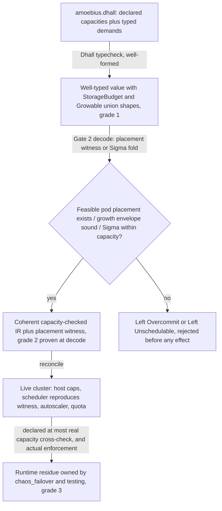

# Resource Capacity

**Status**: Authoritative source
**Supersedes**: N/A
**Referenced by**: documents/engineering/README.md, documents/engineering/app_vs_deployment_doctrine.md, documents/engineering/cluster_lifecycle_doctrine.md, documents/engineering/cluster_topology_doctrine.md, documents/engineering/content_addressing_doctrine.md, documents/engineering/daemon_topology_doctrine.md, documents/engineering/dsl_doctrine.md, documents/engineering/illegal_state_catalog.md, documents/engineering/manifest_generation_doctrine.md, documents/engineering/platform_services_doctrine.md, documents/engineering/pulsar_client_doctrine.md, documents/engineering/pulumi_iac_doctrine.md, documents/engineering/single_logical_data_plane_doctrine.md, documents/engineering/storage_lifecycle_doctrine.md, documents/engineering/substrate_doctrine.md
**Generated sections**: none

> **Purpose**: Single Source of Truth for the amoebius capacity model — the `Capacity` / `Demand` / `Budget`
> types, the *capacity-accounting fold* that rejects any deploy with no feasible placement of its typed demands
> against its enclosing capacity (a pod→node **witness** bin-pack for a fixed cluster, a growth **envelope** for
> an elastic one, `Σ ≤ backing` for divisible storage; host → cluster/VM → workload), the closed `StorageBudget`
> union that makes *unbounded* storage unrepresentable, and the `Growable` / `ScalingPolicy` escape valve that
> is the **only** way a bounded budget grows.

---

## 1. The one idea: capacity is a budget you fold against, and overcommit is a checked rejection

Raw Kubernetes lets you admit a Deployment that requests more memory than any node has, a StatefulSet whose
volumes sum past the disk, or a cluster whose workloads out-total its nodes. Each is well-formed YAML; each
surfaces at runtime as a `Pending` pod, an evicted workload, or a full disk. amoebius lifts that whole class
to *does-not-decode*: a deploy must produce a **feasible placement** of its typed demands against a
single-owner capacity — a concrete pod→node witness for a fixed cluster, a sound growth envelope for an elastic
one, and `Σ ≤ backing` for divisible storage — and a spec with no feasible placement returns `Left Overcommit`
/ `Left Unschedulable` before it ever reaches the interpreter. The aggregate sum alone is *not* enough, because
pods are atomic ([§4](#4-the-total-fold-fits-carve-place-and-the-nesting)).

This document owns the *capacity arithmetic* and nothing else. It owns:

1. The `Capacity` / `Demand` / `Budget` records and the refined non-zero `Quantity` they are built from ([§3](#3-the-types-quantity-capacity-demand-budget)).
2. The fold — `fits` / `podFits` / `carve` / `place` — the static-vs-elastic `place` branch, and the nesting (host → cluster/VM → workload) ([§4](#4-the-total-fold-fits-carve-place-and-the-nesting)).
3. The closed `StorageBudget` union — no *unbounded* arm — and how each arm names its single ceiling owner
   ([§5](#5-storagebudget-bounded-by-construction-single-owner-ceiling-per-arm)).
4. The `Growable` / `ScalingPolicy` escape valve: dynamic provisioning owned by amoebius, the only path by
   which a bounded budget grows ([§6](#6-growable--scalingpolicy-the-escape-valve-amoebius-owns)).

It **consumes, never restates**, the domain numbers it folds: the per-host capacity the node inventory
advertises ([substrate_doctrine.md](./substrate_doctrine.md)), the per-volume hard-capped PV sizes
([storage_lifecycle_doctrine.md](./storage_lifecycle_doctrine.md)), the per-container cpu/ram
([platform_services_doctrine.md §10](./platform_services_doctrine.md#10-every-container-declares-cpu-and-ram)),
the cloud quota ([pulumi_iac_doctrine.md](./pulumi_iac_doctrine.md)), and the Pulsar topic retention
([pulsar_client_doctrine.md](./pulsar_client_doctrine.md)). Each number has exactly one owner elsewhere; this
doc owns only the *placement / does-not-exceed* relation over them. The **catalog** of which capacity states are
illegal and the technique that forecloses them is
[illegal_state_catalog.md §3.17-§3.21 / §4.6](./illegal_state_catalog.md#317-an-over-committed-deploy-or-workload-host--vm--cluster-capacity-exceeded); this doc is the normative home of
the model that catalog names.

Everything below is **design intent for Phase 3** (the type discipline) with runtime realization in Phases
2/4/7/10. Status and gates live only in
[../../DEVELOPMENT_PLAN/README.md](../../DEVELOPMENT_PLAN/README.md).

---

## 2. The load-bearing honesty limit: a capacity sum is a grade-2 check, never grade-1

This is the most important sentence in the document, so it gets its own section. **A capacity check — whether
the compute *placement witness* ([§4](#4-the-total-fold-fits-carve-place-and-the-nesting)) or the
storage/retention `Σ demand ≤ capacity` — is a grade-2 foreclosure, a total decode-time check, never a grade-1
uninhabitable-by-type proof.** Dhall (and the GADT-indexed Haskell it decodes into) has **no dependent
arithmetic**: capacity is a *value*, not a type index, so neither "a feasible packing exists" nor "the sum fits"
can be a statement about type inhabitance. Each is a **total smart constructor / fold** that inspects a
constructible value and rejects it (`Left Overcommit` / `Left Unschedulable`) at decode. Per the three
foreclosure grades ([illegal_state_catalog.md §6](./illegal_state_catalog.md#6-three-grades-of-foreclosure-and-the-honesty-they-force)),
this is grade (2): a *spec-layer guarantee* (the spec never reaches the interpreter), but a *checked rejection*,
not an absence of inhabitants. Any doc that calls a capacity check "uninhabitable" is reporting the wrong grade,
and this doc forbids that.

**The compute placement is sound, not complete.** Optimal bin-packing is NP-hard, so `place`
([§4](#4-the-total-fold-fits-carve-place-and-the-nesting)) searches for a feasible pod→node assignment by a
total heuristic (first-fit-decreasing) rather than an exhaustive optimum. The honesty this buys is
one-directional: `place` may *reject* a spec that is in principle packable (a false `Left Unschedulable`), but
it never *admits* one that is not — **soundness over completeness**, the correct trade when the whole point is
"no runtime `Pending`." A rejected-but-packable spec is fixed by the operator declaring more headroom, never by
the model quietly admitting an unplaceable workload. (Storage and retention `Σ` folds are genuine sums, not
packings — volume bytes *are* divisible — so they carry no completeness caveat; the bin-pack is a
**compute-only** upgrade, [§4](#4-the-total-fold-fits-carve-place-and-the-nesting).)

The grade-1 pieces near capacity live elsewhere and are cited, not claimed here: the `StorageBudget` union
having **no unbounded arm** ([§5](#5-storagebudget-bounded-by-construction-single-owner-ceiling-per-arm)) and the `Growable` union having **no bare-unbounded arm** ([§6](#6-growable--scalingpolicy-the-escape-valve-amoebius-owns)) are grade-1
*union shapes* — a value simply cannot name "unbounded" without a policy. The *arithmetic* over those bounded
values is always grade-2.

The grade-3 residue is equally explicit and **not this doc's to assert**: whether the physical host actually
caps bytes/cgroups, whether the scheduler actually places the pods, whether the autoscaler actually grows the
node set, and whether the cloud actually honors the quota are **runtime** facts owned by
[chaos_failover_doctrine.md](./chaos_failover_doctrine.md) and the testing doctrine. [§8](#8-where-the-numbers-come-from-declared-at-decode-cross-checked-at-runtime) states the one
runtime cross-check the model *requires* (declared capacity ≤ real capacity) and honestly grades it (3).



---

## 3. The types: `Quantity`, `Capacity`, `Demand`, `Budget`

Intuition: every number that can be summed is a **refined non-zero quantity**, every provider of resources
advertises a **`Capacity`**, and every consumer declares a **`Demand`** in the same units, so the fold is a
subtraction that must not underflow.

- **`Quantity`** — a refined non-zero measure with a unit (`cpu` millicores, `mem` bytes, `storage` bytes,
  `vram` bytes). A zero or negative quantity is not constructible (the same refined-non-zero discipline the
  storage doctrine uses for PV sizes, [storage_lifecycle_doctrine.md §5](./storage_lifecycle_doctrine.md#5-sizes-are-explicit-hard-capped-and-one-volume-per-claim),
  and platform services for cpu/ram, [platform_services_doctrine.md §10](./platform_services_doctrine.md#10-every-container-declares-cpu-and-ram)).
  cpu and mem are **divisible** (fractional millicores/bytes, overcommittable at the limit). **Accelerators are
  not a per-pod axis at all.** A node's accelerators are owned **wholesale** by that node's one accelerator
  worker ([daemon_topology_doctrine.md §4](./daemon_topology_doctrine.md), reframing §C of the prior round's
  gpu-as-bin-packable narrative), so there is **no `gpu` field on `ResourceVec`** for a pod to name — a per-pod
  GPU request is **unrepresentable by construction (grade-1)**. `vram` is the accelerator-memory measure that
  wholesale worker carves among the models it serves — a per-owner Σ (the `worker → served-model` arm,
  [§4](#4-the-total-fold-fits-carve-place-and-the-nesting)), *not* a pod→node bin-pack axis; its per-host number
  and unified-vs-discrete Capacity shape are owned by
  [substrate_doctrine.md §8](./substrate_doctrine.md#8-the-node-inventory-the-single-owner-of-hosts-capacity-and-taints)
  and this doc does not restate them. The cluster compute fold is still an integer bin-pack — **not** because of
  accelerator indivisibility, but because **pods are atomic and cannot straddle nodes** (a workload can fit in
  aggregate yet have one pod that fits no single node, [§4](#4-the-total-fold-fits-carve-place-and-the-nesting)).
- **`Capacity`** — what a *provider* offers: a record of `Quantity` per axis, and it is the **allocatable**
  (schedulable) capacity, **not** the raw hardware total — kube/system-reserved and the eviction threshold are
  already netted out, so the fold never trusts a number larger than the scheduler can hand out ([§8](#8-where-the-numbers-come-from-declared-at-decode-cross-checked-at-runtime)). A
  physical host advertises one (from the substrate node inventory,
  [substrate_doctrine.md §8](./substrate_doctrine.md#8-the-node-inventory-the-single-owner-of-hosts-capacity-and-taints)); a VM
  carves a sub-`Capacity` out of its host; a managed provider's node advertises the `Capacity` of its instance
  type; a `StorageBacking` advertises a storage `Capacity` ([§5](#5-storagebudget-bounded-by-construction-single-owner-ceiling-per-arm)).
- **`Demand`** — what a *consumer* needs: the same record shape. Each container declares a **`Resources`** pair
  — **`requests`** and **`limits`**, both `ResourceVec` (cpu/mem `Quantity`) — and it
  is the **`requests`** vector that becomes the container's `Demand` and is summed by the fold, because
  `requests` is what the scheduler reserves against allocatable. **`limits`** is carried but *never* summed by
  `place`; it is the grade-3 cgroup ceiling (throttle/OOM) enforced at runtime, not a scheduling number. A
  decode invariant holds per axis — **`requests ≤ limits`** (a limit below its request is itself an illegal
  state, foreclosed here). A StatefulSet's volume claims are a storage `Demand`; a whole workload's `Demand` is the fold
  of its containers' `requests` and volumes; a VM's `Demand` on its host is the fold of everything the VM runs
  plus its own overhead.
- **`Budget`** — a `Capacity` an owner is *allowed to consume against*, which may be a fixed cap or a
  quota-capped growable ([§5](#5-storagebudget-bounded-by-construction-single-owner-ceiling-per-arm), [§6](#6-growable--scalingpolicy-the-escape-valve-amoebius-owns)). `Budget` is where capacity meets the escape valve; `Capacity` is the raw
  number, `Budget` is the *policy-wrapped* number the fold checks against.

```
Resources   = { requests : ResourceVec, limits : ResourceVec }   -- requests ≤ limits
ResourceVec = { cpu : Quantity, mem : Quantity }   -- storage is per-volume; accelerators are wholesale per-node (no gpu/vram axis)
```

`Demand` and `Capacity` share one record shape (a `ResourceVec` per axis) so the fold is defined once and
reused at every layer; the compute fold ranges over container `requests`, the storage fold over PV sizes.

---

## 4. The total fold: `fits`, `carve`, `place`, and the nesting

Intuition: an aggregate `Σ demand ≤ Σ capacity` is **necessary but not sufficient** for schedulability —
because pods are **atomic and cannot straddle nodes**, a workload set can fit in aggregate yet have a single
pod that fits no individual node (3 nodes × 4 CPU = 12 total admits a 5-CPU pod by the sum, but the pod is
`Pending` forever). So the cluster-level check is not a sum but a **placement**: for a fixed node set, compute
a concrete pod→node assignment (a witness); for an elastic node set, check a growth envelope the autoscaler can
always satisfy. Only the single-owner *carves* below the cluster (a VM out of a host) stay pure subtractions.

The fold is four total functions (grade-2 checked rejections, [§2](#2-the-load-bearing-honesty-limit-a-capacity-sum-is-a-grade-2-check-never-grade-1)):

- **`fits :: Demand -> Capacity -> Either Overcommit Headroom`** — the leaf check: one demand against one
  capacity, returning the leftover headroom or `Left Overcommit` with the offending axis and magnitudes.
- **`podFits :: Demand -> Node -> Bool`** — the per-pod placement primitive: one pod's `requests` against one
  node's *allocatable* `Capacity` **and** that node's affinity/taint eligibility
  ([illegal_state_catalog.md §3.5](./illegal_state_catalog.md#35-undeployable-pods-taints-tolerations--affinity)).
  A pod that satisfies `podFits` on *no* eligible node (or, in the elastic case, no candidate instance type)
  is `Left Unschedulable` immediately. This is the check the old aggregate sum omitted.
- **`carve :: Capacity -> Demand -> Either Overcommit Capacity`** — allocate a sub-capacity (a VM out of a
  host, a namespace budget out of a cluster) by total subtraction; an underflow on any axis is
  `Left Overcommit`. Carves are genuine subtractions: a VM reserves one contiguous slice of its host.
- **`place :: Topology -> [Workload] -> Either PlacementError Placement`** — the cluster-level **feasibility
  result**, not a sum. It branches on the topology's budget shape ([§4.1](#41-place-branches-static-proves-a-placement-dynamic-proves-a-growth-envelope)):
  a **fixed** node set yields a concrete `Placement` witness (bin-pack); an **elastic** node set yields a
  proof that the growth envelope holds. `PlacementError` is `Overcommit | Unschedulable`.
  ([cluster_topology_doctrine.md](./cluster_topology_doctrine.md) owns the `Topology`; this doc owns the
  placement/envelope arithmetic over it.)

The nesting is where the illegal states [§3.17](./illegal_state_catalog.md#317-an-over-committed-deploy-or-workload-host--vm--cluster-capacity-exceeded) (I5/I6/I7) live:

- **Host → engine.** A `kind`/`rke2`/VM compute engine's `Demand` on its host must `fits` the host `Capacity`
  (I5, I6). This is the same fold whether the "host" is a physical machine or a VM carved from one.
- **Host → VM → guest.** A Lima/WSL2 VM `carve`s a sub-`Capacity` from its host; everything the VM runs then
  folds against *that* sub-capacity — nested budgets, so "a VM asking for more than its host" (I6) and "a
  guest asking for more than its VM" are the same relation at different depths.
- **Cluster → workload.** The whole workload set `place`s against the topology (I7) — a **bin-pack**, not a
  sum ([§4.1](#41-place-branches-static-proves-a-placement-dynamic-proves-a-growth-envelope)). Because every
  container declares cpu/ram *requests* ([platform_services_doctrine.md §10](./platform_services_doctrine.md#10-every-container-declares-cpu-and-ram))
  and every durable volume declares a hard-capped size ([storage_lifecycle_doctrine.md §5](./storage_lifecycle_doctrine.md#5-sizes-are-explicit-hard-capped-and-one-volume-per-claim)),
  the per-pod inputs are exact, not a guess — so the packing is over known integers, the same soundness the
  cluster-lifecycle push-back relies on
  ([cluster_lifecycle_doctrine.md §6](./cluster_lifecycle_doctrine.md#6-push-back-when-teardown-would-break-the-global-dhall)).
- **Host → host-worker.** A host-level accelerator worker (Apple-Metal or Windows-CUDA) is a native subprocess,
  **not** a pod ([daemon_topology_doctrine.md §4](./daemon_topology_doctrine.md),
  [substrate_doctrine.md](./substrate_doctrine.md)), so its cpu/mem `Demand` is declared by
  [platform_services_doctrine.md §10](./platform_services_doctrine.md#10-every-container-declares-cpu-and-ram)
  (every container **and every host-level worker subprocess**) and folds against its **physical-host
  `Capacity`** — the physical total the per-host inventory declares
  ([substrate_doctrine.md §8](./substrate_doctrine.md#8-the-node-inventory-the-single-owner-of-hosts-capacity-and-taints)),
  distinct from the Lima/WSL2 VM's kube-allocatable ([§8](#8-where-the-numbers-come-from-declared-at-decode-cross-checked-at-runtime)).
  The three-way fit — the co-resident VM carve + the worker `Demand` ≤ physical-host allocatable, with the host
  binary's own footprint already netted into system-reserved (substrate §8) — is a **grade-2 `Left Overcommit`
  at decode**, the host-tier analogue of the pod-tier aggregate overcommit
  ([illegal_state_catalog.md §3.17](./illegal_state_catalog.md#317-an-over-committed-deploy-or-workload-host--vm--cluster-capacity-exceeded));
  it is **never** "unrepresentable" — a capacity check is grade-2, never grade-1 ([§2](#2-the-load-bearing-honesty-limit-a-capacity-sum-is-a-grade-2-check-never-grade-1)).
- **Accelerator worker → served-model (VRAM).** The one wholesale accelerator worker on a node
  ([daemon_topology_doctrine.md §4](./daemon_topology_doctrine.md)) carves the node's accelerator memory among
  the models it serves — a `Σ served-model VRAM ≤ node vram` fold, modelled **like storage** (a per-owner Σ),
  **not** a pod→node `ResourceVec` axis. The per-host `vram` number and its unified-vs-discrete Capacity shape
  are owned by [substrate_doctrine.md §8](./substrate_doctrine.md#8-the-node-inventory-the-single-owner-of-hosts-capacity-and-taints)
  (this doc does not restate that topology rule); the per-model VRAM footprint — the left operand of the Σ — is
  owned by [service_capability_doctrine.md §4.1](./service_capability_doctrine.md); this doc owns only the Σ
  arithmetic. The declared-footprint Σ is **grade-2**; whether the model **actually fits in VRAM at runtime**
  under real batch/context (dynamic KV-cache/fragmentation) is **grade-3 residue**, exactly like the `mem`
  cgroup ceiling behind the `mem` Σ ([§2](#2-the-load-bearing-honesty-limit-a-capacity-sum-is-a-grade-2-check-never-grade-1))
  — the grade-2 Σ does **not** foreclose runtime VRAM OOM.

The fold is **total and re-runnable**: after any `Growable` policy grows a capacity ([§6](#6-growable--scalingpolicy-the-escape-valve-amoebius-owns)) the fold re-runs
against the new bound, so growth never silently invalidates an earlier check.

**`place` folds exactly one `Topology`.** `place :: Topology -> [Workload]` admits a **single** `Topology`, and
a `Topology` is one cluster ([cluster_topology_doctrine.md §4](./cluster_topology_doctrine.md#4-topology-a-cluster-is-a-fold-over-its-nodes-and-cardinality-is-by-construction)),
so a capacity fold spanning two clusters' `Topology`s has **no constructor — grade-1 by arity**
([§9.1](#91-the-cross-cluster-capacity-fold-is-a-grade-1-non-goal-single-cluster-by-arity),
[illegal_state_catalog.md §3.31](./illegal_state_catalog.md)). A **stretched cluster** — one whose nodes span
two network-locality `Site`s across a WAN — is still **one** `Topology`; `place` runs **once** over it. The WAN
there spans **nodes inside the one fold** (a full stretched member node) or a **host-worker subprocess client
outside the cluster** (a stretched host worker), never two clusters. A stretched host worker is **not** a pod in
this `place`: its `Demand` folds against its **own physical-host `Capacity`** (the host → host-worker arm above),
**not** the home cluster's node bin-pack — being *stretched* is a **networking** fact that does not move the
per-host capacity fold.

### 4.1 `place` branches: static proves a placement, dynamic proves a growth envelope

Intuition: a **fixed** node set is fully known at decode, so you can compute an actual packing and reject if
none exists; an **elastic** node set has no nodes yet at decode, but the autoscaler removes the straddle
problem — it can always add a right-sized node for a pending pod — so the sound check is a *growth envelope*,
not a packing. `place` selects on the topology's budget shape ([§6](#6-growable--scalingpolicy-the-escape-valve-amoebius-owns)):

- **Fixed node set** (`Kind` with `replicas`, `Rke2` `servers` + statically-declared `agents`, any `Bounded`
  budget) → **witness bin-pack.** `place` computes a concrete pod→node assignment by first-fit-decreasing,
  honoring each node's allocatable `Capacity`, `podFits` eligibility (affinity/taints), and anti-affinity.
  Success returns a `Placement` — a **witness** that a feasible schedule exists; failure returns
  `Left Unschedulable`. Schedulability is proven **by construction of the witness**, sound-not-complete
  ([§2](#2-the-load-bearing-honesty-limit-a-capacity-sum-is-a-grade-2-check-never-grade-1)).
- **Elastic node set** (`Autoscaled` agents, a `Managed Eks` node group up to a `CloudQuota`) → **two-envelope
  check**, no witness (the nodes do not exist at decode):
  1. **per-pod-fits-an-instance** — every pod `podFits` the *largest* instance type in the `ScalingPolicy`
     candidate set ([§6](#6-growable--scalingpolicy-the-escape-valve-amoebius-owns)); a pod larger than any candidate is unplaceable at *any* scale →
     `Left Unschedulable`.
  2. **aggregate-≤-quota** — the summed `Demand` at maximum scale ≤ the quota cap → else `Left Overcommit`.
  If both hold, every pod fits *some* candidate instance and the total stays under quota, so the autoscaler can
  always grow to place a pending pod. These two conditions are the *complete* schedulability story for the
  elastic case, and the fold re-runs against the grown node set when the policy fires.
- **Hybrid** (a fixed floor with elastic headroom — e.g. `Rke2` fixed servers + `Autoscaled` agents):
  witness-bin-pack the workloads pinned to the fixed floor (notably host-backed StatefulSet ordinals, whose
  node affinity already pins them, [storage_lifecycle_doctrine.md §4](./storage_lifecycle_doctrine.md#4-deterministic-pv-naming-and-the-explicit-bind));
  everything beyond the floor must satisfy the elastic envelope.

**The witness is a feasibility proof, not a universal pin.** `place` emits the placement so the reconciler
*can* reproduce it, but pods are hard-pinned to nodes **only** where storage already pins them (host-backed
ordinals, the hybrid case above); elsewhere the runtime scheduler is left free to reproduce an equivalent placement, so
HA rescheduling after a node failure still works. Pinning every pod would defeat failover. That the scheduler
*actually* reproduces a feasible placement is the grade-3 residue ([§2](#2-the-load-bearing-honesty-limit-a-capacity-sum-is-a-grade-2-check-never-grade-1)).

**Accelerators are wholesale-owned, so the pod→node bin-pack ranges over cpu/mem only.** The bin-pack packs the
`ResourceVec = { cpu, mem }` demands against each node's allocatable; a node's accelerators are **not** a
bin-pack axis. Each node's accelerators are owned **wholesale** by that node's one accelerator worker — the
typed per-node-singleton owner this round's compute half introduces, owned by
[daemon_topology_doctrine.md §4](./daemon_topology_doctrine.md) — and other pods use only the node's leftover
cpu/mem, never its accelerators. This reframes the prior round's "a `gpu` `Count` bin-packs onto a node with ≥N
free GPUs": accelerator sizing is the `worker → served-model` VRAM Σ below ([§4](#4-the-total-fold-fits-carve-place-and-the-nesting)),
not a per-pod placement axis. This doc consumes the wholesale-ownership rule; it does not own it.

---

## 5. `StorageBudget`: bounded by construction, single-owner ceiling per arm

Intuition: there is no such thing as "unbounded storage" — storage is *either* host-level (bounded by a
physical disk) *or* cloud (bounded by a quota). amoebius encodes that as a **closed union with no unbounded
arm**, so "unbounded storage" (I9) has no syntax.

```
StorageBudget = Fixed Capacity | QuotaCapped Quota | Growable ScalingPolicy
```

- **No unbounded constructor** — the union shape is grade-1: a value cannot denote unbounded storage. This is
  the storage-side reading of the illegal-state contract; the closed `StorageBacking` union it pairs with
  (host-disk-bounded | EBS-bounded | cloud-quota-bounded) is owned by
  [storage_lifecycle_doctrine.md §5.2](./storage_lifecycle_doctrine.md#52-the-storage-backing-is-bounded--the-closed-storagebacking-union), and this doc owns the *aggregate
  arithmetic* over it.
- **Single-owner ceiling per arm.** Each arm names exactly one owner of its ceiling number, so "available
  storage" has one definition: a **host-disk** arm's ceiling is owned by
  [storage_lifecycle_doctrine.md](./storage_lifecycle_doctrine.md) (the retained-PV host root) and, for the
  content store, [content_addressing_doctrine.md](./content_addressing_doctrine.md) (the MinIO backing); a
  **cloud** arm's ceiling is the quota owned by [pulumi_iac_doctrine.md](./pulumi_iac_doctrine.md). The
  aggregate fold `Σ(sizes) ≤ backing` (I10) reads whichever owner the arm names.
- **Both MinIO and Pulsar fold against a `StorageBudget`.** An app's object usage (`<app>/<bucket>` MinIO
  buckets) and a topic's retained bytes ([§7](#7-pulsar-has-two-ceilings-the-hot-tier-and-the-durable-total)) each contribute a storage `Demand`; the sum against the backing
  is the same [§4](#4-the-total-fold-fits-carve-place-and-the-nesting) fold. "An app that can consume more storage than is available" (I10) is therefore
  unrepresentable for both.

---

## 6. `Growable` / `ScalingPolicy`: the escape valve amoebius owns

Intuition: bounded capacity would be a straitjacket if it could never grow — but growth must be *amoebius's
decision under a typed policy*, never a blank "unbounded." So the **only** way a `Budget` exceeds a fixed cap
is a `Growable` arm carrying a `ScalingPolicy`, and the policy's own outer bound is a cloud quota — never
truly unbounded.

```
Growable = Bounded Capacity | Autoscaled ScalingPolicy
```

- **No bare-unbounded arm** (grade-1 union shape): "grow without limit and without a policy" (I12) has no
  constructor. `Autoscaled` *requires* a `ScalingPolicy`.
- **`ScalingPolicy` is arbitrary-but-total, and amoebius owns it.** It is a typed, side-effect-free value —
  capacity thresholds (grow when utilization crosses a mark, drain when it falls), **instance price-shopping**
  (a candidate instance-type set with a price ceiling), and a **quota cap** that bounds the whole policy. It
  carries no logic; the reconciler enacts it. This is the deployment-rules-surface elastic-shape logic already
  named by [cluster_lifecycle_doctrine.md §8](./cluster_lifecycle_doctrine.md#8-dynamic-node-provisioning)
  and realized as Pulumi node provisioning by
  [pulumi_iac_doctrine.md §4](./pulumi_iac_doctrine.md#4-what-pulumi-provisions-the-resource-catalog); this
  doc owns the *type* and its place in the fold.
- **A `ScalingPolicy` grows the rke2 `agents` pool ONLY — the `Rke2Servers` quorum is never autoscaled.** The
  rke2 node topology is two typed pools owned by
  [cluster_topology_doctrine.md §2](./cluster_topology_doctrine.md#2-computeengine-a-closed-union-eks-a-first-class-arm):
  a `Rke2Servers` control-plane quorum (the closed `Single | Ha3 | Ha5` union — the only legal odd etcd
  quorums {1,3,5}) and an `agents : List LinuxHost` worker pool. A `Growable`/`Autoscaled` budget scales the
  **agents** list and nothing else; the server quorum is **fixed by declaration**. A quorum change
  (`Single`→`Ha3`→`Ha5`) is a deliberate **re-provision** — a re-declared topology re-folded through the
  cardinality-by-construction relation
  ([cluster_topology_doctrine.md §4](./cluster_topology_doctrine.md#4-topology-a-cluster-is-a-fold-over-its-nodes-and-cardinality-is-by-construction))
  and enacted by the host reconciler — **never** a `ScalingPolicy`/autoscale action, because etcd membership
  is a consensus decision, not an elastic-capacity one. So the elastic axis and the quorum axis stay
  orthogonal: the price-shopping / threshold policy above ranges over agents; the fold re-runs ([§4](#4-the-total-fold-fits-carve-place-and-the-nesting), below)
  against the grown *agent* set only. This is **Phase-10 design intent** (the `ScalingPolicy` enaction lands
  in Phase 10, [§10](#10-planning-ownership)); the closed-union quorum shape it relies on is grade-1 and owned by cluster topology, not
  claimed here.
- **The fold re-runs after growth ([§4](#4-the-total-fold-fits-carve-place-and-the-nesting)).** A `Growable` budget the fold checked at decode is re-checked
  against the grown capacity when the policy fires — so "unbounded" MinIO/Pulsar is representable **only**
  through such a policy whose ceiling is a quota, and the storage fold still holds against that ceiling.
- **Honesty.** The policy *composing* — a legal `ScalingPolicy` that the fold accepts — is grade-1/2. That
  the autoscaler *actually grows* capacity, and that the cloud *honors* the quota, is grade-3 runtime,
  deferred to [pulumi_iac_doctrine.md](./pulumi_iac_doctrine.md) enactment and
  [chaos_failover_doctrine.md](./chaos_failover_doctrine.md).

---

## 7. Pulsar has two ceilings: the hot tier and the durable total

Intuition: a message bus is the one storage consumer where a *single* budget is not enough. Pulsar's hot tier
is BookKeeper (bookies on retained PVs); tiered storage offloads only **closed** ledgers to S3 and does not
free BookKeeper until retention deletes them (there is a deletion lag), and the currently-open ledger can
never be offloaded. So a **time-only** offload trigger does not bound the hot tier: if ingest × offload-lag
exceeds the bookie disk, BookKeeper fills, bookies go read-only, and the topic — often the broker — becomes
**unavailable**. Worse, that overflow would be *representable*, which this model forbids.

So every topic folds against **two** ceilings (the topic-lifecycle *policy* is owned by
[pulsar_client_doctrine.md §6](./pulsar_client_doctrine.md#6-the-declarative-topology-algebra); this doc owns
the *two-ceiling arithmetic*):

- **Hot-tier fit (availability-critical).** The offload trigger is a **size high-water mark** on the primary
  tier, not time (time may offload *sooner* for cost, but is never the sole trigger — a time-only policy is
  uninhabitable, [illegal_state_catalog.md §3.20](./illegal_state_catalog.md#320-a-pulsar-topic-without-a-bounded--tiered--retained-lifecycle)). The per-topic hot cap **plus
  headroom** — the open ledger, in-flight ingest during offload, and the deletion lag — folds against the
  BookKeeper `StorageBacking`: `Σ(hot caps + headroom) ≤ bookie disk`. A hot-tier overflow is a grade-2
  decode rejection.
- **Durable-total fit.** The total retained bytes fold against the selected offload target's ceiling ([§5](#5-storagebudget-bounded-by-construction-single-owner-ceiling-per-arm)) —
  a provider-S3 quota ([pulumi_iac_doctrine.md](./pulumi_iac_doctrine.md)) for cloud clusters, or the MinIO
  content store ([content_addressing_doctrine.md](./content_addressing_doctrine.md)) for host-bounded ones.
- **Runtime fail-safe (grade-3).** A burst, or a stalled/S3-unreachable offload, can still race the cap at
  runtime — no spec-layer check prevents that. So the topic policy carries a **mandatory backlog quota**
  (`producer_request_hold` / back-pressure at the high-water mark) so overflow degrades to per-topic producer
  throttling, never a disk-full broker outage. The decode-time two-ceiling fit is grade-2; the back-pressure
  actually holding is grade-3.
- **A continuous/online-training Feed folds against these ceilings too.** A Feed-sourced continuous trainer
  ([content_addressing_doctrine.md](./content_addressing_doctrine.md)) consumes a topic with no terminal step,
  but its "forever" is **bounded per-cluster**: the consumed topic's retention folds against these two ceilings
  exactly as any topic's does, and the online worker's compute folds into [§4](#4-the-total-fold-fits-carve-place-and-the-nesting)
  (the host → host-worker / cluster → workload arms). Declared retention + declared compute are what bound the
  run; retention limits only re-derivation of the consumed prefix from the live topic, never a committed
  checkpoint (whose materialized-prefix input is immutable, owned by content_addressing). Cross-cluster this is
  serve-by-replication, never a second trainer on the same feed.

---

## 8. Where the numbers come from: declared at decode, cross-checked at runtime

Intuition: for overcommit to be *unrepresentable* rather than a runtime error, the capacity the fold checks
against must be a **spec input** — you cannot type-check a demand against a number you only learn at runtime.
So amoebius **declares** capacity in the spec and folds at decode (grade-2), then **cross-checks** the
declaration against reality at reconcile (grade-3).

- **Declared (grade-2).** Each host/node advertises an **allocatable** `Capacity` in the substrate node
  inventory ([substrate_doctrine.md §8](./substrate_doctrine.md#8-the-node-inventory-the-single-owner-of-hosts-capacity-and-taints)) —
  the schedulable total with kube/system-reserved and the eviction threshold already netted out, *not* the raw
  hardware figure; each cloud account declares a quota ([pulumi_iac_doctrine.md](./pulumi_iac_doctrine.md));
  each `StorageBacking` declares its size. The [§4](#4-the-total-fold-fits-carve-place-and-the-nesting) fold
  runs over these declared numbers at decode, so an over-committed spec never decodes.
- **Cross-checked (grade-3).** A reconcile-time check refuses if the *real* probed **allocatable** capacity is
  **smaller** than the declared `Capacity` (a host that claims 64 GiB allocatable but has 32, or a node whose
  kubelet reserves more than declared), fail-closed like every other
  `Unreachable → refuse` observation ([cluster_lifecycle_doctrine.md §9](./cluster_lifecycle_doctrine.md#9-how-bring-up-and-teardown-are-implemented-the-reconciler-not-a-state-machine)).
  Comparing *allocatable* against *allocatable* is what keeps the guarantee honest: declaring raw capacity would
  let the fold "prove" an overcommit-free cluster that still evicts once the kubelet's reservation is subtracted.
  The declaration is a *ceiling the fold trusts*, and reality must be at least that generous or the deploy
  refuses. Detection of the real number is owned by
  [substrate_doctrine.md §2](./substrate_doctrine.md#2-detection-a-pure-classification-over-three-reads);
  this doc owns only the requirement that the cross-check exist and its grade.
- **Physical-host total vs VM allocatable (host workers).** On apple/windows the node inventory's only kube node
  is the Lima/WSL2 VM, whose **allocatable** `Capacity` the cluster bin-pack folds against. A host-level
  accelerator worker is a native subprocess **outside** that VM; its `Demand` folds against the **physical-host**
  total the inventory *also* declares
  ([substrate_doctrine.md §8](./substrate_doctrine.md#8-the-node-inventory-the-single-owner-of-hosts-capacity-and-taints),
  the sole owner of both numbers plus the host-binary system-reserved netting). So two distinct capacities coexist
  per such host — the VM's allocatable (the cluster bin-pack) and the physical-host total (the host → host-worker
  arm, [§4](#4-the-total-fold-fits-carve-place-and-the-nesting)) — each declared at decode and cross-checked at
  reconcile like every other capacity number. This doc consumes the two numbers; it does not own them.

> **Honesty.** This model is Phase-0 design intent, specified before implementation. The fold is a real
> grade-2 spec-layer guarantee *when implemented as specified*; that claim is itself about a design not yet
> built (Phase 3). The grade-3 runtime cross-check and enforcement are deferred by construction. Where the
> capacity arithmetic generalizes the push-back soundness proven in prodbox
> ([cluster_lifecycle_doctrine.md §6](./cluster_lifecycle_doctrine.md#6-push-back-when-teardown-would-break-the-global-dhall)),
> that is sibling evidence, not amoebius proof ([documentation_standards.md §6](../documentation_standards.md#6-honesty-the-proventestedassumed-discipline)).

---

## 9. What this doctrine deliberately does not own

To keep SSoT boundaries crisp:

| Concern | Owned by |
|---|---|
| Per-host / per-node capacity numbers and their detection; the node inventory; taints | [substrate_doctrine.md](./substrate_doctrine.md) |
| The `ComputeEngine` / `Topology` types the `place` fold ranges over | [cluster_topology_doctrine.md](./cluster_topology_doctrine.md) |
| Per-volume hard-capped PV sizing; the `StorageBacking` union shape | [storage_lifecycle_doctrine.md](./storage_lifecycle_doctrine.md) |
| Per-container cpu/ram declaration | [platform_services_doctrine.md §10](./platform_services_doctrine.md#10-every-container-declares-cpu-and-ram) |
| Cloud quota provisioning; dynamic node provisioning enaction; per-PV EBS | [pulumi_iac_doctrine.md](./pulumi_iac_doctrine.md) |
| The Pulsar topic-lifecycle policy (retention, size-triggered offload, backlog quota) | [pulsar_client_doctrine.md §6](./pulsar_client_doctrine.md#6-the-declarative-topology-algebra) |
| The content-addressed MinIO store as a storage backing | [content_addressing_doctrine.md](./content_addressing_doctrine.md) |
| Which capacity states are illegal and the [§4.6](./illegal_state_catalog.md#46-capacity-accounting--placement-witness-compute-and-σ-demand--capacity-storage-checked) technique that forecloses them | [illegal_state_catalog.md](./illegal_state_catalog.md) |
| Runtime enforcement (host actually caps, scheduler places, autoscaler grows, quota holds) | [chaos_failover_doctrine.md](./chaos_failover_doctrine.md), [testing_doctrine.md](./testing_doctrine.md) |
| Capacity/scaling as a deployment-rules surface, never app logic | [app_vs_deployment_doctrine.md](./app_vs_deployment_doctrine.md) |

### 9.1 The cross-cluster capacity fold is a grade-1 non-goal (single-cluster by arity)

`place` is **single-cluster by construction**, and that is a deliberate non-goal, not an omission. Its signature
is `place :: Topology -> [Workload]`, and a `Topology` is exactly one cluster
([cluster_topology_doctrine.md §4](./cluster_topology_doctrine.md#4-topology-a-cluster-is-a-fold-over-its-nodes-and-cardinality-is-by-construction)),
so a capacity fold spanning two clusters' `Topology`s has **no constructor — grade-1 by arity**: the same
closed-union / no-arm idiom that forecloses the worker pool as a fourth `ComputeEngine` arm
([single_logical_data_plane_doctrine.md §2](./single_logical_data_plane_doctrine.md#2-the-two-topologies)). This
lives in its own subsection rather than a row of the §9 table because a non-goal has no *other* owner to name in
the "Owned by" column; it is stated once, here, and cross-referenced from [§4](#4-the-total-fold-fits-carve-place-and-the-nesting)
and [illegal_state_catalog.md §3.31](./illegal_state_catalog.md).

Distributing a workload across clusters is **geo-replication** — *N* independent clusters, each running its own
`place` over its own `Topology`, related only by async transport (Phase-9 design intent,
[app_vs_deployment_doctrine.md §9](./app_vs_deployment_doctrine.md#9-composition-one-cluster--n-geo-replicated-clusters-zero-app-change)).
It is emphatically **not** the stateless attach pool, which is **single-cluster** and lives **inside** `place`'s
elastic branch: [single_logical_data_plane_doctrine.md §4](./single_logical_data_plane_doctrine.md#4-the-elastic-worker-pool-the-attach-topology)
re-runs the *same* `place` fold on the enlarged topology, and modelling that pool as cross-cluster machinery is
the category error [single_logical_data_plane_doctrine.md §5](./single_logical_data_plane_doctrine.md#5-the-category-error-this-doctrine-forecloses)
forecloses. The **reason** a cluster is the fold boundary — the phantom cluster index `c` on `DataPlane` /
`FabricMember` — is owned by [single_logical_data_plane_doctrine.md §1](./single_logical_data_plane_doctrine.md#1-why-this-doctrine-exists-two-ways-to-say-run-this-elsewhere)
and [§3](./single_logical_data_plane_doctrine.md#3-the-binding-reachability-is-a-type-not-a-runtime-probe); this
subsection consumes that WHY, it does not restate it. The only grade-3 residue is the deferred geo-replication
enaction (Phase 9). A **stretched cluster** does not breach this arity: it is **one** `Topology` whose nodes span
two `Site`s, folded **once** ([§4](#4-the-total-fold-fits-carve-place-and-the-nesting)).

---

## 10. Planning ownership

This document is normative capacity doctrine only. Delivery sequencing, completion status, and validation
gates are owned by [../../DEVELOPMENT_PLAN/README.md](../../DEVELOPMENT_PLAN/README.md): the capacity/topology
type discipline lands in **Phase 3** (the fold and the negative `.dhall` gate), with runtime realization of
the storage/pulsar folds in **Phase 2/4**, the host/VM cross-check in **Phase 7**, and the `ScalingPolicy`
enaction in **Phase 10**. This doc never maintains a competing status ledger; it states the target shape and
links back for status, per [documentation_standards.md §6](../documentation_standards.md#6-honesty-the-proventestedassumed-discipline).

---

## Cross-references

- [Engineering Doctrine Index](./README.md)
- [Illegal State Catalog](./illegal_state_catalog.md) — the catalog ([§3.17](./illegal_state_catalog.md#317-an-over-committed-deploy-or-workload-host--vm--cluster-capacity-exceeded)-[§3.21](./illegal_state_catalog.md#321-capacity-growth-without-an-amoebius-owned-scaling-policy)) and technique ([§4.6](./illegal_state_catalog.md#46-capacity-accounting--placement-witness-compute-and-σ-demand--capacity-storage-checked)) this model realizes
- [Cluster Topology Doctrine](./cluster_topology_doctrine.md) — the `ComputeEngine` / `Topology` the fold ranges over; owns the `Rke2Servers` quorum + `agents` pools ([§2](./cluster_topology_doctrine.md#2-computeengine-a-closed-union-eks-a-first-class-arm)/[§4](./cluster_topology_doctrine.md#4-topology-a-cluster-is-a-fold-over-its-nodes-and-cardinality-is-by-construction)) that [§6](./cluster_topology_doctrine.md#6-where-topology-meets-capacity-and-lifecycle) scales agents-only
- [Substrate Doctrine](./substrate_doctrine.md) — the node inventory + per-host capacity numbers
- [Storage Lifecycle Doctrine](./storage_lifecycle_doctrine.md) — per-volume sizing + the `StorageBacking` union
- [Pulsar Client Doctrine](./pulsar_client_doctrine.md) — the topic-lifecycle policy the two-ceiling fold checks
- [Platform Services Doctrine](./platform_services_doctrine.md) — every container declares cpu/ram
- [Pulumi IaC Doctrine](./pulumi_iac_doctrine.md) — cloud quota + dynamic node provisioning enaction
- [Content Addressing Doctrine](./content_addressing_doctrine.md) — the MinIO content store as a storage backing
- [Cluster Lifecycle Doctrine](./cluster_lifecycle_doctrine.md) — push-back arithmetic + the reconcile cross-check
- [App vs Deployment Doctrine](./app_vs_deployment_doctrine.md) — capacity/scaling is a deployment rule
- [Development Plan](../../DEVELOPMENT_PLAN/README.md)
- [Documentation Standards](../documentation_standards.md)
