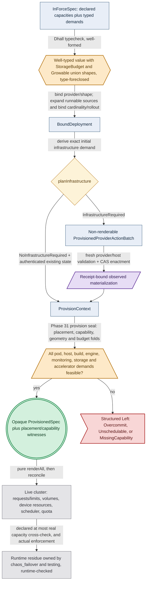

# Resource Capacity

> **Purpose**: Single Source of Truth for the amoebius resource-provisioning model — the pure types, the total
> fold that rejects any deploy with no feasible target, and the sealed witness the manifest renderer accepts.
> **Read this if**: a workload has to be admitted against a declared capacity, or a capacity rejection has to
> be explained.

This document is the hub of the resource-capacity family. It owns the model's shape — why capacity is a budget
a fold consumes, and the honesty limit that bounds every claim the model makes — and states each remaining
section in one paragraph before linking the slice that carries its argument. The slices are
[resource_capacity_types.md](./resource_capacity_types.md),
[resource_capacity_schema.md](./resource_capacity_schema.md),
[resource_capacity_folds.md](./resource_capacity_folds.md),
[resource_capacity_storage.md](./resource_capacity_storage.md), and
[resource_capacity_sources.md](./resource_capacity_sources.md). Physical storage lifetimes, cluster topology,
and provisioning enaction are owned elsewhere and named in
[§9](#9-what-this-doctrine-deliberately-does-not-own).

Link-graph metadata

**Status**: Authoritative source
**Supersedes**: N/A
**Referenced by**: DEVELOPMENT_PLAN/later_phases.md, DEVELOPMENT_PLAN/overview.md, DEVELOPMENT_PLAN/phase_09_resource_index.md, DEVELOPMENT_PLAN/phase_19_reconcile_core_simulation.md, DEVELOPMENT_PLAN/phase_25_dhall_schema_generation.md, DEVELOPMENT_PLAN/phase_26_gadt_decode_ir.md, DEVELOPMENT_PLAN/phase_27_illegal_state_covering.md, DEVELOPMENT_PLAN/phase_28_storage_geometry_folds.md, DEVELOPMENT_PLAN/phase_29_execution_accelerator_folds.md, DEVELOPMENT_PLAN/phase_30_capability_bind.md, DEVELOPMENT_PLAN/phase_31_provision_seal.md, DEVELOPMENT_PLAN/phase_32_inference_accelerator_provision.md, DEVELOPMENT_PLAN/phase_33_render_manifest_oracles.md, DEVELOPMENT_PLAN/phase_48_test_workflow_algebra.md, DEVELOPMENT_PLAN/phase_53_apple_engine_bringup.md, DEVELOPMENT_PLAN/phase_55_bootstrap_coordinator_kind.md, DEVELOPMENT_PLAN/phase_58_object_reconciler.md, DEVELOPMENT_PLAN/phase_59_capacity_scheduler.md, DEVELOPMENT_PLAN/phase_60_retained_storage.md, DEVELOPMENT_PLAN/phase_61_vault_pki.md, DEVELOPMENT_PLAN/phase_64_keycloak_ingress.md, DEVELOPMENT_PLAN/phase_65_live_dsl_deploy.md, DEVELOPMENT_PLAN/phase_67_pulsar_client.md, DEVELOPMENT_PLAN/phase_71_release_lifecycle.md, DEVELOPMENT_PLAN/phase_73_network_fabric_wireguard.md, DEVELOPMENT_PLAN/phase_74_multicluster_spawn_georepl.md, DEVELOPMENT_PLAN/phase_75_gateway_migration_drills.md, DEVELOPMENT_PLAN/phase_76_provider_deploy_checkpoint.md, DEVELOPMENT_PLAN/phase_78_provider_ebs_credential.md, DEVELOPMENT_PLAN/phase_79_provider_dynamic_nodes.md, DEVELOPMENT_PLAN/phase_80_determinism_jitcache.md, DEVELOPMENT_PLAN/phase_85_offline_replay_receipts.md, DEVELOPMENT_PLAN/phase_86_offline_blobs_isolation.md, DEVELOPMENT_PLAN/phase_87_offline_release_evolution.md, DEVELOPMENT_PLAN/phase_88_offline_multizone_continuity.md, DEVELOPMENT_PLAN/phase_89_apple_metal_host_daemon.md, DEVELOPMENT_PLAN/phase_93_jitml_rederivation.md, DEVELOPMENT_PLAN/substrates.md, DEVELOPMENT_PLAN/system_components.md, documents/engineering/README.md, documents/engineering/app_vs_deployment_doctrine.md, documents/engineering/backup_recovery_doctrine.md, documents/engineering/cluster_lifecycle_doctrine.md, documents/engineering/cluster_topology_doctrine.md, documents/engineering/consistency_pacelc_doctrine.md, documents/engineering/content_addressing_determinism.md, documents/engineering/content_addressing_doctrine.md, documents/engineering/daemon_topology_doctrine.md, documents/engineering/dsl_doctrine.md, documents/engineering/extension_conformance_laws.md, documents/engineering/image_build_doctrine.md, documents/engineering/jit_budget_doctrine.md, documents/engineering/manifest_generation_doctrine.md, documents/engineering/monitoring_doctrine.md, documents/engineering/namespace_layout_doctrine.md, documents/engineering/platform_services_doctrine.md, documents/engineering/preflight_validation_doctrine.md, documents/engineering/pulsar_client_doctrine.md, documents/engineering/pulumi_iac_doctrine.md, documents/engineering/readiness_ordering_doctrine.md, documents/engineering/resource_capacity_construction.md, documents/engineering/resource_capacity_folds.md, documents/engineering/resource_capacity_schema.md, documents/engineering/resource_capacity_sources.md, documents/engineering/resource_capacity_storage.md, documents/engineering/resource_capacity_types.md, documents/engineering/service_capability_doctrine.md, documents/engineering/single_logical_data_plane_doctrine.md, documents/engineering/storage_lifecycle_doctrine.md, documents/engineering/substrate_doctrine.md, documents/engineering/substrate_node_inventory.md, documents/engineering/testing_doctrine.md, documents/engineering/ui_realtime_coordination_doctrine.md, documents/illegal_state/illegal_state_capacity.md, documents/illegal_state/illegal_state_lifecycle.md, documents/illegal_state/illegal_state_ml_asset.md, documents/illegal_state/illegal_state_multicluster.md, documents/illegal_state/illegal_state_security.md, documents/illegal_state/illegal_state_storage.md, documents/illegal_state/illegal_state_techniques.md, documents/reading_order.md
**Generated sections**: none

> **Historical result (invalidated).** Every phase-run or implementation-result statement in this document is permanently invalidated diagnostic history. It cannot establish or reactivate current status, even if a phase later advances. Target doctrine remains normative; current status is solely in the [tracker](../../DEVELOPMENT_PLAN/README.md).

## Contents
- [1. Capacity is a budget the fold consumes, and overcommit is a checked rejection](#1-capacity-is-a-budget-the-fold-consumes-and-overcommit-is-a-checked-rejection)
- [2. The load-bearing honesty limit: a capacity sum is a decode-foreclosed check, never type-foreclosed](#2-the-load-bearing-honesty-limit-a-capacity-sum-is-a-decode-foreclosed-check-never-type-foreclosed)
- [3. The types: `Quantity`, `Capacity`, `Demand`, `Budget`](#3-the-types-quantity-capacity-demand-budget)
- [4. The total fold: `fits`, `carve`, `place`, and the nesting](#4-the-total-fold-fits-carve-place-and-the-nesting)
- [5. `StorageBudget`: bounded by construction, single-owner ceiling per arm](#5-storagebudget-bounded-by-construction-single-owner-ceiling-per-arm)
- [6. `Growable` / `ScalingPolicy`: the quota-bounded dynamic-provisioning arm](#6-growable--scalingpolicy-the-quota-bounded-dynamic-provisioning-arm)
- [7. Pulsar has two ceilings: the hot tier and the durable total](#7-pulsar-has-two-ceilings-the-hot-tier-and-the-durable-total)
- [8. Where the numbers come from: declared in pure input, provisioned before render, cross-checked at runtime](#8-where-the-numbers-come-from-declared-in-pure-input-provisioned-before-render-cross-checked-at-runtime)
- [9. What this doctrine deliberately does not own](#9-what-this-doctrine-deliberately-does-not-own)
- [10. Planning ownership](#10-planning-ownership)
- [Related Documents](#related-documents)

---

## 1. Capacity is a budget the fold consumes, and overcommit is a checked rejection

Raw Kubernetes admits a Deployment that requests more memory or local ephemeral storage than any node has, a
StatefulSet whose volumes sum past the disk, a cache with no bounded backing, or a CUDA workload in a cluster
with no CUDA-capable node. Each can be well-formed YAML; each surfaces later as a `Pending` pod, eviction,
accelerator initialization failure, or a full disk. amoebius lifts that whole class to *does-not-provision*: a
decoded deployment must produce a **feasible resource witness** against single-owner capacities — a concrete
pod→node witness for a fixed cluster, a sound growth envelope for an elastic one, `Σ ≤ backing` for durable or
native-host-cache storage plus nested in-cluster cache bounds within pod ephemeral storage, and an
accelerator-offering witness for every accelerator demand. Failure returns a structured
`Left Overcommit` / `Left Unschedulable` / `Left MissingCapability` before any value reaches the renderer. The
aggregate sum alone is *not* enough, because pods and accelerator offerings are atomic
([§4](#4-the-total-fold-fits-carve-place-and-the-nesting)).

This document owns the *capacity arithmetic* and nothing else. It owns:

1. The `Capacity` / `Demand` / `Budget` / `ResourceEnvelope` records and the refined non-zero `Quantity` they
   are built from ([§3](#3-the-types-quantity-capacity-demand-budget)).
2. The fold — `fits` / `podFits` / `carve` / `place` — the static-vs-elastic `place` branch, and the nesting (host → cluster/VM → workload) ([§4](#4-the-total-fold-fits-carve-place-and-the-nesting)).
3. The conditional infrastructure boundary that derives initial infrastructure demand from the fully
   source-expanded but wholly unprovisioned graph, admits only authenticated existing or receipt-bound
   materialized infrastructure into `ProvisionContext`, and then lets `provision` materialize ordinary
   execution identities and epochs, normalize every resource demand, check it against the target topology,
   and construct the opaque whole-deployment `ProvisionedSpec`; private service
   projections contribute to its unique object-source map, while only deployment-level `renderAll` crosses
   the seal ([§4](#4-the-total-fold-fits-carve-place-and-the-nesting)).
4. The closed `StorageBudget` union — no *unbounded* arm — and how each arm names its single ceiling owner
   ([§5](#5-storagebudget-bounded-by-construction-single-owner-ceiling-per-arm)).
5. The `Growable` / `ScalingPolicy` escape valve: dynamic provisioning owned by amoebius, the only path by
   which a bounded budget grows ([§6](#6-growable--scalingpolicy-the-quota-bounded-dynamic-provisioning-arm)).

It **consumes, never restates**, the domain numbers it folds: the per-host/node CPU, memory, logical
ephemeral and physical filesystem/content/snapshot storage, accelerator, and
raw/reserved/allocatable/current-free VRAM inventory
([substrate_doctrine.md](./substrate_doctrine.md)); the per-volume hard-capped PV sizes
([storage_lifecycle_doctrine.md](./storage_lifecycle_doctrine.md)); the complete per-container resource
envelope and host-worker demand
([platform_services_doctrine.md §10](./platform_services_doctrine.md#10-every-execution-unit-declares-its-complete-resource-envelope)),
the cache budget ([content_addressing_determinism.md §4.5](./content_addressing_determinism.md#45-the-ml-asset-lifecycle-one-bounded-content-addressed-cache-resolved-on-first-miss)),
the cloud quota ([pulumi_iac_doctrine.md](./pulumi_iac_doctrine.md)), and the Pulsar topic retention
([pulsar_client_doctrine.md](./pulsar_client_doctrine.md)). Each number has exactly one owner elsewhere; this
doc owns only the *placement / does-not-exceed* relation over them. The **catalog** of which capacity states are
illegal and the technique that forecloses them is
[illegal_state_catalog.md §3.17-§3.21 / §4.6](../illegal_state/illegal_state_capacity.md#317-an-over-committed-deploy-or-workload-host--vm--cluster-capacity-exceeded); this doc is the normative home of
the model that catalog names.

The model below begins with Phase 9's implemented base index, continues through the schema, provision, and
render band, and ends with later live phases that enact and cross-check it. The bound
[Phase 9 gate](../../DEVELOPMENT_PLAN/phase_09_resource_index.md) validates the **base**
`Amoebius.Capacity.Types` / `Amoebius.Capacity.Fold` slice: CPU,
memory, logical pod-ephemeral storage, pod and driver-scoped CSI slots, finite CPU-limit policy, headroom,
taint/anti-affinity eligibility, and fixed/elastic placement. Its 15 direct negatives, 15 legal twins, two
carried positives, four sampled properties, and 19 changed-production mutants distinguish the subject at
Register 1. This is a bound gate contract, not a live-enforcement claim.
The [Phase 28 candidate](../../DEVELOPMENT_PLAN/phase_28_storage_geometry_folds.md) implements the five-module
`storage-geometry-folds` library, and its gate validates the
closed storage budget/growth arithmetic, BookKeeper/MinIO physical expansion, presentation/allocation
rounding, uniform claims, six-arm object inventory, service/migration/cache/root/control-plane geometry,
backup/restore/pool checks, both Pulsar ceilings, and snapshot-bound policy-only scaling. Its 30 exact
variant/twin rows, two positive specs, six sampled equivalence properties, and 31 mutants must distinguish the
subject at Register 1; the independently authored five-calculus projection must account for all 99 projected
units, with transient run evidence beneath `.build/runs/phase-28/`. The separately authored
`StorageGeometryOracle` replaces the retired serialized storage-case and calculus tables.
The [Phase 29 gate](../../DEVELOPMENT_PLAN/phase_29_execution_accelerator_folds.md) must validate execution
epochs, aggregate scheduler reservations, structural runtime/image accounting, physical partition and
provider-root arithmetic, accelerator residency against net VRAM, host-only compute derivations, and the
composed full-vector witness. Its 37 negative/twin variants, seven sampled properties, two composed positives,
and 45 mutants must distinguish the subject at Register 1; the independently authored five-calculus
projection must account for all 128 observed units. Direct cases must cover the peer graph and build/cache,
engine-storage, monitoring-volume, and
Pulumi-concurrency boundaries. No current ledger is asserted here.
Post-bind provisioning, live storage mutation, device attachment, observed inventory, and all physical
enforcement remain **UNVERIFIED** here. Status and gates live only in
[../../DEVELOPMENT_PLAN/README.md](../../DEVELOPMENT_PLAN/README.md).

The [Phase 31 gate](../../DEVELOPMENT_PLAN/phase_31_provision_seal.md) must validate the pure post-bind consumer
of those folds. Its `planInfrastructure` paths derive demand internally, distinguish pre-existing from one
exact creation batch, reject plan/action token replay and promised identities, and admit receipt-bound
materialization evidence. Its `provision` path accepts all 18 inherited bound deployments, rejects ten exact
seal-locus failures, preserves the opaque render-source domain/key/owner correspondence and four activation
stages, and must cover two boundary properties plus ten paired mutants. The 42-unit five-calculus projection
and 40-row locus ledger must be exact. Provider realization, observed runtime capacity, and model/runtime
correspondence remain **UNVERIFIED**.

The [Phase 32 gate](../../DEVELOPMENT_PLAN/phase_32_inference_accelerator_provision.md) must validate the
inference-owner specialization: four target offerings project onto three lanes, all twelve family/lane cells
must match the authored relation, and the identity-complete CUDA/Metal demand must be checked across every permitted
coexistence epoch. Eight distinct seal failures, exact-fit twins, the covered property, and five paired mutants
must distinguish the subject; the opaque accelerator constructor remains hidden. Physical device observation, live engine resolution,
and cross-lane weight loading remain **UNVERIFIED**.

---

## 2. The load-bearing honesty limit: a capacity sum is a decode-foreclosed check, never type-foreclosed

**A capacity check — whether the compute *placement witness*
([§4](#4-the-total-fold-fits-carve-place-and-the-nesting)) or the storage/retention `Σ demand ≤ capacity` —
is a `decode-foreclosed` checked rejection in the catalog's historical layer taxonomy, concretely evaluated
at the post-bind `provision-seal` locus, never a type-foreclosed uninhabitable-by-type proof.** Dhall (and the GADT-indexed Haskell it decodes into) has **no dependent arithmetic**: capacity is a *value*, not a type
index, so neither "a feasible packing exists" nor "the sum fits" can be a statement about type inhabitance.
Each is a **total smart constructor / fold** that inspects a constructible value and rejects it (`Left
Overcommit` / `Left Unschedulable`) during Phase-31 provisioning, after the complete source inventory is
bound and before `ProvisionedSpec` or `renderAll` exists. Per the three foreclosure layers
([illegal_state_catalog.md §6](../illegal_state/illegal_state_techniques.md#6-three-layers-of-foreclosure-and-the-honesty-they-force)),
this remains `decode-foreclosed`: a *spec-layer guarantee* (the spec never reaches the interpreter), but a
*checked rejection*, not an absence of inhabitants. The validation locus is `provision-seal`, not
`gadt-decode`; any doc that calls a capacity check "uninhabitable" or says `Dhall.inputFile` performed
the whole-deployment fold is reporting the wrong boundary, and this doc forbids that.

Because the guarantee is a *checked rejection*, the check's own correctness is a property to establish, not a
given. The fold's soundness — and, for the two-directionally-decidable checks (`Σ ≤ backing`, elementwise
compatibility), its **accepts ⟺ in-envelope equivalence** — is property-tested over generated inputs in the
[Phase 9](../../DEVELOPMENT_PLAN/phase_09_resource_index.md) base slice (never a fixed fixture set alone).
Where a specific fold's algebraic laws are load-bearing enough to warrant a
machine-checked proof, that is the surgical, deferred proof-assistant track
([later_phases.md](../../DEVELOPMENT_PLAN/later_phases.md)), not a broad proof layer.

**The compute placement is sound, not complete.** Optimal bin-packing is NP-hard, so `place`
([§4](#4-the-total-fold-fits-carve-place-and-the-nesting)) searches for a feasible pod→node assignment by a
total heuristic (first-fit-decreasing) rather than an exhaustive optimum. The honesty this buys is
one-directional: `place` may *reject* a spec that is in principle packable (a false `Left Unschedulable`), but
it never *admits* one that is not — **soundness over completeness**, the correct trade when the objective is
"no runtime `Pending`." A rejected-but-packable spec is fixed by the operator declaring more headroom, never by
the model quietly admitting an unplaceable workload. (Storage and retention within one named backing are
genuine sums, not packings, so they carry no completeness caveat; the bin-pack is the **atomic pod/device placement** upgrade, [§4](#4-the-total-fold-fits-carve-place-and-the-nesting).)

The type-foreclosed pieces near capacity live elsewhere and are cited, not claimed here: the `StorageBudget` union
having **no unbounded arm** ([§5](#5-storagebudget-bounded-by-construction-single-owner-ceiling-per-arm)) and the `Growable` union having **no bare-unbounded arm** ([§6](#6-growable--scalingpolicy-the-quota-bounded-dynamic-provisioning-arm)) are type-foreclosed
*union shapes* — a value simply cannot name "unbounded" without a policy. The *arithmetic* over those bounded
values is always a checked, post-bind provisioning rejection.

The runtime-checked residue is equally explicit and **not this doc's to assert**: whether the physical host actually
caps bytes/cgroups, whether the scheduler actually places the pods, whether the autoscaler actually grows the
node set, and whether the cloud actually honors the quota are **runtime** facts owned by
[chaos_failover_doctrine.md](./chaos_failover_doctrine.md) and the testing doctrine. [§8](#8-where-the-numbers-come-from-declared-in-pure-input-provisioned-before-render-cross-checked-at-runtime) states the one
runtime cross-check the model *requires* (declared capacity ≤ real capacity) and honestly classifies it as runtime-checked.

```mermaid
flowchart TD
%% register: algebra
  spec["InForceSpec: declared capacities plus typed demands"]:::intent -->|Dhall typecheck, well-formed| typed{{"Well-typed value with StorageBudget and Growable union shapes, type-foreclosed"}}:::gate
  typed -->|bind provider/shape; expand runnable sources and bind cardinality/rollout| bound["BoundDeployment"]:::intent
  bound -->|derive exact initial infrastructure demand| infra{"planInfrastructure"}:::decision
  infra -->|NoInfrastructureRequired + authenticated existing state| context["ProvisionContext"]:::intent
  infra -->|InfrastructureRequired| batch["Non-renderable ProvisionedProviderActionBatch"]:::intent
  batch -->|fresh provider/host validation + CAS enactment| receipt[/"Receipt-bound observed materialization"/]:::effect
  receipt --> context
  context -->|Phase 31 provision seal: placement, capability, geometry and budget folds| fold[/"All pod, host, build, engine, monitoring, storage and accelerator demands feasible?"\]:::gate
  fold -->|yes| ir((("Opaque ProvisionedSpec plus placement/capability witnesses"))):::seal
  fold -->|no| reject>"Structured Left: Overcommit, Unschedulable, or MissingCapability"]:::refuse
  ir -->|pure renderAll, then reconcile| runtime["Live cluster: requests/limits, volumes, device resources, scheduler, quota"]:::runtime
  runtime -->|declared at most real capacity cross-check, and actual enforcement| runtime-checked["Runtime residue owned by chaos_failover and testing, runtime-checked"]:::runtime
  classDef intent   fill:#e8eef7,stroke:#33587a,color:#12283f,stroke-width:1px
  classDef gate     fill:#fde9c8,stroke:#b8791b,color:#5c3a06,stroke-width:2px
  classDef decision fill:#fdf3d8,stroke:#b8791b,color:#5c3a06,stroke-width:1px
  classDef effect   fill:#e7ddf5,stroke:#6b3fa0,color:#2f1a52,stroke-width:2px
  classDef seal     fill:#d3f0dd,stroke:#1f8a4c,color:#0c3a1f,stroke-width:2px
  classDef refuse   fill:#f8d6d6,stroke:#b23636,color:#5c1414,stroke-width:2px
  classDef runtime  fill:#e4e4e7,stroke:#71717a,color:#2f2f35,stroke-width:1px
```

*Design intent. The Dhall typecheck is type-foreclosed and the provision-seal fold is decode-foreclosed at Tier-1; the CAS-enactment seam and the live-cluster residue (declared capacity at most real capacity) are runtime-checked, owned by chaos_failover and testing, not proven here.*

---

## 3. The types: `Quantity`, `Capacity`, `Demand`, `Budget`

The model rests on four types, and all four are needed before any fold below can be read. Their
definitions, the construction obligations that exceed what a record shape alone can state, and the
matrix pairing each provision with its demand, supply, and check are carried by
[resource_capacity_types.md §3](./resource_capacity_types.md#3-the-types-quantity-capacity-demand-budget).

---

## 4. The total fold: `fits`, `carve`, `place`, and the nesting

An aggregate sum is necessary but not sufficient for schedulability, because a pod is atomic and
cannot straddle nodes; the cluster-level check is therefore a placement witness rather than a sum,
and only single-owner carves below the cluster stay pure subtractions. The fold, its branches, and
its nesting are carried by
[resource_capacity_folds.md §4](./resource_capacity_folds.md#4-the-total-fold-fits-carve-place-and-the-nesting).

---

## 5. `StorageBudget`: bounded by construction, single-owner ceiling per arm

Every storage ceiling belongs to exactly one owner, so no two consumers can draw against the same
budget and no arm is unbounded. The closed union and its per-arm rules are carried by
[resource_capacity_storage.md §5](./resource_capacity_storage.md#5-storagebudget-bounded-by-construction-single-owner-ceiling-per-arm).

---

## 6. `Growable` / `ScalingPolicy`: the quota-bounded dynamic-provisioning arm

Capacity grows only through an amoebius-owned, quota-capped policy; there is deliberately no bare
unbounded arm to select. The policy and the worst-case envelope it admits are carried by
[resource_capacity_storage.md §6](./resource_capacity_storage.md#6-growable--scalingpolicy-the-quota-bounded-dynamic-provisioning-arm).

---

## 7. Pulsar has two ceilings: the hot tier and the durable total

A message bus bounds both its hot tier and its durable total, and a fold that checks only one of the
two admits a topology that fills the other. Both ceilings and their interaction are carried by
[resource_capacity_storage.md §7](./resource_capacity_storage.md#7-pulsar-has-two-ceilings-the-hot-tier-and-the-durable-total).

---

## 8. Where the numbers come from: declared in pure input, provisioned before render, cross-checked at runtime

Each number in the model passes three loci — declared in pure input, provisioned before render, and
cross-checked against live observation — and only the first two are decidable before any effect. The
three loci and what each may be claimed to establish are carried by
[resource_capacity_sources.md §8](./resource_capacity_sources.md#8-where-the-numbers-come-from-declared-in-pure-input-provisioned-before-render-cross-checked-at-runtime).

---

## 9. What this doctrine deliberately does not own

The model stops at single-cluster placement, and shared physical supply, monitoring cost, and
realtime or offline demand fold through machinery owned elsewhere. The boundaries and their owners
are carried by
[resource_capacity_sources.md §9](./resource_capacity_sources.md#9-what-this-doctrine-deliberately-does-not-own).

---

### Phase-61 target Vault capacity validation — NOT VALIDATED

Phase 61 must validate the bounded Vault source-population fold and its live projection. The target resident
population is 425,984 bytes, the derived usable Raft peak is 2,023,424 bytes, and the fixed raw backing is
134,217,728 bytes; rotated audit requires at least 4,194,304 usable bytes and a 67,108,864-byte raw backing.
One-byte-under cases must be rejected, while forced snapshot/history and audit rotation must stay inside the
externally observed ext4 usable capacities.

### Phase-63 target service-capacity validation — NOT VALIDATED

Phase 63 must add private provisions for the Grafana Patroni members/operator/webhook/gateway/pgAdmin,
Prometheus/query proxy/Grafana, and Redis/Sentinel. Pure checks must reject one-byte-under Prometheus backing
and fixed-budget mutation; live readback must require complete CPU, memory, and ephemeral-storage request/limit fields
on all sixteen execution units. Three 256 MiB ext4 Postgres member backings and one 128 MiB Prometheus backing
must be mounted through the retained-storage contract, while Redis remains deliberately ephemeral. The target
lane is universal `linux-cpu`; pristine Linux routing is Incus for Linux/Linux-CUDA, Lima for
Apple, and WSL2 for Windows.

### Phase-69 target content-store/workflow validation — NOT VALIDATED

Phase 69 must validate the `ObjectStoreDemand` logical peak with committed, concurrent, full
failed-write-window, and observed-orphan terms. Exact-fit and every one-short boundary must reject before
mutation; orphan credit must be withheld until both the finite horizon and an externally observed deletion.
The live store must consume the Phase-62 four-drive MinIO raw/usable witness, and the six-source workflow
provision must cover the orchestrator,
three Failover workers, content gateway, and completion collector with no accelerator term.

[Phase 73](../../DEVELOPMENT_PLAN/phase_73_network_fabric_wireguard.md) owns the target live
`NetworkFabricSystemDemand` producer/consumer instance. The exact two-node peer graph must expand finite
packet-rate, packet-size, queue-byte, rotated-log, CPU/memory reservation and ceiling,
nodefs, listener, and host-process operands into one private row per node. Every one-unit-short capacity and a
changed fingerprint must fail before fabric mutation; the fitting token must be consumed once. External
cgroup-v2, `tc`, log/nodefs, process, socket, and kernel-interface readback must match the admitted rows. This
targets the declared envelope on `linux-cpu`; it cannot prove every kernel, queue discipline, or WAN workload.

## 10. Planning ownership

This document is normative capacity doctrine only. Delivery sequencing, completion status, and validation
gates are owned by [../../DEVELOPMENT_PLAN/README.md](../../DEVELOPMENT_PLAN/README.md): the capacity/topology
type discipline is assigned to **Phases 25 and 9** (the negative `.dhall` gate and the capacity/topology fold), with
runtime realization of kubelet layout/image-store and engine/etcd transitions in **Phase 55**, host build and
registry admission in **Phase 56**, presentation-rounded retained/uniform claims in **Phase 60**, Vault
Raft/audit storage in **Phase 61**, BookKeeper/MinIO geometry in **Phase 62**, monitoring-work binding in
**Phase 30** and TSDB live projection in **Phase 63**, failed-write orphan/GC admission in **Phase 69**, kernel
fabric demand in **Phase 73**, the host/VM presentation cross-check in **Phase 89**, and the `ScalingPolicy`
enaction in **Phase 79**, realtime Redis/WebSocket demand in **Phases 63 and 81–66**, and offline replay,
upload, compatibility, and multi-zone fault demand in **Phases 67–70**. This doc never maintains a competing status ledger; it states the target shape and
links back for status, per [documentation_standards.md §6](../documentation_standards.md#6-honesty-the-proventestedassumed-discipline).

[Phase 19](../../DEVELOPMENT_PLAN/phase_19_reconcile_core_simulation.md) owns a bounded reservation implementation
against the `Amoebius.Capacity.Scheduler` algebra. Two concurrent modeled-store attempts must create exactly one `Reserved`
row; `beginBinding`, `confirmBound`, and `ledgerOnlyAbsentRecovery` then retain one complete-resource debit and
reach `Bound` across crashes at `Reserved`, `BindingInFlight`, and `Bound`. A changed-production crash-drop
mutation must fail at the direct debit observation. This targets Register-2 evidence
over three authored cuts, linked to Phase 18's `OneDebitPerReservation` invariant name. It cannot prove
model-to-code refinement nor replaces Phase 59's live scheduler observations; modeled-store fidelity is
ASSUMED and live runtime fidelity is UNVERIFIED here.

Phase 89's scoped contract must independently rederive 32 GiB of Lima guest-usable carves, apply the pinned
filesystem and sparse-image overhead plus 40 GiB minimum/4 GiB quantum, and exposes only a private 40 GiB
`ProvisionedVmDiskCarve`. It must charge that witness once beside 64 GiB durable and 16 GiB cache pools, and fold
the worst Metal coexistence epoch into a 19 GiB unified-memory debit; one-short and six semantic mutants must
turn red. Physical Apple supply, Lima raw/allocated image bytes, guest mount/fs-type, and Metal allocation
readbacks remain UNVERIFIED.

**Phase-55 target capacity boundary — NOT VALIDATED.** The contract must retain a complete pristine-Incus
observed inventory and effective etcd/kubelet configuration readback. Its live challenge must boundary-fill
finite `Unified` and distinct `SplitRuntime` ext4 identities and observe the next allocation fail with
`ENOSPC`; `SplitImage` must reject before create. Independent observers must cover the
etcd/audit/kubelet transition-high-water bounds, node/host/bootstrap coordinator/per-process cgroup envelopes,
and complete CNI/CSI/OCI/backing-pool inventory. This target uses the Phase-55 `linux-cpu` lane; every hardware
substrate can run that lane, using Incus on Linux, Lima on Apple, or WSL2 on Windows for a pristine Linux host.

**Phase-56 target capacity boundary — NOT VALIDATED.** The gate must apply the same
declared/provisioned/observed discipline to the host build and bootstrap registry: the build must be admitted
against the catalog's own 32 GiB scratch and
16 GiB cache provisions — sized for the plain-Ubuntu monocontainer, where the retired 96/64 GiB pair was sized
for a CUDA devel base and exceeded the substrate's free space. Independent observers must challenge
CPU throttling, child OOM kill, and bounded scratch/cache `ENOSPC`. Registry admission must deduplicate the
exact digest/object inventory against observed residents, charge upload workspaces and failed-upload residue,
reject conflicting metadata and one-byte under-provision before mutation, and place the finite registry/proxy
execution and storage demand on the Phase-55 node. Phase 62 owns the MinIO-backed rehome and backbone
resource-projection challenge.

**Phase-58 target capacity boundary — NOT VALIDATED.** One coherent authenticated live snapshot must be normalized
before mutation, unknown commitments or an over-bound CR child fail closed, and a snapshot-bound typed target
must be consumed once. The Register-3 corpus must independently observe exact child requests/limits/storage,
a one-Pod quota admitting only one of two simultaneous child submissions with zero over-allocation, and a
byte-stable immediate rerun. Phase 59 owns the scheduler-allocation challenge: the reservation CRD must reach
`Reserved` and `BindingInFlight` before the Kubernetes Binding, two simultaneous candidates must contend on
one aggregate root resourceVersion with exactly one winner and zero over-allocation, and both same-UID records
must remain single-debit and byte-stable on immediate rerun.

**Phase-60 target capacity boundary — NOT VALIDATED.** Before materialization, the independent fold must
establish a total raw allocation of `402653184` bytes within the named `536870912`-byte durable backing, with
the two witness images fixed at 256 MiB and 128 MiB and cache/node-ephemeral identities excluded. The live
observer must match raw image length, ext4 presentation, and required usable capacity, then reach `ENOSPC` at
the one-volume hard ceiling without sibling/shared-pool spill. The same gate must exercise uniform-claim
post-rounding debit and verified-migration high-water/cleanup boundaries. No current Register-3 ledger or
`linux-cpu` result is asserted here; the target lane is
available on every hardware substrate; use Incus on native Linux/Linux-CUDA, Lima on Apple, or WSL2 on
Windows when a pristine Linux host is required.

**Phase-62 target capacity boundary — NOT VALIDATED.** The pure corpus must cover six-arm MinIO producer
geometry, erasure healing, failed-write orphans, uniform four-drive claim debit, BookKeeper quorum/recovery,
and exact-fit/one-byte-over boundaries. Live readback must match complete CPU, memory, and ephemeral-storage
fields plus retained volumes for every execution unit; 53 SSA object projections and 11 Haskell renderer
projections must be exact. Offload must produce 19 MinIO objects while observed hot-tier bytes remain under
the 65,536-byte cap. No current Register-3 ledger is asserted here.

**Phase-76 target capacity boundary — NOT VALIDATED.** `PulumiExecutionDemand` must account for both live
executors at a `BoundedParallel 2` peak, including CPU, memory, pod-ephemeral, plugin-cache, and workspace
bytes; each one-short case must refuse before continuation. `PulumiCheckpointObjectDemand` must derive a six-object,
393,216-byte peak with a named budget, serial overlap, retained revisions, failed-partial exposure, GC horizon,
and exclusive mutation admission. The CPU-only `ProviderNodeClass` must be cross-checked against a pinned SKU,
and vCPU, node-group, and EBS one-short account fixtures must refuse before a provider action. Kubernetes and
Vault/MinIO observers must challenge the executor and checkpoint arms. Actual provider quota observation,
EKS/node-root supply, and managed-node allocatable/CRI/filesystem enforcement remain UNVERIFIED because AWS
authority was invalid.

**Phase-78 target capacity boundary — NOT VALIDATED.** The pure storage side of `CreateProviderCapacity` must
have an exact action domain of one volume
create plus one durable-checkpoint write, gated by the fresh snapshot fingerprint and a single-use batch. The
migration witness simultaneously admits old+new rounded bytes, two provider volume slots, workspace, copy CPU/
memory/pod-ephemeral/pod slot, and two distinct CSI attachments; eight one-short cases must refuse. The
retained-storage drill may validate only an analogue and checkpoint-class accounting. Provider quota observation, actual
EBS creation/migration, and receipt-bound cloud readback remain UNVERIFIED.

**Phase-79 target capacity boundary — NOT VALIDATED.** Phase 79 must implement the node side of the
`ScalingPolicy` arm in `Amoebius.Cluster.NodeProvisioner`.
Workflow-completion and load signals derive a finite target; the worst-case instance, vCPU, node-root EBS,
CPU, memory, pod-ephemeral, pod-slot, CNI, CSI-attachment, and capability obligations refuse before provider
permission when any ceiling is short. Repeated attachment to one PVC must be deduplicated while distinct
old/new PVCs during replacement must not be. The gate must challenge pure contracts and a retained-Kubernetes
signal analogue; live provider
quota, node supply, root-EBS geometry, and scheduler admission remain UNVERIFIED.

**Phase-80 target capacity boundary — NOT VALIDATED.** Phase 80 must add the Tier-1 cache-capacity
specialization in `Amoebius.Jit.CacheBudget`. Admission must deduplicate
equal digests, rejects conflicting sizes, keeps observed-present bytes charged even when deletion is proposed,
must account for the largest finite concurrent temporary overlap, and must require both the owner `emptyDir`
and pod ephemeral-storage request to cover the provisioned demand. The retained owner/client drill must
observe a 121 MiB high-water mark within a 160 MiB cache budget, prune an unpinned entry, preserve a pinned
entry, and leave no temporary residue. This cannot validate cross-node reuse, Tier-2 model capacity, Tier-3 CUDA cache
capacity, or every substrate's physical limits.

**Phase-93 target capacity boundary — NOT VALIDATED.** Phase 93 must add a scoped CUDA admission
specialization. The pure adapter must reject a CPU target, fewer than 200
steps, fewer than ten million parameters, non-whole-device count, inconsistent reserve/net geometry, a net-
allocatable one-short, and a current-free one-short before modeled effects; the raw-VRAM mutant must turn red.
Live inventory must admit 64 MiB against a 4 GiB GTX 970 with a 256 MiB reserve, then execute and release a
40 MB parameter allocation. Kubernetes device-plugin supply, owner placement, cache high water, and live one-
short zero-effect twins remain UNVERIFIED. Every hardware platform retains `linux-cpu`; pristine Linux uses
Incus for Linux/Linux-CUDA, Lima for Apple, or WSL2 for Windows.

---
## Related Documents
- [Resource Capacity Types](./resource_capacity_types.md) — the four types and the checked construction obligations
- [Resource Capacity Schema](./resource_capacity_schema.md) — the 557 type spellings, in 26 families
- [Resource Capacity Folds](./resource_capacity_folds.md) — `fits`, `carve`, `place`, and the nesting
- [Resource Capacity Storage Budgets](./resource_capacity_storage.md) — the closed budget union and the growable arm
- [Resource Capacity Sources and Boundaries](./resource_capacity_sources.md) — the three loci and what the model does not own
- [Engineering Doctrine Index](./README.md)
- [Illegal State Catalog](../illegal_state/illegal_state_catalog.md) — the catalog ([§3.17](../illegal_state/illegal_state_capacity.md#317-an-over-committed-deploy-or-workload-host--vm--cluster-capacity-exceeded)-[§3.21](../illegal_state/illegal_state_storage.md#321-capacity-growth-without-an-amoebius-owned-scaling-policy)) and technique ([§4.6](../illegal_state/illegal_state_techniques.md#46-capacity-accounting--placement-witness-compute-and-summed-demand-within-capacity-storage-checked)) this model realizes
- [Cluster Topology Doctrine](./cluster_topology_doctrine.md) — the `ComputeEngine` / `Topology` the fold ranges over; owns the `Rke2Servers` quorum + `agents` pools ([§2](./cluster_topology_doctrine.md#2-computeengine-a-closed-union-eks-a-first-class-arm)/[§4](./cluster_topology_doctrine.md#4-topology-a-cluster-is-a-fold-over-its-nodes-and-cardinality-is-by-construction)) that [§6](./cluster_topology_doctrine.md#6-where-topology-meets-capacity-and-lifecycle) scales agents-only
- [Substrate Doctrine](./substrate_doctrine.md) — the node inventory + per-host/node CPU, memory,
  logical ephemeral/filesystem-layout/content-snapshot storage, disk-pool, accelerator-device, and
  raw/reserved/allocatable/current-free VRAM declarations
- [Storage Lifecycle Doctrine](./storage_lifecycle_doctrine.md) — per-volume usable/presentation/raw sizing +
  the `StorageBacking` union
- [Pulsar Client Doctrine](./pulsar_client_doctrine.md) — the topic-lifecycle policy the two-ceiling fold checks
- [Platform Services Doctrine](./platform_services_doctrine.md) — every container and host worker declares its
  complete resource envelope
- [Pulumi IaC Doctrine](./pulumi_iac_doctrine.md) — cloud quota + dynamic node provisioning enaction
- [Content Addressing Doctrine](./content_addressing_doctrine.md) — the MinIO content store as a storage backing
- [UI Realtime Coordination](./ui_realtime_coordination_doctrine.md) — finite WebSocket/Redis routing and repair operands
- [Browser Offline Runtime](./browser_offline_runtime_doctrine.md) — bounded replay, blob, compatibility, and browser-quota obligations
- [Cluster Lifecycle Doctrine](./cluster_lifecycle_doctrine.md) — push-back arithmetic + the reconcile cross-check
- [App vs Deployment Doctrine](./app_vs_deployment_doctrine.md) — capacity/scaling is a deployment rule
- [Development Plan](../../DEVELOPMENT_PLAN/README.md)
- [Documentation Standards](../documentation_standards.md)
