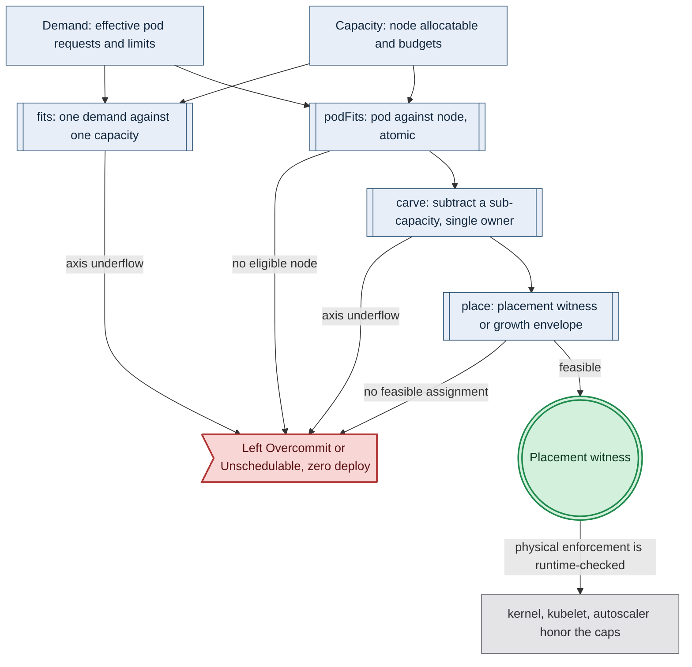

# Resource Capacity Folds

> **Purpose**: The total fold that admits or rejects a deployment — `fits`, `carve`, and `place` — and the nesting that makes placement a witness rather than a sum.
> **Read this if**: a deployment has to be admitted against a capacity, or a placement rejection has to be explained.

This slice of the resource-capacity family carries the folds and their nesting. It does not carry the
types they fold over, owned by [resource_capacity_types.md](./resource_capacity_types.md), nor where the
numbers entering them come from, owned by
[resource_capacity_sources.md](./resource_capacity_sources.md). Reading it presumes the atomicity argument in
[resource_capacity_doctrine.md §1](./resource_capacity_doctrine.md#1-capacity-is-a-budget-the-fold-consumes-and-overcommit-is-a-checked-rejection).

<details>
<summary>Link-graph metadata</summary>

**Status**: Authoritative source
**Supersedes**: N/A
**Referenced by**: DEVELOPMENT_PLAN/phase_09_resource_index.md, DEVELOPMENT_PLAN/phase_30_execution_accelerator_folds.md, documents/engineering/README.md, documents/engineering/cluster_topology_doctrine.md, documents/engineering/daemon_topology_doctrine.md, documents/engineering/preflight_validation_doctrine.md, documents/engineering/resource_capacity_construction.md, documents/engineering/resource_capacity_doctrine.md, documents/engineering/resource_capacity_sources.md, documents/engineering/resource_capacity_storage.md, documents/engineering/resource_capacity_types.md, documents/glossary.md, documents/illegal_state/illegal_state_capacity.md, documents/illegal_state/illegal_state_techniques.md
**Generated sections**: none

</details>

> **Historical result (invalidated).** Every phase-run or implementation-result statement in this document is permanently invalidated diagnostic history. It cannot establish or reactivate current status, even if a phase later advances. Target doctrine remains normative; current status is solely in the [tracker](../../DEVELOPMENT_PLAN/README.md).

## Contents
- [4. The total fold: `fits`, `carve`, `place`, and the nesting](#4-the-total-fold-fits-carve-place-and-the-nesting)
- [Related Documents](#related-documents)

---

## 4. The total fold: `fits`, `carve`, `place`, and the nesting

An aggregate `Σ demand ≤ Σ capacity` is **necessary but not sufficient** for schedulability —
because pods are **atomic and cannot straddle nodes**, a workload set can fit in aggregate yet have a single
pod that fits no individual node (3 nodes × 4 CPU = 12 total admits a 5-CPU pod by the sum, but the pod is
`Pending` forever). So the cluster-level check is not a sum but a **placement**: for a fixed node set, compute
a concrete pod→node assignment (a witness); for an elastic node set, check a growth envelope the autoscaler can
always satisfy. Only the single-owner *carves* below the cluster (a VM out of a host) stay pure subtractions.

Diagram vocabulary: [diagram_conventions.md](./diagram_conventions.md).



*Target fold and honesty boundary. Phase 9 owns Register-1 validation of the base subset; the physical residue
that the kernel and kubelet honour the caps remains runtime-checked. No current result is asserted here.*

**Base-fold target contract — NOT VALIDATED.** The
[Phase 9 gate](../../DEVELOPMENT_PLAN/phase_09_resource_index.md) must build `Amoebius.Capacity.Types`,
`Amoebius.Capacity.Fold`, and `Amoebius.Dsl.Topology` with exhaustive-pattern warnings promoted to errors.
Fifteen direct negative/twin pairs, two real Dhall positives, four sampled properties with independent witness
recomputation, and 19 seeded mutants must challenge the base CPU, memory,
logical ephemeral, pod-slot, CSI-attach, finite CPU-policy, eligibility, and fixed/elastic placement axes.
The storage, execution/runtime, accelerator, and provider-root extensions described below remain
**UNVERIFIED** until Phases 29–30; live enforcement is not established by this result.

### The four total functions

The fold is four total functions (checked at the post-bind `provision-seal` locus,
[§2](./resource_capacity_doctrine.md#2-the-load-bearing-honesty-limit-a-capacity-sum-is-a-decode-foreclosed-check-never-type-foreclosed)):

- **`fits :: Demand -> Capacity -> Either Overcommit Headroom`** — the leaf check: one demand against one
  capacity, returning the leftover headroom or `Left Overcommit` with the offending axis and magnitudes.
  Exact fit returns `Right` with `Zero` on that axis.
- **`podFits :: Demand -> Node -> Either PlacementError PodFitWitness`** — the per-pod placement primitive:
  one pod's effective CPU/memory/ephemeral-storage **reserved** demand — its required requests plus any
  declared compute headroom — against one node's *allocatable* capacity, its
  one pod slot, unique driver-scoped CSI attachment demand, durable-volume locality, its accelerator
  family/device/VRAM requirement, **and** that node's affinity/taint
  eligibility
  ([illegal_state_catalog.md §3.5](../illegal_state/illegal_state_capacity.md#35-undeployable-pods-taints-tolerations--affinity)).
  A pod that fits no eligible node (or, in the elastic case, no candidate instance type) is rejected
  immediately. A missing accelerator family is `Left MissingCapability`; insufficient quantities are
  `Left Overcommit`/`Left Unschedulable`. Returning a witness rather than `Bool` preserves the exact reason and
  the resource-to-offering binding for render.
- **`carve :: AvailableCapacity -> Demand -> Either Overcommit AvailableCapacity`** — allocate a
  sub-capacity (a VM out of a host, a namespace budget out of a cluster) by total subtraction; an underflow on
  any axis is `Left Overcommit`, while exact fit returns `Zero`. A declared positive `Capacity` is lifted once
  into `AvailableCapacity`; subsequent carves consume the returned residual. Carves are genuine
  subtractions: a VM reserves one contiguous slice of its host.
- **`place :: Topology -> [Workload] -> Either PlacementError Placement`** — the cluster-level **feasibility result**, not a sum. `PlacementError` is a closed union including `Overcommit`, `Unschedulable`,
  `MissingCapability`, `StorageOverBacking`, and `VramOvercommit`. It branches on the topology's budget shape
  ([§4.1](#41-place-branches-static-proves-a-placement-dynamic-proves-a-growth-envelope)):
  a **fixed** node set yields a concrete `Placement` witness (bin-pack); an **elastic** node set yields a
  proof that the growth envelope holds. A successful result carries three compute proofs over the same
  assignment: **reservation fit** (summed effective reserved — required requests plus declared compute
  headroom), **bounded CPU-limit fit** (summed effective CPU
  limits within the explicit overcommit policy), and **finite-ceiling/physical-peak fit** (summed effective
  memory/ephemeral-storage limits, exact accelerator devices, VRAM/cache/durable caps). Headroom widens the
  first proof only; the second and third are stated over limits and are untouched by it, because
  `reserved ≤ limits` holds by construction. That bound is also why reservation fit is now *implied* on memory
  and ephemeral storage by the finite-ceiling proof and remains independently load-bearing on CPU alone, whose
  limits are policy-bounded rather than allocatable-bounded. This is stronger than
  raw Kubernetes scheduling and is what makes “sufficient resources” mean more than “the pod left Pending.”
  ([cluster_topology_doctrine.md](./cluster_topology_doctrine.md) owns the `Topology`; this doc owns the
  placement/envelope arithmetic over it.)

### The nesting: where the illegal states are foreclosed

The nesting is where the illegal states [§3.17](../illegal_state/illegal_state_capacity.md#317-an-over-committed-deploy-or-workload-host--vm--cluster-capacity-exceeded) (I5/I6/I7) live:

#### Host → engine

A `kind`/`rke2`/VM compute engine's `Demand` on its host must `fits` the host `Capacity`
(I5, I6). This is the same fold whether the "host" is a physical machine or a VM carved from one. Kind
proves each node's allocatable + in-node reserve fits its container, then charges each container once plus
only the separate host-engine reserve; every rke2 server/agent host expands its own role-indexed
`EngineSystemReserve` beside node allocatable. Each reserve is derived from the exact named static-process set plus
the role-applicable finite `ControlPlane | Worker` storage demand; it is not a caller-authored lump sum.
Managed EKS has no amoebius-observable host/control-plane reserve: its declared worker capacities are
already provider allocatable values and only those are folded.

#### Host → VM → guest

An Incus/Lima/WSL2 VM `carve`s a sub-`Capacity` from its host; everything the VM runs then
folds against *that* sub-capacity — nested budgets, so "a VM asking for more than its host" (I6) and "a
guest asking for more than its VM" are the same relation at different depths.

#### Cluster → workload

The whole workload set `place`s against the topology (I7) — a **bin-pack**, not a
sum ([§4.1](#41-place-branches-static-proves-a-placement-dynamic-proves-a-growth-envelope)). Because every
container declares CPU, memory, and ephemeral-storage requests/limits and every accelerator owner carries a
typed accelerator demand
([platform_services_doctrine.md §10](./platform_services_doctrine.md#10-every-execution-unit-declares-its-complete-resource-envelope))
and every durable volume declares a hard-capped size ([storage_lifecycle_doctrine.md §5](./storage_lifecycle_doctrine.md#5-sizes-are-explicit-hard-capped-and-one-volume-per-claim)),
the per-pod inputs are exact, not a guess. The placement consumes the effective pod demand derived from all
app/sidecar/init containers plus pod overhead plus any declared compute headroom; it does not re-sum manifest
fields independently, and in particular does not add the pad itself — the demand it receives is already the
reserved total. A CUDA
demand has no fit on a CPU-only node even when CPU/memory/storage happen to fit. This is the same soundness
the cluster-lifecycle push-back relies on
([cluster_lifecycle_doctrine.md §6](./cluster_lifecycle_doctrine.md#6-push-back-when-teardown-would-break-the-root-inforcespec)).

#### Host → host-worker

A host-level accelerator worker (Apple-Metal or Windows-CUDA) is a native subprocess,
**not** a pod ([daemon_topology_doctrine.md §4](./daemon_topology_doctrine.md),
[substrate_doctrine.md](./substrate_doctrine.md)), so its CPU/memory/scratch/cache/accelerator `Demand` is declared by
[platform_services_doctrine.md §10](./platform_services_doctrine.md#10-every-execution-unit-declares-its-complete-resource-envelope)
(every container **and every host-level worker subprocess**) and folds against its **physical-host `Capacity`** — the physical total the per-host inventory declares
([substrate_doctrine.md §8](./substrate_doctrine.md#8-the-node-inventory-the-single-owner-of-hosts-capacity-and-taints)),
distinct from the Lima/WSL2 VM's kube-allocatable ([§8](./resource_capacity_sources.md#8-where-the-numbers-come-from-declared-in-pure-input-provisioned-before-render-cross-checked-at-runtime)).
The three-way fit — the co-resident VM carve + the worker `Demand` ≤ physical-host allocatable, with the host
binary's own footprint already netted into system-reserved (substrate [§8](./resource_capacity_sources.md#8-where-the-numbers-come-from-declared-in-pure-input-provisioned-before-render-cross-checked-at-runtime)) — is a **post-bind `Left Overcommit` at the provision seal**, the host-tier analogue of the pod-tier aggregate overcommit
([illegal_state_catalog.md §3.17](../illegal_state/illegal_state_capacity.md#317-an-over-committed-deploy-or-workload-host--vm--cluster-capacity-exceeded));
the raw demand remains representable, but no opaque deployable `ProvisionedSpec` can be constructed — a
capacity check is never type-foreclosed ([§2](./resource_capacity_doctrine.md#2-the-load-bearing-honesty-limit-a-capacity-sum-is-a-decode-foreclosed-check-never-type-foreclosed)).

#### Host/engine-VM → image build

The per-architecture builder follows the same host-worker arithmetic through its
dedicated `BuildExecutionEnvelope`, with concurrent stage CPU/memory, intermediate-layer scratch, and all
observed build-cache residents charged to named carves before `buildx` can start. Live admission is bound to
the host/engine-VM snapshot. An image's later node-store fit proves a different physical debit and cannot
authorize builder execution.

#### Accelerator worker → served-model/training job (VRAM)

The one wholesale accelerator worker on a node
([daemon_topology_doctrine.md §4](./daemon_topology_doctrine.md)) carves the node's accelerator memory among
every identity in its exact served-model/training-job/JIT/library source inventory. Binding must construct a
`NonEmptyMap` workload demand with exactly the same keys; each item retains structural residency classes and
placement. The finite class-based coexistence policy derives every permitted epoch rather than accepting a
favorable caller-selected epoch. Provision privately aggregates and assigns each epoch per CUDA device, or
sums it into Apple unified memory, and admits only when every epoch fits. This is modelled **like storage**
(a per-owner bounded provision), **not** a pod→node `ResourceVec` axis. The discrete accelerator device vector with per-device
raw/reserved/net-allocatable VRAM, or the
Apple unified-memory budget debited from host memory, is owned by
[substrate_doctrine.md §8](./substrate_doctrine.md#8-the-node-inventory-the-single-owner-of-hosts-capacity-and-taints)
(this doc does not restate that topology rule); the per-work-item structural residency — the left operand of the fold — is
owned by [service_capability_doctrine.md §4.1](./service_capability_doctrine.md); this doc owns only the Σ
arithmetic. Source/item equality and every derived coexistence epoch are checked at the
**post-bind provision seal**; whether the
model actually fits in VRAM at runtime
under real batch/context (dynamic KV-cache/fragmentation) is **runtime-checked residue**, exactly like the `mem`
cgroup ceiling behind the `mem` Σ ([§2](./resource_capacity_doctrine.md#2-the-load-bearing-honesty-limit-a-capacity-sum-is-a-decode-foreclosed-check-never-type-foreclosed))
— the provisioned Σ does **not** foreclose runtime VRAM OOM.

#### Physical disk → nested VM disk and layout-indexed storage pools

One physical disk may back system
reserve, a VM disk, retained-PV storage, a native host-worker/build cache, purpose-tagged host-local storage
(`HostWorkerLocal`, `BuildScratch`, or `ToolInstall`), and (when not inside the VM disk) kubelet filesystem
pools. These are disjoint top-level carves except for identities deliberately aliased **inside** one
`KubeletFilesystemLayout`. On Incus/Lima/WSL2, guest kubelet `nodefs` and any distinct `imagefs` are sub-budgets of
the VM disk, so the fold proves
`guest OS/system reserve + Σ unique layout filesystem parent debits ≤ requiredUsableBytes`, applies the VM
filesystem/sparse-image overhead model and host allocation quantum, and privately derives
`ProvisionedVmDiskCarve.provisionedBytes`. It then charges that raw high-water **once** in
`systemReserve.rawDebit + Σ unique VM provisionedBytes +
Σ unique direct-node/retained/cache/host-storage raw debits ≤ allocatableRawBytes`.
On a direct Linux host, the selected layout's unique filesystem carves appear directly in the physical
partition. A `Unified` node contributes one carve, never a pretend pod/image pair; `SplitRuntime` and
`SplitImage` contribute distinct nodefs/imagefs carves. The in-cluster cache-owner's disk-backed `emptyDir`
is already routed through nodefs and is not added again. Provider durable block storage is separate from
node-root storage.
`mkPhysicalHostCapacity` globally indexes every `DiskCarveId` and resolves each `BackingId`,
`CacheBackingId`, and `HostStorageBackingId` exactly once to its correctly tagged carve; every carve,
including build/tool/host-worker local storage, enters its parent sum once. Alias, wrong-purpose, orphan,
or a one-byte parent overrun rejects.

`mkPhysicalHostCapacity` also proves identity, not just arithmetic: physical backing ids are unique per host;
every `DiskCarveId` is unique and has exactly one parent partition (or one VM-disk subpartition); each unique
`NodeCapacity.localStorage.filesystems` backing, retained backing, and host-cache reference resolves exactly
once to the matching carve and byte bound. The layout constructor derives `containerfs` aliases; authors do
not duplicate them. Duplicate partition/backing ids, an alias not prescribed by the layout, swapped roots,
or an orphan reference are `Left BackingAlias`/`Left UnknownBacking`/
`Left FilesystemLayoutMismatch`, so two individually valid logical sums cannot spend one disk twice.
`PhysicalDiskPartition.allocatableRawBytes` is explicitly the finite raw physical capacity after unmanaged
host reserve but **before every amoebius-modelled child carve**, including `systemReserve`.
`NamedDiskCarve PhysicalRawExtent` either declares an exact raw parent extent or declares usable bytes plus
presentation/allocation geometry from which provisioning derives the raw parent debit. A
`NamedDiskCarve VmGuestUsableExtent` instead debits usable bytes inside the VM filesystem; its type cannot
enter the physical-raw sum. Checked construction therefore proves the physical raw equation above and the
nested VM usable equation separately; it never adds usable bytes to raw bytes or subtracts system reserve
before evaluating that same sum. The exact-fit fixture returns zero raw residual, a one-byte-short parent
rejects, and a no-double-debit fixture proves each child—especially `systemReserve` and a VM high-water—
appears once.
VM disks and provider root volumes are creation requests and therefore additionally carry
presentation/allocation geometry. Live VM admission cross-checks virtual raw capacity, mounted fsType/usable
bytes, and sparse host allocated high-water.

For every raw `VmDiskCarve`, checked construction preserves identity exactly:
`provisionVmDisk(raw).id == raw.id`. The parent-partition debit and live raw-size/mounted-usable/sparse-
allocation observations are keyed by that same `DiskCarveId`; dropping or swapping the id, resolving it
under the wrong partition, or aliasing two VM disks rejects before creation.

A reusable `ProviderNodeCapacityTemplate` deliberately does **not** contain those concrete ids. Provider
class ids are unique within a cluster, and `ProviderInstanceId { account, cluster, class, ordinal }` is the
globally scoped identity of one selected instance. Its `account` is copied unchanged from the enclosing
`Managed Eks.account : CloudAccountId`; it is never inferred from a credential, region, quota response, or
created instance. Its
`DiskTemplateId`, `DiskCarveTemplateId`, and `AcceleratorSlotTemplateId` values are names local to one class's
per-instance recipe. Within a class, disk-template ids and accelerator-slot ids are unique; within each disk,
system/carve-template ids are unique, each unique layout filesystem reference resolves exactly once, and
every role's usable bytes fit the referenced usable carve. A private `ProvisionedPerInstanceDiskTemplate`
converts the SKU-pinned instance-store raw bytes or the separately quota-debited, allocation-rounded
`EphemeralRootEbs` request into one presentation-model-pinned `mountedUsableBytes`, then proves
`systemReserve.requiredUsableBytes + Σ unique carves.requiredUsableBytes ≤ mountedUsableBytes`.
Raw provisioned bytes and usable carve bytes therefore never inhabit the same sum. Node-root EBS count/bytes
and old+new node transition overlap use a dedicated
provider quota ledger, never the durable retained-volume budget. Every accelerator slot separately proves
`driverRuntimeReserve + allocatableVram ≤ rawVram`. The growth fold instantiates each selected
`(ProviderInstanceId, disk template id, carve template id | accelerator slot template id)` as a distinct
promised backing/carve/device slot and multiplies its bytes/devices once per instance; provider
backing ids and observed physical `AcceleratorDeviceId`s are attached and cross-checked when that node joins.
Thus one class may safely produce two nodes without either node spending the other's disk or GPU, while a
materialized `NodeCapacity` still uses globally unique concrete ids and the alias checks above.

### Totality and re-runnability

The fold is **total and re-runnable**: after any `Growable` policy grows a capacity ([§6](./resource_capacity_storage.md#6-growable--scalingpolicy-the-quota-bounded-dynamic-provisioning-arm)) the fold re-runs
against the new bound, so growth never silently invalidates an earlier check.

**`provision` seals the result before render.**

```text
DeclaredStorageSupply =
  < HostDiskSupply :
      { backing      : HostDiskBacking
      , owner        : HostId
      , capacity     : StorageCapacity
      , volumeCount  : Natural
      , presentation : VolumePresentation
      }
  | EbsSupply :
      { backing      : EbsBacking
      , capacity     : StorageCapacity
      , volumeCount  : Natural
      , presentation : VolumePresentation
      }
  | ProviderObjectSupply :
      { backing : CloudQuotaBacking }
  >

DeclaredStandaloneSupply =
  { cluster          : ClusterId
  , topology         : TopologyFingerprint
  , nodes            : Map NodeId NodeCapacity
  , hosts            : Map HostId PhysicalHostCapacity
  , providerAccounts : Map CloudAccountId ProviderQuota
  , storage          : Map BackingId DeclaredStorageSupply
  , apiEtcdAllocatable : Quantity Bytes
  , keyEquality      : DeclaredStandaloneSupplyMapKeyIdentityEqualityWitness
  , storageNesting   :
      DeclaredStorageHostDiskOrProviderQuotaExactlyOnceNestingWitness
  , sourceEquality   :
      StandaloneTopologyNodeHostAccountBackingWholeSupplyEqualityWitness
  }
-- This is capacity/supply, not caller-authored demand. planInfrastructure/provision derive the exact
-- ClusterSupplyDemandVector from BoundDeployment and prove it fits this inventory. Neither API accepts a
-- second "requested" vector that could drift from the bound workload.

ProvisionTargetSupply =
  < StandaloneRoot : DeclaredStandaloneSupply
  | ForestMember : ClusterBudget
  >

ProvisionedInfrastructurePlan = -- not a ProvisionedSpec and has no renderAll
  { deployment     : DeploymentId
  , generation     : ProvisionGenerationDigest
  , batch          : ProvisionedProviderActionBatch
  , initialOnly    : InitialInfrastructureOperationArmWitness batch.actions
  , sourceEquality :
      InfrastructurePlanBoundDeploymentActionExecutionCheckpointDomainEqualityWitness
  }

InfrastructurePlanningResult =
  < NoInfrastructureRequired : InfrastructureAlreadyMaterializedWitness
  | InfrastructureRequired   : ProvisionedInfrastructurePlan
  >

MaterializedInfrastructureState =
  { deployment      : DeploymentId
  , generation      : ProvisionGenerationDigest
  , providerVolumes : Map ProviderVolumeSlotId InfrastructureProviderActionId
  , providerNodes   : Map ProviderInstanceId InfrastructureProviderActionId
  , childClusters   : Map ClusterId InfrastructureProviderActionId
  , providerResults :
      Map InfrastructureProviderActionId InfrastructureProviderActionResult
  , providerResultKeys:
      InfrastructureProviderResultMapKeyEqualsEmbeddedActionIdentityWitness
  , keyEquality     : InfrastructureMaterializationMapKeyIdentityEqualityWitness
  , projectionEquality:
      TypedInfrastructureIdentityMapsAreDerivedReferencesIntoProviderResultsWitness
  , fingerprint     : InventoryFingerprint
  , sourceEquality  :
      InfrastructureActionResultProviderIdentitySnapshotEqualityWitness
  }
-- providerResults is the sole owner of authenticated provider result payloads. The volume, node, and child
-- maps contain only identity -> action references derived from it; they are total typed indexes, never a
-- second traversable copy of the materialization or its quota/storage debit.

ObservedInfrastructureMaterialization =
  < AlreadyMaterialized :
      { state          : MaterializedInfrastructureState
      , noPlanRequired : InfrastructureAlreadyMaterializedWitness
      , sourceEquality :
          AlreadyMaterializedBoundDeploymentStateEqualityWitness
      }
  | Enacted :
      { state          : MaterializedInfrastructureState
      , enactment      : InfrastructureEnactmentReceipt
      , sourceEquality :
          InfrastructureActionResultProviderIdentityReceiptSnapshotEqualityWitness
      }
  >

ValidatedInfrastructurePlan =
  { plan           : ProvisionedInfrastructurePlan
  , validatedBatch : ValidatedInfrastructureActionBatch
  , batchEquality  : validatedBatch.batch == plan.batch
  , singleUse      : SingleUseInfrastructurePlanToken Fresh
  , sourceEquality :
      InfrastructurePlanValidatedBatchObservedSnapshotEqualityWitness
  }

InfrastructurePlanTokenState = < Fresh | Consumed >
SingleUseInfrastructurePlanToken state =
  { deployment : DeploymentId
  , generation : ProvisionGenerationDigest
  , nonce      : ContentAddress
  , state      : state
  }

InfrastructureDeployOutcome =
  < Completed : ObservedPulumiCheckpointDigest
  | OutcomeUnknown : RequireFreshProviderAndCheckpointObservation
  >

InfrastructureEnactmentReceipt =
  { deployment      : DeploymentId
  , generation      : ProvisionGenerationDigest
  , planToken       : SingleUseInfrastructurePlanToken Consumed
  , actionTokens    :
      Map InfrastructureProviderActionId ConsumedInfrastructureProviderMutationToken
  , actionTokenKeys :
      ConsumedProviderActionTokenMapKeyEmbeddedActionAndPlanSubsetEqualityWitness
  , deployOutcomes  : Map PulumiDeployId InfrastructureDeployOutcome
  , deployOutcomeKeys:
      InfrastructureAttemptedDeployMapKeyExecutionDomainSubsetEqualityWitness
  , consumptionCas  : InfrastructurePlanFreshToConsumedCompareAndSwapWitness
  , sourceEquality  :
      InfrastructurePlanAttemptedActionDeployConsumedTokenOutcomeEqualityWitness
  }

InfrastructureEnactmentResult =
  < Materialized : ObservedInfrastructureMaterialization.Enacted
  | OutcomeUnknown :
      { receipt        : InfrastructureEnactmentReceipt
      , latest         : Optional MaterializedInfrastructureState
      , reobserve      : RequireFreshWholeProviderCheckpointAndParentInventoryObservation
      , noProvisionContext : Required
      , sourceEquality :
          InfrastructureAmbiguousOutcomeReceiptAttemptedDomainEqualityWitness
      }
  >

InfrastructurePreEnactmentError =
  < InfrastructureSnapshotChanged
  | InfrastructurePlanAlreadyConsumed
  | InfrastructureCapabilityUnavailable
  | InfrastructurePlanConsumptionCasConflict
  >

planInfrastructure
  :: ProvisionTargetSupply
  -> BoundDeployment
  -> Either ProvisionError InfrastructurePlanningResult

validateInfrastructurePlan
  :: ObservedInfrastructureProviderSnapshot
  -> ProvisionedInfrastructurePlan
  -> Either ProvisionError ValidatedInfrastructurePlan

observeInfrastructureResults
  :: ValidatedInfrastructurePlan
  -> Either InfrastructurePreEnactmentError InfrastructureEnactmentResult

ProvisionContext =
  { targetSupply  : ProvisionTargetSupply
  , supplyEquality:
      ProvisionTargetTopologyAccountBackingDeviceEqualityWitness
  , infrastructure : ObservedInfrastructureMaterialization
  , infrastructureEquality :
      BoundDeploymentInfrastructureMaterializationEqualityWitness
  , priorSpecs    : Map (DeploymentId, ProvisionGenerationDigest) ProvisionedSpec
  , priorSpecKeys :
      PriorProvisionedSpecMapKeyDeploymentGenerationEqualityWitness
  }
-- The StandaloneRoot constructor is private to a root that owns the whole declared supply. A child/peer must
-- carry the exact ClusterBudget returned by allocateForestSupply. supplyEquality proves the Topology,
-- CloudAccountId/backing domain, accelerator device/Metal owner domain, and every CPU/memory/storage/quota
-- axis are projections of that one supply member.
-- An exact empty materialization is valid when planning returned NoInfrastructureRequired. Otherwise only
-- observed results of the matching validated infrastructure plan can construct ProvisionContext. Promised
-- EBS/node/child identities never enter ProvisionedSpec; provision sees only authenticated materialized ids.
-- Left is possible only before the plan-token CAS and proves zero effects. Once CAS consumption occurs, the
-- result contains the Consumed plan token plus every action token actually attempted. A fully Materialized
-- result proves the consumed action/deploy domains equal the complete batch; OutcomeUnknown exposes only
-- re-observation and cannot construct ProvisionContext. The immutable Fresh plan can never be replayed.

resolvePriorExecution
  :: ProvisionContext -> PriorExecutionProvisionRef
  -> Either ProvisionError PriorExecutionProvision

resolvePriorVolume
  :: ProvisionContext -> PriorVolumeProvisionRef
  -> Either ProvisionError ProvisionedVolumeDemand

resolvePriorRegistry
  :: ProvisionContext -> PriorRegistryProvisionRef
  -> Either ProvisionError ProvisionedRegistryStorageDemand

provision :: ProvisionContext -> Topology -> BoundDeployment -> Either ProvisionError ProvisionedSpec

K8sObjectIdentity =
  (ApiGroup, ApiVersion, Kind, Optional NamespaceId, KubernetesObjectName)
KubernetesObjectId = K8sObjectIdentity

ProvisionedRenderOwner =
  < Service : ServiceId
  | Global :
      < BootstrapRegistryOwner
      | NamespaceOwner
      | SchedulerSystemOwner
      | ReconcilerLeaseOwner
      | QuotaAdmissionRbacOwner
      | CustomResourceDefinitionOwner
      | TenantPolicyOwner
      >
  >

ProvisionedKubernetesObjectKind =
  < Namespace | Node | Deployment | StatefulSet | DaemonSet | Job | Service
  | PersistentVolume | PersistentVolumeClaim | StorageClass | Lease | Secret
  | ServiceAccount | Role | RoleBinding | ClusterRole | ClusterRoleBinding
  | NetworkPolicy | HttpRoute | Gateway | ConfigMap | CustomResourceDefinition
  | CustomResource | ResourceQuota | LimitRange | AdmissionWebhookConfiguration
  | ClusterIssuer | Certificate
  >

CanonicalProvisionedKubernetesFields =
  private Phase-32 object-source AST containing only fields copied from provisioned identities and witnesses

RenderReconcileMode =
  < DeclarativeApply :
      { ownedFields : NonEmptySet KubernetesFieldPath
      , manager     : AmoebiusDeclarativeFieldManager
      }
  | InitializeThenTypedActions :
      { initializedFields : NonEmptySet KubernetesFieldPath
      , mutableFields     : NonEmptySet KubernetesFieldPath
      , actionOwner       :
          < SchedulerLedgerRootCas
          | MandatoryReconcilerLeaseTransitions
          >
      , disjoint          : InitialAndMutableFieldPartitionWitness
      }
  >

RenderActivation =
  < Immediate
  | BootstrapSchedulerStage
  | AfterBootstrapAddonCutover
  | AfterManagedCapacityReady
  >

ProvisionedRenderSource identity =
  { identity       : identity
  , owner          : ProvisionedRenderOwner
  , kind           : ProvisionedKubernetesObjectKind
  , fields         : CanonicalProvisionedKubernetesFields
  , reconcileMode  : RenderReconcileMode
  , activation     : RenderActivation
  , identityEquality : RenderSourceObjectIdentityEqualityWitness identity
  , sourceEquality : RenderSourceProvisionedPartEqualityWitness
  }

ProvisionedRenderSourceSet = -- constructed in Phase 32; does not depend on Phase-34 K8sObject/Aeson types
  { sources      : Map K8sObjectIdentity (ProvisionedRenderSource K8sObjectIdentity)
  , keyEquality  : RenderSourceMapKeyEmbeddedIdentityEqualityWitness
  , sourceDomain : WholeDeploymentRenderSourceDomainWitness
  , uniqueness   : K8sObjectIdentityUniquenessWitness
  , globalOwners : GlobalRenderObjectOwnershipWitness
  , fieldOwnership : WholeDeploymentRenderFieldOwnershipPartitionWitness
  , activationDomain :
      ImmediateBootstrapSafeAndManagedWorkloadActivationPartitionWitness
  }

ProvisionedServicePart =
  { service         : ServiceId
  , execution       : Map ExecutionUnitId ProvisionedExecutionController
  , volumes         : Map StatefulSetClaimSlot ProvisionedVolumeDemand
  , objectSources   : Map K8sObjectIdentity CanonicalProvisionedKubernetesFields
  , capacity        : ServiceCapacityProjectionWitness
  , sourceEquality  : ProvisionedServicePartSourceDomainWitness
  }

ProvisionedServiceSpec = ProvisionedServicePart
-- compatibility name for a private projection only; no public renderer accepts it

ProvisionedDeploymentParts =
  { execution       : ProvisionedExecutionEpochs
  , services        : Map ServiceId ProvisionedServicePart
  , scheduler       : ProvisionedCapacitySchedulerSystem
  , reconcilerLease : ProvisionedMandatoryReconcilerLease
  , tenantPolicy    : ProvisionedTenantPolicyPersistence
  , globalObjects   : Map K8sObjectIdentity CanonicalProvisionedKubernetesFields
  , bootstrapAdoptions : Map
      K8sObjectIdentity BootstrapRegistryWholeDeploymentHandoffIdentityDigest
  , managedNodes    : Map ProviderInstanceId ObservedManagedNodeMaterialization
  , managedNodeKeys :
      ProvisionedManagedNodeMapKeyMaterializedInstanceEqualityWitness
  , providerVolumes : Map ProviderVolumeSlotId MaterializedProvisionedEbsBacking
  , providerVolumeKeys :
      ProvisionedEbsBackingMapKeySlotEqualityWitness
  , storageScaling : Map StorageBudgetId ProvisionedStorageScalingEnvelope
  , storageScalingKeys :
      ProvisionedStorageScalingMapKeyBudgetEqualityWitness
  , sourceDomain    : ProvisionedDeploymentPartDomainWitness
  , capacity        : WholeDeploymentCapacityWitness
  }

provisionRenderSources
  :: ProvisionedDeploymentParts
  -> Either ProvisionError ProvisionedRenderSourceSet
-- Namespace, scheduler, quota, admission, RBAC, Lease, and CRD identities have one global source owner.
-- No two service/global sources with the same identity can inhabit the map. The scheduler ledger root and
-- mandatory Lease render only their immutable schema/initial fields; ledger entries/CAS versions and Lease
-- holder/renewal state belong exclusively to their typed actions and cannot be reset by generic apply.

ProvisionedSpec = -- opaque; constructor private to provision
  { deployment    : DeploymentId
  , generation    : ProvisionGenerationDigest
  , topology      : TopologyFingerprint
  , parts         : ProvisionedDeploymentParts
  , renderSources : ProvisionedRenderSourceSet
  , sourceEquality: ProvisionedSpecPartAndRenderSourceEqualityWitness
  , capacity      : WholeDeploymentCapacityWitness
  }

renderSourcePrivate :: ProvisionedRenderSource identity -> K8sObject
renderAll :: ProvisionedSpec -> [K8sObject]
-- renderSourcePrivate's result identity must equal source.identity. renderAll maps the already-sealed unique
-- source set and serializes it in deterministic K8sObjectIdentity order.
```

### The staged seal

The seal is deliberately staged. `planInfrastructure` first derives demand from the exact bound deployment
and fits it against the declared root supply or forest budget. `InfrastructureRequired` yields only a
single-use provider-action batch whose closed actions are cloud-account or SSH-host operations; it cannot
render Kubernetes objects. Its observed, receipt-bound
materialization then constructs `ProvisionContext`. `NoInfrastructureRequired` constructs the explicit
already-materialized arm. Only after one of those authenticated arms exists may `provision` run. Child-create
actions carry bound child intent and a disjoint budget—not a circular child `ProvisionedSpec`—and seal the
child only after its endpoint, nodes, and provider volumes are observed.

`provision` consumes the fully **source-expanded** and entirely **unprovisioned** `BoundDeployment` — provider
shape plus every standard-platform and application/extension runnable source are present as
  `BoundExecutionUnit`s with stable revision and arm-specific cardinality/rollout plus exactly one
  deployment-level `FirstDeployment | UpdateFrom PriorExecutionProvisionRef` transition source.
  Materialized replica/per-node identities and `ExecutionEpoch`s are deliberately absent: `provision`
  resolves an update's exact prior steady execution projection, derives the new/old/added/removed instance
  maps, exact-checks both source/revision/ordinal/resource inventories, and only then normalizes effective
  pod/worker demands and runs capability
compatibility and every capacity/storage fold,
  resolves every opaque prior-execution/volume/registry ref against the exact digest-keyed prior `ProvisionedSpec` in
  `ProvisionContext`, constructs a unique `K8sObjectIdentity → ProvisionedRenderSource` inventory (including
  deployment-global scheduler/admission/quota/RBAC/Lease/CRD sources), and constructs the new opaque
  `ProvisionedSpec`. Namespace, scheduler, quota, admission, RBAC, Lease, or CRD objects needed by multiple
  services have one global source owner and therefore render once; a second source for the same identity
  rejects in Phase 32 without depending on Phase-34 renderer bytes or list order. Missing, stale, wrong-arm, or
  wrong-generation prior refs reject; an execution projection with mismatched deployment, source-unit,
  revision, ordinal, or resource identity also rejects. `FirstDeployment` denotes an exact empty prior
  execution map and cannot smuggle an implicit latest generation or non-empty predecessor. No authored field
  can supply a prior envelope, prior rounded bytes, or a prior witness. Phase 34 defines the `K8sObject` model
  and total private `renderSourcePrivate`; only deployment-level `renderAll` crosses the seal. Thus Phase 32
  does not depend on a later renderer, and per-service callers cannot independently duplicate shared objects.
`BoundDeployment` contains no `Provisioned*` record: it contains only normalized intents, unprovisioned demands,
opaque prior refs, and execution envelopes. Every **deployable/render-source** `Provisioned*` record lives
only under `ProvisionedSpec` and its private projections. The explicit pre-spec exceptions are non-renderable,
single-use planning/action carriers (`ProvisionedInfrastructurePlan`, `ProvisionedProviderActionBatch`, and
reconcile-time scaling plans) plus the resource-complete `ProvisionedBootstrapRegistry` cycle-break; none can
call `renderAll` or masquerade as a deployment. The `ProvisionedSpec` constructor is private. A raw
`(Topology, [Workload])` pair may be representable as raw input data, but the only deployable representation
is the opaque `ProvisionedSpec`. For an incompatible pair, `provision` returns `Left` and therefore cannot
construct that value. This is the precise sense in which a CUDA workload cannot be deployed to a cluster with
no CUDA capacity without dishonestly calling value arithmetic a dhall-typecheck type proof.

### Tenant-policy reconcile

Tenant-policy reconcile follows the same rule without laundering old private output back into input. The
read-only observer constructs one whole-deployment snapshot containing tenant states, the global executor
target map, and store-global MinIO observations; `planTenantPolicyTransitions` exact-joins the
desired∪observed tenant domain, including exact-empty and old-only deletion rows, and the single plural
`bindTenantPolicyInventory` produces one fresh unprovisioned `BoundDeployment`. It resolves abstract executor
attachments, coalesces all tenant deltas by `ExecutionUnitId`, replaces each shared base exactly once, and
inserts unique dedicated units. It also globally groups MinIO static/dynamic metadata by
`(store,budget,geometry,model)` and resolves retained-store supplies before one physical call per store.
`provision` is then rerun; its policy member contains private provisioned execution references, sealed
provider-indexed payload/actions, target high-waters, and store physical results, never binder-stage execution
groups. Only the matching
observed fingerprint plus fresh result can mint `ValidatedLiveTarget`; no prior
`ProvisionedTenantPolicyPersistence` is an input.

**`place` folds exactly one `Topology`.** `place :: Topology -> [Workload] -> Either PlacementError Placement` takes a **single** `Topology`, and
a `Topology` is one cluster ([cluster_topology_doctrine.md §4](./cluster_topology_doctrine.md#4-topology-a-cluster-is-a-fold-over-its-nodes-and-cardinality-is-by-construction)),
so a pod placement spanning two clusters' `Topology`s has **no constructor — type-foreclosed by arity**
([§9.1](./resource_capacity_sources.md#91-pod-placement-is-single-cluster-shared-physical-supply-is-allocated-at-the-forest-boundary),
[illegal_state_catalog.md §3.31](../illegal_state/illegal_state_catalog.md)). When clusters share a physical
host/account/backing, the parent must first carve disjoint `ClusterBudget`s from the [§9.1](./resource_capacity_sources.md#91-pod-placement-is-single-cluster-shared-physical-supply-is-allocated-at-the-forest-boundary)
`SharedSupplyLedger`; that infrastructure allocation never lets a pod cross a cluster boundary. A
**stretched cluster** — one whose nodes span
two network-locality `Site`s across a WAN — is still **one** `Topology`; `place` runs **once** over it. The WAN
there spans **nodes inside the one fold** (a full stretched member node) or a **host-worker subprocess client outside the cluster** (a stretched host worker), never two clusters. A stretched host worker is **not** a pod in
this `place`: its `Demand` folds against its **own physical-host `Capacity`** (the host → host-worker arm above),
**not** the home cluster's node bin-pack — being *stretched* is a **networking** fact that does not move the
per-host capacity fold.

### 4.1 `place` branches: static proves a placement, dynamic proves a growth envelope

A **fixed** supply is fully known in the bound target inventory, so provisioning can compute an actual packing
and reject the target if none
exists. An **elastic** supply may have a concrete floor, but its future nodes have only candidate classes at
decode. `place` therefore witness-packs the floor first and proves a bounded candidate-class cover for the
remaining workload; it never pretends that a future node identity already exists. `place` selects on the
topology's `NodeSupply` ([cluster_topology_doctrine.md §4](./cluster_topology_doctrine.md#4-topology-a-cluster-is-a-fold-over-its-nodes-and-cardinality-is-by-construction)):

#### Fixed supply

(`Kind` with `replicas`, `Rke2` `servers` + `Rke2AgentPool.Fixed`, any `Bounded`
budget) → **witness bin-pack.** `place` computes a concrete pod→node assignment by first-fit-decreasing,
honoring each node's allocatable `Capacity`, `podFits` eligibility (affinity/taints), anti-affinity, summed
reserved reservations (required requests plus declared compute headroom), its policy-bounded summed CPU
limits, and the finite-ceiling/physical-peak fit for
memory/ephemeral-storage/accelerator device and residency epochs/cache/storage. Because the pack is
first-fit-decreasing over the reserved demand, a declared pad genuinely reduces how many pods share a node —
which is the point of the `NeighbourIsolation` and `DefragmentationReserve` reasons.
Success returns a `Placement` — a **witness** that a feasible schedule exists; failure returns
`Left Unschedulable`. Schedulability is proven **by construction of the witness**, sound-not-complete
([§2](./resource_capacity_doctrine.md#2-the-load-bearing-honesty-limit-a-capacity-sum-is-a-decode-foreclosed-check-never-type-foreclosed)).

#### Elastic supply

(`Rke2AgentPool.Autoscaled`, or `Managed Eks` up to a `ProviderQuota`) → **floor witness + three-part growth envelope.**
1. **Witness-pack the floor.** Existing server/base/floor nodes are concrete, so workloads pinned to them
   (notably host-backed StatefulSet ordinals) and any floor capacity the sound packer chooses to use receive a
   real pod→node witness. Unplaced workloads continue into the candidate cover.
2. **Derive effective candidate capacity, then construct a class-count cover.** For each candidate class,
   subtract every topology-expanded per-node execution unit required on that class — CNI/device-plugin and
   other DaemonSet-like services, the Phase-81 cache owner, and an accelerator owner where applicable — from
   declared allocatable CPU/memory/ephemeral/device/storage capacity. This is one subtraction per selected
   node, not hidden overhead. Each remaining atomic pod must `podFits` one such effective instance across CPU
   request and finite CPU-limit budget, memory, ephemeral storage, storage locality/zone, accelerator
   family/device/VRAM profile, taints, and affinity. A deterministic sound pack constructs required instance
   counts by class. For every class,
   `base/floor class occupancy + required additional count ≤ CandidateNodeClass.maxCount`; a workload that
   fits only a one-node CUDA class cannot demand two nodes merely because the outer account quota allows ten.
3. **Fold the selected cover against the outer quota.** The selected total instance count, each class's
   explicit provider-`Vcpu` quota cost (never inferred from smaller net allocatable CPU), accelerator devices,
   ephemeral node-root EBS bytes/volume count, and durable retained bytes/volume count must fit their
   distinct fields in `GrowthQuota`/`ProviderQuota`; one ledger cannot pay another. Because pods are atomic, the sound
   instance-count bound is at most one new instance per remaining pod, tightened only where multi-pod packing
   is proven. Required per-node execution-unit envelopes are multiplied by selected class count in the
   capacity/backing checks.
If all three hold, every floor placement is witnessed, every remaining pod fits a bounded candidate-class
cover, each class maximum holds, and the cover stays under the outer quota. This is a **sound growth envelope over the declared instance shape, not a completeness guarantee**: like the fixed bin-pack
([§2](./resource_capacity_doctrine.md#2-the-load-bearing-honesty-limit-a-capacity-sum-is-a-decode-foreclosed-check-never-type-foreclosed)) it
may reject a spec a cleverer packer could fit, but it never admits one the autoscaler cannot grow to satisfy —
the atomic-pod fragmentation, per-class exhaustion, and per-node-daemon gaps are closed rather than left as
runtime surprises. The fold re-runs against the grown concrete node set when the policy fires.

**The witness is a feasibility proof, not a universal pin.** `place` emits the placement so the reconciler
*can* reproduce it, but pods are hard-pinned to nodes **only** where storage already pins them (host-backed
ordinals, the hybrid case above); elsewhere the runtime scheduler is left free to reproduce an equivalent placement, so
HA rescheduling after a node failure still works. Pinning every pod would defeat failover. That the scheduler
*actually* reproduces a feasible placement is the runtime-checked residue ([§2](./resource_capacity_doctrine.md#2-the-load-bearing-honesty-limit-a-capacity-sum-is-a-decode-foreclosed-check-never-type-foreclosed)).

**Accelerators are wholesale-owned but still explicitly scheduled.** The general container
`PodResourceVec` remains `{ cpu, memory, ephemeralStorage }`; arbitrary workloads cannot author a GPU claim.
The typed per-node-singleton accelerator owner is the only pod value that can carry
`PodAcceleratorDemand`. On `linux-cuda`, `place` binds that demand to a matching CUDA offering, resolves its
`ContainerId` exactly once in the owner pod, and the renderer derives an integer extended-resource
request/limit on that named container equal to the node's full declared device vector plus required
accelerator-profile/topology affinity on its pod. A subset is unavailable in v1 and requires a future typed
DRA/MIG arm. Other pods use only the leftover CPU/memory/ephemeral-storage and
never the devices. Accelerator memory is checked as an identity-complete residency-epoch/per-device budget
because Kubernetes device counts alone do not prove memory fit. The private witness also proves exact source/workload key equality and records
every allowed coexistence epoch's per-device assignment; the manifest never receives the raw workload map or
an authorable VRAM aggregate. This doc consumes the wholesale-ownership rule from
[daemon_topology_doctrine.md §4](./daemon_topology_doctrine.md); it owns the capacity/capability witness.

---

## Related Documents
- [Resource Capacity Doctrine](./resource_capacity_doctrine.md) — the hub of this family, which owns the model's shape and links every slice
- [Resource Capacity Schema](./resource_capacity_schema.md) — the type spellings these sections describe
- [Resource Capacity Types](./resource_capacity_types.md) — the types these folds consume
- [Engineering Doctrine Index](./README.md)
- [Development Plan](../../DEVELOPMENT_PLAN/README.md) — phase order and status for this work
