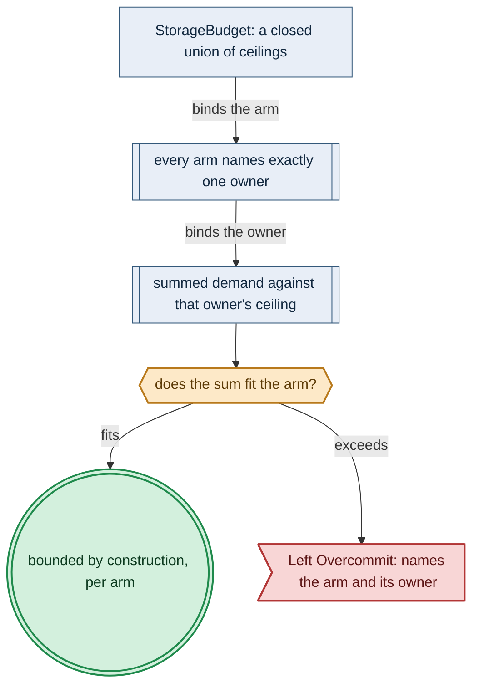

# Resource Capacity Storage Budgets

> **Purpose**: The storage side of the capacity model — the single-owner `StorageBudget` ceiling per arm, the quota-bounded growable arm, and Pulsar's two ceilings.
> **Read this if**: a storage ceiling, a growth policy, or a Pulsar retention bound has to be declared or checked.

This slice of the resource-capacity family carries the budget arms and the rules that bound them. It does
not carry logical-to-physical storage geometry, owned by
[storage_lifecycle_doctrine.md](./storage_lifecycle_doctrine.md), nor the folds that spend these budgets,
owned by [resource_capacity_folds.md](./resource_capacity_folds.md).

<details>
<summary>Link-graph metadata</summary>

**Status**: Authoritative source
**Supersedes**: N/A
**Referenced by**: DEVELOPMENT_PLAN/phase_61_retained_storage.md, DEVELOPMENT_PLAN/phase_63_platform_backbone.md, DEVELOPMENT_PLAN/phase_70_content_store_workflow.md, documents/engineering/README.md, documents/engineering/content_addressing_doctrine.md, documents/engineering/inforcespec_migration_doctrine.md, documents/engineering/platform_services_doctrine.md, documents/engineering/pulsar_client_doctrine.md, documents/engineering/resource_capacity_doctrine.md, documents/engineering/resource_capacity_folds.md, documents/engineering/resource_capacity_sources.md, documents/engineering/resource_capacity_types.md, documents/engineering/storage_lifecycle_doctrine.md, documents/engineering/tenancy_doctrine.md, documents/glossary.md, documents/illegal_state/illegal_state_security.md
**Generated sections**: none

</details>

> **Historical result (invalidated).** Every phase-run or implementation-result statement in this document is permanently invalidated diagnostic history. It cannot establish or reactivate current status, even if a phase later advances. Target doctrine remains normative; current status is solely in the [tracker](../../DEVELOPMENT_PLAN/README.md).

## Contents
- [5. `StorageBudget`: bounded by construction, single-owner ceiling per arm](#5-storagebudget-bounded-by-construction-single-owner-ceiling-per-arm)
- [6. `Growable` / `ScalingPolicy`: the quota-bounded dynamic-provisioning arm](#6-growable--scalingpolicy-the-quota-bounded-dynamic-provisioning-arm)
- [7. Pulsar has two ceilings: the hot tier and the durable total](#7-pulsar-has-two-ceilings-the-hot-tier-and-the-durable-total)
- [Related Documents](#related-documents)

---

## 5. `StorageBudget`: bounded by construction, single-owner ceiling per arm

There is no such thing as "unbounded storage" — storage is *either* host-level (bounded by a
physical disk) *or* cloud (bounded by a quota). amoebius encodes that as a **closed union with no unbounded arm**, so "unbounded storage" (I9) has no syntax.

```text
StorageBudgetOwner =
  < RetainedBacking    : BackingId
  | ProviderObjectQuota: ProviderStorageQuotaId
  >

ProviderObjectQuotaRef = StorageQuota

StorageGrowthQuota =
  < RetainedHostCeiling :
      { backing   : BackingId
      , maxRawBytes : Quantity Bytes
      }
  | ProviderVolumeQuota :
      { account        : CloudAccountId
      , maxRawBytes    : Quantity Bytes
      , maxVolumeCount : PositiveNatural
      }
  >

StorageScalingPolicy backing =
  { backing       : backing
  , growAbove     : UtilizationThreshold
  , shrinkBelow   : UtilizationThreshold
  , stepRawBytes  : Quantity Bytes
  , cooldown      : FiniteDuration
  , quota         : StorageGrowthQuota
  , target        :
      < AllocateWithinExistingRetainedCarve
      | ProviderVolumePool :
          { volumeType : ProviderVolumeType
          , zones      : NonEmpty Zone
          , allocation : BackingAllocationPolicy
          }
      >
  , shrinkMode    : VerifiedCreateMigrateCutoverRetainOldOnly
  , sourceEquality:
      StorageBackingAccountQuotaTargetPolicyEqualityWitness
  }

ProvisionedStorageDemandProjection =
  < VolumeBacking :
      { requiredUsableBytes : Quantity Bytes
      , requiredRawBytes    : Quantity Bytes
      , volumeCount         : PositiveNatural
      , sourceEquality      :
          ProvisionedVolumeStorageDemandPresentationAllocationEqualityWitness
      }
  | ProviderObjectQuota :
      { quota          : StorageQuota
      , bytes          :
          ProviderObjectByteAmount quota.accounting (Quantity Bytes)
      , objectCount    : PositiveNatural
      , accountingWitness:
          ProviderObjectLogicalPeakToSelectedAccountingByteAndCountDerivationWitness
      , sourceEquality :
          ProvisionedObjectStorageDemandQuotaAccountingByteCountEqualityWitness
      }
  >

ProvisionedStorageScalingEnvelope = -- private, policy-only ProvisionedSpec projection
  { budget           : StorageBudgetId
  , backing          : BackingId
  , policy           : StorageScalingPolicy backing
  , desiredDemand    : ProvisionedStorageDemandProjection
  , sourceEquality   :
      StorageBudgetBackingFinitePolicyDemandProjectionEqualityWitness
  }
-- This envelope contains no observed utilization, current allocation, concrete transition, or cloud action.
-- Those values can only be derived later from a fresh ObservedStorageScalingSnapshot.

StorageScalingTransition =
  < NoChange
  | AllocateWithinRetainedCarve :
      { additionalRawBytes : Quantity Bytes
      , residualWitness    : RetainedCarveResidualCapacityWitness
      }
  | CreateProviderCapacity :
      { actionBatch   : ProvisionedStorageCapacityCloudBatch
      , addedRawBytes : Quantity Bytes
      , addedVolumes  : PositiveNatural
      }
  | ShrinkByVerifiedMigration :
      { migration       : ProvisionedStorageMigration
      , oldRetained     : Required
      , automaticReclaim: Forbidden
      }
  >

StorageScalingPlanId =
  { deployment : DeploymentId
  , generation : ProvisionGenerationDigest
  , budget     : StorageBudgetId
  , snapshot   : InventoryFingerprint
  }

ProvisionedStorageScalingPlan = -- private reconcile-time result, never a ProvisionedSpec field
  { id              : StorageScalingPlanId
  , envelope        : ProvisionedStorageScalingEnvelope
  , currentRawBytes : Residual Bytes
  , desiredRawBytes : Residual Bytes
  , transition      : StorageScalingTransition
  , quotaProjection : StorageGrowthQuotaHighWaterWitness
  , observation     : InventoryFingerprint
  , sourceEquality  :
      StoragePlanIdEnvelopeSnapshotCurrentDesiredTransitionQuotaEqualityWitness
  }

ObservedStorageScalingSnapshot =
  { budget          : StorageBudgetId
  , backing         : SharedVolumeBackingSupply
  , allocations     : Map BackingAllocationId VolumeBackingAllocation
  , allocationKeys  : StorageScalingAllocationMapKeyEmbeddedIdentityEqualityWitness
  , providerAccount : Optional ObservedProviderAccount
  , fingerprint     : InventoryFingerprint
  , sourceEquality  :
      StorageScalingVolumeBackingAllocationProviderWholeSnapshotEqualityWitness
  }

StorageScalingActionTokenState = < Fresh | Consumed >
SingleUseStorageScalingActionToken state =
  { plan        : StorageScalingPlanId
  , snapshot    : InventoryFingerprint
  , nonce       : ContentAddress
  , state       : state
  }

ValidatedStorageScalingAction = -- opaque, snapshot-bound and single-use
  { plan             : ProvisionedStorageScalingPlan
  , observed         : ObservedStorageScalingSnapshot
  , capability       : StorageScalingMutationCapability plan.transition
  , immediateRecheck : SameStorageSnapshotBeforeMutationRequirement
  , singleUse        : SingleUseStorageScalingActionToken Fresh
  , equality         :
      StorageScalingPlanObservationCapabilitySnapshotEqualityWitness
  }

planStorageScaling
  :: ProvisionedStorageScalingEnvelope
  -> ObservedStorageScalingSnapshot
  -> Either ProvisionError ProvisionedStorageScalingPlan

StorageScalingCloudObservation transition =
  < NotRequired :
      { transitionArm : transition != CreateProviderCapacity }
  | Required :
      { transitionArm : transition == CreateProviderCapacity
      , snapshot      : ObservedCloudInfrastructureSnapshot
      }
  > -- private constructor; a non-cloud transition cannot demand a cloud account, and a provider create
    -- cannot validate without the exact cloud snapshot.

validateStorageScalingAction
  :: ProvisionedStorageScalingPlan
  -> StorageScalingCloudObservation plan.transition
  -> ObservedStorageScalingSnapshot
  -> Either ProvisionError ValidatedStorageScalingAction

StorageScalingTransitionCloudTokenConsumption transition =
  < NoCloudMutation :
      { required : transition != CreateProviderCapacity }
  | CreateProviderCapacity :
      { batch      : CloudActionBatchId
      , tokens     : NonEmptyMap
          CloudProviderActionId (SingleUseCloudMutationToken Consumed)
      , tokenKeys  :
          StorageScalingConsumedCloudTokenDomainEqualsTransitionBatchActionDomainWitness
      }
  > -- private constructor requires the selected arm to equal transition

StorageScalingEnactmentResult =
  { plan       : StorageScalingPlanId
  , singleUse  : SingleUseStorageScalingActionToken Consumed
  , cloudTokens:
      StorageScalingTransitionCloudTokenConsumption plan.transition
  , observed   : ObservedStorageScalingSnapshot
  , consumptionCas : StorageScalingFreshToConsumedCompareAndSwapWitness
  , equality   : StorageScalingPlanConsumedTokenPostObservationEqualityWitness
  }

StorageBudget =
  < Fixed :
      { id : StorageBudgetId, backing : BackingId, ceiling : Quantity Bytes }
  | QuotaCapped :
      { id : StorageBudgetId, quota : ProviderObjectQuotaRef }
  | Growable :
      { id         : StorageBudgetId
      , backing    : BackingId
      , policy     : StorageScalingPolicy backing
      }
  >
-- storageBudgetOwner is a total projection: Fixed/Growable -> RetainedBacking; QuotaCapped ->
-- ProviderObjectQuota. Invalid owner/arm products have no constructor.
```

- **Scaling is observe-then-plan, never a speculative `ProvisionedSpec` transition.** The sealed spec stores
  only `ProvisionedStorageScalingEnvelope`: policy, maximum growth, and the exact desired-demand projection.
  Reconcile derives current allocation/utilization from a complete, fingerprinted
  `ObservedStorageScalingSnapshot`, then `planStorageScaling` produces the concrete transition. Validation
  re-reads that snapshot, joins any provider-volume transition to its batch-owned Pulumi execution and
  account quota, and mints a fresh plan-id-indexed token. Enactment CAS-consumes that token and returns a
  post-effect observation. `ObservedCloudInfrastructureSnapshot` is required only by the
  `CreateProviderCapacity` arm; `NoChange`, retained-carve allocation, verified migration, and an ordinary
  host-only live deployment carry the private `NotRequired` observation arm and never fabricate a non-empty
  cloud account map. An empty allocation map is a valid zero-current state.
- **No unbounded constructor** — the union shape is type-foreclosed: a value cannot denote unbounded storage. This is
  the storage-side reading of the illegal-state contract. The two types are distinct and pair: **`StorageBudget`**
  (this doc) is the *policy-wrapped ceiling* — the declared limit and its growth policy — while the closed
  **`StorageBacking`** union (host-disk-bounded | EBS-bounded | cloud-quota-bounded), the *physical backing* each
  budget arm resolves to, is owned by
  [storage_lifecycle_doctrine.md §5.2](./storage_lifecycle_doctrine.md#52-the-storage-backing-is-bounded--the-closed-storagebacking-union). This doc owns the *aggregate
  arithmetic*: after [§5.1](#51-durable-demand-is-logical-first-physical-only-after-geometry) converts logical
  intent into physical placement and a uniform claim plan, the [§4](./resource_capacity_folds.md#4-the-total-fold-fits-carve-place-and-the-nesting)
  fold checks that plan against the `StorageBacking` the `StorageBudget` names (or the provider-object quota's
  explicitly selected logical-or-billed byte accounting arm plus object-count ceiling).
- **Single-owner ceiling per arm.** Each arm names exactly one owner of its ceiling number, so "available
  storage" has one definition: a **host-disk** arm's ceiling is owned by
  [storage_lifecycle_doctrine.md](./storage_lifecycle_doctrine.md) (the retained-PV host root) and, for the
  content store, [content_addressing_doctrine.md](./content_addressing_doctrine.md) (the MinIO backing); a
  **cloud** arm's ceiling is the quota owned by [pulumi_iac_doctrine.md](./pulumi_iac_doctrine.md). The
  aggregate fold `Σ(sizes) ≤ backing` (I10) reads whichever owner the arm names.
- **Budgets are attached operands, not a free-standing abstraction.** `BoundDeployment` carries a unique
  `StorageBudgetId → StorageBudget` inventory. Every app/content bucket, registry tenant, Pulsar offload
  topic, Pulumi checkpoint stack, control-plane-state namespace, Patroni SQL consumer, and MinIO tenant-policy
  system-metadata demand contains a required `StorageBudgetId`;
  binding resolves it exactly once and proves the budget owner's backing/quota is the one the provider shape
  selected. Missing, duplicate, wrong-account, or wrong-backing references reject before producer merging.
  The same normalized demand can be checked against `Fixed`, `QuotaCapped`, or policy-owned `Growable`, but
  no arm may silently switch owners. For MinIO system metadata this join is explicit:
  `resolveMinioSystemMetadataStores` first groups the complete all-tenant inventory by
  `(store,budget,geometry,model)`, then requires every group for one store to equal the topology-selected
  store-global model and combines it with this exact inventory and `Topology`. It accepts only
  a `RetainedBacking` owned by that MinIO store and constructs private
  `ResolvedMinioSystemMetadataStoreDemand`s; `ProviderObjectQuota` returns `Left
  UnsupportedTenantPolicyProviderObjectQuota` because a provider object-store policy requires a separate future
  demand/supply arm. Only the retained resolved types can enter provisioning and construct budget witnesses.
- **Both MinIO and Pulsar fold against a `StorageBudget`.** An app's object usage (`<app>/<bucket>` MinIO
  buckets) and a topic's retained bytes ([§7](#7-pulsar-has-two-ceilings-the-hot-tier-and-the-durable-total))
  each contribute a logical storage `Demand`; [§5.1](#51-durable-demand-is-logical-first-physical-only-after-geometry)
  expands it before the common [§4](./resource_capacity_folds.md#4-the-total-fold-fits-carve-place-and-the-nesting) backing fold. "An app that can consume more storage than is available" (I10) is therefore
  rejected by a total post-bind provisioning fold for both — never type-`unrepresentable`, per
  [§2](./resource_capacity_doctrine.md#2-the-load-bearing-honesty-limit-a-capacity-sum-is-a-decode-foreclosed-check-never-type-foreclosed).

### 5.1 Durable demand is logical first, physical only after geometry

`StorageBudget` is expressed in application-visible bytes, but a retained disk is consumed by physical
replicas, erasure shards, metadata, recovery work, filesystem overhead, and backing allocation granularity.
The fold therefore has explicit pure stages; it never compares a logical sum directly with a physical PV:

```text
bookKeeperPhysicalDemand
  :: BookKeeperGeometry
  -> BookKeeperLogicalDemand
  -> Either ProvisionError (Map BookieId (Quantity Bytes))

contentStoreLogicalPeak
  :: ContentStoreLogicalDemand
  -> Either ProvisionError ProvisionedObjectStoreLogicalPeak

provisionObjectStoreProducer
  :: ObjectStoreProducerDemand
  -> Either ProvisionError ProvisionedObjectStoreLogicalPeak

mergeObjectStoreLogicalPeaks
  :: NonEmpty ProvisionedObjectStoreLogicalPeak
  -> Either ProvisionError ProvisionedObjectStoreLogicalPeak

deriveTenantPolicies :: TenantSpec -> TenantPolicyDerivation

planTenantPolicyTransitions
  :: ObservedTenantPolicyWholeDeploymentSnapshot
  -> Map TenantId TenantPolicyDerivation
  -> Either ProvisionError TenantPolicyWholeDeploymentInventory

resolveMinioSystemMetadataStores
  :: BoundDeployment
  -> Topology
  -> TenantPolicyWholeDeploymentInventory
  -> Either ProvisionError (Map ObjectStoreId ResolvedMinioSystemMetadataStoreDemand)

bindTenantPolicyInventory
  :: BoundDeployment
  -> Topology
  -> TenantPolicyWholeDeploymentInventory
  -> Either ProvisionError BoundDeployment

provisionMinioSystemMetadataStore
  :: ResolvedMinioSystemMetadataStoreDemand
  -> Either ProvisionError ProvisionedMinioSystemMetadataStoreDemand

minioPhysicalDemand
  :: MinioErasureGeometry
  -> ProvisionedObjectStoreLogicalPeak
  -> ProvisionedMinioSystemMetadataStoreDemand
  -> Either ProvisionError ProvisionedMinioPhysicalDemand

ObservedLiveResourceSnapshot =
  { inventory        : ObservedInventory
  , storageScaling   : Map StorageBudgetId ObservedStorageScalingSnapshot
  , storageKeys      :
      ObservedLiveStorageScalingMapKeyEmbeddedBudgetEqualityWitness
  , cloud            : Optional ObservedCloudInfrastructureSnapshot
  , fingerprint      : InventoryFingerprint
  , sourceEquality   :
      LiveInventoryStorageScalingOptionalCloudWholeSnapshotEqualityWitness
  }
-- storageScaling may be empty and cloud may be None. inventory is always present. The cloud arm is required
-- exactly when a derived provider-capacity action needs it; host-only validation still has the complete
-- observed inventory and any retained/migration storage snapshots needed to build ValidatedLiveTarget.

planAndValidateStorageScaling
  :: ObservedLiveResourceSnapshot
  -> ProvisionedSpec
  -> Either ProvisionError (Map StorageScalingPlanId ValidatedStorageScalingAction)

validateLiveTarget
  :: ObservedLiveResourceSnapshot
  -> ProvisionedSpec
  -> TenantPolicyWholeDeploymentInventory
  -> Either ProvisionError ValidatedLiveTarget

presentAndAllocateVolumes
  :: Map StatefulSetClaimSlot (Quantity UsableBytes)
  -> Map StatefulSetClaimSlot (VolumePresentation, StorageBacking)
  -> Either ProvisionError (Map StatefulSetClaimSlot ProvisionedVolumeDemand)

uniformStatefulSetClaims
  :: Map StatefulSetClaimSlot ProvisionedVolumeDemand
  -> Either ProvisionError (NonEmpty UniformClaimPlan)
```

#### BookKeeper replication/quorum

A legal `BookKeeperGeometry` proves
`ackQuorum ≤ writeQuorum ≤ ensembleSize ≤ numberOfBookies`, proves bookie ids and claim slots are injective,
and assigns each backing debit one owner. The logical hot peak is retained hot bytes plus
the open-ledger, in-flight-offload, and deletion-lag terms from [§7](#7-pulsar-has-two-ceilings-the-hot-tier-and-the-durable-total).
All four quantities are required positive fields; there is no zero/omitted arm that can erase headroom.
The version-pinned placement function divides that peak into bounded ledger segments and places every entry
on exactly `writeQuorum` distinct bookies selected from its ensemble. Thus the steady payload sum is at
least `logicalHotPeak × writeQuorum`, before journal/index reserve; `ackQuorum` is an acknowledgement rule,
never a storage multiplier. The returned witness is a **per-bookie map**, not
`logicalHotPeak × writeQuorum / numberOfBookies`: it preserves segment rounding and placement skew. The
fault policy declares only `maxSimultaneousUnavailableBookies`; callers cannot hand-pick a favorable list of
scenarios. The solver derives **every** non-empty bookie subset up to that cardinality, removes it, restores
the write-quorum copy count on eligible survivors, and records the peak while replacement copies and
not-yet-reclaimed originals coexist. The witness carries the derived scenario set and a completeness proof
against the topology/fault-policy product. Each bookie's required bytes are the maximum of steady placement
and every recovery placement, plus its journal/index reserve. If any quorum relation, required scenario,
placement, or individual bookie backing fails, provisioning returns `Left`; an aggregate that fits while
one bookie overflows is not a witness.

#### Content-store write peak and orphan lifetime

`committedResident` is an exact
`Map ObjectStoreObjectId storedBytes` covering every immutable object still retained by policy across every
tenant/bucket, not merely the object reachable from today's `latest` pointer. The identity includes the
object store, tenant, bucket, and full key. Equal physical ids debit once; unequal byte metadata for one id
rejects. The same content digest under two namespaces is two physical objects unless the selected store
supplies a separately modeled physical-dedup witness. A caller-authored count or digest-only map cannot
stand in for resident identity.
`ObjectStoreRetentionBudget.maxAdditionalResidentExtents` bounds successful future growth by object
count/size class and a finite retention; it is not a scalar byte cap. An `ObjectStoreWriteBudget` separately
declares a maximum number of concurrent write sets, the maximum
object extents in one as-yet-unknown write set, and an `ObjectStoreFailureBudget` with finite failed-write
rate window and mandatory finite `orphanGcHorizon`. `contentStoreLogicalPeak` retains the exact resident map, the future-resident extent
bound, and a private transient extent multiset for
`maxConcurrentWriteSets × maxWriteSet +
ceil(orphanGcHorizon / failureWindow) × maxFailedWriteSetsPerWindow × maxWriteSet`; its scalar
`derivedPeak` is explanatory/interim accounting, never the input to per-object erasure geometry.
The last term is necessary because blob/manifest PUTs can succeed before a pointer CAS fails; those bytes
are physical residents until GC actually deletes them. There is no zero-duration or "GC immediately" arm.
Live admission starts from all observed resident bytes, including existing orphans and incomplete multipart
writes, then adds the new concurrent-write and full-horizon failure exposure. It credits reclamation only
after a fresh observation proves deletion. `mergeObjectStoreLogicalPeaks` unions resident identities with
size-conflict rejection and concatenates concurrently live future/transient extents, preserving
app/content/registry/Pulsar/Pulumi/control-plane-state tenants before MinIO placement. The merge retains an
identity-keyed admission witness for every producer/writer and rejects duplicate writer ids with
conflicting policy; dropping one witness is invalid. The sole mutating object-write gateway authenticates
each snapshot-bound writer
capability and enforces that writer's physical object identity, count/size class, retention slots,
concurrency, and bucket aggregate quota. Direct S3 PUT
credentials/routes are denied; a mutation outside the gateway cannot silently invalidate the peak.

#### The MinIO producer inventory is closed

Binding walks the expanded deployment and emits one
`ObjectStoreProducerDemand` for every app bucket, content namespace, registry backend, Pulsar offload topic,
Pulumi checkpoint stack, and control-plane-state namespace; equality between the six-arm source inventory
and producer inventory is checked, so omission is not an optimization. `PulsarOffload` derives object
count/stripe inputs from retained bytes,
ledger segment size, offload concurrency, maximum segments per finite rate window, deletion lag, explicit
failure/orphan horizon, and its pinned object model rather than sending a retained-byte scalar into MinIO;
lag exposure is
`ceil(deletionLag/offloadWindow) × maxSegmentsPerWindow` structured segment extents.
`PulumiCheckpoint` derives canonical plaintext and encryption-envelope overhead per exact state field,
old+new update overlap, explicit failed-partial/orphan exposure, and retained revisions from the exact
state-entry set and pinned checkpoint model; ciphertext bytes are not a caller field.
`ControlPlaneState` accepts only the closed
`InForceSpecSnapshot | ManagedResourceRegistry | ReconcileJournal | ValidationLedger | JobCompletion`
identities and
derives canonical encoding plus Vault-Transit envelope overhead, retained old/new CAS versions, failed
writes, and orphan exposure from its pinned model. “Every other byte” is not a producer kind: adding
another persistent control-plane record requires extending the closed union and its capacity tests.
Each arm produces a `ProvisionedObjectStoreLogicalPeak`; only then are all exact physical ids and structured
future/transient extents merged and sent to per-object MinIO geometry.

#### Derived tenant policy state is a required persistence input

[`tenancy_doctrine.md §5`](./tenancy_doctrine.md#5-rbac-is-derived-never-authored)'s
`deriveTenantPolicies :: TenantSpec -> TenantPolicyDerivation` is the only tenant-policy source. It remains
pure: it returns exact Keycloak/Vault/Pulsar/MinIO/Network/Postgres outputs with canonical bytes and normalized content
digests, apply intents, executor intents, and persistence operands, but no supply, concrete execution target,
placement, capacity witness, or observed old state. `TenantPolicyExecutorIntent.attachment` has only
`Dedicated | SharedControlPlaneRole`; there is no pure `ExecutionUnitId` arm. Every nested
`source` must equal `TenantPolicyDerivation.source`; every map key must equal its nested `identity`/`output`;
Each `DesiredTenantPolicyProjection` arm fixes provider, payload, target, and persistence type together;
provider-filtered outputs, apply intents, executor action sets, and the pinned provider projection must be
exact key-set joins rather than equal-cardinality checks. Thus a wrong digest, swapped key,
extra persistence entry, map-key/nested-id mismatch, omitted action, or omitted executor returns respectively
`Left PolicySourceDigestMismatch`, `Left PolicyKeySetMismatch`, `Left UnexpectedPolicyPersistence`, `Left
PolicyNestedIdentityMismatch`, `Left MissingPolicyAction`, or `Left MissingPolicyExecutor` before effects.
Every Keycloak output contributes its exact `SchemaObjectDemand`s
and derived WAL high-water to
the selected Keycloak `PatroniSqlDemand`; every Vault output contributes its exact
`VaultPersistedObjectDemand`s and Raft log/snapshot churn to `VaultStorageDemand`; every Pulsar output
contributes its exact `ZooKeeperMetadataEntryDemand`s and transaction-log/snapshot churn to
`ZooKeeperMetadataStoreDemand`; and every Kubernetes API object and update contributes to the deployment's
`KubernetesApiObjectDemand`/`EtcdLogicalDemand`. Derived Postgres grants contribute exact schema/grant objects
and WAL mutation high-water to the selected application `PatroniSqlDemand`; SQL authorization is not hidden
inside the Keycloak arm.

Binding is plural and exhaustive, never one tenant at a time. `planTenantPolicyTransitions` constructs the
exact `TenantPolicyWholeDeploymentInventory`; `bindTenantPolicyInventory` consumes it once, resolves abstract
attachments against the base `BoundExecutionSet`, and groups every tenant's complete resource delta by
resolved `ExecutionUnitId`. The delta algebra covers every Pod or host `ResourceEnvelope` axis; keyed shared
extents union only on equal model/backing, numeric axes add, arm mismatches reject, and merge is proven
associative with an explicit empty identity. A shared target's deltas are summed and its base
control-plane daemon/controller is replaced exactly once; a dedicated target supplies one complete seed before its
delta is applied. Observed executor commitments live in one deployment-global target map with tenant
memberships, never copied under every tenant. `ProvisionedTenantPolicyPersistence` stores private
`ProvisionedTenantPolicyExecutionRef`s plus provider-indexed sealed output/action maps, exact old/new targets,
provider commands, snapshot preconditions, and capacity/coalescing witnesses; it never stores
`BoundTenantPolicyExecutionTarget` or another binder-stage value. The positive two-tenant/shared-role case
proves one target, two deltas, and one base debit. Duplicate dedicated target, uncoalesced shared delta, and
double-base mutants return respectively `Left DuplicateTenantPolicyExecutionTarget`, `Left
UncoalescedTenantPolicyExecutionDelta`, and `Left TenantPolicyBaseExecutionDoubleDebit` before effects.

MinIO IAM, service-account, and bucket-policy records are **storage-system metadata**, not application objects
and do not add a seventh `ObjectStoreProducerDemand` arm. The global binder groups all raw tenant demands by
exact `(store,budget,geometry,model)`, uses `(TenantId, outputId)` and
`(TenantId, metadataId)` identities, unions identities, and structurally merges concurrency/failure journal
extents before resolving supply. Every group for one store must equal the topology-selected store-global
metadata model. `ResolvedRetainedMinioBudgetSupply` accepts only a retained backing owned by
the selected MinIO store; `ProviderObjectQuota` returns `Left UnsupportedTenantPolicyProviderObjectQuota`
because provider object-store policy persistence needs a distinct future demand/supply arm. All resolved
groups for one store enter `provisionMinioSystemMetadataStore` and the store's single
`minioPhysicalDemand` call together. Observed and desired stores both retain the static reserve, dynamic
groups, geometry, model, and per-drive maps. Static `metadataReservePerDrive` is added once per store, and
each dynamic group once; the resulting `ProvisionedMinioPhysicalDemand` is stored under
`ProvisionedTenantPolicyPersistence.minioPhysical` rather than discarded. A split/unmerged group returns
`Left TenantPolicyMinioGroupMismatch`; a model mismatch or static/dynamic drop or
double-add returns `Left MinioMetadataComponentMismatch`.

Reconcile obtains one `ObservedTenantPolicyWholeDeploymentSnapshot` only through read-only provider
observers. Each tenant state carries its outer `TenantId`; every observed realization carries source,
action, executor, provider-indexed payload/persistence, target, digest, version, and active/old/new/delete
lifecycle. The global executor and MinIO maps are joined once. The transition domain is
`keys(observed tenants) ∪ keys(desired tenants)`: an old-only tenant produces authenticated Delete actions,
so deleting the final tenant is representable, while two empty maps produce the explicit platform-only
zero case. `Create`, `Replace`, `Delete`, and `NoOp` are tagged payload arms, not an operation crossed with
optional old/new fields. `NoOp` requires equal identity, provider, target, and normalized digest; byte count
and provider version are not semantic equality. A changed digest is `Replace`, and target changes preserve
separate old/new target-keyed high-water rows until observed cleanup.

The private all-tenant transition inventory charges old+new Keycloak and Postgres data/WAL, Vault
persisted/Raft logs/snapshots, ZooKeeper entries/logs/snapshots, MinIO static/dynamic
metadata/journals, API objects/revisions, and old/new executor overlap. Failed apply and rollback residents
remain charged through declared retention until cutover and cleanup readback proves removal. `provision`
seals the exact provider payloads and commands; `validateLiveTarget` checks their snapshot
preconditions and exposes only a `TenantPolicyActionKey → ValidatedTenantPolicyAction` map to the provider
enactor. Live readback checks normalized content digests, target-keyed coalesced execution/base debit,
exact provider/store identities, store-global MinIO static/dynamic/physical components, and cleanup. Missing
tenant/source/action/executor provenance, cross-tenant key swaps, invalid action shapes, discarded payloads,
absent zero/final-delete arms, target/model changes without old+new high-water, and one-short/drop/double-add
mutants all reject before effects.

#### Pulumi execution itself is provisioned

The exact independent/dependent deploy graph and bounded
applicative concurrency construct `PulumiExecutionDemand`; every referenced plugin joins digest/installed/
peak-install metadata, and a versioned model derives per-executor pod CPU/memory/ephemeral/log/image
envelopes plus plugin-cache and working-directory/checkpoint temporary peaks on typed disk-backed volumes.
That unprovisioned demand and its derived executor `PodResourceEnvelope`s enter `BoundDeployment` before any
provider/checkpoint mutation. For initial infrastructure, `planInfrastructure` alone constructs the
`ProvisionedPulumiExecutionDemand` under the one generic `ProvisionedProviderActionBatch`; the final Kubernetes
`ProvisionedSpec` does not have to exist circularly before its cluster. For later scaling, the spec retains
only finite policy/demand envelopes and fresh reconcile planning constructs another batch. In both paths
batch validation reruns the executor, explicit cache, plugin/workspace backing, pod/CNI/CSI-slot, and live-
commitment fit before exposing per-action tokens. Cloud quota or child capacity fitting is insufficient
when the parent executor or any local backing is short.

#### Admission gateways are resource-bearing execution units

The controller-child webhook, registry,
generic object-write, SQL-mutation, and monitoring-query admission cost models derive complete proxy/gateway pod
envelopes—including image,
CPU/memory/ephemeral requests and limits, logs, replicas, and transition overlap—from their admitted
concurrency/rate/metadata operands. Binding inserts those envelopes into `BoundDeployment` before
`provision`; their compute/storage is placed like any other pod and cannot be hidden inside the witness.
Saturating a gateway or dropping its envelope is a capacity-test failure.

#### MinIO erasure coding and healing

Each logical object extent is assigned to one named erasure set by a
deterministic placement witness. For an object of `b` bytes, an erasure set with `d` data shards, `p` parity
shards, and shard block `q` reserves the conservative encoded extent
`ceilDiv(b, d × q) × (d + p) × q`; calculating this per object extent preserves small-object/stripe padding
that an aggregate-byte multiplier would lose. One shard is charged to each selected drive, then the static
`metadataReservePerDrive`, the store-global merged dynamic tenant-policy metadata peak, and healing
workspace are each added exactly once **per store physical call**, not once per tenant/group. Here too the
input is a finite fault policy, not an
editable scenario list: the solver derives every unavailable-drive subset up to
`maxUnavailablePerErasureSet` for every erasure set **and the Cartesian products of those subsets across simultaneously healing sets**, proves that bound is supported by `parityShards` and the named
replacement-drive pool, proves every active/replacement drive id and claim slot is distinct, and assigns
every backing debit one owner before reconstructing under the same pinned geometry and recording the peak while
old, reconstructed, and workspace bytes coexist. The witness includes a completeness proof for those
derived scenarios. The final witness exposes the disjoint payload/static/dynamic/healing components and their
per-drive maximum across steady and healing states, and every
active/replacement drive/PV must fit independently. A dropped failure case or a total physical sum divided
evenly across drives is invalid.

#### Presentation and allocation happen before template uniformity

The BookKeeper/MinIO maps are required
**usable** per-slot bytes, not authorable PV sizes. `presentAndAllocateVolumes` joins every slot to its
`DeclaredVolumeDemand`, applies its `Block | Filesystem` model (including metadata, journal, reserved blocks,
and recovery-safe free-space policy), then rounds raw bytes to the backing's non-zero minimum/quantum. A
filesystem-model version or backing policy omitted from the join, two policies for one template, or an
author-supplied `provisionedBytes` rejects.

#### Uniform claim templates, and why the debit rounds up

Every bookie
and MinIO active/replacement drive maps injectively to a
`(statefulSet, volumeClaimTemplate, ordinal)` slot. Kubernetes emits the same requested capacity for every
ordinal produced by one `volumeClaimTemplate`; it cannot render unequal provisioned per-slot values.
`uniformStatefulSetClaims` therefore groups slots by `(statefulSet, template)`, retains the complete
slot→private-`ProvisionedVolumeDemand` map, preserves one identical presentation/allocation policy, sets
`requiredUsableBytes` and `provisionedBytes` to their respective group maxima (rechecking the latter can
supply every member), and renders the exact rounded `provisionedBytes` on every claim/PV. It derives
`perBackingDebit[backing] = provisionedBytes × count(members on backing)` from member identities and checks
every named backing independently; there is no single editable `totalBackingDebit` that can erase ownership.
The padding on smaller ordinals remains reserved;
the fold may not debit only the unequal raw sum or let spare bytes on one backing cover a short member on
another. A service that genuinely needs different claim sizes must
use distinct typed claim templates/StatefulSets, never silently vary one template by ordinal. Duplicate or
missing slot mappings, incompatible presentation/allocation policies, a usable per-slot requirement above
the group witness, or a backing that fits the pre-presentation map but not the rounded uniform plan returns
`Left` before render.

#### Storage replacement/shrink is an old+new transition, never an in-place capacity credit

dhall-typecheck and
`ClusterIR` carry `StorageMigrationIntent`; gadt-decode validates its raw source arm and brands it as an opaque
`PriorVolumeProvisionRef`, and the lifecycle expander constructs an unprovisioned `StorageMigrationDemand`
from that ref, the replacement's logical demand, and a structural copy policy. `provision` resolves the ref
from the exact prior
`ProvisionedSpec` in `ProvisionContext`, then presentation-rounds the replacement and derives
copy/verification workspace plus a complete copy/verify Job pod envelope (image, CPU/memory/ephemeral
requests/limits, logs, writable root, and transition overlap) from chunk size/concurrency and the pinned
model, places that execution unit, and checks
`old provisioned allocation + new provisioned allocation + migration workspace` per named backing plus
provider byte/volume-count overlap before create. The private `ProvisionedStorageMigration` retains all
three identities. Retiring the old binding does not reclaim its backing: old bytes/count remain a live
commitment until a fresh external observation proves privileged deletion. A desired smaller value or
retire step can never be spent as advance capacity credit.

#### Registry rehome and database schema change obey the same transition rule

A filesystem→MinIO registry
intent expands to an unprovisioned `RegistryBackendMigrationDemand`; after resolving its opaque prior ref,
`provision` derives a complete digest→target-object map and a
transfer/verification pod, fits source+target+workspace, then proves every pre-existing artifact readable by
digest after atomic cutover. A raw `SchemaMigrationIntent` expands to `SchemaMigrationDemand` from exact
old/new database object identities; `provision` derives table/index overlap, temporary workspace, WAL, and
the executor pod. Neither
transition deletes or discounts its old representation on failure; reclamation begins only after verified
cutover and observed cleanup.

#### Provider S3 is a different supply arm

The content-store logical peak still includes committed,
in-flight, and orphan bytes, but a provider-S3 quota is checked in its exactly selected, pinned-model
logical-or-billed byte unit plus object count; amoebius does not invent a physical erasure geometry the
provider does not expose. The selected amount is a private derivation from the exact provisioned object set:
the `Logical` arm applies its canonical size model and the `Billed` arm applies its explicit witnessed
logical-to-billed conversion. A caller cannot author the comparison scalar. The MinIO arm is the one
that must return the physical per-drive witness above.

---


*Design intent, Tier-1 decode-foreclosed. Single ownership is what makes the sum decidable: with two owners drawing on one ceiling there is no total to check. There is no unbounded arm to select, which is the property [§5](#5-storagebudget-bounded-by-construction-single-owner-ceiling-per-arm) states. Vocabulary: [diagram_conventions.md](./diagram_conventions.md).*

## 6. `Growable` / `ScalingPolicy`: the quota-bounded dynamic-provisioning arm

Bounded capacity would be overly restrictive if it could never grow — but growth must be *amoebius's
decision under a typed policy*, never a blank "unbounded." So the **only** way a `Budget` exceeds a fixed cap
is a `Growable` arm carrying the policy for that resource family: compute/node supply carries
`ScalingPolicy`, while `StorageBudget.Growable` carries the backing-indexed `StorageScalingPolicy`. Each
policy's outer bound is a finite host/provider quota — never truly unbounded; a worker-node policy cannot be
cross-paired with a storage backing.

```text
Growable = Bounded Capacity | Autoscaled ScalingPolicy
StorageGrowable backing = AutoscaledStorage (StorageScalingPolicy backing)

ScalingEngineArm =
  < Rke2Agent
  | ProviderManagedWorker
  >

UtilizationThreshold =
  { basisPoints : Natural
  , atMost10000 : Required
  }

ScalingSignal =
  < Load :
      { axis       : < Cpu | Memory | PodSlots | Storage | Accelerator >
      , growAbove  : UtilizationThreshold
      , drainBelow : UtilizationThreshold
      , hysteresis : growAbove.basisPoints > drainBelow.basisPoints
      , window     : FiniteDuration
      }
  | WorkflowCompletion :
      { workflowClass : WorkflowClassId
      , growWhile     : WorkflowActive
      , drainAfter    : WorkflowCompleted
      }
  >

ScalingPolicy =
  { account          : CloudAccountId
  , engine           : ScalingEngineArm
  , candidates       : NonEmptyMap CandidateClassId ProviderNodeClass  -- `CandidateNodeClass` elsewhere is
                                                                       -- an alias for this same record
  , candidateKeys    : CandidateNodeClassKeyEqualityWitness
  , signals          : NonEmpty ScalingSignal
  , priceCeiling     : Price
  , quota            : ProviderQuota
  , maxTotalInstances: PositiveNatural
  , scaleStep        : PositiveNatural
  , cooldown         : FiniteDuration
  , quotaProjection  : ScalingPolicyWorstCaseQuotaProjectionWitness
  }
-- ProviderNodeClass carries name/sku/allocatable/quotaVcpu/zones/price/baseCount/maxCount. Provision derives
-- node-root EBS bytes/count and accelerator count/VRAM costs from its complete capacity template; callers
-- cannot author a cheaper parallel quota vector.

Rke2AgentScalingPolicy = -- opaque refinement
  { policy          : ScalingPolicy
  , engineEquality  : policy.engine == Rke2Agent
  , candidateArms   : EveryCandidateUsesRke2AgentReserveTemplateWitness
  }

ProviderWorkerScalingPolicy account nodeClasses quota = -- opaque refinement
  { policy             : ScalingPolicy
  , engineEquality     : policy.engine == ProviderManagedWorker
  , accountEquality    : policy.account == account
  , candidateProjection:
      PolicyCandidatesExactlyProjectManagedNodeClassesWitness nodeClasses policy.candidates
  , quotaEquality      : policy.quota == quota
  }
```

- **No bare-unbounded arm** (type-foreclosed union shape): "grow without limit and without a policy" (I12) has no
  constructor. `Autoscaled` *requires* a `ScalingPolicy`.
- **A policy is not a pre-authorized create.** `ProvisionedSpec` retains the finite policy and candidate
  envelopes. A concrete managed-node create/replace is derived only from the fresh provider catalog/quota,
  parent scheduler/host/backing inventory, and transition high-water. It enters one
  `ProvisionedCloudActionBatch`; `validateLiveTarget` reruns the batch-owned Pulumi executor fit and mints
  per-action fresh tokens. Thus a node action cannot carry its own duplicate execution graph, and a root EBS
  request is nested under exactly one managed-node action and quota partition.
- **`ScalingPolicy` is arbitrary-but-total, and amoebius owns it.** It is a typed, side-effect-free value —
  capacity thresholds (grow when utilization crosses a mark, drain when it falls), **instance price-shopping**
  (a named candidate-class set whose exact class fields are `name`, `sku`, `allocatable`, `quotaVcpu`, `zones`,
  `price`, `baseCount`, and `maxCount`, plus a price ceiling), an engine-provision arm, and an account-bound
  **quota cap**. Each `allocatable : ProviderNodeCapacityTemplate` preserves exact `allocatableCpu`,
  `allocatableMemory`, `podSlots`, CNI/IP `cniSlots`, driver-indexed `attachableVolumes`, `localDisks`, `cpuOvercommit`,
  `localStorage`, and `accelerator` fields. A candidate has only the explicit `quotaVcpu` cost; it has no
  authored "node-root-storage quota cost." Instead, provisioning derives an allocation-rounded
  `ProvisionedNodeRootVolumeRequest` from each selected `EphemeralRootEbs` recipe and debits its bytes/count
  against the outer `ProviderQuota.nodeRootStorage`; an `InstanceStore` recipe spends no EBS quota. The outer
  `ProviderQuota { maxInstances, maxVcpu, acceleratorCaps, nodeRootStorage, durable }` independently bounds
  instance count/vCPU, accelerator allocation, ephemeral node-root EBS bytes/count, and durable retained
  bytes/count for the target `CloudAccountId`. It
  carries no logic; the reconciler enacts it. `ProviderManagedWorker` has no invented reserve, while
  `Rke2Agent` requires a template-local exact runtime/kubelet/agent process reserve plus worker storage/log
  reserve; effective candidate capacity and quota cover subtract it before selection. This is the deployment-rules-surface elastic-shape logic already
  named by [cluster_lifecycle_doctrine.md §8](./cluster_lifecycle_doctrine.md#8-dynamic-node-provisioning)
  and realized for the `ProviderManagedWorker` arm as Pulumi node provisioning by
  [pulumi_iac_doctrine.md §4](./pulumi_iac_doctrine.md#4-what-pulumi-provisions-the-resource-catalog); this
  doc owns the *type* and its place in the fold.
- **A `ScalingPolicy` grows only a declared worker pool — rke2 `agents` or managed-provider workers; the `Rke2Servers` quorum and every managed control plane are never autoscaled by it.** The rke2 node topology
  is two typed pools owned by [cluster_topology_doctrine.md §2](./cluster_topology_doctrine.md#2-computeengine-a-closed-union-eks-a-first-class-arm): a `Rke2Servers`
  control-plane quorum (the closed `Single | Ha3 | Ha5` union — the only legal odd etcd quorums {1,3,5}) and
  an `agents : Fixed (List Rke2AgentNode) | Autoscaled { floor : List Rke2AgentNode, policy :
  Rke2AgentScalingPolicy }` worker pool.
  - Managed EKS analogously carries `ProviderWorkerPool account nodeClasses quota = FixedAtDeclaredBase |
    AutoscaledFromDeclaredBase (ProviderWorkerScalingPolicy account nodeClasses quota)`; its
    `ProviderNodeClass.baseCount` is the unique floor and `maxCount` the class ceiling.
  - A `ScalingPolicy` exists only in one of those `Autoscaled` arms and grows a **worker** data plane; the
    rke2 server quorum and managed control plane are **fixed by declaration**.
  - A quorum change (`Single`→`Ha3`→`Ha5`) is a deliberate **re-provision** — a re-declared topology
    re-folded through the cardinality-by-construction relation ([cluster_topology_doctrine.md §4](./cluster_topology_doctrine.md#4-topology-a-cluster-is-a-fold-over-its-nodes-and-cardinality-is-by-construction))
    and enacted by the host reconciler — **never** a `ScalingPolicy`/autoscale action, because etcd
    membership is a consensus decision, not an elastic-capacity one.
  - So the elastic axis and the quorum axis stay orthogonal: the price-shopping / threshold policy above
    ranges over agents; the fold re-runs
    ([§4](./resource_capacity_folds.md#4-the-total-fold-fits-carve-place-and-the-nesting), below) against
    the grown *agent* set only.
  - The pure policy/reserve fold is Phase 9, but live rke2-agent acquisition, snapshot admission, join, and
    enforcement remain an explicitly unassigned Phase-N gate.
  - Phase 80 enacts only the distinct managed-provider-worker arm; it does not silently provide rke2.
  - The closed-union quorum shape is type-foreclosed and owned by cluster topology, not claimed here.
- **The fold re-runs after growth ([§4](./resource_capacity_folds.md#4-the-total-fold-fits-carve-place-and-the-nesting)).** A `Growable` budget the provision seal checked is re-checked
  against the grown capacity when the policy fires — so "unbounded" MinIO/Pulsar is representable **only**
  through such a policy whose ceiling is a quota, and the storage fold still holds against that ceiling.
- **Honesty.** The policy *composing* — a legal `ScalingPolicy` that the fold accepts — is type- or decode-foreclosed. That
  the autoscaler *actually grows* capacity, and that the cloud *honors* the quota, is runtime-checked,
  deferred to [pulumi_iac_doctrine.md](./pulumi_iac_doctrine.md) enactment and
  [chaos_failover_doctrine.md](./chaos_failover_doctrine.md).

---

## 7. Pulsar has two ceilings: the hot tier and the durable total

A message bus is the one storage consumer where a *single* budget is not enough. Pulsar's hot tier
is BookKeeper (bookies on retained PVs); tiered storage offloads only **closed** ledgers to S3 and does not
free BookKeeper until retention deletes them (there is a deletion lag), and the currently-open ledger can
never be offloaded. So a **time-only** offload trigger does not bound the hot tier: if ingest × offload-lag
exceeds the bookie disk, BookKeeper fills, bookies go read-only, and the topic — often the broker — becomes
**unavailable**. Worse, that overflow would be *representable*, which this model forbids.

Those two topic-data ceilings do not pay for Pulsar's metadata service. The v1 provider separately constructs
`PulsarMetadataStoreDemand = ZooKeeper ZooKeeperMetadataStoreDemand`: exact persistent/session paths,
transaction/session/watch bounds, every member's complete pod envelope, retained log/snapshot volumes, and
failure recovery overlap. That independent provision must succeed before brokers start. A deployment whose
BookKeeper and offload budgets fit but whose ZooKeeper ensemble does not is still undeployable.

So every topic folds against **two** ceilings (the topic-lifecycle *policy* is owned by
[pulsar_client_doctrine.md §6](./pulsar_client_doctrine.md#6-the-declarative-topology-algebra); this doc owns
the *two-ceiling arithmetic*):

- **Hot-tier fit (availability-critical).** The offload trigger is a **size high-water mark** on the primary
  tier, not time (time may offload *sooner* for cost, but is never the sole trigger — a time-only policy is
  uninhabitable, [illegal_state_catalog.md §3.20](../illegal_state/illegal_state_storage.md#320-a-pulsar-topic-without-a-bounded--tiered--retained-lifecycle)). The per-topic hot cap **plus headroom** — the open ledger, in-flight ingest during offload, and the deletion lag — first becomes a
  `BookKeeperLogicalDemand`. [§5.1](#51-durable-demand-is-logical-first-physical-only-after-geometry) expands
  that through ensemble/write-quorum geometry, journal/index reserve, segment placement, and the declared
  fault policy's complete, derived re-replication scenario set. The resulting **per-bookie steady/recovery maximum** must fit its claim slot; the renderer then rounds each claim-template group to its largest ordinal
  and debits the uniform size times ordinal count before sizing every bookie PV identically;
  `Σ logical hot bytes ≤ Σ bookie disk` is not sufficient. A hot-tier overflow or recovery scenario with no
  per-bookie witness is a decode rejection.
- **Durable-total fit.** The total retained bytes fold against the selected offload target's ceiling ([§5](#5-storagebudget-bounded-by-construction-single-owner-ceiling-per-arm)) —
  a provider-S3 quota ([pulumi_iac_doctrine.md](./pulumi_iac_doctrine.md)) for cloud clusters, or the MinIO
  content store ([content_addressing_doctrine.md](./content_addressing_doctrine.md)) for host-bounded ones. On
  MinIO, retained offloaded ledgers join every other committed object plus bounded in-flight writes and
  failed-write orphans through the content-store peak, then erasure coding, stripe padding, metadata, and
  healing expand that logical peak into a **per-drive** physical witness. On provider S3, the same logical peak
  instead folds against the provider-defined quota unit.
- **Runtime fail-safe (runtime-checked).** A burst, or a stalled/S3-unreachable offload, can still race the cap at
  runtime — no spec-layer check prevents that. So the topic policy carries a **mandatory backlog quota**
  (`producer_request_hold` / back-pressure at the high-water mark) so overflow degrades to per-topic producer
  throttling, never a disk-full broker outage. The post-bind two-ceiling provisioning fit is checked before
  `ProvisionedSpec`; the back-pressure
  actually holding is runtime-checked.
- **A continuous/online-training Feed folds against these ceilings too.** A Feed-sourced continuous trainer
  ([content_addressing_doctrine.md](./content_addressing_doctrine.md)) consumes a topic with no terminal step,
  but its "forever" is **bounded per-cluster**: the consumed topic's retention folds against these two ceilings
  exactly as any topic's does, and the online worker's compute folds into [§4](./resource_capacity_folds.md#4-the-total-fold-fits-carve-place-and-the-nesting)
  (the host → host-worker / cluster → workload arms). Declared retention + declared compute are what bound the
  run; retention limits only re-derivation of the consumed prefix from the live topic, never a committed
  checkpoint (whose materialized-prefix input is immutable, owned by content_addressing). Cross-cluster this is
  serve-by-replication, never a second trainer on the same feed.

---

## Related Documents
- [Resource Capacity Doctrine](./resource_capacity_doctrine.md) — the hub of this family, which owns the model's shape and links every slice
- [Resource Capacity Schema](./resource_capacity_schema.md) — the type spellings these sections describe
- [Storage Lifecycle Doctrine](./storage_lifecycle_doctrine.md) — the physical storage lifetimes these budgets bound
- [Engineering Doctrine Index](./README.md)
- [Development Plan](../../DEVELOPMENT_PLAN/README.md) — phase order and status for this work
