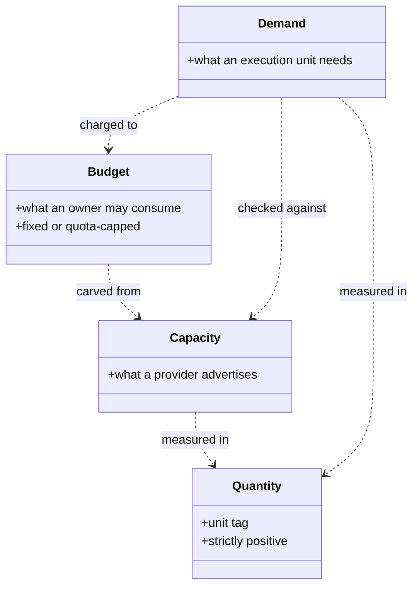

# Resource Capacity Types

> **Purpose**: The four resource types the whole provisioning model is expressed in, the checked construction obligations the record spellings cannot state, and the systematic provision matrix.
> **Read this if**: a capacity, demand, budget, or provisioned type has to be read or extended.

This slice of the resource-capacity family carries what the types *mean* and what checked construction
adds beyond their spelling. It does not carry the spellings, which are owned by
[resource_capacity_schema.md](./resource_capacity_schema.md), nor the folds over them, owned by
[resource_capacity_folds.md](./resource_capacity_folds.md). The honesty limit that bounds every claim here is
stated once in [resource_capacity_doctrine.md §2](./resource_capacity_doctrine.md#2-the-load-bearing-honesty-limit-a-capacity-sum-is-a-decode-foreclosed-check-never-type-foreclosed).

<details>
<summary>Link-graph metadata</summary>

**Status**: Authoritative source
**Supersedes**: N/A
**Referenced by**: DEVELOPMENT_PLAN/phase_13_render_manifest_goldens.md, DEVELOPMENT_PLAN/phase_25_base_image_registry.md, DEVELOPMENT_PLAN/phase_31_platform_backbone.md, DEVELOPMENT_PLAN/phase_32_platform_services_2.md, DEVELOPMENT_PLAN/phase_33_keycloak_ingress.md, DEVELOPMENT_PLAN/phase_34_live_dsl_singleton.md, DEVELOPMENT_PLAN/phase_36_pulsar_client.md, DEVELOPMENT_PLAN/phase_40_release_lifecycle.md, DEVELOPMENT_PLAN/phase_43_multicluster_spawn_georepl.md, DEVELOPMENT_PLAN/phase_44_gateway_migration_drills.md, DEVELOPMENT_PLAN/phase_45_provider_deploy_checkpoint.md, DEVELOPMENT_PLAN/phase_47_provider_ebs_credential.md, DEVELOPMENT_PLAN/phase_48_provider_dynamic_nodes.md, DEVELOPMENT_PLAN/phase_49_determinism_jitcache.md, DEVELOPMENT_PLAN/phase_54_apple_metal_host_daemon.md, DEVELOPMENT_PLAN/phase_55_test_topology_dsl.md, documents/engineering/monitoring_doctrine.md, documents/engineering/network_fabric_doctrine.md, documents/engineering/resource_capacity_construction.md, documents/engineering/resource_capacity_doctrine.md, documents/engineering/resource_capacity_folds.md, documents/glossary.md
**Generated sections**: none

</details>

## Contents
- [3. The types: `Quantity`, `Capacity`, `Demand`, `Budget`](#3-the-types-quantity-capacity-demand-budget)
- [Related Documents](#related-documents)

---

## 3. The types: `Quantity`, `Capacity`, `Demand`, `Budget`

Every quantity is refined and unit-tagged, every provider advertises a typed capacity, and every execution
unit carries one complete resource envelope. Kubernetes resource maps are a **rendered projection** of this
pure value; they are never a second source of truth.

### The scalar measures

- **`Quantity u`** — a refined strictly-positive measure tagged by unit: CPU millicores, memory bytes, logical
  ephemeral-storage bytes, physical filesystem/content/snapshot bytes, required-usable and provisioned
  durable-storage bytes, cache bytes, accelerator device
  count, or VRAM bytes. A zero or negative quantity is not constructible.
- **`Residual u = Zero | Remaining (Quantity u)`** — the zero-capable result of subtraction. Declarations
  remain strictly positive, but an exact fit must be representable as `Zero`; it is not an overcommit and it
  must not require constructing an illegal zero `Quantity`. `Headroom` and `AvailableCapacity` use
  `Residual` on every scalar axis and remove allocated discrete device/backing identities. Every subsequent
  carve consumes `AvailableCapacity`, so an exact-fit first carve cannot be spent a second time.

### Compute and accelerator demand

What a workload asks for on the compute axis. These are the demand-side types; their supply-side counterparts
live in [resource_capacity_sources.md](./resource_capacity_sources.md), and the fold that meets the two is in
[resource_capacity_folds.md](./resource_capacity_folds.md).

#### `PodResourceVec`

The three schedulable built-in Kubernetes resource axes every app, sidecar,
controller, operator, platform, and init container declares: `cpu`, `memory`, and `ephemeralStorage`.
`Resources = { requests, limits }` carries two `PodResourceVec`s and requires `requests ≤ limits` per axis.
`requests` is the workload's **required** reservation floor; `limits` is the rendered finite consumption
boundary. The reservation folded by `place` is `reserved = requests + pad`, where `pad` is the optional
explained compute headroom of the next bullet and is `Zero` on every axis when no headroom is declared, so a
workload that declares none reserves exactly its requests and the fold is unchanged.
The provision proof carries **both** obligations: reservation feasibility over reserved, and
finite-ceiling/physical-peak fit over memory and ephemeral-storage limits on the returned placement. CPU remains throttleable:
its summed reserved must fit allocatable CPU, and summed effective CPU limits must fit the limit budget
derived from the node's closed
`CpuOvercommitPolicy = NoCpuOvercommit | BoundedCpuOvercommit { maxLimitToAllocatable : RatioAtLeastOne }`.
Thus overcommit is an explicit finite pure provision, never an unrepresented convention. No writable layer,
log budget, or disk-backed `emptyDir` cache is allowed to exist outside `ephemeralStorage`.
Enforcement semantics remain explicit rather than conflated: CPU is throttled by cgroups; memory is bounded
reactively by the kernel; Kubernetes measures local ephemeral use and evicts a pod after a limit breach—it
does not promise synchronous `ENOSPC` at the container field. The cache owner therefore also enforces its
private `ProvisionedCacheDemand` before materialization, and node filesystem carves retain hard physical
headroom/eviction reserve. The pure fit proves no admitted declared peak exceeds those bounds; timing of
kubelet measurement/eviction remains runtime-checked residue.

#### Compute headroom

The one authorable way to reserve more of a host than a workload requires, and the
only over-reservation in this doctrine that is declared rather than derived. Elsewhere reserved-above-required
exists only where granularity forces it and the excess is computed: a volume's `provisionedBytes` above its
`requiredUsableBytes`, a uniform claim template's padding on smaller ordinals, a wholesale accelerator owner
taking a node's full device offering, one indivisible pod slot per live pod. Compute has no such forcing
granularity, so slack there had no representation at all and could only be smuggled into `requests`, where
nothing records that it is slack or why. `ComputeHeadroomDemand` gives it a name, a reason, and a debit.
The demand is optional and pod-scoped: `PodResourceEnvelope.headroom` and, on the native-host arm,
`HostResources.headroom`. It carries a closed `ComputeHeadroomReason` —
`VerticalGrowth { horizon } | BurstAbsorption | NeighbourIsolation | DefragmentationReserve` — and a
`Residualized` pad vector whose axes may individually be `Zero` but not all be `Zero`, so "no headroom" has
exactly one representation (`headroom = None`) rather than two. There is no free-text arm and no defaultable
empty placeholder: a pad that cannot be explained by one of the four reasons has no constructor, exactly as a
provider-managed node has no invented host reserve rather than an unexplained one.
**The pad is bounded by the workload's own ceiling: `requests + pad ≤ limits` per axis** (`reservation + pad ≤
ceiling` on the host arm), strengthening `requests ≤ limits`. The largest expressible reservation is therefore
exactly the declared limit — headroom closes the gap between what a workload reserves and what it is already
permitted to consume, and can never hold capacity the workload could not lawfully use. One consequence is
worth stating plainly: because `reserved ≤ limits` and the finite-ceiling proof already asserts summed
effective memory/ephemeral-storage limits within allocatable, reservation fit on those two axes is now
*implied* by a proof that already exists. Reservation fit remains independently load-bearing on CPU alone,
where limits are policy-bounded by `CpuOvercommitPolicy` and may exceed allocatable by design.
The padded total is never authorable. `requests`/`limits` and the pad are declared; `reserved` is minted only
by `provision`, has no Gate-1 or Gate-2 surface, and is carried on the reservation ledger beside the request
and limit debits so it is released on teardown rather than retained forever.

#### Accelerator demand

A closed requirement separate from the open-for-every-container
`PodResourceVec`. The pod arm admits
`PodAcceleratorDemand = None | Cuda { owner : ContainerId, demand : CudaOwnerDemand }`; the native-host arm
admits `HostAcceleratorDemand = None | Cuda CudaOwnerDemand | AppleMetal MetalOwnerDemand`, so Apple Metal
has no pod constructor. The pod `Cuda` arm carries an owner `ContainerId` that must resolve exactly once in
the pod's container list, because Kubernetes extended resources are container fields. Each owner demand
carries two identity-keyed maps: the exact source inventory of served models, training jobs, JIT
compilations, and accelerator-library work, and a `NonEmptyMap` of their structural residency demands.
Their key sets must be equal. Weights, serving KV cache, activations, optimizer state, JIT workspace, and
library workspace remain distinct residency classes with `Unsharded`, `ReplicatedPerDevice`, or explicit
`Sharded` placement; an editable owner-total scalar has no constructor.
`AcceleratorCoexistencePolicy` supplies finite resident/running bounds by workload class and a pinned model,
not a caller-authored list of favorable epochs. Provisioning enumerates every source subset allowed by those
bounds, derives each epoch's per-device assignment for CUDA or unified-memory sum for Metal, and fits the
worst permitted epoch. The same policy is rendered/enforced, so declaring serial execution cannot excuse
concurrent residency that the policy permits. CUDA preserves requested wholesale device count, profile,
residency placement/sharding, and interconnect; Metal preserves its profile and charges every permitted
epoch to physical-host memory rather than a fictional second VRAM pool.
The closed union preserves accelerator-family identity. The wholesale per-node ownership rule still holds:
a model/job/capability may require an accelerator, but provisioning must route that demand through exactly
one typed accelerator owner on the selected node/host. In the v1 generic `nvidia.com/gpu` lane,
**wholesale means the requested count equals the selected node's full CUDA offering count**. This makes a
concrete per-device VRAM/topology witness enforceable despite the device plugin choosing device ids: the
owner receives every device in the offering and cannot be handed an unproved smaller device from a
heterogeneous set. Subset allocation has no v1 constructor; it requires a future profile/device-selectable
DRA or MIG resource-class arm. On `linux-cuda`, that owner is a pod and the renderer
emits the full whole-device count as an integer extended-resource request/limit on its exactly-once
named owner container plus required node affinity on the pod; on Apple/Windows it is a host worker and never
enters a pod resource map. Ordinary pods cannot author an accelerator claim, and there is no fractional or
second-owner constructor. An `Unsharded` residency is indivisible on one selected device,
`ReplicatedPerDevice` is charged on every selected device, and a `Sharded` residency carries the complete
shard-byte inventory and interconnect requirement. Equal aggregate bytes never excuse a one-short device.

### Storage and node-local demand

Storage splits along two independent axes the types keep apart: *logical* demand, which is what a workload
asks for, and *node-local* demand, which is what the machine running it must physically hold. A type that
conflated them could not express a pod whose data is remote.

#### `StorageDemand`

Explicit storage provisions split by lifetime and accounting owner.
`PodLocalStorageDemand` names every bounded disk-backed volume and every bounded memory-backed volume plus its
persistence and non-empty access set. Each `ContainerEnvelope` separately declares private
writable-layer and log allowances and a runtime memory working-set allowance. Disk-backed bytes fold into
`ephemeralStorage`, while memory-backed bytes fold into `memory`. `DurableVolume` is a hard-capped PVC/PV
size. `CacheDemand` has two closed realizations:
`InClusterCache` references exactly one already-declared disk-backed volume by typed `VolumeId`, so its
logical `CacheBudget` must fit that volume's `sizeLimit` without declaring a second allocation; `HostCache`
references a named native-host backing. For every container,
a `WritableRootfs` allowance plus `logHeadroom` must fit the container's
`ephemeralStorage.request ≤ limit`; `ReadOnlyRootfs` contributes no writable-layer bytes and renders the
corresponding security control. Then all shared disk-volume
bounds plus the lifecycle-derived effective private allowance must fit the effective pod request/limit.
Memory volumes additionally carry access mode and `StageLocal | PodLifetime` persistence. Provisioning
expands the container lifecycle into concurrency epochs and deterministically assigns each resident volume
to exactly one live **reservation carrier per epoch**. A carrier's derived request includes that volume;
another concurrent writer's request does not include it again. Every possible charged accessor's memory
limit still covers its runtime working set plus the full writable volumes it may be charged for. For every
epoch, the validator proves
`Σ live runtime working sets + Σ unique resident memory-volume bounds ≤ effectivePod.memory.request ≤ limit`.
Thus two concurrent writers reserve one tmpfs volume once, while an init-filled pod-lifetime volume remains
reserved alongside the later app working set. The effective pod request is charged once to the node; volume
bytes are not added again. These are nested proofs on their respective **one physical debit**. `HostCache` is used only
by native Apple/Windows host workers and carves once from a named host cache pool. A memory-backed
`emptyDir` consumes `memory`, not `ephemeralStorage`. No cache is smuggled through an unaccounted writable
`hostPath`; clients receive typed handles and declare only their private staging bytes.
Binding also derives non-authorable `KubeletMappedFileDemand`s from every ConfigMap/Secret/projected/
downward-API/service-account-token object and mount. Exact known payload bytes plus bounded token/metadata
sources pass through a versioned AtomicWriter old+new/symlink/metadata model; the model routes each source to
nodefs ephemeral storage or memory. The same typed API-object bytes enter etcd logical demand, so mapped
files are neither free node storage nor a second caller-supplied aggregate. Separately, every identity-
expanded Pod instance derives sandbox, pod-directory, runtime-state, CNI-state, and volume/mount-metadata
counts from `PodRuntimeMetadataSource` and the complete container/volume graph. The selected node's pinned
`kubeletMetadataModel` converts those structural counts into identity-keyed components and assigns each
component a closed `KubeletNodefs | CriRuntimeRoot` role; callers author neither bytes nor routes. The
selected layout resolves roles to real backing ids, and a component-ownership witness partitions the full
runtime-storage source domain exactly and disjointly between this per-Pod model and
`NodeImageStorageModel`. This bookkeeping is not falsely added to a container's logical
ephemeral-storage request; it is a distinct physical cost charged once per planned slot or observed Pod UID.

#### Node-local filesystem and image demand

Every `ContainerEnvelope` names a content-digested OCI manifest list whose
`ImageArtifact` metadata carries a non-empty platform map. Each OS/arch entry has its selected child/config
digests and stored bytes, compressed layer digest/bytes, snapshot chain id/unpacked bytes, and peak
pull/import workspace; binding to a node or candidate must resolve
exactly one matching entry. The node also carries a closed `KubeletFilesystemLayout`: `Unified` aliases
`nodefs=imagefs=containerfs`; `SplitRuntime` keeps `nodefs` separate while
`imagefs=containerfs`; `SplitImage` keeps images on `imagefs` while
`containerfs=nodefs`. There is no arbitrary three-filesystem arm because kubelet does not support it.
`SplitImage` additionally requires an observed runtime/feature witness; the v1 containerd engines cannot
construct that witness and therefore admit only `Unified` or `SplitRuntime`.
Kubernetes's **logical** pod-ephemeral check is layout-independent:
disk `emptyDir` + pod logs + writable-layer allowance + kubelet-mapped pod files must fit the pod's rendered
`ephemeral-storage` request/limit and the node's logical allocatable value. The **physical** debit is then
routed by layout:
`Unified` resolves both metadata roles, the entire logical demand, and OCI
content/snapshots/import workspace to `nodefs`;
`SplitRuntime` resolves `KubeletNodefs` plus disk `emptyDir`/logs/mapped files to `nodefs`, while
`CriRuntimeRoot`, writable layers, and OCI content/snapshots/import workspace resolve to
`containerfs=imagefs`; `SplitImage` resolves `KubeletNodefs`, `CriRuntimeRoot=containerfs`, and the complete
logical pod demand to `nodefs`, while only image content/import roles resolve to `imagefs`. The pinned model,
rather than a field name, chooses each runtime component's role. When roles alias, distinct components are
summed and their one shared backing is checked once—an alias never drops a component or manufactures a
second supply. Thus writable rootfs/runtime bytes are never lost or charged to a fictitious pool.
After placement, provisioning unions persistent OCI content by object digest and snapshotter content by
chain id **per node**, applies the version-pinned snapshotter metadata/active-snapshot model, adds bounded
concurrent pull/import workspace, groups every operand by the derived physical backing, and proves each
backing peak fits once. Compressed content, manifests, and configs therefore cannot disappear behind an
unpacked-layer-only estimate. For elastic candidates the same derivation includes all topology-required per-node images
before computing effective capacity. Each node capacity carries an enforced
`ImagePullConcurrencyPolicy = Serial | BoundedParallel n`; workspace peak is the sum of the largest `n`
simultaneously new unique-image workspaces (`Serial` means one), never an unspecified max. Live transition
admission computes
`bytes(unionByDigest(observed resident, old desired, new desired)) + workspace(new missing unique pulls)`;
one digest is debited once even if resident and desired, while an observed digest remains debited until
observed GC removes it. Conflicting byte metadata for one digest is `ImageMetadataMismatch`, never a
guessed size. Thus admission assumes neither a duplicate debit nor reclaim. The only permitted backing
aliases are the ones forced by the selected layout; a declared alias in `SplitRuntime`, swapped roles, or
two nominal capacities over one unrecorded filesystem is `BackingAlias`/`FilesystemLayoutMismatch`.
Container application logs remain in each pod's `logHeadroom`; engine/kubelet/system logs live only in the
system reserve.

### The execution envelope

The envelope is where the demand types above are gathered into the single value a controller is checked
against. Its arms are closed by substrate, so a pod envelope and a host-worker envelope cannot be confused.

#### `ResourceEnvelope`

The closed sum carried by every execution unit:
`Pod PodResourceEnvelope | HostWorker HostResourceEnvelope`. The pod arm requires Kubernetes
a non-empty list of lifecycle-tagged `ContainerEnvelope`s (each with its own requests/limits), optional
pod/runtime overhead, `PodLocalStorageDemand`, durable volumes, an optional in-cluster cache demand, and only
`None | Cuda` accelerator demand. The host arm instead requires host CPU/memory reservation+ceiling, named
host-local storage demand, an optional native-host cache demand, and `None | Cuda | AppleMetal`. Omission of
the envelope, a container without resources, an Apple demand in a pod, or an in-cluster cache backed by a
host pool therefore has no constructor rather than relying on a later convention.

#### Controller-created child resources

A supported operator/CR does not get a resource-free exception.
Its version-pinned descriptor expander is the only constructor of a private `ControllerChildEnvelope`: an
exact, identity-keyed set of materialized child pod envelopes and durable volume demands plus the
controller's replica and rollout operands. The authored CR cannot supply a scalar "child peak" or a generic
child list. Binding joins every source descriptor field to the selected
`ControllerChildExpansionModelVersion`, exhaustively derives steady and old/new/surge transition epochs,
and rejects a CR arm whose model cannot explain every child. Provisioning places every derived epoch and
privately records its peak/witness; rendering projects both the CR controls and namespace
`ResourceQuota`/admission policy from that same witness. The versioned model also derives the validating
webhook's complete pod/image/CPU/memory/ephemeral/log/replica/transition envelope and inserts it into
`BoundDeployment`; a child set that fits only when the admission unit is free rejects. Live child
enumeration must normalize back to the envelope or fail closed as `UnknownCommitment`.

#### Host build execution

`buildx`/BuildKit is an execution unit even though it precedes a pod. Its required
`BuildExecutionEnvelope` contains the complete acyclic architecture/stage graph: every stage has host/
engine-VM CPU and memory reservation+ceiling and intermediate-layer scratch demand; the envelope names one
scratch backing, one bounded build-cache backing, and separate finite architecture and stage concurrency
policies. Binding enumerates every dependency-valid concurrent stage set and derives the runtime and scratch
maxima before the first builder process; there is no caller-authored aggregate that can omit an expensive
stage. The result's `ImageArtifact` is a separate node-image-store demand; neither provision substitutes for
the other.

#### Engine/control-plane reserve

`EngineSystemReserve` is not an unexplained subtraction and is required
on every self-managed engine node. It contains a role tag and the exact role-indexed set of named static
engine processes, each with CPU/memory reservation+ceiling. `KindControlPlane` and `Rke2Server` use a
`ControlPlaneStorageDemand` for static engine bytes, the aggregate etcd backend quota/WAL/snapshots (Events
are retained inside that quota, never charged twice), audit logs, and
kubelet/runtime logs; `KindWorker` and `Rke2Agent` use a `WorkerEngineStorageDemand` for static engine bytes and bounded
kubelet/runtime logs and has no fictitious etcd/audit allocation. All rotation/retention controls are
finite. `ControlPlaneStorageDemand.etcd.logical.churn` is the sole Event
rate/window/maximum-size/retention authority; its `eventRetention` and the separate audit retention each
cover the declared longest live-gate history requirement,
and the derived storage peak fits one named system carve. Each kind node-container carries its own in-node
reserve, which must fit **inside** that container's runtime/disk envelope; a separate
`KindHostEngineReserve` accounts for host Docker/containerd/kind-supervisor work outside the containers and
a structural `KindHostRuntimeStorageDemand`: process/log bytes, the selected kind-node OCI artifact,
model-versioned host content/snapshots, per-ordinal active snapshot/writable/log allowances, finite pull
workspace/concurrency, and one named data-root/graphroot carve. Host content deduplicates by digest, but
active snapshots remain one per ordinal. Each rke2 server/agent carries its own role-specific host reserve. Provider-
managed EKS exposes worker allocatable capacity but not an invented host/control-plane reserve.
Kube-system add-on pods remain ordinary topology-expanded pod envelopes and are not counted in this reserve.
The etcd `backendQuotaBytes` is not assumed large enough merely because its disk fits: the complete
`EtcdLogicalDemand` exact-joins every serialized desired Kubernetes object plus bounded old/new/apply
transition objects, revisions, Leases, and Event rate/size/retention through a versioned MVCC model and must
fit the quota first. Only then does the separate storage model expand the full quota into WAL,
snapshot-save, retained-snapshot, and defrag physical high-water.

#### Monitoring work

Every `Observability` binding carries a mandatory finite `MonitoringWorkBudget`.
Binding derives workflows, rules, series, and maximum scrape samples/second from the complete descriptor and
uses named versioned evaluation, query, and TSDB cost models. It derives Prometheus CPU/memory for the
overlap of evaluation plus maximum concurrent query work and derives the query-admission proxy's own
complete pod envelope. The storage model derives resident blocks for the
finite retention window, WAL/head, worst-case compaction old+new overlap, and query temporary work from a
structural `QueryWorkBudget` (finite concurrency, per-query series/samples/range/timeout, and a versioned
cost model), then alone
constructs the private physical claim demand against the named backing. Counts/rate/cost or a one-byte-
undersized claim or insufficient Prometheus/proxy compute rejects; no optional budget, arbitrary tiny PVC,
or descriptor-independent fixed resource
arm exists. A caller-authored `maxQueryTempBytes` scalar has no field. Rendered evaluation, TSDB time/size
retention, Prometheus query flags, and the sole-routable query-admission proxy's concurrency/series/range
limits are the same operands used by the model; direct query API access is denied.

### `Capacity`, `Demand`, and `Budget`

- **`Capacity`** — what a provider offers. A Kubernetes node advertises allocatable CPU and memory, logical
  pod-ephemeral bytes, allocatable pod slots, driver-scoped attachable-volume slots, an explicit kubelet
  filesystem layout with named physical backing(s), a finite
  `CpuOvercommitPolicy`, plus
  `NodeAcceleratorOffering = None | CudaOffering CudaDeviceOffering`, where every offering carries its
  concrete device vector and typed peer/NVLink graph, and every CUDA device carries a stable profile, raw
  VRAM, a mandatory driver/runtime safety reserve, and the
  resulting **allocatable VRAM**. Provisioning spends only allocatable VRAM; a model that fits the nominal
  device label or raw `memory.total` but not that net quantity is rejected. A physical host advertises the same base
  resource/storage facts plus
  `HostAcceleratorOffering = None | CudaOffering CudaDeviceOffering | AppleMetalOffering MetalProfile`.
  The Apple arm proves compatible Metal exists but carries no separate memory quantity: unified-memory demand
  is debited from physical-host `memory`. A physical host also advertises the native-cache/storage backing
  available to host workers; a retained-disk `StorageBacking` advertises physical allocatable bytes per named
  bookie/drive, while a provider object-store arm advertises its selected, model-indexed logical-or-billed
  byte quota plus object-count quota. The
  geometry fold below is therefore mandatory before retained-disk demand can be compared with supply.
  Kube/system-reserved space and eviction headroom are already netted out.
- **`Demand`** — the normalized reservation and finite-ceiling/physical-peak requirement derived from all
  resource envelopes inside `provision`, after deployment shape, arm-specific execution cardinality/rollout
  expansion into complete epochs, init-container semantics, runtime overhead, and provider structure are
  known. For a
  pod, the effective request/limit mirrors the pinned Kubernetes scheduling semantics exactly. With ordinary
  sequential init containers it is the higher of the concurrently running app/sidecar sum and the largest
  init request/limit, plus declared pod/runtime overhead. Restartable init-sidecars are accumulated with the
  app and later init stages according to their lifecycle rather than treated as one-shot maxima. This
  derivation is pure and version-pinned; a naive sum that disagrees with the rendered pod is a test failure.
  Declared compute headroom enters this derivation at exactly one point — **after** the lattice above resolves,
  beside pod/runtime overhead, never inside the init-versus-app maximum:

  ```text
  -- Restartable init containers (sidecars) run alongside BOTH later init stages and the app, so their
  -- requests appear INSIDE both branches of the maximum and are never added outside it. Adding them
  -- outside would double-count them against the app branch and omit them from the init branch.
  appBranch  := Σ restartable-init requests + Σ app requests
  initBranch := max over each ordinary init container k of
                  ( request(k) + Σ requests of restartable-init containers started before k )
  effectiveRequired := max(appBranch, initBranch) + overhead
  effectiveReserved := effectiveRequired + headroom.pad     -- provision only
                       subject to  effectiveReserved ≤ effectiveLimits
  ```

  Pod scope is what makes that insertion point unambiguous: a per-container pad would have to answer whether an
  init container's headroom participates in the maximum and whether a restartable-init sidecar's accumulates,
  questions no existing addend answers. `effectiveReserved` is the value `place` folds. Because Kubernetes
  computes a pod's effective request from **per-container** `requests` by re-running the same maximum, the pod
  -scoped pad is rendered by **distributing it across the app-branch containers** so the apiserver's recomputed
  pod request equals `effectiveReserved`; `renderedRequestsEqualReserved` pins that equality on the rendered
  object rather than assuming a pod-level `requests` field exists. The distribution is derived in `provision`
  and never recomputed by the renderer.
- **`Budget`** — a capacity an owner is allowed to consume against, fixed or quota-capped growable
  ([§5](./resource_capacity_storage.md#5-storagebudget-bounded-by-construction-single-owner-ceiling-per-arm),
  [§6](./resource_capacity_storage.md#6-growable--scalingpolicy-the-quota-bounded-dynamic-provisioning-arm)).
- **`ProvisionedSpec` / private service projections** — opaque post-fold values whose constructors are not
  exported. `provision` is the only constructor: it derives all demands, binds each to an offering/backing,
  and stores the placement/capability witnesses in the whole deployment. Private service projections
  contribute sources to one sealed identity-keyed object set; the only public manifest boundary is
  whole-deployment `renderAll :: ProvisionedSpec -> [K8sObject]`, never an unchecked `ServiceSpec`.

The type spellings themselves are carried by
[resource_capacity_schema.md](./resource_capacity_schema.md), divided into 26 families.

### Checked construction: what a record spelling cannot state

Checked construction adds identity and derivation obligations that a record spelling alone cannot express.
Those obligations are carried by
[resource_capacity_construction.md](./resource_capacity_construction.md).


*Orientation. Design intent. How the four types relate before any fold runs: a single refined measure underlies all of them, a budget is a carve of a capacity, and a demand is checked against one and charged to the other. Every edge is an association; none asserts a subtype. The spellings are owned by [resource_capacity_schema.md](./resource_capacity_schema.md) and the folds by [resource_capacity_folds.md](./resource_capacity_folds.md).*

<a id="31-the-systematic-provision-matrix"></a>
### The systematic provision matrix

| Provision | Pure demand | Pure supply | Decode/provision obligation | Rendered/runtime projection |
|---|---|---|---|---|
| CPU | pod `requests.cpu`/`limits.cpu` plus optional headroom pad, or host-worker reservation/ceiling plus optional headroom pad | node allocatable CPU + closed `CpuOvercommitPolicy`; host allocatable CPU | effective pod reserved (requests + pad) fits allocatable; `requests + pad ≤ limits`; summed pod limits fit the finite policy-derived limit budget; host-worker reservation and ceiling both fit; `reservation + pad ≤ ceiling`; host enforcement constructor matches substrate or rejects | container CPU requests/limits, the request carrying the padded total; Linux cgroup or Windows Job control, or explicitly reactive finite Apple supervisor sampling/termination |
| Memory | pod `requests.memory`/`limits.memory` plus optional headroom pad, or host-worker reservation/ceiling plus optional headroom pad | node/host allocatable memory | lifecycle epochs assign every resident tmpfs volume to exactly one request carrier per epoch; each epoch's live working sets + unique resident volumes fit the effective pod request/limit; effective reserved fits allocatable and stays within the limit; every possible charged accessor's limit covers writable volumes; Apple unified memory is charged here; host enforcement constructor matches substrate | container memory requests/limits, the request carrying the padded total; bounded access-/persistence-indexed memory-backed `emptyDir`; Linux/Windows kernel policy or explicitly reactive Apple RSS/unified-memory supervision |
| Declared compute headroom | optional pod `PodResourceEnvelope.headroom` or host `HostResources.headroom`: a closed `VerticalGrowth \| BurstAbsorption \| NeighbourIsolation \| DefragmentationReserve` reason plus a `Residualized` pad whose axes are not all `Zero` | the same node/host allocatable the requests fold against — headroom competes for real capacity, never a separate pool | pad enters the effective demand once, after the init/app maximum, beside pod overhead; `requests + pad ≤ limits` per axis; the padded total has no authorable field and is minted only by `provision`; the ledger carries request and pad separately so release returns both | nothing of its own — Kubernetes has one `requests` field, so the pad is summed at provision and the manifest renders the reserved total; the required/pad split survives only on the reservation ledger |
| Pod and CSI attachment slots | one slot per simultaneously live pod; one driver-scoped attachment per unique mounted CSI PVC | node `allocatablePods`, remaining CNI/IP capacity, and per-driver attach limits from node/SKU/`CSINode`; provider candidate policies | atomic pod placement spends both slot maps; DaemonSets, admission/copy/Pulumi Jobs, controller children, old/new/surge/terminating overlap all count; repeated mounts of one PVC dedup; account volume quota cannot replace node attach fit | provider CNI/maxPods and CSI node configuration plus live Node/CSINode/attachment observation; unknown or lower real limits refuse |
| Ordinary workload multiplicity/rollout | whole-deployment `FirstDeployment \| UpdateFrom PriorExecutionProvisionRef`; every desired kind-indexed `BoundExecutionUnit`; no caller terminating bound | exact prior steady execution projection for updates, complete topology, and all compute/storage/slot/device residuals | derive empty-capable planned epochs; exact-join desired/prior and live UID/process identities; derive ResourceQuota, identity admission, and the amoebius Haskell scheduler role whose pre-Binding CAS atomically debits every selected-node axis by Pod UID; bound/terminating/terminal-retained reservations persist per policy | render only new desired kind-correct controller, quota/admission, and `schedulerName` projections; live identity/resource/reservation changes invalidate or refuse |
| Capacity scheduler + reservation ledger | one pods=1/default-scheduled bootstrap unit running the same amoebius binary's scheduler role; exact prior+desired child-indexed accepted template sets; bootstrap add-on cutover; managed-node taint/admission/Binding RBAC; singleton root-ledger API source and churn | static/foreign/resident baseline, fixed or attested elastic node bindings, API/etcd capacity, observed scheduler/add-on/managed-authority readiness, and root resourceVersion/CAS state | identity-aware fold of baseline+whole ledger+candidate; Reserved→BindingInFlight→Bound with ambiguous outcome retained/repaired; state-indexed Pod/absent-ledger recovery; per-domain shared-extent union, identity CSI, exclusive CUDA device, terminal/GC partitions; mint bootstrap readiness, observe default→custom add-on replacement joins, then install authority and mint `ManagedCapacityReady`; stale/orphan/mismatched/bypass states reject | one `ProvisionedCapacitySchedulerSystem` globally renders bootstrap Deployment/quota/config/RBAC/admission/taints/root schema in staged ownership; guarded templates render immutable identity/set/child-template digest and schedulerName; snapshot-bound full readiness/root/authority join `ValidatedLiveTarget` |
| Pod-local ephemeral storage | per-container `requests.ephemeralStorage`/`limits.ephemeralStorage`; finite disk `emptyDir.sizeLimit`; writable rootfs, log, kubelet-mapped-file allowances, and structural Pod runtime-metadata sources | `podEphemeralAllocatable`; closed `Unified \| SplitRuntime \| SplitImage` alias graph with derived containerfs; named backing ids; pinned metadata/image models | fit logical Pod sum; derive role-tagged sandbox/pod-directory/runtime/CNI/volume/mount components per planned slot and distinct live Pod UID; prove pod-metadata/image-model component ownership is an exact disjoint partition; resolve roles through layout, sum distinct aliased components, group once by backing, and fit nodefs plus containerfs/imagefs independently | container requests/limits and `sizeLimit`; capacity-only private role/backing map emits no byte scalar; live source/model/root/UID map and each physical residual cross-check or refuse |
| Node image/content/snapshot store | platform-indexed OCI index/manifest/config/compressed-layer stored bytes, chain-id-indexed unpacked snapshots + modelled metadata, and pull/import workspace | layout-derived `nodefs` or `imagefs`, pinned `NodeImageStorageModelVersion`, and enforced `Serial \| BoundedParallel n` pull policy | deduplicate content by object digest and snapshots by chain id; reject size conflicts; add the largest `n` missing-image workspaces; combine with physical pod-local operands on the same backing; live admission retains observed/old/new content and snapshots until observed GC | content-digested image ref; containerd content/snapshot roots and pull policy exactly match witness; image bytes are physical node storage but not a second Kubernetes pod request |
| Host image build | expanded acyclic multi-arch `BuildExecutionEnvelope`: per-stage CPU/memory reservation+ceiling, intermediate bytes, and cache-write delta; build-cache budget; finite architecture + stage concurrency | physical host/engine-VM residual plus named `BuildScratch`/cache carves | enumerate every dependency-valid concurrent stage set and derive runtime/scratch/cache-write peaks; fit observed cache residents + write peak against budget/backing until observed GC; snapshot mismatch/unknown commitment rejects before `buildx` | enforced BuildKit/engine-VM CPU/memory ceiling and named scratch/cache locations; resulting `ImageArtifact` is accounted separately |
| Pre-binary bootstrap/toolchain | `BootstrapExecutionEnvelope`: installer CPU/memory, per-tool installed + peak download/unpack bytes, and the cabal build's complete stage envelope | physical host residual plus named `ToolInstall`, `BuildScratch`, and cache carves | Python bootstrap coordinator performs the same read-only residual/fingerprint validation before package install/build; all peaks fit and token is rechecked; no bootstrap trust exemption | installer/build process policy and fixed backing/cache locations; built binary is the output, not free overhead |
| Self-managed engine/control plane | role-indexed exact static-process CPU/memory envelopes; exact serialized Kubernetes object transition plus bounded revision/Lease/Event churn; `ControlPlane` or `Worker` physical storage demand; kind host runtime exact node-image content, per-ordinal snapshots/writable/log bytes, and pull workspace | each kind host or rke2 server/agent host's CPU/memory plus etcd backend quota and named system/host data-root carves | desired/live old/new/apply object peak fits backend quota; separately expand quota into WAL/snapshot/defrag physical peak; kind expands all node containers; each rke2 node proves role reserve; derive kind host OCI/snapshot peak; require `etcd.logical.churn.eventRetention` and audit retention ≥ history; reject a duplicate Event authority or missing object/process/runtime root | exact etcd quota/compaction and apiserver Event/Lease controls projected only from `EtcdLogicalDemand.churn`; process controls, physical retention/rotation, and host runtime content/snapshot roots/model/pull policy are realized and observed |
| Physical host → VM/node root | guest-system bytes plus unique layout-routed kubelet carves; VM/node-container CPU/memory; no authored raw disk total | physical host partition, fixed instance-store root, or `EphemeralRootEbs` filesystem presentation/allocation policy | derive required usable bytes, apply filesystem/sparse-image overhead and allocation minimum/quantum, construct private VM/root request, enforce unique carve identities, and debit the raw high-water once; a block-only guest root has no constructor | exact Incus/Lima/WSL2 virtual disk or provider launch-template root request; raw size, mounted fsType/usable bytes, sparse allocated high-water, and nodefs/imagefs/containerfs identities cross-check |
| Kernel network fabric | exact topology-derived WireGuard peer graph, finite packet rate/queue, rotated logs, versioned peer/traffic cost | each node/candidate effective CPU/memory and layout-routed nodefs | derive per-node kernel/listener runtime and bytes; subtract once before pod placement and fit enclosing host/node-container; reject unlimited/missing peer or changed live graph before `wg set` | queue/rate/log controls, interface/peer readback, and snapshot-bound host mutation |
| Durable storage | logical volume/retention/object extents; BookKeeper/MinIO geometry; bounded writes/orphans; `Block \| Filesystem {fsType, model}` presentation | per-bookie/per-drive `StorageBacking` with allocation minimum/quantum, or logical cloud quota | derive required usable bytes after replication/parity/recovery; add filesystem metadata/journal/reserved-block overhead; round raw allocation to backing minimum/quantum; uniformize StatefulSet claims; fit rounded debit per backing | PVC/PV and provider request use exact rounded `provisionedBytes`; volume mode/fsType are pinned; live raw capacity and mounted usable bytes both cross-check |
| Cache | exact catalog-selected `AssetMaterializationDemand`s, finite first-miss concurrency, `CacheBudget`, and typed volume/backing reference | in-cluster: cache-owner `emptyDir.sizeLimit` on layout-routed node storage; host worker: named host cache backing | group exact assets per owner; dedup residents by digest; reject same-digest size conflicts; add largest concurrently permitted temporary peaks; compare only private `ProvisionedCacheDemand.derivedPeak`; observed residents remain charged until GC | cache-owner provision and enforced first-miss admission; clients receive typed handles, never a writable `hostPath` |
| Closed object-store producers | six closed arms—app bucket, content namespace, registry, Pulsar offload, Pulumi checkpoint, and control-plane state—each with a required `StorageBudgetId`, exact resident identities, structural retained/transient/failure extents, and mutation admission | shared MinIO geometry/backing or provider object-store quota, partitioned by store/tenant/bucket/full key | prove source↔producer equality; union equal physical ids only; reject size conflicts; concatenate future/transient extents; preserve every writer witness before per-object geometry; a missing arm or scalar byte aggregate rejects | sole-routable snapshot-bound object-write gateway enforces identity/count/size/retention/concurrency plus bucket quota; direct S3 PUT is denied and observed bytes remain charged until deletion |
| Derived tenant-policy persistence and apply | provider-indexed Keycloak/Vault/Pulsar/MinIO/Kubernetes-API/Postgres payload+target+persistence projections; qualified tenant output/action/executor identities; abstract `Dedicated \| SharedControlPlaneRole` attachment; bounded execution/failure/churn; deployment-global observed state | complete desired∪observed tenant domain, exact `BoundDeployment` budget/base-execution inventory, global observed executor targets, topology SQL/Raft/ZooKeeper/etcd, and retained MinIO backing/geometry/model supply | tagged Create/Replace/Delete/NoOp; admit zero tenants and final-tenant deletion; preserve old+new target high-water; merge complete executor deltas by target/base once; merge MinIO `(store,budget,geometry,model)` groups with static+dynamic per-drive totals once; every cross-tenant key, provider/action shape, target/model, omission, duplicate, uncoalesced, or double-add mismatch rejects | `ProvisionedSpec` seals provider payloads/commands, private executor refs, target high-waters, and store-global MinIO logical+physical results; only snapshot-bound validated actions enact; readback proves digests, coalescing, cleanup, and component peaks |
| Object-store mutation gateway | exact writer/admission map and versioned execution cost model derived from all six producer arms | ordinary pod/image/slot/nodefs capacity after full producer merge | derive and place the gateway pod including image, CPU/memory/ephemeral/log/writable bytes, replicas, and rollout overlap; children/storage fitting does not excuse a short gateway | exact private route, writer capabilities, limits, resources, and live readback; backend mutation credentials/routes are absent |
| Registry storage/publication + rehome | digest-keyed artifact intent plus finite upload policy; for rehome, an opaque `PriorRegistryProvisionRef`, target intent, and copy policy | exact prior provision resolved from `ProvisionContext`, interim bounded ephemeral volume and/or the Phase-31 MinIO geometry/backing ledger, transfer workspace, and executor capacity | exact-join artifact intent to OCI objects; resolve the prior ref; derive the source→target identity map; fit old+new+workspace and transfer/verify pod; retain both on failure | exact interim or structured MinIO demand, exclusive mutating admission, transfer Job, verified cutover, and post-cutover pull; source is reclaimed only after observed privileged deletion |
| Pulsar metadata store | exact ZooKeeper persistent/session-ephemeral paths, transaction/session/watch bounds, member pod envelopes, durable member volumes, and failure bound | node/pod/image/slot capacity plus per-member retained backings | derive snapshots, transaction logs, metadata and recovery overlap with the pinned model; fit every member and ordinal independently before broker start; BookKeeper capacity cannot fund ZooKeeper | exact ZooKeeper ensemble/resources/retention/volumes, readiness before brokers, and live per-member high-water/readback |
| Patroni SQL | exact database identity, binder-derived operator/controller children, exact table/index objects, finite WAL/checkpoint/failover/recovery demand, `StorageBudgetId`, declared volume, and bounded writer admission | pod/image/slot/CSI capacity plus per-ordinal retained backing | derive steady/failover/recovery/old/new/surge child epochs and physical volume peak; place the sole SQL admission proxy; a consumer addition creates a new demand and cannot reuse another witness | exact CR resources/replicas/failover controls/PVC, namespace quota/webhook and SQL-gateway boundaries, and live child/volume/writer normalization |
| Vault Raft + audit | exact bounded KV/Transit/PKI/auth/version/lease population; pinned Raft WAL/snapshot/compaction/recovery model; rotated audit-file policy | named retained Raft claim/backing per ordinal plus explicit pod-ephemeral or retained audit backing | derive per-ordinal usable/raw volume demand including old+new compaction and recovery; derive audit `(backups+1)×file`; reject one byte under before unseal/write | exact Vault storage/rotation/snapshot flags, PVC/PV presentation, and live high-water/backing checks |
| Controller/operator children | private binder-derived `ControllerChildEnvelope`: identity-keyed child source expansion lowered to ordinary `BoundExecutionUnit`s, plus validating-webhook unit | cluster/node/backing residual plus witness-derived namespace quota/admission boundary | provision children/webhook through the generic steady/rollout epoch mechanism; the controller witness explains source equality but adds no second debit; no resource-free CR, free webhook, caller scalar peak, omitted child, or unexplained live child can pass | exact CR controls plus derived `ResourceQuota`/admission policy and webhook resources; live webhook/child objects normalize to the shared execution inventory or become `UnknownCommitment` |
| Volume and schema migrations | opaque `PriorVolumeProvisionRef` or exact old schema intent; replacement logical intent; structural copy/DDL policy | exact prior provision resolved from `ProvisionContext`, old/new backing/count quotas, routed workspace, and executor pod/image/slot capacity | reject stale/missing/wrong-arm refs; derive old+new+workspace high-water and complete copy/verify or schema executor envelope; no advance reclamation credit | exact replacement request and executor Job; atomic verified cutover; old data and failed new/temp extents remain charged until observed cleanup |
| Accelerator capability/devices | owner family/profile; pod CUDA owner `ContainerId` + wholesale device count; exact source/workload identity maps for served models, training jobs, JIT, and library work; or host CUDA/Metal owner demand | closed node/host accelerator offering | source/workload key equality; pod owner resolves exactly once; matching family/profile exists; v1 CUDA count equals the node's full offering; one owner only; otherwise `Left MissingCapability` | CUDA owner container gets equal full-offering `nvidia.com/gpu` request/limit and pod affinity; host workers get host policy; only private owner provision projections render |
| Accelerator memory/topology | per-work-item structural residency classes and unsharded/replicated/sharded placement plus finite class-based residency/concurrency policy | discrete CUDA devices with raw/reserved/net allocatable VRAM and links; live `currentFreeVram : Residual Bytes`; or Apple physical-host memory plus Metal offering | derive every allowed coexistence epoch; aggregate/assign all co-resident work per device, rejecting one-short overlap even when owner total fits; spend net, never raw, VRAM; Apple sums the same epochs into shared memory | exact policy enforcement, workload/item identity readback, accelerator profile/topology policy, and runtime raw/free-memory/link probe |
| Pulumi executor | exact deploy/state-entry graph, digest-keyed plugins, bounded independent-deploy concurrency, and versioned execution/workspace model | parent-cluster pod capacity plus typed plugin-cache/workspace volumes and their routed filesystem backing | derive every executor pod envelope, plugin install/cache peak, workdir/checkpoint temporary overlap, and transition replicas; reject missing plugin/deploy or one-short parent resource before cloud/checkpoint mutation | bounded in-cluster executor Jobs launched by the singleton, fixed plugin/cache/workspace paths, and snapshot-bound provider/backend capabilities |
| Provider growth/quota | selected `baseCount`/growth/replacement instance counts, class `quotaVcpu` costs, accelerator slots, private node-root EBS requests, and rounded durable volume requests | freshly observed per-account residual `maxInstances`/`maxVcpu`/`acceleratorCaps`/`nodeRootStorage`/`durable` ledgers | `maxCount` and atomic-pod cover hold; old+new replacement overlap remains charged; each distinct quota field fits independently and unknown observation refuses; durable capacity cannot fund node roots or vice versa | snapshot-bound Pulumi/cloud requests use only private provisioned values; joined nodes/volumes and account usage are re-observed before admission |
| Monitoring evaluation + TSDB | descriptor-derived workflow/rule/series/scrape-sample rate, versioned evaluation/storage cost, retention, structural finite query concurrency/series/samples/range/timeout, and claim/backing | mandatory `MonitoringWorkBudget` CPU/memory/cardinality/interval/storage/query ceilings | reject over any count/rate; derive Prometheus CPU/memory plus resident blocks, WAL/head, compaction overlap, and query temporary peak from structural operands; construct private physical volume demand and fit backing; scalar-query-temp/fixed-request/tiny-PV/shorter-interval bypass has no arm | exact resources, effective evaluation interval, TSDB time/size retention, WAL/config, Prometheus query flags, sole-routable query-admission proxy limits, and PVC/PV capacity from witness |
| Live residual/transition | desired provisioned deployment plus normalized surviving owned/foreign pods, controller children, volumes, OCI content/snapshots, builds/VMs/processes, complete all-tenant policy state/executors/content digests, and old/new/surge/apply-before-prune overlap | one read-only observed inventory of every logical and physical resource above | normalized digest—not byte count/version—selects tenant-policy NoOp/Replace; derive all-tenant old/desired/action high-water, rollback retention, target-coalesced executor overlap, and store-global MinIO peak; unknown/omitted old state or bounds reject; success alone mints fingerprint-bound `ValidatedLiveTarget` | token is sole mutation capability for SSA, policy applies, backing/provider/host actions; post-effect observers verify content digests, coalesced targets/base debit, store-global components, cleanup, and bounds |

---

## Related Documents
- [Resource Capacity Doctrine](./resource_capacity_doctrine.md) — the hub of this family, which owns the model's shape and links every slice
- [Resource Capacity Schema](./resource_capacity_schema.md) — the type spellings these sections describe
- [Resource Capacity Folds](./resource_capacity_folds.md) — the total folds these types feed
- [Engineering Doctrine Index](./README.md)
- [Development Plan](../../DEVELOPMENT_PLAN/README.md) — phase order and status for this work
