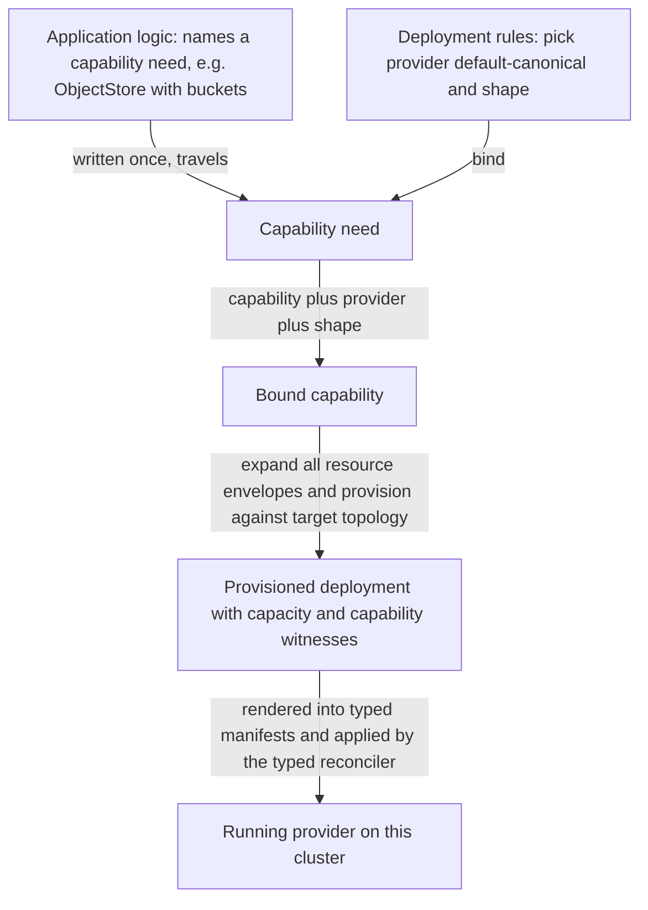
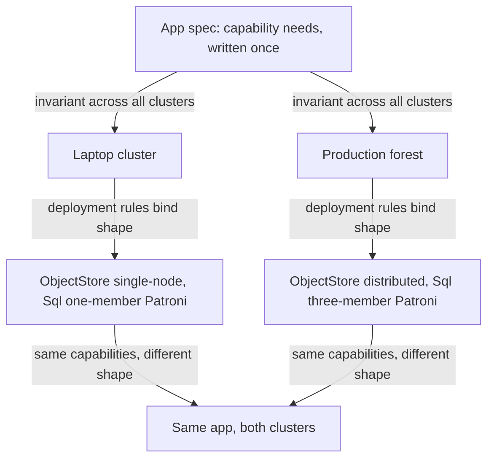

# Service Capabilities

**Status**: Authoritative source
**Supersedes**: N/A
**Referenced by**: DEVELOPMENT_PLAN/legacy_tracking_for_deletion.md, DEVELOPMENT_PLAN/overview.md, DEVELOPMENT_PLAN/phase_08_capability_binder.md, DEVELOPMENT_PLAN/phase_13_spa_composition_representational.md, DEVELOPMENT_PLAN/phase_23_app_tenancy.md, DEVELOPMENT_PLAN/phase_32_jitbuild_engine_cache.md, DEVELOPMENT_PLAN/phase_37_spa_live_deploy.md, DEVELOPMENT_PLAN/system_components.md, documents/engineering/README.md, documents/engineering/app_vs_deployment_doctrine.md, documents/engineering/capability_extension_doctrine.md, documents/engineering/cluster_topology_doctrine.md, documents/engineering/content_addressing_doctrine.md, documents/engineering/daemon_topology_doctrine.md, documents/engineering/dsl_doctrine.md, documents/engineering/image_build_doctrine.md, documents/engineering/manifest_generation_doctrine.md, documents/engineering/monitoring_doctrine.md, documents/engineering/namespace_layout_doctrine.md, documents/engineering/platform_services_doctrine.md, documents/engineering/resource_capacity_doctrine.md, documents/engineering/substrate_doctrine.md, documents/engineering/tenancy_doctrine.md, documents/illegal_state/illegal_state_capability_messaging.md, documents/illegal_state/illegal_state_capacity.md, documents/illegal_state/illegal_state_ml_asset.md, documents/illegal_state/illegal_state_techniques.md
**Generated sections**: none

> **Purpose**: Single source of truth for the abstraction by which amoebius application logic names abstract
> **capabilities** — ObjectStore, SecretStore, MessageBus, Sql, Identity, Observability, Registry, Edge —
> never products, and by which the platform binds each capability to one canonical provider and a per-cluster
> deployment shape.

---

## 1. Why capabilities, not products

**An app should be able to say "I need an ObjectStore," not "I need
MinIO."** Whether that object storage is served by MinIO, by a cloud S3, or by something amoebius has not
written yet is an implementation detail of the *platform* — and the moment an app spec writes the word
`minio`, it has welded itself to one realization and lost the right to run anywhere the platform decides to
realize that capability differently.

This is the application-logic-vs-deployment-rules split ([app_vs_deployment_doctrine.md](./app_vs_deployment_doctrine.md))
applied to *services*. That doctrine's litmus test is: **if changing it changes what the app is to a user, it
is application logic; if it changes only how, where, or how robustly the app runs, it is a deployment rule.**
A capability is what the app *is*: "this app keeps durable objects," "this app gates its surfaces behind an
identity provider," "this app produces and consumes a stream of events." The *product* that satisfies the
capability — and the *shape* in which that product is deployed — is how robustly and on what substrate the app
runs, and is therefore a deployment-rules concern. The capability survives a move; the product binding does
not have to.

amoebius's own vision already names products at the app surface — an app "may create one or more MinIO buckets
named `<app_name>/<bucket_name>` … may request a postgres DB". This doctrine
reads those as the *resources of a capability*: a `<app>/<bucket>` is an **ObjectStore** resource, a requested
database is a **Sql** resource, a declared topic lifecycle is a **MessageBus** resource. The app declares
resources *against a capability*; the capability is the abstract interface that keeps the provider swappable.
The app-surface inventory those resources belong to is owned by
[app_vs_deployment_doctrine.md §2](./app_vs_deployment_doctrine.md#2-the-application-logic-surface--what-an-app-is); this doctrine owns the *interface* behind
it.

Fungibility follows from this, stated from the app's side: an app that names capabilities is portable
across every cluster amoebius can build, because every cluster offers the same capabilities ([§6](#6-fungibility-reconciled-app-surface-invariant-shape-deployment-ruled)). An app that
named products would be portable only across clusters that ran the same products in the same shapes — which is
exactly the coupling amoebius exists to dissolve.

---

## 2. The capability set

amoebius defines a **fixed, small set of capabilities** — the abstract interfaces application logic is allowed
to name. They are not a new service set; they are the abstraction *over* the standard service set owned by
[platform_services_doctrine.md §1](./platform_services_doctrine.md#1-the-invariant-every-cluster-is-the-same-cluster). One line each:

| Capability | What application logic means by it |
|---|---|
| **ObjectStore** | Durable, S3-shaped object storage — named buckets and blobs that are not SQL rows. |
| **SecretStore** | The fail-closed root for secrets, keys, and certificates; the app references secrets *by name* only. |
| **MessageBus** | The pub/sub event and workflow backbone — declared topic lifecycles, at-least-once delivery. |
| **Sql** | A relational database the app keeps in its own namespace. |
| **Identity** | OIDC identity and the authorization rules that gate the app's surfaces, plus the wild-ingress door. |
| **Observability** | Cluster-local metrics and dashboards for platform and app workloads; each workflow additionally carries a mandatory derived per-workflow SLO surface, and each extension its declared surfaces (jitML → TensorBoard) ([monitoring_doctrine.md](./monitoring_doctrine.md)). |
| **Registry** | The OCI image registry every workload pulls from. |
| **Edge** | L7 routing and edge TLS termination — *which* of the app's services are reachable from the edge. |

These eight are the Phase-0 core vocabulary an app spec has for "a service I depend on." There is no arm for
"some other service," and no arm that names a product. An app that needs object storage selects
`ObjectStore`; it has no syntax with which to select `minio` ([§8](#8-capabilities-and-the-illegal-state-contract)). A ninth capability, **InferenceEngine**, is
added for ML serving as Phase-N design intent ([§4.1](#41-the-inferenceengine-capability--the-engine-is-substrate-selected-and-jit-resolved-never-authored)); it is one more *specific* closed-union capability — not
the generic "some other service" escape hatch this rule forbids, and its provider still has no product arm and
no URL arm.

---

## 3. One canonical provider; the type admits alternates

Each capability maps to **exactly one canonical provider today**. The mapping is fixed doctrine, not an
operator choice:

| Capability | Canonical provider (today) | Provider notes |
|---|---|---|
| ObjectStore | **MinIO** | distributed/erasure-coded at steady state; single-node shape on small clusters ([§5](#5-per-cluster-structural-shapes--beyond-values)) |
| SecretStore | **Vault** | the fail-closed secrets root; owned in full by [vault_pki_doctrine.md](./vault_pki_doctrine.md) |
| MessageBus | **Pulsar** (with ZooKeeper + BookKeeper) | native binary protocol, no WebSockets |
| Sql | **Patroni**, via the Percona operator | one Patroni cluster *per consuming capability instance*, never a shared mega-DB. Patroni is the fixed failover engine amoebius depends on; the operator that stands it up is a swappable deployment-rules default — a Zalando/CloudNativePG substitution preserves the same capability/shape contract and ultimately reaches Kubernetes only through deployment-global `renderAll :: ProvisionedSpec -> [K8sObject]`; it is not app-visible |
| Identity | **Keycloak** | owns all wild ingress through the Edge ([§7](#7-expressing-a-capability-in-the-dsl)); the single baked, offline-capable OSS identity provider that both **issues and validates** the OIDC/JWT tokens the Envoy ext-authz path enforces on every wild route, and performs realm/user-federation/RBAC administration in one binary — lighter proxies (Dex/oauth2-proxy) validate but do not manage identities, forcing a second identity store |
| Observability | **Prometheus / Grafana** | reachable only through the Identity-owned edge; its pull/scrape model matches the no-wild-ingress posture (targets sit behind the Identity edge, nothing is pushed outward), and amoebius must run identically on an offline laptop kind cluster, which rules out any SaaS/push-agent stack |
| Registry | **`distribution`** (the `registry:2` single-binary OCI registry) | **replaces Harbor** — see below |
| Edge | **Envoy + Gateway API** | the L4 LoadBalancer beneath it (MetalLB or cloud LB) is the one substrate-driven choice — MetalLB is the one mature OSS implementation of LoadBalancer-type Services on bare metal (L2/BGP), filling the exact gap cloud substrates get from their provider LB |

Canonical does not mean capacity-free. Binding `MessageBus` expands brokers, BookKeeper, offload, and the
closed `PulsarMetadataStoreDemand = ZooKeeper`: exact znode/session/watch/transaction operands, member
`PodResourceEnvelope`s, retained log/snapshot claims, and recovery overlap. Binding each `Sql` need constructs
a distinct `PatroniSqlDemand` with controller/webhook/child envelopes and finite data/WAL/checkpoint/failover
storage. Neither capability can contribute a private `ProvisionedServiceSpec` projection to a successful
whole-deployment provision when only the headline provider pods fit;
every derived execution unit, pod/CSI slot, and physical backing participates in whole-deployment provision.

The concrete provider/service **set** — what each provider is and how it is deployed at the platform level —
is owned by [platform_services_doctrine.md](./platform_services_doctrine.md), not duplicated here. This
doctrine owns only the *capability → provider* indirection over that set, plus two locked substitutions:

- **Registry is `distribution`, not Harbor.** The canonical Registry provider is the `distribution`
  single-binary OCI registry (`registry:2`) — a single baked binary on the same footing as MinIO and Vault —
  and **Harbor is retired**. amoebius drops Harbor's scanning, web UI, robot RBAC, and replication as separate
  concerns to be revisited only if ever needed, not steady-state requirements. The build pipeline, the
  registry image refs, and the supply-chain rule that every third-party service binary is **baked into the
  amoebius base container** (multi-arch `amd64`+`arm64`, no public-registry pulls at steady state) are owned
  by [image_build_doctrine.md](./image_build_doctrine.md); this doctrine owns only that the Registry
  capability now binds to `distribution`.
- **JVM providers are baked, not pulled.** Keycloak (Identity) and Pulsar+ZooKeeper+BookKeeper (MessageBus)
  are JVM services; the one new build toolchain they require — a multi-arch Temurin JRE/JDK — and the
  prefer-`apt` → official-binary → build-from-source supply chain are owned by
  [image_build_doctrine.md](./image_build_doctrine.md). The capability model is indifferent to the runtime; it
  is named here only so "Identity is a JVM service" is not mistaken for a capability fact.

**The type leaves room for alternates; amoebius builds none it does not need.** The indirection makes a
capability's provider a typed *union with one arm today* — `ObjectStore` could later admit an `S3`
arm, `Sql` could admit a managed cloud Postgres — without any app spec changing, because the app never named
the provider. But a union arm is not an adapter. amoebius **does not build a provider adapter it does not yet
need**: the alternates are headroom in the type, not shipped code. Claiming MinIO is swappable for S3 *today*
would be reporting a designed extension point as a built one.

> **Honesty.** "One canonical provider, type admits alternates" is Phase 8 design intent. The alternate arms
> are deliberately unbuilt; the canonical bindings above are the only providers amoebius implements. Status
> lives only in [../../DEVELOPMENT_PLAN/README.md](../../DEVELOPMENT_PLAN/README.md).

---

## 4. Capability → provider → shape: the binding

A capability becomes a running service through a **three-part binding**, and the three parts live on different
surfaces:

1. **The capability** is chosen by **application logic** — the app declares *that* it needs an ObjectStore, a
   Sql database, a set of MessageBus topics. This is the app's identity; it is written once and travels.
2. **The provider** is chosen by **deployment rules** — and defaults to the [§3](#3-one-canonical-provider-the-type-admits-alternates) canonical provider. An operator
   does not pick a provider per app in the common case; the canonical binding *is* the default. The provider
   slot exists so that a future alternate ([§3](#3-one-canonical-provider-the-type-admits-alternates)) is a deployment-rules edit, never an app-spec edit.
3. **The shape** is chosen by **deployment rules** — single-node vs distributed, replica counts, the structural
   object graph the provider is deployed as ([§5](#5-per-cluster-structural-shapes--beyond-values)).

Binding produces a `BoundDeployment`, not something renderable. The provider/shape graph must first be fully
expanded — standard platform services, replicas, app/init/controller containers, durable volumes, caches, and
accelerator owners — and passed with the selected topology to
`provision :: ProvisionContext -> Topology -> BoundDeployment -> Either ProvisionError ProvisionedSpec`
([resource_capacity_doctrine.md §4](./resource_capacity_doctrine.md#4-the-total-fold-fits-carve-place-and-the-nesting)).
`BoundDeployment` contains only unprovisioned intents/demands and opaque prior-provision references; the
context resolves those references, and all `Provisioned*` values remain private outputs under `ProvisionedSpec`.
Those private service projections contribute to one sealed identity-keyed `ProvisionedRenderSourceSet`; only
the opaque checked whole deployment crosses public
`renderAll :: ProvisionedSpec -> [K8sObject]`. This ordering prevents a capacity
check over a small pre-binding skeleton from missing resources introduced by the provider shape.

```dhall
-- Illustrative only; the real grammar and the two typed gates are owned by dsl_doctrine.md.

-- APPLICATION LOGIC names a capability need (no product, no shape), including its bounded storage shape:
let ObjectStoreBucketNeed =
      { name           : Text
      , initialObjects : List { key : Text, contentAddress : Text, storedBytes : Natural }
      , retention      : ObjectStoreRetentionBudget
      , writes         : ObjectStoreWriteBudget
      }
let ObjectStoreNeed = { buckets : List ObjectStoreBucketNeed }

-- DEPLOYMENT RULES bind the capability to a provider + a per-cluster shape:
let ObjectStoreBinding =
      { provider : < MinIO >                          -- canonical; the union has room to grow (e.g. | S3)
      , shape    : < SingleNode | Distributed : { nodes : Natural } >
      , budgets  : List { bucket : Text, budget : StorageBudget }
      }
```

The app's `ObjectStoreNeed` is byte-identical on a laptop and in a five-region production forest; only the
`ObjectStoreBinding` differs. This is the [§1](#1-why-capabilities-not-products) split made mechanical: the capability is the *what*, the
provider-and-shape is the *how/where/how-robust*. Which DSL surface each part physically lives on, and the
total composability that nests an app's needs inside a cluster spec, are owned by
[dsl_doctrine.md](./dsl_doctrine.md); the classification of each part as logic vs rules is owned by
[app_vs_deployment_doctrine.md](./app_vs_deployment_doctrine.md). This doctrine owns only the *binding model*.
The bucket name alone is never a complete need: retention bounds future resident object count/size, writes
bound concurrency and failed/orphan exposure, and binding derives the tenant/bucket/full-key identities plus
the exclusive object-write admission witness before the demand joins every other MinIO producer. The
deployment binding assigns every bucket exactly one closed `StorageBudget` and its backing/quota owner;
missing or mismatched budget ownership cannot reach provision.



<a id="41-the-inferenceengine-capability--the-engine-is-substrate-selected-and-jit-resolved-never-authored"></a>
### 4.1 The InferenceEngine capability — the engine is target-offering-selected and jit-resolved, never authored

ML serving adds a **ninth capability, `InferenceEngine`** — the abstract interface an ML workload names when it
says *"I serve inference,"* exactly as an app names `ObjectStore` when it says "I keep durable objects." It
exercises the [§4](#4-capability--provider--shape-the-binding) binding at its strictest: where a generic capability's provider *defaults* to the [§3](#3-one-canonical-provider-the-type-admits-alternates)
canonical (part 2 above) and could later admit an alternate, an `InferenceEngine`'s provider is a union with
**no arm to author a download** — it is **selected from an eligible target node/host offering derived from
the detected substrate** and materialized by the shared jit-build resolver on first miss. In a heterogeneous
cluster there is no single cluster-wide substrate to consult; selection must name a concrete eligible offering
or an elastic candidate class.

**The canonical provider is a closed union of substrate-tagged `EngineRuntime` identities.** `EngineRuntime` is
a **closed union over substrate lanes** (one arm per lane); the **engine family** is a *separate* closed-union
field of the `InferenceBinding` (the two compose as a product — lane × family — not one fused index; see the
Dhall below). Neither admits an arbitrary-`Url` / `Download` arm — the load-bearing rule — and each named
identity is resolved on first miss into a `CacheBudget`-bounded content-addressed
cache ([content_addressing_doctrine.md §4.5](./content_addressing_doctrine.md#45-the-ml-asset-lifecycle-one-bounded-content-addressed-cache-resolved-on-first-miss)):

| Provider dimension | Arms (closed union) |
|---|---|
| Engine lane (the `EngineRuntime` union) | `Apple-Metal` · `CUDA` · `linux-cpu` |
| Engine family (the `InferenceBinding.family` union, a named identity) | `llama.cpp` · `whisper.cpp` · `ONNX` · `vLLM` · `pytorch` · `diffusers` · `transformers` · `Audiveris` |

The ML siblings **link as libraries** rather than run as fetched sidecars, so the library is present the moment
the pod is; the engine *payload* the library drives is a named identity the shared **jit-build resolver**
materializes on first miss into the `CacheBudget`-bounded cache
([content_addressing_doctrine.md §4.5](./content_addressing_doctrine.md#45-the-ml-asset-lifecycle-one-bounded-content-addressed-cache-resolved-on-first-miss)),
with the resolver's build inputs and the base image owned by
[image_build_doctrine.md §7](./image_build_doctrine.md#7-what-amoebius-bakes-vs-builds--the-base-container-is-the-supply-chain).
The unions are closed **here** because every arm is a **named catalog identity**: adding an engine family is a new
`InferenceBinding.family` arm plus a resolver recipe, never something an app `.dhall` can author, and the families in the
table above map to the inference modalities the platform serves. The deployment `.dhall` **selects** an
arm through the target offering projected from the *detected* substrate (the substrate is DETECTED,
[substrate_doctrine.md](./substrate_doctrine.md));
it has no syntax with which to *author* an arbitrary download or build. This is the [§1](#1-why-capabilities-not-products) object-storage lesson taken to
its limit: an app can no more write "curl this engine URL at boot" than it can write "deploy `minio`."

**The engine offering is a quotient of one eligible target's detected substrate — a surjection, not an
orthogonal cluster-wide axis — and this doctrine owns that mapping.** `EngineRuntime` is a *coarsening* of the four-member substrate catalog
([substrate_doctrine.md §1](./substrate_doctrine.md#1-the-substrate-is-a-fact-about-the-host-not-a-knob),
[cluster_topology_doctrine.md §1](./cluster_topology_doctrine.md#1-two-axes-the-substrate-is-detected-the-engine-is-declared)):
`apple → AppleMetal`, `linux-cpu → LinuxCpu`, and — the one place two substrates collapse onto one arm —
`{ linux-cuda, windows } → Cuda`. `Cuda` is therefore **OS-agnostic**: there is no Linux-vs-Windows split inside
the union (that distinction has **no constructor** — type-foreclosed), and an eligible node/host's engine is
*projected from* its detected substrate, never declared free of it. The only freedom the quotient grants is that two substrates share
one engine arm; it never lets a spec author an engine its substrate cannot provide — that would reopen the
"selected by the detected substrate" foreclosure above, which the quotient **preserves** rather than
loosens. A `Cuda` demand paired with a topology whose nodes and elastic candidates all project to `LinuxCpu`
returns `Left MissingCapability Cuda`; there is no silent CPU fallback. The lane in the table above is named
the **Engine lane** precisely because `Cuda` now spans two
substrates: keying that row on "substrate" would be a misnomer, since "substrate" names exactly the 4-member
catalog owned by [substrate_doctrine.md §1](./substrate_doctrine.md#1-the-substrate-is-a-fact-about-the-host-not-a-knob).

**How the offering is realized is a daemon-context fact this doctrine cross-references, never restates.** The
*same* `Cuda` arm is stood up **in-cluster** on `linux-cuda` (a GPU pod under the NVIDIA container runtime) and
**host-level** on `windows` (a native subprocess reaching the cluster only over a host-only NodePort) — one engine
arm, two bootstraps; the pod-vs-subprocess realization and the `(substrate, bootstrap)` wiring are owned by
[daemon_topology_doctrine.md §4](./daemon_topology_doctrine.md#4-worker-daemons--n-unelected) and
[substrate_doctrine.md §5](./substrate_doctrine.md#5-host-worker-nodes-substrate-specific-hardware-that-refuses-to-be-contained),
referenced here (this doctrine is scoped to the engine as a substrate-selected, jit-resolved capability, not to where its process runs).
**Windows honesty note.** Unlike the Apple-Metal host worker — which has a build-shape sibling doc,
[apple_metal_headless_builds.md](./apple_metal_headless_builds.md) — the on-host Windows-`Cuda` build/run path is
**design intent with no sibling evidence** this round *introduces*; read it as intent, not a tested or
sibling-proven result.

`InferenceEngine` is **Tier 1** of the ML-asset lifecycle
([content_addressing_doctrine.md §4.5](./content_addressing_doctrine.md#45-the-ml-asset-lifecycle-one-bounded-content-addressed-cache-resolved-on-first-miss)); the model and kernel tiers live
there, not here — and all three now share one bounded-cache, resolve-on-miss shape:

- **Tier 1 — the engine (this capability)** is substrate-selected and jit-resolved into the bounded cache, as above.
- **Tier 2 — `ModelArtifact`** is an eager stage-then-serve into the content-addressed store, its `ArtifactRef`
  obtainable **only** once a `.ready` sentinel **and a provenance witness** exist — the witnessed serve gate (a
  committed producing checkpoint or a pinned content-addressed import) is owned by content_addressing
  [§4.5](./content_addressing_doctrine.md#45-the-ml-asset-lifecycle-one-bounded-content-addressed-cache-resolved-on-first-miss),
  referenced here, not restated.
- **Tier 3 — the JIT kernel** is lazily materialized behind a content address on first cache miss, never a
  startup build. Owned by content_addressing [§4.5](./content_addressing_doctrine.md#45-the-ml-asset-lifecycle-one-bounded-content-addressed-cache-resolved-on-first-miss).

**The engine↔model landing relation this doctrine co-owns.** A served `ModelArtifact` must be servable by an
`EngineRuntime` whose **engine family** is available on the **serving** substrate lane — the accelerator the
inference run actually uses — decoupled from the *producing* substrate that made the weight bytes
([content_addressing_doctrine.md §3.1](./content_addressing_doctrine.md#31-producing-substrate-vs-serving-substrate-a-distinct-serving-run-fingerprint)).
Serving substrate **need not equal** producing substrate: weight bytes are substrate-portable (movable,
content-addressed), not substrate-identical, so a model produced on one lane may serve on another. This round
**introduces** that decoupling — the relation keys on the serving lane, not on where the model was produced (there
is no "already checks the deployment's substrate" here). Availability is a **partial** family×lane relation — a
family may be available (resolver-supported) on some lanes and not others (e.g. `vLLM` is not available on Apple-Metal) — so a
family-not-available-on-the-serving-lane is a checked post-bind **`provision-seal`** rejection (the
topology/relation-over-collection technique,
[illegal_state_catalog.md §4.7](../illegal_state/illegal_state_techniques.md#47-compatibility--topology-relations-by-construction-over-a-collection)),
never a runtime `Unschedulable`. The relation keys on an engine-**family** tag the model must carry; that tag is a
`ModelArtifact`/manifest field owned by
[content_addressing_doctrine.md §4.5](./content_addressing_doctrine.md#45-the-ml-asset-lifecycle-one-bounded-content-addressed-cache-resolved-on-first-miss)
(referenced, not restated). content_addressing owns the `ModelArtifact` side; this doctrine owns the
engine-as-capability side — the family-availability-on-serving-substrate check — a model must match. A
**runtime-checked** residue survives the provision-sealed check: a family-matched but substrate-specific-weight-layout model
may still fail to **load** on the serving lane (bytes are portable, not guaranteed cross-lane loadable), a residue
owned by [content_addressing_doctrine.md §6.1](./content_addressing_doctrine.md#61-proven--tested--assumed-spelled-out),
not foreclosed here.

**The identity-complete accelerator workload set (this doctrine owns it, single-owner).** The *left operand* of
the accelerator-memory fold is not one favorable owner scalar. `InferenceBinding` carries an exact source
inventory of every served model, training job, JIT compilation, and accelerator-library work item, plus a
`NonEmptyMap` of workload demands with the identical key set. Each workload keeps weights, serving KV cache,
training activations/optimizer state, JIT workspace, and library workspace as distinct residency identities
with `Unsharded | ReplicatedPerDevice | Sharded` placement. A finite class-based resident/running policy is
enforced, and the binder/provisioner derives every coexistence epoch it permits; callers cannot enumerate only
favorable epochs. This is a **serving-side** demand recomputed on landing against the serving node's topology:
a producing-node footprint does **not** transfer as the serving-node demand. The *right operand* — the discrete device vector
with per-device raw/reserved/net-allocatable VRAM (`linux-cuda`/`windows`; only net allocatable is spendable)
or the Apple unified-memory budget debited from the shared host
memory pool — is owned by
[substrate_doctrine.md §8](./substrate_doctrine.md#8-the-node-inventory-the-single-owner-of-hosts-capacity-and-taints);
the per-device epoch assignment/aggregation arithmetic is owned by
[resource_capacity_doctrine.md §3](./resource_capacity_doctrine.md#3-the-types-quantity-capacity-demand-budget),
which **consumes** this workload set. It requires
`keys(sources) = keys(workloads)` and
`domains(maxResidentByClass) = domains(maxRunningByClass) = classes(sources)`; a missing class never defaults
to zero/serial and an extra class rejects. Residency `bytes` means total bytes for `Unsharded`/`Sharded` and
per-device bytes for `ReplicatedPerDevice`; sharded bytes sum exactly to that total, shard ids are unique, and
shard count cannot exceed wholesale owner devices. That the declared footprint actually fits at runtime under real batch/context
(dynamic KV-cache/fragmentation) is **runtime-checked** residue, not foreclosed by the provision-sealed Σ.

**Two mistakes become unrepresentable**, lifted at
[illegal_state_catalog.md §3.25](../illegal_state/illegal_state_ml_asset.md#325-an-ml-asset-named-by-arbitrary-url-or-an-unready--unlanded-model):

- **An engine named by arbitrary URL is type-foreclosed unrepresentable** — the `EngineRuntime` union is
  closed with no arbitrary-`Url`/`Download` arm, so "name the engine by URL" has no syntax and fails Gate 1
  (the Dhall typechecker) before any binary runs; the named identity is jit-resolved on first miss into the
  bounded cache. (A `ModelArtifact` with no completed `.ready` **and no
  provenance witness** is likewise type-foreclosed, owned with the content store in content_addressing
  [§4.5](./content_addressing_doctrine.md#45-the-ml-asset-lifecycle-one-bounded-content-addressed-cache-resolved-on-first-miss).)
- **A model/job whose engine family or accelerator provision is unavailable on the selected target is
  checked before render.** Structural family×lane or malformed residency/policy shapes reject at their
  Gate-2 locus. CUDA-on-CPU, too few devices, source/workload-domain mismatch after expansion, and any derived
  epoch whose co-resident per-device aggregate exceeds net allocatable memory return distinct post-bind
  `ProvisionError`s at `provision-seal`, never a runtime `Unschedulable`.

```dhall
-- Illustrative only; the real grammar is owned by dsl_doctrine.md and the asset tiers by
-- content_addressing_doctrine.md §4.5.

-- APPLICATION LOGIC names an inference need (no engine, no URL, no build):
let InferenceNeed = { serves : List ModelArtifact }    -- "I serve these models" — that is all an app says

-- DEPLOYMENT RULES name a SUBSTRATE-SELECTED engine identity, jit-resolved on first miss — no arbitrary-Url arm:
let EngineRuntime =
      < AppleMetal | Cuda | LinuxCpu >                  -- engine lane; CLOSED, a named identity, never a URL
let InferenceBinding =
      { engine      : EngineRuntime                    -- projected from an eligible target offering
      , family      : < LlamaCpp | WhisperCpp | Onnx | Vllm | Pytorch | Diffusers | Transformers | Audiveris >
      , accelerator :
          { profile     : AcceleratorProfile
          , devices     : PositiveNatural
          , sources     : NonEmptyMap AcceleratorWorkloadId AcceleratorWorkloadSource
          , workloads   : NonEmptyMap AcceleratorWorkloadId AcceleratorWorkloadDemand
          , coexistence :
              { maxResidentByClass : NonEmptyMap AcceleratorWorkloadClass PositiveNatural
              , maxRunningByClass  : NonEmptyMap AcceleratorWorkloadClass PositiveNatural
              , model              : AcceleratorCoexistenceModelVersion
              }
          }
      }                                                -- every arm is a named identity resolved into the bounded cache
```

Provision privately derives every allowed epoch and its complete per-device assignment. `Unsharded` remains
indivisible on one device, `ReplicatedPerDevice` is charged on every selected device, and `Sharded` carries
the complete unique shard list and interconnect requirement. Omitting a work item, accepting an authored
favorable epoch, dropping a co-resident per-device debit so overlap fits by one byte, or spending raw rather
than net allocatable VRAM is a distinct failed provision, not a runtime scheduling choice.

The three-tier store, the `.ready` commit, the re-keying onto content addresses, and the Tier-3 JIT are owned
by [content_addressing_doctrine.md §4.5](./content_addressing_doctrine.md#45-the-ml-asset-lifecycle-one-bounded-content-addressed-cache-resolved-on-first-miss); the base image carrying the
jit-build resolver + toolchain that materializes every `EngineRuntime` arm is owned by [image_build_doctrine.md §7](./image_build_doctrine.md#7-what-amoebius-bakes-vs-builds--the-base-container-is-the-supply-chain); the lift
of these mistakes into unrepresentable states is owned by
[illegal_state_catalog.md §3.25](../illegal_state/illegal_state_ml_asset.md#325-an-ml-asset-named-by-arbitrary-url-or-an-unready--unlanded-model). This doctrine owns only that the **engine is a
capability whose provider is substrate-selected and jit-resolved** — the resolver + toolchain are baked into the
base container, the engine *payload* is not (it is materialized on first miss into the `CacheBudget`-bounded
content-addressed cache, [content_addressing_doctrine.md §4.5](./content_addressing_doctrine.md#45-the-ml-asset-lifecycle-one-bounded-content-addressed-cache-resolved-on-first-miss)).

> **Honesty.** `InferenceEngine` is Phase-N design intent — the ML-serving capability, specified before
> implementation like the rest of this doctrine. The sibling **infernix** project is *evidence* that the
> select-don't-fetch engine binding is real code — **sibling evidence, not an amoebius result**:
> `infernix/src/Infernix/Runtime/Worker.hs` (sibling source)
> selects the engine by `adapterType` (`case engineBindingAdapterType engineBinding of …`) and **never fetches
> it** — precisely the Tier-1 discipline above. But infernix also shows the exact divergences amoebius fixes:
> its `infernix/docker/Dockerfile` **curl-tars native payloads and
> installs per-engine Poetry venvs at image build**, and its
> `infernix/python/adapters/model_cache.py` carries a
> hardcoded `minioadmin/minioadmin123` fallback — a second secret store that violates the Vault-by-name rule
> ([§7](#7-expressing-a-capability-in-the-dsl)). amoebius keeps infernix's engine-selection idiom but **replaces that image-build payload baking with
> jit-resolution** — the payload is materialized on first miss into the *one* `CacheBudget`-bounded
> content-addressed cache, never baked; only the resolver + toolchain are baked into the base container
> ([image_build_doctrine.md §7](./image_build_doctrine.md#7-what-amoebius-bakes-vs-builds--the-base-container-is-the-supply-chain)), and routes every staging credential through Vault by name. amoebius has built
> none of this; read it as the contract amoebius intends to satisfy, never a tested result. Status lives only
> in [../../DEVELOPMENT_PLAN/README.md](../../DEVELOPMENT_PLAN/README.md).

---

## 5. Per-cluster structural shapes — beyond values

The capability model's sharpest departure from a templating layer is here: **the same capability can have a
structurally different deployment shape on different clusters — a different object graph, not merely different
values.**

- **ObjectStore** is a single MinIO node on an admin's laptop and a distributed, erasure-coded MinIO across
  many nodes in production. Those are not the same manifests with one integer changed; they are different
  StatefulSets, different volume topologies, different service wiring.
- **Sql** is a one-member Patroni cluster on a small cluster and a three-member synchronously-replicated
  Patroni cluster in production — again a different object graph, not a `replicas: 1` → `replicas: 3` edit on
  one fixed shape.

This is strictly more than a Helm values flip. A values-only layer can vary numbers *within one chart shape*;
it cannot hand a laptop a single-node provider and a production cluster a distributed one from the *same*
capability declaration. amoebius's design handles this by construction: the shape is a typed choice that
selects *which manifest graph to render*, and the rendering is pure Haskell rather than a template. The doc that **renders a chosen shape into
typed Kubernetes manifests** — and applies them with amoebius's own idempotent typed reconciler (server-side
apply under a fixed field manager, label/ApplySet pruning, wait-for-ready, rollback), with **no Helm and no
templating layer** — is [manifest_generation_doctrine.md](./manifest_generation_doctrine.md). This doctrine
owns *that* a capability has a per-cluster shape; that doctrine owns *how* a shape becomes manifests.

This generalizes, rather than abandons, the HA-always posture of
[platform_services_doctrine.md §2](./platform_services_doctrine.md#2-ha-always--including-replicas1). The replica count was already a
deployment-rules dial; **shape is the structural generalization of that dial** — from a scalar (how many
replicas of one fixed graph) to a choice of graph (which provider topology). A single-node shape is still the
canonical provider deployed honestly at small scale, never a hand-special-cased substitute product: a
single-node `Sql` is a one-member Patroni cluster, never a bare `postgres` Pod. The dial got richer; it did
not get bypassed.

> **Honesty.** Per-cluster structural shapes are Phase 9 design intent. The sibling **prodbox** project is
> evidence that typed records render the manifests a provider needs — its
> `prodbox/src/Prodbox/Lib/Storage.hs` (sibling source)
> renders `Namespace`/`PV`/`PVC`/`StorageClass` from a typed `ChartStorageSpec → ChartStorageBinding →
> Data.Aeson.object` — but prodbox renders **one** shape per service and *enforces substrate-equivalence with a
> lint*. The per-cluster *structural* shape is the new, unproven move ([§6](#6-fungibility-reconciled-app-surface-invariant-shape-deployment-ruled)).

---

## 6. Fungibility, reconciled: app surface invariant, shape deployment-ruled

This section resolves the one real tension in the doctrine.

**prodbox enforces substrate-equivalence with a lint** — the two substrates (`home`, `AWS`) must stand up the
*identical* set of services in the *identical* shape, and a code path that re-pins a chart or image
conditionally on the active substrate is a build-time error. amoebius's
[platform_services_doctrine.md §12](./platform_services_doctrine.md#12-substrate-equivalence-as-a-structural-invariant) generalized that lint from two substrates
to all of them. **This doctrine deliberately reverses the part of that rule that fixes the *shape*.** Per-cluster
structural shapes ([§5](#5-per-cluster-structural-shapes--beyond-values)) are *exactly* the thing the prodbox lint forbade.

The reversal is clean, not a contradiction, because **fungibility moves up a level.** What is fungible is no
longer "every cluster runs the identical manifest graph"; it is:

- **The application is cluster-invariant.** The app's capability needs ([§2](#2-the-capability-set)) are byte-identical on every
  cluster. The app runs the same everywhere — same bytes, same capabilities, same surfaces. This is the
  invariant that actually matters, and it is owned as a classification by
  [app_vs_deployment_doctrine.md](./app_vs_deployment_doctrine.md).
- **The capability set is cluster-invariant.** Every amoebius cluster offers all eight capabilities with their
  canonical providers ([§2](#2-the-capability-set), [§3](#3-one-canonical-provider-the-type-admits-alternates)). A never-before-seen child cluster still has an ObjectStore, a Sql, an
  Identity. This is the residue of [platform_services_doctrine.md §1](./platform_services_doctrine.md#1-the-invariant-every-cluster-is-the-same-cluster)
  fungibility, refined from "same shape" to "same *capability set*."
- **The platform realization varies.** The capability → provider → **shape** binding is a deployment-rules
  concern that legitimately differs per cluster. The shape is *supposed* to vary; that is what lets one app
  spec run on a laptop and across a production forest unchanged.

**The substrate-equivalence lint is replaced by "app
surface invariant; shape deployment-ruled."** The lint that forbade per-substrate divergence is retired *for
shape*; what remains enforced is that the *capability set* and the *app surface* do not vary. amoebius still
refuses a different *capability set* per cluster (no "no-Registry" cluster); it now embraces a different
*shape* per cluster.



---

## 7. Expressing a capability in the DSL

This doctrine owns the capability **model**; the DSL **mechanics** — the typed Dhall surface, total
composability, the two structural gates, and the post-bind provision seal that alone constructs a
deployable `ProvisionedSpec` — are owned by [dsl_doctrine.md](./dsl_doctrine.md). The seam:

- **App logic declares needs against a capability.** Buckets against `ObjectStore`, a database against `Sql`,
  topic lifecycles against `MessageBus`, OIDC auth rules against `Identity`, published services against `Edge`.
  These are the same app-surface declarations catalogued by
  [app_vs_deployment_doctrine.md §2](./app_vs_deployment_doctrine.md#2-the-application-logic-surface--what-an-app-is), now read as capability resources.
- **Deployment rules declare the binding.** Provider (default canonical) + shape ([§4](#4-capability--provider--shape-the-binding), [§5](#5-per-cluster-structural-shapes--beyond-values)). The same app
  composes with a single-node binding or a distributed one with zero app-spec change.
- **Secrets and identity tie to Vault by name, never by value.** A provider that needs a credential — a `Sql`
  superuser password, an `Identity` OIDC client secret, a `Registry` push credential — carries a typed
  `SecretRef`, not a literal, and the workload resolves it in-cluster via Vault Kubernetes auth. That entire
  mechanism — the `SecretRef` contract, parent-injects-into-child, the PKI trust anchor — is owned by
  [vault_pki_doctrine.md](./vault_pki_doctrine.md). A capability binding **names** the secret; Vault holds it.
- **Connectivity is derived from the declared capability dependencies.** Because an app declares *which*
  capabilities it consumes, that dependency graph is exactly what the platform derives east-west connectivity
  from — an app that does not declare consuming `Sql` cannot reach the Sql provider. The derivation rule
  itself is owned by [platform_services_doctrine.md §9](./platform_services_doctrine.md#9-the-loadbalancer-and-the-single-wild-ingress-path),
  and its lift into a compile-time impossibility by [illegal_state_catalog.md §3.6](../illegal_state/illegal_state_security.md#36-blocking-networkpolicy-services-cant-reach-each-other).
- **The Edge capability does not let an app open a backdoor.** An app declares *what to publish* through
  `Edge`; *whether* wild traffic reaches it is still gated by the Identity-owned (Keycloak) wild-ingress door
  ([platform_services_doctrine.md §9](./platform_services_doctrine.md#9-the-loadbalancer-and-the-single-wild-ingress-path)). The capability publishes a route; it
  cannot publish an un-authenticated one.

---

## 8. Capabilities and the illegal-state contract

The capability indirection is not only an abstraction for tidiness — it makes a class of mistakes
**unrepresentable**. amoebius's general claim that *best practice is enforced by construction because the
alternative is unrepresentable* is owned, as a typing claim, by
[illegal_state_catalog.md](../illegal_state/illegal_state_catalog.md); this section records the capability-specific instances
it foreclosed:

- **An app cannot name a product.** The app surface offers a capability union ([§2](#2-the-capability-set)) with no product arms, so
  "deploy `minio` directly" has no syntax — it fails Gate 1 (the Dhall typechecker) before any binary runs.
- **A capability cannot bind to a provider with no inhabitant.** The provider union ([§3](#3-one-canonical-provider-the-type-admits-alternates)) admits only providers
  amoebius has built; an unbuilt alternate has no arm, so a binding to it does not decode (Gate 2).
- **A capability cannot be left unbound.** Every declared capability resource requires a binding; a capability
  need with no provider+shape is an undecodable record, not a runtime `Pending`.
- **A bound capability cannot bypass resource provisioning.** The source-expanded but unprovisioned deployment
  must construct the opaque `ProvisionedSpec`; a target missing CPU, memory, pod-ephemeral storage (including
  nested in-cluster cache), durable/native-host-cache storage, accelerator family/device count, or capacity
  for any identity-complete residency/coexistence epoch returns a structured post-bind `ProvisionError` at
  the provision seal. In particular,
  a CUDA requirement and a CPU-only topology can each be represented
  separately, but their invalid pairing cannot reach render.

The honest limit is the catalog's limit ([illegal_state_catalog.md §2](../illegal_state/illegal_state_catalog.md#2-the-load-bearing-limit-a-type-check-proves-the-spec-composes-not-that-the-cluster-enforces-it)): a green
type-check proves the *spec composes* — that the capability binding is coherent — not that the *running
provider* came up. The latter is a reconcile-time fact owned by the typed reconciler
([manifest_generation_doctrine.md](./manifest_generation_doctrine.md)) and verified by the chaos/testing
surface, never asserted here.

**What this doctrine does not own:**

| Topic | Owner |
|---|---|
| The concrete provider/service set and how each is deployed at platform level | [platform_services_doctrine.md](./platform_services_doctrine.md) |
| Rendering a shape into typed manifests + the idempotent typed reconciler (no Helm) | [manifest_generation_doctrine.md](./manifest_generation_doctrine.md) |
| The build pipeline, registry image refs, the baked base container, the Temurin JVM toolchain | [image_build_doctrine.md](./image_build_doctrine.md) |
| Secrets-by-name, `SecretRef`, Vault k8s auth, the PKI anchor | [vault_pki_doctrine.md](./vault_pki_doctrine.md) |
| The app-logic-vs-deployment-rules classification | [app_vs_deployment_doctrine.md](./app_vs_deployment_doctrine.md) |
| The DSL grammar, total composability, the two typed gates | [dsl_doctrine.md](./dsl_doctrine.md) |
| Which capability invariants are type-enforced (made unrepresentable) | [illegal_state_catalog.md](../illegal_state/illegal_state_catalog.md) |
| The substrate catalog and the substrate-driven LoadBalancer choice beneath Edge | [substrate_doctrine.md](./substrate_doctrine.md) |

> **Honesty.** The sibling **prodbox** project is *evidence* that the binding can be rendered and reconciled:
> `prodbox/src/Prodbox/CLI/Rke2.hs` (sibling source)
> renders `Secret`/`ServiceAccount`/`Role`/`ClusterIssuer`/`GatewayClass`/`HTTPRoute`/`IPAddressPool` from
> typed Haskell → Aeson → `kubectl apply`;
> `prodbox/src/Prodbox/Lib/Storage.hs` (sibling source)
> renders storage objects from typed records; and
> `prodbox/src/Prodbox/Lib/ChartPlatform.hs` (sibling source)
> is a planner/dependency/values orchestration the capability binding generalizes. But prodbox **names
> products**, still leans on a handful of third-party charts, and **enforces substrate-equivalence with a
> lint** — the capability abstraction, the alternate-admitting provider type, and per-cluster shapes are
> generalized *from* that evidence and are **not yet built or proven in amoebius**.

---

## 9. Planning ownership

This document is normative capability-model doctrine only. Delivery sequencing, completion status, validation
gates, and remaining work are owned by [../../DEVELOPMENT_PLAN/README.md](../../DEVELOPMENT_PLAN/README.md),
never restated here. For orientation only (the plan is authoritative): the **manifest generation + typed
reconciler that render and apply a chosen shape** land with platform services in **Phases 15 and 18**, and the
**capability abstraction itself — capability needs, the alternate-admitting provider binding, and per-cluster
shapes** — lands with the DSL type families in **Phase 8**. This doc states the target shape and links back for
status.

---

## Cross-references

- [Engineering Doctrine Index](./README.md)
- [App vs Deployment Doctrine](./app_vs_deployment_doctrine.md) — the application-logic-vs-deployment-rules split this model rides on
- [Platform Services Doctrine](./platform_services_doctrine.md) — the concrete provider set, the derived-connectivity rule ([§9](./platform_services_doctrine.md#9-the-loadbalancer-and-the-single-wild-ingress-path)), and the single wild-ingress path
- [DSL Doctrine](./dsl_doctrine.md) — the typed Dhall surface, total composability, and the two typed gates a capability binding decodes through
- [Manifest Generation Doctrine](./manifest_generation_doctrine.md) — rendering a chosen shape into typed manifests and the idempotent typed reconciler (no Helm)
- [Image Build Doctrine](./image_build_doctrine.md) — the build pipeline, the `distribution` registry refs, the base container ([§7](./image_build_doctrine.md#7-what-amoebius-bakes-vs-builds--the-base-container-is-the-supply-chain) bakes the jit-build resolver + toolchain that materializes every `EngineRuntime` arm), and the Temurin JVM toolchain
- [Content Addressing Doctrine](./content_addressing_doctrine.md) — the ML-asset lifecycle ([§4.5](./content_addressing_doctrine.md#45-the-ml-asset-lifecycle-one-bounded-content-addressed-cache-resolved-on-first-miss)) whose Tier-1 jit-resolved engine is the `InferenceEngine` provider; `ModelArtifact`/`.ready` and the JIT kernel
- [Vault / PKI Doctrine](./vault_pki_doctrine.md) — secrets-by-name, `SecretRef`, and Vault Kubernetes auth for provider credentials
- [Substrate Doctrine](./substrate_doctrine.md) — the substrate catalog, the DETECTED substrate that selects an `EngineRuntime`, and the substrate-driven LoadBalancer choice beneath Edge
- [Illegal State Catalog](../illegal_state/illegal_state_catalog.md) — best-practice-by-construction, which capability invariants are type-enforced, and the engine-fetch / unmatched-model states ([§3.25](../illegal_state/illegal_state_ml_asset.md#325-an-ml-asset-named-by-arbitrary-url-or-an-unready--unlanded-model))
- [Development Plan](../../DEVELOPMENT_PLAN/README.md)
- [Documentation Standards](../documentation_standards.md)

> **Honesty.** Everything in this doctrine is Phase 0 design intent, specified before implementation:
> manifest generation and the typed reconciler are Phase 16, and the capability abstraction is Phase 8. It is
> generalized from evidence in the sibling **prodbox** project (typed-Haskell→Aeson→`kubectl apply` rendering,
> a chart-platform planner) but **not yet built or proven in amoebius**, and prodbox itself names products and
> enforces the very substrate-equivalence lint this doctrine reverses. Per
> [documentation_standards.md §6](../documentation_standards.md#6-honesty-the-proventestedassumed-discipline), read every prescriptive statement here as the
> contract amoebius intends to satisfy, never as a tested amoebius result; status lives only in
> [../../DEVELOPMENT_PLAN/README.md](../../DEVELOPMENT_PLAN/README.md).
