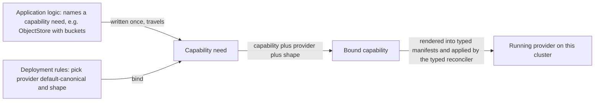
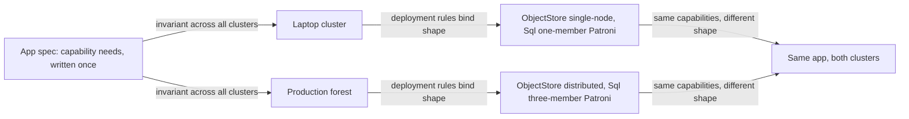

# Service Capabilities

**Status**: Authoritative source
**Supersedes**: N/A
**Referenced by**: documents/engineering/README.md, documents/engineering/app_vs_deployment_doctrine.md, documents/engineering/cluster_topology_doctrine.md, documents/engineering/dsl_doctrine.md, documents/engineering/illegal_state_catalog.md, documents/engineering/image_build_doctrine.md, documents/engineering/manifest_generation_doctrine.md, documents/engineering/platform_services_doctrine.md
**Generated sections**: none

> **Purpose**: Single source of truth for the abstraction by which amoebius application logic names abstract
> **capabilities** — ObjectStore, SecretStore, MessageBus, Sql, Identity, Observability, Registry, Edge —
> never products, and by which the platform binds each capability to one canonical provider and a per-cluster
> deployment shape.

---

## 1. Why capabilities, not products

The intuition is a single sentence: **an app should be able to say "I need an ObjectStore," not "I need
MinIO."** Whether that object storage is served by MinIO, by a cloud S3, or by something amoebius has not
written yet is an implementation detail of the *platform* — and the moment an app spec writes the word
`minio`, it has welded itself to one realization and lost the right to run anywhere the platform decides to
realize that capability differently.

This is the application-logic-vs-deployment-rules split ([app_vs_deployment_doctrine.md](./app_vs_deployment_doctrine.md))
applied to *services*. That doctrine's litmus test is: **if changing it changes what the app is to a user, it
is application logic; if it changes only how, where, or how robustly the app runs, it is a deployment rule.**
A capability is what the app *is*: "this app keeps durable objects," "this app gates its surfaces behind an
identity provider," "this app produces and consumes a stream of events." The *product* that satisfies the
capability — and the *shape* in which that product is deployed — is how robustly and on what substrate the app
runs, and is therefore a deployment-rules concern. The capability survives a move; the product binding does
not have to.

amoebius's own vision already names products at the app surface — an app "may create one or more MinIO buckets
named `<app_name>/<bucket_name>` … may request a postgres DB". This doctrine
reads those as the *resources of a capability*: a `<app>/<bucket>` is an **ObjectStore** resource, a requested
database is a **Sql** resource, a declared topic lifecycle is a **MessageBus** resource. The app declares
resources *against a capability*; the capability is the abstract interface that keeps the provider swappable.
The app-surface inventory those resources belong to is owned by
[app_vs_deployment_doctrine.md §2](./app_vs_deployment_doctrine.md); this doctrine owns the *interface* behind
it.

The payoff is the fungibility goal stated from the app's side: an app that names capabilities is portable
across every cluster amoebius can build, because every cluster offers the same capabilities (§6). An app that
named products would be portable only across clusters that ran the same products in the same shapes — which is
exactly the coupling amoebius exists to dissolve.

---

## 2. The capability set

amoebius defines a **fixed, small set of capabilities** — the abstract interfaces application logic is allowed
to name. They are not a new service set; they are the abstraction *over* the standard service set owned by
[platform_services_doctrine.md §1](./platform_services_doctrine.md). One line each:

| Capability | What application logic means by it |
|---|---|
| **ObjectStore** | Durable, S3-shaped object storage — named buckets and blobs that are not SQL rows. |
| **SecretStore** | The fail-closed root for secrets, keys, and certificates; the app references secrets *by name* only. |
| **MessageBus** | The pub/sub event and workflow backbone — declared topic lifecycles, at-least-once delivery. |
| **Sql** | A relational database the app keeps in its own namespace. |
| **Identity** | OIDC identity and the authorization rules that gate the app's surfaces, plus the wild-ingress door. |
| **Observability** | Cluster-local metrics and dashboards for platform and app workloads. |
| **Registry** | The OCI image registry every workload pulls from. |
| **Edge** | L7 routing and edge TLS termination — *which* of the app's services are reachable from the edge. |

These eight are the whole vocabulary an app spec has for "a service I depend on." There is no ninth arm for
"some other service," and no arm that names a product. An app that needs object storage selects
`ObjectStore`; it has no syntax with which to select `minio` (§8).

---

## 3. One canonical provider; the type admits alternates

Each capability maps to **exactly one canonical provider today**. The mapping is fixed doctrine, not an
operator choice:

| Capability | Canonical provider (today) | Provider notes |
|---|---|---|
| ObjectStore | **MinIO** | distributed/erasure-coded at steady state; single-node shape on small clusters (§5) |
| SecretStore | **Vault** | the fail-closed secrets root; owned in full by [vault_pki_doctrine.md](./vault_pki_doctrine.md) |
| MessageBus | **Pulsar** (with ZooKeeper + BookKeeper) | native binary protocol, no WebSockets |
| Sql | **Patroni**, via the Percona operator | one Patroni cluster *per consuming capability instance*, never a shared mega-DB |
| Identity | **Keycloak** | owns all wild ingress through the Edge (§7) |
| Observability | **Prometheus / Grafana** | reachable only through the Identity-owned edge |
| Registry | **`distribution`** (the `registry:2` single-binary OCI registry) | **replaces Harbor** — see below |
| Edge | **Envoy + Gateway API** | the L4 LoadBalancer beneath it (MetalLB or cloud LB) is the one substrate-driven choice |

The concrete provider/service **set** — what each provider is and how it is deployed at the platform level —
is owned by [platform_services_doctrine.md](./platform_services_doctrine.md), not duplicated here. This
doctrine owns only the *capability → provider* indirection over that set, plus two locked substitutions:

- **Registry is `distribution`, not Harbor.** The canonical Registry provider is the `distribution`
  single-binary OCI registry (`registry:2`) — a single baked binary on the same footing as MinIO and Vault —
  and **Harbor is retired**. amoebius drops Harbor's scanning, web UI, robot RBAC, and replication as separate
  concerns to be revisited only if ever needed, not steady-state requirements. The build pipeline, the
  registry image refs, and the supply-chain rule that every third-party service binary is **baked into the
  amoebius base container** (multi-arch `amd64`+`arm64`, no public-registry pulls at steady state) are owned
  by [image_build_doctrine.md](./image_build_doctrine.md); this doctrine owns only that the Registry
  capability now binds to `distribution`.
- **JVM providers are baked, not pulled.** Keycloak (Identity) and Pulsar+ZooKeeper+BookKeeper (MessageBus)
  are JVM services; the one new build toolchain they require — a multi-arch Temurin JRE/JDK — and the
  prefer-`apt` → official-binary → build-from-source supply chain are owned by
  [image_build_doctrine.md](./image_build_doctrine.md). The capability model is indifferent to the runtime; it
  is named here only so "Identity is a JVM service" is not mistaken for a capability fact.

**The type leaves room for alternates; amoebius builds none it does not need.** The point of the indirection
is that a capability's provider is a typed *union with one arm today* — `ObjectStore` could later admit an `S3`
arm, `Sql` could admit a managed cloud Postgres — without any app spec changing, because the app never named
the provider. But a union arm is not an adapter. amoebius **does not build a provider adapter it does not yet
need**: the alternates are headroom in the type, not shipped code. Claiming MinIO is swappable for S3 *today*
would be reporting a designed extension point as a built one.

> **Honesty.** "One canonical provider, type admits alternates" is Phase 3 design intent. The alternate arms
> are deliberately unbuilt; the canonical bindings above are the only providers amoebius implements. Status
> lives only in [../../DEVELOPMENT_PLAN/README.md](../../DEVELOPMENT_PLAN/README.md).

---

## 4. Capability → provider → shape: the binding

A capability becomes a running service through a **three-part binding**, and the three parts live on different
surfaces:

1. **The capability** is chosen by **application logic** — the app declares *that* it needs an ObjectStore, a
   Sql database, a set of MessageBus topics. This is the app's identity; it is written once and travels.
2. **The provider** is chosen by **deployment rules** — and defaults to the §3 canonical provider. An operator
   does not pick a provider per app in the common case; the canonical binding *is* the default. The provider
   slot exists so that a future alternate (§3) is a deployment-rules edit, never an app-spec edit.
3. **The shape** is chosen by **deployment rules** — single-node vs distributed, replica counts, the structural
   object graph the provider is deployed as (§5).

```dhall
-- Illustrative only; the real grammar and the two typed gates are owned by dsl_doctrine.md.

-- APPLICATION LOGIC names a capability need (no product, no shape):
let ObjectStoreNeed = { buckets : List Text }        -- "I keep these buckets" — that is all an app says

-- DEPLOYMENT RULES bind the capability to a provider + a per-cluster shape:
let ObjectStoreBinding =
      { provider : < MinIO >                          -- canonical; the union has room to grow (e.g. | S3)
      , shape    : < SingleNode | Distributed : { nodes : Natural } >
      }
```

The app's `ObjectStoreNeed` is byte-identical on a laptop and in a five-region production forest; only the
`ObjectStoreBinding` differs. This is the §1 split made mechanical: the capability is the *what*, the
provider-and-shape is the *how/where/how-robust*. Which DSL surface each part physically lives on, and the
total composability that nests an app's needs inside a cluster spec, are owned by
[dsl_doctrine.md](./dsl_doctrine.md); the classification of each part as logic vs rules is owned by
[app_vs_deployment_doctrine.md](./app_vs_deployment_doctrine.md). This doctrine owns only the *binding model*.



---

## 5. Per-cluster structural shapes — beyond values

The capability model's sharpest departure from a templating layer is here: **the same capability can have a
structurally different deployment shape on different clusters — a different object graph, not merely different
values.**

- **ObjectStore** is a single MinIO node on an admin's laptop and a distributed, erasure-coded MinIO across
  many nodes in production. Those are not the same manifests with one integer changed; they are different
  StatefulSets, different volume topologies, different service wiring.
- **Sql** is a one-member Patroni cluster on a small cluster and a three-member synchronously-replicated
  Patroni cluster in production — again a different object graph, not a `replicas: 1` → `replicas: 3` edit on
  one fixed shape.

This is strictly more than a Helm values flip. A values-only layer can vary numbers *within one chart shape*;
it cannot hand a laptop a single-node provider and a production cluster a distributed one from the *same*
capability declaration. amoebius's design handles this by construction: the shape is a typed choice that
selects *which manifest graph to render*, and the rendering is pure Haskell rather than a template. The doc that **renders a chosen shape into
typed Kubernetes manifests** — and applies them with amoebius's own idempotent typed reconciler (server-side
apply under a fixed field manager, label/ApplySet pruning, wait-for-ready, rollback), with **no Helm and no
templating layer** — is [manifest_generation_doctrine.md](./manifest_generation_doctrine.md). This doctrine
owns *that* a capability has a per-cluster shape; that doctrine owns *how* a shape becomes manifests.

This generalizes, rather than abandons, the HA-always posture of
[platform_services_doctrine.md §2](./platform_services_doctrine.md). The replica count was already a
deployment-rules dial; **shape is the structural generalization of that dial** — from a scalar (how many
replicas of one fixed graph) to a choice of graph (which provider topology). A single-node shape is still the
canonical provider deployed honestly at small scale, never a hand-special-cased substitute product: a
single-node `Sql` is a one-member Patroni cluster, never a bare `postgres` Pod. The dial got richer; it did
not get bypassed.

> **Honesty.** Per-cluster structural shapes are Phase 3 design intent. The sibling **prodbox** project is
> evidence that typed records render the manifests a provider needs — its
> [/home/matthewnowak/prodbox/src/Prodbox/Lib/Storage.hs](file:///home/matthewnowak/prodbox/src/Prodbox/Lib/Storage.hs)
> renders `Namespace`/`PV`/`PVC`/`StorageClass` from a typed `ChartStorageSpec → ChartStorageBinding →
> Data.Aeson.object` — but prodbox renders **one** shape per service and *enforces substrate-equivalence with a
> lint*. The per-cluster *structural* shape is the new, unproven move (§6).

---

## 6. Fungibility, reconciled: app surface invariant, shape deployment-ruled

This section resolves the one real tension in the doctrine, head-on.

**prodbox enforces substrate-equivalence with a lint** — the two substrates (`home`, `AWS`) must stand up the
*identical* set of services in the *identical* shape, and a code path that re-pins a chart or image
conditionally on the active substrate is a build-time error. amoebius's
[platform_services_doctrine.md §12](./platform_services_doctrine.md) generalized that lint from two substrates
to all of them. **This doctrine deliberately reverses the part of that rule that fixes the *shape*.** Per-cluster
structural shapes (§5) are *exactly* the thing the prodbox lint forbade.

The reversal is clean, not a contradiction, because **fungibility moves up a level.** What is fungible is no
longer "every cluster runs the identical manifest graph"; it is:

- **The application is cluster-invariant.** The app's capability needs (§2) are byte-identical on every
  cluster. The app runs the same everywhere — same bytes, same capabilities, same surfaces. This is the
  invariant that actually matters, and it is owned as a classification by
  [app_vs_deployment_doctrine.md](./app_vs_deployment_doctrine.md).
- **The capability set is cluster-invariant.** Every amoebius cluster offers all eight capabilities with their
  canonical providers (§2, §3). A child cluster you have never seen still has an ObjectStore, a Sql, an
  Identity. This is the residue of [platform_services_doctrine.md §1](./platform_services_doctrine.md)
  fungibility, refined from "same shape" to "same *capability set*."
- **The platform realization varies.** The capability → provider → **shape** binding is a deployment-rules
  concern that legitimately differs per cluster. The shape is *supposed* to vary; that is what lets one app
  spec run on a laptop and across a production forest unchanged.

Stated as plainly as the locked decision deserves: **the substrate-equivalence lint is replaced by "app
surface invariant; shape deployment-ruled."** The lint that forbade per-substrate divergence is retired *for
shape*; what remains enforced is that the *capability set* and the *app surface* do not vary. amoebius still
refuses a different *capability set* per cluster (no "no-Registry" cluster); it now embraces a different
*shape* per cluster.



---

## 7. Expressing a capability in the DSL

This doctrine owns the capability **model**; the DSL **mechanics** — the typed Dhall surface, total
composability, and the two typed gates that make "if it decodes, it is deployable" true — are owned by
[dsl_doctrine.md](./dsl_doctrine.md). The seam:

- **App logic declares needs against a capability.** Buckets against `ObjectStore`, a database against `Sql`,
  topic lifecycles against `MessageBus`, OIDC auth rules against `Identity`, published services against `Edge`.
  These are the same app-surface declarations catalogued by
  [app_vs_deployment_doctrine.md §2](./app_vs_deployment_doctrine.md), now read as capability resources.
- **Deployment rules declare the binding.** Provider (default canonical) + shape (§4, §5). The same app
  composes with a single-node binding or a distributed one with zero app-spec change.
- **Secrets and identity tie to Vault by name, never by value.** A provider that needs a credential — a `Sql`
  superuser password, an `Identity` OIDC client secret, a `Registry` push credential — carries a typed
  `SecretRef`, not a literal, and the workload resolves it in-cluster via Vault Kubernetes auth. That entire
  mechanism — the `SecretRef` contract, parent-injects-into-child, the PKI trust anchor — is owned by
  [vault_pki_doctrine.md](./vault_pki_doctrine.md). A capability binding **names** the secret; Vault holds it.
- **Connectivity is derived from the declared capability dependencies.** Because an app declares *which*
  capabilities it consumes, that dependency graph is exactly what the platform derives east-west connectivity
  from — an app that does not declare consuming `Sql` cannot reach the Sql provider. The derivation rule
  itself is owned by [platform_services_doctrine.md §9](./platform_services_doctrine.md#east-west-connectivity-is-derived-from-the-dependency-graph),
  and its lift into a compile-time impossibility by [illegal_state_catalog.md](./illegal_state_catalog.md) §3.6.
- **The Edge capability does not let an app open a backdoor.** An app declares *what to publish* through
  `Edge`; *whether* wild traffic reaches it is still gated by the Identity-owned (Keycloak) wild-ingress door
  ([platform_services_doctrine.md §9](./platform_services_doctrine.md)). The capability publishes a route; it
  cannot publish an un-authenticated one.

---

## 8. Capabilities and the illegal-state contract

The capability indirection is not only an abstraction for tidiness — it makes a class of mistakes
**unrepresentable**. amoebius's general claim that *best practice is enforced by construction because the
alternative is unrepresentable* is owned, as a typing claim, by
[illegal_state_catalog.md](./illegal_state_catalog.md); this section records the capability-specific instances
it foreclosed:

- **An app cannot name a product.** The app surface offers a capability union (§2) with no product arms, so
  "deploy `minio` directly" has no syntax — it fails Gate 1 (the Dhall typechecker) before any binary runs.
- **A capability cannot bind to a provider with no inhabitant.** The provider union (§3) admits only providers
  amoebius has built; an unbuilt alternate has no arm, so a binding to it does not decode (Gate 2).
- **A capability cannot be left unbound.** Every declared capability resource requires a binding; a capability
  need with no provider+shape is an undecodable record, not a runtime `Pending`.

The honest limit is the catalog's limit ([illegal_state_catalog.md §2](./illegal_state_catalog.md)): a green
type-check proves the *spec composes* — that the capability binding is coherent — not that the *running
provider* came up. The latter is a reconcile-time fact owned by the typed reconciler
([manifest_generation_doctrine.md](./manifest_generation_doctrine.md)) and verified by the chaos/testing
surface, never asserted here.

**What this doctrine does not own:**

| Topic | Owner |
|---|---|
| The concrete provider/service set and how each is deployed at platform level | [platform_services_doctrine.md](./platform_services_doctrine.md) |
| Rendering a shape into typed manifests + the idempotent typed reconciler (no Helm) | [manifest_generation_doctrine.md](./manifest_generation_doctrine.md) |
| The build pipeline, registry image refs, the baked base container, the Temurin JVM toolchain | [image_build_doctrine.md](./image_build_doctrine.md) |
| Secrets-by-name, `SecretRef`, Vault k8s auth, the PKI anchor | [vault_pki_doctrine.md](./vault_pki_doctrine.md) |
| The app-logic-vs-deployment-rules classification | [app_vs_deployment_doctrine.md](./app_vs_deployment_doctrine.md) |
| The DSL grammar, total composability, the two typed gates | [dsl_doctrine.md](./dsl_doctrine.md) |
| Which capability invariants are type-enforced (made unrepresentable) | [illegal_state_catalog.md](./illegal_state_catalog.md) |
| The substrate catalog and the substrate-driven LoadBalancer choice beneath Edge | [substrate_doctrine.md](./substrate_doctrine.md) |

> **Honesty.** The sibling **prodbox** project is *evidence* that the binding can be rendered and reconciled:
> [/home/matthewnowak/prodbox/src/Prodbox/CLI/Rke2.hs](file:///home/matthewnowak/prodbox/src/Prodbox/CLI/Rke2.hs)
> renders `Secret`/`ServiceAccount`/`Role`/`ClusterIssuer`/`GatewayClass`/`HTTPRoute`/`IPAddressPool` from
> typed Haskell → Aeson → `kubectl apply`;
> [/home/matthewnowak/prodbox/src/Prodbox/Lib/Storage.hs](file:///home/matthewnowak/prodbox/src/Prodbox/Lib/Storage.hs)
> renders storage objects from typed records; and
> [/home/matthewnowak/prodbox/src/Prodbox/Lib/ChartPlatform.hs](file:///home/matthewnowak/prodbox/src/Prodbox/Lib/ChartPlatform.hs)
> is a planner/dependency/values orchestration the capability binding generalizes. But prodbox **names
> products**, still leans on a handful of third-party charts, and **enforces substrate-equivalence with a
> lint** — the capability abstraction, the alternate-admitting provider type, and per-cluster shapes are
> generalized *from* that evidence and are **not yet built or proven in amoebius**.

---

## 9. Planning ownership

This document is normative capability-model doctrine only. Delivery sequencing, completion status, validation
gates, and remaining work are owned by [../../DEVELOPMENT_PLAN/README.md](../../DEVELOPMENT_PLAN/README.md),
never restated here. For orientation only (the plan is authoritative): the **manifest generation + typed
reconciler that render and apply a chosen shape** land with platform services in **Phase 2**, and the
**capability abstraction itself — capability needs, the alternate-admitting provider binding, and per-cluster
shapes** — lands with the DSL type families in **Phase 3**. This doc states the target shape and links back for
status.

---

## Cross-references

- [Engineering Doctrine Index](./README.md)
- [App vs Deployment Doctrine](./app_vs_deployment_doctrine.md) — the application-logic-vs-deployment-rules split this model rides on
- [Platform Services Doctrine](./platform_services_doctrine.md) — the concrete provider set, the derived-connectivity rule (§9), and the single wild-ingress path
- [DSL Doctrine](./dsl_doctrine.md) — the typed Dhall surface, total composability, and the two typed gates a capability binding decodes through
- [Manifest Generation Doctrine](./manifest_generation_doctrine.md) — rendering a chosen shape into typed manifests and the idempotent typed reconciler (no Helm)
- [Image Build Doctrine](./image_build_doctrine.md) — the build pipeline, the `distribution` registry refs, the baked base container, and the Temurin JVM toolchain
- [Vault / PKI Doctrine](./vault_pki_doctrine.md) — secrets-by-name, `SecretRef`, and Vault Kubernetes auth for provider credentials
- [Substrate Doctrine](./substrate_doctrine.md) — the substrate catalog and the substrate-driven LoadBalancer choice beneath Edge
- [Illegal State Catalog](./illegal_state_catalog.md) — best-practice-by-construction and which capability invariants are type-enforced
- [Development Plan](../../DEVELOPMENT_PLAN/README.md)
- [Documentation Standards](../documentation_standards.md)

> **Honesty.** Everything in this doctrine is Phase 0 design intent, specified before implementation:
> manifest generation and the typed reconciler are Phase 2, and the capability abstraction is Phase 3. It is
> generalized from evidence in the sibling **prodbox** project (typed-Haskell→Aeson→`kubectl apply` rendering,
> a chart-platform planner) but **not yet built or proven in amoebius**, and prodbox itself names products and
> enforces the very substrate-equivalence lint this doctrine reverses. Per
> [documentation_standards.md §6](../documentation_standards.md), read every prescriptive statement here as the
> contract amoebius intends to satisfy, never as a tested amoebius result; status lives only in
> [../../DEVELOPMENT_PLAN/README.md](../../DEVELOPMENT_PLAN/README.md).
