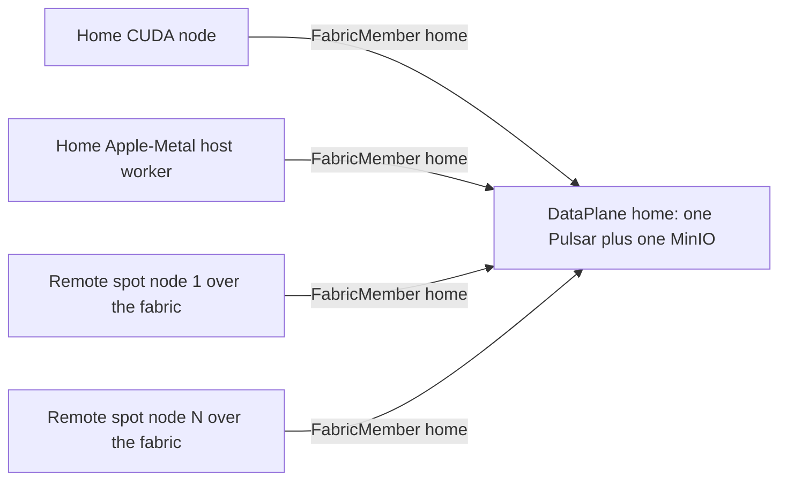

# The Single Logical Data Plane & Remote Compute Attach

**Status**: Authoritative source
**Supersedes**: N/A
**Referenced by**: documents/engineering/README.md, documents/engineering/host_cluster_comms_doctrine.md, documents/engineering/network_fabric_doctrine.md, documents/engineering/pulumi_iac_doctrine.md
**Generated sections**: none

> **Purpose**: Single Source of Truth for the distinction between *one data plane reached from many compute
> locations* and *many data planes reached by gateway migration* — so that remote elastic compute (e.g. spot
> ML) is modelled as **Pulsar + MinIO clients of the home cluster's one store over the fabric, never as a
> second cluster** — and for the `DataPlane`/`FabricMember` binding that makes "a workload bound to a store
> it cannot reach" unrepresentable.

---

## 1. Why this doctrine exists: two ways to say "run this elsewhere"

The vision wants a workload's state to live in "a single logical Pulsar and KV store irrespective of how
many nodes are running or where they are running." Taken naively, that collides head-on with a locked
invariant: **a cluster is *the* consistency boundary.** Within one cluster, Pulsar/MinIO/Postgres are
strongly consistent (delegated); *across* clusters, the only relationship is **asynchronous geo-replication**,
and "a single global view across clusters is a cross-cluster split-brain in waiting"
([chaos_failover_doctrine.md](./chaos_failover_doctrine.md)). You cannot have one strongly-consistent logical
store spanning two clusters without either unbounded latency or divergence — that is physics, not a design
choice.

This doctrine resolves the collision by observing that **"run this elsewhere" names two structurally
different things**, and making the difference a matter of *which type you reach for*:

- **One data plane, many compute locations.** The remote compute is *not a cluster*. It is stateless
  compute that joins the home cluster's **one** Pulsar/MinIO as a client over the fabric. There is exactly
  one store; "irrespective of where nodes run" is satisfied *by construction*, because the nodes hold no
  store — they are clients of the home cluster's.
- **Many data planes, reached by gateway migration.** The remote compute *is* a second cluster, with its
  own Pulsar/MinIO, related to the home cluster only by async geo-replication and the single-gateway
  authority. This is the existing multi-cluster world owned by
  [chaos_failover_doctrine.md](./chaos_failover_doctrine.md) and Phase 9.

The whole job of this document is to keep those two apart, so the cheap case (attach) never drags on the
expensive case's machinery (geo-replication, the Second-Axis proof obligation, the R9 data-loss budget), and
the expensive case is never mistaken for the cheap one.

There is a **third** shape this doctrine must keep distinct from both: a **stretched cluster** — *one*
cluster whose nodes or host workers sit at more than one network locality, reached across a WAN. It is
emphatically **not** the second-cluster case: it has **one** etcd, **one** consistency boundary, **no** second
store, and **no** async geo-replication link, so it owes **no** R9 data-loss budget and **no** Second-Axis
obligation — the [chaos_failover_doctrine.md](./chaos_failover_doctrine.md) machinery it is exempt from. Within
a stretched cluster the "run this elsewhere" question refines by *kind*: a **stretched host worker** is a
non-member **client** — the attach shape of §4, holding no store and needing only data-plane + Vault reach —
while a **stretched full node** is a **member** kubelet carrying a control-plane reachability witness
(`ReachesControlPlane c`), a different kind owned by
[cluster_topology_doctrine.md](./cluster_topology_doctrine.md). This round's doctrine introduces that two-kind
stretched split; the *why* it stays one boundary (a cluster is *the* consistency boundary) is exactly §1's
opening invariant, unchanged.

---

## 2. The two topologies

| | **Worker-pool attach** (one plane) | **Second cluster** (two planes) |
|---|---|---|
| The remote thing is | An elastic pool of stateless nodes | A full amoebius cluster |
| Its store | **None** — it is a *client* of the home cluster's one Pulsar/MinIO | Its own Pulsar/MinIO/Postgres |
| Cross-boundary cost | **None** — one consistency boundary; no geo-replication | Async geo-replication; the Second-Axis obligation |
| Data-loss budget (R9) | **Never applies** — nothing un-replicated to lose | Applies to the crash-failover suffix |
| Canonical use | Batch/ML burst compute on cheap spot capacity | Serving-tier overflow with gateway migration |
| Owned by | **This doc** + [network_fabric_doctrine.md](./network_fabric_doctrine.md) | [chaos_failover_doctrine.md](./chaos_failover_doctrine.md), Phase 9 |

The load-bearing decision: **the worker pool is NOT a fourth arm of the closed `ComputeEngine` union**
([cluster_topology_doctrine.md §2](./cluster_topology_doctrine.md#2-computeengine-a-closed-union-eks-a-first-class-arm)). Making it an engine arm would give it a
cluster identity and therefore its own data plane — exactly the second boundary we must avoid. It is a
*separate deployment-rules type keyed to an existing cluster's data plane*, so the `ComputeEngine` union
stays closed and the attach topology provably creates no second store.

**A stretched cluster overlays this table rather than adding a column.** A stretched host worker occupies the
**left** column — a non-member client of the one plane, no store, no geo-replication, R9 never applies — even
though it sits across a WAN; only its *reach* is remote, not its *boundary*. A stretched full-member node is
still **one** cluster (one etcd, one boundary), **not** the right column's second cluster — it is a member
reached over the WAN, carrying a control-plane witness
([cluster_topology_doctrine.md](./cluster_topology_doctrine.md)). Distance is a **networking** fact, never a
**boundary** fact; neither stretched kind mints a second store, so neither drags in the second-cluster
machinery. This round's stretched-cluster doctrine introduces both kinds; §4 owns the host-worker (attach)
kind, and the member/kubelet kind is owned by
[cluster_topology_doctrine.md](./cluster_topology_doctrine.md).

---

## 3. The binding: reachability is a type, not a runtime probe

A `DataPlane` is a typed handle to **one cluster's one Pulsar + one object/KV store**. It is a single-owner
value (an ownership index, [illegal_state_catalog.md §4.4](./illegal_state_catalog.md#44-ownership-indices--single-owner-ssot-structurally)) *projected* from the
platform-service set, never authored — so "two logical stores for one cluster" has no constructor.

The crux — "a workload bound to a store it cannot reach" — is foreclosed by making **fabric membership a
capability** ([illegal_state_catalog.md §4.2](./illegal_state_catalog.md#42-capability-and-phantom-tenant-tags--cross-tenant-refs-are-uninhabitable)) phantom-indexed by the owning
cluster. A logical binding resolves to a physical handle *only* on presentation of that capability:

```haskell
-- One data plane per (cluster c, tenant t). Single owner; projected, not authored.
data DataPlane (c :: ClusterId) t = DataPlane
  { dpPulsar :: PulsarEndpoint      c    -- the ONE broker set of cluster c
  , dpStore  :: ObjectStoreEndpoint c }  -- the ONE MinIO/KV of cluster c

-- Capability: "I am an authenticated peer on cluster c's fabric."
-- Its constructors are (i) an in-cluster workload of c and (ii) a node that has joined c's
-- WireGuard fabric (network_fabric_doctrine.md) -- the sole off-host constructor today. This
-- round's stretched-cluster doctrine introduces a SECOND off-host constructor, gateway-
-- authenticated; every off-host path is gated on a declared `Networking c`, so there is NO
-- off-networking constructor.
data FabricMember (c :: ClusterId)

-- Resolution REQUIRES fabric membership (reachability) AND tenant agreement.
resolveTopic  :: FabricMember c -> DataPlane c t -> LogicalTopic  t -> BoundTopic  c t
resolveBucket :: FabricMember c -> DataPlane c t -> LogicalBucket t -> BoundBucket c t
--               ^^^^^^^^^^^^^^^ without a `FabricMember c`, a `BoundTopic c t` has no inhabitant.
```

Two illegal states die here:

- **Cross-store reach** (grade-1, uninhabitable): the cluster index `c` on `FabricMember`, `DataPlane`, and
  `BoundTopic` must all unify. A worker holding `FabricMember home` can bind only `DataPlane home`; it cannot
  name another cluster's plane.
- **Cross-tenant reach** (grade-1): the tenant tag `t` must unify; there is no `Ref t1 -> Ref t2` coercion
  ([illegal_state_catalog.md §4.2](./illegal_state_catalog.md#42-capability-and-phantom-tenant-tags--cross-tenant-refs-are-uninhabitable)).

The vision's "single logical store irrespective of how many nodes or where" then becomes **a theorem of the
type**: the home CUDA node, the home Apple-Metal host worker, and every remote spot node each hold
`FabricMember home`, so each binds the **same** `DataPlane home t`. The number of `FabricMember home`
witnesses is unbounded; the `DataPlane home t` they all resolve against is unique.



**One data-plane witness, two off-host minting paths (this round's stretched-cluster refinement).**
`FabricMember c` remains the *single* data-plane witness the resolvers consume —
`resolveTopic`/`resolveBucket` have no inhabitant without it. The stretched-cluster doctrine this
round introduces does **not** mint a distinct, resolver-unknown witness for a gateway-reached node;
it adds a **second off-host constructor** for the *same* `FabricMember c`, authenticated through a
secure gateway rather than by WireGuard fabric-join. What differs between the two off-host paths is
*how* a node reaches the plane — the [network_fabric_doctrine.md](./network_fabric_doctrine.md)
endpoint index, fabric-peer vs secure-gateway-reach — never *that* it can reach it, so the one
witness the resolvers gate on is unchanged. Both paths are gated on a declared **networking
capability** (`Networking c`, a `Gateway | Vpn` sum owned by
[network_fabric_doctrine.md](./network_fabric_doctrine.md)); the invariant generalizes from "no
off-host `FabricMember` without a declared fabric" to "…without a declared networking capability."
The gateway constructor's witness *type* is named this round; its constructor is design intent,
deferred to the secure-gateway service-reach work — no inhabitant yet.

---

## 4. The elastic worker pool (the attach topology)

An elastic worker pool is a `ScalingPolicy`-governed ephemeral node set that joins the home fabric and runs a
workload as Pulsar/MinIO clients. It is a **deployment rule**, not app logic
([app_vs_deployment_doctrine.md](./app_vs_deployment_doctrine.md)).

- **Its trigger already exists.** Scenario (a) — "run the batch job on AWS only when spot instances are below
  a price threshold" — needs no new type: `ScalingPolicy` already carries *instance price-shopping (a
  candidate instance-type set + a price ceiling)*, owned by
  [resource_capacity_doctrine.md §6](./resource_capacity_doctrine.md#6-growable--scalingpolicy-the-escape-valve-amoebius-owns). The pool binds that policy; it does
  not reinvent it.
- **Statelessness is the teardown guarantee.** The workload's durable state is entirely in `DataPlane home`
  (a Pulsar topic + a KV bucket). The spot nodes are stateless clients: per
  [storage_lifecycle_doctrine.md](./storage_lifecycle_doctrine.md), stateless ⇒ no claim, so the pool carries
  **no `StorageBacking` and no StatefulSet** — its local disk is scratch. There is *nothing durable on a spot
  node to lose on teardown.*
- **"Delete everything except storage" is the only expressible teardown.** The reusable deprovision type has
  **no storage arm at all**, so "auto-delete durable storage on teardown" is grade-1 uninhabitable on the
  normal path; the sole deleter of durable data remains the elevated test harness, on test-flagged resources
  only ([storage_lifecycle_doctrine.md](./storage_lifecycle_doctrine.md),
  [testing_doctrine.md](./testing_doctrine.md)). The credential/`Retain` mechanics are owned there and by
  [pulumi_iac_doctrine.md §6](./pulumi_iac_doctrine.md#6-the-ebs-create-vs-delete-credential-model); this doc only requires the storage-arm-free shape.

```haskell
data ElasticWorkerPool c t = ElasticWorkerPool
  { ewpForApp     :: AppName t
  , ewpPlane      :: DataPlane c t   -- the ONE home plane the pool joins as a client
  , ewpNetworking :: Networking c    -- REQUIRED networking capability; joining it MINTS FabricMember c per node
  , ewpScaling    :: ScalingPolicy   -- spot-price trigger lives here (existing type)
  , ewpDeprov     :: Deprovision }   -- no storage arm
--  ^ NO control-plane field: a worker-pool node is a NON-member client. Any control plane, incl. Managed EKS.

-- Networking is owned by network_fabric_doctrine.md; the pool CARRIES it, does not define it.
-- Gateway|Vpn generalizes the prior VPN-only ewpFabric :: VpnFabric c (this round's refine-by-role):
--   Vpn     -> the existing WireGuard fabric-join path
--   Gateway -> a secure-gateway path (constructor design intent, deferred)

data Deprovision = Deprovision { releaseCompute :: ComputeSet }  -- NO deleteStorage constructor
```

- **Elastic growth stays capacity-checked.** When the price trigger fires and the `Growable` policy adds
  nodes, the `place` fold re-runs against the enlarged topology capacity
  ([resource_capacity_doctrine.md §4, §6](./resource_capacity_doctrine.md#4-the-total-fold-fits-carve-place-and-the-nesting)), so "the pool grew but the job
  still does not fit" is caught at the same grade-2 check. "Job too big for the hardware" is never
  representable, elastic or not.
- **The wire is owned elsewhere.** *How* a remote node reaches the home Pulsar/MinIO — the WireGuard fabric,
  the `wg0`-bound listeners, the Vault-minted peer keys — is owned by
  [network_fabric_doctrine.md](./network_fabric_doctrine.md), which itself generalizes the host-compute-daemon
  peer model of [host_cluster_comms_doctrine.md](./host_cluster_comms_doctrine.md) from a localhost NodePort
  to an authenticated fabric. This doc owns only that the remote node is a *client of the one store*.
- **The join wire is one `Networking` capability, generalized this round.** This round's
  stretched-cluster doctrine generalizes the pool's single VPN field `ewpFabric :: VpnFabric c`
  into `ewpNetworking :: Networking c`, a `Gateway | Vpn` sum owned by
  [network_fabric_doctrine.md](./network_fabric_doctrine.md). The pool *carries* the capability
  and never defines it; the change is a **refine-by-role** — cross-references that spoke of the
  pool's "VPN fabric" now read "networking capability," with no heading retitled. The `Vpn` arm is
  the existing WireGuard fabric-join; the `Gateway` arm is a secure-gateway path whose constructor
  is design intent, deferred. Either arm mints the *same* `FabricMember c` (§3), so the pool's
  client-of-the-one-store theorem is unchanged. The networking field is **mandatory**: an attach
  pool with no declared networking capability has no constructor (the generalization of the
  already-mandatory `ewpFabric`).
- **A stretched host worker is this same attach shape.** A native host-compute worker
  (Apple-Metal or Windows-CUDA subprocess, [substrate_doctrine.md](./substrate_doctrine.md)) sitting
  at a different network locality (`Site`) from the control plane — a *stretched host worker* — is
  **not** a new topology: it is precisely this pool's shape, a non-member data-plane/Vault **client**
  of the home cluster's one store, holding no store of its own and carrying **no** control-plane
  reachability. Because it needs no control plane, this round's doctrine makes it representable on
  **any** `ComputeEngine`, including `Managed Eks`. Which path a host worker takes is a decode fold
  over its declared `Site` (a per-host inventory fact owned by
  [substrate_doctrine.md](./substrate_doctrine.md)): a co-located worker (`Site` matching the control
  plane) uses the host-local channel; an off-locality worker is routed onto **this** attach path,
  demanding a `Networking c`. The full-node (member/kubelet) stretched case — which *does* carry a
  control-plane reachability witness (`ReachesControlPlane c`) — is a **different kind**, owned by
  [cluster_topology_doctrine.md](./cluster_topology_doctrine.md), not this attach shape (§§1–2).

---

## 5. The category error this doctrine forecloses

Because the two topologies look superficially alike ("deploy AWS on a condition, tear down except storage"),
the tempting mistake is to reach for the cross-cluster machinery when the attach topology applies. That is a
correctness bug, not a style choice:

- **Do not geo-replicate a worker pool.** A pool owns no store, so there is nothing to replicate; wiring
  geo-replication onto it invents a second store and therefore the very split-brain the invariant forbids.
- **Do not apply the Second-Axis obligation or the R9 budget to a pool.** Those govern the *async
  cross-cluster boundary* ([chaos_failover_doctrine.md](./chaos_failover_doctrine.md)); an attach topology has
  no such boundary, so importing them is a miscategorization that would wrongly declare a lossy window where
  none exists.
- **Do not treat a pool as gateway-eligible.** A worker pool serves no wild ingress; the single-gateway
  authority and its migration are the second-cluster topology's concern
  ([chaos_failover_doctrine.md](./chaos_failover_doctrine.md)).

Conversely, a genuine serving-tier overflow that must terminate wild traffic *is* a second cluster, and must
not be modelled as an attach pool — the home uplink cannot be relieved by routing wild traffic back over the
fabric to the home store.

---

## 6. Boundaries this doc owns vs defers

| Owned here (SSoT) | Owned elsewhere (referenced) |
|-------------------|------------------------------|
| The attach-vs-second-cluster category distinction | The second-cluster/geo-replication/failover world → [chaos_failover_doctrine.md](./chaos_failover_doctrine.md) |
| The `DataPlane c t` / `FabricMember c` binding making unreachable stores uninhabitable | The capability/phantom-tag and ownership-index techniques → [illegal_state_catalog.md](./illegal_state_catalog.md) |
| That a remote worker pool is a *client* of the home cluster's one store | The WireGuard fabric wire it rides on → [network_fabric_doctrine.md](./network_fabric_doctrine.md); the peer model it generalizes → [host_cluster_comms_doctrine.md](./host_cluster_comms_doctrine.md) |
| The storage-arm-free `Deprovision` shape (attach teardown) | Retained-storage mechanics, the elevated-harness sole-deleter rule → [storage_lifecycle_doctrine.md](./storage_lifecycle_doctrine.md), [testing_doctrine.md](./testing_doctrine.md) |
| That the pool binds an existing `ScalingPolicy` | The `ScalingPolicy` / `Growable` / capacity-fold types → [resource_capacity_doctrine.md](./resource_capacity_doctrine.md) |
| That a worker pool is a deployment rule, not app logic, and not a `ComputeEngine` arm | The app-vs-deployment split → [app_vs_deployment_doctrine.md](./app_vs_deployment_doctrine.md); the closed `ComputeEngine` union → [cluster_topology_doctrine.md](./cluster_topology_doctrine.md) |

---

## 7. Planning ownership

This document is normative single-logical-data-plane doctrine only. Delivery sequencing, completion status,
and validation gates are owned by [../../DEVELOPMENT_PLAN/README.md](../../DEVELOPMENT_PLAN/README.md). For
orientation only: the attach topology depends on the native Pulsar/MinIO client (Phase 4), the
host-compute-daemon peer model it generalizes (Phase 7), and cloud spot provisioning + price-shopping
(Phase 10), and rides the WireGuard fabric phase promoted from the provisional Phase 16 — but is
*independent of Phase 9's geo-replication*, precisely because an attach pool is not a second cluster.

> **Honesty.** Everything here is Phase 0 **design intent**, specified before implementation. The
> `DataPlane`/`FabricMember` binding, the remote-worker-pool-as-client model, and the attach-vs-second-cluster
> distinction are **new amoebius design** — the host-compute-daemon peer model they generalize is itself an
> unbuilt Phase-7 design, and its loopback-NodePort shape has only a prodbox precedent (evidence, not amoebius
> proof). Per [documentation_standards.md §6](../documentation_standards.md#6-honesty-the-proventestedassumed-discipline), read every prescriptive
> statement as the contract amoebius intends to satisfy, never as a tested result.

---

## Cross-references

- [Engineering Doctrine Index](./README.md)
- [Network Fabric Doctrine](./network_fabric_doctrine.md) — the WireGuard wire a remote pool joins
- [Host ↔ Cluster Communication](./host_cluster_comms_doctrine.md) — the Pulsar/MinIO peer model this generalizes
- [Chaos / Failover Doctrine](./chaos_failover_doctrine.md) — the second-cluster / geo-replication world this is *not*
- [Illegal State Catalog](./illegal_state_catalog.md) — the capability/phantom-tag + ownership-index techniques
- [Resource Capacity Doctrine](./resource_capacity_doctrine.md) — the `ScalingPolicy` / capacity fold the pool binds
- [App vs Deployment Doctrine](./app_vs_deployment_doctrine.md) — a worker pool is a deployment rule
- [Cluster Topology Doctrine](./cluster_topology_doctrine.md) — the closed `ComputeEngine` union the pool is *not* an arm of; the stretched full-node (member) kind
- [Substrate Doctrine](./substrate_doctrine.md) — the per-host `Site` locality axis that classifies a stretched host worker
- [Storage Lifecycle Doctrine](./storage_lifecycle_doctrine.md) — stateless ⇒ no claim; durable storage is user-deleted only
- [Pulsar Client Doctrine](./pulsar_client_doctrine.md) — the native-protocol client a remote node speaks
- [Development Plan](../../DEVELOPMENT_PLAN/README.md)
- [Documentation Standards](../documentation_standards.md)
