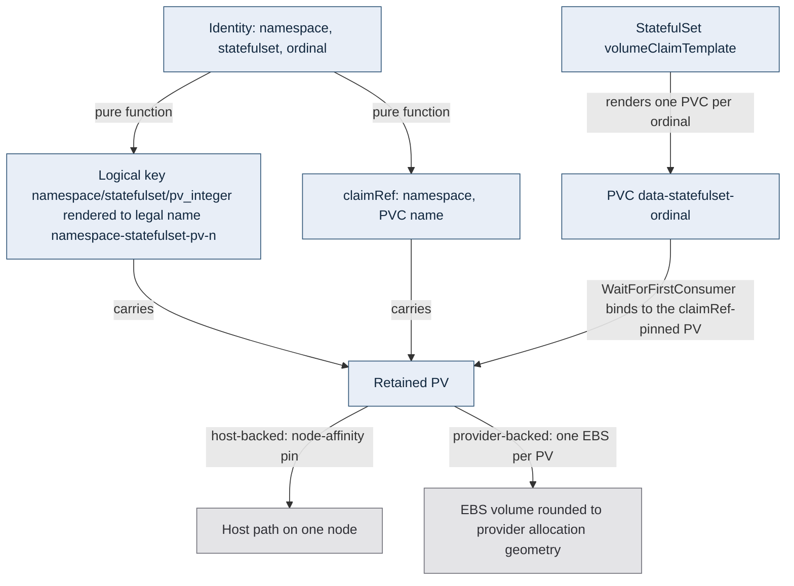
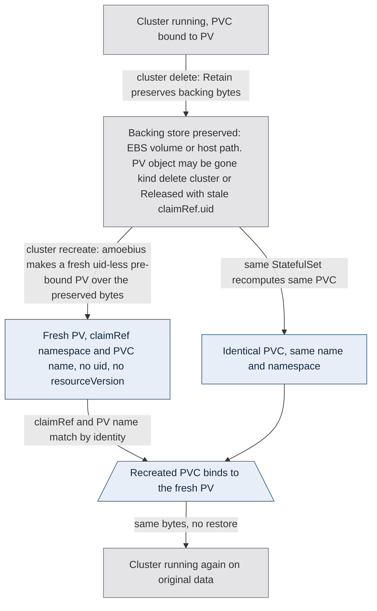

# Storage Lifecycle

**Status**: Authoritative source
**Supersedes**: N/A
**Referenced by**: DEVELOPMENT_PLAN/README.md, DEVELOPMENT_PLAN/overview.md, DEVELOPMENT_PLAN/phase_08_storage_geometry_folds.md, DEVELOPMENT_PLAN/phase_21_retained_storage.md, DEVELOPMENT_PLAN/phase_22_vault_pki.md, DEVELOPMENT_PLAN/phase_23_platform_backbone.md, DEVELOPMENT_PLAN/phase_24_platform_services_2.md, DEVELOPMENT_PLAN/phase_25_keycloak_ingress.md, DEVELOPMENT_PLAN/phase_30_release_lifecycle.md, DEVELOPMENT_PLAN/phase_36_provider_ebs_credential.md, DEVELOPMENT_PLAN/phase_37_provider_dynamic_nodes.md, DEVELOPMENT_PLAN/phase_42_test_topology_dsl.md, DEVELOPMENT_PLAN/system_components.md, documents/engineering/README.md, documents/engineering/app_vs_deployment_doctrine.md, documents/engineering/backup_recovery_doctrine.md, documents/engineering/chaos_failover_doctrine.md, documents/engineering/cluster_lifecycle_doctrine.md, documents/engineering/content_addressing_doctrine.md, documents/engineering/daemon_topology_doctrine.md, documents/engineering/image_build_doctrine.md, documents/engineering/inforcespec_migration_doctrine.md, documents/engineering/manifest_generation_doctrine.md, documents/engineering/namespace_layout_doctrine.md, documents/engineering/platform_services_doctrine.md, documents/engineering/pulsar_client_doctrine.md, documents/engineering/pulumi_iac_doctrine.md, documents/engineering/release_lifecycle_doctrine.md, documents/engineering/resource_capacity_doctrine.md, documents/engineering/single_logical_data_plane_doctrine.md, documents/engineering/tenancy_doctrine.md, documents/engineering/testing_doctrine.md, documents/engineering/vault_pki_doctrine.md, documents/illegal_state/illegal_state_capacity.md, documents/illegal_state/illegal_state_storage.md, documents/illegal_state/illegal_state_techniques.md
**Generated sections**: none

> **Purpose**: Define amoebius's durable-storage contract — the single `no-provisioner` retained PV model,
> the deterministic `<namespace>/<statefulset>/pv_<integer>` bind, explicit hard-capped sizes, host- and
> EBS-backed volumes that outlive their node and their cluster — and the rule that deletion of
> durable data is forbidden under normal operation.

---

## 1. Cluster and storage have independent lifetimes

[cluster_lifecycle_doctrine.md §7](./cluster_lifecycle_doctrine.md#7-ephemeral-spin-updown-with-deterministic-rebind)
defines cluster infrastructure as ephemeral. This doctrine owns the storage consequence: durable backing has
a lifetime independent of the cluster that mounts it. A graceful teardown is lossless only when the retained
backing remains attachable and the deterministic-rebind preconditions in
[§6](#6-the-lossless-teardown-guarantee-deterministic-rebind) hold. Chaos-failover is a separate lifecycle
event bounded by its declared data-loss budget, and a move to a substrate that cannot attach the same backing
is outside the lossless-rebind guarantee. (Shorthand: clusters are cattle; storage is not.)

Routine cluster teardown releases compute and claims but never reclaims durable backing. A full cluster
deletion also removes the apiserver/etcd and the cluster's PVC/PV API objects; the next bring-up renders fresh
PV objects whose pre-bound `claimRef` omits `uid` and `resourceVersion`, plus fresh claims with the same
identities over the same retained backing bytes. Routine teardown never deletes that backing. Automated
test-owned reclamation is the privileged exception in
[§7.1](#71-the-single-exception-the-elevated-test-harness). That round-trip — *delete the cluster, recreate it,
find the data unchanged* — is the **lossless-teardown guarantee** defined precisely in
[§6](#6-the-lossless-teardown-guarantee-deterministic-rebind).

This doctrine is the SSoT for *how durable bytes live and rebind*. It does **not** own which services
produce those bytes (that is [platform_services_doctrine.md](./platform_services_doctrine.md)), the cluster
teardown order that releases them ([cluster_lifecycle_doctrine.md](./cluster_lifecycle_doctrine.md)), the
cloud-provider IaC that materializes EBS volumes ([pulumi_iac_doctrine.md](./pulumi_iac_doctrine.md)), or
the automated test-owned deletion path ([testing_doctrine.md](./testing_doctrine.md)). It owns the volume
model and the rebind contract, and references the rest.

This model **generalizes** the single-node, host-path-only retained-storage scheme proven in the sibling
prodbox project (`prodbox/documents/engineering/storage_lifecycle_doctrine.md`) and lifts it to amoebius's
multi-node, multi-substrate world. Read every prescriptive statement below as amoebius *design intent* —
evidence inherited from prodbox is evidence from a sibling system, not proof in amoebius, which has not yet
built the storage layer. Status and gates live only in
[../../DEVELOPMENT_PLAN/README.md](../../DEVELOPMENT_PLAN/README.md).

---

## 2. One storage class, and it provisions nothing

Dynamic provisioning is the machinery that would let a cluster *create and destroy*
volumes on its own initiative. amoebius wants the opposite — volumes that a human or the elevated harness
created on purpose and that nothing in the normal cluster lifecycle can reclaim — so amoebius **deletes the
dynamic machinery outright**.

Every amoebius cluster has exactly one StorageClass, and it is inert:

- **`provisioner: kubernetes.io/no-provisioner`** — there is no controller standing by to mint a volume
  when a claim appears. A PVC binds only to a PV that **already exists** because amoebius placed it there.
- **`reclaimPolicy: Retain`** — when a PVC is deleted while the apiserver remains live (for example, during
  workload teardown or the intermediate rebind check), its PV is **not** deleted and its backing bytes are
  **not** wiped. Kubernetes moves the PV to `Released` while retaining the `claimRef` of the now-deleted PVC,
  including that claim's `uid`. A `Released` PV carrying a stale
  `claimRef.uid` does **not** auto-rebind: the controller will not bind a freshly created PVC to it while
  the old `uid` is present. Retain therefore preserves the *bytes*; it does not by itself deliver rebind.
  Rebind is reconstructed by amoebius re-creating a fresh pre-bound PV whose `claimRef` omits `uid` and
  `resourceVersion` ([§6](#6-the-lossless-teardown-guarantee-deterministic-rebind)) and points at those
  preserved bytes.
- **`volumeBindingMode: WaitForFirstConsumer`** — binding is deferred until the consuming Pod is scheduled,
  so a host-backed PV binds against the node the Pod actually landed on, not a node chosen blind.
- **Every other StorageClass is removed**, and any default annotation on a competing class is stripped, so
  a claim can never silently fall through to a dynamic provisioner. There is no second way to get a volume.

The reconcile step that establishes this class — and removes all others — is part of cluster bring-up,
owned by [cluster_lifecycle_doctrine.md](./cluster_lifecycle_doctrine.md); this doc owns only the *shape*
the class must have.

---

## 3. PVCs are born only from StatefulSets

If any Deployment, Job, or hand-written manifest could mint a PVC, the set of durable claims
would be open-ended and unauditable, and the guarantee that every retained byte is accounted for would be
unverifiable. amoebius closes the
creation path to exactly one shape.

**A PVC is only ever created by a StatefulSet's `volumeClaimTemplate`**. There are no bare PVCs, no
Deployment-mounted `persistentVolumeClaim` volumes, and no Job-created claims. The one narrow consumer
exception does not widen creation: a provisioned copy/verify `Job` may temporarily mount the exact old and
replacement claims named by a private `ProvisionedStorageMigration`; it cannot create a claim, name a third
claim, retain state of its own, or run without the old+new+workspace capacity witness. Consequences:

- **Durable state ⇒ StatefulSet.** Anything that needs to persist bytes is a StatefulSet, so its claims get
  stable per-ordinal identity (`<claim>-<statefulset>-<ordinal>`) that survives Pod reschedules — the
  identity the deterministic rebind in [§6](#6-the-lossless-teardown-guarantee-deterministic-rebind) depends on.
- **Stateless ⇒ no owned claim.** An ordinary workload with no StatefulSet owns no durable storage by
  construction; the migration Job exception only receives a capability to two already-accounted claims for
  the finite verified transition and never becomes their owner. Shared
  state for such workloads lives in a platform service (MinIO, Postgres, Pulsar), never in an ad-hoc PV. The
  **control-plane singleton** is the canonical stateless case: it is a Deployment `replicas=1` with no PVC,
  and its durable state is the MinIO bucket ([§7.2](#72-amoebius-own-control-plane-state-is-the-minio-bucket-not-a-pvc),
  [daemon_topology_doctrine.md §3.1](./daemon_topology_doctrine.md#31-exactly-one-pod-is-a-k8setcd-property-not-an-amoebius-election)).
- **The DSL is the gate.** The amoebius Dhall DSL does not expose a "make me a loose PVC" primitive at all;
  durable storage is requested through the app/StatefulSet surface and nowhere else. The illegal-state
  framing — *a claim that cannot bind, or durable state owned by an ordinary non-StatefulSet, is
  unrepresentable* — is
  owned by [dsl_doctrine.md](./dsl_doctrine.md) and catalogued in
  [illegal_state_catalog.md](../illegal_state/illegal_state_catalog.md); this doc states the storage-side invariant the
  DSL enforces.

Per-app durable-storage requests (block volumes, Postgres, MinIO buckets) are declared in the app spec and
land in the app's own namespace; the app-vs-deployment split that keeps "I need a 20Gi volume" separate
from "run three replicas of me" is owned by [app_vs_deployment_doctrine.md](./app_vs_deployment_doctrine.md).

---

## 4. Deterministic PV naming and the explicit bind

Rebinding can only be deterministic if both ends of the bind are computed from stable
identity, never assigned by a race. So amoebius names every PV from `(namespace, statefulset, ordinal)` and
pins each PV to its claim *before the claim exists*.

- **Naming convention**: every PV is named on the deterministic scheme whose **logical identity** is
  **`<namespace>/<statefulset>/pv_<integer>`**, where the integer is the StatefulSet ordinal the volume
  serves. That triple is the logical key, not the object's `metadata.name`: a PV `metadata.name` is an
  RFC-1123 subdomain and admits neither `/` nor `_`, so the logical key is rendered to a legal slug of the
  form **`<namespace>-<statefulset>-pv-<n>`**. The slug is a pure function of identity; it carries no node
  id, no cluster id, no timestamp, and no allocation counter, so the *same* StatefulSet ordinal computes the
  *same* PV name on every cluster and every rebuild.
- **Explicit `claimRef`**. Each PV carries a `claimRef` naming the exact `(namespace, PVC-name)` it serves, so the
  pairing is fixed by amoebius rather than discovered by whichever unbound claim the scheduler happens to
  match first. A `volumeClaimTemplate` claim and its `claimRef`-pinned PV are two halves of one identity.
- **Node affinity for host-backed PVs.** A host-path volume lives on one specific node, so its PV declares
  node affinity to that node and the consuming Pod schedules there. On a single-node cluster this is the
  trivial case; on a multi-node kind/rke2 cluster each ordinal's PV is pinned to the node holding its
  bytes. (Provider/EBS volumes are node-independent — [§5](#5-sizes-are-explicit-hard-capped-and-one-volume-per-claim).)

Diagram vocabulary: [diagram_conventions.md](./diagram_conventions.md).



*Design intent. The PV name and claimRef are pure functions of (namespace, statefulset, ordinal), so the same ordinal computes the same bind on every rebuild; the physical host path and EBS volume are runtime-checked backing residue, not proven here.*

---

## 5. Sizes are explicit, hard-capped, and one-volume-per-claim

An advisory-only size is not enforceable. If a "10Gi" volume can quietly grow to
fill the host disk, then capacity planning, dynamic node provisioning, and "this volume fits on that node"
all become guesswork. amoebius makes the declared size a **hard ceiling**, not a hint.

- **Every PVC declares a minimum size, presentation, and backing; every PV declares a capacity.** A sizeless
  durable claim is not representable. `VolumePresentation = Block | Filesystem { fsType, overheadModel }`
  makes the usable-vs-raw distinction explicit: application/geometry demand first yields required usable bytes;
  a versioned filesystem model adds metadata, journal, and reserved-block overhead; then the backing allocation
  policy rounds raw bytes to its minimum and quantum.
- **One `volumeClaimTemplate` means one capacity across all ordinals.** A StatefulSet cannot vary one
  template's request by ordinal. When the resource fold produces unequal per-bookie/per-drive physical
  requirements, each requirement first maps to a unique `(StatefulSet, template, ordinal)` slot; the claim
  plan sets that template's required usable size to the largest ordinal requirement, derives one rounded raw
  `provisionedBytes`, and debits `provisionedBytes × ordinalCount` from the backing. Every resulting PVC/PV
  carries that same exact rounded capacity, so
  padding on smaller ordinals remains reserved. A fold that spends only the unequal raw sum is invalid; truly
  different sizes require distinct typed templates/StatefulSets.
- **Hard allocation, not advisory accounting.** The provisioned raw capacity is the real ceiling; a workload
  cannot spill past it onto shared host disk, and the mounted filesystem must expose at least the derived usable
  capacity. Provider volumes enforce the raw ceiling with the EBS volume size. A host-backed
  volume must name an amoebius-managed quota- or image-backed extent that enforces the same byte ceiling;
  a raw shared-filesystem subdirectory is not an admissible `StorageBacking`. The Phase-21 live gate must
  prove a write past the cap fails and neighboring volumes/backing remain intact. Until that enforcement
  exists, the storage phase is simply unimplemented — amoebius does not downgrade the provision to an
  “advisory but deployable” state.
- **Aggregate backing admission precedes render/apply.** Each retained claim names the exact backing/pool it
  debits, and the post-bind resource fold checks `Σ(provisionedBytes) ≤ observed/declarable backing` before a
  `ProvisionedSpec` exists. The same physical bytes cannot also be presented as node ephemeral or cache
  capacity unless the substrate inventory declares disjoint carves.
- **One EBS drive per PV on provider substrates.** amoebius never carves many claims
  out of one shared cloud volume; the PV ↔ PVC ↔ EBS-volume mapping is 1:1:1. “1:1:1” is an identity/cardinality
  invariant, not byte-for-byte arithmetic: the PVC/PV capacity and EBS request all use the same
  provider-rounded `provisionedBytes`, which may exceed the application's usable demand. Pulumi materializes
  the volume; Kubernetes does not dynamically provision it. The provider
  plumbing and credential model that let normal operation *create* but not *delete* EBS are owned by
  [pulumi_iac_doctrine.md](./pulumi_iac_doctrine.md); this doc owns only the 1:1:1 sizing invariant.

### 5.1 Storage is independent of the node lifecycle

A volume must outlive the node it was mounted on, or "ephemeral cluster, durable storage" collapses the
moment a node is replaced. amoebius requires the two backings to deliver that independence in their own way:

- **Provider/EBS:** the PV is **not tied to the lifecycle of the EKS node / EC2 instance** that mounts it.
  When a node is terminated, the EBS volume **detaches and survives**; the replacement node re-attaches the
  same volume to the same claim. Attachment is explicit and static: amoebius consumes the upstream AWS EBS
  CSI controller/node implementation from its baked base image, renders no external provisioner, keeps the
  sole StorageClass at `kubernetes.io/no-provisioner`, and creates each fresh PV with
  `spec.csi.driver: ebs.csi.aws.com`, the Pulumi-created EBS ID as `volumeHandle`, and node affinity for the
  EBS Availability Zone. Node churn is invisible to the data, and cluster rebuild recreates only the PV
  binding plus the ephemeral CSI control components — never the durable volume.
- **Host-backed:** the bytes live in the host's retained storage root, not in the container or the kubelet's
  ephemeral scratch. A Pod reschedule re-mounts the same host path; the node-affinity pin ([§4](#4-deterministic-pv-naming-and-the-explicit-bind)) keeps the
  ordinal landing where its bytes are.

Either way, the rule is the same: **node lifecycle and storage lifecycle are decoupled**, which is the
node-level precondition for the cluster-level guarantee in [§6](#6-the-lossless-teardown-guarantee-deterministic-rebind).

### 5.2 The storage backing is bounded — the closed `StorageBacking` union

[§5](#5-sizes-are-explicit-hard-capped-and-one-volume-per-claim) caps each *volume*; this subsection caps the *backing* a set of volumes draws from, so "unbounded storage"
([illegal_state_catalog.md §3.18](../illegal_state/illegal_state_storage.md#318-unbounded-storage-anywhere)) has no syntax. There is no such thing as
unbounded storage in amoebius: durable storage is **either** host-level (bounded by a physical disk) **or**
cloud (bounded by a quota), encoded as a **closed union with no unbounded arm**:

```text
StorageCapacity =
  { rawBytes             : Quantity Bytes
  , reservedRawBytes     : Quantity Bytes
  , allocatableRawBytes  : Quantity Bytes
  , partitionExact       :
      reservedRawBytes + allocatableRawBytes <= rawBytes
  }
-- Every field is a finite physical/raw Quantity. A demand begins as required usable bytes; its selected
-- presentation overhead and allocation quantum derive provisioned raw bytes, which alone are compared with
-- allocatableRawBytes. Usable and raw quantities are never summed or compared across stages.

ProviderLogicalObjectByteModelVersion = ContentAddress
ProviderBilledObjectByteModelVersion = ContentAddress
ProviderLogicalToBilledByteConversionModelVersion = ContentAddress

ProviderObjectByteAccounting =
  < Logical :
      { model   : ProviderLogicalObjectByteModelVersion
      , witness : ProviderLogicalObjectByteModelTotalityWitness
      }
  | Billed :
      { model      : ProviderBilledObjectByteModelVersion
      , conversion : ProviderLogicalToBilledByteConversionModelVersion
      , witness    : ProviderBilledByteConversionTotalityAndMonotonicityWitness
      }
  >

ProviderObjectByteAmount accounting quantity =
  { accounting : accounting
  , value      : quantity
  }
-- The accounting arm is the byte unit. Logical uses the pinned canonical object-payload model; Billed uses
-- the provider's pinned rounding/metadata/tier model and names the exact logical-to-billed conversion. There
-- is no unit-free provider-object byte scalar and no implicit comparison between the two arms.

StorageQuota =
  { id             : ProviderStorageQuotaId
  , account        : CloudAccountId
  , accounting     : ProviderObjectByteAccounting
  , maxBytes       : ProviderObjectByteAmount accounting (Quantity Bytes)
  , maxObjectCount : PositiveNatural
  , sourceEquality : ProviderStorageQuotaAccountAccountingMaximumEqualityWitness
  }
-- This is the finite declared maximum, not evidence of current availability. The live/forest folds consume
-- resource_capacity_doctrine's ObservedProviderObjectQuota, which adds complete current selected-unit byte
-- usage and object-count usage, zero-capable residuals, account/quota identity, and one snapshot fingerprint.
-- Unknown or partial provider-object usage cannot be treated as zero; a logical declaration cannot consume a
-- billed observation, or vice versa, without the selected arm's explicit pinned conversion model.

HostDiskBacking =
  { id         : BackingId
  , carve      : DiskCarveId
  , capacity   : StorageCapacity
  , allocation : BackingAllocationPolicy
  }

EbsBacking =
  { id     : BackingId
  , account: CloudAccountId
  , policy : ProviderVolumePolicy
  }

CloudQuotaBacking =
  { id : BackingId, quota : StorageQuota }

StorageBacking =
  < HostDisk   : HostDiskBacking
  | Ebs        : EbsBacking
  | CloudQuota : CloudQuotaBacking
  >

BackingAllocationPolicy =
  { minimumBytes : Quantity Bytes
  , quantumBytes : Quantity Bytes
  }

ProviderVolumePolicy =
  { volumeType : ProviderVolumeType
  , zone       : Zone
  , allocation : BackingAllocationPolicy
  }

ProviderVolumeRequest = -- private, derived from demand + policy
  { volumeType       : ProviderVolumeType
  , zone             : Zone
  , requiredUsableBytes : Quantity Bytes
  , sizeGiB          : PositiveNatural
  , provisionedBytes : Quantity Bytes
  , presentation     : VolumePresentation
  , allocation       : BackingAllocationPolicy
  , witness          : BackingAllocationWitness
  }

ProviderVolumeSlotId =
  { account : CloudAccountId
  , cluster : ClusterId
  , claim   : StatefulSetClaimSlot
  , request : ProviderVolumeRequest
  }

EbsBackingProvisionState = < Promised | Materialized >

EbsBackingMaterialization state =
  < Promised :
      { state    : Promised
      , volumeId : Absent
      }
  | Materialized :
      { state    : Materialized
      , volume   : ProviderVolumeId
      , readback : ProviderVolumeIdentityAccountZoneSizePresentationReadbackWitness
      }
  > -- private constructor requires selected arm = state

ProvisionedEbsBacking state = -- private post-provision state
  { id       : BackingId
  , slot     : ProviderVolumeSlotId
  , volumeDemand : ProvisionedVolumeDemand
  , materialization : EbsBackingMaterialization state
  , sourceEquality :
      EbsBackingDemandSlotAccountClaimRequestMaterializationEqualityWitness
  }

PromisedProvisionedEbsBacking = ProvisionedEbsBacking Promised
MaterializedProvisionedEbsBacking = ProvisionedEbsBacking Materialized

EbsBackingMaterializationResult =
  { promised     : PromisedProvisionedEbsBacking
  , materialized : MaterializedProvisionedEbsBacking
  , cloudAction  : CloudProviderActionId
  , sourceEquality :
      EbsPromisedActionProviderReadbackMaterializedEqualityWitness
  }
```

- **No unbounded constructor** (a type-foreclosed union shape, [illegal_state_techniques.md §6](../illegal_state/illegal_state_techniques.md#6-three-layers-of-foreclosure-and-the-honesty-they-force)):
  a value cannot denote unbounded storage. A `HostDisk`/`Ebs` backing is bounded by a physical/EBS size; a
  `CloudQuota` backing is bounded by a quota owned by [pulumi_iac_doctrine.md](./pulumi_iac_doctrine.md); the
  content-addressed MinIO store is a `HostDisk`/`CloudQuota` backing owned by
  [content_addressing_doctrine.md](./content_addressing_doctrine.md). Each arm names exactly one owner of its
  ceiling number, so "available storage" has one definition. A raw EBS declaration contains only a provider
  policy; the private request is derived from volume demand and the provider's whole-GiB/minimum rules. It
  never contains a fabricated future volume id or an arbitrary raw-byte request.
- **The identity path is total, not implied by matching byte counts.** A `HostDisk.id` resolves exactly once
  to `PhysicalDiskPartition.retainedPools[].id`; its `carve` must equal that pool's globally scoped
  `NamedDiskCarve.id`, and `capacity` is the carve's net allocatable extent. An EBS id resolves exactly once
  to its `ProviderVolumeSlotId`; a cloud-quota id resolves exactly once to the named account/quota
  ledger. BookKeeper/MinIO/PV demands carry this `BackingId`, never a free `Capacity`, so checked construction
  can walk demand → logical backing → carve/provider owner → physical/account ceiling without inventing an
  association. Before `CreateVolume`, provisioning derives required usable bytes from geometry, applies
  `VolumePresentation`, rounds to the backing minimum/quantum (for AWS EBS, an integral GiB satisfying the
  volume-type minimum), and derives the globally scoped slot from account + cluster + StatefulSet claim slot +
  request. It debits `provisionedBytes` and count against observed residual quota and stores
  `Promised` in the witness. After create it attaches and cross-checks the real `ProviderVolumeId`, moving only
  to `Materialized`; retained rebind keeps the same logical `BackingId`/slot. Reusing an id, mapping two ids to
  one carve/slot, or declaring a capacity different from its owner rejects before aggregate arithmetic.
  A provider backing's declared allocation policy must equal the selected volume type in the pinned provider
  catalog; an author cannot weaken the minimum or quantum.
- **Provider-object bytes have one selected accounting arm.** `CloudQuotaBacking` retains the exact
  `StorageQuota.accounting` choice. `Logical` means the pinned canonical object-payload model; `Billed` means
  the pinned provider rounding/metadata/tier model plus its explicit logical-to-billed conversion. Declared
  maximum, demand, observed current/residual usage, per-object allocation readback, forest carve, and residual
  all carry `ProviderObjectByteAmount` indexed by that same choice. Object count is observed and partitioned
  alongside bytes. No raw `Quantity Bytes` can cross that boundary, and incomplete inventory or unit/model
  mismatch refuses rather than being treated as free capacity.
- **The aggregate fold lives elsewhere.** This doc owns the *union shape* and the per-volume/uniform-template
  sizing ([§5](#5-sizes-are-explicit-hard-capped-and-one-volume-per-claim)); the **aggregate arithmetic** —
  uniform claim-group debit followed by `Σ(PV caps) ≤ backing`, and the Pulsar two-ceiling fold — is owned by
  [resource_capacity_doctrine.md §5](./resource_capacity_doctrine.md#5-storagebudget-bounded-by-construction-single-owner-ceiling-per-arm), [§7](./resource_capacity_doctrine.md#7-pulsar-has-two-ceilings-the-hot-tier-and-the-durable-total) (the [§4.6](../illegal_state/illegal_state_techniques.md#46-capacity-accounting--placement-witness-compute-and-summed-demand-within-capacity-storage-checked) capacity-accounting
  technique). An app that would consume more storage than its backing
  ([illegal_state_catalog.md §3.19](../illegal_state/illegal_state_storage.md#319-an-application-consuming-more-storage-than-its-backing-minio-and-pulsar)) is rejected by that fold at the
  post-bind `provision-seal`; "unbounded"
  is representable **only** through a `Growable` scaling policy whose ceiling is itself a quota
  ([resource_capacity_doctrine.md §6](./resource_capacity_doctrine.md#6-growable--scalingpolicy-the-quota-bounded-dynamic-provisioning-arm)).
- **Declared-vs-observed fail-closed check.** Before storage mutation or pod apply, the reconciler observes
  the actual host extent/EBS raw size, volume mode/fsType, mounted usable capacity, and provider quota. If raw
  bytes are smaller than `provisionedBytes`, usable bytes are smaller than `requiredUsableBytes`, presentation
  differs, or the quota snapshot changed, it performs zero writes; a pure provision-seal witness is never
  treated as proof that the physical backing still exists at runtime.

---

## 6. The lossless-teardown guarantee: deterministic rebind

Because the PV name and `claimRef` are pure functions of identity ([§4](#4-deterministic-pv-naming-and-the-explicit-bind)), and because Retain
preserves the backing bytes after the claim is gone ([§2](#2-one-storage-class-and-it-provisions-nothing)), a destroyed-then-recreated cluster recomputes
the *same* claims over the *same* preserved bytes. What a teardown preserves is the **backing store** — the
EBS volume or the host path — not necessarily the PV API object. A `Retain` PV left `Released` in a
surviving cluster keeps the deleted claim's `claimRef.uid` and will not rebind a freshly created PVC; and a
`kind delete cluster` destroys etcd and every PV object outright, leaving only the backing bytes. Amoebius
therefore reconstructs the bind by **re-creating a fresh PV object** whose `claimRef` names
`(namespace, PVC-name)` but carries **no `uid` and no `resourceVersion`** — the deterministic, `uid`-less
pre-bind — pointing at the preserved bytes; a recreated PVC then binds to that fresh PV. Nothing is restored
from a backup; the original backing bytes were never deleted. That is the lossless-teardown guarantee:
clusters can be gracefully torn down and reconstructed with zero durable-byte loss because of the
no-provisioner PVC/PV policy, which guarantees identical rebinding by fresh-PV recreate, not by a lingering
`Released` PV.



*Design intent. Deterministic rebind reconstructs the bind from a uid-less pre-bound PV and a recomputed PVC — two halves that meet by identity; the running clusters and the surviving backing bytes are runtime-checked, not proven here.*

**Deterministic rebind is guaranteed only when all of these hold** (adapted and generalized from the
prodbox rebinding rules):

1. The PVC name and namespace are unchanged across rebuild — guaranteed because both derive from the
   StatefulSet identity ([§3](#3-pvcs-are-born-only-from-statefulsets)), not from operator input.
2. The PV name and `claimRef` are recomputed deterministically from `(namespace, statefulset, ordinal)` ([§4](#4-deterministic-pv-naming-and-the-explicit-bind)).
3. The pre-bound PV is re-created as a **fresh object with a `uid`-less `claimRef`** (no `uid`, no
   `resourceVersion`), so the recreated PVC binds; a leftover `Released` PV carrying the old claim's stale
   `claimRef.uid` does not auto-rebind and would block rather than deliver the bind.
4. The backing store is still present: the EBS volume was not deleted, or the host path still exists on its
   node.
5. A **host-backed** ordinal re-schedules to the **same node** its node-affinity-pinned PV lives on; a
   provider/EBS ordinal may land on any node because the volume re-attaches ([§5.1](#51-storage-is-independent-of-the-node-lifecycle)).
6. Any secret that must match the preserved data (e.g. a Patroni role password against a preserved
   `pg_authid`) re-attaches to the same material — owned by [vault_pki_doctrine.md](./vault_pki_doctrine.md);
   a mismatch must surface as a loud failure, never a silent data reset.

Vault's and MinIO's own durability — the platform secrets root and the object substrate themselves living
on retained PVs so a rebuild *unseals* rather than *re-initializes* — is the same mechanism applied to two
standard services; the persistence is in scope here, but the Vault seal/unseal and MinIO content models are
owned by [vault_pki_doctrine.md](./vault_pki_doctrine.md) and
[platform_services_doctrine.md](./platform_services_doctrine.md) respectively.

**Rebind is not restore.** This guarantee covers the routine case — a gracefully torn-down cluster whose
retained backing store still exists and is attachable — and delivers losslessness by *retaining bytes and
rebinding*, never by copying data out and reading it back: nothing is restored from a backup. The disaster
cases this does **not** cover — a destroyed host disk, a deleted or corrupted cloud volume, a lost region, or a
down primary whose standby was never deployed — are the domain of
[`backup_recovery_doctrine.md`](./backup_recovery_doctrine.md), whose restore path seeds a **fresh** coordinate
from a verified backup (never an in-place overwrite of live bytes) and is complementary to this rebind
guarantee, not a substitute for it. (Shorthand: rebind survives a torn-down cluster; a backup survives a lost
backing.)

---

## 7. Deleting durable data is forbidden under normal operation

The vision states the reasoning: if teardown is the safe everyday way to
"turn off" a cluster, then "it's critical that its durable storage remains or spin-up will fail… we need to
ensure amoebius doesn't accidentally delete durable storage, which could mean outright forbidding it under
normal circumstances." amoebius takes the strong reading: **forbid it.**

- **Default posture: durable storage exists until explicitly destroyed.** The original vision names the
  default as "all durable storage must exist forever"; amoebius softens "forever" only to "until a
  deliberate, privileged deletion," never to "until the next teardown."
- **No normal-operation code path destroys retained backing bytes.** Cluster deletion may remove the
  claim/PV API objects but leaves the durable backing intact
  ([§2](#2-one-storage-class-and-it-provisions-nothing),
  [§6](#6-the-lossless-teardown-guarantee-deterministic-rebind)). `chart`/app delete removes the PVC/PV
  *objects* it owns but never the backing bytes on a retained volume. The DSL surface exposes **no** "delete
  this durable volume" primitive; a `.dhall` value cannot denote "destroy these bytes." This is the
  storage-side reading of the illegal-state contract owned by [dsl_doctrine.md](./dsl_doctrine.md) /
  [illegal_state_catalog.md](../illegal_state/illegal_state_catalog.md).
- **Teardown pushes back rather than deletes.** When tearing down a cluster would strand or endanger durable
  state, the safe-teardown path warns and falls back to the `.dhall` failback instead of silently
  destroying data; the push-back/override semantics are owned by
  [cluster_lifecycle_doctrine.md](./cluster_lifecycle_doctrine.md).
- **Credential-level enforcement, not just policy.** On provider substrates the intended backstop is that
  normal-operation credentials can *create* EBS but not *delete* it, so "accidentally delete durable
  storage" is unauthorized at the cloud API, not merely discouraged. The exact create-vs-delete credential
  model (and whether Pulumi creates under one credential set and the harness destroys under another) is
  resolved by [pulumi_iac_doctrine.md](./pulumi_iac_doctrine.md) §6 (four locked decisions: durable-class
  EBS carried outside the ephemeral cluster stack; normal-operation credentials create-but-not-delete; only
  the elevated in-memory test credential deletes test-flagged volumes; static CSI attaches the
  Pulumi-created ID without dynamic provisioning); this doc records only the requirement that the destroy
  capability be withheld from normal operation.

### 7.1 The single exception: the elevated test harness

Leak-free test cycles *must* delete the storage they create, or every test run would silt up the substrate
forever. Within amoebius automation, harness deletion is the **one** sanctioned path:

- Only the **elevated test harness**, holding privileged delete credentials, may destroy durable storage,
  and only storage it flagged as test-owned.
- The flag-and-elevated-sweep mechanism, the per-run leak ledger, and the always-tear-down test `.dhall`
  topology are owned by [testing_doctrine.md](./testing_doctrine.md). This doc owns only the boundary:
  **normal operation cannot delete durable data; the elevated harness is the sole actor that can, on
  test-flagged resources.**

A deliberate privileged operator action is outside normal operation and outside the automated `.dhall`
surface. A human may perform an audited external break-glass reclaim, but that is not an amoebius automation
path; routine cluster credentials, reconcilers, and the elevated **test** harness never gain authority to
delete production backing.

### 7.2 amoebius' own control-plane state is the MinIO bucket, not a PVC

The retained-PV model of this doctrine governs the **platform services and the workloads** that hold durable
bytes — MinIO's own backing disks, Pulsar/BookKeeper, Postgres/Patroni, and any app StatefulSet. It does
**not** describe amoebius's *own* control-plane state, which follows a different, stricter rule:

- **The amoebius control plane holds no PVC.** The control-plane singleton is a stateless Deployment
  `replicas=1` ([daemon_topology_doctrine.md §3.1](./daemon_topology_doctrine.md#31-exactly-one-pod-is-a-k8setcd-property-not-an-amoebius-election));
  it mounts no durable volume and keeps nothing on local disk.
- **Its durable state is exclusively the capacity-admitted Vault-enveloped MinIO bucket.** The singleton
  constructs the closed `ControlPlaneStateObjectDemand` set—`InForceSpecSnapshot`,
  `ManagedResourceRegistry`, `ReconcileJournal`, `ValidationLedger`, and `JobCompletion`—while Pulumi constructs its distinct
  `PulumiCheckpointObjectDemand`. Every object carries a `StorageBudgetId`, exact canonical-size inputs,
  retained old/new/failure/orphan bounds, and a mutation-admission identity before it can be written as a
  Vault-Transit-enveloped MinIO object
  ([resource_capacity_doctrine.md §5.1](./resource_capacity_doctrine.md#51-durable-demand-is-logical-first-physical-only-after-geometry),
  [pulumi_iac_doctrine.md §2](./pulumi_iac_doctrine.md#2-the-backend-every-byte-of-state-is-a-vault-enveloped-object-in-minio),
  [dsl_doctrine.md §3](./dsl_doctrine.md#3-the-orchestration-surface-parameters-context-witness)), decrypted
  in-process and never written to a plaintext ConfigMap, to etcd, or to a control-plane PVC
  ([illegal_state_catalog.md](../illegal_state/illegal_state_catalog.md), the plaintext-spec-at-rest entry).
  “Every other byte” is deliberately not an open escape hatch: a new persistent state kind first extends the
  closed union, its budget/peak model, source↔producer equality check, gateway policy, and one-byte-short tests.
- **Why the distinction matters.** It keeps the singleton disposable — k8s can reschedule it anywhere with
  no volume to re-attach and no data to lose ([§5.1](#51-storage-is-independent-of-the-node-lifecycle) applies
  to platform-service volumes, not to the control plane, because the control plane has none). MinIO itself is
  a platform service and *does* sit on retained PVs per this doctrine; the control plane is a *client* of
  that bucket, not a holder of its own volume.

This is the storage-side statement of the invariant **amoebius durable storage (for the control plane) is
exclusively the MinIO bucket**; the object-store model MinIO provides is owned by
[platform_services_doctrine.md](./platform_services_doctrine.md) and
[content_addressing_doctrine.md](./content_addressing_doctrine.md).

---

## 8. Shrinking storage without representing data destruction

The hardest case the vision flags: "this requires more thought for things like
elastic storage requirements (how can we ever shrink them?). We need to enable storage shrinking while still
making it impossible to represent destruction of data." Growth is easy — a larger size strictly contains the
old bytes. Shrinking is the hard case: the naïve "delete the volume, make a smaller one" is the
forbidden operation of [§7](#7-deleting-durable-data-is-forbidden-under-normal-operation) in another form.

amoebius's design position: **a shrink is never an in-place truncation; it is a verified migration.**

```text
ReclaimEligible =
  { prior             : PriorVolumeProvisionRef
  , oldProvision      : ProvisionedVolumeDemand
  , oldBacking        : BackingId
  , oldProviderVolume : Optional ProviderVolumeId
  , replacement       : ProvisionedVolumeDemand
  , copyVerified      : VerifiedStorageCopyContentAndExtentWitness
  , cutoverObserved   : ReplacementMountedOldDetachedWitness
  , retainedDebit     : BackingAllocation
  , snapshot          : InventoryFingerprint
  , sourceEquality    :
      PriorProvisionBackingVolumeReplacementVerificationDebitSnapshotEqualityWitness
  , automaticDeleteAuthority : Absent
  }
```

- **Grow is representable in place.** Increasing a PVC's requested size is an ordinary, data-preserving
  change (resize the EBS volume / grow the filesystem); the larger volume still holds every original byte.
- **Shrink is expressed as create-new → verified-migrate → retire-old**, never as "represent a smaller
  volume holding the same data." The DSL value the operator writes denotes the *target smaller size*; the
  source carries a `StorageMigrationIntent` with a raw `PriorProvisionRefSource` Volume arm, the replacement
  logical demand, and a structural chunk/concurrency/workspace policy. Gate 2 validates and brands that arm as
  an opaque `PriorVolumeProvisionRef`; the binder expands the intent to an unprovisioned
  `StorageMigrationDemand`. Provisioning alone resolves the reference from the prior `ProvisionedSpec` context
  and derives the replacement's required-usable/raw allocation, complete copy/verify Job
  `PodResourceEnvelope`, and workspace; it admits only if old+new+workspace fit every backing and provider
  byte/count ledger and the executor fits a node including pod/CSI slots. Only that private
  `ProvisionedStorageMigration` reaches render. The reconciler then creates the replacement and exact Job,
  copies the live bytes, **verifies the copy**, and only then detaches the old volume from active use and
  records an immutable `ReclaimEligible` artifact. No `.dhall` value ever denotes "discard these bytes," so
  destruction stays unrepresentable even while the effective size goes down.
- **`Retire-old` does not itself delete backing.** Actual reclaim of the now-orphaned old volume is an external
  privileged operator action under [§7](#7-deleting-durable-data-is-forbidden-under-normal-operation), outside
  amoebius automation and outside the elevated test harness. Until that break-glass action occurs, the old
  backing remains intact. A shrink that cannot verify its copy emits no `ReclaimEligible` artifact, leaves
  *both* volumes intact, and fails loud — it never trades the old bytes for an unverified new home.
- **Live enactment rechecks the transition, not only steady state.** One read-only snapshot normalizes the old
  PV/PVC, replacement/backing inventory, all surviving pods/attachments, and current copy workspace. A
  snapshot-bound token is minted only after the exact old+new+workspace+Job high-water still fits; render,
  SSA, and the copy runner accept that token/private projection rather than raw sizes. A topology where steady
  old or target state fits but the overlap is one byte, one pod slot, one CSI attachment, or one executor
  resource short performs zero creates/copies. Failed verification keeps both volumes and all partial
  workspace charged on the next observation.

> **Honesty.** This is a *design resolution* of an explicitly open question, not a built or tested
> amoebius capability. The mechanism above (especially the verified-migrate gate, `ReclaimEligible` artifact,
> and external break-glass boundary) is design intent; treat it as a specification to be validated, never as a proven
> result. Delivery is tracked in [../../DEVELOPMENT_PLAN/README.md](../../DEVELOPMENT_PLAN/README.md).

---

## 9. What this doctrine deliberately does not own

To keep the SSoT boundaries crisp:

| Concern | Owned by |
|---------|----------|
| Which services produce durable bytes (MinIO, Vault, Postgres) and that they run HA | [platform_services_doctrine.md](./platform_services_doctrine.md) |
| Cluster teardown ordering, push-back on unsatisfiable root `InForceSpec`, dynamic node provisioning | [cluster_lifecycle_doctrine.md](./cluster_lifecycle_doctrine.md) |
| EBS materialization and the create-vs-delete credential model | [pulumi_iac_doctrine.md](./pulumi_iac_doctrine.md) |
| The elevated harness as sole storage deleter; flagged test resources; leak-free cycles | [testing_doctrine.md](./testing_doctrine.md) |
| Vault seal/unseal, secret-by-name, PKI trust anchor | [vault_pki_doctrine.md](./vault_pki_doctrine.md) |
| Making "a PVC that can't bind" / "durable storage without a StatefulSet" unrepresentable | [dsl_doctrine.md](./dsl_doctrine.md), [illegal_state_catalog.md](../illegal_state/illegal_state_catalog.md) |
| Substrate catalog and the host-path vs cloud-LB/EBS substrate split | [substrate_doctrine.md](./substrate_doctrine.md) |
| App-level durable-storage requests vs deployment-rules replica counts | [app_vs_deployment_doctrine.md](./app_vs_deployment_doctrine.md) |
| The aggregate capacity fold over the `StorageBacking` (`Σ` sizes `≤` backing); the `Growable` escape valve | [resource_capacity_doctrine.md](./resource_capacity_doctrine.md) |

---

## 10. Planning ownership

This document is normative storage-lifecycle doctrine only. Delivery sequencing, completion status,
validation gates, and remaining work — including the host-side hard-cap enforcement mechanism ([§5](#5-sizes-are-explicit-hard-capped-and-one-volume-per-claim)) and the
verified-shrink migration ([§8](#8-shrinking-storage-without-representing-data-destruction)) — are owned by
[../../DEVELOPMENT_PLAN/README.md](../../DEVELOPMENT_PLAN/README.md). This doc never maintains a competing
status ledger; it states the target shape and links back for status. Per
[documentation_standards.md §6](../documentation_standards.md#6-honesty-the-proventestedassumed-discipline), no statement here is a proven amoebius
result: the model generalizes behaviour proven in prodbox into amoebius design intent.

---

## Cross-references

- [Engineering Doctrine Index](./README.md)
- [Platform Services Doctrine](./platform_services_doctrine.md)
- [Cluster Lifecycle Doctrine](./cluster_lifecycle_doctrine.md)
- [Pulumi IaC Doctrine](./pulumi_iac_doctrine.md)
- [Testing Doctrine](./testing_doctrine.md)
- [Vault / PKI Doctrine](./vault_pki_doctrine.md)
- [DSL Doctrine](./dsl_doctrine.md)
- [Illegal State Catalog](../illegal_state/illegal_state_catalog.md)
- [Resource Capacity Doctrine](./resource_capacity_doctrine.md) — the aggregate `StorageBacking` fold and the `Growable` escape valve
- [App vs Deployment Doctrine](./app_vs_deployment_doctrine.md)
- [Substrate Doctrine](./substrate_doctrine.md)
- [Daemon Topology Doctrine](./daemon_topology_doctrine.md) — the stateless control-plane singleton whose state is the MinIO bucket ([§7.2](#72-amoebius-own-control-plane-state-is-the-minio-bucket-not-a-pvc))
- [Development Plan](../../DEVELOPMENT_PLAN/README.md)
- [Documentation Standards](../documentation_standards.md)
