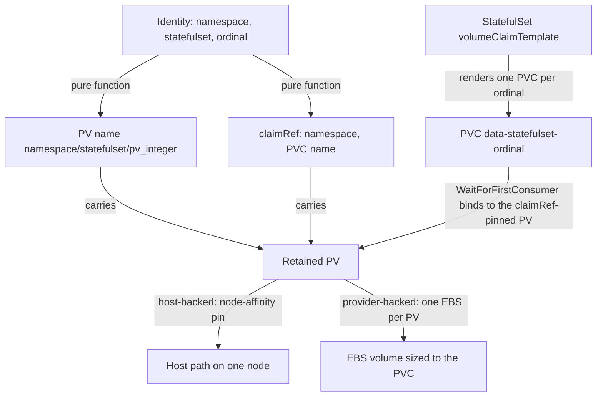
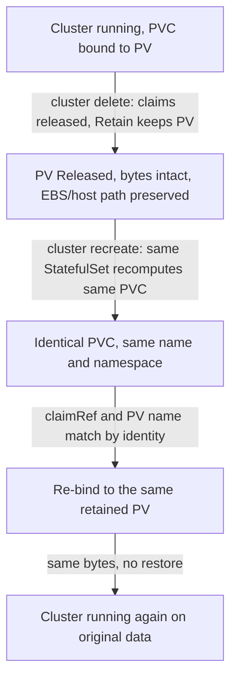

# Storage Lifecycle

**Status**: Authoritative source
**Supersedes**: N/A
**Referenced by**: DEVELOPMENT_PLAN/overview.md, DEVELOPMENT_PLAN/phase_16_retained_storage.md, DEVELOPMENT_PLAN/phase_17_vault_pki.md, DEVELOPMENT_PLAN/phase_18_platform_services.md, DEVELOPMENT_PLAN/phase_19_keycloak_ingress.md, DEVELOPMENT_PLAN/phase_30_provider_clusters.md, DEVELOPMENT_PLAN/phase_31_test_topology_dsl.md, DEVELOPMENT_PLAN/system_components.md, documents/engineering/README.md, documents/engineering/app_vs_deployment_doctrine.md, documents/engineering/chaos_failover_doctrine.md, documents/engineering/cluster_lifecycle_doctrine.md, documents/engineering/content_addressing_doctrine.md, documents/engineering/daemon_topology_doctrine.md, documents/engineering/image_build_doctrine.md, documents/engineering/inforcespec_migration_doctrine.md, documents/engineering/manifest_generation_doctrine.md, documents/engineering/namespace_layout_doctrine.md, documents/engineering/platform_services_doctrine.md, documents/engineering/pulsar_client_doctrine.md, documents/engineering/pulumi_iac_doctrine.md, documents/engineering/release_lifecycle_doctrine.md, documents/engineering/resource_capacity_doctrine.md, documents/engineering/single_logical_data_plane_doctrine.md, documents/engineering/tenancy_doctrine.md, documents/engineering/testing_doctrine.md, documents/engineering/vault_pki_doctrine.md, documents/illegal_state/illegal_state_capacity.md, documents/illegal_state/illegal_state_storage.md, documents/illegal_state/illegal_state_techniques.md
**Generated sections**: none

> **Purpose**: Define amoebius's durable-storage contract — the single `no-provisioner` retained PV model,
> the deterministic `<namespace>/<statefulset>/pv_<integer>` bind, explicit hard-capped sizes, host- and
> EBS-backed volumes that outlive their node and their cluster — and the rule that deletion of
> durable data is forbidden under normal operation.

---

## 1. Cluster and storage have independent lifetimes

An amoebius cluster is **ephemeral**: it can be torn down to free compute, brought back up on a different
substrate, or killed by a chaos move, and none of that loses committed data. Amoebius guarantees this by
giving storage a lifetime independent of the cluster that mounts it. (Shorthand: clusters are cattle;
storage is not.)

Concretely: clusters are ephemeral but their storage is not, and need to
be explicitly deleted… they don't get deleted automatically with the rest of the cluster, so that they
automatically rebind. A cluster destroy releases the claims; it never reclaims the volumes. The next
bring-up re-creates the exact same claims, which re-bind to the exact same volumes, which still hold the
exact same data. That round-trip — *delete the cluster, recreate it, find the data unchanged* — is the
**lossless-teardown guarantee**, and [§6](#6-the-lossless-teardown-guarantee-deterministic-rebind) cashes out exactly when it holds.

This doctrine is the SSoT for *how durable bytes live and rebind*. It does **not** own which services
produce those bytes (that is [platform_services_doctrine.md](./platform_services_doctrine.md)), the cluster
teardown order that releases them ([cluster_lifecycle_doctrine.md](./cluster_lifecycle_doctrine.md)), the
cloud-provider IaC that materializes EBS volumes ([pulumi_iac_doctrine.md](./pulumi_iac_doctrine.md)), or
the one elevated path allowed to delete storage ([testing_doctrine.md](./testing_doctrine.md)). It owns the
volume model and the rebind contract, and references the rest.

This model **generalizes** the single-node, host-path-only retained-storage scheme proven in the sibling
prodbox project (`prodbox/documents/engineering/storage_lifecycle_doctrine.md`) and lifts it to amoebius's
multi-node, multi-substrate world. Read every prescriptive statement below as amoebius *design intent* —
evidence inherited from prodbox is evidence from a sibling system, not proof in amoebius, which has not yet
built the storage layer. Status and gates live only in
[../../DEVELOPMENT_PLAN/README.md](../../DEVELOPMENT_PLAN/README.md).

---

## 2. One storage class, and it provisions nothing

Dynamic provisioning is the machinery that would let a cluster *create and destroy*
volumes on its own initiative. amoebius wants the opposite — volumes that a human or the elevated harness
created on purpose and that nothing in the normal cluster lifecycle can reclaim — so amoebius **deletes the
dynamic machinery outright**.

Every amoebius cluster has exactly one StorageClass, and it is inert:

- **`provisioner: kubernetes.io/no-provisioner`** — there is no controller standing by to mint a volume
  when a claim appears. A PVC binds only to a PV that **already exists** because amoebius placed it there.
- **`reclaimPolicy: Retain`** — when a PVC is deleted (e.g. by a cluster teardown), its PV is **not**
  deleted and its backing bytes are **not** wiped. The PV drops to `Released` and waits to be re-bound.
  Retain is the mechanical heart of durability; nothing else in this doc works without it.
- **`volumeBindingMode: WaitForFirstConsumer`** — binding is deferred until the consuming Pod is scheduled,
  so a host-backed PV binds against the node the Pod actually landed on, not a node chosen blind.
- **Every other StorageClass is removed**, and any default annotation on a competing class is stripped, so
  a claim can never silently fall through to a dynamic provisioner. There is no second way to get a volume.

The reconcile step that establishes this class — and removes all others — is part of cluster bring-up,
owned by [cluster_lifecycle_doctrine.md](./cluster_lifecycle_doctrine.md); this doc owns only the *shape*
the class must have.

---

## 3. PVCs are born only from StatefulSets

If any Deployment, Job, or hand-written manifest could mint a PVC, the set of durable claims
would be open-ended and unauditable, and the guarantee that every retained byte is accounted for would be
unverifiable. amoebius closes the
creation path to exactly one shape.

**A PVC is only ever created by a StatefulSet's `volumeClaimTemplate`**. There are no bare PVCs, no Deployment-mounted
`persistentVolumeClaim` volumes, no Job-created claims. Consequences:

- **Durable state ⇒ StatefulSet.** Anything that needs to persist bytes is a StatefulSet, so its claims get
  stable per-ordinal identity (`<claim>-<statefulset>-<ordinal>`) that survives Pod reschedules — the
  identity the deterministic rebind in [§6](#6-the-lossless-teardown-guarantee-deterministic-rebind) depends on.
- **Stateless ⇒ no claim.** A workload with no StatefulSet has no durable storage by construction; shared
  state for such workloads lives in a platform service (MinIO, Postgres, Pulsar), never in an ad-hoc PV. The
  **control-plane singleton** is the canonical stateless case: it is a Deployment `replicas=1` with no PVC,
  and its durable state is the MinIO bucket ([§7.2](#72-amoebius-own-control-plane-state-is-the-minio-bucket-not-a-pvc),
  [daemon_topology_doctrine.md §3.1](./daemon_topology_doctrine.md#31-exactly-one-pod-is-a-k8setcd-property-not-an-amoebius-election)).
- **The DSL is the gate.** The amoebius Dhall DSL does not expose a "make me a loose PVC" primitive at all;
  durable storage is requested through the app/StatefulSet surface and nowhere else. The illegal-state
  framing — *a claim that cannot bind, or storage attached to a non-StatefulSet, is unrepresentable* — is
  owned by [dsl_doctrine.md](./dsl_doctrine.md) and catalogued in
  [illegal_state_catalog.md](../illegal_state/illegal_state_catalog.md); this doc states the storage-side invariant the
  DSL enforces.

Per-app durable-storage requests (block volumes, Postgres, MinIO buckets) are declared in the app spec and
land in the app's own namespace; the app-vs-deployment split that keeps "I need a 20Gi volume" separate
from "run three replicas of me" is owned by [app_vs_deployment_doctrine.md](./app_vs_deployment_doctrine.md).

---

## 4. Deterministic PV naming and the explicit bind

Rebinding can only be deterministic if both ends of the bind are computed from stable
identity, never assigned by a race. So amoebius names every PV from `(namespace, statefulset, ordinal)` and
pins each PV to its claim *before the claim exists*.

- **Naming convention**: every PV is named on the deterministic scheme
  **`<namespace>/<statefulset>/pv_<integer>`**, where the integer is the StatefulSet ordinal the volume
  serves. The name is a pure function of identity; it carries no node id, no cluster id, no timestamp, and
  no allocation counter, so the *same* StatefulSet ordinal computes the *same* PV name on every cluster and
  every rebuild.
- **Explicit `claimRef`**. Each PV carries a `claimRef` naming the exact `(namespace, PVC-name)` it serves, so the
  pairing is fixed by amoebius rather than discovered by whichever unbound claim the scheduler happens to
  match first. A `volumeClaimTemplate` claim and its `claimRef`-pinned PV are two halves of one identity.
- **Node affinity for host-backed PVs.** A host-path volume lives on one specific node, so its PV declares
  node affinity to that node and the consuming Pod schedules there. On a single-node cluster this is the
  trivial case; on a multi-node kind/rke2 cluster each ordinal's PV is pinned to the node holding its
  bytes. (Provider/EBS volumes are node-independent — [§5](#5-sizes-are-explicit-hard-capped-and-one-volume-per-claim).)



---

## 5. Sizes are explicit, hard-capped, and one-volume-per-claim

An advisory-only size is not enforceable. If a "10Gi" volume can quietly grow to
fill the host disk, then capacity planning, dynamic node provisioning, and "this volume fits on that node"
all become guesswork. amoebius makes the declared size a **hard ceiling**, not a hint.

- **Every PVC declares a minimum size; every PV declares a capacity**. A sizeless durable claim is not representable.
- **Hard allocation, not advisory accounting**. The declared capacity is the real
  ceiling; a workload cannot spill past it onto shared host disk. OPEN (mechanism only); position fixed.
  Provider volumes hard-cap via EBS size today; host-backed volumes will be hard-capped by a quota- or
  image-backed volume, never a raw shared-filesystem subdirectory. Until it lands, host caps are advisory.
  Delivery tracked in [../../DEVELOPMENT_PLAN/README.md](../../DEVELOPMENT_PLAN/README.md).
- **One EBS drive per PV on provider substrates**. amoebius never carves many claims
  out of one shared cloud volume; the PV ↔ PVC ↔ EBS-volume mapping is 1:1:1, each EBS sized to exactly the
  paired PVC. The provider plumbing that materializes those EBS volumes — and the credential model that
  lets normal operation *create* but not *delete* them — is owned by
  [pulumi_iac_doctrine.md](./pulumi_iac_doctrine.md); this doc owns only the 1:1:1 sizing invariant.

### 5.1 Storage is independent of the node lifecycle

A volume must outlive the node it was mounted on, or "ephemeral cluster, durable storage" collapses the
moment a node is replaced. amoebius requires the two backings to deliver that independence in their own way:

- **Provider/EBS:** the PV is **not tied to the lifecycle of the EKS node / EC2 instance** that mounts it.
  When a node is terminated, the EBS volume **detaches and survives**; the
  replacement node re-attaches the same volume to the same claim. Node churn is invisible to the data.
- **Host-backed:** the bytes live in the host's retained storage root, not in the container or the kubelet's
  ephemeral scratch. A Pod reschedule re-mounts the same host path; the node-affinity pin ([§4](#4-deterministic-pv-naming-and-the-explicit-bind)) keeps the
  ordinal landing where its bytes are.

Either way, the rule is the same: **node lifecycle and storage lifecycle are decoupled**, which is the
node-level precondition for the cluster-level guarantee in [§6](#6-the-lossless-teardown-guarantee-deterministic-rebind).

### 5.2 The storage backing is bounded — the closed `StorageBacking` union

[§5](#5-sizes-are-explicit-hard-capped-and-one-volume-per-claim) caps each *volume*; this subsection caps the *backing* a set of volumes draws from, so "unbounded storage"
([illegal_state_catalog.md §3.18](../illegal_state/illegal_state_storage.md#318-unbounded-storage-anywhere)) has no syntax. There is no such thing as
unbounded storage in amoebius: durable storage is **either** host-level (bounded by a physical disk) **or**
cloud (bounded by a quota), encoded as a **closed union with no unbounded arm**:

```
StorageBacking = HostDisk Capacity | Ebs Capacity | CloudQuota Quota
```

- **No unbounded constructor** (a type-foreclosed union shape, [illegal_state_catalog.md §6](../illegal_state/illegal_state_techniques.md#6-three-layers-of-foreclosure-and-the-honesty-they-force)):
  a value cannot denote unbounded storage. A `HostDisk`/`Ebs` backing is bounded by a physical/EBS size; a
  `CloudQuota` backing is bounded by a quota owned by [pulumi_iac_doctrine.md](./pulumi_iac_doctrine.md); the
  content-addressed MinIO store is a `HostDisk`/`CloudQuota` backing owned by
  [content_addressing_doctrine.md](./content_addressing_doctrine.md). Each arm names exactly one owner of its
  ceiling number, so "available storage" has one definition.
- **The aggregate fold lives elsewhere.** This doc owns the *union shape* and the per-volume sizing ([§5](#5-sizes-are-explicit-hard-capped-and-one-volume-per-claim));
  the **aggregate arithmetic** — `Σ(PV caps) ≤ backing`, and the Pulsar two-ceiling fold — is owned by
  [resource_capacity_doctrine.md §5, §7](./resource_capacity_doctrine.md#5-storagebudget-bounded-by-construction-single-owner-ceiling-per-arm) (the [§4.6](../illegal_state/illegal_state_techniques.md#46-capacity-accounting--placement-witness-compute-and-summed-demand-within-capacity-storage-checked) capacity-accounting
  technique). An app that would consume more storage than its backing
  ([illegal_state_catalog.md §3.19](../illegal_state/illegal_state_storage.md#319-an-application-consuming-more-storage-than-its-backing-minio-and-pulsar)) is rejected by that fold at decode; "unbounded"
  is representable **only** through a `Growable` scaling policy whose ceiling is itself a quota
  ([resource_capacity_doctrine.md §6](./resource_capacity_doctrine.md#6-growable--scalingpolicy-the-escape-valve-amoebius-owns)).

---

## 6. The lossless-teardown guarantee: deterministic rebind

Because the PV name and `claimRef` are pure functions of identity ([§4](#4-deterministic-pv-naming-and-the-explicit-bind)), and because Retain
keeps the volume alive after the claim is gone ([§2](#2-one-storage-class-and-it-provisions-nothing)), a destroyed-then-recreated cluster recomputes the
*same* claims, which match the *same* still-living volumes. Nothing is restored from a backup; the original
bytes were never released. That is the lossless-teardown guarantee: clusters can be torn down and spun
back up ephemerally with zero data loss because of the no-provisioner PVC/PV policy, which guarantees
identical rebinding.



**Deterministic rebind is guaranteed only when all of these hold** (adapted and generalized from the
prodbox rebinding rules):

1. The PVC name and namespace are unchanged across rebuild — guaranteed because both derive from the
   StatefulSet identity ([§3](#3-pvcs-are-born-only-from-statefulsets)), not from operator input.
2. The PV name and `claimRef` are recomputed deterministically from `(namespace, statefulset, ordinal)` ([§4](#4-deterministic-pv-naming-and-the-explicit-bind)).
3. The backing store is still present: the EBS volume was not deleted, or the host path still exists on its
   node.
4. A **host-backed** ordinal re-schedules to the **same node** its node-affinity-pinned PV lives on; a
   provider/EBS ordinal may land on any node because the volume re-attaches ([§5.1](#51-storage-is-independent-of-the-node-lifecycle)).
5. Any secret that must match the preserved data (e.g. a Patroni role password against a preserved
   `pg_authid`) re-attaches to the same material — owned by [vault_pki_doctrine.md](./vault_pki_doctrine.md);
   a mismatch must surface as a loud failure, never a silent data reset.

Vault's and MinIO's own durability — the platform secrets root and the object substrate themselves living
on retained PVs so a rebuild *unseals* rather than *re-initializes* — is the same mechanism applied to two
standard services; the persistence is in scope here, but the Vault seal/unseal and MinIO content models are
owned by [vault_pki_doctrine.md](./vault_pki_doctrine.md) and
[platform_services_doctrine.md](./platform_services_doctrine.md) respectively.

---

## 7. Deleting durable data is forbidden under normal operation

The vision states the reasoning: if teardown is the safe everyday way to
"turn off" a cluster, then "it's critical that its durable storage remains or spin-up will fail… we need to
ensure amoebius doesn't accidentally delete durable storage, which could mean outright forbidding it under
normal circumstances." amoebius takes the strong reading: **forbid it.**

- **Default posture: durable storage exists until explicitly destroyed.** The original vision names the
  default as "all durable storage must exist forever"; amoebius softens "forever" only to "until a
  deliberate, privileged deletion," never to "until the next teardown."
- **No normal-operation code path deletes a retained PV or its bytes.** Cluster delete releases claims and
  leaves volumes Retained ([§2](#2-one-storage-class-and-it-provisions-nothing), [§6](#6-the-lossless-teardown-guarantee-deterministic-rebind)). `chart`/app delete removes the PVC/PV *objects* it owns but never the
  backing bytes on a retained volume. The DSL surface exposes **no** "delete this durable volume"
  primitive; a `.dhall` value cannot denote "destroy these bytes." This is the storage-side reading of the
  illegal-state contract owned by [dsl_doctrine.md](./dsl_doctrine.md) /
  [illegal_state_catalog.md](../illegal_state/illegal_state_catalog.md).
- **Teardown pushes back rather than deletes.** When tearing down a cluster would strand or endanger durable
  state, the safe-teardown path warns and falls back to the `.dhall` failback instead of silently
  destroying data; the push-back/override semantics are owned by
  [cluster_lifecycle_doctrine.md](./cluster_lifecycle_doctrine.md).
- **Credential-level enforcement, not just policy.** On provider substrates the intended backstop is that
  normal-operation credentials can *create* EBS but not *delete* it, so "accidentally delete durable
  storage" is unauthorized at the cloud API, not merely discouraged. The exact create-vs-delete credential
  model (and whether Pulumi creates under one credential set and the harness destroys under another) is
  resolved by [pulumi_iac_doctrine.md](./pulumi_iac_doctrine.md) §6 (three locked decisions: durable-class
  EBS carried outside the ephemeral cluster stack; normal-operation credentials create-but-not-delete; only
  the elevated in-memory test credential deletes test-flagged volumes); this doc records only the
  requirement that the destroy capability be withheld from normal operation.

### 7.1 The single exception: the elevated test harness

Leak-free test cycles *must* delete the storage they create, or every test run would silt up the substrate
forever. amoebius resolves the tension by making harness deletion the **one** sanctioned
path:

- Only the **elevated test harness**, holding privileged delete credentials, may destroy durable storage,
  and only storage it flagged as test-owned.
- The flag-and-elevated-sweep mechanism, the per-run leak ledger, and the always-tear-down test `.dhall`
  topology are owned by [testing_doctrine.md](./testing_doctrine.md). This doc owns only the boundary:
  **normal operation cannot delete durable data; the elevated harness is the sole actor that can, on
  test-flagged resources.**

### 7.2 amoebius' own control-plane state is the MinIO bucket, not a PVC

The retained-PV model of this doctrine governs the **platform services and the workloads** that hold durable
bytes — MinIO's own backing disks, Pulsar/BookKeeper, Postgres/Patroni, and any app StatefulSet. It does
**not** describe amoebius's *own* control-plane state, which follows a different, stricter rule:

- **The amoebius control plane holds no PVC.** The control-plane singleton is a stateless Deployment
  `replicas=1` ([daemon_topology_doctrine.md §3.1](./daemon_topology_doctrine.md#31-exactly-one-pod-is-a-k8setcd-property-not-an-amoebius-election));
  it mounts no durable volume and keeps nothing on local disk.
- **Its durable state is exclusively the Vault-enveloped MinIO bucket.** The `InForceSpec`, the Pulumi
  state, and every other byte the control plane must persist live as Vault-Transit-enveloped objects in
  MinIO ([pulumi_iac_doctrine.md §2](./pulumi_iac_doctrine.md#2-the-backend-every-byte-of-state-is-a-vault-enveloped-object-in-minio),
  [dsl_doctrine.md §3](./dsl_doctrine.md#3-the-orchestration-surface-parameters-context-witness)), decrypted
  in-process and never written to a plaintext ConfigMap, to etcd, or to a control-plane PVC
  ([illegal_state_catalog.md](../illegal_state/illegal_state_catalog.md), the plaintext-spec-at-rest entry).
- **Why the distinction matters.** It keeps the singleton disposable — k8s can reschedule it anywhere with
  no volume to re-attach and no data to lose ([§5.1](#51-storage-is-independent-of-the-node-lifecycle) applies
  to platform-service volumes, not to the control plane, because the control plane has none). MinIO itself is
  a platform service and *does* sit on retained PVs per this doctrine; the control plane is a *client* of
  that bucket, not a holder of its own volume.

This is the storage-side statement of the invariant **amoebius durable storage (for the control plane) is
exclusively the MinIO bucket**; the object-store model MinIO provides is owned by
[platform_services_doctrine.md](./platform_services_doctrine.md) and
[content_addressing_doctrine.md](./content_addressing_doctrine.md).

---

## 8. Shrinking storage without representing data destruction

The hardest case the vision flags: "this requires more thought for things like
elastic storage requirements (how can we ever shrink them?). We need to enable storage shrinking while still
making it impossible to represent destruction of data." Growth is easy — a larger size strictly contains the
old bytes. Shrinking is the hard case: the naïve "delete the volume, make a smaller one" is the
forbidden operation of [§7](#7-deleting-durable-data-is-forbidden-under-normal-operation) in another form.

amoebius's design position: **a shrink is never an in-place truncation; it is a verified migration.**

- **Grow is representable in place.** Increasing a PVC's requested size is an ordinary, data-preserving
  change (resize the EBS volume / grow the filesystem); the larger volume still holds every original byte.
- **Shrink is expressed as create-new → verified-migrate → retire-old**, never as "represent a smaller
  volume holding the same data." The DSL value the operator writes denotes the *target smaller size*; the
  reconciler realizes it by provisioning a new, correctly-sized retained volume, copying the live bytes,
  **verifying the copy**, and only then retiring the old volume. No `.dhall` value ever denotes "discard
  these bytes," so destruction stays unrepresentable even while the effective size goes down.
- **The retire-old step is itself a durable-data deletion** and therefore inherits [§7](#7-deleting-durable-data-is-forbidden-under-normal-operation): under normal
  operation it is forbidden, and the actual reclaim of the now-orphaned old volume is gated to the same
  elevated path that the test harness uses (or to a deliberate, privileged operator action). A shrink that
  cannot verify its copy leaves *both* volumes intact and fails loud — it never trades the old bytes for an
  unverified new home.

> **Honesty.** This is a *design resolution* of an explicitly open question, not a built or tested
> amoebius capability. The mechanism above (especially the verified-migrate gate and the elevated reclaim of
> the retired volume) is design intent; treat it as a specification to be validated, never as a proven
> result. Delivery is tracked in [../../DEVELOPMENT_PLAN/README.md](../../DEVELOPMENT_PLAN/README.md).

---

## 9. What this doctrine deliberately does not own

To keep the SSoT boundaries crisp:

| Concern | Owned by |
|---------|----------|
| Which services produce durable bytes (MinIO, Vault, Postgres) and that they run HA | [platform_services_doctrine.md](./platform_services_doctrine.md) |
| Cluster teardown ordering, push-back on unsatisfiable root `InForceSpec`, dynamic node provisioning | [cluster_lifecycle_doctrine.md](./cluster_lifecycle_doctrine.md) |
| EBS materialization and the create-vs-delete credential model | [pulumi_iac_doctrine.md](./pulumi_iac_doctrine.md) |
| The elevated harness as sole storage deleter; flagged test resources; leak-free cycles | [testing_doctrine.md](./testing_doctrine.md) |
| Vault seal/unseal, secret-by-name, PKI trust anchor | [vault_pki_doctrine.md](./vault_pki_doctrine.md) |
| Making "a PVC that can't bind" / "durable storage without a StatefulSet" unrepresentable | [dsl_doctrine.md](./dsl_doctrine.md), [illegal_state_catalog.md](../illegal_state/illegal_state_catalog.md) |
| Substrate catalog and the host-path vs cloud-LB/EBS substrate split | [substrate_doctrine.md](./substrate_doctrine.md) |
| App-level durable-storage requests vs deployment-rules replica counts | [app_vs_deployment_doctrine.md](./app_vs_deployment_doctrine.md) |
| The aggregate capacity fold over the `StorageBacking` (`Σ` sizes `≤` backing); the `Growable` escape valve | [resource_capacity_doctrine.md](./resource_capacity_doctrine.md) |

---

## 10. Planning ownership

This document is normative storage-lifecycle doctrine only. Delivery sequencing, completion status,
validation gates, and remaining work — including the host-side hard-cap enforcement mechanism ([§5](#5-sizes-are-explicit-hard-capped-and-one-volume-per-claim)) and the
verified-shrink migration ([§8](#8-shrinking-storage-without-representing-data-destruction)) — are owned by
[../../DEVELOPMENT_PLAN/README.md](../../DEVELOPMENT_PLAN/README.md). This doc never maintains a competing
status ledger; it states the target shape and links back for status. Per
[documentation_standards.md §6](../documentation_standards.md#6-honesty-the-proventestedassumed-discipline), no statement here is a proven amoebius
result: the model generalizes behaviour proven in prodbox into amoebius design intent.

---

## Cross-references

- [Engineering Doctrine Index](./README.md)
- [Platform Services Doctrine](./platform_services_doctrine.md)
- [Cluster Lifecycle Doctrine](./cluster_lifecycle_doctrine.md)
- [Pulumi IaC Doctrine](./pulumi_iac_doctrine.md)
- [Testing Doctrine](./testing_doctrine.md)
- [Vault / PKI Doctrine](./vault_pki_doctrine.md)
- [DSL Doctrine](./dsl_doctrine.md)
- [Illegal State Catalog](../illegal_state/illegal_state_catalog.md)
- [Resource Capacity Doctrine](./resource_capacity_doctrine.md) — the aggregate `StorageBacking` fold and the `Growable` escape valve
- [App vs Deployment Doctrine](./app_vs_deployment_doctrine.md)
- [Substrate Doctrine](./substrate_doctrine.md)
- [Daemon Topology Doctrine](./daemon_topology_doctrine.md) — the stateless control-plane singleton whose state is the MinIO bucket ([§7.2](#72-amoebius-own-control-plane-state-is-the-minio-bucket-not-a-pvc))
- [Development Plan](../../DEVELOPMENT_PLAN/README.md)
- [Documentation Standards](../documentation_standards.md)
