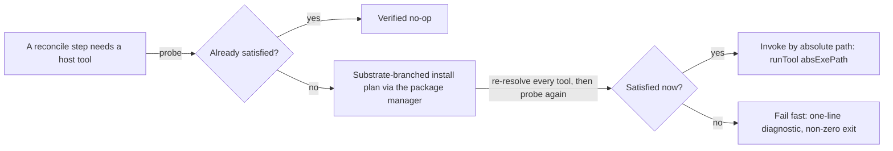
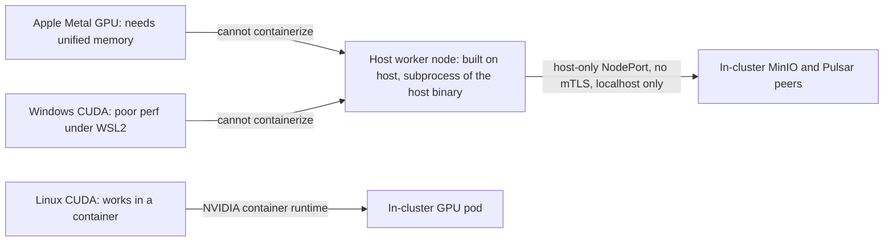
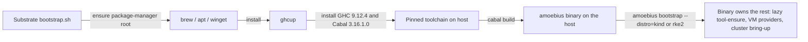

# Substrates

**Status**: Authoritative source
**Supersedes**: N/A
**Referenced by**: documents/engineering/README.md, documents/engineering/cluster_lifecycle_doctrine.md, documents/engineering/content_addressing_doctrine.md, documents/engineering/daemon_topology_doctrine.md, documents/engineering/dsl_doctrine.md, documents/engineering/host_cluster_comms_doctrine.md, documents/engineering/illegal_state_catalog.md, documents/engineering/image_build_doctrine.md, documents/engineering/platform_services_doctrine.md, documents/engineering/pulsar_client_doctrine.md, documents/engineering/pulumi_iac_doctrine.md, documents/engineering/service_capability_doctrine.md, documents/engineering/storage_lifecycle_doctrine.md, documents/engineering/testing_doctrine.md, documents/engineering/vault_pki_doctrine.md
**Generated sections**: none

> **Purpose**: Define the host substrates amoebius runs on (apple / linux-cpu / linux-cuda / windows),
> the virtualized substrates that synthesize a Linux host (Lima / WSL2 / Tart), the host worker nodes that
> reach substrate-specific hardware as host subprocesses, the no-environment-variable / no-`PATH` lazy
> tool-ensure contract, and the substrate-specific `bootstrap.sh` that hands off to the binary.

---

## 1. The substrate is a fact about the host, not a knob

The first thing amoebius does on a new machine is **find out what the machine is** — it does not ask, and
it cannot be told. A substrate is detected, not configured: the host's OS, CPU architecture, and GPU
presence are read at runtime and classified into one of a closed set of substrates. Everything downstream
— which package manager bootstraps the toolchain, which VM provider can synthesize a Linux host, which LB
the cluster gets, whether a host worker node is even possible — is a *consequence* of that classification,
never an independent input. This is what keeps a `.dhall` honest: it cannot claim a CUDA workload on a
machine with no GPU, because the substrate that would carry it is not a thing the operator gets to assert.

The canonical amoebius substrate catalog — the "at most one substrate per validation" set the plan keys
its phase gates to (see [../../DEVELOPMENT_PLAN/README.md](../../DEVELOPMENT_PLAN/README.md)) — is four
members:

| Substrate | Host OS | Native arch | GPU axis | Canonical role |
|-----------|---------|-------------|----------|----------------|
| **apple** | macOS (Apple Silicon) | `arm64` (always) | Metal (on-host, not containerizable) | Admin laptop root cluster; Apple-Metal host worker nodes |
| **linux-cpu** | Linux | `amd64` or `arm64` | none | The default validation substrate; kind/rke2 control plane |
| **linux-cuda** | Linux | `amd64` or `arm64` | NVIDIA present | In-cluster CUDA workloads via the NVIDIA container runtime |
| **windows** | Windows | `amd64` | CUDA present ⇒ on-host worker node | Linux substrates via WSL2; Windows-CUDA host worker nodes |

Two axes are orthogonal and both matter: the **OS** chooses the package manager and the VM-provider
strategy (§4); the **architecture** (`amd64` / `arm64`) is what makes mixed-arch clusters and multi-arch
images expressible — it feeds the buildx pipeline owned by
[image_build_doctrine.md](./image_build_doctrine.md). amoebius supports mixed-arch clusters; it does
**not** support Windows containers (in or outside WSL2) — Windows participates either as a Linux host (via
WSL2) or as the on-host CUDA worker case (§5).

> **Honesty.** The four-name catalog is the amoebius DSL surface. The seed detector in the `hostbootstrap`
> library distinguishes a *finer* granularity — `apple-silicon`, `linux-cpu`, `linux-gpu`, `windows-cpu`,
> `windows-gpu` (`HostBootstrap.Substrate.SubstrateName`) — so "linux-cuda" is the GPU-present Linux
> substrate and the Windows-CUDA case is `windows-gpu`. The amoebius DSL collapses the GPU axis into the
> substrate name where it changes the deployment shape; this doc names both so the mapping is not a
> surprise.

---

## 2. Detection: a pure classification over three reads

Detection separates cleanly into **what we observed** (impure: read the platform, probe for a GPU) and
**what that means** (pure: classify). The classification is a total function so it is unit-testable
without touching a host, and the only `IO` is the three reads that feed it.

In the `hostbootstrap` seed (`HostBootstrap.Substrate`), this is `classify :: osName -> rawArch -> gpu ->
Either String Substrate` wrapped by `detect :: IO (Either String Substrate)`:

- **OS** comes from `System.Info.os` (`darwin` / `linux` / `mingw32`).
- **Architecture** comes from `System.Info.arch`, normalized by `parseDockerArch` to `amd64` / `arm64`;
  anything else is a hard `Left` (unsupported architecture), not a guess.
- **GPU presence** is an NVIDIA probe (`hasNvidiaGpu`): the kernel markers `/proc/driver/nvidia/version`
  and `/dev/nvidiactl` first, then `nvidia-smi -L` as the fallback.

Two classification rules are load-bearing and stated as hard failures, not warnings:

- **Apple is always `arm64`.** macOS on a non-`arm64` architecture is rejected outright — there is no
  Intel-Mac substrate. Apple Silicon's unified memory is the whole reason the Apple substrate is special
  (§5), and that is an `arm64` fact.
- **GPU presence promotes the substrate.** A Linux host with an NVIDIA GPU classifies as `linux-cuda`
  (seed: `linux-gpu`), not `linux-cpu`; the CUDA container runtime is then a reconciler precondition (§3).

> **Honesty.** This is the `hostbootstrap` seed, ported from a prior Python detector. It is *evidence from
> a sibling library*, not a tested amoebius result — amoebius has not built Phase 1. Read every mechanism
> in this doc as design intent seeded from a working sibling, never as a proven amoebius behaviour. Status
> and gates live only in [../../DEVELOPMENT_PLAN/README.md](../../DEVELOPMENT_PLAN/README.md).

---

## 3. The no-environment / no-`PATH` lazy tool-ensure contract

**amoebius never reads an environment variable — including `PATH` — directly or indirectly, ever**
(DEVELOPMENT_PLAN cross-cutting invariants). This is one of the project's locked
invariants, and it has a precise positive form: when a host tool is needed, amoebius **lazily ensures and
resolves it through the substrate's package manager, then invokes it by absolute path.** No bare command
name is ever handed to the OS to resolve against a search path. This lazy package-manager scheme is proven
prior art — the sibling ML projects already run a two-tiered version of it in which, on Apple silicon, a
host-level Haskell binary manages the toolchain by lazily installing the brew packages it needs on demand.

Cashing out "lazily ensures" — the four-step contract:

1. **Probe.** Ask the substrate's package manager whether the tool is installed.
2. **Install if absent.** Use the package manager to install it.
3. **Resolve the absolute path** from the package manager itself (e.g. `brew --prefix` on Apple).
4. **Invoke by full path** in a subprocess — never a `PATH`-resolved bare name.

### Why this is structurally enforced, not merely a guideline

The `hostbootstrap` seed makes the *bare-name-invocation* failure mode **unrepresentable** rather than
discouraged:

- **The tool set is a closed enum.** `HostBootstrap.HostTool.HostTool` enumerates every external tool
  amoebius will shell out to (`docker`, `brew`, `ghcup`, `kubectl`, `helm`, `kind`, `nvidia-smi`, `wsl`,
  `incus`, `limactl`, …). An unlisted tool cannot be invoked.
- **A bare command name is unrepresentable as a resolved tool.** `AbsExe` is a newtype whose constructor is
  not exported; the only way to build one is `mkAbsExe`, which **rejects any non-absolute path**. So a
  resolved tool is, by type, always an absolute path. `toolCommandName` (the bare name) exists *only* for
  discovery and is never an invocation target.
- **Resolution happens once into a typed config.** `HostBootstrap.HostConfig` carries the detected
  substrate plus a `Map HostTool AbsExe`; a reconciler that needs a tool reads its `AbsExe` from there, and
  a missing tool fails fast (`UnresolvedTool`) rather than falling back to a search path.
- **Invocation is full-path only.** `runTool`/`runToolWithStdin` exec `absExePath`, never a bare name.

### Install-and-verify is probe-first and idempotent

The reconcile driver `installAndVerify` (`HostBootstrap.Ensure`) is the runtime shape of the four-step
contract: probe → if satisfied, a verified no-op → else run the substrate-branched install plan,
**re-resolving every tool after each step** (so a freshly `brew`-laid-down `ghcup` is discoverable by the
next step) → re-verify → fail fast with a one-line diagnostic if still unsatisfied. The install *plan* is a
pure value (`[InstallStep]`) per reconciler, so the substrate branching is unit-tested without invoking a
package manager; only the driver is `IO`. Each reconciler is gated by a substrate-applicability predicate
(`appliesTo`) and fails fast — before any side effect — when run on the wrong substrate (`decide` /
`diagnostic`).

### The exact boundary of the no-`PATH` rule

The rule governs **the host invocation surface**, and only that surface. When amoebius crosses a context
boundary — running a subcommand of itself inside a VM or container (§4; the composition lift owned by
[daemon_topology_doctrine.md](./daemon_topology_doctrine.md)) — only the **outermost** host tool is
resolved to an absolute path; every **nested** tool is the guest's *own* bare name run against the guest's
own `PATH`, which is legitimate because it is that guest's environment, not the host's
(`HostBootstrap.Lift.foldLeaf`). The invariant is "amoebius never resolves a tool against the *host's*
`PATH`," not "no `PATH` exists anywhere in the universe."

> **Honesty.** The structural enforcement above (`AbsExe`, the closed enum, full-path exec) exists in the
> `hostbootstrap` seed. Its *discovery* step today resolves an absolute path via `findExecutable` +
> `mkAbsExe`; the amoebius target is package-manager-canonical discovery (`brew --prefix` and equivalents). The end-state invariant — invocation is always by absolute path — is the part
> that is type-enforced now; package-manager-canonical *discovery* is the part still to land. Do not read
> the current discovery seam as the finished contract.

---

## 4. Virtualized substrates: synthesizing a Linux host where the host is not Linux

amoebius is Kubernetes-centric and does not support Windows containers; the unit of compute it actually
wants is a **Linux host**. On a substrate that is not natively Linux, amoebius synthesizes one in a VM and
then treats it as an ordinary Linux substrate — the same charts, the same services, the same DSL.
The VM is plumbing; the substrate the cluster sees is Linux.

| Host substrate | VM provider | What it synthesizes | Seed module |
|----------------|-------------|---------------------|-------------|
| **apple** | **Lima** (`limactl`) | An Ubuntu-24.04 Linux VM | `HostBootstrap.Ensure.Lima`, `HostBootstrap.Lima` |
| **windows** | **WSL2** | An Ubuntu-24.04 Linux distro | `HostBootstrap.Ensure.Wsl2`, `HostBootstrap.Wsl2` |
| **apple** (Swift builds) | **Tart** | A macOS VM for Swift/Xcode toolchains | (design intent — §4.3) |
| **linux** | Incus / Colima | A nested Linux VM where one is wanted | `HostBootstrap.Incus` (provider exists in the seed) |

### 4.1 Lima on Apple

`ensure lima` is `brew install lima` if `limactl` is absent, a verified no-op otherwise. The VM is started
as a named, project-budget-sized Ubuntu-24.04 instance (`HostBootstrap.Lima.startVMArgs`), and the binary
re-invokes its own subcommands inside it via `limactl shell <vm> -- <amoebius> <subcmd>` — the composition
lift that makes a step "run locally" wherever it was placed. That lift mechanism is owned by
[daemon_topology_doctrine.md](./daemon_topology_doctrine.md); this doc owns only *that Lima is the Apple
Linux-VM provider and why.*

### 4.2 WSL2 on Windows

`ensure wsl2` is the most involved provider because Windows gates virtualization at firmware and hypervisor
layers. The reconciler (`HostBootstrap.Ensure.Wsl2`):

- probes readiness with `wsl --status` / `wsl --list --online`, accepting "no installed distributions" as
  ready-to-install and detecting "virtualization disabled";
- checks `VirtualizationFirmwareEnabled` and `HyperVisorPresent` via PowerShell before attempting install,
  and **fails fast with an actionable message** when firmware virtualization is off (the operator must
  enable it in BIOS/UEFI);
- installs via `winget install --id Microsoft.WSL`, then `wsl --install --no-distribution`, then
  `wsl --set-default-version 2`, setting Ubuntu-24.04 as the distro;
- treats a **required host reboot** as a first-class fail-fast outcome ("reboot and retry"), not a silent
  hang — installing WSL2 and configuring `bcdedit` hypervisor launch both can require a reboot.

On Windows the nested-invocation tool is `wsl`, and (on a Windows host) the seed even routes `wsl` through
PowerShell so the absolute-path discipline holds at the host boundary.

### 4.3 Tart for Swift builds on Apple

Some Apple toolchains — Swift/Xcode builds for the ML extension libraries — want a clean, reproducible
macOS environment rather than the developer's live host. amoebius's design (the plan's Phase 7 gate)
provisions a **Tart** macOS VM for those Swift builds, managed by the host binary
just like Lima and WSL2, so build artifacts land in one place under the host's control — the approach the
sibling jitML build already uses today. This keeps Apple
build provenance off the developer's hand-configured machine.

> **Honesty.** Lima, WSL2, and Incus are implemented VM providers in the `hostbootstrap` seed; **Tart is
> design intent here**, scheduled for the Apple-substrate phase. The sibling `infernix` library has
> *removed* its own legacy Tart implementation in favor of a headless materialization path — so do not
> treat any Tart code as existing-and-proven; amoebius will provision Tart fresh under this doctrine when
> the Apple phase opens. Phase/status: [../../DEVELOPMENT_PLAN/README.md](../../DEVELOPMENT_PLAN/README.md).

---

## 5. Host worker nodes: substrate-specific hardware that refuses to be contained

Containers and VMs are the default, but two classes of hardware **cannot be reached performantly through
them**, and for those amoebius builds and manages a non-containerized **host worker node** — a long-running
host subprocess of the host binary:

| Hardware | Substrate | Why not a container / VM | What runs on the host |
|----------|-----------|--------------------------|-----------------------|
| **Apple Metal GPU** | apple | Metal needs Apple Silicon **unified memory**; it cannot run in a Linux container or a Linux VM | An on-host inference/ML worker, built natively (Swift parts via Tart, §4.3) |
| **NVIDIA CUDA on Windows** | windows | The CUDA stack does **not** run performantly from inside WSL2 | An on-host CUDA worker, built natively on Windows |

The defining properties of a host worker node:

- **Built directly on the host** (or in a Tart macOS VM for the Swift parts on Apple, §4.3), not pulled as
  a container image. This is the one place amoebius compute lives *outside* a cluster pod.
- **Managed as a subprocess by the host amoebius binary**, which owns its lifecycle. The stateless-role
  skeleton the seed uses is Load → Prereq → Acquire → Ready → Serve → Drain → Exit
  (`HostBootstrap.RoleLifecycle`), with a guaranteed drain even if serving throws — so a host worker has a
  defined startup and a clean shutdown, not an unmanaged background process.
- **Joins the cluster as a peer, not through the wild-ingress edge.** A host worker reaches in-cluster
  MinIO and Pulsar as a **peer over host-only NodePorts with no mTLS**, localhost-only, with no WAN or LAN
  access. That communication model — including the kube-apiserver-over-distro-mTLS path and the host-only
  network restriction — is owned in full by
  [host_cluster_comms_doctrine.md](./host_cluster_comms_doctrine.md); the carve-out is recorded in
  [platform_services_doctrine.md §9](./platform_services_doctrine.md). This doc owns only *which hardware
  forces a host worker and why*, not the wire.
- **Is a worker role, not the control plane.** The worker-role taxonomy and the in-cluster control-plane
  singleton are owned by [daemon_topology_doctrine.md](./daemon_topology_doctrine.md). The CUDA *in-cluster*
  path (the `linux-cuda` container runtime, `HostBootstrap.Ensure.Cuda`: NVIDIA container toolkit +
  `nvidia` Docker runtime registration) is the **contrast** case — CUDA in a Linux container is fine; CUDA
  on Windows and GPU on Apple are the ones that escape to the host.

---

## 6. The `bootstrap.sh` contract: ensure a toolchain, build the binary, hand off

`bootstrap.sh` is the **only shell script amoebius owns**, and it does as little as possible. Its entire
job is to get a built amoebius binary onto the host and then get out of the way — because the no-`PATH` /
no-env, lazy-tool-ensure discipline (§3) cannot start until there is a Haskell binary to enforce it.
Everything after the binary exists is the binary's responsibility, in Haskell, under this doctrine: the
script does not install brew packages, it just ensures brew is installed, builds the project Haskell binary,
then calls `bootstrap`, which takes over from there.

The contract, on the canonical Apple lane:

1. **Ensure the package manager.** On Apple that is **Homebrew**. Homebrew is the toolchain *root* — it
   cannot be installed *through* a resolved host tool because there is no prior package manager to install
   it (`HostBootstrap.Ensure.Homebrew` is, by design, a verified no-op when `brew` is present and a
   fail-fast with the install instruction otherwise). So the script installs `brew` **pre-binary**.
2. **Ensure `ghcup` via the package manager** (`brew install ghcup`).
3. **Install the pinned toolchain: GHC 9.12.4 and Cabal 3.16.1.0** via `ghcup`, and ensure they are
   available on the host. (GHC 9.14.1 is a deferred later-phase bump; the committed pin is 9.12.4 /
   3.16.1.0; see [../../DEVELOPMENT_PLAN/README.md](../../DEVELOPMENT_PLAN/README.md).)
4. **Build the project Haskell binary** (`cabal build`).
5. **Hand off to the binary.** The script's final act is to invoke the freshly built binary's `bootstrap`
   subcommand with its mandatory distro flag — `amoebius bootstrap --distro={kind,rke2} [--replicas=n]`
   (`replicas` defaults to `1` on `kind`). From here the binary takes over: it installs further build tools
   and dependencies through the package manager **as needed and by full path** (§3) — including the Tart VM
   for Swift builds (§4.3) — and drives cluster bring-up.

`bootstrap.sh` is **substrate-specific** because step 1 differs: brew on apple, the system package manager
(e.g. `apt`) on linux, `winget` on windows. Steps 2–5 are identical across substrates — the same `ghcup`
toolchain pin, the same build, the same `bootstrap` hand-off — so the per-substrate surface area is exactly
the package-manager-root bootstrap and nothing else.

What the in-binary `bootstrap` command then *does* — substrate detection, VM-provider ensure, single-node
cluster bring-up, the `--distro` / `--replicas` orchestration — is owned by
[cluster_lifecycle_doctrine.md](./cluster_lifecycle_doctrine.md), not here. This section owns only the
**pre-binary** contract and the hand-off point.

> **Provider clusters have no `bootstrap.sh` and no host binary.** A fully managed cluster (e.g. AKS/EKS) is
> provisioned over an API from within an existing amoebius cluster; there is no
> host access, so there is no host worker node and no on-host bootstrap. That path is owned by
> [pulumi_iac_doctrine.md](./pulumi_iac_doctrine.md). The highest-level parent is therefore generally a
> single-node kind or rke2 cluster on an admin's machine, which *does* go through this contract.

---

## 7. The LoadBalancer is the one substrate-driven platform difference

Substrate equivalence is near-total: every cluster on every substrate stands up the identical service set
([platform_services_doctrine.md](./platform_services_doctrine.md)). The **single** lower-layer difference
the substrate dictates is the **LoadBalancer implementation**:

- **MetalLB** on bare-metal / kind / rke2 substrates (no cloud LB to lean on).
- A **cloud LoadBalancer** (e.g. the AWS Load Balancer Controller) on provider-managed substrates.

Everything *above* the LB — Envoy + Gateway API, Keycloak-owns-all-wild-ingress, the whole standard service
set — is substrate-identical. This doc owns the **LB-choice-by-substrate** mapping; the LB's role as a
standard service and the ingress shape it fronts are owned by
[platform_services_doctrine.md §9](./platform_services_doctrine.md), and cloud-LB provisioning is owned by
[pulumi_iac_doctrine.md](./pulumi_iac_doctrine.md). When a provider substrate appears to be "missing" a
piece the local cluster has, the fix is to extend the shared platform installer for that substrate — never
to render a different service set (the structural-equivalence rule,
[platform_services_doctrine.md §12](./platform_services_doctrine.md)).

---

## 8. Planning ownership

This document is normative substrate doctrine only. Delivery sequencing, completion status, and validation
gates are owned by [../../DEVELOPMENT_PLAN/README.md](../../DEVELOPMENT_PLAN/README.md): substrate detection
and the `bootstrap` contract land in **Phase 1** (`linux-cpu`); host compute daemons and the
Lima/Tart/WSL2 providers land in **Phase 7** (`apple`); the in-cluster CUDA path is exercised in
**Phase 6** (`linux-cuda`). This doc never maintains a competing status ledger; it states the target shape
and links back for status, per [documentation_standards.md §6](../documentation_standards.md).

---

## Cross-references

- [Engineering Doctrine Index](./README.md)
- [Platform Services Doctrine](./platform_services_doctrine.md)
- [Host ↔ Cluster Comms Doctrine](./host_cluster_comms_doctrine.md)
- [Daemon Topology Doctrine](./daemon_topology_doctrine.md)
- [Image Build Doctrine](./image_build_doctrine.md)
- [Cluster Lifecycle Doctrine](./cluster_lifecycle_doctrine.md)
- [Pulumi IaC Doctrine](./pulumi_iac_doctrine.md)
- [Development Plan](../../DEVELOPMENT_PLAN/README.md)
- [Documentation Standards](../documentation_standards.md)
