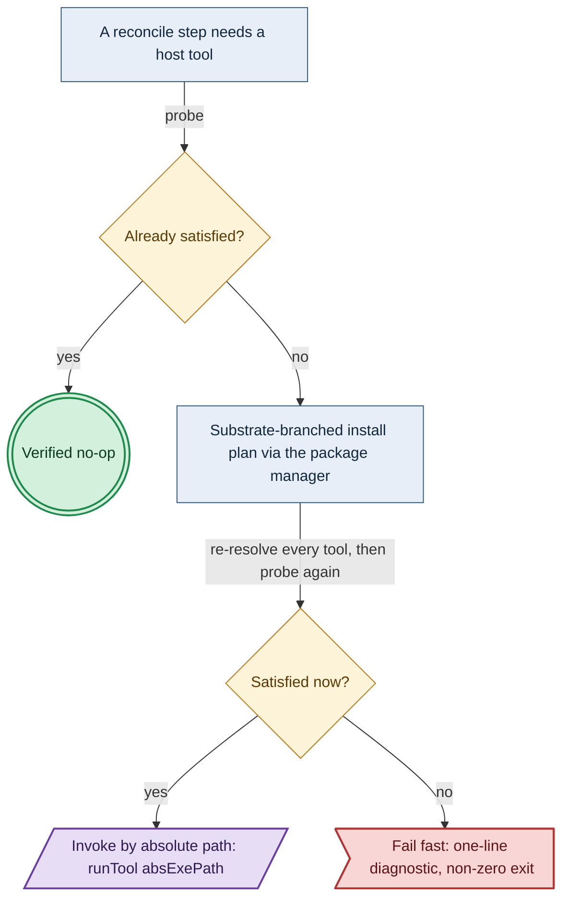
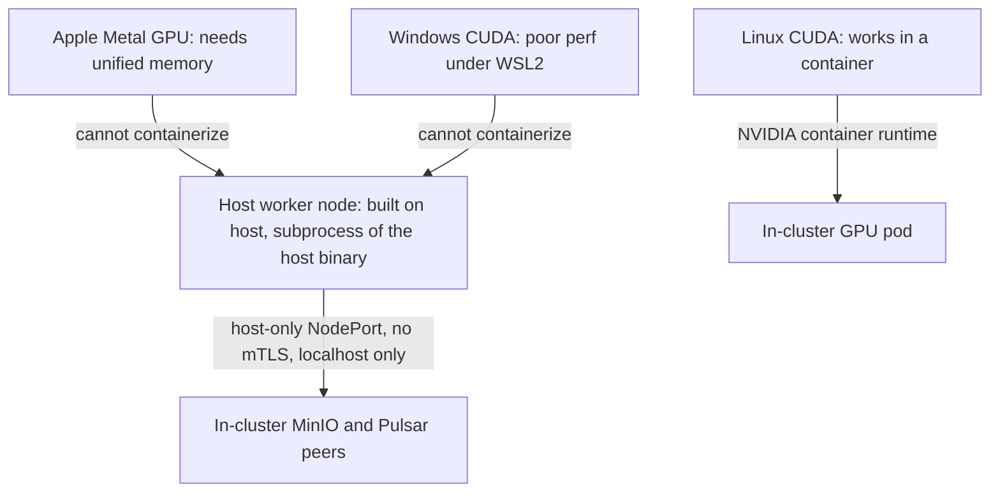
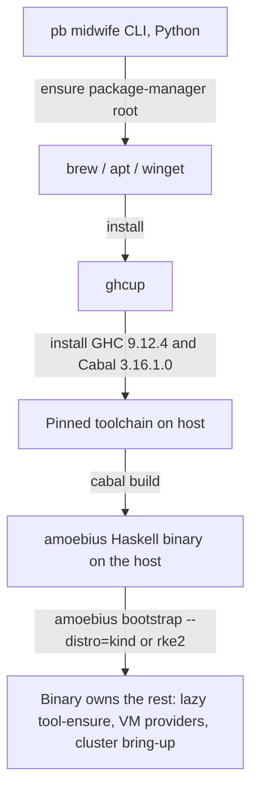

# Substrates

**Status**: Authoritative source
**Supersedes**: N/A
**Referenced by**: DEVELOPMENT_PLAN/later_phases.md, DEVELOPMENT_PLAN/legacy_tracking_for_deletion.md, DEVELOPMENT_PLAN/overview.md, DEVELOPMENT_PLAN/phase_17_midwife_bootstrap_kind.md, DEVELOPMENT_PLAN/phase_18_base_image_registry.md, DEVELOPMENT_PLAN/phase_28_pulsar_client.md, DEVELOPMENT_PLAN/phase_34_provider_deploy_checkpoint.md, DEVELOPMENT_PLAN/phase_38_determinism_jitcache.md, DEVELOPMENT_PLAN/phase_41_apple_metal_host_daemon.md, DEVELOPMENT_PLAN/substrates.md, DEVELOPMENT_PLAN/system_components.md, documents/engineering/README.md, documents/engineering/apple_metal_headless_builds.md, documents/engineering/bootstrap_sequence_doctrine.md, documents/engineering/cluster_lifecycle_doctrine.md, documents/engineering/cluster_topology_doctrine.md, documents/engineering/content_addressing_doctrine.md, documents/engineering/daemon_topology_doctrine.md, documents/engineering/dsl_doctrine.md, documents/engineering/host_cluster_comms_doctrine.md, documents/engineering/image_build_doctrine.md, documents/engineering/network_fabric_doctrine.md, documents/engineering/platform_services_doctrine.md, documents/engineering/preflight_validation_doctrine.md, documents/engineering/pulsar_client_doctrine.md, documents/engineering/pulumi_iac_doctrine.md, documents/engineering/resource_capacity_doctrine.md, documents/engineering/service_capability_doctrine.md, documents/engineering/single_logical_data_plane_doctrine.md, documents/engineering/storage_lifecycle_doctrine.md, documents/engineering/testing_doctrine.md, documents/engineering/vault_pki_doctrine.md, documents/illegal_state/illegal_state_capacity.md, documents/illegal_state/illegal_state_multicluster.md, documents/illegal_state/illegal_state_techniques.md, documents/illegal_state/illegal_state_topology.md
**Generated sections**: none

> **Purpose**: Define the host substrates amoebius runs on (apple / linux-cpu / linux-cuda / windows),
> the virtualized substrates that synthesize a Linux host (Lima / WSL2), the host worker nodes that
> reach substrate-specific hardware as host subprocesses, the no-environment-variable / no-`PATH` lazy
> tool-ensure contract, and the substrate-specific midwife CLI that builds and hands off to the binary —
> while the Apple-Metal host worker's headless, on-host, **no-VM** build/run shape (fixed Metal bridge +
> runtime MSL compilation) is owned by [apple_metal_headless_builds.md](./apple_metal_headless_builds.md).

---

## 1. The substrate is a fact about the host, not a knob

The first thing amoebius does on a new machine is **find out what the machine is** — it does not ask, and
it cannot be told. A substrate is detected, not configured: the host's OS, CPU architecture, and GPU
presence are read at runtime and classified into one of a closed set of substrates. Everything downstream
— which package manager bootstraps the toolchain, which VM provider can synthesize a Linux host, which LB
the cluster gets, whether a host worker node is even possible — is a *consequence* of that classification,
never an independent input. This is what keeps a `.dhall` honest: it cannot claim a CUDA workload on a
machine with no GPU, because the substrate that would carry it is not a thing the operator gets to assert.

The canonical amoebius substrate catalog — the "at most one substrate per validation" set the plan keys
its phase gates to (see [../../DEVELOPMENT_PLAN/README.md](../../DEVELOPMENT_PLAN/README.md)) — is four
members:

| Substrate | Host OS | Native arch | GPU axis | Canonical role |
|-----------|---------|-------------|----------|----------------|
| **apple** | macOS (Apple Silicon) | `arm64` (always) | Metal (on-host, not containerizable) | Admin laptop root cluster; Apple-Metal host worker nodes |
| **linux-cpu** | Linux | `amd64` or `arm64` | none | The default validation substrate; kind/rke2 control plane |
| **linux-cuda** | Linux | `amd64` or `arm64` | NVIDIA present | In-cluster CUDA workloads via the NVIDIA container runtime |
| **windows** | Windows | `amd64` | CUDA present ⇒ on-host worker node | Linux substrates via WSL2; Windows-CUDA host worker nodes |

Two axes are orthogonal and both matter: the **OS** chooses the package manager and the VM-provider
strategy ([§4](#4-virtualized-substrates-synthesizing-a-linux-host-where-the-host-is-not-linux)); the **architecture** (`amd64` / `arm64`) is what makes mixed-arch clusters and multi-arch
images expressible — it feeds the buildx pipeline owned by
[image_build_doctrine.md](./image_build_doctrine.md). amoebius supports mixed-arch clusters; it does
**not** support Windows containers (in or outside WSL2) — Windows participates either as a Linux host (via
WSL2) or as the on-host CUDA worker case ([§5](#5-host-worker-nodes-substrate-specific-hardware-that-cannot-be-containerized)).

> **Honesty.** The four-name catalog is the amoebius DSL surface. The seed detector in the `hostbootstrap`
> library distinguishes a *finer* granularity — `apple-silicon`, `linux-cpu`, `linux-gpu`, `windows-cpu`,
> `windows-gpu` (`HostBootstrap.Substrate.SubstrateName`) — so "linux-cuda" is the GPU-present Linux
> substrate and the Windows-CUDA case is `windows-gpu`. The amoebius DSL collapses the GPU axis into the
> substrate name where it changes the deployment shape; this doc names both so the mapping is not a
> surprise.

> **`cuda` names an accelerator *family*, not "a GPU."** The amoebius DSL name `linux-cuda` keys the
> GPU-present Linux substrate specifically on the **NVIDIA-container-runtime bootstrap**; `cuda` is the
> **NVIDIA accelerator family**, and a future non-NVIDIA accelerator (a ROCm/AMD device, a TPU-class part)
> would be its **own** substrate — a new closed catalog member with its own package-manager bootstrap and
> device linkage — never a re-use of this one. This is why the generic word `gpu` is deliberately avoided in
> the substrate surface: accelerator families differ in exactly the axis the substrate exists to carry (which
> runtime bootstraps them, how they link), so collapsing them under `gpu` would erase the distinction the
> catalog is for. Adding a family is **not** substrate-only extensibility: it costs a new closed substrate, a
> new detector (an `hasNvidiaGpu`-analog, [§2](#2-detection-a-pure-classification-over-three-reads)), and —
> downstream — a new closed `EngineRuntime` arm and a new landing-relation entry
> ([service_capability_doctrine.md](./service_capability_doctrine.md)). This note is **forward-looking**;
> only `cuda` is modelled today.

> **Why `windows` is not split into `windows-cuda` the way `linux` splits into `linux-cuda`.** The amoebius
> substrate name keys the **OS / VM-provider + wire strategy**, not accelerator presence. A Windows host
> reaches the cluster's GPU compute as an on-host worker *regardless* of how its in-cluster node is wired
> ([§5](#5-host-worker-nodes-substrate-specific-hardware-that-cannot-be-containerized)), so the
> deployment-shape-changing axis is already captured by the host-worker case, not by a second substrate name
> — the amoebius DSL collapses the seed's `windows-gpu` into `windows`. On Linux, by contrast, GPU presence
> *does* change the **in-cluster** deployment shape (the NVIDIA container runtime becomes a reconciler
> precondition), so there the GPU axis earns its own substrate name. The seed keeps `windows-gpu` distinct;
> amoebius does not.

---

## 2. Detection: a pure classification over three reads

Detection separates cleanly into **what was observed** (impure: read the platform, probe for a GPU) and
**what that means** (pure: classify). The classification is a total function so it is unit-testable
without touching a host, and the only `IO` **feeding the classifier** is the three reads (OS, arch,
GPU-presence). Capacity inventory performs additional reads that do not affect this classification: kubelet
allocatable, the runtime-discovered `nodefs`/`imagefs`/`containerfs` identities and capacities, containerd
content/snapshot roots, mount/device/quota identity, and—on a positive GPU probe—stable device
identity/profile, per-device raw-total/current-free VRAM, and the endpoint-validated peer/NVLink graph. Those
populate the per-host `Capacity`, not the substrate class (below).

In the `hostbootstrap` seed (`HostBootstrap.Substrate`), this is `classify :: osName -> rawArch -> gpu ->
Either String Substrate` wrapped by `detect :: IO (Either String Substrate)`:

- **OS** comes from `System.Info.os` (`darwin` / `linux` / `mingw32`).
- **Architecture** comes from `System.Info.arch`, normalized by `parseDockerArch` to `amd64` / `arm64`;
  anything else is a hard `Left` (unsupported architecture), not a guess.
- **GPU presence** is an NVIDIA probe (`hasNvidiaGpu`): the kernel markers `/proc/driver/nvidia/version`
  and `/dev/nvidiactl` first, then `nvidia-smi -L` as the fallback. On a positive probe the detector reads
  each device's UUID/profile, `memory.total`, and `memory.free` by invoking `nvidia-smi`
  (`--query-gpu=uuid,name,memory.total,memory.free`) **by absolute path** per the no-env / no-`PATH` contract
  ([§3](#3-the-no-environment--no-path-lazy-tool-ensure-contract)), never a bare name. Row count is device
  count. The same absolute executable runs `nvidia-smi topo -m` and the peer-access matrix query; the parser
  maps matrix indices back to UUIDs and emits only endpoint-resolved
  `PciePeerAccess | NvLink` edges. Unknown endpoints, asymmetric/conflicting rows, or an unavailable topology
  query fail closed when a declared demand requires that relation. These observations cross-check the per-host accelerator/`vram` `Capacity` the node inventory declares
  ([§8](#8-the-node-inventory-the-single-owner-of-hosts-capacity-and-taints)), so accelerator **count** and
  **net allocatable VRAM** are *declared-at-decode and cross-checked-at-runtime*, while current free VRAM
  constrains each live admission. Neither a raw product label nor `memory.total` is treated as spendable.

Two classification rules are load-bearing and stated as hard failures, not warnings:

- **Apple is always `arm64`.** macOS on a non-`arm64` architecture is rejected outright — there is no
  Intel-Mac substrate. Apple Silicon's unified memory is why the Apple substrate is treated distinctly
  ([§5](#5-host-worker-nodes-substrate-specific-hardware-that-cannot-be-containerized)), and that is an `arm64` fact.
- **GPU presence promotes the substrate.** A Linux host with an NVIDIA GPU classifies as `linux-cuda`
  (seed: `linux-gpu`), not `linux-cpu`; the CUDA container runtime is then a reconciler precondition ([§3](#3-the-no-environment--no-path-lazy-tool-ensure-contract)).

> **A non-NVIDIA accelerator classifies as `linux-cpu` — a named detection gap.** The probe is NVIDIA-only
> (`hasNvidiaGpu`), so a Linux host carrying a non-NVIDIA accelerator (AMD/ROCm, a TPU-class part) classifies
> as plain `linux-cpu` and the accelerator is not seen: there is **no `Left unsupported-accelerator`** —
> detection does not reject the host, it forgets the device. This is consistent with `cuda` being one
> accelerator family among possible others ([§1](#1-the-substrate-is-a-fact-about-the-host-not-a-knob)).
>
> **Status: OPEN (detection gap, intentionally un-foreclosed for v1).** A non-NVIDIA accelerator classifies as
> `linux-cpu` — the device is forgotten, not rejected. Current position: accepted for v1 (NVIDIA is the only
> targeted accelerator family); the detector SHOULD emit a warning so the drop is observable. Closing it is
> coordinated multi-doc work: a new closed substrate + detector and, downstream, a new `EngineRuntime` arm and
> landing-relation entry.

> **Honesty.** This is the `hostbootstrap` seed, ported from a prior Python detector. It is *evidence from
> a sibling library*, not a tested amoebius result — amoebius has not built Phase 17. Read every mechanism
> in this doc as design intent seeded from a working sibling, never as a proven amoebius behaviour. Status
> and gates live only in [../../DEVELOPMENT_PLAN/README.md](../../DEVELOPMENT_PLAN/README.md).

---

## 3. The no-environment / no-`PATH` lazy tool-ensure contract

**amoebius never reads an environment variable — including `PATH` — directly or indirectly, ever**
(DEVELOPMENT_PLAN cross-cutting invariants). This is one of the project's locked
invariants, and it has a precise positive form: when a host tool is needed, amoebius **lazily ensures and
resolves it through the substrate's package manager, then invokes it by absolute path.** No bare command
name is ever handed to the OS to resolve against a search path. This lazy package-manager scheme is proven
prior art — the sibling ML projects already run a two-tiered version of it in which, on Apple silicon, a
host-level Haskell binary manages the toolchain by lazily installing the brew packages it needs on demand.

Cashing out "lazily ensures" — the four-step contract:

1. **Probe.** Ask the substrate's package manager whether the tool is installed.
2. **Install if absent.** Use the package manager to install it.
3. **Resolve the absolute path** from the package manager itself (e.g. `brew --prefix` on Apple).
4. **Invoke by full path** in a subprocess — never a `PATH`-resolved bare name.

### Why this is structurally enforced, not merely a guideline

The `hostbootstrap` seed makes the *bare-name-invocation* failure mode **unrepresentable** rather than
discouraged:

- **The tool set is a closed enum.** `HostBootstrap.HostTool.HostTool` enumerates every external tool
  amoebius will shell out to (`docker`, `brew`, `ghcup`, `kubectl`, `kind`, `nvidia-smi`, `wsl`,
  `incus`, `limactl`, …) — note `helm` is *not* among them: amoebius renders and applies its own typed
  manifests and never shells out to Helm ([manifest_generation_doctrine.md](./manifest_generation_doctrine.md)).
  An unlisted tool cannot be invoked.
- **A bare command name is unrepresentable as a resolved tool.** `AbsExe` is a newtype whose constructor is
  not exported; the only way to build one is `mkAbsExe`, which **rejects any non-absolute path**. So a
  resolved tool is, by type, always an absolute path. `toolCommandName` (the bare name) exists *only* for
  discovery and is never an invocation target.
- **Resolution happens once into a typed config.** `HostBootstrap.HostConfig` carries the detected
  substrate plus a `Map HostTool AbsExe`; a reconciler that needs a tool reads its `AbsExe` from there, and
  a missing tool fails fast (`UnresolvedTool`) rather than falling back to a search path.
- **Invocation is full-path only.** `runTool`/`runToolWithStdin` exec `absExePath`, never a bare name.

### Install-and-verify is probe-first and idempotent

The reconcile driver `installAndVerify` (`HostBootstrap.Ensure`) is the runtime shape of the four-step
contract: probe → if satisfied, a verified no-op → else run the substrate-branched install plan,
**re-resolving every tool after each step** (so a freshly `brew`-laid-down `ghcup` is discoverable by the
next step) → re-verify → fail fast with a one-line diagnostic if still unsatisfied. The install *plan* is a
pure value (`[InstallStep]`) per reconciler, so the substrate branching is unit-tested without invoking a
package manager; only the driver is `IO`. Each reconciler is gated by a substrate-applicability predicate
(`appliesTo`) and fails fast — before any side effect — when run on the wrong substrate (`decide` /
`diagnostic`).

Diagram vocabulary: [diagram_conventions.md](./diagram_conventions.md).



*Design intent. The probe/decision/refuse shape of the install-and-verify reconcile driver; the four-step ensure it drives is proven in the sibling hostbootstrap seed, not an amoebius result.*

### The exact boundary of the no-`PATH` rule

The rule governs **the host invocation surface**, and only that surface. When amoebius crosses a context
boundary — running a subcommand of itself inside a VM or container ([§4](#4-virtualized-substrates-synthesizing-a-linux-host-where-the-host-is-not-linux); the composition lift owned by
[daemon_topology_doctrine.md](./daemon_topology_doctrine.md)) — only the **outermost** host tool is
resolved to an absolute path; every **nested** tool is the guest's *own* bare name run against the guest's
own `PATH`, which is legitimate because it is that guest's environment, not the host's
(`HostBootstrap.Lift.foldLeaf`). The invariant is "amoebius never resolves a tool against the *host's*
`PATH`," not "no `PATH` exists anywhere in the universe."

> **Honesty.** The structural enforcement above (`AbsExe`, the closed enum, full-path exec) exists in the
> `hostbootstrap` seed. Its *discovery* step today resolves an absolute path via `findExecutable` +
> `mkAbsExe`; the amoebius target is package-manager-canonical discovery (`brew --prefix` and equivalents). The end-state invariant — invocation is always by absolute path — is the part
> that is type-enforced now; package-manager-canonical *discovery* is the part still to land. Do not read
> the current discovery seam as the finished contract.

---

## 4. Virtualized substrates: synthesizing a Linux host where the host is not Linux

amoebius is Kubernetes-centric and does not support Windows containers; the unit of compute it actually
wants is a **Linux host**. On a substrate that is not natively Linux, amoebius synthesizes one in a VM and
then treats it as an ordinary Linux substrate — the same charts, the same services, the same DSL.
The VM is plumbing; the substrate the cluster sees is Linux.

| Host substrate | VM provider | What it synthesizes | Seed module |
|----------------|-------------|---------------------|-------------|
| **apple** | **Lima** (`limactl`) | An Ubuntu-24.04 Linux VM | `HostBootstrap.Ensure.Lima`, `HostBootstrap.Lima` |
| **windows** | **WSL2** | An Ubuntu-24.04 Linux distro | `HostBootstrap.Ensure.Wsl2`, `HostBootstrap.Wsl2` |
| **linux** | Incus / Colima | A nested Linux VM where one is wanted | `HostBootstrap.Incus` (provider exists in the seed) |

There is deliberately **no macOS build VM** row. The Apple-Metal host worker's Swift/Metal parts are **not**
built in a VM (no Tart) — they build headless, directly on the macOS host; that shape and its rationale are
owned by [§4.3](#43-no-macos-build-vm-apple-builds-are-headless-on-host) and
[apple_metal_headless_builds.md](./apple_metal_headless_builds.md).

### 4.1 Lima on Apple

`ensure lima` is `brew install lima` if `limactl` is absent, a verified no-op otherwise. The VM is started
as a named, project-budget-sized Ubuntu-24.04 instance (`HostBootstrap.Lima.startVMArgs`), and the binary
re-invokes its own subcommands inside it via `limactl shell <vm> -- <amoebius> <subcmd>` — the composition
lift that makes a step "run locally" wherever it was placed. That lift mechanism is owned by
[daemon_topology_doctrine.md](./daemon_topology_doctrine.md); this doc owns only *that Lima is the Apple
Linux-VM provider and why.*

### 4.2 WSL2 on Windows

`ensure wsl2` is the most involved provider because Windows gates virtualization at firmware and hypervisor
layers. The reconciler (`HostBootstrap.Ensure.Wsl2`):

- probes readiness with `wsl --status` / `wsl --list --online`, accepting "no installed distributions" as
  ready-to-install and detecting "virtualization disabled";
- checks `VirtualizationFirmwareEnabled` and `HyperVisorPresent` via PowerShell before attempting install,
  and **fails fast with an actionable message** when firmware virtualization is off (the operator must
  enable it in BIOS/UEFI);
- installs via `winget install --id Microsoft.WSL`, then `wsl --install --no-distribution`, then
  `wsl --set-default-version 2`, setting Ubuntu-24.04 as the distro;
- treats a **required host reboot** as a first-class fail-fast outcome ("reboot and retry"), not a silent
  hang — installing WSL2 and configuring `bcdedit` hypervisor launch both can require a reboot.

On Windows the nested-invocation tool is `wsl`, and (on a Windows host) the seed even routes `wsl` through
PowerShell so the absolute-path discipline holds at the host boundary.

### 4.3 No macOS build VM: Apple builds are headless on-host

The Apple-Metal host worker's native Swift/Metal parts are **built headless, directly on the macOS host** —
**there is no macOS build VM, and specifically no Tart.** amoebius commits to this by design: a single fixed
Objective-C/C Metal bridge is source-built once on the host with `/usr/bin/clang` (by absolute path, per [§3](#3-the-no-environment--no-path-lazy-tool-ensure-contract))
and `dlopen`'d, and generated Metal Shading Language is compiled *at runtime* in-process via
`MTLDevice.makeLibrary(source:options:)`. No VM, no login-keychain dependency, no SwiftPM/per-kernel Swift
build, no full Xcode, no offline `metal` compiler. The full requirements, architecture, prerequisite model,
and the "why not a VM" rationale are owned by
[apple_metal_headless_builds.md](./apple_metal_headless_builds.md); [§5](#5-host-worker-nodes-substrate-specific-hardware-that-cannot-be-containerized) below owns only *which hardware forces
a host worker*.

> **Honesty.** Lima, WSL2, and Incus are implemented VM providers in the `hostbootstrap` seed. The headless,
> on-host Apple build/run shape is **proven in the sibling jitML project** (its implemented fixed-Metal-bridge
> path) and the sibling `infernix` library **removed** its own legacy Tart path in favour of it — that is
> *sibling evidence, not an amoebius result*; amoebius has not built its Apple phase, and there is no amoebius
> Tart code, now or planned. Phase/status: [../../DEVELOPMENT_PLAN/README.md](../../DEVELOPMENT_PLAN/README.md).

---

## 5. Host worker nodes: substrate-specific hardware that cannot be containerized

Containers and VMs are the default, but two classes of hardware **cannot be reached performantly through
them**, and for those amoebius builds and manages a non-containerized **host worker node** — a long-running
host subprocess of the host binary:

| Hardware | Substrate | Why not a container / VM | What runs on the host |
|----------|-----------|--------------------------|-----------------------|
| **Apple Metal GPU** | apple | Metal needs Apple Silicon **unified memory**; it cannot run in a Linux container or a Linux VM | An on-host inference/ML worker, built natively **headless on the host — no VM** ([§4.3](#43-no-macos-build-vm-apple-builds-are-headless-on-host), [apple_metal_headless_builds.md](./apple_metal_headless_builds.md)) |
| **NVIDIA CUDA on Windows** | windows | The CUDA stack does **not** run performantly from inside WSL2 | An on-host CUDA worker, built natively **headless on the host — no VM**, on Windows (symmetric to the Apple-Metal worker, [§5.1](#51-windows-cuda-and-apple-metal-are-the-same-host-worker-shape)) |

The defining properties of a host worker node:

- **Built directly on the host** — headless, with **no VM** (the Apple Swift/Metal parts build on-host via
  the fixed Metal bridge, [§4.3](#43-no-macos-build-vm-apple-builds-are-headless-on-host) / [apple_metal_headless_builds.md](./apple_metal_headless_builds.md)), not
  pulled as a container image. This is the one place amoebius compute lives *outside* a cluster pod.
- **Managed as a subprocess by the host amoebius binary**, which owns its lifecycle. The stateless-role
  skeleton the seed uses is Load → Prereq → Acquire → Ready → Serve → Drain → Exit
  (`HostBootstrap.RoleLifecycle`), with a guaranteed drain even if serving throws — so a host worker has a
  defined startup and a clean shutdown, not an unmanaged background process.
- **Joins the cluster as a peer, not through the wild-ingress edge.** A host worker reaches in-cluster
  MinIO and Pulsar as a **peer over host-only NodePorts with no mTLS**, localhost-only, with no WAN or LAN
  access. That communication model — including the kube-apiserver-over-distro-mTLS path and the host-only
  network restriction — is owned in full by
  [host_cluster_comms_doctrine.md](./host_cluster_comms_doctrine.md); the carve-out is recorded in
  [platform_services_doctrine.md §9](./platform_services_doctrine.md#9-the-loadbalancer-and-the-single-wild-ingress-path). This doc owns only *which hardware
  forces a host worker and why*, not the wire.
- **Is a worker role, not the control plane.** The worker-role taxonomy and the in-cluster control-plane
  singleton are owned by [daemon_topology_doctrine.md](./daemon_topology_doctrine.md). The CUDA *in-cluster*
  path (the `linux-cuda` container runtime, `HostBootstrap.Ensure.Cuda`: NVIDIA container toolkit +
  `nvidia` Docker runtime registration) is the **contrast** case — CUDA in a Linux container is fine; CUDA
  on Windows and GPU on Apple are the ones that escape to the host.

### 5.1 Windows-CUDA and Apple-Metal are the same host-worker shape

The two host-worker rows are **symmetric**. The Windows-CUDA worker is the same shape as the Apple-Metal
worker — a native, **on-host, headless, no-VM** subprocess of the host binary reaching the cluster only over
host-only NodePorts. The single `Cuda` engine offering is realized **in-cluster** on `linux-cuda` (the NVIDIA
container runtime, above) and **host-level** on Windows, exactly as Apple's engine is realized host-level:
one engine, two bootstraps (the substrate→engine quotient is owned by
[service_capability_doctrine.md](./service_capability_doctrine.md); the worker-role taxonomy by
[daemon_topology_doctrine.md](./daemon_topology_doctrine.md)). This is **role parity, not evidence parity**:
the Apple path has a build-shape doc ([apple_metal_headless_builds.md](./apple_metal_headless_builds.md)) and
sibling evidence, whereas the on-host Windows-CUDA build/run path is **forward design intent with no sibling
evidence** and no build-shape doc — read it that way.

**Co-resident *on* the host, not *in* the VM.** On Windows the CUDA worker runs on the **same physical host
as** — never *inside* — the WSL2 distro that backs the in-cluster Linux node; on Apple it runs on the same
host as the Lima VM. The worker keeps its "no VM, on-host, headless" property
([§4.3](#43-no-macos-build-vm-apple-builds-are-headless-on-host)): the VM synthesizes the *in-cluster* Linux
node, while the accelerator worker lives beside it on the bare host, precisely because the accelerator (Metal
unified memory; CUDA under WSL2) cannot be reached performantly from inside that VM.

**The Windows in-cluster node is `linux-cpu` only.** To keep the one physical GPU from being claimed twice —
once as an in-cluster bin-packable node resource and again by the wholesale host worker — a Windows host's
WSL2-backed in-cluster node advertises **`linux-cpu`** capacity only; a WSL2-backed **`linux-cuda`**
in-cluster node on Windows has **no constructor** (type-foreclosed). The GPU escapes to the host worker, never to a
WSL2 pod, and is owned wholesale by that one worker.

**A host worker need not hold an in-cluster node.** A `Cuda` (or Apple-Metal) host worker may peer into a
cluster in which it holds **no** in-cluster node at all — it reaches MinIO/Pulsar as a host-only-NodePort
peer regardless. Co-residence with a WSL2/Lima-backed node is therefore the common case, **not** a
requirement: "co-resident on the same host" describes where the worker sits when there *is* a local
in-cluster node, and is not a precondition for peering.



---

## 6. The midwife contract: a Python CLI ensures a toolchain, builds the binary, hands off

The **midwife** is the one pre-binary tool amoebius owns — a **Python CLI, not a shell script** — and it
does as little as possible: get a built amoebius Haskell binary onto the host and then get out of the way,
because the no-`PATH` / no-env, lazy-tool-ensure discipline ([§3](#3-the-no-environment--no-path-lazy-tool-ensure-contract))
cannot start until there is a Haskell binary to enforce it. It is Python for two reasons: it must run on a
**bare host before any Haskell toolchain exists**, and it is **unified with the operator CLI** — one Python
CLI (`pb`) with two modes, **midwife** (bare host → build → `exec` the Haskell binary, this section) and
**admin-REST client** (the operator CLI that drives the singleton after handoff,
[bootstrap_sequence_doctrine.md §5](./bootstrap_sequence_doctrine.md#5-the-admin-control-plane-the-cli--the-singleton-rest-api)).
amoebius owns **no shell script**; the earlier `bootstrap.sh` is retired
([../../DEVELOPMENT_PLAN/legacy_tracking_for_deletion.md](../../DEVELOPMENT_PLAN/legacy_tracking_for_deletion.md)).

The contract, on the canonical Apple lane (`pb bootstrap` mode):

1. **Ensure the package manager.** On Apple that is **Homebrew**. Homebrew is the toolchain *root* — it
   cannot be installed *through* a resolved host tool because there is no prior package manager to install
   it (the midwife's Homebrew-ensure is, by design, a verified no-op when `brew` is present and a fail-fast
   with the install instruction otherwise). So the midwife ensures `brew` **pre-binary**.
2. **Ensure `ghcup` via the package manager** (`brew install ghcup`).
3. **Install the pinned toolchain: GHC 9.12.4 and Cabal 3.16.1.0** via `ghcup`, and ensure they are
   available on the host. (GHC 9.14.1 is a deferred later-phase bump; the committed pin is 9.12.4 /
   3.16.1.0; see [../../DEVELOPMENT_PLAN/README.md](../../DEVELOPMENT_PLAN/README.md).)
4. **Build the project Haskell binary** (`cabal build`).
5. **Hand off to the binary.** The midwife's final act is to `exec` the freshly built binary's `bootstrap`
   subcommand with its mandatory distro flag — `amoebius bootstrap --distro={kind,rke2} [--replicas=n]`
   (`replicas` defaults to `1` on `kind`). From here the binary takes over: it installs further build tools
   and dependencies through the package manager **as needed and by full path** ([§3](#3-the-no-environment--no-path-lazy-tool-ensure-contract)) — including, on Apple,
   source-building the fixed Metal bridge headless on the host with `/usr/bin/clang` ([§4.3](#43-no-macos-build-vm-apple-builds-are-headless-on-host) /
   [apple_metal_headless_builds.md](./apple_metal_headless_builds.md)), never in a VM — and drives cluster
   bring-up.

The midwife is **substrate-specific** because step 1 differs: brew on apple, the system package manager
(e.g. `apt`) on linux, `winget` on windows. Steps 2–5 are identical across substrates — the same `ghcup`
toolchain pin, the same build, the same `bootstrap` hand-off — so the per-substrate surface area is exactly
the package-manager-root bootstrap and nothing else. The midwife is a **thin driver**: it installs no
packages beyond the toolchain root, holds no cluster logic, and never runs after the `exec`.



What the in-binary `bootstrap` command then *does* — substrate detection, VM-provider ensure, single-node
cluster bring-up, the `--distro` / `--replicas` orchestration — is owned by
[cluster_lifecycle_doctrine.md](./cluster_lifecycle_doctrine.md), not here. This section owns only the
**pre-binary** contract and the hand-off point.

> **Provider clusters have no midwife and no host binary.** A fully managed cluster (e.g. EKS) is
> provisioned over an API from within an existing amoebius cluster; there is no
> host access, so there is no host worker node and no on-host bootstrap. That path is owned by
> [pulumi_iac_doctrine.md](./pulumi_iac_doctrine.md). The highest-level parent is therefore generally a
> single-node kind or rke2 cluster on an admin's machine, which *does* go through this contract.

---

## 7. The LoadBalancer is the one substrate-driven platform difference

Substrate equivalence is near-total: every cluster on every substrate stands up the identical service set
([platform_services_doctrine.md](./platform_services_doctrine.md)). The **single** lower-layer difference
the substrate dictates is the **LoadBalancer implementation**:

- **MetalLB** on bare-metal / kind / rke2 substrates (no cloud LB to lean on).
- A **cloud LoadBalancer** (e.g. the AWS Load Balancer Controller) on provider-managed substrates.

Everything *above* the LB — Envoy + Gateway API, Keycloak-owns-all-wild-ingress, the whole standard service
set — is substrate-identical. This doc owns the **LB-choice-by-substrate** mapping; the LB's role as a
standard service and the ingress shape it fronts are owned by
[platform_services_doctrine.md §9](./platform_services_doctrine.md#9-the-loadbalancer-and-the-single-wild-ingress-path), and cloud-LB provisioning is owned by
[pulumi_iac_doctrine.md](./pulumi_iac_doctrine.md). When a provider substrate appears to be "missing" a
piece the local cluster has, the fix is to extend the shared platform installer for that substrate — never
to render a different service set (the structural-equivalence rule,
[platform_services_doctrine.md §12](./platform_services_doctrine.md#12-substrate-equivalence-as-a-structural-invariant)).

---

## 8. The node inventory: the single owner of hosts, capacity, and taints

The substrate is a *fact about the host* ([§1](#1-the-substrate-is-a-fact-about-the-host-not-a-knob)); the **node inventory** is the typed projection of those facts
that the rest of amoebius reads. It is the **single owner** (an ownership index,
[illegal_state_catalog.md §4.4](../illegal_state/illegal_state_techniques.md#44-ownership-indices--single-owner-ssot-structurally)) of three things no other doc may re-declare:
*which hosts/substrates exist*, *how much each host advertises*, and *which taints a node carries*. Three
consumers read it, and each is a foreclosure that depends on there being exactly one such list.

- **Per-host/node `Capacity` (allocatable).** Each inventory entry advertises declared CPU, memory,
  logical pod-local ephemeral storage, and a closed `KubeletFilesystemLayout` with named physical backing(s):
  `Unified` means `nodefs=imagefs=containerfs`; `SplitRuntime` means separate nodefs and
  `imagefs=containerfs`; `SplitImage` means separate imagefs and `containerfs=nodefs`. The inventory also pins
  `NodeImageStorageModelVersion`, `KubeletRuntimeMetadataModelVersion`, and finite
  `CpuOvercommitPolicy = NoCpuOvercommit | BoundedCpuOvercommit RatioAtLeastOne` used to bound summed rendered
  CPU limits. The runtime-metadata model is part of `NodeCapacity.localStorage`: it is the authoritative
  kubelet/CRI versioned supply-side model under which provisioning derives sandbox, pod-directory, runtime,
  CNI, volume, and mount components for each planned slot and distinct live Pod UID. The model assigns each
  component a closed kubelet-nodefs or CRI-runtime-root role; the layout resolves that role to its actual
  backing. It is not a pod-authored byte reserve or route.
  Every elastic `PerInstanceNodeLocalStorageTemplate` pins the same field, which becomes the materialized
  node's model and must match the live kubelet/CRI observation after that node joins.
  A Kubernetes node carries
  `None | CudaOffering { devices : NonEmpty AcceleratorDevice, links : List AcceleratorLink }`; a physical host additionally admits
  `AppleMetalOffering MetalProfile`. CUDA devices carry stable identity/profile plus per-device
  raw/reserved/net-allocatable VRAM plus the endpoint-validated peer/NVLink graph, while
  `currentFreeVram : Residual Bytes` (including `Zero`) is observed for live admission; the Apple
  offering carries no separate memory pool because its demand is charged to physical-host memory. The
  accelerator-memory shape is
  [§8.2](#82-accelerator-memory-vram-unified-on-apple-discrete-on-cudawindows); the physical-host total behind
  a host worker is [§8.1](#81-the-physical-host-total-vs-the-vms-allocatable-the-host-worker-fold-operand).
  Kubernetes image bytes are not part of a pod's logical `ephemeral-storage` request, but they do consume the
  layout's physical filesystem. The platform-selected OCI index/manifest/config/compressed-layer objects are
  deduplicated by digest, snapshotter bytes by chain id, and pull/import workspace by the declared concurrency
  policy; writable layers are routed to imagefs for `SplitRuntime` and nodefs otherwise. Per-Pod CRI components
  follow the model-selected runtime role: on `SplitRuntime` the persistent CRI root resolves to
  `containerfs=imagefs`, while kubelet/CNI/pod-directory components resolve to nodefs. `Unified` and
  `SplitImage` resolve containerfs to nodefs. Distinct components whose roles alias are summed, then the one
  physical backing is checked once. A node-level ownership witness proves the Pod metadata model and image
  storage model partition runtime component ids exactly and disjointly. Each advertised quantity is the
  **allocatable** (schedulable) capacity — the raw hardware total with kube/system-reserved and
  the eviction threshold already netted out — **not** the raw figure, so the fold never trusts more than the
  scheduler can hand out. This is the number the capacity fold ([resource_capacity_doctrine.md §4](./resource_capacity_doctrine.md#4-the-total-fold-fits-carve-place-and-the-nesting))
  packs a workload/VM/engine `Demand` against, and the number the detection classifier ([§2](#2-detection-a-pure-classification-over-three-reads)) cross-checks against
  reality at runtime — *allocatable against allocatable* (the declared value is a ceiling the fold trusts; a
  host whose real allocatable is smaller than its declaration
  refuses, [resource_capacity_doctrine.md §8](./resource_capacity_doctrine.md#8-where-the-numbers-come-from-declared-in-pure-input-provisioned-before-render-cross-checked-at-runtime)). Detection reads the *real*
  numbers; the inventory *declares* them; the fold trusts the declaration and the reconcile checks it. The
  CPU-overcommit arm is declared policy rather than a probed hardware fact, but its ratio is finite and enters
  the same pure fold.
- **The declared filesystem layout is an observed fact, not two labels over one disk.** At bootstrap and every
  live preflight, the inventory records the kubelet/CRI-reported layout together with each role's mount id,
  device/filesystem id, project/quota id where used, allocatable bytes, containerd content root, snapshotter
  root, configured pull concurrency, the active `KubeletRuntimeMetadataModelVersion`, its component→role
  catalog, and the disjoint Pod-metadata/image-model ownership domains. Only the aliases
  required by the selected constructor are legal.
  An unexpected alias, swapped root, unknown capacity, untracked extra mount below `/var/lib/kubelet`,
  `/var/log`, or the runtime root, or a hard-cap probe that escapes its carve is
  `FilesystemLayoutMismatch`, never spare capacity. Current v1 containerd engines can witness only `Unified`
  or `SplitRuntime`; `SplitImage` requires a runtime/feature witness that containerd cannot provide.
- **A closed `NodeTaintKind` set.** Taints are not free strings — the set of taint kinds a node may carry is a
  **closed union** owned here, exactly as the substrate catalog and `HostTool` enum are closed ([§1](#1-the-substrate-is-a-fact-about-the-host-not-a-knob), [§3](#3-the-no-environment--no-path-lazy-tool-ensure-contract)). This
  is what lets a **`Toleration` be *derived*, never hand-authored**: the platform derives a workload's
  tolerations from the declared node taints ([platform_services_doctrine.md §9](./platform_services_doctrine.md#9-the-loadbalancer-and-the-single-wild-ingress-path)),
  so "a toleration for a taint no node declares" is unrepresentable and "a taint no workload tolerates" leaves
  the schedulability existence fold with no landable node
  ([illegal_state_catalog.md §3.5, §3.22](../illegal_state/illegal_state_capacity.md#35-undeployable-pods-taints-tolerations--affinity)).

  ```text
  NodeTaintKind =
    < ControlPlane
    | ManagedCapacity
    >

  NodeTaint =
    { kind   : NodeTaintKind
    , key    : KubernetesTaintKey
    , value  : KubernetesTaintValue
    , effect : < NoSchedule >
    }

  nodeTaint ControlPlane =
    { kind = ControlPlane, key = platform control-plane key, value = "true", effect = NoSchedule }
  nodeTaint ManagedCapacity =
    { kind = ManagedCapacity, key = "amoebius.dev/managed-capacity",
      value = "reserved", effect = NoSchedule }
  ```

  The constructors, keys, values, and effects are a single mapping. In particular, `ManagedCapacity` is not a
  second scheduler-local string: the capacity scheduler's taint projection, its derived toleration, admission
  rule, and live Node readback all carry this exact `NodeTaint` value.
- **The `LinuxHost` witnesses and substrate tags the topology relation reads.** The declared compute-engine
  axis ([cluster_topology_doctrine.md](./cluster_topology_doctrine.md)) pairs an engine with a node only when
  the relation permits it, and it reads *this* inventory for "what substrates exist" — so the compatibility
  fold (I2) and the `LinuxHost`-witness gating (I1) are checked against one authoritative list. On apple and
  windows the only `LinuxHost` constructor is the virtualization provider ([§4](#4-virtualized-substrates-synthesizing-a-linux-host-where-the-host-is-not-linux)), which is why an rke2/kind
  cluster on those hosts must interpose a Lima/WSL2 Linux VM.

This document owns the inventory *record*, the closed `NodeTaintKind` set, and the per-host `Capacity`
*declaration* — including the **physical-host total and disjoint disk-pool partition** behind a host worker
([§8.1](#81-the-physical-host-total-vs-the-vms-allocatable-the-host-worker-fold-operand)),
the unified-vs-discrete accelerator-device/**`vram`** shape ([§8.2](#82-accelerator-memory-vram-unified-on-apple-discrete-on-cudawindows)),
and the declared **`Site`** ([§8.3](#83-site-the-declared-network-locality-axis-cluster-nodes-and-host-worker-hosts));
it does **not** own the capacity arithmetic ([resource_capacity_doctrine.md](./resource_capacity_doctrine.md)),
the compute-engine relation ([cluster_topology_doctrine.md](./cluster_topology_doctrine.md)), or the
toleration-derivation rule ([platform_services_doctrine.md §9](./platform_services_doctrine.md#9-the-loadbalancer-and-the-single-wild-ingress-path)). It is the
single list they all read.

### 8.1 The physical-host total vs the VM's allocatable (the host-worker fold operand)

The per-host `Capacity` above is the number the **in-cluster** bin-pack trusts, and on apple/windows the only
`LinuxHost` it describes is the Lima/WSL2 **VM's** kube-allocatable ([§4](#4-virtualized-substrates-synthesizing-a-linux-host-where-the-host-is-not-linux)).
A host that *also* runs a **host worker** ([§5](#5-host-worker-nodes-substrate-specific-hardware-that-cannot-be-containerized))
needs a second, larger declaration: the **physical-host total** — the whole bare machine's allocatable
CPU, memory, and local storage — against which the host-tier fold packs *both* the VM's carve and the host
worker's `Demand`. Local storage is partitioned by identity into disjoint top-level pools: system reserve, VM
  disk backings, retained-PV backing, host-shared/build cache, purpose-tagged
  `HostWorkerLocal`/`BuildScratch`/`ToolInstall` pools, and, on direct Linux, separate kubelet pod-ephemeral and
  image storage **only when the selected layout actually separates their backing**. `Unified` has one nodefs
  carve; `SplitRuntime`/`SplitImage` have distinct nodefs/imagefs carves, with containerfs an alias rather than
  a third pool. Each typed logical backing id resolves to exactly one correctly tagged physical carve.
  For Lima/WSL2, guest layout filesystem carves are sub-budgets of the VM disk
  (`guest OS/system reserve + Σ unique layout usable parent debits ≤ VM requiredUsableBytes`); presentation
  and allocation geometry then derive the VM's raw `provisionedBytes`, which is charged once to physical
storage. `PhysicalDiskPartition.allocatableRawBytes` is the finite raw physical boundary after unmanaged-host
reserve and before every amoebius child carve, including `systemReserve`. The top-level sum that packs those
debits — systemReserve, the VM `provisionedBytes`, and the direct-node/retained/cache/host-storage raw parent
debits — against `allocatableRawBytes` is owned by [resource_capacity_doctrine.md §4](./resource_capacity_doctrine.md#4-the-total-fold-fits-carve-place-and-the-nesting).
A parent-indexed `NamedDiskCarve PhysicalRawExtent` contributes a
private raw parent debit; a `NamedDiskCarve VmGuestUsableExtent` contributes only to the separate nested VM
usable-byte proof and cannot enter the physical sum. No child may be deducted once to manufacture the
boundary and again in that sum. The same physical byte cannot appear in two top-level pools, and every child
carve must fit its correctly typed parent boundary. This
inventory declares that physical-host total as a distinct per-host figure, and the host binary's **own**
footprint is **netted into system-reserved** on it (exactly as kube/system-reserved is netted out of the VM's
allocatable), so the physical-host fold stays two-claimant — VM carve + worker `Demand` ≤ physical-host
allocatable — and the host binary is never a third un-owned claimant. This doc owns the **declaration** of the
physical-host total and the system-reserved netting; the **fold arithmetic** (a checked `Left Overcommit` at
the post-bind provision seal) is [resource_capacity_doctrine.md §4](./resource_capacity_doctrine.md#4-the-total-fold-fits-carve-place-and-the-nesting)'s,
and the host-worker `Demand` it consumes is declared by
[platform_services_doctrine.md §10](./platform_services_doctrine.md#10-every-execution-unit-declares-its-complete-resource-envelope).

<a id="82-accelerator-memory-vram-unified-on-apple-discrete-on-cudawindows"></a>

### 8.2 Accelerator memory (`vram`): unified on apple, per-device on cuda/windows

A worker that serves models needs an **accelerator-memory** figure, and the **shape** of that figure is
substrate-specific — a fact this inventory declares so the capacity fold downstream stays branch-free:

- **apple (Metal, unified memory).** GPU and CPU share **one** pool, so the per-host `Capacity` declares
  an `AppleMetalOffering` with a compatible `MetalProfile` but **no separate `vram`**. Downstream
  provisioning derives every allowed coexistence epoch of the identity-complete `MetalOwnerDemand`; each
  epoch's co-resident components are debited from the same physical-host `mem` as the VM, the worker's
  non-accelerator runtime memory, and system reserve
  ([§8.1](#81-the-physical-host-total-vs-the-vms-allocatable-the-host-worker-fold-operand)). It is a distinct
  demand field for explanation and validation, never a second supply pool.
  An `apple` host declaring a separate `vram` Capacity is an **uninhabitable per-host `Capacity` shape —
  type-foreclosed** (there is no unified-pool `vram` field to fill; the constructor does not exist).
- **linux-cuda / windows (CUDA, discrete memory).** The accelerator carries its own memory, not contended
  with the WSL2/Lima VM, so the per-host `Capacity` declares host `mem` plus a **non-empty device vector**.
  Every device entry carries a stable UUID/profile, `rawVram`, a non-optional
  `driverRuntimeReserve`, and `allocatableVram`, with
  `driverRuntimeReserve + allocatableVram ≤ rawVram`. The reserve covers driver/runtime/allocator and
  profile-specific safety headroom; it cannot be zeroed by omitting the field. Only `allocatableVram` enters
  the pure fold. Total allocatable VRAM is derived, never the only schedulability fact: two 24-GiB devices do
  not satisfy one 40-GiB `Unsharded` residency. A `CudaOwnerDemand` spanning devices must carry structural
  `ReplicatedPerDevice` or explicit `Sharded` placement whose complete epoch assignment fits each device and
  the requested interconnect.

This inventory is the **sole owner** of the per-host accelerator device vector/per-device `vram` **numbers**
and of the unified-vs-discrete `Capacity` **shape**. It does **not** own the fold that spends `vram` or host
memory: identity-complete `CudaOwnerDemand`/`MetalOwnerDemand` source and workload maps, structural
residencies, exact policy-class domains, and every derived coexistence epoch are owned downstream
([resource_capacity_doctrine.md §4](./resource_capacity_doctrine.md#4-the-total-fold-fits-carve-place-and-the-nesting)),
**count** and **`vram`** are **cross-checked at runtime** against the [§2](#2-detection-a-pure-classification-over-three-reads)
`nvidia-smi` probe: a host over-declaring device count/profile, raw VRAM, or allocatable VRAM after its
mandatory reserve **refuses**
(`discover = Mismatch → refuse`, [cluster_lifecycle_doctrine.md §9](./cluster_lifecycle_doctrine.md#9-how-bring-up-and-teardown-are-implemented-the-reconciler-not-a-state-machine)),
keeping these axes declared-at-decode / cross-checked-at-runtime. The probe's `memory.free` is a separate,
time-varying live-admission operand: desired demand must fit the declared residual and observed
free-at-admission; unexplained use fails closed instead of being silently subtracted from the reserve.

### 8.3 `Site`: the declared network-locality axis (cluster nodes and host-worker hosts)

`Site` is a declared per-host inventory field — an opaque network-locality label answering *where the host
sits on the network* — and it is **orthogonal to the detected substrate** ([§1](#1-the-substrate-is-a-fact-about-the-host-not-a-knob)):
a machine's `Site` is *where it is*, not *what it is*. It follows the same **declared-at-decode /
cross-checked-at-runtime** discipline as the rest of the `Capacity` above: the inventory declares each host's
`Site`, and a host declaring a `Site` its reachability contradicts (a remote host mis-declared local) surfaces
at reconcile as the three-valued `discover = Unreachable → refuse`
([cluster_lifecycle_doctrine.md §9](./cluster_lifecycle_doctrine.md#9-how-bring-up-and-teardown-are-implemented-the-reconciler-not-a-state-machine))
— so a declared-vs-real `Site` mismatch is runtime-checked residue, the ceiling every §8 declared fact lives
at. Crucially this inventory carries a `Site` for **both** kinds of host it lists: **in-cluster cluster
`Node`s** *and* the **host-worker physical hosts** ([§5](#5-host-worker-nodes-substrate-specific-hardware-that-cannot-be-containerized),
whose per-host `Capacity` is [§8.1](#81-the-physical-host-total-vs-the-vms-allocatable-the-host-worker-fold-operand)'s
operand). The fold that **classifies stretchedness** from these declared `Site`s — which node or host worker
is remote, and what reachability witness that demands — runs over **both** inventories and is owned by
[cluster_topology_doctrine.md §4.1](./cluster_topology_doctrine.md#41-rke2-serveragent-cardinality-odd-quorum-by-union-distinctness-by-fold-taint-by-derivation);
this doc owns only the declared `Site` **fact**, not the classification.

---

## 9. Planning ownership

This document is normative substrate doctrine only. Delivery sequencing, completion status, and validation
gates are owned by [../../DEVELOPMENT_PLAN/README.md](../../DEVELOPMENT_PLAN/README.md): substrate detection
and the `bootstrap` contract land in **Phase 17** (`linux-cpu`); host compute daemons, the Lima/WSL2
providers, and the headless Apple-Metal fixed-bridge build land in **Phase 41** (`apple`); the in-cluster CUDA path is exercised in
**Phase 40** (`linux-cuda`). This doc never maintains a competing status ledger; it states the target shape
and links back for status, per [documentation_standards.md §6](../documentation_standards.md#6-honesty-the-proventestedassumed-discipline).

---

## Cross-references

- [Engineering Doctrine Index](./README.md)
- [Apple Metal Headless Builds](./apple_metal_headless_builds.md)
- [Platform Services Doctrine](./platform_services_doctrine.md)
- [Host ↔ Cluster Comms Doctrine](./host_cluster_comms_doctrine.md)
- [Daemon Topology Doctrine](./daemon_topology_doctrine.md)
- [Image Build Doctrine](./image_build_doctrine.md)
- [Cluster Lifecycle Doctrine](./cluster_lifecycle_doctrine.md)
- [Cluster Topology Doctrine](./cluster_topology_doctrine.md) — the declared compute-engine axis that reads the node inventory
- [Resource Capacity Doctrine](./resource_capacity_doctrine.md) — the capacity fold over the per-host `Capacity` declared here
- [Pulumi IaC Doctrine](./pulumi_iac_doctrine.md)
- [Development Plan](../../DEVELOPMENT_PLAN/README.md)
- [Documentation Standards](../documentation_standards.md)
