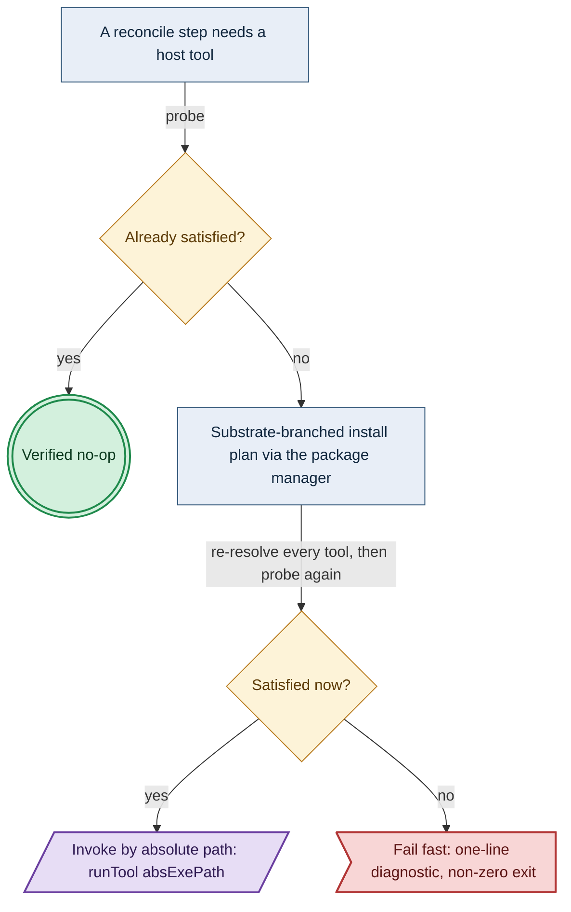
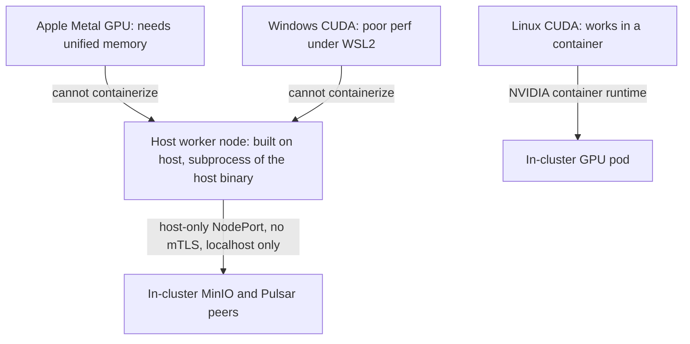
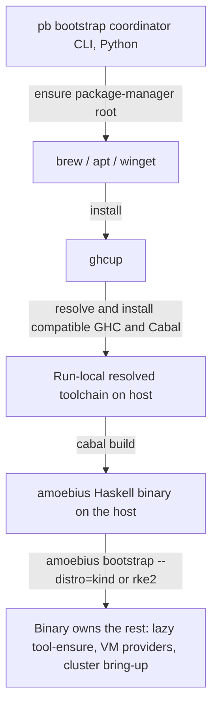

# Substrates

> **Purpose**: Define the host substrates amoebius runs on (apple / linux-cpu / linux-cuda / windows),
> the virtualized substrates that synthesize a Linux host (Incus / Lima / WSL2), the host worker nodes that
> reach substrate-specific hardware as host subprocesses, the no-environment-variable / no-`PATH` lazy
> tool-ensure contract, and the substrate-specific bootstrap coordinator CLI that builds and hands off to the binary —
> while the Apple-Metal host worker's headless, on-host, **no-VM** build/run shape (fixed Metal bridge +
> runtime MSL compilation) is owned by [apple_metal_headless_builds.md](./apple_metal_headless_builds.md).
> **Read this if**: amoebius has to run on a particular host, or a host-specific capability has to be reached.

This document owns the substrate: what it is, how it is detected rather than declared, the lazy tool-ensure
contract that follows from taking no ambient configuration, and why some hardware forces a host worker. It
does not own the cluster engine that runs on it, owned by
[cluster_topology_doctrine.md](./cluster_topology_doctrine.md), nor the images it builds, owned by
[image_build_doctrine.md](./image_build_doctrine.md).

Link-graph metadata

**Status**: Authoritative source
**Supersedes**: N/A
**Referenced by**: DEVELOPMENT_PLAN/README.md, DEVELOPMENT_PLAN/development_plan_gate_integrity.md, DEVELOPMENT_PLAN/development_plan_phase_model.md, DEVELOPMENT_PLAN/development_plan_standards.md, DEVELOPMENT_PLAN/later_phases.md, DEVELOPMENT_PLAN/legacy_tracking_for_deletion.md, DEVELOPMENT_PLAN/overview.md, DEVELOPMENT_PLAN/phase_00_documentation_suite.md, DEVELOPMENT_PLAN/phase_01_toolchain_spike.md, DEVELOPMENT_PLAN/phase_03_host_assert_cli.md, DEVELOPMENT_PLAN/phase_04_host_ensure_kernel.md, DEVELOPMENT_PLAN/phase_06_linux_engine_bringup.md, DEVELOPMENT_PLAN/phase_07_apple_engine_bringup.md, DEVELOPMENT_PLAN/phase_08_windows_engine_bringup.md, DEVELOPMENT_PLAN/phase_35_bootstrap_coordinator_kind.md, DEVELOPMENT_PLAN/phase_36_base_image_registry.md, DEVELOPMENT_PLAN/phase_46_pulsar_client.md, DEVELOPMENT_PLAN/phase_55_provider_deploy_checkpoint.md, DEVELOPMENT_PLAN/phase_59_determinism_jitcache.md, DEVELOPMENT_PLAN/phase_73_complementary_arch_child.md, DEVELOPMENT_PLAN/phase_74_apple_metal_host_daemon.md, DEVELOPMENT_PLAN/substrates.md, DEVELOPMENT_PLAN/system_components.md, README.md, documents/engineering/README.md, documents/engineering/apple_metal_headless_builds.md, documents/engineering/bootstrap_sequence_doctrine.md, documents/engineering/chaos_failover_doctrine.md, documents/engineering/cluster_lifecycle_doctrine.md, documents/engineering/cluster_topology_doctrine.md, documents/engineering/content_addressing_doctrine.md, documents/engineering/daemon_topology_doctrine.md, documents/engineering/deterministic_simulation_doctrine.md, documents/engineering/dsl_doctrine.md, documents/engineering/host_cluster_comms_doctrine.md, documents/engineering/image_build_doctrine.md, documents/engineering/network_fabric_doctrine.md, documents/engineering/platform_services_doctrine.md, documents/engineering/preflight_validation_doctrine.md, documents/engineering/pulsar_client_doctrine.md, documents/engineering/pulumi_iac_doctrine.md, documents/engineering/repository_layout_doctrine.md, documents/engineering/resource_capacity_doctrine.md, documents/engineering/resource_capacity_folds.md, documents/engineering/resource_capacity_sources.md, documents/engineering/service_capability_doctrine.md, documents/engineering/single_logical_data_plane_doctrine.md, documents/engineering/storage_lifecycle_doctrine.md, documents/engineering/substrate_node_inventory.md, documents/engineering/testing_doctrine.md, documents/engineering/validation_frame_doctrine.md, documents/engineering/vault_pki_doctrine.md, documents/glossary.md, documents/illegal_state/illegal_state_capacity.md, documents/illegal_state/illegal_state_multicluster.md, documents/illegal_state/illegal_state_techniques.md, documents/illegal_state/illegal_state_topology.md
**Generated sections**: none

> **Historical result (invalidated).** Phase-run and implementation-result statements predate the 2026-08-11 reopen unless the owning phase is Done; target doctrine remains normative, and current state is in the [tracker](../../DEVELOPMENT_PLAN/README.md).

## Contents
- [1. The substrate is a fact about the host, not a knob](#1-the-substrate-is-a-fact-about-the-host-not-a-knob)
- [2. Detection: a pure classification over three reads](#2-detection-a-pure-classification-over-three-reads)
- [3. The no-environment / no-`PATH` lazy tool-ensure contract](#3-the-no-environment--no-path-lazy-tool-ensure-contract)
- [4. Virtualized substrates: synthesizing a Linux host where the host is not Linux](#4-virtualized-substrates-synthesizing-a-linux-host-where-the-host-is-not-linux)
- [5. Host worker nodes: substrate-specific hardware that cannot be containerized](#5-host-worker-nodes-substrate-specific-hardware-that-cannot-be-containerized)
- [6. The bootstrap coordinator contract: a Python CLI ensures a toolchain, builds the binary, hands off](#6-the-bootstrap-coordinator-contract-a-python-cli-ensures-a-toolchain-builds-the-binary-hands-off)
- [7. The LoadBalancer backend follows the materialized compute engine and provider](#7-the-loadbalancer-backend-follows-the-materialized-compute-engine-and-provider)
- [8. The node inventory: the single owner of hosts, capacity, and taints](#8-the-node-inventory-the-single-owner-of-hosts-capacity-and-taints)
- [9. Planning ownership](#9-planning-ownership)
- [Related Documents](#related-documents)

---

**Pure inventory read-side status.** The [Phase 16 gate](../../DEVELOPMENT_PLAN/phase_16_execution_accelerator_folds.md)
validates closed kubelet filesystem layouts, OCI/runtime metadata routing, provider-root template identities,
accelerator family/profile ownership, and raw/reserved/allocatable VRAM arithmetic in Register 1. Detection,
materialization, attachment, and observed readback remain unverified; ledger `external-run-reference`.

## 1. The substrate is a fact about the host, not a knob

The first thing amoebius does on a new machine is **find out what the machine is** — it does not ask, and
it cannot be told. A hardware substrate is detected, not configured: the host's OS, CPU architecture, and GPU
presence are read at runtime and classified into one of a closed set of substrates. That fact determines the
package-manager root, the VM provider, and which optional hardware lanes can be offered. A deployment may then
select only from those observed offerings; it cannot claim CUDA on a machine with no CUDA device.

The canonical amoebius substrate catalog — the "at most one substrate per validation" set the plan keys
its phase gates to (see [../../DEVELOPMENT_PLAN/README.md](../../DEVELOPMENT_PLAN/README.md)) — is four
members:

| Substrate | Host OS | Natural arch | GPU axis | Canonical role |
|-----------|---------|--------------|----------|----------------|
| **apple** | macOS (Apple Silicon) | `arm64` (always) | Metal (on-host, not containerizable) | Admin laptop root cluster; Apple-Metal host worker nodes |
| **linux-cpu** | Linux | the detected one, `amd64` or `arm64` | none | The CPU-only validation substrate; kind/rke2 control plane |
| **linux-cuda** | Linux | the detected one, `amd64` or `arm64` | NVIDIA present | In-cluster CUDA workloads via the NVIDIA container runtime |
| **windows** | Windows | `amd64` | CUDA present ⇒ on-host worker node | Linux substrates via WSL2; Windows-CUDA host worker nodes |

**`linux-cpu` is the mandatory baseline offered by every hardware substrate — at that host's natural
architecture, and at no other.** The four detected names are not four mutually exclusive workload ceilings.
They describe the physical host and its additional capabilities. Every one has a route to a CPU-only Linux
execution lane, and that lane's architecture is the host's own:

| Detected hardware substrate | `linux-cpu` lane it derives | Optional additional lane |
|-----------------------------|-----------------------------|--------------------------|
| `linux-cpu` | `linux-cpu/<natural arch>`, on native Linux or a fresh Incus guest when isolation/pristineness is required | none |
| `linux-cuda` | `linux-cpu/<natural arch>`, on native CPU-only Linux or a fresh Incus guest; NVIDIA devices are not passed through | in-cluster CUDA |
| `apple` | `linux-cpu/arm64`, in a Lima Linux guest | on-host Apple Metal |
| `windows` | `linux-cpu/amd64`, in a WSL2 Linux distro | on-host CUDA when observed |

Thus detecting `linux-cuda`, `apple`, or `windows` **never removes `linux-cpu`**. Specialized hardware is an
additive offering, not a promotion that forbids the baseline. In phase and ledger prose, “runs on
`linux-cpu/arm64`” names this selected CPU-only Linux lane at a stated architecture; it does not assert that
the physical machine lacks a GPU or natively runs Linux. Evidence records the detected hardware substrate, the
selected execution lane, and that lane's architecture.

### 1.1 The natural-architecture rule

**The problem.** A lane name that carries no architecture lets one host claim both of them. A gate on an
`arm64` host can build an `amd64` image under emulation, execute its binaries under a `qemu-user` shim, and
record a `linux-cpu` pass. The defect that pass was supposed to exclude then surfaces at run time, on the
`amd64` machine the artifact was never executed on.

**Why the obvious alternative fails.** One `buildx` invocation over `--platform linux/amd64,linux/arm64`
produces a correct-looking manifest list from a single host, and a cross-toolchain produces a correct-looking
foreign binary. Neither produces an observation of that architecture *executing*, because no hardware of that
architecture took part in the run — so the check that would refuse a broken artifact has nothing to read, and
an emulator's report of itself is the self-emitted compliance trace
[development_plan_gate_integrity.md §M](../../DEVELOPMENT_PLAN/development_plan_gate_integrity.md#m-gate-integrity-a-gate-cannot-be-passed-by-a-stub) refuses everywhere else.

**The rule.** Every substrate derives its `linux-cpu` lane at its **natural architecture** — the architecture
the detected host executes without translation — and at no other. No validation executes a
foreign-architecture artifact under emulation, and none builds one through a cross-toolchain. An artifact for
an architecture is produced and executed on a host whose natural architecture is that one.

**What it forecloses.** No single host produces a two-architecture image. A multi-architecture artifact
becomes a pair of natively built children joined by attestation, which costs a second physical machine
([image_build_doctrine.md §3](./image_build_doctrine.md#3-multi-architecture-images--one-natively-built-child-per-architecture)).
The two axes stay orthogonal and both still matter: the **OS** chooses the package manager and the VM-provider
strategy ([§4](#4-virtualized-substrates-synthesizing-a-linux-host-where-the-host-is-not-linux)), while the
**architecture** decides which lane a host can prove. Mixed-arch clusters remain expressible, because a
cluster joins nodes each proven on its own hardware. amoebius does **not** support Windows containers (in or
outside WSL2) — Windows participates either as a Linux host (via WSL2) or as the on-host CUDA worker case
([§5](#5-host-worker-nodes-substrate-specific-hardware-that-cannot-be-containerized)).

> **Honesty.** The four-name catalog is the amoebius DSL surface. The seed detector in the `hostbootstrap`
> library distinguishes a *finer* granularity — `apple-silicon`, `linux-cpu`, `linux-gpu`, `windows-cpu`,
> `windows-gpu` (`HostBootstrap.Substrate.SubstrateName`) — so "linux-cuda" is the GPU-present Linux
> substrate and the Windows-CUDA case is `windows-gpu`. The amoebius DSL collapses the GPU axis into the
> substrate name where it changes the deployment shape; this doc names both so the mapping is not a
> surprise.

> **`cuda` names an accelerator *family*, not "a GPU."** The amoebius DSL name `linux-cuda` keys the
> GPU-present Linux substrate specifically on the **NVIDIA-container-runtime bootstrap**; `cuda` is the
> **NVIDIA accelerator family**, and a future non-NVIDIA accelerator (a ROCm/AMD device, a TPU-class part)
> would be its **own** substrate — a new closed catalog member with its own package-manager bootstrap and
> device linkage — never a re-use of this one. This is why the generic word `gpu` is deliberately avoided in
> the substrate surface: accelerator families differ in exactly the axis the substrate exists to carry (which
> runtime bootstraps them, how they link), so collapsing them under `gpu` would erase the distinction the
> catalog is for. Adding a family is **not** substrate-only extensibility: it costs a new closed substrate, a
> new detector (an `hasNvidiaGpu`-analog, [§2](#2-detection-a-pure-classification-over-three-reads)), and —
> downstream — a new closed `EngineRuntime` arm and a new landing-relation entry
> ([service_capability_doctrine.md](./service_capability_doctrine.md)). This note is **forward-looking**;
> only `cuda` is modelled today.

> **Why `windows` is not split into `windows-cuda` the way `linux` splits into `linux-cuda`.** The amoebius
> substrate name keys the **OS / VM-provider + wire strategy**, not accelerator presence. A Windows host
> reaches the cluster's GPU compute as an on-host worker *regardless* of how its in-cluster node is wired
> ([§5](#5-host-worker-nodes-substrate-specific-hardware-that-cannot-be-containerized)), so the
> deployment-shape-changing axis is already captured by the host-worker case, not by a second substrate name
> — the amoebius DSL collapses the seed's `windows-gpu` into `windows`. On Linux, by contrast, GPU presence
> *does* change the **in-cluster** deployment shape (the NVIDIA container runtime becomes a reconciler
> precondition), so there the GPU axis earns its own substrate name. The seed keeps `windows-gpu` distinct;
> amoebius does not.

---

## 2. Detection: a pure classification over three reads

Detection separates cleanly into **what was observed** (impure: read the platform, probe for a GPU) and
**what that means** (pure: classify). The classification is a total function so it is unit-testable
without touching a host, and the only `IO` **feeding the classifier** is the three reads (OS, arch,
GPU-presence). Capacity inventory performs additional reads that do not affect this classification: kubelet
allocatable, the runtime-discovered `nodefs`/`imagefs`/`containerfs` identities and capacities, containerd
content/snapshot roots, mount/device/quota identity, and—on a positive GPU probe—stable device
identity/profile, per-device raw-total/current-free VRAM, and the endpoint-validated peer/NVLink graph. Those
populate the per-host `Capacity`, not the substrate class (below).

In the `hostbootstrap` seed (`HostBootstrap.Substrate`), this is `classify :: osName -> rawArch -> gpu ->
Either String Substrate` wrapped by `detect :: IO (Either String Substrate)`:

- **OS** comes from `System.Info.os` (`darwin` / `linux` / `mingw32`).
- **Architecture** comes from `System.Info.arch`, normalized by `parseDockerArch` to `amd64` / `arm64`;
  anything else is a hard `Left` (unsupported architecture), not a guess. The normalized value is **carried
  out of the classification, not discarded**: it is the natural architecture of
  [§1.1](#11-the-natural-architecture-rule), so the classification names a substrate *and* the one lane
  architecture that substrate can prove.
- **GPU presence** is an NVIDIA probe (`hasNvidiaGpu`): the kernel markers `/proc/driver/nvidia/version`
  and `/dev/nvidiactl` first, then `nvidia-smi -L` as the fallback. On a positive probe the detector reads
  each device's UUID/profile, `memory.total`, and `memory.free` by invoking `nvidia-smi`
  (`--query-gpu=uuid,name,memory.total,memory.free`) **by absolute path** per the no-env / no-`PATH` contract
  ([§3](#3-the-no-environment--no-path-lazy-tool-ensure-contract)), never a bare name. Row count is device
  count. The same absolute executable runs `nvidia-smi topo -m` and the peer-access matrix query; the parser
  maps matrix indices back to UUIDs and emits only endpoint-resolved
  `PciePeerAccess | NvLink` edges. Unknown endpoints, asymmetric/conflicting rows, or an unavailable topology
  query fail closed when a declared demand requires that relation. These observations cross-check the per-host accelerator/`vram` `Capacity` the node inventory declares
  ([§8](#8-the-node-inventory-the-single-owner-of-hosts-capacity-and-taints)), so accelerator **count** and
  **net allocatable VRAM** are *declared-at-decode and cross-checked-at-runtime*, while current free VRAM
  constrains each live admission. Neither a raw product label nor `memory.total` is treated as spendable.

Two classification rules are load-bearing and stated as hard failures, not warnings:

- **Apple is always `arm64`.** macOS on a non-`arm64` architecture is rejected outright — there is no
  Intel-Mac substrate. Apple Silicon's unified memory is why the Apple substrate is treated distinctly
  ([§5](#5-host-worker-nodes-substrate-specific-hardware-that-cannot-be-containerized)), and that is an `arm64` fact.
- **GPU presence enriches the detected substrate.** A Linux host with an NVIDIA GPU classifies physically as
  `linux-cuda` (seed: `linux-gpu`), not `linux-cpu`; this makes the CUDA lane available and makes the NVIDIA
  container runtime a precondition only when that lane is selected. The host still always offers the
  `linux-cpu` lane at its own natural architecture, where the GPU is neither passed through nor advertised.

> **A non-NVIDIA accelerator classifies as `linux-cpu` — a named detection gap.** The probe is NVIDIA-only
> (`hasNvidiaGpu`), so a Linux host carrying a non-NVIDIA accelerator (AMD/ROCm, a TPU-class part) classifies
> as plain `linux-cpu` and the accelerator is not seen: there is **no `Left unsupported-accelerator`** —
> detection does not reject the host, it forgets the device. This is consistent with `cuda` being one
> accelerator family among possible others ([§1](#1-the-substrate-is-a-fact-about-the-host-not-a-knob)).
>
> **Status: OPEN (detection gap, intentionally un-foreclosed for v1).** A non-NVIDIA accelerator classifies as
> `linux-cpu` — the device is forgotten, not rejected. Current position: accepted for v1 (NVIDIA is the only
> targeted accelerator family); the detector SHOULD emit a warning so the drop is observable. Closing it is
> coordinated multi-doc work: a new closed substrate + detector and, downstream, a new `EngineRuntime` arm and
> landing-relation entry.

> **Honesty.** The detector, universal-CPU/provider mapping, `AbsExe` tool boundary, and Python bootstrap coordinator are now
> implemented. A pristine Incus VM on the physical `linux-cuda` parent exercised clean install, build, handoff,
> idempotence, divergence repair, and teardown; evidence is retained under
> `DEVELOPMENT_PLAN/evidence/phase_24`. This is not a complete Phase-35 pass because the full live enforcement
> inventory remains unfinished. Status and gates live only in
> [../../DEVELOPMENT_PLAN/README.md](../../DEVELOPMENT_PLAN/README.md).

---

## 3. The no-environment / no-`PATH` lazy tool-ensure contract

**The Haskell host-invocation layer takes no configuration from ambient environment variables and never resolves an external tool against the host's `PATH`.** This is one of the project's locked invariants, and it
has a precise positive form: when a host tool is needed, amoebius **lazily ensures and resolves it through the substrate's package manager, then invokes it by absolute path.** No bare host command name is handed to the OS
for search-path resolution. Guest commands run after a VM/container boundary may use that guest's environment,
as [the exact boundary](#the-exact-boundary-of-the-no-path-rule) states. This lazy package-manager scheme is proven
prior art — the sibling ML projects already run a two-tiered version of it in which, on Apple silicon, a
host-level Haskell binary manages the toolchain by lazily installing the brew packages it needs on demand.

The four-step ensure contract is:

1. **Probe.** Ask the substrate's package manager whether the tool is installed.
2. **Install if absent.** Use the package manager to install it.
3. **Resolve the absolute path** from the package manager itself (e.g. `brew --prefix` on Apple).
4. **Invoke by full path** in a subprocess — never a `PATH`-resolved bare name.

### 3.1 The per-substrate floor: what only the operator can supply

The contract above says what amoebius does when a tool is absent. This section says what must
already be true for it to be able to do anything at all — the **floor**. Only three classes belong
to it: the **package-manager root**, because it cannot be installed through a resolved tool; a
**hardware or firmware fact**, because software cannot enable it; and a **credentialed account**,
because it is not amoebius's to create. Anything else with a supported install plan is ensured,
never written down as a manual prerequisite.

The floor is a fact about the **host operating system**, not about a phase. On apple and windows
its whole job is to reach a Linux frame at the host's natural architecture
([§4](#4-virtualized-substrates-synthesizing-a-linux-host-where-the-host-is-not-linux)); inside
that frame the linux floor applies and amoebius owns everything, because amoebius made the frame.
The table shape is the one
[`apple_metal_headless_builds.md` §4](./apple_metal_headless_builds.md#4-build-and-prerequisite-model)
already uses for the Apple worker: a prerequisite, what needs it, and how it is ensured or verified.

**apple** — natural architecture `arm64`, always
([§1.1](#11-the-natural-architecture-rule)):

| Prerequisite | Required for | Ensure / verify |
|---|---|---|
| `apple.package-manager-root` | every ensured tool, and Lima | Homebrew. Verified, never installed: a verified no-op when `brew` is present, a refusal carrying the install instruction when it is absent |
| `apple.command-line-tools` | the fixed Metal bridge, and every on-host source build | `/usr/bin/clang` and the Foundation/Metal headers, verified through `xcode-select -p`. Full Xcode remains deliberately excluded ([`apple_metal_headless_builds.md` §1](./apple_metal_headless_builds.md#1-the-commitment-headless-on-host-no-vm)) |
| `apple.silicon` | the substrate itself | Detection refuses macOS on any other architecture outright, so this is decided before the floor runs ([§2](#2-detection-a-pure-classification-over-three-reads)) |

**linux-cpu** and **linux-cuda** — natural architecture is the detected one:

| Prerequisite | Required for | Ensure / verify |
|---|---|---|
| `linux.package-manager-root` | the C libraries the compiler links, and the container engine | The system package manager, verified at its absolute path; absent is a refusal naming it |
| `linux.privilege` | package installation and provider initialisation | Passwordless sudo, verified without a prompt |
| `linux.virtualization` | the pristine-guest provider | `/dev/kvm`, present and writable by the invoking user. An unloaded module and an unwritable node are both reconciled; firmware virtualization disabled is a refusal |
| `linux-cuda.accelerator` | the CUDA lane only | The NVIDIA kernel driver. **Not a refusal:** a host without it classifies as `linux-cpu` ([§2](#2-detection-a-pure-classification-over-three-reads)), so the lane is simply never offered |

**windows** — natural architecture `amd64`, always:

| Prerequisite | Required for | Ensure / verify |
|---|---|---|
| `windows.package-manager-root` | every ensured tool | winget, verified at its absolute path; absent is a refusal naming it |
| `windows.shell` | the pre-binary bootstrap and every host-boundary invocation | PowerShell |
| `windows.firmware-virtualization` | WSL2, and therefore the whole Linux lane | `VirtualizationFirmwareEnabled` and `HyperVisorPresent`, read before any install is attempted. Disabled is a refusal naming BIOS/UEFI, because no software can enable it ([§4.2](#42-wsl2-on-windows)) |
| `windows.elevation` | the WSL2 feature install and the hypervisor launch setting | Administrator rights |
| `windows.reboot` | completing a WSL2 or hypervisor change | A first-class outcome — "reboot and retry" — never a silent hang |

**Everything else is ensured, on every substrate**: the VM provider, the container engine inside
the frame, `ghcup` and the GHC/Cabal pair it supplies, the cluster tools, the schema and browser
tools, and on `linux-cuda` the container toolkit, its runtime registration, and CDI. The
Kubernetes accelerator device plugin is ensured too — it is a DaemonSet the reconciler renders
like every other operator install
([`manifest_generation_doctrine.md` §4](./manifest_generation_doctrine.md#4-no-third-party-charts--no-third-party-software-operators-are-generated)),
not an operator obligation.

**A refusal is a value, not a crash.** Each floor check that fails yields the prerequisite it
names and the remedy that clears it, so the whole floor is decidable for a substrate the running
host is not — which is what lets an apple host check that its plan for windows is well-formed.

**The tables above are authored data, not a description of it.** Each row — the prerequisite id,
what needs it, the probe that decides it, and the remedy — is declared beside the toolchain
requirements the same resolver reads, and the floor is evaluated *before* any requirement is
resolved. A host that cannot support the run is told which prerequisite is missing and what clears
it, rather than being walked into a resolution failure several requirements deep on a symptom.
The decidability claim is a check of its own: every substrate's floor is evaluated on every run,
including the ones the running host is not, so a plan that has stopped being well-formed for
windows fails on an apple host that will never execute it.

**How an ensured tool is acquired, and why the package manager is not the default.** A
package-manager install cannot be verified against a publisher digest, because the package manager
is its own trust root. So the package manager is used for the floor's root and for what only it
can supply; every other tool is taken from its publisher's own release, verified against that
publisher's own checksum fetched in the same run, and installed beneath the repository's ignored
build root rather than into a shared host location
([`repository_layout_doctrine.md` §4](./repository_layout_doctrine.md#4-dependency-and-toolchain-resolution)).
That keeps acquisition auditable and leaves no amoebius-owned state outside the checkout.

### Why this is structurally enforced, not merely a guideline

The `hostbootstrap` seed makes the *bare-name-invocation* failure mode **unrepresentable** rather than
discouraged:

- **The tool set is a closed enum.** `HostBootstrap.HostTool.HostTool` enumerates every external tool
  amoebius will shell out to (`docker`, `brew`, `ghcup`, `kubectl`, `kind`, `nvidia-smi`, `wsl`,
  `incus`, `limactl`, …) — note `helm` is *not* among them: amoebius renders and applies its own typed
  manifests and never shells out to Helm ([manifest_generation_doctrine.md](./manifest_generation_doctrine.md)).
  An unlisted tool cannot be invoked.
- **A bare command name is unrepresentable as a resolved tool.** `AbsExe` is a newtype whose constructor is
  not exported; the only way to build one is `mkAbsExe`, which **rejects any non-absolute path**. So a
  resolved tool is, by type, always an absolute path. `toolCommandName` (the bare name) exists *only* for
  discovery and is never an invocation target.
- **Resolution happens once into a typed config.** `HostBootstrap.HostConfig` carries the detected
  substrate plus a `Map HostTool AbsExe`; a reconciler that needs a tool reads its `AbsExe` from there, and
  a missing tool fails fast (`UnresolvedTool`) rather than falling back to a search path.
- **Invocation is full-path only.** `runTool`/`runToolWithStdin` exec `absExePath`, never a bare name.

### Install-and-verify is probe-first and idempotent

The reconcile driver `installAndVerify` (`HostBootstrap.Ensure`) is the runtime shape of the four-step
contract: probe → if satisfied, a verified no-op → else run the substrate-branched install plan,
**re-resolving every tool after each step** (so a freshly `brew`-laid-down `ghcup` is discoverable by the
next step) → re-verify → fail fast with a one-line diagnostic if still unsatisfied. The install *plan* is a
pure value (`[InstallStep]`) per reconciler, so the substrate branching is unit-tested without invoking a
package manager; only the driver is `IO`. Each reconciler is gated by a substrate-applicability predicate
(`appliesTo`) and fails fast — before any side effect — when run on the wrong substrate (`decide` /
`diagnostic`).

Diagram vocabulary: [diagram_conventions.md](./diagram_conventions.md).

```mermaid
flowchart TD
%% register: algebra
  need["A reconcile step needs a host tool"]:::intent -->|probe| sat{"Already satisfied?"}:::decision
  sat -->|yes| noop((("Verified no-op"))):::seal
  sat -->|no| plan["Substrate-branched install plan via the package manager"]:::intent
  plan -->|re-resolve every tool, then probe again| verify{"Satisfied now?"}:::decision
  verify -->|yes| run[/"Invoke by absolute path: runTool absExePath"/]:::effect
  verify -->|no| die>"Fail fast: one-line diagnostic, non-zero exit"]:::refuse
  classDef intent   fill:#e8eef7,stroke:#33587a,color:#12283f,stroke-width:1px
  classDef decision fill:#fdf3d8,stroke:#b8791b,color:#5c3a06,stroke-width:1px
  classDef seal     fill:#d3f0dd,stroke:#1f8a4c,color:#0c3a1f,stroke-width:2px
  classDef effect   fill:#e7ddf5,stroke:#6b3fa0,color:#2f1a52,stroke-width:2px
  classDef refuse   fill:#f8d6d6,stroke:#b23636,color:#5c1414,stroke-width:2px
```

*Design intent. The probe/decision/refuse shape of the install-and-verify reconcile driver; the four-step ensure it drives is proven in the sibling hostbootstrap seed, not an amoebius result.*

### The exact boundary of the no-`PATH` rule

The rule governs **the host invocation surface**, and only that surface. When amoebius crosses a context
boundary — running a subcommand of itself inside a VM or container ([§4](#4-virtualized-substrates-synthesizing-a-linux-host-where-the-host-is-not-linux); the composition lift owned by [daemon_topology_doctrine.md](./daemon_topology_doctrine.md)) — only the **outermost** host tool is
resolved to an absolute path; every **nested** tool is the guest's *own* bare name run against the guest's
own `PATH`, which is legitimate because it is that guest's environment, not the host's
(`HostBootstrap.Lift.foldLeaf`). The invariant is "amoebius never resolves a tool against the *host's*
`PATH`," not "no `PATH` exists anywhere in the universe."

> **Honesty.** The structural enforcement above (`AbsExe`, the closed enum, full-path exec) exists in the
> `hostbootstrap` seed. Its *discovery* step today resolves an absolute path via `findExecutable` +
> `mkAbsExe`; the amoebius target is package-manager-canonical discovery (`brew --prefix` and equivalents). The end-state invariant — invocation is always by absolute path — is the part
> that is type-enforced now; package-manager-canonical *discovery* is the part still to land. Do not read
> the current discovery seam as the finished contract.

**Phase-46 code generation.** The retired `amoebius-pulsar/Setup.hs` resolved `protoc` and
`proto-lens-protoc` by absolute path and gave `proto-lens-setup` a closed search domain — never the ambient
host `PATH`, so no unrelated executable could shadow code generation. It went with the package split, because
[§2.1](./repository_layout_doctrine.md#21-when-a-unit-warrants-its-own-build-package) admits no ground for a
package that exists only to carry a `Setup.hs`. Phase 46 re-establishes the same invariant against
`.build/proto/**`; the generated modules stay build artifacts either way.

---

## 4. Virtualized substrates: synthesizing a Linux host where the host is not Linux

amoebius is Kubernetes-centric and does not support Windows containers; the unit of compute it actually
wants is a **Linux host**. Every hardware substrate can supply that `linux-cpu` lane. A native Linux host may
supply it directly, while Apple and Windows synthesize it in a VM. When a gate requires a **pristine Linux
host**, native Linux is also interposed: the gate runs in a newly created guest rather than pretending a
populated parent is clean. The VM is plumbing; the substrate the cluster sees is CPU-only Linux. **A guest
runs the parent's natural architecture** ([§1.1](#11-the-natural-architecture-rule)) — virtualization
synthesizes an operating system, never an instruction set.

| Host substrate | VM provider | What it synthesizes | Seed module |
|----------------|-------------|---------------------|-------------|
| **apple** | **Colima** (`colima`) or **Lima** (`limactl`), by workload ([§4.1](#41-colima-and-lima-on-apple-the-provider-follows-the-workload)) | An Ubuntu-24.04 `linux-cpu/arm64` VM, carrying a Docker endpoint under Colima | `HostBootstrap.Ensure.Colima`, `HostBootstrap.Ensure.Lima` |
| **windows** | **WSL2** | An Ubuntu-24.04 `linux-cpu/amd64` distro | `HostBootstrap.Ensure.Wsl2`, `HostBootstrap.Wsl2` |
| **linux-cpu** / **linux-cuda** | **Incus** | An Ubuntu-24.04 `linux-cpu` VM at the parent's natural architecture; CUDA devices are absent unless a different specialized gate explicitly requests passthrough | `HostBootstrap.Ensure.Incus`, `HostBootstrap.Incus` |

This provider mapping is mandatory for pristine-host gates: **Incus on either Linux hardware substrate,
Lima on Apple, WSL2 on Windows**. “Pristine” means the guest is newly materialized from the pinned image and
the gate records its clean preflight before installing tools. A container is useful isolated evidence, but it
does not substitute for the required VM when the gate says pristine host. Parent CPU, memory, disk, VM-image,
and runtime commitments are still observed and admitted before guest creation; the VM does not create free
capacity.

There is deliberately **no macOS build VM** row. The Apple-Metal host worker's Swift/Metal parts are **not**
built in a VM (no Tart) — they build headless, directly on the macOS host; that shape and its rationale are
owned by [§4.4](#44-no-macos-build-vm-apple-builds-are-headless-on-host) and
[apple_metal_headless_builds.md](./apple_metal_headless_builds.md).

### 4.1 Colima and Lima on Apple: the provider follows the workload

Apple synthesizes its Linux frame two ways, and which one a run uses is decided by what the workload needs
rather than by preference. Colima is Lima carrying a container runtime, so the two are one provider family
with one extra capability rather than two competing answers.

| Workload | Provider | Why |
|----------|----------|-----|
| an image build, a one-off `docker run --rm`, or a `kind` cluster | **Colima** | each is a container workload, and a `kind` node *is* a container; the frame has to publish a Docker endpoint, which is exactly what Colima adds |
| an `rke2` cluster | **Lima** | `rke2` installs into a full Linux distribution rather than into a container, so a container endpoint is not enough and the frame has to be the distribution |

The one-off case is **ephemeral by construction**: a `docker run --rm` invocation takes a Colima VM for the
length of that invocation and nothing survives it. A `kind` cluster's VM persists for the cluster's life,
because there the VM is backing something the run is keeping.

**The logic that runs inside is the same logic in both.** A step is authored once and lifted into whichever
frame the workload selected, so neither provider carries a deployment path the other does not. A second path
is how two answers to one question begin to differ, and the lift exists so that there is only ever one. That
lift mechanism is owned by [daemon_topology_doctrine.md](./daemon_topology_doctrine.md); this document owns
only *which provider a workload selects, and why*.

The selection is therefore a function of the workload and the substrate together, not of the substrate
alone — a provider selector keyed on the substrate by itself cannot express the row above.

### 4.2 WSL2 on Windows

`ensure wsl2` is the most involved provider because Windows gates virtualization at firmware and hypervisor
layers. The reconciler (`HostBootstrap.Ensure.Wsl2`):

- probes readiness with `wsl --status` / `wsl --list --online`, accepting "no installed distributions" as
  ready-to-install and detecting "virtualization disabled";
- checks `VirtualizationFirmwareEnabled` and `HyperVisorPresent` via PowerShell before attempting install,
  and **fails fast with an actionable message** when firmware virtualization is off (the operator must
  enable it in BIOS/UEFI);
- installs via `winget install --id Microsoft.WSL`, then `wsl --install --no-distribution` — which is what
  enables the `VirtualMachinePlatform` and `Microsoft-Windows-Subsystem-Linux` optional features, so amoebius
  never toggles them directly — then `wsl --set-default-version 2`, setting Ubuntu-24.04 as the distro;
- treats a **required host reboot** as a first-class fail-fast outcome ("reboot and retry"), not a silent
  hang — installing WSL2 and configuring `bcdedit` hypervisor launch both can require a reboot.

On Windows the nested-invocation tool is `wsl`, and (on a Windows host) the seed even routes `wsl` through
PowerShell so the absolute-path discipline holds at the host boundary.

### 4.3 Incus on Linux

`ensure incus` is the Linux counterpart of the two above, and it has the same probe-first shape: install
Incus through the system package manager when it is absent, then run its one-time minimal initialisation so a
storage pool and bridge exist, then verify. A guest is created only after that verification succeeds.

Its floor is `linux.virtualization` ([§3.1](#31-the-per-substrate-floor-what-only-the-operator-can-supply)):
an Incus **VM** — as opposed to a container — needs `/dev/kvm`. The reconciler loads an unloaded `kvm` module
and grants the invoking user access to a present-but-unwritable node, because both are software states it can
change; firmware virtualization disabled is a refusal, because it is not.

### 4.4 No macOS build VM: Apple builds are headless on-host

The Apple-Metal host worker's native Swift/Metal parts are **built headless, directly on the macOS host** —
**there is no macOS build VM, and specifically no Tart.** amoebius commits to this by design: a single fixed
Objective-C/C Metal bridge is source-built once on the host with `/usr/bin/clang` (by absolute path, per [§3](#3-the-no-environment--no-path-lazy-tool-ensure-contract))
and `dlopen`'d, and generated Metal Shading Language is compiled *at runtime* in-process via
`MTLDevice.makeLibrary(source:options:)`. No VM, no login-keychain dependency, no SwiftPM/per-kernel Swift
build, no full Xcode, no offline `metal` compiler. The full requirements, architecture, prerequisite model,
and the "why not a VM" rationale are owned by
[apple_metal_headless_builds.md](./apple_metal_headless_builds.md); [§5](#5-host-worker-nodes-substrate-specific-hardware-that-cannot-be-containerized) below owns only *which hardware forces
a host worker*.

> **Honesty.** Lima, WSL2, and Incus are implemented VM providers in the `hostbootstrap` seed. The headless,
> on-host Apple build/run shape is **proven in the sibling jitML project** (its implemented fixed-Metal-bridge
> path) and the sibling `infernix` library **removed** its own legacy Tart path in favour of it — that is
> sibling evidence for physical Metal. Phase 74 now implements the Lima/brew plan, private disk/capacity fold,
> and headless bridge/build/lifecycle contracts, but its Linux `x86_64` scoped gate leaves live Apple/Lima/brew
> and Metal **UNVERIFIED**. Under [§1.1](#11-the-natural-architecture-rule) that scoped gate cannot close them
> later either: an `apple` claim is provable only on Apple Silicon, whose natural architecture is `arm64`.
> There is no amoebius Tart code, now or planned. Every hardware substrate always retains `linux-cpu` at its
> own natural architecture; pristine Linux uses Incus on Linux/Linux-CUDA, Lima on Apple, or WSL2 on Windows.
> Phase/status: [../../DEVELOPMENT_PLAN/README.md](../../DEVELOPMENT_PLAN/README.md).

---

## 5. Host worker nodes: substrate-specific hardware that cannot be containerized

Containers and VMs are the default, but two classes of hardware **cannot be reached performantly through them**, and for those amoebius builds and manages a non-containerized **host worker node** — a long-running
host subprocess of the host binary:

| Hardware | Substrate | Why not a container / VM | What runs on the host |
|----------|-----------|--------------------------|-----------------------|
| **Apple Metal GPU** | apple | Metal needs Apple Silicon **unified memory**; it cannot run in a Linux container or a Linux VM | An on-host inference/ML worker, built natively **headless on the host — no VM** ([§4.4](#44-no-macos-build-vm-apple-builds-are-headless-on-host), [apple_metal_headless_builds.md](./apple_metal_headless_builds.md)) |
| **NVIDIA CUDA on Windows** | windows | The CUDA stack does **not** run performantly from inside WSL2 | An on-host CUDA worker, built natively **headless on the host — no VM**, on Windows (symmetric to the Apple-Metal worker, [§5.1](#51-windows-cuda-and-apple-metal-are-the-same-host-worker-shape)) |

The defining properties of a host worker node:

- **Built directly on the host** — headless, with **no VM** (the Apple Swift/Metal parts build on-host via
  the fixed Metal bridge, [§4.4](#44-no-macos-build-vm-apple-builds-are-headless-on-host) / [apple_metal_headless_builds.md](./apple_metal_headless_builds.md)), not
  pulled as a container image. This is the one place amoebius compute lives *outside* a cluster pod.
- **Managed as a subprocess by the host amoebius binary**, which owns its lifecycle. The stateless-role
  skeleton the seed uses is Load → Prereq → Acquire → Ready → Serve → Drain → Exit
  (`HostBootstrap.RoleLifecycle`), with a guaranteed drain even if serving throws — so a host worker has a
  defined startup and a clean shutdown, not an unmanaged background process.
- **Joins the cluster as a peer, not through the wild-ingress edge.** A host worker reaches in-cluster
  MinIO and Pulsar as a **peer over host-only NodePorts with no mTLS**, localhost-only, with no WAN or LAN
  access. That communication model — including the kube-apiserver-over-distro-mTLS path and the host-only
  network restriction — is owned in full by
  [host_cluster_comms_doctrine.md](./host_cluster_comms_doctrine.md); the carve-out is recorded in
  [platform_services_doctrine.md §9](./platform_services_doctrine.md#9-the-loadbalancer-and-the-single-wild-ingress-path). This doc owns only *which hardware
  forces a host worker and why*, not the wire.
- **Is a worker role, not the control plane.** A host worker is the `Worker` arm of `InClusterRole` under the
  host-daemon context, owned by [daemon_topology_doctrine.md](./daemon_topology_doctrine.md). The CUDA *in-cluster*
  path (the `linux-cuda` container runtime, `HostBootstrap.Ensure.Cuda`: NVIDIA container toolkit +
  `nvidia` Docker runtime registration + CDI) is the **contrast** case — CUDA in a Linux container is fine;
  CUDA on Windows and GPU on Apple are the ones that escape to the host. Registering the runtime is not the
  whole path: a pod can request `nvidia.com/gpu` only once the accelerator **device plugin** is running, and
  that plugin is a DaemonSet the reconciler renders like every other operator install
  ([`manifest_generation_doctrine.md` §4](./manifest_generation_doctrine.md#4-no-third-party-charts--no-third-party-software-operators-are-generated)),
  never a prerequisite the operator installs by hand. The kernel driver beneath it stays the operator's, and
  its absence is a classification outcome rather than a refusal
  ([§3.1](#31-the-per-substrate-floor-what-only-the-operator-can-supply)).

### 5.1 Windows-CUDA and Apple-Metal are the same host-worker shape

The two host-worker rows are **symmetric**. The Windows-CUDA worker is the same shape as the Apple-Metal
worker — a native, **on-host, headless, no-VM** subprocess of the host binary reaching the cluster only over
host-only NodePorts. The single `Cuda` engine offering is realized **in-cluster** on `linux-cuda` (the NVIDIA
container runtime, above) and **host-level** on Windows, exactly as Apple's engine is realized host-level:
one engine, two bootstraps (the substrate→engine quotient is owned by
[service_capability_doctrine.md](./service_capability_doctrine.md); the worker-role taxonomy by
[daemon_topology_doctrine.md](./daemon_topology_doctrine.md)). This is **role parity, not evidence parity**:
the Apple path has a build-shape doc ([apple_metal_headless_builds.md](./apple_metal_headless_builds.md)) and
sibling evidence, whereas the on-host Windows-CUDA build/run path is **forward design intent with no sibling evidence** and no build-shape doc — read it that way.

**Co-resident *on* the host, not *in* the VM.** On Windows the CUDA worker runs on the **same physical host as** — never *inside* — the WSL2 distro that backs the in-cluster Linux node; on Apple it runs on the same
host as the Lima VM. The worker keeps its "no VM, on-host, headless" property
([§4.4](#44-no-macos-build-vm-apple-builds-are-headless-on-host)): the VM synthesizes the *in-cluster* Linux
node, while the accelerator worker lives beside it on the bare host, precisely because the accelerator (Metal
unified memory; CUDA under WSL2) cannot be reached performantly from inside that VM.

**The Windows in-cluster node is `linux-cpu` only.** To keep the one physical GPU from being claimed twice —
once as an in-cluster bin-packable node resource and again by the wholesale host worker — a Windows host's
WSL2-backed in-cluster node advertises **`linux-cpu/amd64`** capacity only; a WSL2-backed **`linux-cuda`**
in-cluster node on Windows has **no constructor** (type-foreclosed). The GPU escapes to the host worker, never to a
WSL2 pod, and is owned wholesale by that one worker.

**A host worker need not hold an in-cluster node.** A `Cuda` (or Apple-Metal) host worker may peer into a
cluster in which it holds **no** in-cluster node at all — it reaches MinIO/Pulsar as a host-only-NodePort
peer regardless. Co-residence with a WSL2/Lima-backed node is therefore the common case, **not** a
requirement: "co-resident on the same host" describes where the worker sits when there *is* a local
in-cluster node, and is not a precondition for peering.

```mermaid
flowchart TD
%% register: orientation
  metal[Apple Metal GPU: needs unified memory] -->|cannot containerize| hostworker[Host worker node: built on host, subprocess of the host binary]
  wincuda[Windows CUDA: poor perf under WSL2] -->|cannot containerize| hostworker
  hostworker -->|host-only NodePort, no mTLS, localhost only| peers[In-cluster MinIO and Pulsar peers]
  linuxcuda[Linux CUDA: works in a container] -->|NVIDIA container runtime| pod[In-cluster GPU pod]
```
*Orientation. Design intent. Why a host worker exists at all: two accelerator cases cannot be containerized and the third can. The host-only channel these workers use is owned by [host_cluster_comms_doctrine.md §1](./host_cluster_comms_doctrine.md#1-the-host-origin-surface-two-channels-both-localhost-only).*

---

## 6. The bootstrap coordinator contract: a Python CLI ensures a toolchain, builds the binary, hands off

The **bootstrap coordinator** is the one pre-binary tool amoebius owns — a **Python CLI, not a shell script** — and it
does as little as possible: get a built amoebius Haskell binary onto the host and then get out of the way,
because the no-`PATH` / no-env, lazy-tool-ensure discipline ([§3](#3-the-no-environment--no-path-lazy-tool-ensure-contract))
cannot start until there is a Haskell binary to enforce it. It is Python for two reasons: it must run on a
**bare host before any Haskell toolchain exists**, and it is **unified with the operator CLI** — one Python
CLI (`pb`) with two modes, **bootstrap coordinator** (bare host → build → `exec` the Haskell binary, this section) and
**admin-REST client** (the operator CLI that drives the control-plane daemon after handoff,
[bootstrap_sequence_doctrine.md §5](./bootstrap_sequence_doctrine.md#5-the-admin-control-plane-the-cli--the-control-plane-daemon-rest-api)).
amoebius owns **no shell script**; the earlier `bootstrap.sh` is retired
([../../DEVELOPMENT_PLAN/legacy_tracking_for_deletion.md](../../DEVELOPMENT_PLAN/legacy_tracking_for_deletion.md)).

`pb` is a **distribution**, installed with `pipx` so its own dependencies live in their own environment and
never enter a project's. That gives it one further surface, and exactly one: an explicit `update` command
that reinstalls the distribution from its source of truth. It is not a third mode, because it acts on the
tool rather than on a host or a cluster, and it is explicit because an installer that silently updates itself
mid-run makes the run's own provenance unanswerable. Nothing else consults or mutates the installation.

Phase 35 delivered the bootstrap coordinator mode; Phase 44 Sprint 44.4 now delivers the second mode in
`pb/pb/admin.py` and `pb/pb/cli.py`, live-validating node-local Vault init/unseal plus Dhall update and KV CRUD
against the control-plane daemon. This does not change the universal baseline: every hardware substrate can always run
`linux-cpu` at its own natural architecture ([§1.1](#11-the-natural-architecture-rule)), and a pristine Linux
host uses Incus on Linux/Linux-CUDA, Lima on Apple, or WSL2 on Windows.

The Phase-55 provider-parent instance follows the same rule. The actual Pulumi 3.228.0 binary was resolved by
absolute path and observed through `strace` with zero child-environment entries, while the pure engine boundary
also requires an absolute AWS-plugin path and rejects `PATH`, `PULUMI_*`, and `AWS_*`. The provider `up` and
AWS-plugin `execve` remain UNVERIFIED because the configured AWS identity is invalid. This does not alter the
universal route: every hardware substrate can always run the linux-cpu parent at its own natural
architecture, with pristine Linux supplied by Incus on Linux/Linux-CUDA, Lima on Apple, or WSL2 on Windows.

The contract, on the canonical Apple lane (`pb bootstrap` mode):

1. **Ensure the package manager.** On Apple that is **Homebrew**. Homebrew is the toolchain *root* — it
   cannot be installed *through* a resolved host tool because there is no prior package manager to install
   it (the bootstrap coordinator's Homebrew-ensure is, by design, a verified no-op when `brew` is present and a fail-fast
   with the install instruction otherwise). So the bootstrap coordinator ensures `brew` **pre-binary**.
2. **Ensure `ghcup` via the package manager** (`brew install ghcup`).
3. **Resolve and install the current compatible GHC and Cabal** via `ghcup`. Authored requirements select a
   compatible release channel/range; resolved versions and executable paths are written only to the run-local
   toolchain record described by [../../DEVELOPMENT_PLAN/README.md](../../DEVELOPMENT_PLAN/README.md).
4. **Build the project Haskell binary** (`cabal build`).
5. **Hand off to the binary.** The bootstrap coordinator's final act is to `exec` the freshly built binary's `bootstrap`
   subcommand with its mandatory distro flag — `amoebius bootstrap --distro={kind,rke2} [--replicas=n]` (`replicas` defaults to `1` on `kind`). From here the binary takes over: it installs further build tools
   and dependencies through the package manager **as needed and by full path** ([§3](#3-the-no-environment--no-path-lazy-tool-ensure-contract)) — including, on Apple,
   source-building the fixed Metal bridge headless on the host with `/usr/bin/clang` ([§4.4](#44-no-macos-build-vm-apple-builds-are-headless-on-host) / [apple_metal_headless_builds.md](./apple_metal_headless_builds.md)), never in a VM — and drives cluster
   bring-up.

The bootstrap coordinator is **substrate-specific** because step 1 differs: brew on apple, the system package manager
(e.g. `apt`) on linux, `winget` on windows. Steps 2–5 are identical across substrates — the same authored
compatibility policy, the same per-run resolver, the same build, and the same `bootstrap` hand-off — so the per-substrate surface area is exactly
the package-manager-root bootstrap and nothing else. The bootstrap coordinator is a **thin driver**: it installs no
packages beyond the toolchain root, holds no cluster logic, and never runs after the `exec`.

```mermaid
flowchart TD
%% register: orientation
  pb[pb bootstrap coordinator CLI, Python] -->|ensure package-manager root| pm[brew / apt / winget]
  pm -->|install| ghcup[ghcup]
  ghcup -->|resolve and install compatible GHC and Cabal| tc[Run-local resolved toolchain on host]
  tc -->|cabal build| bin[amoebius Haskell binary on the host]
  bin -->|amoebius bootstrap --distro=kind or rke2| handoff[Binary owns the rest: lazy tool-ensure, VM providers, cluster bring-up]
```
*Orientation. Design intent; the bootstrap coordinator contract is owned by [§6](#6-the-bootstrap-coordinator-contract-a-python-cli-ensures-a-toolchain-builds-the-binary-hands-off). Everything right of the handoff belongs to the binary, and the Python program does not return.*

What the in-binary `bootstrap` command then *does* — substrate detection, VM-provider ensure, single-node
cluster bring-up, the `--distro` / `--replicas` orchestration — is owned by
[cluster_lifecycle_doctrine.md](./cluster_lifecycle_doctrine.md), not here. This section owns only the
**pre-binary** contract and the hand-off point.

> **Provider clusters have no bootstrap coordinator and no host binary.** A fully managed cluster (e.g. EKS) is
> provisioned over an API from within an existing amoebius cluster; there is no
> host access, so there is no host worker node and no on-host bootstrap. That path is owned by
> [pulumi_iac_doctrine.md](./pulumi_iac_doctrine.md). The highest-level parent is therefore generally a
> single-node kind or rke2 cluster on an admin's machine, which *does* go through this contract.

---

## 7. The LoadBalancer backend follows the materialized compute engine and provider

Every target stands up the same core service set
([platform_services_doctrine.md](./platform_services_doctrine.md)). Its lower-layer **LoadBalancer backend** is
derived after compute-engine selection and provider materialization, not from the detected host substrate alone:

- **MetalLB** for self-managed `Kind` and `Rke2` engines, which have no managed provider LB.
- A **cloud LoadBalancer** (for example, AWS Load Balancer Controller) for `Managed Eks`.

Everything *above* the LB — Envoy + Gateway API, Keycloak-owns-all-wild-ingress, the whole standard service
set — is target-invariant. This doc owns the derived **engine/provider → LB backend** mapping; the LB's role as a
standard service and the ingress shape it fronts are owned by
[platform_services_doctrine.md §9](./platform_services_doctrine.md#9-the-loadbalancer-and-the-single-wild-ingress-path), and cloud-LB provisioning is owned by
[pulumi_iac_doctrine.md](./pulumi_iac_doctrine.md). When a managed target appears to be "missing" a
piece the local cluster has, the fix is to extend the shared platform installer for that target — never
to render a different service set (the structural-equivalence rule,
[platform_services_doctrine.md §12](./platform_services_doctrine.md#12-substrate-equivalence-as-a-structural-invariant)).

---

## 8. The node inventory: the single owner of hosts, capacity, and taints

The substrate is a fact about the host ([§1](#1-the-substrate-is-a-fact-about-the-host-not-a-knob)); the
**node inventory** is the typed projection of those facts. It is the single owner of which hosts and
substrates exist, how much each advertises, and which taints each node carries. The declaration itself, its
closed `NodeTaintKind` set, the physical-host total behind a host worker, the unified-versus-discrete
accelerator-memory shape, and the declared `Site` are carried by
[substrate_node_inventory.md](./substrate_node_inventory.md); this hub keeps the heading and the anchor
every inbound link already names.

---

## 9. Planning ownership

This document is normative substrate doctrine only. Delivery sequencing, completion status, and validation
gates are owned by [../../DEVELOPMENT_PLAN/README.md](../../DEVELOPMENT_PLAN/README.md): substrate detection
and the `bootstrap` contract land in **Phase 35** (`linux-cpu`); host compute daemons, the Lima/WSL2
providers, and the headless Apple-Metal fixed-bridge contracts land in **Phase 74** (`apple`; physical Apple
surfaces remain UNVERIFIED after its scoped Linux-host gate); the in-cluster CUDA path is exercised in
**Phase 71** (`linux-cuda`). This doc never maintains a competing status ledger; it states the target shape
and links back for status, per [documentation_standards.md §6](../documentation_standards.md#6-honesty-the-proventestedassumed-discipline).

Phase 59 validates deterministic recomputation and Tier-1 executable-engine cache reuse on the retained
`linux-cpu` platform. It does not establish cross-substrate bit equality, cross-node reuse, production
llama.cpp inference, or CUDA/Metal cache behavior; those surfaces remain UNVERIFIED. This scoped result does
not narrow platform availability: every hardware substrate can always run `linux-cpu` at its own natural
architecture. When a pristine Linux host is required, Linux and Linux-CUDA use Incus, Apple uses Lima, and
Windows uses WSL2.

---

## Related Documents
- [Engineering Doctrine Index](./README.md)
- [Apple Metal Headless Builds](./apple_metal_headless_builds.md)
- [Platform Services Doctrine](./platform_services_doctrine.md)
- [Host ↔ Cluster Comms Doctrine](./host_cluster_comms_doctrine.md)
- [Daemon Topology Doctrine](./daemon_topology_doctrine.md)
- [Image Build Doctrine](./image_build_doctrine.md)
- [Cluster Lifecycle Doctrine](./cluster_lifecycle_doctrine.md)
- [Cluster Topology Doctrine](./cluster_topology_doctrine.md) — the declared compute-engine axis that reads the node inventory
- [Resource Capacity Doctrine](./resource_capacity_doctrine.md) — the capacity fold over the per-host `Capacity` declared here
- [Pulumi IaC Doctrine](./pulumi_iac_doctrine.md)
- [Development Plan](../../DEVELOPMENT_PLAN/README.md)
- [Documentation Standards](../documentation_standards.md)
- [Repository Layout and Artifact Provenance](./repository_layout_doctrine.md) — generated host observations and pristine-host acceptance
